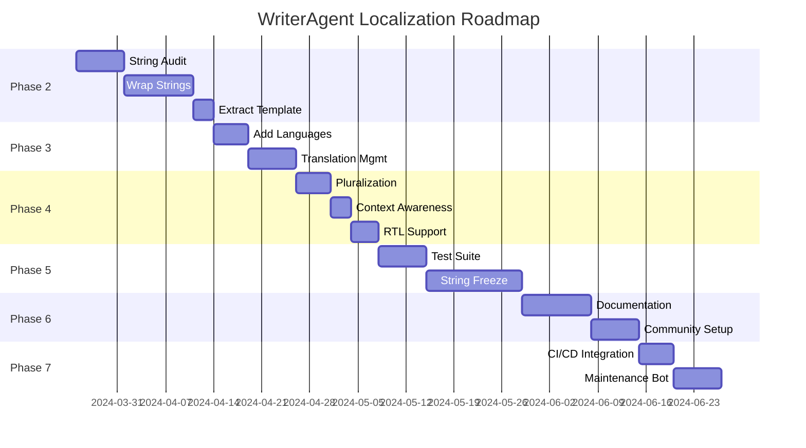

# WriterAgent Localization - Complete Implementation Plan

## Current Status (Localization Branch)

✅ **Phase 1 - Infrastructure Complete**
- `CONTRIBUTING.md` with translation workflow documentation
- Makefile targets: `extract-strings`, `add-language`, `compile-translations`
- Language selection UI in Settings dialog (`ui_language` config)
- Basic i18n module integration (`plugin/framework/i18n.py`)
- Initial string extraction and wrapping in core dialogs

## Phase 2 - Comprehensive String Extraction (NEXT PRIORITY)

### Task 2.1: Complete String Extraction Audit
**Owner: Jules/Agent-1**
**Files to Audit:**
```bash
# Find all Python files with user-facing strings
find plugin -name "*.py" -exec grep -l "msgbox\|add_dialog_\|Label\|Title\|status\|error" {} \;
```

**Specific Modules:**
- `plugin/modules/chatbot/panel*.py` - Chat UI strings
- `plugin/modules/http/*.py` - Error messages
- `plugin/framework/dialogs.py` - Dialog helpers
- `plugin/main.py` - Main menu items
- `plugin/modules/writer/ops.py` - Writer tool descriptions
- `plugin/modules/calc/*.py` - Calc tool descriptions

**Action Items:**
- [ ] Audit all `msgbox()` calls for user-facing text
- [ ] Check all dialog control labels and titles
- [ ] Review status messages and error texts
- [ ] Identify tool descriptions and help text

### Task 2.2: Wrap Remaining Strings
**Owner: Jules/Agent-2**
**Pattern:**
```python
# Before
msgbox(ctx, "Error", "File not found")

# After  
msgbox(ctx, _("Error"), _("File not found"))
```

**Priority Areas:**
1. Error messages (high visibility)
2. Status updates (frequent user interaction)
3. Tool descriptions (discoverability)
4. Settings labels (configuration)

### Task 2.3: Extract Strings to Template
**Owner: Jules/Agent-3**
```bash
# Extract all strings to template
make extract-strings

# Verify extraction
cat plugin/locales/writeragent.pot | grep -c "msgid"
```

**Validation:**
- [ ] All wrapped strings appear in `.pot` file
- [ ] No duplicate msgids
- [ ] Context comments added for ambiguous terms

## Phase 3 - Language Support Expansion

### Task 3.1: Add Core Language Files
**Owner: Jules/Agent-4**
```bash
# Add priority languages
make add-language LANG=es  # Spanish
make add-language LANG=de  # German  
make add-language LANG=fr  # French
make add-language LANG=zh  # Chinese
make add-language LANG=ja  # Japanese
make add-language LANG=ru  # Russian
make add-language LANG=pt  # Portuguese
make add-language LANG=it  # Italian
```

**Deliverables:**
- `.po` files created for each language
- `.mo` files compiled
- Language options added to Settings dropdown

### Task 3.2: Translation Management System
**Owner: Jules/Agent-5**

**Setup:**
- [ ] Create `plugin/locales/README.md` with translation guidelines
- [ ] Add language coverage tracking spreadsheet
- [ ] Set up Poedit project configuration
- [ ] Create translation memory (TM) from existing strings

**Process:**
```python
# Translation progress tracking script
import polib

def get_translation_stats(po_file):
    po = polib.pofile(po_file)
    return {
        'total': len(po),
        'translated': len([e for e in po if e.translated()]),
        'fuzzy': len([e for e in po if e.fuzzy]),
        'percentage': (len([e for e in po if e.translated()]) / len(po)) * 100
    }
```

## Phase 4 - Advanced Localization Features

### Task 4.1: Pluralization Support
**Owner: Jules/Agent-6**

**Implementation:**
```python
# In i18n.py
import gettext

def ngettext(singular, plural, n):
    """Handle plural forms correctly per language"""
    return gettext.ngettext(singular, plural, n)

# Usage
messages = ngettext(
    "%d file processed",
    "%d files processed",
    file_count
) % file_count
```

**Files to Update:**
- `plugin/framework/i18n.py` - Add pluralization functions
- `plugin/modules/chatbot/panel.py` - Update file operation messages
- `plugin/modules/writer/ops.py` - Update table/cell count messages

### Task 4.2: Context-Aware Translations
**Owner: Jules/Agent-7**

**Pattern:**
```python
# For ambiguous terms
msgctxt("verb")
msgid "Table"
msgstr "Tabellarisch"

msgctxt("noun")
msgid "Table"
msgstr "Tabelle"
```

**Ambiguous Terms to Disambiguate:**
- "Table" (noun vs verb)
- "Cell" (spreadsheet vs biology)
- "Draw" (verb vs Draw/Impress)
- "Style" (formatting vs fashion)

### Task 4.3: RTL Language Support
**Owner: Jules/Agent-8**

**CSS/UNO Adjustments:**
```python
# In dialog layouts
if is_rtl_language():
    # Adjust control positioning
    label_left = width - label_width - 10
else:
    label_left = 10
```

**Implementation:**
- [ ] Detect RTL languages from locale
- [ ] Adjust dialog control positioning
- [ ] Test with Arabic/Hebrew
- [ ] Add RTL CSS classes for HTML content

## Phase 5 - Testing & Validation

### Task 5.1: Localization Test Suite
**Owner: Jules/Agent-9**

**Test File:** `plugin/tests/test_localization.py`
```python
def test_all_strings_wrapped():
    """Verify no raw strings in UI code"""
    ui_files = find_ui_files()
    for file in ui_files:
        content = read_file(file)
        # Should not contain direct strings in UI calls
        assert not re.search(r'msgbox\([^_]"', content)
        assert not re.search(r'Label\s*=\s*"[^"]*"', content)

def test_translation_loading():
    """Test that translations load correctly"""
    for lang in ['en', 'es', 'de']:
        set_locale(lang)
        assert gettext.gettext("Cancel") == expected[lang]

def test_fallback_to_english():
    """Test fallback when translation missing"""
    set_locale('xx')  # Non-existent language
    assert gettext.gettext("Cancel") == "Cancel"
```

### Task 5.2: String Freeze Process
**Owner: Jules/Agent-10**

**Process:**
1. **Feature Complete**: All features implemented
2. **String Freeze**: No new msgids added
3. **Translation Sprint**: 2-week translation period
4. **Review**: Native speaker review
5. **Integration**: Merge translations

**Tools:**
- `msgmerge` for updating existing translations
- `msgattrib` for finding fuzzy translations
- `pology` for advanced checks

## Phase 6 - Documentation & Community

### Task 6.1: Translator Documentation
**Owner: Jules/Agent-11**

**Files to Create:**
- `docs/LOCALIZATION_GUIDE.md`
- `docs/TRANSLATION_STYLE_GUIDE.md`
- `plugin/locales/CONTRIBUTING.md`

**Content:**
- How to add a new language
- Translation best practices
- Style guide per language
- Testing translations
- Submitting PRs

### Task 6.2: Language Coverage Dashboard
**Owner: Jules/Agent-12**

**Dashboard:**
```markdown
| Language | Code | Translated | Fuzzy | Coverage | Maintainer |
|----------|------|------------|-------|----------|-----------|
| English | en | 100% | 0% | 100% | Core Team |
| Spanish | es | 85% | 5% | 90% | @jules |
| German | de | 72% | 8% | 80% | Needed |
| French | fr | 68% | 12% | 80% | @marie |
```

**Automation:**
```bash
# Generate coverage report
python scripts/translation_coverage.py > docs/TRANSLATION_STATUS.md
```

### Task 6.3: Community Outreach
**Owner: Marketing Team**

**Actions:**
- [ ] LibreOffice localization mailing list announcement
- [ ] GitHub issue template for translations
- [ ] Transifex/Crowdin setup (future)
- [ ] Hackathon/translation sprint
- [ ] Language-specific forums

## Phase 7 - Maintenance & Updates

### Task 7.1: Continuous Localization
**Owner: CI/CD Pipeline**

**GitHub Actions:**
```yaml
# .github/workflows/localization.yml
jobs:
  extract:
    runs-on: ubuntu-latest
    steps:
      - uses: actions/checkout@v4
      - run: make extract-strings
      - uses: actions/upload-artifact@v3
        with:
          name: writeragent.pot
          path: plugin/locales/writeragent.pot

  validate:
    needs: extract
    runs-on: ubuntu-latest
    steps:
      - uses: actions/download-artifact@v3
        with:
          name: writeragent.pot
      - run: python scripts/validate_translations.py
```

### Task 7.2: Translation Update Bot
**Owner: Jules/Agent-13**

**Bot Features:**
- Auto-comment on PRs with new strings
- Notify translators of changes
- Auto-merge translation updates
- Weekly translation status reports

## Implementation Timeline



## Success Metrics

**Phase 2:**
- 100% of UI strings wrapped with `_()`
- 0 raw strings in user-facing code
- Template contains 500+ msgids

**Phase 3:**
- 10 language files created
- 5 languages at >80% completion
- Translation process documented

**Phase 4:**
- Pluralization working for all languages
- Context disambiguation implemented
- RTL testing complete

**Phase 5:**
- 95% test coverage for localization
- 0 regressions in string freeze
- All translations validated

**Phase 6:**
- Complete documentation
- Active translator community
- 3+ maintained languages

**Phase 7:**
- Automated string extraction
- CI/CD pipeline operational
- Translation updates < 24h turnaround

## Agent Assignment Recommendations

**Immediate Next Steps (Week 1):**
1. **Agent-1**: String extraction audit (Task 2.1)
2. **Agent-2**: Wrap remaining strings (Task 2.2)  
3. **Agent-3**: Extract strings to template (Task 2.3)
4. **Agent-4**: Add core language files (Task 3.1)

**Week 2-3:**
5. **Agent-5**: Translation management system (Task 3.2)
6. **Agent-6**: Pluralization support (Task 4.1)
7. **Agent-7**: Context-aware translations (Task 4.2)
8. **Agent-8**: RTL language support (Task 4.3)

**Week 4+:**
9. **Agent-9**: Localization test suite (Task 5.1)
10. **Agent-10**: String freeze process (Task 5.2)
11. **Agent-11**: Translator documentation (Task 6.1)
12. **Agent-12**: Language coverage dashboard (Task 6.2)

## Resources Needed

**Tools:**
- Poedit (translation editor)
- gettext utilities
- pology (advanced checks)
- Transifex/Crowdin (future)

**Documentation:**
- GNU gettext manual
- LibreOffice localization guide
- Unicode CLDR for language data

**Community:**
- LibreOffice l10n mailing list
- Translator forums
- Language-specific communities

## Risk Mitigation

**String Changes During Development:**
- Feature freeze before string freeze
- Deprecate old strings, don't remove
- Maintain translation memory

**Translation Quality:**
- Native speaker review required
- Automated checks for common errors
- Context screenshots for translators

**Performance:**
- Lazy-load translations
- Cache compiled .mo files
- Minimize string lookups

## Long-Term Vision

**Phase 8 - Advanced Features (Future):**
- Machine translation fallback
- Community translation portal
- In-context translation editing
- Translation memory sharing
- Automated screenshot generation

**Phase 9 - Ecosystem Integration:**
- LibreOffice translation sharing
- Cross-project translation memory
- Professional translation services
- Localization hackathons
- University partnerships

---

**Next Immediate Action:** Start with Phase 2 - Comprehensive String Extraction
**Owner:** Jules to coordinate Agent-1, Agent-2, Agent-3
**Timeline:** Complete string wrapping within 7-10 days
