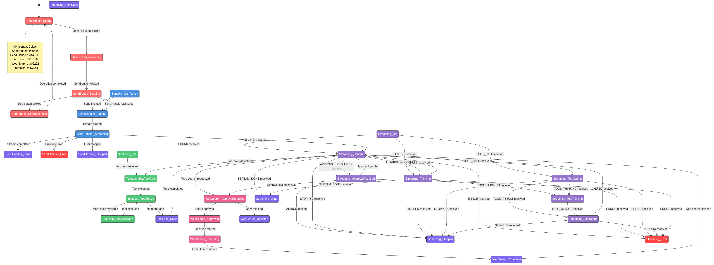

# WriterAgent

> [!IMPORTANT]
> **Please update to version 0.7.4.** Initial versions of WriterAgent did not include proper version information, meaning LibreOffice will never notify you that WriterAgent is out of date. Starting with version 0.7.2, the extension includes it, and a weekly update check to keep you informed of new releases. This version also includes many bug fixes and new features. Please update now to get the best experience and future notifications.

**Note:** We are excited to announce an official release of the extension! However, the [version on the LibreOffice site](https://extensions.libreoffice.org/en/extensions/show/99526) is **updated less frequently** than this repository. For the **newest builds with the latest features and fixes**, please use the GitHub release from this repo instead.


A LibreOffice extension (Python + UNO) that adds generative AI editing to Writer, Calc, and Draw.

**Development story:** Read the writeup of how WriterAgent was built [here](https://keithcu.com/wordpress/?p=5060).

[](https://deepwiki.com/KeithCu/writeragent)

> DeepWiki provides excellent analysis of the codebase, including visual dependency graphs.

## Features

WriterAgent provides powerful AI-driven capabilities integrated directly into your LibreOffice suite:

### 1. Local-First & Flexible
Unlike proprietary office suites that lock you into a single cloud provider and **send all your data to their servers**, WriterAgent is **local-first**. You can run fast, private models locally (via Ollama, LM Studio, or local servers) ensuring your documents never leave your machine. If you choose to use cloud APIs, you can switch between them in less than 2 seconds, maintaining full control over where your data goes.


## For the GPU-poor

If you don't have a powerful GPU, or an API key for LLMs, we encourage you to sign up for a service provider like [OpenRouter](https://openrouter.ai/collections/free-models) to access their extensive collection of free AI models. As they state on their platform:

> "At OpenRouter, we believe that free models play a crucial role in democratizing access to AI. These models allow hundreds of thousands of users worldwide to experiment, learn, and innovate."

Please note, the prompts to free models are often saved and used for training purposes.

Another option is [Together.AI](https://www.together.ai/), which also has a variety of high-performance and intelligent cost-effective models with a generous, private,  free tier.


### 2. Intelligent Document Interaction
More than just a chatbot, this is a "Document Agent." It doesn't just read your text; it understands the structure—headings, bookmarks, cell ranges, and styles. **Its primary job is to act on your behalf**, performing complex edits that would otherwise take dozens of manual clicks.

#### Features & Performance
*   **Sidebar Panel**: A dedicated deck in the right sidebar for multi-turn chat. It supports tool-calling to read and edit the document directly. Chat history is automatically saved and restored using an ID, ensuring the conversation follows the document even if renamed or moved.
*   **Responsive streaming & interleaved tools**: A background thread and queue keep the LibreOffice UI responsive  while reasoning, text, and multi-turn tool calls stream and execute.
*   **Nested tool-calling API**: The full LibreOffice API would overwhelm any model, and bloat context, so the tool-calling is broken up into a simple API with commonly used-tools, and specialized toolsets that model can request to switch into. Via this design, the extension currently supports: rich text and page layout, shapes, charts, bookmarks, fields, footnotes, forms, comments, and track-changes. See **[docs/writer-specialized-toolsets.md](docs/writer-specialized-toolsets.md) and [Calc specialized toolsets](docs/calc-specialized-toolsets.md)** for details and current status.
*   **Audio Recording**: Integrated cross-platform voice support directly in the sidebar.
*   **Image Generation**: Generate from chat or edit selected images (Img2Img) using AI Horde or your configured endpoint.
*   **Calc =PROMPT() Function**: Run AI prompts directly within spreadsheet cells.
*   **Librarian onboarding agent**: For new users, a Librarian / Welcome sub-agent chats with the user to learn preferences (name, tone, etc.) and uses the `upsert_memory` tool to store them.
*   **Multilingual & HiDPI**: Ships with the interface translated into 9 languages (Spanish, French, Portuguese, Russian, German, Japanese, Italian, Polish, and English) and optimized for modern high-resolution displays using device-independent units.
*   **LibreOffice Resource**: Many models know LibreOffice well, so you can ask questions like: *What is the page gutter feature?*

#### Showcase
Hermes-Agent with Claude Opus 4.6 and the Web Research sub-agent:


Opus 4.6 one-shotted this Arch Linux resume:

Sonnet 4.6 one-shotted this "pretty spreadsheet"


### 3. Web Research & Fact-Checking (Local & Private)
Powered by [Hugging Face smolagents](https://github.com/huggingface/smolagents) (vendored and adapted to have zero dependencies, per [this discussion](https://github.com/huggingface/smolagents/issues/1999)). Now you can ask the AI a question and it will search the web and give you the answer—with all requests running directly from your computer. It uses DuckDuckGo for privacy and executes the entire search-and-browse loop locally, ensuring your research stays private.

It's better than a standard Google search box because it understands natural language and can synthesize information from multiple pages.
*   **Ask a question**: "What is the current version of Python and when was it released?"
*   **Complex Tasks**: "Write a long and pretty summary of After the Software Wars, according to Wikipedia."
*   **Real-time Data**: Ask it to find the current price of a specific item and it can update your document with current data.

### 4. Extend & Edit Selection (Writer)
Two Writer shortcuts act on the current selection:

*   **Extend selection** (`Ctrl+Q`): The model continues the selected text. Ideal for drafting emails, stories, or generating lists.
*   **Edit selection** (`Ctrl+E`): Prompt the model to rewrite your selection according to specific instructions (e.g., "make this more formal", "translate to Spanish").

### 5. High-Fidelity Editing & Formatting
WriterAgent is "format-aware." Unlike simpler plugins that strip away your hard work, our engine is designed to respect your document's visual integrity.

*   **Format Preservation**: When fixing typos or rephrasing, WriterAgent uses a "surgical" replacement method. It preserves your existing bold, italics, highlights, and font sizes—even if the AI sends back plain text.
*   **HTML-First Architecture**: For complex elements like tables, nested lists, and colored layouts, we use a robust HTML import layer. This ensures that what the AI "sees" and what it "writes" matches the professional standards of LibreOffice.
*   **Legacy Support**: Optimized to work perfectly even on older versions of LibreOffice (pre-26.2) where native Markdown support is unavailable.

### Ongoing Challenge: Styles vs. Custom Formatting
One of the unique challenges of building an AI assistant for a rich word processor, unlike a plain-text code editor, is the multiple ways of applying formatting. Eventually, we will encourage models to output properly classed HTML that maps to your LibreOffice template. See [LLM_STYLES.md](LLM_STYLES.md).

### 6. MCP Server (Optional)
When enabled in **WriterAgent > Settings**, an HTTP server runs on localhost and exposes the same Writer/Calc/Draw tools to external AI clients (Cursor, Claude Desktop, etc.).

*   **Real-time Sidebar Monitoring**: All MCP activity (requests and tool results) is logged in real-time in the sidebar.
*   **Targeting**: Clients target a document via the **`X-Document-URL`** header.
*   **Hybrid AI Orchestrator Model**: This exposes the entire toolset to external agents while maintaining the document as the single source of truth.

### 7. Agent Backends
You can plug in **external agent backends** so that Chat with Document uses an external process (e.g. Hermes or others) instead of the built-in LLM.

*   **[Hermes ACP Integration](https://github.com/NousResearch/hermes-agent)**: Spawns Hermes locally as a subprocess using the Agent Communication Protocol (ACP) via stdio.
*   **HITL (Approve/Reject)**: If a backend requests approval for a tool call, a dialog appears for the user.

## Built for Professional Reliability

WriterAgent is engineered like a standalone application, prioritizing stability.

*   **Engineered with Finite State Machines**: Complex AI interactions are managed by a Finite State Machine (FSM). This architectural choice breaks down the extension's behavior into small, isolated, and highly testable units of logic. This ensures that multi-turn tool calling is predictable and robust, even as the codebase grows.
*   **Modern Software Standards**: Advanced static type checking and a comprehensive test suite.



## Credits & Collaboration

WriterAgent stands on the shoulders of giants. We'd like to give massive credit to:

**[LibreCalc AI Assistant](https://extensions.libreoffice.org/en/extensions/show/99509)**

Their pioneering work on AI support for LibreOffice provided the foundation and inspiration for our enhanced Calc integration. We've built upon their excellent tools to create more ambitious and performance-oriented spreadsheet features. We sent multiple emails thanking them and asking to work together but haven't heard back.

**[LibreOffice MCP Extension](https://github.com/quazardous/mcp-libre)**

Their work on an embedded MCP (Model Context Protocol) server for LibreOffice was an invaluable reference for expanding WriterAgent's Writer tool set. From their project we adapted production-quality UNO implementations for style inspection, comment management, track-changes control, and table editing — resulting in 12 new Writer tools now available to WriterAgent's embedded AI. We also used their patterns for server lifecycle, health-check probing, and port utilities when we added WriterAgent's built-in MCP HTTP server. We're grateful for the high-quality open work.

**[Hermes Agent](https://github.com/NousResearch/hermes-agent)**

Their client-side tool call parsers (from `environments/tool_call_parsers/`) provide the core logic adapted in our `plugin/contrib/tool_call_parsers/` sub-module, allowing local inference models (Hermes, Mistral, Llama, DeepSeek) to trigger structured tool loops via raw text streams.

## Performance & Batch Optimizations

To handle complex spreadsheet tasks, WriterAgent is optimized for high-throughput "batch" operations:

*   **Batch Tool-Calling**: Instead of making one-by-one changes, tools like `write_formula_range` and `set_cell_style` operate on entire ranges in a single call.
*   **High-Volume Insertion**: The `write_formula_range` tool allows the AI to generate and inject large CSV datasets instantly. This is orders of magnitude faster than inserting data cell-by-cell; we found that providing these batch tools encourages the AI to perform far more ambitious spreadsheet automation and data analysis.
*   **Optimized Ranges**: Formatting and number formats are applied at the range level, minimizing UNO calls and ensuring the UI remains fluid even during heavy document analysis.

## Recent Progress & Benchmarks (Apr 2026)

<details>
<summary><b>Click to expand: LLM Evaluation Suite & Efficiency Rankings</b></summary>

We have recently integrated an internal **LLM Evaluation Suite** directly into the LibreOffice UI. This allows users and developers to benchmark models across 10 (so far) real-world tasks in Writer, Calc, and Draw, tracking both accuracy and **Intelligence-per-Dollar (IpD)**. By fetching real-time pricing from OpenRouter, the system calculates the exact cost of every AI turn and ranks backends by **Value (C²/$)**—average correctness squared, divided by average dollars per run (higher is better).

### Intelligence per dollar (higher is better)

| Rank | Model | Avg correctness | Avg score | Avg tokens | Avg cost ($) | Value (C²/$) |
|------|-------|-----------------|-----------|------------|--------------|-------------|
| 1 | openai/gpt-oss-120b | 0.980 | 0.942 | 3767.1 | 0.00025 | 3827.240 |
| 2 | google/gemini-3-flash-preview | 0.890 | 0.860 | 2957.2 | 0.00035 | 2234.257 |
| 3 | qwen/qwen3.5-9b | 0.730 | 0.691 | 4645.0 | 0.00050 | 1068.806 |
| 4 | nvidia/nemotron-3-nano-30b-a3b | 0.922 | 0.851 | 7195.5 | 0.00082 | 1037.536 |
| 5 | mistralai/devstral-2512 | 0.980 | 0.950 | 3000.8 | 0.00154 | 623.434 |
| 6 | inception/mercury-2 | 0.948 | 0.896 | 5150.9 | 0.00160 | 562.405 |
| 7 | minimax/minimax-m2.7 | 0.990 | 0.943 | 4671.9 | 0.00191 | 512.581 |
| 8 | deepseek/deepseek-v3.2 | 0.985 | 0.909 | 7575.4 | 0.00206 | 470.222 |
| 9 | qwen/qwen3.5-35b-a3b | 0.990 | 0.933 | 5671.1 | 0.00220 | 445.760 |
| 10 | x-ai/grok-4.1-fast | 0.950 | 0.886 | 6431.9 | 0.00204 | 442.733 |
| 11 | qwen/qwen3.5-27b | 0.993 | 0.942 | 5049.9 | 0.00259 | 380.538 |
| 12 | qwen/qwen3.5-122b-a10b | 0.990 | 0.950 | 3958.8 | 0.00308 | 318.312 |
| 13 | nvidia/nemotron-3-super-120b-a12b:free | 0.757 | 0.696 | 6388.4 | 0.00181 | 317.859 |
| 14 | allenai/olmo-3.1-32b-instruct | 0.323 | 0.306 | 1912.4 | 0.00046 | 226.704 |
| 15 | z-ai/glm-5.1 | 0.890 | 0.843 | 4677.8 | 0.00524 | 151.141 |

---

### Key Benchmarking Insights (Apr 2026)

**Quadratic utility** (Value = C² ÷ average USD per run) on hardened, realistic Writer tasks highlights a few patterns that raw “accuracy only” tables can hide:

#### 1. Verbosity vs. average cost (Qwen 35B vs 122B)
**Qwen 3.5-35B-A3B** (rank 9) uses more tokens per run on average (**~5,671**) than **Qwen 3.5-122B-A10B** (rank 12, **~3,959**), but its lower **average cost per run** (**~\$0.00220** vs **~\$0.00308**) still yields a higher **Value (C²/$)** (**~446** vs **~318**). Token count alone does not determine dollar efficiency; list pricing and usage patterns interact.

#### 2. C² punishes unreliable “cheap” runs
**OLMo 3.1 32B Instruct** (rank 14) shows **~0.32** average correctness—squaring it crushes value despite a low **~\$0.00046** average cost. **Nemotron 3 Super 120B (free)** (rank 13) sits at **~0.76** correctness with mediocre value, a reminder that “free” or inexpensive is not enough when quality collapses.

#### 3. Value leader: GPT-OSS 120B
**openai/gpt-oss-120b** (rank 1) pairs **~0.98** average correctness with a very low **~\$0.00025** average cost per run, for **Value (C²/$) ≈ 3827**. **Google Gemini 3 Flash** (rank 2) remains a strong second (**~0.89** correctness, **Value ≈ 2234**) on this snapshot.

#### 4. Near-ceiling accuracy in the mid-pack
**Qwen 3.5-27B** (rank 11) reaches **~0.993** average correctness—among the highest in the table—while **x-ai/grok-4.1-fast** (rank 10) sits at **~0.95** with similar average cost. Both are useful “accuracy-first” options when the ranking metric is dominated by models with even lower **$/run** at the top.

This benchmarking framework is used to tune system prompts and select the best-performing models for local-first office automation. Details: [scripts/prompt_optimization/README.md](scripts/prompt_optimization/README.md).

**Sophisticated LLM-as-a-Judge Scoring.** We have moved beyond simple keyword matching to a nuanced, multi-dimensional evaluation system. A high-tier "Teacher" model (typically **Claude Sonnet 4.6**) generates gold-standard answers, while a specialized "Judge" model (**Grok 4.1 Fast**) evaluates performance using a weighted rubric.

This framework allows us to differentiate between "Flash" models that prioritize speed and "Frontier" models that possess the "taste" and refinement needed for professional documents.

**Fine-tuning.** An interesting direction is to **fine-tune a model** specifically for this tool set and task distribution: the same correctness could potentially be achieved with fewer reasoning steps and fewer tokens, improving both latency and Value (C²/$). The existing eval and dataset are a natural training signal (correct vs incorrect tool use, minimal vs verbose traces).
</details>

## Getting started

### Installation
1. Download the latest `.oxt` file from the [releases page](https://github.com/KeithCu/writeragent/releases).
2. Double-click the downloaded `.oxt` file to install it in LibreOffice, then restart LibreOffice if prompted.

### Backend setup
WriterAgent requires an OpenAI-compatible backend. Recommended options:
*   **Ollama**: [ollama.com](https://ollama.com/) (easiest for local usage)
*   **text-generation-webui**: [github.com/oobabooga/text-generation-webui](https://github.com/oobabooga/text-generation-webui)
*   **OpenRouter / OpenAI**: Cloud-based providers.

### Settings
Configure your endpoint, model, and behavior in **WriterAgent > Settings**. The dialog includes **Chat/Text** (endpoint, models, API key, etc.), **Image Settings** (size, aspect ratio, AI Horde options), **Http** (MCP server), **Agent backends**, and other tabs generated from the extension modules.

*   **Endpoint URL**: e.g., `http://localhost:11434` for Ollama.
*   **Additional Instructions**: A shared system prompt for all features with history support.
*   **API Key**: Required for cloud providers.
*   **Connection Keep-Alive**: Automatically enabled to reduce latency.
*   **MCP Server**: On the **Http** tab; when enabled, an HTTP server runs on the configured port (default 8765) for external AI clients. Use **Toggle MCP Server** and **MCP Server Status** from the menu.
*   **Agent backends**: On the **Agent backends** tab; enable an external backend (Aider or Hermes) so Chat uses that agent instead of the built-in LLM. Paths and arguments are optional per backend.

For detailed configuration examples, see [CONFIG_EXAMPLES.md](CONFIG_EXAMPLES.md).

## Contributing

### Local Development

**Prerequisites:** Python 3.11+, [uv](https://docs.astral.sh/uv/), PyYAML (`uv pip install pyyaml`), and LibreOffice with `unopkg` on your PATH. Run `make check-setup` to verify.

Alternatively, use Docker to build with no local dependencies (see `make docker-build`).

```bash
# Clone the repository
git clone https://github.com/KeithCu/writeragent.git
cd writeragent

# Build the extension package (.oxt)
make build

# Full dev cycle: build + reinstall + restart LibreOffice + show log
make deploy

# Or for fast iteration: symlink the project into LO extensions (no rebuild needed)
make dev-deploy

# Run typecheckers (ty, mypy, pyright) then tests
make test

# See all available targets
make help
```


## License
WriterAgent is released under the **GNU General Public License v3 (or later)**. See `LICENSE` for the full text.

### History & Attribution
WriterAgent was originally released under the **MPL 2.0** license. In 2026, it was transitioned to GPL v3 to ensure stronger protection for user freedoms and better compatibility with modern Python libraries.

Copyright (c) 2024 John Balis
Copyright (c) 2025-2026 quazardous (config, registries, build system)
Copyright (c) 2026 LibreCalc AI Assistant (Calc integration features, originally MIT)
Copyright (c) 2026 KeithCu (modifications and relicensing)

