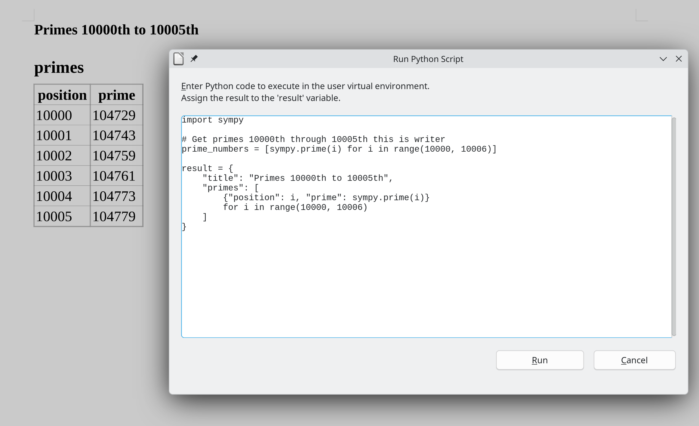

# WriterAgent


[](https://www.gnu.org/licenses/gpl-3.0.html)
[](https://www.python.org/downloads/)
[](https://www.libreoffice.org/)
[](https://github.com/KeithCu/writeragent/releases)

A LibreOffice extension that adds agentic AI and NumPy features.

---

## ⚡ Quick Start

1. **Install**: Download `.oxt` from [Releases](https://github.com/KeithCu/writeragent/releases), double-click to install
2. **Configure**: Open **WriterAgent > Settings** in LibreOffice
3. **Set Backend**: Enter endpoint (e.g., `http://localhost:11434` for Ollama) and model
4. **Chat**: Open sidebar with **View → Sidebar → WriterAgent** or use **Ctrl+Q** / **Ctrl+E** shortcuts

---

## 📑 Table of Contents

- [Local-First & Flexible](#local-first--flexible)
- [Powerful Feature Suites](#powerful-feature-suites)
- [Web Research & Fact-Checking](#web-research--fact-checking)
- [High-Fidelity Editing & Formatting](#high-fidelity-editing--formatting)
- [MCP Server](#mcp-server-optional)
- [Agent Backends](#agent-backends)
- [Architecture](#architecture)
- [Roadmap & Future Vision](#roadmap--future-vision)
- [Credits & Collaboration](#credits--collaboration)
- [Installation & Setup](#installation--setup)
- [Contributing](#contributing)
- [License](#license)

---

## Local-First & Flexible

Unlike proprietary office suites that lock you into a single cloud provider and send all your data to their servers, WriterAgent is local-first. You can run fast, private models locally (via Ollama, LM Studio, or local servers) ensuring your documents never leave your machine. If you choose to use cloud APIs, you can switch between providers (e.g., OpenRouter, Together.AI) in seconds, maintaining full control over your data.

---

## Core Features

### 🖋️ Writer

- **LLM-facing Writer APIs**: **9 core** tools for everyday chat plus **dozens of specialized** UNO-backed tools. The main model keeps a small default list  while [`domain-scoped sub-agents`](docs/writer-specialized-toolsets.md) unlock deep APIs for [page layout](docs/page-api-reference.md), [shapes](docs/shape_support.md), charts, [bookmarks](docs/bookmarks-api-reference.md), fields, [footnotes](docs/footnotes-api-reference.md), [track changes](docs/writer-tracking-api-reference.md), indexes, forms, and more—so models run **multi-step document automation**, not just rewrite paragraphs.
- **Format Preservation**: Uses a "surgical" replacement method that preserves existing bold, italics, highlights, and font sizes.
- **Agentic Analysis**: The AI can run Numpy computations and return structured results (as JSON) to update your document.
- **Real-time Grammar & Style Checker**: An asynchronous proofreader with a **sentence cache** and **Unicode-aware splitting**. Includes **Token-aware Overlap Repair** to fix "LLM slop" and ensure surgical replacements. Persistent storage of good/bad sentences with document. Supports multiple backends configurable in **Settings → Doc → Enable grammar checker (Writer)**:
  - **AI (LLM):** Cloud or local AI models/API.
  - **[LanguageTool](https://languagetool.org) (Local):** Offline grammar server running locally.
  - **[Vale](https://vale.sh) (Local Style) (WIP):** Style guides checker (Google, Microsoft, write-good).
  - **[Harper](https://github.com/Automattic/harper) (Local Rust):** Lightning-fast offline Rust-backed grammar linter.
  Underlines appear shortly after you pause typing.
- Optional **sentence language detection**: **Local (langdetect)** uses `langdetect` in your configured Python venv (embeddings worker) to auto-fix wrong `CharLocale` and then grammar-check in the right language; **AI (LLM)** uses the chat API for the same step. Set **Settings → Doc → Sentence language detection**. [Read the Plan](docs/realtime-grammar-checker-plan.md).
- **Rich-text sidebar**: Hosts a rich text control in the sidebar. Off by default.
- **Math & LaTeX**: **MathML** and **TeX** delimiters are automatically turned into **editable LibreOffice Math formulas** (OLE objects). Use `\(...\)` / `$...$` for inline and `$$...$$` / `\[...\]` for display in chat or HTML content; prefer `\(...\)` over bare `$` near numbers. See [docs/math-tex.md](docs/math-tex.md).
- **Symbolic Math (SymPy)**: **Math Helpers** — `solve_equation`, `symbolic_simplify`, `integrate`, `differentiate`. Results insert as **editable LibreOffice Math** objects.
- **Charts from Python**: Matplotlib figures from **Viz Helpers** or custom scripts insert as inline images.
- **Text Analytics (spaCy)**: Readability metrics, named entities (NER), and key phrases for Writer documents. Use **WriterAgent → Text Analytics…** (with Readability (doc/sel), Entities, Key Phrases, Insert report). Requires `spacy` + `textdescriptives` + a model in the venv configured in Settings → Python.

### 📊 Calc

- **=PROMPT() Function**: Run AI prompts within spreadsheet cells.
- **=PY() / =PYTHON() Function**: Run Python/NumPy within spreadsheet cells: `=PY("sp.prime(data)", A10)`. Supports multi-range inputs (e.g., `=PY("np.mean(data)", A1:A10, C1:C10)`) and auto-unpacks single-cell inputs to Python scalars. The `data` variable contains the cell values, dynamically injected at runtime. Returns can include lists/dicts of figures (multiple images) or DataFrames. Return semantics: `None` → empty cell; `float("nan")` / `np.nan` → Calc error cell (`#NUM!` / `#VALUE!`, cascades). Use `np.nanmean` / `np.nansum` etc. when input contains blanks. See [Data Handoff Guide](docs/enabling_numpy_in_libreoffice.md#data-handoff-and-shaping) and [Empty cells vs NaN](docs/calc-blanks-vs-nans.md).
- **Automatic spill (Calc)**: On by default (Settings → Python → "Python auto spill in Calc"). A single-cell `=PYTHON()` returning a list, 2D array, or DataFrame automatically spills the result into adjacent cells. Blocked cells produce `#SPILL!` in the formula cell. Spill locations are saved in the document (persistent across reloads). Explicit matrix formulas (Ctrl+Shift+Enter) and per-row index arguments remain available for manual control.
- **Trusted Calc helpers**: via `analyze_data`, chat delegation, and **Tools → Run Python Script** — set **Data** range where applicable.

| Domain       | Helpers                                                                                    | Notes                                                                                                                                                                                         |
| ------------ | ------------------------------------------------------------------------------------------ | --------------------------------------------------------------------------------------------------------------------------------------------------------------------------------------------- |
| **Analysis** | 14 trusted helpers ([detail](#analysis-helpers-detail)) + `calc_goal_seek`, `calc_solver`  | **Run Python Script → Analysis Helpers**; `numpy`/`pandas`/`scipy`/… stack. [Analysis Tools](docs/calc-analysis-tools.md) · [Architecture](docs/analysis-sub-agent.md)                        |
| **Viz**      | `quick_plot`, `correlation_heatmap`, `time_series_plot`                                    | Charts insert on sheet; `=PY()` / matplotlib same; multi-figure lists/dicts. `matplotlib`, `seaborn`. [Visualization](docs/numpy-domains.md#visualization)                                    |
| **Math**     | `solve_equation`, `symbolic_simplify`, `integrate`, `differentiate`                        | SymPy; inserts editable LO Math. `sympy`                                                                                                                                                      |
| **Quant**    | `fetch_historical_data`, `technical_analysis`, `portfolio_tearsheet`, `efficient_frontier` | `yfinance`, `pandas-ta`, `quantstats`, `pyportfolioopt`                                                                                                                                       |
| **Optimize** | `optimize_portfolio`, `linear_programming`, `solve_scheduling_problem`                     | `scipy.optimize`. [Optimization](docs/numpy-domains.md#optimization)                                                                                                                          |
| **Units**    | `convert_quantity`, `parse_quantity`, `format_quantity`, `check_dimensionality`            | Calc: single formatted cell by default (`36 km/h`); `output_style: "detailed"` for grid. Beyond `CONVERT()` for compound units. `pint`. [Units](docs/numpy-domains.md#data-engineering-units) |

- **Rich Text Cells**: Paste **HTML** (bold, links, breaks) into a **single cell** using advanced StarWriter import paths.
- **Batch Range Edits**: Apply formulas and formatting in bulk. [Specialized Toolsets](docs/calc-specialized-toolsets.md).
- **Advanced Features**: [Conditional Formatting](docs/calc-conditional-formatting.md) and [Sheet Filtering (AutoFilter)](docs/calc-sheet-filter.md).
- **Spreadsheet → Python conversion:** Run **WriterAgent → Convert Sheet to Python…** on an open Calc sheet (or selection) to rewrite spreadsheet formulas as `=PY()` / `=PYTHON()` while **constants, text, dates, and formats stay unchanged**. A deterministic translator covers **235+ Calc functions**—aggregates, logic, lookups (`VLOOKUP`, `XLOOKUP`), dates, financial, statistical, database, and array helpers—emitting NumPy/pandas/`xl.*` Python with precedent ranges wired as explicit `data` arguments so Calc’s recalc graph stays correct. Optional **column vectorization** collapses repeated fill-down patterns; output defaults to a **new sheet** with an optional **verify recalc** pass and a **conversion report** for any formulas left as Calc (e.g. `INDIRECT`, array formulas). Details: [Calc Spreadsheet → Python Import](docs/calc-spreadsheet-to-python-import.md).

### 🌐 Multi-modal & Research

- **Web Research**: Powered by a vendored **smolagents** loop. [Web Research Loop](docs/agent-search.md) & [Search Integration](docs/search-engine-integration.md).
- **Audio & Voice**: Integrated cross-platform voice recording (requires `sounddevice` in your external venv). [Audio Architecture](docs/audio-architecture.md).
- **Image Generation**: Generate or edit (Img2Img) images. [Image Generation Guide](docs/image-generation.md).
- **Local OCR (Writer & Calc)**: Extract text and layout from embedded images offline via **Docling** — no cloud vision API required. **Run Python Script → Vision Helpers** — `extract_text` (Writer: inserts at cursor; Calc: sheet report below the image). **Packages:** `docling`, `rapidocr-paddle`, `numpy`, `pillow`, `onnxruntime` (required for default RapidOCR), and optional `paddleocr`, `paddlepaddle` fallback. Settings: **WriterAgent → Vision OCR Settings…** for pipeline defaults; **Settings → Python** for venv path and **Test**. [Image recognition design](docs/image-recognition.md).

### 🧠 The Intelligence Core (LO-DOM)

- **Document Object Model (LO-DOM)**: A recursive model that understands structural relationships. [LO-DOM Semantic Tree](docs/lo-dom-semantic-tree.md).
- **Persistent Memory**: [Hermes Agent Patterns (memory & skills)](docs/hermes-agent-patterns.md) and [Librarian Onboarding](docs/librarian-agentic-onboarding.md).
- **34 Locales**: Automated AI-driven translation and review pipeline. [Localization Pipeline](docs/localization.md).
- **Multilingual Grammar & language detection**: When the AI grammar checker is on, optional **sentence language detection** can verify each complete sentence against the document locale, **auto-switch** the paragraph language when you typed in the wrong one, and **re-run grammar checking** in the correct language. **Local (langdetect)** requires **Settings → Python** venv with `langdetect` installed (same venv as embeddings). Use **AI (LLM)** instead if you prefer your chat model for detection. Configure **Settings → Doc → Sentence language detection** (`Off` / `AI (LLM)` / `Local (langdetect)`).
- **Cross-Document Research**: Say **my** or **our** in the sidebar (e.g. *“pull Q4 from our budget spreadsheet”*) to read other files in the same folder as your saved document; edits stay on the active doc.
- **Optional folder search cache** (off by default; enable **Embeddings + FTS** in **Settings → Vector Search**) builds beside your documents in `writeragent_embeddings/` (supports both ODF and OOXML formats, and old binary (DOC) formats: one `**corpus.db`** (FTS5 + sqlite-vec). Experimental backends: [Zvec](https://github.com/alibaba/zvec) and [LanceDB](https://github.com/lancedb/lancedb). Default model is `**paraphrase-multilingual-MiniLM-L12-v2**` for multilingual support. LLMS use `**search_nearby_files**` — keyword (BM25/NEAR) and semantic hits merged with **Reciprocal Rank Fusion** (RRF). [Multi-document plan](docs/multi-document-dev-plan.md) · [Embeddings & hybrid search](docs/embeddings.md). **Venv packages:** `sentence-transformers numpy sqlite-vec langgraph langchain-core langchain-text-splitters envwrap odfpy`.

### 🐍 Local Python Execution

- **Run Python Script**: **Tools → Run Python Script…** — built-in sections **Analysis**, **Viz**, **Math**, **Units**, **Quant**, **Optimize**, **Vision**, **SQL** (DuckDB; folder files + live/named Calc ranges; requires `duckdb` in venv) (set **Data** range where applicable, edit `params` if needed, run). Configure venv in **Settings → Python**. SQL is also available to the chat analysis sub-agent via `query_folder_sql`.
- **Monaco Editor UI Packages**: `pywebview`, `rocher`, `jedi`, `PyQt6`, `PyQt6-WebEngine`, `qtpy` (Monaco editor HTML/JS/CSS + runtime served from `rocher` in the venv). Use the **Test** button in Settings to see which packages are installed.
- **Shared Code Cell**: Store your code in a cell (e.g., `A1`) and reference it across multiple formulas (e.g., `=PY($A$1; B1)`).
- **Shared Kernel**: Keeps a persistent, single global Python namespace per Calc workbook across all `=PY()` cells. This allows cells to share variables, imports, and state, mimicking Jupyter notebook behavior. Enable it in **Settings → Python → Python session mode → Shared kernel**, and use **WriterAgent → Reset Python Session** to clear variables for the active workbook.
- **Initialization Scripts**: Run a workbook startup script once per workbook in a dedicated initialization session (even when session mode is Isolated) to handle expensive setup or seed global constants. Edit it via **WriterAgent → Edit Initialization Script…** (Calc only).
- **Document-Attached Scripts**: Save and manage Python scripts directly inside document custom properties rather than just in your personal user-profile library. This ensures your custom scripts travel with the document when shared. Access this in the script run dialog under "This Document" to attach, save, or run document-backed scripts.
- **Safety & Isolation**: Code runs safely in a separate process and is evaluated by a [custom AST-based executor](plugin/contrib/smolagents/local_python_executor.py) (adapted from [Hugging Face smolagents](https://github.com/huggingface/smolagents)) that acts as a secure sandbox which blocks dangerous modules (like `os`, `subprocess`, or `sys`) and functions (like `eval` or `exec`), ensuring that the AI can only perform safe, mathematical, and data-processing tasks.
- **High performance**: Compact pickle Protocol 5 + Split-grid [binary blob serialization for numbers](docs/numpy-serialization.md), 50x faster and 60% smaller than standard JSON lists.
- **Auto-imported Packages**: `numpy` (as `np`), `pandas` (as `pd`), `sympy` (as `sp`), standard library `math`, `datetime`, `re`, `random`, `statistics`, `collections`, `itertools`, `json`, and `csv` are auto-imported to avoid needing manual imports.

**Analysis helpers (detail)**

| Helper                               | Purpose                                            |
| ------------------------------------ | -------------------------------------------------- |
| `describe_data`                      | Extended EDA + column quality                      |
| `kpi_summary`                        | Aggregate mean/min/max/sum for metrics             |
| `detect_outliers`                    | IQR, z-score, or isolation forest                  |
| `quick_stats`                        | Compact metric card                                |
| `format_currency` / `format_percent` | Display formatters                                 |
| `clean_and_prepare`                  | Dedupe, simple imputation                          |
| `pivot_aggregate`                    | Pivot table wrapper                                |
| `group_summary`                      | Group-by aggregates                                |
| `compare_periods`                    | YoY/QoQ/MoM comparisons                            |
| `correlation_matrix`                 | Top correlated pairs                               |
| `run_regression`                     | OLS via statsmodels                                |
| `cluster_numeric`                    | KMeans centroids                                   |
| `monte_carlo`                        | Monte Carlo resampling                             |
| `calc_goal_seek`                     | Single-variable what-if (native Calc, no venv)     |
| `calc_solver`                        | Constrained optimization on formulas (native Calc) |

### 🎨 Showcase

| Feature                                   | Screenshot                                                          |
| ----------------------------------------- | ------------------------------------------------------------------- |
| **Hermes + Opus 4.6 (Web Research)**      |   |
| **Arch Linux Resume**                     |                        |
| **Spreadsheet Dashboard**                 |     |
| **Math Expressions**                      |                               |
| **Python in LibreOffice**                 |               |
| **Sonnet diagram of an Arch Linux deity** |               |

---

## Web Research & Fact-Checking

Private, local web searches and fact-checking. Powered by [Hugging Face smolagents](https://github.com/huggingface/smolagents) (vendored and adapted to have zero dependencies, per [this discussion](https://github.com/huggingface/smolagents/issues/1999)). Now you can ask the AI a question and it will search the web and give you the answer—with all requests running directly from your computer. It uses DuckDuckGo for privacy and executes the entire search-and-browse loop locally, ensuring your research stays private.

It's better than a standard Google search box because it understands natural language and can synthesize information from multiple pages.

- **Ask a question**: "What is the current version of Python and when was it released?"
- **Complex Tasks**: "Write a summary of After the Software Wars."
- **Real-time Data**: Ask it to find the current price of a specific item and it can update your document with current data.

---

## High-Fidelity Editing & Formatting

- **Two-Layer Editing**: Basic grammar fixes first, then detailed "add comment" feedback.
- **Formatting Preservation**: Maintains styles, tables, and images during edits.

WriterAgent is "format-aware." Unlike simpler plugins that strip away your hard work, our engine is designed to respect your document's visual integrity.

- **Format Preservation**: When fixing typos or rephrasing, WriterAgent uses a "surgical" replacement method. It preserves your existing bold, italics, highlights, and font sizes—even if the AI sends back plain text.
- **HTML-First Architecture**: For complex elements like tables, nested lists, and colored layouts, we use a robust HTML import layer. This ensures that what the AI "sees" and what it "writes" matches the professional standards of LibreOffice.
- **Legacy Support**: Optimized to work perfectly even on older versions of LibreOffice (pre-26.2) where native Markdown support is unavailable.
- **Tracked Changes Support**: Proper handling of tracked deletions, and streamed rewrite with single-undo.

One of the unique challenges of building an AI assistant for a rich word processor, unlike a plain-text code editor, is the multiple ways of applying formatting. Eventually, we will encourage models to output properly classed HTML that maps to your LibreOffice template. See [LLM_STYLES.md](LLM_STYLES.md) and [Styles & Formatting](docs/llm-styles.md).

---

## MCP Server (Optional)

Enable integration with [Model Context Protocol (MCP)](https://github.com/modelcontextprotocol) for advanced AI workflows.

When enabled in **WriterAgent > Settings**, an HTTP server runs on localhost and exposes the same Writer/Calc/Draw tools to external AI clients (Cursor, LM Studio, Claude Desktop, etc.).

Configure the MCP endpoint URL (default port **8765**):

```json
{
  "mcpServers": {
    "writeragent": {
      "url": "http://localhost:8765/mcp"
    }
  }
}
```

Use the URL from **MCP Server Status** (includes the `/mcp` path). Enable **MCP Server** in Settings.

**Important for integrators:** MCP exposes **core** document tools plus `delegate_to_specialized_writer_toolset`. The MCP `tools/list` does not change with the delegate call. The current design delegates to a separate inner agent with a **special toolset and a clear task** (shapes, web research, etc.). That is simpler than giving the outer MCP model dozens of LO APIs to juggle over a session. The internal agent stack is required for the **background grammar checker**. See [docs/mcp-protocol.md](docs/mcp-protocol.md) — *MCP architecture for developers*.

- **Real-time Sidebar Monitoring**: All MCP activity (requests and tool results) is logged in real-time in the sidebar.
- **Hybrid AI Orchestrator Model**: This exposes the entire toolset to external agents while maintaining the document as the single source of truth.

### Document targeting (multiple open files)

By default, MCP uses LibreOffice's **active document** (whichever window has focus). That is fine with a single file open, but it is unreliable when several documents are open or focus changes while an external client (Cursor, a script, etc.) is running.

To target a specific open document, you can either:

- `**document_url` parameter**: Pass the `document_url` optional parameter directly in the tool call arguments (now dynamically supported on all tools). This is the cleanest and most standard way in MCP.
- `**X-Document-URL` header**: Send the HTTP header on **each** MCP request (`tools/list`, `tools/call`, …). The value must be the exact LibreOffice URL of an already-open document (usually `file:///…` for saved files).

To discover all currently open document URLs, names, and types, you can call the MCP-only tool `**list_open_documents`**.

Targeting is per-request: one call can edit a Writer doc and the next can target a Calc sheet.

```bash
curl -X POST http://localhost:8765/mcp \
  -H 'Content-Type: application/json' \
  -H 'Expect:' \
  -d '{"jsonrpc":"2.0","id":1,"method":"tools/call","params":{"name":"get_document_content","arguments":{"document_url":"file:///home/user/report.odt"}}}'
```

MCP server config JSON typically sets only the endpoint URL; your client or wrapper must attach `document_url` or the `X-Document-URL` header per call. See [docs/mcp-protocol.md](docs/mcp-protocol.md) (*Document Targeting*) and `[scripts/mcp_live_smoke.py](scripts/mcp_live_smoke.py)` (`--document-url`).

**Meta / integration helpers (recommended for Cursor and agent users):**

- Cursor users: Install the dedicated Cursor plugin for rules + skills when working with LibreOffice/WriterAgent: [https://github.com/KeithCu/cursor-libreoffice](https://github.com/KeithCu/cursor-libreoffice)
- Agent frameworks (Hermes, custom MCP clients, etc.): Use the ready-made skill definition: [https://github.com/KeithCu/libreoffice-skill](https://github.com/KeithCu/libreoffice-skill) (includes setup guidance and best practices for `document_url` + multi-doc targeting).

---

## Agent Backends

- **Local**: Ollama, LM Studio, or custom servers (e.g., `http://localhost:11434`).
- **Cloud**: OpenRouter, Together.AI, or any OpenAI-compatible API.

You can plug in **external agent backends** so that Chat with Document uses an external process (e.g., Hermes or others) instead of the built-in LLM.

- **[Hermes ACP Integration](https://github.com/NousResearch/hermes-agent)**: Spawns Hermes locally as a subprocess using the Agent Communication Protocol (ACP) via stdio.
- **Grok Build (ACP)**: Spawns xAI's [Grok Build CLI](https://zed.dev/acp/agent/grok-build) WriterAgent uses the CLI's cached login. Note, an endpoint in Settings is required for the nested tool-calling.
- **HITL (Approve/Reject)**: If a backend requests approval for a tool call, a dialog appears for the user.

---

## Architecture


*Figure 1: Unified state machine architecture for AI tool interactions.*

WriterAgent is engineered for professional-grade reliability, moving beyond simple script-based plugins. [WriterAgent Architecture Overview](docs/writeragent-architecture.md) & [Sidebar Implementation Guide](docs/chat-sidebar-implementation.md).

- **Finite State Machine (FSM)**: All complex AI interactions are managed by a pure FSM. This architecture breaks down the extension's behavior into small, isolated, and testable units of logic. See [Formal Verification](docs/formal_verification.md).
- **JSON Repair**: Uses a multi-stage parsing pipeline (inspired by **Hermes**) and **json-repair** to handle model syntax errors or Python-style literals. [LLM Hacks & Workarounds](docs/llm-hacks.md).
- **Async Threading**: A custom worker-pool and queue system keep the LibreOffice UI responsive during heavy reasoning. [Streaming & Threading](docs/streaming-and-threading.md) & [Threading Architecture](docs/threading_architecture.md).
- **Static Analysis**: [Type Checking](docs/type-checking.md) with (`ty`, `Mypy`, and `Pyright`).
- **Comprehensive Test Suite**: Thousands of tests ensuring stability. [Test Architecture](docs/test_architecture_analysis.md).

---

## Roadmap & Future Vision

> **Help us improve.** WriterAgent is actively used and heavily tested (thousands of automated tests), with architecture aimed at professional reliability. Even so, the problem space is enormous: LibreOffice’s feature set and UNO API, dozens of LLM backends and models, multiple operating systems, 34 locales, and a growing feature set in Writer, Calc, and Draw. You may hit a rough edge—a model that formats tool calls oddly, a Calc formula path that isn't  covered, or a locale-specific quirk.
>
> **We especially welcome people who like to explore and either :** file a [GitHub issue](https://github.com/KeithCu/writeragent/issues) with steps to reproduce, or open a PR. Curious tinkerers are valuable and there is documentation on every feature. If you use Python in LibreOffice (`=PY()` / `=PYTHON()`, etc.), we’d love your input on any holes. Even a star helps.

The primary focus is deep **LibreOffice Fidelity**—systematically closing the gap between the AI's capabilities and the full breadth of the UNO API to ensure the agent can manipulate every professional feature the suite offers.

The application-specific roadmap is focused on closing the remaining gaps in the LibreOffice API surface:

- **🖋️ Writer**: This is expanding from text and style management into complex document automation, including **Mail Merge** (CSV/DB/Sheets), **Bibliographies**, and **Watermark** support. We are also evolving our **Sections** tools from read-only navigation to a full lifecycle suite (multi-column layouts, conditional visibility, and password protection).
- **📊 Calc**: Beyond cell and sheet manipulation, this is targeting advanced data modeling. This includes **Macros & VBA compatibility**, **Scenarios (what-if analysis)**, and **External Data** integration (SQL/Web queries). We are also working toward interactive controls like **Table Slicers**, comprehensive **Sheet Protection**, and **[Python/NumPy](docs/enabling_numpy_in_libreoffice.md)** support.
- **🎨 Draw & Impress**: This is moving toward full presentation mastery by adding support for **Slide Animations**, **Layer Management**, and **Slide Show Controls**. High-priority multimedia support, including **Audio/Video insertion** and **3D Shape** manipulation, will round out the creative suite.

**Cross-document reads (shipped):** Sidebar chat can already discover and read sibling Writer, Calc, and Draw files in the same folder as your saved document (see [multi-document plan](docs/multi-document-dev-plan.md)). Still ahead: configurable extra directories, `@` mention UI, headless opens, and broader directory-wide synthesis.

Building on this foundation, we are working on **long-document navigation** for 100+ page files—internal caching and a **page-at-a-time** system so the agent can move through large files while keeping awareness of nested elements.

---

## Credits & Collaboration

WriterAgent stands on the shoulders of giants. We'd like to give credit to:

| Project                                                                                   | Contribution                                                                                                           |
| ----------------------------------------------------------------------------------------- | ---------------------------------------------------------------------------------------------------------------------- |
| **[LibreCalc AI Assistant](https://extensions.libreoffice.org/en/extensions/show/99509)** | AI support for LibreOffice Calc provided the foundation and inspiration for our integration                            |
| **[LibreOffice MCP Extension](https://github.com/quazardous/mcp-libre)**                  | Embedded MCP server reference; we used their Makefile system, modular discoverable service registry, and tool registry |
| **[Hermes Agent](https://github.com/NousResearch/hermes-agent)**                          | Client-side tool call parsers and JSON repair, memory, humanizer skill, CDP support                                    |
| **[latex2mathml](https://github.com/roniemartinez/latex2mathml)**                         | Converts LaTeX to MathML                                                                                               |

---

## Recent Progress & Benchmarks (Apr 2026)

**LLM Evaluation Suite & Efficiency Rankings**

We have recently integrated an internal **LLM Evaluation Suite** directly into the LibreOffice UI. This allows users and developers to benchmark models across 10 (so far) real-world tasks in Writer, Calc, and Draw, tracking both accuracy and **Intelligence-per-Dollar (IpD)**. By fetching real-time pricing from OpenRouter, the system calculates the exact cost of every AI turn and ranks backends by **Value (C²/$)**—average correctness squared, divided by average dollars per run (higher is better).

<div align="center" style="overflow-x: auto;">

| Rank | Model                                  | Avg correctness | Avg score | Avg tokens | Avg cost ($) | Value (C²/$) |
| ---- | -------------------------------------- | --------------- | --------- | ---------- | ------------ | ------------ |
| 1    | openai/gpt-oss-120b                    | 0.980           | 0.942     | 3767.1     | 0.00025      | 3827.240     |
| 2    | google/gemini-3-flash-preview          | 0.890           | 0.860     | 2957.2     | 0.00035      | 2234.257     |
| 3    | qwen/qwen3.5-9b                        | 0.730           | 0.691     | 4645.0     | 0.00050      | 1068.806     |
| 4    | nvidia/nemotron-3-nano-30b-a3b         | 0.922           | 0.851     | 7195.5     | 0.00082      | 1037.536     |
| 5    | mistralai/devstral-2512                | 0.980           | 0.950     | 3000.8     | 0.00154      | 623.434      |
| 6    | inception/mercury-2                    | 0.948           | 0.896     | 5150.9     | 0.00160      | 562.405      |
| 7    | minimax/minimax-m2.7                   | 0.990           | 0.943     | 4671.9     | 0.00191      | 512.581      |
| 8    | deepseek/deepseek-v3.2                 | 0.985           | 0.909     | 7575.4     | 0.00206      | 470.222      |
| 9    | qwen/qwen3.5-35b-a3b                   | 0.990           | 0.933     | 5671.1     | 0.00220      | 445.760      |
| 10   | x-ai/grok-4.1-fast                     | 0.950           | 0.886     | 6431.9     | 0.00204      | 442.733      |
| 11   | qwen/qwen3.5-27b                       | 0.993           | 0.942     | 5049.9     | 0.00259      | 380.538      |
| 12   | qwen/qwen3.5-122b-a10b                 | 0.990           | 0.950     | 3958.8     | 0.00308      | 318.312      |
| 13   | nvidia/nemotron-3-super-120b-a12b:free | 0.757           | 0.696     | 6388.4     | 0.00181      | 317.859      |
| 14   | allenai/olmo-3.1-32b-instruct          | 0.323           | 0.306     | 1912.4     | 0.00046      | 226.704      |
| 15   | z-ai/glm-5.1                           | 0.890           | 0.843     | 4677.8     | 0.00524      | 151.141      |

</div>

### Key Benchmarking Insights (Apr 2026)

**Quadratic utility** (Value = C² ÷ average USD per run) on hardened, realistic Writer tasks highlights a few patterns that raw "accuracy only" tables can hide:

#### 1. Verbosity vs. average cost (Qwen 35B vs 122B)

**Qwen 3.5-35B-A3B** (rank 9) uses more tokens per run on average (**~5,671**) than **Qwen 3.5-122B-A10B** (rank 12, **~3,959**), but its lower **average cost per run** (**~0.00220** vs **~0.00308**) still yields a higher **Value (C²/$)** (**~446** vs **~318**). Token count alone does not determine dollar efficiency; list pricing and usage patterns interact.

#### 2. C² punishes unreliable "cheap" runs

**OLMo 3.1 32B Instruct** (rank 14) shows **~0.32** average correctness—squaring it crushes value despite a low **~0.00046** average cost. **Nemotron 3 Super 120B (free)** (rank 13) sits at **~0.76** correctness with mediocre value, a reminder that "free" or inexpensive is not enough when quality collapses.

#### 3. Value leader: GPT-OSS 120B

**openai/gpt-oss-120b** (rank 1) pairs **~0.98** average correctness with a very low **~0.00025** average cost per run, for **Value (C²/$) ≈ 3827**. **Google Gemini 3 Flash** (rank 2) remains a strong second (**~0.89** correctness, **Value ≈ 2234**) on this snapshot.

#### 4. Near-ceiling accuracy in the mid-pack

**Qwen 3.5-27B** (rank 11) reaches **~0.993** average correctness—among the highest in the table—while **x-ai/grok-4.1-fast** (rank 10) sits at **~0.95** with similar average cost. Both are useful "accuracy-first" options when the ranking metric is dominated by models with even lower **$/run** at the top.

This benchmarking framework is used to tune system prompts and select the best-performing models for local-first office automation. Details: [scripts/prompt_optimization/README.md](scripts/prompt_optimization/README.md).

**Sophisticated LLM-as-a-Judge Scoring.** We have moved beyond simple keyword matching to a nuanced, multi-dimensional evaluation system. A high-tier "Teacher" model (typically **Claude Sonnet 4.6**) generates gold-standard answers, while a specialized "Judge" model (**Grok 4.1 Fast**) evaluates performance using a weighted rubric.

This framework allows us to differentiate between "Flash" models that prioritize speed and "Frontier" models that possess the "taste" and refinement needed for professional documents.

**Fine-tuning.** An interesting direction is to **fine-tune a model** specifically for this tool set and task distribution: the same correctness could potentially be achieved with fewer reasoning steps and fewer tokens, improving both latency and Value (C²/$). The existing eval and dataset are a natural training signal (correct vs incorrect tool use, minimal vs verbose traces).

---

## Installation & Setup

### Installation

1. Download the latest `.oxt` file from the [releases page](https://github.com/KeithCu/writeragent/releases).
2. Double-click the downloaded `.oxt` file to install it in LibreOffice, then restart LibreOffice if prompted.

### Backend Setup

WriterAgent requires an OpenAI-compatible backend. Recommended options:

- **Ollama**: [ollama.com](https://ollama.com/) (easiest for local usage)
- **text-generation-webui**: [github.com/oobabooga/text-generation-webui](https://github.com/oobabooga/text-generation-webui)
- **OpenRouter / OpenAI**: Cloud-based providers

**For the GPU-poor**: If you don't have a powerful GPU or an API key, consider [OpenRouter](https://openrouter.ai/collections/free-models) (free models, but prompts may be used for training) or [Together.AI](https://www.together.ai/) (generous private free tier).

### Settings

Configure your endpoint, model, and behavior in **WriterAgent > Settings**. The dialog includes **Chat/Text** (endpoint, models, API key, etc.), **Image Settings** (size, aspect ratio, gallery/frame options), **Http** (MCP server), **Agent backends**, and other tabs generated from the extension modules.

- **Endpoint URL**: e.g., `http://localhost:11434` for Ollama
- **Additional Instructions**: A shared system prompt for all features with history support
- **API Key**: Required for cloud providers
- **Connection Keep-Alive**: Automatically enabled to reduce latency
- **MCP Server**: On the **Http** tab; when enabled, an HTTP server runs on the configured port (default 8765) for external AI clients. Use **Toggle MCP Server** and **MCP Server Status** from the menu
- **Agent backends**: On the **Agent backends** tab; enable an external backend (Aider or Hermes) so Chat uses that agent instead of the built-in LLM. Paths and arguments are optional per backend
- **OpenRouter Chat Extras**: Advanced provider configuration via JSON editing (Settings → General → Edit config file) for provider routing, model selection, and request metadata

For detailed configuration examples, see [CONFIG_EXAMPLES.md](CONFIG_EXAMPLES.md).

### The Evolution of WriterAgent

A weekly chronicle of building a professional AI suite inside LibreOffice:

- **Week 1**: [Initial fork, sidebar chat, multi-turn tools, and async streaming](https://keithcu.com/wordpress/?p=5060)
- **Week 2 & 3**: [MCP, research sub-agent, voice support, and evaluation dashboard](https://keithcu.com/wordpress/?p=5112)
- **Week 4-6**: [State machines, formal verification, and specialized toolsets](https://keithcu.com/wordpress/?p=5245)
- **Week 6 & 7**: [Async grammar checking and TeX import support](https://keithcu.com/wordpress/?p=5276)

---

## Contributing

[](https://deepwiki.com/KeithCu/writeragent)
[Discussions](https://github.com/KeithCu/writeragent/discussions)

> DeepWiki provides excellent analysis of the codebase, including visual dependency graphs

### Local Development

**Update May 11, 2026:** Removed `dspy` from `pyproject.toml` to remove dependencies like `litellm`. Run `uv sync` to update your `.venv`. If you want to do prompt optimization, install manually.

**Prerequisites:** Python 3.11–3.13 for dev (some native deps like spaCy do not ship 3.14 wheels yet), [uv](https://docs.astral.sh/uv/), and LibreOffice with `unopkg` on your PATH. Dev Python is pinned to **3.13** in [`.python-version`](.python-version). Run `make check-setup` to verify.

```bash
# Clone the repository
git clone https://github.com/KeithCu/writeragent.git
cd writeragent

# Install dependencies (uv uses .python-version; downloads 3.13 if needed)
uv python install 3.13
uv sync

# Build the extension package (.oxt)
make build

# Full dev cycle: build + reinstall + restart LibreOffice + show log
make deploy
or
make deploy writer, calc, draw, or impress

# Run typecheckers (ty, mypy, pyright) then tests
make test

# See all available targets
make help
```

**Troubleshooting:** If `uv sync` fails with `cp314` or “no wheel” for spaCy (common when python.org 3.14 is your default), remove the broken venv and resync: `rm -rf .venv && uv sync --python 3.13`. You do not need to uninstall system Python 3.14. `make test` / `make build` run `ensure-uno` automatically when UNO paths are missing.

---

## License

WriterAgent is released under the **GNU General Public License v3 (or later)**. See `LICENSE` for the full text. This transition ensures all improvements remain open and reciprocal under GPL v3.

### History & Attribution

WriterAgent was originally released under the **MPL 2.0** license. In 2026, it was transitioned to GPL v3 to ensure stronger protection for user freedoms and better compatibility with modern Python libraries.

| Year      | Contribution                               | Contributor            |
| --------- | ------------------------------------------ | ---------------------- |
| 2024      | Original release                           | John Balis             |
| 2025-2026 | Config, registries, build system           | quazardous             |
| 2026      | Calc integration features (originally MIT) | LibreCalc AI Assistant |
| 2026      | Modifications and relicensing              | KeithCu                |

