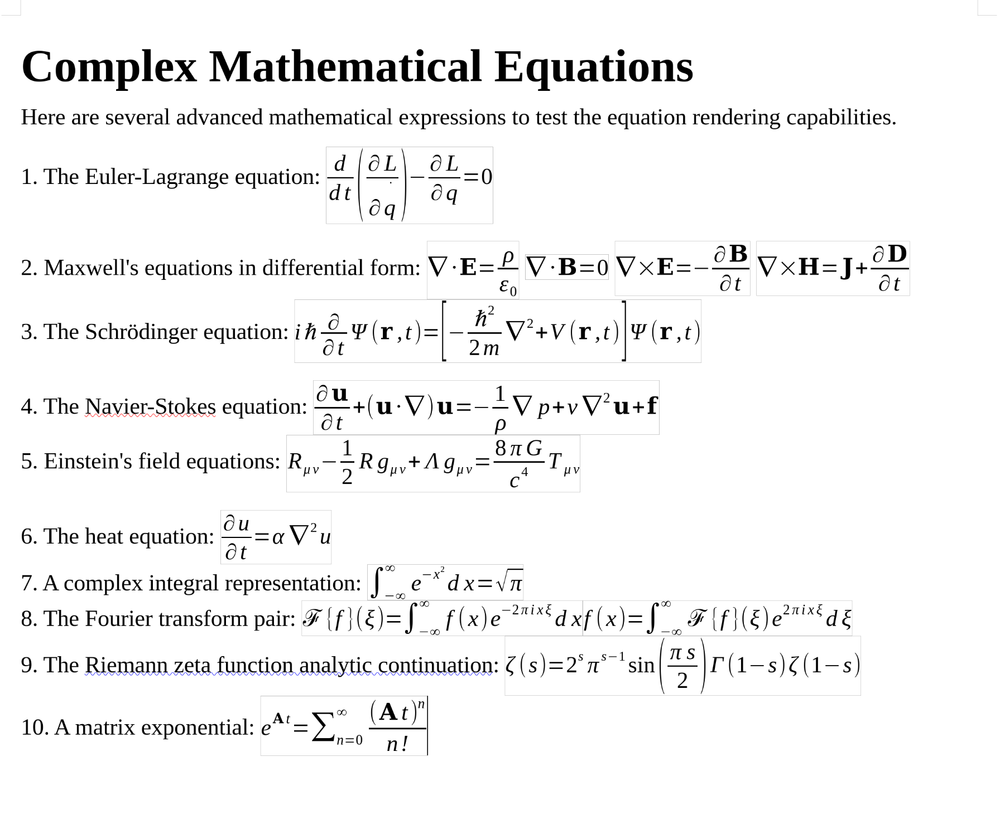
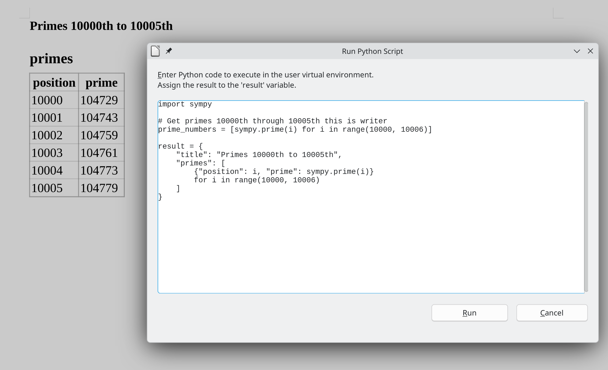

# WriterAgent


[](https://www.gnu.org/licenses/gpl-3.0.html)
[](https://www.python.org/downloads/)
[](https://www.libreoffice.org/)
[](https://github.com/KeithCu/writeragent/releases)

A LibreOffice extension that brings agentic AI to Writer, Calc, and Draw — chat in the sidebar, edit documents, run Python in spreadsheets, research the web, and check grammar.

Unlike proprietary office suites that lock you into a single cloud provider and send all your data to their servers, WriterAgent is local-first. You can run fast, private models locally (via Ollama, LM Studio, etc.) ensuring your documents never leave your machine. If you choose to use cloud APIs, you can switch between providers (e.g., OpenRouter, Together.AI) in seconds, maintaining full control over your data.

**[Download .oxt](https://github.com/KeithCu/writeragent/releases/latest)** · [Feature index](docs/features.md) · [Discussions](https://github.com/KeithCu/writeragent/discussions)

---

## Features


### Writer

- **Sidebar chat with deep tool-calling** — 9 core tools for everyday editing plus dozens of [specialized sub-agents](docs/writer-specialized-toolsets.md) that unlock [page layout](docs/page-api-reference.md), [shapes](docs/shape_support.md), charts, [bookmarks](docs/bookmarks-api-reference.md), [footnotes](docs/footnotes-api-reference.md), [track changes](docs/writer-tracking-api-reference.md), indexes, forms, and more. Try *"Do web research and write a report on the space elevator, suitable for mathematicians (or English teachers)"* — the AI will research, write, and format a complete document (the math version even uses LaTeX).
- **Format-preserving edits** — Rewrite or tighten a selection and existing bold, italics, highlights, and font sizes survive intact. HTML import handles tables and nested lists. One **Ctrl+Z** reverts a whole AI turn.
- **Realtime grammar** — Async proofreader with three backends: [Harper](https://github.com/Automattic/harper) (fast local Rust checker, auto-installs), [LanguageTool](https://languagetool.org) (local server), or any LLM. Sentence cache, Unicode-aware splitting, and optional auto language detection so mixed-locale documents get the right checker per sentence. [Details](docs/realtime-grammar-checker-plan.md)
- **Math & analytics** — TeX/MathML delimiters become editable LibreOffice Math objects. SymPy helpers for symbolic math. Readability metrics, NER, and key phrases via spaCy. [Math](docs/math-tex.md)

### Calc

- **`=PROMPT()` and `=PY()`** — AI prompts and NumPy/pandas code in spreadsheet cells with auto spill, shared kernel, init scripts, and document-attached scripts. [NumPy in LibreOffice](docs/enabling_numpy_in_libreoffice.md) · [Data shapes](docs/calc-py-data-shapes.md)
- **Trusted helper domains** — Analysis (14 helpers: EDA, outliers, regression, Monte Carlo, …), Viz, Math, Quant, Optimize, and Units — via chat or **Tools → Run Python Script**. [Domain reference](docs/numpy-domains.md) · [Analysis tools](docs/calc-analysis-tools.md)
- **Sheet → Python converter** — Rewrite 235+ Calc formula functions as `=PY()` while constants, dates, and formats stay unchanged. [Details](docs/calc-spreadsheet-to-python-import.md)
- **DuckDB SQL** — Query folder files (CSV, Parquet, XLSX, ODS) and live Calc ranges from chat or scripts. Batch edits, [conditional formatting](docs/calc-conditional-formatting.md), and [sheet filters](docs/calc-sheet-filter.md).

### Multi-modal & intelligence

- **Private web research** — Local [smolagents](https://github.com/huggingface/smolagents) loop with DuckDuckGo; synthesizes multiple pages and can update the open document with what it finds — e.g. *"find the current price of … and update this memo."* [Agent search](docs/agent-search.md)
- **Cross-document reads** — Say *"our budget spreadsheet"* in the sidebar to read other files in the same folder; edits stay on the active doc. Optional hybrid search (BM25 + semantic vectors, RRF) via `writeragent_embeddings/`. [Embeddings](docs/embeddings.md)
- **LO-DOM** — A recursive structural model so the agent understands headings, sections, and object relationships — not just a wall of text. [Semantic tree](docs/lo-dom-semantic-tree.md)
- **Images, OCR, voice** — Generate or edit images; offline OCR via Docling; cross-platform voice recording. [Images](docs/image-generation.md) · [Vision](docs/image-recognition.md) · [Audio](docs/audio-architecture.md)
- **Memory & locales** — Persistent agent memory across sessions; 34 shipped locales with AI-driven translation pipeline. [Memory](docs/hermes-agent-patterns.md) · [Localization](docs/localization.md)

### Integrations

- **MCP server** — Enable in Settings → Http; endpoint `http://localhost:8765/mcp` for Cursor, Claude Desktop, LM Studio, or custom agents. Prefer a `document_url` argument on each tool call (or legacy `X-Document-URL` header) so clients do not edit the wrong window when several docs are open; discover targets with `list_open_documents`. [MCP protocol](docs/mcp-protocol.md)
- **External agent backends** — Under **Settings → Agent backends**, swap built-in chat for [Hermes](https://github.com/NousResearch/hermes-agent) or [Grok Build](https://zed.dev/acp/agent/grok-build) via ACP, with approve/reject dialogs for tool calls. [Cursor plugin](https://github.com/KeithCu/cursor-libreoffice) · [LO skill](https://github.com/KeithCu/libreoffice-skill)

Full catalog with doc links: **[docs/features.md](docs/features.md)**.

---


## Install

1. Download **WriterAgent.oxt** (full AI suite) or **LibrePy.oxt** (Python/NumPy + analysis / OCR) from [Release Assets](https://github.com/KeithCu/writeragent/releases/latest), then double-click to install.
2. Open **WriterAgent → Settings** and set an OpenAI-compatible endpoint and model (e.g. `http://localhost:11434` for [Ollama](https://ollama.com/)).
3. Open the sidebar: **View → Sidebar → WriterAgent**, or use **Ctrl+Q** / **Ctrl+E** for extend / edit selection.

**No GPU?** Try [OpenRouter free models](https://openrouter.ai/collections/free-models) or [Together.AI](https://www.together.ai/)’s free tier.

---

## Showcase

**Hermes + Opus 4.6 (Web Research)**


**Arch Linux Resume**


**Spreadsheet Dashboard**


**Math Expressions**



**Python in LibreOffice**



**Sonnet diagram of an Arch Linux deity**


---

## Docs & integrations


|                     |                                                                                                                                         |
| ------------------- | --------------------------------------------------------------------------------------------------------------------------------------- |
| Feature index       | [docs/features.md](docs/features.md)                                                                                                    |
| Architecture        | [docs/writeragent-architecture.md](docs/writeragent-architecture.md)                                                                    |
| MCP                 | [docs/mcp-protocol.md](docs/mcp-protocol.md)                                                                                            |
| NumPy / `=PY()`     | [docs/enabling_numpy_in_libreoffice.md](docs/enabling_numpy_in_libreoffice.md)                                                          |
| Embeddings          | [docs/embeddings.md](docs/embeddings.md)                                                                                                |
| Benchmarks          | [docs/benchmarks.md](docs/benchmarks.md)                                                                                                |
| Localization        | [docs/localization.md](docs/localization.md)                                                                                            |
| Code explorer       | [DeepWiki](https://deepwiki.com/KeithCu/writeragent)                                                                                    |
| Cursor rules/skills | [cursor-libreoffice](https://github.com/KeithCu/cursor-libreoffice) · [libreoffice-skill](https://github.com/KeithCu/libreoffice-skill) |


Under the hood, all AI interactions are governed by a formally verified state machine with type checking, and static analysis. [Architecture](docs/writeragent-architecture.md) · [Formal verification](docs/formal_verification.md) · [Test architecture](docs/test_architecture_analysis.md)


Hit a rough edge? File an [issue](https://github.com/KeithCu/writeragent/issues) with steps to reproduce, or open a PR. A star helps too.

---


## The Evolution of WriterAgent

A weekly chronicle of building a professional AI suite inside LibreOffice:

- **Week 1**: [Initial fork, sidebar chat, multi-turn tools, and async streaming](https://keithcu.com/wordpress/?p=5060)
- **Week 2 & 3**: [MCP, research sub-agent, voice support, and evaluation dashboard](https://keithcu.com/wordpress/?p=5112)
- **Week 4–6**: [State machines, formal verification, and specialized toolsets](https://keithcu.com/wordpress/?p=5245)
- **Week 6 & 7**: [Async grammar checking and TeX import support](https://keithcu.com/wordpress/?p=5276)

---


## Contributing

[](https://deepwiki.com/KeithCu/writeragent)
[Discussions](https://github.com/KeithCu/writeragent/discussions)

**Prerequisites:** Python 3.11–3.13 for dev (pinned to **3.13** in [`.python-version`](.python-version)), [uv](https://docs.astral.sh/uv/), and LibreOffice with `unopkg`. Run `make check-setup` to verify. On macOS: `make`, `gettext`, and LibreOffice via Homebrew or `/Applications`.

```bash
git clone https://github.com/KeithCu/writeragent.git
cd writeragent
uv python install 3.13
uv sync
make deploy          # or: make deploy writer
make test
make help
```

If `uv sync` fails on Python 3.14 / spaCy wheels: `rm -rf .venv && uv sync --python 3.13`. Contributor orientation: [AGENTS.md](AGENTS.md).

---


## Credits


| Project                                                                               | Contribution                                    |
| ------------------------------------------------------------------------------------- | ----------------------------------------------- |
| [LibreCalc AI Assistant](https://extensions.libreoffice.org/en/extensions/show/99509) | Calc AI foundation and inspiration              |
| [LibreOffice MCP Extension](https://github.com/quazardous/mcp-libre)                  | MCP server patterns, Makefile, tool registry    |
| [Hermes Agent](https://github.com/NousResearch/hermes-agent)                          | Tool-call parsers, JSON repair, memory patterns |
| [latex2mathml](https://github.com/roniemartinez/latex2mathml)                         | LaTeX → MathML                                  |


---


## License

**GNU GPL v3 (or later)** — see [`LICENSE`](LICENSE). Originally MPL 2.0; relicensed in 2026 for stronger reciprocity and library compatibility.


| Year      | Contribution                      | Contributor            |
| --------- | --------------------------------- | ---------------------- |
| 2024      | Original release                  | John Balis             |
| 2025–2026 | Config, registries, build system  | quazardous             |
| 2026      | Calc integration (originally MIT) | LibreCalc AI Assistant |
| 2026      | Modifications and relicensing     | KeithCu                |


