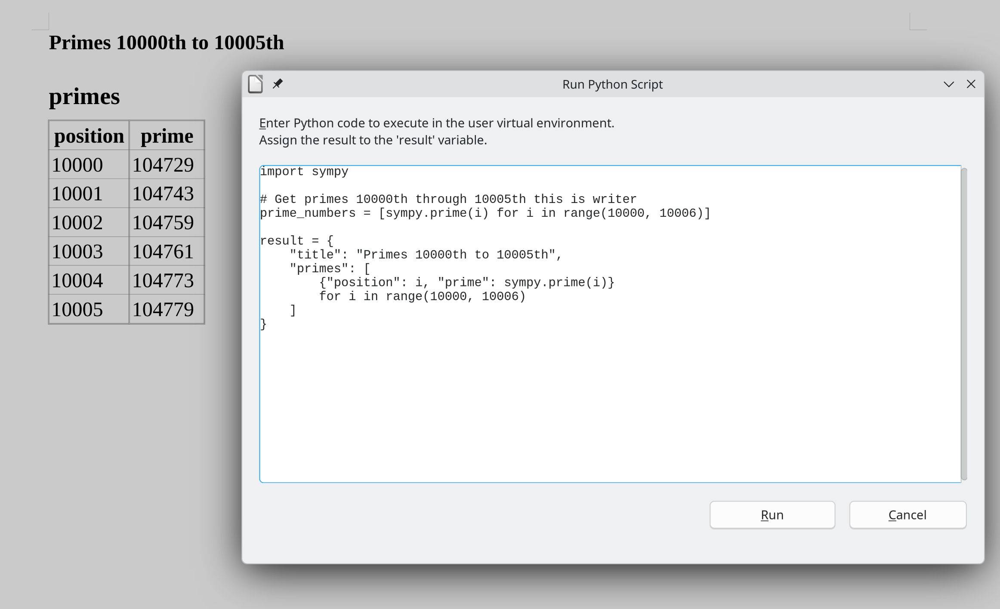
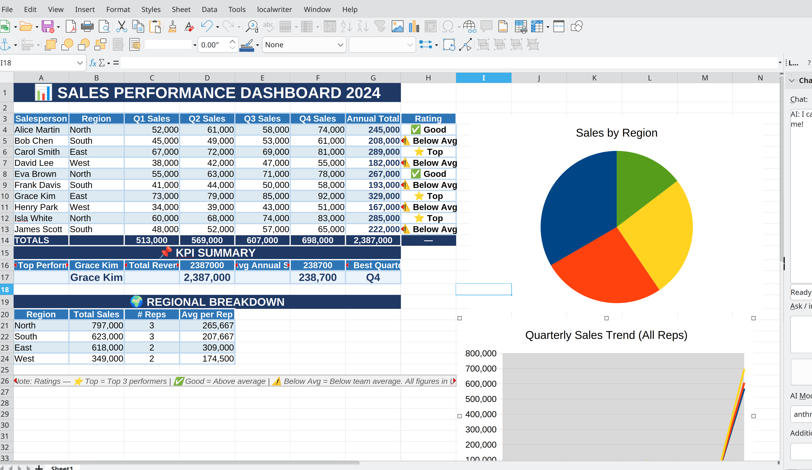
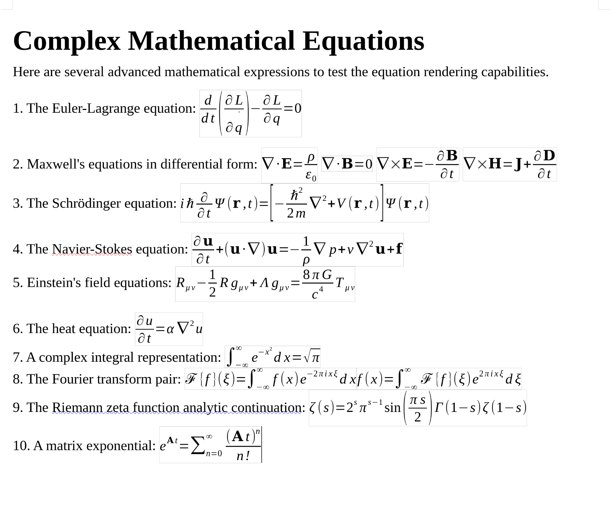
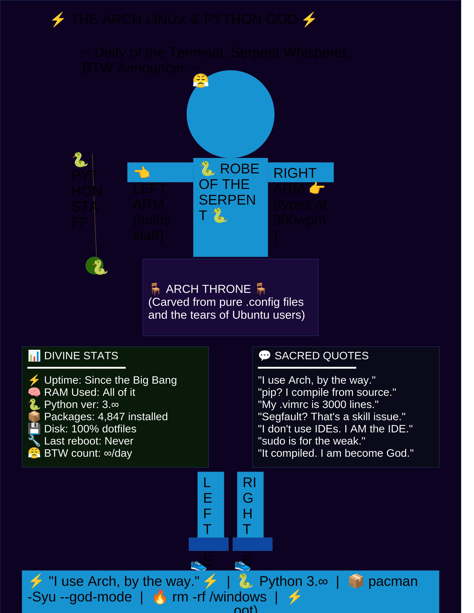
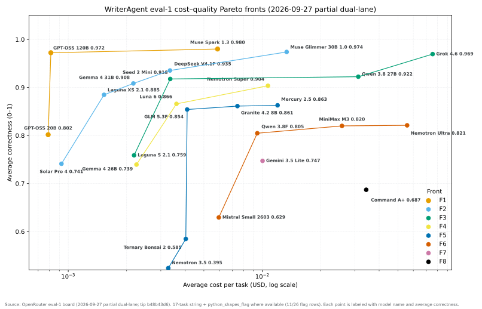

# WriterAgent, LibrePy & LibreHarper

[CI status page](https://keithcu.github.io/writeragent/)

**Python, NumPy, and Agentic AI for LibreOffice (Writer, Calc, and Draw)**

Run Python and scientific compute directly in spreadsheet formulas, edit documents with private local-first AI, conduct web research, generate diagrams, and automate office workflows — without cloud lock-in.

The project is distributed as three standalone extension packages (*install only one at a time*):

| Package | What's Included | Best For |
| :--- | :--- | :--- |
| 🤖 **[WriterAgent](docs/features.md)** (`WriterAgent.oxt`) *(Full stack)* | Everything in LibrePy and LibreHarper + AI sidebar, `=PROMPT()`, web research, Calc → Python converter, MCP server | Users wanting the complete AI assistant, spreadsheet converter, and scientific compute suite |
| 🐍 **[LibrePy](docs/scripting/librepy-split.md)** (`LibrePy.oxt`) | Python runtime, `=PY()`, NumPy, pandas, SymPy, Monaco, Jupyter **File → Open** `.ipynb`, domain helpers, OCR | Users who want Python and Data Science in Calc/Writer without AI or API keys |
| ✍️ **LibreHarper** (`LibreHarper.oxt`) | Standalone offline [Harper](https://github.com/Automattic/harper) grammar engine for Writer | Users who only want fast, local grammar checking without AI or Python stacks |

**[Download .oxt Releases](https://github.com/KeithCu/writeragent/releases/latest)** · [Feature Index](docs/features.md) · [NumPy in LibreOffice Guide](docs/enabling_numpy_in_libreoffice.md) · [Discussions](https://github.com/KeithCu/writeragent/discussions)

---

## Key Capabilities

### 🤖 Local-First Agentic AI & Writing (Writer)

- **Sidebar Chat with Multi-turn Tool Calling** — Edit, restructure, or expand documents using natural language. 9 core tools plus dozens of [specialized sub-agents](docs/writer/specialized-toolsets.md) for page layout, footnotes, bookmarks, revisions, and forms.
- **Two-Way Voice Interaction (STT & TTS)** — Dictate prompts directly to your document agent and listen to responses spoken aloud (local via Kokoro or Piper, or via your LLM endpoint).
- **Format-Preserving Edits** — Surgical redlines and section rewrites maintain your existing formatting (bold, italics, highlights, font sizes, tables, and nested lists) without clobbering styles.
- **Web Research** — Integrated private [smolagents](https://github.com/huggingface/smolagents) loop with DuckDuckGo. Synthesizes multiple web sources and updates open documents with real-time facts and citations. [Agent Search](docs/chat/search.md)
- **Real-Time Grammar & Proofreading** — Local, privacy-preserving grammar checking via [Harper](https://github.com/Automattic/harper) (fast, auto-installing), [LanguageTool](https://languagetool.org), or LLM endpoints with mixed-language sentence detection. [Details](docs/writer/grammar-checker-plan.md)
- **Math & LaTeX Import** — Converts LaTeX and MathML into native, editable LibreOffice Math objects. [Math Guide](docs/writer/math-tex.md)

### 🐍 Python & Scientific Computing (Calc & Writer)

- **Native `=PY()` Spreadsheet Formulas** — Execute Python, NumPy, and pandas expressions directly inside Calc cells with automatic array spill, shared workbook kernels, and persistent scripts.
  - `=PY("np.mean(data)"; A1:A10)` — Calculate array statistics directly on Calc ranges.
  - `=PY("data.to_pandas(date_cols=True)"; A1:C10)` — Load sheet data into pandas with automatic type and date parsing.
  - [NumPy in LibreOffice Guide](docs/enabling_numpy_in_libreoffice.md) · [Data Shapes & Type Mapping](docs/calc/py-data-shapes.md)
- **Embedded Monaco Code Editor** — Write, test, and debug multi-line Python scripts directly inside cells or through the **Tools → Run Python Script** environment with syntax highlighting, autocomplete, and diagnostics.
- **Built-in Scientific & Analytics Domains** — Ready-to-use helpers for EDA, outlier detection, OLS regression, KMeans clustering, Monte Carlo simulations, symbolic algebra (SymPy), plotting, and physical unit conversions (`convert_quantity(60, "mph", "m/s")` → `26.8224 m/s`). [Domain Reference](docs/scripting/numpy-domains.md) · [Analysis Helpers](docs/calc/analysis-tools.md)
- **Spreadsheet → Python Converter *(WriterAgent)*** — Translate 235+ classic Calc/Excel formulas into clean Python expressions using the built-in `calc.*` parity library while preserving constants, dates, and cell formats. [Details](docs/calc/spreadsheet-to-python-import.md)
- **Local Vision & OCR** — Extract text from embedded images or scanned documents directly into Writer and Calc via offline Docling OCR. [Vision Guide](docs/images/recognition.md)
-  **Jupyter Notebook Support** — **File → Open…** a `.ipynb` (or double-click / `soffice notebook.ipynb`) creates a Writer document with markdown, editable code fields, and ▶ run buttons against a shared Python kernel. [Jupyter in Writer](docs/writer/jupyter-notebook-import.md)

### 📊 Diagrams, Slides & Multi-Modal (Draw & Impress)

- **Diagram & Presentation Generation** — Generate, adjust, and style flowcharts, shapes, connectors, speaker notes, and slide transitions through chat commands or Python scripts. [Details](docs/draw/impress-specialized-toolsets.md)
- **LO-DOM Semantic Tree** — Structural understanding of headings, sections, tables, and relationships across entire documents. [Semantic Tree](docs/writer/lo-dom-semantic-tree.md)
- **Cross-Document Search & Memory** — Query other documents in the same folder via local embeddings / hybrid search, with persistent cross-session agent memory. [Embeddings](docs/embeddings.md) · [Memory](docs/hermes-agent-patterns.md)

### 🔌 Integrations & Extensibility

- **Model Context Protocol (MCP) Server** — Connect external IDEs and agents (Cursor, Claude Desktop, LM Studio) to read and edit open LibreOffice documents over `http://localhost:18765/mcp`. [MCP Protocol](docs/mcp-protocol.md)
- **Pluggable Agent Backends** — Switch the chat engine to external agents such as [Hermes](https://github.com/NousResearch/hermes-agent), [Claude Code](https://docs.anthropic.com/en/docs/claude-code), [Mistral Vibe](https://github.com/mistralai/mistral-vibe), [Grok Build](https://zed.dev/acp/agent/grok-build), or [OpenCode](https://opencode.ai/docs/acp/) via ACP. [Cursor Plugin](https://github.com/KeithCu/cursor-libreoffice) · [LO Skill](https://github.com/KeithCu/libreoffice-skill)

Full catalog of capabilities: **[docs/features.md](docs/features.md)**.

---

## Installation & Setup

1. **Download** your chosen `.oxt` package from **[Latest Releases](https://github.com/KeithCu/writeragent/releases/latest)** and double-click to install (or open LibreOffice and go to **Tools → Extension Manager → Add**). *Remember to install only one extension package.*
2. **Restart** LibreOffice.
3. **Quick Configuration:**
   - **Python / LibrePy users:** Open Calc, check **Tools → LibrePy (or WriterAgent) → Settings → Python**, and click **Test** to verify your environment and NumPy/pandas availability.
   - **AI / WriterAgent users:** Open **WriterAgent → Settings** and enter your endpoint (e.g. `http://localhost:11434` for local [Ollama](https://ollama.com/), or an [OpenRouter](https://openrouter.ai/) / [Together.AI](https://www.together.ai/) API key). Open the sidebar via **View → Sidebar → WriterAgent** or press **Ctrl+Q** / **Ctrl+E**.

> **UI Modes:** In classic toolbar mode, access tools through the top menubar. In tabbed/ribbon interfaces, use the **WriterAgent** chat sidebar and/or the **Python** sidebar (Writer + Calc): Settings `⚙`, Python `🐍`, LaTeX math or Edit cell, search `🔍` (WriterAgent chat only), and full menus via `☰`.

For detailed setup instructions, see the **[Install and Troubleshooting Guide](docs/install-troubleshooting.md)**.

---

## Showcase

**Python in LibreOffice Writer**

**Spreadsheet Analytics & Dashboard**

**Hermes + Opus 4.6 (Web Research)**

**Math Expressions & LaTeX**

**Arch Linux Resume**

**Diagrams in Draw**

---

## Benchmarks & Evaluation

WriterAgent's **eval-1 LLM Evaluation Suite** benchmarks models on Writer, Calc, and Draw tasks. Eval-1 is **not string-only**: `--backend string` is the in-memory simulator, `--backend lo` is native headless UNO, and `--backend auto` is the per-task dual-lane mix. Task 18 (`python_shapes_flag`) needs native LO. Headed eval-2 is a separate harder suite — native LO is not eval-2-only. The table below is the **2026-09-27 complete 26×18 dual-lane** board (OpenRouter, live token pricing; 17-task string base + `python_shapes_flag` for every catalog model). Full methodology: [docs/eval/benchmarks.md](docs/eval/benchmarks.md). Pre-refresh rows still named `openai/gpt-5.6-luna` and `deepseek/deepseek-v4-flash-0731`; those ids left the live eval-1 catalog (gold defaults to `openai/gpt-6-luna`; DeepSeek Flash is `deepseek/deepseek-v4.1-flash` only).

Distance-to-frontier view: [docs/eval/pareto-distance.svg](docs/eval/pareto-distance.svg).

**2026-09-27 refresh (complete flag-18):** catalog adds GPT-6 Luna, Command A+, Ternary Bonsai 2; drops GPT-5.6 Luna + deepseek-v4-flash-0731; MiMos omitted (aborted). All **26/26** models have `n_examples=18` (`python_shapes_flag` spliced after `-j4` remainder on #939 tip). Full methodology and ranking: [docs/eval/benchmarks.md](docs/eval/benchmarks.md).

| Model | Correctness avg task score (0–1) | Value Correctness² ÷ $/task |
| ----- | ----- | ----- |
| openai/gpt-oss-120b | 0.972 | 1161 |
| openai/gpt-oss-20b | 0.802 | 815 |
| poolside/laguna-xs-2.1 | 0.884 | 407 |
| upstage/solar-pro4 | 0.756 | 397 |
| google/gemma-4-31b-it | 0.908 | 381 |
| google/gemma-4-26b-a4b-it | 0.739 | 243 |
| openai/gpt-6-luna | 0.866 | 208 |
| bytedance-seed/seed-2.0-mini | 0.908 | 203 |
| poolside/laguna-s-2.1 | 0.772 | 189 |
| meta/muse-spark-1.3-contributor | 0.980 | 163 |
| z-ai/glm-5.3-flash | 0.848 | 89 |
| prism-ml/ternary-bonsai-2-27b | 0.573 | 84 |
| ibm-granite/granite-4.2-8b | 0.855 | 83 |
| deepseek/deepseek-v4.1-flash | 0.932 | 83 |
| meta/muse-glimmer-30b | 0.974 | 71 |
| qwen/qwen3.8-flash | 0.781 | 69 |
| mistralai/mistral-small-2603 | 0.615 | 67 |
| inception/mercury-2.5-preview | 0.863 | 62 |
| google/gemini-3.5-flash-lite | 0.747 | 56 |
| nvidia/nemotron-3-super-120b-a12b | 0.902 | 49 |
| nvidia/nemotron-3.5-lightning | 0.395 | 48 |
| cohere/command-a-plus | 0.677 | 14 |
| x-ai/grok-4.6 | 0.969 | 12 |
| minimax/minimax-m3 | 0.823 | 12 |
| qwen/qwen3.8-27b | 0.913 | 8 |
| nvidia/nemotron-3-ultra-550b-a55b | 0.831 | 5 |
