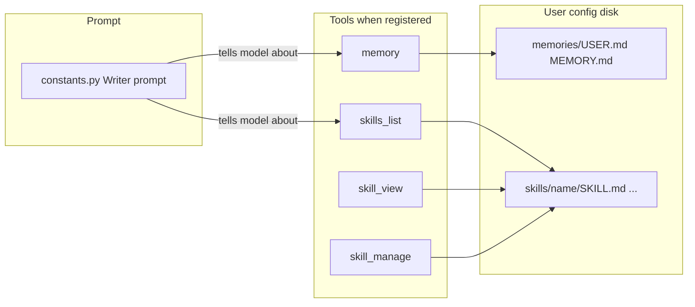

# Agent memory and skills (Hermes-style)

This document describes the **file-backed memory** and **procedural skills** code paths copied from a Hermes-style “self-improving” agent setup. The implementation lives in [`plugin/modules/chatbot/memory.py`](../plugin/modules/chatbot/memory.py) and [`plugin/modules/chatbot/skills.py`](../plugin/modules/chatbot/skills.py). Prompt guidance is in [`plugin/framework/constants.py`](../plugin/framework/constants.py).

**Status:** The `memory` and `skills_*` tools are **not registered** in the current extension build (see [Integration status](#integration-status)). The Writer default chat system prompt may still **mention** memory and skills to the model; until the tools are enabled, those calls cannot succeed.

---

## Concepts

| Concept | Role |
|--------|------|
| **Memory** | Persistent markdown files for long-lived facts: a **user** profile (preferences, quirks) and a general **memory** note (project facts, environment, agent thoughts). |
| **Skills** | Reusable **procedures** stored as a directory per skill with a canonical `SKILL.md` (optional YAML front matter, body instructions). Supports extra files (templates, snippets). |

Together they let the model accumulate stable context (memory) and codify workflows (skills), aligned with Hermes-style guidance: save when the user corrects you, when you learn about the environment, after complex multi-tool work, or when a skill is wrong and needs patching.

---

## Prompt layer ([`constants.py`](../plugin/framework/constants.py))

### `MEMORY_GUIDANCE` and `SKILLS_GUIDANCE`

- **Memory:** Explains the two targets (`user` vs `memory`), and **when to save** proactively (corrections, environment discoveries), prioritizing what reduces future steering.
- **Skills:** Names the three tools (`skills_list`, `skill_view`, `skill_manage`) and suggests saving after **complex** tasks (e.g. many tool calls), tricky errors, or non-trivial workflows; patch skills when they are outdated or wrong.

These strings are interpolated into **`DEFAULT_CHAT_SYSTEM_PROMPT`** (Writer chat) immediately after `FORMATTING_RULES`, each prefixed with `#` so they appear as section headers in the assembled prompt text.

### `TOOL_USAGE_PATTERNS`

Separate from memory/skills, this block documents **document-tool** usage patterns (inspired by DSPy MIPROv2-style optimization): `apply_document_content` / `old_content` conventions, translation flow, when to call `get_document_content`, etc. It is part of the same Writer system prompt bundle.

### Optional todo guidance (commented)

Below `DEFAULT_CHAT_SYSTEM_PROMPT` there is a **commented** block describing Hermes-style **task planning** with a `todo` tool (task list, statuses, one `in_progress` item). That text is **not** included in the live prompt unless you enable the todo tool and append similar guidance.

### Other prompts

`get_chat_system_prompt_for_document` selects **Writer** (`DEFAULT_CHAT_SYSTEM_PROMPT`), **Calc**, or **Draw** bases. Memory/skills guidance is only woven into the **Writer** default prompt as described above.

---

## Memory ([`memory.py`](../plugin/modules/chatbot/memory.py))

### Storage layout

- Directory: `{user_config_dir(ctx)}/memories/` (created if missing).
- Files:
  - **`USER.md`** — target `user`
  - **`MEMORY.md`** — target `memory`

### `MemoryStore`

- `read(target)` — returns file contents or `""` if missing; logs `OSError`.
- `write(target, content)` — overwrites the file; returns success boolean.

### `MemoryTool` (`name = "memory"`)

Parameters:

- **`action`:** `add` | `replace` | `remove` | `read`
- **`target`:** `user` | `memory`
- **`content`:** used for `add` and `replace` (ignored for `read` / `remove`)

Behavior:

- **`read`** — returns `{ status, target, content }`.
- **`remove`** — clears the file (same as writing `""`).
- **`replace`** — full overwrite; response includes `new_length`.
- **`add`** — appends to existing text, ensuring a newline between old and new segments when needed. **Total length after append must not exceed 10 000 characters**; otherwise returns an error suggesting `replace` to summarize.

The tool class sets `is_mutation = False` in the current code (registry/tier metadata for integrators).

---

## Skills ([`skills.py`](../plugin/modules/chatbot/skills.py))

### Storage layout

- Root: `{user_config_dir(ctx)}/skills/`
- Each skill: `skills/<name>/SKILL.md` and optional additional paths under that folder.

### Front matter

`_parse_frontmatter` supports a leading `---` … `---` block (simple `key: value` lines). Listing uses:

- `name` from front matter, else the **parent directory name** of `SKILL.md`
- `description` from front matter, else the **first non-empty, non-`#` line** of the body

Descriptions in list results are truncated to **1024** characters.

### `SkillsStore`

- `find_all_skills()` — `rglob("SKILL.md")` under the skills root, builds name/description for each.
- `read_skill(name)` / `write_skill(name, content)` — canonical `SKILL.md`.
- `delete_skill(name)` — removes the whole skill directory (`shutil.rmtree`).
- `write_file(name, file_path, content)` / `remove_file(name, file_path)` — auxiliary files under the skill directory.

### Tools (progressive disclosure)

1. **`skills_list`** — `{ status, skills: [{ name, description }], count }`. Read-only overview.
2. **`skill_view`** — `name` required; optional `file_path` (defaults to `SKILL.md`). Returns full file content.
3. **`skill_manage`** — mutations:

   | Action | Purpose |
   |--------|---------|
   | `create` | Write full `SKILL.md` (`content` required). |
   | `edit` | Replace full `SKILL.md`. |
   | `delete` | Remove skill directory. |
   | `patch` | Replace `old_string` with `new_string` in `SKILL.md`; if multiple matches, require `replace_all=true` or a more specific `old_string`. |
   | `write_file` | `file_path` + `file_content`. |
   | `remove_file` | Remove auxiliary file. |

---

## Integration status

| Piece | State |
|-------|--------|
| **Tool registration** | In [`plugin/modules/chatbot/__init__.py`](../plugin/modules/chatbot/__init__.py), `auto_discover` for the memory and skills modules is **commented out**. The tools are not loaded via the chatbot module until that is enabled. |
| **Document context injection** | In [`plugin/framework/document.py`](../plugin/framework/document.py), code that could inject memory text into chat context (e.g. `[AGENT MEMORY]`) is **commented out**. |
| **Tests** | [`plugin/tests/test_agent_memory_skills.py`](../plugin/tests/test_agent_memory_skills.py) exercises the tools but is marked **`@unittest.skip`**. |

Enabling the feature typically means uncommenting registration (and optionally injection), then re-running tests with skips removed.

---

## Flow (conceptual)

Dashed implication: until registration is on, the **prompt** path may describe tools that are **not** available at runtime.
