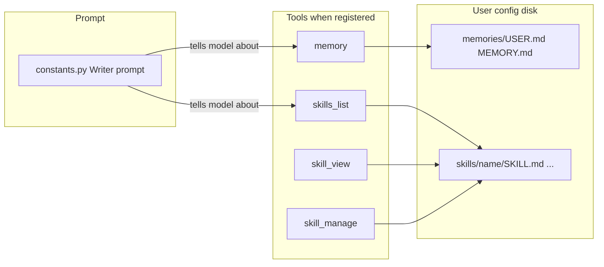
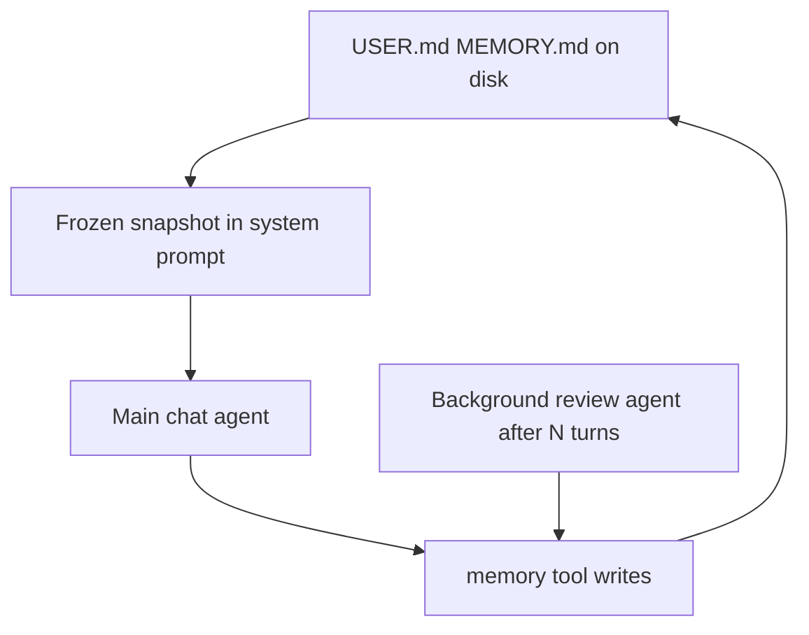
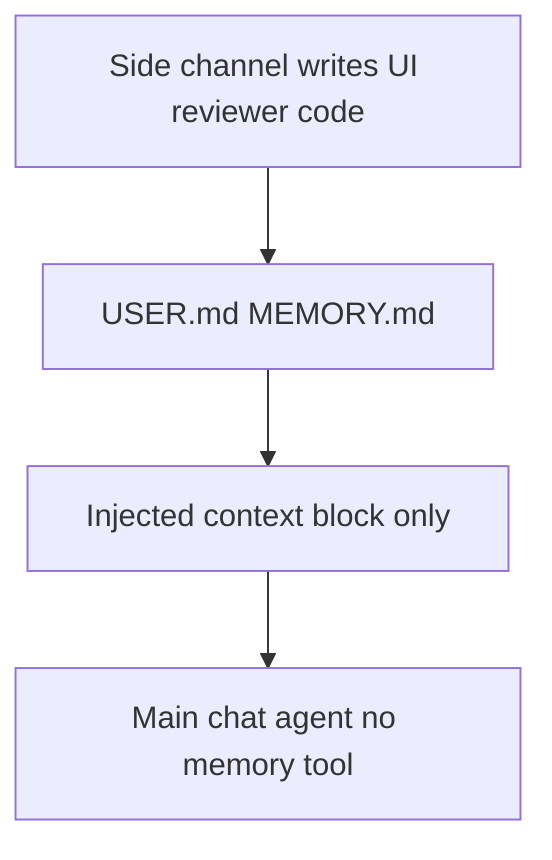

# Agent memory and skills (Hermes-style)

This document describes the **file-backed memory** and **procedural skills** code paths copied from a Hermes-style “self-improving” agent setup. The implementation lives in [`plugin/modules/chatbot/memory.py`](../plugin/modules/chatbot/memory.py) and [`plugin/modules/chatbot/skills.py`](../plugin/modules/chatbot/skills.py). Prompt guidance is in [`plugin/framework/constants.py`](../plugin/framework/constants.py).

**Status:** The `memory` and `skills_*` tools are **not registered** in the current extension build (see [Integration status](#integration-status)). The Writer default chat system prompt may still **mention** memory and skills to the model; until the tools are enabled, those calls cannot succeed.

---

## How Hermes does it (reference — upstream `hermes-agent`)

WriterAgent’s memory/skills modules are **inspired by** [Nous Hermes Agent](https://github.com/NousResearch/hermes-agent). The **useful** pattern is: **the model sees saved memory in the system prompt every turn**, and uses the **`memory` tool mainly to write** (and occasionally to read **live** disk after mid-session updates). It does **not** rely on the main chat model repeatedly calling `memory` with `read` just to “load” preferences.

### Automatic reading (prompt injection)

Hermes loads `MEMORY.md` and `USER.md` from disk when the session’s system prompt is built. A **frozen snapshot** of that content is **appended to the cached system prompt** (see upstream `run_agent.py` `_build_system_prompt` and `tools/memory_tool.py` `format_for_system_prompt`). Official docs: `website/docs/developer-guide/prompt-assembly.md` (“Memory snapshots”, “frozen MEMORY snapshot”, “frozen USER profile snapshot”).

**Implications:**

- Facts like a favorite color scheme **are visible without** the model issuing a `memory read` first, as long as they were saved before the snapshot was taken and fit within configured character budgets.
- **Mid-session** `add` / `replace` / `remove` update **files on disk** immediately, but Hermes **does not rewrite** the cached system prompt on every tool call (that keeps LLM **prefix caching** stable). The **tool result** from `memory` reflects **live** content; the **system prompt** stays on the old snapshot until a **new session** or a **prompt rebuild** (e.g. after context compression / reload from disk in Hermes).

So in Hermes, **“reading” for normal work is automatic via the prompt**; the tool’s **`read` action** is still there for **inspecting current file contents** when that differs from the frozen snapshot.

### Background “should we save anything?” pass (second agent)

Hermes can spawn a **separate short-lived `AIAgent`** in a **background thread** after the **main** reply is finished, so saving does not compete with the user’s task.

- **Trigger (memory):** turn-based counter; default **every N user turns** (`memory.nudge_interval` in agent config, default **10** in code), when the `memory` tool and memory store are active.
- **Trigger (skills):** after a turn completes, based on **tool-iteration** counters vs `skill_nudge_interval` (separate from memory).
- **Mechanism:** `_spawn_background_review` clones the conversation snapshot, appends a fixed **review user message** (`_MEMORY_REVIEW_PROMPT`, `_SKILL_REVIEW_PROMPT`, or combined), runs **`run_conversation`** with **`quiet_mode`** and shared `_memory_store`. The review agent may call **`memory`** / **`skill_manage`** to persist; optional compact **`💾 …`** summary if something was written.
- **Memory review prompt (paraphrased):** asks whether the user revealed preferences, persona, or expectations worth remembering; if so, **save with the memory tool**; otherwise reply with something like “Nothing to save.”

This is **not** implemented in WriterAgent today; it is part of why Hermes feels low-friction: the **foreground** model does not have to remember to audit every session for saves—the **periodic background reviewer** can do it.

### Alternative design: opaque side-channel memory

You can go further and keep **memory completely off the main agent’s tool surface**:

- The **chat model never receives** a `memory` tool definition, never emits `memory` tool calls, and never sees **tool results** whose role is “here is what we stored.” Memory updates are **not** part of its action space.
- **Reading** is still **injection only**: e.g. a system or document-context block such as `[USER PROFILE]` / `[AGENT MEMORY]` assembled from `USER.md` / `MEMORY.md` (or a summarized view) on each request. From the model’s perspective this is **ambient context**, like the date or product rules—not something it “fetched” with a tool.
- **Writing** happens **behind the scenes**, for example:
  - a **background reviewer** (separate small LLM job or the same stack as Hermes’s `_spawn_background_review`) that uses **`MemoryStore` in code** or an internal API—not exposed tools—to append or replace;
  - **explicit UI**: “Remember this” / “Save to profile” that writes files without involving the chat model;
  - **user-edited** markdown in the config folder;
  - optional **non-LLM** rules (e.g. save locale/timezone once from the system).

**Why consider it:** fewer tools and fewer failure modes in the main loop (no mistaken `memory` calls, no guidance text begging the model to “remember to save”), lower cognitive load for the primary model, and a clear split: **document tools** for the task, **infrastructure** for long-term prefs.

**Tradeoffs:** the main agent cannot voluntarily persist something mid-turn unless you add another channel (button, second pass, or a hidden tool only the reviewer sees). Bad or stale memory must be fixed by **users**, **settings**, or **the reviewer**—not by instructing the main chat model to call `memory replace`. **Skills** are a separate choice: you can keep skills on the tool surface for the main agent, move them to injection + side-channel updates only, or hybrid (inject index, manage via reviewer).

This design reuses the same on-disk layout and [`MemoryStore`](../plugin/modules/chatbot/memory.py) type; you would **omit** registering [`MemoryTool`](../plugin/modules/chatbot/memory.py) for the sidebar chat and strip **`MEMORY_GUIDANCE`** that tells the model to use the memory tool (while optionally keeping a neutral line like “User-specific notes may appear below” if you inject them).

---

## Concepts

| Concept | Role |
|--------|------|
| **Memory** | Persistent markdown files for long-lived facts: a **user** profile (preferences, quirks) and a general **memory** note (project facts, environment, agent thoughts). |
| **Skills** | Reusable **procedures** stored as a directory per skill with a canonical `SKILL.md` (optional YAML front matter, body instructions). Supports extra files (templates, snippets). |

Together they let the model accumulate stable context (memory) and codify workflows (skills), aligned with Hermes-style guidance: save when the user corrects you, when you learn about the environment, after complex multi-tool work, or when a skill is wrong and needs patching.

### WriterAgent vs Hermes (important)

| Aspect | Hermes (upstream) | WriterAgent (this repo) |
|--------|--------------------|-------------------------|
| **Seeing memory without tool calls** | Yes — **injected** into system prompt (frozen snapshot per session build). | **Not yet** — injection in [`document.py`](../plugin/framework/document.py) is **commented out**; the model would only see file contents if it calls **`memory` + `read`** (or you inject manually). |
| **Memory tool’s main job** | **Write** (and optional **read** for live vs snapshot). | Same **API** (`add` / `replace` / `remove` / `read`), but without injection, **`read` becomes the only way** to load from disk in-chat. |
| **Background “save memories?” agent** | Yes — periodic **second agent** after responses. | **Not implemented.** |

To get Hermes-like usefulness in WriterAgent, you typically want **both**: inject `USER.md` / `MEMORY.md` (or summaries) into the chat system or document context on each send **and** keep the tool for **mutations** (and optional `read` when you need post-write consistency before the next rebuild).

**Third option — opaque memory:** inject for **read**, do **not** register `MemoryTool` for the main chat agent, and update files only via **background jobs** or **UI** (see [Alternative design: opaque side-channel memory](#alternative-design-opaque-side-channel-memory)). The main model then neither updates memory nor sees memory as a tool call—only as injected text.

### Who should update memory? (reviewer vs main agent)

This is a **spectrum**, not a single correct choice:

- **Reviewer-primary** — A background pass decides what to save. That matches the idea that **curation** is separate from the user’s immediate task: the main model focuses on document work, and something else periodically asks whether anything should be persisted. The main loop does not have to remember to call `memory` after every correction.
- **Main-agent `memory` tool** — It is **one** extra tool in the schema; the cost is modest. If **injection** already supplies reads, the tool is mostly **writes** (plus optional `read` when you care about live disk vs snapshot). Keeping it gives an **immediate** save path when the user says “remember that” or when a correction is fresh—**without** waiting for the next reviewer run or a UI action.
- **Hybrid** — **Inject** every turn; **reviewer** handles passive extraction after conversation; expose **`memory`** on the main agent but **soft-prompt** it (“use only when the user explicitly asked to remember something or a correction must not wait”). That keeps the reviewer as the default while preserving an escape hatch.

If reviewer **reliability or latency** is a concern, a small main-agent `memory` tool is a reasonable backup. If you want the **simplest** surface for the primary model, omit the tool and use reviewer + UI only.

### Librarian vs writer (onboarding and handoff)

Another pattern—compatible with the memory ideas above—is to split **who you are** from **what we edit** using **different tool sets**, not necessarily a **different prompt, session, or chat tab**:

- **Librarian (or “profile”) surface** — For a given send (or while a toggle is on), register **no Writer document tools**—only **memory** / **skills** / chat, or injection-only memory with no doc mutations. Same **sidebar session** and **history** as usual; only the **available tools** (and possibly system text for that path) change. The first messages can be a natural **onboarding chat** (“it didn’t know anything about itself or me, so we talked”) to seed **`USER.md` / `MEMORY.md`**.
- **Writer surface** — When the user wants to edit the document, the next send uses the **full** Writer tool list (or **nested** Writer delegation as in [`writer-specialized-toolsets.md`](writer-specialized-toolsets.md)).

**Precedent in this codebase:** **Web research** already branches on a checkbox: same panel and session, but `_do_send` takes the **web research sub-agent** path instead of **chat with document tools** (see [`plugin/modules/chatbot/panel.py`](../plugin/modules/chatbot/panel.py) around the web-research check and [`plugin/modules/chatbot/web_research.py`](../plugin/modules/chatbot/web_research.py)). A librarian-style path would be the **same class of idea**—**alternate tool registration per mode**—combined with **nested Writer** on the editing path. No MCP or second session is **required** for that shape.

**Why it is not silly:** smaller tool schemas on onboarding turns reduce confusion and token load; profile facts then **inject** into later writer turns (once wiring exists).

**Extension, not a leap:** With **per-send branching** (web research today), **optional nested Writer** tooling ([`Nested-Writer-Features`](https://github.com/KeithCu/writeragent/commits/Nested-Writer-Features/) on [KeithCu/writeragent](https://github.com/KeithCu/writeragent)), and **memory/skills** modules ([`memory.py`](../plugin/modules/chatbot/memory.py), [`skills.py`](../plugin/modules/chatbot/skills.py)), a **librarian-style toggle** is a **straightforward composition**—another branch in `_do_send` with a reduced tool list and an onboarding-oriented system prompt—not a new platform. Remaining work is **wiring and UX** (checkbox, which tools to omit, injection), not inventing a new architecture. What is merged on `main` vs that branch is a **release** question, not a feasibility one.

---

## Prompt layer ([`constants.py`](../plugin/framework/constants.py))

### `MEMORY_GUIDANCE` and `SKILLS_GUIDANCE`

- **Memory:** Explains the two targets (`user` vs `memory`), and **when to save** proactively (corrections, environment discoveries), prioritizing what reduces future steering.
- **Skills:** Names the three tools (`skills_list`, `skill_view`, `skill_manage`) and suggests saving after **complex** tasks (e.g. many tool calls), tricky errors, or non-trivial workflows; patch skills when they are outdated or wrong.

These strings are interpolated into **`DEFAULT_CHAT_SYSTEM_PROMPT`** (Writer chat) immediately after `FORMATTING_RULES`, each prefixed with `#` so they appear as section headers in the assembled prompt text.

### `TOOL_USAGE_PATTERNS`

Separate from memory/skills, this block documents **document-tool** usage patterns (inspired by DSPy MIPROv2-style optimization): `apply_document_content` / `old_content` conventions, translation flow, when to call `get_document_content`, etc. It is part of the same Writer system prompt bundle.

### Optional todo guidance (commented)

Below `DEFAULT_CHAT_SYSTEM_PROMPT` there is a **commented** block describing Hermes-style **task planning** with a `todo` tool (task list, statuses, one `in_progress` item). That text is **not** included in the live prompt unless you enable the todo tool and append similar guidance.

### Other prompts

`get_chat_system_prompt_for_document` selects **Writer** (`DEFAULT_CHAT_SYSTEM_PROMPT`), **Calc**, or **Draw** bases. Memory/skills guidance is only woven into the **Writer** default prompt as described above.

---

## Memory ([`memory.py`](../plugin/modules/chatbot/memory.py))

### Intended product shape (Hermes-style)

- **Reading for the assistant:** should be **automatic** by **injecting** the contents of `USER.md` and `MEMORY.md` into the prompt (or an equivalent context block) when building each chat request, so the model does not need a chain of `memory` `read` calls to learn stable preferences.
- **Writing:** use the **`memory` tool** (`add` / `replace` / `remove`) during the conversation (or from a future background reviewer). That matches the idea that the tool is **primarily for curation**, not for routine loading.
- **`read` in the tool:** still useful for **debugging**, for **verification right after a write**, or any time you need the **current file** on disk when the injected snapshot (if any) might be stale—Hermes keeps the same distinction with frozen prompt snapshots vs live disk.

In the **opaque** design, the same **`MemoryStore`** backs the files, but the main agent has **no** `MemoryTool`: writes go through **code paths only** (reviewer, UI, etc.); see [Alternative design: opaque side-channel memory](#alternative-design-opaque-side-channel-memory).

This module implements a **flat file per target** (not Hermes’s entry-delimiter / dual snapshot structure); behavior is otherwise analogous at a high level.

### Storage layout

- Directory: `{user_config_dir(ctx)}/memories/` (created if missing).
- Files:
  - **`USER.md`** — target `user`
  - **`MEMORY.md`** — target `memory`

### `MemoryStore`

- `read(target)` — returns file contents or `""` if missing; logs `OSError`.
- `write(target, content)` — overwrites the file; returns success boolean.

### `MemoryTool` (`name = "memory"`)

Parameters:

- **`action`:** `add` | `replace` | `remove` | `read`
- **`target`:** `user` | `memory`
- **`content`:** used for `add` and `replace` (ignored for `read` / `remove`)

Behavior:

- **`read`** — returns `{ status, target, content }` (full file). In a fully wired Hermes-like setup, this is **secondary** to prompt injection; without injection, it is how the model **loads** memory today.
- **`remove`** — clears the file (same as writing `""`).
- **`replace`** — full overwrite; response includes `new_length`.
- **`add`** — appends to existing text, ensuring a newline between old and new segments when needed. **Total length after append must not exceed 10 000 characters**; otherwise returns an error suggesting `replace` to summarize.

The tool class sets `is_mutation = False` in the current code (registry/tier metadata for integrators).

---

## Skills ([`skills.py`](../plugin/modules/chatbot/skills.py))

### Storage layout

- Root: `{user_config_dir(ctx)}/skills/`
- Each skill: `skills/<name>/SKILL.md` and optional additional paths under that folder.

### Front matter

`_parse_frontmatter` supports a leading `---` … `---` block (simple `key: value` lines). Listing uses:

- `name` from front matter, else the **parent directory name** of `SKILL.md`
- `description` from front matter, else the **first non-empty, non-`#` line** of the body

Descriptions in list results are truncated to **1024** characters.

### `SkillsStore`

- `find_all_skills()` — `rglob("SKILL.md")` under the skills root, builds name/description for each.
- `read_skill(name)` / `write_skill(name, content)` — canonical `SKILL.md`.
- `delete_skill(name)` — removes the whole skill directory (`shutil.rmtree`).
- `write_file(name, file_path, content)` / `remove_file(name, file_path)` — auxiliary files under the skill directory.

### Tools (progressive disclosure)

1. **`skills_list`** — `{ status, skills: [{ name, description }], count }`. Read-only overview.
2. **`skill_view`** — `name` required; optional `file_path` (defaults to `SKILL.md`). Returns full file content.
3. **`skill_manage`** — mutations:

   | Action | Purpose |
   |--------|---------|
   | `create` | Write full `SKILL.md` (`content` required). |
   | `edit` | Replace full `SKILL.md`. |
   | `delete` | Remove skill directory. |
   | `patch` | Replace `old_string` with `new_string` in `SKILL.md`; if multiple matches, require `replace_all=true` or a more specific `old_string`. |
   | `write_file` | `file_path` + `file_content`. |
   | `remove_file` | Remove auxiliary file. |

---

## Integration status

| Piece | State |
|-------|--------|
| **Tool registration** | In [`plugin/modules/chatbot/__init__.py`](../plugin/modules/chatbot/__init__.py), `auto_discover` for the memory and skills modules is **commented out**. The tools are not loaded via the chatbot module until that is enabled. |
| **Document context injection** | In [`plugin/framework/document.py`](../plugin/framework/document.py), code that could inject memory text into chat context (e.g. `[AGENT MEMORY]`) is **commented out**. |
| **Tests** | [`plugin/tests/test_agent_memory_skills.py`](../plugin/tests/test_agent_memory_skills.py) exercises the tools but is marked **`@unittest.skip`**. |

Enabling the feature typically means uncommenting registration (and optionally injection), then re-running tests with skips removed.

---

## Flow (conceptual)

### WriterAgent today (tools + guidance only)

There is **no** arrow from `MemFiles` back into the prompt yet (injection disabled). Until registration is on, the **prompt** may still describe tools that are **not** available at runtime.

### Hermes-style target (reference)

After writes, **disk** updates immediately; **snap** refreshes on the next session or prompt rebuild. **Skills:** Hermes also injects a **skills index** into the system prompt when skill tools are enabled; WriterAgent’s skills are **list/view/manage** only unless similar injection is added later.

### Opaque memory (alternative)

The main agent **never** participates in tool calls for memory; **side** updates disk. Injection can refresh **every send** or on a schedule so the model always sees current files without a `read` tool.
