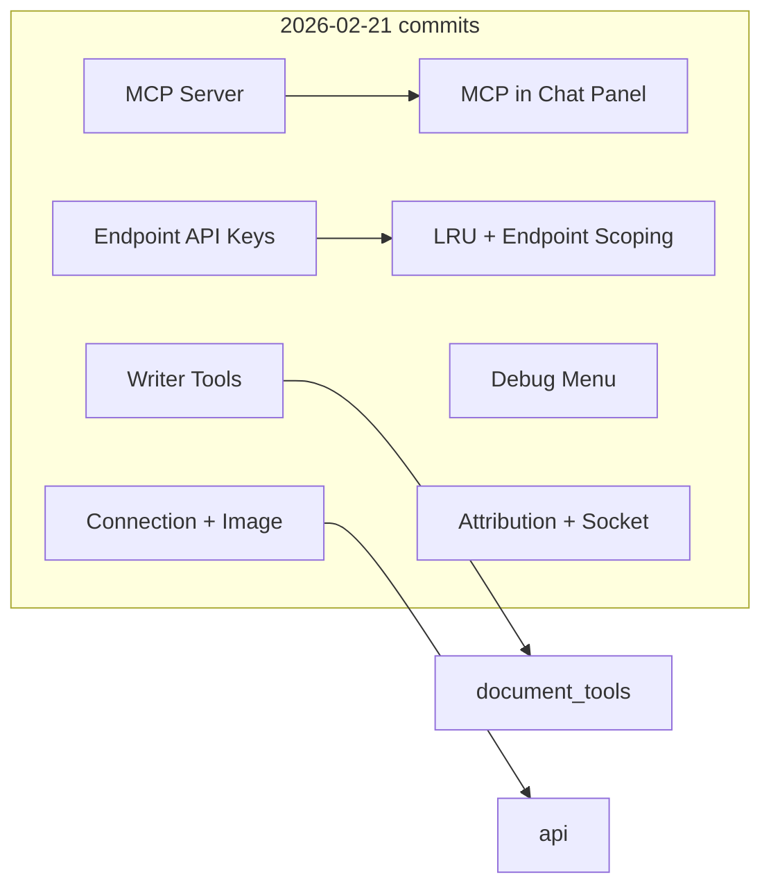

# Features Added (2026-02-21) — Git Summary

Based on AGENTS.md and the commit history for **2026-02-21**, here's a concise list of what landed in git that day.

---

## 1. MCP server for external AI clients

- **New**: Optional HTTP server on localhost that exposes Writer, Calc, and Draw tools to external clients (Cursor, Claude Desktop proxy, scripts).
- **Implementation**: `core/mcp_server.py` (MCPHttpServer, MCPHandler), `core/mcp_thread.py` (main-thread execution queue), health/tool discovery endpoints, document targeting via `X-Document-URL` header.
- **UI**: Settings dialog — MCP section (enable checkbox, port); Addons.xcu — "Toggle MCP Server", "MCP Server Status"; lifecycle and status handling in main.py.
- **Assets**: MCP status icons in assets/ (running/starting/stopped).

---

## 2. MCP integration in the chat panel

- Chat sidebar now participates in MCP event handling (e.g. so MCP-driven work is coordinated with the main-thread drain and UI).

---

## 3. Endpoint-specific API key management

- **New**: API keys are stored **per endpoint** instead of a single global key.
- **Config**: `api_keys_by_endpoint` (map: normalized endpoint URL → API key); `core/config.py` provides get/set helpers; Settings shows and saves the key for the currently selected endpoint.
- **Legacy**: Single `api_key` is migrated once into the map and then removed.

---

## 4. LRU and model behavior

- **Endpoint-scoped LRU**: Model (and image-model) LRU is scoped by endpoint so switching endpoints doesn't mix model lists.
- **Default models**: Sensible defaults for LRU when none are stored.
- **Fixes**: "Better LRU / model behavior, other fixes" commit covers edge cases and UX around model selection.

---

## 5. Writer tools expansion

- **New Writer tools** (in `core/writer_ops.py` and `core/document_tools.py`): styles, comments, track-changes, tables — e.g. `list_styles`, `get_style_info`, `list_comments`, `add_comment`, `delete_comment`, `set_track_changes`, `get_tracked_changes`, `accept_all_changes`, `reject_all_changes`, `list_tables`, `read_table`, `write_table_cell`.
- **Docs**: README and AGENTS.md updated to describe the expanded Writer tool set and section layout.

---

## 6. Connection management and image generation

- **Connection keep-alive**: `core/api.py` keeps persistent HTTP/HTTPS connections; shared USER_AGENT / APP_REFERER / APP_TITLE from `core/constants.py` for provider identification.
- **Image generation**: Improvements to connection handling and image-generation flow (e.g. stability, error handling).

---

## 7. Debug tests menu

- Debug/test actions were moved into a **separate menu** so they don't clutter the main LocalWriter menu.

---

## 8. Attribution and socket handling

- **Attribution**: Added or updated attribution (e.g. for MCP or third-party code).
- **Close socket**: Server or client now closes sockets correctly when stopping or on error to avoid leaks.

---

## Summary diagram

---

## Branch: Eval_Framework (also in git, 2026-02-21)

The **Eval_Framework** branch (`Eval_Framework` / `remotes/origin/Eval_Framework`) was created the same day and is not merged to master. It adds evaluation tooling in a single commit (`d23a24b`):

- **Evaluation Dashboard**: `LocalWriterDialogs/EvalDialog.xdl` — run benchmark tests from the app; menu integration in Addons.xcu and main.py.
- **EvalRunner**: `core/eval_runner.py` — runs evaluation tests with result/cost logging; unit tests in `core/eval_runner_tests.py`.
- **Pricing**: `core/pricing.py` — fetch and calculate model costs.
- **Plans**: `EVAL_DEV_PLAN.md`, `EVALUATION_PLAN_DETAILED.md` — goals, components, and 50 test cases by application/difficulty.
- **Tests**: `tests/fixtures/summarization_long.odt`, `tests/smoke_pricing.py`, `tests/test_config_sync.py`.

So “what’s in git” for 2026-02-21 also includes this eval work on the Eval_Framework branch.

---

All of the above is already reflected in AGENTS.md (Sections 1, 2, 5, 7, 8, Gotchas) and in the repo structure; this document is a single-day "what went in" summary from git.
