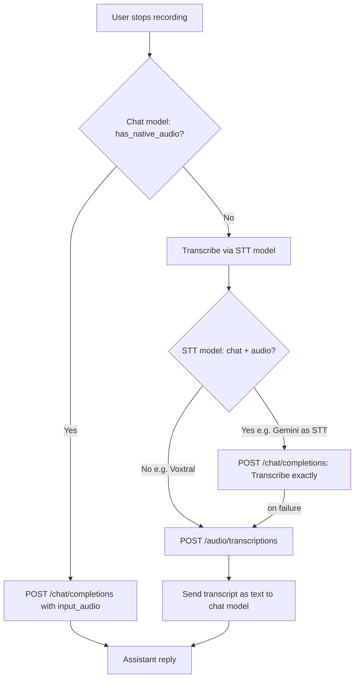

# Audio Recording Architecture

This document explains the technical decisions, challenges, and implementation details for the audio recording feature in WriterAgent.

## The Challenge: Native Dependencies in LibreOffice

WriterAgent is a LibreOffice extension. It runs embedded inside LibreOffice's internal Python interpreter. That environment is highly constrained:

1. **No reliable pip stack:** Users cannot safely install C-extension packages (NumPy, PortAudio bindings, etc.) into LibreOffice's embedded Python without ABI crashes.
2. **Cross-platform constraints:** The extension is distributed as a single `.oxt` file that must work universally across Windows, macOS, and Linux.
3. **C-extensions:** Recording audio requires native libraries (PortAudio) to interface with the OS audio subsystem.

## Strategy: user venv subprocess (2026)

Microphone capture runs in the **user-provided Python venv** configured under **Settings → Python** (`scripting.python_venv_path`), not in LibreOffice embedded Python. This matches the NumPy / Vision / Harper pattern documented in [enabling_numpy_in_libreoffice.md](enabling_numpy_in_libreoffice.md).

| Layer | Runtime | Role |
|-------|---------|------|
| **Host (LO embedded Python)** | Sidebar UI, FSM, temp WAV path | Spawns/stops recording child |
| **Dedicated venv subprocess** | User venv + `sounddevice` | Captures 16 kHz mono PCM to WAV |
| **Remote HTTP** | LLM API | STT or native `input_audio` chat (unchanged) |

**Why not the warm worker?** Recording is interactive and can last minutes. Blocking [`PythonWorkerManager`](plugin/scripting/venv_worker.py) would stall `=PYTHON()`, chat scripts, and other trusted helpers. A **short-lived dedicated child** is spawned per recording session instead.

### User setup

1. Create/configure a venv in **Settings → Python** (same venv as NumPy / Monaco).
2. Install capture dependency:

```bash
uv pip install sounddevice
```

3. **Linux only:** install system PortAudio, e.g. `sudo pacman -S portaudio`.
4. Use **Settings → Python → Test** — the **Audio Recording** group reports `sounddevice` and microphone availability.

Implementation modules:

- Host adapter: [`plugin/chatbot/audio_recorder.py`](../plugin/chatbot/audio_recorder.py)
- Host spawn/IPC: [`plugin/scripting/audio_recorder_service.py`](../plugin/scripting/audio_recorder_service.py)
- Venv capture: [`plugin/scripting/venv/audio_recorder.py`](../plugin/scripting/venv/audio_recorder.py)
- Child entry: [`plugin/scripting/venv/audio_record_main.py`](../plugin/scripting/venv/audio_record_main.py)

### Subprocess IPC (line-delimited JSON)

Host spawns `{venv_python} audio_record_main.py --output /tmp/….wav` with stdin/stdout pipes.

| Direction | Payload |
|-----------|---------|
| child → host | `{"status":"ready"}` after the input stream starts |
| host → child | `{"command":"stop"}` on stdin; legacy plain `stop` is still accepted by the child |
| child → host | `{"status":"ok","path":"/abs/path.wav"}` or `{"status":"error","message":"…"}` |

The JSON-line framing uses [`plugin/scripting/ipc.py`](../plugin/scripting/ipc.py), which also enforces the host-side ready/stop read timeouts so a hung recorder cannot block forever waiting on `readline()`.

Capture uses `sounddevice.RawInputStream` with `dtype='int16'` and Python's built-in `wave` module — no NumPy required for recording. Future **analysis** helpers (librosa, spectrograms) stay in the venv per [numpy-domains.md § Audio / Signal](numpy-domains.md#audio-signal).

## Implementation Details

### 1. UI: The Dynamic Send/Record Button

We attach an `XTextListener` (`QueryTextListener` in `panel.py`) to the text input box.

- If the box is empty and a venv path is configured, the button says **Record**.
- The moment the user types a character, it swaps to **Send**.
- Clicking **Record** swaps the label to **Stop Rec**.

`SendButtonState.audio_supported` is true when Settings → Python resolves to a venv `python` executable (cheap config check; full package probe is on **Test**).

### 2. Payload and History Database

When recording stops, the host reads the `.wav` file and converts it to base64 for the OpenAI multimodal format (`{"type": "input_audio", ...}`).

**Database optimization:** In `history_db.py` → `message_to_dict`, `input_audio` blobs are stripped before SQLite save; a `[Audio Attached]` tag is appended to the text instead.

## The Fallback System: Two API Endpoints for Audio

WriterAgent can send recorded audio to a model in **two different ways**. They use **different HTTP endpoints** and suit **different model types**. The name `has_native_audio()` means “use the chat endpoint with `input_audio`,” **not** “this model can transcribe.”

| Path | HTTP endpoint | Payload | Typical models | When used |
|------|---------------|---------|----------------|-----------|
| **Chat audio** (`has_native_audio` = true) | `POST /v1/chat/completions` | Message content includes `{"type": "input_audio", "input_audio": {"data": "<base64>", "format": "wav"}}` | Chat models with audio input (e.g. Gemini) | Chat model supports hearing audio in conversation |
| **STT transcription** | `POST /v1/audio/transcriptions` | Provider-specific (see below) | Dedicated STT models (Voxtral, Whisper) | Chat model cannot take `input_audio`, or STT-only model |



Capability detection, STT fallback, and runtime recovery are unchanged — see [`model_fetcher.py`](../plugin/framework/client/model_fetcher.py), [`llm_client.py`](../plugin/framework/client/llm_client.py), and [`panel.py`](../plugin/chatbot/panel.py).

## Build flag: `--no-recording`

Release builds may pass `--no-recording` to [`scripts/build_oxt.py`](../scripts/build_oxt.py) to omit sidebar capture modules entirely (no Record button). This is a **code-path** toggle, not a vendored-binary size knob.

## Related docs

- [Enabling NumPy & Python in LibreOffice](enabling_numpy_in_libreoffice.md) — venv settings, Test diagnostics, trusted worker pattern
- [NumPy domains — Audio / Signal (future analysis)](numpy-domains.md#audio-signal)
