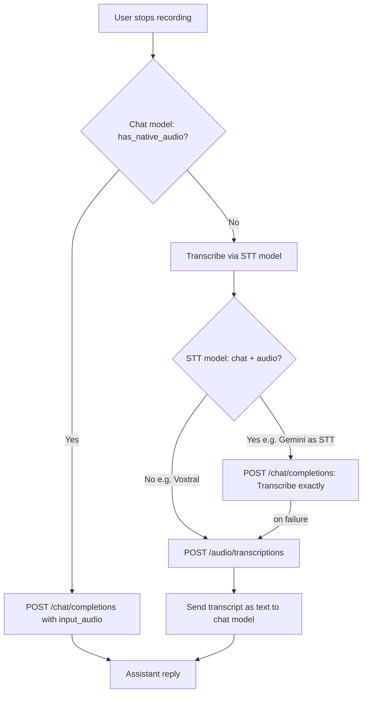

# Audio Recording Architecture

This document explains the technical decisions, challenges, and implementation details for the audio recording feature in WriterAgent.

## The Challenge: Native Dependencies in LibreOffice

WriterAgent is a LibreOffice extension. It runs embedded inside LibreOffice's internal Python interpreter. This environment is highly constrained:
1. **No `pip` or Virtual Environments:** Users cannot easily run `pip install` to add dependencies to the LibreOffice Python environment.
2. **Cross-Platform Constraints:** The extension is distributed as a single `.oxt` file that must work universally across Windows, macOS, and Linux.
3. **C-Extensions:** Recording audio typically requires native C libraries (like PortAudio) to interface with the OS audio subsystem (CoreAudio, WASAPI, ALSA). Pure Python cannot record audio.

## Why `sounddevice` and Vendoring?

We evaluated several approaches for cross-platform audio capture:
1. **Web-based input (MediaRecorder API):** Requires hosting a local webpage and asking the user to open their browser to record. Poor UX.
2. **Subprocess OS tools (`arecord`, `sox`, `PowerShell`):** Relies on external commands that might not be installed, behave inconsistently across OS versions, or pop up annoying console windows (Windows).
3. **Bundle a standalone Go/Rust binary:** Increases extension size and adds a second build pipeline outside of Python.
4. **Vendor Python Wheels (`sounddevice`):** The chosen solution.

We opted to **vendor** the pre-compiled `.whl` (wheel) files for `sounddevice`, `cffi`, and `pycparser` directly into the extension under `plugin/vendor/`.

### Why `sounddevice` over `PyAudio`?
`PyAudio` requires PortAudio to be installed on the system to compile. However, the `sounddevice` wheels for Windows and macOS actually bundle the compiled PortAudio binaries (`portaudio.dll` / `libportaudio.dylib`) inside the wheel itself (`_sounddevice_data/`). This makes it completely plug-and-play on Mac and Windows without any compilation or system dependencies.

### The Linux "Gotcha"
On Linux, `sounddevice` does not bundle PortAudio because Linux audio subsystems vary wildly. It expects the system package manager to provide it.
To handle this gracefully, we wrap the import in a `try/except OSError` block. If `libportaudio` is missing on Linux, the extension still loads fine, but when the user clicks "Record", it shows a friendly error asking them to run `sudo apt install libportaudio2`.

### Dynamic Path Injection
To make LibreOffice Python load these vendored wheels, `plugin/main.py` and `panel_factory.py` dynamically inject the `plugin/vendor` folder into `sys.path` at startup:
```python
_vendor_dir = os.path.join(_ext_root, "plugin", "vendor")
if _vendor_dir not in sys.path:
    sys.path.insert(0, _vendor_dir)
```

## Implementation Details

### 1. `AudioRecorder` without `numpy`
The standard way to use `sounddevice` is with `numpy` arrays. However, `numpy` is massive (~30MB compressed) and complex to vendor.
Instead, our `AudioRecorder` uses `sounddevice.RawInputStream` with `dtype='int16'`. This forces `sounddevice` to yield raw `bytes` (PCM data) directly from the CFFI layer. We can then pipe these raw bytes directly into Python's built-in `wave` module in a background thread, creating a standard 16kHz mono `.wav` file with zero heavy dependencies.

### 2. UI: The Dynamic Send/Record Button
To keep the UI clean, we didn't add a dedicated "Record" button. Instead, we attached an `XTextListener` (`QueryTextListener` in `panel.py`) to the text input box.
- If the box is empty, the button says **"Record"**.
- The moment the user types a character, it swaps to **"Send"**.
- Clicking "Record" swaps the label to **"Stop Rec"**.

### 3. Payload & History Database
When the recording stops, `client.py` reads the `.wav` file and converts it to a base64 string. It is injected into the payload using the standard OpenAI multimodal format (`{"type": "input_audio", ...}`).

**Crucial Database Optimization:** A 10-second audio clip base64-encoded is hundreds of kilobytes. If we saved the raw API payload to the SQLite history database (`writeragent_history.db`), the file would quickly bloat to gigabytes, severely degrading extension load times.
In `history_db.py` -> `message_to_dict`, we intercept the message before saving. We strip out any `input_audio` dictionaries and append a simple `[Audio Attached]` tag to the text string. This keeps the database tiny while still indicating in the UI history that audio was used.

## The Fallback System: Two API Endpoints for Audio

WriterAgent can send recorded audio to a model in **two different ways**. They use **different HTTP endpoints** and suit **different model types**. The name `has_native_audio()` means “use the chat endpoint with `input_audio`,” **not** “this model can transcribe.”

| Path | HTTP endpoint | Payload | Typical models | When used |
|------|---------------|---------|----------------|-----------|
| **Chat audio** (`has_native_audio` = true) | `POST /v1/chat/completions` | Message content includes `{"type": "input_audio", "input_audio": {"data": "<base64>", "format": "wav"}}` | Chat models with audio input (e.g. Gemini) | Chat model supports hearing audio in conversation; recording goes straight into the chat request |
| **STT transcription** | `POST /v1/audio/transcriptions` | Provider-specific (see below) | Dedicated STT models (e.g. Voxtral, Whisper) | Chat model cannot take `input_audio`, or STT model is transcription-only |

**STT-only models can transcribe** — they just use `/audio/transcriptions`, not chat completions. Sending Voxtral a chat message with `input_audio` fails because it is not a chat model.



### 1. Capability detection (`has_native_audio`)

Implementation: [`plugin/framework/client/model_fetcher.py`](../plugin/framework/client/model_fetcher.py) → `has_native_audio()`.

Answers: **“Can this model accept `input_audio` on `/chat/completions`?”** — not “can it do speech-to-text.”

- **Persistent cache:** If a model previously failed an audio-in-chat request, it is marked unsupported in `writeragent.json` (`audio_support_map`).
- **Model catalog:** A row must have both `CHAT` and `AUDIO` capability bits (e.g. Gemini). `AUDIO`-only STT rows (Voxtral, Parakeet) do **not** count — they use the transcription endpoint instead.
- **Heuristics:** Model ids containing `gemini` + `1.5`, `audio-preview`, or `multimodal`.

Used in two places:

1. **`panel.py`** — on the **chat model**: if false, run STT first and send text; if true, attach audio to the chat request.
2. **`llm_client.transcribe_audio()`** — on the **STT model**: if true (chat+audio), optionally try “transcribe via chat” first; STT-only models skip straight to `/audio/transcriptions`.

### 2. Transcription fallback (STT)

When the chat model lacks native audio (`panel.py`):

1. Audio is sent to the configured **STT Model** (Settings → STT Model).
2. **STT-only models** (Voxtral, Whisper, …) → one call to `POST /v1/audio/transcriptions`.
3. **Chat+audio STT models** (e.g. Gemini selected as STT) → try chat transcription first; on failure, fall back to `/audio/transcriptions`.
4. Transcript text is merged with any typed query and sent to the chat model as a normal text message.

**Request body for `/audio/transcriptions`:**

| Provider | Content-Type | Body |
|----------|--------------|------|
| OpenAI, many local servers | `multipart/form-data` | `file` (wav bytes) + `model` fields |
| **OpenRouter** | `application/json` | `{"model": "...", "input_audio": {"data": "<base64>", "format": "wav"}}` |

OpenRouter does **not** accept multipart on this endpoint; see [OpenRouter STT docs](https://openrouter.ai/docs/guides/overview/multimodal/stt).

### 3. Dynamic runtime recovery

Even if a model is *believed* to support chat audio, the API might return a "modality unsupported" error at runtime.

- [`llm_client.py`](../plugin/framework/client/llm_client.py) → `is_audio_unsupported_error()` identifies these failures.
- If this occurs, `panel.py` caches the unsupported status for that model/endpoint pair, notifies the user, and **retries immediately** using the STT path. The user never has to re-record or manually toggle settings.

## Python Version Support and Binary Pruning (March 2026 Update)

To support cross-platform audio recording, WriterAgent vendors compiled binary dependencies (PortAudio, CFFI, etc.) in `plugin/contrib/audio/`. These binaries are specific to the Python version and OS architecture.

### Supported Python Versions
As of March 2026, the supported Python version range has been narrowed to **3.11 through 3.14**. 

- **Dropped Support (3.9, 3.10):** Support for Python 3.9 (EOL Oct 2025) and 3.10 (approaching EOL) was removed to reduce the extension's binary footprint.
- **Experimental Builds Pruned:** Python 3.14 introduced experimental **free-threaded** builds (labeled `314t`). Since the standard LibreOffice Python interpreter is GIL-enabled, these free-threaded binaries were removed from the extension.
- **macOS Apple Silicon only:** Intel (`x86_64`) and universal2 macOS wheels were dropped from [`scripts/update_audio_contrib.py`](../scripts/update_audio_contrib.py). Vendored PortAudio and CFFI natives for macOS are **arm64-only** (Apple Silicon). Intel Macs are not supported for bundled voice recording.

### Disk Space Savings
By pruning the obsolete and experimental binaries, the size of the `plugin/contrib/audio/` directory was reduced from **15MB** to **11MB**, representing a **27% reduction** in the extension's total compressed size. This ensures the extension remains relatively lightweight while still providing robust, plug-and-play audio support for modern LibreOffice environments.
