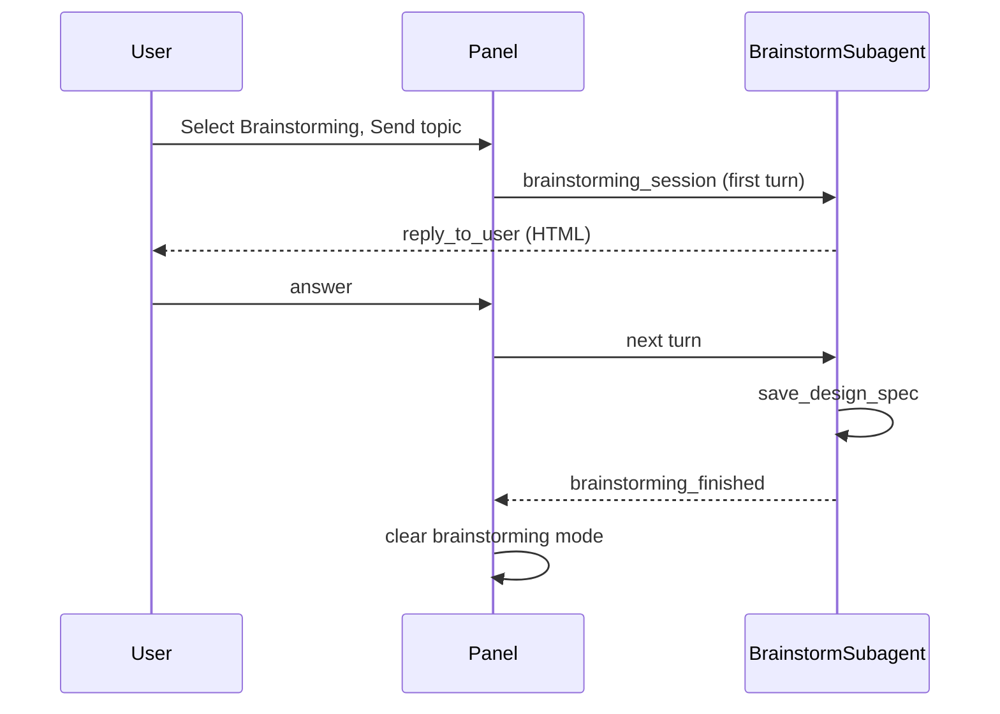

# Brainstorming mode (sidebar-only)

Brainstorming is a **multi-turn design sub-agent** the user starts from the Writer sidebar mode dropdown. It explores ideas with the user, can use web and document research, and writes an **approved HTML design spec** into the active Writer document.

**Entry:** Writer deck → mode dropdown → **Brainstorming** → Send (first message sets the topic).

Brainstorming is **not** exposed to the main chat LLM (`delegate_to_specialized_writer_toolset` omits `brainstorming` and `writing_plan` via `WRITER_SIDEBAR_ONLY_DOMAINS` in [`plugin/framework/constants.py`](../plugin/framework/constants.py)).

**Exit:** `brainstorming_finished` resets the dropdown to **Chat** (or **Writing Plan** when a spec was saved). Changing the dropdown away from Brainstorming mid-session cancels the in-progress session (history is kept).

**Not in v1:** Visual companion (browser mockups), Calc/Draw spec save.

---

## Flow



| Phase | Handler |
|-------|---------|
| Turn 0 | User selects Brainstorming; first Send sets topic |
| Turns 1..N | Panel routes Send to `brainstorming_session` (bypasses main tool loop) |
| Exit | `brainstorming_finished` clears `_in_brainstorming_mode` |

Implementation: [`plugin/chatbot/brainstorming.py`](../plugin/chatbot/brainstorming.py), [`plugin/chatbot/panel.py`](../plugin/chatbot/panel.py), [`plugin/chatbot/send_handlers.py`](../plugin/chatbot/send_handlers.py).

---

## HTML everywhere

All brainstorming outputs use HTML — no Markdown in tool arguments.

| Surface | Format |
|---------|--------|
| Sidebar (`reply_to_user`, `brainstorming_finished`) | Single HTML string (`<p>`, `<h2>`, `<ul>`, …) |
| Saved spec (`save_design_spec`) | JSON **array** of HTML strings (same as `apply_document_content.content`) |
| Research shown to user | Sub-agent reformats plain-text web/doc results as HTML in chat |

Rules: [`HTML_FRAGMENT_RULES`](../plugin/framework/constants.py), [`WRITER_APPLY_DOCUMENT_HTML_RULES`](../plugin/framework/constants.py), [`get_chat_response_format_instructions`](../plugin/framework/constants.py).

Example spec array:

```json
[
  "<h1>Design: Feature Name</h1>",
  "<p><em>Status: approved</em></p>",
  "<h2>Goals</h2>",
  "<ul><li>…</li></ul>",
  "<h2>Architecture</h2>",
  "<p>…</p>"
]
```

`save_design_spec` uses `target="end"` by default; `full_document` only when the doc is empty.

---

## Sub-agent tools

| Tool | Role |
|------|------|
| `brainstorm_research_web` | Public web research (plain text in; HTML summary out via `reply_to_user`) |
| `list_nearby_files`, `grep_nearby_files`, `delegate_read_document` | Same-folder document research |
| `get_document_content`, `get_document_tree`, `search_in_document` | Active Writer context |
| `save_design_spec` | **Only** document write path |
| `reply_to_user` | Continue conversation (smol final-answer tool) |
| `brainstorming_finished` | End session |

Raw `apply_document_content` is **not** exposed to the brainstorming sub-agent.

---

## Prompt source

Adapted from [superpowers brainstorming](../superpowers/skills/brainstorming/SKILL.md) (not runtime-imported). The skill file is not loaded at runtime; excerpts are vendored into constants and few-shots.

| Superpowers section | WriterAgent adaptation |
|---------------------|------------------------|
| HARD-GATE | No implementation until `save_design_spec` |
| Anti-pattern “too simple” | Short designs still require approval |
| Scope decomposition | Flag multi-subsystem requests; one sub-project per session |
| One question / multiple choice | `reply_to_user`, one question per turn |
| 2–3 approaches + recommendation | HTML `<ul>`, lead with recommended option, YAGNI |
| Design sections | goals, architecture, components, data flow, error handling, testing |
| Design for isolation | DESIGN QUALITY block in prompt |
| Existing codebases | Explore first; targeted improvements only |
| Spec self-review (4 checks) | Step 5 before `save_design_spec` |
| User review gate | Step 7 — review spec in document before `brainstorming_finished` |
| Key principles | YAGNI, incremental validation, flexibility |
| Visual companion | Not in v1 |
| Markdown spec + git commit | Replaced by HTML array in Writer document |
| writing-plans handoff | Optional transition to Writing Plan sidebar mode after spec save |

Constants: `BRAINSTORMING_SUB_AGENT_INSTRUCTIONS`, `get_brainstorming_sub_agent_instructions()` in [`plugin/framework/constants.py`](../plugin/framework/constants.py). Few-shots: `BRAINSTORMING_EXAMPLES` in [`plugin/chatbot/smol_examples.py`](../plugin/chatbot/smol_examples.py) (approaches, section approval, self-review, full spec save).

---

## Tests

[`tests/chatbot/test_brainstorming.py`](../tests/chatbot/test_brainstorming.py) — delegate enum exclusion, `save_design_spec` HTML passthrough, smol examples.
