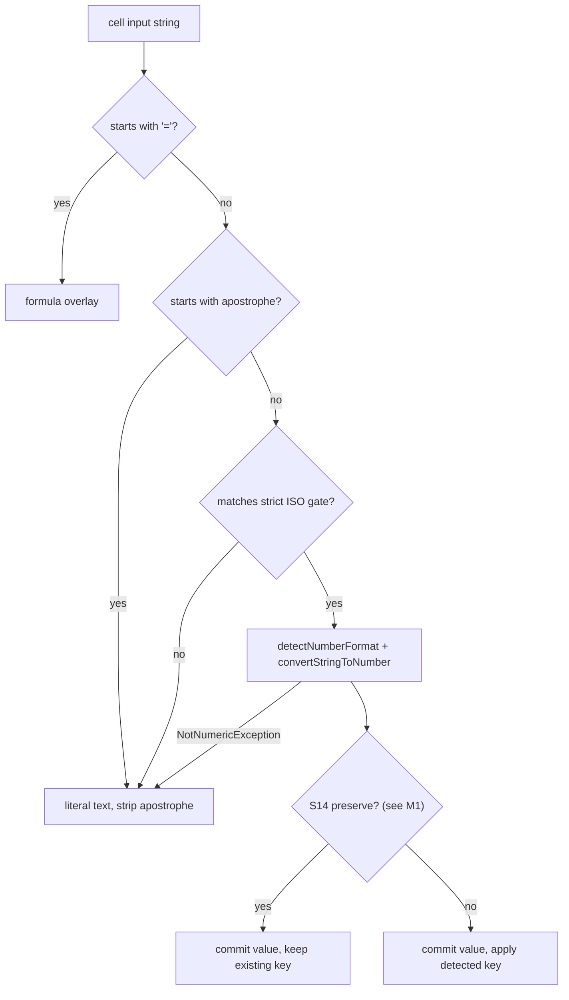

# Date and Time Lifecycle in LibreOffice Calc

**Wire contract and write-path implementation plan**

This document covers PyUNO cell values, read-path format enrichment, MCP clock context, and the planned conversion of date/time strings into Calc serial values.

### LLM wire schema

For LLM tools (`read_cell_range` with format enrichment; the same strings are the write target), a date/time-formatted numeric cell looks like:

```json
[
  {"address": "A20", "value": "2026-08-05", "formula": null, "type": "date", "format_category": "date"},
  {"address": "B20", "value": "08:00:00", "formula": null, "type": "time", "format_category": "time"}
]
```

- `value` is the ISO 8601 string (`YYYY-MM-DD`, `HH:MM:SS`, or `YYYY-MM-DDTHH:MM:SS`).
- `type` and `format_category` are `date`, `time`, or `datetime`.
- There is no separate `iso8601` field.
- Internal callers (`CellInspector.read_range(include_format_info=False)`) still receive raw Calc serial floats for NumPy / `=PY` / analysis.

> **Status:** MCP clock context is in place. ISO-shaped write ingestion is not. Sections marked **Target** describe future write behavior.

> **Write design (locked):** After a strict ISO gate, convert with `XNumberFormatter.detectNumberFormat` / `convertStringToNumber`, commit the serial, and apply the detected format key when the destination does not already display the value losslessly. Do not hand-roll epoch arithmetic or format codes; do not rely on `setFormula` alone (it leaves General and breaks read enrichment).

> **Every LibreOffice behavior claim in this document was measured**, not assumed. See [§8 Measured behavior](#8-measured-behavior-libreoffice-26252). Re-run the probes before trusting any claim here on a new LibreOffice major version.

---

## 1. Context & Problem Statement

### 1.1 The Calc Date/Time Storage Model

Calc's **PyUNO cell API** operationally represents constant dates, times, and datetimes as numeric values. This does not mean that file formats lack typed date/time values: ODF has `office:value-type="date"` / `"time"` with `office:date-value` / `office:time-value`, and SpreadsheetML also supports typed ISO dates. This plan concerns Calc's runtime cell API, not the on-disk representation.

1. **Cell content type**: A constant date/time cell is `com.sun.star.table.CellContentType.VALUE`; a formula that evaluates to a date/time remains `FORMULA`. Text that resembles a date remains `TEXT`.
2. **Epoch serial representation**: Runtime values are floating-point day counts relative to the document's `NullDate` (the common Calc default is `1899-12-30`).
   - `46239.0` represents `2026-08-05`.
   - `0.3333333333333333` represents `08:00:00` (8 hours / 24 hours).
   - `46240.5` represents `2026-08-06 12:00:00`.
3. **Display formatting**: Presentation (`2026-08-05`, `08/05/2026`, or `46239`) comes from the cell's `NumberFormat` key in the document's `XNumberFormats` registry.

`format_category` therefore describes the **number format**, not an intrinsic cell data type. An arbitrary number can be date-formatted.

#### Glossary

Used interchangeably elsewhere; fixed here. **Serial** (or *day serial*, *serial double*) is the floating-point day count relative to `NullDate`. **Category** is one of `date` / `time` / `datetime`, derived from the number format's `Type` bitmask, never from the cell content type. **Format key** is the integer index into the document's `XNumberFormats` registry.

#### Durations are not a separate category in practice

Earlier revisions of this document claimed that `NumberFormat.DURATION` (8196) is excluded from the enrichment contract, and treated that as protection for elapsed-time columns. **That protection does not exist.** Measured on LibreOffice 26.2.5.2, every elapsed-time format reports `Type` = `TIME` (4) or `DEFINED|TIME` (5), never 8196:

| Format code | `Type` | `_format_category_from_type` |
| :--- | :--- | :--- |
| `[HH]:MM:SS` (also built-in formatindex 43) | 4 | `"time"` |
| `[H]:MM` | 5 | `"time"` |
| `[MM]:SS` | 5 | `"time"` |
| `HH:MM:SS` | 4 | `"time"` |

Consequence, verified end to end: a cell holding `1.25` under `[HH]:MM:SS` displays `30:00:00`, but `read_cell_range` reports `"value": "06:00:00"` with `type: "time"`. The whole day is silently dropped by `.time()` in `_iso8601_from_serial` ([plugin/calc/inspector.py](../plugin/calc/inspector.py)). This is a **live read-path bug**, independent of the write work — see [§3.2](#32-known-read-path-bug-elapsed-times-over-24-hours).

### 1.2 The LLM Friction Point

When an LLM generates data to write (e.g. `["2026-08-08", "08:00"]`), standard string assignment puts literal text (`com.sun.star.table.CellContentType.TEXT`) into the cell. This breaks spreadsheet formulas (e.g. `=A26+1`), numeric sorting, and native Calc filtering.

---

## 2. Lifecycle Architecture

The end-to-end date/time architecture consists of three synchronized phases:

```
┌────────────────────────────────────────────────────────────────────────────────┐
│                         A. MCP & PROMPT CONTEXT                                │
│  Injects the local clock into initialization instructions and tool guidance    │
└───────────────────────┬────────────────────────────────────────────────────────┘
                        │
                        ▼
┌────────────────────────────────────────────────────────────────────────────────┐
│                         B. READ PATH ENRICHMENT                                │
│  detects NumberFormat category ──► serial → ISO in value + type/format_category │
└───────────────────────┬────────────────────────────────────────────────────────┘
                        │
                        ▼
┌────────────────────────────────────────────────────────────────────────────────┐
│                         C. WRITE PATH INGESTION                                │
│  gates ISO string ──► Calc detects format + value ──► applies key if needed    │
└────────────────────────────────────────────────────────────────────────────────┘
```

**Implementation status:**

- MCP clock context is in place; write-tool ISO guidance is not.
- ISO string → serial + `NumberFormat` is **planned**. Policy in [§5.1](#51-decision-ledger) Settled; a few mechanism items remain Open there.
- Duration enrichment bug in §3.2 is outstanding.

---

## 3. Read Path

### 3.1 Mechanism

When `read_cell_range` is invoked with `include_format_info=True` (enabled by default for LLM tool invocations), enrichment follows the wire schema above:

1. **Pre-flight Check**: To prevent performance degradation on large datasets, `CellInspector._range_format_rows()` scans the range for cell formats. If no date/time formats or formulas exist in the target block, format inspection returns early.
2. **Format grouping**: Queries `cell_range.getUniqueCellFormatRanges()` to group cells sharing a format. The response still requires an $O(N \times M)$ serialization walk, but format-related UNO round-trips scale with format groups rather than cells.
3. **Format classification**: Reads `getByKey(format_id).getPropertyValue("Type")`, masks `NumberFormat.DEFINED`, and classifies:
   - `NUMBER_FORMAT_DATE` $\rightarrow$ `"date"`
   - `NUMBER_FORMAT_TIME` $\rightarrow$ `"time"`
   - `NUMBER_FORMAT_DATE | NUMBER_FORMAT_TIME` $\rightarrow$ `"datetime"`
4. **Serial-to-ISO translation**:
   Reads `NullDate` from `doc.getNumberFormatSettings().getPropertyValue("NullDate")` and computes:

   ```text
   timestamp = NullDate + timedelta(seconds=round(serial_value * 86400))
   ```

   Then sets `value` to the ISO string, `type` to the category, and `format_category`. Helpers live in [plugin/calc/inspector.py](../plugin/calc/inspector.py).

### 3.2 Known read-path bug: elapsed times over 24 hours

Because elapsed formats classify as `"time"` (§1.1), `_iso8601_from_serial` routes them through `.time()`, which discards whole days:

| Cell value | Format | Calc displays | LLM `value` reported | Correct? |
| :--- | :--- | :--- | :--- | :--- |
| `1.25` | `[HH]:MM:SS` | `30:00:00` | `06:00:00` | No |
| `0.333…` | `[HH]:MM:SS` | `08:00:00` | `08:00:00` | Yes |

The existing comment at [plugin/calc/inspector.py](../plugin/calc/inspector.py) anticipates the ambiguity but the guard was written against `NumberFormat.DURATION`, which never fires. Options, in preference order:

1. Detect elapsed formats by inspecting the `FormatString` for a bracketed leading element (`[H`, `[HH`, `[MM`, `[SS`), and omit enrichment for those cells (keep raw serial / `type: "value"` as originally intended for non-clock times).
2. Emit an ISO 8601 duration (`PT30H`) under a distinct key, which is a wire-contract change.
3. Enrich only when the serial is below `1.0`.

Recommend option 1: it restores the documented intent with a single string check and no contract change. Fix separately from Area C.

---

## 4. Prompting and Context (Partly Implemented)

### 4.1 Connection-Time Clock Context

[plugin/mcp/mcp_protocol.py](../plugin/mcp/mcp_protocol.py) injects current local clock context into MCP system instructions:

```python
def _format_mcp_clock_context(now: datetime.datetime | None = None) -> str:
    local_now = now.astimezone() if now is not None else datetime.datetime.now().astimezone()
    timezone_name = local_now.tzname()
    timezone_suffix = f" ({timezone_name})" if timezone_name else ""
    return f"Current local date and time: {local_now.strftime('%A')}, {local_now.isoformat(timespec='seconds')}{timezone_suffix}."
```

Example string prepended to system instructions:
`Current local date and time: Friday, 2026-08-07T11:04:25-04:00 (EDT).`

**Policy (resolved):** Calc serials are timezone-less, and offset-bearing strings such as `2026-08-08T08:00:00-04:00` stay literal text. This costs nothing to enforce — Calc's own scanner rejects both `Z` and numeric offsets in every locale tested (§8). The remaining hazard is that the clock context prints exactly the shape we reject, so the write-tool description must tell the model to drop the offset.

The previously "unresolved" alternative — preserve wall-clock fields and discard the offset — is **rejected for v1**. It is lossy in a way the cell cannot record, and converting to a document-local time is not reliable without a document timezone and DST rules. Revisit only with a stored document timezone.

### 4.2 Tool Schema Definitions

- **`ReadCellRange`** (`read_cell_range` in [plugin/calc/cells.py](../plugin/calc/cells.py)): see the LLM wire schema above.
- **`WriteCellRange`** (`write_formula_range`): **does not yet** mention date/time strings.

Proposed description text, to be reviewed for accuracy and token cost before it ships. Tool descriptions are paid for on every request, so the wording is part of the contract, not a comment:

> Dates and times: use ISO 8601 only — `YYYY-MM-DD`, `HH:MM[:SS]`, or `YYYY-MM-DDTHH:MM[:SS]`. These become real Calc date/time values. Do not include a timezone offset or `Z`, and do not use locale forms like `08/05/2026`; those are stored as text. Prefix with an apostrophe (`'2026-08-08`) to force text.

Do not broaden write parsing to locale display forms. §8 shows `08/05/2026` resolves to **2026-08-05** under `en-US` but **2026-05-08** under `fr-FR`.

---

## 5. Write Path (Target)

*Implementation plan — not yet in code*

The first implementation applies only to the public `write_formula_range` path in [plugin/calc/manipulator.py](../plugin/calc/manipulator.py), which is the sole cell-writing entry point for this tool.

### 5.1 Decision Ledger

Policy from the probes is closed under **Settled**. A short **Open** table remains for mechanism choices that still need a decision (or one measurement) before Phase 3 — these are easy to miss because the product rules above them already sound final.

#### Settled (build against these)

| ID | Decision |
| :--- | :--- |
| S2 | A leading `=` routes to the formula path and never reaches the date gate. |
| S3 | The accepted grammar (§5.3) is the wire contract; it is a gate, not a parser. |
| S4 | Anything the gate rejects is written as literal text. |
| S5 | `include_format_info=False` callers stay un-enriched. |
| S6 | Time-only serials are independent of `NullDate`. |
| S7 | Never pass ASCII format codes such as `"YYYY-MM-DD"` to `queryKey` for defaults (§6). |
| S8 | Batch the value commit; apply formats per contiguous block, never per cell in a loop. |
| S9 | The mixed-formula commit fix (§5.5 step 2) merges independently of the feature. |
| S10 | Scope is `write_formula_range` only. `=PY` spill, `spreadsheet_import/preserve.py`, `insert_cell_html`, and `editselection` keep current semantics, because they carry real Python types or source-file formats. |
| S11 | Tests split unit and UNO per [AGENTS.md](../AGENTS.md). |
| S12 | Fractional seconds, leap seconds, `24:00`, durations-as-input, and locale display forms stay out of scope. |
| S13 | Inspect destination formats only when at least one value passed the gate. |
| S14 | Preserve the destination `NumberFormat` when it already displays the committed value without loss; otherwise apply the detected key. *(How to detect “lossless” is still Open — full recommendation in [M1](#m1-recommendation--deciding-s14-lossless).)* |
| S15 | Midnight datetime into a date cell, and date into a datetime cell, preserve the existing format (lossless under S14). |
| S16 | Time into an elapsed-time cell (`[HH]:MM` / `[HH]:MM:SS`) preserves that format. |
| S17 | ISO string into a Text (`@`) cell: apply the detected temporal format (`@` does not block conversion). |
| S18 | Leading apostrophe (`'2026-08-08`) forces literal text (and sets the cell format to `@`). |
| S19 | Gate stays padded in v1; reject unpadded `2026-8-8`. |
| S20 | Offset and `Z` datetimes stay text; tool wording in §4.2 must say so. |
| S21 | Bare `08:00` is always a clock serial below `1.0`; never impute today's date from clock context. |
| S22 | Partial coercion is per-cell, with a coercion summary in the return message. |
| S23 | Range bounds are left to `NotNumericException` and Calc's own limits. |
| S24 | No format application for formula cells in v1. |
| S25 | Empty cells inside a coerced contiguous block receive the block format. |
| S26 | Route `set_style(number_format=…)` date/time cases through the same helper as the write path. |
| S27 | Use the key returned by `detectNumberFormat` as-is (including locale-preferred times such as `en-US` AM/PM). |
| S28 | Locale is an explicit argument to `detectNumberFormat` / `getStandardIndex`, not an ambient document property. *(Which locale struct to pass is still Open — see M2.)* |
| S29 | On text fallback, restore the prior `NumberFormat` key after `setDataArray` (which otherwise forces `@`). |
| S30 | The format pass is best-effort: log failures and return success with a note rather than failing the whole write. |

#### Open (mechanism — resolve before Phase 3)

These are not re-opened product debates. Each is a how-to that is expensive to reverse once coded into `write_formula_range`.

| ID | Situation | Recommendation | What closes it |
| :--- | :--- | :--- | :--- |
| M1 | How does the code decide S14 “lossless”? | Gate category × dest category × midnight predicate ([full write-up below](#m1-recommendation--deciding-s14-lossless)). Reject display-string compare and `getInputString` round-trip. | Design sign-off |
| M2 | Which `Locale` does S28 pass to `getStandardIndex`? | Document `CharLocale` (same as current `set_style`). Alternatives: UI/system locale, or fixed `en-US`. | Design sign-off (+ quick check that CharLocale vs view locale can diverge) |
| M3 | Does `setDataArray` with **floats** preserve an existing `NumberFormat`? | Expect yes (only the string path was measured forcing `@`). If yes, snapshot keys only for text fallbacks (S29); if no, snapshot before every commit. | One measurement |

#### M1 recommendation — deciding S14 “lossless”

**Status: Open.** This subsection is a complete mechanism proposal for sign-off, not a settled rule. S14–S17 state *what* to preserve; M1 is *how the code decides*. Nothing below is coded yet (`write_formula_range` never sets `NumberFormat` today).

##### Proposed rule

Preserve the destination key when a **gate category × destination category × midnight** predicate says keep; otherwise apply the key from `detectNumberFormat`.

Do **not** decide losslessness by comparing locale display text to the ISO input, and do **not** use `getInputString` → re-parse as the primary check (see [Rejected alternatives](#rejected-alternatives) below).

##### Preserve matrix

| Input (which §5.3 gate matched) | Dest DATE | Dest DATETIME | Dest TIME (clock or elapsed) | Non-temporal (General, `@`, NUMBER, …) |
| :--- | :---: | :---: | :---: | :---: |
| date | keep | keep (S15) | apply | apply |
| time | apply | apply | keep (S16) | apply |
| datetime, midnight | keep (S15) | keep | apply | apply |
| datetime, not midnight | apply | keep | apply | apply |

Elapsed formats (`[HH]:MM`, `[HH]:MM:SS`, …) report `Type` `TIME` / `DEFINED|TIME`, never `DURATION` 8196 (§1.1, §8.3). For this predicate, `dest_category == "time"` already covers clock and elapsed, so S16 needs no extra branch. (The §3.2 read-path `FormatString` bracket check remains a **read** concern; it is not required to evaluate S14 preserve.)

##### Exact predicate

At format-apply time, for each gated cell already converted:

| Input | Source |
| :--- | :--- |
| `input_category` | `"date"` \| `"time"` \| `"datetime"` from **which gate regex matched**, never from `detected_key` Type |
| `serial` | float from `convertStringToNumber` |
| Destination | cell `NumberFormat` key → `Type` via `formats.getByKey` (cache per key for the invocation) |

```text
dest_category = _format_category_from_type(Type)   # plugin/calc/inspector.py; None → non-temporal
is_midnight   = abs(serial - floor(serial)) < 1e-9 # whole-second wire; aligned with read-path second rounding

preserve iff:
  dest_category is not None
  AND (
    (input_category == "date"     AND dest_category in ("date", "datetime"))
    OR (input_category == "time"  AND dest_category == "time")
    OR (input_category == "datetime" AND dest_category == "datetime")
    OR (input_category == "datetime" AND dest_category == "date" AND is_midnight)
  )
```

Else → apply `detected_key`.

Reuse [`_format_category_from_type`](../plugin/calc/inspector.py) (`DATE` 2 / `TIME` 4 / `DATETIME` 6, `DEFINED` masked off). Document the epsilon next to the helper; do not invent a second NullDate-based midnight check.

##### Why this shape (not naive “same Type”)

Settled product rules already reject naive category equality:

- A date-formatted cell given `08:00` displays the NullDate calendar day (`1899-12-30` under the usual epoch) — lossy → **apply**.
- Elapsed and clock share `Type` `TIME`. Time into `[HH]:MM` must **keep** (S16); date into that same Type must **apply**.
- Midnight datetime → date, and date → datetime, keep the user’s key (S15); non-midnight datetime → date drops the time → **apply**.
- General and `@` are non-temporal (`dest_category is None`) → **apply** (S17: `@` must not keep showing the raw serial).

Eike Rathke’s note that date/time-ness is format-driven, not a cell content type, and that `TIME` may hold values `>= 1.0`, is the same underlying model: [libreoffice list, July 2018](https://lists.freedesktop.org/archives/libreoffice/2018-July/080606.html) (already cited from `inspector.py`).

##### Rejected alternatives

**1. Compare `convertNumberToString(dest_key, serial)` to the gated ISO input.** Invalid. That API returns locale *display* (`08/05/2026`, `08:00:00 AM`), not wire ISO. Equality would false-negative almost every preserve case under non-ISO column formats. See [`XNumberFormatter.convertNumberToString`](https://api.libreoffice.org/docs/idl/ref/interfacecom_1_1sun_1_1star_1_1util_1_1XNumberFormatter.html).

**2. `getInputString(dest_key, serial)` then `convertStringToNumber(dest_key, …)` and compare serials.** This is the only serious format-and-compare oracle: the IDL states the input-line string always re-parses with the *same* key. It would catch truncated codes (`YYYY-MM` losing the day) and non-midnight datetime→date. Recommend **against** it as the S14 mechanism:

- It is stricter than S14–S16 product intent: compatible-category preserve keeps the user’s column style; the full serial remains in the cell even when display is short.
- It would replace intentional month/short formats the user chose.
- `@` / TEXT still needs an explicit apply branch (`convertStringToNumber` does not convert text formats).
- Extra UNO per key versus O(distinct keys) `Type` lookups the read path already uses.

If sign-off prefers round-trip instead, the matrix above is the thing being replaced — not a stub to finish later. If sign-off accepts the matrix, round-trip stays a non-goal unless a production bug falsifies the matrix (then reopen M1 / S14 with evidence).

**3. Trust `NumberFormat.DURATION` (8196).** Measured never to appear on elapsed formats (§8.3). Do not read that bit for preserve/apply.

##### Edge cases the implementation must not invent

- **Gate owns `input_category`.** Detection may return locale AM/PM time keys; that must not reclassify a gated datetime or date.
- **Formula cells (S24):** never enter the format pass.
- **Empty cells in a coerced block (S25):** follow the block’s format decision; do not run the predicate on empty alone.
- **Idempotent second write (§7.4):** same ISO into an already-matching temporal cell → preserve → no format IPC.
- **Never use the `DURATION` bit** for this decision.
- **Performance:** cache `(key → dest_category)` for the invocation; fits S8 / S13 (inspect destinations only when something passed the gate; apply by contiguous block).

##### What closes M1

Design sign-off on this subsection (or an explicit alternate written here). The destination-format matrix probe under “Still to write” is a fixture aid for UNO tests; it is not required to choose between the matrix and round-trip.

#### Why these rules

Probe measurements in §8 closed the former product-level open questions. The non-obvious settled ones, briefly:

- **Lossless preserve (S14–S16), not bare “same category”.** A date-formatted cell given `08:00` displays `1899-12-30` (wrong category → must apply). Bare equality also misses S15 cross-keeps (midnight datetime→date, date→datetime) and does not by itself explain S16 (elapsed shares `Type` `TIME` with clock). **How to detect lossless is still Open — see [M1](#m1-recommendation--deciding-s14-lossless).**
- **`@` must get a temporal format (S17).** The Text format does not block API conversion; leaving `@` shows the raw serial.
- **Strict padded gate (S19); offsets stay text (S20).** Unpadded `2026-8-8` is unambiguous in every locale tested, but admitting it is a one-line later change. Calc rejects `Z`/offsets everywhere; the tool description must still tell the model to drop the offset printed by MCP clock context.
- **No date imputation for bare times (S21).** Matches the read-path wire schema (`type: "time"`).
- **Detected key as-is (S27–S28).** Hand-building localized format letters is unsafe (§6.1). Display is not part of the wire contract, so `en-US` AM/PM times are fine. Passing an explicit locale key dissolves ambient-locale selection.
- **Restore format on text fallback (S29).** `setDataArray` with a number-like string forces `@` and would otherwise strip a date column when one near-miss lands in the range.
- **Best-effort format pass (S30).** Values are the payload; a failed cosmetic pass must not look like a failed write.

**Still to write:** a destination-format matrix probe under [`scripts/playground/`](../scripts/playground/) covering date+time, datetime+date, elapsed+clock, and `@`+ISO. Existing probes already justify the rules above; this script is the dedicated fixture so implementers and UNO tests can copy measured expectations without re-deriving them.

### 5.2 Write conversion design

Per gated cell, convert and obtain a format key through `XNumberFormatter` (locked at the top of this document). Hand-rolling serial arithmetic or ASCII format codes is rejected: localized format letters differ by locale (§6.1), and `detectNumberFormat` already returns the right key. Relying on `setFormula` alone is also rejected: it converts the value but leaves the cell **General**, so the cell displays `46242` and `read_cell_range` does not enrich it as a date (§8.1, §8.4).

```python
# formatter: com.sun.star.util.NumberFormatter, attached to the document's
# XNumberFormatsSupplier once per invocation.
# std_key: formats.getStandardIndex(locale) — locale is explicit (S28).
# Calc parses in the locale of the key you hand it.
try:
    detected_key = formatter.detectNumberFormat(std_key, text)
    value = formatter.convertStringToNumber(std_key, text)
except NotNumericException:
    ...  # literal text fallback
```

`detected_key` already carries the correct localized format code — `YYYY-MM-DD` under `en-US`, `JJJJ-MM-TT` under `de-DE`, `AAAA-MM-JJ` under `fr-FR` — which is precisely what §6.1 warns is unsafe to hand-build.

#### The gate stays mandatory

Delegating parsing does **not** mean delegating the contract. Calc's scanner is far more permissive than our wire subset and is locale-dependent for exactly the forms we must reject:



The S14 decision node is mechanism Open — proposed algorithm in [M1](#m1-recommendation--deciding-s14-lossless).

Without the gate, `08/05/2026` becomes 5 August under `en-US` and 8 May under `fr-FR`, and `30:00` silently becomes `1.25`.

### 5.3 Accepted grammar (the gate)

- Date: `YYYY-MM-DD`
- Time: `HH:MM` or `HH:MM:SS`
- Datetime: `YYYY-MM-DDTHH:MM[:SS]`
- Compatibility datetime: one space may replace `T`
- Leading/trailing whitespace may be stripped

Fast prefilter before regex:

```python
if not any(c in val for c in ("-", ":")):
    return None  # Skip regexes for plain text, numbers, and prose
```

```python
_DATE_RE = re.compile(r"^(\d{4})-(0[1-9]|1[0-2])-(0[1-9]|[12]\d|3[01])$")
_TIME_RE = re.compile(r"^([01]\d|2[0-3]):([0-5]\d)(?::([0-5]\d))?$")
_DATETIME_RE = re.compile(
    r"^(\d{4})-(0[1-9]|1[0-2])-(0[1-9]|[12]\d|3[01])[T ]"
    r"([01]\d|2[0-3]):([0-5]\d)(?::([0-5]\d))?$"
)
```

Under this design these are a **shape filter only**. Calendar validity, epoch arithmetic, and format selection all belong to Calc. `2026-02-30` passes the regex and then fails `detectNumberFormat`, which is the intended fallback to text.

What the gate deliberately rejects, and what Calc would otherwise do with it (§8):

| Input | Calc would produce | Gate verdict |
| :--- | :--- | :--- |
| `2026-8-8` | date, identical in all locales | Text (S19) |
| `08/05/2026` | `en-US` 5 Aug, `fr-FR` 8 May, `de-DE` text | Text |
| `05.08.2026` | `de-DE`/`fr-FR` date, `en-US` text | Text |
| `08:00 AM` | `en-US`/`fr-FR` time, else text | Text |
| `08:00:00.500` | time with fractional seconds | Text |
| `24:00` | `1.0` | Text |
| `30:00` | `1.25` | Text |
| `2026-08-08T08:00:00Z` | text in every locale | Text |

### 5.4 Execution Workflow in `CellManipulator.write_formula_range`

**Critical:** today's code, when any cell in the range is a formula, commits the **entire** range via `setFormulaArray` of stringified inputs and ignores `data_array`. The defect is not that native types break — numbers survive — it is that the two commit paths disagree on both type and format for the same input string:

| Same input `"2026-08-08"` | Result |
| :--- | :--- |
| via `setDataArray` (formula-free range) | `TEXT`, and the cell's format is rewritten to `@` |
| via `setFormulaArray` (mixed range) | `VALUE` `46242.0`, format left `General` |

So date handling **already** differs today depending on whether the range happens to contain a formula. Fix the commit path first (§5.5 step 2).

1. **Resolve document context once**: the formatter, `getStandardIndex(locale)`, and `NullDate` (still needed for read-side symmetry and diagnostics).
2. **Classify each input**: `=` prefix → formula overlay; apostrophe → text; gate match → temporal candidate; else `float()` → number; else text.
3. **Convert temporal candidates** via `detectNumberFormat` / `convertStringToNumber`, recording `(value, detected_key)`. On `NotNumericException`, demote to text.
4. **Commit values** with one `setDataArray`, leaving formula cells empty.
5. **Overlay formulas** with `setFormula` per recorded cell. Never send ISO strings through `setFormulaArray`.
6. **Apply formats** per contiguous block, skipping cells the S14 predicate says to preserve ([M1](#m1-recommendation--deciding-s14-lossless) — still Open). Cache destination category per format key for the invocation. Skip formula cells (S24); include empties inside a coerced block (S25).

#### Failure modes and partial writes

`write_formula_range` currently wraps everything in one `try` / `except` that raises `ToolExecutionError`. If step 4 succeeds and step 6 throws, the serials are committed and rendering as raw numbers while the tool reports failure. Per S30 the format pass is **best-effort**: log the exception and return `wrote values; could not apply date formats`.

`WriteCellRange.execute` in [plugin/calc/cells.py](../plugin/calc/cells.py) already opens `WriterCompoundUndo`, so all steps collapse into one undo entry **only if** the format pass lives inside `write_formula_range`. The scripting API path in [plugin/scripting/writeragent_api.py](../plugin/scripting/writeragent_api.py) has no compound undo.

#### Coercion report

Return what actually happened (S22), so the model can self-correct without a second read:

```
Range A1:A12 filled with 12 values (10 dates, 2 text).
```

This is the only signal the model gets that `2026-08-08T08:00:00Z` silently became text.

#### Worked example

Input `["2026-08-08", "08:00", "08/05/2026", "=A1+1"]` into `A1:D1`, all cells General, `en-US`:

| Cell | Committed as | Format key applied | Displays | `read_cell_range` returns |
| :--- | :--- | :--- | :--- | :--- |
| A1 | `46242.0` | detected date | `2026-08-08` | `value: "2026-08-08"`, `type: "date"` |
| B1 | `0.3333…` | detected time | `08:00:00 AM` (locale-preferred; S27) | `value: "08:00:00"`, `type: "time"` |
| C1 | text `08/05/2026` | none; restore prior key if the cell had one (S29) | `08/05/2026` | plain text, no date enrichment |
| D1 | formula | none (S24); Calc propagates from A1 | `2026-08-09` | `value: "2026-08-09"`, `type: "date"` |

Return message: `Range A1:D1 filled with 4 values (2 dates, 1 text, 1 formula).`

### 5.5 Merge-Safe Implementation Sequence

1. **Read-path duration fix** (§3.2). Independent, small, and fixes a shipping bug.
2. **Mixed-formula commit correction.** Change `write_formula_range` to commit `data_array` first and overlay formulas. Add regression coverage proving a formula-free range and a mixed range now treat the same input identically.
3. **Complete user-visible feature.** Gate, `detectNumberFormat` conversion, lossless format policy (S14), tool-schema guidance, coercion report, and UNO write/readback tests together. Do not merge a state that writes serials without usable number formats — that is exactly the `setFormula`-only failure (General / no enrichment).

### 5.6 Performance rules

1. $O(1)$ char guard before regex (§5.3).
2. Never set `NumberFormat` per cell in a loop. Homogeneous ranges get one range set; sparse grids coalesce into contiguous same-category blocks.
3. Cache the formatter, the standard key, and resolved format keys per category for the invocation.
4. Only inspect destination formats when at least one value passed the gate (S13).

A homogeneous write should cost roughly: one formatter setup, one `getStandardIndex`, two calls per distinct input string, one `setDataArray`, and one format-block set. Sparse mixed grids scale with formula overlays and block count. These are design targets, not guarantees.

### 5.7 Follow-ups

- Locale-display write parsing.
- Fractional seconds, offsets/timezones, `24:00`, leap seconds, and durations as input.
- Changing NumPy / `include_format_info=False` raw serial behavior (stays out of scope — internal pipelines keep floats).
- `=PY` spill coercion, NumPy `datetime64` epoch conversion, and spreadsheet-import epoch cleanup.
- `getInputString` round-trip as an S14 oracle is **not** a planned follow-up; it is an alternate considered under [M1](#m1-recommendation--deciding-s14-lossless). Only reopen if sign-off picks it, or a bug falsifies the matrix.

---

## 6. Locale and Number Formats

### 6.1 Why format codes cannot be hardcoded

Format code letters are localized. Passing raw ASCII codes like `"YYYY-MM-DD"` to `XNumberFormats.queryKey()` can fail or silently create an unintended custom format:

- **German (`de-DE`)**: `JJJJ-MM-TT`
- **French (`fr-FR`)**: `AAAA-MM-JJ`
- **Swedish (`sv-SE`)**: `YYYY-MM-DD` for dates, but `TT:MM:SS` for times

These are not hypothetical; they are the exact strings `detectNumberFormat` returned in §8.

### 6.2 Detected keys carry localized format codes

`detectNumberFormat` hands back a key that already carries the right localized code, so there is nothing to compose and nothing to guess:

| Input | `en-US` | `de-DE` | `fr-FR` | `sv-SE` |
| :--- | :--- | :--- | :--- | :--- |
| `2026-08-08` | `YYYY-MM-DD` | `JJJJ-MM-TT` | `AAAA-MM-JJ` | `YYYY-MM-DD` |
| `08:00` | `HH:MM:SS AM/PM` | `HH:MM:SS` | `HH:MM:SS` | `TT:MM:SS` |
| `2026-08-08T08:00:00` | `YYYY-MM-DD"T"HH:MM:SS` | `JJJJ-MM-TT"T"HH:MM:SS` | `AAAA-MM-JJ"T"HH:MM:SS` | `YYYY-MM-DD"T"TT:MM:SS` |

In all cases the production classifier `_format_category_from_type` returns the expected `date` / `time` / `datetime`, so the read path round-trips.

Dates detect as ISO everywhere, but `en-US` times detect as `HH:MM:SS AM/PM`. Per S27 the write path takes that detected key; the wire contract on read is already locale-independent ISO regardless of display.

### 6.3 Locale-Independent Wire Contract

1. **Read:** LLM wire schema above. Internally, `_iso8601_from_serial()` stays the converter.
2. **Write:** the gate accepts only the locale-independent subset in §5.3.
3. **Display:** whatever key Calc detects for that locale. Display is deliberately not part of the contract.

---

## 7. Testing Strategy & Verification Plan

### 7.1 Unit Tests (`tests/calc/test_datetime_serial.py`)

The gate is pure and belongs in pytest. Conversion is not, and belongs in UNO tests.

- Gate accepts: `2026-08-08`, `08:00`, `08:00:00`, `2026-08-08T08:00:00`, `2026-08-08 08:00:00`.
- Gate rejects: slash and dot forms, `Z` and offsets, fractional seconds, `24:00`, `30:00`, `08:00 AM`, `Hello World`, `=SUM(A1:A10)`.
- Gate rejects `2026-02-30` and `2026-13-45` (or documents that they reach `detectNumberFormat` and fail there).
- Apostrophe handling and whitespace stripping.
- Gate rejects unpadded `2026-8-8` (S19).

### 7.2 Native UNO Integration Tests (`tests/calc/test_cells_uno.py`)

End-to-end write and readback against the LLM wire schema:

```python
@native_test
def test_write_and_read_date_time_cells():
    res = _execute_calc_tool("write_formula_range", {
        "range_name": ["A26:B26"],
        "formula_or_values": "[\"2026-08-08\", \"08:00\"]",
    })
    assert res.get("status") == "ok"

    read_res = _execute_calc_tool("read_cell_range", {"range_name": ["A26:B26"]})
    row = read_res["result"][0][0]

    assert row[0]["value"] == "2026-08-08"
    assert row[0]["type"] == "date"
    assert row[0]["format_category"] == "date"

    assert row[1]["value"] == "08:00:00"
    assert row[1]["type"] == "time"
    assert row[1]["format_category"] == "time"
```

Coverage for the settled write rules, plus:

- Mixed range: ISO date + formula in one call (two-step commit; no format apply on the formula cell).
- Preserve a lossless existing format; replace a lossy one (including midnight datetime↔date).
- Elapsed `[HH]:MM` destination keeps its format.
- ISO string into an `@` cell gets a temporal format.
- `'2026-08-08` stays text.
- Coercion report counts.
- Text value written into a date column restores the prior format key.
- Non-default `NullDate` round trip.
- §3.2: `1.25` under `[HH]:MM:SS` must not report `06:00:00`.

### 7.3 Testing locales and epochs without changing the installation

Neither requires touching global settings, so "representative locales" is not blocked work:

- **Locale**: `formats.getStandardIndex(locale)` accepts any `com.sun.star.lang.Locale` struct, and `detectNumberFormat` / `convertStringToNumber` parse in that key's locale.
- **Epoch**: `NullDate` is settable through `doc.getNumberFormatSettings()`.
- **Manual QA tell**: a coerced cell is right-aligned; an unconverted near-miss stays left-aligned.

### 7.4 Invariants worth asserting

- **Idempotency**: writing the same ISO value twice converges, and the second write performs no format IPC because the destination already matches.
- **Gate purity**: the gate never touches UNO, so it stays unit-testable as the design evolves.

---

## 8. Measured behavior (LibreOffice 26.2.5.2)

Reproduce with the throwaway probes in [scripts/playground/](../scripts/playground/):

```bash
python3 scripts/playground/probe_calc_setformula_datetime.py
PYTHONPATH=. python3 scripts/playground/probe_calc_datetime_locale.py
```

### 8.1 `setFormula` converts but does not format

`setFormula("2026-08-08")` produces `VALUE 46242.0` with the format left **General**, displaying `46242`. This holds for pristine cells and for cells explicitly reset to key 0, and it applies to times and datetimes too.

The often-cited guarantee from LibreOffice's i18n maintainer — that ISO input "leads to the YYYY-MM-DD format being applied" ([date acceptance patterns](https://erack.org/blog/archives/8-LibreOffice-date-acceptance-patterns.html)) — describes **interactive** cell input. It does not hold on the UNO API path. Any design that relies on it will ship cells that display raw serials and are not enriched as dates by `read_cell_range`.

### 8.2 Locale behavior of the scanner

Parsed through `detectNumberFormat` / `convertStringToNumber` with each locale's standard key:

| Input | `en-US` | `de-DE` | `fr-FR` | `sv-SE` | `hu-HU` |
| :--- | :--- | :--- | :--- | :--- | :--- |
| `2026-08-08` | date 46242 | date 46242 | date 46242 | date 46242 | date 46242 |
| `2026-8-8` | date 46242 | date 46242 | date 46242 | date 46242 | date 46242 |
| `08:00` / `08:00:00` | time 0.3333 | time 0.3333 | time 0.3333 | time 0.3333 | time 0.3333 |
| `2026-08-08T08:00:00` | datetime | datetime | datetime | datetime | datetime |
| `2026-08-08 08:00:00` | datetime | datetime | datetime | datetime | datetime |
| `08/05/2026` | date 46242 | text | **date 46150** | text | text |
| `05.08.2026` | text | date 46239 | date 46239 | text | text |
| `08:00 AM` | time | text | time | text | text |
| `2026-08-08T08:00:00Z` | text | text | text | text | text |
| `24:00` | time 1.0 | time 1.0 | time 1.0 | time 1.0 | time 1.0 |
| `30:00` | time 1.25 | time 1.25 | time 1.25 | time 1.25 | time 1.25 |

The ISO subset is universal. `08/05/2026` differing by 89 days between `en-US` and `fr-FR` is the concrete justification for the gate.

### 8.3 Behaviors that contradict intuition

| Behavior | Measured result |
| :--- | :--- |
| `@` (Text) format blocks conversion | **No.** `setFormula` into a Text cell yields `VALUE 46242.0` that still carries `@` and displays `46242` |
| `setDataArray` is format-neutral | **No.** A number-like string forces the cell format to `@`; `getFormula()` returns `'2026-08-08` |
| Elapsed formats report `DURATION` | **No.** `[HH]:MM:SS` reports `Type` 4 (`TIME`); `DURATION` (8196) never appeared |
| Leading apostrophe forces text | Yes, and it sets the cell format to `@` |
| Non-default `NullDate` is honored | Yes. Under `NullDate = 1904-01-01`, `2026-08-08` → `44780.0` (46242 − 1462) |

### 8.4 Round-trip verification

Through the production `CellInspector.read_range(include_format_info=True)`:

| Write method | `read_cell_range` result |
| :--- | :--- |
| `setFormula` only | General format → LLM sees `{"value": 46242.0, "type": "value"}` (no date enrichment) |
| `detectNumberFormat` + value + detected key | LLM sees `{"value": "2026-08-08", "type": "date", "format_category": "date"}`, cell displays `2026-08-08` |

---

## 9. Related Documents

- [Calc Specialized Toolsets](calc-specialized-toolsets.md) — Tool delegation, tiers, and Calc domain status.
- [MCP Protocol & Invariants](mcp-protocol.md) — Model Context Protocol instructions and clock context formatting.
- [NumPy & Python Venv Bridge](enabling_numpy_in_libreoffice.md) — Raw numeric serialization for analytical pipelines.
- [Calc `=PY` Data Shapes](calc-py-data-shapes.md) — Intentional non-coercion at the Python bridge.
- [NumPy Serialization](numpy-serialization.md) — Separate datetime/string wire semantics that must not be conflated with Calc serials.

## 10. Authoritative References

- [LibreOffice Date & Time Functions](https://help.libreoffice.org/latest/en-US/text/scalc/01/04060102.html) — serial model, supported date bases, and timezone limitations.
- [`XNumberFormatter`](https://api.libreoffice.org/docs/idl/ref/interfacecom_1_1sun_1_1star_1_1util_1_1XNumberFormatter.html) — `detectNumberFormat`, `convertStringToNumber`, `NotNumericException`.
- [`XCell::setFormula`](https://api.libreoffice.org/docs/idl/ref/interfacecom_1_1sun_1_1star_1_1table_1_1XCell.html) and [`XCellRangeFormula`](https://api.libreoffice.org/docs/idl/ref/interfacecom_1_1sun_1_1star_1_1sheet_1_1XCellRangeFormula.html) — "the string will be interpreted"; `setFormulaArray` interprets each element the same way.
- [`NumberFormatSettings`](https://api.libreoffice.org/docs/idl/ref/servicecom_1_1sun_1_1star_1_1util_1_1NumberFormatSettings.html) — `NullDate`.
- [`NumberFormat` constants](https://api.libreoffice.org/docs/idl/ref/namespacecom_1_1sun_1_1star_1_1util_1_1NumberFormat.html) — `DATE` 2, `TIME` 4, `DATETIME` 6, `NUMBER` 16, `TEXT` 256, `DURATION` 8196.
- [`NumberFormatIndex`](https://api.libreoffice.org/docs/idl/ref/namespacecom_1_1sun_1_1star_1_1i18n_1_1NumberFormatIndex.html) and [`XNumberFormatTypes`](https://api.libreoffice.org/docs/idl/ref/interfacecom_1_1sun_1_1star_1_1util_1_1XNumberFormatTypes.html) — locale-specific built-in keys.
- [Eike Rathke on date acceptance patterns](https://erack.org/blog/archives/8-LibreOffice-date-acceptance-patterns.html) — ISO 8601 is accepted in every locale; note the interactive-input caveat in §8.1.
- [ODF 1.3 schema](https://docs.oasis-open.org/office/OpenDocument/v1.3/os/part3-schema/OpenDocument-v1.3-os-part3-schema.html) — persisted date/time value types.
- [Microsoft Excel 1900 leap-year behavior](https://learn.microsoft.com/en-us/troubleshoot/office/excel/wrongly-assumes-1900-is-leap-year) — raw-serial interoperability boundary.
