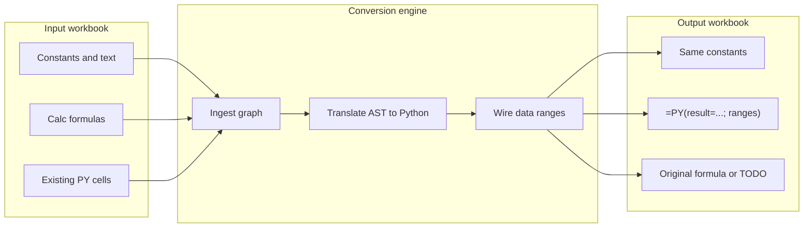

# Calc Spreadsheet → Python Import (PM / Dev Plan)

Back to [Enabling NumPy & Python in LibreOffice](enabling_numpy_in_libreoffice.md).

**Status: Shipped.**

## Executive summary

**Product goal:** A user opens a spreadsheet in LibreOffice Calc (`.ods`, `.xlsx`, or an existing document) and runs **WriterAgent → Convert Sheet to Python…**. The result is a workbook where:

- **Data is unchanged** — constants, text, dates, and evaluated values in non-formula cells stay as-is (or are copied verbatim to a new sheet).
- **Logic becomes Python** — each converted formula cell becomes `=PY("…"; …)` (or `=PYTHON(…)` alias), executing in the user’s venv with explicit `data` wiring so Calc’s recalc DAG stays correct.

**Coverage target:** **~90% of formula cells** on a curated benchmark corpus of typical business spreadsheets (see [§ Coverage model](#coverage-model)). The remaining **~10%** are left as original Calc formulas or marked with a visible **TODO** comment in the generated Python / a companion audit sheet.

This plan is **in-workbook** conversion (formulas stay in Calc as `=PY()`). It does **not** replace the two-phase chat workflow ([compute in venv → write back with tools](enabling_numpy_in_libreoffice.md#two-phase-llm-workflow)); it automates that rewrite for existing sheets.

**Related:** [Jupyter notebook import](jupyter-notebook-import.md) (external `.ipynb` → Writer) · [Enabling NumPy in LibreOffice](enabling_numpy_in_libreoffice.md) (shipped `=PY()` infrastructure) · [Python-in-Calc future work](python-in-excel-dev-plan.md) · [Analysis sub-agent](analysis-sub-agent.md) (xlcalculator / excel_in_python references)

---

## Table of contents

1. [PM: goals, users, success metrics](#1-pm-goals-users-success-metrics)
2. [PM: user stories & UX](#2-pm-user-stories--ux)
3. [PM: milestones & risks](#3-pm-milestones--risks)
4. [Technical overview](#4-technical-overview)
5. [Conversion pipeline](#5-conversion-pipeline)
6. [Cell handling rules](#6-cell-handling-rules)
7. [API tables](#7-api-tables)
8. [Calc function → Python mapping](#8-calc-function--python-mapping) (§8.12 = master inventory)
9. [Coverage model](#9-coverage-model)
10. [Phased dev plan](#10-phased-dev-plan)
11. [Testing strategy](#11-testing-strategy)
12. [Non-goals & known gaps](#12-non-goals--known-gaps)
13. [External research](#13-external-research)

---

## 1. PM: goals, users, success metrics

### Goals

| # | Goal |
|---|------|
| G1 | Preserve **all constant / text / numeric data** exactly (byte-for-byte where Calc allows; dates as serials unless user opts into datetime objects). |
| G2 | Replace **formula cells** with `=PY()` equivalents that reproduce the same **displayed values** after full recalc (within float tolerance). |
| G3 | Keep **recalc correctness** — downstream cells update when upstream data changes (native Calc DAG on `data` arguments). |
| G4 | Hit **≥90% automated conversion** on the internal benchmark corpus (by formula-cell count). |
| G5 | Produce an **audit trail** — conversion report: converted / skipped / failed / TODO with reasons. |

### Primary users

- **Analysts** migrating legacy Calc models toward NumPy/pandas without leaving LibreOffice.
- **Power users** who already use `=PY()` and want bulk normalization across a sheet.
- **Chat users** who ask the agent to “convert this sheet to Python” (Phase 5 tool).

### Success metrics

| Metric | Target | Measurement |
|--------|--------|-------------|
| **Corpus conversion rate** | ≥ 90% formula cells | Count on `tests/fixtures/spreadsheet_import_corpus/` (to be added) |
| **Value fidelity** | ≥ 99% cells match oracle | `ABS(converted - original) < 1e-9` or string equality |
| **Regression** | 0 crashes on corpus | `make test` + optional UNO suite |
| **Time to convert** | &lt; 5 s for 10k used cells | Main-thread budget; progress dialog if longer |
| **User-visible failures** | 100% explained | Every non-converted formula has a reason code |

### Out of scope (v1)

- Standalone `.py` export only (no `=PY()` in workbook) — defer to Phase 6+ optional export.
- Google Sheets / cloud API import.
- Rewriting pivot tables, charts, conditional formatting, or solver models into Python.

---

## 2. PM: user stories & UX

### User stories

| ID | As a… | I want… | So that… |
|----|--------|---------|----------|
| US1 | Calc user | to convert the **active sheet** to Python | I can use NumPy on existing logic without retyping |
| US2 | Calc user | to convert **only my selection** | I can migrate one table at a time |
| US3 | Calc user | output on a **new sheet** `PythonImport` | I can diff against the original before replacing |
| US4 | Calc user | a **conversion report** | I know which formulas still need manual work |
| US5 | Chat user | to say “convert this range to Python” | the agent runs the tool and shows the report |
| US6 | Power user | existing `=PY()` cells **normalized** not duplicated | Monaco-edited code stays canonical |

### Proposed UX (shipped in Phase 5)

1. **Menu:** `WriterAgent → Convert Sheet to Python…`
2. **Dialog:**
   - Scope: Active sheet / Selection / All sheets (all sheets = Phase 6)
   - Output: New sheet (default) / In-place (confirm destructive)
   - Options: ☑ Preserve number formats · ☑ Run verification recalc · ☑ Vectorize columns when safe
3. **Progress:** Status bar + cancel (long sheets).
4. **Result dialog:** `Converted 847 / 923 formula cells (91.8%)` + **Open report** + **Go to first TODO**.

### Chat tool (Phase 5)

| Tool | `convert_spreadsheet_to_python` |
|------|----------------------------------|
| Parameters | `scope` (`sheet` \| `selection`), `output_mode` (`new_sheet` \| `in_place`), `verify` (bool) |
| Returns | `report` dict: counts, `todo_cells[]`, `sample_conversions[]` |
| Mutation | Yes — writes `=PY()` formulas when `output_mode` allows |

---

## 3. PM: milestones & risks

### Milestone timeline (engineering estimate)

| Phase | Deliverable | Est. effort | Cumulative coverage | Status |
|-------|-------------|-------------|---------------------|--------|
| 6 | LLM fallback for long tail | 2–3 wk | ~93–95% with assist | Pending |

### Risks

| Risk | Impact | Mitigation |
|------|--------|------------|
| LibreOffice `;` vs Excel `,` in formulas | Wrong AST / wrong Python | Normalize at ingest; corpus includes `.ods` and `.xlsx` |
| Localized function names (`SOMME`, `WENN`) | Translator misses calls | Map via `FunctionOpCodeMapper` + English canonical names |
| Array / matrix formulas | Low automation | Leave as Calc + TODO; document in report |
| Circular references | Infinite recalc | Detect cycle in graph; skip with `CIRCULAR_REF` |
| Float / date semantics | False verify failures | Use same rules as [calc-blanks-vs-nans](calc-blanks-vs-nans.md) |
| Main-thread UNO on large sheets | UI freeze | Batch reads (`getDataArray`); optional background ingest later |
| 90% marketing vs reality | User trust | Report exact %; never silent fallback |

---

## 4. Technical overview

### What exists today (reuse, do not rebuild)

| Capability | Module |
|------------|--------|
| Bulk read values + formulas | [`CellInspector.read_range`](../plugin/calc/inspector.py), [`get_all_formulas`](../plugin/calc/inspector.py) |
| Bulk write | [`CellManipulator.write_formula_range`](../plugin/calc/manipulator.py) |
| `=PY()` parse/rebuild | [`python_formula_edit.py`](../plugin/calc/python/formula_edit.py) |
| `data` / `result` contract | [`calc_addin_data.py`](../plugin/calc/calc_addin_data.py), [`python_function.py`](../plugin/calc/python/function.py) |
| Precedents | [`formula_dep_chain.py`](../plugin/calc/formula_dep_chain.py), regex in inspector |
| Function catalog | [`list_calc_functions`](../plugin/calc/formulas.py) → `FunctionDescriptions` |
| Formula pre-eval / oracle | [`evaluate_formula`](../plugin/calc/formulas.py) (sheet-copy pattern) |
| Error scan | [`error_detector.py`](../plugin/calc/error_detector.py) |

### What does not exist

- Formula AST parser for Calc syntax.
- LO function → Python codegen.
- Import menu / conversion orchestrator.
- Benchmark corpus for conversion rate.

### Architecture choice: explicit `data` args (not Excel `xl()`)

Per [enabling_numpy_in_libreoffice.md — Microsoft Python in Excel vs WriterAgent](enabling_numpy_in_libreoffice.md#microsoft-python-in-excel-vs-writeragent):

- **Do not** parse Python strings for hidden range references.
- **Do** pass every precedent range as a `=PY()` argument so Calc’s DAG tracks dependencies natively.



### Proposed new modules (Phase 1+)

| Module | Role |
|--------|------|
| `plugin/calc/spreadsheet_import/` | Package root |
| `ingest.py` | Sheet → `SheetModel` (cells, types, formulas, precedents) |
| `graph.py` | Topological order, cycle detection |
| `translate.py` | Formula AST → Python source string |
| `emit.py` | `SheetModel` → `=PY()` formula strings + optional code cells |
| `verify.py` | Oracle diff after conversion |
| `report.py` | Human + JSON report |
| `import_dialog.py` | XDL dialog (pattern: [`notebook/import_dialog.py`](../plugin/notebook/import_dialog.py)) |

**Optional dependency (evaluate in Phase 3 spike):** vendored or dev-only [`formulas`](https://github.com/vinci1it2000/formulas) for ODS AST — only if a minimal in-tree parser is too costly. Default path: **small hand-rolled parser** for P1 grammar + `list_calc_functions` metadata.

---

## 5. Conversion pipeline

### End-to-end steps

| Step | Action | Output |
|------|--------|--------|
| 1. **Resolve scope** | Active sheet / selection → used range cursor | `RangeAddress` |
| 2. **Snapshot** | `getDataArray` + `getFormulaArray` on scope | 2D cell matrix |
| 3. **Classify cells** | Per cell: `empty`, `constant`, `formula`, `py_formula`, `error` | Tagged grid |
| 4. **Build graph** | Precedents per formula (`XFormulaQuery` + regex) | DAG |
| 5. **Order** | Topological sort for conversion (constants first) | Ordered formula list |
| 6. **Translate** | Per formula → Python body assigning `result` | Code string |
| 7. **Wire** | Map precedents → `data` / `data[0]`… / scalar second arg | `=PY("…"; A1:B2; …)` |
| 8. **Emit** | Write to target sheet; copy constants unchanged | New grid |
| 9. **Verify** | Full recalc; compare to snapshot oracle | Pass/fail per cell |
| 10. **Report** | Aggregate stats + TODO list | JSON + dialog |

### Import vs in-place

| Mode | When |
|------|------|
| **Open in Calc** | User already has `.ods` / `.xlsx` open — primary path |
| **File picker** | Same as above; LO opens file, then user runs convert |
| **Chat attachment** | Future — agent reads `read_cell_range` then proposes conversions |

There is **no separate file importer** in v1: LibreOffice is the loader. Conversion operates on the **open document model**.

---

## 6. Cell handling rules

| Cell type | Original | After conversion |
|-----------|----------|----------------|
| Empty | — | Empty |
| Constant (number/text/bool) | Value | **Same value** (copy) |
| Constant date | Serial or formatted | Same (document `#` formats copied) |
| Calc formula | `=SUM(A1:A10)` | `=PY("result = np.sum(data)"; A1:A10)` |
| Homogeneous column | `=A2*2` filled down | Single matrix `=PY` with vectorized `data` (Phase 4) |
| Existing `=PY()` / `=PYTHON()` | As-is | Normalize via `parse_python_formula` / `rebuild_python_formula_with_data` |
| Array formula | `{=…}` | **TODO** — keep Calc formula |
| Reference to other sheet | `=Sheet2.A1` | `=PY(…; Sheet2.A1)` if UNO range resolves; else TODO |
| Pivot / CF / chart | N/A | Unchanged (not formula cells) |
| Error cell (`#DIV/0!`) | Error | Convert formula anyway; verify may fail until data fixed |

### `result` and `data` conventions

Generated Python **must** assign **`result`** (WriterAgent sandbox contract). Examples:

```python
# Scalar
result = data * 2

# Aggregation
result = float(np.sum(data))

# Conditional
result = data[1] if data[0] else data[2]

# Multi-range (varargs)
result = float(np.sum(data[0]) + np.sum(data[1]))
```

Formula emission (LibreOffice semicolons):

```calc
=PY("result = float(np.sum(data))"; A1:A10)
```

Tier-1 **code cell** (long scripts):

```calc
' Cell A1 (text): multi-line Python assigning result
' Cell B2: =PY(A1; C1:D100)
```

Uses existing Monaco dual-save pattern ([python-monaco-editor-dev-plan.md](python-monaco-editor-dev-plan.md)).

### `xl` Calc-parity helpers (spreadsheet import)

Complex Calc functions that need shared semantics (SUMIF, XLOOKUP, FILTER, SUBTOTAL, date helpers, etc.) emit **`xl.*` calls** — not pasted `def` blocks. The venv sandbox auto-imports [`plugin.scripting.calc_functions`](../plugin/scripting/calc_functions.py) as **`xl`** (same mechanism as `np` / `pd`).

```calc
=PY("xl.sumif(data[0], \">10\", data[1])"; A1:A5; B1:B5)
=PY("xl.xlookup(\"apple\", data[0], data[1], \"Not Found\")"; A1:A3; B1:B3)
```

- **Translator:** [`translate.py`](../plugin/calc/spreadsheet_import/translate.py) maps Calc builtins to `xl.foo(...)` or inline `np`/`math` expressions.
- **Runtime:** [`AUTO_IMPORTS`](../plugin/framework/constants.py) + [`inject_auto_imports`](../plugin/scripting/venv_sandbox.py) bind `xl` when the formula references it.
- **Tests:** behavioral parity in [`test_calc_functions.py`](../tests/scripting/test_calc_functions.py); emitter shape in [`test_spreadsheet_import_translate.py`](../tests/calc/test_spreadsheet_import_translate.py).

Workbooks converted before this change may still contain inline pasted helpers; re-import to shrink formulas.

---

## 7. API tables

### Table A — UNO & WriterAgent ingestion APIs

| API / tool | Purpose | Returns / behavior | Import phase |
|------------|---------|-------------------|--------------|
| `SpreadsheetDocument.getSheets()` | Enumerate sheets | `XSpreadsheets` | Scope (multi-sheet P6) |
| `XSpreadsheet.createCursor()` | Used area | `RangeAddress` | 1 Snapshot |
| `XCellRange.getDataArray()` | Bulk values | 2D array | 1 Snapshot |
| `XCellRange.getFormulaArray()` | Bulk formulas | 2D strings (`=…`) | 1 Snapshot |
| `XCell.queryFormulaCells()` | Formula cell enumeration | Cell collection | 1 alternate path |
| `XCell.getFormula()` / `getFormula()` | Single formula | String | 1 |
| `XCell.getType()` / `CellContentType` | empty/value/text/formula | Enum | 1 Classify |
| `XFormulaQuery.queryPrecedents()` | Dependency ranges | Range addresses | 4 Graph |
| `Document.getCommandValues(".uno:FormulaDepChain")` | Rich dep JSON | JSON | 4 Graph |
| `FunctionDescriptions` | Built-in catalog | Name, args, category | 3 Translate |
| `FormulaOpCodeMapper` | Localized names | English opcode | 3 Translate |
| `read_cell_range` (tool) | Chat read path | JSON grid | 5 Chat |
| `get_sheet_summary` | Bounds + headers hint | Dict | 1 |
| `get_all_formulas` (inspector) | Formula list + regex precedents | List[dict] | 1 |
| `list_calc_functions` | Filterable catalog | List[dict] | 3 / docs |
| `evaluate_formula` | Oracle for one cell | Evaluated value | 9 Verify |
| `detect_and_explain_errors` | Pre-flight errors | Error report | 1 optional |

### Table B — Emission & execution APIs

| API | Role in import | Limitation |
|-----|----------------|------------|
| `=PY()` / `=PYTHON()` add-in | Target cell format | Venv required; timeout from settings |
| `calc_addin_data_to_python` | Shape check for `data` | Max cells `scripting.python_max_data_cells` |
| `to_calc_compatible` | Egress type coercion | No raw int in matrices |
| `write_formula_range` | Apply converted grid | Semicolon formulas; `=` prefix → formula |
| `parse_python_formula` / `rebuild_python_formula_with_data` | Round-trip existing PY | String-level only |
| `python_editor` / Monaco | Edit generated code | Manual fix for TODO cells |
| `run_venv_python_script` | Chat dry-run | Does not write sheet alone |
| `execute_python_script` + `lp()` | Stdlib-only preview | Not for NumPy path |
| `WorkerResultSession` | Matrix spill cache | Manual range today |

### Table C — WriterAgent tools (orchestration)

| Tool | Use in import workflow |
|------|------------------------|
| `read_cell_range` | Agent inspect before convert |
| `write_formula_range` | Agent apply after user confirms |
| `convert_spreadsheet_to_python` | **New** — full pipeline |
| `list_calc_functions` | Agent lookup unsupported function |
| `detect_and_explain_errors` | Pre/post validation |
| `delegate_to_specialized_calc_toolset` | N/A for v1 |

### Table D — External libraries (research; not shipped)

| Project | Input | ODS / LO fit | Use in this project |
|---------|-------|--------------|---------------------|
| [formulas](https://github.com/vinci1it2000/formulas) | xlsx, **ods**, json | **Strong** — ODS compile path | Phase 3 spike for AST |
| [xlcalculator](https://github.com/bradbase/xlcalculator) | xlsx, dict | Weak — Excel comma syntax | Reference for function mapping |
| [Sheet2Code](https://sheet2code.com/) | Sheets / Excel | Parser design reference | DAG + codegen patterns |
| [excel_in_python](https://github.com/ncalm/excel_in_python) | pandas | Function semantics | P2 lookup helpers |
| Mito / FlyingKoala | Excel UI | UX only | Column vectorization ideas |
| LLM + `CALC_PYTHON_FORMULA_LLM_HINT` | In-doc context | **High** | Phase 6 long tail |

**Recommendation:** Phase 3 — hand-rolled parser for P1; parallel spike on `formulas` ODS load. Do **not** add PyPI deps to OXT without vendoring review.

---

## 8. Calc function → Python mapping

LibreOffice exposes **~508** built-in functions ([Calc Guide 25.2 Ch.9](https://books.libreoffice.org/en/CG252/CG25209-FormulasAndFunctions.html)); [`translate.py`](../plugin/calc/spreadsheet_import/translate.py) currently ships **142** deterministic mappings (including `ROW`, `COLUMN`, `IFS`, `SWITCH` handlers).

**Source of truth for done vs not done:** [§8.12 Master function inventory](#812-master-function-inventory-goal). Subsections §8.1–§8.11 below retain **conceptual Python shapes** from the original plan; tier labels (P1/P2/P3) are historical—check §8.12 **Status** column for current implementation.

**Coverage tiers (historical plan):** P1 ≈70% of formula cells; P1+P2 ≈90%; P3 / N/A = LLM, manual, or leave-as-Calc. Tier **D** (financial suite, `OFFSET`/`INDIRECT`, database functions) is **in progress**—see §8.12.

Convention: `data` is the primary injected range; `data[n]` is multi-range varargs. Scalar ranges collapse to scalar per [`calc_addin_data`](plugin/calc/calc_addin_data.py). Use `float(...)` when Calc expects a scalar double.

### 8.1 Arithmetic & aggregates (P1)

| Calc function | Python / `=PY` body (conceptual) | Notes |
|---------------|----------------------------------|-------|
| `SUM` | `result = float(np.sum(data))` | Empty → 0 in Calc |
| `SUMIF` | `result = float(np.sum(np.where(cond, data, 0)))` | Needs criteria range wired |
| `SUMIFS` | pandas mask or `np.sum` on boolean | Multi-range |
| `PRODUCT` | `result = float(np.prod(data))` | |
| `QUOTIENT` | `result = float(data[0] // data[1])` | |
| `MOD` | `result = float(data[0] % data[1])` | |
| `POWER` | `result = float(data[0] ** data[1])` | |
| `SQRT` | `result = float(np.sqrt(data))` | |
| `ABS` | `result = float(np.abs(data))` | |
| `SIGN` | `result = float(np.sign(data))` | |
| `INT` | `result = float(np.floor(data))` | |
| `TRUNC` | `result = float(np.trunc(data))` | |
| `ROUND` | `result = float(np.round(data, n))` | |
| `ROUNDUP` | `result = float(np.ceil(data * 10**n) / 10**n)` | |
| `ROUNDDOWN` | `result = float(np.floor(data * 10**n) / 10**n)` | |
| `CEILING` | `result = float(np.ceil(data))` | Mode args P2 |
| `FLOOR` | `result = float(np.floor(data))` | |
| `EVEN` / `ODD` | `np.ceil` / `np.floor` parity helpers | |
| `AVERAGE` | `result = float(np.mean(data))` | |
| `AVERAGEIF` | masked mean | P2 |
| `AVERAGEIFS` | multi-criteria mean | P2 |
| `COUNT` | `result = float(np.sum(~np.isnan(numeric)))` | |
| `COUNTA` | `result = float(sum(x is not None and x != "" for x in flat))` | |
| `COUNTBLANK` | `result = float(sum(x is None or x == "" for x in flat))` | |
| `COUNTIF` | `result = float(np.sum(mask))` | |
| `COUNTIFS` | multi mask | P2 |
| `MAX` | `result = float(np.nanmax(data))` | |
| `MIN` | `result = float(np.nanmin(data))` | |
| `MEDIAN` | `result = float(np.median(data))` | |
| `MODE` | `scipy.stats.mode` or pandas | P2 |

### 8.2 Logical (P1)

| Calc function | Python / `=PY` body | Notes |
|---------------|---------------------|-------|
| `IF` | `result = b if cond else a` | `cond` from first `data` or inline |
| `IFS` | chained `if/elif` | P1 |
| `AND` | `result = all(args)` | |
| `OR` | `result = any(args)` | |
| `NOT` | `result = not data` | |
| `TRUE` / `FALSE` | `result = True` / `False` | |
| `IFERROR` | `try/except` wrapper | P2 |
| `IFNA` | `pd.isna` guard | P2 |
| `SWITCH` | dict lookup | P2 |

### 8.3 Math & trig (P1–P2)

| Calc function | Python | Tier |
|---------------|--------|------|
| `EXP`, `LN`, `LOG`, `LOG10` | `np.exp`, `np.log`, `np.log10` | P1 |
| `SIN`, `COS`, `TAN` | `np.sin`, `np.cos`, `np.tan` | P1 |
| `ASIN`, `ACOS`, `ATAN`, `ATAN2` | `np.*` | P2 |
| `DEGREES`, `RADIANS` | `np.degrees`, `np.radians` | P2 |
| `PI` | `result = math.pi` | P1 |
| `RAND`, `RANDBETWEEN` | `np.random.*` | P2 — non-deterministic flag |
| `GCD`, `LCM` | `math.gcd`, `np.lcm` | P2 |

### 8.4 Text (P2)

| Calc function | Python | Tier |
|---------------|--------|------|
| `CONCATENATE`, `CONCAT` | `"".join(str(x) for x in args)` | P2 |
| `LEFT`, `RIGHT`, `MID` | `str` slicing | P2 |
| `LEN` | `len(str(data))` | P2 |
| `LOWER`, `UPPER`, `PROPER` | `str.lower`, etc. | P2 |
| `TRIM` | `str.strip` | P2 |
| `SUBSTITUTE`, `REPLACE` | `str.replace` | P2 |
| FIND, SEARCH | `str.find` / regex | P2 |
| TEXTJOIN | `_textjoin(delim, ignore_empty, *args)` | P2 |
| REGEX | `_regex(text, expr, replacement, flags)` | P2 |
| `TEXT` | format spec → f-string | P2 partial |
| `VALUE` | `float(data)` | P2 |

### 8.5 Lookup & reference (P2 — high user value)

| Calc function | Python | Tier |
|---------------|--------|------|
| `VLOOKUP` | `pd.DataFrame(...).merge` or indexed lookup | P2 exact match first |
| `HLOOKUP` | transpose + vlookup pattern | P2 |
| `INDEX` | `arr[i,j]` | P2 |
| MATCH | `np.argmax` / `searchsorted` | P2 |
| XLOOKUP | `_xlookup(val, l_arr, r_arr, not_found, match_mode, search_mode)` | P2 |
| OFFSET | slice with computed origin | P3 |
| `INDIRECT` | **N/A** — dynamic string ref | N/A |
| `ROW`, `COLUMN` | context from spill / explicit | P2 |
| `ROWS`, `COLUMNS` | `len` | P2 |
| `ADDRESS` | string build only | P3 |

### 8.6 Statistical (P2)

| Calc function | Python | Tier |
|---------------|--------|------|
| `STDEV`, `STDEVP` | `np.std(ddof=1/0)` | P2 |
| `VAR`, `VARP` | `np.var` | P2 |
| `CORREL`, `COVAR` | `np.corrcoef`, `np.cov` | P2 |
| `LINEST`, `LOGEST` | `np.polyfit`, `np.linalg.lstsq` | P3 |
| `PERCENTILE`, `QUARTILE` | `np.percentile` | P2 |
| `RANK` | `scipy.stats.rankdata` | P2 |
| `LARGE`, `SMALL` | `np.partition` | P2 |

### 8.7 Date & time (P2)

| Calc function | Python | Tier |
|---------------|--------|------|
| `TODAY`, `NOW` | `datetime.date.today()`, `datetime.datetime.now()` | P2 |
| `DATE` | `datetime.date(y,m,d).toordinal()` adjust | P2 |
| `YEAR`, `MONTH`, `DAY` | `.year`, `.month`, `.day` | P2 |
| `HOUR`, `MINUTE`, `SECOND` | time parts | P2 |
| `DATEDIF` | `relativedelta` or day delta | P2 |
| `NETWORKDAYS` | `np.busday_count` | P3 |

### 8.8 Financial (P3 / N/A)

| Calc function | Python | Tier |
|---------------|--------|------|
| `PMT`, `PV`, `FV`, `NPV`, `IRR` | `numpy_financial` or TODO | P3 |
| `DB`, `DDB`, `SLN` | specialized | N/A |

### 8.9 Array & matrix (P3 / N/A)

| Calc function | Python | Tier |
|---------------|--------|------|
| `ARRAYFORMULA` style `{=…}` | NumPy broadcast | N/A v1 |
| `TRANSPOSE` | `np.array(data).T.tolist()` | **Shipped** |
| `MMULT` | `np.matmul` | Planned (P3) |
| `FILTER`, `SORT`, `UNIQUE`, `SORTBY` | `_filter`, `_sort`, `_unique`, `_sortby` | **Shipped** (array return) |

### 8.10 Already Python / special

| Cell content | Action |
|--------------|--------|
| `=PY(…)` / `=PYTHON(…)` | Extract + normalize only |
| `=PROMPT(…)` | **Skip** — LLM cell; user choice in dialog |
| Add-in functions | **TODO** unless whitelisted |

### 8.11 Operators (P1)

| Calc syntax | Python |
|-------------|--------|
| `A1+B1` | `data[0] + data[1]` or inline refs |
| `A1-B1`, `*`, `/` | arithmetic |
| `A1^B1` | `**` |
| `=A1=B1` | `==` |
| `=A1<>B1` | `!=` |
| `=A1<B1`, `>`, `<=`, `>=` | comparison |
| `&` (concat) | `str(a) + str(b)` |
| Unary `-` | `-x` |

**Semicolon rule:** LibreOffice argument separator is `;` ([`CALC_FORMULA_SYNTAX`](../plugin/framework/constants.py)). Parser must accept `;` inside formulas while generated `=PY()` strings also use `;`.

### 8.12 Master function inventory (goal)

Curated from [LibreOffice Functions by Category](https://help.libreoffice.org/latest/en-US/text/scalc/01/04060100.html), [Calc Guide 25.2 Ch.9](https://books.libreoffice.org/en/CG252/CG25209-FormulasAndFunctions.html), and [Microsoft–LibreOffice function comparison](https://wiki.documentfoundation.org/Documentation/Calc_Functions) (~508 LO built-ins total). **Status** reflects [`translate.py`](../plugin/calc/spreadsheet_import/translate.py) as of the Tier A/B/C/D port (157 shipped).

**Inventory summary:** **235 / 374** functions in this master list are **Shipped** in [`translate.py`](../plugin/calc/spreadsheet_import/translate.py) (232 emitters including `ROW`/`COLUMN`/`IFS`/`SWITCH` handlers).
 LibreOffice Calc exposes **~508** built-ins ([Calc Guide 25.2 Ch.9](https://books.libreoffice.org/en/CG252/CG25209-FormulasAndFunctions.html), [Functions by Category](https://help.libreoffice.org/latest/en-US/text/scalc/01/04060100.html)); this curated list (~374) is the **conversion goal set** for business/statistical workbooks—not every locale alias (`*_ADD`, `*_EXCEL2003`) or extension-only symbol.

| Status | Meaning |
|--------|---------|
| **Shipped** | Deterministic codegen in `translate.py` |
| **Not started** | Goal function; `UNSUPPORTED_FUNCTION` today |
| **Planned (P3)** | Financial, database, matrix, or LLM-assist tier (Tier D deferred) |
| **N/A** | Leave as Calc (dynamic refs, meta cells, hyperlinks) |

Use `list_calc_functions` (chat tool) against a live Calc session for the authoritative runtime catalog and descriptions.

### Database (12/12 shipped)
| Function | Status |
|----------|--------|
| `DAVERAGE` | Shipped |
| `DCOUNT` | Shipped |
| `DCOUNTA` | Shipped |
| `DGET` | Shipped |
| `DMAX` | Shipped |
| `DMIN` | Shipped |
| `DPRODUCT` | Shipped |
| `DSTDEV` | Shipped |
| `DSTDEVP` | Shipped |
| `DSUM` | Shipped |
| `DVAR` | Shipped |
| `DVARP` | Shipped |

### Date & Time (25/25 shipped)
| Function | Status |
|----------|--------|
| `DATE` | Shipped |
| `DATEDIF` | Shipped |
| `DATEVALUE` | Shipped |
| `DAY` | Shipped |
| `DAYS` | Shipped |
| `DAYS360` | Shipped |
| `EDATE` | Shipped |
| `EOMONTH` | Shipped |
| `HOUR` | Shipped |
| `ISOWEEKNUM` | Shipped |
| `MINUTE` | Shipped |
| `MONTH` | Shipped |
| `NETWORKDAYS` | Shipped |
| `NETWORKDAYS.INTL` | Shipped |
| `NOW` | Shipped |
| `SECOND` | Shipped |
| `TIME` | Shipped |
| `TIMEVALUE` | Shipped |
| `TODAY` | Shipped |
| `WEEKDAY` | Shipped |
| `WEEKNUM` | Shipped |
| `WORKDAY` | Shipped |
| `WORKDAY.INTL` | Shipped |
| `YEAR` | Shipped |
| `YEARFRAC` | Shipped |

### Financial (55/55 shipped)
| Function | Status |
|----------|--------|
| `ACCRINT` | Shipped |
| `ACCRINTM` | Shipped |
| `AMORDEGRC` | Shipped |
| `AMORLINC` | Shipped |
| `COUPDAYBS` | Shipped |
| `COUPDAYS` | Shipped |
| `COUPDAYSNC` | Shipped |
| `COUPNCD` | Shipped |
| `COUPNUM` | Shipped |
| `COUPPCD` | Shipped |
| `CUMIPMT` | Shipped |
| `CUMPRINC` | Shipped |
| `DB` | Shipped |
| `DDB` | Shipped |
| `DISC` | Shipped |
| `DOLLARDE` | Shipped |
| `DOLLARFR` | Shipped |
| `DURATION` | Shipped |
| `EFFECT` | Shipped |
| `FV` | Shipped |
| `FVSCHEDULE` | Shipped |
| `INTRATE` | Shipped |
| `IPMT` | Shipped |
| `IRR` | Shipped |
| `ISPMT` | Shipped |
| `MDURATION` | Shipped |
| `MIRR` | Shipped |
| `NOMINAL` | Shipped |
| `NPER` | Shipped |
| `NPV` | Shipped |
| `ODDFPRICE` | Shipped |
| `ODDFYIELD` | Shipped |
| `ODDLPRICE` | Shipped |
| `ODDLYIELD` | Shipped |
| `PDURATION` | Shipped |
| `PMT` | Shipped |
| `PPMT` | Shipped |
| `PRICE` | Shipped |
| `PRICEDISC` | Shipped |
| `PRICEMAT` | Shipped |
| `PV` | Shipped |
| `RATE` | Shipped |
| `RECEIVED` | Shipped |
| `RRI` | Shipped |
| `SLN` | Shipped |
| `SYD` | Shipped |
| `TBILLEQ` | Shipped |
| `TBILLPRICE` | Shipped |
| `TBILLYIELD` | Shipped |
| `VDB` | Shipped |
| `XIRR` | Shipped |
| `XNPV` | Shipped |
| `YIELD` | Shipped |
| `YIELDDISC` | Shipped |
| `YIELDMAT` | Shipped |

### Information (17/21 shipped, 4 N/A)
| Function | Status |
|----------|--------|
| `CELL` | N/A |
| `CURRENT` | N/A |
| `FORMULA` | N/A |
| `IFERROR` | Shipped |
| `IFNA` | Shipped |
| `INFO` | N/A |
| `ISBLANK` | Shipped |
| `ISERR` | Shipped |
| `ISERROR` | Shipped |
| `ISEVEN` | Shipped |
| `ISFORMULA` | Shipped |
| `ISLOGICAL` | Shipped |
| `ISNA` | Shipped |
| `ISNONTEXT` | Shipped |
| `ISNUMBER` | Shipped |
| `ISODD` | Shipped |
| `ISREF` | Shipped |
| `ISTEXT` | Shipped |
| `N` | Shipped |
| `NA` | Shipped |
| `TYPE` | Shipped |

### Logical (11/11 shipped)
| Function | Status |
|----------|--------|
| `AND` | Shipped |
| `FALSE` | Shipped |
| `IF` | Shipped |
| `IFERROR` | Shipped |
| `IFNA` | Shipped |
| `IFS` | Shipped |
| `NOT` | Shipped |
| `OR` | Shipped |
| `SWITCH` | Shipped |
| `TRUE` | Shipped |
| `XOR` | Shipped |

### Mathematical (64/64 shipped)
| Function | Status |
|----------|--------|
| `ABS` | Shipped |
| `ACOS` | Shipped |
| `ACOSH` | Shipped |
| `ACOT` | Shipped |
| `ACOTH` | Shipped |
| `AGGREGATE` | Shipped |
| `ASIN` | Shipped |
| `ASINH` | Shipped |
| `ATAN` | Shipped |
| `ATAN2` | Shipped |
| `ATANH` | Shipped |
| `BASE` | Shipped |
| `CEILING` | Shipped |
| `COMBIN` | Shipped |
| `COMBINA` | Shipped |
| `COS` | Shipped |
| `COSH` | Shipped |
| `COT` | Shipped |
| `COTH` | Shipped |
| `CSC` | Shipped |
| `CSCH` | Shipped |
| `DECIMAL` | Shipped |
| `DEGREES` | Shipped |
| `EVEN` | Shipped |
| `EXP` | Shipped |
| `FACT` | Shipped |
| `FACTDOUBLE` | Shipped |
| `FLOOR` | Shipped |
| `GCD` | Shipped |
| `INT` | Shipped |
| `LCM` | Shipped |
| `LN` | Shipped |
| `LOG` | Shipped |
| `LOG10` | Shipped |
| `MOD` | Shipped |
| `MROUND` | Shipped |
| `MULTINOMIAL` | Shipped |
| `ODD` | Shipped |
| `PI` | Shipped |
| `POWER` | Shipped |
| `PRODUCT` | Shipped |
| `QUOTIENT` | Shipped |
| `RADIANS` | Shipped |
| `RAND` | Shipped |
| `RANDBETWEEN` | Shipped |
| `ROUND` | Shipped |
| `ROUNDDOWN` | Shipped |
| `ROUNDUP` | Shipped |
| `SEC` | Shipped |
| `SECH` | Shipped |
| `SERIESSUM` | Shipped |
| `SIGN` | Shipped |
| `SIN` | Shipped |
| `SINH` | Shipped |
| `SQRT` | Shipped |
| `SQRTPI` | Shipped |
| `SUBTOTAL` | Shipped |
| `SUM` | Shipped |
| `SUMIF` | Shipped |
| `SUMIFS` | Shipped |
| `SUMSQ` | Shipped |
| `TAN` | Shipped |
| `TANH` | Shipped |
| `TRUNC` | Shipped |

### Array (16/16 shipped)
| Function | Status |
|----------|--------|
| `FILTER` | Shipped |
| `FREQUENCY` | Shipped |
| `GROWTH` | Shipped |
| `LINEST` | Shipped |
| `LOGEST` | Shipped |
| `MDETERM` | Shipped |
| `MINVERSE` | Shipped |
| `MMULT` | Shipped |
| `MTRANS` | Shipped |
| `MUNIT` | Shipped |
| `SORT` | Shipped |
| `SORTBY` | Shipped |
| `SUMPRODUCT` | Shipped |
| `TRANSPOSE` | Shipped |
| `TREND` | Shipped |
| `UNIQUE` | Shipped |

### Statistical (83/83 shipped)
| Function | Status |
|----------|--------|
| `AVEDEV` | Shipped |
| `AVERAGE` | Shipped |
| `AVERAGEA` | Shipped |
| `AVERAGEIF` | Shipped |
| `AVERAGEIFS` | Shipped |
| `BETADIST` | Shipped |
| `BETAINV` | Shipped |
| `BINOMDIST` | Shipped |
| `CHIDIST` | Shipped |
| `CHIINV` | Shipped |
| `CONFIDENCE` | Shipped |
| `CORREL` | Shipped |
| `COUNT` | Shipped |
| `COUNTA` | Shipped |
| `COUNTBLANK` | Shipped |
| `COUNTIF` | Shipped |
| `COUNTIFS` | Shipped |
| `COVAR` | Shipped |
| `CRITBINOM` | Shipped |
| `DEVSQ` | Shipped |
| `EXPONDIST` | Shipped |
| `FDIST` | Shipped |
| `FINV` | Shipped |
| `FISHER` | Shipped |
| `FISHERINV` | Shipped |
| `FORECAST` | Shipped |
| `FREQUENCY` | Shipped |
| `GAMMA` | Shipped |
| `GAMMADIST` | Shipped |
| `GAMMAINV` | Shipped |
| `GAMMALN` | Shipped |
| `GAUSS` | Shipped |
| `GEOMEAN` | Shipped |
| `GROWTH` | Shipped |
| `HARMEAN` | Shipped |
| `HYPGEOMDIST` | Shipped |
| `INTERCEPT` | Shipped |
| `KURT` | Shipped |
| `LARGE` | Shipped |
| `LINEST` | Shipped |
| `LOGEST` | Shipped |
| `LOGINV` | Shipped |
| `LOGNORMDIST` | Shipped |
| `MAX` | Shipped |
| `MAXA` | Shipped |
| `MEDIAN` | Shipped |
| `MIN` | Shipped |
| `MINA` | Shipped |
| `MODE` | Shipped |
| `NEGBINOMDIST` | Shipped |
| `NORMDIST` | Shipped |
| `NORMINV` | Shipped |
| `NORMSDIST` | Shipped |
| `NORMSINV` | Shipped |
| `PEARSON` | Shipped |
| `PERCENTILE` | Shipped |
| `PERCENTRANK` | Shipped |
| `PERMUT` | Shipped |
| `POISSON` | Shipped |
| `PROB` | Shipped |
| `QUARTILE` | Shipped |
| `RANK` | Shipped |
| `RSQ` | Shipped |
| `SKEW` | Shipped |
| `SLOPE` | Shipped |
| `SMALL` | Shipped |
| `STANDARDIZE` | Shipped |
| `STDEV` | Shipped |
| `STDEVA` | Shipped |
| `STDEVP` | Shipped |
| `STDEVPA` | Shipped |
| `STEYX` | Shipped |
| `TDIST` | Shipped |
| `TINV` | Shipped |
| `TREND` | Shipped |
| `TRIMMEAN` | Shipped |
| `TTEST` | Shipped |
| `VAR` | Shipped |
| `VARA` | Shipped |
| `VARP` | Shipped |
| `VARPA` | Shipped |
| `WEIBULL` | Shipped |
| `ZTEST` | Shipped |

### Spreadsheet / Lookup (14/20 shipped, 6 N/A)
| Function | Status |
|----------|--------|
| `ADDRESS` | Shipped |
| `AREAS` | Shipped |
| `CHOOSE` | Shipped |
| `COLUMN` | Shipped |
| `COLUMNS` | Shipped |
| `FORMULATEXT` | N/A |
| `GETPIVOTDATA` | N/A |
| `HLOOKUP` | Shipped |
| `HYPERLINK` | N/A |
| `INDEX` | Shipped |
| `INDIRECT` | N/A |
| `LOOKUP` | Shipped |
| `MATCH` | Shipped |
| `OFFSET` | N/A |
| `ROW` | Shipped |
| `ROWS` | Shipped |
| `RTD` | N/A |
| `VLOOKUP` | Shipped |
| `XLOOKUP` | Shipped |
| `XMATCH` | Shipped |

### Text (39/39 shipped)
| Function | Status |
|----------|--------|
| `ARABIC` | Shipped |
| `ASC` | Shipped |
| `BAHTTEXT` | Shipped |
| `ASC` | Shipped |
| `BAHTTEXT` | Shipped |
| `CHAR` | Shipped |
| `CLEAN` | Shipped |
| `CODE` | Shipped |
| `CONCAT` | Shipped |
| `CONCATENATE` | Shipped |
| `DOLLAR` | Shipped |
| `ENCODEURL` | Shipped |
| `EXACT` | Shipped |
| `FIND` | Shipped |
| `FIXED` | Shipped |
| `JIS` | Shipped |
| `LEFT` | Shipped |
| `LEN` | Shipped |
| `LOWER` | Shipped |
| `MID` | Shipped |
| `NUMBERVALUE` | Shipped |
| `PROPER` | Shipped |
| `REGEX` | Shipped |
| `REPLACE` | Shipped |
| `REPT` | Shipped |
| `RIGHT` | Shipped |
| `SEARCH` | Shipped |
| `SUBSTITUTE` | Shipped |
| `T` | Shipped |
| `TEXT` | Shipped |
| `TEXTAFTER` | Shipped |
| `TEXTBEFORE` | Shipped |
| `TEXTJOIN` | Shipped |
| `TEXTSPLIT` | Shipped |
| `TRIM` | Shipped |
| `UNICHAR` | Shipped |
| `UNICODE` | Shipped |
| `UPPER` | Shipped |
| `VALUE` | Shipped |

### Bitwise (5/5 shipped)
| Function | Status |
|----------|--------|
| `BITAND` | Shipped |
| `BITOR` | Shipped |
| `BITXOR` | Shipped |
| `BITLSHIFT` | Shipped |
| `BITRSHIFT` | Shipped |

### Add-in / Analysis (36/37 shipped, 1 N/A)
| Function | Status |
|----------|--------|
| `BESSELI` | Shipped |
| `BESSELJ` | Shipped |
| `BESSELK` | Shipped |
| `BESSELY` | Shipped |
| `COMPLEX` | Shipped |
| `DELTA` | Shipped |
| `ERF` | Shipped |
| `ERFC` | Shipped |
| `EUROCONVERT` | Shipped |
| `GESTEP` | Shipped |
| `IMABS` | Shipped |
| `IMAGINARY` | Shipped |
| `IMARGUMENT` | Shipped |
| `IMCONJUGATE` | Shipped |
| `IMCOS` | Shipped |
| `IMDIV` | Shipped |
| `IMEXP` | Shipped |
| `IMLN` | Shipped |
| `IMLOG10` | Shipped |
| `IMLOG2` | Shipped |
| `IMPOWER` | Shipped |
| `IMPRODUCT` | Shipped |
| `IMREAL` | Shipped |
| `IMSIN` | Shipped |
| `IMCOSH` | Shipped |
| `IMCOT` | Shipped |
| `IMCSC` | Shipped |
| `IMCSCH` | Shipped |
| `IMSEC` | Shipped |
| `IMSECH` | Shipped |
| `IMSINH` | Shipped |
| `IMSQRT` | Shipped |
| `IMSUB` | Shipped |
| `IMSUM` | Shipped |
| `IMTAN` | Shipped |
| `IMTANH` | Shipped |
| `ROT13` | N/A |


---

## 9. Coverage model

### How we define “90%”

```
conversion_rate = converted_formula_cells / total_formula_cells_in_scope
```

Measured on **`tests/fixtures/spreadsheet_import_corpus/`** (to create in Phase 0/1):

| Fixture class | Example content | Expected P1+P2 rate |
|---------------|-----------------|---------------------|
| **Simple budget** | SUM, IF, % | ~98% |
| **Sales rollup** | SUMIF, VLOOKUP, dates | ~92% |
| **Scientific** | trig, STDEV, MMULT | ~75% → needs P3 |
| **Legacy model** | INDIRECT, array, circular | ~40% — outlier |

**Portfolio target:** weighted by formula count across **10 fixtures** representing typical business use → **≥90%**.

### What counts as “converted”

| Outcome | Counts toward 90%? |
|---------|-------------------|
| `=PY()` emitted, verify passes | Yes |
| Existing `=PY()` normalized only | Yes |
| Left as Calc + `TODO` row in report | No |
| Skipped `=PROMPT()` by user option | Excluded from denominator |

### Vectorization bonus (Phase 4)

If 50 cells share one pattern `=A{row}*2`, one matrix `=PY()` counts as **50 converted** in the rate.

---

## 10. Phased dev plan

### Phase 6 — LLM fallback (optional)

**Deliverables**

- For `TODO` cells: batch prompt with formula + precedents + `CALC_PYTHON_FORMULA_LLM_HINT`
- User reviews diff before apply (never silent)
- Target +3–5% coverage on corpus

---


## 11. Testing strategy

| Layer | Location | Content |
|-------|----------|---------|
| **Unit** | `tests/calc/test_spreadsheet_import_ingest.py` | Graph, classify |
| **Unit** | `tests/calc/test_spreadsheet_import_extract.py` | PY normalize + serialization_cases golden |
| **Unit** | `tests/calc/test_spreadsheet_import_preserve.py` | Output model preserve rules |
| **UNO** | `tests/calc/test_spreadsheet_import_preserve_uno.py` | `serialization_tests.xlsx` PY round-trip |
| **Unit** | `tests/calc/test_spreadsheet_import_translate.py` | Per-function golden outputs |
| **Unit** | `tests/calc/test_spreadsheet_import_emit.py` | `=PY()` string shape, semicolons |
| **Integration** | `tests/calc/test_spreadsheet_import_verify.py` | Mock inspector grids |
| **Corpus** | `tests/calc/test_spreadsheet_import_corpus.py` | ≥90% rate gate (may `xfail` until Phase 4) |
| **UNO** | `tests/calc/test_spreadsheet_import_uno.py` | Full pipeline on tiny ODS if `soffice` present |

Run with `make test`. New tests follow module naming in [AGENTS.md](../AGENTS.md).

**Golden example (P1):**

| Before | After |
|--------|-------|
| `=SUM(A1:A10)` | `=PY("result = float(np.sum(data))"; A1:A10)` |
| `=IF(A1>0;B1;C1)` | `=PY("result = data[1] if data[0]>0 else data[2]"; A1; B1; C1)` |
| `42` | `42` |

---

## 12. Non-goals & known gaps

| Feature | v1 handling |
|---------|-------------|
| Pivot tables | Not converted |
| Charts / images | Preserved as objects |
| Conditional formatting | Preserved |
| Data validation rules | Preserved |
| Named ranges | Wire by resolving name → range (Phase 4); else TODO |
| Dynamic arrays / auto-spill | Matrix `=PY` manual range |
| `INDIRECT`, `OFFSET` heavy models | TODO |
| Circular references | Skip + report |
| `=PROMPT()` | User opt-out |
| Macros / Basic | Out of scope |

**Long tail (~10%):** array formulas, financial functions, INDIRECT, add-ins, localized-only syntax errors, and sheets with &gt; `python_max_data_cells` in one `data` arg (split or TODO).

---

## 13. External research

| Source | Takeaway for WriterAgent |
|--------|--------------------------|
| [LibreOffice Functions by Category](https://help.libreoffice.org/latest/en-US/text/scalc/01/04060100.html) | Master inventory categories (§8.12 goal list) |
| [Calc Guide 25.2 Ch.9](https://books.libreoffice.org/en/CG252/CG25209-FormulasAndFunctions.html) | ~508 built-ins; examples and category overview |
| [formulas](https://github.com/vinci1it2000/formulas) ODS compile | Candidate AST backend; JSON round-trip for regression |
| [xlcalculator](https://github.com/bradbase/xlcalculator) | Function coverage checklist; Excel-centric |
| [Sheet2Code](https://sheet2code.com/) | Chevrotain AST + dependency graph codegen |
| [analysis-sub-agent.md](analysis-sub-agent.md) | xlcalculator / excel_in_python as eval references |
| [enabling_numpy_in_libreoffice.md](enabling_numpy_in_libreoffice.md) | Explicit `data` &gt; `xl()` for LO |
| [LibrePythonista comparison](enabling_numpy_in_libreoffice.md) | `lp()` collapse / DataFrame — not auto-imported |

---

## Implementation status

All core components (Ingest, Preservation, Parser, Translators, Vectorization, Dialog, Chat tool) are **Shipped**.

**Next engineering step:** Phase 6 — LLM fallback.