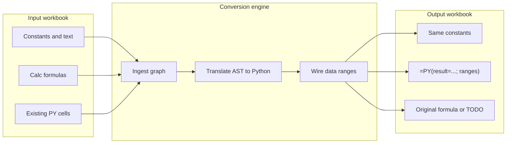

# Calc Spreadsheet → Python Import (PM / Dev Plan)

Back to [Enabling NumPy & Python in LibreOffice](enabling_numpy_in_libreoffice.md).

**Status: Proposed — not implemented.**

## Executive summary

**Product goal:** A user opens a spreadsheet in LibreOffice Calc (`.ods`, `.xlsx`, or an existing document) and runs **WriterAgent → Convert Sheet to Python…**. The result is a workbook where:

- **Data is unchanged** — constants, text, dates, and evaluated values in non-formula cells stay as-is (or are copied verbatim to a new sheet).
- **Logic becomes Python** — each converted formula cell becomes `=PY("…"; …)` (or `=PYTHON(…)` alias), executing in the user’s venv with explicit `data` wiring so Calc’s recalc DAG stays correct.

**Coverage target:** **~90% of formula cells** on a curated benchmark corpus of typical business spreadsheets (see [§ Coverage model](#coverage-model)). The remaining **~10%** are left as original Calc formulas or marked with a visible **TODO** comment in the generated Python / a companion audit sheet.

This plan is **in-workbook** conversion (formulas stay in Calc as `=PY()`). It does **not** replace the two-phase chat workflow ([compute in venv → write back with tools](enabling_numpy_in_libreoffice.md#two-phase-llm-workflow)); it automates that rewrite for existing sheets.

**Related:** [Jupyter notebook import](jupyter-notebook-import.md) (external `.ipynb` → Writer) · [Python-in-Calc dev plan](python-in-excel-dev-plan.md) (`=PY()` infrastructure) · [Analysis sub-agent](analysis-sub-agent.md) (xlcalculator / excel_in_python references)

---

## Table of contents

1. [PM: goals, users, success metrics](#1-pm-goals-users-success-metrics)
2. [PM: user stories & UX](#2-pm-user-stories--ux)
3. [PM: milestones & risks](#3-pm-milestones--risks)
4. [Technical overview](#4-technical-overview)
5. [Conversion pipeline](#5-conversion-pipeline)
6. [Cell handling rules](#6-cell-handling-rules)
7. [API tables](#7-api-tables)
8. [Calc function → Python mapping](#8-calc-function--python-mapping)
9. [Coverage model](#9-coverage-model)
10. [Phased dev plan](#10-phased-dev-plan)
11. [Testing strategy](#11-testing-strategy)
12. [Non-goals & known gaps](#12-non-goals--known-gaps)
13. [External research](#13-external-research)

---

## 1. PM: goals, users, success metrics

### Goals

| # | Goal |
|---|------|
| G1 | Preserve **all constant / text / numeric data** exactly (byte-for-byte where Calc allows; dates as serials unless user opts into datetime objects). |
| G2 | Replace **formula cells** with `=PY()` equivalents that reproduce the same **displayed values** after full recalc (within float tolerance). |
| G3 | Keep **recalc correctness** — downstream cells update when upstream data changes (native Calc DAG on `data` arguments). |
| G4 | Hit **≥90% automated conversion** on the internal benchmark corpus (by formula-cell count). |
| G5 | Produce an **audit trail** — conversion report: converted / skipped / failed / TODO with reasons. |

### Primary users

- **Analysts** migrating legacy Calc models toward NumPy/pandas without leaving LibreOffice.
- **Power users** who already use `=PY()` and want bulk normalization across a sheet.
- **Chat users** who ask the agent to “convert this sheet to Python” (Phase 5 tool).

### Success metrics

| Metric | Target | Measurement |
|--------|--------|-------------|
| **Corpus conversion rate** | ≥ 90% formula cells | Count on `tests/fixtures/spreadsheet_import_corpus/` (to be added) |
| **Value fidelity** | ≥ 99% cells match oracle | `ABS(converted - original) < 1e-9` or string equality |
| **Regression** | 0 crashes on corpus | `make test` + optional UNO suite |
| **Time to convert** | &lt; 5 s for 10k used cells | Main-thread budget; progress dialog if longer |
| **User-visible failures** | 100% explained | Every non-converted formula has a reason code |

### Out of scope (v1)

- Standalone `.py` export only (no `=PY()` in workbook) — defer to Phase 6+ optional export.
- Google Sheets / cloud API import.
- Rewriting pivot tables, charts, conditional formatting, or solver models into Python.

---

## 2. PM: user stories & UX

### User stories

| ID | As a… | I want… | So that… |
|----|--------|---------|----------|
| US1 | Calc user | to convert the **active sheet** to Python | I can use NumPy on existing logic without retyping |
| US2 | Calc user | to convert **only my selection** | I can migrate one table at a time |
| US3 | Calc user | output on a **new sheet** `PythonImport` | I can diff against the original before replacing |
| US4 | Calc user | a **conversion report** | I know which formulas still need manual work |
| US5 | Chat user | to say “convert this range to Python” | the agent runs the tool and shows the report |
| US6 | Power user | existing `=PY()` cells **normalized** not duplicated | Monaco-edited code stays canonical |

### Proposed UX (shipped in Phase 5)

1. **Menu:** `WriterAgent → Convert Sheet to Python…`
2. **Dialog:**
   - Scope: Active sheet / Selection / All sheets (all sheets = Phase 6)
   - Output: New sheet (default) / In-place (confirm destructive)
   - Options: ☑ Preserve number formats · ☑ Run verification recalc · ☑ Vectorize columns when safe
3. **Progress:** Status bar + cancel (long sheets).
4. **Result dialog:** `Converted 847 / 923 formula cells (91.8%)` + **Open report** + **Go to first TODO**.

### Chat tool (Phase 5)

| Tool | `convert_spreadsheet_to_python` |
|------|----------------------------------|
| Parameters | `scope` (`sheet` \| `selection`), `output_mode` (`new_sheet` \| `in_place`), `verify` (bool) |
| Returns | `report` dict: counts, `todo_cells[]`, `sample_conversions[]` |
| Mutation | Yes — writes `=PY()` formulas when `output_mode` allows |

---

## 3. PM: milestones & risks

### Milestone timeline (engineering estimate)

| Phase | Deliverable | Est. effort | Cumulative coverage |
|-------|-------------|-------------|---------------------|
| 0 | This doc + corpus definition | 1 wk | — |
| 1 | Ingest + graph JSON | 1–2 wk | — |
| 2 | Constants preserved; `=PY()` extract | 1 wk | ~5% (normalize only) |
| 3 | P1 translator + apply + verify | 3–4 wk | ~70% |
| 4 | P2 + column vectorization | 3–4 wk | ~90% |
| 5 | Menu, dialog, chat tool, report | 2 wk | ~90% shipped |
| 6 | LLM fallback for long tail | 2–3 wk | ~93–95% with assist |

### Risks

| Risk | Impact | Mitigation |
|------|--------|------------|
| LibreOffice `;` vs Excel `,` in formulas | Wrong AST / wrong Python | Normalize at ingest; corpus includes `.ods` and `.xlsx` |
| Localized function names (`SOMME`, `WENN`) | Translator misses calls | Map via `FunctionOpCodeMapper` + English canonical names |
| Array / matrix formulas | Low automation | Leave as Calc + TODO; document in report |
| Circular references | Infinite recalc | Detect cycle in graph; skip with `CIRCULAR_REF` |
| Float / date semantics | False verify failures | Use same rules as [calc-blanks-vs-nans](calc-blanks-vs-nans.md) |
| Main-thread UNO on large sheets | UI freeze | Batch reads (`getDataArray`); optional background ingest later |
| 90% marketing vs reality | User trust | Report exact %; never silent fallback |

---

## 4. Technical overview

### What exists today (reuse, do not rebuild)

| Capability | Module |
|------------|--------|
| Bulk read values + formulas | [`CellInspector.read_range`](../plugin/calc/inspector.py), [`get_all_formulas`](../plugin/calc/inspector.py) |
| Bulk write | [`CellManipulator.write_formula_range`](../plugin/calc/manipulator.py) |
| `=PY()` parse/rebuild | [`python_formula_edit.py`](../plugin/calc/python_formula_edit.py) |
| `data` / `result` contract | [`calc_addin_data.py`](../plugin/calc/calc_addin_data.py), [`python_function.py`](../plugin/calc/python_function.py) |
| Precedents | [`formula_dep_chain.py`](../plugin/calc/formula_dep_chain.py), regex in inspector |
| Function catalog | [`list_calc_functions`](../plugin/calc/formulas.py) → `FunctionDescriptions` |
| Formula pre-eval / oracle | [`evaluate_formula`](../plugin/calc/formulas.py) (sheet-copy pattern) |
| Error scan | [`error_detector.py`](../plugin/calc/error_detector.py) |

### What does not exist

- Formula AST parser for Calc syntax.
- LO function → Python codegen.
- Import menu / conversion orchestrator.
- Benchmark corpus for conversion rate.

### Architecture choice: explicit `data` args (not Excel `xl()`)

Per [python-in-excel-ideas.md §1.4](python-in-excel-ideas.md#14-architectural-design-choices-microsofts-py-vs-writeragents-python):

- **Do not** parse Python strings for hidden range references.
- **Do** pass every precedent range as a `=PY()` argument so Calc’s DAG tracks dependencies natively.



### Proposed new modules (Phase 1+)

| Module | Role |
|--------|------|
| `plugin/calc/spreadsheet_import/` | Package root |
| `ingest.py` | Sheet → `SheetModel` (cells, types, formulas, precedents) |
| `graph.py` | Topological order, cycle detection |
| `translate.py` | Formula AST → Python source string |
| `emit.py` | `SheetModel` → `=PY()` formula strings + optional code cells |
| `verify.py` | Oracle diff after conversion |
| `report.py` | Human + JSON report |
| `import_dialog.py` | XDL dialog (pattern: [`notebook/import_dialog.py`](../plugin/notebook/import_dialog.py)) |

**Optional dependency (evaluate in Phase 3 spike):** vendored or dev-only [`formulas`](https://github.com/vinci1it2000/formulas) for ODS AST — only if a minimal in-tree parser is too costly. Default path: **small hand-rolled parser** for P1 grammar + `list_calc_functions` metadata.

---

## 5. Conversion pipeline

### End-to-end steps

| Step | Action | Output |
|------|--------|--------|
| 1. **Resolve scope** | Active sheet / selection → used range cursor | `RangeAddress` |
| 2. **Snapshot** | `getDataArray` + `getFormulaArray` on scope | 2D cell matrix |
| 3. **Classify cells** | Per cell: `empty`, `constant`, `formula`, `py_formula`, `error` | Tagged grid |
| 4. **Build graph** | Precedents per formula (`XFormulaQuery` + regex) | DAG |
| 5. **Order** | Topological sort for conversion (constants first) | Ordered formula list |
| 6. **Translate** | Per formula → Python body assigning `result` | Code string |
| 7. **Wire** | Map precedents → `data` / `data[0]`… / scalar second arg | `=PY("…"; A1:B2; …)` |
| 8. **Emit** | Write to target sheet; copy constants unchanged | New grid |
| 9. **Verify** | Full recalc; compare to snapshot oracle | Pass/fail per cell |
| 10. **Report** | Aggregate stats + TODO list | JSON + dialog |

### Import vs in-place

| Mode | When |
|------|------|
| **Open in Calc** | User already has `.ods` / `.xlsx` open — primary path |
| **File picker** | Same as above; LO opens file, then user runs convert |
| **Chat attachment** | Future — agent reads `read_cell_range` then proposes conversions |

There is **no separate file importer** in v1: LibreOffice is the loader. Conversion operates on the **open document model**.

---

## 6. Cell handling rules

| Cell type | Original | After conversion |
|-----------|----------|----------------|
| Empty | — | Empty |
| Constant (number/text/bool) | Value | **Same value** (copy) |
| Constant date | Serial or formatted | Same (document `#` formats copied) |
| Calc formula | `=SUM(A1:A10)` | `=PY("result = np.sum(data)"; A1:A10)` |
| Homogeneous column | `=A2*2` filled down | Single matrix `=PY` with vectorized `data` (Phase 4) |
| Existing `=PY()` / `=PYTHON()` | As-is | Normalize via `parse_python_formula` / `rebuild_python_formula_with_data` |
| Array formula | `{=…}` | **TODO** — keep Calc formula |
| Reference to other sheet | `=Sheet2.A1` | `=PY(…; Sheet2.A1)` if UNO range resolves; else TODO |
| Pivot / CF / chart | N/A | Unchanged (not formula cells) |
| Error cell (`#DIV/0!`) | Error | Convert formula anyway; verify may fail until data fixed |

### `result` and `data` conventions

Generated Python **must** assign **`result`** (WriterAgent sandbox contract). Examples:

```python
# Scalar
result = data * 2

# Aggregation
result = float(np.sum(data))

# Conditional
result = data[1] if data[0] else data[2]

# Multi-range (varargs)
result = float(np.sum(data[0]) + np.sum(data[1]))
```

Formula emission (LibreOffice semicolons):

```calc
=PY("result = float(np.sum(data))"; A1:A10)
```

Tier-1 **code cell** (long scripts):

```calc
' Cell A1 (text): multi-line Python assigning result
' Cell B2: =PY(A1; C1:D100)
```

Uses existing Monaco dual-save pattern ([python-monaco-editor-dev-plan.md](python-monaco-editor-dev-plan.md)).

---

## 7. API tables

### Table A — UNO & WriterAgent ingestion APIs

| API / tool | Purpose | Returns / behavior | Import phase |
|------------|---------|-------------------|--------------|
| `SpreadsheetDocument.getSheets()` | Enumerate sheets | `XSpreadsheets` | Scope (multi-sheet P6) |
| `XSpreadsheet.createCursor()` | Used area | `RangeAddress` | 1 Snapshot |
| `XCellRange.getDataArray()` | Bulk values | 2D array | 1 Snapshot |
| `XCellRange.getFormulaArray()` | Bulk formulas | 2D strings (`=…`) | 1 Snapshot |
| `XCell.queryFormulaCells()` | Formula cell enumeration | Cell collection | 1 alternate path |
| `XCell.getFormula()` / `getFormula()` | Single formula | String | 1 |
| `XCell.getType()` / `CellContentType` | empty/value/text/formula | Enum | 1 Classify |
| `XFormulaQuery.queryPrecedents()` | Dependency ranges | Range addresses | 4 Graph |
| `Document.getCommandValues(".uno:FormulaDepChain")` | Rich dep JSON | JSON | 4 Graph |
| `FunctionDescriptions` | Built-in catalog | Name, args, category | 3 Translate |
| `FormulaOpCodeMapper` | Localized names | English opcode | 3 Translate |
| `read_cell_range` (tool) | Chat read path | JSON grid | 5 Chat |
| `get_sheet_summary` | Bounds + headers hint | Dict | 1 |
| `get_all_formulas` (inspector) | Formula list + regex precedents | List[dict] | 1 |
| `list_calc_functions` | Filterable catalog | List[dict] | 3 / docs |
| `evaluate_formula` | Oracle for one cell | Evaluated value | 9 Verify |
| `detect_and_explain_errors` | Pre-flight errors | Error report | 1 optional |

### Table B — Emission & execution APIs

| API | Role in import | Limitation |
|-----|----------------|------------|
| `=PY()` / `=PYTHON()` add-in | Target cell format | Venv required; timeout from settings |
| `calc_addin_data_to_python` | Shape check for `data` | Max cells `scripting.python_max_data_cells` |
| `to_calc_compatible` | Egress type coercion | No raw int in matrices |
| `write_formula_range` | Apply converted grid | Semicolon formulas; `=` prefix → formula |
| `parse_python_formula` / `rebuild_python_formula_with_data` | Round-trip existing PY | String-level only |
| `python_editor` / Monaco | Edit generated code | Manual fix for TODO cells |
| `run_venv_python_script` | Chat dry-run | Does not write sheet alone |
| `execute_python_script` + `lp()` | Stdlib-only preview | Not for NumPy path |
| `WorkerResultSession` | Matrix spill cache | Manual range today |

### Table C — WriterAgent tools (orchestration)

| Tool | Use in import workflow |
|------|------------------------|
| `read_cell_range` | Agent inspect before convert |
| `write_formula_range` | Agent apply after user confirms |
| `convert_spreadsheet_to_python` | **New** — full pipeline |
| `list_calc_functions` | Agent lookup unsupported function |
| `detect_and_explain_errors` | Pre/post validation |
| `delegate_to_specialized_calc_toolset` | N/A for v1 |

### Table D — External libraries (research; not shipped)

| Project | Input | ODS / LO fit | Use in this project |
|---------|-------|--------------|---------------------|
| [formulas](https://github.com/vinci1it2000/formulas) | xlsx, **ods**, json | **Strong** — ODS compile path | Phase 3 spike for AST |
| [xlcalculator](https://github.com/bradbase/xlcalculator) | xlsx, dict | Weak — Excel comma syntax | Reference for function mapping |
| [Sheet2Code](https://sheet2code.com/) | Sheets / Excel | Parser design reference | DAG + codegen patterns |
| [excel_in_python](https://github.com/ncalm/excel_in_python) | pandas | Function semantics | P2 lookup helpers |
| Mito / FlyingKoala | Excel UI | UX only | Column vectorization ideas |
| LLM + `CALC_PYTHON_FORMULA_LLM_HINT` | In-doc context | **High** | Phase 6 long tail |

**Recommendation:** Phase 3 — hand-rolled parser for P1; parallel spike on `formulas` ODS load. Do **not** add PyPI deps to OXT without vendoring review.

---

## 8. Calc function → Python mapping

LibreOffice exposes **400+** functions via `FunctionDescriptions`. The tables below list the **planned mapping** for automated conversion. Tier **P1** targets ~70% of formula cells in typical corpora; **P1+P2** targets **~90%**. **P3** = LLM or manual. **N/A** = leave as Calc.

Convention: `data` is the primary injected range; `data[n]` is multi-range varargs. Scalar ranges collapse to scalar per [`calc_addin_data`](plugin/calc/calc_addin_data.py). Use `float(...)` when Calc expects a scalar double.

### 8.1 Arithmetic & aggregates (P1)

| Calc function | Python / `=PY` body (conceptual) | Notes |
|---------------|----------------------------------|-------|
| `SUM` | `result = float(np.sum(data))` | Empty → 0 in Calc |
| `SUMIF` | `result = float(np.sum(np.where(cond, data, 0)))` | Needs criteria range wired |
| `SUMIFS` | pandas mask or `np.sum` on boolean | Multi-range |
| `PRODUCT` | `result = float(np.prod(data))` | |
| `QUOTIENT` | `result = float(data[0] // data[1])` | |
| `MOD` | `result = float(data[0] % data[1])` | |
| `POWER` | `result = float(data[0] ** data[1])` | |
| `SQRT` | `result = float(np.sqrt(data))` | |
| `ABS` | `result = float(np.abs(data))` | |
| `SIGN` | `result = float(np.sign(data))` | |
| `INT` | `result = float(np.floor(data))` | |
| `TRUNC` | `result = float(np.trunc(data))` | |
| `ROUND` | `result = float(np.round(data, n))` | |
| `ROUNDUP` | `result = float(np.ceil(data * 10**n) / 10**n)` | |
| `ROUNDDOWN` | `result = float(np.floor(data * 10**n) / 10**n)` | |
| `CEILING` | `result = float(np.ceil(data))` | Mode args P2 |
| `FLOOR` | `result = float(np.floor(data))` | |
| `EVEN` / `ODD` | `np.ceil` / `np.floor` parity helpers | |
| `AVERAGE` | `result = float(np.mean(data))` | |
| `AVERAGEIF` | masked mean | P2 |
| `AVERAGEIFS` | multi-criteria mean | P2 |
| `COUNT` | `result = float(np.sum(~np.isnan(numeric)))` | |
| `COUNTA` | `result = float(sum(x is not None and x != "" for x in flat))` | |
| `COUNTBLANK` | `result = float(sum(x is None or x == "" for x in flat))` | |
| `COUNTIF` | `result = float(np.sum(mask))` | |
| `COUNTIFS` | multi mask | P2 |
| `MAX` | `result = float(np.nanmax(data))` | |
| `MIN` | `result = float(np.nanmin(data))` | |
| `MEDIAN` | `result = float(np.median(data))` | |
| `MODE` | `scipy.stats.mode` or pandas | P2 |

### 8.2 Logical (P1)

| Calc function | Python / `=PY` body | Notes |
|---------------|---------------------|-------|
| `IF` | `result = b if cond else a` | `cond` from first `data` or inline |
| `IFS` | chained `if/elif` | P1 |
| `AND` | `result = all(args)` | |
| `OR` | `result = any(args)` | |
| `NOT` | `result = not data` | |
| `TRUE` / `FALSE` | `result = True` / `False` | |
| `IFERROR` | `try/except` wrapper | P2 |
| `IFNA` | `pd.isna` guard | P2 |
| `SWITCH` | dict lookup | P2 |

### 8.3 Math & trig (P1–P2)

| Calc function | Python | Tier |
|---------------|--------|------|
| `EXP`, `LN`, `LOG`, `LOG10` | `np.exp`, `np.log`, `np.log10` | P1 |
| `SIN`, `COS`, `TAN` | `np.sin`, `np.cos`, `np.tan` | P1 |
| `ASIN`, `ACOS`, `ATAN`, `ATAN2` | `np.*` | P2 |
| `DEGREES`, `RADIANS` | `np.degrees`, `np.radians` | P2 |
| `PI` | `result = math.pi` | P1 |
| `RAND`, `RANDBETWEEN` | `np.random.*` | P2 — non-deterministic flag |
| `GCD`, `LCM` | `math.gcd`, `np.lcm` | P2 |

### 8.4 Text (P2)

| Calc function | Python | Tier |
|---------------|--------|------|
| `CONCATENATE`, `CONCAT` | `"".join(str(x) for x in args)` | P2 |
| `LEFT`, `RIGHT`, `MID` | `str` slicing | P2 |
| `LEN` | `len(str(data))` | P2 |
| `LOWER`, `UPPER`, `PROPER` | `str.lower`, etc. | P2 |
| `TRIM` | `str.strip` | P2 |
| `SUBSTITUTE`, `REPLACE` | `str.replace` | P2 |
| `FIND`, `SEARCH` | `str.find` / regex | P2 |
| `TEXT` | format spec → f-string | P2 partial |
| `VALUE` | `float(data)` | P2 |

### 8.5 Lookup & reference (P2 — high user value)

| Calc function | Python | Tier |
|---------------|--------|------|
| `VLOOKUP` | `pd.DataFrame(...).merge` or indexed lookup | P2 exact match first |
| `HLOOKUP` | transpose + vlookup pattern | P2 |
| `INDEX` | `arr[i,j]` | P2 |
| `MATCH` | `np.argmax` / `searchsorted` | P2 |
| `OFFSET` | slice with computed origin | P3 |
| `INDIRECT` | **N/A** — dynamic string ref | N/A |
| `ROW`, `COLUMN` | context from spill / explicit | P2 |
| `ROWS`, `COLUMNS` | `len` | P2 |
| `ADDRESS` | string build only | P3 |

### 8.6 Statistical (P2)

| Calc function | Python | Tier |
|---------------|--------|------|
| `STDEV`, `STDEVP` | `np.std(ddof=1/0)` | P2 |
| `VAR`, `VARP` | `np.var` | P2 |
| `CORREL`, `COVAR` | `np.corrcoef`, `np.cov` | P2 |
| `LINEST`, `LOGEST` | `np.polyfit`, `np.linalg.lstsq` | P3 |
| `PERCENTILE`, `QUARTILE` | `np.percentile` | P2 |
| `RANK` | `scipy.stats.rankdata` | P2 |
| `LARGE`, `SMALL` | `np.partition` | P2 |

### 8.7 Date & time (P2)

| Calc function | Python | Tier |
|---------------|--------|------|
| `TODAY`, `NOW` | `datetime.date.today()`, `datetime.datetime.now()` | P2 |
| `DATE` | `datetime.date(y,m,d).toordinal()` adjust | P2 |
| `YEAR`, `MONTH`, `DAY` | `.year`, `.month`, `.day` | P2 |
| `HOUR`, `MINUTE`, `SECOND` | time parts | P2 |
| `DATEDIF` | `relativedelta` or day delta | P2 |
| `NETWORKDAYS` | `np.busday_count` | P3 |

### 8.8 Financial (P3 / N/A)

| Calc function | Python | Tier |
|---------------|--------|------|
| `PMT`, `PV`, `FV`, `NPV`, `IRR` | `numpy_financial` or TODO | P3 |
| `DB`, `DDB`, `SLN` | specialized | N/A |

### 8.9 Array & matrix (P3 / N/A)

| Calc function | Python | Tier |
|---------------|--------|------|
| `ARRAYFORMULA` style `{=…}` | NumPy broadcast | N/A v1 |
| `TRANSPOSE` | `np.array(data).T.tolist()` | P2 |
| `MMULT` | `np.matmul` | P3 |
| `FILTER`, `SORT`, `UNIQUE` | pandas | P3 |

### 8.10 Already Python / special

| Cell content | Action |
|--------------|--------|
| `=PY(…)` / `=PYTHON(…)` | Extract + normalize only |
| `=PROMPT(…)` | **Skip** — LLM cell; user choice in dialog |
| Add-in functions | **TODO** unless whitelisted |

### 8.11 Operators (P1)

| Calc syntax | Python |
|-------------|--------|
| `A1+B1` | `data[0] + data[1]` or inline refs |
| `A1-B1`, `*`, `/` | arithmetic |
| `A1^B1` | `**` |
| `=A1=B1` | `==` |
| `=A1<>B1` | `!=` |
| `=A1<B1`, `>`, `<=`, `>=` | comparison |
| `&` (concat) | `str(a) + str(b)` |
| Unary `-` | `-x` |

**Semicolon rule:** LibreOffice argument separator is `;` ([`CALC_FORMULA_SYNTAX`](../plugin/framework/constants.py)). Parser must accept `;` inside formulas while generated `=PY()` strings also use `;`.

---

## 9. Coverage model

### How we define “90%”

```
conversion_rate = converted_formula_cells / total_formula_cells_in_scope
```

Measured on **`tests/fixtures/spreadsheet_import_corpus/`** (to create in Phase 0/1):

| Fixture class | Example content | Expected P1+P2 rate |
|---------------|-----------------|---------------------|
| **Simple budget** | SUM, IF, % | ~98% |
| **Sales rollup** | SUMIF, VLOOKUP, dates | ~92% |
| **Scientific** | trig, STDEV, MMULT | ~75% → needs P3 |
| **Legacy model** | INDIRECT, array, circular | ~40% — outlier |

**Portfolio target:** weighted by formula count across **10 fixtures** representing typical business use → **≥90%**.

### What counts as “converted”

| Outcome | Counts toward 90%? |
|---------|-------------------|
| `=PY()` emitted, verify passes | Yes |
| Existing `=PY()` normalized only | Yes |
| Left as Calc + `TODO` row in report | No |
| Skipped `=PROMPT()` by user option | Excluded from denominator |

### Vectorization bonus (Phase 4)

If 50 cells share one pattern `=A{row}*2`, one matrix `=PY()` counts as **50 converted** in the rate.

---

## 10. Phased dev plan

### Phase 0 — Spec & corpus (this document)

- [x] PM/dev plan with API tables
- [ ] Add `tests/fixtures/spreadsheet_import_corpus/` with 10 sheets + oracle values
- [ ] Script `scripts/score_spreadsheet_import.py` to measure rate

### Phase 1 — Ingest (`ingest.py`, `graph.py`) — **Shipped**

**Deliverables**

- [x] `SheetModel` dataclass: cells with `{address, type, value, formula, format, precedents}`
- [x] Cycle detection; topological order
- [x] Unit tests with mocked `getDataArray` / `getFormulaArray`
- [x] Minimal ingest fixture: `tests/fixtures/spreadsheet_import_corpus/simple_budget_snapshot.json`

**Acceptance:** Ingest 5k×20 used range in &lt; 2 s on dev machine (main thread). Verified in `test_ingest_performance_100k_cells`.

**Phase 1 limitations (by design):** same-sheet regex precedents only (no cross-sheet / named ranges / `XFormulaQuery`); `number_format` left `None` in bulk ingest (Phase 2 copies formats).

### Phase 2 — Preserve data + normalize `=PY()` — **Shipped**

**Deliverables**

- [x] Copy constants unchanged (values + number formats) — [`preserve.py`](../plugin/calc/spreadsheet_import/preserve.py)
- [x] `extract_py_cells()` using `parse_python_formula` — [`extract.py`](../plugin/calc/spreadsheet_import/extract.py)
- [x] No change to non-PY formulas yet (`build_output_model` pass-through)
- [x] Tests: `test_spreadsheet_import_extract.py`, `test_spreadsheet_import_preserve.py`, `test_spreadsheet_import_preserve_uno.py`

**Acceptance:** Round-trip existing `serialization_tests.xlsx` PY column — semantic equivalence via `py_formula_semantics` (canonical `=PY("…"; …)` with semicolons). Verified in unit tests over all `serialization_cases` and UNO test when `soffice` is available.

### Phase 3 — P1 translator + emit + verify — **Shipped**

**Deliverables**

- [x] Vendored parse slice: [`plugin/contrib/calc_formula_parser/`](../plugin/contrib/calc_formula_parser/) (xlcalculator MIT tokenizer + shunting-yard AST)
- [x] [`preprocess.py`](../plugin/calc/spreadsheet_import/preprocess.py): LO `;` → `,` for parse backends
- [x] [`translate.py`](../plugin/calc/spreadsheet_import/translate.py): P1 functions + operators (§8.1, 8.2, 8.11)
- [x] [`emit.py`](../plugin/calc/spreadsheet_import/emit.py): `build_converted_output_model`, `=PY("…"; ranges)`
- [x] [`verify.py`](../plugin/calc/spreadsheet_import/verify.py): structural verify + optional value oracle
- [x] [`report.py`](../plugin/calc/spreadsheet_import/report.py) + models: `ConversionReport`, `TodoCell`
- [x] Tests: `test_spreadsheet_import_translate.py`, `emit.py`, `verify.py`, `corpus.py`

**Acceptance:** 100% conversion on `simple_budget_snapshot` corpus (6/6 formula cells); ≥70% gate met.

### Phase 4 — P2 + vectorization

**Deliverables**

- P2 tables (§8.4–8.7, `TRANSPOSE`, lookups)
- Column pattern detector: same R1C1-relative formula down a column → one `=PY`
- Cross-sheet refs where `bridge.get_cell_range` resolves

**Acceptance:** ≥90% on corpus.

### Phase 5 — Product integration

**Deliverables**

- Menu + XDL dialog
- Chat tool `convert_spreadsheet_to_python`
- New sheet `PythonImport` default layout: data left / converted right optional
- Docs update in [enabling_numpy](enabling_numpy_in_libreoffice.md) implementation status

**Acceptance:** Manual QA on 3 real user sheets; report dialog shows TODO links.

### Phase 6 — LLM fallback (optional)

**Deliverables**

- For `TODO` cells: batch prompt with formula + precedents + `CALC_PYTHON_FORMULA_LLM_HINT`
- User reviews diff before apply (never silent)
- Target +3–5% coverage on corpus

---

## 11. Testing strategy

| Layer | Location | Content |
|-------|----------|---------|
| **Unit** | `tests/calc/test_spreadsheet_import_ingest.py` | Graph, classify |
| **Unit** | `tests/calc/test_spreadsheet_import_extract.py` | PY normalize + serialization_cases golden |
| **Unit** | `tests/calc/test_spreadsheet_import_preserve.py` | Output model preserve rules |
| **UNO** | `tests/calc/test_spreadsheet_import_preserve_uno.py` | `serialization_tests.xlsx` PY round-trip |
| **Unit** | `tests/calc/test_spreadsheet_import_translate.py` | Per-function golden outputs |
| **Unit** | `tests/calc/test_spreadsheet_import_emit.py` | `=PY()` string shape, semicolons |
| **Integration** | `tests/calc/test_spreadsheet_import_verify.py` | Mock inspector grids |
| **Corpus** | `tests/calc/test_spreadsheet_import_corpus.py` | ≥90% rate gate (may `xfail` until Phase 4) |
| **UNO** | `tests/calc/test_spreadsheet_import_uno.py` | Full pipeline on tiny ODS if `soffice` present |

Run with `make test`. New tests follow module naming in [AGENTS.md](../AGENTS.md).

**Golden example (P1):**

| Before | After |
|--------|-------|
| `=SUM(A1:A10)` | `=PY("result = float(np.sum(data))"; A1:A10)` |
| `=IF(A1>0;B1;C1)` | `=PY("result = data[1] if data[0]>0 else data[2]"; A1; B1; C1)` |
| `42` | `42` |

---

## 12. Non-goals & known gaps

| Feature | v1 handling |
|---------|-------------|
| Pivot tables | Not converted |
| Charts / images | Preserved as objects |
| Conditional formatting | Preserved |
| Data validation rules | Preserved |
| Named ranges | Wire by resolving name → range (Phase 4); else TODO |
| Dynamic arrays / auto-spill | Matrix `=PY` manual range |
| `INDIRECT`, `OFFSET` heavy models | TODO |
| Circular references | Skip + report |
| `=PROMPT()` | User opt-out |
| Macros / Basic | Out of scope |

**Long tail (~10%):** array formulas, financial functions, INDIRECT, add-ins, localized-only syntax errors, and sheets with &gt; `python_max_data_cells` in one `data` arg (split or TODO).

---

## 13. External research

| Source | Takeaway for WriterAgent |
|--------|--------------------------|
| [formulas](https://github.com/vinci1it2000/formulas) ODS compile | Candidate AST backend; JSON round-trip for regression |
| [xlcalculator](https://github.com/bradbase/xlcalculator) | Function coverage checklist; Excel-centric |
| [Sheet2Code](https://sheet2code.com/) | Chevrotain AST + dependency graph codegen |
| [analysis-sub-agent.md](analysis-sub-agent.md) | xlcalculator / excel_in_python as eval references |
| [python-in-excel-ideas.md](python-in-excel-ideas.md) | Explicit `data` &gt; `xl()` for LO |
| [LibrePythonista comparison](enabling_numpy_in_libreoffice.md) | `lp()` collapse / DataFrame — not auto-imported |

---

## Implementation status

| Component | Status |
|-----------|--------|
| PM / dev plan (this doc) | **Shipped** |
| Ingest module (`plugin/calc/spreadsheet_import/`) | **Shipped** (Phase 1) |
| Preserve + PY normalize (`extract.py`, `preserve.py`) | **Shipped** (Phase 2) |
| Vendored formula parser (`plugin/contrib/calc_formula_parser/`) | **Shipped** (Phase 3) |
| P1 translator (`translate.py`, `emit.py`, `verify.py`, `report.py`) | **Shipped** (Phase 3) |
| Menu / dialog | Not started (Phase 5) |
| Chat tool | Not started (Phase 5) |
| Benchmark corpus | Partial (`simple_budget_snapshot` with conversion oracles; full 10-sheet corpus pending) |

**Next engineering step:** Phase 4 — P2 functions + column vectorization; Phase 5 — menu, dialog, chat tool.
