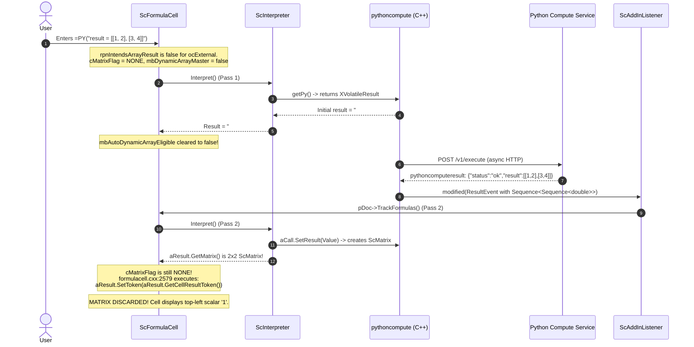

# Collabora Online & Core Calc Dynamic Array Spill Architecture Plan

> **Status:** Draft Architectural Plan / Design Note for **F7 (Single-cell auto-spill)** and **G11** from [`docs/scripting/numpy-jailsafe.md`](../scripting/numpy-jailsafe.md).  
> **Scope:** LibreOffice Core (`collabofficefull/engine`) + Collabora Online (`coolwsd`/`coolkit`).  
> **Target:** Seamless single-cell `=PY(...)` auto-spill into neighboring cells (matching Microsoft Excel and LibrePy Classic), with native `#SPILL!` collision detection.

---

## 1. Executive Summary & Goals

In Microsoft Excel and LibrePy Classic (desktop), entering a single-cell `=PY(...)` formula that returns a list, NumPy 2D array, or pandas DataFrame automatically **spills** into adjacent rows and columns. If any destination cell is occupied, the formula reports `#SPILL!`.

In Collabora Online / Core AddIn Step C today:
- The Python compute service emits dumb JSON grids (`[[1, 2], [3, 4]]`).
- `scaddins/source/pythoncompute/anyjson.cxx` parses them into `sequence<sequence<double>>` or `sequence<sequence<Any>>`.
- `ScUnoAddInCall::SetResult` builds an `ScMatrix`, and `ScInterpreter::ScExternal` pushes it onto the interpreter stack via `PushMatrix`.
- **However, single-cell `=PY(...)` keeps only the top-left value (`1`) and drops the rest.** Full matrices only appear if entered via **Ctrl+Shift+Enter** over a pre-selected rectangular block.

This document details the architectural path to native dynamic array auto-spill for `=PY(...)` in Collabora Online, explains why extension-style UNO write-backs do not belong in Core, maps LibreOffice Calc's existing dynamic array engine, diagnoses the exact async volatile timing knot, and proposes a clean implementation plan with code pointers.

---

## 2. Why LibrePy Classic UNO Write-back Does Not Apply to Core

In Classic LibrePy (`plugin/calc/python/function.py:L874-L1130`), auto-spill was built as an out-of-engine extension:
1. `_queue_off_main_auto_spill` posts a task to a background queue.
2. The UI thread runs `_prepare_auto_spill` ~100ms later.
3. It inspects neighboring cells via UNO `getCellByPosition`, checks for collisions, writes literal cell values, and saves spill bounds in document user-defined properties (`WriterAgentSpillRegistry`).
4. On subsequent recalculations, it clears those literal cells before re-spilling.

### Why this fails for Core C++ / Collabora Online:
1. **Wrong Abstraction Level:** `scaddins/source/pythoncompute/` is an `XVolatileResult` provider implementing `org.collaboraoffice.sheet.addin.PythonComputeFunctions`. It does not have document mutation permissions, access to `ScDocFunc`, or a UNO macro event loop.
2. **Formula Engine Bypassing:** Injecting synthetic literal cells bypasses Calc's formula dependency graph, dirty tracking, undo/redo stacks, and recalculation cascades.
3. **LOKit / Multi-user Rendering Races:** In Collabora Online, out-of-band cell writes bypass the unified tile invalidation path, creating race conditions across connected client views.
4. **Redundant Complexity:** LibreOffice Calc already has a **native dynamic-array and auto-spill engine** built directly into Core. The AddIn must plug into this native engine rather than reimplementing a shadow spill registry.

---

## 3. Existing LibreOffice Calc Dynamic Array Architecture

Modern LibreOffice Calc (`engine/sc/`) has full native dynamic-array and auto-spill machinery. The key components and code paths are:

### 3.1 Data Structures & Flags
- **`ScFormulaCell::mbDynamicArrayMaster`** ([`sc/inc/formulacell.hxx:L143`](file:///home/keithcu/Desktop/collabofficefull/engine/sc/inc/formulacell.hxx#L143)):
  Bit flag indicating that this formula cell is the origin (top-left master) of a dynamic array that can expand or contract.
- **`ScFormulaCell::mbAutoDynamicArrayEligible`** ([`sc/inc/formulacell.hxx:L147`](file:///home/keithcu/Desktop/collabofficefull/engine/sc/inc/formulacell.hxx#L147)):
  Bit flag set when a formula is freshly entered in the UI without legacy Ctrl+Shift+Enter ([`sc/source/ui/view/viewfunc.cxx:L574-L575`](file:///home/keithcu/Desktop/collabofficefull/engine/sc/source/ui/view/viewfunc.cxx#L574-L575)):
  ```cpp
  if (context->bAutoDynamicArray)
      pCell->SetAutoDynamicArrayEligible(true);
  ```
- **`FormulaError::Spill`** ([`include/formula/errorcodes.hxx`](file:///home/keithcu/Desktop/collabofficefull/engine/include/formula/errorcodes.hxx)):
  Native error code surfaced in Calc as `#SPILL!`.

### 3.2 Dynamic Array Promotion on Entry
When a cell is interpreted ([`sc/source/core/data/formulacell.cxx:L2227-L2240`](file:///home/keithcu/Desktop/collabofficefull/engine/sc/source/core/data/formulacell.cxx#L2227-L2240)):
```cpp
if (mbAutoDynamicArrayEligible
    && cMatrixFlag == ScMatrixMode::NONE
    && !pCode->IsHyperLink()
    && !mxGroup)
{
    if (!rpnTopIsImplicitIntersection(*pCode)
        && rpnIntendsArrayResult(*pCode))
    {
        cMatrixFlag = ScMatrixMode::Formula;
        SetMatColsRows(1, 1);
        mbDynamicArrayMaster = true;
    }
    mbAutoDynamicArrayEligible = false;
}
```
If eligible, entered without `@` (implicit intersection), and `rpnIntendsArrayResult(*pCode)` is true, the cell promotes from a plain formula (`ScMatrixMode::NONE`) to a dynamic array master (`ScMatrixMode::Formula`, declared dimensions `1x1`, `mbDynamicArrayMaster = true`).

### 3.3 Array Intent Classification
`rpnIntendsArrayResult` calls `intendsArrayResultInRange` ([`sc/source/core/data/formulacell.cxx:L1737-L1752`](file:///home/keithcu/Desktop/collabofficefull/engine/sc/source/core/data/formulacell.cxx#L1737-L1752)):
```cpp
else if (eOp == ocSpill)
    bResultArray = true;
else if (formula::FormulaCompiler::IsMatrixFunction(eOp) || p->IsInForceArray())
    bResultArray = true;
else if (eOp == ocRange || eOp == ocUnion || eOp == ocIntersect)
    bResultArray = true;
```
Built-in matrix functions (e.g. `SEQUENCE`, `FILTER`, `SORT`, `TRANSPOSE`) are identified via `IsMatrixFunction(eOp)`.

### 3.4 Spill Checking & Deferred Resize
After interpretation, if `aResult.GetMatrix()` is non-null ([`sc/source/core/data/formulacell.cxx:L2575-L2668`](file:///home/keithcu/Desktop/collabofficefull/engine/sc/source/core/data/formulacell.cxx#L2575-L2668)):
- If `cMatrixFlag != ScMatrixMode::Formula`:
  ```cpp
  // If the formula wasn't entered as a matrix formula, live on with
  // the upper left corner and let reference counting delete the matrix.
  aResult.SetToken( aResult.GetCellResultToken().get());
  ```
  The matrix is **dropped**.
- If `cMatrixFlag == ScMatrixMode::Formula`:
  Calc checks if the result dimensions (`nResCols`, `nResRows`) exceed declared dimensions (`nDeclCols`, `nDeclRows`).
  If `bShouldCheckSpill` (`mbDynamicArrayMaster || rDocument.IsFormulaSpilled(aPos)`):
  1. It checks for collisions via `rDocument.IsMatrixSpillBlocked(ScRange(...), nDeclCols, nDeclRows)`.
  2. If blocked:
     ```cpp
     aResult.SetResultError(FormulaError::Spill);
     rDocument.MarkFormulaSpilled(aPos);
     rDocument.MarkPendingMatrixResize(aPos); // collapses back to 1x1
     ```
  3. If unblocked:
     ```cpp
     rDocument.UnmarkFormulaSpilled(aPos);
     rDocument.MarkPendingMatrixResize(aPos); // queues expansion
     ```

### 3.5 Queue Draining
`MarkPendingMatrixResize(aPos)` registers the origin in `maPendingMatrixResizes` ([`sc/inc/document.hxx:L1017`](file:///home/keithcu/Desktop/collabofficefull/engine/sc/inc/document.hxx#L1017)).
At the conclusion of formula recalculation ([`sc/source/core/data/documen7.cxx:L440`](file:///home/keithcu/Desktop/collabofficefull/engine/sc/source/core/data/documen7.cxx#L440)):
```cpp
// Process any dynamic-array expansions queued during interpretation.
ProcessPendingMatrixResizes();
```
`ProcessPendingMatrixResizes()` ([`sc/source/core/data/documen4.cxx:L642-L715`](file:///home/keithcu/Desktop/collabofficefull/engine/sc/source/core/data/documen4.cxx#L642-L715)) calls `rDocument.ResizeMatrixFormula(rPos, SCCOL(nResCols), SCROW(nResRows))` to materialize reference cells across the expanded rectangular area.

---

## 4. The Async Volatile Timing Knot (Why `=PY()` Fails Today)

The root obstacle preventing `=PY(...)` from auto-spilling is a timing and classification mismatch between asynchronous volatile execution and Calc's compile-time dynamic array promotion.



### The Two Breakdown Points:
1. **Static Array Intent Gap:**  
   `=PY(...)` compiles to `ocExternal` (`ScUnoAddInCall`). In [`formulacell.cxx:L1737`](file:///home/keithcu/Desktop/collabofficefull/engine/sc/source/core/data/formulacell.cxx#L1737), `intendsArrayResultInRange` only looks for built-in matrix functions (`IsMatrixFunction(eOp)`). It has no awareness that `org.collaboraoffice.sheet.addin.PythonComputeFunctions.getPy` can return a matrix. Therefore, `rpnIntendsArrayResult` returns `false`, and `mbDynamicArrayMaster` is never armed on entry.
2. **Async Volatile Result Timing Gap:**  
   Even if the cell was flagged `mbAutoDynamicArrayEligible`, on Pass 1 the result is `"#BUSY!"` (a scalar string). `mbAutoDynamicArrayEligible` is cleared to `false`. When the async HTTP response arrives (Pass 2), the matrix is ready, but `cMatrixFlag` is still `ScMatrixMode::NONE`. The engine hits line 2579:
   ```cpp
   if (cMatrixFlag != ScMatrixMode::Formula && !pCode->IsHyperLink())
   {
       aResult.SetToken( aResult.GetCellResultToken().get());
   }
   ```
   The 2x2 matrix is unconditionally dropped, leaving only the scalar `1`.

---

## 5. Architectural Design Options

Two distinct routes can resolve this in Core Calc:

### Route A: Speculative Promotion on Entry (Static Intent for AddIn)

Allow `rpnIntendsArrayResult` to recognize `PythonComputeFunctions` as array-capable:
1. In `intendsArrayResultInRange` ([`sc/source/core/data/formulacell.cxx:L1737`](file:///home/keithcu/Desktop/collabofficefull/engine/sc/source/core/data/formulacell.cxx#L1737)), when `eOp == ocExternal`, inspect the external function name. If it matches `PythonComputeFunctions.getPy` / `getPython` (or queries `ScUnoAddInFuncData` for a matrix-return capability):
   ```cpp
   else if (formula::FormulaCompiler::IsMatrixFunction(eOp) || p->IsInForceArray()
            || isDynamicArrayAddIn(p))
       bResultArray = true;
   ```
2. When the formula is entered without `@`, Calc sets `cMatrixFlag = ScMatrixMode::Formula`, `SetMatColsRows(1, 1)`, and `mbDynamicArrayMaster = true`.
3. **Pass 1:** Cell displays `"#BUSY!"`. Since declared dimensions are 1x1 and result is scalar, no resize is queued.
4. **Pass 2:** Matrix arrives. Because `cMatrixFlag == ScMatrixMode::Formula` and `mbDynamicArrayMaster == true`, the engine automatically enters lines 2585–2668:
   - Evaluates `IsMatrixSpillBlocked`.
   - If blocked: sets `FormulaError::Spill` (`#SPILL!`).
   - If unblocked: calls `MarkPendingMatrixResize(aPos)`.
   - At the end of `TrackFormulas()`, `ProcessPendingMatrixResizes()` expands the matrix cleanly.
5. **Scalar Returns:** If user code returns `result = 42`, `aResult.GetMatrix()` is 1x1. Declared is 1x1 -> no resize, cell displays `42`.
6. **Explicit Scalar Intent:** If the user enters `=@PY(...)`, `rpnTopIsImplicitIntersection(*pCode)` is `true`, suppressing dynamic array promotion.

*Evaluation:* **Recommended.** Requires zero changes to the post-calculation matrix truncation logic and leverages the existing `ProcessPendingMatrixResizes` lifecycle.

---

### Route B: Late Dynamic Promotion on Async Matrix Arrival

Instead of promoting on entry, promote the cell to a dynamic-array master when a matrix result actually arrives:
1. In `formulacell.cxx` (~line 2575), if `aResult.GetMatrix()` is non-null and `cMatrixFlag == ScMatrixMode::NONE`:
   - Check if the formula cell was entered without `@` implicit intersection (`!rpnTopIsImplicitIntersection(*pCode)`).
   - If the cell originated from an asynchronous volatile AddIn (`pCode->IsRecalcModeAlways()` or has volatile listener):
     - Dynamically promote:
       ```cpp
       cMatrixFlag = ScMatrixMode::Formula;
       SetMatColsRows(1, 1);
       mbDynamicArrayMaster = true;
       ```
2. Proceed immediately into the existing spill check (`bShouldCheckSpill`).
3. `MarkPendingMatrixResize` is queued, and `TrackFormulas()` drains it via `ProcessPendingMatrixResizes()`.

*Evaluation:* More flexible if user-defined functions or arbitrary AddIns return unknown shapes, but mutates cell metadata (`cMatrixFlag`) during the recalculation phase rather than the entry/compilation phase.

---

## 6. Collabora Online & LOKit Integration

### 6.1 Tile Invalidation
When `ResizeMatrixFormula(rPos, nCols, nRows)` runs inside `ProcessPendingMatrixResizes()`:
- In desktop Calc, `ScDocument::ResizeMatrixFormula` broadcasts range modifications via `ScHint(SfxHintId::ScDataChanged, ScRange(...))`.
- In Collabora Online (`collabofficefull/kit/ChildSession.cpp`):
  - LOKit listens to document broadcasts to invalidate tiles (`.uno:InvalidateTiles` / `LOK_CALLBACK_INVALIDATE_TILES`).
  - **Requirement:** Ensure that when `ResizeMatrixFormula` materializes reference cells across `(Col ... Col+nCols-1, Row ... Row+nRows-1)`, tile invalidation covers the **entire expanded bounding box**, not just the single origin cell `aPos`.

### 6.2 Multi-View Editing
- In-flight `#BUSY!` is pinned per process by `g_aPending`.
- When `pythoncompute_complete_json` finishes, `ScAddInListener::modified()` executes under `SolarMutexGuard`.
- All view instances sharing the `ScDocument` see the dynamic expansion synchronously without re-triggering separate HTTP executes.

---

## 7. File Persistence & Interop (ODS & XLSX)

### 7.1 OpenDocument Spreadsheet (ODS)
- Dynamic array formulas in LibreOffice are stored in ODF using standard matrix attributes (`table:number-matrix-columns-spanned` and `table:number-matrix-rows-spanned`) on the master cell, with `table:matrix-covered` on covered cells.
- When saving a spilled `=PY(...)` cell, Calc persists the expanded matrix range.
- On reload, `oox/formulabuffer.cxx` and `ScXMLTableRowCellContext` restore the matrix dimensions.
- If precedents change after load, `mbDynamicArrayMaster` allows the matrix to resize or collapse to `#SPILL!`.

### 7.2 Microsoft Excel (XLSX)
- In Excel, dynamic arrays use formula metadata and the `_xlfn.ANCHORARRAY` token or metadata records (`xl/metadata.xml`).
- WriterAgent's Excel converter ([`docs/scripting/ms-py-compatibility.md`](../scripting/ms-py-compatibility.md#58-ooxml--xlfnpy-import)) already handles translating between Excel's formula bridge and Calc's `=PY()`.

---

## 8. Implementation Roadmap

| Phase | Task | Primary Files |
|-------|------|---------------|
| **Phase 1** | IDL & AddIn Metadata Annotation | `engine/scaddins/source/pythoncompute/XPythonComputeFunctions.idl`, `addincol.cxx` |
| **Phase 2** | Dynamic Array Intent in Compiler | `engine/sc/source/core/data/formulacell.cxx` (`intendsArrayResultInRange`) |
| **Phase 3** | CppUnit Test (Static Speculative Promotion) | `engine/sc/qa/unit/ucalc_spilled_range.cxx`, `engine/scaddins/qa/pythoncompute.cxx` |
| **Phase 4** | LOKit Tile Invalidation Verification | `collabofficefull/test/UnitPythonCompute.cpp`, `kit/ChildSession.cpp` |
| **Phase 5** | Online Cypress / Tile Test | `cypress_test/` (verify visual spill of 3-element list in browser canvas) |

---

## 9. Code Pointers & References

- **Calc Dynamic Array Promotion:** [`collabofficefull/engine/sc/source/core/data/formulacell.cxx:L2227-L2240`](file:///home/keithcu/Desktop/collabofficefull/engine/sc/source/core/data/formulacell.cxx#L2227-L2240)
- **Matrix Dropping / Truncation:** [`collabofficefull/engine/sc/source/core/data/formulacell.cxx:L2577-L2582`](file:///home/keithcu/Desktop/collabofficefull/engine/sc/source/core/data/formulacell.cxx#L2577-L2582)
- **Spill Detection & Error:** [`collabofficefull/engine/sc/source/core/data/formulacell.cxx:L2585-L2637`](file:///home/keithcu/Desktop/collabofficefull/engine/sc/source/core/data/formulacell.cxx#L2585-L2637)
- **Deferred Resize Execution:** [`collabofficefull/engine/sc/source/core/data/documen4.cxx:L642-L715`](file:///home/keithcu/Desktop/collabofficefull/engine/sc/source/core/data/documen4.cxx#L642-L715)
- **Formula Recalculation Drain:** [`collabofficefull/engine/sc/source/core/data/documen7.cxx:L440`](file:///home/keithcu/Desktop/collabofficefull/engine/sc/source/core/data/documen7.cxx#L440)
- **Async Result Event Handler:** [`collabofficefull/engine/sc/source/core/tool/addinlis.cxx:L105-L120`](file:///home/keithcu/Desktop/collabofficefull/engine/sc/source/core/tool/addinlis.cxx#L105-L120)
- **AddIn Result Conversion:** [`collabofficefull/engine/sc/source/core/tool/addincol.cxx:L1650-L1684`](file:///home/keithcu/Desktop/collabofficefull/engine/sc/source/core/tool/addincol.cxx#L1650-L1684)
- **Core AddIn Bridge:** [`collabofficefull/engine/scaddins/source/pythoncompute/bridge.cxx`](file:///home/keithcu/Desktop/collabofficefull/engine/scaddins/source/pythoncompute/bridge.cxx)
- **Online Jail-Safe Reference:** [`docs/scripting/numpy-jailsafe.md`](../scripting/numpy-jailsafe.md)
