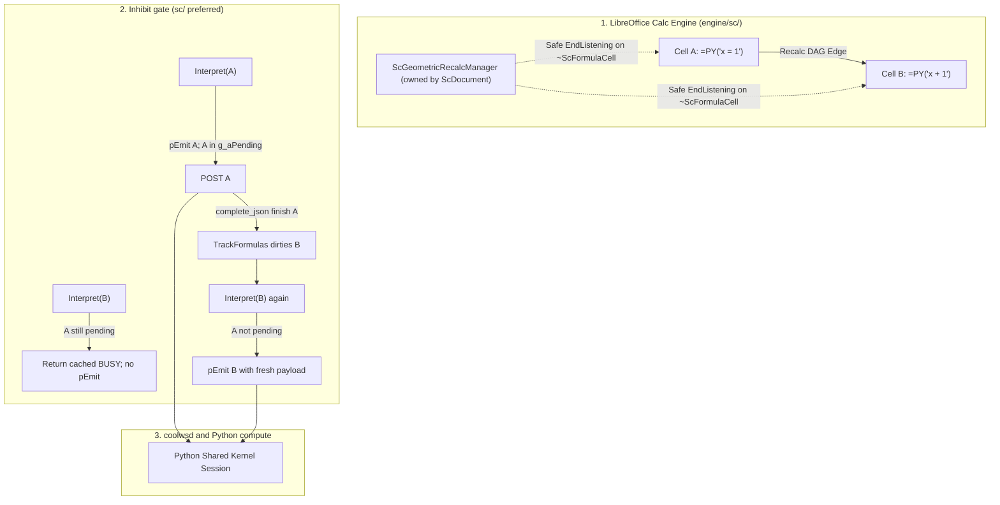

# Geometric Recalc Order (Experimental) — current design


**Related:** [Enabling NumPy & Python](../enabling_numpy_in_libreoffice.md) (session modes, auto-spill), [Microsoft `=PY` design stance](../scripting/ms-py-compatibility.md) (why Excel co-volatility is out of scope), [Calc `=PY()` data shapes](py-data-shapes.md) (`data` / `ranges` arity).

---

## Executive summary

Shared-kernel `=PY()` already persists one Python namespace per workbook, but Calc may evaluate those cells in **any order**. Authors today must pass the upstream cell as a `data` argument so the DAG runs precedents first. That is correct and cheap — and easy to forget.

**Geometric Recalc Order** is an opt-in Settings → Python flag (default **off**). When on, LibrePy treats the sheet’s `=PY()` cells as a **list in sheet order** (row then column — the same order the Python sidebar already uses) and **auto-attaches only the previous list entry** as an extra formula field. Calc then runs A before B because B’s formula literally names A. Partial recalc stays intact: edit A, only A and the chain after it dirty.

This is **not** Excel co-volatility (re-run every Python cell when any one is dirty). It is the existing `data`-as-dependency-edge idea, applied automatically to one predecessor.

The **desktop LibrePy prototype is in the tree** (flag, attach on save / flag-on, UDProp map, eval strip, deferred insert/delete repair). The hard part that made it more than a one-liner: inserting a new `=PY()` cell in the middle of the list. The successor’s predecessor field must be rewritten to the new cell. Those writes **must happen outside recalc**, using the same deferred, undo-isolated pattern as auto-spill (`perform_deferred_spill` + 0.1s timer). Writing other cells from inside the add-in re-enters the formula engine.

**Marker (required, and in the prototype):** a workbook UDProp plus an in-memory map, same pattern as `WriterAgentSpillRegistry` / `SPILL_REGISTRY` / `load_spill_registry_for_doc` in [`function.py`](../../plugin/calc/python/function.py). Eval-time strip consults that map. A 1×1 / “last arg is a PY cell” heuristic is **unimplementable** — `execute_python_addin` / `split_python_addin_data_args` / `calc_addin_args_from_split` see only values, never addresses.

At eval time the add-in sees only values, not addresses. At repair time we group cells by `(workbook_key, resolved_code, n_args)`. **Unanimous-ours** means every cell in that group is one we attached. Then it is safe to drop the last arg for the whole group. If even one cell in the group is user-authored (mixed), we strip none — the mix “poisons” the group. That is why a truncated (cap-hit) list cannot be marked strip-safe: we cannot prove the group is entirely ours. Details in [§9.5](#95-marker-is-the-udprop--in-memory-map).

**Difficulty:** medium for someone who already knows the spill / formula-edit path — on the order of **one careful week plus about a day** for the UDProp / in-memory map (the original happy-path week did not budget a marker). The risk is semantic (`data` arity, insert/delete, undo), not “can we write cells after recalc.” That is what the desktop work took; it is already landed.

What this buys versus Excel’s co-volatility / flip-flop scheduler is in [§12](#12-what-this-gives-versus-full-excel). Collabora / LibreOffice core is a **proposed engine design** in [§13](#12-collabora--libreoffice-core-living-sketch-not-final) (dual-layer engine DAG + in-process emit-gate, **not** trailing `;A1`). Not implemented.

This document is the design record for the experimental prototype. Comments and alternatives are welcome — the “considered, not used” notes below keep the reasons, not a lock.

---

## 1. Why this exists

### The gap users hit

| Mode | Persistence | Order |
|------|-------------|--------|
| Isolated (default) | Fresh namespace per cell | Irrelevant for Python globals |
| Shared kernel today | One workbook namespace | **Only** via explicit `data` refs (or luck) |
| Excel `=PY` | One workbook namespace | Row-major + **re-run all PY cells** (co-volatility) |

A typical Shared-kernel pipeline is a **vertical list**:

```text
A1  =PY("df = load()")
A2  =PY("df = clean(df)")
A3  =PY("result = df.describe()")
```

Without `data` edges, Calc may run A3 before A1. The current docs tell authors to write `=PY("…"; A1)` on A2. Geometric Recalc Order does that attach automatically.

### Out of scope for this prototype

The prototype does **not** implement Excel co-volatility. That needs a workbook-global PY barrier in `sc/`, flip-flop with non-PY formulas, and N Python executions per keystroke. [ms-py-compatibility §5.2](../scripting/ms-py-compatibility.md#52-co-volatility-a-second-calculation-mode) already argued against it. Geometric order reuses Calc’s DAG: one extra precedent per cell, dirty subgraph only.

The prototype also does **not** add a dedicated IDL ordering argument. That rebuilds `.rdb`s for both OXTs and adds a Collabora/Excel arity case. Collabora Gerrit is in review with Tomaž; another IDL change on that path is expensive. Precedent-only strip of a trailing A1 field is enough for the current design ([§9.1](#91-precedent-only-not-value-in-data-not-idl)). Worth revisiting if those costs change.

---

## 2. Product definition

**Flag name (UI):** Geometric Recalc Order (Experimental)  
**Config key:** `scripting.python_geometric_recalc_order`  
**Type:** bool, default **false**  
**Surface:** Settings → Python, next to session mode / auto-spill (`plugin/scripting/module.yaml`). Same checkbox path as `python_auto_spill`. LibrePy **and** WriterAgent. The checkbox and key exist today.

**When on:**

1. Discover `=PY()` / `=PYTHON()` cells (reuse [`cell_discovery.py`](../../plugin/calc/python/cell_discovery.py) — already sorted **row then column**).
2. For each cell after the first in that list, ensure the formula’s trailing fields include **exactly one geometric predecessor**: the previous list entry’s address. Record the attach in the UDProp / in-memory map ([§4](#4-data-binding--do-not-shadow-data)).
3. Leave user-authored ranges alone (see [§4](#4-data-binding--do-not-shadow-data)).
4. On insert / delete / move that changes who “previous” is, **rewrite** the affected successor formulas — **deferred**, not during add-in evaluation.

**When off:** no attach, no rewrite. Existing user-written `data` args stay. Geometric refs already attached **stay** (they are valid DAG edges). The prototype does **not** strip-on-disable — the marker exists, but leaving refs is the cheaper current default ([§9.4](#94-flag-turned-off-leave-refs)).

**Most valuable with Shared kernel.** Isolated cells do not share names, so order-only precedents do nothing useful for Python globals. Isolated + this flag is a **no-op** for Python semantics (the checkbox stays visible; helper text says it is used with Shared kernel). The prototype does not hide the checkbox when Isolated is selected.

---

## 3. Mechanism 

### 3.1 The list

`list_python_cells_on_sheet` already returns `PythonCellInfo` sorted by `(row, column)`. That **is** the geometric list.

**List (current design):** all PY cells on **each sheet**, row-major, each sheet chained **independently**. Flag-on / document-open reconcile every sheet (`list_python_cells_in_doc(..., active_sheet_only=False)`). Insert/delete repair only the **modified** sheet. Cross-sheet predecessors are out of scope (sheet-qualified refs + sheet insert/rename). Workbook-global order (Sheet1 then Sheet2) is a later option, not required to prove the idea.

**Cross-cluster chaining (current design):** two independent PY clusters on one sheet (A1:A5 and D1:D5) become one chain — D1 waits on A5. That slightly over-dirties the D column when A3 changes. Correctness is fine; users who care can turn the flag off and write explicit `data` refs. Spatial clustering is not in the prototype.

**Cap (current design):** `list_python_cells_on_sheet` stops at `_MAX_PYTHON_CELLS_FOUND = 100` (also `_MAX_CELLS_TO_SCAN = 50000`). The prototype adds `discover_python_cells_on_sheet` → `PythonSheetDiscovery.truncated`: after 100 PY cells we keep scanning for one more; #101 or the 50k scan cap sets `truncated=True`. An exact 100 that finishes the formula-cell walk is complete (`truncated=False`) and is chained. **If a cap is hit, skip geometric chaining for that entire sheet, log it, and show one user-visible error** (`notify_geometric_cap_hit` → existing `msgbox`, UI thread only, one box per skipped sheet; Online infobar is in the Collabora design — [§13](#12-collabora--libreoffice-core-living-sketch-not-final)). Do not only `log.error`. Do not chain the first 100 and leave #101 with no predecessor. The prototype does not raise the cap. It does not mark any eval-index triple strip-safe for that sheet — you cannot prove unanimous-ours on a truncated list ([§9.5](#95-marker-is-the-udprop--in-memory-map)). If the 50k scan cap fires with fewer than 100 PY cells, that list is also incomplete — same skip.

A 100-cell chain is serial (venv IPC per dirty cell); that is the price of order, not a new cliff.

### 3.2 Auto-attach is a formula field, not a Python parse

Calc only orders cells that **name** each other in the formula. We do **not** parse Python for `df = …`. We rewrite:

```text
A2:  =PY("df = clean(df)")          →  =PY("df = clean(df)"; A1)
A3:  =PY("result = df.describe()")   →  =PY("result = df.describe()"; A2)
```

Reuse [`parse_python_formula`](../../plugin/calc/python/formula_edit.py) / `parse_data_binding_text` / `rebuild_formula_with_data_args`. Quoted-code cells: keep `parts.prefix` and quote-escape the code only (`"` → `""`, same as `escape_code_for_excel_formula`). Do **not** run `sanitize_inline_py_code` on geometric splice — hand-written `=PY("float(1)")` must stay `float(1)` on attach. Code-in-cell (`=PY($A$1; B1:B10)`): detect with `py_formula_has_unquoted_code_ref` / `py_code_arg_is_cell_ref` and splice the unquoted token — **not** `rebuild_python_formula_with_data` (that quotes the code-ref as a string and sanitizes). `PythonFormulaParts` has no quoted flag (`prefix` / `code` / `data_suffix` only) — splice code-in-cell from the **raw formula**, not `parts.code` alone. Eval-index `code` is the **resolved source** (contents of `$A$1`), not the token `$A$1` ([§9.5](#95-marker-is-the-udprop--in-memory-map)). Existing user data args keep `$` (e.g. `$C$5`); the new predecessor is formatted and may lose `$` (intentional). Do not invent a second formula serializer. Live `getFormula()` / `setFormula()` spelling is covered by `tests/calc/python/test_geometric_recalc_uno.py`. Classic stores `=py(...)` (lowercase, has `=`, keeps `$`, no sheet prefix) — splice keeps `parts.prefix`. Do not paper over prefix / `$` / `=` differences in `CalcDocStub`.

The first cell in the list gets **no** predecessor. Cycles cannot appear if we only ever attach the previous entry in a total order. **Landed one-hop Err:522 skip:** `formula_mentions_cell` (data arg, covering range, or unquoted code-in-cell). If the predecessor already names the successor, skip attach and remove an ours field. Not a transitive walk. `xl("A2")` inside the Python string is not a Calc ref. If a first cell still has a trailing geometric field (successor became first after delete), run the **remove-field** primitive ([§9.5](#95-marker-is-the-udprop--in-memory-map)).

### 3.3 Why “just the previous” is enough

A chain A1→A2→A3→A4 is enough for Calc: dirty A2 recalculates A2, then A3, then A4. We do **not** attach A1 onto every later cell. One field, one rewrite on insert.

### 3.4 Insert / delete / move — the only reason this is not a one-liner

Calc will shift A1-style refs when rows move, but it will **not** retarget “previous PY cell” when a **new PY formula** appears between two existing ones.

Example: list is A1, A3. A3 has `;A1`. User inserts a PY cell at A2.

| Cell | Before | After repair |
|------|--------|----------------|
| A1 | `=PY("…")` | unchanged |
| A2 | `=PY("…")` (new) | `=PY("…"; A1)` + map record |
| A3 | `=PY("…"; A1)` | `=PY("…"; A2)` + map record updated |

Delete A2: A3’s predecessor must become A1 again, or **remove-field** if A3 is now first.

Row insert that only **moves** existing PY cells: Calc’s own reference adjust may already be correct. The deferred pass is **idempotent**: recompute desired predecessor per cell, rewrite only when the geometric field differs. **Also rehome the attach-map key** onto the cell’s current discovery address and drop keys that are no longer on the sheet — formula-only idempotence left an orphan at the old address after Calc shifted the cell. Rehome uses pred-match only for a **true orphan** (old key gone) or a row/col delta (`pred + (live − old)`); a live-key record stays unless the delta claims it. Undo after delete-middle often leaves `{A3: A1}` while formulas are again A2 `;A1` / A3 `;A2` — matching A3 onto A2 drops the successor from the map so the later successor-becomes-first remove-field is a noop. Those heuristics are delicate. **Planned fallback, not in the prototype:** full re-chain when the mismatch is large — wait for a live bug rather than guessing.

### 3.5 Writes must be outside recalc (same as auto-spill)

`=PY()` evaluation is a **synchronous add-in** in Calc’s recalc. Invariants already in the tree:

- Do not mutate other cells from `execute_python_addin` / `finalize_python_return`.
- Do not `processEventsToIdle` during recalc (re-enters the engine → `#VALUE!`).
- Auto-spill already defers neighbor writes: collision check sync, then `threading.Timer(0.1)` → `perform_deferred_spill` on the **UI thread**, inside `_undo_lock`.

Geometric rewrites use that same shape (and the prototype does):

1. **Detect** (shared modify/save trigger, Monaco/formula save, flag toggle) that the geometric list changed.
2. **Compute** a small patch: cells whose predecessor field is wrong.
3. **Schedule** a deferred UI-thread job (reuse the 0.1s timer / drain pattern; do not start a raw thread — `run_in_background` + main-thread apply, or the existing Timer-on-main pattern in `function.py`).
4. **Apply** `setFormula` under `_undo_lock`. `_undo_lock` calls `enterHiddenUndoContext` only when `um.isUndoPossible()`; otherwise `um.lock()`. User edits hide under the existing undo action. Flag-on / document-open reconcile with no prior edit is **one locked unit**, not a hidden-under-nothing no-op. `SheetModifyDispatcher` shares debounce, UI drain, and re-entrancy across spill and geometric. Current prototype: `_undo_lock` is **not** one wrap around both jobs — spill and geometric each take it (two sequential units).
5. **Guard** like spill: same doc URL / lifecycle key; skip if the origin formula is no longer what we expected. **Re-entrancy:** an explicit flag so `setFormula` → `modified` cannot run repair inside repair. A rewrite pass that finds nothing to do is a no-op.

Yellow recalc / off-main formula groups: same contract as spill and session lookup — **no UNO desktop/document queries from a recalc worker**. Discovery + rewrite only on the UI thread after the pass. Eval-time strip reads the already-loaded in-memory map only. The strip-safe index is written on the UI thread and read from the recalc worker. Do not mutate it in place like `SPILL_REGISTRY` (unlocked). Swap in an immutable snapshot (frozenset). GIL-atomic bind is enough; no UNO, no per-cell lookup. A dedicated lock is optional, not required if you only rebind the name.

### 3.6 When to run the repair pass

| Trigger | Why |
|---------|-----|
| Flag turned **on** | One-shot attach for **all sheets**, each chained independently |
| Flag turned **off** | Stop maintaining refs; **leave** existing geometric fields; leave the map (do not strip-on-disable) |
| Monaco / native **Save** of a PY cell | Primary attach path — save is already outside recalc (`editor.py` `_apply_formula_save` / native Save). New or edited formula may need a predecessor; neighbors may need retarget. Do **not** collapse everything onto modify-only. |
| Sheet `XModifyListener` (shared trigger) | Insert/delete/clear. **Do not** add a sibling `CalcGeometricModifyListener`. `CalcSpillModifyListener.modified` walks `SPILL_REGISTRY` for that sheet only — it does **not** scan formula cells, so geometric repair cannot piggyback on that walk. Share the **trigger / debounce** (0.1s timer, drain, UI thread, `_undo_lock`) and the re-entrancy flag. Geometric repair then runs its own `list_python_cells_on_sheet`. Factor a one-sheet dispatcher if a second `addModifyListener` is undesirable; do not merge the two jobs into one class. |
| Document open | If flag on, load the UDProp into the in-memory map (like `load_spill_registry_for_doc`) and reconcile once so files authored with the flag stay consistent |

Do **not** rewrite from inside the add-in just because this cell is evaluating.

---

## 4. Data binding — do not shadow `data`

**Highest-risk implementation detail.** Current design: **precedent-only**, strip via the UDProp / in-memory map ([§9.1](#91-precedent-only-not-value-in-data-not-idl), [§9.5](#95-marker-is-the-udprop--in-memory-map)).

Today ([data shapes](py-data-shapes.md)):

- One trailing arg → Python `data` is that `CalcRange`.
- Two or more → `data` is the **list** (same as `ranges`).

`calc_addin_args_from_split` in [`calc_addin_data.py`](../../plugin/calc/calc_addin_data.py) is the flip: `len(args) == 1` returns one 2D grid; `len(args) >= 2` returns a **list** of grids. If A2 is `=PY("np.mean(data)"; B1:B10)` and we append `;A1`, then `data` suddenly becomes a list and `np.mean(data)` breaks. That is the common case, not a corner.

**Contract:** the geometric predecessor is a **Calc-only ordering token**. The add-in **strips it** before packing worker `data` / `ranges`. User-authored args keep today’s arity. Isolated and Shared both see the same `data` they wrote.

### 4.1 Why a value-shape strip cannot work

`PythonFunction.python` / `execute_python_addin` receive `(code, data)` values only (`addin_impl.py`). `split_python_addin_data_args` and `calc_addin_args_from_split` never see addresses or “this arg is a PY cell.”

A rule like “if the last arg is a 1×1 PY cell, drop it” is therefore unimplementable. `locate_formula_cell_in_doc` (`function.py` `session_key`) is **not** a fix: it returns `None` on 0 or 2+ matches, and cannot disambiguate `=PY("f(data)"; A1)` when A1 is both predecessor and user data.

The last-row idea “user already passed the previous PY cell as real data → no-op, satisfied either way” is **wrong** under a shape-strip: it would drop real user data. Under the map, that row is: **do not record as ours, do not strip** ([§9.5](#95-marker-is-the-udprop--in-memory-map) table).

### 4.2 Where to strip (must be before the index heuristic)

In `_execute_python_addin_impl` ([`function.py`](../../plugin/calc/python/function.py)):

`function.py` order today: split → `maybe_strip_geometric_eval_args` → `calc_addin_args_from_split` → matrix-index peel.

1. `args = split_python_addin_data_args(data)`
2. **Strip here** if the eval index marks this `(workbook_key, resolved_code, n_args)` **strip-safe** (unanimous-ours — [§9.5](#95-marker-is-the-udprop--in-memory-map)). Unconditional across **both** branches — including `_code_uses_indexed_multi_data` (`"data["` / `"ranges["` in the source). If the geometric field stays, it becomes `data[-1]` / `ranges[-1]`.
3. Then `py_data = calc_addin_args_from_split(...)` and the existing trailing-single-cell **matrix-index** heuristic (the `is_multi and not _code_uses_indexed_multi_data(code)` block that peels a last 1-cell arg as `index_arg`, after which `finalize_python_return` slices `flat[value]`).

If strip is skipped on a fill-down of identical `=PY("np.mean(data)"; B1:B10; pred)`, `calc_addin_args_from_split` flips `data` to a list, then the index heuristic peels the predecessor **value** as `index_arg` — silent wrong numbers. Strip must run first, and fill-down must be strip-safe when every cell with that triple is ours. Phase 4 tests both `=PY("np.mean(data)"; B1:B10)` and `=PY("ranges[-1].shape"; B1:B10)`, plus fill-down and mixed neighbors.

The prototype does not invent a reserved formula suffix or add a third IDL argument.

---

## 5. User-visible behavior

**What the user sees:** formulas gain a trailing cell ref they did not type. That is the feature (Calc must see it). Document it in Settings helper text and the hub session-modes page when this ships ([§11](#11-docs-still-to-update-before-calling-this-shipped)).

**What they should not see:** extra undo steps **when an undo action already exists** (hidden under the user edit); `#REF!` storms after insert; `data` breaking on cells that already pass ranges; a full-sheet PY re-run after one edit. Flag-on / open reconcile with an empty undo stack may appear as **one locked unit** — that is accepted, not a second “rewrite A3” step on top of a user edit.

**LibrePy sidebar:** the existing cell list is already geometric. A later UX nicety (not in the prototype) is a small “depends on A1” hint. Do not block the flag on sidebar chrome.

**Excel import:** the OOXML rewriter must **not** invent geometric edges ([ms-py already says this](../scripting/ms-py-compatibility.md)). If the user turns the flag on after import, the deferred pass attaches them. Export **leaves** geometric-only args as extra `_xlws.PY` deps (they are valid precedents). The prototype does not special-case strip on export.

---

## 6. Difficulty and reuse

What the desktop prototype reused (already landed):

| Piece | New? | Reuse |
|-------|------|--------|
| Settings checkbox | Small | `module.yaml` + existing Settings dialog |
| Discover PY cells in order | Phase 3: `truncated` | `discover_python_cells_on_sheet` / `list_python_cells_on_sheet` — exact 100 is complete; the prototype does not raise the cap |
| Parse / rebuild `=PY(code; args)` | Small splice + remove-field | `formula_edit.py` — `rebuild_python_formula_with_data` **or** `rebuild_python_formula_with_code_ref` |
| Marker | ~1 extra day | Copy `WriterAgentSpillRegistry` / `load_spill_registry_for_doc` / `SPILL_REGISTRY` (`udprops`). Record `workbook_key` even in Isolated. Unanimous-ours eval index — not uniqueness, not ≥1-hit. |
| Deferred UI-thread writes + undo | Small | `perform_deferred_spill`, `_undo_lock`, Timer 0.1s — share debounce; explicit re-entrancy flag |
| Sheet modify | Small | **Shared trigger**, not a sibling listener; geometric job does its own PY discovery |
| Strip geometric arg from worker `data` | Medium | `_execute_python_addin_impl` — map lookup **before** the index heuristic and **before** `calc_addin_args_from_split` |
| Insert-in-middle repair | Medium | Pure list-diff + `setFormula` |
| Tests | Required | pytest on list-diff + formula splice + map/strip; UNO for insert-row + deferred rewrite |

**Not in the desktop prototype:** LibreOffice core patches, co-volatility, IDL change, venv protocol change, chat tools, strip-on-disable, raising the 100-cell cap.

**Rough effort (what it took):** 3–5 days for the happy path (flag + attach + deferred repair on one sheet) **plus about a day** for the UDProp / in-memory map; another 2–3 days for insert/delete/undo/flag-toggle edges and tests.

Compare to **full Excel co-volatility:** multiple engineer-months in `sc/`, high regression risk. This flag is the cheap 80%.

---

## 7. Risks

| Risk | Mitigation |
|------|------------|
| Shadowing `data` (arity flip) | Precedent-only strip via the map, **before** the index heuristic ([§4](#4-data-binding--do-not-shadow-data)) |
| 1×1 / “is a PY cell” strip | Unimplementable — add-in sees values only ([§4.1](#41-why-a-value-shape-strip-cannot-work)) |
| Index heuristic eats `;A1` | Strip first; Phase 4 tests `np.mean(data)`, `ranges[-1].shape`, fill-down |
| Uniqueness / “fail-safe = no strip” | Not used — kills fill-down of identical `=PY("np.mean(data)"; B1:B10)` |
| ≥1-hit strip | Not used — would strip a mixed matrix-index neighbor |
| Mixed ours + user same triple | Do not mark strip-safe; residual is “chain loses strip,” not “user cell loses last arg.” Workbook-wide: mixed on Sheet1 also poisons the same `(code, n_args)` on Sheet2. **Planned:** a sheet-scoped hint; do not reintroduce a value fingerprint. |
| Two open workbooks | **Off-main:** `off_main_calc_session_is_unambiguous()` false → no strip. **Landed half-fix:** UI-thread `maybe_strip_geometric_eval_args(..., doc=target_doc)` uses that workbook's key even when two sessions are recorded. Residual without a key: leftover `;pred` often becomes `index_arg` (silent wrong numbers), not a list in the worker. “Bind the dispatch job” is not implementable without new identity (`XAddIn` has no calling document). **Planned:** off-main multi-workbook keyed strip needs a real eval-time workbook id, not `len==1`. |
| Isolated still needs strip | Isolated never enters `workbook_session_id`. Init-non-empty already records via `build_python_eval_init_kwargs` → `calc_init_session_id`. Isolated + no init still never records. UI load/repair must `record_active_calc_session("calc:" + _workbook_session_key)` (same string, idempotent) so the no-init case can pass the unambiguous check |
| Keying the token `$A$1` | Eval `code` is resolved source (`execute_python_addin`); repair must read the code cell |
| Naive `;` arity | Repair `n_args` must match `split_python_addin_data_args`, not a semicolon count |
| Rewrite during recalc | Same ban as spill; deferred only |
| Undo fragmentation | `_undo_lock`: hidden when `isUndoPossible()`, else `lock()`; flag-on reconcile is one locked unit |
| Infinite rewrite loop | Idempotent desired-vs-actual; re-entrancy flag; skip if already correct |
| Calc already adjusted refs on row insert | Repair pass compares desired predecessor, does not blindly rewrite |
| User already passed the previous cell as **data** | Do not record as ours; do not strip ([§9.5](#95-marker-is-the-udprop--in-memory-map)) |
| User passed a **different** single-cell last arg (real data) | Append, do not replace, unless the map says that last arg is **our** stale predecessor |
| Two independent PY clusters on one sheet | One row-major chain; slightly over-dirties the later cluster |
| Circular refs from user reverse-refs | **Landed one-hop:** `formula_mentions_cell` (data arg, covering range, or unquoted code-in-cell). Skip attach; remove an ours field. We never attach a later cell. Transitive walk is not in the prototype. |
| 100-cell discovery cap | Skip the **whole** sheet; never chain a partial list |
| Shared + Isolated confusion | Checkbox always visible; helper: “Used with Shared kernel”; Isolated is a no-op |
| Collabora Online | Proposed design in [§13](#12-collabora--libreoffice-core-living-sketch-not-final) (engine DAG + **inhibit** emit-gate + `g_aParamCache` identity, **not** trailing `;A1`, **not** `g_aWaiters`). Not implemented. |

---

## 8. Implementation status

Desktop LibrePy phases 1–4 are **landed** on master. The notes below are what shipped, not a remaining schedule.

**Phase 1 — Pure list + formula splice.** **Landed** in `plugin/calc/python/geometric_recalc.py` (`tests/calc/python/test_geometric_recalc.py`). Unit tests only: given a list of addresses + current formulas + the in-memory record, compute the patch and the eval-index bools. No UNO. Encodes the [§9.5](#95-marker-is-the-udprop--in-memory-map) table, including **remove-field**, code-in-cell splice from the raw formula (`rebuild_python_formula_with_code_ref`), fill-down unanimous-ours, mixed poison, one-hop Err:522 skip, and cap-hit skip (now via `truncated`). Cap-hit also returns a user-visible message; `notify_geometric_cap_hit` shows one `msgbox` per skipped sheet on the UI thread.

**Phase 2 — Flag + attach on save / flag-on.** **Landed on master** (with Phase 4). Monaco and native cell save call the splicer; apply on the UI thread after save (save is already outside recalc). Settings default off. Flag-on walks **all sheets**. Persist / load the UDProp like spill. Isolated UI load/repair must `record_active_calc_session` with `calc:` + `_workbook_session_key` (same string eval reads; never `""`).

**Phase 3 — Deferred repair on insert/delete.** **Landed.** Shared trigger (`SheetModifyDispatcher` in `sheet_modify.py`) + spill-like 0.1s timer + re-entrancy flag. `CalcSpillModifyListener.modified` still walks `SPILL_REGISTRY` only; geometric repair runs its own `list_python_cells_on_sheet`. Insert/delete/clear retargets without waiting for save; a data-edit that changes the PY list rebuilds the strip-safe index. Discovery `truncated` flag: exact 100 is chained; #101 or the 50k scan cap skips the sheet. UNO tests: three-cell column, insert PY in the middle, successor’s field updates; delete (including successor-becomes-first → remove-field); undo. Cap-hit sheet is left unchained.

**Phase 4 — Strip geometric arg from worker ingress.** **Landed on master** (with Phase 2 — attach without strip is the arity footgun), **without** an `args[:-1]` fingerprint. After `split_python_addin_data_args`, if the triple is strip-safe, drop `args[-1]` **before** the index heuristic and `calc_addin_args_from_split`. Eval identity is unanimous-ours on `(workbook_key, resolved_code, n_args)` only. UI-thread `=PY()` hydrates `_STRIP_SAFE` from UDProp when the evaluating process has an empty map (`ensure_geometric_strip_index_for_eval`) — attach may have run over URP, and `OnLoadFinished` can miss a later UDProp write. UI-thread strip passes `doc=target_doc` so two open workbooks still strip the focused / caller book. Tests in [§10](#10-tests).

**Not in the prototype** (open if someone wants them): cross-sheet chains, workbook-global order, Isolated value-piping, sidebar annotations, Excel export special-case, raising the 100-cell cap, strip-on-disable, spatial clustering of independent PY groups, a dedicated IDL arg, off-main multi-workbook keyed strip (real eval-time workbook id), sheet-scoped mixed-poison hint, full re-chain when rehoming mismatch is large.

---

## 9. Current design choices

These are the choices the experimental prototype uses, with reasons. Alternatives are listed so reviewers can see what was tried or considered — not to forbid revisiting them.

Eval identity is specified in [§9.5](#95-marker-is-the-udprop--in-memory-map). An earlier uniqueness draft (strip only when the triple is unique) broke fill-down; the prototype uses unanimous-ours + `workbook_key` instead.

### 9.1 Precedent-only (not value-in-`data`, not IDL)

**Current design: A — Precedent-only.** The geometric arg is a Calc DAG token. Strip it before packing worker `data` / `ranges`. Do not inject the previous cell’s value.

**Considered, not used:**

- **B — Value-in-`data`.** Inject the previous cell’s value into `data` / `data[-1]`. Breaks `np.mean(data)` on every cell that already passes one range.
- **C — Third IDL parameter.** Rebuilds `.rdb`s for both OXTs; Collabora/Excel import get another arity case. Collabora Gerrit is in review; another IDL change on that path is expensive. Worth revisiting if those costs change.

A trailing A1 field is enough **if** we strip it via the map, not a 1×1 heuristic.

### 9.2 The list is all PY cells on the sheet, row-major

**Current design: A.** One chain per sheet. Independent clusters become one chain. Matches `list_python_cells_on_sheet` and the sidebar.

**Considered, not used:** contiguous-column-only (surprises authors who put the next step in C1); spatial clustering; workbook-global order. Those can wait.

### 9.3 Isolated mode — checkbox visible, no-op

**Current design: A.** Always visible; Isolated is a no-op. Helper: “Ensures PY cells evaluate in sheet order. Most useful with Shared kernel.”

**Considered, not used:** hide the checkbox when Isolated is selected (couples two settings; looks like a bug when the box disappears).

Precedent-only strip means Isolated `data` is unchanged. Isolated is a no-op for **Python globals**, not for the strip: `workbook_session_id` returns `None` when mode ≠ `shared`, but Isolated still needs strip (else arity breaks). Isolated does **not** “never enter `record_active_calc_session`”: a non-empty init script records via `build_python_eval_init_kwargs` → `calc_init_session_id` → `calc_workbook_base_session_id`. Isolated + no init still never records. Geometric UI load/repair must `record_active_calc_session("calc:" + _workbook_session_key)` (same string, idempotent) so the no-init case can pass the unambiguous check ([§9.5](#95-marker-is-the-udprop--in-memory-map)).

### 9.4 Flag turned off — leave refs

**Current design: A.** Stop attaching and stop repairing. The refs stay as valid DAG edges. After a precedent-only strip they do not change Python behavior. **Current prototype behavior**, not a missing strip-on-disable: leftover `;predecessor` fields remain when the flag is off.

**Considered, not used for now: B — strip-on-disable.** The marker now exists ([§9.5](#95-marker-is-the-udprop--in-memory-map)), so B is implementable later with the same remove-field primitive. Not in the prototype.

### 9.5 Marker is the UDProp / in-memory map

**Current design: C (required), used to implement A’s rewrite table.** Not a reserved suffix. Not IDL. Not a 1×1 / “last arg is a PY cell” heuristic. An earlier uniqueness draft did not settle eval identity — the prototype uses **unanimous-ours** plus `workbook_key`, below.

Copy the spill pattern — do not invent a second subsystem:

| Spill (exists) | Geometric (this feature) |
|----------------|--------------------------|
| UDProp `WriterAgentSpillRegistry` | A sibling document property (e.g. `WriterAgentGeometricRegistry`) |
| `SPILL_REGISTRY` in memory | In-memory map, loaded on the UI thread |
| `load_spill_registry_for_doc` / `save_spill_registry_for_doc` | Same load/save shape via `udprops` |
| Keyed by `(doc_url, sheet, row, col)` | Per-cell attach record (addresses on the UI thread) **plus** `workbook_key` even in Isolated |

**Rewrite** (UI thread) always has addresses. The map is the ours-vs-user marker: append / replace / remove using the table below.

**Eval-time strip** cannot look up `(sheet, row, col)`. `PythonFunction.python` / `execute_python_addin` never get a calling address (`addin_impl.py`). Do **not** call `locate_formula_cell_in_doc` (None on 0 or 2+ matches; cannot tell user-data-is-previous-PY from our field). Do **not** query the desktop / document from a recalc worker. Off-main, `doc` stays `None` (`_execute_python_addin_impl` fills `doc` only on main).

#### Eval index — unanimous-ours (not uniqueness, not ≥1-hit)

At **repair time** (UI thread, we have addresses), compute an eval-index bool per `(workbook_key, resolved_code, n_args)`:

- **strip-safe** iff **every** discovered PY cell with that triple is in the map (ours-only / unanimous).
- **Eval:** if that triple is marked strip-safe, drop `args[-1]` before the index heuristic and before `calc_addin_args_from_split`. Unconditional on both branches including `data[]` / `ranges[]`.
- **Mixed** same-code/arity (a non-mapped user cell, e.g. matrix-index `=PY("f"; range; i)` next to a chain of `=PY("f"; range; pred)`) → do **not** mark strip-safe → **no-strip for the whole triple** (chain included) until the user cell is gone or attached. Residual to name: **mixed poisons the chain**, not “user cell also loses last arg.” A ≥1-hit rule is not used; that would strip the matrix-index neighbor. Same `(code, n_args)` on a different range is the same triple — mixed on A also over-poisons B. Workbook-wide: mixed on Sheet1 also poisons the same `(code, n_args)` on Sheet2. Residual is safe (no strip → no wrong numbers). **Planned:** a sheet-scoped hint; do not reintroduce a value fingerprint.
- **Cap-hit** → skip the entire sheet, do **not** mark any triple strip-safe, do not write a partial chain. You cannot prove unanimous on a truncated list.
- **Not used:** uniqueness / “fail-safe = no strip” / “typical pipelines have distinct code strings.” That kills fill-down of identical `=PY("np.mean(data)"; B1:B10)`: after attach every successor has the same `resolved_code` and `n_args=2`, non-unique → no-strip → `calc_addin_args_from_split` flips `data` to a list, then the index heuristic peels the predecessor **value** as `index_arg` — silent wrong numbers.

**Fingerprint dropped** (was recommended, not used). A value hash of `args[:-1]` was meant to stop mixed-poison across two chains that reuse the same snippet on different ranges. Without Phase 3 the strip-safe set is not rebuilt on a data edit, so the live-value key missed after the user changed a range and strip skipped — `np.mean(data)` then saw a list. Under unanimous-ours, dropping the fingerprint never produces wrong numbers; it only widens the no-strip blast radius in the rare mixed case. The prototype does not put a value or address fingerprint on the strip key. Eval identity is unanimous-ours on `(workbook_key, resolved_code, n_args)` only.

#### Three must-gets (easy to get wrong)

**1. Key `code` is what `execute_python_addin` receives, not the formula token.** `PythonFunction.python` passes Calc’s first argument through as `code` (`addin_impl.py`). For `=PY($A$1; B1:B10; pred)` that is the **cell contents of `$A$1`** (resolved source), not the token `$A$1`. Repair must **read that cell** when building the eval index (`formula_edit.py` unquoted branch vs `addin_impl.py`). Keying the token `$A$1` misses every script-bank cell. Detect / splice with `py_formula_has_unquoted_code_ref` / `py_code_arg_is_cell_ref` / geometric splice from the raw formula (exist on master). `PythonFormulaParts` has no quoted flag (`prefix` / `code` / `data_suffix` only) — splice code-in-cell from the **raw formula**, not `parts.code` alone, or `$A$1` gets quoted by `rebuild_python_formula_with_data`. Cells that share resolved source collide on `(code, n_args)`; same unanimous rule. Existing user data args are spliced **verbatim** (keep `$` on `$C$5`); only the appended/replaced predecessor is formatted.

**2. `n_args` at eval is `len(split_python_addin_data_args(data))`** (`calc_addin_data.py`). Repair arity **must** match that splitter, not a naive semicolon count. A pair `(range, 1×1 pred)` does **not** collapse under `_is_legacy_single_column_range`: the inner of the 1×1 is a sequence, so two varargs stay two args (`n_args=2` after attach).

**3. Cap-hit:** `discover_python_cells_on_sheet` returns at most 100 and sets `truncated` when the 100-cell find cap or the 50k scan cap stopped the walk. You cannot prove unanimous on a truncated list. Skip-sheet is the current fail-safe; do **not** mark those triples strip-safe. An exact 100 that finished the scan is complete and is chained.

#### `workbook_key` (blocking — do not cite `get_python_init_kwargs`)

`get_python_init_kwargs` does **not** carry `doc_url`. `build_python_eval_init_kwargs` (`document_scripts.py`) returns `{}` with **no** session record when the init script is empty. When init is non-empty it calls `calc_init_session_id(doc)` → `calc_workbook_base_session_id` → `record_active_calc_session("calc:" + _workbook_session_key)` (`session_manager.py`). `set_calc_init_script` and on-main `get_python_init_kwargs` both go through that builder. `record_active_calc_session(None, kwargs)` itself does **not** add to `_RECORDED_CALC_SESSION_IDS` (`None` is ignored); the add is the side effect of building kwargs. Isolated does **not** “never enter `record_active_calc_session`.” Isolated + no init still never records. `workbook_session_id` still returns `None` when mode ≠ `shared`. Isolated still needs strip off-main (else arity breaks). Do **not** write a unit test that asserts Isolated always leaves `_RECORDED_CALC_SESSION_IDS` empty.

**Eval `workbook_key`:** on the **UI thread**, `maybe_strip_geometric_eval_args(..., doc=target_doc)` uses `geometric_workbook_key(doc)` even when two Calc sessions are recorded (F9 this book) — that half-fix is **landed**. **Off-main**, `workbook_key = get_cached_calc_session_id()` only when `off_main_calc_session_is_unambiguous()` (`session_manager.py`: `len(_RECORDED_CALC_SESSION_IDS) == 1`). Else do not strip. **Current prototype behavior off-main:** eval cannot pick `workbook_key` when more than one session is recorded. A leftover `;pred` after a failed strip is often peeled as `index_arg` (silent wrong numbers), not a list in `np.mean(data)`. “Bind the dispatch job” is not implementable without new identity (`XAddIn` has no calling document). **Planned:** a real eval-time workbook id so off-main can strip when two books are open, not `len==1`.

On the **UI-thread** load / repair path, write that key into the geometric map **and** call `record_active_calc_session` with the **same string eval will read**: `calc:` + `_workbook_session_key` (never `""`). Do this **even in Isolated**. Same string as the init-kwargs path; idempotent; **required for the no-init case**. Do **not** invent a second Isolated key. Then one open file makes `len(_RECORDED_CALC_SESSION_IDS) == 1` and yellow Isolated can strip. Sibling of `load_spill_registry_for_doc`. Unsaved files must not use empty URL — same #402 hole as `session_key` / `_workbook_session_key` (URL, else a persisted unsaved id, never `""`).

#### Remove-field

Parse → drop the last geometric data arg → rebuild → drop the map record. Needed when a successor becomes first after delete. Same primitive strip-on-disable ([§9.4](#94-flag-turned-off-leave-refs) B) would use later. **Idempotent:** first cell with a trailing geometric field → strip that field. After remove-field, recompute unanimous-ours for the affected triples.

**Rewrite table** (desired predecessor A1 unless noted). “Ours” means the map has a record for this cell.

| Scenario | Last arg | Map | Action |
|----------|----------|-----|--------|
| No args | — | none | Append `;A1`; record |
| User range `B1:B10` | range | none | Append (`;B1:B10;A1`); record |
| Fill-down of identical `=PY("np.mean(data)"; B1:B10)` | range + pred | **all** successors ours | Append each; triple is strip-safe (unanimous) |
| Already correct | single cell = desired | ours, pred A1 | No-op |
| Stale predecessor after insert | single cell = old pred | ours, old pred A1, desired A2 | Replace `;A1` → `;A2`; update record |
| User single-cell data `C5` | single cell ≠ desired | none | Append (`;C5;A1`); do not overwrite `C5` |
| User already passed the previous PY cell as **real data** | single cell = desired | **none** (we did not attach) | **No-op. Do not record.** If this cell shares a triple with mapped cells, the triple is **not** strip-safe (mixed poisons the chain). |
| Mixed matrix-index neighbor `=PY("f"; range; i)` next to `=PY("f"; range; pred)` | 1×1 | one ours, one not | Do **not** mark strip-safe; **neither** strips |
| Successor became first (delete) | geometric field | ours | **Remove-field**; drop record; recompute index |
| First cell still has a leftover field | geometric field | ours | Remove-field (idempotent) |
| Cap hit on this sheet | — | — | Skip the sheet; log **and** one message box; no partial chain; **do not** mark triples strip-safe |

### 9.6 Flag-on / document-open — all sheets

**Current design: A.** All sheets, each chained independently. `list_python_cells_in_doc(..., active_sheet_only=False)` already walks `doc.getSheets()`. Modify-listener repair stays per-sheet.

**Considered, not used:** active sheet only (other tabs stay inconsistent until visited).

---

## 10. Tests

Most of this is already in the tree: unit tests in `tests/calc/python/test_geometric_recalc.py`, UNO tests in `tests/calc/python/test_geometric_recalc_uno.py`, desktop-enum mocks in `tests/calc/test_excel_py_auto_open.py`. Phase 1 is mockable without soffice.

**Unit (`tests/calc/python/`, match the module name; splice cases can extend `test_formula_edit.py`):**

Phase 1 — list-diff + splice + eval-index bools (encode [§9.5](#95-marker-is-the-udprop--in-memory-map)) — **landed**:

- Empty, one cell, two cells, insert in middle, delete middle, delete first (remove-field), reorder.
- Formula splice: no args; existing range args preserved; already-correct predecessor; stale predecessor replaced; user extra cell-ref appended not overwritten when it is not ours.
- **Quoted code stays verbatim:** `=PY("float(1)"; $C$5)` attach keeps `float(1)` (quote-escape only; no Calc sanitizer).
- **Code-in-cell:** splice `=PY($A$1; B1:B10)` from the **raw formula**; result stays an unquoted `$A$1`, not `=PY("$A$1"; …)`. Eval-index `code` is the **resolved source** (cell contents of `$A$1`), not the token.
- Repair `n_args` matches `len(split_python_addin_data_args(...))`, not a semicolon count. `(range, 1×1 pred)` stays `n_args=2`.
- Remove-field: first cell with a trailing geometric field → field gone; second call is a no-op.
- **Err:522 one-hop:** predecessor already names the successor (data arg, covering range, or unquoted code-in-cell) → skip attach; ours field is removed. `xl("A2")` inside the Python string is not a Calc ref.
- Cap: `truncated=True` → skip sheet, no patch, **no strip-safe marks**. Exact 100 with `truncated=False` is chained.

Phase 4 — `data` strip (inject the in-memory map; no UNO) — **landed**:

- `=PY("np.mean(data)"; B1:B10)` after attach still packs a single `CalcRange` (not a list).
- `=PY("ranges[-1].shape"; B1:B10)` after attach: `ranges[-1]` is `B1:B10`, not the predecessor (indexed multi-data branch).
- Strip runs before the matrix-index peel: last geometric 1-cell must **not** become `index_arg`.
- **Fill-down:** two identical `=PY("np.mean(data)"; B1:B10)` after attach → **both** strip (unanimous-ours, same resolved code, `n_args=2`).
- **Mixed:** matrix-index neighbor `=PY("f"; range; i)` next to a chain of `=PY("f"; range; pred)` → **neither** strips (mixed poisons the triple).
- **Over-poison (fingerprint dropped):** same snippet + `n_args` on two ranges; mixed on A also poisons B. Residual is safe (no strip). Data-value edit after attach must still strip (3-field key). Flag-off leftover attached last arg must still strip.
- **Two open workbooks / `off_main_calc_session_is_unambiguous()` false** → no strip **off-main**. **UI-thread** with `doc=target_doc` still strips that workbook. Passing `doc` off-main must not strip (no UNO).
- **Isolated** UI load/repair calls `record_active_calc_session("calc:" + _workbook_session_key)` (same string eval reads) and strips when unambiguous. Do not assert Isolated always leaves `_RECORDED_CALC_SESSION_IDS` empty.
- User 1×1 last arg **not** in the map, and no mixed poison of a chain: no strip of that user cell.
- Never fall back to 1×1, uniqueness, or ≥1-hit.

**UNO (`test_*_uno.py`):**

- **Formula I/O (landed, `test_geometric_recalc_uno.py`):** live `getFormula()` / `setFormula()` on `=PY("y"; $C$5)` (absolute `$` survives attach), quoted `=PY("np.mean(data)"; B1:B10)` (splice still parses), and unquoted `=PY($A$1; …)` (code-in-cell stays unquoted). Flag can stay off — this is splice I/O, not eval strip. Do not mark win32-only.
- **Desktop enum mock (landed, pytest in `test_excel_py_auto_open.py`):** `_record_desktop_calc_sessions` must stop when `hasMoreElements()` is a MagicMock (same as `session_manager._find_document_by_predicate`) and cap at 32. OnNew inline + unpatched mock `ctx` used to allocate until OOM; that is not leftover Isolated. `pytest-timeout` is 60s (`signal`); leftover/`testing_runner` aborts at 30s (`WRITERAGENT_UNO_TEST_TIMEOUT`) without arm/disarm chatter. Geometric `OnNew`/`OnCreate` must still run the desktop scan when `_doc_from_event` is `None` (Writer keeper focused). Record **only when exactly one Calc is open** — scanning every Calc made leftover soffice `recorded=2` / `unambiguous=False` (Shared `session_id=None`). That sole-Calc scan also **drops stale `calc:file:` ids** from closed workbooks (showcase UNO leftovers); a client-only `clear_active_calc_session()` does not reach soffice. Worker restart must not `clear_active_calc_session()` or leftover after cap-hit sees `recorded=0`. Two `calc:unsaved:` keys replace rather than stack. Leftover closes extra factory `scalc` docs before F9 so a full `make test-uno` does not stay `recorded=2`. Do **not** record LibreOffice's OpenCL probe `opencl/cl-test.ods` (leftover 11:31 `ids=`).
- **Shared kernel eval (landed, `test_geometric_shared_kernel_a3_reads_a1_f9_stable`):** flag on, A3 reads a name assigned in A1 without a user-typed `data` ref; result is 41 across two `calculateAll` (F9) passes. Precedent-only strip of the attached last arg is Phase 4 unit-tested (`data is None` / `np.mean(data)` / `ranges[-1]`). **GitHub Actions asserts the 41s** — `testing_runner` seeds the throwaway `UserInstallation` from the user-level `uno_packages` that `make register-built-oxt` wrote (user `unopkg add` is invisible to `-env:UserInstallation=<tmp>`; 525 is a hard fail, not a skip). Discover soffice with `_resolve_soffice_bin` (Windows `soffice.exe`; macOS `Contents/MacOS/soffice`, not beside `Contents/Resources/officehelper.py`). Seed `writeragent.json` Shared before soffice starts (2s `get_config` cache). **Also persist `scripting.python_geometric_recalc_order` into that throwaway profile** — a client-only monkeypatch of `geometric_flag_enabled` does not reach soffice; leftover then runs flag-off there (no in-process `record` / `_STRIP_SAFE`), Shared `session_id` is dropped, and A3 sees Isolated `x_geo_live` undefined. Factory `OnNew` must record **inline** on the UNO thread (`_run_geometric_on_open`) — marshaling from that event enqueues+waits and can sit 30s, then leftover Shared still sees `session_id=None`. Do **not** seed checkout `.venv` as `scripting.python_venv_path` — leftover Shared then saw Isolated semantics (`x_geo_live` undefined) on Linux (GHA 33751116865) and macOS (GHA 33752809831). Windows/macOS soffice `sys.executable` is often empty or `soffice.exe`; `resolve_libreoffice_python` uses the sibling / `Contents/Resources` office interpreter instead (GHA 33752806292). Stay on the `with_native_doc` reuse Calc — a second factory `scalc` makes `off_main_calc_session_is_unambiguous()` false, so Shared drops `session_id`. Local blank profiles may still skip.
- Insert a PY row between two chained cells; after the deferred pass, successor formula names the new cell; values update on next recalc. **Landed** (`test_geometric_insert_delete_undo_three_cell_column`).
- Delete middle cell: successor retargets or remove-field if it is now first. **Landed** (same UNO test).
- Flag off (landed, `test_geometric_flag_off_leaves_existing_refs`): no new attaches; existing refs stay.
- Isolated + flag on (landed, `test_geometric_isolated_flag_on_noop_and_strip`): no-op for Python **globals**; strip still runs when `workbook_key` is unambiguous (no `data` breakage). UI load/repair records `calc:` + `_workbook_session_key`.
- Undo (landed, `test_geometric_hidden_undo_and_locked_unit`): user types a new PY cell, geometric rewrite does not add a second undo step when `isUndoPossible()` (hidden context). Flag-on reconcile with no prior edit is one locked unit (`test_calc_spill_undo_lock` is the spill analogue).
- **`#SPILL!` / auto-spill on a chained origin (landed, `test_geometric_chained_origin_still_auto_spills`):** attaching `;pred` does not break origin match (`is_matching_py_formula`). Neighbors use the existing `perform_deferred_spill` path. **GitHub Actions must write those neighbors** (same throwaway seed as the Shared-kernel leftover; 525 is a hard fail). Local blank profiles may still skip.
- Re-entrancy (landed, `test_geometric_repair_setformula_does_not_reenter`): repair `setFormula` does not nest a second repair.
- Cap-hit sheet: no chain, log emitted, no strip-safe marks. **Landed** (`test_geometric_cap_hit_sheet_stays_unchained`).

---

## 11. Docs still to update before calling this shipped

- Hub [session modes](../enabling_numpy_in_libreoffice.md#session-modes-and-recalc-semantics): one short subsection + Settings table row.
- [ms-py-compatibility](../scripting/ms-py-compatibility.md): pointer — “opt-in geometric *chain*, still not co-volatility.” See [§12](#12-what-this-gives-versus-full-excel).
- Settings helper in `module.yaml`.
- This file: flip Status to shipped.

Do not touch `AGENTS.md` unless the rewrite-outside-recalc rule needs to become a global invariant (it is already implied by the spill / `=PY()` contract).


**Status:** **(Experimental).** Phases 1–4 landed on master (Settings flag default off, attach on save / flag-on, UDProp load/save, Isolated `record_active_calc_session`, eval strip before the index heuristic, sheet modify-listener / insert-delete deferred repair, discovery `truncated` flag). Cap-hit modal persists across reconcile so debounce / save / open cannot storm. Row-insert rehomes the attach-map key onto the current address. Two open workbooks → no strip is **current prototype behavior off-main**: eval-time strip without a calling document uses `off_main_calc_session_is_unambiguous()` (`len(_RECORDED_CALC_SESSION_IDS)==1`). **UI-thread** eval may pass the resolved `target_doc` and strip that workbook even when another Calc file is open. Failed strip often becomes a silent matrix-index peel (wrong numbers), not `np.mean(data)` seeing a list. Flag-off leftover `;predecessor` fields are also **current prototype behavior** ([§9.4](#94-flag-turned-off-leave-refs)). Current design in [§9](#9-current-design-choices) (no IDL, no 1×1 value-shape strip, no `locate_formula_cell_in_doc` for eval identity, precedent-only, cap skip-sheet, no strip-on-disable, Isolated checkbox visible / no-op). **Eval identity** is **unanimous-ours** on `(workbook_key, resolved_code, n_args)` only ([§9.5](#95-marker-is-the-udprop--in-memory-map)). **Cap-hit UI:** skip the sheet, log, **and** show one first message box per skipped sheet (`notify_geometric_cap_hit`, persisted across reconcile) — do not only `log.error`.

**Parked:** off-main multi-workbook keyed strip (still needs a real eval-time workbook id, not `len==1` — UI-thread `target_doc` strip is the half-fix); sheet-scoped mixed-poison hint; full re-chain when rehoming mismatch is large; workbook-global PY order and spatial clustering; Collabora extra-listen path ([§13](#12-collabora--libreoffice-core-living-sketch-not-final)); chain-batch of a dirty geometric suffix into one compute-service POST ([§12](#12-what-this-gives-versus-full-excel) — research, not designed). One-hop Err:522 skip before splice is **landed**.


---

## 12. What this gives versus full Excel

Geometric order gets the **pipeline** Excel users think they have. It does not get Excel’s **“the whole Python program re-ran”** contract. That contract is almost all of the co-volatility / flip-flop tax, and most of it is a tax Calc does not want. Deeper Excel notes: [ms-py-compatibility §5.2](../scripting/ms-py-compatibility.md#52-co-volatility-a-second-calculation-mode).

### What the prototype buys

Shared kernel already keeps one namespace. The missing piece was **order**: Calc may evaluate `=PY()` in any order, so `A3` can run before `A1` and `df` is missing.

Geometric order auto-wires **one DAG edge** to the previous PY cell in sheet order. For the usual vertical list:

```text
A1  df = load()
A2  df = clean(df)
A3  result = df.describe()
```

you get Excel’s *intent* (A then B then C) without Excel’s *mechanism* (re-run every PY cell). Edit A2 → A2 and A3 dirty. A1 does not reload. That is Calc’s pride, and it is the opposite of co-volatility.

Desktop LibrePy is a **synchronous** add-in: A finishes before B’s `Interpret()` starts. So a mixed chain like PY → Excel → PY is just the normal DAG:

- A1 PY
- B1 `=A1+1`
- C1 PY with `data` = B1 (and geometric `;A1`)

No second scheduler. Flip-flop exists in Excel because PY is a **foreign batched runtime** (cloud / all-PY-then-Excel). Desktop LibrePy is not in that world.

### What you miss without co-volatility and flip-flop

Those two things buy **one** extra semantic: after any PY cell is dirty, **every** PY cell runs again, in workbook row-major order, as one generation. Mixed Excel formulas are deferred until that batch finishes, then Excel runs, then another PY batch if something still waits. That covers cases geometric order does not.

**1. Hidden PY↔PY coupling outside the dirty suffix.** A cell that only mutates a global (setup, cache, `df = load()` from a file with no sheet dep) does **not** re-run when you edit a later cell. The namespace is incremental: prefix stays, suffix updates. Excel rebuilds the whole Python program so every global is from the same sweep. That is the real miss. It is also why Excel is slow, and why they added Partial/Manual PY modes.

**2. Cross-sheet / workbook-wide implicit pipelines.** Geometric chains **each sheet alone**. `Sheet2!A1` using a name set on `Sheet1` has no automatic edge. Excel walks every PY cell in the book. Explicit `data` still works; the flag will not invent it.

**3. “Notebook F9.”** People who treat the sheet as one script (“any change, replay everything top to bottom”) will notice. Geometric is a **chain**, not a barrier. Ctrl+Shift+F9 is the closest thing already in Calc.

**4. Generational consistency of PY outputs.** An Excel `=SUM` over many PY cells, after one edit, can see a mix of old prefix values and new suffix values. Excel’s full PY pass makes them one generation. Same as any other Calc partial recalc — surprising only if you expected a Python barrier.

**5. Online without a complete DAG.** Flip-flop is a blunt fix for “we cannot interleave PY and Excel at cell granularity.” Collabora’s proposed inhibit gate (successor does not emit while its predecessor is `#BUSY!`) is the *cell-granular* version and is stricter / cheaper than Excel’s all-PY batch ([§13](#12-collabora--libreoffice-core-living-sketch-not-final)). You miss flip-flop there only if the DAG is missing an edge (cross-sheet, or Excel in the middle that nobody named). Sync desktop does not need it.

**6. Excel import that relied on co-volatility, not position.** The rewriter already lifts `xl()` ranges onto `data`. It does **not** invent PY↔PY edges. Turning the flag on after import attaches **previous-on-this-sheet**. Workbooks that shared globals across sheets, or depended on “every PY re-ran,” will not silently match Excel. That is a conversion story, not a scheduler story.

### What you do not miss

| Thought | Reality |
|---------|---------|
| Order of a vertical list | Same row-major assumption as Excel |
| Excel→PY dirtying (`load` from a range) | Both need a formula dep. Excel uses trailing `_xlws.PY`; LibrePy uses `data`. Co-volatility does **not** create those edges |
| PY → Excel → PY on desktop | Sync add-in + DAG is enough |
| Two clusters on one sheet | Excel re-runs both anyway; the prototype over-dirties the later cluster. Same order, less work on the earlier one |
| Non-row-major layout (clean in A1, load in C1) | Excel breaks the same way. Explicit `data` is **stronger** than either geometry scheme |

### Batching — not needed for LibrePy; maybe for the compute service

One reason Excel’s barrier looks like a perf design: PY runs in **another datacenter**. Interleaving PY with ordinary Excel cells at cell granularity means one high-latency HTTP (or equivalent) per PY cell, with the spreadsheet engine idle on the far side of the cut. If you could gather every PY cell’s code and inputs, send **one** payload, run them in order on the farm, and come back with all results, you pay **one RTT for the whole generation**. That is a rational remote-compute bet.

LibrePy is not in that world. The add-in talks to a **warm local worker** over framed pickle ([venv IPC](../scripting/numpy-serialization.md)). That is microseconds to a few milliseconds. Interleaving PY with the Calc DAG is cheap: `Interpret()` of A blocks until Python returns, then B runs. No second scheduler for latency. Geometric order is about **correctness of globals**, not about hiding RTT.

The “run it once” bet only holds if **no Excel formula that a later PY cell needs** itself depends on an earlier PY result:

```text
A1  PY:  x = 1
B1  Excel: =A1+10
C1  PY:  result = x + B1
```

You cannot pack C1’s inputs until B1 has A1’s value. That is a **cut** in the graph. Each cut is another remote round. Flip-flop is “number of PY↔Excel cuts,” not “one batch.” Co-volatility then makes each of those rounds worse: every PY pass re-runs **all** PY cells, not just the ones that just became unblocked. The latency win (fewer RTTs) and the globals win (replay everything) fight each other. Partial/Manual PY modes are Microsoft admitting automatic replay is too expensive. So the datacenter theory is plausible as a *motive*; mixed sheets force **many barriers**, and the original perf bet is lost.

Collabora Online / the compute service ([jail-safe compute](../scripting/numpy-jailsafe.md)) sits in the middle: `getPy` is HTTP again, so RTT starts to matter. The wrong lesson from Excel is “co-volatile the workbook.” The right lesson is **batch the work you already know is ordered**.

A geometric chain A→B→C is one pipeline. In principle the dirty suffix could be **one** ordered request: run A, then B, then C in the worker, come back once. That is “run the Python once” **without** replaying unrelated clusters and without flip-flop, as long as Excel in the middle is named on the DAG. Inhibit + retry (do not emit B while A is `#BUSY!`) is the per-cell version of the same idea ([§13](#12-collabora--libreoffice-core-living-sketch-not-final)); a chain-batch would be the latency version.

**This is not designed yet.** It needs research: how the compute-service protocol would take an ordered list of `(code, data)` cells; how Shared-kernel session state is applied between steps in one POST; what to do when an Excel formula sits in the middle of the chain (you cannot pack the next PY until that Excel cell has a real value); how `g_aParamCache` / `#BUSY!` / `complete_json` would represent “this request is three cells”; whether kit→wsd should still emit per cell and let wsd coalesce, or emit once from `sc/`. Open questions, not a locked plan. The prototype on desktop does not need any of it.

### The 80 / 20

Geometric order is Excel’s **authoring habit** (put the next step in the next cell) plus Calc’s **engine** (dirty subgraph).

Full Excel is “the sheet is one Python process; any PY tick replays the process; Excel formulas take turns with that process.”

What you give up is mostly **replay-everything** and **cross-sheet implicit globals**. What you keep is the pipeline that made people ask for this, plus partial recalc, plus no `sc/` barrier and no N venv trips per keystroke.

For Collabora, the thing to want first is **inhibit + a real cell identity for the param cache** — not flip-flop. Flip-flop is how Excel papers over a missing per-cell DAG. This design is trying to *have* the DAG. **Chain-batching** the dirty suffix into one compute-service POST is a later latency idea on top of that DAG, not a reason to import Excel’s workbook barrier.

---

## 13. Collabora / LibreOffice core engine specification <a name="12-collabora--libreoffice-core-living-sketch-not-final"></a>

**Proposed design, not implemented.** Dual-layer engine DAG + **inhibit** emit-gate + `g_aParamCache` identity. A `g_aWaiters` queue is **not used**. A formula DAG edge only orders when `Interpret()` is *called*; `getPy` returns `#BUSY!` immediately and that does not serialize HTTP. $\frac{N(N+1)}{2}$ HTTP is a worst case — a predecessor-only chain is closer to $2N-1$ — but still gate it.

This section defines a proposed engine-native architecture for Geometric Recalculation Order inside LibreOffice Calc and Collabora Online: an **engine-managed recalc DAG** in `sc/` paired with an **inhibit** gate so a successor does not call `pEmit` while its predecessor is still in `g_aPending`. The engine's `TrackFormulas` path then re-Interprets the successor with a fresh payload.

---

### 13.1 Why the Desktop Model Fails in Collabora Online (The Four Fatal Traps)

In WriterAgent Desktop LibrePy, `=PY()` is a **synchronous** UNO add-in: evaluating Cell A blocks until the Python worker process returns. Cell B with a trailing `;A1` field evaluates only after A has completed. In Collabora Online and LibreOffice Core C++, this model completely breaks down due to four fundamental architectural differences:

| Hazard | Desktop LibrePy Behavior | Collabora Online / Core Reality | Fatal Consequence if Unaddressed |
|--------|--------------------------|---------------------------------|-----------------------------------|
| **1. Execution model** | **Synchronous** add-in (`python()` blocks) | **Asynchronous** add-in (`getPy` returns `XVolatileResult` `#BUSY!`) | **Async race:** A and B can both emit HTTP on the first pass. A finishing dirties **direct listeners** (B), which may emit again. A predecessor-only chain is closer to **$2N-1$** requests, not $\frac{N(N+1)}{2}$ (that is a worst case if leftover listeners re-dirty the whole suffix). Still worth gating. |
| **2. Listener lifecycle** | None in `sc/` (handled via formula text) | Direct `StartListeningCell` in `sc/` | **Dangling Pointer Memory Corruption:** `ScFormulaCell::EndListeningTo()` only walks RPN tokens. An ad-hoc listener attached to predecessor A is **not** unregistered when B is edited or deleted, leaving a dangling pointer in A's broadcaster slot that crashes on A's next broadcast. |
| **3. Shared formula groups** | Formula text modified cell-by-cell | `CompileXML` groups identical formulas (`mxGroup`) | **Formula Group Fragmentation:** Appending unique `;A1`, `;A2`, `;A3` fields shatters grouped formulas into individual cells, destroying vectorization and inflating token storage. |
| **4. Undo & Collaborative editing** | Local single-user `_undo_lock` | LOKit tile-based collaborative undo | **Undo Stack Corruption:** Deferred `SetFormula` rewrites pollute the LOKit undo stack with synthetic edits and conflict with live multi-user typing. |

**The Core Realization:** Dependency in Calc’s recalculation DAG (whether via `;A1` or via `StartListeningCell`) only orders the **invocation** of `Interpret()`. In an asynchronous engine, `Interpret()` returns `#BUSY!` immediately. **A formula DAG edge alone does not serialize HTTP execution.**

Therefore, Collabora would need a **Dual-Layer Architecture**:
1. **Recalc DAG Layer (`sc/`):** Establishes dependency edges cleanly through an engine manager so that modifying A marks B dirty, without rewriting formula strings or corrupting memory.
2. **Inhibit Gate (`sc/` preferred, or `bridge.cxx` with a cell identity the IDL does not have):** When B would `Interpret` while A is still pending, return cached `#BUSY!` and **do not** `pEmit`. When A finishes, `TrackFormulas` dirties B; the next `Interpret(B)` builds a **fresh** payload and emits once. Do **not** queue a waiter payload (stale `#BUSY!` + double HTTP).

---

### 13.2 Codebase Topology

The proposed C++ work would touch existing files in the Collabora Online / Core tree without altering the IDL signature (`getPy(code, data)` stays unchanged):

| Component | Path & Relevant Lines | Function & Architectural Role |
|-----------|----------------------|-------------------------------|
| **AddIn Bridge** | `engine/scaddins/source/pythoncompute/bridge.cxx` <br> `L53–81, L344–417` | **Today:** `g_aPending` + `g_aParamCache` (keyed on `(code, data)` only). **No** `g_aWaiters` / cell-key map in the tree. `getPy` / `startCompute` see code+data only — no sheet/row/col/doc. |
| **Volatile Result** | `engine/scaddins/source/pythoncompute/volatile.cxx` <br> `L30–85` | **Interim Status & Calc Notification:** Returns `#BUSY!`; on completion, acquires `SolarMutexGuard` and triggers `ScAddInListener::modified` via `ResultEvent`. |
| **AddIn API** | `engine/scaddins/source/pythoncompute/addin.cxx` <br> `L49–66` | `ScaPythonComputeAddIn::getPy` entry point. Calls `startCompute`. |
| **JSON Serialization** | `engine/scaddins/source/pythoncompute/anyjson.cxx` <br> `L878–895` | `buildExecuteRequestJson`: Emits request payload with request ID and data args. |
| **Interpreter Bridge** | `engine/sc/source/core/tool/interpr4.cxx` <br> `L2991–3314` | `ScUnoAddInCall`: `pMyFormulaCell` is available during interpretation (L3308) and attaches `ScAddInListener`. |
| **Formula Cell** | `engine/sc/source/core/data/formulacell.cxx` <br> `L5855–5894` (`StartListeningTo`) <br> `L5968–6012` (`EndListeningTo`) <br> `L979–996` (`~ScFormulaCell`) | **Cell Lifecycle & DAG Hooks:** Where formula dependencies are wired. Must pair with manager to cleanly clean up listeners on cell destruction. |
| **Document Engine** | `engine/sc/source/core/data/documen7.cxx` <br> `L221–252` (`Start/EndListeningCell`) <br> `L527–581` (`TrackFormulas`) <br> `L328–432` (`CalcFormulaTree`) | **Recalculation Engine:** Traverses dirty formulas, orders formula tree, executes interpretations. |
| **Macro/Dep Manager Precedent** | `engine/sc/source/core/data/documen8.cxx` <br> `L380` (`GetMacroManager`) <br> `engine/sc/inc/macromgr.hxx` | **Architectural Blueprint:** Demonstrates how Calc tracks non-RPN cell dependencies cleanly with symmetric removal on cell destruction. |
| **Kit Emitter** | `kit/PythonComputeEmitter.cpp` <br> `L55–108, L187–287` | **In-Process Kit Boundary:** Calls `dlsym` for `pythoncompute_set_emitter` and `complete_json`. Forwards JSON upward via WebSocket text frames. |
| **WSD Broker** | `wsd/ClientSession.cpp` <br> `L3021–3029, L3852–4025` | **Network Broker:** Receives frame from kit in jail; POSTs asynchronous HTTP to compute service; routes result back. **No changes required here.** |

---

### 13.3 The Dual-Layer Architecture



#### Layer 1: Calc Recalc DAG (`ScGeometricRecalcManager`)

To prevent the dangling pointer trap, non-RPN geometric dependencies must be managed symmetrically. Calc already has this exact pattern in `ScMacroManager` (`engine/sc/inc/macromgr.hxx`) and `ScExternalRefManager`.

1. **Class definition:** Add `ScGeometricRecalcManager` to `engine/sc/inc/geometricrecalcmgr.hxx`, owned by `ScDocument` (`std::unique_ptr<ScGeometricRecalcManager> mpGeometricMgr`).
2. **Sheet Discovery:** Scans formula cells in row-major order using `ScColumn::GetCellStore()` / `GetFormulaCellBlockAddress`. Matches functions with AddIn programmatic name `getPy` / `getPython`.
3. **Registration:**
   - For cell $k > 1$ in the ordered chain, records predecessor $k-1$.
   - Calls `rDoc.StartListeningCell(aPosPred, pCellSucc)`.
4. **Symmetric Cleanup (Crucial):**
   - In `ScFormulaCell::~ScFormulaCell()` (`formulacell.cxx` ~L985):
     ```cpp
     if (rDocument.HasGeometricRecalcManager())
         rDocument.GetGeometricRecalcManager()->RemoveCell(this);
     ```
   - In `ScFormulaCell::EndListeningTo()`: Manager ensures `rDoc.EndListeningCell(aPosPred, this)` is called whenever a cell ceases listening.
5. **Sheet Modifications:**
   - On row/column insert, delete, or cell move (`ScDocument::UpdateReference` / `CopyBlockFromClip`): Manager rebuilds the geometric chain for affected sheets and retargets predecessor listeners.

#### Layer 2: Inhibit Gate (prefer `sc/`, not a waiter queue)

`getPy(code, data)` has **no cell coordinates**. `startCompute` cannot look up `(doc, sheet, row, col)`. A `g_aWaiters` / `g_aCellToActiveReqId` queue would assume an identity the IDL does not have. This design does **not** use that queue.

**Preferred — Option B (engine inhibit):** `ScGeometricRecalcManager` in `ScFormulaCell::Interpret()` / `interpr4.cxx` checks whether this cell's geometric predecessor is still pending. If so, return the cached `#BUSY!` volatile and **do not** call the add-in. When A finishes, `complete_json` → `finish()` → `ScAddInListener::modified` → `TrackFormulas` dirties B (it requeues; view/idle/`CalcFormulaTree` runs `Interpret` later — not inside `TrackFormulas` itself). The second `Interpret(B)` sees A done, builds a **fresh** payload, and emits once.

**Option A (weaker):** set `ScInterpreter::pMyFormulaCell` into a Solar-guarded context before `ExecuteCall()` so `startCompute` can read a cell key. `pMyFormulaCell` can be **null** (Function Wizard). `NeedsCaller` today injects the **document shell**, not a cell. You still need Option-B-like inhibit so B does not emit while A is in flight. Use A only if you must change the param-cache key.

**Do not queue payloads.** Stale `#BUSY!` in a queued payload only if B's `data` includes A. If B's formula actually names A, the first `Interpret(B)` would pack `#BUSY!` into the JSON. Emitting that later is stale; `TrackFormulas` dirties/requeues, it does not always `Interpret` immediately.

**`g_aParamCache` (largest omitted hazard — address before C++ work):** `makeParamCacheKey` is `(code, data)` only (`bridge.cxx`). A fill-down of identical `=PY("clean()")` shares **one** `XVolatileResult` and **one** HTTP. That is the opposite of an $N$-request storm, and it **breaks Shared-kernel per-cell sequencing** if formula text stays untouched. Any no-rewrite geometric design must change that cache key (or disable sharing for `getPy` when the flag is on). `anyjson.cxx` currently hard-codes `"mode": "isolated"` — Shared-kernel order is not on the wire yet. Only `g_aPending` + `g_aParamCache` exist in the current bridge — no `g_aWaiters`.

**Outcome:** each cell $A_k$ runs in Python after $A_{k-1}$ completes. HTTP is $O(N)$ for a predecessor chain (first-pass $N$ if ungated, plus one re-emit per successor if you inhibit poorly; inhibit + engine retry is one emit per cell).

---

### 13.4 Preserving Shared Formula Groups (`mxGroup`)

One of the greatest dangers of formula rewriting (Path B) is breaking shared formula groups:
- In `engine/sc/source/core/data/formulacell.cxx` (~L1345–1385), `CompileXML` groups consecutive identical formulas into an `ScFormulaCellGroup` (`mxGroup`).
- A fill-down of 1,000 cells of `=PY("clean(data)")` is stored as a single grouped token array of length 1,000.
- If formula strings are rewritten to `=PY("clean(data)"; A1)`, `=PY("clean(data)"; A2)`, etc., **every single formula group is shattered into 1,000 distinct token arrays**.

**Under the Dual-Layer Architecture:**
1. Formula strings remain completely untouched: `=PY("clean(data)")`.
2. `mxGroup` remains fully intact in storage and memory.
3. Group calc already disables for weight / OpenCL / cycles / matrix. There is **no** dedicated “volatile result → scalar fallback” in `InterpretFormulaGroup` — do not rely on one. The manager still resolves predecessor $(r-1, c)$ per cell without distinct bytecode.
4. Destructor cleanup must copy the manager-cleanup *idea*, not the `ocMacro` gate: use `HasGeometricRecalcManager()`-style (like `HasExternalRefManager()`), **not** `GetMacroManager()`.

---

### 13.5 Document Lifecycle, Settings & Interoperability

1. **Opt-in Setting:**
   - Stored as a document property in `ScDocOptions` / ODS settings: `GeometricRecalcOrder = true/false` (default **false**).
   - In Collabora Online, exposed via document properties or menu toggle.
2. **Document Load Restore:**
   - In `engine/sc/source/core/data/documen7.cxx` ~L591 (`StartAllListeners`) and `formulacell.cxx` ~L1443 (`CalcAfterLoad`):
     - If `GeometricRecalcOrder` is enabled, `ScGeometricRecalcManager::RebuildAllSheets()` walks formula stores and re-establishes geometric listeners.
     - Avoids doing this during initial raw XML parsing (`IsImportingXML` / `IsInsertingFromOtherDoc` skips listener establishment).
3. **Full Roundtrip Cleanliness (ODS & Excel XLSX):**
   - Because formula text is never rewritten with synthetic `;A1` tokens:
     - Saving to ODS produces standard formulas without extraneous parameters.
     - Saving/exporting to XLSX produces clean `=_xlws.PY(...)` formulas that do not break Excel's argument parser or inject spurious global variables.
     - Moving an ODS file between Desktop LibrePy and Collabora Online is completely safe: neither tool has to strip synthetic parameters generated by the other.
4. **Cap-Hit UI in Collabora Online:**
   - Discovery cap: 100 `=PY()` cells per sheet. If exceeded, skip chaining for that sheet.
   - Collabora Online has no VCL desktop `Application::GetDefDialogParent()` / `msgbox`.
   - Instead, post a LOKit client notification via `ChildSession::sendTextFrame("infobar: ...")` or window alert, informing the user: *"Geometric Recalc Order skipped on Sheet1: exceeded 100 Python cells cap."*

---

### 13.6 Implementation Phases (Roadmap for C++ Development)

If starting implementation in the Collabora Online / Core tree, a plausible order:

#### Phase 1: Inhibit + param-cache identity (do not add `g_aWaiters`)
- **Files:** `engine/sc/source/core/tool/interpr4.cxx` / `formulacell.cxx` (Option B), optionally `bridge.cxx` only if a cell key is later required for cache keying.
- Inhibit `Interpret` / `pEmit` while the geometric predecessor is in `g_aPending`. Let `complete_json` → `TrackFormulas` drive the next `Interpret`.
- Change `g_aParamCache` so identical `=PY("clean()")` fill-downs do **not** share one volatile / one HTTP when geometric order is on.
- **Unit Test:** B does not `pEmit` while A is pending; completing A does **not** emit a queued payload; B emits once on the engine-driven second `Interpret` with a fresh payload. Two identical formulas are two requests when the flag is on.

#### Phase 2: `ScGeometricRecalcManager` in `engine/sc/`
- **Files:** `engine/sc/inc/geometricrecalcmgr.hxx`, `engine/sc/source/core/data/geometricrecalcmgr.cxx`, `engine/sc/inc/document.hxx`, `engine/sc/source/core/data/documen8.cxx`.
- Implement row-major PY cell discovery via `ScColumn::GetCellStore()`.
- Implement symmetric `StartListeningCell` / `EndListeningCell`.
- Hook cleanup into `ScFormulaCell::~ScFormulaCell()`.

#### Phase 3: Recalc Integration & CppUnit Tests
- **Files:** `engine/sc/qa/unit/ucalc.cxx`.
- Test two chained `=PY()` cells: verify modifying Cell 1 dirties Cell 2.
- Test cell deletion: verify no dangling pointers or listener leaks in `ScTable`.
- Test `mxGroup` preservation: verify contiguous column of identical `=PY()` cells retains `GetCellGroup()`.

#### Phase 4: Collabora Online End-to-End Verification
- **Files:** `kit/ChildSession.cpp`, `test/UnitPythonCompute.cpp`.
- Verify two-cell Shared Kernel execution in Online: Cell 1 sets `x = 42`, Cell 2 evaluates `x + 1`, result is `43` with zero race conditions.
- Verify cap-hit infobar message delivery to client session.
