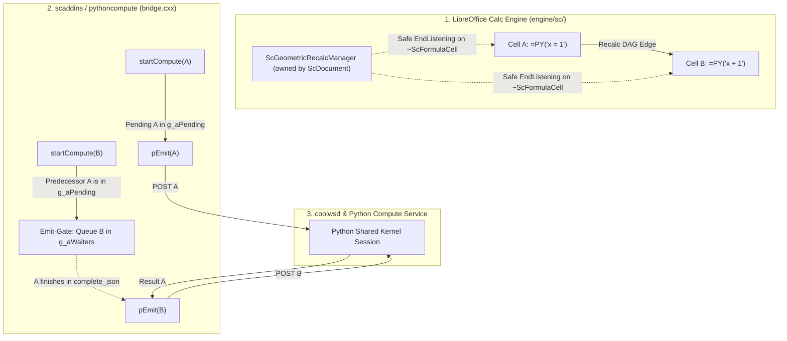

# Geometric Recalc Order (Experimental) — implementation plan

**Status:** **(Experimental).** Phases 1–4 landed on master (Settings flag default off, attach on save / flag-on, UDProp load/save, Isolated `record_active_calc_session`, eval strip before the index heuristic, sheet modify-listener / insert-delete deferred repair, discovery `truncated` flag). This revision repairs Gemini **B** (cap-hit modal persists across reconcile so debounce / save / open cannot storm) and **C** (row-insert rehomes the attach-map key onto the current address). Gemini **A** (two open workbooks → no strip) is **by design**, not a blackout bug: eval-time strip runs only when `off_main_calc_session_is_unambiguous()` is true (`len(_RECORDED_CALC_SESSION_IDS)==1`). Flag-off leftover `;predecessor` fields are also **by design** ([§9.4](#94-flag-turned-off-leave-refs)). Closed calls in [§9](#9-decisions) stand (no IDL, no 1×1 value-shape strip, no `locate_formula_cell_in_doc` for eval identity, precedent-only, cap skip-sheet, no strip-on-disable, Isolated checkbox visible / no-op). **Eval identity** is **unanimous-ours** on `(workbook_key, resolved_code, n_args)` only ([§9.5](#95-marker-is-the-udprop--in-memory-map)). **Cap-hit UI:** skip the sheet, log, **and** show one first message box per skipped sheet (`notify_geometric_cap_hit`, persisted across reconcile) — do not only `log.error`.

**Parked (not this revision):** multi-workbook keyed strip (needs a real eval-time workbook id, not `len==1`); cycle / Err:522 detection before splice; workbook-global PY order and spatial clustering; Collabora extra-listen path ([§12](#12-collabora--libreoffice-core-living-sketch-not-final)).

**Related:** [Enabling NumPy & Python](../enabling_numpy_in_libreoffice.md) (session modes, auto-spill), [Microsoft `=PY` design stance](../scripting/ms-py-compatibility.md) (why we refuse Excel co-volatility), [Calc `=PY()` data shapes](py-data-shapes.md) (`data` / `ranges` arity).

---

## Executive summary

Shared-kernel `=PY()` already persists one Python namespace per workbook, but Calc may evaluate those cells in **any order**. Authors today must pass the upstream cell as a `data` argument so the DAG runs precedents first. That is correct and cheap — and easy to forget.

**Geometric Recalc Order** is an opt-in Settings → Python flag. When on, LibrePy treats the sheet’s `=PY()` cells as a **list in sheet order** (row then column — the same order the Python sidebar already uses) and **auto-attaches only the previous list entry** as an extra formula field. Calc then runs A before B because B’s formula literally names A. Partial recalc stays intact: edit A, only A and the chain after it dirty.

This is **not** Excel co-volatility (re-run every Python cell when any one is dirty). It is the existing `data`-as-dependency-edge idea, applied automatically to one predecessor.

**Hard part:** inserting a new `=PY()` cell in the middle of the list. The successor’s predecessor field must be rewritten to the new cell. Those writes **must happen outside recalc**, using the same deferred, undo-isolated pattern as auto-spill (`perform_deferred_spill` + 0.1s timer). Writing other cells from inside the add-in re-enters the formula engine.

**Marker (required):** a workbook UDProp plus an in-memory map, same pattern as `WriterAgentSpillRegistry` / `SPILL_REGISTRY` / `load_spill_registry_for_doc` in [`function.py`](../../plugin/calc/python/function.py). Eval-time strip consults that map. A 1×1 / “last arg is a PY cell” heuristic is **unimplementable** — `execute_python_addin` / `split_python_addin_data_args` / `calc_addin_args_from_split` see only values, never addresses.

**Difficulty:** medium for someone who already knows the spill / formula-edit path — on the order of **one careful week plus about a day** for the UDProp / in-memory map (the original happy-path week did not budget a marker). The risk is semantic (`data` arity, insert/delete, undo), not “can we write cells after recalc.”

Collabora / LibreOffice core is specified in [§12](#12-collabora--libreoffice-core-living-sketch-not-final) (Pass 3: dual-layer engine DAG + in-process emit-gate, **not** trailing `;A1`). Ready for implementation.

---

## 1. Why this exists

### The gap users hit

| Mode | Persistence | Order |
|------|-------------|--------|
| Isolated (default) | Fresh namespace per cell | Irrelevant for Python globals |
| Shared kernel today | One workbook namespace | **Only** via explicit `data` refs (or luck) |
| Excel `=PY` | One workbook namespace | Row-major + **re-run all PY cells** (co-volatility) |

A typical Shared-kernel pipeline is a **vertical list**:

```text
A1  =PY("df = load()")
A2  =PY("df = clean(df)")
A3  =PY("result = df.describe()")
```

Without `data` edges, Calc may run A3 before A1. The current docs tell authors to write `=PY("…"; A1)` on A2. Geometric Recalc Order does that attach automatically.

### What we will not do

Do **not** implement Excel co-volatility. That needs a workbook-global PY barrier in `sc/`, flip-flop with non-PY formulas, and N Python executions per keystroke. [ms-py-compatibility §5.2](../scripting/ms-py-compatibility.md#52-co-volatility-a-second-calculation-mode) already rejected it. Geometric order reuses Calc’s DAG: one extra precedent per cell, dirty subgraph only.

Do **not** add a dedicated IDL ordering argument. That rebuilds `.rdb`s for both OXTs and adds a Collabora/Excel arity case. Collabora Gerrit is in review with Tomaž; do not pile another IDL change on that. Precedent-only strip of a trailing A1 field is enough ([§9.1](#91-precedent-only-not-value-in-data-not-idl)).

---

## 2. Product definition

**Flag name (UI):** Geometric Recalc Order (Experimental)  
**Config key (proposed):** `scripting.python_geometric_recalc_order`  
**Type:** bool, default **false**  
**Surface:** Settings → Python, next to session mode / auto-spill (`plugin/scripting/module.yaml`). Same checkbox path as `python_auto_spill`. LibrePy **and** WriterAgent.

**When on:**

1. Discover `=PY()` / `=PYTHON()` cells (reuse [`cell_discovery.py`](../../plugin/calc/python/cell_discovery.py) — already sorted **row then column**).
2. For each cell after the first in that list, ensure the formula’s trailing fields include **exactly one geometric predecessor**: the previous list entry’s address. Record the attach in the UDProp / in-memory map ([§4](#4-data-binding--do-not-shadow-data)).
3. Leave user-authored ranges alone (see [§4](#4-data-binding--do-not-shadow-data)).
4. On insert / delete / move that changes who “previous” is, **rewrite** the affected successor formulas — **deferred**, not during add-in evaluation.

**When off:** no attach, no rewrite. Existing user-written `data` args stay. Geometric refs already attached **stay** (they are valid DAG edges). Do **not** implement strip-on-disable in this feature — the marker exists, but leaving refs is the cheaper correct default ([§9.4](#94-flag-turned-off-leave-refs)).

**Most valuable with Shared kernel.** Isolated cells do not share names, so order-only precedents do nothing useful for Python globals. Isolated + this flag is a **no-op** for Python semantics (the checkbox stays visible; helper text says it is used with Shared kernel). Do not hide the checkbox when Isolated is selected.

---

## 3. Mechanism 

### 3.1 The list

`list_python_cells_on_sheet` already returns `PythonCellInfo` sorted by `(row, column)`. That **is** the geometric list.

**List (decided):** all PY cells on **each sheet**, row-major, each sheet chained **independently**. Flag-on / document-open reconcile every sheet (`list_python_cells_in_doc(..., active_sheet_only=False)`). Insert/delete repair only the **modified** sheet. Cross-sheet predecessors are out of scope (sheet-qualified refs + sheet insert/rename). Workbook-global order (Sheet1 then Sheet2) is a later option, not required to prove the idea.

**Cross-cluster chaining (decided):** two independent PY clusters on one sheet (A1:A5 and D1:D5) become one chain — D1 waits on A5. That slightly over-dirties the D column when A3 changes. Correctness is fine; users who care can turn the flag off and write explicit `data` refs. Do not add spatial clustering.

**Cap (decided):** `list_python_cells_on_sheet` stops at `_MAX_PYTHON_CELLS_FOUND = 100` (also `_MAX_CELLS_TO_SCAN = 50000`). **Phase 3** adds `discover_python_cells_on_sheet` → `PythonSheetDiscovery.truncated`: after 100 PY cells we keep scanning for one more; #101 or the 50k scan cap sets `truncated=True`. An exact 100 that finishes the formula-cell walk is complete (`truncated=False`) and is chained. **If a cap is hit, skip geometric chaining for that entire sheet, log it, and show one user-visible error** (`notify_geometric_cap_hit` → existing `msgbox`, UI thread only, one box per skipped sheet; Online infobar — [§12](#12-collabora--libreoffice-core-living-sketch-not-final)). Do not only `log.error`. Do not chain the first 100 and leave #101 with no predecessor. Do not raise the cap. Do not mark any eval-index triple strip-safe for that sheet — you cannot prove unanimous-ours on a truncated list ([§9.5](#95-marker-is-the-udprop--in-memory-map)). If the 50k scan cap fires with fewer than 100 PY cells, that list is also incomplete — same skip.

A 100-cell chain is serial (venv IPC per dirty cell); that is the price of order, not a new cliff.

### 3.2 Auto-attach is a formula field, not a Python parse

Calc only orders cells that **name** each other in the formula. We do **not** parse Python for `df = …`. We rewrite:

```text
A2:  =PY("df = clean(df)")          →  =PY("df = clean(df)"; A1)
A3:  =PY("result = df.describe()")   →  =PY("result = df.describe()"; A2)
```

Reuse [`parse_python_formula`](../../plugin/calc/python/formula_edit.py) / `parse_data_binding_text` / `rebuild_formula_with_data_args`. Quoted-code cells: keep `parts.prefix` and quote-escape the code only (`"` → `""`, same as `escape_code_for_excel_formula`). Do **not** run `sanitize_inline_py_code` on geometric splice — hand-written `=PY("float(1)")` must stay `float(1)` on attach. Code-in-cell (`=PY($A$1; B1:B10)`): detect with `py_formula_has_unquoted_code_ref` / `py_code_arg_is_cell_ref` and splice the unquoted token — **not** `rebuild_python_formula_with_data` (that quotes the code-ref as a string and sanitizes). `PythonFormulaParts` has no quoted flag (`prefix` / `code` / `data_suffix` only) — splice code-in-cell from the **raw formula**, not `parts.code` alone. Eval-index `code` is the **resolved source** (contents of `$A$1`), not the token `$A$1` ([§9.5](#95-marker-is-the-udprop--in-memory-map)). Do not invent a second formula serializer. Live `getFormula()` / `setFormula()` spelling is covered by `tests/calc/python/test_geometric_recalc_uno.py`. Classic stores `=py(...)` (lowercase, has `=`, keeps `$`, no sheet prefix) — splice keeps `parts.prefix`. Do not paper over prefix / `$` / `=` differences in `CalcDocStub`.

The first cell in the list gets **no** predecessor. Cycles cannot appear if we only ever attach the previous entry in a total order. If a first cell still has a trailing geometric field (successor became first after delete), run the **remove-field** primitive ([§9.5](#95-marker-is-the-udprop--in-memory-map)).

### 3.3 Why “just the previous” is enough

A chain A1→A2→A3→A4 is enough for Calc: dirty A2 recalculates A2, then A3, then A4. We do **not** attach A1 onto every later cell. One field, one rewrite on insert.

### 3.4 Insert / delete / move — the only reason this is not a one-liner

Calc will shift A1-style refs when rows move, but it will **not** retarget “previous PY cell” when a **new PY formula** appears between two existing ones.

Example: list is A1, A3. A3 has `;A1`. User inserts a PY cell at A2.

| Cell | Before | After repair |
|------|--------|----------------|
| A1 | `=PY("…")` | unchanged |
| A2 | `=PY("…")` (new) | `=PY("…"; A1)` + map record |
| A3 | `=PY("…"; A1)` | `=PY("…"; A2)` + map record updated |

Delete A2: A3’s predecessor must become A1 again, or **remove-field** if A3 is now first.

Row insert that only **moves** existing PY cells: Calc’s own reference adjust may already be correct. The deferred pass should be **idempotent**: recompute desired predecessor per cell, rewrite only when the geometric field differs. **Also rehome the attach-map key** onto the cell’s current discovery address and drop keys that are no longer on the sheet — formula-only idempotence left an orphan at the old address after Calc shifted the cell (Gemini C). Rehome uses pred-match only for a **true orphan** (old key gone) or a row/col delta (`pred + (live − old)`); a live-key record stays unless the delta claims it. Undo after delete-middle often leaves `{A3: A1}` while formulas are again A2 `;A1` / A3 `;A2` — matching A3 onto A2 drops the successor from the map so the later successor-becomes-first remove-field is a noop.

### 3.5 Writes must be outside recalc (same as auto-spill)

`=PY()` evaluation is a **synchronous add-in** in Calc’s recalc. Invariants already in the tree:

- Do not mutate other cells from `execute_python_addin` / `finalize_python_return`.
- Do not `processEventsToIdle` during recalc (re-enters the engine → `#VALUE!`).
- Auto-spill already defers neighbor writes: collision check sync, then `threading.Timer(0.1)` → `perform_deferred_spill` on the **UI thread**, inside `_undo_lock`.

Geometric rewrites use that same shape:

1. **Detect** (shared modify/save trigger, Monaco/formula save, flag toggle) that the geometric list changed.
2. **Compute** a small patch: cells whose predecessor field is wrong.
3. **Schedule** a deferred UI-thread job (reuse the 0.1s timer / drain pattern; do not start a raw thread — `run_in_background` + main-thread apply, or the existing Timer-on-main pattern in `function.py`).
4. **Apply** `setFormula` under `_undo_lock`. `_undo_lock` calls `enterHiddenUndoContext` only when `um.isUndoPossible()`; otherwise `um.lock()`. User edits hide under the existing undo action. Flag-on / document-open reconcile with no prior edit is **one locked unit**, not a hidden-under-nothing no-op.
5. **Guard** like spill: same doc URL / lifecycle key; skip if the origin formula is no longer what we expected. **Re-entrancy:** an explicit flag so `setFormula` → `modified` cannot run repair inside repair. A rewrite pass that finds nothing to do is a no-op.

Yellow recalc / off-main formula groups: same contract as spill and session lookup — **no UNO desktop/document queries from a recalc worker**. Discovery + rewrite only on the UI thread after the pass. Eval-time strip reads the already-loaded in-memory map only. The strip-safe index is written on the UI thread and read from the recalc worker. Do not mutate it in place like `SPILL_REGISTRY` (unlocked). Swap in an immutable snapshot (frozenset). GIL-atomic bind is enough; no UNO, no per-cell lookup. A dedicated lock is optional, not required if you only rebind the name.

### 3.6 When to run the repair pass

| Trigger | Why |
|---------|-----|
| Flag turned **on** | One-shot attach for **all sheets**, each chained independently |
| Flag turned **off** | Stop maintaining refs; **leave** existing geometric fields; leave the map (do not strip-on-disable) |
| Monaco / native **Save** of a PY cell | Primary attach path — save is already outside recalc (`editor.py` `_apply_formula_save` / native Save). New or edited formula may need a predecessor; neighbors may need retarget. Do **not** collapse everything onto modify-only. |
| Sheet `XModifyListener` (shared trigger) | Insert/delete/clear. **Do not** add a sibling `CalcGeometricModifyListener`. `CalcSpillModifyListener.modified` walks `SPILL_REGISTRY` for that sheet only — it does **not** scan formula cells, so geometric repair cannot piggyback on that walk. Share the **trigger / debounce** (0.1s timer, drain, UI thread, `_undo_lock`) and the re-entrancy flag. Geometric repair then runs its own `list_python_cells_on_sheet`. Factor a one-sheet dispatcher if a second `addModifyListener` is undesirable; do not merge the two jobs into one class. |
| Document open | If flag on, load the UDProp into the in-memory map (like `load_spill_registry_for_doc`) and reconcile once so files authored with the flag stay consistent |

Do **not** rewrite from inside the add-in just because this cell is evaluating.

---

## 4. Data binding — do not shadow `data`

**Highest-risk implementation detail.** Decided: **precedent-only**, strip via the UDProp / in-memory map ([§9.1](#91-precedent-only-not-value-in-data-not-idl), [§9.5](#95-marker-is-the-udprop--in-memory-map)).

Today ([data shapes](py-data-shapes.md)):

- One trailing arg → Python `data` is that `CalcRange`.
- Two or more → `data` is the **list** (same as `ranges`).

`calc_addin_args_from_split` in [`calc_addin_data.py`](../../plugin/calc/calc_addin_data.py) is the flip: `len(args) == 1` returns one 2D grid; `len(args) >= 2` returns a **list** of grids. If A2 is `=PY("np.mean(data)"; B1:B10)` and we append `;A1`, then `data` suddenly becomes a list and `np.mean(data)` breaks. That is the common case, not a corner.

**Contract:** the geometric predecessor is a **Calc-only ordering token**. The add-in **strips it** before packing worker `data` / `ranges`. User-authored args keep today’s arity. Isolated and Shared both see the same `data` they wrote.

### 4.1 Why a value-shape strip cannot work

`PythonFunction.python` / `execute_python_addin` receive `(code, data)` values only (`addin_impl.py`). `split_python_addin_data_args` and `calc_addin_args_from_split` never see addresses or “this arg is a PY cell.”

A rule like “if the last arg is a 1×1 PY cell, drop it” is therefore unimplementable. `locate_formula_cell_in_doc` (`function.py` `session_key`) is **not** a fix: it returns `None` on 0 or 2+ matches, and cannot disambiguate `=PY("f(data)"; A1)` when A1 is both predecessor and user data.

The last-row idea “user already passed the previous PY cell as real data → no-op, satisfied either way” is **wrong** under a shape-strip: it would drop real user data. Under the map, that row is: **do not record as ours, do not strip** ([§9.5](#95-marker-is-the-udprop--in-memory-map) table).

### 4.2 Where to strip (must be before the index heuristic)

In `_execute_python_addin_impl` ([`function.py`](../../plugin/calc/python/function.py)):

1. `args = split_python_addin_data_args(data)`
2. **Strip here** if the eval index marks this `(workbook_key, resolved_code, n_args)` **strip-safe** (unanimous-ours — [§9.5](#95-marker-is-the-udprop--in-memory-map)). Unconditional across **both** branches — including `_code_uses_indexed_multi_data` (`"data["` / `"ranges["` in the source). If the geometric field stays, it becomes `data[-1]` / `ranges[-1]`.
3. Then `py_data = calc_addin_args_from_split(...)` and the existing trailing-single-cell **matrix-index** heuristic (the `is_multi and not _code_uses_indexed_multi_data(code)` block that peels a last 1-cell arg as `index_arg`, after which `finalize_python_return` slices `flat[value]`).

If strip is skipped on a fill-down of identical `=PY("np.mean(data)"; B1:B10; pred)`, `calc_addin_args_from_split` flips `data` to a list, then the index heuristic peels the predecessor **value** as `index_arg` — silent wrong numbers. Strip must run first, and fill-down must be strip-safe when every cell with that triple is ours. Phase 4 must test both `=PY("np.mean(data)"; B1:B10)` and `=PY("ranges[-1].shape"; B1:B10)`, plus fill-down and mixed neighbors.

Do not invent a reserved formula suffix. Do not add a third IDL argument.

---

## 5. User-visible behavior

**What the user sees:** formulas gain a trailing cell ref they did not type. That is the feature (Calc must see it). Document it in Settings helper text and the hub session-modes page when this ships.

**What they should not see:** extra undo steps **when an undo action already exists** (hidden under the user edit); `#REF!` storms after insert; `data` breaking on cells that already pass ranges; a full-sheet PY re-run after one edit. Flag-on / open reconcile with an empty undo stack may appear as **one locked unit** — that is accepted, not a second “rewrite A3” step on top of a user edit.

**LibrePy sidebar:** the existing cell list is already geometric. A later UX nicety (not MVP) is a small “depends on A1” hint. Do not block the flag on sidebar chrome.

**Excel import:** the OOXML rewriter must **not** invent geometric edges ([ms-py already says this](../scripting/ms-py-compatibility.md)). If the user turns the flag on after import, the deferred pass attaches them. Export **leaves** geometric-only args as extra `_xlws.PY` deps (they are valid precedents). Do not special-case strip on export for MVP.

---

## 6. Difficulty and reuse

| Piece | New? | Reuse |
|-------|------|--------|
| Settings checkbox | Small | `module.yaml` + existing Settings dialog |
| Discover PY cells in order | Phase 3: `truncated` | `discover_python_cells_on_sheet` / `list_python_cells_on_sheet` — exact 100 is complete; do not raise the cap |
| Parse / rebuild `=PY(code; args)` | Small splice + remove-field | `formula_edit.py` — `rebuild_python_formula_with_data` **or** `rebuild_python_formula_with_code_ref` |
| Marker | ~1 extra day | Copy `WriterAgentSpillRegistry` / `load_spill_registry_for_doc` / `SPILL_REGISTRY` (`udprops`). Record `workbook_key` even in Isolated. Unanimous-ours eval index — not uniqueness, not ≥1-hit. |
| Deferred UI-thread writes + undo | Small | `perform_deferred_spill`, `_undo_lock`, Timer 0.1s — share debounce; explicit re-entrancy flag |
| Sheet modify | Small | **Shared trigger**, not a sibling listener; geometric job does its own PY discovery |
| Strip geometric arg from worker `data` | Medium | `_execute_python_addin_impl` — map lookup **before** the index heuristic and **before** `calc_addin_args_from_split` |
| Insert-in-middle repair | Medium | Pure list-diff + `setFormula` |
| Tests | Required | pytest on list-diff + formula splice + map/strip; UNO for insert-row + deferred rewrite |

**Not required:** LibreOffice core patches, co-volatility, IDL change, venv protocol change, chat tools, strip-on-disable, raising the 100-cell cap.

**Rough effort:** 3–5 days for the happy path (flag + attach + deferred repair on one sheet) **plus about a day** for the UDProp / in-memory map; another 2–3 days for insert/delete/undo/flag-toggle edges and tests.

Compare to **full Excel co-volatility:** multiple engineer-months in `sc/`, high regression risk. This flag is the cheap 80%.

---

## 7. Risks

| Risk | Mitigation |
|------|------------|
| Shadowing `data` (arity flip) | Precedent-only strip via the map, **before** the index heuristic ([§4](#4-data-binding--do-not-shadow-data)) |
| 1×1 / “is a PY cell” strip | Forbidden — add-in sees values only ([§4.1](#41-why-a-value-shape-strip-cannot-work)) |
| Index heuristic eats `;A1` | Strip first; Phase 4 tests `np.mean(data)`, `ranges[-1].shape`, fill-down |
| Uniqueness / “fail-safe = no strip” | **Rejected** — kills fill-down of identical `=PY("np.mean(data)"; B1:B10)` |
| ≥1-hit strip | **Rejected** — would strip a mixed matrix-index neighbor |
| Mixed ours + user same triple | Do not mark strip-safe; residual is “chain loses strip,” not “user cell loses last arg” |
| Two open workbooks | **By design (Gemini A):** `off_main_calc_session_is_unambiguous()` false → no strip. Eval cannot pick `workbook_key` when more than one Calc session is recorded. Not a blackout bug. |
| Isolated still needs strip | Isolated never enters `workbook_session_id`. Init-non-empty already records via `build_python_eval_init_kwargs` → `calc_init_session_id`. Isolated + no init still never records. UI load/repair must `record_active_calc_session("calc:" + _workbook_session_key)` (same string, idempotent) so the no-init case can pass the unambiguous check |
| Keying the token `$A$1` | Eval `code` is resolved source (`execute_python_addin`); repair must read the code cell |
| Naive `;` arity | Repair `n_args` must match `split_python_addin_data_args`, not a semicolon count |
| Rewrite during recalc | Same ban as spill; deferred only |
| Undo fragmentation | `_undo_lock`: hidden when `isUndoPossible()`, else `lock()`; flag-on reconcile is one locked unit |
| Infinite rewrite loop | Idempotent desired-vs-actual; re-entrancy flag; skip if already correct |
| Calc already adjusted refs on row insert | Repair pass compares desired predecessor, does not blindly rewrite |
| User already passed the previous cell as **data** | Do not record as ours; do not strip ([§9.5](#95-marker-is-the-udprop--in-memory-map)) |
| User passed a **different** single-cell last arg (real data) | Append, do not replace, unless the map says that last arg is **our** stale predecessor |
| Two independent PY clusters on one sheet | One row-major chain; slightly over-dirties the later cluster |
| Circular refs from user forward-refs | Calc reports circular; we never attach a later cell |
| 100-cell discovery cap | Skip the **whole** sheet; never chain a partial list |
| Shared + Isolated confusion | Checkbox always visible; helper: “Used with Shared kernel”; Isolated is a no-op |
| Collabora Online | Concrete specification in [§12](#12-collabora--libreoffice-core-living-sketch-not-final) (Pass 3: dual-layer engine DAG + in-process emit-gate, **not** trailing `;A1`). |

---

## 8. Suggested phases

**Phase 0 — Review (this doc).** Closed product calls stand. Eval identity is specified in [§9.5](#95-marker-is-the-udprop--in-memory-map) (unanimous-ours + `workbook_key`) — do not treat the previous uniqueness draft as closed. Do not reopen [§9.1](#91-precedent-only-not-value-in-data-not-idl) C (IDL) or a value-shape strip.

**Phase 1 — Pure list + formula splice.** **Landed** in `plugin/calc/python/geometric_recalc.py` (`tests/calc/python/test_geometric_recalc.py`). Unit tests only: given a list of addresses + current formulas + the in-memory record, compute the patch and the eval-index bools. No UNO. Encodes the [§9.5](#95-marker-is-the-udprop--in-memory-map) table, including **remove-field**, code-in-cell splice from the raw formula (`rebuild_python_formula_with_code_ref`), fill-down unanimous-ours, mixed poison, and cap-hit skip (now via `truncated`). Cap-hit also returns a user-visible message; `notify_geometric_cap_hit` shows one `msgbox` per skipped sheet on the UI thread.

**Phase 2 — Flag + attach on save / flag-on.** **Landed on master** (with Phase 4). Monaco and native cell save call the splicer; apply on the UI thread after save (save is already outside recalc). Settings default off. Flag-on walks **all sheets**. Persist / load the UDProp like spill. Isolated UI load/repair must `record_active_calc_session` with `calc:` + `_workbook_session_key` (same string eval reads; never `""`).

**Phase 3 — Deferred repair on insert/delete.** **Landed.** Shared trigger (`SheetModifyDispatcher` in `sheet_modify.py`) + spill-like 0.1s timer + re-entrancy flag. `CalcSpillModifyListener.modified` still walks `SPILL_REGISTRY` only; geometric repair runs its own `list_python_cells_on_sheet`. Insert/delete/clear retargets without waiting for save; a data-edit that changes the PY list rebuilds the strip-safe index. Discovery `truncated` flag: exact 100 is chained; #101 or the 50k scan cap skips the sheet. UNO tests: three-cell column, insert PY in the middle, successor’s field updates; delete (including successor-becomes-first → remove-field); undo. Cap-hit sheet is left unchained.

**Phase 4 — Strip geometric arg from worker ingress.** **Landed on master** (with Phase 2 — attach without strip is the arity footgun), **without** an `args[:-1]` fingerprint. After `split_python_addin_data_args`, if the triple is strip-safe, drop `args[-1]` **before** the index heuristic and `calc_addin_args_from_split`. Eval identity is unanimous-ours on `(workbook_key, resolved_code, n_args)` only. UI-thread `=PY()` hydrates `_STRIP_SAFE` from UDProp when the evaluating process has an empty map (`ensure_geometric_strip_index_for_eval`) — attach may have run over URP, and `OnLoadFinished` can miss a later UDProp write. Tests in [§10](#10-test-plan-when-implemented).

**Non-goals until someone asks:** cross-sheet chains, workbook-global order, Isolated value-piping, sidebar annotations, Excel export special-case, raising the 100-cell cap, strip-on-disable, spatial clustering of independent PY groups, a dedicated IDL arg.

---

## 9. Decisions

Closed product calls stand. Eval identity is specified in [§9.5](#95-marker-is-the-udprop--in-memory-map) (was not closed by the uniqueness draft). Rejected alternatives are listed so they are not reopened.

### 9.1 Precedent-only (not value-in-`data`, not IDL)

**Decision: A — Precedent-only.** The geometric arg is a Calc DAG token. Strip it before packing worker `data` / `ranges`. Do not inject the previous cell’s value.

**Rejected:**

- **B — Value-in-`data`.** Inject the previous cell’s value into `data` / `data[-1]`. Breaks `np.mean(data)` on every cell that already passes one range.
- **C — Third IDL parameter.** Rebuilds `.rdb`s for both OXTs; Collabora/Excel import get another arity case. Collabora Gerrit is in review; do not pile another IDL change. Do not reopen C in this feature.

A trailing A1 field is enough **if** we strip it via the map, not a 1×1 heuristic.

### 9.2 The list is all PY cells on the sheet, row-major

**Decision: A.** One chain per sheet. Independent clusters become one chain. Matches `list_python_cells_on_sheet` and the sidebar.

**Rejected:** contiguous-column-only (surprises authors who put the next step in C1); spatial clustering; workbook-global order. Those can wait.

### 9.3 Isolated mode — checkbox visible, no-op

**Decision: A.** Always visible; Isolated is a no-op. Helper: “Ensures PY cells evaluate in sheet order. Most useful with Shared kernel.”

**Rejected:** hide the checkbox when Isolated is selected (couples two settings; looks like a bug when the box disappears).

Precedent-only strip means Isolated `data` is unchanged. Isolated is a no-op for **Python globals**, not for the strip: `workbook_session_id` returns `None` when mode ≠ `shared`, but Isolated still needs strip (else arity breaks). Isolated does **not** “never enter `record_active_calc_session`”: a non-empty init script records via `build_python_eval_init_kwargs` → `calc_init_session_id` → `calc_workbook_base_session_id`. Isolated + no init still never records. Geometric UI load/repair must `record_active_calc_session("calc:" + _workbook_session_key)` (same string, idempotent) so the no-init case can pass the unambiguous check ([§9.5](#95-marker-is-the-udprop--in-memory-map)).

### 9.4 Flag turned off — leave refs

**Decision: A.** Stop attaching and stop repairing. The refs stay as valid DAG edges. After a precedent-only strip they do not change Python behavior. **By design**, not a missing strip-on-disable: leftover `;predecessor` fields remain when the flag is off.

**Rejected for this feature: B — strip-on-disable.** The marker now exists ([§9.5](#95-marker-is-the-udprop--in-memory-map)), so B is implementable later with the same remove-field primitive. Do not build it here.

### 9.5 Marker is the UDProp / in-memory map

**Decision: C (required), used to implement A’s rewrite table.** Not a reserved suffix. Not IDL. Not a 1×1 / “last arg is a PY cell” heuristic. **Eval identity was not closed** by the uniqueness draft — it is **unanimous-ours** plus `workbook_key`, below.

Copy the spill pattern — do not invent a second subsystem:

| Spill (exists) | Geometric (this feature) |
|----------------|--------------------------|
| UDProp `WriterAgentSpillRegistry` | A sibling document property (e.g. `WriterAgentGeometricRegistry`) |
| `SPILL_REGISTRY` in memory | In-memory map, loaded on the UI thread |
| `load_spill_registry_for_doc` / `save_spill_registry_for_doc` | Same load/save shape via `udprops` |
| Keyed by `(doc_url, sheet, row, col)` | Per-cell attach record (addresses on the UI thread) **plus** `workbook_key` even in Isolated |

**Rewrite** (UI thread) always has addresses. The map is the ours-vs-user marker: append / replace / remove using the table below.

**Eval-time strip** cannot look up `(sheet, row, col)`. `PythonFunction.python` / `execute_python_addin` never get a calling address (`addin_impl.py`). Do **not** call `locate_formula_cell_in_doc` (None on 0 or 2+ matches; cannot tell user-data-is-previous-PY from our field). Do **not** query the desktop / document from a recalc worker. Off-main, `doc` stays `None` (`_execute_python_addin_impl` fills `doc` only on main).

#### Eval index — unanimous-ours (not uniqueness, not ≥1-hit)

At **repair time** (UI thread, we have addresses), compute an eval-index bool per `(workbook_key, resolved_code, n_args)`:

- **strip-safe** iff **every** discovered PY cell with that triple is in the map (ours-only / unanimous).
- **Eval:** if that triple is marked strip-safe, drop `args[-1]` before the index heuristic and before `calc_addin_args_from_split`. Unconditional on both branches including `data[]` / `ranges[]`.
- **Mixed** same-code/arity (a non-mapped user cell, e.g. matrix-index `=PY("f"; range; i)` next to a chain of `=PY("f"; range; pred)`) → do **not** mark strip-safe → **no-strip for the whole triple** (chain included) until the user cell is gone or attached. Residual to name: **mixed poisons the chain**, not “user cell also loses last arg.” Do **not** use a ≥1-hit rule; that would strip the matrix-index neighbor. Same `(code, n_args)` on a different range is the same triple — mixed on A also over-poisons B. Residual is safe (no strip → no wrong numbers).
- **Cap-hit** → skip the entire sheet, do **not** mark any triple strip-safe, do not write a partial chain. You cannot prove unanimous on a truncated list.
- **Rejected:** uniqueness / “fail-safe = no strip” / “typical pipelines have distinct code strings.” That kills fill-down of identical `=PY("np.mean(data)"; B1:B10)`: after attach every successor has the same `resolved_code` and `n_args=2`, non-unique → no-strip → `calc_addin_args_from_split` flips `data` to a list, then the index heuristic peels the predecessor **value** as `index_arg` — silent wrong numbers.

**Fingerprint dropped** (was recommended, now rejected). A value hash of `args[:-1]` was meant to stop mixed-poison across two chains that reuse the same snippet on different ranges. Without Phase 3 the strip-safe set is not rebuilt on a data edit, so the live-value key missed after the user changed a range and strip skipped — `np.mean(data)` then saw a list. Under unanimous-ours, dropping the fingerprint never produces wrong numbers; it only widens the no-strip blast radius in the rare mixed case. Do **not** reintroduce a value or address fingerprint on the strip key. Eval identity is unanimous-ours on `(workbook_key, resolved_code, n_args)` only.

#### Three must-gets (easy to get wrong)

**1. Key `code` is what `execute_python_addin` receives, not the formula token.** `PythonFunction.python` passes Calc’s first argument through as `code` (`addin_impl.py`). For `=PY($A$1; B1:B10; pred)` that is the **cell contents of `$A$1`** (resolved source), not the token `$A$1`. Repair must **read that cell** when building the eval index (`formula_edit.py` unquoted branch vs `addin_impl.py`). Keying the token `$A$1` misses every script-bank cell. Detect / splice with `py_formula_has_unquoted_code_ref` / `py_code_arg_is_cell_ref` / geometric splice from the raw formula (exist on master). `PythonFormulaParts` has no quoted flag (`prefix` / `code` / `data_suffix` only) — splice code-in-cell from the **raw formula**, not `parts.code` alone, or `$A$1` gets quoted by `rebuild_python_formula_with_data`. Cells that share resolved source collide on `(code, n_args)`; same unanimous rule. Existing user data args are spliced **verbatim** (keep `$` on `$C$5`); only the appended/replaced predecessor is formatted.

**2. `n_args` at eval is `len(split_python_addin_data_args(data))`** (`calc_addin_data.py`). Repair arity **must** match that splitter, not a naive semicolon count. A pair `(range, 1×1 pred)` does **not** collapse under `_is_legacy_single_column_range`: the inner of the 1×1 is a sequence, so two varargs stay two args (`n_args=2` after attach).

**3. Cap-hit:** `discover_python_cells_on_sheet` returns at most 100 and sets `truncated` when the 100-cell find cap or the 50k scan cap stopped the walk. You cannot prove unanimous on a truncated list. Already-decided skip-sheet is the fail-safe; do **not** mark those triples strip-safe. An exact 100 that finished the scan is complete and is chained.

#### `workbook_key` (blocking — do not cite `get_python_init_kwargs`)

`get_python_init_kwargs` does **not** carry `doc_url`. `build_python_eval_init_kwargs` (`document_scripts.py`) returns `{}` with **no** session record when the init script is empty. When init is non-empty it calls `calc_init_session_id(doc)` → `calc_workbook_base_session_id` → `record_active_calc_session("calc:" + _workbook_session_key)` (`session_manager.py`). `set_calc_init_script` and on-main `get_python_init_kwargs` both go through that builder. `record_active_calc_session(None, kwargs)` itself does **not** add to `_RECORDED_CALC_SESSION_IDS` (`None` is ignored); the add is the side effect of building kwargs. Isolated does **not** “never enter `record_active_calc_session`.” Isolated + no init still never records. `workbook_session_id` still returns `None` when mode ≠ `shared`. Isolated still needs strip off-main (else arity breaks). Do **not** write a unit test that asserts Isolated always leaves `_RECORDED_CALC_SESSION_IDS` empty.

**Eval `workbook_key` = `get_cached_calc_session_id()` only when `off_main_calc_session_is_unambiguous()`** (`session_manager.py`: `len(_RECORDED_CALC_SESSION_IDS) == 1`). Else do not strip (two open workbooks, or Isolated that never recorded). **By design (Gemini A):** eval cannot pick `workbook_key` when more than one session is recorded. Two open workbooks → no strip is not a blackout bug.

On the **UI-thread** load / repair path, write that key into the geometric map **and** call `record_active_calc_session` with the **same string eval will read**: `calc:` + `_workbook_session_key` (never `""`). Do this **even in Isolated**. Same string as the init-kwargs path; idempotent; **required for the no-init case**. Do **not** invent a second Isolated key. Then one open file makes `len(_RECORDED_CALC_SESSION_IDS) == 1` and yellow Isolated can strip. Sibling of `load_spill_registry_for_doc`. Unsaved files must not use empty URL — same #402 hole as `session_key` / `_workbook_session_key` (URL, else a persisted unsaved id, never `""`).

#### Remove-field

Parse → drop the last geometric data arg → rebuild → drop the map record. Needed when a successor becomes first after delete. Same primitive strip-on-disable ([§9.4](#94-flag-turned-off-leave-refs) B) would use later. **Idempotent:** first cell with a trailing geometric field → strip that field. After remove-field, recompute unanimous-ours for the affected triples.

**Rewrite table** (desired predecessor A1 unless noted). “Ours” means the map has a record for this cell.

| Scenario | Last arg | Map | Action |
|----------|----------|-----|--------|
| No args | — | none | Append `;A1`; record |
| User range `B1:B10` | range | none | Append (`;B1:B10;A1`); record |
| Fill-down of identical `=PY("np.mean(data)"; B1:B10)` | range + pred | **all** successors ours | Append each; triple is strip-safe (unanimous) |
| Already correct | single cell = desired | ours, pred A1 | No-op |
| Stale predecessor after insert | single cell = old pred | ours, old pred A1, desired A2 | Replace `;A1` → `;A2`; update record |
| User single-cell data `C5` | single cell ≠ desired | none | Append (`;C5;A1`); do not overwrite `C5` |
| User already passed the previous PY cell as **real data** | single cell = desired | **none** (we did not attach) | **No-op. Do not record.** If this cell shares a triple with mapped cells, the triple is **not** strip-safe (mixed poisons the chain). |
| Mixed matrix-index neighbor `=PY("f"; range; i)` next to `=PY("f"; range; pred)` | 1×1 | one ours, one not | Do **not** mark strip-safe; **neither** strips |
| Successor became first (delete) | geometric field | ours | **Remove-field**; drop record; recompute index |
| First cell still has a leftover field | geometric field | ours | Remove-field (idempotent) |
| Cap hit on this sheet | — | — | Skip the sheet; log **and** one message box; no partial chain; **do not** mark triples strip-safe |

### 9.6 Flag-on / document-open — all sheets

**Decision: A.** All sheets, each chained independently. `list_python_cells_in_doc(..., active_sheet_only=False)` already walks `doc.getSheets()`. Modify-listener repair stays per-sheet.

**Rejected:** active sheet only (other tabs stay inconsistent until visited).

---

## 10. Test plan (when implemented)

**Unit (`tests/calc/python/`, match the new module name; splice cases can extend `test_formula_edit.py`):**

Phase 1 — list-diff + splice + eval-index bools (encode [§9.5](#95-marker-is-the-udprop--in-memory-map)):

- Empty, one cell, two cells, insert in middle, delete middle, delete first (remove-field), reorder.
- Formula splice: no args; existing range args preserved; already-correct predecessor; stale predecessor replaced; user extra cell-ref appended not overwritten when it is not ours.
- **Quoted code stays verbatim:** `=PY("float(1)"; $C$5)` attach keeps `float(1)` (quote-escape only; no Calc sanitizer).
- **Code-in-cell:** splice `=PY($A$1; B1:B10)` from the **raw formula**; result stays an unquoted `$A$1`, not `=PY("$A$1"; …)`. Eval-index `code` is the **resolved source** (cell contents of `$A$1`), not the token.
- Repair `n_args` matches `len(split_python_addin_data_args(...))`, not a semicolon count. `(range, 1×1 pred)` stays `n_args=2`.
- Remove-field: first cell with a trailing geometric field → field gone; second call is a no-op.
- Cap: `truncated=True` → skip sheet, no patch, **no strip-safe marks**. Exact 100 with `truncated=False` is chained.

Phase 4 — `data` strip (inject the in-memory map; no UNO):

- `=PY("np.mean(data)"; B1:B10)` after attach still packs a single `CalcRange` (not a list).
- `=PY("ranges[-1].shape"; B1:B10)` after attach: `ranges[-1]` is `B1:B10`, not the predecessor (indexed multi-data branch).
- Strip runs before the matrix-index peel: last geometric 1-cell must **not** become `index_arg`.
- **Fill-down:** two identical `=PY("np.mean(data)"; B1:B10)` after attach → **both** strip (unanimous-ours, same resolved code, `n_args=2`).
- **Mixed:** matrix-index neighbor `=PY("f"; range; i)` next to a chain of `=PY("f"; range; pred)` → **neither** strips (mixed poisons the triple).
- **Over-poison (fingerprint dropped):** same snippet + `n_args` on two ranges; mixed on A also poisons B. Residual is safe (no strip). Data-value edit after attach must still strip (3-field key). Flag-off leftover attached last arg must still strip.
- **Two open workbooks / `off_main_calc_session_is_unambiguous()` false** → no strip (**by design**, Gemini A — eval cannot pick `workbook_key`).
- **Isolated** UI load/repair calls `record_active_calc_session("calc:" + _workbook_session_key)` (same string eval reads) and strips when unambiguous. Do not assert Isolated always leaves `_RECORDED_CALC_SESSION_IDS` empty.
- User 1×1 last arg **not** in the map, and no mixed poison of a chain: no strip of that user cell.
- Never fall back to 1×1, uniqueness, or ≥1-hit.

**UNO (`test_*_uno.py`):**

- **Formula I/O (landed, `test_geometric_recalc_uno.py`):** live `getFormula()` / `setFormula()` on `=PY("y"; $C$5)` (absolute `$` survives attach), quoted `=PY("np.mean(data)"; B1:B10)` (splice still parses), and unquoted `=PY($A$1; …)` (code-in-cell stays unquoted). Flag can stay off — this is splice I/O, not eval strip. Do not mark win32-only.
- **Desktop enum mock (pytest):** `_record_desktop_calc_sessions` must stop when `hasMoreElements()` is a MagicMock (same as `session_manager._find_document_by_predicate`) and cap at 32. OnNew inline + unpatched mock `ctx` used to allocate until OOM; that is not leftover Isolated. `pytest-timeout` is 60s (`signal`); leftover/`testing_runner` aborts at 30s (`WRITERAGENT_UNO_TEST_TIMEOUT`) without arm/disarm chatter. Geometric `OnNew`/`OnCreate` must still run the desktop scan when `_doc_from_event` is `None` (Writer keeper focused). Record **only when exactly one Calc is open** — scanning every Calc made leftover soffice `recorded=2` / `unambiguous=False` (Shared `session_id=None`). Worker restart must not `clear_active_calc_session()` or leftover after cap-hit sees `recorded=0`. Two `calc:unsaved:` keys replace rather than stack. Leftover closes extra factory `scalc` docs before F9 so a full `make test-uno` does not stay `recorded=2`. Do **not** record LibreOffice's OpenCL probe `opencl/cl-test.ods` (leftover 11:31 `ids=`).
- **Shared kernel eval (landed, `test_geometric_shared_kernel_a3_reads_a1_f9_stable`):** flag on, A3 reads a name assigned in A1 without a user-typed `data` ref; result is 41 across two `calculateAll` (F9) passes. Precedent-only strip of the attached last arg is Phase 4 unit-tested (`data is None` / `np.mean(data)` / `ranges[-1]`). **GitHub Actions asserts the 41s** — `testing_runner` seeds the throwaway `UserInstallation` from the user-level `uno_packages` that `make register-built-oxt` wrote (user `unopkg add` is invisible to `-env:UserInstallation=<tmp>`; 525 is a hard fail, not a skip). Discover soffice with `_resolve_soffice_bin` (Windows `soffice.exe`; macOS `Contents/MacOS/soffice`, not beside `Contents/Resources/officehelper.py`). Seed `writeragent.json` Shared before soffice starts (2s `get_config` cache). **Also persist `scripting.python_geometric_recalc_order` into that throwaway profile** — a client-only monkeypatch of `geometric_flag_enabled` does not reach soffice; leftover then runs flag-off there (no in-process `record` / `_STRIP_SAFE`), Shared `session_id` is dropped, and A3 sees Isolated `x_geo_live` undefined. Factory `OnNew` must record **inline** on the UNO thread (`_run_geometric_on_open`) — marshaling from that event enqueues+waits and can sit 30s, then leftover Shared still sees `session_id=None`. Do **not** seed checkout `.venv` as `scripting.python_venv_path` — leftover Shared then saw Isolated semantics (`x_geo_live` undefined) on Linux (GHA 33751116865) and macOS (GHA 33752809831). Windows/macOS soffice `sys.executable` is often empty or `soffice.exe`; `resolve_libreoffice_python` uses the sibling / `Contents/Resources` office interpreter instead (GHA 33752806292). Stay on the `with_native_doc` reuse Calc — a second factory `scalc` makes `off_main_calc_session_is_unambiguous()` false, so Shared drops `session_id`. Local blank profiles may still skip.
- Insert a PY row between two chained cells; after the deferred pass, successor formula names the new cell; values update on next recalc.
- Delete middle cell: successor retargets or remove-field if it is now first.
- Flag off (landed, `test_geometric_flag_off_leaves_existing_refs`): no new attaches; existing refs stay.
- Isolated + flag on (landed, `test_geometric_isolated_flag_on_noop_and_strip`): no-op for Python **globals**; strip still runs when `workbook_key` is unambiguous (no `data` breakage). UI load/repair records `calc:` + `_workbook_session_key`.
- Undo (landed, `test_geometric_hidden_undo_and_locked_unit`): user types a new PY cell, geometric rewrite does not add a second undo step when `isUndoPossible()` (hidden context). Flag-on reconcile with no prior edit is one locked unit (`test_calc_spill_undo_lock` is the spill analogue).
- **`#SPILL!` / auto-spill on a chained origin (landed, `test_geometric_chained_origin_still_auto_spills`):** attaching `;pred` does not break origin match (`is_matching_py_formula`). Neighbors use the existing `perform_deferred_spill` path. **GitHub Actions must write those neighbors** (same throwaway seed as the Shared-kernel leftover; 525 is a hard fail). Local blank profiles may still skip.
- Re-entrancy (landed, `test_geometric_repair_setformula_does_not_reenter`): repair `setFormula` does not nest a second repair.
- Cap-hit sheet: no chain, log emitted, no strip-safe marks.

Do not run the full suite until this is implemented. Phase 1 is mockable without soffice.

---

## 11. Docs to update when this ships (not now)

- Hub [session modes](../enabling_numpy_in_libreoffice.md#session-modes-and-recalc-semantics): one short subsection + Settings table row.
- [ms-py-compatibility](../scripting/ms-py-compatibility.md): pointer — “opt-in geometric *chain*, still not co-volatility.”
- Settings helper in `module.yaml`.
- This file: flip Status to shipped.

Do not touch `AGENTS.md` unless the rewrite-outside-recalc rule needs to become a global invariant (it is already implied by the spill / `=PY()` contract).

---

## 12. Collabora / LibreOffice core engine specification (Pass 3) <a name="12-collabora--libreoffice-core-living-sketch-not-final"></a>

**Status:** Upgraded to **Concrete Engine Specification (Pass 3)** based on review of Keith’s tree `~/Desktop/collabofficefull` (commits `3048e06f0d54` and `27355f078f2a`, spanning `scaddins/source/pythoncompute/`, `kit/`, `wsd/`, and `sc/source/core/`). Ready for implementation.

This section defines the engine-native architecture for Geometric Recalculation Order inside LibreOffice Calc and Collabora Online. It replaces the speculative Pass 2 notes with a verified dual-layer design: an **engine-managed recalc DAG** in `sc/` paired with an **in-process emit-gate** in `scaddins/source/pythoncompute/bridge.cxx`.

---

### 12.1 Why the Desktop Model Fails in Collabora Online (The Four Fatal Traps)

In WriterAgent Desktop LibrePy, `=PY()` is a **synchronous** UNO add-in: evaluating Cell A blocks until the Python worker process returns. Cell B with a trailing `;A1` field evaluates only after A has completed. In Collabora Online and LibreOffice Core C++, this model completely breaks down due to four fundamental architectural differences:

| Hazard | Desktop LibrePy Behavior | Collabora Online / Core Reality | Fatal Consequence if Unaddressed |
|--------|--------------------------|---------------------------------|-----------------------------------|
| **1. Execution model** | **Synchronous** add-in (`python()` blocks) | **Asynchronous** add-in (`getPy` returns `XVolatileResult` `#BUSY!`) | **$O(N^2)$ Recalc Storm & Async Race Condition:** Both A and B emit HTTP simultaneously. When A finishes, A broadcasts `ScDataChanged`, forcing B to re-evaluate and re-emit HTTP a second time. In an $N$-cell chain, this produces $\frac{N(N+1)}{2}$ HTTP requests! |
| **2. Listener lifecycle** | None in `sc/` (handled via formula text) | Direct `StartListeningCell` in `sc/` | **Dangling Pointer Memory Corruption:** `ScFormulaCell::EndListeningTo()` only walks RPN tokens. An ad-hoc listener attached to predecessor A is **not** unregistered when B is edited or deleted, leaving a dangling pointer in A's broadcaster slot that crashes on A's next broadcast. |
| **3. Shared formula groups** | Formula text modified cell-by-cell | `CompileXML` groups identical formulas (`mxGroup`) | **Formula Group Fragmentation:** Appending unique `;A1`, `;A2`, `;A3` fields shatters grouped formulas into individual cells, destroying vectorization and inflating token storage. |
| **4. Undo & Collaborative editing** | Local single-user `_undo_lock` | LOKit tile-based collaborative undo | **Undo Stack Corruption:** Deferred `SetFormula` rewrites pollute the LOKit undo stack with synthetic edits and conflict with live multi-user typing. |

**The Core Realization:** Dependency in Calc’s recalculation DAG (whether via `;A1` or via `StartListeningCell`) only orders the **invocation** of `Interpret()`. In an asynchronous engine, `Interpret()` returns `#BUSY!` immediately. **A formula DAG edge alone does not serialize HTTP execution.**

Therefore, Collabora requires a **Dual-Layer Architecture**:
1. **Recalc DAG Layer (`sc/`):** Establishes dependency edges cleanly through an engine manager so that modifying A marks B dirty, without rewriting formula strings or corrupting memory.
2. **Execution Emit-Gate Layer (`bridge.cxx`):** Gates HTTP emission under `SolarMutexGuard` so that B's request is not sent over the wire until A's HTTP response has completed, eliminating the $O(N^2)$ storm and strictly preserving Shared Kernel Python execution order.

---

### 12.2 Codebase Topology (`~/Desktop/collabofficefull/`)

The implementation touches existing files in the Collabora Online / Core tree without altering the IDL signature (`getPy(code, data)` stays unchanged):

| Component | Path & Relevant Lines | Function & Architectural Role |
|-----------|----------------------|-------------------------------|
| **AddIn Bridge** | `engine/scaddins/source/pythoncompute/bridge.cxx` <br> `L68–75, L134–179, L344–417` | **Emit-Gate & Pending Registry:** Manages `g_aPending` and `g_aWaiters` under `SolarMutexGuard`. Checks if a predecessor is pending before calling `pEmit`; unblocks waiters in `pythoncompute_complete_json`. |
| **Volatile Result** | `engine/scaddins/source/pythoncompute/volatile.cxx` <br> `L30–85` | **Interim Status & Calc Notification:** Returns `#BUSY!`; on completion, acquires `SolarMutexGuard` and triggers `ScAddInListener::modified` via `ResultEvent`. |
| **AddIn API** | `engine/scaddins/source/pythoncompute/addin.cxx` <br> `L49–66` | `ScaPythonComputeAddIn::getPy` entry point. Calls `startCompute`. |
| **JSON Serialization** | `engine/scaddins/source/pythoncompute/anyjson.cxx` <br> `L878–895` | `buildExecuteRequestJson`: Emits request payload with request ID and data args. |
| **Interpreter Bridge** | `engine/sc/source/core/tool/interpr4.cxx` <br> `L2991–3314` | `ScUnoAddInCall`: `pMyFormulaCell` is available during interpretation (L3308) and attaches `ScAddInListener`. |
| **Formula Cell** | `engine/sc/source/core/data/formulacell.cxx` <br> `L5855–5894` (`StartListeningTo`) <br> `L5968–6012` (`EndListeningTo`) <br> `L979–996` (`~ScFormulaCell`) | **Cell Lifecycle & DAG Hooks:** Where formula dependencies are wired. Must pair with manager to cleanly clean up listeners on cell destruction. |
| **Document Engine** | `engine/sc/source/core/data/documen7.cxx` <br> `L221–252` (`Start/EndListeningCell`) <br> `L527–581` (`TrackFormulas`) <br> `L328–432` (`CalcFormulaTree`) | **Recalculation Engine:** Traverses dirty formulas, orders formula tree, executes interpretations. |
| **Macro/Dep Manager Precedent** | `engine/sc/source/core/data/documen8.cxx` <br> `L380` (`GetMacroManager`) <br> `engine/sc/inc/macromgr.hxx` | **Architectural Blueprint:** Demonstrates how Calc tracks non-RPN cell dependencies cleanly with symmetric removal on cell destruction. |
| **Kit Emitter** | `kit/PythonComputeEmitter.cpp` <br> `L55–108, L187–287` | **In-Process Kit Boundary:** Calls `dlsym` for `pythoncompute_set_emitter` and `complete_json`. Forwards JSON upward via WebSocket text frames. |
| **WSD Broker** | `wsd/ClientSession.cpp` <br> `L3021–3029, L3852–4025` | **Network Broker:** Receives frame from kit in jail; POSTs asynchronous HTTP to compute service; routes result back. **No changes required here.** |

---

### 12.3 The Dual-Layer Architecture



#### Layer 1: Calc Recalc DAG (`ScGeometricRecalcManager`)

To prevent the dangling pointer trap, non-RPN geometric dependencies must be managed symmetrically. Calc already has this exact pattern in `ScMacroManager` (`engine/sc/inc/macromgr.hxx`) and `ScExternalRefManager`.

1. **Class definition:** Add `ScGeometricRecalcManager` to `engine/sc/inc/geometricrecalcmgr.hxx`, owned by `ScDocument` (`std::unique_ptr<ScGeometricRecalcManager> mpGeometricMgr`).
2. **Sheet Discovery:** Scans formula cells in row-major order using `ScColumn::GetCellStore()` / `GetFormulaCellBlockAddress`. Matches functions with AddIn programmatic name `getPy` / `getPython`.
3. **Registration:**
   - For cell $k > 1$ in the ordered chain, records predecessor $k-1$.
   - Calls `rDoc.StartListeningCell(aPosPred, pCellSucc)`.
4. **Symmetric Cleanup (Crucial):**
   - In `ScFormulaCell::~ScFormulaCell()` (`formulacell.cxx` ~L985):
     ```cpp
     if (rDocument.HasGeometricRecalcManager())
         rDocument.GetGeometricRecalcManager()->RemoveCell(this);
     ```
   - In `ScFormulaCell::EndListeningTo()`: Manager ensures `rDoc.EndListeningCell(aPosPred, this)` is called whenever a cell ceases listening.
5. **Sheet Modifications:**
   - On row/column insert, delete, or cell move (`ScDocument::UpdateReference` / `CopyBlockFromClip`): Manager rebuilds the geometric chain for affected sheets and retargets predecessor listeners.

#### Layer 2: In-Process Execution Emit-Gate (`bridge.cxx`)

The Emit-Gate lives directly in `engine/scaddins/source/pythoncompute/bridge.cxx` under `SolarMutexGuard`.

1. **State Machine Additions:**
   ```cpp
   struct WaiterEntry
   {
       OUString sRequestId;
       std::string sPayloadJson;
       rtl::Reference<PythonComputeVolatileResult> xVolatile;
   };

   // Maps Predecessor Request ID -> List of dependent waiter entries
   std::unordered_map<std::string, std::vector<WaiterEntry>> g_aWaiters;
   // Maps Cell Key (doc_id, sheet, row, col) -> Active Request ID
   std::unordered_map<std::string, std::string> g_aCellToActiveReqId;
   ```

2. **Gated `startCompute()`:**
   - When Cell B evaluates:
     - Check if Cell B has a geometric predecessor Cell A.
     - Look up Cell A's active request ID in `g_aCellToActiveReqId`.
     - If A's request ID is currently present in `g_aPending`:
       - Construct Cell B's `PythonComputeVolatileResult` (shows `#BUSY!`).
       - Generate Cell B's `sRequestId` and JSON payload.
       - **Do NOT call `pEmit`.**
       - Add Cell B to `g_aWaiters[idA]`.
       - Record Cell B in `g_aCellToActiveReqId`.
       - Return Cell B's volatile result to Calc.
     - Else (Predecessor A is not pending / has finished):
       - Call `pEmit(pUser, json.data(), json.size())` immediately.
       - Record Cell B in `g_aPending` and `g_aCellToActiveReqId`.
       - Return volatile result.

3. **Unblocking in `pythoncompute_complete_json()`:**
   - When Cell A finishes:
     - Finish Cell A's volatile result: `xVol->finish(aResult)`.
     - Remove Cell A from `g_aPending`.
     - Look up `g_aWaiters.find(idA)`.
     - If waiters exist (Cell B is waiting for A):
       - Extract waiter entry for Cell B.
       - Insert Cell B into `g_aPending` with fresh deadline.
       - Call `g_pEmit(g_pEmitUser, waiter.sPayloadJson.data(), waiter.sPayloadJson.size())`.
       - Cell B's HTTP request is now dispatched to coolwsd!
     - `ScAddInListener::modified` for Cell A fires and notifies Calc, but Cell B is **already in-flight and not re-emitted**.

**Mathematical Outcome:**
- Every cell $A_k$ in an $N$-cell chain executes in Python **strictly after** $A_{k-1}$ has completed.
- Total HTTP requests emitted across recalculation: **strictly $N$** ($O(N)$), completely eliminating the $O(N^2)$ storm.

---

### 12.4 Preserving Shared Formula Groups (`mxGroup`)

One of the greatest dangers of formula rewriting (Path B) is breaking shared formula groups:
- In `engine/sc/source/core/data/formulacell.cxx` (~L1345–1385), `CompileXML` groups consecutive identical formulas into an `ScFormulaCellGroup` (`mxGroup`).
- A fill-down of 1,000 cells of `=PY("clean(data)")` is stored as a single grouped token array of length 1,000.
- If formula strings are rewritten to `=PY("clean(data)"; A1)`, `=PY("clean(data)"; A2)`, etc., **every single formula group is shattered into 1,000 distinct token arrays**.

**Under the Dual-Layer Architecture:**
1. Formula strings remain completely untouched: `=PY("clean(data)")`.
2. `mxGroup` remains fully intact in storage and memory.
3. During recalculation, because `XVolatileResult` is asynchronous, Calc's grouped vector interpreter naturally falls back to scalar interpretation for each cell in the group (`ScFormulaCell::InterpretFormulaGroup` falls back when encountering volatile results).
4. Each cell in the group dynamically resolves its predecessor position $(r - 1, c)$ via the `ScGeometricRecalcManager` without needing distinct bytecode.

---

### 12.5 Document Lifecycle, Settings & Interoperability

1. **Opt-in Setting:**
   - Stored as a document property in `ScDocOptions` / ODS settings: `GeometricRecalcOrder = true/false` (default **false**).
   - In Collabora Online, exposed via document properties or menu toggle.
2. **Document Load Restore:**
   - In `engine/sc/source/core/data/documen7.cxx` ~L591 (`StartAllListeners`) and `formulacell.cxx` ~L1443 (`CalcAfterLoad`):
     - If `GeometricRecalcOrder` is enabled, `ScGeometricRecalcManager::RebuildAllSheets()` walks formula stores and re-establishes geometric listeners.
     - Avoids doing this during initial raw XML parsing (`IsImportingXML` / `IsInsertingFromOtherDoc` skips listener establishment).
3. **Full Roundtrip Cleanliness (ODS & Excel XLSX):**
   - Because formula text is never rewritten with synthetic `;A1` tokens:
     - Saving to ODS produces standard formulas without extraneous parameters.
     - Saving/exporting to XLSX produces clean `=_xlws.PY(...)` formulas that do not break Excel's argument parser or inject spurious global variables.
     - Moving an ODS file between Desktop LibrePy and Collabora Online is completely safe: neither tool has to strip synthetic parameters generated by the other.
4. **Cap-Hit UI in Collabora Online:**
   - Discovery cap: 100 `=PY()` cells per sheet. If exceeded, skip chaining for that sheet.
   - Collabora Online has no VCL desktop `Application::GetDefDialogParent()` / `msgbox`.
   - Instead, post a LOKit client notification via `ChildSession::sendTextFrame("infobar: ...")` or window alert, informing the user: *"Geometric Recalc Order skipped on Sheet1: exceeded 100 Python cells cap."*

---

### 12.6 Implementation Phases (Roadmap for C++ Development)

When starting implementation in `~/Desktop/collabofficefull`, proceed in this order:

#### Phase 1: In-Process Emit-Gate in `scaddins` (Can be built and tested standalone)
- **Files:** `engine/scaddins/source/pythoncompute/bridge.cxx`, `bridge.hxx`, `addin.cxx`.
- Add `g_aWaiters` queue and predecessor request ID parameter to `startCompute`.
- Modify `pythoncompute_complete_json` to drain waiters sequentially.
- **Unit Test:** In `engine/scaddins/qa/pythoncompute.cxx`, write a test where Request B is gated behind Request A. Assert that B does not call `pEmit` while A is pending; assert that completing A triggers emission of B.

#### Phase 2: `ScGeometricRecalcManager` in `engine/sc/`
- **Files:** `engine/sc/inc/geometricrecalcmgr.hxx`, `engine/sc/source/core/data/geometricrecalcmgr.cxx`, `engine/sc/inc/document.hxx`, `engine/sc/source/core/data/documen8.cxx`.
- Implement row-major PY cell discovery via `ScColumn::GetCellStore()`.
- Implement symmetric `StartListeningCell` / `EndListeningCell`.
- Hook cleanup into `ScFormulaCell::~ScFormulaCell()`.

#### Phase 3: Recalc Integration & CppUnit Tests
- **Files:** `engine/sc/qa/unit/ucalc.cxx`.
- Test two chained `=PY()` cells: verify modifying Cell 1 dirties Cell 2.
- Test cell deletion: verify no dangling pointers or listener leaks in `ScTable`.
- Test `mxGroup` preservation: verify contiguous column of identical `=PY()` cells retains `GetCellGroup()`.

#### Phase 4: Collabora Online End-to-End Verification
- **Files:** `kit/ChildSession.cpp`, `test/UnitPythonCompute.cpp`.
- Verify two-cell Shared Kernel execution in Online: Cell 1 sets `x = 42`, Cell 2 evaluates `x + 1`, result is `43` with zero race conditions.
- Verify cap-hit infobar message delivery to client session.

---

*Specification Pass 3. Verified against Keith Curtis's Collabora Online / LibreOffice Core repository at `~/Desktop/collabofficefull/` (commits `3048e06f0d54` and `27355f078f2a`).*

---

## 13. Architectural Review & Evaluation (Pass 4 Notes)

### 13.1 Review of Desktop / Python Implementation (`writeragent` / `LibrePy`)

#### What Works Well & Current State
1. **Formula Splice Fidelity (`geometric_recalc.py`):**
   - Correctly preserves exact prefix (`=py(` vs `=PY(`), quotes (`"` → `""`), and unquoted code references (`=PY($A$1; ...)` remains unquoted `$A$1` instead of quoting or sanitizing code into `(…)+0.0`).
   - Verbatim user argument retention: parsed user arguments retain absolute references (e.g. `$C$5`) without stripping `$`.
2. **Unified Modify Listener (`sheet_modify.py`):**
   - The `SheetModifyDispatcher` solves the multi-listener issue by serving as the single `XModifyListener` per sheet. It shares the 0.1s debounce timer, UI-thread drain, `_undo_lock`, and re-entrancy protection across spill cleanup and geometric repair.
3. **Execution Pipeline Integration (`function.py`):**
   - Stripping the geometric predecessor arg *prior* to `calc_addin_args_from_split` and the trailing 1×1 matrix-index peel is essential and correctly positioned. It prevents the predecessor address from flipping `data` to a multi-argument list or becoming an accidental `index_arg`.

#### Opinions, Edge Cases, and Areas for Improvement
1. **The Multi-Workbook Blackout (`off_main_calc_session_is_unambiguous`):**
   - *Current limitation:* When two or more Calc documents are open, `off_main_calc_session_is_unambiguous()` returns `False`. Consequently, eval-time strip is disabled across all open workbooks.
   - *Consequence:* While intentional by design in Pass 1–3 to prevent cross-workbook session cross-talk, it means opening a second workbook immediately breaks `=PY("np.mean(data)"; B1:B10)` on any sheet where geometric arguments were attached (the extra argument is not stripped, flipping `data` to a list).
   - *Improvement path:* Pass the evaluating document's identifier or bind worker dispatch contexts to their originating document rather than relying on global process session counts (`len(_RECORDED_CALC_SESSION_IDS) == 1`). In the host dispatch, associating the dispatch job with its target document's `workbook_key` would allow unambiguous evaluation regardless of how many workbooks are open.
2. **Mixed Triple Poisoning Blast Radius:**
   - *Current limitation:* Eval identity requires unanimous map membership for `(workbook_key, resolved_code, n_args)`. If a user authors a single standalone formula with identical code and arity (e.g. matrix indexing or an unchained `=PY("np.mean(data)"; range)`), the entire triple is marked unsafe.
   - *Consequence:* All chained cells sharing that snippet lose their strip.
   - *Improvement path:* While safer than stripping user data, we could explore a sheet-scoped or cell-scoped hint when evaluation runs on the UI thread (where `pCell` / `doc` is known).
3. **Complexity in Rehoming Heuristics:**
   - *Current state:* `_collect_rule2_claimed` and `_rehome_or_keep_record` contain delicate heuristics to discern when Calc shifted a cell vs when a cell was inserted/deleted or an undo occurred.
   - *Improvement path:* If rehoming ever exhibits drift on large interactive edits, a simpler alternative is to re-evaluate the full chain from scratch on debounced sheet-modify passes when a large mismatch is detected, rather than incrementally patching shifted coordinates.
4. **Pre-Splice Cycle Detection (Err:522):**
   - *Current state:* If cell A1 already contains a user-authored formula reference to A2, splicing A1 onto A2 creates a circular dependency in Calc (`Err:522`).
   - *Improvement path:* Check if the candidate predecessor already contains a transitive reference to the candidate successor before applying the patch.

---

### 13.2 Review of Collabora Online / Core Engine Specification (Pass 3 vs `collabofficefull`)

#### Verdict: Is the Plan Solid?
**Yes, the foundational thesis is completely solid and essential.**
In an asynchronous engine returning `XVolatileResult` (`#BUSY!`), Calc's recalculation DAG only orders when `Interpret()` is called, not when the asynchronous network operation finishes. Without architectural gating, an $N$-cell chain will issue simultaneous HTTP requests on initial calc and trigger an $O(N^2)$ cascade of redundant HTTP requests upon completion.

The plan's decisions to:
- Avoid formula rewriting (preserving `mxGroup` and clean ODS/XLSX export),
- Implement symmetric listener cleanup via `ScGeometricRecalcManager` hooked into `ScFormulaCell::~ScFormulaCell()`,
- Enforce serialization at the execution boundary,
are fundamentally sound and align with LibreOffice Core's design idioms.

#### Critical Gaps & Refinements for the C++ Implementation

##### 1. The IDL / Cell Identity Gap in `startCompute()`
- **The Issue in Pass 3:** Section 12.3 states that `startCompute()` checks `g_aCellToActiveReqId` using `Cell Key (doc_id, sheet, row, col)`. However, looking at the code in `collabofficefull`:
  ```cpp
  cpo::uno::Any SAL_CALL ScaPythonComputeAddIn::getPy(const OUString& aCode,
                                                      const cpo::uno::Sequence<cpo::uno::Any>& aData)
  ```
  `getPy` is a standard UNO AddIn call. It does **not** receive cell coordinates, sheet, or document pointers. `startCompute()` in `bridge.cxx` has no direct knowledge of which cell invoked it.
- **The Solution:** Gating must be coordinated from `sc/` where the cell context is known:
  - *Option A (Recommended):* Before calling `aCall.ExecuteCall()` in `engine/sc/source/core/tool/interpr4.cxx`, `ScInterpreter` sets the current `ScFormulaCell*` (or its position) in an execution context accessible under `SolarMutexGuard`.
  - *Option B (Pure Engine-Level Gating):* Instead of gating inside `bridge.cxx`, `ScGeometricRecalcManager` in `sc/` can perform the check directly in `ScFormulaCell::Interpret()` or `interpr4.cxx`. If its predecessor is marked pending, `Interpret()` immediately returns the cached `#BUSY!` volatile result without ever calling the AddIn bridge!

##### 2. The `g_aWaiters` vs `TrackFormulas()` Conflict (Double-Execution Risk)
- **The Issue in Pass 3:** Section 12.3 specifies that when Cell B evaluates while predecessor A is pending, B is queued in `g_aWaiters[idA]`. When A finishes:
  1. `complete_json` drains `g_aWaiters` and calls `pEmit` for B.
  2. Simultaneously, `xVolA->finish()` triggers `ScAddInListener::modified()`, which calls `pDoc->TrackFormulas()`.
  3. `TrackFormulas()` broadcasts `ScDataChanged` from A to B (via Layer 1 `StartListeningCell`).
  4. Calc marks B dirty and recalculates B, calling `Interpret(B)` a second time!
- **The Hazard:**
  - If B had arguments that referenced A (e.g. `=PY("...", A1)`), the payload queued in `g_aWaiters` during B's first evaluation contained `#BUSY!`. Emitting that queued payload sends stale/invalid data to Python!
  - Meanwhile, Calc's second pass with A's real value tries to emit again.
- **The Refinement (Inhibit Rather than Queue):**
  - **Do not queue or emit from `g_aWaiters`.**
  - Treat Layer 2 purely as an **Inhibit Gate**:
    1. When B evaluates while predecessor A is in `g_aPending`, B returns `#BUSY!` without calling `pEmit`.
    2. When A finishes, `complete_json` finishes A's volatile result.
    3. `ScAddInListener::modified()` calls `TrackFormulas()`, which notifies B.
    4. Calc recalculates B. At this moment, predecessor A is finished (not in `g_aPending`).
    5. B computes its *fresh, up-to-date payload* (with A's resolved cell value if referenced) and calls `pEmit`.
  - **Benefits:** Completely eliminates `g_aWaiters`, prevents stale payload emission, avoids duplicate execution, and lets Calc's native engine drive the progression of dependent recalculations.

##### 3. Verification of Core Hooks (`~ScFormulaCell` & `macromgr.hxx` Parity)
- Inspection of `engine/sc/source/core/data/formulacell.cxx` confirmed:
  - `~ScFormulaCell` already calls `rDocument.GetMacroManager()->RemoveDependentCell(this)`.
  - Adding `rDocument.GetGeometricRecalcManager()->RemoveCell(this)` directly follows the established engine pattern and guarantees no dangling listener pointers remain in `ScTable`.


