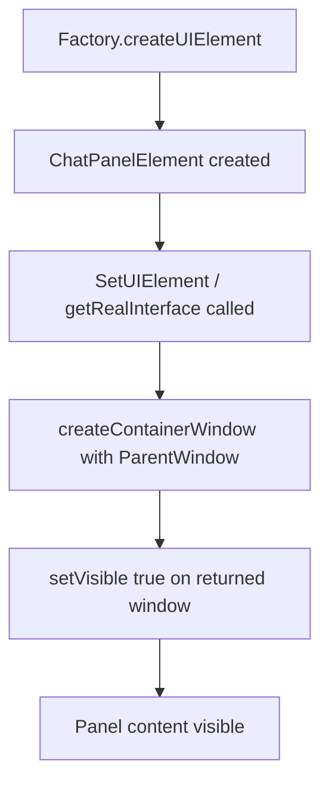

# Chat with Document: Sidebar Panel Implementation Guide

**Goal:** Move "Chat with Document" from a menu item to a sidebar panel (or right-dockable toolbar) so users can have it persistently visible on the right side of Writer.

**Current state:** The sidebar panel is **working**. "Chat with Document" appears in the WriterAgent deck in Writer's sidebar with Response area, Ask field, and Send button. The menu item can remain as fallback.

---

## Working Solution (Resolved)

### Pattern That Works

1. **Separate classes** (following LibreOffice's Python ToolPanel example in `odk/examples/python/toolpanel/`):
   - **ChatPanelElement** – implements `XUIElement`; creates the panel window in **getRealInterface()** (called by the framework when the panel is set), not in `getWindow()`.
   - **ChatToolPanel** – implements `XToolPanel` and `XSidebarPanel`; holds the window reference and returns it from `getWindow()`, implements `getHeightForWidth()` (return a `com.sun.star.ui.LayoutSize` struct).
   - **ChatPanelFactory** – implements `XUIElementFactory`; creates `ChatPanelElement` with `Frame` and `ParentWindow` from the factory args.

2. **Create the panel window with ContainerWindowProvider + XDL** (not manual Toolkit/UnoControl):
   - In `getRealInterface()`, get the extension base URL via `PackageInformationProvider.getPackageLocation(EXTENSION_ID)`.
   - Use `ContainerWindowProvider.createContainerWindow(dialog_url, "", parent_window, None)` with the path to your XDL (e.g. `WriterAgentDialogs/ChatPanelDialog.xdl`).
   - **Critical:** After `createContainerWindow()` returns, call **`setVisible(True)`** on the returned window. The sidebar framework does not make the panel content visible; without this call the panel shows only the title bar and empty white space.

3. **Config:**
   - **Sidebar.xcu:** Panel has `WantsAWT` set to `true` (explicit is best; default is true).
   - **ChatPanelDialog.xdl:** Use `dlg:withtitlebar="false"` on the root window so the panel doesn’t show a dialog title bar inside the sidebar.

### What We Tested

- **Parent window type:** Passing `ParentWindow` directly to `createContainerWindow()` works; using `parent_window.getPeer()` (XWindowPeer) was tried and is **not** required.
- **Visibility:** Omitting `setVisible(True)` causes the panel content to not appear; the panel is created but stays blank. So **only** the explicit `setVisible(True)` was required to fix the “no sub-controls” issue.

### Debug Logging

All extension logging goes through `plugin/framework/logging.py` (`init_logging`). The single log file is **`writeragent_debug.log`** in the LibreOffice user config directory (same folder as `writeragent.json`, e.g. `~/.config/libreoffice/4/user/` on Linux). Use `log_level` in `writeragent.json` and standard `logging.getLogger(...)` calls; optional structured agent traces use `agent_log()` when `enable_agent_log` is set (same file).

### Key Files (Current)

| File | Role |
|------|------|
| `chat_panel.py` | ChatPanelFactory, ChatPanelElement, ChatToolPanel, SendButtonListener; ContainerWindowProvider + setVisible(True) |
| `WriterAgentDialogs/ChatPanelDialog.xdl` | Panel UI (response, query, send); `withtitlebar="false"` |
| `registry/org/openoffice/Office/UI/Sidebar.xcu` | WriterAgent deck + ChatPanel; `WantsAWT` true |
| `registry/org/openoffice/Office/UI/Factories.xcu` | ChatPanelFactory registration |
| `META-INF/manifest.xml` | Registers chat_panel.py, Sidebar.xcu, Factories.xcu |

---

## Research Summary

### Sidebar vs Tool Panel vs Toolbar

| Type | Location | API | Notes |
|------|----------|-----|-------|
| **Sidebar Panel** | Right sidebar (same area as Properties, Styles) | `XSidebarPanel`, `XToolPanel`, `XUIElementFactory` | Integrates with existing sidebar decks. Most documentation targets Java. |
| **Tool Panel** | Can appear in task pane / sidebar | Same `XToolPanel` interface | LibreOffice has a Python ToolPanelPoc example for **Calc** (not Writer). |
| **Toolbar** | Top or dockable | Add-on toolbar | Simpler; can be docked to the right. |

### Sidebar Architecture (from OpenOffice Wiki, Apache OpenOffice, LibreOffice)

**Required components:**
1. **Sidebar.xcu** – Registers deck(s) and panel(s). Merged into global Sidebar config on extension install.
2. **Factories.xcu** – Registers the Panel Factory (implements `XUIElementFactory`). Merged into global Factories config.
3. **Panel Factory** – UNO service implementing `XUIElementFactory.createUIElement(URL, arguments)`.
4. **Panel Implementation** – Implements `XToolPanel` (required: `getWindow()`), optionally `XSidebarPanel` (for `getHeightForWidth`).

**Key interfaces:**
- `com.sun.star.ui.XUIElementFactory` – Factory that creates panels
- `com.sun.star.ui.XToolPanel` – Panel must implement; `getWindow()` returns the panel's XWindow
- `com.sun.star.ui.XSidebarPanel` – Optional; provides `getHeightForWidth()` for layout

**ImplementationURL format:**
```
private:resource/toolpanel/<FactoryName>/<PanelName>
```

**Context format** (when to show the panel):
```
ApplicationName, ContextName, visible|hidden
```
- Application: `WriterVariants` (Writer), `com.sun.star.text.TextDocument`, `any`
- Context: `Text`, `any`, `default`
- For Writer-only, always visible: `WriterVariants, any, visible`

### Reference Implementations

**1. allotropia/libreoffice-sidebar-extension (Java)**
- GitHub: https://github.com/allotropia/libreoffice-sidebar-extension
- Creates new "Tools" deck with "My Sidebar Panel"
- Structure: `registry/org/openoffice/Office/UI/Sidebar.xcu`, `Factories.xcu`, Java PanelFactory, Panel classes

## Lessons Learned from Implementation Attempt

### What Worked

**✅ Factory Registration Successful**
- `ChatPanelFactory.createUIElement()` was called correctly
- Panel instances were created without errors
- UNO service registration worked properly

**✅ Configuration Loading**
- `Sidebar.xcu` and `Factories.xcu` were properly loaded
- Panel appeared in the sidebar deck list
- Context-based visibility worked (panel only showed in Writer)

**✅ Resolved: Panel Content Not Showing**
- **Symptom**: Panel showed "Chat with Document" header but sub-controls were missing (empty white area).
- **Root cause**: The sidebar framework does not call `setVisible(True)` on the window returned by the panel. The window is created and parented but left non-visible.
- **Fix**: After `ContainerWindowProvider.createContainerWindow()` returns, call **`setVisible(True)`** on the returned window. No need to use `parent.getPeer()`; passing `ParentWindow` directly is fine.
- **Pattern**: Create the panel window in **getRealInterface()** (not in `getWindow()`), using ContainerWindowProvider + XDL, so the window exists when the framework uses the panel. Then make it visible explicitly.

**✅ Basic Panel Structure**
- Separate `XUIElement` wrapper (ChatPanelElement) and `XToolPanel`/`XSidebarPanel` (ChatToolPanel)
- Factory creates the element; element creates window lazily in getRealInterface() via ContainerWindowProvider + XDL
- Proper UNO component registration with `unohelper.ImplementationHelper`

### Challenges Encountered (Historical)

**🔴 Panel Content Invisible (resolved)**
- **Symptom**: Panel title visible, content area blank.
- **Resolution**: Explicit `setVisible(True)` on the container window (see above).

**🔴 getWindow() Not Used for Display**
- **Finding**: The sidebar does not call `getWindow()` during normal panel display; it calls `getRealInterface()` and uses the panel for layout (e.g. `getHeightForWidth()`). So any window creation that only runs in `getWindow()` never runs. Creating the window in `getRealInterface()` fixes this.

**🔴 Configuration Issues (historical)**
- **Empty Titles**: Initially had empty `<value></value>` for deck and panel titles
- **Context Format**: `WriterVariants` vs `com.sun.star.text.TextDocument` confusion
- **Deck Management**: Custom deck (`WriterAgentDeck`) vs existing deck (`PropertyDeck`) tradeoffs

### Key Technical Insights

#### 1. Panel Lifecycle (Actual Behavior)


**Critical**: Create and show the window in **getRealInterface()**; do not rely on `getWindow()` being called for initial display.

#### 2. Visibility
- The framework parents the window but does not set it visible. Extensions must call `setVisible(True)` on the panel content window.

#### 3. Configuration Requirements

**Minimum Viable Sidebar.xcu Panel Configuration:**
```xml
<node oor:name="ChatPanel" oor:op="replace">
    <prop oor:name="Title" oor:type="xs:string">
        <value xml:lang="en-US">Chat with Document</value>  <!-- MUST have title -->
    </prop>
    <prop oor:name="Id" oor:type="xs:string">
        <value>ChatPanel</value>  <!-- Unique ID -->
    </prop>
    <prop oor:name="DeckId" oor:type="xs:string">
        <value>PropertyDeck</value>  <!-- Use existing deck for reliability -->
    </prop>
    <prop oor:name="ContextList">
        <value oor:separator=";">com.sun.star.text.TextDocument, any, visible ;</value>  <!-- Proper format -->
    </prop>
    <prop oor:name="ImplementationURL" oor:type="xs:string">
        <value>private:resource/toolpanel/ChatPanelFactory/ChatPanel</value>  <!-- Exact match -->
    </prop>
    <prop oor:name="OrderIndex" oor:type="xs:int">
        <value>100</value>  <!-- Position in deck -->
    </prop>
    <prop oor:name="WantsCanvas" oor:type="xs:boolean">
        <value>false</value>  <!-- AWT vs UNO controls -->
    </prop>
</node>
```

### Debugging Techniques Developed

#### 1. Comprehensive Logging Strategy

Use `init_logging(ctx)` at panel/bootstrap entry and `logging.getLogger(__name__).debug(...)` (or `log` from `plugin.framework.logging`). All messages land in `writeragent_debug.log` under the LO user config dir.

#### 2. Lifecycle Tracing
- Factory creation → Panel initialization → Property access → Window creation → Control creation
- Identified exact point of failure (panel created but never activated)

#### 3. Error Handling Pattern
```python
try:
    # Panel creation code
    self._create_panel()
except Exception as e:
    log.exception("ERROR in panel creation: %s", e)
    # Graceful fallback
    try:
        from main import MainJob
        job = MainJob(self.ctx)
        job.show_error(f"Panel error: {e}", "Chat Panel")
    except Exception:
        pass
    raise  # Re-throw for framework to handle
```

### Architecture Comparison: Sidebar vs Alternatives

| Approach | Pros | Cons | Complexity |
|----------|------|------|------------|
| **Sidebar Panel** | Native integration, persistent, professional UI | Complex lifecycle, crash-prone, Java-centric docs | ⭐⭐⭐⭐⭐ |
| **Dockable Toolbar** | Persistent, simpler API, no collapse issues | Limited UI space, less integrated | ⭐⭐⭐ |
| **Modeless Dialog** | Full control, stable, flexible UI | Not dockable, floats over document | ⭐⭐ |
| **Menu + Dialog** | Simple, stable, proven pattern | Not persistent, requires user action | ⭐ |

### Recommended Next Steps (Enhancements)

Now that the sidebar panel works, possible next steps:

1. **Send button wiring**: Ensure the panel’s Send button is connected via `getControl()` on the container window (or an event handler) so chat works from the sidebar.
2. **Remove or reduce debug logging** in `chat_panel.py` for production if desired (or keep for diagnostics).
3. **Optional**: Dockable toolbar or modeless dialog as an alternative entry point; sidebar remains the primary UX.
4. **Optional**: Add panel to an existing Writer deck instead of a custom deck to reduce clutter.

### Code Snippets for Future Reference

**Working pattern: create window in getRealInterface() with ContainerWindowProvider + setVisible(True):**
```python
def getRealInterface(self):
    if not self.toolpanel:
        root_window = self._getOrCreatePanelRootWindow()
        self.toolpanel = ChatToolPanel(root_window, self.ctx)
        self._wireSendButton(root_window)
    return self.toolpanel

def _getOrCreatePanelRootWindow(self):
    pip = self.ctx.getValueByName(
        "/singletons/com.sun.star.deployment.PackageInformationProvider")
    base_url = pip.getPackageLocation(EXTENSION_ID)
    dialog_url = base_url + "/" + XDL_PATH
    provider = self.ctx.getServiceManager().createInstanceWithContext(
        "com.sun.star.awt.ContainerWindowProvider", self.ctx)
    self.m_panelRootWindow = provider.createContainerWindow(
        dialog_url, "", self.xParentWindow, None)
    # Required: sidebar does not show content without this
    if self.m_panelRootWindow and hasattr(self.m_panelRootWindow, "setVisible"):
        self.m_panelRootWindow.setVisible(True)
    return self.m_panelRootWindow
```

**ChatToolPanel** holds the window and implements XToolPanel / XSidebarPanel; **getHeightForWidth** must return a `com.sun.star.ui.LayoutSize` struct (e.g. `uno.createUnoStruct("com.sun.star.ui.LayoutSize", 280, -1, 280)`).

### Conclusion

The sidebar panel is **working**. The implementation:
- Registers the panel factory and creates panel instances
- Creates the panel UI in **getRealInterface()** via ContainerWindowProvider + XDL (so the framework sees the panel without relying on `getWindow()`)
- Calls **setVisible(True)** on the container window so the sidebar actually shows the content

**Critical fix**: The framework does not make the panel content visible; extensions must call `setVisible(True)` on the window returned by `createContainerWindow()`.

---

Reference: Sidebar.xcu snippet (deck + panel):
```xml
<node oor:name="ToolsDeck" oor:op="replace">
  <prop oor:name="Title" oor:type="xs:string"><value xml:lang="en-US">Tools</value></prop>
  <prop oor:name="Id" oor:type="xs:string"><value>ToolsDeck</value></prop>
  <prop oor:name="IconURL" oor:type="xs:string"><value>vnd.sun.star.extension://org.libreoffice.example.sidebar/images/actionOne_26.png</value></prop>
  <prop oor:name="ContextList"><value oor:separator=";">WriterVariants, any, visible ;</value></prop>
</node>
<node oor:name="MySidebarPanel" oor:op="replace">
  <prop oor:name="Title" oor:type="xs:string"><value xml:lang="en-US">My Sidebar Panel</value></prop>
  <prop oor:name="Id" oor:type="xs:string"><value>MySidebarPanel</value></prop>
  <prop oor:name="DeckId" oor:type="xs:string"><value>ToolsDeck</value></prop>
  <prop oor:name="ContextList"><value oor:separator=";">WriterVariants, any, visible ;</value></prop>
  <prop oor:name="ImplementationURL" oor:type="xs:string"><value>private:resource/toolpanel/MySidebarFactory/MySidebarPanel</value></prop>
  <prop oor:name="OrderIndex" oor:type="xs:int"><value>100</value></prop>
</node>
```

**2. LibreOffice Python ToolPanelPoc**
- Location: `api.libreoffice.org/examples/python/toolpanel/`
- Files: `toolpanel.py`, `Factory.xcu`, `CalcWindowState.xcu`, `toolpanel.component`
- **Targets Calc**, not Writer – but shows Python UNO pattern for tool panels
- Factory creates panels in response to `private:resource/toolpanel/...` URLs

**3. Apache OpenOffice Sidebar for Developers**
- Wiki: https://wiki.openoffice.org/wiki/Sidebar_for_Developers
- Analog Clock extension example (Java) with full deck/panel setup
- Explains ContextList, ImplementationURL, DeckId, Factories.xcu

### Extension File Layout

For WriterAgent, add:

```
writeragent/
├── registry/
│   └── org/
│       └── openoffice/
│           └── Office/
│               └── UI/
│                   ├── Sidebar.xcu      # Deck + Chat panel definition
│                   └── Factories.xcu    # ChatPanelFactory registration
├── META-INF/
│   └── manifest.xml   # Add registry entries, Python component
├── main.py            # Add ChatPanelFactory, ChatPanel classes
└── assets/
    └── chat-panel.png # Icon for deck/panel (optional)
```

### Manifest Additions

manifest.xml must register:
- `registry/org/openoffice/Office/UI/Sidebar.xcu` with type `application/vnd.sun.star.configuration-data`
- `registry/org/openoffice/Office/UI/Factories.xcu` with type `application/vnd.sun.star.configuration-data`
- Python component for the factory (or .rdb if using separate component)

### Python Panel Implementation Sketch

The panel factory receives `arguments` including:
- `Frame` – `XFrame` of the application
- `ParentWindow` – `XWindow` to create the panel as child
- `Sidebar` – `XSidebar` with `requestLayout()` for resize
- `ApplicationName`, `ContextName` – context info

The panel must:
1. Create a child window under `ParentWindow` (using Toolkit)
2. Populate it with controls: text field for query, button "Send", text area for response
3. Implement `XToolPanel.getWindow()` to return that window
4. On "Send": get document from Frame, get full text, call API, display response

**Challenge:** Python UNO panel examples are rare. The Calc ToolPanelPoc may need adaptation for Writer and for the sidebar (vs task pane). Java examples are more complete.

### Alternative: Add Panel to Existing Deck

To add "Chat with Document" to the **Properties** deck (existing Writer sidebar):
- Create only the panel entry in Sidebar.xcu (no new deck)
- Set `DeckId` to the Properties deck ID (e.g. `PropertyDeck` or similar – check LibreOffice source for exact ID)
- Reduces UI clutter; less control over deck appearance

### Alternative: Dockable Toolbar

Simpler approach:
- Add a toolbar via Addons.xcu or similar
- Toolbar can be docked to the right
- Toolbar contains a "Chat" button that opens a dialog (current behavior) or a dropdown
- May not feel as integrated as a real sidebar panel

---

## Recommended Implementation Path

**Option A – New Sidebar Deck (preferred for UX)**
1. Create `registry/org/openoffice/Office/UI/Sidebar.xcu` with WriterAgent deck + Chat panel
2. Create `Factories.xcu` registering `ChatPanelFactory`
3. Implement `ChatPanelFactory` (XUIElementFactory) and `ChatPanel` (XToolPanel) in Python
4. Panel UI: query field, Send button, response area (multiline, read-only)
5. Wire panel to existing `get_full_document_text`, `stream_completion` logic in main.py
6. Update manifest.xml
7. Remove "Chat with Document" from Addons.xcu menu (or keep as fallback)

**Option B – Add to Existing Writer Deck**
1. Identify correct DeckId for Writer's Properties (or Styles) deck
2. Create panel entry only, reference existing deck
3. Same factory/panel implementation as Option A

**Option C – Dockable Toolbar (fallback)**
1. Add toolbar definition
2. Toolbar opens current dialog on click
3. Less work, less integrated

---

## Key Files to Create/Modify

| File | Action |
|------|--------|
| `registry/org/openoffice/Office/UI/Sidebar.xcu` | Deck + panel; include `WantsAWT` true |
| `registry/org/openoffice/Office/UI/Factories.xcu` | ChatPanelFactory registration |
| `chat_panel.py` | ChatPanelFactory, ChatPanelElement, ChatToolPanel; ContainerWindowProvider + setVisible(True) |
| `WriterAgentDialogs/ChatPanelDialog.xdl` | Panel UI; `dlg:withtitlebar="false"` |
| `META-INF/manifest.xml` | Register chat_panel.py, Sidebar.xcu, Factories.xcu |
| `build.sh` | Include `chat_panel.py`, `registry/` in zip |
| `Addons.xcu` | Optional: keep Chat with Document menu as fallback |

---

## Useful Links

- [Sidebar for Developers (OpenOffice Wiki)](https://wiki.openoffice.org/wiki/Sidebar_for_Developers)
- [allotropia/libreoffice-sidebar-extension](https://github.com/allotropia/libreoffice-sidebar-extension)
- [LibreOffice API – XToolPanel](https://api.libreoffice.org/docs/idl/ref/interfacecom_1_1sun_1_1star_1_1ui_1_1XToolPanel.html)
- [LibreOffice API – XUIElementFactory](https://api.libreoffice.org/docs/idl/ref/interfacecom_1_1sun_1_1star_1_1ui_1_1XUIElementFactory.html)
- [Python ToolPanel example (Calc)](https://api.libreoffice.org/examples/python/toolpanel/)
- [Framework/Article/Tool Panels (OpenOffice Wiki)](https://wiki.openoffice.org/wiki/Framework/Article/Tool_Panels)

---

## Existing WriterAgent Code to Reuse

- `get_full_document_text(model, max_chars)` – gets document text
- `stream_completion(prompt, system_prompt, max_tokens, api_type, append_callback)` – API call
- `show_error(message, title)` – error display
- Config keys: `chat_context_length`, `chat_max_tokens`, `additional_instructions`

The panel needs access to `MainJob` or equivalent to call these. Options:
- Instantiate MainJob from panel (need ctx)
- Extract shared module (e.g. `api.py`, `document.py`) and import in panel
- Pass frame/document to panel; panel gets document from frame's controller
