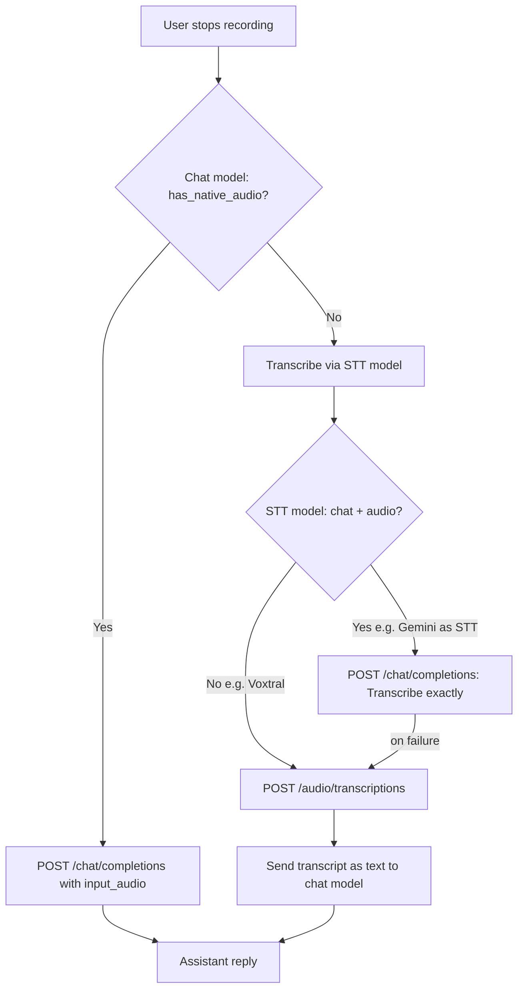

# Audio Recording Architecture

This document explains the technical decisions, challenges, and implementation details for the audio recording feature in WriterAgent.

## The Challenge: Native Dependencies in LibreOffice

WriterAgent is a LibreOffice extension. It runs embedded inside LibreOffice's internal Python interpreter. That environment is highly constrained:

1. **No reliable pip stack:** Users cannot safely install C-extension packages (NumPy, PortAudio bindings, etc.) into LibreOffice's embedded Python without ABI crashes.
2. **Cross-platform constraints:** The extension is distributed as a single `.oxt` file that must work universally across Windows, macOS, and Linux.
3. **C-extensions:** Recording audio requires native libraries (PortAudio) to interface with the OS audio subsystem.

## Strategy: user venv subprocess (2026)

Microphone capture runs in the **user-provided Python venv** configured under **Settings → Python** (`scripting.python_venv_path`), not in LibreOffice embedded Python. This matches the NumPy / Vision / Harper pattern documented in [enabling_numpy_in_libreoffice.md](../enabling_numpy_in_libreoffice.md).

| Layer | Runtime | Role |
|-------|---------|------|
| **Host (LO embedded Python)** | Sidebar UI, FSM, temp WAV path | Spawns/stops recording child |
| **Dedicated venv subprocess** | User venv + `sounddevice` | Captures 16 kHz mono PCM to WAV |
| **Remote HTTP** | LLM API | STT or native `input_audio` chat (unchanged) |

**Why not the warm worker?** Recording is interactive and can last minutes. Blocking [`PythonWorkerManager`](../../plugin/scripting/venv_worker.py) would stall `=PYTHON()`, chat scripts, and other trusted helpers. A **short-lived dedicated child** is spawned per recording session instead.

### User setup

1. Create/configure a venv in **Settings → Python** (same venv as NumPy / Monaco).
2. Install capture dependency:

```bash
uv pip install sounddevice
```

3. **Linux only:** install system PortAudio, e.g. `sudo pacman -S portaudio`.
4. Use **Settings → Python → Test** — the **Audio Recording** group reports `sounddevice` and microphone availability.

Implementation modules:

- Host adapter: [`plugin/chatbot/audio_recorder.py`](../../plugin/chatbot/audio_recorder.py)
- Host spawn/IPC: [`plugin/scripting/audio_recorder_service.py`](../../plugin/scripting/audio_recorder_service.py)
- Venv capture: [`plugin/scripting/venv/audio_recorder.py`](../../plugin/scripting/venv/audio_recorder.py)
- Child entry: [`plugin/scripting/venv/audio_record_main.py`](../../plugin/scripting/venv/audio_record_main.py)

### Subprocess IPC (line-delimited JSON)

Host spawns `{venv_python} audio_record_main.py --output /tmp/….wav` with stdin/stdout pipes.

| Direction | Payload |
|-----------|---------|
| child → host | `{"status":"ready"}` after the input stream starts |
| host → child | `{"command":"stop"}` on stdin; legacy plain `stop` is still accepted by the child |
| child → host | `{"status":"ok","path":"/abs/path.wav"}` or `{"status":"error","message":"…"}` |

The JSON-line framing uses [`plugin/scripting/ipc.py`](../../plugin/scripting/ipc.py), which also enforces the host-side ready/stop read timeouts so a hung recorder cannot block forever waiting on `readline()`.

Capture uses `sounddevice.RawInputStream` with `dtype='int16'` and Python's built-in `wave` module — no NumPy required for recording. Future **analysis** helpers (librosa, spectrograms) stay in the venv per [scripting/numpy-domains.md § Audio / Signal](../scripting/numpy-domains.md#audio-signal).

### Silence auto-stop (end-of-speech)

Recording can end automatically after the user stops talking, without waiting for STT. Detection uses **local RMS + peak energy** in the capture callback (venv subprocess and host-side downloaded `sounddevice` path).

**Settings → Sidebar → Silence before send (ms)** (`chatbot.audio_silence_stop_ms`):

| Value | Behavior |
|-------|----------|
| **3000** (default) | Auto-stop and send after 3s of silence following speech |
| **0** | Wait until you click **Stop Rec** (auto-stop off) |

Algorithm constants (`MIN_SPEECH_MS` = 500, noise-floor EMA, peak thresholds) live in [`audio_silence_detector.py`](../../plugin/scripting/audio_silence_detector.py) — not user config. Auto-stop requires ≥500 ms of classified speech before silence can trigger send. No upfront calibration window (users often speak immediately after **Record**); a running noise-floor EMA applies only during pre-speech silence.

Implementation:

- Shared detector: [`plugin/scripting/audio_silence_detector.py`](../../plugin/scripting/audio_silence_detector.py)
- Venv capture: [`plugin/scripting/venv/audio_recorder.py`](../../plugin/scripting/venv/audio_recorder.py)
- Host capture (no venv, downloaded binaries): [`plugin/chatbot/audio_recorder.py`](../../plugin/chatbot/audio_recorder.py)

**Venv IPC** (in addition to `ready` / `stop` / `ok`):

| child → host | Meaning |
|--------------|---------|
| `{"status":"silence_progress","ms":750}` | Optional UI status while silence accumulates |
| `{"status":"auto_stopped","path":"/tmp/….wav"}` | VAD triggered stop; host dispatches the same FSM path as **Stop Rec** |

The host runs a stdout monitor thread ([`monitor_recording_stdout`](../../plugin/scripting/audio_recorder_service.py)) and posts `STOP_REC_CLICKED` on the LibreOffice main thread via [`execute_on_main_thread`](../../plugin/framework/queue_executor.py). Manual **Stop Rec** still works.

## Implementation Details

### 1. UI: The Dynamic Send/Record Button

We attach an `XTextListener` (`QueryTextListener` in `panel.py`) to the text input box.

- If the box is empty and a venv path is configured, the button says **Record**.
- The moment the user types a character, it swaps to **Send**.
- Clicking **Record** swaps the label to **Stop Rec**.

`SendButtonState.audio_supported` is true when Settings → Python resolves to a venv `python` executable (cheap config check; full package probe is on **Test**).

### 2. Payload and History Database

When recording stops, the host reads the `.wav` file and converts it to base64 for the OpenAI multimodal format (`{"type": "input_audio", ...}`).

**Database optimization:** In `history_db.py` → `message_to_dict`, `input_audio` blobs are stripped before SQLite save; a `[Audio Attached]` tag is appended to the text instead.

## The Fallback System: Two API Endpoints for Audio

WriterAgent can send recorded audio to a model in **two different ways**. They use **different HTTP endpoints** and suit **different model types**. The name `has_native_audio()` means “use the chat endpoint with `input_audio`,” **not** “this model can transcribe.”

| Path | HTTP endpoint | Payload | Typical models | When used |
|------|---------------|---------|----------------|-----------|
| **Chat audio** (`has_native_audio` = true) | `POST /v1/chat/completions` | Message content includes `{"type": "input_audio", "input_audio": {"data": "<base64>", "format": "wav"}}` | Chat models with audio input (e.g. Gemini) | Chat model supports hearing audio in conversation |
| **STT transcription** | `POST /v1/audio/transcriptions` | Provider-specific (see below) | Dedicated STT models (Voxtral, Whisper) | Chat model cannot take `input_audio`, or STT-only model |



Capability detection, STT fallback, and runtime recovery are unchanged — see [`model_fetcher.py`](../../plugin/framework/client/model_fetcher.py), [`llm_client.py`](../../plugin/framework/client/llm_client.py), and [`panel.py`](../../plugin/chatbot/panel.py).

**STT providers:** OpenRouter uses JSON + base64 `input_audio`; most other providers (OpenAI Whisper, Z.ai, local servers) use multipart `file` + `model`. Z.ai default STT model is `glm-asr-2512` via `POST /api/paas/v4/audio/transcriptions`.

**Mock soak:** [`scripts/mock_llm_server.py`](../../scripts/mock_llm_server.py) (`make mock-llm`) treats `writeragent-mock` as a **chat+audio** model: sidebar Record is native `input_audio` on `/v1/chat/completions` and returns a canned transcript in HTML. It also implements `/v1/audio/transcriptions` and lists `writeragent-mock-whisper` for STT-only fallback. See [rich-text-control-sidebar.md — Mock LLM](rich-text-control-sidebar.md#mock-llm-for-sidebar-soak).

## Build flag: `--no-recording`

Release builds may pass `--no-recording` to [`scripts/build_oxt.py`](../../scripts/build_oxt.py) to omit sidebar capture modules entirely (no Record button). This is a **code-path** toggle, not a vendored-binary size knob.

## Speech settings

Settings → **Speech** (the tab was titled Audio / Speech) holds the speech-to-text model and speech output.

**Audio Model** is the STT combobox (`widget: combo` in [`plugin/audio/module.yaml`](../../plugin/audio/module.yaml), control id `audio__stt_model`). It used to sit on the General page as `stt_model`. Saves write **`audio.stt_model`** and leave a pre-existing top-level `stt_model` in place. [`get_stt_model()`](../../plugin/framework/client/model_fetcher.py) prefers a non-empty `audio.stt_model`, then legacy `stt_model`, then the provider default. The endpoint-scoped LRU list is still `audio_model_lru`. Changing the endpoint refreshes that list on `audio__stt_model` (the old `stt_model` control id is still recognized).

## Text-to-speech (speech output)

Assistant replies can be spoken when `audio.tts_enabled` is on. Providers are OS speech, local Kokoro, local Piper, or the current chat endpoint's `/audio/speech`.

Voice lists are not hardcoded in Python. [`plugin/audio/data/voice_catalog.json`](../../plugin/audio/data/voice_catalog.json) is the catalog (Piper ONNX paths, Kokoro voices, locale defaults, OpenAI aliases). [`plugin/audio/voice_catalog.py`](../../plugin/audio/voice_catalog.py) loads it once. `get_voice_catalog` / `get_default_voice_for_locale` and Settings both read that data.

Settings → Voice does not keep a hand-copied multilingual list in [`plugin/audio/module.yaml`](../../plugin/audio/module.yaml). The yaml `options` stub is only the XDL fallback. At dialog open, `options_provider: plugin.audio.tts_service:settings_voice_options` fills the control from the catalog for the saved provider, locale-prioritized the same way as `TtsSettingsListener` in [`dialog_views.py`](../../plugin/chatbot/dialog_views.py). Switching provider still refreshes the list.

The first local speak may download a Piper or Kokoro model. That used to be log-only, including the fallback to Lessac or OS speech. `speak_text_async(..., on_status=)` now also reports short lines ("Downloading Piper voice Thorsten…", "Couldn't download Thorsten; using Lessac", "Couldn't download Kokoro; using OS speech"). The sidebar posts those onto the existing status field and restores the previous status when speech finishes.

Local Kokoro downloads the multilingual v1.0 pack into `~/.cache/kokoro/`: `kokoro-v1.0.onnx` and `voices-v1.0.bin` from the kokoro-onnx `model-files-v1.1` release (54 voices, including `jf_alpha` and the other non-English catalog ids). `KOKORO_MODEL_PATH` and `KOKORO_VOICES_PATH` override those paths. An older English-only cache (`kokoro-v0_19.onnx`, `voices.bin` from the `model-files` release) is left on disk; the next speak fetches the v1.0 filenames when they are missing, so a multilingual voice is not synthesized from the English-only pack.

## Related docs

- [Enabling NumPy & Python in LibreOffice](../enabling_numpy_in_libreoffice.md) — venv settings, Test diagnostics, trusted worker pattern
- [NumPy domains — Audio / Signal (future analysis)](../scripting/numpy-domains.md#audio-signal)
