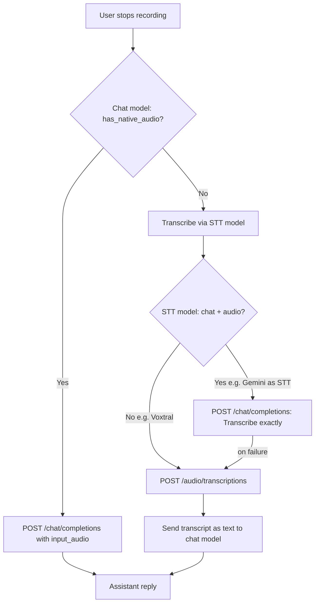

# Audio Recording Architecture

This document explains the technical decisions, challenges, and implementation details for the audio recording feature in WriterAgent.

## The Challenge: Native Dependencies in LibreOffice

WriterAgent is a LibreOffice extension. It runs embedded inside LibreOffice's internal Python interpreter. That environment is highly constrained:

1. **No reliable pip stack:** Users cannot safely install C-extension packages (NumPy, PortAudio bindings, etc.) into LibreOffice's embedded Python without ABI crashes.
2. **Cross-platform constraints:** The extension is distributed as a single `.oxt` file that must work universally across Windows, macOS, and Linux.
3. **C-extensions:** Recording audio requires native libraries (PortAudio) to interface with the OS audio subsystem.

## Strategy: user venv subprocess (2026)

Microphone capture runs in the **user-provided Python venv** configured under **Settings → Python** (`scripting.python_venv_path`), not in LibreOffice embedded Python. This matches the NumPy / Vision / Harper pattern documented in [enabling_numpy_in_libreoffice.md](../enabling_numpy_in_libreoffice.md).

| Layer | Runtime | Role |
|-------|---------|------|
| **Host (LO embedded Python)** | Sidebar UI, FSM, temp WAV path | Spawns/stops recording child |
| **Dedicated venv subprocess** | User venv + `sounddevice` | Captures 16 kHz mono PCM to WAV |
| **Remote HTTP** | LLM API | STT or native `input_audio` chat (unchanged) |

**Why not the warm worker?** Recording is interactive and can last minutes. Blocking [`PythonWorkerManager`](../../plugin/scripting/venv_worker.py) would stall `=PYTHON()`, chat scripts, and other trusted helpers. A **short-lived dedicated child** is spawned per recording session instead.

### User setup

1. Create/configure a venv in **Settings → Python** (same venv as NumPy / Monaco).
2. Install capture dependency:

```bash
uv pip install sounddevice
```

3. **Linux only:** install system PortAudio, e.g. `sudo pacman -S portaudio`.
4. Use **Settings → Python → Test** — the **Audio Recording** group reports `sounddevice` and microphone availability.

Implementation modules:

- Host adapter: [`plugin/chatbot/audio_recorder.py`](../../plugin/chatbot/audio_recorder.py)
- Host spawn/IPC: [`plugin/scripting/audio_recorder_service.py`](../../plugin/scripting/audio_recorder_service.py)
- Venv capture: [`plugin/scripting/venv/audio_recorder.py`](../../plugin/scripting/venv/audio_recorder.py)
- Child entry: [`plugin/scripting/venv/audio_record_main.py`](../../plugin/scripting/venv/audio_record_main.py)

### Subprocess IPC (line-delimited JSON)

Host spawns `{venv_python} audio_record_main.py --output /tmp/….wav` with stdin/stdout pipes.

| Direction | Payload |
|-----------|---------|
| child → host | `{"status":"ready"}` after the input stream starts |
| host → child | `{"command":"stop"}` on stdin; legacy plain `stop` is still accepted by the child |
| child → host | `{"status":"ok","path":"/abs/path.wav"}` or `{"status":"error","message":"…"}` |

The JSON-line framing uses [`plugin/scripting/ipc.py`](../../plugin/scripting/ipc.py), which also enforces the host-side ready/stop read timeouts so a hung recorder cannot block forever waiting on `readline()`.

Capture uses `sounddevice.RawInputStream` with `dtype='int16'` and Python's built-in `wave` module — no NumPy required for recording. Future **analysis** helpers (librosa, spectrograms) stay in the venv per [scripting/numpy-domains.md § Audio / Signal](../scripting/numpy-domains.md#audio-signal).

### Silence auto-stop (end-of-speech)

Recording can end automatically after the user stops talking, without waiting for STT. Detection uses **local RMS + peak energy** in the capture callback (venv subprocess and host-side downloaded `sounddevice` path).

**Settings → Sidebar → Silence before send (ms)** (`chatbot.audio_silence_stop_ms`):

| Value | Behavior |
|-------|----------|
| **3000** (default) | Auto-stop and send after 3s of silence following speech |
| **0** | Wait until you click **Stop Rec** (auto-stop off) |

Algorithm constants (`MIN_SPEECH_MS` = 500, noise-floor EMA, peak thresholds) live in [`audio_silence_detector.py`](../../plugin/scripting/audio_silence_detector.py) — not user config. Auto-stop requires ≥500 ms of classified speech before silence can trigger send. No upfront calibration window (users often speak immediately after **Record**); a running noise-floor EMA applies only during pre-speech silence.

Implementation:

- Shared detector: [`plugin/scripting/audio_silence_detector.py`](../../plugin/scripting/audio_silence_detector.py)
- Venv capture: [`plugin/scripting/venv/audio_recorder.py`](../../plugin/scripting/venv/audio_recorder.py)
- Host capture (no venv, downloaded binaries): [`plugin/chatbot/audio_recorder.py`](../../plugin/chatbot/audio_recorder.py)

**Venv IPC** (in addition to `ready` / `stop` / `ok`):

| child → host | Meaning |
|--------------|---------|
| `{"status":"silence_progress","ms":750}` | Optional UI status while silence accumulates |
| `{"status":"auto_stopped","path":"/tmp/….wav"}` | VAD triggered stop; host dispatches the same FSM path as **Stop Rec** |

The host runs a stdout monitor thread ([`monitor_recording_stdout`](../../plugin/scripting/audio_recorder_service.py)) and posts `STOP_REC_CLICKED` on the LibreOffice main thread via [`execute_on_main_thread`](../../plugin/framework/queue_executor.py). Manual **Stop Rec** still works.

## Implementation Details

### 1. UI: The Dynamic Send/Record Button

We attach an `XTextListener` (`QueryTextListener` in `panel.py`) to the text input box.

- If the box is empty and a venv path is configured, the button says **Record**.
- The moment the user types a character, it swaps to **Send**.
- Clicking **Record** swaps the label to **Stop Rec**.

`SendButtonState.audio_supported` is true when Settings → Python resolves to a venv `python` executable (cheap config check; full package probe is on **Test**).

### 2. Payload and History Database

When recording stops, the host reads the `.wav` file and converts it to base64 for the OpenAI multimodal format (`{"type": "input_audio", ...}`).

**Database optimization:** In `history_db.py` → `message_to_dict`, `input_audio` blobs are stripped before SQLite save; a `[Audio Attached]` tag is appended to the text instead.

## The Fallback System: Two API Endpoints for Audio

WriterAgent can send recorded audio to a model in **two different ways**. They use **different HTTP endpoints** and suit **different model types**. The name `has_native_audio()` means “use the chat endpoint with `input_audio`,” **not** “this model can transcribe.”

| Path | HTTP endpoint | Payload | Typical models | When used |
|------|---------------|---------|----------------|-----------|
| **Chat audio** (`has_native_audio` = true) | `POST /v1/chat/completions` | Message content includes `{"type": "input_audio", "input_audio": {"data": "<base64>", "format": "wav"}}` | Chat models with audio input (e.g. Gemini) | Chat model supports hearing audio in conversation |
| **STT transcription** | `POST /v1/audio/transcriptions` | Provider-specific (see below) | Dedicated STT models (Voxtral, Whisper) | Chat model cannot take `input_audio`, or STT-only model |



Capability detection, STT fallback, and runtime recovery are unchanged — see [`model_fetcher.py`](../../plugin/framework/client/model_fetcher.py), [`llm_client.py`](../../plugin/framework/client/llm_client.py), and [`panel.py`](../../plugin/chatbot/panel.py).

**STT providers:** OpenRouter uses JSON + base64 `input_audio`; most other providers (OpenAI Whisper, Z.ai, local servers) use multipart `file` + `model`. Z.ai default STT model is `glm-asr-2512` via `POST /api/paas/v4/audio/transcriptions`.

**Mock soak:** [`scripts/mock_llm_server.py`](../../scripts/mock_llm_server.py) (`make mock-llm`) treats `writeragent-mock` as a **chat+audio** model: sidebar Record is native `input_audio` on `/v1/chat/completions` and returns a canned transcript in HTML. It also implements `/v1/audio/transcriptions` and lists `writeragent-mock-whisper` for STT-only fallback. See [rich-text-control-sidebar.md — Mock LLM](rich-text-control-sidebar.md#mock-llm-for-sidebar-soak).

## Build flag: `--no-recording`

Release builds may pass `--no-recording` to [`scripts/build_oxt.py`](../../scripts/build_oxt.py) to omit sidebar capture modules entirely (no Record button). This is a **code-path** toggle, not a vendored-binary size knob.

## Speech settings

Settings → **Speech** (the tab was titled Audio / Speech) holds the speech-to-text model and speech output.

**Audio Model** is the STT combobox (`widget: combo` in [`plugin/audio/module.yaml`](../../plugin/audio/module.yaml), control id `audio__stt_model`). It used to sit on the General page as `stt_model`. Saves write **`audio.stt_model`** and leave a pre-existing top-level `stt_model` in place. [`get_stt_model()`](../../plugin/framework/client/model_fetcher.py) prefers a non-empty `audio.stt_model`, then legacy `stt_model`, then the provider default. The endpoint-scoped LRU list is still `audio_model_lru`. Changing the endpoint refreshes that list on `audio__stt_model` (the old `stt_model` control id is still recognized).

Hosted model lists on this tab:

- **OpenRouter** fills TTS from `GET /v1/models?output_modalities=speech` and STT from `output_modalities=transcription` (`fetch_available_tts_models` / `fetch_available_stt_models`). `output_modalities=audio` is music and gpt-audio, not the TTS combo. Kokoro stays the default when nothing is selected. The speech list spells that slug `hexgrad/kokoro-82m`; the curated catalog still says `hexgrad/Kokoro-82M`. The combo keeps the API id, and endpoint speak sends the API id when the speech list is cached, otherwise the saved id, so either casing works.
- **Together** has no `output_modalities` filter. `GET /v1/models` types are chat, language, code, image, embedding, moderation, and rerank, so that call is not how TTS or STT models are discovered. The Speech tab uses the documented serverless audio catalog: TTS is Orpheus 3B (`canopylabs/orpheus-3b-0.1-ft`), Kokoro (`hexgrad/Kokoro-82M`), and Cartesia Sonic, Sonic 2, and Sonic 3; STT is Whisper Large v3, Parakeet TDT 0.6B v3, and the two Nemotron ASR models. Kokoro and Parakeet stay the defaults. A `/v1/models` id in one of those families is included as well. Voices are not in that catalog. `GET /v1/voices` (every model, warmed when the Speech model list refreshes) and `GET /v1/voices?model=<id>` (the selected TTS model, on a cache miss) copy tokens into the same process-lifetime map as OpenRouter `supported_voices` (`cached_tts_supported_voices`). Orpheus and Kokoro use the voice `name`. Cartesia uses the voice `id` when the row has one, otherwise the name. The Voice combo lists those tokens. A visible voice that is not in the list is replaced with the first token and saved with `set_scoped_tts_voice` (`audio.tts_voice_together`, so it does not overwrite the OpenAI `alloy` voice). Endpoint Kokoro still stores its choice in `audio.tts_voice_kokoro`. Nothing is written into `voice_catalog.json`.

## Text-to-speech (speech output)

Assistant replies can be spoken when `audio.tts_enabled` is on. Providers are OS speech, local Kokoro, local Piper, or LLM Endpoint (the current chat endpoint's `/audio/speech`).

**Keep replies brief** (`audio.tts_short_answers`, default on) is a checkbox on this page, with Enable Speech Output and Speak sentence by sentence. When it is checked and `audio.tts_enabled` is on, `get_chat_system_prompt_for_document` appends a fixed short-reply instruction and a one-line reminder at the end of the system prompt. The checkbox stays visible when speech output is off, and then nothing is injected. It does not rewrite Additional Instructions, and it does not use provider verbosity or `max_tokens`, so the same text reaches OpenRouter, Together, and local endpoints. Hover text on the checkbox is the yaml helper.

**Speak sentence by sentence** (`audio.tts_sentence_mode`, default on) splits the finished assistant reply with the grammar checker’s sentence splitter and plays those sentences in order while synthesis keeps going. The split runs on the sidebar’s UI thread (`speak_text_async(..., ctx=self.ctx)` in `panel.py` after send completes) because `split_into_sentences` uses LibreOffice’s BreakIterator. The audio worker never calls UNO; it only receives the sentence list. Short incomplete fragments are kept — `filter_sentence_spans_for_thresholds` is a grammar-churn filter and is not used here. Turn the checkbox off to speak the whole reply as one clip.

The ready queue holds several clips (count, and a byte cap) so a one-word sentence does not stall the long sentence after it. When the cap is full the synthesizer waits. Stop cancels playback and any in-flight synth, drops clips that have not started, and deletes their temp files. A generation id makes a late wav a no-op.

Local Kokoro on CPU does not start a new `python -c` process per sentence. `plugin/audio/kokoro_worker.py` is a long-lived venv process using the same Pickle 5 length-prefix frames as the compute-service workers (`plugin/scripting/ipc.py`). It loads `Kokoro(model, voices)` once and returns a wav path (not the samples — those can exceed the 16MiB frame cap). `plugin/audio/kokoro_pool.py` keeps a single worker and shuts it down after a few minutes idle so the ONNX model does not stay resident. The worker is killed only while a job is actually running; the Send button’s stop (before a reply exists) leaves an idle model loaded. If the worker cannot start, speech falls back to the one-shot CLI / `python -c` path. Endpoint speech never uses this process. Piper still launches once per sentence; those jobs share the prefetch queue so playback and the next synth overlap.

Piper’s default for the LibreOffice UI locale is the first catalog voice whose label says Female for that language. Languages with only male voices (German Thorsten, Spanish Davefx, and the other male-only rows) stay on the first voice for that language, then Lessac. Kokoro keeps its `locale_defaults` map, including English `af_sky`, and uses the first female id only when a language has voices but no map entry. A saved scoped voice wins over both. Voice lists for local Kokoro, Piper, OpenAI, and OS speech are not hardcoded in Python. [`plugin/audio/data/voice_catalog.json`](../../plugin/audio/data/voice_catalog.json) is that catalog (Piper ONNX paths, Kokoro voices, locale defaults, OpenAI aliases). [`plugin/audio/voice_catalog.py`](../../plugin/audio/voice_catalog.py) loads it once. `get_voice_catalog` / `get_default_voice_for_locale` and Settings both read that data. Together endpoint voices are the exception: they come from `GET /v1/voices` into `cached_tts_supported_voices`, not from the JSON file.

When the TTS provider is LLM Endpoint and the speech list harvested `supported_voices` for the selected model, Settings → Voice uses those ids (`cached_tts_supported_voices`). That is how Grok and Gemini voices show up without a hand-maintained list. Those rows, Together `GET /v1/voices` tokens, and the OpenAI alloy/nova catalog (other hosts with no harvested list) are sorted by display label, case-insensitively, before they go in the combo. A voice that is already in the list stays selected. Local Kokoro (including an endpoint model id that uses the Kokoro catalog) and Piper keep catalog and locale order. A model that is on the OpenRouter speech list but omitted voices, or an OpenRouter endpoint whose speech list has not been fetched yet, leaves the combo editable instead of substituting the OpenAI alloy list. Together uses `GET /v1/voices` instead of that alloy list, except endpoint Kokoro when Together returns no voices. If the saved voice is not in the new list, Gemini uses Aoede when the harvested list includes that id (case-insensitive; the list's spelling is kept). Aoede is the closest Gemini voice to Kokoro's `af_sky`, and it is used only when the model advertises it. Otherwise speech and Settings both take the first id after the label sort. A saved voice that is still in the list wins over that fallback. The choice is stored with `set_scoped_tts_voice` (`audio.tts_voice_openrouter` or `audio.tts_voice_together`, so it does not overwrite `audio.tts_voice_openai`). Refreshing TTS models refreshes that voice list; the fetch already fills `_tts_supported_voices`.

Endpoint `/audio/speech` (OpenRouter and Together) asks for `mp3` unless this process has already learned another `response_format` for that model id. The memory is `cached_tts_response_format` / `remember_tts_response_format` next to the speech-list voice cache in [`model_fetcher.py`](../../plugin/framework/client/model_fetcher.py) — process lifetime, not `writeragent.json`. A pcm-only (or wav) error retries once and remembers the format that worked, so the next clip does not ask for mp3 again. A body whose `Content-Type` is `audio/pcm` (optional `rate=`) is wrapped as 16-bit mono WAV before playback; the temp file extension matches the bytes. Test voice shows the HTTP error body. Previously that failure was only in the log.

Settings → Voice does not keep a hand-copied multilingual list in [`plugin/audio/module.yaml`](../../plugin/audio/module.yaml). The yaml `options` stub is only the XDL fallback. At dialog open, `options_provider: plugin.audio.tts_service:settings_voice_options` fills the control from the catalog for the saved provider, locale-prioritized the same way as `TtsSettingsListener` in [`dialog_views.py`](../../plugin/chatbot/dialog_views.py). Switching provider still refreshes the list.

**Test voice** sits on the Voice row, to the right of the select column (`audio__test_voice`, not saved). Voice keeps the same left and width as TTS Provider, TTS Model, and Speech Speed; the button starts past that shared right edge. It speaks `Hello, I'm your LibreOffice WriterAgent.` through `speak_text_async` using the provider, model, voice, speed, and Enable Speech Output checkbox currently on the page (OK has not necessarily written them). The sentence and the button label go through gettext, so they follow the LibreOffice UI locale. If speech output is off, or playback throws, the dialog stays open and the reason is logged (and shown in a message box).

The first local speak may download a Piper or Kokoro model. That used to be log-only, including the fallback to Lessac or OS speech. `speak_text_async(..., on_status=)` now also reports short lines ("Downloading Piper voice Thorsten…", "Couldn't download Thorsten; using Lessac", "Couldn't download Kokoro; using OS speech"). The sidebar posts those onto the existing status field and restores the previous status when speech finishes.

Local Kokoro downloads the multilingual v1.0 pack into `~/.cache/kokoro/`: `kokoro-v1.0.onnx` and `voices-v1.0.bin` from the kokoro-onnx `model-files-v1.1` release (54 voices, including `jf_alpha` and the other non-English catalog ids). `KOKORO_MODEL_PATH` and `KOKORO_VOICES_PATH` override those paths. An older English-only cache (`kokoro-v0_19.onnx`, `voices.bin` from the `model-files` release) is left on disk; the next speak fetches the v1.0 filenames when they are missing, so a multilingual voice is not synthesized from the English-only pack.

Local Kokoro chooses the phonemizer with `kokoro_g2p_lang` on every utterance, including chat replies, sentence clips, and the Test voice sample. English voices (`a*`, `b*`) use kokoro-onnx's built-in espeak path (`en-us` or `en-gb`). For Asian voices with non-Latin scripts (`jf_*`, `zf_*`, `hf_*`), Latin-script text falls back to English G2P so English on `jf_alpha` is not forced through Japanese Misaki. Romance voices (`ff_*`, `ef_*`, `if_*`, `pf_*`) use their native Misaki language (`fr-fr`, `es`, `it`, `pt-br`).

Non-English Kokoro languages are phonemized with [Misaki](https://github.com/hexgrad/misaki) in the Settings → Python venv, then `Kokoro.create(..., is_phonemes=True)`. kokoro-onnx's built-in espeak-ng reads Japanese kanji as the words "chinese letter" (`espeak-ng -v ja -x` has no kanji lexicon) and does not apply Kokoro's phoneme map, so French and Spanish sound wrong too. Japanese uses `misaki[ja]` (`JAG2P`), Chinese uses `misaki[zh]` (`ZHG2P()` legacy frontend; `version="1.1"` is the separate v1.1-zh model), and Spanish, French, Italian, Hindi, and Brazilian Portuguese use `misaki.espeak.EspeakG2P`. English (`en-us` / `en-gb`) stays on espeak-ng so `misaki[en]` (which installs torch) does not change shipped English audio. The first speak of a language installs the matching extra when it is missing (`uv pip install 'misaki[ja]'`, `'misaki[zh]'`, or `misaki phonemizer-fork espeakng-loader`). That install runs once per language per reply — sentence-by-sentence playback does not probe or pip-install again for the same language. Stop during the install does not fall through to OS speech. If the install fails, speech still runs and may misread the language. The warm worker calls the same Misaki snippets and `Kokoro.create(..., is_phonemes=True)`; if the worker cannot start, the one-shot `python -c` path runs `KOKORO_ONNX_SCRIPT`.

## Related docs

- [Enabling NumPy & Python in LibreOffice](../enabling_numpy_in_libreoffice.md) — venv settings, Test diagnostics, trusted worker pattern
- [NumPy domains — Audio / Signal (future analysis)](../scripting/numpy-domains.md#audio-signal)
