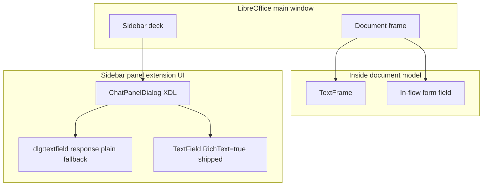
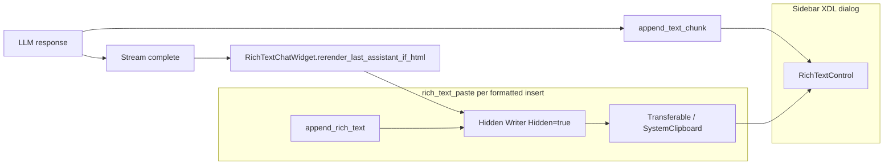

# Rich Text Control Sidebar

**Status:** Shipped; **on by default** via `rich_text_control_sidebar` (requires LibreOffice restart after toggle).  
**Config:** Settings → **Rich Text Control Sidebar**. Uncheck for plain-text chat only.  
**Code:** [`plugin/chatbot/rich_text_control.py`](../../plugin/chatbot/rich_text_control.py), [`plugin/chatbot/rich_text_paste.py`](../../plugin/chatbot/rich_text_paste.py), [`plugin/chatbot/rich_text.py`](../../plugin/chatbot/rich_text.py), wired from [`plugin/chatbot/panel_wiring.py`](../../plugin/chatbot/panel_wiring.py).  
**Tests:** [`tests/chatbot/test_rich_text_control.py`](../../tests/chatbot/test_rich_text_control.py), [`tests/chatbot/test_rich_text_paste.py`](../../tests/chatbot/test_rich_text_paste.py), [`tests/chatbot/test_rich_text_control_uno.py`](../../tests/chatbot/test_rich_text_control_uno.py).  
**Related:** [sidebar-implementation.md](sidebar-implementation.md), [../framework/streaming-and-threading.md](../framework/streaming-and-threading.md), [AGENTS.md](../../AGENTS.md)

**Audience:** Product and engineering — product behavior up front, implementation detail below.

---

## Product summary

### What users get

When **Rich Text Control Sidebar** is enabled (default), the chat transcript area uses LibreOffice’s **`RichTextControl`** (`com.sun.star.form.component.TextField` with `RichText=true`) instead of the plain multiline `dlg:textfield` named `response`. Users see:

- **Role styling:** **You:** and **Assistant:** prefixes with theme-aware colors (light/dark follow sidebar `StyleSettings`).
- **Formatted assistant replies:** bold, lists, tables, code blocks, and other HTML the model emits within the supported tag subset — rendered with LibreOffice-native character and paragraph attributes after the message completes.
- **Readable layout:** Liberation Sans 10pt, tightened list indents for the narrow sidebar, paragraph margins tuned for chat density.

When the setting is off, behavior reverts to the legacy plain-text sidebar; models are not instructed to use HTML ([`get_chat_response_format_instructions`](../../plugin/framework/prompts.py)).

### Settings and rollout

| Item | Detail |
|------|--------|
| Config key | `rich_text_control_sidebar` ([`plugin/chatbot/module.yaml`](../../plugin/chatbot/module.yaml)) |
| Default | `true` |
| Restart | Required after changing the checkbox — hot toggle is not supported |
| Decks | Same panel factory as Writer/Calc/Draw; formatted path is not Writer-document-specific |

### Streaming experience

During an assistant stream, text is appended as **plain** characters on the RichTextControl (styled with assistant body color). Chunks go through [`StreamingHTMLStripper`](../../plugin/framework/html_stripper.py) (`SendButtonListener._plain_text_stripper` in [`panel.py`](../../plugin/chatbot/panel.py)) so raw HTML tags are not shown mid-stream. Fallback path uses `strip_html_tags` when the stateful stripper is unset.

After **`STREAM_DONE`** / **`FINAL_DONE`**, if the final assistant message contains HTML tags (detected by `_HTML_TAG_RE`), the sidebar **re-renders only the tail** of that message: it truncates from `_assistant_stream_start_len`, then pastes formatted content via the hidden-Writer bridge. Earlier messages in the control keep their formatting.

Producer-side **250 ms batching** of stream chunks reduces UI stutter; see [../framework/streaming-and-threading.md](../framework/streaming-and-threading.md).

### Why RichTextControl instead of embedded Writer in the sidebar

An earlier approach hosted a **visible** embedded Writer document (`private:factory/swriter`) inside the sidebar panel via `toolkit.createWindow` + `XFrame`. That path was removed.

| Embedded Writer in panel | RichTextControl (shipped) |
|--------------------------|---------------------------|
| Nested `swriter` frame and layout manager in the sidebar | Form `TextField` peer over the existing XDL dialog |
| Auto-scroll broken in Browse/Online layout (`MakeVisible` ineffective; `screenDown` workarounds fragile) | Follow EditView caret: insert at end + `reveal_rich_control_caret` |
| Exit-time VCL parent/child teardown crashes (Signal 11) accepted as trade-off | No nested Writer frame in the panel; hidden docs are short-lived |
| Large implementation surface (lazy peer, lifecycle hooks, theme on virtual page) | Smaller footprint; HTML via off-screen Writer + paste |

Writer is still used **off-screen**: a **hidden** document imports HTML, then a transferable / system clipboard paste copies formatting into the RichTextControl. Users never see a Writer frame in the sidebar.

---

## Shipped features

| Feature | Implementation |
|---------|----------------|
| Programmatic RichText `TextField` over `response` placeholder | `create_sidebar_rich_text_control`, `RichTextControlListener`, [`panel_wiring.py`](../../plugin/chatbot/panel_wiring.py) |
| Plain `response` / label hidden when rich control is active | `set_control_visible` in wiring callback |
| Theme-aware **You:** / **Assistant:** colors | `get_theme_colors` in [`rich_text.py`](../../plugin/chatbot/rich_text.py) |
| Chat typography (Liberation Sans 10pt, para side margins) | `CHAT_FONT_*`, `CHAT_PARA_SIDE_MARGIN`, `apply_chat_char_props`, `configure_hidden_writer_for_chat` in [`rich_text.py`](../../plugin/chatbot/rich_text.py) |
| Spellcheck off for hidden HTML import doc | `zxx` locale on Standard style in `configure_hidden_writer_for_chat` (`rich_text.py`) |
| List indent tightening after HTML import | `_tighten_list_indent` in `append_rich_text` (`rich_text.py`) |
| Streaming plain append | `RichTextChatWidget.append_assistant_stream_chunk` via `panel.py` `_append_response` |
| Post-stream HTML rerender | `SendButtonListener.rerender_rich_text_session` → `RichTextChatWidget.rerender_last_assistant_if_html` |
| Truncate stream tail without flattening earlier formatting | `truncate_control_from` (cursor delete, not `model.Text = ""`) |
| Reveal caret without stealing query focus | `reveal_rich_control_caret`; focus restored via `focus_preserved` in [`uno_context.py`](../../plugin/framework/uno_context.py) |
| History reload in ~16 KB batches | `HISTORY_RENDER_BATCH_CHARS`, `RichTextChatWidget.render_session_history` |
| Resize / fill the column | [`panel_resize.py`](../../plugin/chatbot/panel_resize.py) stretches `response` / query / status / selectors to the panel margin; [`sync_rich_control_bounds`](../../plugin/chatbot/rich_text_control.py) insets `response_rich` inside that placeholder. Width negotiation is [`sidebar_column_width`](../../plugin/framework/sidebar_column.py) (fill the deck box; ignore frame-sized `getHeightForWidth` hints) |
| LLM HTML format instructions gated on config | `get_chat_response_format_instructions` → `RICH_CHAT_SIDEBAR_INSTRUCTIONS` |
| Web research / librarian share same format + finalize | `finalize_sidebar_assistant_response` in `rich_text.py` |
| Legacy `AI:` label stripped on rich path | `strip_legacy_assistant_stream_chunk`, `strip_legacy_ai_label` |

---

## Architecture

### Where UI can live



| Surface | Outside document? | Rich text? | WriterAgent chat |
|---------|-------------------|------------|------------------|
| `dlg:textfield` / `UnoControlEdit` | Yes | Plain `Text` | Fallback when config off |
| `TextField` + `RichText=true` | Yes (dialog model) | LO-native attributes | **Default transcript** |
| In-flow `TextField` | No | Plain | Notebook import, not sidebar |
| `TextFrame` | No | Full Writer | Not used for sidebar |
| Out-of-process pywebview | Yes (OS window) | HTML/CSS | Monaco / future rich UI |

The sidebar deck is a sibling of the document frame, not inside the document model ([Sidebar for Developers](https://wiki.openoffice.org/wiki/Sidebar_for_Developers), [sidebar-implementation.md](sidebar-implementation.md)).

### Data flow



**Streaming path:** `append_text_chunk` → `TextRange` insert at end with assistant color and optional `reveal_rich_control_caret`.

**Formatted path:** `create_hidden_html_writer` → `append_rich_text` (HTML filter + list tightening) → transferable or clipboard → `insertTransferable` / paste into control → close hidden doc. User and history batches use `append_rich_messages_via_clipboard` with batching for large sessions.

**Rerender path:** On stream end, `finalize_sidebar_assistant_response` calls `rerender_rich_text_session` only if HTML tags are present; otherwise the plain stream text remains.

### RichTextControl vs HTML

- Implements **`com.sun.star.text.TextRange`** and character/paragraph properties — not a mini Writer document and not a general HTML layout engine.
- **Not** available from XDL (`dlg:textfield` has no `richtext` attribute in [dialog.dtd](https://github.com/LibreOffice/core/blob/master/xmlscript/dtd/dialog.dtd)); the control is created in Python and registered as `response_rich`.
- Supported HTML for detection and prompts is the constrained set in `_HTML_TAG_RE` and `RICH_CHAT_SIDEBAR_INSTRUCTIONS` — not arbitrary web HTML.

---

## Comparison to alternatives

| Criterion | Plain multiline | RichTextControl (shipped) | OOP webview |
|-----------|-----------------|---------------------------|-------------|
| Sidebar placement | Config off | Dialog child + hidden Writer bridge | Separate window |
| Exit / teardown | Simple | No nested `swriter` in panel | Process boundary |
| Streaming | `.Text` append | Plain chunks + HTML rerender on done | DOM updates |
| Code blocks / complex CSS | Poor | HTML import via Writer filter | Full CSS |
| Resize | `panel_resize.py` | `sync_rich_control_bounds` | Manual positioning |
| Cost | Done | `rich_text_control.py` + `rich_text_paste.py` + `rich_text.py` | Monaco / pywebview stack |

---

## Limitations and backlog

- **Shipped (do not re-open):** Mid-stream raw HTML flash — fixed via `StreamingHTMLStripper` on the append path; see [Streaming experience](#streaming-experience). Still open below is *formatted* HTML during stream (vs plain stripped text + end-of-stream rerender), which is a different feature.
- **Rerender only when tags match `_HTML_TAG_RE`** — Plain-text-looking HTML or unusual tags may skip formatted rerender.
- **Form component caveat** — `RichTextControl` is designed around database forms; extension dialogs use form components without a bound DB, but edge cases on some LO builds are possible ([forum discussion](https://forum.openoffice.org/en/forum/viewtopic.php?t=92134)).
- **Calc/Draw QA** — Same wiring as Writer deck; verify formatted paste and resize on non-Writer sidebars when changing behavior.
- **Native UNO HTML paste test** — `_disabled_test_rich_text_control_html_clipboard_paste` in `test_rich_text_control_uno.py` is skipped via `SKIP_NATIVE_RUN_ALL`; re-enable when headless clipboard path is stable.

---

## Developer reference

### Entry points

| Concern | Location |
|---------|----------|
| Enable control, hide plain field | [`panel_wiring.py`](../../plugin/chatbot/panel_wiring.py) § Rich Text Control — constructs `RichTextChatWidget` |
| Send / stream / rerender | [`panel.py`](../../plugin/chatbot/panel.py) `SendButtonListener` via `rich_text_widget` |
| Session clear / history render | [`panel_factory.py`](../../plugin/chatbot/panel_factory.py) via `rich_text_widget.render_session_history` |
| Resize stretch | [`panel_resize.py`](../../plugin/chatbot/panel_resize.py) (`compute_chat_panel_layout`, `last_response_rect` → `sync_rich_control_bounds`) |
| Stream finalize hook | [`tool_loop.py`](../../plugin/chatbot/tool_loop.py), [`send_handlers.py`](../../plugin/chatbot/send_handlers.py) → `finalize_sidebar_assistant_response` |
| Config schema | [`module.yaml`](../../plugin/chatbot/module.yaml) `rich_text_control_sidebar` |

### Key APIs (`rich_text.py`)

| Export | Role |
|--------|------|
| `CHAT_FONT_*`, `CHAT_PARA_SIDE_MARGIN` | Single source of truth for sidebar chat typography |
| `apply_chat_char_props` | Set Liberation Sans / weight / height on cursor, portion, or style |
| `apply_rich_control_para_margins` | EditEngine horizontal inset for sidebar density |
| `configure_hidden_writer_for_chat` | Standard style zero margins, `zxx` locale, font names on hidden import doc |
| `append_rich_text` | HTML filter import + list tightening |
| `get_theme_colors`, `_HTML_TAG_RE` | Theme-aware role colors; HTML detection for rerender |

### Key APIs (`rich_text_control.py`)

| Function | Role |
|----------|------|
| `create_sidebar_rich_text_control` | Create `TextField` model + peer, position over placeholder |
| `RichTextControlListener` | Deferred create on `windowShown` / eager init; bounds via `_PanelResizeListener.last_response_rect` |
| `RichTextChatWidget` | **Primary panel facade** — user/assistant append, stream chunks, rerender, clear, history |
| `append_text_chunk` | Streaming plain append (widget delegates here) |
| `truncate_control_from` | Remove stream tail before HTML rerender |
| `reveal_rich_control_caret` | Focus the control so EditView `ShowCursor` follows the view caret |
| `clear_control` | Clear transcript |
| `sync_rich_control_bounds` | Apply inset bounds from `placeholder_rect` (panel listener) or live placeholder size |

### Focus / idle (`uno_context.py`)

| Function | Role |
|----------|------|
| `focus_preserved(ctx)` | Context manager: capture focus window, yield, restore (query field stays focused during RichTextControl mutations) |
| `process_events_to_idle(ctx, rounds=1)` | Drain UI events between append / caret-reveal steps |
| `restore_query_if_user_still_there()` | After stream SelectAll, `query.setFocus()` only while the user still wants Ask/instruct |
| `note_user_left_query()` | Stop restoring (Stop/Clear/other sidebar pointer, Writer page click) so stream `setFocus` cannot abort Stop |
| `install_stream_focus_tracker` | Query focusGained → restore; document click + `leave_query_controls` mouse/focus → leave |

### Key APIs (`rich_text_paste.py`)

| Function | Role |
|----------|------|
| `append_rich_text_via_clipboard` | Single message formatted paste |
| `append_rich_messages_via_clipboard` | Batched history restore |
| `create_hidden_html_writer` | Short-lived hidden Writer for HTML import |
| `insert_transferable_into_rich_control` | Transferable / clipboard fallback paste |
| `session_history_items` | Build `(role, content)` pairs for history reload |

Shared HTML import and theme: [`format.py`](../../plugin/writer/format.py) (`insert_html_fragment_at_cursor`), [`rich_text.py`](../../plugin/chatbot/rich_text.py) (`append_rich_text`, `get_theme_colors`, `_HTML_TAG_RE`, sidebar list CSS via `_SIDEBAR_LIST_CSS`).

### Scroll behavior (follow the caret)

Python cannot scroll this control to “end of document.” UNO `insertString` / `gotoEnd` move the **model** cursor. `ShowCursor(AUTOSCROLL)` follows the **EditView caret**. `RichTextEditSource` has no view forwarder; `setSelection` never reaches EditView (`ORichTextPeer` is `VCLXWindow`, not `XTextComponent`). A ZWSP tail insert is the same UNO path and does not move a caret that sits at the start — that hack is **removed**.

**Contract:** insert at the end, then `reveal_rich_control_caret` (brief ReadOnly lift + focus + idle). Do **not** insert dummy tail text — that is the same UNO path as the real append and does not move the EditView caret. Query focus is restored via `set_default_focus_restore`. Reliable pin-to-end still needs an LO peer API (`setSelection` / `ShowCursor`).

Resize: stock `layoutWindow()` always `SetVisArea(Point())`, so every `setPosSize` jumps to the top. The C++ patch keeps and clamps the old top-left (like `ImpVclMEdit::Resize`). On stock, after a real bounds change we Hidden-SelectAll (same as stream). That resticks the bottom; a mid-transcript scroll position cannot be restored without the patch.

Width at creation/sync uses `last_response_rect` (placeholder fill, inset only). Do not cap to the Clear button — that left a gutter when the panel grew.

`_assistant_stream_start_len` is set when the **user** message insert completes (main chat). When `_record_assistant_start` marks the **final answer** (web research / librarian), it is re-set to the current control length so rerender replaces only that report tail and preserves internal search-step lines above it. Rich appends from the main-thread drain loop run **inline** (`_run_rich_ui`) so caret reveal runs before the next queue item.

### Manual QA checklist

1. Fresh LO with default config: sidebar shows formatted control; plain `response` not visible.
2. Send a message: **You:** styling; assistant streams plain; after completion, HTML reply shows lists/bold/code as appropriate.
3. Toggle setting off, restart: plain multiline only; model should not receive HTML instructions.
4. Toggle on, restart: rich control returns; session history reloads with scroll at bottom.
5. Resize sidebar width: control tracks placeholder and Clear-button right edge.
6. Switch OS/LO light/dark theme: role colors and background remain readable.
7. Calc or Draw deck (if available): open sidebar, send formatted reply, resize.
8. Exit LibreOffice with an active formatted sidebar: no worse than plain path (no nested embedded Writer crash profile).

### Mock LLM for sidebar soak

To chat without a real model (streaming HTML, scroll, tool loops, Stop, empty replies, errors), run a stdlib OpenAI-compatible stub:

```bash
make mock-llm
# or: .venv/bin/python scripts/mock_llm_server.py --delay-ms 30 --offline
# Soak Stop:     .venv/bin/python scripts/mock_llm_server.py --delay-ms 40 --scenario ramble
# Nested Stop (E8): --delay-ms 80 --sync-delay-ms 8000 (snappy SSE, long nested stream=False POSTs)
# Soak errors:   .venv/bin/python scripts/mock_llm_server.py --fail hang --fail-after-chunks 4
```

Default bind is **`http://127.0.0.1:18766`** (not `8765` / `18765`, which are MCP). In Settings: that endpoint, model `writeragent-mock`, Rich Text Control Sidebar on. **Record** sends native `input_audio` on chat completions; the mock replies with canned HTML (`Hello from the mock microphone.`, `--transcript` to change it). `GET /v1/models` advertises audio input and lists `writeragent-mock-whisper` for the STT combobox. `POST /v1/audio/transcriptions` (JSON or multipart) returns `{"text": …}` for the fallback path.

Plain “hello” streams two HTML paragraphs (rotating lists/tables/code). Phrases like “look up …” emit `web_research`; the same server scripts the smol `web_search` → `visit_webpage` → `final_answer` steps. `--offline` skips live DuckDuckGo (`final_answer` only). `--scenario` forces a journey on user turns; `--fail` fails every request. Phrase matching uses the last `### CURRENT QUERY:` suffix when librarian/smol wraps the task, so a recovery `hello` after `crash the stream` does not keep matching conversation history. Tests: `tests/scripts/test_mock_llm_server.py`.

**Phrase table** (case-insensitive; first match wins; missing tools fall back to HTML):

| Say… | What happens |
|------|----------------|
| `look up …` | `web_research` (then smol search loop) |
| `comment` | `add_comment` or empty-doc `apply_document_content` |
| `keep talking` / `ramble` / `stop me` | ~200 content chunks — hit **Stop**, then send again |
| `say nothing` / `empty reply` | no content, `finish_reason=length` (empty-model debug banner) |
| `think out loud` | several `delta.reasoning` chunks, then HTML |
| `think tags` | XML think markers inside `content` |
| `reasoning details` | `reasoning_content` + `reasoning_details` then HTML |
| `fill the sidebar` / `very long` | 40 paragraphs + table + nested lists |
| `outline this` / `use the writer toolset` | `delegate_to_specialized_writer_toolset` (`document_research`) |
| `two tools` / `in parallel` | `search_in_document` + `get_document_tree` in one round |
| `insert filler` / `append a paragraph` | `apply_document_content` at end |
| `list sheets` / `list pages` | Calc/Draw list tools when advertised |
| `crash the stream` / `error 500` | HTTP 500 JSON error |
| `rate limit` / `error 429` | HTTP 429 |
| `hang the stream` | a few SSE chunks, then the socket drops (no `[DONE]`) |
| `sse pings` | `: ping` comments between events (`--sse-comments` does this for every stream) |

Specialized inner HTTP (any request advertising `specialized_workflow_finished`, or `get_document_tree` plus `final_answer`) is scripted as document_research-shaped soak: one discovery tool (`get_document_tree` if advertised, else `list_nearby_files` / `search_nearby_files` / `grep_nearby_files`), then `specialized_workflow_finished` / `final_answer` with a canned outline. Never `delegate_read_document` with an empty path. Phrase “outline this” on that inner request must not fall through to the main-chat delegate scenario (which would emit HTML as the specialized `answer`).

Smolagents nested memory is Action JSON in user/assistant **content** (not `assistant.tool_calls`); the mock reads those Actions and `### CURRENT QUERY:` so online research is `web_search` → `visit_webpage` → `final_answer` instead of looping search. Later smol turns prefix `Step budget:` without the marker — scan earlier messages, do not treat the banner as the query.

### Mock LLM agent test plan

Hand these packets to separate agents. Each case is something **pytest cannot paint**: live SSE + the main-thread drain loop (`pump_ui_idle`) + real UNO (RichTextControl, tools, Record). Unit tests already cover `decide_completion` and HTTP envelopes in `tests/scripts/test_mock_llm_server.py`.

**Shared setup (every packet)**

1. `make mock-llm` (or `.venv/bin/python scripts/mock_llm_server.py` with flags noted per case). Bind `http://127.0.0.1:18766`.
2. WriterAgent Settings: that endpoint, model `writeragent-mock`, Rich Text Control Sidebar **on**. Dummy API key if Settings require one.
3. Fresh Writer document unless the case says Calc/Draw or empty doc.
4. Log: `writeragent_debug.log` next to `writeragent.json`. Optional: `RICH_SCROLL_VERBOSE_DEBUG = True` in `rich_text_control.py` for `[RICH-SCROLL]` lines.
5. Pass = UI behavior below **and** LibreOffice still accepts the **next** send (no stuck Stop, no frozen VCL).

Assign by packet id (`A`–`H`). Do not skip the “why hard” line — that is the reason the mock exists.

**v2 (scripted, no humans):** [Mock LLM tests v2](#mock-llm-tests-v2--scripted-b--e--f--g-audio) is the CI contract for Stop, tool-loop, HITL, HTTP/SSE, then **mocked Record**. Packets A (scroll/resize) and H (theme/exit) stay soak. v1 tables remain the human/agent checklist; v2 IDs are what `make test-uno` should own.

#### Packet A — stream, HTML paste, scroll

*Hard: hidden-Writer copy after `STREAM_DONE`, VisArea, caret-follow, no `setFocus` steal. See scroll diagnostics above.*

| ID | Mock | Steps | Pass | Watch |
|----|------|-------|------|-------|
| A1 | default, send `hello` | Stream then formatted rerender | Plain stream first; after done, bold/lists as in rotating templates; query field keeps focus | `_copy_formatted_from_hidden_doc_to_control: ok`; no `phase=reveal_caret` on user insert |
| A2 | send 5–8 hellos | Fill transcript | Newest text visible; no jump to top on each send | `phase=user_append_done`; after `copy_done` expect trailing-break then Hidden scroll, not `reason=user_trailing_break` |
| A3 | `fill the sidebar` | One huge HTML message, then **resize** sidebar | Viewport stays on newest text; no H-scrollbar gutter | `phase=sync_bounds` then Hidden SelectAll, not `reason=resize` / `phase=reveal_caret` |
| A4 | rotating templates | Send until you see list, ordered list, table, `<pre>` | Cells and monospace survive paste | fallback WARNING lines absent |
| A5 | default | Click into the **Writer document** during stream, type | Keystrokes stay in the document, not the history control | no `setFocus` on stream append |
| A6 | default | Toggle rich setting off, restart, send hello; toggle on, restart | Plain path vs rich path; history reloads scrolled to bottom | `config rich_text_control_sidebar=` |

#### Packet B — Stop, drain loop, Send/Record FSM

*Hard: Stop while a worker holds the SSE socket; drain must exit; `SendButtonState` Record/Stop Rec/Send. Queue items are `StreamQueueKind`, not strings.*

| ID | Mock | Steps | Pass | Watch |
|----|------|-------|------|-------|
| B1 | `--delay-ms 40`, type `keep talking` (or `--scenario ramble`) | Click **Stop** while words still arrive | Stream stops; `[Stopped by user]` stays visible (do not replace the tail with `No response.`); button returns to Send/Record; **next hello works** | `Stop clicked` / `StopButtonListener: STOP_CLICKED` (action or `mousePressed`) in the log; drain is **not** inside Send `actionPerformed`; no second nested drain; query restore must not run after Stop pointer (`stream focus: left query`); skip rich rerender after Stop |
| B2 | ramble | Stop, immediately Send again | No double-stream, no stuck “Starting…” | `_active_q` cleared in tool-loop `finally`; reused `LlmClient` re-registers on the new send scope |
| B3 | ramble | Click Stop twice | Second click is a no-op, not a crash | |
| B4 | empty query box, venv configured | Record → Stop Rec without speaking long | Button Record ↔ Stop Rec ↔ Send; no send if truly empty and no wav | `SendEventKind.RECORD_CLICKED` / `STOP_REC_CLICKED` |
| B5 | ramble | Resize / click other sidebar widgets **during** stream | UI paints; Stop still works | drain owns `processEventsToIdle` |

**v2 scripted extras (B):** see [v2 Packet B](#v2-packet-b--stop-sendrecord-fsm). Not automated: **B5** (resize during stream). **B4** only if Record is invoked via `RECORD_CLICKED` without a real mic (optional wav fixture).

#### Packet C — empty / truncated model

*Hard: `format_empty_model_response_debug` is only visible on a real drain. Pytest never shows the banner.*

| ID | Mock | Steps | Pass | Watch |
|----|------|-------|------|-------|
| C1 | `say nothing` | Send | `[No text from model; any tool changes were still applied.]` plus `[Debug: round=…, finish_reason=…length…]` | warning in debug log; `finish_reason=length` |
| C2 | C1 then `hello` | Recovery | Normal HTML chat; no stuck error state | |
| C3 | `--scenario empty` | Several empty rounds | Banner each time, transcript does not grow garbage HTML | |

#### Packet D — reasoning vs content

*Hard: `[Thinking]` vs HTML paste race; field names in `stream_normalizer` (`llm-hacks.md`). Unit tests parse deltas; they do not paint the sidebar.*

| ID | Mock | Steps | Pass | Watch |
|----|------|-------|------|-------|
| D1 | `think out loud` | Send | `[Thinking]` appears **during** stream, then HTML after `STREAM_DONE`; thinking is **not** parsed as a tool call | `delta.reasoning` chunks |
| D2 | `think tags` | Send | In-content XML think markers handled; final HTML is the body, not raw tags in the rich control (or documented fallback) | content think markers |
| D3 | `reasoning details` | Send | `reasoning_content` / `reasoning_details` still show thinking then HTML | |
| D4 | D1 then tool phrase `look up cats` | Next turn | Reasoning from the previous turn is **not** stuffed into tool_calls | display-only reasoning |

#### Packet E — tool loop, nested agent, document refresh

*Hard: mutating UNO on the UI thread while the drain runs; nested smol HTTP; mid-loop `[DOCUMENT CONTENT]` refresh. Pytest mocks `LlmClient` and tools.*

| ID | Mock | Steps | Pass | Watch |
|----|------|-------|------|-------|
| E1 | `--offline`, `look up latest Python` | Web research | Status/thinking for search steps; final HTML summary in main chat; DuckDuckGo not required | smol `final_answer` uses `### CURRENT QUERY:` (not the “Step budget” banner); `_record_assistant_start` only on final report |
| E2 | omit `--offline`, same phrase | Live search optional | `web_search` once, then `visit_webpage` on a hit URL, then HTML wrap-up — not 15× search | smol Action JSON in content, not native `tool_calls` |
| E3 | Doc with text “Welcome…”, type `add a comment` | Comment tool | Comment anchored on first word; sidebar “Comment inserted” | `add_comment`; undo stack has the comment |
| E4 | **Empty** Writer doc, `insert a comment` | apply then comment | Text inserted at beginning, then comment on `Hello` | two-round tool loop; document context refresh |
| E5 | `insert filler` | Mutate end | Paragraph appended; **next** hello’s system prompt sees new length (not stale snapshot) | `apply_document_content`; `refresh_document_context` |
| E6 | `two tools` / `in parallel` | One send | `search_in_document` **and** `get_document_tree` run; one HTML wrap-up | `accumulate_delta` two `index` values |
| E7 | `outline this` | Delegate | Nested agent status while main drain stays alive; then main-chat HTML; Stop still works mid-delegate | `delegate_to_specialized_writer_toolset` domain `document_research`; inner discovery tool (often `list_nearby_files`, or `get_document_tree` when advertised) then `specialized_workflow_finished` (canned outline) — not main-chat HTML as the specialized `answer` |
| E8 | E7 + click Stop during nested work (`--delay-ms 80 --sync-delay-ms 8000` so inner `stream=False` POSTs stay clickable without a slow main SSE eating the window) | Cancel | Nested work stops; UI recovers; next hello works | `resolve_stop_checker()`, not a panel boolean alone |

**v2 scripted extras (E):** HITL Accept/Change/Reject on the same Send/Stop widgets, Calc `list sheets`, context refresh after mutate, Stop during tool round — [v2 Packet E](#v2-packet-e--tools-delegate-hitl).

#### Packet F — HTTP errors, hang, SSE quirks

*Hard: half-closed SSE under `processEventsToIdle`; error queue item vs freeze. Auth/HTTP errors are easy in pytest; hung sockets are not.*

| ID | Mock | Steps | Pass | Watch |
|----|------|-------|------|-------|
| F1 | `crash the stream` | Send, then `hello` | Error surfaced (not a hang); hello recovers | HTTP 500 JSON `error` object; match **current query** only, not librarian history |
| F2 | `rate limit` / `error 429` | Send | Distinct 429 handling or at least a visible error; recover with hello | `[API error: Rate limited (429)…]`; do not HTML-rerender the previous assistant over that line |
| F3 | `hang the stream` or `--fail hang --fail-after-chunks 4` | Send | UI does **not** freeze forever; Stop or timeout/error; next send works | socket half-close / no `[DONE]`; worker must not block VCL |
| F4 | `--sse-comments` or `sse pings` | hello | Stream still parses; comments ignored | `: ping` between `data:` lines |
| F5 | `--fail http500` for **all** requests | Open sidebar send | Consistent error path; Settings still usable | |
| F6 | F3 during ramble (`--scenario ramble --fail hang`) | Stop vs hang | Either Stop or error; never a wedged soffice | |

**v2 scripted extras (F):** 401/403, timeout, malformed SSE, `[DONE]` twice, recovery after each class of error — [v2 Packet F](#v2-packet-f--http-sse-errors).

#### Packet G — native audio and STT

*Hard: Record child + main-thread `STOP_REC` + `input_audio` on the next chat POST; history strips blobs; STT fallback when `has_native_audio` is False. See [audio-architecture.md](audio-architecture.md).*

Canned transcript default: `Hello from the mock microphone.` (`--transcript` to change).

| ID | Mock | Steps | Pass | Watch |
|----|------|-------|------|-------|
| G1 | default mock as **chat** model | Record ~1s (or silence) → Stop Rec | Native chat path (not `/audio/transcriptions`); HTML contains canned transcript and optional `~Ns` | `has_native_audio` is not False; `input_audio` in request; log “supports native audio” |
| G2 | G1 + type `hello` in the box while recording / before send | Typed text + audio | HTML echoes typed text **and** transcript | |
| G3 | G1 | After reply, inspect history / new session | No huge base64 in SQLite; `[Audio Attached]` or equivalent | `history_db.message_to_dict` strips `input_audio` |
| G4 | Silence auto-stop (Settings silence ms > 0) | Speak then pause | Auto-stop posts `STOP_REC` on **main thread**; same native reply as G1 | `auto_stopped` IPC; `execute_on_main_thread` |
| G5 | STT model `writeragent-mock-whisper`; force chat model **without** native audio (`audio_support_map` False, or a text-only id on the same endpoint if you add one) | Record | Fallback `POST /v1/audio/transcriptions` or chat “Transcribe this audio exactly…”; query becomes canned text then normal chat | `transcribe_audio`; multipart vs JSON |
| G6 | `--transcript Custom line.` | G1 | Sidebar shows **Custom line.** | |
| G7 | Record during an in-flight ramble | Should refuse or queue sanely | No two workers; button state consistent | |
| G8 | Missing venv / audio unsupported | Empty box | Record hidden or error from Test Python; Send still works for typed text | `SendButtonState.audio_supported` |

**v2 scripted extras (G):** fake WAV + Record/Stop Rec dispatch, no mic — [v2 Packet G](#v2-packet-g--mocked-audio-record--stt). After B/E/F.

#### Packet H — decks, session, recovery cross-cuts

*Hard: same drain + rich control on Calc/Draw; session switch mid-stream.*

| ID | Mock | Steps | Pass | Watch |
|----|------|-------|------|-------|
| H1 | Calc, `list sheets` | Open Calc sidebar, send | Tool runs if advertised; HTML wrap-up; resize still ok | `list_sheets` |
| H2 | Draw/Impress, `list pages` | Same | `list_pages` | |
| H3 | Writer A1–A3 in **Calc** and **Draw** decks | hello + fill the sidebar | Rich control exists; scroll/resize; no plain field stuck visible | `on_rich_control_ready` |
| H4 | Mid-ramble, switch document / close doc | | Error or clean abort; no `DisposedException` swallowed into a freeze | `is_disposed_exception` / `DocumentDisposedError` |
| H5 | Clear transcript / new chat, then hello | | History batch paste; scroll at bottom | `append_rich_messages_via_clipboard` |
| H6 | Light/dark theme switch with a long flood transcript | | Readable; no leftover inverse selection | |
| H7 | Exit LO during ramble | | No worse crash than plain path (nested hidden Writer) | |

**Out of scope for this mock** (do not assign): real ASR quality, librarian/brainstorming/ppt-master modes, image gen, MCP clients, `=PROMPT()` cells.

**Suggested split:** one agent per packet; A+D can share a Writer window; G needs a mic/venv; E needs a named Writer doc; F should not share a soffice with A (error/hang).

---

## Mock LLM tests v2 — scripted B / E / F (+ G audio)

**Goal:** every case below runs in **`testing_runner` / `make test-uno`** (or a dedicated `make test-mock-sidebar` that is still no-human). No eyeballs, no resize, no “does the viewport look right.” Pass = logs + control/query text + UNO document + **SendButtonState** (or button labels) + **next hello succeeds**.

**Why B/E/F first:** Stop, drain, tools, HITL. Packet A scroll/resize and Packet H theme/exit stay soak. Packet C/D can piggy-back the same harness once Send works.

**Packet G (mocked audio) is next after B/E/F is boring** — lower priority only because manual Record feels fine, but it is a **second FSM** (`AudioRecorderState`: idle → initializing → recording → stopping) stacked on Send/Stop Rec/Send. That stack has acted up (busy vs recording, Stop vs Stop Rec, Record during ramble). Script it with a **fake capture child** (no mic, no `sounddevice`). The mock LLM already accepts `input_audio` and `/v1/audio/transcriptions`.

Optional WAV fixture: a few hundred ms of tone (or zeros) plus trailing silence so auto-stop / duration (`~Ns`) can be real bytes on the wire. The **words** in the reply stay canned (`--transcript`); nobody is scoring ASR.

### Harness (brief)

One native test module (e.g. `tests/chatbot/test_mock_llm_sidebar_uno.py`). Shared setup:

1. Start mock in-process (`make_handler_class` + `ThreadingHTTPServer` on 18766 or an ephemeral port).
2. Point `endpoint` / `text_model` at `writeragent-mock` for this LO user profile (test helper; restore after).
3. Open Writer (or Calc when the case says so), **open the chat sidebar** so wiring created `SendButtonListener`.
4. Hooks below; `toolkit.processEventsToIdle()` (or existing drain helper) between steps.
5. Teardown: Stop if busy, shut mock, restore config.

Run serial (`testing_runner`); do not xdist a live soffice + one mock port.

### Hooks (shipped, debug / non-release only)

Do **not** synthesize screen clicks. Drive the same listeners the widgets use.

**Code:** [`plugin/chatbot/sidebar_test_hooks.py`](../../plugin/chatbot/sidebar_test_hooks.py) (dev trees and ``make build`` / ``make deploy`` only). Live panels: debug-only `WeakSet` in [`panel_factory.py`](../../plugin/chatbot/panel_factory.py) (`register_debug_live_panel`, gated on full `thread_guard`) plus the hooks module set. HITL Change in tests uses existing `_finish_inline_web_approval`. In-process mock: [`tests/chatbot/mock_llm_harness.py`](../../tests/chatbot/mock_llm_harness.py).

**Release:** the hook file is **omitted** (`should_exclude` on ``--no-tests``, and `omit_sidebar_test_hooks` deletes it from stripped trees). There is no stub with `press_send`. LibrePy does not ship this module. Unit tests: [`tests/chatbot/test_sidebar_test_hooks.py`](../../tests/chatbot/test_sidebar_test_hooks.py).

| Hook | Does | Used for |
|------|------|----------|
| `sidebar_panel()` / `send_listener()` | Live `SendButtonListener` after deck init | Everything |
| `set_query_text(s)` | Query model `Text = s` + `TEXT_UPDATED` | All sends |
| `press_send()` | `dispatch(SEND_CLICKED)` or Send `on_action_performed` with Label Send | Start stream |
| `press_stop()` | `dispatch(STOP_CLICKED)` | Cancel (Windows/ActionEvent path) |
| `press_stop_mouse()` | `notify_stop_mouse_pressed(send_listener)` | GTK path (Packet B1) |
| `pump_until(pred, timeout)` | Idle-pump until log/UI predicate | “while ramble chunks arrive” |
| `transcript_contains(s)` / `query_text()` | Rich or plain response + query box | Stopped banner, errors, recovery |
| `send_state()` | `is_busy`, labels Send/Stop/Record/Accept/Change/Reject | FSM |
| `wait_idle()` | `is_busy is False` and not recording | Between cases |
| `next_hello_ok()` | set `hello`, send, wait idle, assistant HTML or plain “hello” path | **Required closer on almost every case** |
| `mock_config(**flags)` | ramble delay, `sync_delay_ms`, `--offline`, `--fail hang` | B/E8/F |
| `press_record()` | `dispatch(RECORD_CLICKED)` | G — start capture |
| `press_stop_rec()` | `dispatch(STOP_REC_CLICKED)` | G — stop capture (not `STOP_CLICKED`) |
| `inject_wav(path or bytes)` | Skip venv/PortAudio; host sees a finished temp WAV as if the child wrote it | G native + STT |
| `stub_recorder_child()` | Fake IPC: `{"status":"ready"}` then stop/exit without a device | G initializing vs recording |
| `set_audio_supported(bool)` | Force `SendButtonState.audio_supported` / `audio_support_map` | G8, STT fallback |
| `audio_status()` | `AudioRecorderState.status` + `has_audio` | G illegal combos |

HITL (same two buttons, different labels):

| Hook | Does |
|------|------|
| `press_accept()` | Send `on_action_performed` while Label is Accept |
| `press_change()` / `press_reject()` | Stop listener Change/Reject branches — **must not** be `STOP_CLICKED` |
| `approval_active()` | `_approval_event is not None` |

Optional later: `press_record()` / `press_stop_rec()` (`RECORD_CLICKED` / `STOP_REC_CLICKED`) without opening a device.

**Invariant:** `press_stop_mouse()` while `approval_active()` is a no-op (see `notify_stop_mouse_pressed`). Tests must cover that.

### Pass / fail (every v2 case)

- LibreOffice still alive; no nested drain (`NestedDrainOwnerError` absent).
- After terminal state: `is_busy is False`; Send enabled for typed text.
- `next_hello_ok()` unless the case is “second Stop is no-op” (then hello after).
- Queue kinds in logs are `StreamQueueKind` names, not ad-hoc strings (if logged).

### Out of v2 (do not script)

Resize sidebar, H-scrollbar, “click into Writer during stream,” light/dark, LO exit during ramble, real microphone ASR, MCP, `=PROMPT()`, brainstorming UI, image gen, VisArea/scroll-to-bottom as a visual check.

---

### v2 Packet B — Stop, Send/Record FSM

Mock: `--delay-ms 40` (and ramble phrases) unless noted.

| ID | Drive | Pass (assert) |
|----|--------|----------------|
| **B1a** | `keep talking`; pump until ≥1 chunk; `press_stop()` | Log `Stop clicked` or `STOP_CLICKED`; transcript has `[Stopped by user]`; **not** replaced by `No response.`; `is_busy` becomes false; `next_hello_ok()` |
| **B1b** | Same; cancel with `press_stop_mouse()` only | Same as B1a (GTK path). Log `STOP_CLICKED (mousePressed)` |
| **B1c** | B1a; after Stop, rich tail not re-pasted as full HTML of the ramble | No `_copy_formatted…` success **after** stop for that turn (or skip-rerender log) |
| **B2** | Stop then `press_send()` immediately (`hello` or ramble) | One in-flight send; no stuck Starting…; `_active_q` not dual-owned; `next_hello_ok()` if second was ramble+stop+hello |
| **B3** | Ramble; `press_stop()` twice quickly | Second is no-op (log at most one cancel scope or second `STOP_CLICKED` with `not is_busy` ignored); no exception; hello |
| **B3b** | `press_stop()` when **idle** | No crash; labels unchanged; Send still works |
| **B6** | `press_send()` twice without waiting (double Send) | FSM rejects second (`is_busy`); one stream; hello after done or after stop |
| **B7** | Send with **empty** query, no audio | No `StartSendEffect` / no HTTP to mock (mock request count 0) |
| **B8** | TEXT_UPDATED empty ↔ nonempty | Send enabled only when `has_text` and not busy (label Send) |
| **B9** | Ramble until **natural end** (no Stop); wait idle | Button Send; then Stop during a **second** ramble still works (no stale cancel scope) |
| **B10** | Stop; `next_hello_ok()`; ramble+Stop again | Cancel works twice in one panel lifetime |
| **B11** | Stop; assert query box text restored or left as designed; `stream focus: left query` if Stop pointer path | No focus restore **after** Stop that would steal the next Send |
| **B12** | Record hooks if cheap: empty box `RECORD_CLICKED` then `STOP_REC_CLICKED` with no wav | Returns to Send; no chat POST; typed hello still works. **Skip** if Record needs a real device |
| **B13** | `press_send()` then Stop **before** first SSE chunk (`delay-ms` high) | Cancelled starting state; not stuck Stop; hello |
| **B14** | Stop during `[Thinking]`-style ramble (`think out loud` + delay) | Thinking cleared or frozen; Stopped banner or idle; hello |
| **B15** | Serial: hello (complete) → ramble+Stop → `say nothing` → hello | Four terminals; never stuck busy |

---

### v2 Packet E — tools, delegate, HITL

Writer with body text “Welcome to WriterAgent.” unless **empty** is specified. Mock `--offline` for research unless E2.

| ID | Drive | Pass (assert) |
|----|--------|----------------|
| **E1** | `--offline`, `look up latest Python` | `web_research` or smol `final_answer`; HTML summary in transcript; mock saw `### CURRENT QUERY:`; hello |
| **E2** | Online research optional; if run: `look up …` | At most one `web_search` then `visit_webpage` then wrap-up (mock request log); hello. **Skip in CI** if you do not want live DDG (`--offline` only on Jenkins) |
| **E3** | Doc has Welcome…; `add a comment` | ≥1 comment on doc; log `add_comment`; sidebar mentions comment; hello |
| **E4** | **Empty** doc; `insert a comment` | `apply_document_content` then comment; doc nonempty; hello |
| **E5** | `insert filler` | Doc longer; **next** mock capture of chat POST system/user includes new length (`refresh_document_context`); hello is extra |
| **E6** | `two tools` / `in parallel` | Both `search_in_document` and `get_document_tree` executed (tool log or mock `tool` messages); one wrap-up; hello |
| **E7** | `outline this` | `delegate_to_specialized_writer_toolset`; inner discovery **not** empty-path `delegate_read_document`; `specialized_workflow_finished` or inner `final_answer`; main transcript HTML outline; hello |
| **E8a** | E7 + `--delay-ms 80 --sync-delay-ms 8000`; `press_stop()` during nested POST | Nested stops; `is_busy` false; hello. Log `resolve_stop_checker` / cancel, not only a panel flag |
| **E8b** | Same with `press_stop_mouse()` | Same as E8a |
| **E9** | HITL: phrase that opens web-search **approval** (mock `web_research` + host waits). Wait `approval_active()` | Send label Accept; Stop label Change or Reject (i18n `_()`); `is_busy` still true |
| **E9a** | E9 then `press_accept()` | Approval clears; search/tools continue or finish; labels Send/Stop; hello |
| **E9b** | E9 then `press_reject()` | Approval clears; search not applied (or aborted); idle; hello |
| **E9c** | E9 then `press_change()` | Change dialog path **or** hook that applies edited query if dialog is too heavy; must **not** log ramble `STOP_CLICKED` as cancel-stream; hello or continued search |
| **E9d** | E9 then `press_stop_mouse()` | **No** stream cancel; still `approval_active()` |
| **E9e** | E9 then `press_stop()` ActionEvent | Change/Reject branch, not `StopSendEffect` |
| **E10** | Tool error: mock tool-follow-up that returns 500 mid-loop | Error in transcript; not busy; hello |
| **E11** | `insert filler` then `add a comment` as **two sends** | Both mutations present; context refresh between |
| **E12** | Calc doc + `list sheets` | Tool ran if advertised; wrap-up HTML; hello (Calc deck). Skip if deck not in runner |
| **E13** | Stop **during** `add_comment` round (delay tools via mock) | Partial or no comment; not busy; hello; no freeze |
| **E14** | Delegate E7 completes; second `outline this` | Nested agent works twice (no stale inner session) |
| **E15** | `insert filler` with Stop **after** tool result queued but before HTML wrap-up | Doc may have mutation; UI idle; hello; no double drain |

---

### v2 Packet F — HTTP / SSE errors

**Landed (thin):** F1, F2, F14 in [`tests/chatbot/test_mock_llm_sidebar_uno.py`](../../tests/chatbot/test_mock_llm_sidebar_uno.py). Run **`make test-mock-sidebar`** (not `make test-uno`). Visible soffice with **your** LibreOffice user profile:

- **Bootstrap:** Popen ``--norestore --writer --accept=socket,host=127.0.0.1,port=<ephemeral>;urp;`` like ``make lo-start`` (TCP, not a named pipe). Do **not** use ``officehelper.bootstrap`` (it appends ``--nodefault`` and the GUI crashed / URP disposed). Child env strips ``PYTHONPATH`` so the OXT is not mixed with the checkout. A leftover ``.lock`` with ``IPCServer=false`` is removed when no ``soffice.bin`` is running so ``--accept`` binds (OSL pipes under ``tempfile.gettempdir()``, not a hardcoded ``/tmp``).
- **Crash recovery:** ``--norestore`` skips the recovery dialog that otherwise blocks the UNO pipe.
- **View → Sidebar off:** tests dispatch ``.uno:SidebarDeck.WriterAgentDeck`` (shows the sidebar; ``.uno:Sidebar`` *toggles*). Decks come from ``controller.Sidebar`` (``XSidebarProvider.getDecks`` on SwXTextView). The soffice child sets ``WRITERAGENT_UNO_THREAD_GUARD=0`` so URP deck dispatch can create ChatPanel (otherwise ``getRealInterface`` aborts on Dummy-N).
- **Out-of-process UNO:** the live ``SendButtonListener`` lives in soffice. Drive query/send over URP (``uno_click``); poll Stop ``Enabled`` and transcript text. Do not ``processEventsToIdle`` on the pipe.

Harness: [`tests/chatbot/mock_llm_harness.py`](../../tests/chatbot/mock_llm_harness.py). Hooks: [`plugin/chatbot/sidebar_test_hooks.py`](../../plugin/chatbot/sidebar_test_hooks.py). Other UNO tests stay `make test-uno` (headless + throwaway profile).

Each case ends with **`next_hello_ok()`** unless noted. Prefer phrase triggers so default mock stays up; use `--fail` only for “all requests” cases (then restart mock or toggle fail off before hello).

| ID | Drive | Pass (assert) |
|----|--------|----------------|
| **F1** | `crash the stream` | Visible API/error text; not hang; hello. Mock 500 body; current-query match only |
| **F2** | `rate limit` / `error 429` | Distinct 429 string or generic error; **do not** HTML-rerender prior assistant over the error line; hello |
| **F3a** | `hang the stream` or `--fail hang --fail-after-chunks 4`; wait timeout **or** `press_stop()` | Idle; error or Stopped; hello. Worker must not block: pump still runs during hang |
| **F3b** | Hang then `press_stop_mouse()` | Same |
| **F4** | `sse pings` / `--sse-comments` + `hello` | Completes; HTML or stream text present; no parse crash |
| **F5** | `--fail http500` all requests; send hello | Error path; then **disable fail** (or new mock); hello succeeds |
| **F6** | Ramble + hang (`--scenario ramble --fail hang`) | Stop or error; never wedged; hello after mock reset if needed |
| **F7** | `error 401` / unauthorized (add phrase or mock status) | Auth-style message; hello after |
| **F8** | `error 403` | Same family as F7 |
| **F9** | Malformed SSE (`data: {not json}` then hang/done) | Error or skip chunk; idle; hello |
| **F10** | Truncated JSON chunk then `[DONE]` | Error or partial; idle; hello |
| **F11** | Two `[DONE]` lines | Single terminal `STREAM_DONE`/`FINAL_DONE`; hello |
| **F12** | HTTP 200 empty body | Empty-model or error banner; hello |
| **F13** | Connection reset on first byte | Error; hello |
| **F14** | 429 then immediately hello (mock not failing) | Recovery; no sticky 429 state |
| **F15** | F1 (500) then F2 (429) then hello | Both errors visible in history or last+hello; not busy |
| **F16** | Timeout: mock `delay-ms` > client timeout if configurable | ERROR_OCCURRED; Send enabled; hello |
| **F17** | Stop **during** F3 hang | Same as B1 vs hang; idle |
| **F18** | SSE `event: ping` / unknown event types if mock can emit | Ignored; stream still completes |

---

### v2 Packet G — mocked audio (Record / Stop Rec / STT)

**Priority:** after B/E/F. Same harness. **Do not** open a microphone. Stub the venv capture child (or write a tiny WAV and skip spawn). Mock LLM: `writeragent-mock` native `input_audio`; `writeragent-mock-whisper` for `/v1/audio/transcriptions`.

Two machines must stay legal (`send_state.py`: never `is_busy and is_recording`):

- **Send:** idle → Record (label Record) → recording (Stop Rec) → stop rec (often `is_busy` while sending audio) → idle Send.
- **Recorder:** idle → initializing → recording → stopping → idle | error.

| ID | Drive | Pass (assert) |
|----|--------|----------------|
| **G1** | `audio_supported`; empty query; `press_record()`; stub `ready`; `press_stop_rec()`; inject canned WAV; wait idle | Native chat POST has `input_audio` (not whisper URL unless fallback); transcript contains mock line (`Hello from the mock microphone.` or `--transcript`); `has_audio` cleared after send; hello |
| **G2** | Type `hello` in query **then** Record → Stop Rec | Reply mentions typed **and** transcript |
| **G3** | G1 then inspect last history row (SQLite/JSON) | No huge base64; placeholder like `[Audio Attached]` |
| **G4** | Record; fire host **silence auto-stop** as `STOP_REC_CLICKED` on main thread (do not sleep for real silence) | Same native reply as G1; log auto-stop / `execute_on_main_thread` |
| **G5** | `set_audio_supported` native **False**; chat model text-only; Record → Stop Rec | `POST /v1/audio/transcriptions` **or** chat “Transcribe this audio exactly…”; query becomes canned text; then normal completion |
| **G6** | Mock `--transcript Custom line.` | G1 sidebar contains **Custom line.** |
| **G7** | Ramble in flight; `press_record()` | Rejected (`is_busy`); still ramble; Stop still works; no second worker |
| **G8** | `audio_supported=False`; empty box | Record not enabled; typed Send hello works |
| **G9** | `press_record()` twice | Second no-op; still recording; one child stub |
| **G10** | `press_stop_rec()` while **idle** | No crash; still Send |
| **G11** | Record; `press_stop()` (send-cancel), **not** Stop Rec | Must not treat as Stop Rec **or** must stop both cleanly; not `is_busy and is_recording`; hello |
| **G12** | Record; fail stub (`ErrorOccurredEvent` / child crash) | `audio_status` error then idle; Send works; no stuck Stop Rec |
| **G13** | Record; Stop Rec; **fail** chat POST (500) | Error in transcript; `has_audio` not stuck forever (can Record again); hello |
| **G14** | Stop Rec with **empty/missing WAV** | No send or explicit error; not busy; hello |
| **G15** | `press_send()` while `is_recording` | FSM ignores Send; still recording; Stop Rec then send works |
| **G16** | Record → Stop Rec → immediately Record again | Second take replaces audio; one in-flight capture |
| **G17** | G1 on **Calc** deck if sidebar exists | Same native path; hello |
| **G18** | HITL active; `press_record()` | No Record (approval owns buttons); E9 still valid |

---

### v2 suggested implementation order

1. Harness: open sidebar, `set_query_text` + `press_send` + `wait_idle` + `next_hello_ok` (smoke).
2. **B1a, B1b, B3, B7, B10** (Stop is the mountain).
3. **F1, F2, F4, F14** (errors + recovery).
4. **E3, E5, E6, E7** (tools without HITL).
5. **E8a/b** (Stop mid-delegate).
6. **E9a–E9e** (HITL overlay on the same buttons).
7. F3/F6/F9+ only after cancel + hang are stable.
8. **G1, G7, G11, G12, G15** (Record FSM vs Send busy) — stub capture, no mic. Rest of G after that.

Pytest already covers `decide_completion` in `tests/scripts/test_mock_llm_server.py`. v2 does **not** duplicate that; it covers **drain + FSM + UNO**. Mock already lists `writeragent-mock-whisper` and canned transcripts.

### References

- [RichTextControl API](https://www.openoffice.org/api/docs/common/ref/com/sun/star/form/component/RichTextControl.html)
- [TextField API](https://api.libreoffice.org/docs/idl/ref/servicecom_1_1sun_1_1star_1_1form_1_1component_1_1TextField.html)
- [UnoControlEdit / plain text DevGuide](https://wiki.openoffice.org/wiki/Documentation/DevGuide/GUI/Text_Field)
- [dialog.dtd — textfield attributes](https://github.com/LibreOffice/core/blob/master/xmlscript/dtd/dialog.dtd)
- [Sidebar for Developers](https://wiki.openoffice.org/wiki/Sidebar_for_Developers)
- [LibreOffice Programming — Clipboard](https://flywire.github.io/lo-p/43-Using_the_Clipboard.html)

---

## Troubleshooting

### Plain multiline `response` field still visible (RichTextControl never took over)

When init succeeds, wiring hides the plain `response` / `response_label` controls and shows the programmatic `response_rich` RichTextControl. If you still see the plain multiline field, init never reached `on_rich_control_ready`.

Check `writeragent_debug.log` (same directory as `writeragent.json`) for `[RICH-CONTROL]` lines:

| Log pattern | Meaning |
|-------------|---------|
| `config rich_text_control_sidebar=false` | Setting off — plain sidebar is expected (restart LO after toggling). |
| `RichTextControlListener attached` but no `on_rich_control_ready` | Init stalled before control creation. |
| `phase=eager_init peer=0` | Root window had no VCL peer at wiring time — init cannot run yet. |
| `phase=eager_init peer=1` then `deferred_init result=control_ok` | Normal GNOME path: init at wiring time (sidebar deck often never fires `windowShown`). |
| `phase=window_shown peer=1` | KDE-style fallback: init from `windowShown` when eager init did not run. |
| `_append_response plain fallback while rich_text_control_sidebar enabled` | Messages go to plain field because `rich_text_widget` was never wired. |

Set `log_level` to **DEBUG** in Settings (or `writeragent.json`) if you need peer-creation attempt detail beyond the INFO lifecycle lines.

### Scroll diagnostics

When the transcript viewport jumps (especially after sending a message), temporarily set `RICH_SCROLL_VERBOSE_DEBUG = True` in [`rich_text_control.py`](../../plugin/chatbot/rich_text_control.py), reproduce once, then grep the debug log:

```bash
grep '\[RICH-SCROLL\]' ~/.config/libreoffice/4/user/config/writeragent_debug.log
```

DEBUG-level `[RICH-SCROLL]` lines record caret reveal, formatted inserts, layout sync, and `on_rich_control_ready` steps. They are gated off by default, even when `log_level=DEBUG`, because resize and streaming generate many entries. Each line includes a monotonic `seq`, `phase`, optional `reason`, `text_len`, and `main=` (1 when on the UI thread). `phase=reveal_caret` means `setFocus` + idle ran (no document mutation).

**User-send pattern (healthy):** after `phase=copy_done` / `reason=copy`, expect `phase=trailing_break` then another Hidden `_scroll_rich_to_tail` (not `reason=user_trailing_break` / `phase=reveal_caret`) before `phase=user_append_done`. A `phase=reveal_caret` on the user insert is the whole-control flash.

**If scroll jumps after open/resize:** look for `phase=sync_bounds` then Hidden SelectAll (not `reason=resize` / `phase=reveal_caret`). Stock `layoutWindow()` resets VisArea to the origin; we restick to the tail. Mid-transcript scroll cannot be restored on stock.

### Formatted insert used a fallback path (diagnostics)

When HTML is pasted into the RichTextControl, the preferred path is **direct copy** from a hidden Writer doc (`_copy_formatted_from_hidden_doc_to_control`). If that fails, the code falls back to **transferable insert** and then **SystemClipboard + synthetic Ctrl+V**.

Search `writeragent_debug.log` for **WARNING** lines (release default `log_level` is **WARN**):

| Log pattern | Meaning |
|-------------|---------|
| `_copy_formatted_from_hidden_doc_to_control: ok` | Direct copy succeeded (no fallback). |
| `failed reason=model_no_createTextCursor` | Sidebar control model cannot create a text cursor. |
| `failed reason=no_content_inserted` | Hidden doc had no insertable portions (empty import or enumeration produced nothing). |
| `failed reason=exception` | Direct copy raised (stack trace in same window). |
| `append_rich_text_via_clipboard: falling back to transferable insert direct_copy_reason=…` | Per-message formatted insert is using transferable/clipboard fallback. |
| `insert_transferable_into_rich_control: insertTransferable paths exhausted (…)` | Lists which `insertTransferable` attempts failed before trying clipboard. |
| `ok via SystemClipboard+Ctrl+V source=…` | Clipboard + Ctrl+V fallback succeeded (`source` is e.g. `append_rich_text:assistant` or `history_batch`). |
| `all rich insert paths failed … attempts=…` | Every sidebar insert path failed (includes `direct_copy_reason` upstream). |

**Reporter workflow:** reproduce the issue, then grep:

`grep -E 'direct_copy_reason|falling back to transferable|insertTransferable paths exhausted|SystemClipboard|_copy_formatted' writeragent_debug.log`

If logs show only `via=direct_copy` / `_copy_formatted… ok` during the leak, the sidebar paste pipeline is unlikely to be the cause — check `enable_agent_log` for `apply_document_content` tool calls.

---

## Remaining backlog

### Current state

- **`rich_text.py`** — theme, typography, HTML import wrapper, list tightening, `finalize_sidebar_assistant_response`.
- **`rich_text_control.py`** — `RichTextChatWidget`, lifecycle/layout, streaming, scroll.
- **`rich_text_paste.py`** — hidden Writer import, direct copy, clipboard fallbacks, batched history.

### Shared hidden Writer factory

**Duplication:** `rich_text_paste.py:create_hidden_html_writer`, `plugin/writer/format.py` (html-to-plain-text paths), `plugin/calc/rich_html.py` — all use `desktop.loadComponentFromURL("private:factory/swriter", …, (Hidden=True,))`.

Add `create_hidden_writer(ctx, *, title="_blank")` to [`plugin/doc/document_helpers.py`](../../plugin/doc/document_helpers.py) (or `uno_context.py`); optional `create_hidden_writer_for_html_import(ctx)` for shared configure steps. Update the three call sites and delete local versions.

### Smaller cleanups

- `build_message_html` — test-only today ([`test_rich_text_paste.py`](../../tests/chatbot/test_rich_text_paste.py)); remove or make private if dead.
- List prefix reconstruction (`_list_prefix_for_paragraph`) — comment why direct copy beats clipboard paste for `NumberingRules`.
- Peer creation fallbacks (`_create_rich_control_peer`) — comment why multiple creation attempts exist.

### Risks & verification

**Must not regress:** streaming plain append + assistant color; post-`FINAL_DONE` HTML rerender of assistant tail only; batched history reload + scroll-to-bottom; focus stays on query field; resize fills the column with no gutter/H-scrollbar; light/dark role colors; Calc/Draw decks; no exit crashes.

Run `make test` and the manual QA checklist above after changes. Preserve history batching in `append_rich_messages_via_clipboard`.

### Scroll experiments (2026-08-27)

Live loop on stock LibreOffice (no C++ peer patch). One experiment at a time; revert if it fails.

**Keep:** after Send, Ask/instruct keeps focus. If the user clicks into the Writer document during the stream, typing stays there. Stick-to-bottom must not dump keystrokes into the history control.

**Repro:** `make mock-llm` (http://127.0.0.1:18766, model `writeragent-mock`). Chat: any message. Web Research: mock round 0 is `web_search`, then `visit_webpage` / `final_answer`. Success = viewport stays on the newest text.

**What landed:**
- Stick-to-bottom (exp 6-13): `peer.queryDispatch(".uno:SelectAll")` on the **rich control peer** after each chunk / HTML copy. That stuck the viewport but painted the whole transcript selected (exp 15-16).
- Stick-to-bottom is SelectAll on the rich peer again. Exp 17 (1-char via XAccessibleText then collapse) failed live: `set_selection via=control` (stock no-op), viewport stuck on the greeting while web-research text_len passed 9000.
- Do not `setFocus` / `reveal_rich_control_caret` / `focus_preserved` on stream append. Those steal the document caret.
- Query after Send: `_do_send` already `query.setFocus()`. Restore Ask/instruct after scroll unless the user left.
- Document during stream: query `focusGained` keeps restoring; Writer `controller.addMouseClickHandler` stops restoring. Toolkit `getFocusWindow` does not exist. Toolkit/window `addFocusListener` only sees top-level windows.

**Did not work (reverted):** idle skip, setFocus/reveal on every chunk, `control.setSelection`, restoring live `getFocusWindow`, toolkit/window focus listeners, `focus_preserved(steal_target=...)`.

**Experiments:**

| # | Change | Result |
|---|--------|--------|
| 0-4 | Idle / setFocus / reveal_caret / skip focus_preserved | Fail. Viewport stuck on Line 001. |
| 5 | `control.setSelection(end, end)` | Fail on stock. Peer is VCLXWindow, not XTextComponent. |
| 6-7 | `peer.queryDispatch(".uno:SelectAll")` after insert and after HTML copy | Pass. Mid-stream and post-Ready viewport followed the tail (Line 078-080). |
| 8-9 | Restore live getFocusWindow / steal_target | Fail. getFocusWindow always None. |
| 10 | No setFocus on stream; keep SelectAll | Partial. Document typing works; query lost after Send (SelectAll steals). |
| 11-12 | Toolkit / component-window focus listeners | Partial. Query works; document yank — listeners only see top-level windows. |
| 13 | Query focusGained + Writer `addMouseClickHandler` | Pass. Query after Send (`qqq`). Document click (`xyz`/`zzz`). Stick-to-bottom held. |
| 14 | Web Research on mock | Scroll passed on content-only mock; hung tool loop round 0 until mock emitted tool_calls. Origin mock already does web_search then final_answer. |
| 15 | After SelectAll, dispatch `.uno:GoToEndOfDoc` (fallback `.uno:End`) on the same peer *before* idle | Fail. queryDispatch returned a dispatcher that no-op'd, so we never tried End. Selection stayed visible after every chunk / while typing in Ask/instruct. |
| 16 | Always dispatch `.uno:End` / `.uno:GoToEnd` / `.uno:GoRight` after SelectAll (ignore GoToEndOfDoc). Restore query *before* idle. `HideInactiveSelection=True` on the edit model. | Fail. SelectAll paints immediately (active selection) before hide/collapse. Flash on stream, typing, and window create. |
| 17 | Never SelectAll. 1-char at tail then collapse to 0-char via `XAccessibleText.setSelection` (and control.setSelection). Same helper on stream, HTML copy, and history batch. | Fail. Live web research: accessible miss, `via=control` no-op, viewport stuck on greeting at text_len>9000. Reverted to SelectAll. |
| 18 | Restore query (Hidden mode) before and after SelectAll. Drop reveal_caret after copy/history (GetFocus forces Std and paints All()). | Agent stream: no flash. User message still flashes. |
| 19 | User trailing-break used reveal_caret after SelectAll (GetFocus + Std + All()). Same Hidden scroll as stream; no reveal. | Pass. Keith click-test: You: insert no longer flashes; stream still Hidden; stick-to-bottom held. |
| 20 | After resize `setPosSize`, Hidden SelectAll instead of reveal_caret. Stock layoutWindow jumps VisArea to origin; C++ patch not required for stick-to-bottom. | Nonempty skip removed (was skip_nonempty). Drag restick is Hidden SelectAll with re-entrancy guard, no idle. Click-test: drag width with transcript at bottom; no hang; stay on newest text. |

### Sidebar column / H-scroll (2026-08-27)

Experiment log (theories, logs, what not to restack): [sidebar-hscroll-experiments.md](sidebar-hscroll-experiments.md).


Deck ScrolledWindow H-policy is AUTOMATIC. Fill `min(nWidth, parent)`; XDL 180 is AppFont, not pixels.

An 800px "frame hint" cap treated HiDPI columns (900-1200 device px) as the document frame and pinned the panel at `getMinimalWidth` 320. That is the gutter plus deck H-bar on Keith's screen. Cap dropped; if both values agree they are the column.

Do not raise `getMinimalWidth` to the HiDPI child extent. DeckLayouter sets max to min+100 when min exceeds the configured MaximumWidth (500 * DPI). A 600-900px min leaves ~100px of splitter travel, i.e. "cannot resize". Keep 320. Narrow H-bar is overflow: clamp width and X so children stay in the column.

Native weld panels (`SidebarPanelBase::getHeightForWidth`) return height only. GTK `ChildFrame` hexpands; `Layout()` sizes the AWT child to the allocation. AWT HiDPI is different: `GtkSalFrame::SetPosSize` on a SYSTEMCHILD calls `gtk_widget_set_size_request`, and that request sticks. Keith 2026-08-27: `parent_after=992` the whole shrink while `deck_hint` 899→806; H-bar vanished only when the column ≥ 992. Do not `setPosSize` the ChildFrame. That is `gtk_widget_set_size_request` (a minimum).

Keith 2026-08-28: dropping ChildFrame sync did not stop the type-widen. `query_text` then `windowResized` 995→1019 with no `getHeightForWidth` (28+963+24+4). Query is XDL multiline+vscroll; HiDPI adds a ~24px V-scrollbar outside the size-request, we filled it, controls went past the viewport. 1x does not grow (scrollbar already in the empty Ask box). Do not `setPosSize` the dialog from `windowResized` (that can beat `getHeightForWidth` on a widen drag). H8: lay children out to min(window, last deck_hint); seed that from the first layout (320) until hfw. Splitter still fills after getHeightForWidth.

Create-time (Keith 2026-08-27): `[FIRST LAYOUT] root_w=320 max_child_right=1087 overflow=YES` then `parent=1115`. Relayout used to defer until deck negotiation, so HiDPI XDL kids seeded the H-bar. Clamp children first (even at 320). Do not set the ChildFrame. Narrow leftover (~2 inches) is that same 1087 − column.

### Open questions

- Incremental **formatted** HTML during stream (bold/lists live) vs. today’s strip-then-rerender-on-done? (Tag stripping mid-stream is already shipped — do not re-implement that.)
- Preserve real `NumberingRules` on paste and drop manual list-prefix reconstruction?
- Spellcheck/grammar on the transcript?
- Out-of-process webview still worth it long-term?
- Create-time whole-control flash (greeting/history SelectAll while viewport is still Std). Pri 7; send/stream paths are Hidden.
