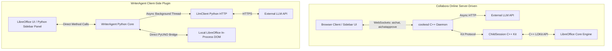

# Architectural Analysis & Dev Guide: Collabora Online AI vs. WriterAgent

> [!NOTE]
> **Source Repository Location**: `~/Desktop/collaboffice`

This document compares **Collabora Online's server-driven AI** (`coolwsd` / `wsd/AIChatSession`) with **WriterAgent's in-process Python plugin**. It maps feature parity, lists Collabora patterns worth adopting, and provides PyUNO reference sketches for gaps. Production code for several areas already lives under `plugin/` — see the parity table before implementing from scratch.

---

## Architectural Comparison



### Key Differences at a Glance

| Architectural Dimension | Collabora Online AI (`coolwsd` + `coolkit`) | WriterAgent (Python Sidebar Plugin) |
| :--- | :--- | :--- |
| **Orchestration Location** | **Server-side** inside the C++ `coolwsd` daemon (`AIChatSession.cpp`). | **Client-side** directly inside the user's LibreOffice instance. |
| **Document Interaction Bridge** | **Protocol Serialization**: Messages are serialized to protocol text (`extractdocumentstructure`, `transformdocumentstructure`) and sent down via IPC sockets to jail-sandboxed child processes (`ChildSession.cpp`) to run LOKit APIs. | **In-Process Object Bridge**: Direct Python-to-C++ interaction using the **PyUNO bridge**. |
| **Tool Calling Loop (FSM)** | Multi-round loop in C++ (`Poco::JSON`, `http::Session`); default **5** tool rounds (`toolRoundsRemaining`). | Python FSM in [`plugin/chatbot/tool_loop.py`](../plugin/chatbot/tool_loop.py); configurable via `chat_max_tool_rounds`. |
| **User Approvals** | WebSocket `aichatapproval:` / `aichatapprove:` frames. | [`show_approval_dialog`](../plugin/chatbot/dialogs.py) + send handlers; today mainly web-research HITL. |
| **Security & Jailing** | Isolated `coolkit` child processes per document. | Host OS permissions for the local LibreOffice process. |

---

## WriterAgent Parity at a Glance

Collabora registers **11 LLM tools** in `AIChatSession::buildToolDefinitions` (`wsd/AIChatSession.cpp`). This table maps each capability to WriterAgent status and code.

| Collabora capability | Status | WriterAgent location | Collabora source |
| :--- | :--- | :--- | :--- |
| `generate_image` | **Implemented** | [`plugin/writer/images/`](../plugin/writer/images/), [image-generation.md](image-generation.md) | `AIChatSession.cpp` — terminal tool, ends loop |
| `extract_document_structure` | **Partial** | [`get_document_tree`](../plugin/writer/outline.py), [`plugin/draw/tree.py`](../plugin/draw/tree.py) | Kit `extractdocumentstructure`; optional `filter=` |
| `transform_document_structure` | **Partial (V1)** | [`plugin/draw/transform.py`](../plugin/draw/transform.py), [`transform_engine.py`](../plugin/draw/transform_engine.py), [`transform_schema.py`](../plugin/draw/transform_schema.py) — Impress `SlideCommands`; DSL: [DocumentToolDescriptions.hpp](https://github.com/CollaboraOnline/online/blob/master/wsd/DocumentToolDescriptions.hpp) | `DocumentToolDescriptions.hpp`, `.uno:TransformDocumentStructure` |
| `extract_link_targets` | **Partial** | Bookmarks / tree locators in [`plugin/writer/tree.py`](../plugin/writer/tree.py) | LOKit `extractRequest` / `extractlinktargets` |
| `list_calc_functions` | **Implemented** | [`plugin/calc/formulas.py`](../plugin/calc/formulas.py) | `.uno:CalcFunctionList` |
| `evaluate_formula` | **Implemented** | [`plugin/calc/formulas.py`](../plugin/calc/formulas.py) (moved to specialized `errors` tier to avoid chatbot context pollution, allowing LLMs to try it in planning flows) | `.uno:EvaluateFormula` |
| `set_cell_formula` | **Partial** | [`write_formula_range`](../plugin/calc/cells.py) | Approval + `.uno:GoToCell` / `.uno:EnterString` batch |
| Formula diagnosis | **Partial** | [`detect_and_explain_errors`](../plugin/calc/errors.py) | Browser `.uno:FormulaDepChain` + `helpfixformulaerror` |
| `fetch_models` | **Implemented** | [`plugin/framework/client/model_fetcher.py`](../plugin/framework/client/model_fetcher.py) | `wsd/FileServer.cpp` `/fetch-models` |
| SSRF / endpoint validation | **Implemented** | `model_fetcher.py`, [`llm_client.py`](../plugin/framework/client/llm_client.py) | `KIT_HOST_ALLOWLIST` env regex |
| Undo grouping | **Partial** | [`WriterCompoundUndo`](../plugin/doc/document_helpers.py) | LOKit batch dispatches; chat/tools not fully grouped |
| Approval / HITL tiers | **Partial** | [`dialogs.py`](../plugin/chatbot/dialogs.py), [`send_handlers.py`](../plugin/chatbot/send_handlers.py) | Inspect vs mutate tool tiers in `executeToolCall` |
| Tool-round cap | **Implemented** | `chat_max_tool_rounds` in tool loop | Default 5 rounds in `AIChatSession.hpp` |
| Tool progress UI | **Partial** | [`StreamQueueKind`](../plugin/framework/async_stream.py) | `aichatprogress:` WebSocket frames |
| `cell://` chat links | **Gap** | — | `Control.AIChatSidebar.ts` markdown post-process |

---

## Features to Consider Adopting (1–9)

Collabora Online has implemented several robust, structured AI interactions. Since WriterAgent runs in-process with a full PyUNO bridge, we can implement gaps **more efficiently and natively** without WebSocket serialization.

### 1. Spreadsheet Function Discovery (`list_calc_functions`) - Implemented

*   **The Feature**: The LLM needs to know what Calc functions are available to prevent hallucinating formulas or using incorrect localized names.
*   **Collabora's Path**: `commandvalues command=.uno:CalcFunctionList` via kit (`AIChatSession.cpp`).
*   **WriterAgent Path**: **Implemented** in [`plugin/calc/formulas.py`](../plugin/calc/formulas.py). Uses PyUNO `com.sun.star.sheet.FunctionDescriptions` with case-insensitive partial substring searching (searching both function names and descriptions) to avoid context bloat.

### 2. Calc Formula Pre-evaluation (`evaluate_formula`) - Implemented

*   **The Feature**: Evaluates a formula *before* writing it, returning result or error to the LLM.
*   **Collabora's Path**: `.uno:EvaluateFormula?cell=…&formula=…`.
*   **WriterAgent Path**: **Implemented** in [`plugin/calc/formulas.py`](../plugin/calc/formulas.py). Putting it in the main chatbot context wasn't ideal because standard evaluation is already covered by writing to cell and reading the error (making a pre-eval tool redundant). We enabled it inside the **specialized `errors` tier** if LLMs want to try it in specialized planning contexts. Uses our advanced side-effect-free **Sheet-Copy Pattern** to duplicate the active sheet, evaluate relative formulas at the target cell context address (resolving relative cell dependencies against live duplicated cell values perfectly), and cleanly delete the copied sheet.

### 3. Structured Slide Transformations (`transform_document_structure`)

*   **The Feature**: Single JSON transaction for slide navigation, layout, text, bullets, UNO formatting, and `GenerateImage.N`.
*   **Collabora's Path**: `DocumentToolDescriptions.hpp` + kit `transformdocumentstructure` + `AIChatSession.cpp`.
*   **WriterAgent Path**: Unified transform engine (appendix C summarizes schema; full spec in upstream header). See roadmap P2.

### 4. Progressive Slide Layout & Image Sequencing

*   **The Feature**: Placeholders applied immediately; `GenerateImage` completions hot-swapped asynchronously.
*   **Collabora's Path**: `processTransformImageGenerations` in `AIChatSession.cpp`.
*   **WriterAgent Path**: Placeholder shapes + [`run_in_background`](../plugin/framework/worker_pool.py) + main-thread drain via [`async_stream`](../plugin/framework/async_stream.py) (appendix D). WriterAgent already has [`generate_image`](../plugin/writer/images/image_tools.py) for sidebar/chat.

### 5. Dynamic Link Target Mapping (`extract_link_targets`)

*   **The Feature**: Dictionary of anchor targets (`Name|table`, `Heading|outline`, etc.) for hyperlinks and TOC.
*   **Collabora's Path**: LOKit `extractRequest` / kit `extractlinktargets`.
*   **WriterAgent Path**: PyUNO enumeration (appendix E); extend categories to match Collabora (OLE, drawing objects, images).

### 6. Document Outline / Structure Extraction (`extract_document_structure`)

*   **The Feature**: Unified structural JSON before complex edits; optional **filters** (`contentcontrol`, `charts`, `docprops`, `slides`).
*   **Collabora's Path**: Kit `extractdocumentstructure` (`wsd/protocol.txt`).
*   **WriterAgent Path**: Prefer existing **`get_document_tree`** (appendix F); add `filter=` parameter for parity.

### 7. Transactional Undo Context Grouping (`XUndoManager`)

*   **The Feature**: Batch LLM edits collapse to one Ctrl+Z step.
*   **Collabora's Path**: Implicit via LOKit / single transform dispatch.
*   **WriterAgent Path**: Use production **`WriterCompoundUndo`** (appendix G); extend to full chat/tool loop (not only edit-selection today).

### 8. Dynamic AI Model Discovery (`fetch_models`)

*   **The Feature**: Populate model dropdowns from provider `/v1/models`.
*   **Collabora's Path**: File server `/fetch-models`.
*   **WriterAgent Path**: **Already implemented** in [`model_fetcher.py`](../plugin/framework/client/model_fetcher.py) (appendix H is a reference sketch only).

### 9. Host Allowlisting & Security Safeguards (SSRF Protection)

*   **The Feature**: Restrict custom API URLs to trusted hosts in enterprise deployments.
*   **Collabora's Path**: `KIT_HOST_ALLOWLIST` regex before HTTP.
*   **WriterAgent Path**: **Already implemented** — `ipaddress` checks and endpoint validation in `model_fetcher.py` / `llm_client.py` (appendix I is a minimal sketch).

---

## Additional Collabora Patterns (10–21)

### 10. Batch Formula Commit with Approval (`set_cell_formula`)

*   **Collabora**: Batch `{cell, formula}` array; `aichatapproval` summary; on approve runs `.uno:GoToCell` then `.uno:EnterString` per pair (`AIChatSession::handleApprove`).
*   **WriterAgent**: Extend `write_formula_range` or add `set_cell_formula` tool; wrap in `WriterCompoundUndo`; reuse `show_approval_dialog`. System prompt: always `evaluate_formula` first.
*   **Priority**: P0 (see roadmap).

### 11. Formula Dependency Diagnosis (`.uno:FormulaDepChain`)

*   **Collabora**: `Control.AIChatSidebar.ts` — `fetchFormulaDependencyChain`, `diagnoseFormulaError`, entry `helpfixformulaerror` / formula error menu.
*   **WriterAgent**: Complement `detect_and_explain_errors` with UNO dependency JSON → structured user message (appendix K).
*   **Priority**: P0.

### 12. Rich Impress Slide DSL (`EditTextObject`, extended `SlideCommands`)

Collabora's transform schema (`wsd/DocumentToolDescriptions.hpp`) is much larger than a minimal `SetText` / `ChangeLayoutByName` handler.

| Command group | Examples |
| :--- | :--- |
| Navigation | `JumpToSlide`, `JumpToSlideByName` |
| Slide management | `InsertMasterSlide`, `DeleteSlide`, `DuplicateSlide`, `MoveSlide`, `RenameSlide` |
| Layout | `ChangeLayoutByName`, `ChangeLayout` (numeric id) |
| Text | `SetText.N`, `EditTextObject.N` with nested `SelectText`, `InsertText`, `UnoCommand` |
| Images | `GenerateImage.N` (placeholder + async completion) |
| Objects | `MarkObject`, `UnMarkObject` |
| Document-level | Top-level `UnoCommand` (e.g. change tracking) |

WriterAgent today uses **atomic** Draw tools ([`plugin/draw/`](../plugin/draw/)). A unified engine should port the schema incrementally (roadmap P2).

### 13. Writer/Calc Content Controls

*   **Collabora**: `ContentControls.ByIndex.N`, `ByTag`, `ByAlias` in transforms; extract with `filter=contentcontrol`.
*   **WriterAgent**: **Gap** — no content-control tools. PyUNO exploration depends on LO version (`XContentControls` / form fields). See appendix L.

### 14. Filtered Structure Extraction

*   **Collabora**: `extract_document_structure` optional `filter` per `wsd/protocol.txt`.
*   **WriterAgent**: Extend `get_document_tree` or add `get_document_structure(filter=…)` tool.

### 15. Inspect vs Mutate Approval Tiers

| Tier | Collabora tools (no approval) | Collabora tools (approval required) |
| :--- | :--- | :--- |
| Read-only | `list_calc_functions`, `evaluate_formula`, `extract_link_targets` | — |
| Sensitive read | — | `extract_document_structure` |
| Mutate | — | `transform_document_structure`, `set_cell_formula` |

WriterAgent mapping: `ToolBase.is_mutation` + optional `requires_approval` → `show_approval_dialog` in tool loop.

### 16. Navigation-Only Transform Fast Path

*   **Collabora**: `SlideCommands` containing **only** `JumpToSlide` / `JumpToSlideByName` skip approval (`AIChatSession::executeToolCall`, `navigationOnly`).
*   **WriterAgent**: Pattern for preview/navigation that never opens undo context.

### 17. Tool-Loop Guardrails

*   **Collabora**: `toolRoundsRemaining` default **5**; parallel `tool_calls` from one assistant message executed **sequentially**; `generate_image` **terminates** the loop.
*   **WriterAgent**: `chat_max_tool_rounds` in config; review sequential vs parallel execution in [`tool_loop.py`](../plugin/chatbot/tool_loop.py).

### 18. Tool Progress Streaming (`aichatprogress`)

*   **Collabora**: Server pushes `{requestId, toolName, status}` during long kit operations.
*   **WriterAgent**: Map to `StreamQueueKind` / sidebar status updates in [`async_stream.py`](../plugin/framework/async_stream.py).

### 19. Rejection Recovery Messages

*   **Collabora**: Tool-specific JSON `error` strings on user reject so the model retries correctly (`AIChatSession::handleApprove`).
*   **WriterAgent**: Document standard rejection payloads per tool name in tool-loop results.

### 20. Doc-Type System Prompts + Selection Gating

*   **Collabora**: Spreadsheet prompts (US formula syntax, `cell://` links, evaluate-before-commit); Impress layout/bullet rules from `DocumentToolDescriptions.hpp`; skip full extract when user message already contains selection markdown.
*   **WriterAgent**: Extend [`plugin/framework/constants.py`](../plugin/framework/constants.py) and send handlers for doc-type modules.

### 21. Calc Chat UX: Clickable `cell://` References

*   **Collabora**: Renders `[B2](cell://B2)` as clickable spans → `navigateToCell`.
*   **WriterAgent**: Sidebar markdown post-processor + optional `navigate_to_cell` tool (appendix M). **Priority**: P1.

---

## Bits of Code to Use (Python PyUNO Adaptations)

Reference sketches for **gaps** or patterns not yet wrapped as tools. Snippets marked **not yet in plugin** are design targets — check the parity table for production code.

### A. Dynamic Calc Function Catalog (`list_calc_functions`) — Implemented in plugin


### B. Formula Pre-evaluation (`evaluate_formula`) — Implemented in plugin


### C. Unified Slide Transform (`transform_document_structure`) — partial in plugin

**Canonical schema**: Collabora [`wsd/DocumentToolDescriptions.hpp`](https://github.com/CollaboraOnline/online/blob/master/wsd/DocumentToolDescriptions.hpp) (`TRANSFORM_PARAM_DESCRIPTION`). WriterAgent embeds a summary in [`plugin/draw/transform_schema.py`](../plugin/draw/transform_schema.py) (`COLLABORA_TRANSFORM_DSL_URL`); execution is PyUNO in [`transform_engine.py`](../plugin/draw/transform_engine.py) (not `.uno:TransformDocumentStructure`, which is LOKit-only).

**V1**: Impress `SlideCommands` (navigation, slide mgmt, layouts, `SetText`, `EditTextObject` / nested `UnoCommand`). **Deferred**: `GenerateImage`, `MarkObject`, content controls, user approval.

**Command groups** (summary): navigation; slide insert/delete/duplicate/move/rename; layout by name or id; `SetText.N`; `EditTextObject.N` with nested UNO (`.uno:Bold`, `.uno:DefaultBullet`, font/color); `GenerateImage.N`; top-level document `UnoCommand`.

**Minimal PyUNO example** (layout + text only):

```python
IMPRESS_LAYOUTS = {
    "AUTOLAYOUT_TITLE": 0,
    "AUTOLAYOUT_TITLE_CONTENT": 1,
    "AUTOLAYOUT_TITLE_2CONTENT": 3,
    "AUTOLAYOUT_TITLE_ONLY": 19,
    "AUTOLAYOUT_NONE": 20,
    # … see DocumentToolDescriptions.hpp for full list
}

def apply_slide_commands(ctx, slide_commands: list[dict[str, Any]]) -> dict[str, Any]:
    from plugin.doc.document_helpers import WriterCompoundUndo
    doc = ctx.doc
    pages = doc.getDrawPages()
    current = 0
    undo = WriterCompoundUndo(doc, "WriterAgent: Slide transform")
    try:
        for cmd in slide_commands:
            if "JumpToSlide" in cmd:
                val = cmd["JumpToSlide"]
                current = pages.getCount() - 1 if val == "last" else max(0, min(int(val), pages.getCount() - 1))
            elif "ChangeLayoutByName" in cmd:
                lid = IMPRESS_LAYOUTS.get(cmd["ChangeLayoutByName"])
                if lid is not None:
                    pages.getByIndex(current).Layout = lid
            elif any(k.startswith("SetText.") for k in cmd):
                # Placeholder iteration — see full schema for EditTextObject
                pass
        return {"status": "ok"}
    finally:
        undo.close()
```

### D. Progressive Image Generation & Placement

WriterAgent already implements image generation ([`image_tools.py`](../plugin/writer/images/image_tools.py), [image-generation.md](image-generation.md)). For Impress **transform** placeholders:

1. Insert loading graphic shape on main thread.
2. Fetch image in background via `run_in_background`.
3. Replace graphic on main thread through `run_async_worker_with_drain` / toolkit queue (never touch UNO from worker threads).

Avoid `tempfile.mktemp()` — use `tempfile.NamedTemporaryFile(delete=False)` per project security rules.

### E. Dynamic Link Target Mapping (`extract_link_targets`) — partial in plugin

PyUNO sketch for unified `name|type` addresses (extend WriterAgent bookmark/tree tooling):

```python
def get_document_link_targets(ctx) -> dict[str, list[str]]:
    doc = ctx.doc
    targets: dict[str, list[str]] = {
        "bookmarks": [], "tables": [], "frames": [], "sections": [], "headings": [],
    }
    if hasattr(doc, "getBookmarks"):
        for name in doc.getBookmarks().getElementNames():
            targets["bookmarks"].append(f"{name}|bookmark")
    if hasattr(doc, "getTextTables"):
        for name in doc.getTextTables().getElementNames():
            targets["tables"].append(f"{name}|table")
    # … frames, sections, heading enumeration (outline)
    return targets
```

### F. Document Structure / Outline (`extract_document_structure`)

**Production path**: use tool **`get_document_tree`** — [`plugin/writer/outline.py`](../plugin/writer/outline.py), [`plugin/writer/tree.py`](../plugin/writer/tree.py), Draw variant in [`plugin/draw/tree.py`](../plugin/draw/tree.py).

**Gap**: optional `filter=` (`contentcontrol`, `charts`, `slides`, …) as in Collabora `wsd/protocol.txt`. Extension sketch:

```python
def get_document_structure(ctx, filter: str | None = None) -> dict[str, Any]:
    if filter == "slides":
        return draw_tree_svc.get_page_tree(ctx.doc)
    if filter == "contentcontrol":
        return _enumerate_content_controls(ctx.doc)  # LO-version-specific
    return tree_svc.get_document_tree(ctx.doc, content_strategy="first_lines", depth=1)
```

### G. Transactional Undo Context Grouping — implemented

Use production **`WriterCompoundUndo`** in [`plugin/doc/document_helpers.py`](../plugin/doc/document_helpers.py):

```python
from plugin.doc.document_helpers import WriterCompoundUndo

def run_ai_batch(ctx, title: str, fn):
    undo = WriterCompoundUndo(ctx.doc, title)
    try:
        return fn()
    finally:
        undo.close()
```

Used today for edit-selection / extend-selection; **not yet** wrapped around full chat tool batches ([`panel.py`](../plugin/chatbot/panel.py) notes future work).

### H. Dynamic AI Model Discovery — implemented (reference sketch)

Production: [`plugin/framework/client/model_fetcher.py`](../plugin/framework/client/model_fetcher.py) — `fetch_models_for_endpoint`, caching, provider presets, `endpoint_url_suitable_for_v1_models_fetch`.

The standalone `urllib` example below is **obsolete** for new code:

```python
# Reference only — use model_fetcher.fetch_models_for_endpoint(ctx, base_url) instead.
```

### I. Endpoint Allowlisting — implemented (reference sketch)

Production: host validation via `ipaddress` and URL parsing in `model_fetcher.py` / `llm_client.py` (supports localhost, corporate gateways, OpenRouter, etc.). The strict regex-only sample is narrower than WriterAgent's actual behavior.

### J. Approved Formula Batch Write — not yet in plugin

Collabora's approved commit path uses formula bar semantics:

```python
from plugin.doc.document_helpers import WriterCompoundUndo

def apply_approved_formulas(ctx, pairs: list[tuple[str, str]]) -> None:
    """pairs: [(cell_address, formula), ...] e.g. ('Sheet1.C5', '=SUM(A1:B2')"""
    doc = ctx.doc
    frame = doc.getCurrentController().getFrame()
    dispatcher = ctx.getServiceManager().createInstanceWithContext(
        "com.sun.star.frame.DispatchHelper", ctx
    )
    undo = WriterCompoundUndo(doc, "WriterAgent: Set formulas")
    try:
        for cell, formula in pairs:
            # .uno:GoToCell then .uno:EnterString — matches Collabora AIChatSession::handleApprove
            dispatcher.executeDispatch(frame, ".uno:GoToCell", "", 0, (PropertyValue("ToPoint", 0, cell, 0),))
            dispatcher.executeDispatch(frame, ".uno:EnterString", "", 0, (PropertyValue("StringName", 0, formula, 0),))
    finally:
        undo.close()
```

### K. FormulaDepChain Dispatch — not yet in plugin

```python
def fetch_formula_dep_chain(ctx) -> Any:
    """Dispatch .uno:FormulaDepChain; return command values JSON for prompt building."""
    frame = ctx.doc.getCurrentController().getFrame()
    # Pattern: DispatchHelper or controller.queryDispatch + listener for result
    # Collabora: browser commandvalues command=.uno:FormulaDepChain
    ...

def build_formula_diagnosis_prompt(dep_chain: dict, cell_address: str, formula: str) -> str:
    return (
        f"Analyze this Calc formula error.\n"
        f"Cell: {cell_address}\nFormula: {formula}\n"
        f"Dependency chain: {dep_chain}\n"
        "Suggest a fix using evaluate_formula before set_cell_formula."
    )
```

Wire to contextual "Fix with AI" from Calc error UI (Collabora: `helpfixformulaerror`).

### L. Content Control Discovery — not yet in plugin

```python
def list_content_controls(doc) -> list[dict[str, Any]]:
    """Enumerate content controls for extract filter=contentcontrol.
    API varies by LibreOffice version — probe XContentControls / SDT support."""
    controls = []
    # TODO: document-specific UNO enumeration when implementing P3 roadmap item
    return controls
```

### M. `cell://` Link Renderer — not yet in plugin

UI-layer hook in chat markdown pipeline (not UNO):

```python
import re

_CELL_LINK = re.compile(r'\[([^\]]+)\]\(cell://([A-Z]{1,3}\d{1,7})\)', re.I)

def render_calc_cell_refs(markdown: str) -> str:
    """Replace [B2](cell://B2) with UI-specific clickable tokens for sidebar HTML."""
    return _CELL_LINK.sub(r'<span data-cell-ref="\2">\1</span>', markdown)

def navigate_to_cell(ctx, address: str) -> None:
    frame = ctx.doc.getCurrentController().getFrame()
    # .uno:GoToCell with ToPoint=address
    ...
```

---

## Adoption Roadmap

Prioritized for WriterAgent impact vs effort. Each item lists Collabora reference and target module.

### P0 — Calc reliability (high impact, medium effort)

1. **`list_calc_functions`** — **Implemented** in [`plugin/calc/formulas.py`](../plugin/calc/formulas.py).
2. **`evaluate_formula`** — **Implemented** in [`plugin/calc/formulas.py`](../plugin/calc/formulas.py) using the side-effect-free Sheet-Copy Pattern.
3. **`FormulaDepChain` diagnosis** — appendix K + Calc error UI entry → complement [`plugin/calc/errors.py`](../plugin/calc/errors.py).

### P1 — Chat UX parity (medium impact, low–medium effort)

4. **`cell://` clickable refs** — appendix M → [`plugin/chatbot/panel.py`](../plugin/chatbot/panel.py) markdown renderer.
5. **Inspect-vs-mutate approval tiers** — `requires_approval` on tools → [`tool_loop.py`](../plugin/chatbot/tool_loop.py), [`dialogs.py`](../plugin/chatbot/dialogs.py).
6. **Tool progress messages** — long UNO ops → [`async_stream.py`](../plugin/framework/async_stream.py) status lines.

### P2 — Impress power user (high impact, high effort)

7. **Unified `transform_document_structure`** — port `DocumentToolDescriptions.hpp` incrementally: navigation → layout/`SetText` → `EditTextObject` → `GenerateImage` placeholders → new `plugin/draw/transform.py` (or similar).

### P3 — Writer forms (medium impact, medium effort)

8. **Content control extract + transform** — filter `contentcontrol`; appendix L.

### P4 — Polish (lower urgency)

9. Navigation-only fast path (feature 16); rejection JSON templates (feature 19); selection-gated extract (feature 20); expand link-target categories to match Collabora (OLE, images, drawing objects).

---

## Source Index

| Topic | Collabora Online | WriterAgent |
| :--- | :--- | :--- |
| Tool definitions | `wsd/AIChatSession.cpp` — `buildToolDefinitions` | [`plugin/framework/tool.py`](../plugin/framework/tool.py) |
| Transform schema | `wsd/DocumentToolDescriptions.hpp` | (gap — roadmap P2) |
| Kit / LOKit handlers | `kit/ChildSession.cpp` — `extractlinktargets`, `extractdocumentstructure`, `transformdocumentstructure` | PyUNO direct (no kit IPC) |
| Browser AI sidebar | `browser/src/control/Control.AIChatSidebar.ts` | [`plugin/chatbot/panel.py`](../plugin/chatbot/panel.py) |
| WebSocket protocol | `wsd/ClientSession.cpp`, `browser/.../CanvasTileLayer.js` — `aichat`, `aichatprogress`, `aichatapproval` | In-process queues / dialogs |
| Model list HTTP | `wsd/FileServer.cpp` — `/fetch-models` | [`model_fetcher.py`](../plugin/framework/client/model_fetcher.py) |
| Batch document HTTP | `wsd/SpecialBrokers.cpp` — extract/transform brokers | MCP / scripting RPC (optional) |
| Calc formula UI | `FormulaErrorHelpSection.ts`, `helpfixformulaerror` | (gap — roadmap P0) |
| Image generation | `generate_image` in `AIChatSession.cpp` | [`plugin/writer/images/`](../plugin/writer/images/) |
| Undo grouping | LOKit / single transform | [`WriterCompoundUndo`](../plugin/doc/document_helpers.py) |
| Config / prompts | Inline in `AIChatSession::handleAction` | [`constants.py`](../plugin/framework/constants.py), send handlers |

---

> [!NOTE]
> WriterAgent does not need Collabora's WebSocket routing, kit jails, or LOKit protocol serialization. Prefer **existing plugin modules** (parity table) over copy-pasting sketches; use appendices for gaps and roadmap ordering.
