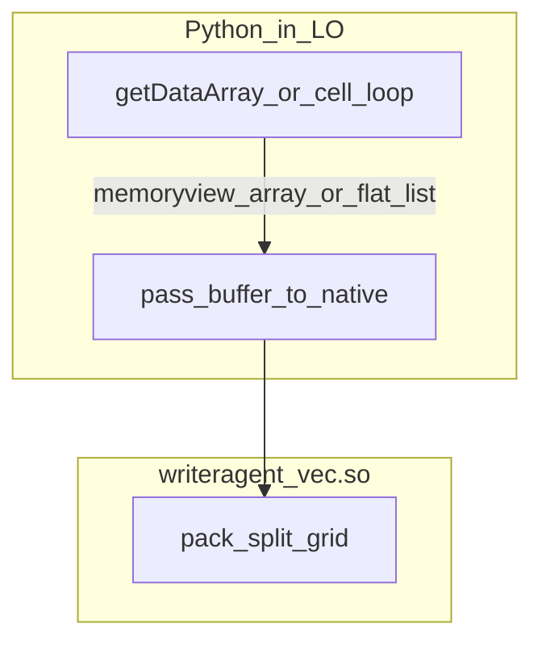

# Building Host Native Extensions (Cython)

Back to [NumPy Serialization](numpy-serialization.md).

This document serves as a reference for compiling and packaging custom host-side native C/Cython extensions for WriterAgent (e.g. `writeragent_vec` pack accelerator, or a future **`writeragent_vec_search`** module for embeddings top-k over binary float32 sidecars — see [embeddings.md](embeddings.md#cython-surface-area)).

> [!IMPORTANT]
> **Status: Experimental (May 2026)**.
> A high-performance Cython accelerator for the host-side cell flattening loop has been implemented as an experimental feature. It provides a **3.5x speedup** on the flattening bottleneck (reducing 100k-cell pack time from 8ms to 2ms).
> 
> Currently, release wheels build for generic **x86-64** (manylinux2014). It is **not yet fully shipped** across all OSes. The system dynamically falls back to the optimized stdlib implementation if the binary is missing or incompatible.

---

## x86-64 Micro-architecture Support

The accelerator can be tuned for different x86-64 generations via `WRITERAGENT_ARCH`. Release builds default to generic **x86-64** — see [Why we still build generic x86-64](#why-we-still-build-generic-x86-64-june-2026) below.

| Level | Since | Features | Compiler Flag |
|-------|-------|----------|---------------|
| **x86-64 (Default)** | **2003** | SSE, SSE2 | `x86-64` |
| **v2** | 2009 | SSE4.2, POPCNT, SSSE3 | `x86-64-v2` |
| **v3** | 2013 | AVX, AVX2, BMI2 | `x86-64-v3` |
| **v4** | 2017 | AVX-512 | `x86-64-v4` |

Local experiments:

```bash
WRITERAGENT_ARCH=x86-64-v3 make native
```

### Why we still build generic x86-64 (June 2026)

**Fair question:** user hardware is effectively all v3-capable (AVX2); v1-class CPUs are ~0% of the user base. **v2 would be a safe modern floor.** Why not at least v2 in CI?

**Answer:** not compatibility — **`-march` tuning buys almost nothing** on this code path.

Benchmarked with [`scripts/bench_serialization.py`](../scripts/bench_serialization.py), ingress `pickle5+sg`, 100k cells (`20000x5`):

| Build | host_pack | total_ms |
|-------|-----------|----------|
| v1 (`x86-64`) | 3.031 ms | 3.062 ms |
| v3 (`x86-64-v3`) | 3.002 ms | 3.032 ms |

Delta: **~1%** (10k-cell row ~2%; v2 would sit between these). Flattening is **memory-bound** (Python object traversal + buffer writes), not SIMD-bound. Cython itself gives **~3–4×** over pure Python; changing `-march` is the wrong lever.

**Rebenchmark anytime** — re-running the bench after hardware or pack-loop changes is fine. **Changing release build defaults** (Makefile, `pyproject.toml`, cibuildwheel matrix) is what is not worth it unless a future code change shows a large gain. Use `WRITERAGENT_ARCH=x86-64-v3 make native` for local curiosity only.

Release default remains `x86-64` in [`setup.py`](../native/writeragent_vec/setup.py) and [`pyproject.toml`](../native/writeragent_vec/pyproject.toml).

> 
> **Never vendor NumPy** into LibreOffice; the user **venv** remains where full NumPy/pandas live. A small Cython extension only accelerates **host-side pack** (and optionally other tight loops) inside the embedded interpreter.

---

## Policy Summary

| Do | Don’t |
|----|--------|
| Ship **tagged `.so` / `.pyd`** per ABI in `plugin/contrib/vec_pack/` (mirror audio) | Import NumPy/pandas/scipy in-process in LO |
| **Fallback** to stdlib `split_grid` on `ImportError` | Link against LibreOffice or call UNO from C |
| Use Cython for **tight numeric loops** on the host (pack, embeddings top-k, binary decode) | Load `sqlite-vec` or full vector DB stacks in LO — use the **venv** for that ([embeddings.md](embeddings.md)) |
| Build matrix with **cibuildwheel + CI** | Expect one Arch laptop to produce Windows/macOS wheels |
| Profile in LO before adding OXT weight | Ship pyarrow-scale stacks |

---

## How Audio Does It (Model to Copy)

Audio does **not** compile C in this repo for release. [`scripts/update_audio_contrib.py`](../scripts/update_audio_contrib.py) **downloads prebuilt wheels** from PyPI and copies artifacts into [`plugin/contrib/audio/`](../plugin/contrib/audio/):

- **Python tags:** 3.11–3.14 (`PYTHON_VERSIONS` in the script; 3.9/3.10 and free-threaded `314t` pruned per [audio-architecture.md](audio-architecture.md))
- **Platforms:** `win_amd64`, `win_arm64`, macOS x86_64/arm64/universal2, `manylinux2014` / `musllinux_1_1` x86_64 and aarch64 (`PLATFORMS` in the script)
- **Tagged binaries** sit **flat** in one directory, e.g. `_cffi_backend.cpython-312-x86_64-linux-gnu.so` (~**28** files for cffi today)
- **Runtime:** [`panel_factory.py`](../plugin/chatbot/panel_factory.py) prepends `plugin/contrib/audio` to `sys.path`; Python imports the module whose tag matches **LO’s** `sys.version` and platform

[`vendor/`](../vendor/) + [`requirements-vendor.txt`](../requirements-vendor.txt) (`make vendor`) is for **pure-Python** deps (snowballstemmer, etc.) — a different path from contrib natives.

---

## Custom Cython: You Become the Wheel Publisher

For **your** module (e.g. `writeragent_vec`), PyPI will not have wheels unless **you** build them. Two equivalent maintainer workflows:

| Approach | Workflow | OXT contents |
|----------|----------|--------------|
| **A — cibuildwheel (recommended)** | CI builds wheels on tag; extract into contrib | Flat tagged `.so` / `.pyd` in `plugin/contrib/vec_pack/` |
| **B — pip download your wheels** | Publish to GitHub Releases / PyPI; [`update_vec_contrib.py`](../scripts/update_audio_contrib.py) mirrors audio’s download script | Same |

You do **not** need every developer machine to compile the full matrix.

### Supported ABI Matrix (Match Audio)

| Dimension | Values |
|-----------|-------------------------------------------------------------------------------|
| CPython | 3.11, 3.12, 3.13, 3.14 |
| Windows | `win_amd64`, `win_arm64` |
| macOS | `macosx_10_9_x86_64`, `macosx_11_0_arm64`, `macosx_10_9_universal2` |
| Linux glibc | `manylinux2014_x86_64`, `manylinux2014_aarch64` |
| Linux musl | `musllinux_1_1_x86_64`, `musllinux_1_1_aarch64` |

A Cython package with the same policy ships on the order of **~28** native artifacts (one per ABI), not one universal binary.

**What you cannot do on a single machine:** produce the full matrix natively. Typical split:

1. **Local smoke test** — one ABI matching **LibreOffice’s** embedded `python` on your box.
2. **Linux manylinux + musl** — `cibuildwheel --platform linux` (uses **Docker** on Linux).
3. **Windows + macOS** — GitHub Actions (`windows-latest`, `macos-*`) or other CI; not practical to cross-build all of those on a single dev environment.

**Rough maintainer effort (first time):** package + `pyproject.toml` / `cibuildwheel.toml` (~half day); CI workflow + `update_vec_contrib.py` (~1 day); first green matrix + strip/prune (~1 day); rebuild when bumping supported Python range.

---

## Recommended Project Layout (Future)

```text
native/writeragent_vec/
  pyproject.toml              # setuptools + Cython
  src/writeragent_vec/
    __init__.py
    pack.pyx                  # coerce + row-major float64 pack
  tests/                      # pytest vs host_pack_split_grid
scripts/update_vec_contrib.py # extract wheels → plugin/contrib/vec_pack/
plugin/contrib/vec_pack/        # git-tracked .so/.pyd like audio
```

Wire into [`calc_addin_data.py`](../plugin/calc/calc_addin_data.py) or [`payload_codec.py`](../plugin/scripting/payload_codec.py) with `try: import writeragent_vec` and stdlib fallback.

---

## Build Pipeline (cibuildwheel)

1. Pin ABI to the table above (`pyproject.toml` + `[tool.cibuildwheel]` or GitHub Actions matrix).
2. On release tag: `pip install cibuildwheel && cibuildwheel native/writeragent_vec` → `wheelhouse/`.
3. `update_vec_contrib.py`: unzip wheels; copy `writeragent_vec/*.so` (+ `__init__.py` once) into `plugin/contrib/vec_pack/`.
4. **Strip** with `llvm-strip` (reuse `strip_binary` from [`update_audio_contrib.py`](../scripts/update_audio_contrib.py)).
5. Optional: prune musl tags if you only target glibc LO builds; optional `NO_VEC_PACK=1` in [`build_oxt.py`](../scripts/build_oxt.py).

---

## On Arch Linux (Local Dev and Linux Wheels)

**Packages:**

```bash
sudo pacman -S base-devel gcc llvm docker   # docker or podman for cibuildwheel linux
uv sync --group dev
uv pip install cython build cibuildwheel
```

**Discover LibreOffice’s embedded Python** (build and test against this ABI, not only `/usr/bin/python`):

```bash
/usr/lib/libreoffice/program/python -c "import sys; print(sys.version); print(sys.implementation.cache_tag)"
```

**Dev install for local smoke tests** (once `native/writeragent_vec` exists):

```bash
cd native/writeragent_vec
/usr/lib/libreoffice/program/python -m pip install --user cython build   # if pip available on LO python
/usr/lib/libreoffice/program/python -m pip install -e .
```

**Linux wheel matrix from Arch** (glibc manylinux + musl; requires Docker):

```bash
cd native/writeragent_vec
uv run cibuildwheel --platform linux
```

Distro LibreOffice on glibc Arch typically needs **`manylinux2014_*`** tags. **Musl** wheels matter only for musl-linked LO builds (some minimal/Flatpak-style layouts).

**Not from Arch alone:** `win_*` and `macosx_*` wheels — add `.github/workflows/build-vec-wheels.yml` (or similar) on tag push.

---

## Runtime Integration (LO Host)

```python
_vec_dir = os.path.join(ext_root, "plugin", "contrib", "vec_pack")
if _vec_dir not in sys.path:
    sys.path.insert(0, _vec_dir)
try:
    import writeragent_vec as _wv
except ImportError:
    _wv = None  # unknown LO Python minor or arch → stdlib payload_codec
```

Log `sys.version`, `sys.platform`, and import success at debug level once per session when diagnosing missing tags.

---

## UNO Boundary (Important)

A Cython extension **must not** link against LibreOffice or call UNO from C. PyUNO stays in Python.



- **Python:** one UNO read ([`calc_addin_data_to_python`](../plugin/calc/calc_addin_data.py) or `getDataArray`) — still required.
- **Cython:** fast **coerce + pack** (row-major `float64`, `None`/empty → NaN) over a contiguous buffer — replaces the hot loop in [`host_pack_split_grid`](../plugin/scripting/payload_codec.py).
- **Wire:** unchanged split_grid envelope; **venv** child still uses `np.frombuffer`.

---

## Cython vs Plain C vs Prebuilt PyPI Codecs

| Option | Pros | Cons |
|--------|------|------|
| **Cython** | Fast to write numeric loops; same wheel matrix as any C ext | You build/publish all ABIs |
| **Plain C API module** | Minimal runtime | More boilerplate; same ABI matrix |
| **Vendored orjson/msgpack** | Wheels exist on PyPI; download like audio cffi | Does not remove UNO→Python cell loop; different bottleneck |
| **NumPy in LO** | — | **Rejected** — ABI + size ([core ABI section](enabling_numpy_in_libreoffice.md#1-the-problem-abi-and-embedded-python)) |

---

## Verification Before Shipping in OXT

1. Unit tests: `writeragent_vec` output matches [`host_pack_split_grid`](../plugin/scripting/payload_codec.py) for sample grids.
2. [`scripts/bench_serialization.py`](../scripts/bench_serialization.py) — optional `native_vec` row when import succeeds.
3. LO profile legs A–B on 100×100+ numeric ranges.
4. Cold import cost in LO (extension startup) — compare to audio’s cffi load.
