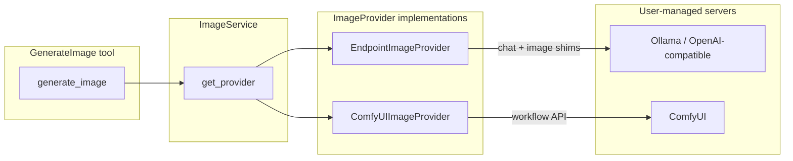

# ComfyUI & Local Image Backends — Development Plan

> **Scope:** Research-backed plan for **local / self-hosted** image generation beyond the existing **`endpoint`** provider. **Primary candidate for new code: ComfyUI** (workflow server with a non–OpenAI API). **Diffusers** is documented for completeness but **deprioritized** — Ollama and other OpenAI-compatible servers already cover most “local GPU images on one URL” use cases without extension changes.
>
> **Living document:** Update as phases ship or decisions change. Link PRs here.

---

## Strategic decision (2026-06)

**Do not build dedicated Diffusers support unless a concrete gap appears.**

WriterAgent already routes local image generation through the same Settings **`endpoint`** as chat, with **provider shims** picking the wire format:

| Server | Chat | Images | WriterAgent |
|--------|------|--------|-------------|
| **Ollama** (`localhost:11434`) | `/v1/chat/completions` | `/api/generate` (base64 in `image` / `images`) | [`OllamaShim`](../plugin/framework/client/llm_client.py) |
| **OpenAI-compatible** (LM Studio, many gateways) | `/v1/chat/completions` | `/v1/images/generations` | `OpenAIShim` |
| **OpenRouter / hosted** | chat | multimodal or `/images/generations` | existing paths |

Users who want **Diffusers under the hood** can run it behind Ollama (flux/z-image models), a LiteLLM-style proxy, or any stack that exposes the above routes — **no new `ImageProvider` required**.

**What still justifies new extension work:**

1. **ComfyUI** — different API (workflow JSON, `/prompt`, `/upload/image`, `/view`). Cannot be handled by shims alone.
2. **Optional endpoint polish** — e.g. fetch `data[].url` when a server returns URLs instead of `b64_json` (stock HF Diffusers example server); small shim change, not a full backend.
3. **Diffusers venv worker** — only if users need raw HF Hub + AutoPipeline **inside WriterAgent** with no external server (heavy; defer indefinitely).

**Revised goal:** Add **`ComfyUIImageProvider`** (and minimal `image_backend` plumbing). Treat Diffusers phases as **backlog / on-demand**, not committed roadmap.

---

## Problem

Today, WriterAgent image generation is **endpoint-only**: `generate_image` → `ImageService` → `EndpointImageProvider` → `LlmClient.image_completion()` or OpenRouter multimodal chat. That already covers:

- Hosted APIs (OpenRouter, Together, etc.).
- **Local Ollama** with image models (e.g. `x/flux2-klein`, `x/z-image-turbo`) on the **same URL** as chat, via `text_model` vs `image_model`.

It does **not** cover:

- **ComfyUI** users (custom workflows, ControlNet, LoRAs, node graphs) — requires a dedicated client.
- Full use of Settings **`image_steps`**, **`seed`**, **CFG** on every backend (partial today; ComfyUI would wire them explicitly).

AI Horde was removed; `provider="aihorde"` still maps to `"endpoint"`.

**Goal:** Add pluggable **`ImageProvider`** for **ComfyUI** while keeping **`generate_image`**'s tool surface, document insertion, img2img flow, and async worker pattern unchanged. **Do not** add Diffusers-specific providers unless product requirements override the strategic decision above.

---

## Current Architecture (baseline)

| Layer | Location | Role |
|-------|----------|------|
| Tool | [`plugin/writer/images/images.py`](../plugin/writer/images/images.py) `GenerateImage` | Aspect/size rounding, selection → base64 for img2img, calls `ImageService`, inserts via main thread |
| Service | [`plugin/writer/images/image_utils.py`](../plugin/writer/images/image_utils.py) `ImageService` | Merges config defaults (`image_base_size`, `image_steps`), resolves provider |
| Provider | `EndpointImageProvider` | HTTP via `LlmClient` / `sync_request`; returns `(paths: list[str], error: str)` |
| Config | [`plugin/framework/config.py`](../plugin/framework/config.py) | `image_model`, `image_base_size`, `image_steps`, `seed`, gallery/frame flags |
| Settings UI | [`extension/WriterAgentDialogs/SettingsDialog.xdl.tpl`](../extension/WriterAgentDialogs/SettingsDialog.xdl.tpl) page 2 (Image) | Size, aspect, steps, seed, gallery, frame — **no backend selector yet** |
| HTTP helper | [`plugin/framework/client/requests.py`](../plugin/framework/client/requests.py) `sync_request` | Blocking GET/POST (JSON/bytes); multipart exists in `llm_client` for STT only |

**Invariants to preserve:**

- `generate_image` stays **async** on the tool worker; UNO (selection read, insert) stays on the main thread via `execute_on_main_thread`.
- Provider returns **temp file paths** (PNG/WebP); [`image_tools.insert_image`](../plugin/writer/images/image_tools.py) embeds or links as today.
- **`status_callback`** should report queue/progress where backends support it (ComfyUI WebSocket events).

---

## Existing local path — Ollama & wrappers (no new backend)

This section records why **Diffusers integration is optional**, for implementers and doc writers.

### Ollama (already supported)

One Settings URL, two routes, two models:

- **Chat:** `POST {endpoint}/v1/chat/completions` with `text_model`.
- **Images:** `POST {endpoint}/api/generate` with `image_model` (e.g. `x/flux2-klein:4b`).

Detection: URL contains `localhost:11434` or `"ollama"` → [`get_provider_from_endpoint`](../plugin/framework/client/provider_detection.py) → `OllamaShim` for `image_completion()`.

Ollama also exposes **`POST /v1/images/generations`** (OpenAI-style, `b64_json`) on newer builds; the shim falls back to `OpenAIShim.parse_image_responses` if the response contains `data[]`.

Image model dropdown: keyword filter on `/v1/models` ids (`flux`, `sdxl`, `stable-diffusion`, …) in [`model_fetcher.py`](../plugin/framework/client/model_fetcher.py).

**User-facing guidance (docs, not code):** For local GPU images without ComfyUI, prefer **Ollama + image model** before any Diffusers-specific backend.

### Other servers that wrap Diffusers

Any process that speaks **OpenAI-compatible** `/v1/chat/completions` + `/v1/images/generations` on one base URL works with **`EndpointImageProvider`** today. Examples: LM Studio, custom LiteLLM/nginx gateways forwarding images to a Diffusers FastAPI server.

**Caveat:** HF’s stock Diffusers `examples/server` returns **`data[].url`**, not `b64_json`. WriterAgent currently requests `b64_json` and only parses base64 — a **one-line-class shim extension** (download URL → temp file) fixes that without a new backend. Only pursue if users report breakage.

### When Diffusers-specific code might still be worth it

| Scenario | Prefer |
|----------|--------|
| Local chat + images, one port | **Ollama** or gateway (existing `endpoint`) |
| Custom ComfyUI workflows | **ComfyUI backend** (this plan, Phase 1) |
| Raw HF Hub repo, AutoPipeline, no Ollama | Diffusers venv worker (backlog) |
| Diffusers HTTP server only, no chat on same port | Separate URL → either **`image_backend` + diffusers URL** *or* document “use Ollama/proxy instead” |

---

## External API Research

### ComfyUI Server API

ComfyUI exposes a **local HTTP + WebSocket** server (default `http://127.0.0.1:8188`). Official docs: [API Examples](https://docs.comfy.org/development/comfyui-server/api-examples), [Workflow API format](https://docs.comfy.org/development/api-development/workflow-api-format). Community references: [GitHub #2110](https://github.com/Comfy-Org/ComfyUI/issues/2110), [Runflow 2026 guide](https://www.runflow.io/blog/comfyui-api-developer-guide).

#### Core endpoints

| Endpoint | Method | Purpose |
|----------|--------|---------|
| `/prompt` | POST | Queue workflow (API-format JSON graph). Body: `{ "prompt": {…}, "client_id": "uuid" }`. Returns `{ "prompt_id", "number", … }`. |
| `/prompt` | GET | Queue depth / exec info |
| `/queue` | GET | Running + pending items |
| `/queue` | POST | Clear or delete queue entries |
| `/history/{prompt_id}` | GET | Outputs metadata after completion (`outputs[node_id].images[]` with filename, subfolder, type) |
| `/view?filename=&subfolder=&type=` | GET | Download image bytes |
| `/upload/image` | POST | Multipart upload for img2img / LoadImage nodes |
| `/object_info` | GET | Node catalog (for validation / dynamic UI later) |
| `/ws?clientId=` | WebSocket | Progress, `executing`, preview binary frames |

All routes also work under `/api/…` prefix. Optional `Authorization: Bearer …` when ComfyUI is configured with API keys (see Open WebUI's [`comfyui.py`](https://github.com/open-webui/open-webui/blob/main/backend/open_webui/utils/images/comfyui.py)).

#### Workflow format

- **Not** the UI save format — use **File → Export Workflow (API)** (requires Dev mode in Settings).
- Nodes keyed by **numeric string IDs** (`"3"`, `"6"`, …).
- Each node: `{ "class_type": "KSampler", "inputs": { … } }`.
- Inputs reference other nodes as `["node_id", output_index]`.

WriterAgent must **patch** a template workflow at runtime:

- `CLIPTextEncode` → positive/negative prompt text
- `EmptyLatentImage` or `LoadImage` → width/height or uploaded filename
- `KSampler` → seed, steps, cfg, denoise (img2img strength maps to `denoise` on KSampler)
- `CheckpointLoaderSimple` → `ckpt_name` (model id)

#### Recommended client flow (Method 2 from official docs)

1. `POST /prompt` with `client_id`.
2. Connect WebSocket; wait for `{ "type": "executing", "data": { "node": null, "prompt_id": … } }` (done).
3. `GET /history/{prompt_id}` → list output images.
4. `GET /view?…` → bytes → temp PNG file.

**Img2img:** `POST /upload/image` (multipart) → patch `LoadImage.inputs.image` → submit workflow with `KSampler.denoise < 1`.

**Progress / status:** WebSocket `progress` and binary preview frames; map to `status_callback` for sidebar UX.

**Failure modes:** Validation errors on `/prompt` (400 + node errors), queue stuck, missing checkpoint, ComfyUI not running → clear user-facing errors with connection URL in `details`.

---

### Hugging Face Diffusers *(reference only — implementation deferred)*

> **Status:** Documented for research completeness. **Not on the committed roadmap** while Ollama/OpenAI-compatible wrappers suffice. Revisit only on explicit user demand (e.g. in-process AutoPipeline without any external server).

Official server guide: [Create a server](https://huggingface.co/docs/diffusers/en/using-diffusers/create_a_server). Reference implementation lives in the Diffusers repo under `examples/server/`.

#### Built-in HTTP server (`examples/server`)

- **FastAPI** app on `http://localhost:8000`.
- **OpenAI-style** endpoint: `POST /v1/images/generations` with JSON body `{ "prompt": "…", "model": "…" }`.
- Response: `{ "data": [{ "url": "http://localhost:8000/files/…" }] }` (saved to disk on server).
- Implementation notes from HF docs:
  - Load **one shared pipeline** at startup; per request clone scheduler + generator (schedulers are **not thread-safe**).
  - Run `pipeline(...)` in `run_in_executor` to avoid blocking the event loop.
  - Supports concurrent requests with care; production setups often use a **single-worker queue** for GPU safety.

#### AutoPipeline (recommended for venv worker — **not in initial draft**)

Diffusers' **[AutoPipeline](https://huggingface.co/docs/diffusers/tutorials/autopipeline)** classes are the preferred way to load a Hub checkpoint without hard-coding pipeline subclasses (SD1.5 vs SDXL vs SD3 vs Flux, etc.). The worker passes a single **`diffusers_model_id`**; Diffusers reads `model_index.json` and picks the correct class.

| Class | Task | WriterAgent use |
|-------|------|-----------------|
| `AutoPipelineForText2Image` | txt2img | Default when `source_image` omitted |
| `AutoPipelineForImage2Image` | img2img | When `source_image='selection'` |
| `AutoPipelineForInpainting` | inpaint | Out of scope for v1 (no mask tool yet) |

**Why this matters for WriterAgent:** The plan originally listed explicit `StableDiffusionPipeline` / `StableDiffusion*Img2ImgPipeline` types. That forces maintenance every time a new architecture appears. AutoPipeline gives **good defaults** in two senses:

1. **Correct pipeline class** for the checkpoint (e.g. `RunDiffusion/Juggernaut-XL-v9` → `StableDiffusionXLImg2ImgPipeline` for img2img, not the txt2img-only subclass).
2. **Sensible load kwargs** when combined with Accelerate: `torch_dtype=torch.float16` (or `bfloat16` on supported GPUs), `variant="fp16"` where the repo provides it, `device_map="cuda"` or `enable_model_cpu_offload()` for VRAM — same patterns HF uses in [conditional image generation](https://huggingface.co/docs/diffusers/en/using-diffusers/conditional_image_generation) docs.

**Contrast with `DiffusionPipeline`:** `DiffusionPipeline.from_pretrained()` is *model-centric* (returns the base pipeline, e.g. SDXL txt2img). AutoPipeline is *task-centric* — exactly what we need when switching between create and edit on the same model id.

**Implementation sketch (Phase 3 worker):**

```python
from diffusers import AutoPipelineForText2Image, AutoPipelineForImage2Image

# Load once at worker startup; cache by diffusers_model_id
txt2img_pipe = AutoPipelineForText2Image.from_pretrained(
    model_id, torch_dtype=dtype, variant="fp16"
).to(device)

# Img2img: separate load OR from_pipe() if memory allows only one pipe
img2img_pipe = AutoPipelineForImage2Image.from_pretrained(
    model_id, torch_dtype=dtype, variant="fp16"
).to(device)
```

Per-call inference kwargs (override Settings when set): `num_inference_steps` ← `image_steps`, `guidance_scale` ← `image_cfg_scale`, `generator` ← `seed`, img2img `strength` ← tool `strength`. When `image_steps == -1`, omit and use each pipeline's documented defaults (typically 50 for SD1.5, model-specific for SDXL).

**Caveats:** Unsupported or exotic checkpoints raise `ValueError` from AutoPipeline — surface that clearly in Settings/diagnostics. The HF **example HTTP server** hard-codes `StableDiffusion3Pipeline`; if we ship a forked server in Phase 2, consider switching it to AutoPipeline too for consistency.

#### Python pipeline API (direct classes — fallback only)

| Pipeline | Text-to-image | Img2img | Key parameters |
|----------|---------------|---------|----------------|
| `StableDiffusionPipeline` / SDXL / SD3 | ✓ | via `StableDiffusion*Img2ImgPipeline` | `prompt`, `num_inference_steps`, `guidance_scale`, `generator` + seed |
| Img2img | — | ✓ | `image` (PIL), `strength` (0–1, maps to WriterAgent `strength`), `num_inference_steps` |

Use explicit classes only when AutoPipeline mapping fails or for a pinned, tested model list. **Default path: AutoPipeline.**

Img2img **strength** semantics align with WriterAgent's existing default `0.75`: higher = more change. In ComfyUI the same concept is **`denoise`** on `KSampler`.

#### Deployment options for WriterAgent

| Mode | Pros | Cons |
|------|------|------|
| **A. External Diffusers HTTP server** | Minimal extension code; reuse URL fetch like endpoint; user manages GPU process | User must install/run server separately; limited img2img unless server extended |
| **B. Venv worker (like Vision)** | Matches [`docs/image-generation.md`](image-generation.md) roadmap; one-click from LO once venv has torch | Heavy deps (GB); GPU RAM; long cold start; must not block LO main thread |
| **C. Both** | Power users run server; others use bundled worker | Two code paths to maintain |

**Recommendation (revised):** Ship **ComfyUI only** as new extension code. **Skip Diffusers providers**; document Ollama/local endpoint setup in [`image-generation.md`](image-generation.md). Optional tiny fix: **`OpenAIShim` URL fallback** for `/v1/images/generations` responses that return `url` instead of `b64_json`.

---

## Design Principles

1. **Extend `ImageProvider`, don't fork the tool.** One `ImageService.get_provider(name)` registry; `GenerateImage` unchanged except provider enum/docs.
2. **Least new complexity (AGENTS.md).** Prefer **existing `endpoint` + shims** (Ollama) over new backends. Add code only where the API is genuinely different (**ComfyUI**).
3. **Host process for ComfyUI.** No torch in the LibreOffice Python runtime. GPU work stays in ComfyUI or in user-managed servers (Ollama, etc.).
4. **Config in `writeragent.json`.** Same hygiene as other integrations — no env API keys in production; redact URLs/tokens in logs.
5. **Template-based ComfyUI workflows.** Ship minimal bundled API workflows (SD1.5 txt2img + img2img) plus config overrides for checkpoint name and node ID map. Advanced users can point to custom workflow JSON paths later.
6. **Tests required.** Mock HTTP/WebSocket for ComfyUI; extend [`tests/writer/images/test_image_utils.py`](../tests/writer/images/test_image_utils.py). Diffusers tests only if that backlog ships.

---

## Proposed Architecture



*Diffusers FastAPI / venv worker (dashed backlog) omitted — use Ollama or endpoint + gateway instead.*

### New / changed modules (committed scope)

| Module | Role |
|--------|------|
| `plugin/writer/images/comfyui_client.py` | Queue, poll history, upload, download, optional WebSocket wait |
| `plugin/writer/images/comfyui_provider.py` | `ComfyUIImageProvider(ImageProvider)` — template patch + generate |
| `extension/metadata/comfyui_workflows/` | Bundled `txt2img_api.json`, `img2img_api.json` |
| `plugin/framework/client/multipart.py` (or extend `requests.py`) | Multipart POST for ComfyUI upload |

### Optional / backlog modules (Diffusers — not committed)

| Module | Role |
|--------|------|
| `plugin/writer/images/diffusers_http_provider.py` | HTTP to Diffusers-only server (usually unnecessary if Ollama/gateway used) |
| `plugin/writer/images/diffusers_venv/` | AutoPipeline worker (heavy; defer) |
| `OpenAIShim` URL parse tweak | Fetch `data[].url` for generic OpenAI image responses |

### Provider selection

Add config key **`image_backend`**: `"endpoint"` | `"comfyui"` (default `"endpoint"`). Reserve `"diffusers_*"` strings only if backlog ships.

Tool parameter `provider` already exists — extend allowed values (`comfyui`) and map legacy `"aihorde"` → `"endpoint"` (unchanged).

When `image_backend == "comfyui"`, **`image_model`** means checkpoint filename (`ckpt_name`) or workflow alias. When `"endpoint"`, behavior unchanged (`image_model` = remote/local model id on the configured URL, including Ollama flux models).

---

## Config Keys (proposed)

| Key | Type | Default | Role |
|-----|------|---------|------|
| `image_backend` | str | `"endpoint"` | Active provider family |
| `comfyui_url` | str | `"http://127.0.0.1:8188"` | ComfyUI base URL |
| `comfyui_api_key` | str | `""` | Optional Bearer token |
| `comfyui_workflow_txt2img` | str | `""` | Path to API workflow JSON; empty = bundled default |
| `comfyui_workflow_img2img` | str | `""` | Same for img2img |
| `comfyui_checkpoint` | str | `""` | Default `ckpt_name` when workflow uses CheckpointLoaderSimple |
| `comfyui_node_map` | object (extra) | `{}` | Optional overrides: `{ "positive_prompt": "6", "ksampler": "3", … }` |
| `seed` | str | `"-1"` | Already exists; `-1` = random; pass to KSampler (ComfyUI) or server when supported |
| `image_steps` | int | `-1` | `-1` = workflow/server default; else override steps |
| `image_cfg_scale` | float | `7.5` | New; maps to ComfyUI `cfg` (Ollama may ignore) |

*Backlog keys (only if Diffusers ships):* `diffusers_server_url`, `diffusers_model_id`.

Existing keys (`image_base_size`, `image_default_aspect`, `image_auto_gallery`, `image_insert_frame`) stay as-is.

**Settings UI (Image tab):** Backend combobox (`endpoint` | `comfyui`) + ComfyUI URL/checkpoint when selected. **Document** Ollama local setup on the endpoint path (General tab URL + image model) — no separate Diffusers fields unless backlog ships.

---

## Parameter Mapping

| `generate_image` / config | Endpoint (incl. Ollama) | ComfyUI |
|---------------------------|-------------------------|----------|
| `prompt` | user message / generate prompt | CLIPTextEncode positive |
| (negative) | — | optional config or empty |
| `width`, `height` | shim (Ollama: limited) | EmptyLatentImage |
| `image_steps` | when > 0 & server supports | KSampler.steps |
| `seed` | when server supports | KSampler.seed |
| `strength` (img2img) | shim | KSampler.denoise |
| `source_image` (b64) | multimodal / server-dependent | upload + LoadImage |

Aspect ratio logic in `GenerateImage` (64-pixel rounding) applies to all backends.

---

## Phased Implementation

### Priority summary

| Phase | Status | Notes |
|-------|--------|-------|
| **0** — Plumbing | **Committed** | `image_backend`, ComfyUI dispatch |
| **1** — ComfyUI | **Committed** | Only new backend worth building |
| **1b** — ComfyUI polish | **Committed** (nice-to-have) | WS, custom workflows |
| **0b** — Endpoint URL images | **Optional polish** | Parse `data[].url` in OpenAIShim; helps raw Diffusers server without new backend |
| **2–3** — Diffusers HTTP / venv | **Deferred / backlog** | Use Ollama or gateway instead |
| **4** — UX | **Later** | Checkpoint lists, docs for Ollama |

---

### Phase 0 — Plumbing (small, testable)

- [ ] Add `image_backend` to `Config` dataclass + manifest registry + Settings field specs in [`plugin/main.py`](../plugin/main.py).
- [ ] Refactor `ImageService.get_provider()` to dispatch on backend name.
- [ ] Extract shared helper: `_write_temp_image(bytes) -> path` (dedupe from `EndpointImageProvider._save_b64`).
- [ ] Add `multipart_post()` for file upload (ComfyUI img2img).
- [ ] Unit tests for provider dispatch only.

**Exit criteria:** Default behavior identical to today; no new runtime deps in extension bundle.

---

### Phase 1 — ComfyUI backend (recommended first ship)

**User story:** User runs ComfyUI locally, sets backend to ComfyUI + checkpoint name, generates from chat.

- [ ] Implement `ComfyUIClient` (sync): health check (`GET /system_stats` or `/queue`), queue, wait (poll `/history` with timeout **or** WebSocket using existing `websockets` dep in dev — **host extension must use stdlib + bundled deps only**; prefer polling for v1 to avoid bundling `websocket-client`, add WS in Phase 1b).
- [ ] Bundle minimal SD1.5 txt2img/img2img API workflows under `extension/metadata/comfyui_workflows/`.
- [ ] `ComfyUIImageProvider.generate()`: load template → patch inputs → submit → download → temp file.
- [ ] Img2img: decode base64 → multipart upload → patch LoadImage → denoise from `strength`.
- [ ] Wire `status_callback`: optional WS progress; fallback "Queued…" / "Generating…".
- [ ] Settings: URL, checkpoint, backend selector; connection test button (queue empty GET).
- [ ] Tests: mock HTTP sequence (prompt → history → view); img2img upload path.
- [ ] Update [`docs/image-generation.md`](image-generation.md) with ComfyUI setup section.

**Exit criteria:** txt2img + img2img against default workflow on local ComfyUI; `make test` green.

**Known limitations v1:**

- Single bundled workflow family (SD1.5-style CheckpointLoader + KSampler). SDXL/Flux/Custom nodes require user-supplied workflow JSON (Phase 1b).
- No LoRA parsing from prompt (`<lora:…>`) unless workflow supports it.

---

### Phase 1b — ComfyUI polish

- [ ] WebSocket wait + progress previews (reuse patterns from official Method 2/3).
- [ ] Configurable workflow paths + `comfyui_node_map` for advanced graphs.
- [ ] Optional `GET /object_info` to validate checkpoint exists before queue.
- [ ] Cancel: `POST /interrupt` when user hits Stop (integrate with `SendCancellation` / tool worker cancel if feasible).

---

### Phase 0b — Endpoint image URL fallback *(optional polish, not a Diffusers backend)*

**User story:** User points **`endpoint`** at a server that returns OpenAI-style `{ "data": [{ "url": "…" }] }` (e.g. stock HF Diffusers `examples/server`) instead of `b64_json`.

- [ ] Extend `OpenAIShim.parse_image_responses` (or `EndpointImageProvider`) to download `url` via `sync_request` when `b64_json` absent.
- [ ] Test with mocked URL response.

**Exit criteria:** txt2img works against Diffusers example server **using existing `endpoint` backend** — no `image_backend`, no new provider.

**Prefer this over Phase 2** if the only gap is response format.

---

### Phase 2 — Diffusers HTTP backend *(deferred — backlog)*

> **Trigger to implement:** Multiple users need a **Diffusers-only** server on a **different URL** than chat, and refuse Ollama/gateway. Otherwise use **Phase 0b** + **`endpoint`**.

- [ ] `DiffusersHttpProvider` or separate `image_endpoint` config key.
- [ ] See [Hugging Face Diffusers](#hugging-face-diffusers-reference-only--implementation-deferred) section above.

---

### Phase 3 — Diffusers venv worker *(deferred — backlog)*

> **Trigger to implement:** Explicit demand for in-LO **AutoPipeline** without any user-managed server. High cost (torch in venv, GPU, cold start).

- [ ] `AutoPipelineForText2Image` / `AutoPipelineForImage2Image` worker — design preserved in Diffusers section above.
- [ ] Follow Vision venv pattern only if product commits to maintaining it.

---

### Phase 4 — UX & catalog (later)

- [ ] Sidebar image model combobox: ComfyUI checkpoints from `/object_info`; **Ollama** models from existing `/v1/models` filter.
- [ ] **Docs:** “Local images without ComfyUI” → Ollama setup (endpoint URL, pull flux model, set image model).
- [ ] Direct-image mode in sidebar respects `image_backend`.
- [ ] MCP / scripting API [`writeragent_api.generate_image`](../plugin/scripting/writeragent_api.py): pass `provider` through (already has param).

---

## Error Handling & Observability

| Scenario | User-facing message | `details` |
|----------|---------------------|-----------|
| ComfyUI connection refused | "ComfyUI is not reachable at {url}. Start ComfyUI and check Settings." | `{ "url", "errno" }` |
| Invalid workflow / missing node | "Workflow validation failed: …" | ComfyUI error JSON |
| Unknown checkpoint | "Checkpoint '{name}' not found in ComfyUI models." | `{ "ckpt_name" }` |
| Ollama image model missing | "Image model not found. Run `ollama pull …` and set Image Model in Settings." | `{ "model" }` |
| Timeout | "Image generation timed out after {n}s." | `{ "prompt_id" }` for ComfyUI |

Use `log.exception` in unexpected paths; redact API keys via existing logging helpers.

---

## Testing Strategy

| Area | Approach |
|------|----------|
| ComfyUI client | pytest with `urllib` mocked; fixture JSON for prompt/history/view |
| ComfyUI provider | Patch template loader; assert node input mutations |
| Endpoint URL images (0b) | Mock `/v1/images/generations` with `url` only |
| Ollama (regression) | Existing `OllamaShim` / `TestEndpointImageProvider` paths |
| Integration | Manual: ComfyUI workflow; manual: Ollama flux model on endpoint |
| Regression | Existing `TestEndpointImageProvider` unchanged |

Run **`make test`** before merge each phase.

---

## Risks & Mitigations

| Risk | Mitigation |
|------|------------|
| ComfyUI workflow diversity | Ship one template + node_map; document Export Workflow (API) for power users |
| Multipart upload missing in `sync_request` | Small dedicated helper; unit test |
| WebSocket lib not in LO runtime | Poll `/history` first; WS optional |
| Users expect Diffusers in-extension | Document Ollama path; Phase 0b for URL responses; defer venv |
| GPU blocking | ComfyUI/Ollama external; never import torch in `plugin/` host |
| Stop/cancel mid-generation | Phase 1b ComfyUI interrupt |
| Security (local URLs) | Reuse `_is_local_host` / SSL helpers from [`ssl_helpers.py`](../plugin/framework/client/ssl_helpers.py); default to localhost |

---

## Open Questions (decide before Phase 1 coding)

1. **Default backend in fresh installs:** Stay `endpoint` only (Ollama/OpenRouter docs), or detect ComfyUI on `8188` at startup (noisy)?
2. **Negative prompt:** Global Settings field vs. omit for v1?
3. **Bundled workflow target:** SD1.5 only vs. SDXL template (larger default graph)?
4. **ComfyUI Cloud:** Same API with auth — support `comfyui_api_key` from day one?
5. **Phase 0b vs nothing:** Ship OpenAI `url` fallback for endpoint, or wait for user reports?
6. **Remove `aihorde` alias:** Deprecation notice in tool schema?
7. **Diffusers backlog:** Close permanently vs. keep design section — **current stance: keep as reference, do not schedule.**

---

## Documentation Updates (on implementation)

- [`docs/image-generation.md`](image-generation.md) — ComfyUI setup; **Ollama local images** (endpoint + image model); parameter tables
- [`AGENTS.md`](../AGENTS.md) — only if global config/UI rules change (e.g. new Settings tab fields)
- [`locales/`](locales/) — new Settings strings via `make extract-strings`

---

## References

- ComfyUI: [API Examples](https://docs.comfy.org/development/comfyui-server/api-examples), [Workflow API format](https://docs.comfy.org/development/api-development/workflow-api-format), [Upload image](https://docs.comfy.org/api-reference/cloud/file/upload-an-image-file)
- Diffusers: [Create a server](https://huggingface.co/docs/diffusers/en/using-diffusers/create_a_server), [AutoPipeline tutorial](https://huggingface.co/docs/diffusers/tutorials/autopipeline), [Img2Img pipeline](https://huggingface.co/docs/diffusers/api/pipelines/stable_diffusion/img2img)
- WriterAgent: [`docs/image-generation.md`](image-generation.md), [`plugin/writer/images/image_utils.py`](../plugin/writer/images/image_utils.py)
- Prior art: Open WebUI [ComfyUI integration](https://github.com/open-webui/open-webui/blob/main/backend/open_webui/utils/images/comfyui.py)

---

## Revision log

| Date | Change |
|------|--------|
| 2026-06-18 | Initial plan from API research + codebase review (endpoint-only baseline; AI Horde removed) |
| 2026-06-18 | Added **AutoPipeline** as recommended Diffusers venv loader (task-centric, good HF defaults) |
| 2026-06-18 | **Strategic reprioritization:** ComfyUI = committed; Diffusers providers **deferred**; Ollama/existing `endpoint` documented as primary local path; optional Phase 0b (URL image fallback) |
