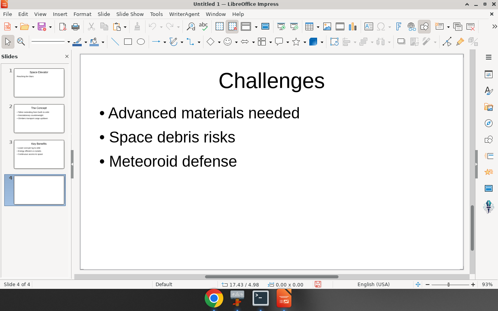
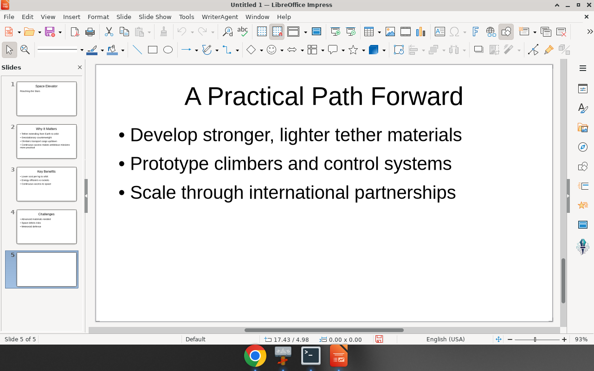
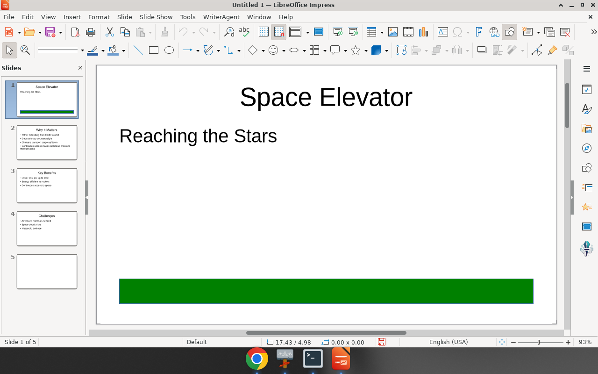

# Impress AI headed findings: `inception/mercury-2.5` (space elevator)

**Status:** Findings only — no product fix in this PR  
**Date:** 2026-09-16  
**Verdict:** **MIXED**  
**Related:** [impress-specialized-toolsets.md](impress-specialized-toolsets.md)

Exploratory headed play (not a formal eval harness). Goal was to see whether Impress chat on tip does a good job with a fast/cheap model, and where tools vs prompts vs model limits show up.

---

## Setup

| Item | Value |
|------|--------|
| Tip | `a3e0b2a1` (master after #778) |
| Extension | WriterAgent **debug** deploy (`make deploy`) |
| Model | **`inception/mercury-2.5` only** (OpenRouter; confirmed `used_model` in debug log) |
| Doc | New Impress presentation |
| Artifacts | `docs/draw/impress-ai-mercury-explore/` (shots below); full debug log kept on the box under `/workspace/impress-ai-explore/writeragent_debug.log` |

### Ops gotcha: LibreHarper + WriterAgent ChatPanel

With **LibreHarper** still installed alongside WriterAgent, opening the chat sidebar in Impress failed repeatedly:

```text
ChatPanel createContainerWindow returned no window
…/LibreHarper.oxt/Dialogs/ChatPanelDialog.xdl  exists=False
```

LO resolved the ChatPanel factory UI to the LibreHarper package path (no `ChatPanelDialog.xdl` there). Removing LibreHarper and keeping WriterAgent-only fixed the sidebar. Treat co-install ChatPanel ownership as a real footgun for headed Impress/Writer QA.

---

## Lead task

Ask chat to create a **multi-slide presentation about the space elevator**, then light follow-ups on the same deck (edit, structural add, one visual shape).

### Screenshots



*Fig. 1 — After create: title + concept/benefits/challenges style deck (4 slides visible).*


*Fig. 2 — Slide 2 retitled “Why It Matters” with an extra bullet (thumbnail lag vs canvas).*



*Fig. 3 — Structural follow-up (fifth slide / path-forward content in the run).*



*Fig. 4 — Visual ask: green rectangle on slide 1 via shapes specialist.*

---

## What worked

| Task | Result |
|------|--------|
| Create multi-slide deck from prompt | **OK** — coherent title + bullet slides on the space elevator |
| Edit existing slide (title / body / bullet) | **OK** after an off-by-one correction |
| Structural `add_slide` | **OK** — ended at 5 slides |
| Visual shape | **OK** — `delegate_to_specialized_draw_toolset(domain="shapes")` → `shape_upsert` create rectangle, green fill, on page 0 |
| Model identity | Confirmed `inception/mercury-2.5` on OpenRouter for chat + nested specialist calls |

Mercury was fast enough for interactive headed play and did call tools (not only chat prose) once the run was unstuck.

---

## What failed / friction

### 1. Placeholder roles with `available: []`

Repeated tool errors of the form:

```json
{"status": "error", "code": "TOOL_EXECUTION_ERROR",
 "message": "Placeholder 'title' not found.",
 "details": {"available": [], "tool_name": "set_placeholder_text", "doc_type": "impress"}}
```

Same pattern for `'body'`. Parallel `list_placeholders` often returned `count: 0` (or empty roles) until layout work / retries. The model then looped `set_placeholder_text` and `slide_layouts` delegate tasks.

**Code:** `plugin/draw/placeholders.py` (`list_placeholders`, `set_placeholder_text` — role lookup calls `_list_placeholders` and errors when role missing).  
**Layouts:** specialized domain `slide_layouts` via `plugin/draw/transitions.py` (`set_slide_layout` / `get_slide_layout`).  
**Add slide:** `plugin/draw/pages.py` (`add_slide`).

### 2. Slide / page index confusion

Off-by-one and “edit the wrong slide” behavior showed up in the headed run (agent report + thumbnail vs canvas mismatch in Fig. 2). Prompt/tool surface mixes conventions:

- Many Draw tools: **0-based** `page`
- `get_image`: **1-based** `page=N` (called out in [impress-specialized-toolsets.md](impress-specialized-toolsets.md) and the Draw system prompt)

Mercury recovered, but burned turns.

### 3. Blank-ish / layout-incomplete slides

At least one slide looked empty in the pane / thumbnail while content existed elsewhere; layout reassignment was attempted when placeholders were missing. Default “add then fill by role” is fragile if the new page is not a title+body layout.

### 4. Model limits

- **No vision** for this model (`ModelCapability.NONE` in log) — `get_image` page renders are not useful for mercury-2.5.
- Initial turn sometimes answered generically before committing to tools (prompt already says “do not explain — do the operation”; still happened once).
- Prompt markets “polished, professional, and colorful” (`DEFAULT_DRAW_CHAT_SYSTEM_PROMPT_TEMPLATE` in `plugin/framework/prompts.py`) but the successful path was plain title + bullets + one rectangle — expectation mismatch more than a hard failure.

### 5. Stability note

No SEGV in the successful session. Early `UnoObjectError` storm was the LibreHarper ChatPanel path, not an Impress tool crash. No `assert_main_thread` fail observed as a sign-off blocker for the successful deck work.

---

## Diagnosis: tools vs prompts vs model

| Layer | Assessment |
|-------|------------|
| **Tools** | Core set is enough for create / edit / add / shapes. Weak spot is **placeholder discovery + layout coupling**: role-based `set_placeholder_text` fails hard when the slide has no named placeholders yet (`available: []`). |
| **Prompts** | Draw/Impress prompt lists tools and says verify `status='error'`, but does not hard-steer “always `list_placeholders` → use **index** if roles empty; set layout before fill.” “Colorful” steers ambition without a default visual recipe. |
| **Model (mercury-2.5)** | Adequate tool caller for this scoped play; weak at index/layout recovery; no vision. Not the main blocker vs placeholder/layout brittleness. |

---

## Possible solutions (detailed — options, not a mandate)

Each item is written so a later implementer can pick it up without re-deriving the headed run. Prefer small PRs; Keith will cut.

---

### A. Default layout on `add_slide` (tool behavior)

**Problem**

After `add_slide`, mercury immediately called `set_placeholder_text` with `role: "title"` / `"body"`. Tools returned:

```json
{"status": "error", "code": "TOOL_EXECUTION_ERROR",
 "message": "Placeholder 'title' not found.",
 "details": {"available": [], "tool_name": "set_placeholder_text", "doc_type": "impress"}}
```

Same for `'body'`. Concurrent `list_placeholders` often reported `"count": 0` / empty list. The model then delegated `slide_layouts` repeatedly (“reassign text layout to slide N”) and re-tried `set_placeholder_text`, burning turns before content stuck.

**Where**

- `plugin/draw/pages.py` — `AddSlide.execute` → `DrawBridge.create_slide(...)` (no layout argument today; description is only “Inserts a new slide at index”)
- `plugin/draw/transitions.py` — `set_slide_layout` / `get_slide_layout`; layout name `"text"` (and peers) already exist in `_LAYOUTS` / `_LAYOUT_NAMES`
- Downstream consumer: `plugin/draw/placeholders.py` — `set_placeholder_text` / `_find_placeholder` / `_list_placeholders`

**Proposed change (concrete)**

1. Extend `add_slide` parameters with optional `layout` (string, Impress-only; default for PresentationDocument something like `"text"` — title + body outline — **or** `"title"` for title-only if that matches LO’s title layout ID better; pick one after checking `_LAYOUTS` on tip).
2. After `create_slide`, if doc is Impress and layout is set (including the new default), set `page.Layout = _LAYOUTS[layout_name]` the same way `SetSlideLayout.execute` does.
3. Return in the tool result: `{"status":"ok","active_page_index":N,"layout":"text","placeholders_hint":"call list_placeholders on this page"}` so the model sees the layout was applied.
4. Keep an explicit escape hatch: `layout: "blank"` (or `layout: null` / `"none"`) to preserve today’s blank-page behavior for draw-heavy asks.

**Why this vs alternatives**

- Fixes the failure **before** the first `set_placeholder_text`, so prompt-only steers (B) are less load-bearing.
- Reuses the existing layout map in `transitions.py` instead of inventing a second layout system.
- Cheaper than teaching every model to always delegate `slide_layouts` first.

**Risk / tradeoff**

- Callers who expect a blank canvas after `add_slide` must pass `layout: "blank"`.
- Layout name strings must stay aligned with `_LAYOUTS` across LO versions (already a `set_slide_layout` concern).
- Draw documents must ignore `layout` (tool already shared Drawing+Presentation).

**Before / after tool sequence**

Before (observed pattern):

```text
add_slide()
set_placeholder_text(role=title, text=...)  → error available=[]
set_placeholder_text(role=body, text=...)   → error available=[]
delegate(slide_layouts, "assign text layout…")
list_placeholders / set_placeholder_text × N
```

After (intended):

```text
add_slide()                    → ok, layout=text, active_page_index=k
list_placeholders(page=k)      → indices/roles present
set_placeholder_text(role=title|body | index=…) → ok
```

---

### B. Prompt + tool-description steer (no default behavior change)

**Problem**

Same placeholder errors as A. The Draw/Impress system prompt (`DEFAULT_DRAW_CHAT_SYSTEM_PROMPT_TEMPLATE` in `plugin/framework/prompts.py`) already says “VERIFY … status='error'” and lists `list_placeholders` / `set_placeholder_text`, but does **not** say:

- always list before set-by-role;
- if `available` is empty, set layout then retry;
- prefer **index** when roles are missing;
- remind 0-based `page` vs 1-based `get_image`.

Mercury still looped role-based sets.

**Where**

- `plugin/framework/prompts.py` — `DEFAULT_DRAW_CHAT_SYSTEM_PROMPT_TEMPLATE` (WRITE / WORKFLOW bullets ~tools list)
- Tool `description` strings in `plugin/draw/placeholders.py` (`ListPlaceholders`, `SetPlaceholderText`, `GetPlaceholderText`)
- Optionally one line in `plugin/draw/pages.py` `AddSlide.description`

**Proposed change (concrete)**

Add a short WORKFLOW bullet block, roughly:

```text
IMPRESS TEXT FILLS:
1. Prefer list_placeholders(page=N) before set_placeholder_text.
2. If count=0 or set_placeholder_text returns available=[], call
   delegate_to_specialized_draw_toolset(domain="slide_layouts",
     task="set layout 'text' on page N") then list_placeholders again.
3. If roles are missing but indices exist, set_placeholder_text(index=i, text=…).
4. page on these tools is 0-based; get_image page= is 1-based.
```

Tighten tool descriptions similarly, e.g. `set_placeholder_text`: “Prefer index from list_placeholders when role lookup fails; empty available means wrong layout, not a missing argument.”

**Why this vs alternatives**

- Zero runtime behavior change; safe first experiment.
- Documents the recovery path the headed run eventually stumbled into.
- Does not replace A if models ignore instructions (mercury sometimes did).

**Risk / tradeoff**

- Prompt size grows (Draw prompt is already long).
- Models can still ignore steers; empty layouts remain possible without A/C.
- Over-steering may push unnecessary `slide_layouts` delegates when roles already work.

**Before / after**

Before: model assumes `role=title` always works on a fresh slide.  
After: model’s first write path is list → (optional layout) → set by role or index.

---

### C. Richer `set_placeholder_text` errors + optional shape fallback (tool)

**Problem**

Error payload was:

```text
Placeholder 'title' not found.   details.available = []
```

That is true but **not actionable**: it does not say “slide has no presentation placeholders; try set_slide_layout('text')” or “shapes exist as TitleTextShape/OutlinerShape — use index / get_draw_tree.” In the successful run’s document snapshot, content often appeared as `TitleTextShape` / `OutlinerShape` even when role lookup failed — `_list_placeholders` only includes shapes with `getString`, and role tagging depends on `ClassName` patterns in `_PLACEHOLDER_ROLES`.

**Where**

- `plugin/draw/placeholders.py`
  - `_find_placeholder` / `_list_placeholders` / `_PLACEHOLDER_ROLES`
  - `SetPlaceholderText.execute` error branch (~line 213): `return self._tool_error("Placeholder '%s' not found." % role, available=_list_placeholders(page))`

**Proposed change (concrete)** — two tiers; implement one or both:

**C1 — Error shape only (safer)**

When role miss and `available` empty, return e.g.:

```json
{
  "status": "error",
  "code": "TOOL_EXECUTION_ERROR",
  "message": "Placeholder 'title' not found on this slide.",
  "details": {
    "available": [],
    "hint": "Slide may lack a text layout. Call set_slide_layout (or delegate domain=slide_layouts) with layout='text', then list_placeholders.",
    "suggest_layout": "text",
    "shape_text_count": 0,
    "tool_name": "set_placeholder_text"
  }
}
```

If `_list_placeholders` is empty but `get_draw_tree`-style text shapes exist, include `fallback_indices: [{index, class, name}]` in details (read-only hint, no write).

**C2 — Optional write fallback (more aggressive)**

New parameter `fallback: "none"|"text_shapes"` (default `"none"`). When role miss and fallback enabled (or always for chat caller), write to first/second text shape by the same positional heuristic already in `_find_placeholder` strategy 3 — but only if those shapes exist. Or map `TitleTextShape` → title, `OutlinerShape` → body by `ClassName` even when not tagged as PresObj roles.

**Why this vs alternatives**

- C1 makes B’s recovery path obvious in the tool result the model already checks.
- C2 matches how Impress often stores text after partial layout (shapes without clean role tags).
- Complements A: A prevents empty layouts; C handles leftover blank/wrong-layout slides.

**Risk / tradeoff**

- C2 can overwrite the wrong text box on complex slides (logos, footers).
- Expanding `_PLACEHOLDER_ROLES` / ClassName matching needs unit tests against real Impress pages.
- Larger error payloads increase token use slightly.

**Before / after**

Before: `available: []` → model retries same role call.  
After (C1): error names `suggest_layout` → one layout call → list → set.  
After (C2): role miss still writes outline/title shape when present → fewer layout round-trips.

---

### D. Index hygiene (schemas + prompt + catalog)

**Problem**

Headed run showed off-by-one / wrong-slide edits (edit intended slide 2, wrong active page; thumbnail vs canvas lag). Model-facing text mixes:

- Most Draw/Impress tools: **`page` = 0-based** (`list_pages`, `add_slide`, `set_placeholder_text`, `get_draw_tree`, shapes `page`, …)
- `get_image`: **`page=N` is 1-based** (first page is 1) — already noted in `docs/draw/impress-specialized-toolsets.md` and the Draw prompt

Mercury has no vision, so `get_image` was less used, but index confusion still hit `set_placeholder_text` / `set_active_page` / specialist `page` args (shapes specialist was told active index 4 while creating on page 0 for the green box — that part was intentional, but the mismatch in prompt context is easy to misread).

**Where**

- Parameter descriptions on tools in `plugin/draw/*.py` and `plugin/writer/get_image.py` (or image tool module)
- `plugin/framework/prompts.py` Draw template TOOLS list
- Human catalog: `docs/draw/impress-specialized-toolsets.md` §2.1

**Proposed change (concrete)**

1. Standardize every `page` description to start with either `0-based slide/page index` or `1-based page number (get_image only)`.
2. In the Draw system prompt TOOLS section, one bold line: “Unless a tool says 1-based, page is 0-based. `get_image` page is 1-based.”
3. Optional non-breaking alias later: accept `page_1based` only on `get_image` — **do not** rename `page` on core tools in a first pass (too much churn).

**Why this vs alternatives**

- Cheapest fix for a class of wrong-slide edits.
- Does not require API renames if limited to description/prompt text.

**Risk / tradeoff**

- Description-only fixes are soft; models still err.
- Renaming parameters would break existing evals/prompts — avoid unless intentional versioning.

**Before / after**

Before: model treats “slide 2” as `page=2` (third slide).  
After: descriptions + prompt make “slide 2 → page=1” explicit; fewer wrong `set_placeholder_text` targets.

---

### E. ChatPanel XDL / factory ownership when LibreHarper co-installed (framework)

**Problem**

With LibreHarper + WriterAgent both installed, opening the Impress chat sidebar failed in a loop:

```text
[RICH-LIFECYCLE] createContainerWindow returned no window
url=…/LibreHarper.oxt/Dialogs/ChatPanelDialog.xdl
xdl_path=… exists=False
UnoObjectError: ChatPanel createContainerWindow returned no window
```

Factory URL resolved into the **LibreHarper** uno package tree, which has no `ChatPanelDialog.xdl`. WriterAgent’s copy exists at `…/WriterAgent.oxt/Dialogs/ChatPanelDialog.xdl`. Removing LibreHarper fixed the sidebar.

**Where**

- `plugin/chatbot/panel_factory.py` — `XDL_PATH = "Dialogs/ChatPanelDialog.xdl"`, `ChatPanelFactory`, `ChatPanelElement.getRealInterface` (raises the UnoObjectError above)
- Extension registration / `get_extension_url` (or equivalent) used to resolve XDL against the **active** package id
- LibreHarper slim OXT build (`scripts/build_libreharper_oxt.py` / manifest) — may still register overlapping UI element factory IDs or share implementation names

**Proposed change (concrete)** — pick one primary guard:

1. **Resolve XDL via WriterAgent extension id always** for ChatPanel (pin `org.extension.writeragent` when locating `Dialogs/ChatPanelDialog.xdl`), ignoring which package won factory registration; or
2. **LibreHarper must not register `ChatPanelFactory` / WriterAgentDeck UI** — strip those from the Harper manifest so only WriterAgent owns the sidebar; or
3. Ship a stub `ChatPanelDialog.xdl` in LibreHarper that redirects/errors clearly (weakest).

Also: log the resolved extension id + absolute XDL path at WARNING when `createContainerWindow` returns null (makes the next co-install failure obvious in `writeragent_debug.log`).

**Why this vs alternatives**

- Unblocks headed Impress/Writer QA when both products are installed (common on this box during Harper + WA work).
- Orthogonal to placeholder quality but was a hard blocker before the space-elevator run.

**Risk / tradeoff**

- Pinning WriterAgent id breaks a hypothetical Harper-only chat UI if that ever ships.
- Manifest stripping must stay in the LibreHarper build so it does not regress.

**Before / after**

Before: co-install → sidebar dead → no Impress AI.  
After: sidebar loads WriterAgent XDL regardless of Harper presence (or Harper simply does not claim ChatPanel).

---

### F. Model choice for visual / layout QA (process, not code)

**Problem**

Log showed `has_native_vision: model='inception/mercury-2.5' … vision=False`. Prompt advertises `get_image` for layout verification; mercury cannot use those PNGs. Visual quality stayed “title + bullets + one rectangle” despite “polished, colorful” prompt wording.

**Where**

- Process / eval choice (OpenRouter model id)
- Prompt claim in `DEFAULT_DRAW_CHAT_SYSTEM_PROMPT_TEMPLATE` about `get_image`
- Optional: UI model picker defaults for Impress sessions

**Proposed change (concrete)**

- Keep **mercury-2.5** for cheap structural smoke (create/edit/add_slide).
- For polish / layout verification headed passes, use a **vision-capable** model and actually call `get_image(page=N)` after edits.
- Optionally soften the Draw prompt when the selected model has no vision: omit or gate the `get_image` bullet (needs a small prompt assembly hook — only if worth it).

**Why this vs alternatives**

- Does not fix placeholder bugs; avoids false expectations that mercury will “see” slides.
- Matches the tool surface already documented in impress-specialized-toolsets.md.

**Risk / tradeoff**

- Higher cost for vision models.
- Two-model workflow is easy to forget in casual play.

---

### Suggested cut order (still Keith’s call)

1. **A or C1** — stop empty-placeholder death spirals (behavior or actionable errors).  
2. **B** — cheap steer aligned with A/C.  
3. **D** — index description hygiene.  
4. **E** — co-install ChatPanel (ops/framework).  
5. **F** — when judging visual quality, don’t use mercury alone.  
6. **C2** — only if A+B+C1 still leave TitleTextShape/OutlinerShape gaps.

No mega-PR implied.

## Code map (quick)

| Concern | Path |
|---------|------|
| Placeholder list/get/set | `plugin/draw/placeholders.py` |
| add/delete/list slides | `plugin/draw/pages.py` |
| Draw/Impress system prompt | `plugin/framework/prompts.py` (`DEFAULT_DRAW_CHAT_SYSTEM_PROMPT_TEMPLATE`) |
| Specialized gateway | `plugin/draw/specialized.py` |
| Shapes | `plugin/draw/shapes.py` |
| Layouts / transitions | `plugin/draw/transitions.py` |
| Tool catalog (human) | `docs/draw/impress-specialized-toolsets.md` |

---

## Out of scope for this PR

- No product code changes
- No issue close keywords
- No formal GDPval / string-harness Impress suite

