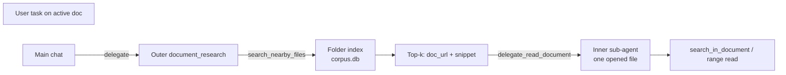
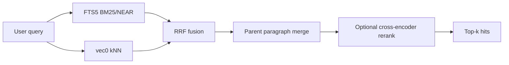
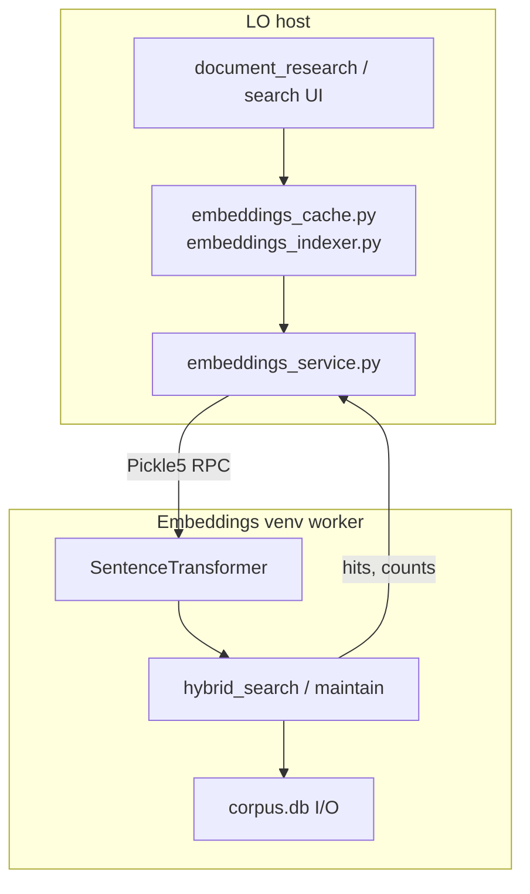

# Cross-file search (embeddings and hybrid retrieval)

> **Status (2026-06):** **Shipped** — unified **`corpus.db`** + sqlite-vec (schema v3) with **hybrid FTS + semantic search** (RRF fusion). Default embedding model: **`paraphrase-multilingual-MiniLM-L12-v2`**. Cross-file search is **off by default**; enable **Embeddings + FTS** in **Settings → Vector Search**.

**Related:** [enabling_numpy_in_libreoffice.md](enabling_numpy_in_libreoffice.md) · [multi-document-dev-plan.md](multi-document-dev-plan.md) · [cython-extension.md](cython-extension.md)

---

## Overview

WriterAgent can index the **sibling files in your document folder** and answer “which file has this?” without opening every `.odt`, `.ods`, or `.docx` in the directory.

When **Cross-file search** is enabled, retrieval is **hybrid**: every query runs **keyword search (FTS5 BM25/NEAR)** and **semantic vector search** in parallel, then **Reciprocal Rank Fusion (RRF)** merges the ranked lists. Users and agents call **`search_nearby_files` once** — there is no per-query choice between grep and embeddings.

When Cross-file search is **Off**, the `document_research` agent uses **`grep_nearby_files`** for discovery instead. That is a **settings** choice, not a routing decision inside a single search.

The index lives beside your documents (not in the LibreOffice profile):

```text
/home/user/projects/reporting/          ← document folder
  Budget.odt
  Notes_v3.odt
  writeragent_embeddings/
    corpus.db                            # chunks + FTS5 + vec0 + incremental state
    corpus_meta.json                     # model, dim, chunk_count, updated_at
```

**Linux example:** `~/Desktop/Writing/writeragent_embeddings/` when working in `~/Desktop/Writing/`.

---

## User guide

### Turning it on

1. **Settings → Python** — set **Python venv path** and install packages (see [Venv setup](#local-embedders-mvp) and [enabling_numpy_in_libreoffice.md](enabling_numpy_in_libreoffice.md)).
2. **Settings → Vector Search** — set **Cross-file search** to **Embeddings + FTS** ([`plugin/embeddings/module.yaml`](../plugin/embeddings/module.yaml)).
3. Optional: change **Embedding Model** or enable **Enable cross-file rerank** (second-stage cross-encoder; off by default).

The first search may return **“index building in the background — retry shortly.”** Background indexing catches up within minutes.

### Search Nearby Files menu

**WriterAgent → Search Nearby Files…** opens a modeless dialog ([`search_ui.py`](../plugin/embeddings/search_ui.py), [`SearchDialog.xdl`](../extension/WriterAgentDialogs/SearchDialog.xdl)) that runs the same hybrid path as the agent tool. It shows cache status, ranked hits, and a **Rebuild** button to cold-reindex the folder.

### What gets indexed

Same extensions as `list_nearby_files` / maintain ([`embeddings_fs.py`](../plugin/embeddings/embeddings_fs.py)):

| Family | Extensions |
|--------|------------|
| ODF | `.odt`, `.ods`, `.odp`, `.odg`, `.ots`, `.fods`, … |
| OOXML | `.docx`, `.xlsx`, `.pptx` |
| Legacy binary | `.doc`, `.xls`, `.ppt` (headless `soffice --convert-to` → temp ODF) |
| Plain | `.csv`, `.txt`, `.rtf` |

**PDF** is not indexed yet.

### Untitled documents

When the active document has no `file://` URL, the listing root is LibreOffice **My Documents** (Tools → Options → Paths → **Work**). That applies to search, rebuild, and `list_nearby_files`.

### Disk use

Vector storage scales with chunk count × embedding dimension:

```text
vector_bytes ≈ num_chunks × dim × 4   (float32)
```

Default 384-dim models → **~1.5 KiB per chunk** plus FTS text in `corpus.db`. Example: 349 paragraphs ≈ **0.5 MiB** vectors ([Index size](#index-size-growth)).

### Resetting the cache

Delete `<folder>/writeragent_embeddings/` and reopen a document in that folder (or use **Rebuild** in the search dialog). The next maintain pass cold-builds the index.

### Limitations

| Limit | Detail |
|-------|--------|
| **Scope** | One folder per query — no cross-directory search |
| **Staleness** | Index may lag edits by a few minutes (periodic refresh) |
| **Venv** | Local `sentence-transformers` + `sqlite-vec` required for default hybrid mode |
| **Experimental backends** | LlamaIndex, Zvec, LanceDB need extra pip packages — see [Appendices](#appendix-a-llamaindex-backend) |

---

## Agent workflows {#primary-use-case-outer-document_research-replaces-grep}

Cross-file search powers the **`document_research`** specialized sub-agent (delegated from main chat, Writing plan, and Brainstorming). **Librarian mode** does not use embeddings — it is onboarding-only ([`librarian.py`](../plugin/chatbot/librarian.py)).

### Two-tier design



**Outer tier** discovers which sibling file(s) matter. **Inner tier** reads the opened file with precise tools (`search_in_document`, `get_document_content`, Calc ranges, etc.). The index is a **router**, not a document store.

### Tool matrix {#search-mode-flag}

Controlled by [`filter_document_research_discovery_tools`](../plugin/doc/document_research.py):

| `embeddings.folder_search_mode` | Discovery | Always available |
|--------------------------------|-----------|------------------|
| **`none` (Off, default)** | `grep_nearby_files` | `list_nearby_files`, `delegate_read_document` |
| **`hybrid`** (Embeddings + FTS) | `search_nearby_files` | same |
| **`llama_index`** | `search_nearby_files` | same |
| **`zvec`** (experimental) | `search_nearby_files` | same |
| **`lancedb`** (experimental) | `search_nearby_files` | same |

Workflow hints ([`get_document_research_workflow_hint`](../plugin/doc/document_research.py)):

- **Off:** `list_nearby_files` → `grep_nearby_files` → `delegate_read_document`
- **Index on:** `list_nearby_files` → `search_nearby_files` → `delegate_read_document` → inner `search_in_document` on snippet or topic

`search_embeddings` is a legacy hidden tool; use `search_nearby_files`.

### Search hit shape {#search-hit-shape}

`search_nearby_files` returns:

```json
{"doc_url": "file:///…/notes.odt", "score": 0.85, "snippet": "…passage…", "para_index": 12}
```

- **`snippet`** — for multi-chunk paragraphs, the **full ODF paragraph** (sibling sub-chunks merged by `para_index`); otherwise the embedded chunk from `chunks.body` (up to 512 characters).
- **`para_index`** — weak hint (ODF extract ordinal). **Do not** treat as an exact LibreOffice jump target.
- **`char_start` / `char_end`** — stored internally only; not returned in hits.

After a hit, the inner agent should **`search_in_document`** for the snippet text or query topic — not blind offset reads.

---

## Product rationale (PMs)

### The problem

The expensive case is **many documents in one folder**, not one open file.

Without an index, the outer `document_research` agent lists siblings, guesses filenames from vague language, opens candidates, and greps each one. That is slow, token-heavy, and weak on paraphrase (“remote work policy” vs “WFH guidelines” in `Notes_v3.odt`).

### Why office documents differ from code {#why-embeddings-semantic-search-vs-pure-lexicalgrep-and-why-the-difference-is-bigger-for-office-documents-than-code}

- **Code** is literal and structured — function names, symbols, and `grep` are usually enough. Paraphrase is rare.
- **Office documents** (Writer prose, Calc labels, policy files, research notes) use natural language, unhelpful filenames, and varied wording for the same idea.

WriterAgent’s ODF files are ZIP archives; opening and grepping every sibling repeats unzip + XML parse cost. A folder index ranks files **before** that cost. Industry pattern for large corpora: **combine keyword and semantic retrieval** — which is exactly what hybrid RRF does.

### What hybrid solves

| Query style | Example | Hybrid behavior |
|-------------|---------|-----------------|
| Short keywords | `grammar`, `MCP`, `web search` | FTS leg recalls literal matches |
| Paraphrase | `proofreader called back by linguistic subsystem` | Vector leg recalls meaning |
| Both agree (`matched_by`: fts + vec) | Distinctive topic | High-confidence file routing |

Users do **not** choose grep vs vectors per query when hybrid is on — both legs always run.

### Explicit non-goals

| Not this | Why |
|----------|-----|
| Sidebar chat history | Separate SQLite (`writeragent_history.db`) |
| In-document search replacement | `search_in_document`, outline, sheet nav stay primary inside one file |
| Global machine-wide index | One cache per document **directory** only |
| Optional in-document RAG on send | Secondary future idea ([Within-document retrieval](#within-document-retrieval-secondary)) |

---

## How hybrid search works



### Pipeline (default `hybrid` backend)

1. **Encode query** — `SentenceTransformer` in the embeddings venv ([`embeddings_index.py`](../plugin/embeddings/venv/embeddings_index.py)).
2. **FTS leg** — BM25 + optional `NEAR` on FTS5 `passages` ([`folder_fts.py`](../plugin/embeddings/venv/folder_fts.py)).
3. **Vector leg** — sqlite-vec `MATCH` on `vec_chunks_<model_slug>` ([`embeddings_search_graph.py`](../plugin/embeddings/venv/embeddings_search_graph.py)).
4. **RRF fusion** — vendored reciprocal rank fusion ([`hybrid_rrf.py`](../plugin/embeddings/venv/hybrid_rrf.py), from [liamca/sqlite-hybrid-search](https://github.com/liamca/sqlite-hybrid-search)).
5. **Parent merge** — widen snippets to full paragraph ([`embeddings_parent_hits.py`](../plugin/embeddings/venv/embeddings_parent_hits.py)).
6. **Optional rerank** — cross-encoder when **Enable cross-file rerank** is on ([`embeddings_cross_encoder_rerank.py`](../plugin/embeddings/venv/embeddings_cross_encoder_rerank.py)).

**Retrieval pool** ([`hybrid_retrieval_pool.py`](../plugin/embeddings/venv/embeddings_retrieval_pool.py)): over-fetch `min(max(k×4, 20), 50)` before fusion truncate / rerank — shared across hybrid backends.

**No chat LLM in retrieval.** The sidebar model only sees the final hit list after search completes.

Implementation: [`embeddings_hybrid_search.py`](../plugin/embeddings/venv/embeddings_hybrid_search.py), host RPC [`embeddings_service.hybrid_search`](../plugin/framework/client/embeddings_service.py), tool [`document_research_fts_tool.py`](../plugin/embeddings/document_research_fts_tool.py).

---

## Settings reference

From [`plugin/embeddings/module.yaml`](../plugin/embeddings/module.yaml) (**Vector Search** tab):

| Config key | UI label | Default | Notes |
|------------|----------|---------|-------|
| `embeddings.folder_search_mode` | Cross-file search | `none` (Off) | `hybrid`, `llama_index`, `zvec`, `lancedb` |
| `embeddings.embedding_model` | Embedding Model | `paraphrase-multilingual-MiniLM-L12-v2` | HuggingFace id (local provider) |
| `embeddings.folder_rerank_enabled` | Enable cross-file rerank | `false` | Cross-encoder after RRF |
| `embeddings.folder_rerank_model` | Rerank model | `cross-encoder/ms-marco-MiniLM-L-6-v2` | Or `BAAI/bge-reranker-v2-m3` (~2.3 GB) |

**LlamaIndex** (`llama_index`) reuses the same `corpus.db` and tool surface as hybrid but runs stock `QueryFusionRetriever` + optional `SentenceTransformerRerank` — see [Appendix A: LlamaIndex backend](#llamaindex-option) for design, eval commands, and Phase 2 roadmap.

**Zvec** (`zvec`) replaces the sqlite hybrid **storage and query engine** with Alibaba’s in-process vector DB — separate `writeragent_embeddings/zvec/` store, side-by-side with `corpus.db`. See [Appendix B: Zvec backend](#zvec-backend) for design, comparison to LlamaIndex, eval, and roadmap.

`embedding_provider` in [`config.py`](../plugin/framework/config.py) defaults to `local` — only local `sentence-transformers` is implemented today. HTTP embed APIs are deferred ([Appendix D](#appendix-d-historical-notes)).

When any index mode is on, background maintain builds **FTS + vectors** in one store ([`embeddings_indexer.py`](../plugin/embeddings/embeddings_indexer.py)).

---

## Architecture for developers



### Host vs venv boundary {#why-numpy-stays-in-the-venv}

NumPy, **sqlite-vec**, and **sentence-transformers** run **only in the user venv subprocess** ([`PythonWorkerManager`](../plugin/scripting/venv_worker.py)). LibreOffice’s embedded Python stays stdlib — no 50–100 MB science stack in the OXT. See [enabling_numpy_in_libreoffice.md](enabling_numpy_in_libreoffice.md).

| Layer | Responsibility |
|-------|----------------|
| **Host** | Folder keys, cache paths, enqueue maintain, heartbeat RPC, `corpus_meta.json` orchestration |
| **Venv (trusted modules)** | Batch embed, sqlite-vec DML, LangGraph ingest/search, hybrid RRF — **outside** the LLM AST sandbox |

Trusted stubs bypass the sandbox via [`venv_sandbox.py`](../plugin/scripting/venv_sandbox.py) (`_is_trusted_embeddings_stub`).

### Dedicated embeddings subprocess {#dedicated-embeddings-subprocess}

Embeddings use **`WORKER_POOL_EMBEDDINGS`** — a second warm venv child isolated from Calc `=PYTHON()` and chat scripts. Long folder re-embed jobs do not block user NumPy work.

| Pool | Use |
|------|-----|
| `WORKER_POOL_DEFAULT` | Calc, chat `run_venv_python_script` |
| `WORKER_POOL_EMBEDDINGS` | Folder maintain, `search_nearby_files`, Search dialog |

Same `scripting.python_venv_path`; timeout from `embeddings_worker_timeout_sec` (120 s).

### Background indexer {#background-folder-indexer}

Indexing runs on a **background maintenance worker** — not inside the agent tool loop.

| Trigger | Source |
|---------|--------|
| **Periodic tick** | Every 300 s for active doc’s folder ([`embeddings_periodic.py`](../plugin/embeddings/embeddings_periodic.py)) |
| **document_research start** | [`specialized_base.py`](../plugin/doc/specialized_base.py) |
| **Empty/stale cache on search** | [`document_research_fts_tool.py`](../plugin/embeddings/document_research_fts_tool.py) |

One job per folder key (`_inflight` guard in [`embeddings_indexer.py`](../plugin/embeddings/embeddings_indexer.py)).

| Mode | When | Work |
|------|------|------|
| **Cold build** | No cache or model changed | Index all siblings |
| **Incremental** | Cache exists | mtime vs `last_indexed_at` → `content_hash` diff → embed changed chunks only |

Ingest batches: **`EMBEDDINGS_INGEST_BATCH_SIZE`** (64) chunks per embed window ([`embeddings_ingest_graph.py`](../plugin/embeddings/venv/embeddings_ingest_graph.py)).

`search_nearby_files` **never blocks** on embed completion — it reads whatever is on disk and enqueues maintain if needed.

### Module map

| Module | Role |
|--------|------|
| [`embeddings_cache.py`](../plugin/embeddings/embeddings_cache.py) | Folder keys, paths, legacy store removal |
| [`embeddings_indexer.py`](../plugin/embeddings/embeddings_indexer.py) | Background enqueue + `_inflight` guard |
| [`embeddings_fs.py`](../plugin/embeddings/embeddings_fs.py) | Folder scan + ODF/OOXML extract (no UNO) |
| [`embeddings_folder_maintain.py`](../plugin/embeddings/venv/embeddings_folder_maintain.py) | Cold/incremental maintain loop |
| [`embeddings_periodic.py`](../plugin/embeddings/embeddings_periodic.py) | Periodic folder tick |
| [`document_research_fts_tool.py`](../plugin/embeddings/document_research_fts_tool.py) | `search_nearby_files` tool |
| [`embeddings_hybrid_search.py`](../plugin/embeddings/venv/embeddings_hybrid_search.py) | Hybrid corpus search |
| [`embeddings_sqlite.py`](../plugin/embeddings/venv/embeddings_sqlite.py) | `corpus.db` schema |
| [`embeddings_ingest_graph.py`](../plugin/embeddings/venv/embeddings_ingest_graph.py) | LangGraph: split → embed → upsert |
| [`embeddings_search_graph.py`](../plugin/embeddings/venv/embeddings_search_graph.py) | LangGraph: vec0 retrieve → MMR (vec-only) |
| [`embeddings_index.py`](../plugin/embeddings/venv/embeddings_index.py) | Venv RPC facades |
| [`embeddings_service.py`](../plugin/framework/client/embeddings_service.py) | Host index/search/stats RPC |
| [`embedding_client.py`](../plugin/framework/client/embedding_client.py) | Host `embed_texts()` RPC |

---

## Index and storage {#corpus-storage}

### Corpus cache layout {#corpus-cache-layout}

**One `writeragent_embeddings/` per document directory**, beside the files — never per open document, never one global profile cache.

| File | Contents |
|------|----------|
| **`corpus.db`** | `chunks`, FTS5 `passages`, `vec_chunks_<model_slug>`, `indexed_files`, `indexed_paragraphs`, `model_metadata` |
| **`corpus_meta.json`** | `schema_version`, `embedding_model`, `dim`, `chunk_count`, `storage_backend`, `updated_at` |

Experimental backends use side-by-side stores: `writeragent_embeddings/zvec/` or `lancedb/` — `corpus.db` remains untouched when flipping modes.

### Multi-model isolation

`corpus.db` supports multiple embedding models concurrently:

1. **Shared `chunks` table** — paragraph text stored once.
2. **Per-model `vec_chunks_<model_slug>`** — isolated vector tables.
3. **`model_metadata`** — dimension and last update per model.
4. **Relative expiry** — models more than 7 days older than the active model are dropped + `VACUUM` during ingest.

Changing **Embedding Model** in Settings triggers a **cold rebuild** for that folder.

### Schema (vec0 path)

```sql
CREATE TABLE chunks (
  chunk_id INTEGER PRIMARY KEY,
  doc_url TEXT NOT NULL,
  para_index INTEGER NOT NULL,
  char_start INTEGER, char_end INTEGER,
  content_hash TEXT NOT NULL,
  file_mtime REAL, last_indexed_at REAL,
  embedding_model TEXT NOT NULL,
  body TEXT
);
CREATE VIRTUAL TABLE passages USING fts5(body, content='chunks', content_rowid='chunk_id');
CREATE VIRTUAL TABLE vec_chunks_<model_slug> USING vec0(
  chunk_id INTEGER PRIMARY KEY,
  embedding float[384]
);
```

Host opens `corpus.db` with stdlib `sqlite3` for locator/metadata; venv loads `sqlite_vec` for vec0 DML and search.

**Upgrade:** legacy `index.db` and separate `fts5.db` are deleted on first access; next maintain cold-builds into unified `corpus.db`.

### Folder FTS (unified) {#folder-fts}

Lexical leg: BM25 + FTS5 **`NEAR`** on `passages` — same `corpus.db`, stdlib `sqlite3` on host for orchestration, venv for search. No separate FTS database.

### Chunking {#chunking}

- **Index grain:** 512-character windows, 64 overlap ([`embeddings_split.py`](../plugin/embeddings/embeddings_split.py)) — vendored RecursiveCharacterTextSplitter logic.
- **Extract grain:** ODF paragraph, Calc row, Impress slide body ([`embeddings_fs.py`](../plugin/embeddings/embeddings_fs.py)).
- **Invalidation:** `content_hash` per paragraph ([Incremental maintenance](#incremental-updates)).

#### Index granularity {#index-granularity}

| Layer | Unit | Role |
|-------|------|------|
| Extract | Paragraph / row / slide | Stable `para_index`, `content_hash` |
| Index | Sub-paragraph chunks | Bi-encoder recall |
| Display | Parent paragraph merge | Full `snippet` without re-index |
| Precision | `search_in_document` in opened file | Exact wording in live LO |

**Embedding dilution** (multi-topic chunks): mitigated by hybrid FTS leg, wide retrieval pool, optional rerank, and the two-stage design (index routes → inner agent searches live doc).

#### Calc, OOXML, Impress {#calc-ods-indexing}

| Kind | Extract | `para_index` hint |
|------|---------|-------------------|
| `.ods` | [`embeddings_ods_extract.py`](../plugin/embeddings/venv/embeddings_ods_extract.py) — row per passage | Row index |
| `.xlsx`, `.docx`, `.pptx`, `.csv`, `.txt`, `.rtf` | [`embeddings_ooxml_extract.py`](../plugin/embeddings/venv/embeddings_ooxml_extract.py) etc. | Per extract rules |
| `.odp`, `.odg` | [`embeddings_odp_extract.py`](../plugin/embeddings/venv/embeddings_odp_extract.py) — slide + notes | Monotonic over passages |

### Incremental maintenance {#incremental-updates}

1. List siblings; compare file **mtime** vs `last_indexed_at`.
2. Skip unchanged files.
3. Extract → split → **`content_hash` diff** against `chunks`.
4. Embed and upsert **changed chunks only** (batch windows of 64).
5. **`mark_file_indexed`** when mtime bumped but hashes unchanged — avoids re-scan loops.

Live keystroke hooks (`XProofreading`) were considered and **not planned** — periodic background refresh is sufficient for cross-file discovery.

### Index size {#index-size-growth}

| Files (longdoc-sized) | Paragraphs | Vector data (384-dim) |
|----------------------|------------|------------------------|
| 1 | 349 | ~0.5 MiB |
| 10 | 3,490 | ~5 MiB |
| 100 | 34,900 | ~51 MiB |

768-dim models double vector storage. Incremental edits patch rows in place.

### Persistence summary {#minimal-index}

| Part | Size driver |
|------|-------------|
| `vec_chunks` (vec0) | `n × dim × 4` bytes |
| `chunks.body` + FTS `passages` | Indexed prose (duplicated for hybrid) |
| Locator rows | Tiny per chunk |

### Retrieval quality {#retrieval-quality}

**Shipped:** hybrid RRF → parent merge → optional cross-encoder rerank. Vec-only debug path: kNN → MMR.

**Future (not shipped):** configurable chunk size, heading-level parents, sentence-level index, contextual chunk prepends, sub-question retrieval — tune via [`eval_folder_search_routing.py`](../scripts/eval_folder_search_routing.py) before building.

---

## Operations and debugging

### Inspect a cache

```bash
python scripts/dump_embeddings_cache.py ~/Desktop/Writing
python scripts/dump_embeddings_cache.py --limit 20 --doc-url file:///path/to/doc.odt
```

### Search offline (same path as in-app)

```bash
.venv/bin/python scripts/search_embeddings_folder.py "your query"
.venv/bin/python scripts/search_embeddings_folder.py "topic" --folder ~/Desktop/Writing --k 10 --json
```

**Single-leg debug** (engineering only — production uses hybrid):

```bash
.venv/bin/python scripts/search_embeddings_folder.py --fts "grammar checker"
.venv/bin/python scripts/search_embeddings_folder.py --vec "remote work policy"
```

### Build / rebuild

```bash
.venv/bin/python scripts/index_embeddings_folder.py ~/Desktop/Writing
```

### Venv diagnostics

Settings → **Python Test** and [`venv_diagnostics.py`](../plugin/scripting/venv_diagnostics.py) report `sqlite_vec`, `llama_index`, `zvec`, `lancedb` availability in the configured venv.

**Minimum install:**

```bash
pip install numpy sentence-transformers sqlite-vec langgraph langchain-core langchain-text-splitters envwrap odfpy pandas openpyxl xlrd python-docx
```

See [`EMBEDDINGS_VENV_PIP_INSTALL`](../plugin/embeddings/venv/embeddings_index.py) for the canonical one-liner. [Installing sqlite-vec](#installing-sqlite-vec) if `sqlite_vec.load()` fails.

---

## Evaluation reference {#performance-embeddings-vs-grep}

> **Historical note:** Early benchmarks compared **grep-only** vs **vector-only** file routing and motivated **hybrid RRF**. That per-query choice is **obsolete for product users** — hybrid always runs both legs. The tables below remain useful for **model/backend tuning** and the eval harness ([`eval_folder_search_routing.py`](../scripts/eval_folder_search_routing.py) seeds queries from this section).

### Hybrid RRF baseline {#hybrid-rrf-baseline-schema-v3-re-measured-2026-06-13}

**Corpus:** `~/Desktop/Writing`, **1119** chunks, model `paraphrase-multilingual-MiniLM-L12-v2`, **41** labeled queries, `k=5`.

| Model / Leg | Top-1 | Top-3 | Mean MRR |
|-------------|------:|------:|---------:|
| **Hybrid RRF (default model)** | **56.1%** (23/41) | **75.6%** (31/41) | **0.646** |
| — Vec-only | 43.9% (18/41) | 63.4% (26/41) | 0.546 |
| — FTS-only | 24.4% (10/41) | 36.6% (15/41) | 0.301 |
| `BAAI/bge-small-en-v1.5` hybrid | 51.2% (21/41) | 70.7% (29/41) | 0.610 |

Hybrid beats either leg alone on this folder — the product rationale for fusing keyword and semantic retrieval.

### Latest stack evaluation {#latest-stack-eval}

**Stack:** parent-paragraph merge + optional cross-encoder rerank; shared `hybrid_retrieval_pool`; MMR commented out on hybrid path for fair comparison (2026-06).

```bash
HF_HUB_OFFLINE=1 .venv/bin/python scripts/eval_folder_search_routing.py --folder ~/Desktop/Writing --mode all
HF_HUB_OFFLINE=1 .venv/bin/python scripts/eval_folder_search_routing.py --folder ~/Desktop/Writing --mode hybrid --backend hybrid --k 5 --no-mmr
HF_HUB_OFFLINE=1 .venv/bin/python scripts/eval_folder_search_routing.py --folder ~/Desktop/Writing --mode hybrid --backend llama_index --k 5
```

| Config | Top-1 | Top-3 | Mean MRR |
|--------|------:|------:|---------:|
| LlamaIndex + cross-encoder rerank | **56.1%** | 65.9% | **0.626** |
| Custom hybrid RRF only | 53.7% | **70.7%** | 0.629 |
| Custom hybrid + rerank | 51.2% | **73.2%** | 0.612 |
| LlamaIndex RRF only | 43.9% | 70.7% | 0.584 |

Re-run eval when changing models, chunk size, or corpus — scores are folder-specific.

### Benchmark encode/search {#benchmark-on-your-machine}

[`scripts/bench_embeddings.py`](../scripts/bench_embeddings.py) on [`longdocsample.odt`](../scripts/longdocsample.odt) (349 paragraphs):

| Metric | `all-MiniLM-L6-v2` |
|--------|-------------------|
| Batch encode | 1.062 s |
| Query encode (median) | 3.715 ms |
| Dot + top-k (median) | 0.167 ms |

Production search uses vec0/hybrid, not full-matrix reload per query.

### Local embedders {#local-embedders-mvp}

**Tier one:** `sentence-transformers` in the configured venv — offline, batched CPU, no per-paragraph API cost.

| Model | Dim | Notes |
|-------|-----|-------|
| `paraphrase-multilingual-MiniLM-L12-v2` | 384 | **Default** — multilingual |
| `BAAI/bge-small-en-v1.5` | 384 | Strong English retrieval |
| `all-MiniLM-L6-v2` | 384 | Fast baseline |
| `all-mpnet-base-v2` | 768 | Higher quality, larger index |

Always **batch** embed — never one paragraph at a time in a Python loop.

---

## Within-document retrieval (secondary) {#within-document-retrieval-secondary}

For the **active document only**: optional future injection of extra chunks beside `[DOCUMENT CONTENT]` on chat send when the 8k excerpt misses a distant section in one huge file. **Not shipped.** Implement after corpus cross-file search proves value; same chunker, scoped by `doc_url`.

---

## Future work {#future-optimizations}

| Area | Idea |
|------|------|
| **Retrieval** | Metadata filters (doc kind, heading level), sub-question decomposition, stronger default model |
| **Ingest** | Configurable chunk size, contextual chunk prepends, ingestion transform cache |
| **Storage** | Slimmer cache (snippet-only bodies), optional HNSW at very large N |
| **Product** | Main chat passes locators into delegate task; thematic clustering; gap analysis between drafts |
| **Host perf** | Optional Cython `top_k_dot` ([Host Cython top_k_dot](#cython-surface-area)) if vec0 profiling shows need |

Live edit hooks for embeddings are **not planned** — periodic mtime/hash refresh is the maintained strategy.

### Host Cython `top_k_dot` {#cython-surface-area}

Optional in-process top-k over normalized float32 vectors — mirror [`writeragent_vec`](../native/writeragent_vec/). Defer until profiling on multi-file corpora shows need. See [cython-extension.md](cython-extension.md).

### Implementation status {#development-plan}

Cross-file hybrid search is **shipped** (schema v3 `corpus.db`, `search_nearby_files`, background indexer, Search dialog, dedicated embeddings worker pool). Alternative backends (LlamaIndex, Zvec, LanceDB) are optional Settings toggles — see appendices.

---

## Related docs

| Topic | Doc |
|-------|-----|
| Venv / NumPy boundary | [enabling_numpy_in_libreoffice.md](enabling_numpy_in_libreoffice.md) |
| Multi-file discovery plan | [multi-document-dev-plan.md](multi-document-dev-plan.md) |
| Cython build matrix | [cython-extension.md](cython-extension.md) |
| Realtime grammar / hash patterns | [realtime-grammar-checker-plan.md](realtime-grammar-checker-plan.md) |
| Chat memory (unrelated) | [langchain-plan.md](langchain-plan.md) |

---

## Appendix A: LlamaIndex backend {#llamaindex-option}

**LlamaIndex** is an alternative, optional backend for cross-file search (FTS + embeddings) under **Settings → Vector Search → Cross-file search → LlamaIndex** (`folder_search_mode="llama_index"`).

**Why it exists:** the default **`hybrid`** backend is a lean, hand-rolled sqlite-vec + FTS5 + vendored RRF stack. LlamaIndex is the path to **stock retrieval composition** — `QueryFusionRetriever`, `SentenceTransformerRerank`, `IngestionPipeline`, metadata filters, sub-question engines — without growing a parallel custom framework in `plugin/embeddings/venv/`. If you plan to invest in retrieval quality beyond “good enough RRF,” LlamaIndex is the intended integration surface.

**Roadmap:** incremental fixes and big-advantage work items live in [LlamaIndex roadmap](#llamaindex-roadmap) (Phase 1 eval/ops done; Phase 2 retrieval and agent payoffs).

### Design and implementation

This option subclasses LlamaIndex core interfaces to map them directly to the existing unified SQLite database (`corpus.db`), keeping on-disk schema compatibility. Switching from **Embeddings + FTS** to LlamaIndex requires **no re-index** — same `corpus.db`, different retrieval stack.

**What stays custom (WriterAgent-owned):**

- `corpus.db` schema, FTS5 `passages`, sqlite-vec `vec0`, incremental `indexed_*` tables ([`embeddings_sqlite.py`](../plugin/embeddings/venv/embeddings_sqlite.py))
- ODF/folder extraction, cache paths, background maintain loop ([`embeddings_folder_maintain.py`](../plugin/embeddings/venv/embeddings_folder_maintain.py))
- Agent tool contract (`doc_url`, `para_index`, `snippet`, `score`, optional `matched_by`)

**What LlamaIndex owns when `folder_search_mode="llama_index"`:**

- **Hybrid retrieval:** stock [`QueryFusionRetriever`](https://developers.llamaindex.ai/python/framework/integrations/retrievers/reciprocal_rerank_fusion/) — vector + FTS legs fused with reciprocal rank fusion (`num_queries=1`, offline).
- **Two-stage ranking:** over-retrieve via shared [`hybrid_retrieval_pool`](../plugin/embeddings/venv/embeddings_retrieval_pool.py) (`max(k×4, 20)` capped at 50) on **both** `hybrid` and `llama_index`, then [`SentenceTransformerRerank`](https://developers.llamaindex.ai/python/framework/module_guides/querying/node_postprocessors/) (`cross-encoder/ms-marco-MiniLM-L-6-v2` by default) when rerank is enabled on the search RPC. Custom hybrid uses the same pool formula and [`embeddings_cross_encoder_rerank.py`](../plugin/embeddings/venv/embeddings_cross_encoder_rerank.py) instead of LI postprocessors.
- Ingest orchestration via `VectorStoreIndex.insert_nodes` (still writes the same SQLite tables)
- **Warm worker process:** all LlamaIndex imports run inside the trusted `PythonWorkerManager` venv — zero pollution of LibreOffice embedded Python.

**SQLite adapters** (storage boundary only — [`embeddings_llama_index.py`](../plugin/embeddings/venv/embeddings_llama_index.py)):

| Adapter | Role |
|---------|------|
| `WriterAgentEmbedding` | Local `SentenceTransformer` via `embed_texts` |
| `WriterAgentVectorStore` | Read/write `chunks` / `vec_chunks` |
| `WriterAgentFTSRetriever` | FTS5 over `passages` |
| `build_writer_agent_hybrid_retriever` / `run_hybrid_retrieval_pipeline` | RRF fusion → optional cross-encoder rerank → tool hits |

Background indexing and search both honor Settings `embeddings.folder_search_mode` (including `llama_index`) via [`embeddings_indexer.py`](../plugin/embeddings/embeddings_indexer.py) and [`embeddings_service.py`](../plugin/framework/client/embeddings_service.py).

### Comparison to default `hybrid` backend

| Aspect | Custom `hybrid` | LlamaIndex |
|--------|-----------------|------------|
| **Storage** | `corpus.db` | Same `corpus.db` |
| **RRF fusion** | Vendored [`hybrid_rrf.py`](../plugin/embeddings/venv/hybrid_rrf.py) | `QueryFusionRetriever` |
| **Rerank** | [`embeddings_cross_encoder_rerank.py`](../plugin/embeddings/venv/embeddings_cross_encoder_rerank.py) | `SentenceTransformerRerank` |
| **Dependencies** | Minimal (sqlite-vec, langgraph) | + `llama-index-core` |
| **Future features** | Hand-roll each new retrieval idea | Compose from LI ecosystem (metadata, sub-questions, routers) |

On `~/Desktop/Writing` (41 labeled queries, 2026-06), **LlamaIndex + cross-encoder rerank** led top-1 file routing (56.1%) vs custom hybrid RRF-only (53.7%); custom hybrid + rerank won top-3 (73.2%). See [Latest stack evaluation](#latest-stack-eval). Either backend is viable — LlamaIndex pays off when you want **framework composition** without maintaining parallel fusion/rerank code.

### What runs on each search — and what the LLM does {#llamaindex-no-chat-llm}

**There is no chat LLM in the LlamaIndex folder-search path.** Sidebar / document_research chat models (OpenRouter, Ollama, etc.) only see the **final hit list** after retrieval finishes.

Pipeline when `folder_search_mode="llama_index"`:

```text
User query
  → [1] Bi-encoder embed (Settings embedding_model / SentenceTransformer)
        Vector leg: sqlite-vec kNN on vec_chunks
  → [2] FTS5 keyword leg (BM25/NEAR on passages) — SQL only
  → [3] RRF fusion (QueryFusionRetriever, reciprocal rank — math, no model)
  → [4] Cross-encoder rerank (optional; see below)
  → Top-k hits (doc_url, snippet, score) → search_nearby_files tool → chat LLM reads them
```

| Step | Component | LLM? | Role |
|------|-----------|------|------|
| 1 | `SentenceTransformer` bi-encoder | No | Encode query + compare to chunk vectors (semantic recall) |
| 2 | SQLite FTS5 | No | Keyword / literal recall |
| 3 | Reciprocal rank fusion | No | Merge two ranked lists by rank position |
| 4 | `SentenceTransformerRerank` (Settings **Enable cross-file rerank**) | No | Score each **(query, chunk)** pair jointly; reorder top candidates |
| After | Sidebar chat model | **Yes** | Interprets hits, opens files, answers the user — **not** part of index search |

**Rerank is not done by the chat LLM.** Step 4 is a small local **cross-encoder** (~22M params for MiniLM): a classifier that outputs a relevance score. It does not generate text.

**When rerank runs:** cross-encoder rerank runs when **Enable cross-file rerank** is on, the search RPC has `use_mmr=True` + `rerank_model`, **and** final `k > 1`. **Off by default** — both backends use RRF-only until enabled.

| Rerank model (Settings dropdown) | Notes |
|----------------------------------|-------|
| `cross-encoder/ms-marco-MiniLM-L-6-v2` (default) | English; ~22M params; fast |
| `BAAI/bge-reranker-v2-m3` | 100+ languages; ~568M params; ~2.3 GB download |

Embeddings stay on **Embedding Model** (default multilingual MiniLM). Rerank is query-time only — toggle or change model without rebuilding `corpus.db`.

**Offline note:** `QueryFusionRetriever` must receive `MockLLM()` when `num_queries=1`; otherwise LlamaIndex resolves `Settings.llm` (OpenAI) at init even though query expansion is disabled — see [`embeddings_llama_index.py`](../plugin/embeddings/venv/embeddings_llama_index.py).

### Query expansion (disabled in WriterAgent) {#llamaindex-query-expansion}

LlamaIndex’s [`QueryFusionRetriever`](https://developers.llamaindex.ai/python/framework/integrations/retrievers/reciprocal_rerank_fusion/) can optionally **expand the query** before retrieval: with `num_queries > 1`, it uses a **chat LLM** to generate alternate phrasings, runs each query against the retrievers, then fuses all result lists with RRF.

**WriterAgent sets `num_queries=1`** in [`build_writer_agent_hybrid_retriever`](../plugin/embeddings/venv/embeddings_llama_index.py) — only the user’s original query is used. No LLM call, no extra API cost, fully offline after models are cached.

| Setting | Behavior |
|---------|----------|
| `num_queries=1` (shipped) | Single query → vector + FTS → RRF → rerank. **No query expansion.** |
| `num_queries>1` (not shipped) | LLM generates extra queries → more retrieval passes → broader recall; needs chat model + network (unless local LLM) |

Query expansion is **not on the roadmap** — see [Deferred / low priority](#llamaindex-deferred). Higher-value LlamaIndex work is hierarchical retrieval, metadata, reranker presets, and sub-question retrieval.

### Pluses and minuses

**Pluses:**

1. **Offline and privacy-preserving** — no external network or LLM query-generation API calls (`num_queries=1`, `use_async=False`).
2. **Framework alignment** — standardize on `TextNode`, `NodeWithScore`, `QueryBundle` for external library compatibility and standard post-processors (node parsers, rerankers, metadata enrichment).
3. **No LO pollution** — LlamaIndex and transitive dependencies live entirely in the configured venv.
4. **Native reranking** — `SentenceTransformerRerank` instead of reimplementing custom MMR / per-doc caps.
5. **Same `corpus.db`** — flip backends without re-indexing; safe A/B on real folders.

**Minuses:**

1. **Dependency size** — `llama-index-core` adds download time on cold venv bootstrap.
2. **Abstraction overhead** — Pydantic serialization vs ultra-lean sqlite-vec + FTS5 SQL.
3. **Cross-encoder cost** — first rerank loads the model in the venv worker (extra RAM/latency vs RRF-only).
4. **Loss of raw score scales** — RRF and reranker scores are relative rankings, not raw cosine/BM25. Raw leg scores remain in node `metadata["raw_score"]` when present.

### Evaluation and comparison {#llamaindex-eval}

To evaluate and compare backends on the **same** `corpus.db`:

1. Open **Settings → Vector Search → Cross-file search** and toggle between `hybrid` and `llama_index`.
2. Run folder routing eval:
   ```bash
   HF_HUB_OFFLINE=1 .venv/bin/python scripts/eval_folder_search_routing.py --folder ~/Desktop/Writing --mode all
   HF_HUB_OFFLINE=1 .venv/bin/python scripts/eval_folder_search_routing.py --folder ~/Desktop/Writing --mode hybrid --backend hybrid --k 5 --no-mmr
   HF_HUB_OFFLINE=1 .venv/bin/python scripts/eval_folder_search_routing.py --folder ~/Desktop/Writing --mode hybrid --backend llama_index --k 5
   HF_HUB_OFFLINE=1 .venv/bin/python scripts/eval_folder_search_routing.py --folder ~/Desktop/Writing --mode hybrid --backend llama_index --k 5 --no-mmr
   ```
3. Compare top-1 file accuracy, top-3, mean MRR, and `matched_by` (`fts`+`vec` agreement) between backends.
4. CLI search:
   ```bash
   .venv/bin/python scripts/search_embeddings_folder.py "query" --backend llama_index
   .venv/bin/python scripts/search_embeddings_folder.py "query" --backend llama_index --no-mmr
   .venv/bin/python scripts/search_embeddings_folder.py "query" --backend llama_index --rerank-model cross-encoder/ms-marco-MiniLM-L-6-v2
   ```
5. Optional agent eval:
   ```bash
   make run_eval EVAL_ARGS="--models your-model-name -n 5 -j 1"
   ```

Both [`eval_folder_search_routing.py`](../scripts/eval_folder_search_routing.py) and [`search_embeddings_folder.py`](../scripts/search_embeddings_folder.py) accept `--backend hybrid|llama_index`.

**Venv install:** `llama-index-core` is included in the embeddings venv install line ([`EMBEDDINGS_VENV_PIP_INSTALL`](../plugin/embeddings/venv/embeddings_index.py)). Verify with Settings → Python Test / [`venv_diagnostics.py`](../plugin/scripting/venv_diagnostics.py).

### LlamaIndex roadmap {#llamaindex-roadmap}

Work below is ordered **incremental fixes first**, then **big advantages** that justify keeping LlamaIndex beyond “another RRF implementation.” Both phases share the same `corpus.db`, tool hit shape, and venv worker boundary.

#### Phase 1 — Incremental fixes (done)

| # | Item | Status |
|---|------|--------|
| 1 | **Eval parity** — `--backend hybrid\|llama_index` on eval + search CLI; A/B in [Evaluation reference](#latest-stack-eval) | **Done** |
| 2 | **Ops gaps** — search UI rebuild honors `embeddings.folder_search_mode`; CLI rerank flags | **Done** |
| 3 | **Settings / UX** — rerank on/off + model id; cross-encoder on **both** backends | **Done** |

**Phase 1 exit criteria:** measured A/B table for hybrid vs llama_index on a labeled query set; no hardcoded `hybrid` bypasses in search UI or indexer routing; documented venv install for LlamaIndex mode.

#### Phase 2 — Big advantages (the payoff)

These are the reasons to **keep** LlamaIndex after Phase 1 — capabilities the custom stack does not compose cleanly.

##### Tier A — Retrieval quality (biggest product wins)

| # | Advantage | Payoff | LlamaIndex building blocks |
|---|-----------|--------|----------------------------|
| A1 | **Hierarchical / parent–child retrieval** | **Shipped (paragraph level):** merge sub-chunks by `para_index`, return full paragraph in `snippet` on all backends — [`embeddings_parent_hits.py`](../plugin/embeddings/venv/embeddings_parent_hits.py). Section / heading parents remain future. | AutoMergingRetriever semantics |
| A2 | **Rich metadata on ingest** | Filter/boost by heading level, doc type (Writer / Calc / ODP), file title, recency — cross-file routing when filenames lie | [`IngestionPipeline`](https://developers.llamaindex.ai/python/framework/module_guides/loading/ingestion_pipeline/) transforms, `MetadataFilters`, title/summary extractors on `TextNode.metadata` |
| A3 | **Sub-question / decomposed retrieval** | Complex prompts (“compare Q3 and Q4 budget language across the folder”) split into sub-queries, retrieve per part, fuse — better than one `search_nearby_files` call | [`SubQuestionQueryEngine`](https://developers.llamaindex.ai/python/examples/query_engine/sub_question_query_engine/) or custom multi-query retriever + RRF |
| A4 | **Swappable rerankers and postprocessors** | Quality tuning becomes config + eval presets, not a new `embeddings_*` module each time | [`SentenceTransformerRerank`](https://developers.llamaindex.ai/python/framework/module_guides/querying/node_postprocessors/), `SimilarityPostprocessor`, recency / metadata boosts |

##### Tier B — Agent and product shape

| # | Advantage | Payoff | LlamaIndex building blocks |
|---|-----------|--------|----------------------------|
| B1 | **Dedicated “folder QA” query engine** | document_research sub-agent gets a **synthesized brief + cited `doc_url`s** instead of raw snippet lists for the main chat model to re-read | [`RetrieverQueryEngine`](https://developers.llamaindex.ai/python/framework/module_guides/deploying/query_engine/) over folder retriever + response synthesizer |
| B2 | **Router retriever by document kind** | Different retrieval mixes for Writer prose vs Calc tables vs Impress slides (FTS weight, chunk size, metadata filters) | [`RouterRetriever`](https://developers.llamaindex.ai/python/examples/query_engine/RouterQueryEngine/) / routing by `metadata["doc_kind"]` |

##### Tier C — Ops, scale, and ecosystem

| # | Advantage | Payoff | LlamaIndex building blocks |
|---|-----------|--------|----------------------------|
| C1 | **Ingestion pipeline with transform cache** | Faster incremental folder refresh; declarative split → metadata → embed; less duplicate custom ingest logic | [`IngestionPipeline`](https://developers.llamaindex.ai/python/framework/module_guides/loading/ingestion_pipeline/) + cache keyed by chunk hash |
| C2 | **Eval harness as LlamaIndex lab** | Same `corpus.db`, swap **presets** (hybrid-RRF, li-RRF+rerank, li+hierarchical) without rewriting SQL | Preset configs in eval scripts; compare on fixed query suite |
| C3 | **Interop / community path** | Homelab users reuse WriterAgent as **LO extract + SQLite storage** while owning retrieval composition externally | Adapter boundary (`WriterAgentVectorStore`, `WriterAgentFTSRetriever`); see [community integration strategy](../community_integration_strategy.md) |

##### Tier D — Only if eval proves clear wins

| # | Advantage | Payoff |
|---|-----------|--------|
| D1 | **Replace custom `hybrid` as default** | One retrieval stack to maintain; `hybrid` becomes alias or deprecated if LlamaIndex ≥ hybrid on labeled sets |
| D2 | **Multi-folder / scoped collections** | Project subfolder or “siblings of active file only” via metadata-scoped retrievers or multiple logical indexes |

##### Deferred / low priority {#llamaindex-deferred}

| Item | Status |
|------|--------|
| **LLM query expansion** (`QueryFusionRetriever` `num_queries>1`) | **Deferred.** Requires chat LLM during retrieval (latency, privacy, offline complexity). Prefer A1–A4, B1–B2, C* first. See [Query expansion](#llamaindex-query-expansion). |

##### Suggested order after Phase 1

| Step | Focus | Rationale |
|------|-------|-----------|
| 1 | **A2 metadata on ingest** | Cheap quality lift; feeds later routing and filters |
| 2 | **A3 sub-questions** | Only if eval shows recall gaps on complex multi-part queries |
| 3 | **B1 folder QA tool** | Agent-facing; retrieval quality must be stable first |
| 4 | **C1 ingest cache**, **C3 interop**, **D1 default flip** | Ops and consolidation once presets prove value |

**Next implementation handoff:** *Rich metadata on ingest (A2) + metadata filters on retrieve.*

##### Explicit non-goals (unless eval forces otherwise)

- Swapping in upstream sqlite-vec `VectorStore` wholesale — our SQLite layer stays the storage adapter boundary.
- Re-adding hybrid-only hacks in LlamaIndex mode (per-doc hit caps, custom MMR postprocessor mirroring [`embeddings_hybrid_search.py`](../plugin/embeddings/venv/embeddings_hybrid_search.py)).
- Running a full LlamaIndex query engine on **every main-chat send** — retrieval stays in the venv worker; the sidebar chat LLM remains downstream of tool hits.
- LLM query expansion during retrieval (`num_queries>1`) — **deferred**; see [Deferred / low priority](#llamaindex-deferred).

---

## Appendix B: Zvec backend {#zvec-backend}

**zvec** (Alibaba in-process vector database, C++ with PyBind11 bindings) is a selectable alternative backend for cross-file search under **Settings → Vector Search → Zvec (experimental)** (`folder_search_mode="zvec"`). Requires `pip install zvec` in the embeddings venv.

**Why it exists:** the default **`hybrid`** path is a hand-rolled sqlite-vec + FTS5 + vendored RRF stack — you own schema sync, hybrid glue, incremental state, and alignment repair. **LlamaIndex** ([Appendix A](#llamaindex-option)) bets on a *retrieval framework* atop the same `corpus.db`. **Zvec** bets on replacing the *storage and hybrid execution engine itself* with a purpose-built embedded DB for dense + sparse vectors + native FTS + hybrid queries in one engine. It is the other major “get a better vector database than custom sqlite glue” path.

**Current status (2026-06):** Side-by-side implementation is complete — Settings toggle, mode-aware host checks and UI, venv RPC, full folder maintain (shared extraction + embedding model), knn and hybrid search with the same hit shapes as `search_nearby_files` and the Search dialog, tests ([`test_embeddings_zvec_backend.py`](../tests/embeddings/test_embeddings_zvec_backend.py)). Deeper incremental maintenance, index tuning, and any decision to slim the custom sqlite hybrid path are gated on real A/B data from folders such as `~/Desktop/Writing`.

### Design and implementation

zvec stores data in `writeragent_embeddings/zvec/` — a first-class zvec collection **independent of `corpus.db`**. Both can coexist for the same listing folder; flip modes without data loss for the other store.

**What stays custom (WriterAgent-owned):**

- ODF / OOXML / text extraction and paragraph-level chunking (same `guess_indexable_paths`, `indexable_chunks_from_path`, `chunk_to_index_row`, etc. as hybrid and LlamaIndex)
- Background indexing heartbeat, enqueue, stale detection ([`embeddings_folder_maintain.py`](../plugin/embeddings/venv/embeddings_folder_maintain.py) dispatches to `maintain_folder_zvec` when mode is `zvec`)
- Embedding generation: same `embed_texts` / `SentenceTransformer` wrapper, batching, and L2 normalization — switching backends does not change the embedding space
- Tool contract and hit shaping (`{doc_url, score, snippet, para_index?, content_hash?, ...}`)
- Host: `resolve_index_context`, mode-aware empty checks ([`zvec_collection_looks_populated`](../plugin/embeddings/embeddings_cache.py)), `corpus_meta.json` updates, cache clearing, search UI
- Sandbox allow-listing and venv diagnostics (`zvec: present` or `None` in Python Test)

**What zvec owns when `folder_search_mode="zvec"`** ([`embeddings_zvec.py`](../plugin/embeddings/venv/embeddings_zvec.py)):

| Concern | zvec responsibility |
|---------|---------------------|
| **On-disk store** | WAL, index files under `zvec/` |
| **Schema** | `CollectionSchema`: `doc_url`, `body` (FTS), `para_index`, `content_hash`, `file_mtime` + `VectorSchema("embedding", VECTOR_FP32)` |
| **Hybrid query** | `Query` legs (vector + `Fts(match_string=...)`) → `coll.query(..., reranker=RrfReRanker(rank_constant=60) or Weighted)` |
| **ANN / FTS** | Native C++ search and matching |
| **Lifecycle** | `stats`, `flush`, `upsert`, `delete`, `delete_by_filter`, `destroy`, future `create_index` / `optimize` (HNSW, DiskANN, Vamana, IVF, Flat, Invert) |

**Maintain (v1):** `maintain_folder_zvec` does per-file `delete_by_filter('doc_url == "..."')`, re-extracts paragraphs, embeds, builds `Doc` objects with stable ids (`{doc_url}#{para_index}#{content_hash_prefix}`), `upsert`s, heartbeat progress. Updates `corpus_meta.json` with `storage_backend: "zvec"`. Does **not** use sqlite `indexed_files` / `indexed_paragraphs` — a folder can have a good zvec index without ever building `corpus.db`.

**Search:** `zvec_knn_search` (semantic only) and `zvec_hybrid_search` (normal tool path) embed the query, build `Query` objects, apply reranker when configured, map through `_shape_hit` to standard hits. `doc_url_filter` becomes a query filter; `near_slop` accepted for future FTS parity.

Guarded by `try: import zvec` — if missing, worker raises `pip install zvec`. LibreOffice embedded Python never imports zvec.

### Why zvec vs custom hybrid code

The baseline hybrid stack (`embeddings_sqlite.py`, `embeddings_hybrid_search.py`, `hybrid_rrf.py`, `embeddings_search_graph.py`, parent merge, alignment repair, retrieval pool) is lean but **you are the vector + FTS database author**:

- Schema: chunks + external-content FTS5 + per-model vec tables + `indexed_*` + `model_metadata`
- Sync logic: insert rows, ensure FTS, ensure vectors per model, repair on incremental runs, vacuum old models
- Hybrid execution: two legs, over-fetch pool, vendored RRF, optional cross-encoder, parent widening
- Incremental invalidation: mtime + `content_hash` decision tree

**Concrete benefits of zvec:**

1. **Native hybrid query** — vector + FTS in one `query([...])` call; RRF/Weighted fusion in the engine, not `hybrid_rrf.py` to maintain.
2. **Durability** — WAL; batch `upsert` visibility atomic after crash; hybrid invariants are the engine’s job.
3. **Query-time metadata** — `doc_url`, `para_index`, `content_hash`, `file_mtime` as typed fields; filters during retrieval, not post-filter in Python.
4. **ANN flexibility** — Flat default today; `HnswIndexParam`, DiskANN, sparse vector legs later with minimal glue.
5. **Codebase trajectory** — if eval wins, custom storage/hybrid machinery can shrink for zvec users instead of growing with every new hybrid feature.
6. **Safe side-by-side eval** — keep months-old `corpus.db`; grow `zvec/` in the same folder; flip `folder_search_mode` anytime.
7. **C++ hot path in trusted venv** — ANN + FTS + RRF in native code inside the embeddings worker; no new LO packaging.
8. **DB primitives** — `destroy`, `stats`, `flush`, `optimize` as first-class operations.

### Comparison to LlamaIndex {#zvec-vs-llamaindex}

Both exist because custom hybrid is a lot of bespoke code to keep correct and extend. They buy **different things**:

| | **LlamaIndex** | **Zvec** |
|---|----------------|----------|
| **Bet** | Retrieval *framework* and composition | Embedded *database engine* |
| **Storage** | Reuses `corpus.db` | Own `zvec/` directory |
| **Re-index on switch** | No (same DB, different retriever) | Yes (separate store) |
| **Wins at** | RRF/rerank/postprocessor ecosystem, sub-questions, folder QA engines | Native hybrid, WAL, ANN choice, less custom DB glue |
| **You still own** | Extraction, chunking, sqlite schema | Extraction, chunking, hit shaping |

- **LlamaIndex pain/opportunity:** retrieval *orchestration* is hard to improve — feed paragraphs via adapters, compose from LI recipes.
- **Zvec pain/opportunity:** being the author of vector + FTS + hybrid + durability is a lot of code — let a native engine own storage and query execution.

Nothing prevents a future where a zvec collection backs a LlamaIndex retriever, or LI pipelines feed zvec. For now they are independent experiments against the `hybrid` baseline.

### Pluses and minuses

**Pluses:**

1. **Engine, not glue** — hybrid search complexity moves into a component built for vector + FTS + hybrid + durability; [`embeddings_zvec.py`](../plugin/embeddings/venv/embeddings_zvec.py) surface is much smaller than the sqlite hybrid union.
2. **Durability you don’t argue about** — WAL and collection lifecycle are table stakes for zvec.
3. **Index strategy flexibility** — HNSW, DiskANN, sparse legs via engine capabilities, not new custom maintenance stories.
4. **Metadata at query time** — filters on `doc_url`, `para_index`, future `heading` / `doc_kind` / recency pushed into retrieval.
5. **Safe evaluation** — same paragraphs, tools, UI, eval scripts; zero risk to existing `corpus.db`.
6. **Credible path to less custom vector DB code** — if data wins, bespoke hybrid becomes legacy for non–zvec users.

**Minuses:**

1. **Extra venv dependency** — `pip install zvec`; OXT never ships the wheel.
2. **v1 maintain is per-file refresh** — `delete_by_filter` + re-upsert; more work per touched file than sqlite mtime/hash incremental. Cheap incremental is Phase 2 if eval justifies.
3. **Different debug tooling** — `zvec/` is not `sqlite3` CLI–friendly; rely on `collection_stats`, meta JSON, engine `stats`/`fetch`/`destroy`.
4. **Not a RAG framework** — still your extraction, model choice, and agent tools; for chunking/pipeline composition see LlamaIndex.
5. **No deprecation without data** — custom hybrid stays default until real-folder A/B proves zvec wins.

### Evaluation and comparison {#zvec-eval}

After `pip install zvec` and selecting **Zvec (experimental)** in Settings:

```bash
HF_HUB_OFFLINE=1 .venv/bin/python scripts/eval_folder_search_routing.py --folder ~/Desktop/Writing --mode hybrid --backend zvec --k 5
HF_HUB_OFFLINE=1 .venv/bin/python scripts/eval_folder_search_routing.py --folder ~/Desktop/Writing --mode all --backend zvec
```

Drive from UI (Search dialog, `document_research` tools) or CLI. Eval harness dispatches to zvec wrappers like `hybrid` and `llama_index`.

**What to measure** (same source paragraphs, three backends):

| Metric | Notes |
|--------|-------|
| **Retrieval quality** | Top-1 / top-3 / MRR; `matched_by` distribution; weak-query behavior |
| **Latency** | Cold and warm build + search |
| **Qualitative** | `document_research` sessions — right files faster? useful snippets? |
| **Operations** | Disk size, incremental update time, mode switching pain |

### Zvec roadmap {#zvec-roadmap}

#### Phase 1 — Make the option real (largely complete)

- Settings + full stack propagation (indexer, service, tools, search UI, empty/stale checks, rebuild)
- Guarded venv: schema, stable-id upsert, per-file delete, knn + hybrid search, maintain with shared extract + embedder
- Host path helpers, FS-only `looks_populated`, meta updates, sandbox + diagnostics
- Tests and documentation; zero interference with `corpus.db` users

**Exit criteria:** flip setting on `~/Desktop/Writing`, build/rebuild, search and routing eval behave like other modes — produce A/B data.

#### Phase 2 — Make zvec the better engine (only if Phase 1 data justifies)

- Real incremental / delta maintain (per-doc state, surgical delete/upsert, avoid re-embedding unchanged paragraphs)
- Engine primitives: `stats`, `optimize()`, explicit HNSW etc., possibly sparse vector legs
- Richer scalar metadata + query-time filters (heading level, doc kind, recency)
- “Zvec mode only” maintain so stores don’t diverge subtly
- Dated results table in this doc (zvec vs hybrid vs LlamaIndex on same query suite)

#### Decision point (data-driven)

Only after numbers **and** qualitative experience on real folders:

- Flip default for venv users with zvec installed
- Prune or mark legacy the custom sqlite + RRF + alignment glue for zvec path
- Production niceties (DiskANN for large folders, built-in sparse rerank)

If data does not show a clear win, zvec stays experimental (like `llama_index` today); custom hybrid remains the self-contained baseline.

#### Explicit non-goals

- Shipping zvec inside the OXT or as a required dependency
- Replacing ODF extraction / chunking — zvec stores paragraphs; it does not parse `.odt`
- Full query engine or synthesizer on every chat turn — retrieval returns hit lists; sidebar LLM interprets downstream
- Deprecating custom hybrid without data

---

## Appendix C: LanceDB backend {#lancedb-backend}

Experimental: **Settings → LanceDB (experimental)** (`folder_search_mode="lancedb"`). Requires `pip install lancedb` in the embeddings venv ([`embeddings_lancedb.py`](../plugin/embeddings/venv/embeddings_lancedb.py)).

**Store:** `writeragent_embeddings/lancedb/` — side-by-side with `corpus.db`, same pattern as Zvec.

**Implementation:** PyArrow tables via `lancedb.connect()`; `lancedb_hybrid_search` and `lancedb_knn_search` return the same hit shape as other backends. Maintain via `maintain_folder_lancedb` — per-file refresh similar to Zvec v1.

**Host checks:** [`lancedb_collection_path`](plugin/embeddings/embeddings_cache.py), [`lancedb_collection_looks_populated`](plugin/embeddings/embeddings_cache.py) — no LanceDB import on the LibreOffice host.

**Evaluation:** same `eval_folder_search_routing.py` / Search dialog workflow; select LanceDB in Settings and rebuild.

---

## Appendix D: Historical notes

### HNSW and hnsw-lite {#appendix-hnsw-and-hnsw-lite}

Approximate nearest neighbor for bounded in-RAM subsets — PyPI `hnsw-lite`. Rebuild from stored vectors on load; not persisted by default. Research only; production folder search uses vec0 in `corpus.db`.

### Phase B (shipped) {#phase-b}

Cross-file hybrid search shipped as schema v3 `corpus.db`, `search_nearby_files`, background indexer, and Search dialog. See [Implementation status](#development-plan).

### Schema v1 BLOB fallback {#search-fallback}

Pre–`corpus.db` installs used `chunks.embedding` BLOB + NumPy dot in the venv. Schema v3 uses vec0; legacy stores are removed on upgrade. [`bench_embeddings.py`](../scripts/bench_embeddings.py) still validates the NumPy path for encode timing.

### In-worker RAM cache {#embeddings-in-worker-cache}

Schema v1 kept a ~60 s TTL matrix cache in the embeddings subprocess to avoid re-reading BLOBs per query. Schema v3 vec0 queries make this unnecessary for typical folder sizes.

### ChromaDB (removed)

Chroma FOSS lacked integrated self-hosted FTS + vector + fusion. Removed 2026-06; not in Settings or supported modes.

### Cloud embedding APIs (tier two)

OpenRouter, Together, and Ollama embed endpoints are sketched in config (`embedding_provider`) but **not implemented** for folder index. Shipped path: local `sentence-transformers` only.

### Phase C live hooks (not planned)

`XProofreading` keystroke-driven re-embed (~60 s debounce) was designed and **superseded** by periodic mtime/hash refresh — less code, acceptable staleness for cross-file discovery.

### Installing sqlite-vec {#installing-sqlite-vec}

```bash
VENV=/path/to/your/venv
"$VENV/bin/pip" install sqlite-vec
"$VENV/bin/python" -c "import sqlite3, sqlite_vec; db=sqlite3.connect(':memory:'); db.enable_load_extension(True); sqlite_vec.load(db); print(db.execute('select vec_version()').fetchone())"
```

Install into **`scripting.python_venv_path`**, not system Python or LibreOffice embedded Python. See [sqlite-vec Python docs](https://alexgarcia.xyz/sqlite-vec/python.html).

**Do not** vendor sqlite-vec into the OXT.
