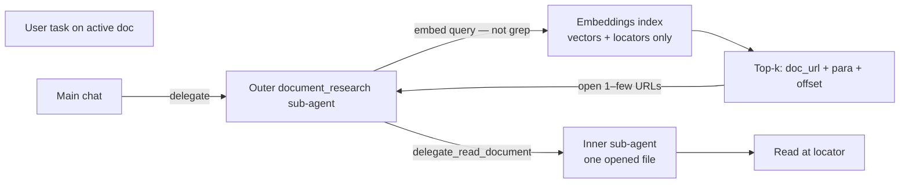
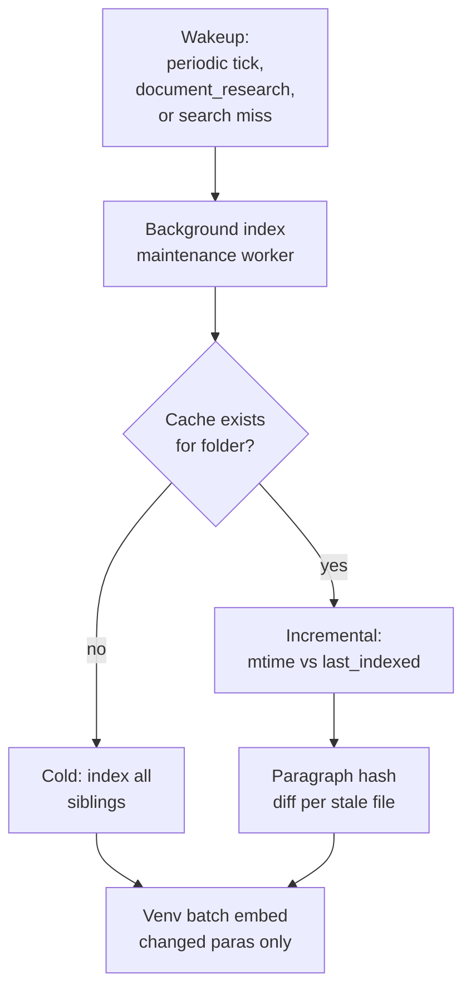
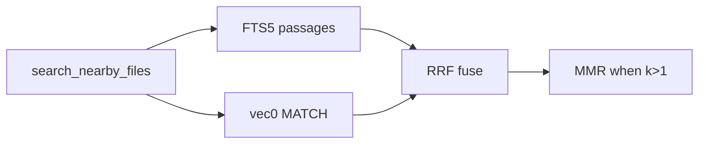
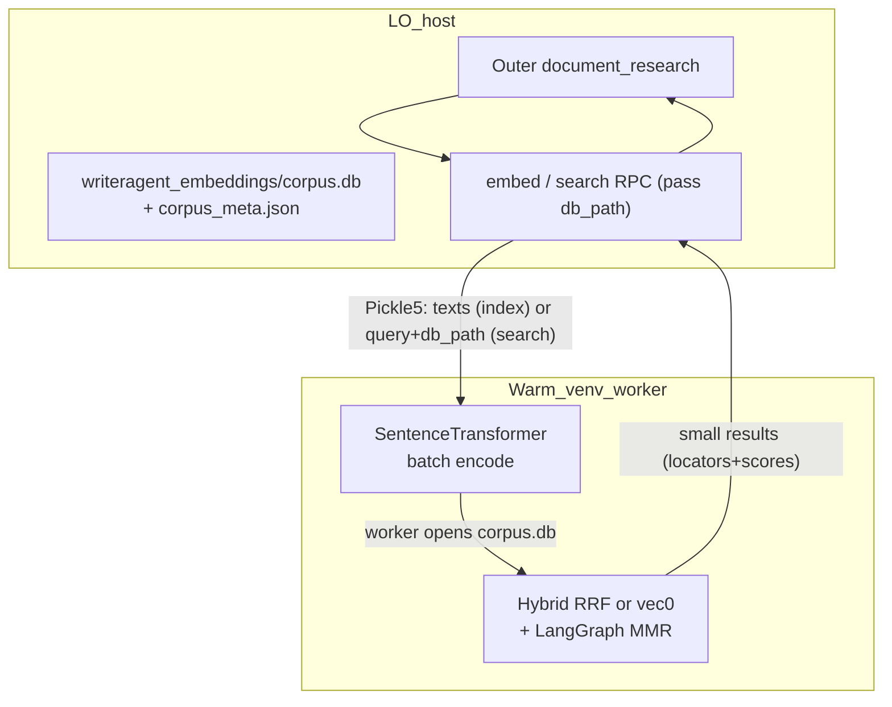

# Embeddings — Development Plan

> **Status (2026-06):** **Unified corpus.db + sqlite-vec (schema v3)** — per-folder **`corpus.db`** (chunks + FTS5 + vec0 + incremental `indexed_files` / `indexed_paragraphs` tables) + `corpus_meta.json` beside documents ([`embeddings_cache.py`](../plugin/embeddings/embeddings_cache.py)).

**Related:** [cython-extension.md](cython-extension.md) · [enabling_numpy_in_libreoffice.md](enabling_numpy_in_libreoffice.md) · [multi-document-dev-plan.md](multi-document-dev-plan.md) · [langchain-plan.md](langchain-plan.md) (chat memory / summarization only)

### Corpus cache layout (schema v3)

```text
/home/user/projects/reporting/          ← document folder (many .odt/.ods siblings)
  Budget.odt
  writeragent_embeddings/              ← ONE cache beside those files (not under LO profile)
    corpus.db                          # chunks + FTS5 passages + vec0 + indexed_files + indexed_paragraphs
    corpus_meta.json                   # schema_version, embedding_model, dim, chunk_count, updated_at
```

> **Historical:** schema v2 used a separate `chroma/` dir and `fts5.db`; schema v1 used profile-side `index.db`. Upgrades delete legacy stores and cold-rebuild into unified `corpus.db` ([`embeddings_cache.py`](../plugin/embeddings/embeddings_cache.py)).

**Linux example:** `~/Desktop/Writing/writeragent_embeddings/` when working in `~/Desktop/Writing/`.

### Inspect a cache

```bash
python scripts/dump_embeddings_cache.py ~/Desktop/Writing
python scripts/dump_embeddings_cache.py --limit 20 --doc-url file:///path/to/doc.odt
```

[`scripts/dump_embeddings_cache.py`](../scripts/dump_embeddings_cache.py) reads `corpus_meta.json` and `corpus.db` (including incremental index tables).

**Routing eval** (labeled top-1 file accuracy — hybrid vs FTS vs vec legs):

```bash
.venv/bin/python scripts/eval_folder_search_routing.py --folder ~/Desktop/Writing --mode all
.venv/bin/python scripts/eval_folder_search_routing.py --folder ~/Desktop/Writing --json
```

[`scripts/eval_folder_search_routing.py`](../scripts/eval_folder_search_routing.py) seeds query sets from the Performance section below.

### Search a cache

Offline search (defaults to **hybrid** RRF — same path as in-app `search_nearby_files`):

```bash
.venv/bin/python scripts/search_embeddings_folder.py "your query"
.venv/bin/python scripts/search_embeddings_folder.py "your query" --folder ~/Desktop/Writing --k 10
.venv/bin/python scripts/search_embeddings_folder.py "topic" --json
.venv/bin/python scripts/search_embeddings_folder.py "topic" --doc-url file:///path/to/doc.odt
```

**Single-leg debug** (same `corpus.db`):

```bash
.venv/bin/python scripts/search_embeddings_folder.py --fts "web search"
.venv/bin/python scripts/search_embeddings_folder.py --vec "remote work policy" --folder ~/Desktop/Writing
```

**SQLite FTS5** leg only (stdlib `sqlite3`; no SentenceTransformer load):

```bash
.venv/bin/python scripts/search_embeddings_folder.py --fts "grammar checker" --folder ~/Desktop/Writing --k 10
```

Defaults: folder `~/Desktop/Writing`, top **10** hits. Requires the embeddings venv packages (same as [`scripts/index_embeddings_folder.py`](../scripts/index_embeddings_folder.py)) and a built **`corpus.db`** under `writeragent_embeddings/` (enable **Embeddings + FTS** in Settings or run index maintain — see [Search mode flag](#search-mode-flag)).

### Performance: embeddings vs grep (example corpus) {#performance-embeddings-vs-grep}

Future work on **when** to call `search_nearby_files` vs `grep_nearby_files` should be **data-driven**. This section records one real benchmark on a multi-document folder — not a synthetic eval set, but a useful baseline because it mixes WriterAgent blog drafts, technical notes, and unrelated documents in one directory (the same shape `document_research` sees).

**Corpus (historical semantic-only run):** `~/Desktop/Writing` — **16** indexed Writer `.odt` files, **~1096** chunks, model **`all-MiniLM-L6-v2`** (pre–schema v3 semantic index). Files include `cursor_for_libreoffice_part2.odt` … `part5.odt`, `writerchat.odt`, `blog_draft_cursor_for_libreoffice.odt`, plus siblings such as `SoftwareWars.odt`, `FormalVerificationText.odt`, `ConduitGeometry.odt`, `rpython.odt` (215 paragraphs — large enough to steal generic “python” queries).

**Method (2026-06, historical vec-only leg):**

1. **Semantic:** [`scripts/search_embeddings_folder.py`](../scripts/search_embeddings_folder.py) `--vec` → `knn_search` → vec0 + LangGraph MMR; record **top-1** hit (`score`, `doc_url`, `snippet`).
2. **Lexical baselines** (stdlib ODF extract via [`embeddings_fs.extract_writer_paragraphs`](../plugin/embeddings/embeddings_fs.py)):
   - **Strict grep** — paragraph must contain **all** query tokens.
   - **Nearby-style grep** — rank files by paragraph hit count for **any** query token (approximates `grep_nearby_files` file picking).
3. **Winner** (when an expected file is known): **grep** if nearby/strict grep hits that file but semantic top-1 does not; **embed** if semantic hits expected file but nearby grep’s top file does not; **both** if either method routes correctly; **neither** if both miss.

Two query sets on the same index:

| Set | Count | Length | Role |
|-----|------:|--------|------|
| **Short** | 47 | **1–3 words** | Realistic search / agent keywords |
| **Long paraphrase** | 29 | 6–12 words | Conversational “which file?” stress test |

#### Short queries (1–3 words) — grep wins most of the time

People and agents rarely paste six-word paraphrases; they type **`grammar`**, **`web search`**, **`venv worker`**. On `~/Desktop/Writing`, **nearby-style grep beat semantic top-1 for file routing** on most labeled short queries:

| Length | Labeled queries | Both OK | Grep only | Embed only | Neither |
|--------|----------------:|--------:|----------:|-----------:|--------:|
| 1 word | 10 | 4 | **5** | 0 | 1 |
| 2 words | 15 | 6 | **8** | 0 | 1 |
| 3 words | 12 | 3 | **5** | **2** | 2 |

**Headline:** for **37** short queries with a known “home” file, grep-only **18**, both **13**, embed-only **2**, neither **4**. An inverted index / fuzzy nearby grep is the right default for keyword-length queries on this folder.

**Grep-only examples** (semantic had a plausible hit but wrong *file*):

| Query | Semantic top-1 | Nearby grep top file |
|-------|----------------|----------------------|
| `web search` (0.83) | `blog_draft_…odt` | `part2.odt` |
| `tool loop` (0.67) | `blog_draft_…odt` | `part3.odt` |
| `numpy` (0.57) | `rpython.odt` | `part5.odt` |
| `grammar checker` (0.60) | `Translation Test.odt` | `part4.odt` |
| `venv worker process` (0.64) | `writerchat.odt` | `part5.odt` |
| `document research` (0.53) | `blog_draft_…odt` | `part3.odt` |

**Both OK** (either method — often prefer grep for speed): `type checking`, `math import`, `async grammar checking`, `software wars`, `conduit geometry`, `formal verification`, `MCP`, `microphone`, `OpenRouter`.

**Embed-only at ≤3 words** (only two cases in 47 queries):

| Score | Query | Top file | Why grep lost |
|------:|-------|----------|---------------|
| 0.705 | `LibreOffice proofreading API` | `Translation Test.odt` | Wording differs from indexed prose (“linguistic subsystem”) |
| 0.616 | `cross document search` | `part3.odt` | Top grep file was `writerchat.odt`; semantic landed on `search_in_document` tool discussion |

**Neither method** (duplicate drafts confuse routing): `streaming`, `semantic search`, `web research subagent`, `streaming sidebar tokens` — blog draft vs `partN` siblings share vocabulary; short tokens are ambiguous.

Try short queries:

```bash
HF_HUB_OFFLINE=1 .venv/bin/python scripts/search_embeddings_folder.py "grammar checker"
HF_HUB_OFFLINE=1 .venv/bin/python scripts/search_embeddings_folder.py "venv worker"
```

Compare with grepping the folder for the same tokens — on this corpus grep usually picks the right **`partN`** faster and without loading `SentenceTransformer`.

#### Long paraphrase queries (6+ words) — where semantic search earns its keep

The earlier **29** long queries are **not** typical user search strings; they model an agent asking in full sentences when the filename is unknown. Strict all-token grep finds **zero** paragraphs for most winners (wording mismatch).

| Score | Query | Top file |
|------:|-------|----------|
| 0.777 | `proofreader called back by libreoffice linguistic subsystem` | `Translation Test.odt` |
| 0.761 | `real time multilingual spell and grammar engine` | `writerchat.odt` |
| 0.729 | `natural language questions better than google search box` | `cursor_for_libreoffice_part2.odt` |
| 0.701 | `type checking makes python look like c plus plus` | `cursor_for_libreoffice_part3.odt` |
| 0.701 | `frustrated with grammar checker switched to math` | `cursor_for_libreoffice_part4.odt` |
| 0.692 | `two level toolset like web research subagent` | `cursor_for_libreoffice_part3.odt` |
| 0.642 | `week six async grammar and latex math` | `cursor_for_libreoffice_part5.odt` |
| 0.615 | `grammar checker that blocks the ui thread` | `cursor_for_libreoffice_part4.odt` |
| 0.574 | `reasoning tokens shown before the final answer` | `blog_draft_cursor_for_libreoffice.odt` |
| 0.537 | `small specialized agent returns distilled answer not bloating context` | `cursor_for_libreoffice_part2.odt` |
| 0.523 | `cross platform microphone audio input challenges` | `cursor_for_libreoffice_part2.odt` |

Even here, many intents collapse to short keywords (`grammar checker`, `type checking`) where grep would suffice if the agent extracted tokens first.

Reproduce a long-query row:

```bash
HF_HUB_OFFLINE=1 .venv/bin/python scripts/search_embeddings_folder.py "type checking makes python look like c plus plus"
```

#### Cross-file routing (filenames unhelpful)

Works with **short** queries too when the topic is distinctive:

| Score | Query | Top file | Grep |
|------:|-------|----------|------|
| 0.74 | `software wars` | `SoftwareWars.odt` | both |
| 0.73 | `conduit geometry` | `ConduitGeometry.odt` | both |
| 0.64 | `formal verification` | `FormalVerificationText.odt` | both |

Long-form paraphrase also routes to non-blog siblings (e.g. `geometry of curved conduit surfaces` → `ConduitGeometry.odt`). On this small folder, **2-word grep often ties embeddings** for off-topic files.

#### When grep was as good or better

On this corpus, embeddings **did not** reliably beat grep when:

| Situation | Example | What happened |
|-----------|---------|----------------|
| **Short keywords (1–3 words)** | `web search`, `tool loop`, `numpy`, `grammar` | Nearby grep picked the correct **`partN`**; semantic top-1 often **`blog_draft_*`** or **`rpython.odt`**. |
| **Stable product vocabulary** | `WriterAgent`, `sidebar`, `venv`, `tool loop` | Blog series repeats terms; `grep_nearby_files` + filename heuristics (`part5.odt`) match quickly. |
| **Generic “python” wording** | `numpy`, `python calc formula` | Top semantic hit **`rpython.odt`**; grep **`part5.odt`**. |
| **Duplicate draft + part siblings** | `streaming`, `semantic search` | Both methods split across `blog_draft_*` vs `partN`. |
| **Exact feature names** | `search_embeddings`, `MCP`, `complexity` | Too literal or too vague; weak scores (~0.30–0.40) or wrong file. |
| **Small folder, descriptive names** | Any query when you already know `partN` | 16 files — opening the suspected sibling + grep inside is often faster than semantic routing. |
| **Embeddings feature itself** | `finding files in same folder when filename unknown` | Topic lives mainly in repo `docs/`, not in indexed ODTs; top score ~0.33. |

**Practical grep baseline:** `WriterAgent` + `venv` + `numpy` → **`part5.odt`**; `web search` → **`part2.odt`** (16 strict paragraph hits). Semantic paraphrase of the same ideas often loses to **`blog_draft_*`** or **`rpython.odt`**.

#### Hybrid RRF baseline (schema v3, re-measured 2026-06)

Same **`~/Desktop/Writing`** corpus as above, re-indexed to schema v3 **`corpus.db`** (**1119** chunks). Method: [`scripts/eval_folder_search_routing.py`](../scripts/eval_folder_search_routing.py) — **45** queries (**41** with a labeled expected file basename), using top-5 candidate retrieval.

We evaluated multiple models on the same corpus:

| Model / Leg | Overall Labeled Top-1 | Overall Labeled Top-3 | Overall Mean MRR | Ingestion Time (350 paragraphs) | Query Latency (Median) |
|-------------|:---------------------:|:---------------------:|:----------------:|:------------------------------:|:----------------------:|
| **`all-MiniLM-L6-v2`** | **56.1%** (23/41) | **75.6%** (31/41) | **0.646** | 8.12s | **9.94 ms** |
| -- Hybrid RRF | 23/41 (56.1%) | 31/41 (75.6%) | 0.646 | | |
| -- Vec-only | 23/41 (56.1%) | 30/41 (73.2%) | 0.634 | | |
| -- FTS-only | 10/41 (24.4%) | 16/41 (39.0%) | 0.309 | | |
| **`sentence-transformers/paraphrase-multilingual-MiniLM-L12-v2`** (Default) | 46.3% (19/41) | 70.7% (29/41) | 0.590 | - | 10.45 ms |
| -- Hybrid RRF | 19/41 (46.3%) | 29/41 (70.7%) | 0.590 | | |
| -- Vec-only | 19/41 (46.3%) | 27/41 (65.9%) | 0.570 | | |
| -- FTS-only | 10/41 (24.4%) | 16/41 (39.0%) | 0.309 | | |
| **`BAAI/bge-small-en-v1.5`** | 51.2% (21/41) | 70.7% (29/41) | 0.610 | **5.93s** | 10.11 ms |
| -- Hybrid RRF | 21/41 (51.2%) | 29/41 (70.7%) | 0.610 | | |
| -- Vec-only | 21/41 (51.2%) | 30/41 (73.2%) | 0.617 | | |
| -- FTS-only | 10/41 (24.4%) | 16/41 (39.0%) | 0.309 | | |
| **`BAAI/bge-base-en-v1.5`** | 51.2% (21/41) | 73.2% (30/41) | 0.617 | - | 12.30 ms |
| -- Hybrid RRF | 21/41 (51.2%) | 30/41 (73.2%) | 0.617 | | |
| -- Vec-only | 21/41 (51.2%) | 30/41 (73.2%) | 0.622 | | |
| -- FTS-only | 10/41 (24.4%) | 16/41 (39.0%) | 0.309 | | |
| **`sentence-transformers/all-mpnet-base-v2`** | 46.3% (19/41) | 73.2% (30/41) | 0.569 | - | 15.60 ms |
| -- Hybrid RRF | 19/41 (46.3%) | 30/41 (73.2%) | 0.569 | | |
| -- Vec-only | 19/41 (46.3%) | 30/41 (73.2%) | 0.580 | | |
| -- FTS-only | 10/41 (24.4%) | 16/41 (39.0%) | 0.309 | | |
| **`Snowflake/snowflake-arctic-embed-s`** | 43.9% (18/41) | 68.3% (28/41) | 0.570 | - | 9.85 ms |
| -- Hybrid RRF | 18/41 (43.9%) | 28/41 (68.3%) | 0.570 | | |
| -- Vec-only | 18/41 (43.9%) | 28/41 (68.3%) | 0.570 | | |
| -- FTS-only | 10/41 (24.4%) | 16/41 (39.0%) | 0.309 | | |

FTS vs vec buckets (labeled queries):
- **all-MiniLM-L6-v2**: **both** 6 · **fts-only** 4 · **vec-only** 17 · **neither** 14
- **sentence-transformers/paraphrase-multilingual-MiniLM-L12-v2**: **both** 5 · **fts-only** 5 · **vec-only** 14 · **neither** 17
- **BAAI/bge-small-en-v1.5**: **both** 5 · **fts-only** 5 · **vec-only** 15 · **neither** 16
- **BAAI/bge-base-en-v1.5**: **both** 5 · **fts-only** 5 · **vec-only** 16 · **neither** 15
- **sentence-transformers/all-mpnet-base-v2**: **both** 4 · **fts-only** 6 · **vec-only** 15 · **neither** 16
- **Snowflake/snowflake-arctic-embed-s**: **both** 8 · **fts-only** 2 · **vec-only** 10 · **neither** 21

Compared with the **historical semantic-only** short-query table above (grep-only **18**, both **13** on a slightly different 37-query labeled set): hybrid RRF beats vec-only on **short** routing (**10/21** vs **8/21**) by fusing the FTS leg, but still misroutes some keyword queries (`web search` top-1 can remain **`blog_draft_*`** rather than **`part2.odt`**).

**MMR after RRF:** runs when **k > 1** (default `search_nearby_files` k=10) to dedupe near-duplicate chunks in multi-hit lists. At **k = 1** routing eval, MMR reorders the pool and **lowered** top-1 accuracy — so MMR is skipped when k=1.

```bash
HF_HUB_OFFLINE=1 .venv/bin/python scripts/eval_folder_search_routing.py --folder ~/Desktop/Writing --mode all
```

#### Takeaways for hybrid retrieval

| Signal | Prefer |
|--------|--------|
| Cross-file discovery (folder search on) | **`search_nearby_files`** — hybrid FTS + embeddings fused with **RRF** ([`hybrid_rrf.py`](../plugin/embeddings/venv/hybrid_rrf.py), vendored from [liamca/sqlite-hybrid-search](https://github.com/liamca/sqlite-hybrid-search)) |
| Query **≤3 tokens** or distinctive **literals** inside one file | **`grep_nearby_files`** |
| **Both** legs agree on `doc_url` (`matched_by`: fts + vec) | High confidence — open that file |

Industry pattern (see [Problem](#problem)): **combine** methods — inverted index / grep for keywords, embeddings for paraphrase. On `~/Desktop/Writing`, hybrid RRF improves short routing vs vec-only ([Hybrid RRF baseline](#hybrid-rrf-baseline-schema-v3-re-measured-2026-06)); long paraphrase queries still favor the semantic leg.

Scores and file ranks **will change** with model upgrades (`bge-small`, etc.), chunk size, and corpus size — re-run [`scripts/eval_folder_search_routing.py`](../scripts/eval_folder_search_routing.py) and extend this section as more folders are measured.

| Module | Role |
|--------|------|
| [`embeddings_cache.py`](../plugin/embeddings/embeddings_cache.py) | Folder keys, paths, host JSON state, legacy `index.db` removal |
| [`embeddings_indexer.py`](../plugin/embeddings/embeddings_indexer.py) | Background index enqueue + `_inflight` guard (venv maintain RPC) |
| [`embeddings_fs.py`](../plugin/embeddings/embeddings_fs.py) | Folder scan + Writer stdlib ODF extract + dispatch to Calc/Impress extract (no UNO) |
| [`embeddings_odf_extract.py`](../plugin/embeddings/venv/embeddings_odf_extract.py) | Impress/Draw `.odp`/`.odg` page and Calc `.ods`/`.ots`/`.fods` row extract (pandas + odfpy, trusted venv) |
| [`embeddings_folder_maintain.py`](../plugin/embeddings/venv/embeddings_folder_maintain.py) | Trusted venv cold/incremental maintain loop |
| [`embeddings_periodic.py`](../plugin/embeddings/embeddings_periodic.py) | Periodic folder tick when cache enabled |
| [`document_research_fts_tool.py`](../plugin/embeddings/document_research_fts_tool.py) | `search_nearby_files` tool (hybrid FTS + vec + RRF) |
| [`embeddings_hybrid_search.py`](../plugin/embeddings/venv/embeddings_hybrid_search.py) | Hybrid corpus search + MMR when k>1 |
| [`embeddings_sqlite.py`](../plugin/embeddings/venv/embeddings_sqlite.py) | Unified `corpus.db`: chunks, FTS5, vec0, incremental tables |
| [`embeddings_ingest_graph.py`](../plugin/embeddings/venv/embeddings_ingest_graph.py) | LangGraph: split → embed → sqlite-vec upsert / delete |
| [`embeddings_search_graph.py`](../plugin/embeddings/venv/embeddings_search_graph.py) | LangGraph: query → vec0 retrieve → MMR → hits |
| [`embeddings_index.py`](../plugin/embeddings/venv/embeddings_index.py) | Trusted venv RPC facades + `embed_texts()` |
| [`embeddings_service.py`](../plugin/framework/client/embeddings_service.py) | Host index/search/stats RPC |
| [`embedding_client.py`](../plugin/framework/client/embedding_client.py) | Host `embed_texts()` RPC |

**Venv install (minimum):**

```bash
pip install numpy sentence-transformers sqlite-vec langgraph langchain-core langchain-text-splitters envwrap odfpy
```

Legacy **`index.db`**, **`chroma/`**, and separate **`fts5.db`** are removed on upgrade; the next index pass cold-builds into unified **`corpus.db`**.

---

## Problem

The expensive case is **many documents**, not one.

Today the **outer** [document_research](../plugin/doc/document_research.py) sub-agent discovers siblings with `list_nearby_files`, guesses filenames from vague user language, opens candidates, and greps with `search_in_document` / full reads. That is **better than opening 100 files blindly**, but still slow, token-heavy, and weak on paraphrase ("remote work" vs "WFH policy" in an oddly named `Notes_v3.odt`).

**Embeddings** replace that **outer-layer grep** with semantic + keyword lookup over a **per-directory `corpus.db` index** ([Corpus storage](#corpus-storage)) — float32 vectors in **vec0**, chunk text in **`chunks.body`**, FTS in **`passages`**, incremental state in **`indexed_*` tables**. Search hits return **`doc_url` + `score` + `snippet`** (and an optional weak `para_index` hint). The outer agent searches **that folder’s cache** without opening LO; it then opens **one or a few** files and the inner read agent uses **`search_in_document`** on the snippet or topic. Opening one file after semantic routing is cheap compared to opening dozens and grepping each.

### Why embeddings (semantic search) vs pure lexical/grep, and why the difference is bigger for office documents than code

Recent experience with AI coding agents shows a split in retrieval strategy:

- Code is highly literal and structured. Developers (and agents) usually want an exact function name, variable, string literal, or symbol. Language servers, AST indexes, and fast `grep` (or ripgrep) are extremely effective. Paraphrase is uncommon — you rarely ask for "a function somewhat like authentication"; you ask for the auth handler or grep for "auth". Because code changes frequently, pre-built vector indexes also suffer from staleness and re-indexing cost.

- Office documents (Writer prose, Calc tables with natural-language labels and notes, Draw captions and diagrams, policy files, fiction, research notes, meeting minutes) are different. Content is natural language or semi-structured text. Users describe what they want with vague or high-level language ("the Q4 revenue figures", "the remote-work policy", "the section on expense approvals from last year"). Filenames are often unhelpful or historical. The same idea can be expressed with synonyms, paraphrases, or completely different wording across files.

In short: code search is mostly *lexical lookup of known identifiers*; document search is often *semantic discovery of unknown phrasing*.

This project already exploits the practical consequence of ODF files being ZIP archives: a naive "list siblings then open-and-grep many" path pays repeated unzip + XML parse costs for every candidate. The per-directory embeddings index lets the outer agent perform a cheap semantic ranking *before* paying the extraction cost for most files. Hits return **which file** plus a **snippet** preview; only the top 1–few documents are opened, and the inner agent then uses precise tools (`search_in_document`, range reads, outline navigation, etc.) on the live content — not blind character offsets.

Industry data on coding agents is consistent with a hybrid view rather than "embeddings are dead":

- Tools like Cursor measure clear gains (+12.5% agent accuracy in their tests) from adding semantic search (custom-trained embeddings) alongside grep, especially for conceptual queries in large codebases. They explicitly state that the *combination* of semantic search and grep produces the best results.
- Other agentic systems (e.g. Claude Code style) favor pure iterative tool use (grep/glob/read + reasoning) for code precisely because of the literal, structured nature of source and the ability of a strong model to explore on the fly.

For the document use cases this index targets — cross-sibling discovery in Writer/Calc/Draw folders — the semantic component has stronger justification than it does for pure code. Fiction writing, policy/legal work, research corpora, creative projects, and any domain where meaning is expressed in varied natural language all amplify the value of embeddings over keyword-only approaches. The design here deliberately scopes embeddings to the outer routing layer only; it never replaces the precise read tools used once the right file(s) are open, and it maintains exactly one index type per directory (no parallel FTS "double cache").

The result is a router that handles the paraphrase/fuzzy-name problem that defeats filename filters and broad greps, while still letting the agent fall back to exact search inside the small number of opened documents.

**Within a single already-open document**, normal search remains enough (`search_in_document`, outline, sheet navigation). **Cross-folder semantic routing for document_research is the main win.**

**One index type per directory:** do **not** maintain FTS5 (or any parallel keyword corpus) alongside embeddings in that folder’s cache — that would be a **double cache** of the same content. Embeddings are the cross-file search layer for **that directory**; after a hit, use existing read tools on the opened file for literals and detail.

This choice also aligns with the domain analysis above: once the right small set of documents has been selected semantically, the agent has cheap, precise, always-fresh lexical tools inside those opened files. There is no need (and no desire) to duplicate a full-text index in the embeddings cache.

**Chat history vs document embeddings:** Sidebar history (`writeragent_history.db`) is unrelated. This is **corpus routing memory**, not turn memory.

---

## Primary use case: outer document_research replaces grep

[multi-document-dev-plan.md](multi-document-dev-plan.md) uses a **two-tier** delegate: **outer** lists/opens/orchestrates; **inner** runs read tools on one opened file. **Embeddings target the outer tier** — the first sub-agent that today picks files and greps.



**Before (outer):** `list_nearby_files(filter="budget")` → guess → open → `search_in_document` / `get_document_content` on each candidate.

**After (outer):** `search_nearby_files("Q4 revenue figures")` → `[{doc_url, score, snippet: matched passage ~512 chars}, …]` → `delegate_read_document` on **top hits only** → inner `search_in_document` / range read using the snippet or topic.

Main chat may also call the index before delegating, but the **major integration point is the outer document_research tool surface** — smarter, faster file pick, no filename lottery.

The rationale for preferring a semantic router here (rather than relying solely on lexical discovery) is discussed in the Problem section: office documents are natural-language heavy and ODF extraction has per-file cost, unlike the more literal, identifier-driven nature of code search where pure grep + structure often suffices.

### After the hit: open one file, dig up truth

The index is **not** a document store. It holds:

- Normalized **float32 vectors** in **sqlite-vec `vec_chunks`** ([Corpus storage](#corpus-storage)); schema v1 BLOB `index.db` removed on upgrade.
- **Locators** — enough to find the passage again in LO (paragraph + offset, and Calc/Draw-specific fields as needed later).
- **Chunk text in `chunks.body`** — retained at index time for hit previews ([Search hit shape](#search-hit-shape)); FTS **`passages`** indexes the same text for the keyword leg.

Lookup returns **where to look**; opening **one** (or a few) files and reading at that locator is intentional and cheap. That beats opening many files and running semantic search inside each.

---

## Vision

- **One unified index** — `corpus.db` holds FTS + vectors + locators (one store per folder).
- **Outer document_research** queries **`search_nearby_files`** (hybrid) instead of grep across opened siblings when folder search is on.
- **Open one (or few) files** at known locations — not semantic search inside every file in the folder.
- Optional in-document injection on main chat send for edge-case huge single files (low priority).

---

## User-facing modes

| Mode | User experience | Priority |
|------|-----------------|----------|
| **Outer semantic find** | document_research outer agent: `search_nearby_files` → ranked `doc_url` + locators → open top hits | **Primary** |
| **Index folder / corpus** | Background embed on open/save; revision-keyed invalidation | **Primary** |
| **Main → delegate with hits** | Main chat runs index first, passes paths/locators into delegate task | **Primary** |
| **Cross-doc Q&A** | Top-k locators across corpus, then inner reads on opened files | **Primary** |
| **In-document RAG on send** | Optional chunk inject beside `[DOCUMENT CONTENT]` for one huge file | **Secondary** |

**Benefits available with today's stack (no LangChain):**

- **`sentence-transformers` + NumPy in the user venv** — tier-one **MVP** embedder (offline, batch CPU, no per-paragraph API cost). See [Local embedders (MVP)](#local-embedders-mvp).
- Cloud embed APIs (OpenRouter / Together / Ollama) when no venv or user prefers hosted models.
- [`list_nearby_files`](../plugin/doc/document_research.py) + read-only extract for **indexing**; index for **lookup** before any of that on query.
- **Pickle5 IPC** into the warm venv worker for encode + `corpus.db` maintain/search ([`bench_embeddings.py`](../scripts/bench_embeddings.py) validates encode + NumPy dot baseline).
- Host **`corpus_meta.json`**; vectors, FTS, and incremental state in **`corpus.db`** (venv trusted modules).

---

## Development plan {#development-plan}

**Goal:** outer [document_research](../plugin/doc/document_research.py) calls `search_nearby_files(query, k)` → ranked hits **within the active folder’s cache** (`doc_url` + paragraph locators) → open top files → inner read at offset.

### Scope: per-directory cache only (MVP) {#per-directory-cache}

The **only** persisted index shape for now:

| In scope | Out of scope (later or never) |
|----------|-------------------------------|
| **One cache per directory** — all LibreOffice siblings in the same folder share one cache under `writeragent_embeddings/<key>/` | Per-**file** sidecars or per-document `.db` files |
| Folder key = normalized path of the **directory** being searched (parent of active doc + siblings) | Single global index across `~/Documents` |
| `search_nearby_files` searches **that directory’s** hybrid index in `corpus.db` | Cross-directory search in one query |
| Locator rows identify **which file** each vector belongs to (`doc_url`) | Storing full text in the cache |
| Background worker builds/refreshes **the whole directory cache** | In-document-only embed cache beside `[DOCUMENT CONTENT]` (Phase D — separate) |

**Mental model:** the cache mirrors “everything in this folder that document_research could grep today” — one semantic index for that **directory of files**, not one index per open document and not one index for the entire machine.

**Rule:** **each directory gets its own cache.** Work in `/projects/reporting/` uses only `writeragent_embeddings/` beside that folder. Work in `/projects/legal/` uses a **different** cache directory — separate `corpus.db`, built and refreshed independently. No sharing across directories in MVP.

```text
/home/user/projects/reporting/          ← real user folder (many .odt/.ods)
  Budget.odt
  Notes_v3.odt
  Q4.ods
  writeragent_embeddings/
    corpus.db                           ← chunks + FTS5 + vec0 for ALL files above
    corpus_meta.json
```

### What is shipped

| Item | Status |
|------|--------|
| [`scripts/bench_embeddings.py`](../scripts/bench_embeddings.py) | **Done** — batch encode + vectorized search via warm worker |
| [`scripts/search_embeddings_folder.py`](../scripts/search_embeddings_folder.py) | **Done** — offline semantic search over a folder cache (default `~/Desktop/Writing`, k=10) |
| `sentence_transformers` on venv whitelist | **Done** — [`sandbox.py`](../plugin/scripting/sandbox.py) |
| `get_safe_module` bypass for ST | **Done** — avoid hang on import ([`local_python_executor.py`](../plugin/contrib/smolagents/local_python_executor.py)) |
| [`embedding_client.py`](../plugin/framework/client/embedding_client.py) | **Done** — `embed_texts()` via venv RPC (Phase A; HTTP deferred) |
| [`embeddings_index.py`](../plugin/embeddings/venv/embeddings_index.py) | **Done** — trusted batch encode module (Phase A; index/search in Phase B) |
| Config `embedding_model` / `embedding_provider` / `folder_search_mode` | **Done** — Settings → Embeddings ([`plugin/embeddings/module.yaml`](../plugin/embeddings/module.yaml)) |

See [Benchmark on your machine](#benchmark-on-your-machine) for sample numbers (349 paragraphs, dot+top-k **0.17 ms** median on Arch).

### Transport: warm-worker IPC (MVP — keep)

Reuse [`PythonWorkerManager`](../plugin/scripting/venv_worker.py) / `run_code_in_user_venv` — same Pickle5 path as `=PYTHON()` and `run_venv_python_script`.

The persistent index is **`corpus.db`** under `<document_folder>/writeragent_embeddings/` plus **`corpus_meta.json`**. The host passes **`listing_root`** or **`db_path`** references over RPC — not the full corpus matrix.

Typical flow:

1. **Host** resolves `listing_root` from the active document folder and enqueues one **maintain** RPC ([`embeddings_indexer.enqueue_folder_index`](../plugin/embeddings/embeddings_indexer.py)); `_inflight` prevents duplicate jobs per folder key.
2. **Host → venv (RPC stub):** `maintain_folder_index` sends `{listing_root, model, mode, search_mode}` only. The venv runs stdlib ODF extract ([`embeddings_fs.py`](../plugin/embeddings/embeddings_fs.py)), mtime / `content_hash` diff (`indexed_*` tables in `corpus.db`), embed, and sqlite-vec upsert at full CPU. **Heartbeat frames** reset the host sliding timeout during long cold builds (`EMBEDDINGS_HEARTBEAT_GRACE_S`). Search sends query text + `k` + `db_path`.
3. **Venv (trusted module):** fixed stubs are detected in [`venv_sandbox.py`](../plugin/scripting/venv_sandbox.py) (`_is_trusted_embeddings_stub`) and run **outside** `LocalPythonExecutor` — `_run_trusted_embeddings_payload` calls [`embeddings_index`](../plugin/embeddings/venv/embeddings_index.py) directly (same pattern as vision). LangGraph ingest/search graphs use real imports (`sentence-transformers`, `sqlite-vec`, `langgraph`). Only small results travel back (top-k hits, counts, errors).
4. **Session:** reuse worker `session_id` so the loaded `SentenceTransformer` survives across calls ([`EMBEDDINGS_WORKER_SESSION_PREFIX`](../plugin/framework/constants.py)). Embeddings RPC uses a **separate warm child** (`worker_pool=WORKER_POOL_EMBEDDINGS`) from Calc `=PYTHON()` and chat scripts — see [Dedicated embeddings subprocess](#dedicated-embeddings-subprocess). **Timeout:** [`embeddings_worker_timeout_sec`](../plugin/scripting/config_limits.py) (**120 s**), not Settings `scripting.python_exec_timeout`.

The **LLM / `=PYTHON()` sandbox** still applies to **user-submitted** scripts. **Embeddings RPC does not** — `torch` / `sqlite-vec` cannot load inside the AST sandbox. Bulk *source text for embedding* flows over IPC **`data=`** at index time; vectors live in **`corpus.db`** beside the document folder.

**Not pursuing for MVP:** host Cython `top_k_dot`, `/tmp` mmap in worker, LangChain vectorstores — see [Future optimizations](#future-optimizations).

### Dedicated embeddings subprocess {#dedicated-embeddings-subprocess}

**Status: shipped.**

Embeddings encode, index persist, and `knn_search` run in a **second** warm venv child ([`PythonWorkerManager`](../plugin/scripting/venv_worker.py) keyed by `WORKER_POOL_EMBEDDINGS` + python exe). Calc `=PYTHON()`, chat `run_venv_python_script`, and notebooks stay on `WORKER_POOL_DEFAULT`.

| Concern | Default pool (Calc / chat) | Embeddings pool |
|---------|---------------------------|-----------------|
| **Calc / user NumPy** | Unaffected by long folder re-embed jobs | Folder cold-build / batch re-embed runs here |
| **Repeated `search_nearby_files`** | N/A | Hybrid RRF + warm `SentenceTransformer` in embeddings pool |
| **Model load** | User script traffic only | `SentenceTransformer` stays warm for document_research bursts |

**Implementation:**

- Same `scripting.python_venv_path` interpreter, same Pickle5 stub protocol ([`embeddings_service.py`](../plugin/framework/client/embeddings_service.py) / [`embedding_client.py`](../plugin/framework/client/embedding_client.py) → [`embeddings_index.py`](../plugin/embeddings/venv/embeddings_index.py)).
- Host passes `worker_pool=WORKER_POOL_EMBEDDINGS` on the two RPC entry points only.
- Optional Settings later: dedicated venv path vs shared venv (same packages, different process — not required).
- **Not** a third HTTP stack or a different embedding library — process isolation + caching only.

#### In-worker corpus cache (RAM) {#embeddings-in-worker-cache}

> **Historical (schema v1 only).** The BLOB + NumPy in-RAM matrix cache applied to SQLite `index.db` search. **Schema v3 (`corpus.db`)** uses vec0/sqlite-vec query instead; this section is kept for context on why repeat-query latency mattered before unified storage.

**Status (v1):** shipped on BLOB path; **removed** with later schema migrations.

Persistent storage remains **`index.db` on disk** (source of truth). The RAM cache is a **read-through / invalidation layer inside the embeddings subprocess** so hot queries avoid re-reading the whole BLOB column on every `search_embeddings` call.

**Problem today (BLOB + NumPy path):** for a folder with *N* chunks, each search roughly: open SQLite → `SELECT … embedding FROM chunks` for all rows → `np.stack` → dot + top-k. At 100 longdoc-sized files (*N* ≈ 35k) that is **~50+ MiB read from disk per query** even when the index has not changed since the last query five seconds ago. Encode cost dominates cold builds; **repeat search** on an unchanged index is where RAM caching helps.

**Proposed behavior:**

| Layer | Role |
|-------|------|
| **`index.db` (disk)** | Durable locators + vectors; incremental indexer writes here; search **always valid** against disk if RAM cache is cold or evicted |
| **In-worker cache (RAM)** | Keyed by `(folder_corpus_key or db_path, embedding_model)` → `{corpus_matrix, chunk_ids, locators, loaded_at, corpus_meta_fingerprint}` |

**Cache policy:**

- **Load on first search** for a folder key; reuse for subsequent `knn_search` in the same embeddings process.
- **TTL `EMBEDDINGS_CORPUS_CACHE_TTL_S` (60 s)** since last access — per-folder sliding window; document_research delegation bursts stay hot without holding matrices forever.
- **Invalidate** on `index_paragraphs` / `delete_paragraphs` RPC for that `db_path`, or when fingerprint (`chunk_count` + `corpus_meta.updated_at`) changes on next access.

**What this is not:**

- Not a second on-disk index or duplicate of chunk text — only **float matrices + locator tuples** already in `index.db`.
- Not a substitute for sqlite-vec at huge *N* — at very large corpora, profile vec0 or partial loading; the 60 s RAM window targets **typical folder** repeat-query latency.
- Not shared across processes — cache lives in the **embeddings-only** subprocess; the general sandbox worker never sees it.

**Expected win:** second and subsequent searches on the same folder within the TTL drop disk BLOB reads and matrix rebuild — query path becomes encode query + in-memory dot + top-k (bench-class **sub-ms to low-ms** for folder-sized *N* when matrix is warm).

See also [Index size growth](#index-size-growth) for when RAM footprint matters.

### Phase A — Embed client + config **(shipped — venv-only)**

- [x] Host [`embedding_client.py`](../plugin/framework/client/embedding_client.py) — `embed_texts(ctx, texts) -> EmbeddingBatch` via venv RPC
- [x] Config: `embedding_model`, `embedding_provider`, `folder_search_mode` — Settings → Embeddings ([`plugin/embeddings/module.yaml`](../plugin/embeddings/module.yaml)); `local` provider only implemented; HTTP tier deferred
- [x] Trusted venv module [`embeddings_index.py`](../plugin/embeddings/venv/embeddings_index.py) + fixed host stub — see [Trusted extension code in the venv](enabling_numpy_in_libreoffice.md#trusted-extension-code-in-the-venv)
- [x] Tests: mocked venv RPC + mocked SentenceTransformer ([`test_embedding_client.py`](../tests/framework/test_embedding_client.py), [`test_embeddings_index.py`](../tests/scripting/test_embeddings_index.py))
- Default model: `all-MiniLM-L6-v2` ([`DEFAULT_EMBEDDING_MODEL`](../plugin/framework/constants.py)) until multi-model bench says otherwise

#### Phase A — what exists today (handoff for Phase B)

| Piece | Location | Contract |
|-------|----------|----------|
| Host API | [`embedding_client.embed_texts`](../plugin/framework/client/embedding_client.py) | `EmbeddingBatch(model, dim, vectors, indices)` — `vectors` are L2-normalized float32 nested lists; `indices` maps each vector back to the input list position (empty strings skipped) |
| Model config | `get_embedding_model(ctx)` | Reads `embedding_model` from config; falls back to `all-MiniLM-L6-v2` |
| Venv encode | [`embeddings_index.embed_texts`](../plugin/embeddings/venv/embeddings_index.py) | Same shape as worker `result` dict; lazy `SentenceTransformer` cache per model name |
| IPC transport | `run_code_in_user_venv` + fixed stub | `session_id=f"embeddings:{model_slug}"` reuses loaded model; **stub bypasses LLM sandbox**; timeout from `embeddings_worker_timeout_sec` (120 s) |
| Whitelist | [`sandbox.py`](../plugin/scripting/sandbox.py) | `plugin.embeddings.venv.embeddings_index` allowed for stub import only |

**All of the above now ship in Phase B/C** — unified `corpus.db` + LangGraph ingest/search replace schema v1 `index.db`. Host-side batch encode during tests may still call `embedding_client.embed_texts`; index/search persist via [`embeddings_service.py`](../plugin/framework/client/embeddings_service.py) → [`embeddings_index`](../plugin/embeddings/venv/embeddings_index.py) → ingest/search/hybrid modules.

### Phase B — Minimal index + cross-file search {#phase-b}

**Shipped.**

**Goal:** outer [document_research](../plugin/doc/document_research.py) calls `search_nearby_files(query, k)` → ranked hits in the **active folder’s** cache → open top files → inner read at locator.

**Search mode (Settings):** [`embeddings.folder_search_mode`](../plugin/embeddings/module.yaml) — **Off** (default, grep only) or **Embeddings + FTS** (unified `corpus.db`). See [Search mode flag](#search-mode-flag) below.

**Suggested implementation order** (each step should have tests before moving on):

1. **Folder key + cache paths (host, stdlib only)** — new module e.g. `plugin/embeddings/embeddings_cache.py`:
   - `folder_corpus_key(directory_path) -> str` — stable hash/normalized path (same sibling scope as [`list_nearby_files`](../plugin/doc/document_research.py))
   - `folder_cache_dir(listing_root) -> Path` under `<document_folder>/writeragent_embeddings/`
   - Host creates `corpus.db` + `corpus_meta.json` ([Corpus storage](#corpus-storage))

2. **Paragraph chunker + locator capture (host)** — extract indexable paragraphs from siblings (reuse document_research read-only extract / ODT path from bench); per paragraph: `doc_url`, `para_index`, `char_start`, `char_end`, `content_hash` ([Chunking](#chunking) — paragraph grain for MVP)

3. **Extend `embeddings_index` (venv)** — add encode+persist and search alongside existing `embed_texts`:
   - `index_paragraphs(db_path, model, rows)` — batch embed changed texts, write `vec_chunks` (vec0) or `chunks.embedding` BLOB fallback ([Search fallback](#search-fallback))
   - `knn_search(db_path, query_text, k)` or `knn_search(db_path, query_vec, k)` — vec0 `MATCH` when `sqlite_vec` loads; else NumPy dot + top-k (port search half of [`bench_embeddings.py`](../scripts/bench_embeddings.py))
   - Probe sqlite-vec once at module load; log fallback at debug

4. **`search_nearby_files` tool** — register on outer document_research surface ([`document_research_fts_tool.py`](../plugin/embeddings/document_research_fts_tool.py)); hybrid RRF when `folder_search_mode` is `hybrid`; return `{doc_url, snippet, score, para_index?, matched_by?}[]` ([Search hit shape](#search-hit-shape))

5. **Background folder indexer (host thread + venv IPC)** — [Background folder indexer](#background-folder-indexer): cold build + mtime/hash incremental refresh; **must not block** tool loop; enqueue on document_research start or first search miss

6. **Prompt / delegate wiring** — mode-specific hints in [`specialized_base.py`](../plugin/doc/specialized_base.py) via [`get_document_research_workflow_hint`](../plugin/doc/document_research.py)

**Phase B checklist:**

- [x] Paragraph chunker with **locator capture** (`para_index`, `char_start`, `char_end`, `content_hash`)
- [x] Persist per-folder **`corpus.db`** beside documents ([Corpus cache layout](#corpus-cache-layout), [Corpus storage](#corpus-storage))
- [x] **`search_nearby_files`** on outer document_research tool surface when `folder_search_mode` is `hybrid`
- [x] Open top 1–few hits → `delegate_read_document` → inner read via snippet / `search_in_document` (prompt guidance)
- [x] Vec search via LangGraph + vec0 + MMR ([`embeddings_search_graph.py`](../plugin/embeddings/venv/embeddings_search_graph.py)); hybrid via [`embeddings_hybrid_search.py`](../plugin/embeddings/venv/embeddings_hybrid_search.py)
- [x] Background **index maintenance worker** (separate from agent tool loop) — [Background folder indexer](#background-folder-indexer)

### Search mode flag {#search-mode-flag}

**Settings → Embeddings → Cross-file search** (`embeddings.folder_search_mode`):

| Value | document_research tools |
|-------|-------------------------|
| `none` (default) | `grep_nearby_files`, `list_nearby_files`, `delegate_read_document` |
| `hybrid` | `search_nearby_files`, `list_nearby_files`, `delegate_read_document` (`grep_nearby_files` hidden) |

When off, [`filter_document_research_discovery_tools`](../plugin/doc/document_research.py) hides `search_nearby_files`. When on, it hides `grep_nearby_files` and background maintain always builds FTS + vectors in one `corpus.db` ([`embeddings_indexer.py`](../plugin/embeddings/embeddings_indexer.py)).

### Folder FTS (unified corpus.db) {#folder-fts}

**Lexical** cross-folder discovery: BM25 ranking + FTS5 **`NEAR`** (terms with gaps). The **`passages`** virtual table lives in the same **`corpus.db`** as vec0 ([`embeddings_sqlite.py`](../plugin/embeddings/venv/embeddings_sqlite.py)) — stdlib **`sqlite3` only**, no extra pip packages. Index build and search stay **outside** the LibreOffice process.

Enable **Embeddings + FTS** in **Settings → Embeddings → Cross-file search** (`embeddings.folder_search_mode: "hybrid"`), or set that key in `writeragent.json`.

**Tool matrix (document_research):**

| Tool | When to use |
|------|-------------|
| **`search_nearby_files`** | Hybrid keyword + semantic search (BM25/NEAR + vec0, fused with RRF) — **`hybrid` mode** |
| **`grep_nearby_files`** | Regex, exact substring, Calc/Draw — **`none` mode only** (hidden when hybrid is on) |

**Cache files** (schema v3 — one folder, one DB):

```text
writeragent_embeddings/
  corpus.db              # chunks + FTS5 passages + vec0 + indexed_files + indexed_paragraphs
  corpus_meta.json       # schema_version, embedding_model, dim, chunk_count, updated_at
```

Implementation: [`folder_fts.py`](../plugin/embeddings/venv/folder_fts.py) (search helpers), [`embeddings_folder_maintain.py`](../plugin/embeddings/venv/embeddings_folder_maintain.py) (maintain), [`embeddings_indexer.py`](../plugin/embeddings/embeddings_indexer.py) (host enqueue). Periodic wakeups share [`embeddings_periodic.py`](../plugin/embeddings/embeddings_periodic.py) when hybrid mode is on. **Calc `.ods` and Impress/Draw `.odp`/`.odg` siblings** use the same extract path as Writer `.odt`.

> **Historical:** schema v2 used a separate `fts5.db` beside `chroma/`; upgrades merge into unified `corpus.db`.

### Corpus cache layout {#corpus-cache-layout}

**Per-directory only:** one **`writeragent_embeddings/`** subfolder per indexed **folder**, **beside the documents**, holding **`corpus.db`** + **`corpus_meta.json`** for **every indexable file in that folder** ([Scope](#per-directory-cache)).

```text
/home/user/projects/reporting/writeragent_embeddings/
  corpus.db                            # chunks + FTS5 + vec0 + indexed_files + indexed_paragraphs
  corpus_meta.json
```

| File / object | Contents |
|----------------|----------|
| **`corpus.db`** | Chunks (`body`), FTS5 (`passages`), vec0 (`vec_chunks`), **`indexed_files`**, **`indexed_paragraphs`** |
| **`corpus_meta.json`** | `embedding_model`, `dim`, `schema_version`, `chunk_count`, `storage_backend` |

One cache per document directory (sibling folder around the active doc), never per open document and never one global profile cache. Settings / help: *semantic search cache for a folder — vectors from files in that directory only; delete `writeragent_embeddings/` in that folder to force re-index.*

**Linux example:** `/home/user/Desktop/Writing/writeragent_embeddings/` when working in `~/Desktop/Writing/`.

> **Profile cache (historical):** early builds used `~/.config/libreoffice/…/user/writeragent_embeddings/<hash>/`. Current code writes beside the document folder ([`embeddings_cache.py`](../plugin/embeddings/embeddings_cache.py)).

### Background folder indexer {#background-folder-indexer}

Indexing and refresh run on a **background maintenance worker** (host thread + venv IPC) — **not** inside the document_research tool loop and not blocking the outer agent’s LLM turns. **Wakeups:**

| Trigger | When |
|---------|------|
| **Periodic tick** | Every `EMBEDDINGS_INDEX_INTERVAL_S` (default **300 s / 5 min**) for the **active document’s folder** — started once per process from sidebar wiring ([`embeddings_periodic.py`](../plugin/embeddings/embeddings_periodic.py)) when `embeddings.folder_search_mode` is **`hybrid`** |
| **document_research** | Outer delegate starts in a folder ([`specialized_base.py`](../plugin/doc/specialized_base.py)) |
| **search miss** | `search_nearby_files` against empty/stale cache ([`document_research_fts_tool.py`](../plugin/embeddings/document_research_fts_tool.py)) |

Only one folder job runs at a time per folder key (`_inflight` guard in [`embeddings_indexer.py`](../plugin/embeddings/embeddings_indexer.py)); periodic ticks are no-ops while a job is already queued or running.

**Two modes:**

| Mode | When | Work |
|------|------|------|
| **Cold build** | No cache for folder, or `embedding_model` changed | Index **all** indexable siblings — **per-file** extract → ingest → sync incremental state in `corpus.db` |
| **Incremental refresh** | Cache exists | Per file: compare **file mtime** vs **`last_indexed_at`**; only if stale, extract paragraphs and **paragraph-hash diff** (below) |

**Bounded ingest batches:** The venv ingest pipeline ([`embeddings_ingest_graph.py`](../plugin/embeddings/venv/embeddings_ingest_graph.py)) embeds and upserts sub-chunks in windows of **`EMBEDDINGS_INGEST_BATCH_SIZE`** (default **64**) — not the whole folder or a large file at once. [`embed_texts`](../plugin/embeddings/venv/embeddings_index.py) passes the same size to `SentenceTransformer.encode(batch_size=…)`. This caps peak RAM and CPU spikes; wall time on typical folders may be ~10–20% longer than one monolithic embed.

**Incremental refresh (default once cache exists):**

1. List sibling files in the folder (same extensions as `list_nearby_files`).
2. For each `doc_url`, read filesystem **mtime** (last modified) and compare to **`last_indexed_at`** stored in the cache for that file.
3. **`mtime ≤ last_indexed_at`** (and model unchanged) → **skip file** — no extract, no embed.
4. **File may have changed** → read-only extract (same path as document_research) → compute **`content_hash` per paragraph** → compare to locator rows.
5. Send **only paragraphs with new or changed hashes** to the embedder (batch RPC). Unchanged paragraphs keep existing vectors.
6. The background worker passes changed paragraphs to the venv. The trusted module runs the LangGraph ingest pipeline ([`embeddings_ingest_graph.py`](../plugin/embeddings/venv/embeddings_ingest_graph.py)): split → **windowed** batch embed + upsert (see **Bounded ingest batches** above); host updates `corpus_meta.json` and incremental state in `corpus.db` (`indexed_files`, `indexed_paragraphs`).
7. **Save with unchanged content:** if mtime bumped but hash diff finds nothing to embed or delete, the host calls **`mark_file_indexed`** ([`embeddings_indexer.py`](../plugin/embeddings/embeddings_indexer.py)) to advance `last_indexed_at` / `file_mtime` without a venv RPC — avoids re-scanning the same file on every periodic tick.

Search always uses the **current** index ([Always search](#always-search-update-in-the-background)); maintenance catches up in the background via **mtime + hash diff** on the periodic and event-driven wakeups above. Index may be a few minutes stale — acceptable for cross-file semantic find.



Do not block `search_nearby_files` or document_research on embed completion; enqueue work and return ranked hits from whatever index is on disk.

### Corpus storage (schema v3 — sqlite-vec + FTS5) {#corpus-storage}

**Default (shipped today):** vectors, chunk text, FTS, and incremental state live in one **`corpus.db`** beside the document folder, plus **`corpus_meta.json`**. **Ingest:** LangGraph split → [`embed_texts`](../plugin/embeddings/venv/embeddings_index.py) → sqlite-vec upsert ([`embeddings_ingest_graph.py`](../plugin/embeddings/venv/embeddings_ingest_graph.py)). **Vec search:** query embed → vec0 `MATCH` → MMR ([`embeddings_search_graph.py`](../plugin/embeddings/venv/embeddings_search_graph.py)). **Hybrid search:** FTS + vec0 legs → RRF → optional MMR when k>1 ([`embeddings_hybrid_search.py`](../plugin/embeddings/venv/embeddings_hybrid_search.py)). On-disk size tracks **live chunk count × dim**, not edit history.

**Upgrade:** legacy **`index.db`**, **`chroma/`**, and separate **`fts5.db`** are deleted on first access; next index pass **cold-builds into unified `corpus.db`** ([`embeddings_cache.py`](../plugin/embeddings/embeddings_cache.py)). See [Search fallback (schema v1 historical)](#search-fallback) for the old BLOB design.



The worker opens **`corpus.db` by path** and performs ingest/search locally. No full corpus matrix is shipped over IPC for search.

#### Shared invariants

| Concern | Rule |
|---------|------|
| Scope | One `writeragent_embeddings/` per **document directory** (beside indexed files) |
| Metadata | Locators in `chunks`: `doc_url`, `para_index`, offsets, `content_hash`, `file_mtime`, `last_indexed_at`, `embedding_model` |
| Incremental logic | mtime skip → hash diff → batch embed **changed paragraphs only** ([Background folder indexer](#background-folder-indexer)) |
| Model change | Cold rebuild entire folder cache |
| Search latency class | Lazy ~60 s background OK; search reads **current** index, may be briefly stale |

#### Schema (vec0 path)

```sql
-- Host creates locator table (stdlib sqlite3 on index worker thread)
CREATE TABLE chunks (
  chunk_id INTEGER PRIMARY KEY,
  doc_url TEXT NOT NULL,
  para_index INTEGER NOT NULL,
  char_start INTEGER,
  char_end INTEGER,
  content_hash TEXT NOT NULL,
  file_mtime REAL,
  last_indexed_at REAL,
  embedding_model TEXT NOT NULL,
  embedding BLOB  -- optional mirror for NumPy fallback; omit if vec0-only
);
CREATE TABLE corpus_meta (key TEXT PRIMARY KEY, value TEXT);

-- Venv fixed RPC: sqlite_vec.load(db) then create vec0 (dim fixed at cold build)
CREATE VIRTUAL TABLE vec_chunks USING vec0(
  chunk_id INTEGER PRIMARY KEY,
  embedding float[384]  -- dim from embedding_model / corpus_meta
);
```

| Operation | vec0 path |
|-----------|-----------|
| **Changed paragraph** | `UPDATE vec_chunks SET embedding = ? WHERE chunk_id = ?`; sync `chunks.content_hash` |
| **New paragraph** | `INSERT INTO chunks …`; `INSERT INTO vec_chunks …` |
| **Deleted paragraph** | `DELETE FROM vec_chunks WHERE chunk_id = ?`; `DELETE FROM chunks …` |
| **Search** | `SELECT chunk_id, distance FROM vec_chunks WHERE embedding MATCH ? ORDER BY distance LIMIT ?` in venv RPC |

NumPy arrays pass straight into sqlite-vec (`embedding.astype(np.float32)` — see [sqlite-vec Python docs](https://alexgarcia.xyz/sqlite-vec/python.html)).

**Host vs venv (shared DB file):** the *same* `index.db` file is the coordination point and is opened by both processes. The host uses plain stdlib `sqlite3` (no loadable extensions required) to manage the `chunks` locator/metadata table, perform mtime + hash diff decisions in the background indexer, and orchestrate work. The trusted module in the venv is given a path/reference over the RPC, opens the identical file, and (if `sqlite_vec` is importable) loads the extension to create/use the `vec0` virtual table for storage and KNN. Even without sqlite-vec the worker opens the same DB to read/write the `embedding` BLOB column and runs the NumPy path locally. SQLite's normal multi-process concurrency rules apply; the worker performs the vector-sensitive DML and search while the host owns most metadata logic. LLM / `=PYTHON()` scripts remain sandboxed — they must not import `sqlite3` or open index paths directly.

#### Search fallback (schema v1 historical) {#search-fallback}

> **Not used in schema v3.** Kept for understanding the pre–corpus.db BLOB fallback and bench script.

At worker startup (or first index open), schema v1 **probed** `import sqlite_vec` and `sqlite_vec.load()` on a throwaway `:memory:` connection. Most v1 installs omitted sqlite-vec and stayed on the BLOB + NumPy path.

| Condition | Persist | Search |
|-----------|---------|--------|
| **sqlite-vec not installed / load fails (expected MVP)** | `chunks.embedding` BLOB only; `corpus_meta.storage_backend=blob_numpy` | Load all BLOBs → `np.stack` → `np.dot` + top-k ([bench path](#benchmark-on-your-machine)) |
| **sqlite-vec OK (optional)** | `vec_chunks` vec0 (+ optional BLOB mirror) | vec0 `MATCH` KNN in venv |

Log once at debug level when vec0 is unavailable or when vec0 is used. Do **not** fail indexing if `sqlite-vec` is missing — that is the **normal** supported configuration today.

**Anti-pattern — do not use:** append-only vector logs, dual-file `vectors.bin` sidecars that grow on every edit without reclaim, or versioned snapshot chains.

#### Installing sqlite-vec in the user venv {#installing-sqlite-vec}

> **Optional — not required for MVP.** Skip this section unless profiling on **your** folder corpora shows NumPy BLOB search is too slow. Minimum venv: **`pip install numpy sentence-transformers`** ([Venv setup](#local-embedders-mvp)).

WriterAgent reads **`scripting.python_venv_path`** ([enabling_numpy_in_libreoffice.md](enabling_numpy_in_libreoffice.md)) — install packages **into that venv**, not system Python. The PyPI wheel bundles the sqlite-vec loadable extension; `pip install sqlite-vec` is the supported path when you choose to enable vec0 ([upstream install guide](https://github.com/asg017/sqlite-vec/blob/main/site/getting-started/installation.md)).

**All platforms (recommended):**

```bash
# Replace with your actual venv path from WriterAgent Settings
VENV=/path/to/your/writeragent/venv

"$VENV/bin/pip" install numpy sentence-transformers sqlite-vec
# sentence-transformers pulls PyTorch CPU; first run downloads model weights.
```

**Verify:**

```bash
"$VENV/bin/python" -c "
import sqlite3, sqlite_vec
db = sqlite3.connect(':memory:')
db.enable_load_extension(True)
sqlite_vec.load(db)
db.enable_load_extension(False)
print('vec_version=', db.execute('select vec_version()').fetchone()[0])
"
```

**Arch Linux notes:**

Arch marks system Python as [externally managed (PEP 668)](https://peps.python.org/pep-0668/) — **`pip install` on `/usr/bin/python3` fails** unless you use a venv. That matches WriterAgent’s design: always use the configured venv subprocess, never LibreOffice’s embedded interpreter for sqlite-vec.

1. **Use the WriterAgent venv (required):**

```bash
# Example: venv already pointed at by scripting.python_venv_path
VENV="$HOME/Desktop/Python/venv"   # adjust to your path

"$VENV/bin/pip" install numpy sentence-transformers sqlite-vec
```

2. **If the venv has no pip** (fresh `python -m venv` on Arch sometimes needs ensurepip):

```bash
pacman -S python-pip    # optional: pacman helper; still install into venv below
"$VENV/bin/python" -m ensurepip --upgrade
"$VENV/bin/pip" install numpy sentence-transformers sqlite-vec
```

3. **AUR (`python-sqlite-vec`) — not a substitute:** [`python-sqlite-vec`](https://aur.archlinux.org/packages/python-sqlite-vec) installs into **system** site-packages via an AUR helper (`yay -S python-sqlite-vec`). WriterAgent’s warm worker uses **`scripting.python_venv_path`**, so you still need **`pip install sqlite-vec` inside that venv**. The AUR package is only relevant if you deliberately run the venv’s Python against system packages (unusual — do not rely on it).

4. **SQLite version:** vec0 works best with SQLite **≥ 3.41**. Check the **venv** interpreter, not system `sqlite3`:

```bash
"$VENV/bin/python" -c "import sqlite3; print(sqlite3.sqlite_version)"
```

Python 3.12+ venvs on Arch usually ship a recent SQLite. If `enable_load_extension` is missing (some macOS system Pythons), use Homebrew Python or `pysqlite3` — see [sqlite-vec Python docs](https://alexgarcia.xyz/sqlite-vec/python.html).

**Do not** vendor sqlite-vec into the OXT or load it in LibreOffice’s embedded Python — venv trusted module only ([Trusted extension code in the venv](enabling_numpy_in_libreoffice.md#trusted-extension-code-in-the-venv)).

#### Rejected alternatives (historical)

| Alternative | Why not default |
|-------------|-----------------|
| Dual-file `index.db` + `vectors.bin` | Two-file sync; append-only `.bin` risk |
| BLOB-only + always IPC full matrix | Works as **fallback**, but vec0 avoids loading all vectors at large N |
| Full sidecar rewrite each batch | Write amplification on small edits |

### Phase C — Incremental maintenance {#phase-c-incremental}

> **Superseded (likely indefinitely):** live edit hooks are **not on the roadmap**. Periodic background refresh ([Background folder indexer](#background-folder-indexer)) — **mtime vs `last_indexed_at`**, paragraph **`content_hash`** diff, and **`mark_file_indexed`** when content is unchanged — is the maintained strategy. A few minutes of index staleness is acceptable for cross-file semantic find.

**Shipped via Phase B + periodic worker:**

- [x] Paragraph `content_hash`; skip embed when hash unchanged
- [x] Vector patch in place (`vec0` + `chunks`, or BLOB fallback) per [Corpus storage](#corpus-storage)
- [x] Periodic background folder indexer (`EMBEDDINGS_INDEX_INTERVAL_S`)
- [x] `mark_file_indexed` when mtime changes but hashes match

**Not planned (original Phase C design — kept as historical notes below):**

- [ ] **`XProofreading` change hook**
- [ ] **~60 s debounced worker** per `doc_url` on every keystroke
- [ ] Dirty marks from write tools
- [ ] Supersede keys like [`grammar_work_queue.py`](../plugin/writer/locale/grammar_work_queue.py)

#### `XProofreading` incremental hook {#xproofreading-incremental-hook}

> **Historical / not planned.** The design below described a parallel proofreading hook for ~1-minute-fresh indexes. **Periodic mtime refresh replaces this** — less code, no grammar coupling, and acceptable latency for document_research.

Writer already calls [`doProofreading`](../plugin/writer/locale/ai_grammar_proofreader.py) on the **`XProofreading`** linguistic path whenever the user types — that is how the native grammar proofreader learns which **text slice** changed. Embeddings maintenance **reuses that entry point** but is a **separate code path**:

| | Grammar proofreader | Embeddings indexer |
|--|---------------------|-------------------|
| **UNO entry** | `XProofreading.doProofreading` | Same call site (parallel hook) |
| **Work** | LLM grammar JSON + squiggles | Paragraph hash diff → venv batch re-embed |
| **Latency** | ~1 s quiet window | **~60 s** quiet window before any embed work |
| **User-visible** | Underlines | None (background index only) |

**Do not** run embed logic inside the grammar proofreader class or share grammar’s sentence queue. Add a thin **embeddings listener** invoked from the same `doProofreading` dispatch (or shared pre-hook) that:

1. Maps the proofread buffer slice to **paragraph index + normalized text** (same BreakIterator / paragraph boundaries grammar already uses — see [`grammar_proofread_text.py`](../plugin/writer/locale/grammar_proofread_text.py)).
2. Compares `content_hash` to the locator row for `(doc_url, para_index)`.
3. On mismatch, **marks paragraph dirty** and resets a **60 s idle timer** for that document — no venv call yet.

When the timer fires (document quiet for **one minute**), drain all dirty paragraphs for that `doc_url` in one batch embed RPC, patch `vec_chunks` + `chunks`, update locator rows. Supersede inflight work if the user keeps typing (same supersede pattern as grammar’s `enqueue_seq`, different timeout constant).

Grammar can be off while embeddings indexing stays on (separate config flags). External saves and non-Writer edits still converge via **mtime + hash diff on open** and the background folder indexer.

### Phase D — Optional later

- Main chat runs index before delegate; pass locators in task string
- In-document chunk inject beside `[DOCUMENT CONTENT]` for one huge file ([Within-document retrieval](#within-document-retrieval-secondary))
- Cloud embed tier-two when no venv ([Cloud embedding APIs](#cloud-embedding-apis-tier-two))

---

## Within-document retrieval (secondary)

For the **active document only**:

- Writer/Calc already expose fast keyword/outline search to tools and users (`search_in_document`, outline helpers, sheet navigation).
- Injecting extra chunks from an embedding index on every chat send is **optional** — useful when the 8k excerpt misses a distant section in a **single** 200-page file, not the usual case.
- Implement after the **corpus index** proves value; same chunker and storage, scoped by `doc_url`.

---

## Architecture

WriterAgent runs NumPy, **sqlite-vec**, and **sentence-transformers** **only in the user venv subprocess** ([`PythonWorkerManager`](../plugin/scripting/venv_worker.py)). LibreOffice's embedded interpreter stays stdlib — no NumPy or sqlite-vec in-process.



**Split responsibilities (shared on-disk DB + reference passing):**

```
┌─────────────────────────────────────────────────────────────┐
│ LibreOffice host (embedded Python — stdlib)                  │
│  • Resolve listing_root; enqueue maintain RPC; _inflight dedupe │
│  • corpus_meta.json on host; incremental state in corpus.db   │
│  • Heartbeat-aware RPC timeout for long folder builds          │
│  • Pass listing_root or query + db_path over RPC               │
│  • Optional HTTP embed when no venv (tier two)               │
└───────────────────────────┬─────────────────────────────────┘
                            │ Pickle5 RPC (texts or query + db reference)
┌───────────────────────────▼─────────────────────────────────┐
│ User venv — warm worker (trusted module, same =PYTHON() venv)│
│  • Opens corpus.db by path passed in                         │
│  • sentence-transformers — lazy load, batch encode             │
│  • sqlite-vec vec0 + FTS5 passages — storage and search      │
│  • LangGraph ingest/search + hybrid RRF (trusted, unsandboxed)│
│  • Returns only compact locator lists / small results        │
└─────────────────────────────────────────────────────────────┘
```

**`corpus.db` + `corpus_meta.json`** live beside the document folder. The host orchestrates extract/diff enqueue; the venv worker owns encode and sqlite DML/search via trusted modules.

**MVP path:** the worker receives **`corpus.db` path references** (plus small payloads) over the RPC. Encode and search happen inside trusted modules **outside** the LLM sandbox. [`scripts/bench_embeddings.py`](../scripts/bench_embeddings.py) still validates batch encode + NumPy dot/top-k at 349 paragraphs (dot+top-k **0.17 ms** median) — production search uses vec0/hybrid, not full-matrix reload per query. See [Development plan](#development-plan) and [Trusted extension code in the venv](enabling_numpy_in_libreoffice.md#trusted-extension-code-in-the-venv).

**Do not** add `sqlite-vec` / `langgraph` / `os` to the **LLM** import whitelist — keep model load and DB access inside shipped `plugin.embeddings.venv.*` modules invoked via trusted RPC stubs that bypass the sandbox.

---

## How embeddings work

### Meaning signatures

An embedding is a fixed-length list of floats (e.g. 384 or 1536) representing a chunk of text in multi-dimensional space. Chunks from **many files** live in one index; a query vector compares against all of them to surface the best **document + passage** matches.

- "The dog is barky" and "Canine vocalization" are **close together**.
- "The dog is barky" and "Pythons are interpreted languages" are **very far apart**.

### Closeness = angle, not words

We compare **angles** between vectors. If two vectors point in roughly the same direction, the texts have similar meanings.

- **Dot product**: multiply values at each index and sum.
- **Cosine similarity**: dot product of two **normalized** vectors (length 1.0).

> **Optimization:** Normalize vectors **once** when stored (or when received from the API). Cosine search then reduces to a fast **dot product** scan.

---

## Why NumPy stays in the venv {#why-numpy-stays-in-the-venv}

NumPy carries a heavy "tax" inside a LibreOffice `.oxt`:

- **Binary size**: ~50–100 MB per platform.
- **Complexity**: packaging for Windows, macOS (Intel + Silicon), and Linux (x86 + ARM) is a maintenance nightmare.

**WriterAgent's solution (shipped):** NumPy and **sentence-transformers** run **only in the user venv subprocess** — see [enabling_numpy_in_libreoffice.md](enabling_numpy_in_libreoffice.md). Host↔venv uses **Pickle5** by default (3.11–3.14). For MVP, **encode and search both stay in the venv** over IPC ([Development plan](#development-plan)).

---

## Embedding inference

Two tiers. **Shipped today (Phase A):** local **`sentence-transformers`** in the configured venv only — via [`embedding_client.embed_texts`](../plugin/framework/client/embedding_client.py). **Tier two (not implemented):** OpenRouter / Together / Ollama HTTP when no venv.

**Current dispatch:** `embedding_provider` must be `local` (default). Host calls `run_code_in_user_venv` with a fixed stub → [`embeddings_index.embed_texts`](../plugin/embeddings/venv/embeddings_index.py). Requires `scripting.python_venv_path` with `pip install sentence-transformers numpy sqlite-vec langgraph langchain-core langchain-text-splitters envwrap odfpy pandas openpyxl xlrd python-docx` (embeddings pool does not fall back to LibreOffice embedded Python).

**Future dispatch (when HTTP ships):** if venv + local model → venv RPC; else if chat endpoint supports embeddings → HTTP; else prompt user to configure venv or API.

**Production path:** indexing and search call [`embeddings_service`](../plugin/framework/client/embeddings_service.py) → [`embeddings_index`](../plugin/embeddings/venv/embeddings_index.py) → LangGraph / hybrid / sqlite-vec modules. Host may still call `embedding_client.embed_texts` for raw vectors in tests.

---

## Local embedders (MVP) {#local-embedders-mvp}

### Why sentence-transformers is tier one

- **Already fits the venv bridge** — same `PythonWorkerManager` + Pickle5 path as NumPy calc scripts; nothing heavy in LibreOffice.
- **Offline indexing** — embed a whole folder without API keys or rate limits; incremental paragraph re-embed stays cheap.
- **CPU-viable** — many small models encode hundreds of paragraphs in seconds on a laptop when you **batch** and use **NumPy dot products** for search (not Python loops).
- **Same stack as dedup/search prototypes** — proven patterns from [`embeddings_dedup.py`](file:///home/keithcu/Desktop/LinuxReport/embeddings_dedup.py) (LinuxReport project): lazy-loaded model, batch `encode(..., convert_to_tensor=False)`, L2-normalized vectors, `np.dot` for cosine.

### Performance lessons (slow first version → fast second)

The LinuxReport dedup code documents a real refactor:

| Approach | Behavior | Typical cost (200 texts) |
|----------|----------|---------------------------|
| **Slow (v1)** | Per-text encode or Python loop over pairs | ~1.5–2.0 s |
| **Fast (v2)** | Batch `encode` + `np.stack` + matrix `np.dot` | ~0.002 s (~**700–800×** in their benchmark) |

WriterAgent should **never** embed or rank one paragraph at a time in a Python loop for corpus work. MVP pipeline:

1. **Lazy-load** one `SentenceTransformer` per worker process (amortize model load).
2. **Batch** all paragraphs needing embed in one `encode(valid_texts, convert_to_tensor=False)` call.
3. **Normalize once** → float32 in **`chunks.embedding` BLOB** (and vec0 when sqlite-vec is installed).
4. **Query:** encode query → NumPy `np.dot` + top-k in venv ([bench sample](#benchmark-on-your-machine)); vec0 `MATCH` only when sqlite-vec is present.

Optional in-worker **text hash cache** during a single index pass (like LinuxReport's `embedding_cache` dict) avoids re-encoding identical paragraphs across files; persistent dedup uses **`content_hash`** in SQLite instead of storing raw text.

### Model shortlist (beyond legacy MiniLM-only defaults)

`all-MiniLM-L6-v2` (384-dim, ~22M params) is the old default everyone knows — still a solid **baseline**, but test alternatives on **your** CPU before locking config:

| Model (HF id) | Dim | Lean / quality | Notes |
|---------------|-----|----------------|-------|
| **`all-MiniLM-L6-v2`** | 384 | Fastest baseline | LinuxReport default; good for benchmarking “classic” speed. |
| **`BAAI/bge-small-en-v1.5`** | 384 | Fast, strong retrieval | Popular RAG choice; often beats MiniLM on MTEB retrieval at similar size. |
| **`intfloat/e5-small-v2`** | 384 | Fast | Prefix `"query: "` / `"passage: "` at encode time (library or prompt wrapper). |
| **`Snowflake/snowflake-arctic-embed-xs`** | 384 | Fast, newer | Competitive small encoder; worth A/B vs MiniLM. |
| **`sentence-transformers/paraphrase-multilingual-MiniLM-L12-v2`** | 384 | Medium speed | Non-English folders. |
| **`all-mpnet-base-v2`** | 768 | Slower, higher quality | When CPU budget allows; ~2× dim → larger `index.db`. |
| **`BAAI/bge-base-en-v1.5`** | 768 | Medium–slow | Step up from bge-small when quality gaps show in testing. |
| **`nomic-embed-text-v1.5`** | 768 | Via ST or Ollama | Long-context friendly; heavier — profile before corpus index. |

**Ollama-local** (`nomic-embed-text`, `embeddinggemma`, …) is an alternative **local** path without `sentence-transformers` in venv — still tier one “local”, different packaging. Pick one local stack per install (ST in venv **or** Ollama HTTP to localhost), not both for the same index.

Store **`embedding_model`** in config as the HuggingFace id (local) or provider model string (cloud). Changing model requires cold rebuild of the folder **`corpus.db`** cache ([Corpus storage](#corpus-storage)).

### Venv setup (MVP)

**Minimum (required):**

```bash
# In the venv referenced by scripting.python_venv_path
pip install sentence-transformers numpy sqlite-vec langgraph langchain-core langchain-text-splitters envwrap odfpy
# PyTorch CPU wheel is pulled by sentence-transformers; first run downloads model weights.
```

See [Installing sqlite-vec](#installing-sqlite-vec) if `sqlite_vec.load()` fails on your platform. Canonical one-liner: `EMBEDDINGS_VENV_PIP_INSTALL` in [`embeddings_index.py`](../plugin/embeddings/venv/embeddings_index.py).

Warm worker loads the model once; subsequent index batches reuse it (same pattern as LinuxReport's global `embedder` lazy init).

### Benchmark on your machine {#benchmark-on-your-machine}

Run [`scripts/bench_embeddings.py`](../scripts/bench_embeddings.py) — document-sized encode + query timing via the **warm venv worker** (Pickle5 IPC, not worker-side file I/O):

```bash
python scripts/bench_embeddings.py
python scripts/bench_embeddings.py --models all-MiniLM-L6-v2,BAAI/bge-small-en-v1.5
```

Uses [`scripts/longdocsample.odt`](../scripts/longdocsample.odt) (349 non-empty paragraphs). Flow:

1. Host extracts paragraphs (stdlib ODT unzip) and passes the text list via worker **`data=`**.
2. **Encode bench:** lazy `SentenceTransformer`, one batch `encode(all_paragraphs)`; `corpus_matrix` stays in worker session.
3. **Search bench:** median over `--search-iters` (default 50) for query encode, `np.dot` + top-k, and combined query time.
4. Host optionally writes `/tmp/writeragent_embed_paragraphs.json` and `/tmp/writeragent_embed_sidecar.bin` for inspection.

**Sample result (Arch Linux, `/home/keithcu/Desktop/Python/venv`, 2026-06):**

| Metric | `all-MiniLM-L6-v2` |
|--------|-------------------|
| Paragraphs / dim | 349 / 384 |
| Sidecar | 0.51 MiB |
| Model load | 2.810 s |
| Batch encode (corpus) | 1.062 s |
| Query encode (median) | 3.715 ms |
| Dot + top-k (median) | 0.167 ms |
| Query total (median) | 3.879 ms |

Top hit for query *"offline-first data collection systems KoboToolbox"*: para 245 (0.84), then title para 0 (0.76). Dot+top-k at sub-ms validates the vectorized search path from LinuxReport [`embeddings_dedup.py`](file:///home/keithcu/Desktop/LinuxReport/embeddings_dedup.py).

Repeat with **2–3 models** from the [shortlist](#local-embedders-mvp); record dim, encode s, query ms, sidecar MB (`N × dim × 4`). Log machine, Python version, and BLAS backend when comparing runs.

**Reference implementation:** [`embeddings_dedup.py`](file:///home/keithcu/Desktop/LinuxReport/embeddings_dedup.py) — `get_embeddings`, `_compute_cosine_similarities` (batch + NumPy). Port the **batch/NumPy** shape into WriterAgent's venv embed module as the **search fallback**; primary persist/search uses sqlite-vec `vec0` ([Corpus storage](#corpus-storage)).

---

## Cloud embedding APIs (tier two)

Use when no venv, or when you want hosted large models (e.g. OpenRouter `text-embedding-3-large`) without local GPU/CPU load.

### OpenRouter

- Endpoint: `POST https://openrouter.ai/api/v1/embeddings`
- Same API key as chat. Request: `model`, `input` (string or array of strings).
- Optional: `dimensions`, `encoding_format`, `input_type`, `provider`.

### Together AI

- Endpoint: `{configured_endpoint}/embeddings` (OpenAI-compatible).
- Models: e.g. BAAI/bge-large-en-v1.5, togethercomputer/m2-bert-80M-8k-retrieval.

### Ollama (local HTTP, no ST venv)

- Endpoint: `POST {base}/api/embed`
- Models: `nomic-embed-text`, `all-minilm`, `embeddinggemma` — local process, not LibreOffice.

### Config

- **`embedding_model`** + **`embedding_model_lru`** (mirror [`get_image_model`](../plugin/framework/client/model_fetcher.py)).
- **`embedding_provider`**: `local` (sentence-transformers in venv) | `openrouter` | `together` | `ollama` — auto-detect from model id / endpoint when unset.

---

## Index size growth {#index-size-growth}

On-disk size scales with **indexed paragraph count**, not raw `.odt` bytes. Vectors dominate.

**Formula (BLOB path, float32):**

```text
vector_bytes ≈ num_chunks × dim × 4
```

Default model `all-MiniLM-L6-v2` (384-dim) → **~1.5 KiB per non-empty paragraph** + small locator overhead per row.

**Example unit:** [`scripts/longdocsample.odt`](../scripts/longdocsample.odt) — **349** non-empty paragraphs → **~0.51 MiB** vectors only ([benchmark](#benchmark-on-your-machine)).

| Files (longdoc-sized) | Paragraphs | Vector data | corpus.db (rough) |
|----------------------|------------|-------------|---------------------|
| 1 | 349 | 0.5 MiB | ~0.6 MiB |
| 10 | 3,490 | 5 MiB | ~6 MiB |
| 100 | 34,900 | 51 MiB | ~55–65 MiB |

768-dim models double vector storage. Short documents contribute far less. Incremental edits patch rows in place — size tracks **live** chunk count, not edit history.

**RAM (search, BLOB path):** each cold load materializes roughly the vector column into a NumPy matrix — e.g. **~50–60 MiB** peak for the 100-longdoc example. That motivates [in-worker corpus cache](#embeddings-in-worker-cache) for repeat queries without re-reading disk every time.

---

## Persistence — keep the cache small {#minimal-index}

**Goal:** one compact **`writeragent_embeddings/`** per directory. Vectors, passage text, FTS5, and incremental state in unified **`corpus.db`**; summary in **`corpus_meta.json`**. See [Corpus storage](#corpus-storage).

### What we store

| Part | Contents | Size driver |
|------|----------|-------------|
| **`vec_chunks` (vec0)** | Normalized float32 embeddings (primary) | `n × dim × 4` bytes + sqlite-vec overhead |
| **`chunks.body`** | Full embedded chunk text | ~bytes of indexed prose (see [Search hit shape](#search-hit-shape)) |
| **`passages` (FTS5)** | Same chunk bodies for BM25/NEAR | Duplicates prose for hybrid search ([Folder FTS](#folder-fts)) |
| **Locator rows** | `doc_url`, `para_index`, internal `char_start`/`char_end`, `content_hash` in `chunks`; **`indexed_files`** / **`indexed_paragraphs`** for incremental maintain | Tiny per row |

### Search hit shape {#search-hit-shape}

**Shipped (2026-06):** `search_nearby_files` (hybrid mode) returns tool-facing hits only:

```json
{"doc_url": "file:///…/notes.odt", "score": 0.85, "snippet": "…passage that was embedded…", "para_index": 12}
```

- **`snippet`** — the **full embedded chunk** from `chunks.body` (whitespace-normalized, capped at ingest [`CHUNK_SIZE`](../plugin/embeddings/venv/embeddings_ingest_graph.py) — 512 characters today). This is the same text the vector was computed over, not a short prefix. Inner agent should **`search_in_document`** for this text (or the query topic) after `delegate_read_document`.
- **`para_index`** — weak hint (ODF extract ordinal; may not match LO body enumeration). **Do not** treat as an exact jump target.
- **`char_start` / `char_end`** — **not** returned in hits (ODF-local sub-chunk offsets; misleading vs live Writer). Still stored in `chunks` for internal `chunk_id` stability.

### Retrieval quality — shipped vs future {#retrieval-quality}

**Shipped:** hybrid RRF (BM25/NEAR + vec0 kNN) → optional MMR when `k > 1` → return **full matched chunk** in each hit. Vec-only path: bi-encoder kNN → MMR ([`embeddings_search_graph.py`](../plugin/embeddings/venv/embeddings_search_graph.py)).

**Future (not shipped):**

| Phase | Idea | When to consider |
|-------|------|------------------|
| **Parent paragraph expansion** | Index sub-chunks for sharp vectors; return full ODF paragraph on hit (parent-child RAG) | Sub-chunk boundaries still feel too narrow after full-chunk display |
| **Cross-encoder rerank** | Second-stage `(query, chunk)` scoring in the embeddings venv after wide retrieve | Short identifiers (e.g. library names) rank poorly with bi-encoder alone |
| **Stronger embedding model** | Settings `embedding_model` → re-index (e.g. `BAAI/bge-small-en-v1.5`) | Before adding rerank complexity |

Professionals rarely grep hit previews; they align **display size with indexed chunk size** and improve **ranking** (reranker, model) when bi-encoder recall is imprecise.

### Locator fields (internal + host JSON)

- **`doc_url`** — which file.
- **`doc_revision`** / **`file_mtime`** — invalidate when file changes.
- **`para_index`** — ODF paragraph ordinal at index time (not guaranteed LO-native).
- **`char_start`**, **`char_end`** — internal sub-chunk identity only (ingest / `chunks` upsert).
- **`content_hash`** — incremental invalidation per paragraph.
- **`chunk_id`** — deterministic id joining vector to metadata.

At **index time**, extract chunk text → embed → upsert into `chunks` + `vec_chunks` + FTS `passages`; `chunks.body` retains the full chunk body for snippet retrieval.

At **query time**, top-k returns **`doc_url` + `snippet`** → outer agent opens file → inner agent searches live content.

### Future: slimmer corpus storage (research)

**Goal:** avoid retaining a **full duplicate** of indexed prose in `writeragent_embeddings/` long term — vectors + locators + **short snippet/hash** only.

**Options under consideration** (not shipped):

| Direction | Pros | Cons |
|-----------|------|------|
| **Snippet-only storage** | Store capped snippet in `chunks.body`; drop full duplicate prose | Re-index on format change; snippet already stale vs live doc |
| **Stronger stdlib ODF walk** | Better `para_index` without LO ([`embeddings_fs.py`](../plugin/embeddings/embeddings_fs.py) body-order walk) | Still not full LO parity (tables, fields) |
| **Headless LO in venv subprocess** | Matches `getString()` / enumeration | Spawn cost; Flatpak; another moving part |
| **Shared document_research extract** | One parse path for grep + embeddings | Same alignment research as [document_research](../plugin/doc/document_research.py) |

Keep **own parsing vs background LO** on the document_research roadmap; embeddings should converge on whichever extract wins parity measurement ([`scripts/compare_embeddings_extract.py`](../scripts/compare_embeddings_extract.py)).

### Host metadata schema

Locator fields — stored in `corpus.db` (`chunks`, `indexed_files`, `indexed_paragraphs`) ([Corpus cache layout](#corpus-cache-layout), [Corpus storage](#corpus-storage)):

```text
(chunk_id, doc_url, doc_revision, embedding_model,
 para_index, char_start, char_end, content_hash,
 file_mtime, last_indexed_at)
```

Vectors live in **`vec_chunks`**. Extend with Calc/Draw locator columns when those index paths ship; same “reference only” rule.

### Modes

1. **On-disk corpus (default)** — `corpus.db` + `corpus_meta.json` beside the document folder; scales to folder-sized corpora.
2. **In-memory subset (optional later)** — bounded “recent N” only; see [HNSW](#hnsw-and-hnsw-lite) in Future optimizations.

### Versioning

Re-index entire doc when `embedding_model` changes. For day-to-day edits, **`content_hash` per paragraph** drives incremental embed ([Incremental updates](#incremental-updates)); `doc_revision` / mtime catches files edited outside WriterAgent.

### Vendoring patterns (no LangChain dependency)

Reference implementations to adapt:

- **langchain_core.vectorstores.in_memory** — dump/load pattern; replace body with `index.db` vec0 layout.
- **langchain_community.vectorstores.sklearn** — `BinaryVectorSerializer` — useful for **NumPy fallback** only.
- **langchain_community.vectorstores.sqlitevec** — primary reference for vec0 integration.

**SQLite note:** Search runs in a **trusted venv module** — sqlite-vec `MATCH` by default; NumPy when [Search fallback](#search-fallback) is active. Host stdlib `sqlite3` may maintain `chunks` locators on the index worker thread ([Trusted extension code in the venv](enabling_numpy_in_libreoffice.md#trusted-extension-code-in-the-venv)).

---

## Indexing pipeline

**Build the minimal corpus index:**

1. **Discover** — document_research in folder → check per-folder cache; if missing, background scan of all siblings ([Background folder indexer](#background-folder-indexer)); else `list_nearby_files` scope for incremental work.
2. **Chunk in memory** — ~500-character windows with paragraph/offset tracking ([Chunking](#chunking)).
3. **Embed** — venv `sentence-transformers` batch (MVP) or cloud HTTP; normalize float32; **discard chunk text** after encode.
4. **Persist** — LangGraph ingest → `corpus.db` (`chunks`, `vec_chunks`, FTS `passages`) + **`content_hash`** ([Corpus storage](#corpus-storage)); skip embed when hash unchanged ([Incremental updates](#incremental-updates)).
5. **Outer lookup** — `search_nearby_files(query, k)` → locators → open **1–few** files → inner read at offset.

**Optional — active document only:** same pipeline for one `doc_url`; inject live-fetched text on main send (**secondary**).

---

## Incremental index maintenance {#incremental-updates}

The corpus index must stay **current without full re-embeds**. Grammar proofreading already solves a related problem: detect what changed, queue work, supersede stale jobs, write results to a cache — but on a **sentence** cadence with ~**1 s** quiet windows because users want squiggles immediately ([realtime-grammar-checker-plan.md](realtime-grammar-checker-plan.md), [`grammar_work_queue.py`](../plugin/writer/locale/grammar_work_queue.py)). **Embeddings are the opposite latency class:** stale-by-a-minute is acceptable; cost is **CPU batch encode** (local) or HTTP embed batches (cloud) for changed paragraphs only — not per-keystroke work.

### Paragraph hash (primary) vs sentence hash

Store a **content fingerprint per indexed unit** alongside each locator row:

| Granularity | Fingerprint key | Re-embed when | Notes |
|-------------|-------------------|---------------|-------|
| **Paragraph (default)** | `hash(normalized_para_text)` | Paragraph body changes | Matches Writer paragraph boundaries; fewer rows than sentences; aligns with chunker `\n\n` splits. |
| **Sentence (optional)** | `hash(normalized_sentence_text)` | Sentence changes | Finer invalidation inside long paragraphs; more index rows and API calls — use only if profiling shows paragraph grain is too coarse. |

**Schema addition:** `(para_index, content_hash)` — or `(para_index, sent_index, content_hash)` if sentence grain ships later. On index pass, compute hash from extracted text; **skip encode** when hash matches the stored row for that `(doc_url, para_index, embedding_model)`.

Normalized text for hashing should match what the chunker sees (tracked-deletion-free string where grammar uses [`get_string_without_tracked_deletions()`](../plugin/doc/document_helpers.py) — same stability goal as proofreader sentence keys).

### Always search; update in the background

**Lookup never blocks on re-embed.** `search_nearby_files` reads the **current** `corpus.db` index:

- **Unchanged paragraphs** — existing vectors remain valid (hash match).
- **Changed paragraphs** — old vectors may still rank until the incremental worker replaces them; locators may drift if paragraph boundaries moved — **re-resolve on open** via `search_in_document` on the hit **snippet** (not character offsets).
- **New paragraphs** — no row yet → optional low-priority enqueue; search may miss until embedded.
- **Deleted paragraphs** — tombstone or delete locator rows on next maintenance pass.

This is intentional: **semantic find stays fast**; index converges asynchronously.

### Where edits are observed

**Primary — typing in Writer (`XProofreading`):** hook **`doProofreading`** alongside grammar ([XProofreading incremental hook](#xproofreading-incremental-hook)). Separate embeddings listener; **wait 60 s** after last change before batch re-embed. Not sentence-speed — find-doc can be ~1 min stale.

**Secondary — WriterAgent write tools:** after successful `apply_document_content` / Calc·Draw write tools, mark `(doc_url)` dirty (same debounced worker).

**Tertiary — folder / open path:** background folder indexer on document_research; hash diff on doc open; mtime sweep for files edited outside WriterAgent.

**Do not** duplicate UNO mutation listeners everywhere — the proofreading API already delivers paragraph-scale text on every edit when linguistic checking is active; embeddings can subscribe in parallel even when grammar LLM is disabled.

### Debounced worker (~1 minute, not grammar-speed)

Mirror grammar queue **patterns**, not timings. Embeddings **must not** run on every `doProofreading` call — only after **~60 s** with no further dirty marks for that `doc_url`:

| Aspect | Grammar proofreader | Embeddings index |
|--------|---------------------|------------------|
| **User expectation** | Errors visible within ~1 s | Find-doc can be ~1 min stale |
| **Quiet/coalesce window** | ~1 s batch drain (`GRAMMAR_WORKER_PAUSE_TIMEOUT_S`) | **~60 s** (configurable) per `(doc_url)` |
| **Work unit** | Sentence | Paragraph (default) |
| **Supersede** | `inflight_key` + `enqueue_seq` — newest wins | Same idea: `{doc_url}|{para_index}|{embedding_model}` |
| **API call** | Small grammar LLM per batch | **Local:** CPU batch encode in venv; **cloud:** HTTP embed batch for changed hashes only |

On dirty signal: bump `enqueue_seq` for affected paragraph keys; worker waits until the doc is **idle ~60 s**, drains the batch, re-extracts only paragraphs whose **hash ≠ stored hash**, calls `embed_texts` in batch, patches `vec_chunks` + `chunks` ([Corpus storage](#corpus-storage)).

Do **not** embed on every keystroke — that would duplicate grammar's stampede problem at encode cost (local CPU or cloud quota).

### Vector patch strategy

Apply patches with **in-place update semantics** — size tracks live corpus, not edit history ([Corpus storage](#corpus-storage)). **Schema v3:** LangGraph ingest upserts/deletes rows in `corpus.db`; table below covers vec0 + BLOB fallback paths.

| Backend | Changed paragraph | New paragraph | Deleted paragraph |
|---------|-------------------|---------------|-------------------|
| **vec0 (default)** | `UPDATE vec_chunks …`; sync `chunks.content_hash` | `INSERT` into both tables | `DELETE` from both |
| **BLOB fallback** | `UPDATE chunks SET embedding=?, content_hash=?` | `INSERT` row with BLOB | `DELETE` row |

**Anti-pattern — do not use:** append-only vector logs or dual-file `vectors.bin` sidecars that grow on every edit.

Keep **locators** in sync when paragraph indices shift after large edits (re-walk paragraph list on full doc hash mismatch).

### Fleet / multi-writer note

If **all edits flow through WriterAgent**, each installation updates its local index for docs it modifies — no central server required. Two machines editing the same `file://` URL via sync (Nextcloud, etc.) rely on **revision / mtime + hash diff on open** to reconcile; last writer's embedding pass wins per paragraph hash. Document the conflict model; do not promise CRDT merge in v1.

### Phasing

- **Phase B:** `index.db` + vec0; background folder indexer; NumPy [Search fallback](#search-fallback); hash columns stored; periodic mtime refresh.
- **Phase C (live hooks):** not planned — superseded by periodic background indexer + mtime/hash diff (see [Phase C](#phase-c-incremental)).

---

## Chunking {#chunking}

Naive character splits destroy meaning. Vendor MIT **RecursiveCharacterTextSplitter** logic (~100 lines) — no langchain package.

- **Repository:** [langchain-text-splitters](https://github.com/langchain-ai/langchain/tree/master/libs/text-splitters/langchain_text_splitters)
- **Key file:** `recursive_character.py` — separators `["\n\n", "\n", " ", ""]`, `chunk_overlap` for context bridging.
- **Index-time only:** while splitting, record **paragraph index and internal char offsets** for stable `chunk_id`s. Public search hits expose **snippets** only ([Search hit shape](#search-hit-shape)).

### Calc ODS indexing {#calc-ods-indexing}

Cross-folder index maintain includes **Calc** siblings (`.ods`, `.ots`, `.fods`) beside Writer files in the same folder.

| Aspect | Behavior |
|--------|----------|
| **Extract** | [`embeddings_ods_extract.extract_calc_rows`](../plugin/embeddings/venv/embeddings_ods_extract.py) — `pandas.read_excel(..., engine="odf")` |
| **Passage grain** | One indexable unit per **non-empty spreadsheet row** (tab-joined cell values) |
| **Sheet context** | Row text prefixed with `[Sheet: {name}]\t…` for semantic / FTS snippets |
| **`para_index`** | Stable row index across the file (sheet order, then row order) — weak locator hint; inner agent uses `search_in_spreadsheet` after open |
| **Deps** | **`odfpy`** required in the embeddings venv (`pandas` typically already present); probed in Settings → Python Test |
| **FTS mode** | Same rows land in `corpus.db` **`passages`** FTS5 — no separate Calc extract |

Existing caches pick up `.ods` on the next incremental or cold maintain pass.

### Microsoft Office and plain-text siblings {#foreign-office-indexing}

Cross-folder index maintain also includes **Microsoft Office** and plain-text siblings beside native ODF files. **PDF is deferred** (future Python PDF library TBD).

| Extensions | Extract path | Embeddings venv packages |
|------------|--------------|--------------------------|
| `.xlsx`, `.xls` | [`embeddings_ooxml_extract.extract_spreadsheet_rows`](../plugin/embeddings/venv/embeddings_ooxml_extract.py) — `pandas.read_excel` (`openpyxl` / `xlrd`) | `pandas`, `openpyxl`, `xlrd` |
| `.docx` | `python-docx` paragraph walk | `python-docx` |
| `.pptx` | stdlib zip + DrawingML `a:t` text nodes | (stdlib) |
| `.csv`, `.txt`, `.rtf` | stdlib CSV / blank-line paragraphs / lightweight RTF strip | (stdlib) |
| `.doc`, `.xls`, `.ppt` (legacy binary) | isolated headless `soffice --convert-to` → temp ODF → existing ODF extract → delete temp ([`embeddings_soffice_convert.py`](../plugin/embeddings/embeddings_soffice_convert.py)) | `soffice` on PATH |

Search hits use the **original** `doc_url` (e.g. `file:///…/Budget.xlsx`). [`list_nearby_files`](../plugin/doc/document_research.py) and [`guess_indexable_paths`](../plugin/embeddings/embeddings_fs.py) share [`ALL_INDEXABLE_EXTENSIONS`](../plugin/embeddings/embeddings_fs.py).

Install (embeddings venv): see `EMBEDDINGS_VENV_PIP_INSTALL` in [`embeddings_index.py`](../plugin/embeddings/venv/embeddings_index.py) — includes `python-docx`, `openpyxl`, `xlrd`, and `pandas` alongside the existing stack.

### Impress/Draw ODP/ODG indexing {#impress-odp-odg-indexing}

Cross-folder index maintain includes **Impress** (`.odp`, `.otp`, `.fodp`) and **Draw** (`.odg`) siblings beside Writer and Calc files.

| Aspect | Behavior |
|--------|----------|
| **Extract** | [`embeddings_odp_extract.extract_draw_pages`](../plugin/embeddings/venv/embeddings_odp_extract.py) — `odfpy` `load()` + `getElementsByType(DrawPage)` |
| **Passage grain** | One indexable unit per **slide/page body**; optional second passage for **speaker notes** |
| **Context prefix** | `[Slide: {name}]\t…` and `[Notes: {name}]\t…` |
| **`para_index`** | Monotonic over all passages in the file — weak locator; inner agent uses Draw/Impress read tools after open |
| **Deps** | **`odfpy`** (same as Calc ODS) |
| **FTS mode** | Same passages land in `corpus.db` **`passages`** FTS5 |

---

## Corpus intelligence

The index is a **router**, not a library mirror.

### Outer agent: semantic find replaces grep

- **Before:** filename filter + `search_in_document` across many opens.
- **After:** one embedding query → ranked files + paragraph/offset → open winners → inner read.

Opening **one** file at a known locator is the designed happy path. Opening **many** files without the index is what we eliminate.

Pairs with [multi-document-dev-plan.md](multi-document-dev-plan.md): embeddings upgrade the **outer** tier; inner read tools unchanged.

(See also the discussion in the Problem section above on why semantic search has a larger relative benefit for office/document content than for code search, where literal identifiers and structure make pure lexical tools unusually strong.)

### Thematic clustering (future)

K-Means on document-level vectors to group files by topic without manual folders.

### Synthesis and gap analysis (research)

Compare document vectors to find "semantic delta" — what is in document A but missing from draft B.

---

## Future optimizations {#future-optimizations}

Try these **only when profiling on multi-file corpora** shows IPC NumPy search or encode latency is insufficient. MVP stays on warm-worker Pickle5 IPC ([Development plan](#development-plan)).

### Dedicated embeddings worker {#future-dedicated-worker}

See [Planned: dedicated embeddings subprocess](#dedicated-embeddings-subprocess) and [In-worker corpus cache (RAM)](#embeddings-in-worker-cache). Summary: second `PythonWorkerManager` (embeddings-only) + optional ~60 s TTL RAM cache of `(folder_key → corpus_matrix)` so Calc `=PYTHON()` never queues behind batch embed and repeat vec search skips re-loading BLOBs from disk (historical v1 path).

### Choosing a search backend {#choosing-a-search-backend}

| Scenario | Default today | Optional later |
|----------|---------------|----------------|
| Single doc / folder, hundreds–few k chunks | NumPy BLOB dot + top-k in venv | sqlite-vec `vec0` if installed |
| Large corpus, 5k+ chunks | NumPy BLOB (profile first) | vec0 or HNSW in venv (research) |
| No venv | HTTP embed + stdlib loop on host | Cython top-k |

| Approach | Role | Notes |
|----------|------|-------|
| **Venv + NumPy BLOB** | **Default** persist + search | Shipped bench path; sub-ms at N≈350 |
| **Venv + sqlite-vec** | Optional vec0 when installed | Faster at very large N — enable only after profiling |
| **Host Cython top-k** | Optional in-process search | [`writeragent_vec_search`](#cython-surface-area) |
| **Parallel FTS + embeddings** | **Don't** | Double cache |

### Host Cython `top_k_dot` {#cython-surface-area}

Mirror [`writeragent_vec`](../native/writeragent_vec/) — one hot function: scan row-major normalized float32 vectors, top-k by dot product. Layout: `native/writeragent_vec_search/` → `plugin/contrib/vec_search/`. Wire with `try: import writeragent_vec_search` and stdlib fallback.

### sqlite-vec in venv {#sqlite-vec-in-venv}

**Primary storage and search** — see [Corpus storage](#corpus-storage) and [Installing sqlite-vec](#installing-sqlite-vec). `sqlite-vec` indexes floats you already have — it does **not** embed text. User `pip install sqlite-vec` in the configured venv; do **not** vendor into OXT or LO process. See [sqlite-vec Python docs](https://alexgarcia.xyz/sqlite-vec/python.html).

### ONNX runtime

`onnxruntime` + exported ONNX weights can shrink dependencies vs full PyTorch for a **fixed** model. Defer — batched `sentence-transformers` is already fast enough ([Benchmark](#benchmark-on-your-machine)).

### HNSW and hnsw-lite {#hnsw-and-hnsw-lite}

Approximate nearest neighbor for bounded in-RAM subsets — not for full corpus streaming search on disk. PyPI: `hnsw-lite`. Rebuild from stored vectors on load; do not persist graphs by default.

### Advanced research

- Document-level vectors, K-Means clustering, semantic “gap analysis” between drafts
- Dedicated embeddings subprocess + TTL RAM corpus cache ([Dedicated embeddings subprocess](#dedicated-embeddings-subprocess), [In-worker corpus cache](#embeddings-in-worker-cache))
- Optional dedicated worker `action` for embed/search (see [Trusted extension code in the venv](enabling_numpy_in_libreoffice.md#trusted-extension-code-in-the-venv)) if stub overhead matters

---

## Related docs

| Topic | Doc |
|-------|-----|
| Cython build matrix | [cython-extension.md](cython-extension.md) |
| Venv / NumPy boundary | [enabling_numpy_in_libreoffice.md](enabling_numpy_in_libreoffice.md) |
| Multi-file discovery | [multi-document-dev-plan.md](multi-document-dev-plan.md) |
| Chat memory / summarization | [langchain-plan.md](langchain-plan.md) |
| Realtime grammar / hash patterns | [realtime-grammar-checker-plan.md](realtime-grammar-checker-plan.md) |
| User profile memory | [hermes-agent-patterns.md](hermes-agent-patterns.md) |
