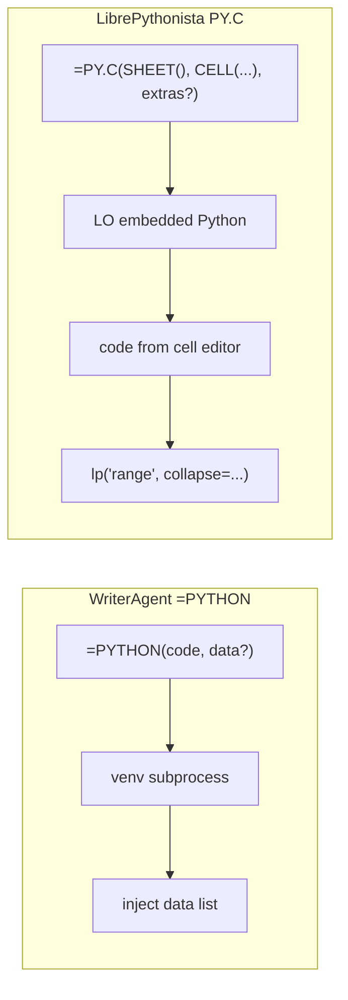

# Enabling Basic Numpy in LibreOffice

Getting a C-compiled library like `numpy` to run reliably inside a LibreOffice extension is challenging, primarily because LibreOffice ships with its own embedded Python interpreter. 

This document outlines what it takes to get `numpy` functioning properly in your extension and evaluates the potential approaches.

## The Core Challenge: ABI Mismatches
`numpy` is not a pure Python library; it contains compiled C/C++ extensions. These compiled libraries must be built against the exact version and ABI (Application Binary Interface) of the Python interpreter that runs them.

- **The Problem**: If a user runs `pip install numpy` using their system Python (e.g., Python 3.12) and your extension loads that `numpy` bundle into LibreOffice's embedded Python (e.g., Python 3.8 or 3.9), the entire LibreOffice instance will fatally crash because the C-extensions are binary-incompatible.
- **The Requirement**: To run `numpy`, it **must** be downloaded or compiled using the exact `python` executable that LibreOffice is using.

---

## Strategy 1: The LibrePythonista Approach (Pip Bootstrapping)
Instead of trying to ship `numpy` inside the `.oxt` extension file, the extension could ship with `pip` and attempt to dynamically install packages into LibreOffice's runtime environment at startup.

**Status**: **Rejected**. While LibrePythonista adopts this pip bootstrapping strategy to download compiled packages dynamically to the user's filesystem, it requires thousands of lines of path resolution code to handle complex host environments (such as Flatpak sandbox boundaries, macOS permissions, and Windows program folder restrictions). This introduces immense architectural complexity and a high risk of runtime failures. We reject this in favor of keeping the extension simple, robust, and completely isolated from embedded interpreter complications.

---

## Strategy 2: The Managed Venv Approach (Deferred/Alternative)
Instead of manually overriding target directories, you could have the extension create its own standard virtual environment.

**Status**: **Deferred**. While this is theoretically the most seamless, we favor Strategy 3 because power users often have custom-optimized `numpy` or `scipy` builds (e.g. MKL, OpenBLAS) or complex data science stacks in their own venvs. Forcing them into a "managed" venv might prevent them from using their preferred, high-performance environments.

---

## Strategy 3: Pointing to an Existing "User-Provided" Venv (CHOSEN)
Rather than creating or bootstrapping a Python environment internally, the extension lets the user point to an existing `.venv` directory they already created on their system.

### The Safe Way (Out-of-Process Execution / Persistent RPC)
Instead of importing `numpy` inside the LibreOffice Python instance, we never mix memory. We shell out to the `python` executable located *inside* the user's venv.

1. **Persistent worker process**: [`PythonWorkerManager`](plugin/scripting/python_worker_manager.py) spawns the venv `python` once and keeps it alive.
2. **Fresh sandbox per execute**: [`worker_harness.py`](plugin/scripting/worker_harness.py) → [`venv_sandbox.py`](plugin/scripting/venv_sandbox.py) runs each request in a new [`LocalPythonExecutor`](plugin/contrib/smolagents/local_python_executor.py) — no variables carry over between `run_venv_python_script` / `=PYTHON()` calls (Writer vs Calc, or successive chat turns).
3. **JSON line protocol**: One request per line on stdin, one response per line on stdout (tool RPC from venv → LO is **not** wired yet; see [§7](#7-future-venv--libreoffice-tool-rpc-deferred)).

**Pros**: Completely sidesteps ABI issues. NumPy will not crash LibreOffice. Supports any Python version the user installs in their venv. Reusing the process avoids spawn overhead on every call.
**Cons**: Requires the user to have a venv ready. Multi-step notebook workflows must re-pass data in code or via `data` / `data_range` — there is no shared kernel state across calls.

---

If you choose this route, there are two fundamentally different ways you can execute their `numpy` installation:

### A: The Dangerous Way (In-Process `sys.path` Injection)
You configure your extension to read the user's provided path and append it to LibreOffice's internal Python path:
```python
import sys
# The user types this path into a LibreOffice settings dialog
user_venv_path = get_user_setting("custom_venv_path")
sys.path.insert(0, f"{user_venv_path}/lib/python3.x/site-packages")

import numpy # Will attempt to load from the user's venv
```
- **The Catch**: This is notoriously fragile. If the user created their `.venv` using their system's Python 3.12, but LibreOffice embeds Python 3.8, `numpy` will immediately crash with a fatal ABI/DLL error. This approach *only* works if the user went out of their way to purposefully construct their `.venv` using the exact minor version (and architecture) of the Python interpreter embedded in LibreOffice.

### B: The Safe Way (Out-of-Process Execution / RPC)
Instead of importing `numpy` inside the LibreOffice Python instance, you never modify `sys.path`. Instead, your extension acts as a thin UI that shells out to the `python` executable located *inside* the user's venv.
1. The user interacts with the UI in LibreOffice.
2. The extension writes target data to a temporary JSON or CSV file.
3. The extension triggers the user's external Python process using `subprocess.Popen("/their/custom/venv/bin/python worker.py")`.
4. That background process loads `numpy`, applies operations, and writes the results back.
5. The LibreOffice extension reads the results back into the spreadsheet/document.

**Pros**: Completely sidesteps ABI issues and embedded interpreter limits. `Numpy` will never crash LibreOffice because the two Python interpreters never mix memory. 
**Cons**: Slower execution due to file/socket I/O overhead. Requires you to handle subprocess lifecycles reliably.


# Python Venv Proxy — User & Developer Specification

## 1. Vision & User Story

WriterAgent users should be able to say things like *"Generate a Monte Carlo simulation with 10,000 samples and put the results in a chart"* and have the AI:

1. Write Python code that uses `numpy`, `pandas`, `scipy`, etc.
2. Execute that code safely against the user's own venv.
3. Use WriterAgent's existing Calc tool-calling APIs (`write_formula_range`, `set_style`, `create_chart`, etc.) to push results into the spreadsheet.

The user never leaves LibreOffice. They never see a terminal. The extension manages the entire lifecycle.

### What the user configures

A single setting in **Settings → Python** (UI label; implementation lives in `plugin/scripting/` to avoid a `python/` package directory):

| Setting | Description | Example |
|---------|-------------|---------|
| `scripting.python_venv_path` | Absolute path to an existing Python venv directory | `~/.writeragent_venv` or `/home/user/data-science-venv` |

If the path is empty, the Python execution feature is disabled. No automatic venv creation — the user brings their own. This is the simplest initial approach and avoids all the ABI/pip bootstrapping complexity from Strategies 1–2 above.

**Shipped today:** the chat tool **`run_venv_python_script`** (`plugin/calc/venv_python.py`) and Calc **`=PYTHON()`** both go through a **single path**: [`run_code_in_user_venv`](plugin/scripting/run_venv_code.py) → [`PythonWorkerManager`](plugin/scripting/python_worker_manager.py) → [`worker_harness.py`](plugin/scripting/worker_harness.py) → [`venv_sandbox.py`](plugin/scripting/venv_sandbox.py) (`LocalPythonExecutor` + fixed `VENV_AUTHORIZED_IMPORTS`) in the configured venv (or **`sys.executable`** when **`scripting.python_venv_path`** is empty). Each call gets a **fresh executor**; the child process stays warm. Assign JSON-serializable output to **`result`**. There is no UNO API inside the child process today (future: §7).

**In-process (separate path):** [`execute_python_script`](plugin/calc/python_executor.py) runs in LibreOffice with `LocalPythonExecutor` (stdlib sandbox, `lp()` / `set_range` helpers). It also starts **fresh on every call** — no per-document variable cache.

### What the user experiences

1. They ask the AI to perform data analysis, statistical computation, or any task requiring libraries not available in LibreOffice's embedded Python.
2. The AI generates Python code (visible in the "Thinking" panel if enabled).
3. A status message appears: *"Running Python script..."*
4. Results flow back into the spreadsheet via normal tool calls.
5. If the script fails, the AI sees the error and can retry with corrected code.

---

## 2. Architecture Overview

```
┌──────────────────────────────────────────────────────────┐
│                    LibreOffice Process                    │
│                                                          │
│  ┌─────────────┐    ┌──────────────────────────────────┐ │
│  │  LLM / Chat │───▶│  run_venv_python_script / =PYTHON │ │
│  │  (tool loop) │    │  → run_code_in_user_venv (one path)│ │
│  └─────────────┘    └──────────┬───────────────────────┘ │
│                                │                         │
│                     ┌──────────▼───────────────────────┐ │
│                     │  PythonWorkerManager             │ │
│                     │  warm venv process               │ │
│                     │  worker_harness → venv_sandbox   │ │
│                     │  (LocalPythonExecutor / request) │ │
│                     └──────────┬───────────────────────┘ │
│                                │                         │
│                     ┌──────────▼───────────────────────┐ │
│                     │  Result Collector                │ │
│                     │  ├─ Captures stdout, return val  │ │
│                     │  ├─ Serializes numpy → lists     │ │
│                     │  └─ Feeds back to LLM            │ │
│                     └──────────┬───────────────────────┘ │
│                                │                         │
│                     ┌──────────▼───────────────────────┐ │
│                     │  LLM calls Calc tools:           │ │
│                     │  write_formula_range, set_style, │ │
│                     │  create_chart, etc.              │ │
│                     └──────────────────────────────────┘ │
└──────────────────────────────────────────────────────────┘
```

### Why subprocess + venv (not LO embedded Python for NumPy)

LibreOffice ships its own embedded Python (often 3.8–3.11). The user's venv is typically newer (3.12+). Running user/LLM scripts **in-process** on LO's interpreter would mix ABIs (NumPy crash) and parse/execute against the wrong Python version.

**Shipped approach:** always shell out to the venv for `run_venv_python_script` / `=PYTHON()`, and run [`LocalPythonExecutor`](plugin/contrib/smolagents/local_python_executor.py) **inside that child** via [`venv_sandbox.py`](plugin/scripting/venv_sandbox.py). `ast.parse()` and imports use the **venv's** Python, while the fixed `VENV_AUTHORIZED_IMPORTS` whitelist blocks `os`, `requests`, etc. Subprocess isolation remains the hard boundary for C extensions.

**Separate in-process path:** [`execute_python_script`](plugin/calc/python_executor.py) still uses `LocalPythonExecutor` in LO's embedded Python (stdlib-only, `lp()` helpers) for light Calc edits without a venv.

---

## 3. Developer Specification

### 3.1 New config keys

Added to `WriterAgentConfig` in `plugin/framework/config.py`:

```python
python_venv_path: str = ""           # Absolute path to user's venv directory
python_exec_timeout: int = 120       # Max seconds for subprocess execution
python_exec_enabled: bool = True     # Master enable/disable
```

### 3.2 Tool: `run_python_script`

A new tool registered in a new module `plugin/calc/python_exec.py` (and/or `plugin/writer/python_exec.py` for Writer context):

```python
class RunPythonScript(ToolBase):
    name = "run_python_script"
    description = """Execute a Python script in the user's configured venv (isolated subprocess).
    Supports numpy, pandas, scipy, scikit-learn, and any library installed in the venv.
    The script should assign results to a variable called `result`.
    Numpy arrays and pandas DataFrames are automatically serialized to lists/dicts."""

    parameters = {
        "type": "object",
        "properties": {
            "code": {
                "type": "string",
                "description": "Python source code to execute. Assign output to `result`."
            }
        },
        "required": ["code"]
    }

    # Calc + Writer (data analysis applies to both)
    uno_services = [
        "com.sun.star.sheet.SpreadsheetDocument",
        "com.sun.star.text.TextDocument",
    ]
    tier = "specialized"
    specialized_domain = "python"
    long_running = True

    def is_async(self):
        return True

    def execute(self, ctx, *, code: str) -> dict:
        ...
```

### 3.3 Subprocess executor

The extension already ships `local_python_executor.py` (in `plugin/contrib/smolagents/`) as part of the OXT package on disk. The worker harness is a small script that the venv's Python runs directly from the extension's install path — it just imports the executor from next door. No copying, no build step, no extra packaging. The venv provides the Python interpreter; the extension provides the safety layer.

#### Worker harness (`plugin/scripting/worker_harness.py`) — **implemented**

Runs in the user's venv Python. Imports `local_python_executor.py` from the extension's own install directory. The venv's `ast` module parses the code (so 3.14 syntax works), and the venv's packages are importable (so numpy/pandas work), but dangerous modules are blocked by the executor.

```python
#!/usr/bin/env python3
"""WriterAgent Python worker — runs in the user's venv.

Protocol: one JSON object per line on stdin, one JSON object per line on stdout.
Request:  {"id": "...", "code": "..."}
Response: {"id": "...", "status": "ok"|"error", "result": ..., "stdout": "...", "error": "..."}
"""
import json
import sys
import os

# local_python_executor.py is already shipped with the extension.
# Resolve it relative to this file's location in the extension directory.
_ext_dir = os.path.dirname(os.path.abspath(__file__))
sys.path.insert(0, os.path.join(_ext_dir, "..", "contrib", "smolagents"))
from local_python_executor import LocalPythonExecutor, InterpreterError

# Libraries the user is allowed to import (beyond the safe base set).
# This is the whitelist — anything not listed here is blocked.
DEFAULT_AUTHORIZED_IMPORTS = [
    "numpy", "numpy.*",
    "pandas", "pandas.*",
    "scipy", "scipy.*",
    "sklearn", "sklearn.*",
    "matplotlib", "matplotlib.*",
    "seaborn", "seaborn.*",
    "sympy", "sympy.*",
    "statsmodels", "statsmodels.*",
    "networkx", "networkx.*",
    "PIL", "PIL.*",
    "cv2",
    "json",
    "csv",
    "decimal",
    "fractions",
    "functools",
    "operator",
    "string",
    "textwrap",
    "enum",
    "dataclasses",
    "typing",
    "copy",
    "pprint",
]

def serialize(obj):
    """Convert numpy/pandas types to JSON-safe Python types."""
    try:
        import numpy as np
        if isinstance(obj, np.ndarray):
            return obj.tolist()
        if isinstance(obj, (np.integer,)):
            return int(obj)
        if isinstance(obj, (np.floating,)):
            return float(obj)
    except ImportError:
        pass
    try:
        import pandas as pd
        if isinstance(obj, pd.DataFrame):
            return obj.to_dict(orient="records")
        if isinstance(obj, pd.Series):
            return obj.tolist()
    except ImportError:
        pass
    if isinstance(obj, (list, tuple)):
        return [serialize(x) for x in obj]
    if isinstance(obj, dict):
        return {str(k): serialize(v) for k, v in obj.items()}
    return obj

def execute_code(executor: LocalPythonExecutor, code: str) -> dict:
    """Run code through a provided (potentially persistent) executor."""
    try:
        output = executor(code)
        # 'result' variable is preferred, but we fall back to the last expression
        result = executor.state.get("result", output.output)
        return {
            "status": "ok",
            "result": serialize(result),
            "stdout": output.logs,
        }
    except InterpreterError as e:
        return {"status": "error", "error": str(e), "stdout": ""}
    except Exception as e:
        return {"status": "error", "error": str(e), "stdout": ""}

def main():
    for line in sys.stdin:
        ...
        request = json.loads(line)
        # Fresh namespace every request (see plugin/scripting/worker_harness.py)
        response = _execute_request(request["code"], request.get("data"))
        ...
```

The **shipped** harness uses vendored [`LocalPythonExecutor`](plugin/contrib/smolagents/local_python_executor.py) via [`plugin/scripting/venv_sandbox.py`](plugin/scripting/venv_sandbox.py): fixed `VENV_AUTHORIZED_IMPORTS` whitelist only (no `find_spec` pre-check at init; missing packages fail when code imports them). Fresh executor per request; numpy/pandas serialization unchanged.

#### Subprocess management (`plugin/scripting/python_worker_manager.py`) — **implemented**

The tool resolves the harness path from the extension's own install directory and spawns the venv Python to run it. Borrowing robust execution patterns from the **Hermes agent**, we include environment scrubbing, UTF-8 enforcement, and bytecode suppression:

```python
import json
import os
import subprocess
import uuid

# Harness lives in the same package as this file
HARNESS_PATH = os.path.join(os.path.dirname(__file__), "worker_harness.py")

def _scrub_env(env: dict) -> dict:
    """Block API keys and secrets from leaking into the child process."""
    blocked_substrings = ("KEY", "TOKEN", "SECRET", "PASSWORD", "AUTH")
    scrubbed = {}
    for k, v in env.items():
        if any(s in k.upper() for s in blocked_substrings):
            continue
        scrubbed[k] = v
    return scrubbed

def _execute_in_subprocess(code: str, venv_path: str, timeout: int = 120) -> dict:
    """Run code in the user's venv via the worker harness."""
    if os.name == "nt":
        venv_python = os.path.join(venv_path, "Scripts", "python.exe")
    else:
        venv_python = os.path.join(venv_path, "bin", "python")

    if not os.path.isfile(venv_python):
        return {"status": "error", "error": f"Python not found at {venv_python}"}

    # Environment hardening
    child_env = _scrub_env(os.environ)
    child_env.update({
        "PYTHONIOENCODING": "utf-8",    # Prevent crashes on non-ASCII output
        "PYTHONUTF8": "1",              # Enable UTF-8 mode (PEP 540)
        "PYTHONDONTWRITEBYTECODE": "1", # Keep user's venv clean
    })

    request = json.dumps({"id": str(uuid.uuid4()), "code": code}) + "\n"

    # Use os.setsid on POSIX to ensure child and its descendants can be killed
    popen_args = {
        "stdin": subprocess.PIPE,
        "stdout": subprocess.PIPE,
        "stderr": subprocess.PIPE,
        "text": True,
        "env": child_env,
    }
    if os.name != "nt":
        popen_args["preexec_fn"] = os.setsid

    proc = subprocess.Popen([venv_python, HARNESS_PATH], **popen_args)

    try:
        stdout, stderr = proc.communicate(input=request, timeout=timeout)
        if proc.returncode != 0:
            return {"status": "error", "error": f"Process exited {proc.returncode}: {stderr}"}
        for line in stdout.strip().split("\n"):
            if line.strip():
                return json.loads(line)
        return {"status": "error", "error": "No output from worker"}
    except subprocess.TimeoutExpired:
        if os.name == "nt":
            proc.kill()
        else:
            import signal
            os.killpg(os.getpgid(proc.pid), signal.SIGKILL)
        proc.wait()
        return {"status": "error", "error": f"Execution timed out after {timeout}s"}
```

### 3.4 Safety model — no separate safety gate needed

Because the worker harness uses `LocalPythonExecutor`, we **do not need a separate AST safety gate** on the LibreOffice side. The safety is enforced at execution time in the subprocess itself:

| Protection | Mechanism in `LocalPythonExecutor` |
|------------|------------------------------------|
| Dangerous imports (`os`, `sys`, `subprocess`, `socket`, etc.) | `DANGEROUS_MODULES` blocklist — checked at import time |
| Dangerous functions (`eval`, `exec`, `compile`, `__import__`) | `DANGEROUS_FUNCTIONS` blocklist — checked at call time |
| Dunder attribute access (`__class__.__subclasses__()` etc.) | `nodunder_getattr` + attribute evaluation guard |
| Infinite loops | `MAX_WHILE_ITERATIONS = 1_000_000` |
| CPU exhaustion | `MAX_OPERATIONS = 10_000_000` |
| Runaway execution | Configurable timeout (default 30s, we set 120s) |
| Library whitelist | Only `additional_authorized_imports` + `BASE_BUILTIN_MODULES` can be imported |

The **import whitelist is the primary control surface**: `numpy`, `pandas`, `scipy`, etc. are listed in `VENV_AUTHORIZED_IMPORTS` in [`venv_sandbox.py`](plugin/scripting/venv_sandbox.py). Everything not on the list (including `os`, `subprocess`, `pathlib`, `socket`) is blocked by the executor when code imports it. WriterAgent removed upstream's `find_spec` pre-check at executor init (see vendored comment in `local_python_executor.py`).

> **Note:** The restricted executor is not a perfect sandbox (Python is too dynamic for language-level sandboxing to be 100% airtight). The subprocess boundary provides the true isolation — even if someone finds an escape path in the AST walker, they're in a separate process with no access to LibreOffice's memory or UNO objects.

### 3.5 Warm process, fresh state (shipped)

| Layer | Behavior |
|-------|----------|
| **`PythonWorkerManager`** | One subprocess per resolved venv `python` executable; respawns on crash/timeout. |
| **`worker_harness.py`** | JSON line loop; delegates to `venv_sandbox.run_sandboxed_code`. |
| **`venv_sandbox.py`** | New `LocalPythonExecutor` per request; `send_tools({})` for `sum`/`len`; inject `data`; return serialized `result`. |
| **Isolation** | Automatic — no `reset` command, no LLM flag, no chat-Clear hook. Writer → Calc → next call never sees prior executor state. |
| **Trade-off** | Faster than spawn-per-call; no notebook-style `df` reuse across tool invocations unless the LLM re-reads data or passes `data` / `data_range`. |

**Future (optional):** opt-in session persistence (e.g. same chat session ID reuses one namespace) would be an explicit product decision, not the default.

#### In-process `execute_python_script`

Same isolation policy: each tool call constructs a new [`PythonExecutor`](plugin/calc/python_executor.py) (new `LocalPythonExecutor`). Stdlib-only imports; use the venv path for numpy.

### 3.7 LLM integration — the two-phase pattern

The LLM does **not** directly insert data into the spreadsheet from the Python script. Instead, the workflow is:

1. **Phase 1 — Compute:** The LLM calls `run_python_script` with numpy/pandas code. The result comes back as serialized JSON (lists, dicts).
2. **Phase 2 — Insert:** The LLM uses the result to call existing Calc tools (`write_formula_range`, `set_style`, `create_chart`) to place the data.

This means:
- The Python script never needs UNO access.
- The Python script never needs to know about LibreOffice.
- The existing Calc tool API handles all document manipulation.
- The LLM acts as the orchestrator between computation and presentation.

#### System prompt addition

```python
PYTHON_EXECUTION_GUIDANCE = """PYTHON EXECUTION:
You can run Python scripts using the run_python_script tool.
- Runs in the user's configured Python venv (isolated subprocess with safety restrictions).
- Supports numpy, pandas, scipy, scikit-learn, matplotlib, sympy, and other whitelisted libraries.
- Assign your output to a variable called `result` — it will be returned to you as JSON.
- numpy arrays → lists, DataFrames → list of row dicts, Series → lists.
- After getting results, use write_formula_range / set_style / create_chart to put data into the spreadsheet.
- Do NOT try to import os, sys, subprocess, or access the filesystem — these are blocked.
- Do NOT try to use open() or pathlib — file access is blocked.

Example workflow:
1. run_python_script(code="import numpy as np\\nresult = np.random.normal(0, 1, 100).tolist()")
2. Use the returned list with write_formula_range to populate cells.
3. Use create_chart to visualize.
"""
```

### 3.8 Settings UI integration

A **Python** tab in the Settings dialog (module id `scripting`, package path `plugin/scripting/`):

| Control | Type | Config key | Default |
|---------|------|------------|---------|
| Enable Python execution | Checkbox | `python_exec_enabled` | `True` (planned; not on initial Python tab) |
| Python venv path | TextField | `scripting.python_venv_path` | `""` (empty = disabled) |
| Test | Button | _(action only; not persisted)_ | Runs a quick `python -c` smoke check on the path shown in the field |
| Execution timeout (seconds) | NumericField | `python_exec_timeout` | `120` (planned) |

Initial implementation: text field plus **Test** (no directory picker yet). The Test action validates that the path is a directory, resolves `bin/python` or `Scripts\\python.exe`, and runs a trivial subprocess check (same ideas as the Browse-flow validation below).

A directory picker (Browse) was deferred; when added, on confirmation the extension would validate:
1. The path exists and is a directory.
2. `bin/python` (or `Scripts/python.exe` on Windows) exists and is executable.
3. Optionally: runs `venv_python --version` to display the Python version to the user.

### 3.7 Module & file layout

No new build steps. The worker harness is just a new `.py` file in `plugin/python/`. It imports the existing `local_python_executor.py` from `plugin/contrib/smolagents/` at runtime.

```
plugin/
├── python/                          # NEW module
│   ├── __init__.py
│   ├── python_exec.py               # RunPythonScript tool + subprocess management
│   └── worker_harness.py            # Entry point run by venv Python (JSON-RPC stdin/stdout)
├── contrib/smolagents/
│   └── local_python_executor.py     # EXISTING — imported by worker_harness.py at runtime
├── framework/
│   ├── config.py                    # MODIFIED — new config keys
│   ├── constants.py                 # MODIFIED — PYTHON_EXECUTION_GUIDANCE
│   └── worker_pool.py              # EXISTING
```

### 3.10 Specialized domain registration

Following the existing pattern in `plugin/calc/base.py`:

```python
class ToolCalcPythonBase(ToolCalcSpecialBase):
    specialized_domain = "python"
    specialized_domain_description: ClassVar[str | None] = (
        "Run Python scripts (numpy, pandas, scipy) and return computed results."
    )
```

This makes the tool available via the existing `delegate_to_specialized_calc_toolset(domain="python")` gateway pattern, keeping it off the default tool list until the LLM needs it.

---

## 4. Future Enhancements

### 4.1 OooDev / ScriptForge integration (deferred)

[OOO Development Tools](https://pypi.org/project/ooo-dev-tools/) provides a high-level Pythonic wrapper around UNO. Rather than bundling it (large dependency, complex UNO bootstrap), future work could:

- **Document it as a recommended venv install:** If the user installs `ooo-dev-tools` in their venv, their Python scripts could potentially manipulate documents directly via OooDev's API.
- **Provide a bridge module:** A small shim in the worker harness that exposes simplified document operations via JSON-RPC callbacks to the LibreOffice process.
- **Alternatively, keep the current model:** The LLM uses Python for computation and WriterAgent tools for document manipulation. This is simpler, safer, and doesn't require OooDev at all.

The current two-phase approach (compute in Python → insert via tools) is recommended as the primary path because it requires zero UNO knowledge from the user's scripts.

### 4.2 Managed venv creation (deferred)

A "Setup Python Environment" button in Settings that:
1. Detects LibreOffice's bundled Python version.
2. Creates a venv using the system Python matching that version (or the LO Python itself).
3. Installs a default set of packages (numpy, pandas, matplotlib).
4. Sets `python_venv_path` automatically.

This is Strategy 2 from the first part of this document, deferred to reduce initial complexity and respect user environment preferences.

### 4.3 Result visualization (deferred)

For matplotlib: the worker harness could save figures to a temp file and return the path. The extension would then insert the image into the document using existing image tools.

---

## 5. Security Summary

| Layer | Mechanism | Protects against |
|-------|-----------|-----------------|
| **Restricted executor** | `LocalPythonExecutor` running in subprocess — AST-walking interpreter with whitelisted builtins, dunder blocking, import whitelist, operation/iteration limits, timeouts | Dangerous imports, `eval`/`exec`, dunder escapes, infinite loops, CPU exhaustion |
| **Import whitelist** | Only `DEFAULT_AUTHORIZED_IMPORTS` (numpy, pandas, scipy, etc.) + `BASE_BUILTIN_MODULES` are importable | `os.remove()`, `subprocess.run()`, `socket` connections, filesystem access |
| **Subprocess isolation** | Separate process, separate Python interpreter, no shared memory with LO | ABI crashes, C-extension segfaults, memory corruption, UNO state corruption |
| **Environment scrubbing** | Removing `KEY`, `TOKEN`, `SECRET`, etc. from child process env | LLM-generated scripts exfiltrating API keys or credentials |
| **User-provided venv** | User explicitly opts in and controls what's installed | Supply-chain attacks (user manages their own packages) |
| **Execution timeout** | Configurable per-execution wall clock limit (default 120s) | Runaway computation |

> [!IMPORTANT]
> This architecture draws on best practices from the **Hermes agent**'s robust execution model, including UTF-8 enforcement for stdio, bytecode suppression, and process group isolation (`os.setsid`) to ensure clean resource management.
>
> Two independent layers protect LibreOffice: (1) the restricted executor blocks dangerous code at the AST level before it runs, and (2) the subprocess boundary ensures that even if the executor is bypassed, the attacker is in a separate process with no access to LibreOffice's memory, UNO objects, or document data. The code is LLM-generated (not arbitrary user input), which further limits the threat surface.

---

## 6. Vendoring & Reference Files

We can leverage or vendor specific utility modules from the **Hermes agent** to ensure our subprocess and environment management is robust across all platforms.

### 6.1 Subprocess & Windows Compatibility
**File:** [_subprocess_compat.py](file:///home/keithcu/.hermes/hermes-agent/hermes_cli/_subprocess_compat.py)
*   **What to vendor:** This file is almost entirely standalone.
*   **Key features:**
    *   `windows_hide_flags()`: Returns `CREATE_NO_WINDOW` creation flags for Windows to prevent console flashes during version probes.
    *   `windows_detach_flags()`: Correctly detaches background processes on Windows (where `start_new_session=True` is a no-op).
    *   `resolve_node_command()`: Logic for resolving `.cmd` shims on Windows (useful if we ever add npm-based tools).

### 6.2 Environment Scrubbing & Sandboxing
**File:** [code_execution_tool.py](file:///home/keithcu/.hermes/hermes-agent/tools/code_execution_tool.py)
*   **What to borrow:** Specifically the `_scrub_child_env` function (lines 118-153) and the `_execute_local` block (lines 1165-1241).
*   **Key features:**
    *   **Secret Filtering:** Exhaustive list of substrings (`KEY`, `TOKEN`, `SECRET`, `PASSWORD`, `AUTH`, `CREDENTIAL`) to block from the child process.
    *   **OS Essentials:** Logic for which variables *must* be passed through on Windows for `socket` and `subprocess` to function (e.g., `SYSTEMROOT`, `COMSPEC`).
    *   **UTF-8 Enforcement:** Setting `PYTHONIOENCODING="utf-8"` and `PYTHONUTF8="1"` to prevent encoding-related crashes in the worker.

### 6.3 Output Truncation & Pagination
**File:** [tool_output_limits.py](file:///home/keithcu/.hermes/hermes-agent/tools/tool_output_limits.py)
*   **What to borrow:** The concept of centralized truncation limits (`max_bytes`, `max_lines`) to keep the LLM context window clean.
*   **Key features:**
    *   Standardizing on ~50KB (`DEFAULT_MAX_BYTES`) for large tool outputs (like Pandas dataframes or terminal logs).
    *   `_coerce_positive_int`: Defensive parsing of configuration values.

---

## 7. Future: venv ↔ LibreOffice tool RPC (deferred)

> **Status:** **Not implemented.** [`writeragent_api.py`](plugin/scripting/writeragent_api.py) is generated and documents the intended API, but the warm worker does **not** dispatch `tool_call` lines yet. User scripts must return `result` and let the LLM call Calc/Writer tools in a second phase. The old one-shot `VenvInteractiveRunner` bridge was removed in favor of a single execution path through `PythonWorkerManager`.
>
> **When implementing**, extend `PythonWorkerManager.execute()` read loop to handle worker stdout lines where `type == "tool_call"`, dispatch via `ToolRegistry.execute()` (with domain whitelist), write `tool_result` JSON to worker stdin, and only return to the caller when the harness emits the final `code_result` line. Keep **fresh namespace per top-level execute**; tool RPC happens *inside* one request. Do not add a separate `reset` command.

### 7.1 Vision (planned)

User scripts running in the venv subprocess should be able to call WriterAgent's existing tool-calling APIs as simple Python methods — no UNO knowledge, no manual JSON-RPC wiring:

```python
import numpy as np
from writeragent_api import footnote

# Compute in the user's venv (numpy, pandas, whatever they have)
data = np.random.normal(0, 1, 100)
mean_val = float(data.mean())

# Call WriterAgent tools — proxied back to LibreOffice via JSON-RPC
footnote.insert(note_type="footnote", text=f"Computed mean: {mean_val:.4f}")
```

> [!IMPORTANT]
> **Domain-scoped, not open-ended.** A script does **not** see every tool WriterAgent has — that would overwhelm the LLM's context window with hundreds of tool schemas and make the prompt unmanageable. Instead, each `run_venv_python_script` invocation is **delegated to a single specialized domain** (e.g. `footnotes`, `bookmarks`, `calc_data`, or `core` when no specialized domain is needed). The proxy module injected into the worker only contains the tools for **that domain**. This mirrors the existing `delegate_to_specialized_writer_toolset(domain="footnotes")` pattern: the LLM picks the domain, the host generates a domain-scoped proxy, and the script can only call those tools.

The proxy module (`writeragent_api.py`) is **auto-generated** from the existing `ToolBase` subclass metadata at build time. Every tool's `name`, `description`, `parameters` (JSON Schema), and `required` fields are already machine-readable — the codegen script just translates them into Python function signatures. The codegen emits **all** domains into a single file; the worker harness then exposes only the active domain's namespace at runtime.

### 7.2 Architecture

```
User's venv Python (subprocess)             LibreOffice Process
┌──────────────────────────────┐           ┌──────────────────────────────┐
│  import numpy as np          │           │  PythonWorkerManager         │
│  data = np.random.normal()   │           │                              │
│                              │           │  ┌────────────────────────┐  │
│  from writeragent_api        │  JSON-RPC │  │  ToolRegistry          │  │
│       import footnote        │  request  │  │    .execute(           │  │
│                              │ ────────→ │  │      "footnotes_insert"│  │
│  footnote.insert(            │           │  │      ctx, **kwargs)    │  │
│    note_type="footnote",     │  JSON-RPC │  │                        │  │
│    text="See source."        │  response │  │    → UNO calls         │  │
│  )                           │ ←──────── │  │    → result dict       │  │
│                              │           │  └────────────────────────┘  │
└──────────────────────────────┘           └──────────────────────────────┘
```

The proxy methods in the subprocess are thin wrappers that:
1. Serialize the function call as a JSON-RPC message on **stdout**
2. Block waiting for a response on **stdin**
3. Deserialize and return the result (or raise on error)

When built, `PythonWorkerManager` would intercept `tool_call` messages (vs normal result lines), dispatch through `ToolRegistry.execute()`, and write responses to the worker's stdin.

### 7.3 JSON Schema → Python Signature Mapping

Every `ToolBase` subclass already carries a `parameters` dict in JSON Schema format. The mapping to Python function signatures is mechanical:

| JSON Schema `type` | Python type hint | Default (when optional) |
|---|---|---|
| `"string"` | `str` | `""` |
| `"integer"` | `int` | `0` |
| `"boolean"` | `bool` | `True` or `False` (from schema `default` or type default) |
| `"number"` | `float` | `0.0` |
| `"object"` | `dict` | `{}` |
| `"array"` | `list` | `[]` |

Parameters in the `required` list become **positional arguments**. All others become **keyword-only arguments** (after `*`) with sensible defaults derived from the schema or the type's zero value.

#### Example: `FootnotesInsert` tool schema → generated function

**Source tool** ([`plugin/writer/specialized/footnotes.py`](file:///home/keithcu/Desktop/Python/writeragent/plugin/writer/specialized/footnotes.py)):
```python
class FootnotesInsert(ToolWriterFootnoteBase):
    name = "footnotes_insert"
    parameters = {
        "type": "object",
        "properties": {
            "note_type": {"type": "string", "enum": ["footnote", "endnote"], ...},
            "text":      {"type": "string", ...},
            "label":     {"type": "string", ...},
            "insert_after_text": {"type": "string", ...},
            "occurrence": {"type": "integer", ...},
            "case_sensitive": {"type": "boolean", ...},
        },
        "required": ["note_type", "text"],
    }
```

**Generated proxy function:**
```python
def insert(note_type: str, text: str, *, label: str = "",
           insert_after_text: str = "", occurrence: int = 0,
           case_sensitive: bool = True) -> dict:
    """Inserts a new footnote or endnote. Without insert_after_text, uses
    the current view cursor. ..."""
    return _rpc_call("footnotes_insert",
                     note_type=note_type, text=text, label=label,
                     insert_after_text=insert_after_text,
                     occurrence=occurrence, case_sensitive=case_sensitive)
```

### 7.4 Tool Grouping Strategy

Tools are grouped into proxy namespaces by **name prefix** (the part before the first `_` in tool names that share a common prefix pattern). The codegen strips the group prefix from method names:

| Tool `name` | Proxy namespace | Method name |
|---|---|---|
| `footnotes_insert` | `footnote` | `insert()` |
| `footnotes_list` | `footnote` | `list()` |
| `footnotes_edit` | `footnote` | `edit()` |
| `footnotes_delete` | `footnote` | `delete()` |
| `footnotes_settings_get` | `footnote` | `settings_get()` |
| `footnotes_settings_update` | `footnote` | `settings_update()` |
| `bookmarks_insert` | `bookmark` | `insert()` |
| `bookmarks_list` | `bookmark` | `list()` |
| `write_formula_range` | `calc` | `write_formula_range()` |

The grouping can also be derived from the **base class hierarchy** (e.g. `ToolWriterFootnoteBase` → `footnote` namespace), which is more reliable for tools whose name prefixes don't follow the `domain_action` pattern. The codegen script supports both strategies.

### 7.5 Codegen Script

A build-time script that introspects the `ToolRegistry` and emits `writeragent_api.py`:

```python
#!/usr/bin/env python3
"""Generate writeragent_api.py — Python proxy module for venv subprocess tool calls.

Usage: python scripts/generate_tool_proxies.py > plugin/scripting/writeragent_api.py
"""
import textwrap
from collections import defaultdict
from plugin.framework.tool import ToolBase

JSON_TO_PYTHON = {
    "string": "str", "integer": "int", "boolean": "bool",
    "number": "float", "object": "dict", "array": "list",
}

DEFAULTS_BY_TYPE = {
    "string": '""', "integer": "0", "boolean": "True",
    "number": "0.0", "object": "{}", "array": "[]",
}


def _param_default(schema: dict) -> str:
    """Derive a Python default value from a JSON Schema property."""
    if "default" in schema:
        return repr(schema["default"])
    return DEFAULTS_BY_TYPE.get(schema.get("type", ""), "None")


def schema_to_signature(tool: ToolBase) -> tuple[list[str], list[str]]:
    """Convert a tool's JSON Schema parameters to Python positional and keyword args."""
    props = (tool.parameters or {}).get("properties", {})
    required = set((tool.parameters or {}).get("required", []))

    positional, keyword = [], []
    for param_name, schema in props.items():
        py_type = JSON_TO_PYTHON.get(schema.get("type", ""), "Any")
        if param_name in required:
            positional.append(f"{param_name}: {py_type}")
        else:
            default = _param_default(schema)
            keyword.append(f"{param_name}: {py_type} = {default}")
    return positional, keyword


def generate_proxy_function(tool: ToolBase, short_name: str) -> str:
    """Emit one proxy function for a tool."""
    pos, kw = schema_to_signature(tool)
    if kw:
        all_params = ", ".join(pos + ["*"] + kw)
    else:
        all_params = ", ".join(pos)

    all_param_names = list((tool.parameters or {}).get("properties", {}).keys())
    kwargs_body = ", ".join(f"{p}={p}" for p in all_param_names)

    # Truncate description to first sentence for the docstring
    desc = (tool.description or "").split(". ")[0] + "."

    return textwrap.dedent(f'''\
    def {short_name}({all_params}) -> dict:
        """{desc}"""
        return _rpc_call("{tool.name}", {kwargs_body})
    ''')


def group_tools(tools: list[ToolBase]) -> dict[str, list[tuple[str, ToolBase]]]:
    """Group tools by namespace prefix, stripping the prefix from method names."""
    groups: dict[str, list[tuple[str, ToolBase]]] = defaultdict(list)
    for tool in tools:
        name = tool.name or ""
        # Split on first underscore: "footnotes_insert" -> ("footnotes", "insert")
        if "_" in name:
            prefix, rest = name.split("_", 1)
            # Singularize common plurals for nicer namespace names
            namespace = prefix.rstrip("s") if prefix.endswith("s") else prefix
        else:
            namespace = "tools"
            rest = name
        groups[namespace].append((rest, tool))
    return dict(groups)


def generate_module(tools: list[ToolBase]) -> str:
    """Generate the complete writeragent_api.py module."""
    groups = group_tools(tools)

    lines = [
        '"""Auto-generated WriterAgent tool proxy API.',
        '',
        'Generated by scripts/generate_tool_proxies.py — DO NOT EDIT.',
        'Provides Python-native access to WriterAgent tools from venv subprocess scripts.',
        '"""',
        'import json, sys, threading, uuid',
        '',
        '',
        '# ── RPC transport ──────────────────────────────────────────────',
        '_lock = threading.Lock()',
        '',
        '',
        'def _rpc_call(tool_name: str, **kwargs) -> dict:',
        '    """Send a tool call to the LibreOffice host and block for the result."""',
        '    call_id = str(uuid.uuid4())',
        '    request = {"type": "tool_call", "id": call_id, "tool": tool_name, "args": kwargs}',
        '    with _lock:',
        '        sys.stdout.write(json.dumps(request) + "\\n")',
        '        sys.stdout.flush()',
        '        # Block for response (host writes to our stdin)',
        '        line = sys.stdin.readline()',
        '    if not line:',
        '        raise ConnectionError("Lost connection to LibreOffice host")',
        '    response = json.loads(line)',
        '    if response.get("status") == "error":',
        '        raise RuntimeError(response.get("message", response.get("error", "Unknown error")))',
        '    return response',
        '',
        '',
    ]

    for namespace, tool_list in sorted(groups.items()):
        # Emit a class that acts as a namespace
        lines.append(f'class _{namespace.title()}Proxy:')
        lines.append(f'    """Proxy for {namespace} tools."""')
        lines.append('')

        for short_name, tool in tool_list:
            # Generate method (indented inside the class)
            pos, kw = schema_to_signature(tool)
            if kw:
                all_params = "self, " + ", ".join(pos + ["*"] + kw)
            else:
                all_params = "self, " + ", ".join(pos)

            all_param_names = list((tool.parameters or {}).get("properties", {}).keys())
            kwargs_body = ", ".join(f"{p}={p}" for p in all_param_names)

            desc = (tool.description or "").split(". ")[0] + "."

            lines.append(f'    def {short_name}({all_params}) -> dict:')
            lines.append(f'        """{desc}"""')
            lines.append(f'        return _rpc_call("{tool.name}", {kwargs_body})')
            lines.append('')

        # Singleton instance
        lines.append(f'{namespace} = _{namespace.title()}Proxy()')
        lines.append('')
        lines.append('')

    return "\n".join(lines)
```

### 7.6 Build Integration

```makefile
# Makefile
proxy-stubs:
	$(PYTHON) scripts/generate_tool_proxies.py > plugin/scripting/writeragent_api.py
```

The generated file ships inside the OXT. The worker harness makes it importable:

```python
# In worker_harness.py — add to sys.path so user scripts can import it
sys.path.insert(0, os.path.join(_ext_dir, "..", "scripting"))
```

### 7.7 Bidirectional RPC Protocol Extension

The existing worker protocol is unidirectional (host sends code → worker returns result). To support tool proxies, the protocol becomes **bidirectional**:

#### Message types (worker → host)

| `type` | Meaning | Fields |
|---|---|---|
| `"code_result"` | Normal script result (existing) | `id`, `status`, `result`, `stdout` |
| `"tool_call"` | Proxy requesting a tool execution | `id`, `tool`, `args` |

#### Message types (host → worker)

| `type` | Meaning | Fields |
|---|---|---|
| `"execute"` | Run code (existing) | `id`, `code` |
| `"tool_result"` | Response to a `tool_call` | `id`, `status`, `result` or `error` |

#### Host-side changes (`PythonWorkerManager`)

```python
# In the read loop that processes worker stdout:
def _process_worker_message(self, msg: dict, ctx: ToolContext) -> dict | None:
    """Handle a message from the worker subprocess."""
    if msg.get("type") == "tool_call":
        # Worker is requesting a tool execution — dispatch through the registry
        tool_name = msg["tool"]
        args = msg.get("args", {})
        call_id = msg["id"]

        try:
            result = self._registry.execute(tool_name, ctx, **args)
        except Exception as e:
            result = {"status": "error", "message": str(e)}

        # Send the result back to the worker's stdin
        response = {"type": "tool_result", "id": call_id, **result}
        self._proc.stdin.write(json.dumps(response) + "\n")
        self._proc.stdin.flush()

        # Continue reading — the worker hasn't finished its script yet
        return None  # signal: keep reading

    # Normal code result — return to caller
    return msg
```

### 7.8 Which Tools to Expose — Domain-Scoped Delegation

The proxy API is **not** a flat list of every tool in the registry. Exposing all tools would:
- Blow up the LLM prompt (each tool's full JSON Schema must be included for the LLM to generate correct calls).
- Create a confusing API surface where footnote tools sit next to pivot table tools.
- Widen the security surface unnecessarily.

Instead, the proxy follows the **same domain delegation model** the chat sidebar already uses:

1. **The LLM picks a domain.** When the LLM decides a task needs Python + document manipulation, it calls `delegate_to_specialized_writer_toolset(domain="footnotes")` (or `"bookmarks"`, `"calc_data"`, `"core"`, etc.) — exactly as it does today for non-Python specialized work.
2. **The host generates a domain-scoped prompt.** The `PythonWorkerManager` calls `registry.get_tools(active_domain="footnotes")` to get only the tools for that domain. Their schemas are serialized into the system prompt so the LLM knows what's callable.
3. **The worker only sees that domain's proxy.** The auto-generated `writeragent_api.py` contains classes for every domain, but at startup the worker harness receives a `domain` field in the initial handshake and only imports/exposes the matching namespace (e.g. `from writeragent_api import footnote`). All other namespaces remain inaccessible.
4. **Host-side enforcement.** Even if a script somehow constructs a raw `_rpc_call("some_other_tool", ...)`, the host's `_process_worker_message` checks the tool name against the active domain's whitelist and rejects calls outside it.

#### Domain → proxy namespace mapping

| Delegation domain | Proxy namespace available | Example tools |
|---|---|---|
| `"footnotes"` | `footnote` | `insert()`, `list()`, `edit()`, `delete()` |
| `"bookmarks"` | `bookmark` | `create()`, `list()`, `delete()` |
| `"comments"` | `comment` | `add_cell_comment()`, `list_comments()` |
| `"writer"` | `writer` | `get_document_tree()`, `apply_document_content()` |
| `"calc"` | `calc` | `read_cell_range()`, `write_formula_range()` |
| `"draw"` | `draw` | `add_slide()`, `get_draw_tree()` |
| `"core"` | `core` | `web_research()`, `upsert_memory()` |

When no specialized domain is needed (pure computation that just returns `result`), the LLM delegates with `domain="python"` as today — no proxy tools are injected, and the script has no document access.

#### Filtering rules within a domain

- **Tier:** Include `core` tools only when `domain="core"`. Include `specialized` tools for the matching domain. Always skip `specialized_control` (internal orchestration like `specialized_workflow_finished`).
- **Document type:** Only include tools compatible with the current document's UNO services.
- **Safety:** Mutation tools are clearly marked in generated docstrings. The host can optionally require `approval_callback` for proxy-initiated mutations.

### 7.9 Future: Type Stubs for IDE Completion

The codegen script can also emit a `.pyi` stub file so users get autocomplete in their IDE:

```python
# writeragent_api.pyi (type stub)
class _FootnoteProxy:
    def insert(self, note_type: str, text: str, *, label: str = "",
               insert_after_text: str = "", occurrence: int = 0,
               case_sensitive: bool = True) -> dict: ...
    def list(self, note_type: str) -> dict: ...
    def edit(self, note_type: str, index: int, *, text: str = "",
             label: str = "") -> dict: ...
    def delete(self, note_type: str, index: int) -> dict: ...
    def settings_get(self, note_type: str) -> dict: ...
    def settings_update(self, note_type: str, properties: dict) -> dict: ...

footnote: _FootnoteProxy

class _CalcProxy:
    def write_formula_range(self, range: str, values: list) -> dict: ...
    ...

calc: _CalcProxy
```

This means the user gets full IDE support (autocomplete, type checking, hover docs) even though the actual execution happens over RPC.

---

## 8. The `=PYTHON()` Calc Function

Users and the LLM can run Python from Calc via the **`=PYTHON()`** add-in formula. The chat path is **`run_venv_python_script`** ([`plugin/calc/venv_python.py`](../plugin/calc/venv_python.py)); both use the same venv subprocess runner ([`plugin/scripting/run_venv_code.py`](../plugin/scripting/run_venv_code.py)).

Configure **Settings → Python** → `scripting.python_venv_path` (see [Python Venv Proxy](#python-venv-proxy--user--developer-specification) above). If empty, the extension falls back to LibreOffice’s `sys.executable`.

### Formula parameters

IDL: `string python( [in] string code, [in] any data );` in [`extension/idl/XPromptFunction.idl`](../extension/idl/XPromptFunction.idl). Rebuild [`extension/XPromptFunction.rdb`](../extension/XPromptFunction.rdb) after IDL changes (`scripts/rebuild_xprompt_rdb.sh` or `unoidl-write` when the LibreOffice SDK is installed).

| Arg | Name | Required | Role |
|-----|------|----------|------|
| 0 | `code` | Yes | Python source. Assign the cell value to **`result`** (or rely on the last expression if you set `_`; the runner prefers `result`). |
| 1 | `data` | No | Optional cell range. Values are injected as variable **`data`** before your code runs (see [Data handoff and shaping](#data-handoff-and-shaping) below). |

### Usage

```text
=PYTHON("result = 3 ** 8")
=PYTHON("result = sum(data)", A1:A10)
=PYTHON("import numpy as np; result = float(np.sum(data))", A1:C10)
```

### How it runs (implementation)

- **Out-of-process**: `=PYTHON()` uses the same warm worker as `run_venv_python_script` (Strategy 3). NumPy/Pandas stay in the venv; LibreOffice’s embedded interpreter is not used for formula evaluation.
- **Sandboxed in the venv**: [`venv_sandbox.py`](plugin/scripting/venv_sandbox.py) runs vendored `LocalPythonExecutor` with a fixed import whitelist (`VENV_AUTHORIZED_IMPORTS`). Isolation is **subprocess** + **fresh executor per evaluation**.
- **No cross-cell persistence**: Variables from one `=PYTHON` cell are **not** visible in another (by design).
- **In-process chat tool**: [`execute_python_script`](../plugin/calc/python_executor.py) is separate — stdlib sandbox, `lp()` helpers, fresh state per call; not used by `=PYTHON()`.

### Why this is useful

- **ABI stability** with user-provided venvs and heavy C extensions.
- **Beginner-friendly data**: optional second argument → `sum(data)` on a row or column without pandas.
- **No-code bridge**: `=PROMPT("Write a Python formula…")` can produce a pasteable `=PYTHON(...)` string (see [§9](#9-vision-the-code-oracle--self-modifying-spreadsheets)).

### Comparison with LibrePythonista (`PY.C` and `lp()`)

[LibrePythonista](https://github.com/Amourspirit/python_libre_pythonista_ext) uses a **different** Calc integration: Python lives in a **cell code editor**, and the visible formula is metadata, not the program text.



**LibrePythonista formula:** `PY.C(sheetIdx, cAddress, extras?)` ([`XPy.idl`](https://github.com/Amourspirit/python_libre_pythonista_ext/blob/main/oxt/sources/XPy.idl))

| Arg | Name | Optional | Role |
|-----|------|----------|------|
| 0 | `sheetIdx` | No | Sheet index (typically `SHEET()`) |
| 1 | `cAddress` | No | Cell address (typically `CELL("ADDRESS")`) — which Python cell is running |
| 2 | `extras` | Yes | Optional range whose changes **trigger recalculation** of this formula |

There is **no code string** on the add-in; source is stored via the LibrePy UI.

**LibrePythonista in-code helper:** `lp(addr, **kwargs)` ([`lp_mod.py`](https://github.com/Amourspirit/python_libre_pythonista_ext/blob/main/oxt/pythonpath/libre_pythonista_lib/doc/calc/doc/sheet/cell/code/mod_helper/lp_mod.py))

| Parameter | Role |
|-----------|------|
| `addr` (required) | `A1`, `B1:C5`, `Sheet1.A1`, named range, database range |
| `collapse=True` | Trim trailing empty rows so growing tables auto-expand |
| `column_types={...}` | Column hints (e.g. `"date"`) for pandas conversion |
| (headers) | Auto-detected when the first row is all strings; ranges return **pandas DataFrames** |

**Capability comparison** (post-`code` / data surface — compare features, not arg index):

| Capability | WriterAgent `data` (arg 1) | LibrePythonista |
|------------|---------------------------|-----------------|
| Pass one range into Python | Yes — flat list or 2D list | `lp("A1:B10")` inside code |
| Multiple ranges in one formula | No (single `data` only) | Yes — multiple `lp()` calls |
| Named ranges | Only if referenced as the 2nd arg | `lp("MyRange")` |
| Dynamic table / trim empty rows | No | `collapse=True` on `lp()` |
| Typed date columns | Raw Calc values | `column_types` + pandas |
| Return type for ranges | `list` / `list[list]` | `pandas.DataFrame` |
| Recalc when inputs change | Calc depends on `data` range | `extras` + references inside `lp()` |
| Cell context (“where am I?”) | Not exposed | `sheetIdx` + `cAddress` |
| Execution environment | User venv (numpy-safe) | LO embedded Python + pip bootstrap |

**What we kept:** a **two-argument** formula (`code` + optional `data`) fits “paste Python in the formula bar + venv numpy”. Flat 1D shaping for single rows/columns is intentional ([`normalize_python_data_shape`](../plugin/calc/calc_addin_data.py)).

**What we did not copy:** `PY.C`’s sheet/address metadata, in-LO pandas bootstrap, or mandatory `lp()` for every read.

### Code in the formula bar vs code outside the cell

LibreOffice Calc does **not** ship a Python cell code editor. That UI is **entirely extension-defined**. LibrePythonista builds a parallel product surface on top of Calc:

| | **WriterAgent `=PYTHON()`** | **LibrePythonista** |
|---|---------------------------|---------------------|
| Where users edit | Formula bar (or wizard): code is a **string inside** `=PYTHON("…")` | **LibrePy** menu → Insert Python; **Edit Code** on the cell; optional experimental editor in extension options |
| What the cell displays | The full formula including source | A short formula such as `=PY.C(SHEET(),CELL("ADDRESS"), extras?)` — metadata only |
| Where source lives | Inside the `.ods` as part of the formula | **Outside** the formula: per-cell source managed by `PySourceManager` (document JSON under an LP root URI, cell custom properties, code names, listeners) |
| Editor technology | Stock Calc input line | XDL dialog and/or a **separate subprocess** webview editor (`lp_py_editor`, optional `librepythonista-python-editor` package) with syntax highlighting |

So “python in cells” for LibrePythonista really means **python bound to cells**, not python typed into the visible formula. WriterAgent’s model is **python in the formula** — closer to `=PROMPT("…")` than to `PY.C`.

**Why code-in-formula is a good starting point**

- **Each cell can be a small function:** inputs via literals, the optional `data` range, or references to other cells; output via `result`. Standard spreadsheet composition (`=PYTHON(..., A1:A10)` next to `=AVERAGE(B1:B10)`) chains behavior without a shared notebook kernel.
- **Transparent and portable:** the logic travels with the sheet; copy/paste and version control see the formula. No hidden sidecar unless you add one later.
- **Aligns with AI generation:** `=PROMPT("write a PYTHON formula…")` can emit a single pasteable `=PYTHON("…")` string.
- **Fits the venv path:** execution already shells out; the formula only needs to pass a string and optional range.

**When external storage + editor wins**

- **Long scripts** (dozens of lines): formula length, escaping quotes, and the input line become painful.
- **Multi-line editing** with indentation, completion, and debugging — LibrePythonista’s editor subprocess exists for this.
- **Stable cell address** while refactoring code: LP keeps source keyed by cell identity; you edit code without rewriting a giant escaped string.
- **Notebook-style globals** across cells: LP’s shared `PyModule` and `lp()` cache; WriterAgent does not persist state across `=PYTHON` calls today (see [How it runs](#how-it-runs-implementation)).

**Design stance:** treat each `=PYTHON` cell as a **pure function** when you can (`data` in → `result` out). You often do **not** need code outside the cell if sheets are built as pipelines of small formulas. Reach for external storage when scripts grow or UX demands an IDE-like editor — not as the default for every user.

### Could WriterAgent add a LibrePythonista-style editor?

**Not required for numpy or venv execution** — only for authoring comfort. Below is a realistic effort sketch based on LibrePythonista’s architecture ([`py_source_manager.py`](https://github.com/Amourspirit/python_libre_pythonista_ext/blob/main/oxt/pythonpath/libre_pythonista_lib/doc/calc/doc/sheet/cell/code/py_source_manager.py), [`py_edit_cell_job.py`](https://github.com/Amourspirit/python_libre_pythonista_ext/blob/main/oxt/ext_code/jobs/py_edit_cell_job.py), [`lp_py_editor`](https://github.com/Amourspirit/python_libre_pythonista_ext/tree/main/oxt/pythonpath/libre_pythonista_lib/dialog/webview/lp_py_editor)) versus what WriterAgent already has ([`plugin/chatbot/dialogs.py`](../plugin/chatbot/dialogs.py) XDL loading, [`EditInputDialog.xdl`](../extension/WriterAgentDialogs/EditInputDialog.xdl) multiline field, [`prompt_function.py`](../plugin/calc/prompt_function.py)).

#### Tier 1 — “Edit formula code” dialog (small–medium, ~1–2 weeks)

**Idea:** Calc menu or context action on the active cell: if the formula is `=PYTHON(...)`, open a modal XDL dialog with a large multiline `Edit` control, show the **decoded** Python body, on OK rewrite `=PYTHON("…", optional range)`.

**Reuse today**

- `DialogProvider` + XDL pattern (same as Settings and [`input_box`](../plugin/chatbot/dialog_views.py)).
- Formula parsing: extract string arg 0 (watch escaped `"` and `;` inside strings).
- Execution unchanged: still `prompt_function.python(code, data)`.

**Work**

- New `PythonEditDialog.xdl` + listener.
- Register Calc menu item / dispatch handler in [`plugin/main.py`](../plugin/main.py) (WriterAgent already uses `XJob` / menu dispatch for other actions).
- Robust stringify when writing back (`repr` / escape for formula bar).
- Tests: round-trip parse/write; UNO test optional.

**Limits:** code still lives **inside** the formula; very long source hits Calc formula length and readability ceilings. No syntax highlighting unless you embed a rich control (hard in UNO).

#### Tier 2 — Hybrid: short formula + stored source (medium, ~3–6 weeks)

**Idea:** Cell shows `=PYTHON_ID("a1b2c3", A1:A10)` or keep `=PYTHON` but arg 0 is a **key**; body stored in document custom properties, a named JSON blob in `settings.xml` / user storage, or a side file under the document URL (LibrePythonista uses document-scoped JSON via `cmd_lp_doc_json_file` and related commands).

**Work**

- Storage API (per doc + cell address): read/write/delete source; migrate on copy/paste row.
- `prompt_function.python`: if `code` looks like a key or starts with `#`, resolve from store.
- Editor dialog (Tier 1) edits store, not a 4 KB formula string.
- Recalc: formula still references `data` range; optional third arg later for LP-style `extras`.
- Tests for save/load, rename sheet, delete cell.

**Value:** best balance for “code outside the cell” without cloning LibrePythonista.

#### Tier 3 — LibrePythonista parity (large, many months)

LibrePythonista’s surface area is not “a few dialogs” — it includes:

- **Insert Python** workflow that installs controls, sets `PY.C` array formulas, and registers cell listeners.
- **`PySourceManager`** + CQRS command/query layers for cell props, code names, shapes, sheet activation, modify triggers.
- **In-LO execution** with shared `PyModule`, `lp()`, pandas, pip bootstrap — different from WriterAgent’s venv subprocess model.
- **Webview editor subprocess** (IPC, optional debugpy, theme sync).

Porting that wholesale while keeping WriterAgent’s venv/numpy story would duplicate maintenance. Reasonable only if Calc-native Python becomes a primary product pillar.

#### Suggested path for WriterAgent

1. **Now:** document and promote the **function-per-cell** pattern (`data` + `result` + cell references).
2. **Next incremental win:** Tier 1 dialog (“Edit PYTHON code”) — low risk, immediate UX gain for long one-liners and small blocks.
3. **If users outgrow formula length:** Tier 2 storage + short formula reference — design keys and migration before investing in a webview editor.
4. **Defer:** Tier 3 unless committed to a Calc-first Python product competing with LibrePythonista on its own terms.

| Tier | User sees | Code location | Rough effort | Fits venv `=PYTHON`? |
|------|-----------|---------------|--------------|----------------------|
| 0 (today) | Formula bar only | Inside `=PYTHON("…")` | Done | Yes |
| 1 | Edit dialog | Still in formula | Small–medium | Yes |
| 2 | Edit dialog | Document store; short formula | Medium | Yes |
| 3 | LP-like menus, webview IDE | LP-style infrastructure | Very large | Only if execution model aligned |

### Data handoff and shaping

**`=PYTHON()`** and **`run_venv_python_script`** (LLM tool, **Calc only**) inject range values as **`data`**. In Writer and Draw, the LLM tool exposes only **`code`** and **`timeout_sec`** — no `data` injection; use document tools for content.

**Examples**

- **One row or column:** `=PYTHON("result = sum(data)", A1:A10)` → flat `[v1, v2, …]` so `sum`, `max`, and list comprehensions work without indexing.
- **2D block:** `=PYTHON("result = sum(sum(row) for row in data)", A1:C10)` — see shape table below.
- **NumPy (venv):** `import numpy as np; result = float(np.sum(data))` for flat or 2D lists.
- **LLM tool (Calc):** optional **`data_range`** (A1, read on host) or **`data`** (array). `data_range` wins if both are set.

**Calc vs Writer (LLM tool)**

| Context | `data` / `data_range` in schema? | Injected in subprocess? |
|---------|----------------------------------|-------------------------|
| Calc chat, `domain=python` | Yes | Yes, when provided |
| Writer / Draw chat, `domain=python` | No | Never — avoids `sum(data)` confusion |
| `=PYTHON(code, range)` | 2nd arg is the range | Yes |

**How `data` is shaped (beginner-first)**

Conversion: [`plugin/calc/calc_addin_data.py`](../plugin/calc/calc_addin_data.py). Goal: tutorials can use **`sum(data)`**, not `sum(data[0])`.

| Range you pass | `data` in Python | Example | LibrePythonista analogue |
|----------------|------------------|---------|-------------------------|
| Single cell `A1` | `[value]` | `sum(data)` | `lp("A1")` → scalar |
| One row `A1:E1` or column `A1:A10` | `[v1, v2, …]` (flat) | `sum(data)` | `lp("A1:E1")` → DataFrame |
| Rectangle `A1:C5` (both dimensions > 1) | `[[row1…], [row2…], …]` row-major | `sum(sum(row) for row in data)` or NumPy | `lp("A1:C5")` → DataFrame |

Empty cells → `None`. Cap: `MAX_PYTHON_DATA_CELLS` (default 250 000).

**Why not always flat?** A block like `A1:C3` is two-dimensional; flattening would lose row structure. For true 2D blocks we keep list-of-rows.

**Gaps vs LibrePythonista (workarounds today)**

- **No `lp()` in `=PYTHON`** — only one range via arg 1. Multi-range: use multiple cells, the chat tool with `data_range`, or future host-side `lp()` bridge (not implemented).
- **No `collapse`** — pass a tighter range or drop trailing `None`/empty rows in Python.
- **No auto-DataFrame** — `import pandas as pd; df = pd.DataFrame(data)` (set `columns=` if the first row is headers).

**Limitations (may revisit)**

- `sum(data)` on a 2D block sums rows, not all cells — use nested `sum` or NumPy.
- Ragged ranges: 1D vs 2D uses max column count.
- Mixed types and date serials pass through as Calc returns them.

**Pipeline**

1. Calc passes the range as UNO 2D sequences (tuple of tuples in PyUNO).
2. [`calc_addin_data_to_python`](../plugin/calc/calc_addin_data.py) → JSON-serializable structure.
3. [`PythonWorkerManager`](../plugin/scripting/python_worker_manager.py) sends `data` in the JSON request; [`worker_harness.py`](../plugin/scripting/worker_harness.py) injects it as variable `data` in a fresh namespace.

Same shaping for `=PYTHON()` and Calc-side `run_venv_python_script` when a range is supplied.

### Should we add more formula parameters?

| Idea | Effort | Value | Status |
|------|--------|-------|--------|
| Optional 3rd arg `extras` (extra recalc dependency, LP-style) | Medium (IDL + tests) | Low unless recalc needed without reading `data` | Not planned |
| `collapse` on `data` conversion | Low–medium | Medium for growing tables | Not implemented |
| Host `lp()` bridge for venv `=PYTHON` | High | High for multi-range formulas | Not implemented |
| `timeout_sec` on the formula | Low | Medium for runaway scripts | LLM tool only today |

**Recommendation:** keep **`code` + optional `data`** until a concrete user story appears; document LibrePythonista differences and workarounds above. Revisit an `lp()` bridge if multi-range `=PYTHON` becomes common.

---

## 9. Vision: The "Code Oracle" & Self-Modifying Spreadsheets

The combination of `=PROMPT()` and `=PYTHON()` creates a powerful feedback loop where the AI doesn't just answer questions—it builds functional infrastructure.

### The "Solution Generator" Pattern
Users can use `=PROMPT()` as a "Code Oracle" to generate complex formulas on the fly:
`=PROMPT("Write a Python formula using numpy to calculate the 95th percentile of range B1:B100")`

The LLM (primed with knowledge of the `=PYTHON()` tool) can respond with a functional string:
`=PYTHON("import numpy as np; data = [...]; result = np.percentile(data, 95)")`

### Strategic Benefits:
1.  **Natural Language Bridge**: Traditional Excel/Calc syntax is a barrier for many. This architecture replaces complex nested functions (VLOOKUP, INDEX/MATCH) with clear Python logic.
2.  **Context-Aware Generation**: As the agent's awareness of the spreadsheet structure improves (via LO-DOM), it can generate formulas that correctly reference adjacent cells, effectively "writing the sheet" for the user.
3.  **Educational Path**: Users start with `=PROMPT()`, see the code the AI generates, and eventually "graduate" to writing or tweaking their own `=PYTHON()` cells, making the spreadsheet a platform for learning data science.

---

## 10. Technical Spec: Data Handoff (Spreadsheet → Python)

Moved into [§8 — The `=PYTHON()` Calc Function](#8-the-python-calc-function) (*Data handoff and shaping*, *Comparison with LibrePythonista*). That section is the single source of truth for formula parameters, `data` shaping, and LibrePythonista comparison.

---

## Implementation notes (2026-05)

**Done**

- [`plugin/scripting/worker_harness.py`](plugin/scripting/worker_harness.py) + [`plugin/scripting/venv_sandbox.py`](plugin/scripting/venv_sandbox.py) — long-lived worker loop; **LocalPythonExecutor** with fixed whitelist per request; numpy/pandas result serialization.
- [`plugin/contrib/smolagents/local_python_executor.py`](plugin/contrib/smolagents/local_python_executor.py) — WriterAgent vendored change: removed upstream `_check_authorized_imports_are_installed()` (see comment in `__init__`).
- [`plugin/scripting/python_worker_manager.py`](plugin/scripting/python_worker_manager.py) — singleton per venv executable; stdin/stdout JSON; restart on failure.
- [`plugin/scripting/run_venv_code.py`](plugin/scripting/run_venv_code.py) — **only** entry for venv execution (removed temp-file spawn and `VenvInteractiveRunner`).
- [`plugin/calc/python_executor.py`](plugin/calc/python_executor.py) — in-process tool creates a **new** `PythonExecutor` per call; removed document URL cache and `reset` parameter.

**Consider later**

- **Tool RPC (§7):** bidirectional harness ↔ `PythonWorkerManager` so `writeragent_api` works inside one execute.
- **Optional session persistence:** opt-in reuse of namespace within one chat session (not default).
- **Worker idle shutdown:** terminate venv process after N minutes idle to free memory.
- **Formula `timeout_sec`:** parity with the LLM tool for `=PYTHON()`.
