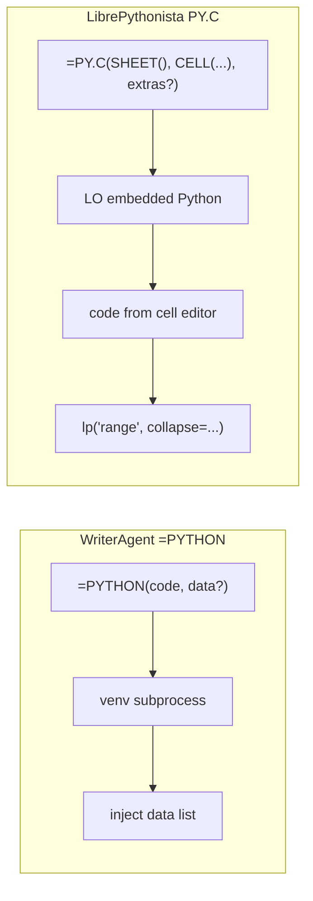

# Enabling NumPy & Python in LibreOffice

WriterAgent runs user Python (including **NumPy**, **pandas**, **scipy**, and similar C-extension stacks) **outside** LibreOffice’s embedded interpreter. The extension shells out to a **user-provided virtual environment**, evaluates code with a vendored **AST sandbox** in that child process, and returns JSON-serializable results to the chat agent or Calc formulas.

For a short executive summary, see [WriterAgent architecture — Scientific Python integration](writeragent-architecture.md#4-scientific-python-integration-the-compute-bridge).

## Table of contents

1. [The problem: ABI and embedded Python](#1-the-problem-abi-and-embedded-python)
2. [Strategy decision](#2-strategy-decision)
3. [User guide](#3-user-guide)
4. [Architecture](#4-architecture)
5. [Developer reference](#5-developer-reference)
6. [The `=PYTHON()` Calc function](#6-the-python-calc-function) <!-- anchor: the-python-calc-function -->
   - [Serialization optimization](#serialization-optimization-opportunities) — [benchmark results](#benchmark-results-2026-05), [wire into production](#wire-f64_blob-into-production-next-code-changes)
7. [Deferred roadmap](#7-deferred-roadmap)
8. [Implementation status](#8-implementation-status)

---

## 1. The problem: ABI and embedded Python

`numpy` is not pure Python; it ships compiled C/C++ extensions that must match the **exact** Python ABI they were built for.

- **The problem:** If a user runs `pip install numpy` with system Python 3.12 and the extension loads that build into LibreOffice’s embedded Python (often 3.8–3.11), LibreOffice can **fatally crash** — the extensions are binary-incompatible.
- **The requirement:** NumPy (and similar wheels) must be installed into the **same** `python` executable that runs the code, or execution must stay in a **separate** interpreter that never shares memory with LibreOffice.

All design choices below follow from that constraint.

---

## 2. Strategy decision

| Approach | Status | Summary |
|----------|--------|---------|
| **1 — Pip bootstrap inside LibreOffice** | **Rejected** | Ship `pip` and install packages into LO’s runtime at startup (LibrePythonista-style). Requires heavy path/sandbox handling (Flatpak, macOS, Windows) and couples the extension to the embedded interpreter. |
| **2 — Managed venv created by the extension** | **Deferred** | Extension creates and owns a venv (matching LO Python version, installs numpy/pandas). Conflicts with users who want MKL/OpenBLAS or existing data-science stacks. |
| **3 — User-provided venv + subprocess** | **Chosen** | User points `scripting.python_venv_path` at an existing `.venv`. WriterAgent never imports NumPy in-process. |

### Rejected: in-process `sys.path` injection

Appending the user’s `site-packages` to LibreOffice’s `sys.path` and `import numpy` there only works if the venv was built with the **same** minor Python version and architecture as LibreOffice’s embedded interpreter. In practice users create venvs with system Python 3.12+; LO embeds an older runtime — **immediate ABI crash**. Do not use this pattern.

### Chosen: warm worker + fresh sandbox per call

1. **Persistent worker:** [`PythonWorkerManager`](plugin/scripting/python_worker_manager.py) spawns the venv’s `python` once per executable path and keeps it alive.
2. **Fresh namespace per request:** [`worker_harness.py`](plugin/scripting/worker_harness.py) → [`venv_sandbox.py`](plugin/scripting/venv_sandbox.py) runs each call in a new [`LocalPythonExecutor`](plugin/contrib/smolagents/local_python_executor.py) — no variables carry over between `run_venv_python_script` / `=PYTHON()` invocations.
3. **JSON line protocol:** One request per line on stdin, one response per line on stdout. Bidirectional **tool RPC** from the venv back into LibreOffice is **not** wired yet ([§7](#7-deferred-roadmap)).

**Pros:** Sidesteps ABI issues; any Python version in the venv; avoids spawn overhead on every call.  
**Cons:** User must create and maintain a venv; no notebook-style shared kernel — re-pass data via `data` / `data_range` or cell references.

---

## 3. User guide

### Vision

Users can ask the AI to run Monte Carlo simulations, statistics, or other library-heavy work. The agent writes Python, executes it in the user’s venv, and uses existing Calc/Writer tools (`write_formula_range`, `create_chart`, etc.) to place results. The user stays in LibreOffice; no terminal required.

### Settings → Python

| Setting | Description | Example |
|---------|-------------|---------|
| `scripting.python_venv_path` | Absolute path to an existing venv directory | `~/.writeragent_venv` |
| `scripting.python_exec_timeout` | Wall-clock limit (seconds) for Run Python Script, `=PYTHON()`, and `run_venv_python_script` | `10` (default; range 1–600) |

Module implementation: `plugin/scripting/` (no top-level `python/` package — avoids clashing with the stdlib name).

- **Empty path:** `run_venv_python_script` and `=PYTHON()` fall back to **`sys.executable`** (LibreOffice’s embedded Python) — stdlib-only unless that interpreter happens to have extra packages; **use a dedicated venv for NumPy**.
- **No automatic venv creation** — the user brings their own environment.
- **Test button:** Validates the path is a directory, resolves `bin/python` or `Scripts\python.exe`, and runs a trivial subprocess smoke check.

### Execution paths (shipped)

| Entry | Module | Notes |
|-------|--------|-------|
| Chat tool **`run_venv_python_script`** | [`plugin/calc/venv_python.py`](plugin/calc/venv_python.py) | Specialized domain `python`; Writer/Calc/Draw when delegated |
| Calc **`=PYTHON(code, data?)`** | [`plugin/calc/prompt_function.py`](plugin/calc/prompt_function.py) via add-in | Same runner as the chat tool |
| Shared runner | [`plugin/scripting/run_venv_code.py`](plugin/scripting/run_venv_code.py) | Only entry for venv subprocess execution |
| In-process **`execute_python_script`** | [`plugin/calc/python_executor.py`](plugin/calc/python_executor.py) | LO embedded Python, stdlib sandbox, `lp()` / `set_range` helpers; **not** used by `=PYTHON()` |

Both venv paths assign JSON-serializable output to **`result`**. NumPy arrays and pandas objects are serialized in the worker. There is **no UNO API inside the child process** today.

### `run_venv_python_script` — Calc vs Writer/Draw

| Context | `data` / `data_range` in schema? | Injected in subprocess? |
|---------|----------------------------------|-------------------------|
| Calc chat, `domain=python` | Yes | Yes, when provided |
| Writer / Draw chat, `domain=python` | No | Never — use document tools for content |
| `=PYTHON(code, range)` | 2nd arg is the range | Yes |

Wall-clock limit comes from **Settings → Python** (`scripting.python_exec_timeout`, default **10s**, max **600s**). It is not exposed on the LLM tool schema.

### Two-phase LLM workflow

The LLM does **not** write into the document from inside the venv subprocess:

1. **Compute:** Call `run_venv_python_script` with numpy/pandas code; read serialized `result`.
2. **Insert:** Call existing Calc tools (`write_formula_range`, `set_style`, `create_chart`, etc.).

This keeps user scripts free of UNO and matches today’s shipped behavior. Prompt guidance for the model lives with other tool instructions in the chat/specialized toolset flow (domain `python`).

**Example flow**

```text
1. run_venv_python_script(code="import numpy as np\nresult = np.random.normal(0, 1, 100).tolist()")
2. write_formula_range(...) using the returned list
3. create_chart(...)
```

### What the user experiences

1. Ask for analysis or computation requiring third-party libraries.
2. The model generates Python (visible in Thinking when enabled).
3. Status: *Running Python script…*
4. Results return as JSON; the model updates the document via normal tools.
5. On error, the model sees the message and can retry.

---

## 4. Architecture

```
┌──────────────────────────────────────────────────────────┐
│                    LibreOffice Process                    │
│                                                          │
│  ┌─────────────┐    ┌──────────────────────────────────┐ │
│  │  LLM / Chat │───▶│  run_venv_python_script / =PYTHON │ │
│  │  (tool loop) │    │  → run_code_in_user_venv          │ │
│  └─────────────┘    └──────────┬───────────────────────┘ │
│                                │                         │
│                     ┌──────────▼───────────────────────┐ │
│                     │  PythonWorkerManager             │ │
│                     │  warm venv process               │ │
│                     │  worker_harness → venv_sandbox   │ │
│                     └──────────┬───────────────────────┘ │
│                                │ JSON lines             │
│                     ┌──────────▼───────────────────────┐ │
│                     │  User venv Python (subprocess)   │ │
│                     │  LocalPythonExecutor + whitelist │ │
│                     └──────────┬───────────────────────┘ │
│                                │ result / stdout         │
│                     ┌──────────▼───────────────────────┐ │
│                     │  LLM → Calc/Writer tools         │ │
│                     └──────────────────────────────────┘ │
└──────────────────────────────────────────────────────────┘
```

LibreOffice’s embedded Python and the user’s venv are **different interpreters** ([§1](#1-the-problem-abi-and-embedded-python)). Venv execution uses the venv’s `ast` and packages; the subprocess boundary is the hard safety line for C extensions.

---

## 5. Developer reference

### Module map

```
plugin/
├── scripting/
│   ├── run_venv_code.py          # Single entry: run_code_in_user_venv
│   ├── python_worker_manager.py  # Warm subprocess, JSON protocol
│   ├── worker_harness.py         # Stdin/stdout loop in venv
│   ├── venv_sandbox.py           # LocalPythonExecutor + VENV_AUTHORIZED_IMPORTS
│   ├── writeragent_api.py        # Generated stubs (RPC not wired)
│   └── python_runner.py          # Settings dialog / manual run UI
├── calc/
│   ├── venv_python.py            # run_venv_python_script tool
│   ├── python_executor.py        # In-process execute_python_script
│   └── calc_addin_data.py        # Range → data shaping for =PYTHON / tool
└── contrib/smolagents/
    └── local_python_executor.py  # Vendored AST sandbox (shipped in OXT)
```

### Config

| Key | Shipped | Role |
|-----|---------|------|
| `scripting.python_venv_path` | Yes | Absolute venv directory; empty → `sys.executable` |
| `scripting.python_exec_timeout` | Yes | Wall-clock seconds per run (default **10**, clamp **1–600**); see [`timeout_limits.py`](plugin/scripting/timeout_limits.py) |

Defined in [`plugin/scripting/module.yaml`](plugin/scripting/module.yaml) / Settings → Python (`scripting__python_venv_path`, `scripting__python_exec_timeout`).

**Planned (not in settings yet):** `python_exec_enabled` toggle.

### Worker protocol

**Host → worker (stdin), one JSON object per line:**

| Field | Required | Meaning |
|-------|----------|---------|
| `id` | Yes | Correlation id |
| `code` | Yes | Python source |
| `data` | No | Injected as variable `data` in a fresh namespace |

**Worker → host (stdout):**

| Field | When | Meaning |
|-------|------|---------|
| `id` | Always | Echo request id |
| `status` | Always | `"ok"` or `"error"` |
| `result` | `status == "ok"` | Serialized return value (`result` variable or last expression) |
| `stdout` | Optional | Captured prints / executor logs |
| `message` / `error` | `status == "error"` | Failure text |

Implementation: [`worker_harness.py`](plugin/scripting/worker_harness.py), [`python_worker_manager.py`](plugin/scripting/python_worker_manager.py) (env scrub for `KEY`/`TOKEN`/`SECRET`/`PASSWORD`/`AUTH`, `PYTHONIOENCODING=utf-8`, `PYTHONUTF8=1`, `PYTHONDONTWRITEBYTECODE=1`, process-group kill on timeout — patterns aligned with robust agent runners such as Hermes).

### Safety model

| Layer | Mechanism | Protects against |
|-------|-----------|------------------|
| **Restricted executor** | `LocalPythonExecutor` in subprocess — AST walk, dunder guards, iteration/operation limits | `eval`/`exec`, dunder escapes, infinite loops |
| **Import whitelist** | `VENV_AUTHORIZED_IMPORTS` in [`venv_sandbox.py`](plugin/scripting/venv_sandbox.py) only — not “whatever is pip-installed” | `os`, `subprocess`, `socket`, arbitrary filesystem access |
| **Subprocess isolation** | Separate interpreter, no shared memory with LO | ABI crashes, segfaults in C extensions, UNO corruption |
| **Environment scrubbing** | Strip secret-like env vars from child | Credential exfiltration via generated code |
| **User-provided venv** | Explicit opt-in | User controls installed packages |
| **Timeout** | Wall clock per execute (`scripting.python_exec_timeout`, default 10s, max 600s) | Runaway computation |

WriterAgent removed upstream’s `find_spec` import pre-check at executor init (see comment in vendored `local_python_executor.py`); missing packages fail when code imports them.

> The AST sandbox is not a perfect security boundary; **subprocess isolation** is the real guarantee. LLM-generated code is the threat model, not arbitrary hostile users.

### Warm process, fresh state

| Layer | Behavior |
|-------|----------|
| `PythonWorkerManager` | One subprocess per resolved venv `python`; respawns on crash/timeout |
| `worker_harness.py` | Read loop; delegates to `venv_sandbox.run_sandboxed_code` |
| `venv_sandbox.py` | New `LocalPythonExecutor` per request; inject `data`; serialize `result` |

No `reset` command, no cross-call variable cache. Optional **session persistence** would be an explicit product decision ([§7](#7-deferred-roadmap)).

### Specialized domain

Tool: `run_venv_python_script` with `specialized_domain = "python"`. Registered for Calc; exposed in Writer/Draw via cross-cutting delegation when the LLM activates the python toolset (`delegate_to_specialized_*_toolset(domain="python")`), same pattern as other specialized domains.

### Tool schema (reference)

See [`plugin/calc/venv_python.py`](plugin/calc/venv_python.py) — parameters `code`, optional `data` / `data_range` (Calc); `long_running` / async execution.

---

## 6. The `=PYTHON()` Calc function

Users and the LLM run Python from Calc via **`=PYTHON()`**. Same runner as **`run_venv_python_script`** ([`run_venv_code.py`](plugin/scripting/run_venv_code.py)). Configure **Settings → Python** → `scripting.python_venv_path` ([§3](#3-user-guide)).

### Formula parameters

IDL: `any python( [in] string code, [in] any data );` in [`extension/idl/XPromptFunction.idl`](../extension/idl/XPromptFunction.idl). Rebuild [`extension/XPromptFunction.rdb`](../extension/XPromptFunction.rdb) after IDL changes (`scripts/rebuild_xprompt_rdb.sh`).

| Arg | Name | Required | Role |
|-----|------|----------|------|
| 0 | `code` | Yes | Python source; evaluated result is returned |
| 1 | `data` | No | Optional range → variable **`data`** ([Data handoff](#data-handoff-and-shaping)) |

### Return Types, Coercion, and Matrix (Array) Formulas

The return type in the IDL is declared as `any` to allow a dynamic union of return types, maximizing compatibility with both standard (single-cell) and matrix formulas.

#### 1. The LibreOffice Type-Coercion Quirk (The `#VALUE!` Trap)
LibreOffice Calc operates strictly on double-precision floats (`double`/`float`), strings (`string`/`str`), and booleans (`boolean`/`bool`) for cell values.
* **The issue:** Python integers (`int`) returned from a script are marshaled by PyUNO as a sequence of `long`s (e.g. `sequence<sequence<long>>`).
* **The consequence:** Calc's formula engine lacks type coercion for integer matrices, immediately throwing a `#VALUE!` error in the sheet.
* **The resolution:** Every return value from `=PYTHON()` is recursively filtered through a coercion pipeline (`to_calc_compatible`):
  - `int` -> `float` (coerced to UNO `double`)
  - `None` -> `""` (coerced to empty cell)
  - `bool`, `float`, and `str` are preserved as is.
  - Lists and tuples are recursively converted to tuples of these Calc-supported types.

#### 2. Normal (Single-Cell) Formulas vs. Matrix (Array) Formulas
Calc's legacy add-in bridge only accepts **one scalar** (number, text, or boolean) per `=PYTHON()` evaluation. It cannot receive a Python list/tuple as a native array return (that yields `#VALUE!` even with **Ctrl+Shift+Enter**).

* **Scalar return (Enter)** — e.g. `=PYTHON("result = 3 ** 8")` or `=PYTHON("result = str([2, 3, 5])")`.
* **Multi-cell list results** — use a **matrix formula** over the target range and pass a **per-row index** as the optional 2nd argument:

  1. Select the output range (e.g. `A1:A6`).
  2. Enter (one formula for the block):

     ```text
     =PYTHON("result = [sp.prime(x) for x in range(1000, 1006)]"; ROW()-1)
     ```

  3. Confirm with **Ctrl+Shift+Enter** (curly braces `{=…}` in each cell of the block is normal).

  Each cell passes its row offset; `PYTHON` returns one prime per cell. Without the index argument, repeated evaluations in the same recalc pass return successive list elements (best-effort; prefer the `ROW()` form for reliability).

* **Single cell, full list as text** — `=PYTHON("result = str([1, 2, 3])")` + Enter.

### Usage

```text
=PYTHON("3 ** 8")
=PYTHON("str([sp.prime(x) for x in range(1000, 1006)])")   (Returns as single-cell string)
=PYTHON("np.mean(data)"; A1:A10)
=PYTHON("result = [sp.prime(int(x)) for x in data]"; ROW()-1)  (matrix over column; Ctrl+Shift+Enter)
=PYTHON("import pandas as pd; df = pd.DataFrame(data); df[0].mean()"; A1:C10)
```

### Sharing Code via Cell References

Instead of typing Python code directly as a string literal inside the `=PYTHON()` formula, **you can pass a cell reference containing the code** (e.g., `=PYTHON(A1; B1:B10)`).

Because the first parameter of `=PYTHON()` is defined in the IDL (`XPromptFunction.idl`) as `string code`, **the LibreOffice Calc formula engine automatically handles evaluation and type coercion of cell references out-of-the-box.** 

No code changes or new APIs (such as `PythonCell()`) are required.

#### Advantages of passing a cell reference for code:
1. **Code Reusability / Single Source of Truth**: You can write a script once in cell `A1` and reference it in dozens of other cells (e.g., `=PYTHON(A1; B1:B10)`, `=PYTHON(A1; C1:C10)`). Updating the logic in `A1` recalculates all dependent cells automatically.
2. **Clean Syntax (No Quote Doubling)**: Inside Calc formulas, double quotes must be doubled to escape them (e.g., `""result = ...""`). Putting code in a cell lets you write clean, standard Python syntax without escaping pain.
3. **Multi-line Scripts**: The standard Calc cell editor supports multi-line text blocks (using `Alt+Enter` to insert newlines). This allows users to write readable, commented Python scripts of arbitrary length.
4. **Dynamic Formulas**: You can use Calc formulas to construct Python code dynamically based on other spreadsheet variables! For example:
   * Cell `A1`: `= "import numpy as np; result = np." & B1 & "(data)"`
   * Changing `B1` from `"mean"` to `"std"` dynamically changes the script executed by `=PYTHON(A1; C1:C10)`.

#### Gotchas & Design Invariants:
* **Empty Code Cells**: If the referenced code cell evaluates to an empty string, our robust subprocess script runner gracefully detects the empty code block and returns a cell with the error message: `Error: No code provided.`
* **Implicit Intersection**: If a user passes a multi-cell range as the first argument (e.g., `=PYTHON(A1:A2; B1:B10)`), Calc will perform implicit intersection using the active row/column. To ensure predictable behavior, users should always pass single cell references (like `A1`) or explicit absolute coordinates (like `$A$1`).

### How it runs

Uses the same warm worker and fresh executor as the chat tool ([§2](#2-strategy-decision)). **`execute_python_script`** is separate and not used for formulas. Variables do **not** persist across cells.

### Code Oracle (`=PROMPT()` + `=PYTHON()`)

`=PROMPT("Write a Python formula using numpy for the 95th percentile of B1:B100")` can yield a pasteable `=PYTHON("…")` string — natural-language bridge to data-science formulas without leaving the sheet.

### Comparison with LibrePythonista (`PY.C` and `lp()`)

[LibrePythonista](https://github.com/Amourspirit/python_libre_pythonista_ext) stores code **outside** the formula (`=PY.C(SHEET(), CELL("ADDRESS"), extras?)`) and runs in **LO embedded Python** with pip bootstrap. WriterAgent keeps code **in the formula** and runs in the **user venv**.



| Capability | WriterAgent `data` (arg 1) | LibrePythonista |
|------------|---------------------------|-----------------|
| Pass one range | Yes — flat list or 2D list | `lp("A1:B10")` |
| Multiple ranges in one formula | No (single `data`) | Multiple `lp()` calls |
| Named ranges | Only as 2nd arg | `lp("MyRange")` |
| Trim empty rows (`collapse`) | No | `collapse=True` on `lp()` |
| Typed date columns | Raw Calc values | `column_types` + pandas |
| Return type for ranges | `list` / `list[list]` | `pandas.DataFrame` |
| Cell context | Not exposed | `sheetIdx` + `cAddress` |
| Execution | User venv | LO embedded + pip bootstrap |

**What we kept:** two-argument formula + venv NumPy; flat 1D shaping for single rows/columns ([`normalize_python_data_shape`](plugin/calc/calc_addin_data.py)). **What we did not copy:** `PY.C` metadata formula, in-LO pandas bootstrap, mandatory `lp()` for every read.

| | WriterAgent `=PYTHON()` | LibrePythonista |
|---|-------------------------|-----------------|
| Where users edit | Formula bar: code inside `=PYTHON("…")` | LibrePy menu / Edit Code; cell shows short `=PY.C(...)` |
| Where source lives | In the `.ods` formula | Document-side store (`PySourceManager`, etc.) |

**Design stance:** treat each `=PYTHON` cell as a **pure function** (`data` in → `result` out). External storage + IDE editor helps for long scripts ([§7](#7-deferred-roadmap) — editor tiers).

### Data handoff and shaping

**Where does the `data` variable come from?**
If you are editing your Python code in an IDE or reading it statically, referencing `data` (e.g., `data[0]`) might look like a `NameError` (an undefined variable). 

In the `=PYTHON()` environment, **`data` is a special variable injected dynamically into your script's execution namespace at runtime.** 

When you pass a range (or cell reference) as the second argument to `=PYTHON(code; range)`, the LibreOffice Add-In:
1. Resolves the range inside Calc and reads all cell values.
2. Formats these values into standard Python lists (flat or 2D).
3. Injects this list into the sandbox's execution namespace under the variable name **`data`**.
4. Runs your Python script. Because of this runtime injection, your script can immediately access `data` as a fully defined, local variable.

| Range you pass in Calc | Structure of `data` in Python | Example Usage in Script |
|------------------------|-------------------------------|-------------------------|
| **Single cell** (e.g., `B1`) | **`list` with 1 item**: `[value]` | `data[0] * 2` or `sp.prime(int(data[0]))` |
| **Row or Column** (e.g., `B1:B10`) | **Flat 1D `list`**: `[v1, v2, …]` | `sum(data)` or `np.mean(data)` |
| **2D Rectangle** (e.g., `B1:C5`) | **Nested 2D `list` (row-major)**: `[[r1c1, r1c2], [r2c1, r2c2], …]` | `pd.DataFrame(data)` or 2D numpy processing |

Conversion logic: [`plugin/calc/calc_addin_data.py`](plugin/calc/calc_addin_data.py). Empty cells in Calc map to `None` in Python. The maximum data payload is capped at `MAX_PYTHON_DATA_CELLS` (default 250 000).

**Data Pipeline:** Calc UNO range -> `calc_addin_data_to_python` -> JSON worker request -> sandboxed `LocalPythonExecutor.send_variables({"data": ...})` -> script runs.

**Gaps vs LibrePythonista (workarounds):** one range only (use multiple cells or chat `data_range`); no `collapse` (tighter range or strip `None` in Python); no auto-DataFrame (`pd.DataFrame(data)`).

**Future formula parameters (not planned unless needed):** 3rd arg `extras` for recalc deps; `collapse` on conversion; host `lp()` bridge; `timeout_sec` on the formula (today uses the same Settings value as the chat tool).

### Serialization optimization opportunities

The compute bridge is **asymmetric by design**: LibreOffice’s embedded Python (host) must stay ABI-safe and ships **without NumPy**; the user venv (child) may use NumPy, pandas, and other C extensions. Serialization is therefore the main lever for large-range performance — not importing NumPy into LibreOffice ([docs/vector-search-design.md](vector-search-design.md) §3, “NumPy tax”). The host can still ship **small vendored binaries** (a few MB, like [audio](audio-architecture.md) or future `sqlite-vec`) to pack/unpack payloads faster than pure stdlib, while the child keeps the heavy numeric stack in the user venv.

Today every crossing uses **nested Python lists inside JSON text** on stdin/stdout. That is correct and debuggable, but for dense numeric grids the cost can dominate the actual NumPy work.

#### Recommended path (simple plan)

**Best idea for now:** for **dense numeric** `data` and large numeric `result`, use a **stdlib binary envelope** inside the existing JSON line ([Tier 2](#tier-2--base64-binary-blob-inside-json-asymmetric-fast-path)) — not a new wire protocol, not vendored msgpack yet, not mmap yet.

| Piece | Approach |
|-------|----------|
| **Wire** | Still one JSON object per line on stdin/stdout ([`python_worker_manager.py`](../plugin/scripting/python_worker_manager.py)); see **Tier 2** below |
| **Heavy payload** | Tagged dict: `__wa_payload__: f64_blob`, `shape`, `dtype`, `b64` (row-major `float64` bytes; `None`/empty → NaN) |
| **Host** | Pack with stdlib `array` + `base64` when the range is all-numeric (or policy allows coercion) |
| **Child** | Unpack with `numpy.frombuffer` + `reshape` before `send_variables`; same envelope on egress instead of `ndarray.tolist()` |
| **Codec module** | [`plugin/scripting/payload_codec.py`](../plugin/scripting/payload_codec.py) — thresholds and `f64_blob` format documented in module docstring |
| **Fallback** | Today’s nested lists for mixed types, text, dates, and small ranges |

**Benchmarked** (outside LO, [`scripts/bench_serialization.py`](../scripts/bench_serialization.py)) — see [results](#benchmark-results-2026-05) below. Adopt **`f64_blob`** for production wiring; defer Tier 2b/3 unless real Calc workloads disagree.

**Defer unless LO profiles prove insufficient:** vendored codecs (Tier 2b), temp-file mmap (Tier 3), payload cache (Tier 5). Tier 0 (scalars, two-phase tools, matrix `ROW()` index) stays complementary, not a substitute.

#### Benchmark results (2026-05)

Asymmetric simulation: **host** = stdlib list pack + `json.dumps`; **child** = `json.loads` + either `np.array(list)` (**json_list**) or `np.frombuffer` + `reshape` (**f64_blob**). Median timings; auto blob when **at least 10 cells** (e.g. 4×3 and 10×1 qualify; 3×3 does not) — [`payload_codec.py`](../plugin/scripting/payload_codec.py).

| Case | Wire size | Materialize speedup | End-to-end speedup |
|------|-----------|---------------------|-------------------|
| **100×10 000 ingress** | **~53%** of json (~104 KiB vs ~198 KiB) | **~13×** (`frombuffer` vs `np.array`) | **~2×** |
| **100×10 000 egress** | **~53%** of json | **~1.6×** (host unpack) | **~4.7×** |
| **1×1000 / 1000×1 ingress** | **~48–53%** of json | **~11–17×** | **~2×** |
| **10×10 ingress** | **~56%** of json | **~4.6×** | **~1.7×** |
| **< 10 cells** | Blob often **larger** or similar on wire | Marginal | Often **json_list** wins — keep list fallback |

**Conclusions:** `f64_blob` is the format NumPy reads fast (`frombuffer` dominates `np.array` on large dense grids). Wire size roughly halves for 10⁴ cells. Tiny grids should stay **json_list**. Host pack + `json.dumps` for blob is still cheaper than list+json at 10⁴ scale. **No msgpack/mmap needed** for the current 250 k cell cap based on these numbers.

Re-run: `python scripts/bench_serialization.py --direction both`

#### Wire `f64_blob` into production (shipped)

Codec, bench, and worker/Calc wiring use **`pack_calc_data_for_wire`** / **`child_unpack_data`** / **`child_pack_result`**. Reference implementation map:

| Step | File | Change |
|------|------|--------|
| 1 | [`plugin/calc/calc_addin_data.py`](../plugin/calc/calc_addin_data.py) | After building numeric grid, optional `host_pack_data(grid)` when all cells are numeric-coercible (or add `calc_grid_to_wire_data()` wrapper). Mixed/text ranges → unchanged nested lists. |
| 2 | [`plugin/calc/venv_python.py`](../plugin/calc/venv_python.py) | Pass packed `data` from `finalize_python_data` / range reads through `run_code_in_user_venv` (already opaque `Any`). |
| 3 | [`plugin/calc/prompt_function.py`](../plugin/calc/prompt_function.py) | Same for `=PYTHON()` second arg: `worker_data = host_pack_data(py_data)` when appropriate. |
| 4 | [`plugin/scripting/venv_sandbox.py`](../plugin/scripting/venv_sandbox.py) | Before `send_variables`: `data = child_unpack_data(data)` if `f64_blob` (inject **ndarray** into namespace; scripts using `np.mean(data)` work without `np.array(data)`). |
| 5 | [`plugin/scripting/venv_sandbox.py`](../plugin/scripting/venv_sandbox.py) | Replace ndarray branch in `serialize_result` with `child_pack_result` from [`payload_codec.py`](../plugin/scripting/payload_codec.py). |
| 6 | [`plugin/calc/prompt_function.py`](../plugin/calc/prompt_function.py) | On worker response: `host_unpack_data(result)` when expanding list results for matrix/session or multi-cell tools; scalars unchanged. |
| 7 | [`plugin/calc/venv_python.py`](../plugin/calc/venv_python.py) / chat consumers | LLM tool JSON: host unpack blob to lists only when the model needs full arrays; prefer scalar/summary `result` (Tier 0). |
| 8 | Tests | Extend [`tests/scripting/test_run_venv_code.py`](../tests/scripting/test_run_venv_code.py) or add integration test: round-trip `f64_blob` through harness subprocess. Keep [`tests/scripting/test_payload_codec.py`](../tests/scripting/test_payload_codec.py). |

**Policy constant** (single source): `BINARY_MIN_CELLS = 10` in `payload_codec.py` — use `f64_blob` when total cell count is **≥ 10**.

**Not in this pass:** Tier 2b vendored codecs, mmap (Tier 3), payload cache (Tier 5), tool RPC.

#### Current pipeline and costs

```text
Calc UNO range
  → calc_addin_data_to_python (host: plain list / list[list])
  → json.dumps(request)          (host: text line to child)
  → json.loads(request)          (child: parse + materialize Python objects)
  → send_variables({"data": ...}) (child: copy into fresh executor namespace)
  → user code (NumPy/pandas)
  → serialize_result(result)     (child: ndarray → .tolist(), etc.)
  → json.dumps(response)         (child: text line to host)
  → json.loads(response)         (host)
  → finalize_python_return / LLM / write_formula_range (host: lists/tuples/scalars again)
```

| Stage | Module | What happens | Typical cost for large numeric `data` |
|-------|--------|--------------|--------------------------------------|
| Range read | [`calc_addin_data.py`](../plugin/calc/calc_addin_data.py) | Each cell → Python scalar in nested lists; cap [`MAX_PYTHON_DATA_CELLS`](../plugin/calc/calc_addin_data.py) (250 000) | O(cells) Python object allocations |
| Host encode | [`python_worker_manager.py`](../plugin/scripting/python_worker_manager.py) | `json.dumps(request, default=str)` + newline | O(cells) JSON text; floats as decimal strings |
| Child decode | [`worker_harness.py`](../plugin/scripting/worker_harness.py) | `json.loads(line)` | Second copy of every value as Python objects |
| Inject `data` | [`venv_sandbox.py`](../plugin/scripting/venv_sandbox.py) | `executor.send_variables({"data": data})` | Namespace copy; then `np.array(data)` if user converts |
| Return | [`serialize_result`](../plugin/scripting/venv_sandbox.py) | `ndarray` → `.tolist()`, DataFrame → `to_dict(orient="records")` | C array → Python list → JSON text (triple materialization) |
| Calc return | [`prompt_function.py`](../plugin/calc/prompt_function.py) | `to_calc_compatible` (e.g. `int` → `float`); matrix formulas cache flattened list in [`_WorkerResultSession`](../plugin/calc/prompt_function.py) | One worker call per list result block, then per-cell scalar emission |

**Not used on this path today:** pickle, msgpack, mmap, shared memory. [`SafeSerializer`](../plugin/contrib/smolagents/serialization.py) in vendored smolagents supports typed envelopes (`__type__: ndarray` + `dtype`) but the venv worker does not call it — only [`serialize_result`](../plugin/scripting/venv_sandbox.py).

**Fresh namespace every call** ([§2](#2-strategy-decision)): there is no worker-side variable cache; the same `A1:Z1000` range is re-serialized on every `=PYTHON()` or `run_venv_python_script` invocation unless the product adds an explicit cache ([§7](#7-deferred-roadmap)).

#### Design constraints

- **Host stays NumPy-free** — do not vendor full NumPy/pandas into LibreOffice ([vector-search-design.md](vector-search-design.md) §3). That is unrelated to shipping **small, purpose-built binaries** (a few MB per platform total) when stdlib is too slow.
- **Host may use small vendored natives** — same precedent as audio ([audio-architecture.md](audio-architecture.md): `sounddevice` / CFFI wheels under `vendor/` / `plugin/vendor/`, injected from [`plugin/main.py`](../plugin/main.py)) and future vector search (`sqlite-vec` `vec0`, ~1 MB per OS in [vector-search-design.md](vector-search-design.md)). A serialization codec wheel or tiny custom `.so` is acceptable if it stays in the **few‑MB** budget and is pruned per OS/Python ABI like audio — not a 50–100 MB science stack.
- **Wire format stays line-oriented JSON** until a protocol version bump — easy to log, grep, and extend; binary payloads ride *inside* JSON fields (base64), as a **msgpack/CBOR body** on the same stdin line, or via temp-file metadata; not a raw byte stream without framing on day one.
- **Sandbox must not grant arbitrary filesystem access** — [`LocalPythonExecutor`](../plugin/contrib/smolagents/local_python_executor.py) blocks `os` / `pathlib` in user code; temp files and mmap paths must be **host-allocated, host-trusted paths** passed in the request envelope, not paths chosen by LLM-generated scripts.
- **LLM and Calc still need JSON-safe or scalar outputs** eventually — even an optimized ingress path usually ends with compact `result` (scalar, short list, summary stats) or a second-phase host tool (`write_formula_range`) for sheet output ([§3](#3-user-guide)).

#### Optimization tiers (what to consider)

**Tier 0 — Keep JSON; reduce crossings (no protocol change)**

- Return **scalars or small summaries** from the venv (`result = float(np.mean(arr))`) instead of full arrays when the LLM only needs a number.
- Use the **two-phase workflow**: compute in venv, insert via existing Calc tools with a compact payload — avoid shipping a 10⁵-element list through chat JSON twice.
- For **matrix `=PYTHON()`**, prefer the `ROW()-1` index form so one worker run fills a session cache ([`finalize_python_return`](../plugin/calc/prompt_function.py)), not N full round-trips with the same `data`.
- Tighten ranges (`collapse`-style) in the sheet or strip `None` in Python before heavy work.

Best when: mixed types (strings, blanks, dates), small ranges, or logic dominates runtime.

**Tier 1 — Typed JSON envelope (metadata + payload)**

Extend request/response objects with a tagged shape, e.g. `{"__wa_payload__": "ndarray", "dtype": "float64", "shape": [1000, 100], "data": ...}` where `data` is still JSON list **or** base64 (Tier 2). On the venv side: `np.array(data, dtype=...).reshape(shape)` or `np.frombuffer(...)`.

- Reuse ideas from [`SafeSerializer`](../plugin/contrib/smolagents/serialization.py) (`__type__: ndarray`) but implement a **small, worker-specific** codec in [`venv_sandbox.py`](../plugin/scripting/venv_sandbox.py) / host mirror — do not pull the full smolagents serializer into the hot path without measuring import and dependency cost.
- Host without NumPy: decode envelope to nested lists only when Calc/LLM need lists; otherwise pass the envelope through opaquely.

Best when: you need dtype/shape preserved but payloads are still moderate; stepping stone before binary wire.

**Tier 2 — Base64 binary blob inside JSON (asymmetric fast path)**

Host (stdlib only) packs a dense numeric block:

```python
# Host sketch (embedded Python): row-major float64, None/empty → NaN or sentinel
import array, base64, struct
buf = array.array("d", (float(x) if x is not None else float("nan") for x in flat))
payload = {"__wa_payload__": "f64_blob", "shape": [nrows, ncols], "b64": base64.b64encode(buf.tobytes()).decode("ascii")}
```

Child (venv):

```python
import base64, numpy as np
raw = base64.b64decode(payload["b64"])
arr = np.frombuffer(raw, dtype=np.float64).reshape(payload["shape"])
```

- **Pros:** One JSON line still; no pickle; NumPy only on child; avoids million-element Python float objects on the wire.
- **Cons:** ~33% base64 overhead; host still walks cells once to pack; not ideal for sparse/mixed columns without a separate “sparse” or “json_list” branch.

Best when: benchmarks show JSON list encode/decode dominates NumPy compute for mostly-numeric ranges.

**Tier 2b — Vendored host codec (few MB, no NumPy)**

If stdlib `json` + `array` + base64 is still too slow on the **LibreOffice host**, vendor a **small** binary-backed library into the OXT (parallel to audio, not parallel to NumPy):

| Candidate | Rough size / role | Host (LO Python) | Child (venv) |
|-----------|-------------------|------------------|--------------|
| **msgpack** or **cbor2** | Small C extension per platform; compact binary for `data` / `result` blobs | `packb` grid metadata + float bytes; one line still `base64(pack(...))` or length-prefixed frame | `unpackb` → `np.frombuffer` (NumPy already in venv) |
| **orjson** | Fast JSON only | Faster `json.dumps`/`loads` if wire stays JSON | Optional; child can keep stdlib `json` |
| **lz4** (bind via **lz4** wheel or stdlib **zlib**) | Compress large blobs before base64 or temp file | Shrink stdin payload when JSON/text dominates | Decompress then `frombuffer` |
| **Custom `vec_pack` .so** | Smallest if scope is fixed: row-major `float64`/`float32` + optional mask for `None` | C loop over UNO cell array during `calc_addin_data` — avoids million Py float objects | N/A (child only decodes bytes) |
| **pyarrow** | Usually **too large** for this tier | Defer unless benchmarks justify multi‑MB per arch | User venv may already have Arrow |

**Packaging pattern (reuse audio):**

- Wheels or prebuilt libs under `vendor/` or `plugin/vendor/` (see [`plugin/main.py`](../plugin/main.py) `sys.path` injection).
- **Python version + arch matrix** — prune unused ABI tags in the OXT like [audio-architecture.md](audio-architecture.md) (March 2026 binary pruning).
- **Linux** may still need a system package for some natives (audio’s PortAudio case); document graceful degrade to Tier 2 stdlib path.

**Asymmetric benefit:** host uses vendored **pack** only; child uses **NumPy + optional msgpack** from the user venv without vendoring NumPy into LibreOffice. Worst case: host packs binary, child decodes with `np.frombuffer` — still faster than JSON lists on **both** sides.

**Not a substitute for Tier 3:** mmap/temp files help when payload size exceeds practical stdin; a 1 MB msgpack wheel does not remove the need for mmap at 250 k-cell scale if the line itself is the bottleneck.

Best when: profiles show host `json.dumps` or list construction dominates; you accept OXT size + release matrix cost for a bounded codec (target **≤ few MB** extra per platform set, not NumPy-scale).

**Tier 3 — Host-managed temp file + mmap (large payloads)**

For ranges approaching `MAX_PYTHON_DATA_CELLS` or multi‑MB matrices:

1. Host writes a **trusted** temp file (e.g. `tempfile.mkstemp` under LO profile or system temp), row-major binary (`float64` / `float32`), plus JSON metadata: `{"__wa_payload__": "mmap", "path": "/…", "dtype": "float64", "shape": […], "writable": false}`.
2. Child opens with `np.memmap(path, dtype=..., mode="r", shape=...)` or `np.fromfile` — **no full read into RAM** until the script touches data.
3. Host deletes the file after the response line is read (or on worker timeout/kill); child must not retain handles across requests.

- **Pros:** Avoids giant stdin strings; can skip base64 expansion; good for “read once, compute many” if combined with a **payload id** cache ([§7](#7-deferred-roadmap)).
- **Cons:** Protocol and lifecycle complexity (Windows file locking, crash cleanup, security of path leakage in logs); must not expose `open(path)` to arbitrary user code — only harness-decoded `data` replacement.
- **Not** “let the user script mmap arbitrary paths”; whitelist imports stay as today.

Best when: payload size makes JSON impractical and benchmarks show copy/parse cost >> disk I/O.

**Tier 4 — Return path and downstream consumers**

| Consumer | Needs | Implication |
|----------|-------|-------------|
| Chat / LLM | JSON-serializable `result` | Prefer summaries, small lists, or “wrote range X1:Y10 via tool” after RPC ([§7](#7-deferred-roadmap)) |
| `=PYTHON()` scalar | Single double/string/bool | Large arrays already use session + index ([`prompt_function.py`](../plugin/calc/prompt_function.py)); returning a blob handle does not help per-cell bridge |
| `write_formula_range` | Nested lists on host | Host must decode binary envelope → lists once, or RPC streams from host without round-tripping through venv JSON |

Large **egress** arrays: same tiers as ingress (binary envelope or temp file + host reads into Calc), or skip egress entirely via tool RPC writing directly to the sheet.

**Tier 5 — Session / payload cache (product + protocol)**

Optional ([§7](#7-deferred-roadmap)): host sends `data_id` + hash of range contents instead of full `data` when unchanged since last execute; worker keeps a bounded LRU of decoded arrays **inside the warm process** (not in user namespace). Requires explicit opt-in and invalidation on sheet edit/recalc.

#### Things to try first (benchmark checklist)

Validate the [recommended path](#recommended-path-simple-plan) with before/after runs. **Standalone bench (outside LO):** [`scripts/bench_serialization.py`](../scripts/bench_serialization.py) — asymmetric host (stdlib) vs child (NumPy), ingress and egress, scalar/list/ndarray sizes up to 10 000 cells; compares JSON lists vs [`f64_blob`](../plugin/scripting/payload_codec.py) (`np.frombuffer` + `reshape`). Implementation: [`plugin/scripting/payload_codec.py`](../plugin/scripting/payload_codec.py).

```bash
python scripts/bench_serialization.py --direction both
python scripts/bench_serialization.py --child-only   # isolate np.array vs frombuffer
```

Checklist (same legs the script runs):

1. **Baseline (list path)** — host pack list + `json.dumps` + child `json.loads` + `np.array(data)`.
2. **With envelope (target)** — host `f64_blob` + same wire + child `frombuffer`; compare `mat` column and `wire_B`.
2b. **Tier 2b** — same payload with vendored **msgpack** (or custom packer) on host only vs stdlib; measure OXT size and cold-import cost in LO.
3. **Tier 3** — host writes temp binary file; child `np.memmap`; measure with `N×M` at 10⁴, 10⁵, 10⁶ cells (under cap).
4. **Egress** — `result = large_ndarray`: compare `.tolist()` + JSON vs compact binary envelope vs scalar-only return.
5. **Matrix formulas** — count worker invocations per recalc with and without `ROW()-1` index arg.
6. **Cross-platform** — temp file delete on timeout ([`python_worker_manager.py`](../plugin/scripting/python_worker_manager.py) process-group kill), Windows path length, UTF-8 JSON for non-ASCII cells (keep JSON branch for mixed data).

Record: cells/sec host→child, cells/sec child→host, bytes on wire, and whether timeout (`scripting.python_exec_timeout`) fires due to serialization alone.

#### Recommendation summary

**Ship Tier 2 `f64_blob`** (ingress + egress for dense numeric arrays); keep **JSON nested lists** for <10 cells, mixed types, and scalars. Benchmarks ([above](#benchmark-results-2026-05)) support wiring [`payload_codec.py`](../plugin/scripting/payload_codec.py) into the table in [Wire f64_blob into production](#wire-f64_blob-into-production-next-code-changes).

| Situation | Prefer |
|-----------|--------|
| Dense numeric `data` / large numeric `result` | **`f64_blob` envelope in JSON** (Tier 2) — primary optimization |
| Small ranges, mixed types, formulas with strings/`None` | **Today’s JSON lists** (no envelope) |
| LLM chat with huge outputs | **Tier 0** summaries + **tool RPC** / `write_formula_range` (Tier 4), not giant `result` JSON |
| Host still slow after Tier 2 | **Tier 2b** vendored msgpack/orjson (few MB OXT, audio-style wheels) |
| Very large ranges / stdin size limits | **Temp file + mmap** (Tier 3) + optional **payload cache** (Tier 5) |
| **Implementation order** | **Tier 2 (stdlib envelope)** → measure → Tier 0 prompts → Tier 2b / Tier 3 / Tier 5 only if needed |

**Vendoring policy:** avoid NumPy/pandas in the OXT; **do** consider a few MB of focused binaries only if Tier 2 stdlib is insufficient after measurement. Keep pack/unpack logic in **`plugin/scripting/`** (host + [`venv_sandbox.py`](../plugin/scripting/venv_sandbox.py)).

### Optional: Python edit dialog (deferred UX)

| Tier | User sees | Code location | Effort |
|------|-----------|---------------|--------|
| 0 (today) | Formula bar | Inside `=PYTHON("…")` | Done |
| 1 | Modal XDL edit dialog | Still in formula | Small–medium |
| 2 | Short formula + document store key | Outside formula | Medium |
| 3 | LibrePythonista-like IDE surface | LP-scale infrastructure | Very large |

Tier 1 reuses existing `DialogProvider` / XDL patterns ([`plugin/chatbot/dialogs.py`](plugin/chatbot/dialogs.py)); execution unchanged. Tier 3 is only justified if Calc-native Python becomes a primary product pillar.

---

## 7. Deferred roadmap

### Managed venv (Strategy 2)

“Setup Python Environment” in Settings: detect LO Python version, create venv, install numpy/pandas/matplotlib, set `scripting.python_venv_path`. Deferred to respect custom stacks and reduce scope.

### Venv ↔ LibreOffice tool RPC

> **Status: Not implemented.** [`writeragent_api.py`](plugin/scripting/writeragent_api.py) is generated from tool metadata ([`scripts/generate_tool_proxies.py`](scripts/generate_tool_proxies.py)), but the warm worker does **not** handle `tool_call` lines yet. Scripts must assign **`result`**; the LLM calls Calc/Writer tools in phase two ([§3](#3-user-guide)).

**Intended behavior (when built):**

- User code in the venv calls generated proxies (e.g. `footnote.insert(...)`).
- Worker writes `{"type": "tool_call", "id", "tool", "args"}` on stdout.
- `PythonWorkerManager` dispatches via `ToolRegistry.execute()`, writes `tool_result` on stdin, continues until final `code_result`.
- **Domain-scoped:** only tools for the active specialized domain (mirrors `delegate_to_specialized_*_toolset`), not the full registry.
- **Fresh namespace per top-level execute;** RPC happens inside one request.

**Protocol extension (sketch):**

| Direction | `type` | Purpose |
|-----------|--------|---------|
| worker → host | `code_result` | Normal completion (today’s `status`/`result`) |
| worker → host | `tool_call` | Proxy requests LO tool |
| host → worker | `execute` | Run code (today) |
| host → worker | `tool_result` | Answer `tool_call` |

### Other enhancements

- **OooDev / ScriptForge:** optional venv install for UNO-from-Python; or keep compute-in-venv + document-via-tools (recommended).
- **Matplotlib:** save figure to temp file; insert via existing image tools.
- **Optional session persistence:** reuse one executor namespace within a chat session (opt-in).
- **Worker idle shutdown:** terminate venv process after N minutes idle.
- **Formula `timeout_sec`:** optional per-formula override (Settings remains the default).

---

## 8. Implementation status

**Done (2026-05)**

- [`plugin/scripting/payload_codec.py`](plugin/scripting/payload_codec.py) — `f64_blob` wire format; host pack (stdlib) / child `frombuffer`; threshold ≥10 cells.
- [`scripts/bench_serialization.py`](scripts/bench_serialization.py) — asymmetric ingress/egress bench (see [Benchmark results](#benchmark-results-2026-05)).
- [`tests/scripting/test_payload_codec.py`](tests/scripting/test_payload_codec.py) — codec round-trip and threshold tests.
- [`plugin/scripting/worker_harness.py`](plugin/scripting/worker_harness.py) + [`venv_sandbox.py`](plugin/scripting/venv_sandbox.py) — warm loop; `LocalPythonExecutor` + `VENV_AUTHORIZED_IMPORTS` per request; numpy/pandas serialization (**lists + `.tolist()` until codec wired in**).
- [`plugin/scripting/python_worker_manager.py`](plugin/scripting/python_worker_manager.py) — singleton per venv executable; JSON stdin/stdout; restart on failure.
- [`plugin/scripting/run_venv_code.py`](plugin/scripting/run_venv_code.py) — single venv entry (removed temp-file spawn / `VenvInteractiveRunner`).
- [`plugin/calc/venv_python.py`](plugin/calc/venv_python.py) — `run_venv_python_script` tool; Calc `=PYTHON()` via same path.
- [`plugin/calc/python_executor.py`](plugin/calc/python_executor.py) — in-process tool; new executor per call.
- [`plugin/contrib/smolagents/local_python_executor.py`](plugin/contrib/smolagents/local_python_executor.py) — vendored; WriterAgent removed upstream `find_spec` pre-check at init.

**Done (codec wiring, 2026-05)**

- [`pack_calc_data_for_wire`](../plugin/calc/calc_addin_data.py) — Calc/chat ingress; [`venv_sandbox.py`](../plugin/scripting/venv_sandbox.py) `child_unpack_data` / `child_pack_result`; [`prompt_function.py`](../plugin/calc/prompt_function.py) + [`venv_python.py`](../plugin/calc/venv_python.py).

**Consider later**

- Tool RPC ([§7](#7-deferred-roadmap)).
- Tier 2b msgpack / Tier 3 mmap (not needed per bench at ≤10 k cells).
- Optional session persistence.
- Worker idle shutdown.
- `timeout_sec` on `=PYTHON()`.
- Tier 1 Python edit dialog for long `=PYTHON` formulas.
