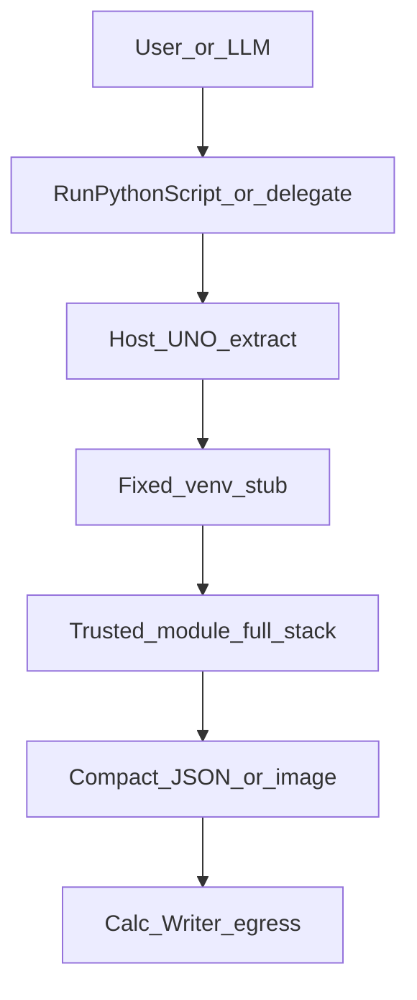
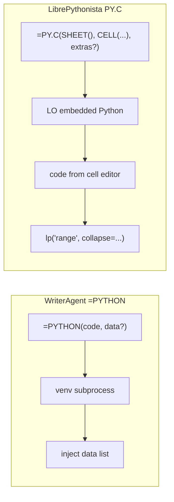

# Enabling NumPy & Python in LibreOffice

WriterAgent runs user Python (including **NumPy**, **pandas**, **scipy**, and similar C-extension stacks) **outside** LibreOffice’s embedded interpreter. The extension shells out to a **user-provided virtual environment**, evaluates code with a vendored **AST sandbox** in that child process, and returns JSON-serializable results to the chat agent or Calc formulas.

For a short executive summary, see [WriterAgent architecture — Scientific Python integration](writeragent-architecture.md#4-scientific-python-integration-the-compute-bridge).

## Table of contents

1. [The problem: ABI and embedded Python](#1-the-problem-abi-and-embedded-python)
2. [Strategy decision](#2-strategy-decision)
3. [User guide](#3-user-guide)
4. [Architecture](#4-architecture)
5. [Developer reference](#5-developer-reference)
   - [Trusted extension code in the venv](#trusted-extension-code-in-the-venv)
   - [Trusted Extension Code Opportunities with the Full Scientific Stack](#trusted-extension-code-opportunities-with-the-full-scientific-stack)
   - [Scientific domain roadmap (trusted helpers)](#scientific-domain-roadmap-trusted-helpers)
6. [The `=PYTHON()` Calc function](#6-the-python-calc-function) <!-- anchor: the-python-calc-function -->
   - [Empty cells vs NaN](#empty-cells-vs-nan)
   - [Calc formula lexer quirks (inline code)](#calc-formula-lexer-quirks-inline-code)
7. [Deferred roadmap](#7-deferred-roadmap)
8. [Implementation status](#8-implementation-status)
9. [Multi-Range Support (Varargs)](#9-multi-range-support-varargs)

**Related:** [Venv subprocess IPC & NumPy serialization](numpy-serialization.md) (warm worker, protocol, wire formats, benchmarks) · [Jupyter notebook import](jupyter-notebook-import.md) · [Analysis Sub-Agent](analysis-sub-agent.md) (data discovery + trusted numpy/pandas execution) · [Scientific domain roadmap](#scientific-domain-roadmap-trusted-helpers) (Viz, Forecast, Symbolic, Text, Optimization, Geo, Audio)

---

## 1. The problem: ABI and embedded Python

`numpy` is not pure Python; it ships compiled C/C++ extensions that must match the **exact** Python ABI they were built for.

- **The problem:** If a user runs `pip install numpy` with system Python 3.12 and the extension loads that build into LibreOffice’s embedded Python (often 3.8–3.11), LibreOffice can **fatally crash** — the extensions are binary-incompatible.
- **The requirement:** NumPy (and similar wheels) must be installed into the **same** `python` executable that runs the code, or execution must stay in a **separate** interpreter that never shares memory with LibreOffice.

All design choices below follow from that constraint.

---

## 2. Strategy decision

| Approach | Status | Summary |
|----------|--------|---------|
| **1 — Pip bootstrap inside LibreOffice** | **Rejected** | Ship `pip` and install packages into LO’s runtime at startup (LibrePythonista-style). Requires heavy path/sandbox handling (Flatpak, macOS, Windows) and couples the extension to the embedded interpreter. |
| **2 — Managed venv created by the extension** | **Deferred** | Extension creates and owns a venv (matching LO Python version, installs numpy/pandas). Conflicts with users who want MKL/OpenBLAS or existing data-science stacks. |
| **3 — User-provided venv + subprocess** | **Chosen** | User points `scripting.python_venv_path` at an existing `.venv`. WriterAgent never imports NumPy in-process. |

### Rejected: in-process `sys.path` injection

Appending the user’s `site-packages` to LibreOffice’s `sys.path` and `import numpy` there only works if the venv was built with the **same** minor Python version and architecture as LibreOffice’s embedded interpreter. In practice users create venvs with system Python 3.12+; LO embeds an older runtime — **immediate ABI crash**. Do not use this pattern.

### Chosen: warm worker + fresh sandbox per call

1. **Persistent worker:** [`PythonWorkerManager`](plugin/scripting/venv_worker.py) spawns the venv’s `python` once per executable path and keeps it alive.
2. **Fresh namespace per request:** [`worker_harness.py`](plugin/scripting/worker_harness.py) → [`venv_sandbox.py`](plugin/scripting/venv_sandbox.py) runs each call in a new [`LocalPythonExecutor`](plugin/contrib/smolagents/local_python_executor.py) — no variables carry over between `run_venv_python_script` / `=PYTHON()` invocations.
3. **Length-prefixed Pickle5 IPC:** [`PythonWorkerManager`](plugin/scripting/venv_worker.py) ↔ [`worker_harness.py`](plugin/scripting/worker_harness.py) exchange framed request/response dicts; `data` / `result` use [`split_grid`](numpy-serialization.md#strategy-3-split-grid-serialization-detail) when dense. Protocol detail: [Venv subprocess IPC](numpy-serialization.md#worker-protocol). Bidirectional **tool RPC** is **not** wired yet ([§7](#7-deferred-roadmap)).

**Pros:** Sidesteps ABI issues; any Python version in the venv; avoids spawn overhead on every call.  
**Cons:** User must create and maintain a venv; no notebook-style shared kernel — re-pass data via `data` / `data_range` or cell references.

---

## 3. User guide

### Vision

Users can ask the AI to run Monte Carlo simulations, statistics, or other library-heavy work. The agent writes Python, executes it in the user’s venv, and uses existing Calc/Writer tools (`write_formula_range`, `create_chart`, etc.) to place results. The user stays in LibreOffice; no terminal required.

### Settings → Python

| Setting | Description | Example |
|---------|-------------|---------|
| `scripting.python_venv_path` | Absolute path to an existing venv directory | `~/.writeragent_venv` |
| `scripting.python_exec_timeout` | Wall-clock limit (seconds) for Run Python Script, `=PYTHON()`, and `run_venv_python_script` (Vision Helpers use a separate internal budget — see [Image Recognition](image-recognition.md)) | `10` (default; range 1–600) |

Module implementation: `plugin/scripting/` (no top-level `python/` package — avoids clashing with the stdlib name).

- **Empty path:** `run_venv_python_script` and `=PYTHON()` fall back to **`sys.executable`** (LibreOffice’s embedded Python) — stdlib-only unless that interpreter happens to have extra packages; **use a dedicated venv for NumPy**.
- **No automatic venv creation** — the user brings their own environment.
- **Test button:** Validates the path is a directory, resolves `bin/python` or `Scripts\python.exe`, and runs a warm-worker diagnostic via [`run_venv_self_check`](../plugin/scripting/venv_worker.py). Reports **Scientific**, **Data Analysis / EDA**, **UI / Monaco**, and **Vision Libraries** groups (Present/Missing). When OCR packages are absent, the message includes `pip install docling rapidocr-paddle numpy pillow` (see [Image Recognition](image-recognition.md)).

### Execution paths (shipped)

| Entry | Module | Notes |
|-------|--------|-------|
| Chat tool **`run_venv_python_script`** | [`plugin/calc/venv_python.py`](plugin/calc/venv_python.py) | Specialized domain `python`; Writer/Calc/Draw when delegated |
| Calc **`=PYTHON(code, data?)`** | [`plugin/calc/python_addin.py`](plugin/calc/python_addin.py) / [`plugin/calc/python_function.py`](plugin/calc/python_function.py) | Same runner as the chat tool |
| Shared runner | [`plugin/scripting/venv_worker.py`](plugin/scripting/venv_worker.py) | Only entry for venv subprocess execution |
| In-process **`execute_python_script`** | [`plugin/calc/python_executor.py`](plugin/calc/python_executor.py) | LO embedded Python, stdlib sandbox, `lp()` / `set_range` helpers; **not** used by `=PYTHON()` |

Both venv paths assign JSON-serializable output to **`result`**. NumPy arrays and pandas objects are serialized in the worker. There is **no UNO API inside the child process** today.

### `run_venv_python_script` — Calc vs Writer/Draw

| Context | `data` / `data_range` in schema? | Injected in subprocess? |
|---------|----------------------------------|-------------------------|
| Calc chat, `domain=python` | Yes | Yes, when provided |
| Writer / Draw chat, `domain=python` | No | Never — use document tools for content |
| `=PYTHON(code, range)` | 2nd arg is the range | Yes |

Wall-clock limit comes from **Settings → Python** (`scripting.python_exec_timeout`, default **10s**, max **600s**). It is not exposed on the LLM tool schema. That limit applies to **user code execution** only: the first request after worker spawn (or after a crash) runs an internal warm step (spawn + auto-imports) under a separate ~30s host budget (`WARM_WORKER_TIMEOUT_SEC` in [`config_limits.py`](plugin/scripting/config_limits.py)), not charged against your configured value. **Vision Helpers** use a separate `VISION_WORKER_TIMEOUT_SEC` budget (PaddleOCR load / model download) — see [Image Recognition](image-recognition.md).

### Two-phase LLM workflow

The LLM does **not** write into the document from inside the venv subprocess:

1. **Compute:** Call `run_venv_python_script` with numpy/pandas code; read serialized `result`.
2. **Insert:** Call existing Calc tools (`write_formula_range`, `set_style`, `create_chart`, etc.).

This keeps user scripts free of UNO and matches today’s shipped behavior. Prompt guidance for the model lives with other tool instructions in the chat/specialized toolset flow (domain `python`).

**Example flow**

```text
1. run_venv_python_script(code="import numpy as np\nresult = np.random.normal(0, 1, 100).tolist()")
2. write_formula_range(...) using the returned list
3. create_chart(...)
```

### What the user experiences

1. Ask for analysis or computation requiring third-party libraries.
2. The model generates Python (visible in Thinking when enabled).
3. Status: *Running Python script…*
4. Results return as JSON; the model updates the document via normal tools.
5. On error, the model sees the message and can retry.

---

## 4. Architecture

```
┌──────────────────────────────────────────────────────────┐
│                    LibreOffice Process                    │
│                                                          │
│  ┌─────────────┐    ┌──────────────────────────────────┐ │
│  │  LLM / Chat │───▶│  run_venv_python_script / =PYTHON │ │
│  │  (tool loop) │    │  → run_code_in_user_venv          │ │
│  └─────────────┘    └──────────┬───────────────────────┘ │
│                                │                         │
│                     ┌──────────▼───────────────────────┐ │
│                     │  PythonWorkerManager             │ │
│                     │  warm venv process               │ │
│                     │  worker_harness → venv_sandbox   │ │
│                     └──────────┬───────────────────────┘ │
│                                │ Pickle5 stream         │
│                     ┌──────────▼───────────────────────┐ │
│                     │  User venv Python (subprocess)   │ │
│                     │  LocalPythonExecutor + whitelist │ │
│                     └──────────┬───────────────────────┘ │
│                                │ result / stdout         │
│                     ┌──────────▼───────────────────────┐ │
│                     │  LLM → Calc/Writer tools         │ │
│                     └──────────────────────────────────┘ │
└──────────────────────────────────────────────────────────┘
```

LibreOffice’s embedded Python and the user’s venv are **different interpreters** ([§1](#1-the-problem-abi-and-embedded-python)). Venv execution uses the venv’s `ast` and packages; the subprocess boundary is the hard safety line for C extensions.

Subprocess lifecycle, worker protocol, Linux pipe performance, and serialization wire formats: **[Venv subprocess IPC & NumPy serialization](numpy-serialization.md)**.

---

## 5. Developer reference

Host↔venv plumbing (module map, worker protocol, `python_max_data_cells`, benchmarks): **[numpy-serialization.md](numpy-serialization.md)**.

### Safety model

| Layer | Mechanism | Protects against |
|-------|-----------|------------------|
| **Restricted executor** | `LocalPythonExecutor` in subprocess — AST walk, dunder guards, iteration/operation limits | `eval`/`exec`, dunder escapes, infinite loops |
| **Import whitelist** | `VENV_AUTHORIZED_IMPORTS` in [`venv_sandbox.py`](plugin/scripting/venv_sandbox.py) only — not “whatever is pip-installed” | `os`, `subprocess`, `socket`, arbitrary filesystem access |
| **Subprocess isolation** | Separate interpreter, no shared memory with LO | ABI crashes, segfaults in C extensions, UNO corruption |
| **Environment scrubbing** | Strip secret-like env vars from child | Credential exfiltration via generated code |
| **User-provided venv** | Explicit opt-in | User controls installed packages |
| **Timeout** | Wall clock per user-code execute (`scripting.python_exec_timeout`, default 10s, max 600s); cold spawn + auto-import warm uses separate ~30s internal limit | Runaway computation |

WriterAgent removed upstream’s `find_spec` import pre-check at executor init (see comment in vendored `local_python_executor.py`); missing packages fail when code imports them.

> The AST sandbox is not a perfect security boundary; **subprocess isolation** is the real guarantee. LLM-generated code is the threat model, not arbitrary hostile users.

#### Import policy for LLM agents

Prompt text is generated from [`plugin/scripting/import_policy.py`](../plugin/scripting/import_policy.py) (whitelist in [`sandbox_imports.py`](../plugin/scripting/sandbox_imports.py)). It always leads with a **sandbox context prefix** before module lists so models know they are in a powerful **Python sandbox** (many scientific packages assumed in the user venv) with **no networking** and **no host escape**.

| Category | Modules |
|----------|---------|
| **Pre-imported** (do not `import` in script) | `np`, `pd`, `sp`, `math` |
| **Allowed stdlib** | `collections`, `copy`, `csv`, `dataclasses`, `datetime`, `decimal`, `enum`, `fractions`, `functools`, `itertools`, `json`, `math`, `operator`, `platform`, `pprint`, `queue`, `random`, `re`, `stat`, `statistics`, `string`, `textwrap`, `time`, `typing`, `unicodedata` |
| **Allowed packages** (+ submodules where whitelisted) | `numpy`, `pandas`, `scipy`, `sklearn`, `matplotlib`, `seaborn`, `sympy`, `statsmodels`, `networkx`, `PIL`, `cv2`, `webview`, `jedi`, `PyQt6`, `qtpy`, `plugin.scripting.payload_codec` |
| **Always blocked** | `os`, `sys`, `subprocess`, `socket`, `pathlib`, `shutil`, `io`, `multiprocessing`, `pty`, `builtins` |
| **Common not-whitelisted** | `requests`, `urllib`, `http`, `httpx`, `ssl`, `pickle`, `sqlite3`, `logging`, `importlib`, `ctypes`, `threading`, … |

**In-process** [`execute_python_script`](../plugin/calc/python_executor.py) uses a smaller stdlib-only sandbox in LibreOffice’s embedded Python (no NumPy/pandas).

### Trusted extension code in the venv {#trusted-extension-code-in-the-venv}

The **AST sandbox** (`LocalPythonExecutor` + `VENV_AUTHORIZED_IMPORTS`) applies only to **user-submitted Python source** — LLM [`run_venv_python_script`](../plugin/calc/venv_python.py), Calc **`=PYTHON()`**, Monaco “Run script”, and similar. It is **not** a blanket restriction on everything that runs inside the warm venv child process.

**WriterAgent extension code** can use the full venv interpreter (including `open()`, `sqlite3`, `sqlite_vec.load()`, and other modules blocked for LLM scripts) when implemented as **shipped, reviewed modules** under `plugin/scripting/`, invoked from the **LibreOffice host** — not from LLM-generated strings.

| Layer | Interpreter | Sandbox? | Typical use |
|-------|-------------|----------|-------------|
| **LibreOffice host** | Embedded Python in-process | No NumPy; stdlib + UNO | UNO, config, chunk extract, **`sqlite3` locator rows**, enqueue index work |
| **User venv worker** | User’s venv subprocess | **Yes** for user `code` strings | `=PYTHON()`, `run_venv_python_script` |
| **Trusted venv modules** | Same subprocess | **No** (normal CPython inside the module) | [`payload_codec.py`](../plugin/scripting/payload_codec.py), [`embeddings_index.py`](../plugin/scripting/embeddings_index.py) (encode; search Phase B) |

#### How trusted venv code runs

1. **Ship a normal module** under `plugin/scripting/` (e.g. [`payload_codec.py`](../plugin/scripting/payload_codec.py), [`embeddings_index.py`](../plugin/scripting/embeddings_index.py) for [embeddings](embeddings.md) Phase A encode).
2. **Host calls** [`run_code_in_user_venv`](../plugin/scripting/venv_worker.py) with a **fixed stub** string — not LLM output — for example:

   ```python
   from plugin.scripting.embeddings_index import knn_search
   result = knn_search(db_path, query_vec, k)
   ```

3. The harness still routes the request through [`run_sandboxed_code`](../plugin/scripting/venv_sandbox.py), but only the **stub** is AST-walked. The **imported module** executes as ordinary Python bytecode — filesystem access, `sqlite3`, sqlite-vec, etc. live **inside that module**, not in user scripts.

4. **Optional whitelist entry** — add `plugin.scripting.embeddings_index` (or similar) to [`VENV_AUTHORIZED_IMPORTS`](../plugin/scripting/sandbox_imports.py) so the stub’s `import` passes static policy. **Do not** add `sqlite3`, `os`, or `sqlite_vec` to the LLM import list; keep those imports inside the trusted module only.

5. **IPC for bulk data** — pass paragraph lists, query vectors, and `k` via worker **`data=`** (Pickle5) where possible so the stub stays tiny; trusted code may still `open(db_path)` for `index.db` / vec0 maintenance.

#### What not to do

- **Do not** tell the LLM to `open()` index paths or import `sqlite3` — blocked by design ([import policy](#import-policy-for-llm-agents)).
- **Do not** widen the LLM whitelist to “fix” embeddings; add a trusted module instead.
- **Do not** run sqlite-vec or NumPy encode in LibreOffice’s embedded interpreter — stay on the venv side ([embeddings](embeddings.md#why-numpy-stays-in-the-venv)).

#### Future: harness `action` dispatch

[`worker_harness.py`](../plugin/scripting/worker_harness.py) already handles non-code requests (e.g. `action: "reset_session"`). A future `action: "embed_search"` could call a trusted function **without** any user code string — same trust model, less AST overhead. Not required for MVP if the fixed stub + module pattern is enough.

#### Required venv packages (trusted analysis helpers)

The 14 Calc **Analysis Helpers** in [`plugin/scripting/analysis.py`](../plugin/scripting/analysis.py) require a fixed scientific stack in the user venv. Settings → Python **Test** reports these under **Data Analysis / EDA Libraries** and prints an install line when any are missing.

```bash
pip install numpy pandas scipy scikit-learn statsmodels ydata-profiling pandas-montecarlo
```

| Package | Used by |
|---------|---------|
| `numpy`, `pandas` | All helpers (coercion, tables, aggregates) |
| `scipy` | `detect_outliers` (IQR, z-score) |
| `scikit-learn` | `detect_outliers` (`isolation_forest`), `cluster_numeric` |
| [ydata-profiling](https://github.com/ydataai/ydata-profiling) (`data_profiling`) | `describe_data` |
| `statsmodels` | `run_regression` |
| [pandas-montecarlo](https://github.com/ranaroussi/pandas-montecarlo) | `monte_carlo` |

Helpers that need a missing package return `MISSING_PACKAGE` with the install line above — there is no in-code fallback to alternate libraries. See [Analysis Sub-Agent](analysis-sub-agent.md).

#### Optional venv packages (trusted vision helpers)

[`plugin/scripting/vision.py`](../plugin/scripting/vision.py) **Vision Helpers** (Run Python Script → `[Vision] extract_text`) default to Docling in the user venv. Settings → Python **Test** reports these under **Vision Libraries**:

| Package | Install | Used by |
|---------|---------|---------|
| [Docling](https://github.com/docling-project/docling) + RapidOCR paddle backend (`docling`, `rapidocr`) | `pip install docling rapidocr-paddle numpy pillow` | `extract_text` / `extract_structure` — **default** (`engine=docling`) |
| [PaddleOCR](https://github.com/PaddlePaddle/PaddleOCR) + [PaddlePaddle](https://github.com/PaddlePaddle/Paddle) (`paddleocr`, `paddle`) | `pip install paddleocr paddlepaddle numpy` | Fallback — `engine=paddle` |
| [Ultralytics](https://github.com/ultralytics/ultralytics) | `pip install ultralytics` | `detect_objects` and related helpers — **Phase 4+**; informational in Test until then |
| [scikit-image](https://scikit-image.org/) (`skimage`) | `pip install scikit-image` | Optional image processing inside trusted helpers — graceful skip if absent |

Full design and egress rules: [Image Recognition](image-recognition.md).

#### Planned domain package groups

Future trusted-helper domains (Visualization, Forecasting, Symbolic Math, Text Analytics, Optimization, Geospatial, Audio) will each declare required venv packages and a Settings → Python **Test** group when implemented. Until then, see [Scientific domain roadmap (trusted helpers)](#scientific-domain-roadmap-trusted-helpers). **Matplotlib** is already probed under **Scientific Libraries**; a dedicated **Visualization Libraries** group (e.g. seaborn) is planned with trusted Viz helpers.

## Trusted Extension Code Opportunities with the Full Scientific Stack

The embeddings implementation (see [embeddings.md](embeddings.md)) has proven the **trusted extension code** pattern: ship normal Python modules under `plugin/scripting/` (or parallel locations for document helpers), invoke them from the LibreOffice host via tiny fixed stubs over the existing `PythonWorkerManager` / `run_code_in_user_venv` + Pickle5 `data=` path, and let the module run with the *full* power of the user's venv interpreter.

In trusted code there is **no AST sandbox**. The module can freely:

- `import numpy as np`, `pandas as pd`, `scipy.*`, `sklearn.*`, `cv2`, `PIL`, `sentence_transformers`, `torch` / `torchvision` (if the user has installed them), matplotlib, sympy, statsmodels, networkx, etc.
- Use `open()`, `sqlite3`, loadable extensions (`sqlite_vec`), filesystem paths, and any other stdlib or third-party capability present in the venv.
- Maintain on-disk state (e.g. the per-folder `index.db`).
- Receive bulk data (numeric grids via the mature `payload_codec` / split-grid path, image arrays, paragraph lists, etc.) or lightweight references (db paths, folder keys, image identifiers) and return only compact, serializable results.

The host side (stdlib + UNO) is responsible for:
- Extracting document content safely (tables → arrays/DataFrames, images via XGraphic or export, text with locators/paragraph indices, shape geometry, etc.).
- Passing data or references over IPC.
- Applying results back into the document using existing Writer/Calc/Draw tool surfaces (`apply_document_content`, cell writes, shape creation, etc.).

This is the preferred route for any capability that would be awkward, insecure, or impossible inside the LLM sandbox. The LLM (main agent or a specialized delegate) is used for high-level planning, interpretation, and synthesis — not for writing the heavy numeric or I/O code itself.

**Embeddings indexing strategy reminder:** The per-directory semantic index described in [embeddings.md](embeddings.md) (one `index.db` under `writeragent_embeddings/<folder_corpus_key>/` for all indexable siblings in that filesystem folder, using standard SQLite + optional vec0 in the venv) is the **primary (and currently only) cross-document search index**. Do not create additional vector indexes (no per-file sidecars, no global index across the machine, no separate in-document RAG vector stores whose job is search). Within one already-open document, continue to use the existing fast keyword, outline, sheet navigation, and read tools. Embeddings are the "outer router" for `document_research` (and optionally main chat before delegation). After a hit, open one or a few files and let the inner agent use precise read tools at the returned locators.

The subsections below outline other high-value directions that become practical once trusted code has unrestricted access to the full scientific stack in the user's venv. All discussion assumes a local focus (the warm worker + packages the user has chosen to install) unless otherwise noted.

**See also:** the existing "Trusted extension code in the venv" discussion immediately above for the exact invocation pattern, whitelist entry rules, and "do not widen the LLM sandbox" guidance. The embeddings work is the canonical example and the source of the "primary per-directory index only" rule restated below.

For the design of a dedicated **analysis sub-agent** (domain **#0** in the roadmap below — data discovery across documents via embeddings/search + extraction + handoff to reliable numpy/pandas/scipy execution in the trusted venv, plus LLM synthesis of results), see the separate document:

- [Analysis Sub-Agent](analysis-sub-agent.md)

It covers the sub-agent architecture (leveraging the two-tier delegation pattern from multi-document work and specialized toolsets), how it finds and prepares relevant tables/ranges/numeric content, the trusted execution path for heavy compute, and integration back to the main agent for application or explanation. Domains **#1–#7** below extend or parallel that pattern; they do not replace it.

### Hybrid Local Compute + LLM for Answering (general)

Trusted local scientific code excels at scale, precision, repeatability, and operations that are expensive or impossible to do reliably in a single LLM forward pass (large matrix work, exact statistics, simulation, clustering of hundreds/thousands of items, optimization loops).

The LLM (via the normal chat / tool-loop path, possibly using `run_venv_python_script` for light glue or dedicated analysis tools) excels at understanding vague requests, deciding what analyses to run, synthesizing results into narrative, and driving document edits. See the [Analysis Sub-Agent](analysis-sub-agent.md) doc for the concrete data-finding + execution flow.

### Local Image Recognition and Computer Vision Processing

**Status:** **Shipped** (Phases 1, 1b, 2) — see **[Image Recognition](image-recognition.md)** for the supported stack (**PaddleOCR + Ultralytics**), trusted helpers ([`vision.py`](../plugin/scripting/vision.py)), Run Python Script **Vision Helpers**, and Settings → Python **Test** vision probes. LibreOffice exports graphics via UNO; recognition runs in the user venv through fixed RPC stubs (same pattern as [`analysis.py`](../plugin/scripting/analysis.py)).

### LLM-Based Image Understanding and Vision Models

In addition to pure local computer vision, many useful image tasks are fundamentally semantic: "What does this diagram show?", "Read the text from this low-contrast scanned receipt", "Explain the trend in this hand-drawn chart", "Is this UI mockup following our design guidelines?".

**Current status:** Not implemented.

**Local / hybrid paths (preferred where possible):**
- Local multimodal models served via Ollama, llama.cpp, or similar (llava, bakllava, moondream, etc.). The existing `LlmClient` / provider machinery can be extended with vision endpoints in the same way chat and (future) embedding endpoints are handled.
- A trusted helper module can extract / prepare the image (local numpy/cv work), call the local vision endpoint (via the framework HTTP client or a direct subprocess), and return the description plus any structured data the model was asked to emit (JSON mode).
- Caching of descriptions or region analyses (keyed by image hash + model) under the same per-folder cache discipline as embeddings.

**Cloud / API paths (when user has configured a capable provider):**
- GPT-4o, Claude-3/3.5/Opus with vision, Gemini, etc. Reuse the normal auth, retry, redaction, and streaming infrastructure already present for text chat.
- The agent can request "vision describe" on a specific image locator; the host extracts the image bytes, the framework client sends them (with appropriate size / format guards), and the result comes back as a normal tool / chat turn.

**Hybrid local + LLM vision strategy (recommended):**
- Fast, deterministic, privacy-sensitive **recognition** (OCR, layout, regions) stays in trusted local helpers — see [Image Recognition](image-recognition.md).
- The (local or remote) vision LLM is invoked for semantics or when local OCR confidence is low — on prepared crops, not full-page pixels when avoidable.
- Results from both layers are combined before being shown to the user or fed to the main reasoning agent.

**Integration points:**
- A new (or extended) image tool surface that the main agent and specialized delegates can call.
- Storage of image descriptions / features in a cache that lives alongside the primary embeddings `index.db` for the folder (same "one cache per directory" spirit).
- When an image appears inside a document that is itself retrieved via the embeddings index, the vision description can be surfaced as additional context for the inner read agent or for the final answer.

**Scope note for now:** Discussion here is intentionally high-level. Implementation would first focus on the local extraction + trusted dispatch path ([image-recognition.md](image-recognition.md)), with vision LLM calls layered on the existing `LlmClient`.

### Semantic Search and Indexing: One Primary Per-Directory Embeddings Index

As repeatedly emphasized in [embeddings.md](embeddings.md) and the implementation, WriterAgent maintains **exactly one** semantic vector index for cross-document discovery:

- Scope: one `index.db` per filesystem folder (the directory containing the active document and its siblings that `list_nearby_files` would see).
- Contents: paragraph (or cell / shape) locators + float32 vectors (vec0 when available, BLOB + numpy fallback otherwise). No duplicate full-text or FTS5 shadow index.
- Access: both host (plain stdlib sqlite3 for metadata / maintenance decisions) and trusted venv code (full sqlite3 + optional vec0 + numpy) open the same file by reference. Search and incremental maintenance are performed by trusted code after the host passes the folder key or db path.
- Usage: primarily the outer tier of `document_research` (and optionally main chat before delegation). After ranked hits, open the minimal number of files and use precise inner read tools.
- Within a single open document: do **not** rely on this index for navigation or search. Use the existing `search_in_document`, outline helpers, sheet navigation, `get_document_content` with ranges, etc.

**Do not create other indexes** for search purposes:
- No per-file sidecar vector stores.
- No global index spanning `~/Documents` or the whole profile.
- No additional in-document RAG vector database whose purpose is retrieval (the secondary "within-document" idea in embeddings.md remains low priority and would reuse the same chunking + storage patterns if ever built).
- Chat history remains in its own SQLite (`writeragent_history.db`) — unrelated to the corpus embeddings index.

Any future "analysis cache," "vision features," or "memory clusters" should be additive metadata stores (possibly sharing the same per-folder directory and SQLite conventions for simplicity) rather than competing semantic search indexes. The embeddings index is the single source of truth for "which documents and passages in this folder are semantically relevant to the query?"

This keeps the architecture simple, the cache footprint predictable, invalidation straightforward (mtime + paragraph content hash), and the mental model clear for both developers and users ("the semantic memory for everything in this folder lives under `writeragent_embeddings/<key>/`").

## Scientific domain roadmap (trusted helpers) {#scientific-domain-roadmap-trusted-helpers}

The sections below are **development plans** for high-value scientific capabilities beyond the shipped **Analysis** ([analysis-sub-agent.md](analysis-sub-agent.md)) and **Vision** ([image-recognition.md](image-recognition.md)) domains. Each follows the same pattern: trusted modules under `plugin/scripting/`, fixed venv stubs, host extract → IPC → compact results → document egress, plus optional Run Python Script templates and specialized sub-agent exposure.

### Domain helper pattern (Analysis + Vision canonical)

Shipped domains prove the stack. New domains should mirror them—not invent parallel plumbing.

| Layer | Analysis (shipped) | Vision (shipped) | New domains |
|-------|-------------------|------------------|-------------|
| Trusted module | [`analysis.py`](../plugin/scripting/analysis.py) | [`vision.py`](../plugin/scripting/vision.py) | e.g. `viz.py`, `forecast.py`, `symbolic.py`, `text_analytics.py` |
| Templates | [`analysis_templates.py`](../plugin/scripting/analysis_templates.py) `# writeragent:analysis` | [`vision_templates.py`](../plugin/scripting/vision_templates.py) `# writeragent:vision` | `# writeragent:viz`, `# writeragent:forecast`, … |
| Host client | [`analysis_client.py`](../plugin/framework/client/analysis_client.py) | [`vision_client.py`](../plugin/framework/client/vision_client.py) | Same RPC shape |
| Runner / egress | [`analysis_runner.py`](../plugin/calc/analysis_runner.py), [`analysis_egress.py`](../plugin/calc/analysis_egress.py) | [`vision_runner.py`](../plugin/scripting/vision_runner.py), [`vision_egress.py`](../plugin/scripting/vision_egress.py) | UNO extract on host; compact JSON or image envelope back |
| Run Python Script | [`document_scripts.py`](../plugin/scripting/document_scripts.py) `_analysis_script_section` | `_vision_script_section` | `_viz_script_section`, etc. |
| Fast path | [`python_runner.py`](../plugin/scripting/python_runner.py) `parse_*_script_header` → trusted RPC → egress | same | Header parse → `run_trusted_*` → insert |
| Settings Test | **Data Analysis / EDA Libraries** | **Vision Libraries** | Per-domain groups when shipped |
| LLM surface | Calc `domain="analysis"` via [`analyze_data`](../plugin/calc/analysis.py) | Chat `analyze_image` deferred | Extend `analysis` or add Writer/Calc specialized domains |



**Dual access model:** Prefer high-level `run_*({helper, params}, data, context)` (or domain-specific inputs like vision's `image`). Keep `run_venv_python_script` / `=PYTHON()` as the escape hatch for novel work. Return `MISSING_PACKAGE` when required venv packages are absent; optional pure-Python or ASCII fallbacks per domain.

**Data handoff:** Reuse [`calc_addin_data.py`](../plugin/calc/calc_addin_data.py) and [`payload_codec`](../plugin/scripting/payload_codec.py) split-grid. For LLM/sub-agent paths, pass **`data_range`** (late binding) rather than full grids in chat context — see [Analysis Sub-Agent — Data Handoff](analysis-sub-agent.md#data-handoff--context-limits-out-of-band-data).

**Visualization note:** Phase A (below) already uses the venv worker and `__wa_payload__: "image"` envelope **without** a trusted module—users or the LLM write matplotlib directly. Phase C adds the Analysis/Vision-style trusted layer on top of the same envelope.

### Prioritization

| Priority | Domain | Status today | First target |
|----------|--------|--------------|--------------|
| 0 | **Analysis** (numeric EDA, regression, clustering, …) | **Shipped** — [analysis-sub-agent.md](analysis-sub-agent.md) | Extend with Viz/Forecast hooks |
| 1 | **Visualization & Plotting** | Phase A shipped; B–C not | `plot_data`, `[Viz] quick_plot` |
| 2 | **Time Series & Forecasting** | Partial building blocks in analysis | `forecast_time_series` |
| 3 | **Symbolic Mathematics** | Partial (sympy venv, Writer math-tex) | `solve_equation`, `[Math] …` |
| 4 | **Text / Document Analytics** | Outline/tree tools only | `readability_scores`, `[Text Analysis] …` |
| 5 | **Optimization & OR** | Partial (scipy, `monte_carlo`) | `optimize_portfolio` |
| 6 | **Geospatial** | Not started | `[Geo] map_data` |
| 7 | **Audio / Signal Processing** | Recording shipped; no librosa analysis | Spectrogram via Viz egress |

---

### 1. Visualization & Plotting {#visualization}

**Status:** **Phase A shipped** (raw matplotlib image pipeline). **Phases B–C not shipped** (Run Python Script image egress glue; trusted Viz helpers).

**Goal:** Turn analysis results into publication-quality charts inside LibreOffice—Calc sheet graphics or Writer inline images—without requiring the LLM to write matplotlib every time. Highest immediate ROI for demos and shareable workflows.

**Why:** Users respond to visuals. "I generated a professional chart from my spreadsheet in two clicks" is a strong adoption story. Pairs naturally with the analysis sub-agent (auto-plot regression, clusters, Monte Carlo distributions).

#### Phase A — Raw matplotlib pipeline (shipped)

No `viz.py` yet. Matplotlib figures from user/LLM code are captured in the venv and inserted via the existing image envelope.

| Component | Module | Behavior |
|-----------|--------|----------|
| Figure → bytes | [`venv_sandbox.py`](../plugin/scripting/venv_sandbox.py) | `_figure_to_image_payload()` (SVG default, PNG @ 150 DPI); `serialize_result()` for returned `Figure`; post-run capture of open pyplot figures; `Agg` backend; figure cleanup |
| Wire format | [`payload_codec.py`](../plugin/scripting/payload_codec.py) | `PAYLOAD_IMAGE`, `is_image_payload()` |
| Calc `=PYTHON()` | [`python_function.py`](../plugin/calc/python_function.py) | `_insert_image_result_on_sheet()` → `GraphicObjectShape` anchored to active cell |
| Chat / LLM | [`venv_python.py`](../plugin/calc/venv_python.py) | Temp `image_path` → agent uses `insert_image` (two-phase workflow) |
| Writer notebook | [`notebook_runner.py`](../plugin/notebook/notebook_runner.py) | Inline image insert on notebook cell run |
| LLM sandbox | [`sandbox_imports.py`](../plugin/scripting/sandbox_imports.py) | `matplotlib`, `seaborn` whitelisted |
| Settings Test | [`venv_worker.py`](../plugin/scripting/venv_worker.py) | `matplotlib` under **Scientific Libraries** |
| Tests | [`test_matplotlib_output.py`](../tests/scripting/test_matplotlib_output.py), [`test_python_function.py`](../tests/calc/test_python_function.py) | Codec, sandbox e2e, cell-anchored geometry |

**Works today:**

```python
# =PYTHON() — implicit plt.show() or explicit Figure return
import matplotlib.pyplot as plt
plt.plot([1, 2, 3])
```

```text
# Chat — two-phase
1. run_venv_python_script(code="… plt.plot(…) …")
2. insert_image(image_path=<returned path>)
```

**Native LO charts** ([`charts.py`](../plugin/calc/charts.py) — `UpsertChart`, `ListCharts`, …) are a **separate** UNO chart path, not matplotlib. The LLM can already create native Calc/Writer charts from structured data; Viz helpers complement that with statistical plotting (seaborn, heatmaps, distribution plots).

**Known limitations:** Only the last/open figure is captured; chat requires two steps; **Run Python Script does not insert image payloads** (see Phase B); no seaborn-specific helpers; no UNO e2e test for full `=PYTHON()` plot insertion (geometry unit-tested with mocks). Detail: [python-in-excel-dev-plan.md Phase 2](python-in-excel-dev-plan.md).

#### Phase B — Run Python Script + Writer image egress (glue; not shipped)

[`python_runner.py`](../plugin/scripting/python_runner.py) `execute_and_insert_result()` handles analysis and vision result contracts but **does not** check `is_image_payload()`. Matplotlib output from **Tools → Run Python Script…** would be written as broken cell/text instead of a graphic.

**Planned fix (small):** After venv execution, if `is_image_payload(result_data)`: Calc → reuse `_insert_image_result_on_sheet` logic; Writer → [`insert_image_at_locator`](../plugin/writer/images/image_tools.py). Tests: extend [`test_python_runner_*.py`](../tests/scripting/).

#### Phase C — Trusted Viz helpers (not shipped)

Mirror Analysis/Vision: [`viz.py`](../plugin/scripting/), `viz_templates.py`, `viz_client.py`, `viz_runner.py`, `viz_egress.py`, `_viz_script_section` in [`document_scripts.py`](../plugin/scripting/document_scripts.py), fast path in `python_runner.py`.

| Helper | Purpose | Notes |
|--------|---------|-------|
| `plot_data` | Auto chart from numeric grid + `spec` | Chart-type recommendation, title/legend metadata |
| `correlation_heatmap` | Heatmap | Builds on `correlation_matrix` analysis output |
| `time_series_plot` | Date-indexed line plot | Shared with Forecast domain |
| `quick_plot` | Default Run Python Script template | Phase B egress for insert |

**Run Python Script templates:** **Viz Helpers →** `[Viz] quick_plot`, `[Viz] correlation_heatmap`, `[Viz] time_series`.

**Result contract (draft):** `{status, helper, image: {format, data}, title, legend, chart_type, writer_cleanup_hints}` — image bytes use the same `__wa_payload__: "image"` envelope as Phase A.

**Analysis sub-agent:** After `run_regression`, `cluster_numeric`, or `monte_carlo`, auto-call `plot_data` when the task implies visualization (replaces planned `suggest_visualization` in [analysis-sub-agent.md](analysis-sub-agent.md)).

**Packages:** `matplotlib` (required); `seaborn` (recommended). Settings → Python **Visualization Libraries** group when shipped.

**Fallback:** ASCII mini-charts or compact text tables when matplotlib is missing (`MISSING_PACKAGE`).

**Phase 2+ (deferred):** `create_interactive_chart` — static multi-view export or embedded HTML/JS if LibreOffice egress supports it.

---

### 2. Time Series & Forecasting {#forecasting}

**Status:** **Not shipped** as dedicated helpers. **Partial:** analysis building blocks exist.

**Goal:** Forecast, decompose, and flag anomalies on date-indexed Calc data—natural fit for spreadsheets (finance, ops, sales).

**Why:** Strong Calc synergy; pairs with Visualization for confidence-band plots.

**Already in codebase:**

| Piece | Location |
|-------|----------|
| Period-over-period change | [`compare_periods`](../plugin/scripting/analysis.py) in analysis helpers |
| Outlier detection | [`detect_outliers`](../plugin/scripting/analysis.py) — base for time-series anomalies |
| OLS / statsmodels | [`run_regression`](../plugin/scripting/analysis.py); `statsmodels` in analysis venv install line |
| Range → pandas | [`calc_addin_data.py`](../plugin/calc/calc_addin_data.py), [`analysis_coerce.py`](../plugin/scripting/analysis_coerce.py) |

**Proposed helpers:**

| Helper | Purpose | Key params |
|--------|---------|------------|
| `forecast_time_series` | Forward predictions + intervals | `periods=12`, `model="auto"` (ARIMA/Holt-Winters) |
| `decompose_time_series` | Trend / seasonal / residual | `date_col`, `value_col` |
| `anomaly_detection_time_series` | Series-aware outliers | Extends `detect_outliers` with temporal context |

**Module layout:** `plugin/scripting/forecast.py` (or extend `analysis.py` with forecast helpers in the same `run_analysis` dispatcher—prefer separate module if package deps differ).

**Packages:** `statsmodels` (required, already in analysis stack); optional `prophet` (heavy — optional Test group, `MISSING_PACKAGE` if absent).

**Run Python Script:** **Forecast Helpers →** `[Forecast] forecast_series`, `[Forecast] decompose`.

**Output:** Predictions table (analysis egress pattern) + optional Viz Phase C plot for bands.

**Sub-agent:** Extend `domain="analysis"` — same delegation as EDA/regression.

**Fallback:** Simple moving-average projection in pandas when statsmodels forecasting APIs unavailable.

---

### 3. Symbolic Mathematics & Equation Solving {#symbolic-math}

**Status:** **Partial.** Sympy auto-imported in venv (`sp`); Writer Math insertion via [math-tex.md](math-tex.md). **Trusted helpers not shipped.**

**Goal:** Solve, simplify, integrate, and differentiate equations; round-trip LaTeX ↔ LibreOffice Math objects; bridge Writer, Calc `=PYTHON()`, and Vision OCR of handwritten equations.

**Why:** Appeals to students, engineers, researchers; synergizes with Docling/Vision → sympy → Writer Math OLE.

**Already in codebase:**

| Piece | Location |
|-------|----------|
| Venv `sympy` as `sp` | [`venv_sandbox.py`](../plugin/scripting/venv_sandbox.py) auto-imports |
| LaTeX → StarMath → OLE | [`math_mml_convert.py`](../plugin/writer/math/math_mml_convert.py), [`math_formula_insert.py`](../plugin/writer/math/math_formula_insert.py) |
| In-process stdlib sandbox | [`python_executor.py`](../plugin/calc/python_executor.py) — no sympy; light cases only |

**Proposed helpers:**

| Helper | Purpose |
|--------|---------|
| `solve_equation` | Symbolic solve for variables; optional numeric substitution from `data_range` |
| `symbolic_simplify` / `integrate` / `differentiate` | Core sympy wrappers |
| `latex_to_math_object` | Enhance existing TeX path — return StarMath/LaTeX for host insert |

**Execution split:** Light sympy in venv trusted module; very small expressions could stay in-process stdlib-only paths only if we add a safe subset (default: venv for all shipped helpers).

**Run Python Script:** **Math Helpers →** `[Math] solve_equation`, `[Math] simplify`.

**Sub-agent / LLM:** Writer main chat or `domain="python"` with helper preference; compose with Vision `extract_text` on equation photos.

**Packages:** `sympy` (required — already probed under Scientific Libraries).

---

### 4. Text / Document Analytics {#text-analytics}

**Status:** **Not shipped.** Writer outline, grammar, and LO-DOM tooling exist; no trusted text-analytics module.

**Goal:** Readability, topic structure, key phrases, sentiment by section, and cross-document comparison for reports and long-form Writer content.

**Why:** Strengthens core Writer use case; overlaps with professional writers, legal, academic users.

**Input sources (host):** [`get_document_tree`](../plugin/writer/outline.py), selected ranges, [LO-DOM semantic tree](lo-dom-semantic-tree.md), optional grammar pipeline locators.

**Proposed helpers:**

| Helper | Purpose | Packages |
|--------|---------|----------|
| `document_statistics` | Counts, structure summary | stdlib / pure Python |
| `readability_scores` | Flesch, Gunning Fog, … | stdlib formulas feasible |
| `topic_modeling` | Simple LDA topics | `sklearn` |
| `extract_key_phrases` | Section-level phrases | venv NLP (sklearn or lightweight) |
| `sentiment_by_section` | Polarity per heading block | optional venv |
| `compare_documents` | Revision / multi-file diff stats | host extracts two bodies |

**Module:** `plugin/scripting/text_analytics.py`.

**Run Python Script:** **Text Analysis Helpers →** `[Text Analysis] readability`, `[Text Analysis] compare_selection`.

**Sub-agent:** Writer main agent or future `domain="text"` specialized delegate when user asks to "analyze this report."

**Fallback:** Readability-only path with stdlib when sklearn absent.

---

### 5. Optimization & Operations Research {#optimization}

**Status:** **Not shipped.** `scipy` in venv; [`monte_carlo`](../plugin/scripting/analysis.py) shipped.

**Goal:** Linear programming, scheduling, portfolio optimization inside Calc—appeals to analysts, supply chain, finance.

**Proposed helpers:**

| Helper | Purpose | Packages |
|--------|---------|----------|
| `optimize_portfolio` | Mean-variance or constraint-based | `scipy.optimize`, numpy |
| `linear_programming` | LP from spec dict | `scipy.optimize.linprog` or optional `pulp` |
| `solve_scheduling_problem` | Assignment / small IP | optional `ortools` / `pulp` |

**Run Python Script:** **Optimize Helpers →** `[Optimize] portfolio`, `[Optimize] linear_program`.

**Tie-in:** Stochastic optimization with existing `monte_carlo` helper.

**Sub-agent:** Extend `domain="analysis"`.

**Packages:** `scipy` (required); `pulp` / `ortools` optional Test group.

---

### 6. Geospatial {#geospatial}

**Status:** **Not started** (niche; lower priority unless demand appears).

**Goal:** Static map image + attribute table from location columns in Calc.

**Proposed helper:** `map_data(data_range, …)` → image envelope (same as Viz Phase A/C) + summary table.

**Packages (all optional):** `geopandas`, `folium`, `shapely` — ship only if users request; `MISSING_PACKAGE` otherwise.

**Run Python Script:** **Geo Helpers →** `[Geo] map_data`.

**Egress:** Viz image path + analysis-style table insert.

---

### 7. Audio / Signal Processing {#audio-signal}

**Status:** **Partial.** Voice recording shipped ([audio-architecture.md](audio-architecture.md)); no venv analysis helpers.

**Goal:** Analyze imported audio (including recordings saved from the chat panel): spectrograms, basic features, optional transcription post-processing.

**Synergy:** Recording produces WAV in user workflow; analysis runs in **venv** (librosa), not in embedded LO Python (recording uses vendored `sounddevice` without numpy).

**Proposed helpers:**

| Helper | Purpose |
|--------|---------|
| `analyze_audio` | Duration, RMS, tempo, key features |
| `spectrogram_plot` | Image via Viz envelope |

**Run Python Script:** **Audio Helpers →** `[Audio] analyze`, `[Audio] spectrogram`.

**Packages:** `librosa` (optional Test group); matplotlib for plots.

**Sub-agent:** Writer main or specialized; optional link to STT pipeline in [audio-architecture.md](audio-architecture.md).

---

### Implementation phasing (cross-domain)

| Phase | Scope | Domains |
|-------|--------|---------|
| **0** | Trusted module + 1–2 helpers + Run Python Script section + unit tests | Viz C, Forecast, or Text (one at a time) |
| **0b** | Glue without full trusted module | **Viz Phase B** — `is_image_payload` in Run Python Script |
| **1** | Sub-agent / `analyze_data`-style tools + delegation prompts | Analysis extensions (Viz auto-plot, forecast) |
| **2** | Egress polish, optional caches, Writer cleanup hints | All |

Keep each domain lean: reuse `payload_codec`, split-grid, document-attached scripts + Monaco, and Settings Test reporting—the same surfaces that make Analysis and Vision usable without an LLM.

---

Shared-kernel **Calc semantics** (reset, recalc, idempotent cells): [§7 — Calc UX and output enhancements](#calc-ux-and-output-enhancements). Worker lifecycle and code hot cache: [numpy-serialization.md — Warm worker](numpy-serialization.md#warm-worker-lifecycle).

### Specialized domain

Tool: `run_venv_python_script` with `specialized_domain = "python"`. Registered for Calc; exposed in Writer/Draw via cross-cutting delegation when the LLM activates the python toolset (`delegate_to_specialized_*_toolset(domain="python")`), same pattern as other specialized domains.

### Tool schema (reference)

See [`plugin/calc/venv_python.py`](plugin/calc/venv_python.py) — parameters `code`, optional `data` / `data_range` (Calc); `long_running` / async execution.

---

## 6. The `=PYTHON()` Calc function

Users and the LLM run Python from Calc via **`=PYTHON()`**. Same runner as **`run_venv_python_script`** ([`venv_worker.py`](plugin/scripting/venv_worker.py)). Configure **Settings → Python** → `scripting.python_venv_path` ([§3](#3-user-guide)).

### Formula parameters

IDL: `any python( [in] string code, [in] any data );` in [`extension/idl/XPythonFunction.idl`](../extension/idl/XPythonFunction.idl). Rebuild [`extension/XPythonFunction.rdb`](../extension/XPythonFunction.rdb) and [`extension/XPromptFunction.rdb`](../extension/XPromptFunction.rdb) after IDL changes (`scripts/rebuild_xprompt_rdb.sh` — one `.rdb` per interface).

| Arg | Name | Required | Role |
|-----|------|----------|------|
| 0 | `code` | Yes | Python source; evaluated result is returned |
| 1 | `data` | No | Optional range → variable **`data`** ([Data handoff](#data-handoff-and-shaping)) |

### Return Types, Coercion, and Matrix (Array) Formulas

The return type in the IDL is declared as `any` to allow a dynamic union of return types, maximizing compatibility with both standard (single-cell) and matrix formulas.

#### 1. The LibreOffice Type-Coercion Quirk (The `#VALUE!` Trap)
LibreOffice Calc operates strictly on double-precision floats (`double`/`float`), strings (`string`/`str`), and booleans (`boolean`/`bool`) for cell values.
* **The issue:** Python integers (`int`) returned from a script are marshaled by PyUNO as a sequence of `long`s (e.g. `sequence<sequence<long>>`).
* **The consequence:** Calc's formula engine lacks type coercion for integer matrices, immediately throwing a `#VALUE!` error in the sheet.
* **The resolution:** Every return value from `=PYTHON()` is recursively filtered through a coercion pipeline (`to_calc_compatible`):
  - `int` -> `float` (coerced to UNO `double`)
  - `None` -> `""` (coerced to empty cell)
  - `float('nan')` / `np.nan` -> `""` (empty cell; keeps downstream formulas healthy)
  - Other `bool`, `float`, and `str` values are preserved as-is.
  - Lists and tuples are recursively converted to tuples of these Calc-supported types.

#### Empty cells vs NaN

Calc **empty cells** and Python/NumPy **NaN** are treated as the same *missing* value on the wire, but they surface differently in Python on **ingress** and are **normalized to empty cells** on **egress** so sheet formulas stay healthy.

| Direction | From | To | Why |
|-----------|------|-----|-----|
| **Ingress** | Calc empty | Python `None` | Natural null in nested lists and mixed grids. |
| **Ingress** | Calc empty | NumPy `np.nan` | Pure numeric ranges materialize as a float64 `ndarray` via `np.frombuffer`; holes must be NaN slots, not Python `None`. |
| **Egress** | Python `None` | Calc empty | Standard spreadsheet behavior (`""` via [`to_calc_compatible`](../plugin/calc/python_function.py)). |
| **Egress** | Python / NumPy NaN | Calc empty | Same as `None`; avoids `#NUM!` / `#VALUE!` when a matrix or downstream formula references the cell. |

**What you see in scripts**

| Grid type in the venv | Empty Calc cell becomes | Notes |
|-----------------------|-------------------------|-------|
| **Mixed** (any text in range) | `None` in `list` / `list[list]` | Same as pre–split-grid list behavior. |
| **Pure numeric** (≥10 cells, split_grid) | `np.nan` in `data` | Fast path; use **`np.nansum`**, **`np.nanmean`**, or **`np.isnan`** when holes must be ignored. |
| **Small range** (&lt;10 cells, nested list) | `None` in lists | Same as mixed; may be promoted to `ndarray` only if the child reloads a clean numeric grid. |

**Return path:** worker results pass through [`host_unpack_data`](../plugin/scripting/payload_codec.py) (buffer NaN → `None` in nested lists) and then [`to_calc_compatible`](../plugin/calc/python_function.py) (`None` and NaN floats → `""`). A scalar `result = float('nan')` or a matrix slot with `np.nan` therefore displays as a **blank cell**, not `#NUM!`.

**We do not round-trip “real NaN” into Calc.** If your script computes a missing numeric result you want visible as an error, return a string (e.g. `"N/A"`) or a normal value; do not rely on `np.nan` to show as `#NUM!` in the sheet.

**Infinity:** `±inf` is **not** collapsed to empty on egress and may still produce `#NUM!` in Calc — only NaN/`None` map to blank cells.

**Wire format:** on the split_grid binary lane, both empty cells and NaN values occupy NaN slots in the float64 buffer ([details in NumPy serialization — Cell semantics](numpy-serialization.md#cell-semantics-calc-python-and-numpy)). That is an implementation detail; authors should follow the table above.

**Examples**

```python
# Ingress — numeric block B1:B5 with a blank in B3
result = np.nansum(data)          # OK: ignores np.nan holes
result = np.sum(data)             # NaN poisons the sum unless you mask

# Egress — both become empty cells in the sheet
result = None
result = float("nan")
result = [[1.0, np.nan, 3.0]]     # matrix formula → 1, blank, 3
```

### Gotcha: Silent Blank Cells from NaN Poisoning (and how to display "NaN")

If a spreadsheet range contains empty cells, calling standard functions like `np.mean(data)` or `np.sum(data)` will be poisoned by the `None` or `nan` values and evaluate to float `nan`.

Because `nan` is coerced to an empty string (`""`) on egress to keep downstream spreadsheet formulas healthy, the target cell will appear **completely blank** with no error messages.

If you encounter this and either want to compute a correct value ignoring blanks, or explicitly display `"NaN"` in the sheet, use one of the following patterns:

#### 1. Ignore blank/empty cells in calculation
* **NumPy float conversion (works for any range size):**
  ```python
  np.nanmean(np.array(data, dtype=float))
  ```
* **Pure Python list comprehension (for small ranges < 10 cells):**
  ```python
  np.mean([x for x in data if x is not None])
  ```

#### 2. Explicitly display "NaN" in the sheet
If you want `nan` results to be visible to the user as `"NaN"` instead of being swallowed into a blank cell:
```python
val = np.nanmean(np.array(data, dtype=float))
result = "NaN" if np.isnan(val) else val
```

#### 2. Normal (Single-Cell) Formulas vs. Matrix (Array) Formulas
Calc's legacy add-in bridge only accepts **one scalar** (number, text, or boolean) per `=PYTHON()` evaluation. It cannot receive a Python list/tuple as a native array return (that yields `#VALUE!` even with **Ctrl+Shift+Enter**).

* **Scalar return (Enter)** — e.g. `=PYTHON("result = 3 ** 8")` or `=PYTHON("result = str([2, 3, 5])")`.
* **Multi-cell list results** — use a **matrix formula** over the target range and pass a **per-row index** as the optional 2nd argument:

  1. Select the output range (e.g. `A1:A6`).
  2. Enter (one formula for the block):

     ```text
     =PYTHON("result = [sp.prime(x) for x in range(1000, 1006)]"; ROW()-1)
     ```

  3. Confirm with **Ctrl+Shift+Enter** (curly braces `{=…}` in each cell of the block is normal).

#### Matrix Formula Optimization (Fast-Path)

Calc evaluates matrix formulas once per cell; without optimization that means many IPC crossings. WriterAgent caches the **Worker Result Session** on the host so the first cell runs the worker and later cells read by index — use **`ROW()-n`** as the 2nd argument. Details: [numpy-serialization.md — Matrix formula result session](numpy-serialization.md#matrix-formula-result-session-ipc-reduction).

Without the index argument, repeated evaluations in the same recalc pass return successive list elements (best-effort; prefer the `ROW()` form for reliability).

#### Today vs Excel dynamic spill

Microsoft Excel can **auto-spill** multi-cell results (DataFrames, 2D arrays) into adjacent rows and columns and surfaces **`#SPILL!`** when blocking cells are in the way ([python-in-excel-ideas.md](python-in-excel-ideas.md) §1.1, §7.1). WriterAgent does **not** do that yet: you must select the output range, use a **matrix formula** (**Ctrl+Shift+Enter**), and usually pass a **per-row index** (`ROW()-n`) as the 2nd argument so each cell pulls the correct slice from a cached list result (see [Matrix Formula Optimization](#matrix-formula-optimization-fast-path) above). **Automatic dynamic spill** with graceful blocked-cell errors is on the deferred backlog ([§7 Calc UX and output enhancements](#calc-ux-and-output-enhancements)).

* **Grid egress over a data range** — use **two arguments only**: `=PYTHON("np.sum(data)"; B1:B10)` or `=PYTHON("(np.array(data) * 2).tolist()"; D6:G9)` as a matrix formula (**Ctrl+Shift+Enter**). The add-in IDL accepts only `(code, data)`; a third argument such as `ROW()-1` causes **Err:504** (error in parameter list). When the 2nd argument is the full range, `data` in Python is that grid; use `ROW()-n` as the 2nd argument only when it is the per-cell index, not together with a range.

* **Single cell, full list as text** — `=PYTHON("result = str([1, 2, 3])")` + Enter.

### Usage

```text
=PYTHON("3 ** 8")
=PYTHON("str([sp.prime(x) for x in range(1000, 1006)])")   (Returns as single-cell string)
=PYTHON("np.mean(data)"; A1:A10)
=PYTHON("result = [sp.prime(int(x)) for x in data]"; ROW()-1)  (matrix over column; Ctrl+Shift+Enter)
=PYTHON("import pandas as pd; df = pd.DataFrame(data); df[0].mean()"; A1:C10)
```

### Sharing Code via Cell References

Instead of typing Python code directly as a string literal inside the `=PYTHON()` formula, **you can pass a cell reference containing the code** (e.g., `=PYTHON(A1; B1:B10)`).

Because the first parameter of `=PYTHON()` is defined in the IDL (`XPromptFunction.idl`) as `string code`, **the LibreOffice Calc formula engine automatically handles evaluation and type coercion of cell references out-of-the-box.** 

No code changes or new APIs (such as `PythonCell()`) are required.

#### Advantages of passing a cell reference for code:
1. **Code Reusability / Single Source of Truth**: You can write a script once in cell `A1` and reference it in dozens of other cells (e.g., `=PYTHON(A1; B1:B10)`, `=PYTHON(A1; C1:C10)`). Updating the logic in `A1` recalculates all dependent cells automatically.
2. **Clean Syntax (No Quote Doubling)**: Inside Calc formulas, double quotes must be doubled to escape them (e.g., `""result = ...""`). Putting code in a cell lets you write clean, standard Python syntax without escaping pain.
3. **Multi-line Scripts**: The standard Calc cell editor supports multi-line text blocks (using `Alt+Enter` to insert newlines). This allows users to write readable, commented Python scripts of arbitrary length.
4. **Dynamic Formulas**: You can use Calc formulas to construct Python code dynamically based on other spreadsheet variables! For example:
   * Cell `A1`: `= "import numpy as np; result = np." & B1 & "(data)"`
   * Changing `B1` from `"mean"` to `"std"` dynamically changes the script executed by `=PYTHON(A1; C1:C10)`.

#### Gotchas & Design Invariants:
* **Empty Code Cells**: If the referenced code cell evaluates to an empty string, our robust subprocess script runner gracefully detects the empty code block and returns a cell with the error message: `Error: No code provided.`
* **Implicit Intersection**: If a user passes a multi-cell range as the first argument (e.g., `=PYTHON(A1:A2; B1:B10)`), Calc will perform implicit intersection using the active row/column. To ensure predictable behavior, users should always pass single cell references (like `A1`) or explicit absolute coordinates (like `$A$1`).

### Calc formula lexer quirks (inline code)

**Status:** observed in the field (2026); no WriterAgent code change can fix Calc’s parser — only workarounds and documentation until LibreOffice behavior improves or we ship richer UX (cell-reference-first prompts, edit dialog).

When `code` is a **string literal inside the formula**, LibreOffice Calc parses the **entire cell** (including the quoted Python) **before** the `=PYTHON()` add-in runs. Failures here are **not** venv, NumPy, or sandbox errors — Python never executes.

| Symptom | Typical cause | What users see |
|---------|----------------|----------------|
| **#NAME?** | Token inside the string is treated as a **spreadsheet** function name (e.g. `float`) | `=PYTHON("float(np.sum(data))"; D6:G6)` fails; `=PYTHON("np.sum(data)"; D6:G6)` works |
| **Err:508** | Wrong **argument separator** for locale/file format (`;` vs `,`), or parenthesis pairing confused on import | Common when opening **XLSX** generated with European `;` on **en-US** Calc (see [manual serialization suite](numpy-serialization.md#priority-1--profile-inside-libreoffice-gate-for-everything-else)) |
| **Err:510** | Cell text starts with `=` (e.g. section label `=== normal ===`) | Use plain labels like `[normal]`, not leading `=` |
| **#NAME?** | XLSX import lowercases the add-in name to `python`; lookup failed on display-only `PYTHON` | Use **`=PYTHON(...)`** (uppercase). WriterAgent accepts `python` / `PYTHON` after 2026-05 add-in fix; regenerate test XLSX if needed |

#### Why `float(np.sum(data))` in the formula string is a bad idea

Early test fixtures wrapped results in `float(...)` so compare formulas could use `ABS(oracle - python)`. That cast is **redundant**: [`to_calc_compatible`](../plugin/calc/python_function.py) already coerces NumPy scalars and Python `int` to Calc `double` on return. Runtime never required `float()` in the script.

The real problem is **Calc’s formula lexer**, not type coercion:

```text
=PYTHON("float(np.sum(data))"; D6:G6)   → often #NAME?  (Calc looks for a FLOAT function)
=PYTHON("np.sum(data)"; D6:G6)           → works; bridge coerces the NumPy scalar
```

Nested parentheses inside the quoted string (`float(…(…)…)`) can make pairing worse on some import paths. The identifier **`float`** is the usual trigger for **#NAME?**.

**Guidance for authors and LLMs:** prefer `np.sum(data)`, `np.max(data)`, `np.nansum(data)` in inline formulas; do not emit `float(...)` unless code lives **outside** the formula string (see below).

#### Recommended patterns (today)

| Pattern | When to use | Example |
|---------|-------------|---------|
| **Bare NumPy / expression** | Default for short inline code | `=PYTHON("np.sum(data)"; B1:B10)` |
| **Code in a cell** | Any `float(…)`, multi-line scripts, heavy quoting | `A1` = `float(np.sum(data))`; formula `=PYTHON($A$1; B1:B10)` |
| **Coerce without `float` name** | Need a float scalar inline; lexer-sensitive | `np.sum(data) + 0.0`, `np.asarray(data, float).sum()` (still watch nested `()`) |
| **`result = …` assignment** | Multi-statement scripts | `=PYTHON("result = np.sum(data)"; B1:B10)` — assignment form is fine; avoid wrapping the *expression* in `float()` in the same string if `#NAME?` appears |
| **XLSX test sheets** | Manual serialization regression | Use **comma** separators in generated formulas (Excel OOXML); LO converts to locale on import — see [`scripts/generate_serialization_spreadsheet.py`](../scripts/generate_serialization_spreadsheet.py) |

**XLSX input cells must be numeric, not text:** if the sheet stores values as strings (e.g. `"1.0"` from `str()` in a generator), Calc passes them as text, `split_grid` lands them in the `strings` map, and `np.sum(data)` fails with a Unicode dtype `TypeError`. Regenerate [`serialization_tests.xlsx`](../tests/fixtures/serialization_tests.xlsx) after fixing the generator so ints/floats are written as native cell types.

#### Future product directions (to consider)

These are **not** implemented; kept here so design discussions do not rediscover the same traps.

1. **Cell-reference-first UX** — Settings or formula wizard default: “put script in one cell, reference it from `=PYTHON`” (already supported by IDL; needs prompts/UI).
2. **LLM / `=PROMPT()` guardrails** — When generating `=PYTHON("…")`, forbid `float(` in inline strings; suggest `A1` reference or `np.sum` instead.
3. **Pre-flight in add-in (limited)** — If `code` still arrives as a string, we cannot fix `#NAME?` (add-in never called). A **macro or import filter** that rewrites known-bad patterns before recalc is fragile and out of scope for the extension core.
4. **Native ODS fixtures** — Optional generator output for manual tests to avoid XLSX separator/lexer import quirks while still testing `=PYTHON()`.
5. **Upstream** — LibreOffice issue: add-in string arguments with nested `()` and names like `float` should parse as opaque string literals. Worth filing if we collect minimal reproducers (XLSX + `=PYTHON("float(1)")`).
6. **Documentation parity** — [`tests/fixtures/serialization_tests.xlsx`](../tests/fixtures/serialization_tests.xlsx) cases intentionally use `np.sum` / `np.max` without `float()`; README generated alongside the sheet documents the quirk.

### How it runs

Uses the same warm worker and fresh executor as the chat tool ([§2](#2-strategy-decision)). **`execute_python_script`** is separate and not used for formulas. Variables do **not** persist across cells.

### Code Oracle (`=PROMPT()` + `=PYTHON()`)

`=PROMPT("Write a Python formula using numpy for the 95th percentile of B1:B100")` can yield a pasteable `=PYTHON("…")` string — natural-language bridge to data-science formulas without leaving the sheet.

### Comparison with LibrePythonista (`PY.C` and `lp()`)

[LibrePythonista](https://github.com/Amourspirit/python_libre_pythonista_ext) stores code **outside** the formula (`=PY.C(SHEET(), CELL("ADDRESS"), extras?)`) and runs in **LO embedded Python** with pip bootstrap. WriterAgent keeps code **in the formula** and runs in the **user venv**.



| Capability | WriterAgent `data` (arg 1) | LibrePythonista |
|------------|---------------------------|-----------------|
| Pass one range | Yes — flat list or 2D list | `lp("A1:B10")` |
| Multiple ranges in one formula | Yes — `data[0]`, `data[1]`, … (varargs) | Multiple `lp()` calls |
| Named ranges | Only as 2nd arg | `lp("MyRange")` |
| Trim empty rows (`collapse`) | No | `collapse=True` on `lp()` |
| Typed date columns | Raw Calc values | `column_types` + pandas |
| Return type for ranges | `list` / `list[list]` | `pandas.DataFrame` |
| Cell context | Not exposed | `sheetIdx` + `cAddress` |
| Execution | User venv | LO embedded + pip bootstrap |

**What we kept:** two-argument formula + venv NumPy; flat 1D shaping for single rows/columns ([`normalize_python_data_shape`](plugin/calc/calc_addin_data.py)). **What we did not copy:** `PY.C` metadata formula, in-LO pandas bootstrap, mandatory `lp()` for every read.

| | WriterAgent `=PYTHON()` | LibrePythonista |
|---|-------------------------|-----------------|
| Where users edit | Formula bar: code inside `=PYTHON("…")` | LibrePy menu / Edit Code; cell shows short `=PY.C(...)` |
| Where source lives | In the `.ods` formula | Document-side store (`PySourceManager`, etc.) |

**Design stance:** treat each `=PYTHON` cell as a **pure function** (`data` in → `result` out). External storage + IDE editor helps for long scripts ([§7](#7-deferred-roadmap) — editor tiers).

### Data handoff and shaping

**Where does the `data` variable come from?**
If you are editing your Python code in an IDE or reading it statically, referencing `data` (e.g., `data[0]`) might look like a `NameError` (an undefined variable). 

In the `=PYTHON()` environment, **`data` is a special variable injected dynamically into your script's execution namespace at runtime.** 

When you pass a range (or cell reference) as the second argument to `=PYTHON(code; range)`, the LibreOffice Add-In:
1. Resolves the range inside Calc and reads all cell values.
2. Formats these values into standard Python lists (flat or 2D).
3. Injects this list into the sandbox's execution namespace under the variable name **`data`** (if it is a single-cell or single-entry input, the child worker automatically unpacks it to a scalar and coerces integer floats to standard Python `int`s).
4. Runs your Python script. Because of this runtime injection, your script can immediately access `data` as a fully defined, local variable.

| Range you pass in Calc | Structure of `data` in Python | Example Usage in Script |
|------------------------|-------------------------------|-------------------------|
| **Single cell** (e.g., `B1`) | **Scalar**: coerced to `int` if mathematically whole float, else `float`/`str`/`bool` | `data * 2` or `sp.prime(data)` |
| **Row or Column** (e.g., `B1:B10`) | **Flat 1D `list`** (or 1D `ndarray` if numeric) | `sum(data)` or `np.mean(data)` |
| **2D Rectangle** (e.g., `B1:C5`) | **Nested 2D `list` (row-major)** (or 2D `ndarray` if numeric) | `pd.DataFrame(data)` or 2D numpy processing |

Conversion logic: [`plugin/calc/calc_addin_data.py`](plugin/calc/calc_addin_data.py). Empty cells in Calc map to `None` in Python (or `np.nan` in pure numeric `ndarray` ingress — see [Empty cells vs NaN](#empty-cells-vs-nan)). Payload size cap: **`scripting.python_max_data_cells`** ([numpy-serialization.md — config](numpy-serialization.md#subprocess-module-map-and-config)).

**Host↔venv pipeline** (UNO read → pack → worker → unpack): [numpy-serialization.md — Current pipeline](numpy-serialization.md#current-pipeline-and-costs).

**Gaps vs LibrePythonista (workarounds):** chat tool still single `data_range` (use multiple `=PYTHON` cells or varargs in formulas); no `collapse` (tighter range or strip `None` in Python); no auto-DataFrame (`pd.DataFrame(data)`).

**Future formula parameters (not planned unless needed):** 3rd arg `extras` for recalc deps; `collapse` on conversion; host `lp()` bridge; `timeout_sec` on the formula (today uses the same Settings value as the chat tool).

Wire format and cell semantics: [numpy-serialization.md](numpy-serialization.md) ([split_grid](numpy-serialization.md#strategy-3-split-grid-serialization-detail), [Cell semantics](numpy-serialization.md#cell-semantics-calc-python-and-numpy)).

### Optional: Python edit dialog (deferred UX)

| Tier | User sees | Code location | Effort |
|------|-----------|---------------|--------|
| 0 (today) | Formula bar | Inside `=PYTHON("…")` | Done |
| 1 | Modal XDL edit dialog | Still in formula | Small–medium |
| 2 | Short formula + document store key | Outside formula | Medium |
| 3 | LibrePythonista-like IDE surface | LP-scale infrastructure | Very large |

Tier 1 reuses existing `DialogProvider` / XDL patterns ([`plugin/chatbot/dialogs.py`](plugin/chatbot/dialogs.py)); execution unchanged. Tier 3 is only justified if Calc-native Python becomes a primary product pillar.

---

## 7. Deferred roadmap

### Managed venv (Strategy 2)

“Setup Python Environment” in Settings: detect LO Python version, create venv, install numpy/pandas/matplotlib, set `scripting.python_venv_path`. Deferred to respect custom stacks and reduce scope.

### Venv ↔ LibreOffice tool RPC

> **Status: Not implemented.** [`writeragent_api.py`](plugin/scripting/writeragent_api.py) is generated from tool metadata ([`scripts/generate_tool_proxies.py`](scripts/generate_tool_proxies.py)), but the warm worker does **not** handle `tool_call` lines yet. Scripts must assign **`result`**; the LLM calls Calc/Writer tools in phase two ([§3](#3-user-guide)).

**Intended behavior (when built):**

- User code in the venv calls generated proxies (e.g. `footnote.insert(...)`).
- Worker writes `{"type": "tool_call", "id", "tool", "args"}` on stdout.
- `PythonWorkerManager` dispatches via `ToolRegistry.execute()`, writes `tool_result` on stdin, continues until final `code_result`.
- **Domain-scoped:** only tools for the active specialized domain (mirrors `delegate_to_specialized_*_toolset`), not the full registry.
- **Fresh namespace per top-level execute;** RPC happens inside one request.

**Protocol extension (sketch):**

| Direction | `type` | Purpose |
|-----------|--------|---------|
| worker → host | `code_result` | Normal completion (today’s `status`/`result`) |
| worker → host | `tool_call` | Proxy requests LO tool |
| host → worker | `execute` | Run code (today) |
| host → worker | `tool_result` | Answer `tool_call` |

### Serialization performance

Prioritized future work (LO profiling gate, host pack/unpack, payload cache, Cython): [numpy-serialization.md — Future work](numpy-serialization.md#future-work--serialization-performance).

### Jupyter notebook import (`.ipynb`)

WriterAgent can import Jupyter notebooks into **Writer** via **Tools → Import Jupyter Notebook…** (menu + UNO; vendored nbformat v4). This is **not** part of the venv compute bridge — imported code cells are editable TextFields, not executed in the user venv.

Full usage, document layout, debugging, and notebook-specific roadmap: **[Jupyter notebook import](jupyter-notebook-import.md)**.

### Run Python Script – document-attached scripts (Priority 3)

**Status:** Shipped (2026-05). The personal scratchpad + named library still lives in `writeragent.json`. **Attach** (Monaco toolbar or legacy XDL dialog) stores named scripts in document `UserDefinedProperties` (`WriterAgentDocumentPythonScripts`) so they travel with `.odt`/`.ods`/`.odg`. The script picker shows **My Scripts** and **This Document** as separate sections; execution is unchanged (manual Run only).

**User workflow:** Open **Run Python Script…** → write code → **Attach** (or Save while a document script is selected) → save the document. On another machine, reopen the file and pick the script under **This Document**. **Copy to My Scripts** copies a document script into the personal library. Read-only documents fall back to My Scripts with a clear message.

Implementation: [`document_scripts.py`](../plugin/scripting/document_scripts.py), [`editor_host.py`](../plugin/scripting/editor_host.py) IPC, [`scripts_manager.js`](../plugin/contrib/scripting/assets/editor/scripts_manager.js). Tests: [`test_document_scripts.py`](../tests/scripting/test_document_scripts.py), [`test_document_scripts_uno.py`](../tests/scripting/test_document_scripts_uno.py).

This is the "both" solution to the storage dilemma described in the user-visible section above (personal reusable library vs. self-contained documents). The notebook interactive dev plan already flags a related cross-feature item under the same name.

#### Problem statement (technical)

`Run Python Script...` (menu, Monaco, and legacy XDL dialog) currently persists two things exclusively in user profile config:

- Per-app-type scratchpads: `last_python_script_writer`, `last_python_script_calc`, `last_python_script_draw` (and the generic fallback).
- Global named library: `saved_python_scripts` (dict of name → source).

These appear in:
- [`plugin/framework/config.py`](../plugin/framework/config.py) (dataclass defaults and schema)
- [`plugin/scripting/python_runner.py`](../plugin/scripting/python_runner.py) (`show_python_input_dialog`, `_run_python_monaco`, `resolve_run_script_config_key`, `execute_and_insert_result`)
- [`plugin/scripting/editor_host.py`](../plugin/scripting/editor_host.py) (the `request_scripts` / `save_script` / `delete_script` handlers that feed the Monaco script picker)

The consequence: substantial analysis scripts, data-cleaning helpers, or Monte-Carlo drivers written in the dialog do not travel with the `.odt`/`.ods`/`.odg` when the file is emailed, checked into version control, or opened on another machine. Contrast with:
- `=PYTHON()` code (lives in cell formulas or referenced cells — document-native).
- Calc initialization scripts (`WriterAgentCalcInitScript` in `UserDefinedProperties`, see [`document_scripts.py`](../plugin/scripting/document_scripts.py)).
- Notebook import registry (`WriterAgentNotebookRegistry` + source path, see [`notebook/cell_registry.py`](../plugin/notebook/cell_registry.py)).

Users who want reproducibility must manually copy code into cells or the init script editor. This is workable but loses the convenient library UI, Monaco editing, one-click "Run + insert result", and the personal scratchpad affordances.

#### Goals

- Allow a user to mark a script (or copy one) so that it is stored inside the current document and survives save/reopen/share.
- Preserve the existing personal library experience unchanged for the common "my tools" case.
- Make the ownership of any given script in the picker visually and operationally obvious (no spooky action at a distance when switching documents).
- Keep execution semantics simple: document-attached scripts are still manually invoked via the Run dialog (they do **not** become auto-run like init scripts, and they do **not** participate in the chat `run_venv_python_script` tool unless a later phase explicitly adds them).
- Reuse existing `UserDefinedProperties` infrastructure with its already-fixed existence checks.

#### Non-goals (for Pri 3)

- Automatic migration or "smart" attachment heuristics.
- Making document scripts visible to the LLM agent by default.
- Deep integration with notebook interactive cells (they already live in the document as TextFields + registry metadata).
- Per-script execution permissions, signing, or provenance UI.
- Exporting a document-attached script back to a `.py` file on disk (nice-to-have, out of scope for first cut).

#### Data model & storage layer

**Property name:** `WriterAgentDocumentPythonScripts`

**Stored value:** UTF-8 JSON string (never raw Python). Recommended envelope:

```json
{
  "version": 1,
  "scripts": {
    "Clean Sales Data": "import pandas as pd\nresult = ...",
    "Monte Carlo 10k": "..."
  }
}
```

- Use a versioned envelope from day one (even if v1 is the only value) so future structural changes do not require property migration gymnastics.
- Total payload cap: start with the same 900 000 byte limit used by document scripts in [`document_scripts.py`](../plugin/scripting/document_scripts.py). Per-script soft warning at ~200 kB is reasonable.
- On write, always JSON-encode the whole map; never store individual scripts as separate properties (simpler deletion, atomicity, and size accounting).

**New module (recommended):** `plugin/scripting/document_scripts.py`

Mirror the shape and error-handling style of `document_scripts.py`:

- `get_document_scripts(doc: Any) -> dict[str, str]`
- `set_document_scripts(doc: Any, scripts: dict[str, str]) -> str | None` (returns error message or None)
- `has_document_scripts(doc: Any) -> bool`
- Internal helpers: `_load_raw`, `_save_raw`, size check with localized message, hash for change detection if needed later.
- Import the careful `_user_defined_property_exists` + `get_document_property` / `set_document_property` logic from [`document_helpers.py`](../plugin/doc/document_helpers.py) (the `hasPropertyByName` via `getPropertySetInfo` path is required; the old `hasByName` path was the source of the grammar cache bug).

The module must be importable without side effects and must not pull in UI or editor code.

**Read-only documents:** `set_document_scripts` must attempt the write, catch the inevitable UNO exceptions (or the `UnoObjectError` wrapper), and return a clear error. Callers surface "Document is read-only or properties cannot be written. Script saved to your personal library instead."

#### UI architecture – two sources, explicit sections

The script picker must never present a flat merged namespace. Two clearly separated groups are required:

1. **My Scripts** — sourced from `saved_python_scripts` in config (unchanged behavior).
2. **This Document** — sourced from the document property above (empty section when no document or no scripts).

**Monaco path (primary):**

- Extend the payload of `request_scripts` (see `editor_host.py:362`).
- Return shape example:
  ```json
  {
    "scripts": [
      {"name": "Prime Numbers", "code": "...", "origin": "user"},
      {"name": "Regional Analysis", "code": "...", "origin": "document"}
    ],
    "document_readonly": false
  }
  ```
- The editor JS already renders a script list; it will need (small) changes to show section headers or two distinct lists. The host side does the grouping.
- `save_script` and `delete_script` messages must carry (or the host must remember) the origin of the script being acted on. The handler in `editor_host.py` routes the `set_config` vs. `document_scripts.set_...` call accordingly.
- On "Run" or explicit Save while a document-origin script is active, the save must target the document property (subject to read-only check).

**Legacy XDL dialog (`show_python_input_dialog` in `python_runner.py`):**

- The current dropdown (`ScriptSelect`) + Save/Save As/Delete buttons will need the same origin awareness.
- Simplest first-cut: prefix document scripts with `[Doc] ` in the item list and maintain an in-memory `origin_map[name] = "user"|"document"`.
- The four action listeners (`_SaveListener`, `_SaveAsListener`, `_DeleteListener`, `_ScriptSelectListener`) must consult the map and call either `set_config(..., "saved_python_scripts", ...)` or the new document helper.
- "Save As..." on a document script should offer to save into the document store (default) or copy into the personal library.
- The "Sample" scratchpad remains a special personal-only concept.

**Entry point changes:**

- `run_python_dialog` already resolves a `config_key` via `resolve_run_script_config_key`. Extend it (or add a parallel resolver) to also return the active document handle so the document script helpers can be called without re-walking the desktop.
- `_run_python_monaco` and the fallback path both need the document reference at load time.

**Visual & interaction details (important for usability):**

- In both UIs, document scripts should be visually distinct (section header, icon, or `[Doc]` badge). Disappearing scripts when the user switches windows must not be a surprise.
- "Attach to this document" (or "Copy to document scripts") is an explicit action, not a silent checkbox on every save. This matches the mental model of "personal library" vs. "artifact that belongs to the file."
- Reverse action: "Copy to My Scripts" (one-way, with overwrite confirmation).
- When the active document changes while the editor is open, the safest behavior is to disable document-script operations and show a status line; re-opening the dialog picks up the new document.

#### Execution & integration points (keep them minimal)

- No change to `venv_worker.py`, `python_function.py`, or `venv_python.py`. A document-attached script is still just a string passed to `run_code_in_user_venv`.
- No automatic execution on document load (unlike Calc init scripts, which deliberately run in a dedicated `calc:…:init` session).
- Future phase could expose document scripts to a specialized "document python" tool surface, but that is explicitly out of scope for the first implementation.
- The `last_python_script_*` scratchpad keys remain personal-only; they are not candidates for document attachment.

#### Edge cases & invariants that must be handled

- **No active document** (e.g., floating dialog, desktop has no component, or the user is in a non-Writer/Calc/Draw context): treat the document section as empty and disable attach. Fall back to personal library only.
- **Read-only or properties write failure**: never lose the user's edit. Offer to save to the personal scratchpad/library instead, with a clear message.
- **Property stripping** (email gateways, some PDF export paths, certain version-control round-trips that export/import ODF): document this as a known limitation, same as for init scripts and the notebook registry. Do not add heroic "re-attach on open" logic.
- **Name collision on Attach**: if the personal name already exists in the document store, require explicit overwrite confirmation.
- **Large scripts**: enforce the byte limit at save time in the helper; surface the same style of error message used by init scripts.
- **Multiple documents open**: each document carries its own independent script map. Switching documents in the UI must refresh the "This Document" section (Monaco can re-request the list; the XDL dialog can be closed/reopened or listen for focus changes).
- **Save As on the document itself**: LibreOffice copies `UserDefinedProperties` on "Save As". The attached scripts therefore travel correctly. No special handling required.
- **Document without the property yet**: `get_document_scripts` returns `{}` cleanly.
- **Unicode / encoding**: all storage is UTF-8 JSON; the existing config path already handles this.

#### Interaction with existing document-attached Python state

- **Calc init scripts**: remain separate (auto-run, one script, special session ID). A user may reasonably have both an init script *and* several manually-run document scripts. Do not merge the concepts.
- **Notebook registry**: the imported code cells live in the document as first-class TextFields + control shapes + the registry metadata. Document-attached Run scripts are a parallel, simpler "bag of named sources" for the ad-hoc execution surface. They can coexist.
- **Grammar persistence** and other per-document caches: unrelated; different property names and lifecycles.

#### Phased implementation plan (Pri 3 – small safe slices)

**Phase 0 – Storage layer only (no UI, safe to land early)**
- Create `plugin/scripting/document_scripts.py` with get/set, size check, proper property existence logic, error returns.
- Add unit tests in `tests/scripting/test_document_scripts.py` (mock the doc + UserDefinedProperties bag; exercise add vs. set, size error, round-trip).
- No changes to dialogs or editor host. The module can be imported by tests and by later phases.

**Phase 1 – Read-only visibility**
- Wire `request_scripts` (and the XDL dropdown population) to also return document scripts when a real document is active.
- Show the "This Document" section (initially empty or read-only) in both UIs.
- No write path yet. This proves the two-source plumbing and the "document can be missing" cases.

**Phase 2 – Attach + write path + basic Save routing**
- Implement "Attach to document" action (button in Monaco toolbar or XDL dialog).
- Extend `save_script` / the Save listeners to route writes correctly based on origin.
- Handle the read-only error path and fall back to personal library.
- Persist the origin tag so subsequent Saves in the same session go to the right place.

**Phase 3 – Delete, Save As, conflict resolution, polish**
- Delete routing + confirmation for document scripts.
- "Save As..." semantics when the current script is document-backed.
- Collision UI on Attach and on explicit rename.
- Refresh behavior when the user switches the active document while the editor is open.
- Status / error surfacing improvements.

**Phase 4 – Documentation, tests, cross-feature verification**
- End-to-end UNO tests via `testing_runner.py` (create a real document, attach a script, save/reopen, verify the property survived, run it).
- Update this file (the plan becomes historical record), add user-facing text in the Python scripting section and in any "Run Python Script" help.
- Add a short note to the notebook interactive dev plan cross-reference if the two features later want to share a kernel.
- Consider a lightweight `document_scripts_enabled` setting only if the feature proves noisy; default on.

#### Testing strategy

- **Unit**: pure tests of the helper module (no UNO). Use `unittest.mock` for the document model and the `UserDefinedProperties` bag. Cover the exact existence check path that bit the grammar cache.
- **Config + runner integration**: extend or add to `tests/scripting/test_python_runner_config.py` and `test_python_runner_monaco.py`. The existing mocks for `get_config`/`set_config` must be joined by mocks (or real-ish fakes) for the new document helper.
- **UNO / integration**: new or extended tests under `tests/uno/` or via `@native_test` in the scripting test area. Typical scenario:
  1. Open a fresh Writer doc.
  2. Run Python Script, write code, Attach to document.
  3. Save the document to a temp file.
  4. Close and reopen.
  5. Re-open the dialog; assert the script appears under "This Document" and executes.
- Property stripping is hard to test in unit harness; document it and rely on manual verification with email or `libreoffice --headless --convert-to pdf`.

#### Documentation & communication

- This section (in `enabling_numpy_in_libreoffice.md`) is the primary technical record.
- Add a short user-facing paragraph in the "Run Python Script" subsection of the same file once the feature has a stable UI.
- No change to AGENTS.md unless the pattern (two-source script library) becomes a cross-cutting rule.
- When shipping, mention the limitation around property stripping in the same breath as the existing limitations for init scripts and imported notebooks.

#### Risks & open questions

- **User confusion**: even with two clear sections, some users will expect "everything I save is in the document." Good error messages and the explicit Attach action mitigate this.
- **Property size creep**: nothing prevents a user from attaching a 50 kB script to 20 documents. This is acceptable (the personal library has the same issue in the user's profile dir).
- **Future unification desire**: if the community later wants a single "Python assets" manager that spans personal + document + notebook cells, the current split gives us clean data to migrate from.
- **Should document scripts be importable from other documents?** (e.g., a "link" or "copy from another open doc"). Explicitly deferred; would require a new picker surface.

This item is deliberately scoped as Priority 3 because the personal library + cell-based and init-script patterns already cover the majority of real workflows. It is the correct incremental completion of the storage model, not a blocker for the core scientific Python bridge.

---

### Other enhancements {#other-enhancements}

- **OooDev / ScriptForge:** optional venv install for UNO-from-Python; or keep compute-in-venv + document-via-tools (recommended).
- **Matplotlib Phase A (shipped):** `matplotlib` / `plt` figures from `=PYTHON()` or `run_venv_python_script` are captured in the worker, serialized via the `__wa_payload__: "image"` envelope, and inserted as `GraphicObjectShape` on the Calc draw page (chat path returns a temp `image_path` for existing image tools). See [python-in-excel-dev-plan.md](python-in-excel-dev-plan.md) Phase 2 and [Scientific domain roadmap — Visualization Phase A](#visualization).
- **Trusted Viz helpers (Phase C, not shipped):** `plot_data`, Run Python Script **[Viz]** templates, analysis auto-plot — [Scientific domain roadmap](#scientific-domain-roadmap-trusted-helpers).
- **Worker idle shutdown:** terminate venv process after N minutes idle.
- **Formula `timeout_sec`:** optional per-formula override (Settings remains the default).
- **LO serialization profiler:** debug-menu or UNO test harness for legs A–D ([Priority 1](numpy-serialization.md#priority-1--profile-inside-libreoffice-gate-for-everything-else)).
- **Run Python Script – document-attached scripts** (Priority 3) — see detailed technical plan in the section immediately below. Complements the existing personal `saved_python_scripts` library and Calc init scripts.

Phased implementation plan: [python-in-excel-dev-plan.md](python-in-excel-dev-plan.md). Monaco editor detail: [python-monaco-editor-dev-plan.md](python-monaco-editor-dev-plan.md).

### Calc UX and output enhancements

**Shared kernel (shipped):** Settings → Python → **Python session mode** → **Shared kernel** keeps one Python namespace per Calc workbook across `=PYTHON()` cells (default **Isolated** preserves the old one-namespace-per-cell behavior). Use **WriterAgent → Reset Python Session** to clear variables for the active spreadsheet. Implementation: [`session_manager.py`](../plugin/scripting/session_manager.py), [python-in-excel-dev-plan.md](python-in-excel-dev-plan.md) Phase 1.

#### Shared kernel lifecycle & recalc semantics

> [!IMPORTANT]
> **Mental model:** One persistent global Python namespace per workbook. Any `=PYTHON()` cell can read or overwrite any name. Calc may run cells out of row-major / DAG order. The only reliable ordering guarantee is **after the Initialization Script**. Assume each cell **can run any time, any number of times** — write **idempotent** code (running the cell again should not accidentally pile on extra side effects; see [What “idempotent” means](python-in-excel-dev-plan.md#shared-kernel-lifecycle--recalc-semantics) in the dev plan).

| When state clears | When state persists |
|-------------------|---------------------|
| **WriterAgent → Reset Python Session** | F9 / automatic / partial recalc |
| Worker subprocess restart or crash | Variables from cells that did not recalc this pass |
| Init script hash change (re-seed) | Until user resets (matches Excel: no reset on F9) |
| Optional document unload ([`python_workbook_lifecycle.py`](../plugin/calc/python_workbook_lifecycle.py), not wired by default) | |

Excel keeps globals across recalc and uses **co-volatility** (all `=PY` cells re-run together in row-major order). WriterAgent does **not** co-volatile all Python cells; instead, **`=PYTHON(code, data)` wires Calc's DAG** so precedents run first — pass upstream cells as `data` to chain load → transform → output pipelines without Excel's positional fragility. See [Why explicit `data` args unlock complicated multi-cell scripts](python-in-excel-dev-plan.md#why-explicit-data-args-unlock-complicated-multi-cell-scripts) in the dev plan.

**Authoring:** put one-time setup in the init script; avoid unbounded `append` loops; make side effects idempotent. **Pipeline tip:** pass each upstream stage as `data` (e.g. `=PYTHON("result = g(df)"; A1)`) — that declares recalc order and is the main way to build complicated multi-cell scripts. Full detail: [python-in-excel-dev-plan.md § Shared kernel lifecycle](python-in-excel-dev-plan.md#shared-kernel-lifecycle--recalc-semantics).

**Future (not planned as default):** A "reset shared kernel on full workbook recalc" opt-in would require best-effort detection (e.g. a document calculate listener if available). Cell-position heuristics (`last cell < previous`) are **not** reliable — Calc does not expose recalc-pass boundaries to add-ins.

**Initialization scripts (shipped):** **WriterAgent → Edit Initialization Script…** (Calc only) stores a workbook startup script in document properties. It runs **once** per workbook in a dedicated `calc:…:init` session (even when session mode is Isolated); expensive setup is shared across all `=PYTHON()` cells. Cell-to-cell variables remain isolated unless Shared kernel is enabled. [`document_scripts.py`](../plugin/scripting/document_scripts.py), Phase 4 in [`python-in-excel-dev-plan.md`](python-in-excel-dev-plan.md).

Backlog items inspired by Microsoft Python in Excel ([python-in-excel-ideas.md](python-in-excel-ideas.md) §10). **Status: not implemented** unless noted otherwise.

| Enhancement | Design note |
|-------------|-------------|
| **Dynamic array spill** | Detect 2D `result` (list, ndarray, DataFrame); write into the target rectangle from the formula cell; if occupied cells block expansion, surface a `#SPILL!`-style error and highlight the blocking cell (graceful, not silent truncation). Builds on matrix formulas + [Worker Result Session](#matrix-formula-optimization-fast-path); differs from Excel auto-spill (no manual range selection). |
| **DataFrame → rich table** | On DataFrame egress, optional host path: create or update a Calc table with header row, column formats, and filters — not only raw cell values. Distinct from [Phase 5 object cards](python-in-excel-dev-plan.md) (in-memory reference + preview dialog). |
| **JSON-structured `result` envelope** | Extend the `__wa_payload__` pattern (already used for images) for agent-friendly dicts (e.g. `{ "cells": …, "formats": … }`) so `=PYTHON()` and `run_venv_python_script` can drive multi-cell updates in one evaluation. Complements the two-phase LLM workflow ([§3](#3-user-guide)). |
| **Named range resolution** | When the `data` argument is a defined name (sheet- or workbook-scoped), resolve it to coordinates before [`calc_addin_data_to_python`](../plugin/calc/calc_addin_data.py). Parity with LibrePythonista `lp("MyRange")`; chat named-range tools exist separately ([calc-specialized-toolsets.md](calc-specialized-toolsets.md)). |
| **Structured tables** | Ingest Calc database ranges / table objects with column keys and bounds (Excel ListObject equivalent); optional `headers=True` on range conversion. |
| **Label preservation** | Treat the first row and/or column as pandas `Index` when requested; round-trip labels on egress where Calc supports named columns. |
| **Inline result preview** | Lightweight preview beside or below the formula cell (stdout snippet, shape summary, image thumbnail) without opening Monaco or the full diagnostics pane. |
| **Formula-bar IntelliSense** | Jedi (debounced) in the expanded formula bar / inline cell editor, not only in the Monaco webview child. See [python-monaco-editor-dev-plan.md](python-monaco-editor-dev-plan.md) (Jedi stub shipped in editor only). |
| **Cell-level traceback** | Short traceback snippet in the cell error string; full trace in the diagnostics pane ([python-in-excel-dev-plan.md](python-in-excel-dev-plan.md) Phase 6). Until the pane ships, truncate worker `traceback` to N lines in the cell. |

---

## 8. Implementation status

### Shipped (venv bridge, 2026-05)

| Component | Status |
|-----------|--------|
| Warm worker + Pickle5 IPC | [`venv_worker.py`](../plugin/scripting/venv_worker.py), [`worker_harness.py`](../plugin/scripting/worker_harness.py) — detail in [numpy-serialization.md](numpy-serialization.md) |
| Pickle5 + Split-Grid serialization | [numpy-serialization.md](numpy-serialization.md) |
| AST sandbox per request | [`venv_sandbox.py`](../plugin/scripting/venv_sandbox.py) + vendored [`local_python_executor.py`](../plugin/contrib/smolagents/local_python_executor.py) |
| Parse + static validation hot cache | [`sandbox_cache.py`](../plugin/scripting/sandbox_cache.py) — [`tests/scripting/test_sandbox_cache.py`](../tests/scripting/test_sandbox_cache.py) |
| `run_venv_python_script` / `=PYTHON()` | [`venv_python.py`](../plugin/calc/venv_python.py), [`python_function.py`](../plugin/calc/python_function.py) |
| Shared kernel (`python_session_mode`) | [`session_manager.py`](../plugin/scripting/session_manager.py), [`venv_sandbox.py`](../plugin/scripting/venv_sandbox.py) — [`tests/scripting/test_session_persistence.py`](../tests/scripting/test_session_persistence.py) |
| Calc init scripts | [`document_scripts.py`](../plugin/scripting/document_scripts.py), [`init_script_editor.py`](../plugin/calc/init_script_editor.py) — [`tests/scripting/test_init_scripts.py`](../tests/scripting/test_init_scripts.py) |
| Embeddings encode (Phase A) | [`embedding_client.py`](../plugin/framework/client/embedding_client.py), [`embeddings_index.py`](../plugin/scripting/embeddings_index.py) — see [embeddings.md § Phase B](embeddings.md#phase-b) |
| Matplotlib image pipeline (Viz Phase A) | [`venv_sandbox.py`](../plugin/scripting/venv_sandbox.py), [`payload_codec.py`](../plugin/scripting/payload_codec.py), [`python_function.py`](../plugin/calc/python_function.py), [`venv_python.py`](../plugin/calc/venv_python.py) — [Visualization § Phase A](#visualization) |

Jupyter `.ipynb` import (separate feature): [jupyter-notebook-import.md](jupyter-notebook-import.md).

### Not shipped / deferred

- **Scientific domain roadmaps** — trusted helpers for [Visualization (Phase B–C)](#visualization), [Forecasting](#forecasting), [Symbolic Math](#symbolic-math), [Text Analytics](#text-analytics), [Optimization](#optimization), [Geospatial](#geospatial), [Audio/Signal](#audio-signal). **Matplotlib image pipeline (Viz Phase A)** is shipped — see [§7 Other enhancements](#other-enhancements).
- **Serialization next steps** — [Future work](numpy-serialization.md#future-work--serialization-performance): LO profile first, Tier 0, opaque blob, float32, pandas egress, worker cache; Tier 2b codecs; optional [Cython `vec_pack`](numpy-serialization.md#building-host-native-extensions-cython) (not started).
- Venv ↔ LO **tool RPC** ([§7](#7-deferred-roadmap)) — [`writeragent_api.py`](../plugin/scripting/writeragent_api.py) stubs only.
- Managed venv (Strategy 2), session persistence, worker idle shutdown, per-formula `timeout_sec`, Python edit dialog tiers 1–3.
- **Jupyter notebook import** — see [jupyter-notebook-import.md](jupyter-notebook-import.md) (Writer import shipped; execution loop deferred).
- ~~**Run Python Script – document-attached scripts** (Priority 3)~~ — **Shipped.** See section above and [`document_scripts.py`](../plugin/scripting/document_scripts.py).

---

## 9. Multi-Range Support (Varargs)

**Status:** Shipped (2026-05) — varargs IDL and multi-range injection (`data = [range1, range2, …]`). Wire envelope: [numpy-serialization.md — Multi-range](numpy-serialization.md#multi-range-wire-format). Chat tool multi `data_range` remains future work.

`=PYTHON()` accepts **one or more** optional data arguments after `code`. Calc packs trailing arguments into a single `sequence<any>` (UNO varargs). Multiple ranges are injected as **`data = [range1, range2, …]`**; a single range keeps backward-compatible flat/2D `data`.

### Technical Approach: UNO Varargs

In the UNO IDL, the **last** parameter is `sequence<any>`, so Calc packs all remaining inputs into one tuple.

**IDL (shipped):**
```idl
// extension/idl/XPythonFunction.idl
interface XPythonFunction : com::sun::star::uno::XInterface
{
    any python( [in] string code, [in] sequence< any > data );
};
```

Rebuild after IDL changes: `scripts/rebuild_xprompt_rdb.sh` → [`extension/XPythonFunction.rdb`](../extension/XPythonFunction.rdb).

### Why Multi-Range NumPy?

While Calc's `=AVERAGE()` or `=SUM()` can handle multiple ranges, the power of `=PYTHON()` with NumPy is the ability to perform **cross-range logic** that is otherwise difficult or "messy" to build with standard formulas.

#### 1. Beyond the "Flat" Average: Weighted Analysis
A common spreadsheet task is to find a weighted average across different data sets. For example, if you have Sales data from three different regions (A, B, and C), but Region B is "twice as important" for your target:

*   **Calc way**: `=(AVERAGE(A1:A10) + AVERAGE(C1:C10)*2 + AVERAGE(E1:E10)) / 4`
*   **NumPy way**: `=PYTHON("result = (data[0].mean() + data[1].mean()*2 + data[2].mean()) / 4", A1:A10, C1:C10, E1:E10)`

The NumPy version is often easier to read and maintain as the logic grows in complexity.

#### 2. Pattern Matching and "Frequency" (FFT)
Simple math like `SUM` and `AVERAGE` tells you the "size" or "center" of your data, but it doesn't tell you the **rhythm**. 
*   **The Concept**: Fast Fourier Transform (FFT) sounds complicated, but it's just a way to find "hidden rhythms" in your numbers (e.g., "does this sales data spike every 7 days?"). 
*   **The Power**: By passing multiple non-contiguous ranges (like "Week 1" and "Week 3"), you can use NumPy to compare rhythms across different time periods without manually copying the data into a single block.

#### 3. High-Confidence Verification
Testing serialization is easier with operations that have a clear, predictable output.
*   **Sum**: Easy to verify manually (e.g., `1 + 2 + 3 = 6`).
*   **Mean (Average)**: Harder to verify by eye when you have 20 floating-point numbers (e.g., `1.2345 + 6.789 ... / 20`). 

By using NumPy to calculate the `mean` across multiple ranges, we ensure our **marshalling** (the process of moving data from Calc to Python) is perfectly accurate down to the last decimal point. If the `np.mean(data)` returned by the worker matches the `=AVERAGE()` calculated by Calc, we know the "plumbing" is working perfectly, even for massive 2D grids of complex numbers.

### Data Representation in Python
...

| Formula | `data` variable in Python | `data_list` variable in Python |
|---------|---------------------------|--------------------------------|
| `=PYTHON("...", A1:A5)` | flat list or 2D grid (unchanged) | `[data]` — always a one-element list |
| `=PYTHON("...", A1:A5, C1:C5)` | `[ range1_data, range2_data ]` | same as `data` |

Use `data_list` when you want generic logic that works for both single- and multi-range formulas, e.g. `[np.sum(d) for d in data_list]`. The `data` variable keeps backward-compatible shapes (flat/2D for one range; list of ranges for varargs).

Example:

```python
result = np.concatenate(data).mean()
# OR
result = np.mean([np.mean(d) for d in data])
```

---

