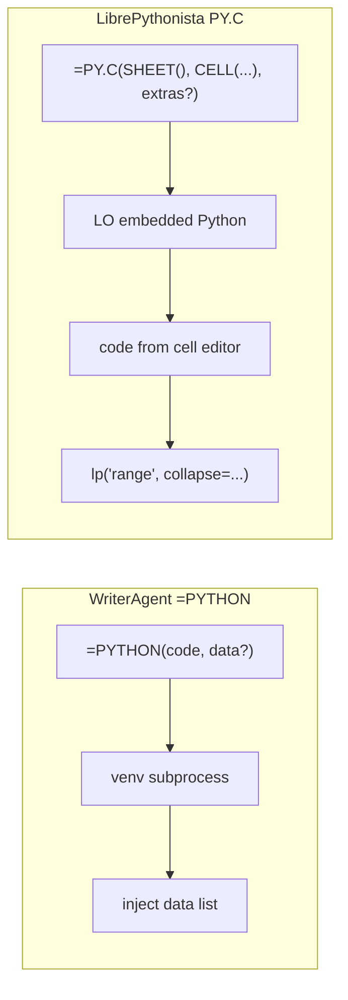

# Enabling NumPy & Python in LibreOffice

WriterAgent runs user Python (including **NumPy**, **pandas**, **scipy**, and similar C-extension stacks) **outside** LibreOffice’s embedded interpreter. The extension shells out to a **user-provided virtual environment**, evaluates code with a vendored **AST sandbox** in that child process, and returns JSON-serializable results to the chat agent or Calc formulas.

For a short executive summary, see [WriterAgent architecture — Scientific Python integration](writeragent-architecture.md#4-scientific-python-integration-the-compute-bridge).

## Table of contents

1. [The problem: ABI and embedded Python](#1-the-problem-abi-and-embedded-python)
2. [Strategy decision](#2-strategy-decision)
3. [User guide](#3-user-guide)
4. [Architecture](#4-architecture)
   - [Linux Cross-Process IPC Performance](#linux-cross-process-ipc-performance)
5. [Developer reference](#5-developer-reference)
6. [The `=PYTHON()` Calc function](#6-the-python-calc-function) <!-- anchor: the-python-calc-function -->
   - [Calc formula lexer quirks (inline code)](#calc-formula-lexer-quirks-inline-code)
   - [NumPy serialization](#numpy-serialization)
7. [Deferred roadmap](#7-deferred-roadmap)
8. [Implementation status](#8-implementation-status)

**Related:** [NumPy serialization](numpy-serialization.md) · [Jupyter notebook import](jupyter-notebook-import.md)

---

## 1. The problem: ABI and embedded Python

`numpy` is not pure Python; it ships compiled C/C++ extensions that must match the **exact** Python ABI they were built for.

- **The problem:** If a user runs `pip install numpy` with system Python 3.12 and the extension loads that build into LibreOffice’s embedded Python (often 3.8–3.11), LibreOffice can **fatally crash** — the extensions are binary-incompatible.
- **The requirement:** NumPy (and similar wheels) must be installed into the **same** `python` executable that runs the code, or execution must stay in a **separate** interpreter that never shares memory with LibreOffice.

All design choices below follow from that constraint.

---

## 2. Strategy decision

| Approach | Status | Summary |
|----------|--------|---------|
| **1 — Pip bootstrap inside LibreOffice** | **Rejected** | Ship `pip` and install packages into LO’s runtime at startup (LibrePythonista-style). Requires heavy path/sandbox handling (Flatpak, macOS, Windows) and couples the extension to the embedded interpreter. |
| **2 — Managed venv created by the extension** | **Deferred** | Extension creates and owns a venv (matching LO Python version, installs numpy/pandas). Conflicts with users who want MKL/OpenBLAS or existing data-science stacks. |
| **3 — User-provided venv + subprocess** | **Chosen** | User points `scripting.python_venv_path` at an existing `.venv`. WriterAgent never imports NumPy in-process. |

### Rejected: in-process `sys.path` injection

Appending the user’s `site-packages` to LibreOffice’s `sys.path` and `import numpy` there only works if the venv was built with the **same** minor Python version and architecture as LibreOffice’s embedded interpreter. In practice users create venvs with system Python 3.12+; LO embeds an older runtime — **immediate ABI crash**. Do not use this pattern.

### Chosen: warm worker + fresh sandbox per call

1. **Persistent worker:** [`PythonWorkerManager`](plugin/scripting/python_worker_manager.py) spawns the venv’s `python` once per executable path and keeps it alive.
2. **Fresh namespace per request:** [`worker_harness.py`](plugin/scripting/worker_harness.py) → [`venv_sandbox.py`](plugin/scripting/venv_sandbox.py) runs each call in a new [`LocalPythonExecutor`](plugin/contrib/smolagents/local_python_executor.py) — no variables carry over between `run_venv_python_script` / `=PYTHON()` invocations.
3. **JSON line protocol:** One request per line on stdin, one response per line on stdout. Bidirectional **tool RPC** from the venv back into LibreOffice is **not** wired yet ([§7](#7-deferred-roadmap)).

**Pros:** Sidesteps ABI issues; any Python version in the venv; avoids spawn overhead on every call.  
**Cons:** User must create and maintain a venv; no notebook-style shared kernel — re-pass data via `data` / `data_range` or cell references.

---

## 3. User guide

### Vision

Users can ask the AI to run Monte Carlo simulations, statistics, or other library-heavy work. The agent writes Python, executes it in the user’s venv, and uses existing Calc/Writer tools (`write_formula_range`, `create_chart`, etc.) to place results. The user stays in LibreOffice; no terminal required.

### Settings → Python

| Setting | Description | Example |
|---------|-------------|---------|
| `scripting.python_venv_path` | Absolute path to an existing venv directory | `~/.writeragent_venv` |
| `scripting.python_exec_timeout` | Wall-clock limit (seconds) for Run Python Script, `=PYTHON()`, and `run_venv_python_script` | `10` (default; range 1–600) |

Module implementation: `plugin/scripting/` (no top-level `python/` package — avoids clashing with the stdlib name).

- **Empty path:** `run_venv_python_script` and `=PYTHON()` fall back to **`sys.executable`** (LibreOffice’s embedded Python) — stdlib-only unless that interpreter happens to have extra packages; **use a dedicated venv for NumPy**.
- **No automatic venv creation** — the user brings their own environment.
- **Test button:** Validates the path is a directory, resolves `bin/python` or `Scripts\python.exe`, and runs a trivial subprocess smoke check.

### Execution paths (shipped)

| Entry | Module | Notes |
|-------|--------|-------|
| Chat tool **`run_venv_python_script`** | [`plugin/calc/venv_python.py`](plugin/calc/venv_python.py) | Specialized domain `python`; Writer/Calc/Draw when delegated |
| Calc **`=PYTHON(code, data?)`** | [`plugin/calc/python_addin.py`](plugin/calc/python_addin.py) / [`plugin/calc/python_function.py`](plugin/calc/python_function.py) | Same runner as the chat tool |
| Shared runner | [`plugin/scripting/run_venv_code.py`](plugin/scripting/run_venv_code.py) | Only entry for venv subprocess execution |
| In-process **`execute_python_script`** | [`plugin/calc/python_executor.py`](plugin/calc/python_executor.py) | LO embedded Python, stdlib sandbox, `lp()` / `set_range` helpers; **not** used by `=PYTHON()` |

Both venv paths assign JSON-serializable output to **`result`**. NumPy arrays and pandas objects are serialized in the worker. There is **no UNO API inside the child process** today.

### `run_venv_python_script` — Calc vs Writer/Draw

| Context | `data` / `data_range` in schema? | Injected in subprocess? |
|---------|----------------------------------|-------------------------|
| Calc chat, `domain=python` | Yes | Yes, when provided |
| Writer / Draw chat, `domain=python` | No | Never — use document tools for content |
| `=PYTHON(code, range)` | 2nd arg is the range | Yes |

Wall-clock limit comes from **Settings → Python** (`scripting.python_exec_timeout`, default **10s**, max **600s**). It is not exposed on the LLM tool schema.

### Two-phase LLM workflow

The LLM does **not** write into the document from inside the venv subprocess:

1. **Compute:** Call `run_venv_python_script` with numpy/pandas code; read serialized `result`.
2. **Insert:** Call existing Calc tools (`write_formula_range`, `set_style`, `create_chart`, etc.).

This keeps user scripts free of UNO and matches today’s shipped behavior. Prompt guidance for the model lives with other tool instructions in the chat/specialized toolset flow (domain `python`).

**Example flow**

```text
1. run_venv_python_script(code="import numpy as np\nresult = np.random.normal(0, 1, 100).tolist()")
2. write_formula_range(...) using the returned list
3. create_chart(...)
```

### What the user experiences

1. Ask for analysis or computation requiring third-party libraries.
2. The model generates Python (visible in Thinking when enabled).
3. Status: *Running Python script…*
4. Results return as JSON; the model updates the document via normal tools.
5. On error, the model sees the message and can retry.

---

## 4. Architecture

```
┌──────────────────────────────────────────────────────────┐
│                    LibreOffice Process                    │
│                                                          │
│  ┌─────────────┐    ┌──────────────────────────────────┐ │
│  │  LLM / Chat │───▶│  run_venv_python_script / =PYTHON │ │
│  │  (tool loop) │    │  → run_code_in_user_venv          │ │
│  └─────────────┘    └──────────┬───────────────────────┘ │
│                                │                         │
│                     ┌──────────▼───────────────────────┐ │
│                     │  PythonWorkerManager             │ │
│                     │  warm venv process               │ │
│                     │  worker_harness → venv_sandbox   │ │
│                     └──────────┬───────────────────────┘ │
│                                │ Pickle5 stream         │
│                     ┌──────────▼───────────────────────┐ │
│                     │  User venv Python (subprocess)   │ │
│                     │  LocalPythonExecutor + whitelist │ │
│                     └──────────┬───────────────────────┘ │
│                                │ result / stdout         │
│                     ┌──────────▼───────────────────────┐ │
│                     │  LLM → Calc/Writer tools         │ │
│                     └──────────────────────────────────┘ │
└──────────────────────────────────────────────────────────┘
```

LibreOffice’s embedded Python and the user’s venv are **different interpreters** ([§1](#1-the-problem-abi-and-embedded-python)). Venv execution uses the venv’s `ast` and packages; the subprocess boundary is the hard safety line for C extensions.

### Linux Cross-Process IPC Performance

When executing Python code or transporting dense matrix data on Linux, the compute bridge operates over standard UNIX pipes with outstanding efficiency and sub-millisecond latency.

#### 1. Under-the-Hood Mechanics (How Linux Handles It)
- **UNIX Pipes via `pipe2(2)`**: When `PythonWorkerManager` spawns the venv subprocess, it specifies `stdin=subprocess.PIPE` and `stdout=subprocess.PIPE`. Under the hood, Python calls the Linux kernel's `pipe2(2)` system call to establish private, unidirectional in-memory data channels.
- **Kernel-Buffered Transit**: These pipes are backed by kernel-space ring buffers (defaulting to **64 KiB** since Linux 2.6.11, and dynamically scaling or configurable up to 1 MiB). 
- **Zero Disk/Network Overhead**: Data is written by the host directly to the kernel pipe buffer and read by the child process from the same buffer. The transaction resides entirely in RAM, completely bypassing the disk subsystem, filesystem page cache, or local socket loopback overhead.
- **Efficient Context Switching**: The data is copied via fast kernel-space memory maps (`copy_to_user` and `copy_from_user`). On modern Linux schedulers, context switches between the host and the warm worker take a mere **1 to 5 microseconds**.

#### 2. Speed and Throughput Mechanics
- **RAM-to-RAM Bandwidth**: Modern memory channels (DDR4/DDR5) sustain copy speeds between **20 GB/s and 60+ GB/s**, ensuring the physical transport of matrix data is effectively instantaneous.
- **Sub-Millisecond E2E Latency**: Because the IPC operates on raw binary streams using **Pickle5 + Split-Grid** (completely bypassing string decoding, JSON text parsing, or Base64 footprint expansion), the roundtrip overhead is extremely small:
  - A **100×100 grid** (10,000 cells, ~78 KiB payload) transfers, unpacks, and materializes in the child in just **0.503 ms** for egress.
  - A **1000-cell array** transfers in less than **0.08 ms** E2E.
- **Zero IPC Bottleneck**: The entire serialization and pipe transit pipeline is so fast that the IPC overhead is practically negligible compared to any typical numeric or scientific execution times (e.g. SymPy prime calculations or NumPy matrix multiplication), ensuring a completely fluid user experience in both Calc sheets and the chat sidebar.

---

## 5. Developer reference

### Module map

```
plugin/
├── scripting/
│   ├── run_venv_code.py          # Single entry: run_code_in_user_venv
│   ├── python_worker_manager.py  # Warm subprocess, JSON protocol
│   ├── worker_harness.py         # Stdin/stdout loop in venv
│   ├── venv_sandbox.py           # LocalPythonExecutor + VENV_AUTHORIZED_IMPORTS
│   ├── payload_codec.py          # split_grid pack/unpack (host stdlib / child NumPy)
│   ├── writeragent_api.py        # Generated stubs (RPC not wired)
│   └── python_runner.py          # Settings dialog / manual run UI
├── calc/
│   ├── venv_python.py            # run_venv_python_script tool
│   ├── python_executor.py        # In-process execute_python_script
│   └── calc_addin_data.py        # Range → data shaping for =PYTHON / tool
└── contrib/smolagents/
    └── local_python_executor.py  # Vendored AST sandbox (shipped in OXT)
```

Jupyter `.ipynb` import (Writer menu, vendored nbformat): [jupyter-notebook-import.md](jupyter-notebook-import.md).

### Config

| Key | Shipped | Role |
|-----|---------|------|
| `scripting.python_venv_path` | Yes | Absolute venv directory; empty → `sys.executable` |
| `scripting.python_exec_timeout` | Yes | Wall-clock seconds per run (default **10**, clamp **1–600**); see [`timeout_limits.py`](plugin/scripting/timeout_limits.py) |

Defined in [`plugin/scripting/module.yaml`](plugin/scripting/module.yaml) / Settings → Python (`scripting__python_venv_path`, `scripting__python_exec_timeout`).

**Planned (not in settings yet):** `python_exec_enabled` toggle.

### Worker protocol

**Host → worker (stdin), one JSON object per line:**

| Field | Required | Meaning |
|-------|----------|---------|
| `id` | Yes | Correlation id |
| `code` | Yes | Python source |
| `data` | No | Injected as variable `data` in a fresh namespace (nested JSON lists or [`split_grid`](numpy-serialization.md#strategy-3-split-grid-serialization-detail) envelope when dense numeric/mixed 2D) |

**Worker → host (stdout):**

| Field | When | Meaning |
|-------|------|---------|
| `id` | Always | Echo request id |
| `status` | Always | `"ok"` or `"error"` |
| `result` | `status == "ok"` | Serialized return value (`result` variable or last expression) |
| `stdout` | Optional | Captured prints / executor logs |
| `message` / `error` | `status == "error"` | Failure text |

Implementation: [`worker_harness.py`](plugin/scripting/worker_harness.py), [`python_worker_manager.py`](plugin/scripting/python_worker_manager.py) (env scrub for `KEY`/`TOKEN`/`SECRET`/`PASSWORD`/`AUTH`, `PYTHONIOENCODING=utf-8`, `PYTHONUTF8=1`, `PYTHONDONTWRITEBYTECODE=1`, process-group kill on timeout — patterns aligned with robust agent runners such as Hermes).

### Safety model

| Layer | Mechanism | Protects against |
|-------|-----------|------------------|
| **Restricted executor** | `LocalPythonExecutor` in subprocess — AST walk, dunder guards, iteration/operation limits | `eval`/`exec`, dunder escapes, infinite loops |
| **Import whitelist** | `VENV_AUTHORIZED_IMPORTS` in [`venv_sandbox.py`](plugin/scripting/venv_sandbox.py) only — not “whatever is pip-installed” | `os`, `subprocess`, `socket`, arbitrary filesystem access |
| **Subprocess isolation** | Separate interpreter, no shared memory with LO | ABI crashes, segfaults in C extensions, UNO corruption |
| **Environment scrubbing** | Strip secret-like env vars from child | Credential exfiltration via generated code |
| **User-provided venv** | Explicit opt-in | User controls installed packages |
| **Timeout** | Wall clock per execute (`scripting.python_exec_timeout`, default 10s, max 600s) | Runaway computation |

WriterAgent removed upstream’s `find_spec` import pre-check at executor init (see comment in vendored `local_python_executor.py`); missing packages fail when code imports them.

> The AST sandbox is not a perfect security boundary; **subprocess isolation** is the real guarantee. LLM-generated code is the threat model, not arbitrary hostile users.

### Warm process, fresh state

| Layer | Behavior |
|-------|----------|
| `PythonWorkerManager` | One subprocess per resolved venv `python`; respawns on crash/timeout |
| `worker_harness.py` | Read loop; delegates to `venv_sandbox.run_sandboxed_code` |
| `venv_sandbox.py` | New `LocalPythonExecutor` per request; inject `data`; serialize `result` |

No `reset` command, no cross-call variable cache. Optional **session persistence** would be an explicit product decision ([§7](#7-deferred-roadmap)).

### Specialized domain

Tool: `run_venv_python_script` with `specialized_domain = "python"`. Registered for Calc; exposed in Writer/Draw via cross-cutting delegation when the LLM activates the python toolset (`delegate_to_specialized_*_toolset(domain="python")`), same pattern as other specialized domains.

### Tool schema (reference)

See [`plugin/calc/venv_python.py`](plugin/calc/venv_python.py) — parameters `code`, optional `data` / `data_range` (Calc); `long_running` / async execution.

---

## 6. The `=PYTHON()` Calc function

Users and the LLM run Python from Calc via **`=PYTHON()`**. Same runner as **`run_venv_python_script`** ([`run_venv_code.py`](plugin/scripting/run_venv_code.py)). Configure **Settings → Python** → `scripting.python_venv_path` ([§3](#3-user-guide)).

### Formula parameters

IDL: `any python( [in] string code, [in] any data );` in [`extension/idl/XPythonFunction.idl`](../extension/idl/XPythonFunction.idl). Rebuild [`extension/XPythonFunction.rdb`](../extension/XPythonFunction.rdb) and [`extension/XPromptFunction.rdb`](../extension/XPromptFunction.rdb) after IDL changes (`scripts/rebuild_xprompt_rdb.sh` — one `.rdb` per interface).

| Arg | Name | Required | Role |
|-----|------|----------|------|
| 0 | `code` | Yes | Python source; evaluated result is returned |
| 1 | `data` | No | Optional range → variable **`data`** ([Data handoff](#data-handoff-and-shaping)) |

### Return Types, Coercion, and Matrix (Array) Formulas

The return type in the IDL is declared as `any` to allow a dynamic union of return types, maximizing compatibility with both standard (single-cell) and matrix formulas.

#### 1. The LibreOffice Type-Coercion Quirk (The `#VALUE!` Trap)
LibreOffice Calc operates strictly on double-precision floats (`double`/`float`), strings (`string`/`str`), and booleans (`boolean`/`bool`) for cell values.
* **The issue:** Python integers (`int`) returned from a script are marshaled by PyUNO as a sequence of `long`s (e.g. `sequence<sequence<long>>`).
* **The consequence:** Calc's formula engine lacks type coercion for integer matrices, immediately throwing a `#VALUE!` error in the sheet.
* **The resolution:** Every return value from `=PYTHON()` is recursively filtered through a coercion pipeline (`to_calc_compatible`):
  - `int` -> `float` (coerced to UNO `double`)
  - `None` -> `""` (coerced to empty cell)
  - `bool`, `float`, and `str` are preserved as is.
  - Lists and tuples are recursively converted to tuples of these Calc-supported types.

#### 2. Normal (Single-Cell) Formulas vs. Matrix (Array) Formulas
Calc's legacy add-in bridge only accepts **one scalar** (number, text, or boolean) per `=PYTHON()` evaluation. It cannot receive a Python list/tuple as a native array return (that yields `#VALUE!` even with **Ctrl+Shift+Enter**).

* **Scalar return (Enter)** — e.g. `=PYTHON("result = 3 ** 8")` or `=PYTHON("result = str([2, 3, 5])")`.
* **Multi-cell list results** — use a **matrix formula** over the target range and pass a **per-row index** as the optional 2nd argument:

  1. Select the output range (e.g. `A1:A6`).
  2. Enter (one formula for the block):

     ```text
     =PYTHON("result = [sp.prime(x) for x in range(1000, 1006)]"; ROW()-1)
     ```

  3. Confirm with **Ctrl+Shift+Enter** (curly braces `{=…}` in each cell of the block is normal).

  Each cell passes its row offset; `PYTHON` returns one prime per cell. Without the index argument, repeated evaluations in the same recalc pass return successive list elements (best-effort; prefer the `ROW()` form for reliability).

* **Grid egress over a data range** — use **two arguments only**: `=PYTHON("np.sum(data)"; B1:B10)` or `=PYTHON("(np.array(data) * 2).tolist()"; D6:G9)` as a matrix formula (**Ctrl+Shift+Enter**). The add-in IDL accepts only `(code, data)`; a third argument such as `ROW()-1` causes **Err:504** (error in parameter list). When the 2nd argument is the full range, `data` in Python is that grid; use `ROW()-n` as the 2nd argument only when it is the per-cell index, not together with a range.

* **Single cell, full list as text** — `=PYTHON("result = str([1, 2, 3])")` + Enter.

### Usage

```text
=PYTHON("3 ** 8")
=PYTHON("str([sp.prime(x) for x in range(1000, 1006)])")   (Returns as single-cell string)
=PYTHON("np.mean(data)"; A1:A10)
=PYTHON("result = [sp.prime(int(x)) for x in data]"; ROW()-1)  (matrix over column; Ctrl+Shift+Enter)
=PYTHON("import pandas as pd; df = pd.DataFrame(data); df[0].mean()"; A1:C10)
```

### Sharing Code via Cell References

Instead of typing Python code directly as a string literal inside the `=PYTHON()` formula, **you can pass a cell reference containing the code** (e.g., `=PYTHON(A1; B1:B10)`).

Because the first parameter of `=PYTHON()` is defined in the IDL (`XPromptFunction.idl`) as `string code`, **the LibreOffice Calc formula engine automatically handles evaluation and type coercion of cell references out-of-the-box.** 

No code changes or new APIs (such as `PythonCell()`) are required.

#### Advantages of passing a cell reference for code:
1. **Code Reusability / Single Source of Truth**: You can write a script once in cell `A1` and reference it in dozens of other cells (e.g., `=PYTHON(A1; B1:B10)`, `=PYTHON(A1; C1:C10)`). Updating the logic in `A1` recalculates all dependent cells automatically.
2. **Clean Syntax (No Quote Doubling)**: Inside Calc formulas, double quotes must be doubled to escape them (e.g., `""result = ...""`). Putting code in a cell lets you write clean, standard Python syntax without escaping pain.
3. **Multi-line Scripts**: The standard Calc cell editor supports multi-line text blocks (using `Alt+Enter` to insert newlines). This allows users to write readable, commented Python scripts of arbitrary length.
4. **Dynamic Formulas**: You can use Calc formulas to construct Python code dynamically based on other spreadsheet variables! For example:
   * Cell `A1`: `= "import numpy as np; result = np." & B1 & "(data)"`
   * Changing `B1` from `"mean"` to `"std"` dynamically changes the script executed by `=PYTHON(A1; C1:C10)`.

#### Gotchas & Design Invariants:
* **Empty Code Cells**: If the referenced code cell evaluates to an empty string, our robust subprocess script runner gracefully detects the empty code block and returns a cell with the error message: `Error: No code provided.`
* **Implicit Intersection**: If a user passes a multi-cell range as the first argument (e.g., `=PYTHON(A1:A2; B1:B10)`), Calc will perform implicit intersection using the active row/column. To ensure predictable behavior, users should always pass single cell references (like `A1`) or explicit absolute coordinates (like `$A$1`).

### Calc formula lexer quirks (inline code)

**Status:** observed in the field (2026); no WriterAgent code change can fix Calc’s parser — only workarounds and documentation until LibreOffice behavior improves or we ship richer UX (cell-reference-first prompts, edit dialog).

When `code` is a **string literal inside the formula**, LibreOffice Calc parses the **entire cell** (including the quoted Python) **before** the `=PYTHON()` add-in runs. Failures here are **not** venv, NumPy, or sandbox errors — Python never executes.

| Symptom | Typical cause | What users see |
|---------|----------------|----------------|
| **#NAME?** | Token inside the string is treated as a **spreadsheet** function name (e.g. `float`) | `=PYTHON("float(np.sum(data))"; D6:G6)` fails; `=PYTHON("np.sum(data)"; D6:G6)` works |
| **Err:508** | Wrong **argument separator** for locale/file format (`;` vs `,`), or parenthesis pairing confused on import | Common when opening **XLSX** generated with European `;` on **en-US** Calc (see [manual serialization suite](numpy-serialization.md#priority-1--profile-inside-libreoffice-gate-for-everything-else)) |
| **Err:510** | Cell text starts with `=` (e.g. section label `=== normal ===`) | Use plain labels like `[normal]`, not leading `=` |
| **#NAME?** | XLSX import lowercases the add-in name to `python`; lookup failed on display-only `PYTHON` | Use **`=PYTHON(...)`** (uppercase). WriterAgent accepts `python` / `PYTHON` after 2026-05 add-in fix; regenerate test XLSX if needed |

#### Why `float(np.sum(data))` in the formula string is a bad idea

Early test fixtures wrapped results in `float(...)` so compare formulas could use `ABS(oracle - python)`. That cast is **redundant**: [`to_calc_compatible`](../plugin/calc/python_function.py) already coerces NumPy scalars and Python `int` to Calc `double` on return. Runtime never required `float()` in the script.

The real problem is **Calc’s formula lexer**, not type coercion:

```text
=PYTHON("float(np.sum(data))"; D6:G6)   → often #NAME?  (Calc looks for a FLOAT function)
=PYTHON("np.sum(data)"; D6:G6)           → works; bridge coerces the NumPy scalar
```

Nested parentheses inside the quoted string (`float(…(…)…)`) can make pairing worse on some import paths. The identifier **`float`** is the usual trigger for **#NAME?**.

**Guidance for authors and LLMs:** prefer `np.sum(data)`, `np.max(data)`, `np.nansum(data)` in inline formulas; do not emit `float(...)` unless code lives **outside** the formula string (see below).

#### Recommended patterns (today)

| Pattern | When to use | Example |
|---------|-------------|---------|
| **Bare NumPy / expression** | Default for short inline code | `=PYTHON("np.sum(data)"; B1:B10)` |
| **Code in a cell** | Any `float(…)`, multi-line scripts, heavy quoting | `A1` = `float(np.sum(data))`; formula `=PYTHON($A$1; B1:B10)` |
| **Coerce without `float` name** | Need a float scalar inline; lexer-sensitive | `np.sum(data) + 0.0`, `np.asarray(data, float).sum()` (still watch nested `()`) |
| **`result = …` assignment** | Multi-statement scripts | `=PYTHON("result = np.sum(data)"; B1:B10)` — assignment form is fine; avoid wrapping the *expression* in `float()` in the same string if `#NAME?` appears |
| **XLSX test sheets** | Manual serialization regression | Use **comma** separators in generated formulas (Excel OOXML); LO converts to locale on import — see [`scripts/generate_serialization_test_csv.py`](../scripts/generate_serialization_test_csv.py) |

**XLSX input cells must be numeric, not text:** if the sheet stores values as strings (e.g. `"1.0"` from `str()` in a generator), Calc passes them as text, `split_grid` lands them in the `strings` map, and `np.sum(data)` fails with a Unicode dtype `TypeError`. Regenerate [`serialization_tests.xlsx`](../tests/fixtures/serialization_tests.xlsx) after fixing the generator so ints/floats are written as native cell types.

#### Future product directions (to consider)

These are **not** implemented; kept here so design discussions do not rediscover the same traps.

1. **Cell-reference-first UX** — Settings or formula wizard default: “put script in one cell, reference it from `=PYTHON`” (already supported by IDL; needs prompts/UI).
2. **LLM / `=PROMPT()` guardrails** — When generating `=PYTHON("…")`, forbid `float(` in inline strings; suggest `A1` reference or `np.sum` instead.
3. **Pre-flight in add-in (limited)** — If `code` still arrives as a string, we cannot fix `#NAME?` (add-in never called). A **macro or import filter** that rewrites known-bad patterns before recalc is fragile and out of scope for the extension core.
4. **Native ODS fixtures** — Optional generator output for manual tests to avoid XLSX separator/lexer import quirks while still testing `=PYTHON()`.
5. **Upstream** — LibreOffice issue: add-in string arguments with nested `()` and names like `float` should parse as opaque string literals. Worth filing if we collect minimal reproducers (XLSX + `=PYTHON("float(1)")`).
6. **Documentation parity** — [`tests/fixtures/serialization_tests.xlsx`](../tests/fixtures/serialization_tests.xlsx) cases intentionally use `np.sum` / `np.max` without `float()`; README generated alongside the sheet documents the quirk.

### How it runs

Uses the same warm worker and fresh executor as the chat tool ([§2](#2-strategy-decision)). **`execute_python_script`** is separate and not used for formulas. Variables do **not** persist across cells.

### Code Oracle (`=PROMPT()` + `=PYTHON()`)

`=PROMPT("Write a Python formula using numpy for the 95th percentile of B1:B100")` can yield a pasteable `=PYTHON("…")` string — natural-language bridge to data-science formulas without leaving the sheet.

### Comparison with LibrePythonista (`PY.C` and `lp()`)

[LibrePythonista](https://github.com/Amourspirit/python_libre_pythonista_ext) stores code **outside** the formula (`=PY.C(SHEET(), CELL("ADDRESS"), extras?)`) and runs in **LO embedded Python** with pip bootstrap. WriterAgent keeps code **in the formula** and runs in the **user venv**.



| Capability | WriterAgent `data` (arg 1) | LibrePythonista |
|------------|---------------------------|-----------------|
| Pass one range | Yes — flat list or 2D list | `lp("A1:B10")` |
| Multiple ranges in one formula | No (single `data`) | Multiple `lp()` calls |
| Named ranges | Only as 2nd arg | `lp("MyRange")` |
| Trim empty rows (`collapse`) | No | `collapse=True` on `lp()` |
| Typed date columns | Raw Calc values | `column_types` + pandas |
| Return type for ranges | `list` / `list[list]` | `pandas.DataFrame` |
| Cell context | Not exposed | `sheetIdx` + `cAddress` |
| Execution | User venv | LO embedded + pip bootstrap |

**What we kept:** two-argument formula + venv NumPy; flat 1D shaping for single rows/columns ([`normalize_python_data_shape`](plugin/calc/calc_addin_data.py)). **What we did not copy:** `PY.C` metadata formula, in-LO pandas bootstrap, mandatory `lp()` for every read.

| | WriterAgent `=PYTHON()` | LibrePythonista |
|---|-------------------------|-----------------|
| Where users edit | Formula bar: code inside `=PYTHON("…")` | LibrePy menu / Edit Code; cell shows short `=PY.C(...)` |
| Where source lives | In the `.ods` formula | Document-side store (`PySourceManager`, etc.) |

**Design stance:** treat each `=PYTHON` cell as a **pure function** (`data` in → `result` out). External storage + IDE editor helps for long scripts ([§7](#7-deferred-roadmap) — editor tiers).

### Data handoff and shaping

**Where does the `data` variable come from?**
If you are editing your Python code in an IDE or reading it statically, referencing `data` (e.g., `data[0]`) might look like a `NameError` (an undefined variable). 

In the `=PYTHON()` environment, **`data` is a special variable injected dynamically into your script's execution namespace at runtime.** 

When you pass a range (or cell reference) as the second argument to `=PYTHON(code; range)`, the LibreOffice Add-In:
1. Resolves the range inside Calc and reads all cell values.
2. Formats these values into standard Python lists (flat or 2D).
3. Injects this list into the sandbox's execution namespace under the variable name **`data`** (if it is a single-cell or single-entry input, the child worker automatically unpacks it to a scalar and coerces integer floats to standard Python `int`s).
4. Runs your Python script. Because of this runtime injection, your script can immediately access `data` as a fully defined, local variable.

| Range you pass in Calc | Structure of `data` in Python | Example Usage in Script |
|------------------------|-------------------------------|-------------------------|
| **Single cell** (e.g., `B1`) | **Scalar**: coerced to `int` if mathematically whole float, else `float`/`str`/`bool` | `data * 2` or `sp.prime(data)` |
| **Row or Column** (e.g., `B1:B10`) | **Flat 1D `list`** (or 1D `ndarray` if numeric) | `sum(data)` or `np.mean(data)` |
| **2D Rectangle** (e.g., `B1:C5`) | **Nested 2D `list` (row-major)** (or 2D `ndarray` if numeric) | `pd.DataFrame(data)` or 2D numpy processing |

Conversion logic: [`plugin/calc/calc_addin_data.py`](plugin/calc/calc_addin_data.py). Empty cells in Calc map to `None` in Python. The maximum data payload is capped at `MAX_PYTHON_DATA_CELLS` (default 250 000).

**Data pipeline:** Calc UNO range → `calc_addin_data_to_python` → `pack_calc_data_for_wire` ([`host_pack_data`](../plugin/scripting/payload_codec.py): Pickle list or Split-Grid; details in [NumPy serialization](numpy-serialization.md#current-pipeline-and-costs)) → Pickle5 payload stream → `child_unpack_data` (ndarray or list from split_grid) → `send_variables({"data": ...})` → script runs. Return path: `child_pack_result` → Pickle5 payload stream → host `host_unpack_data` ([`python_function.py`](../plugin/calc/python_function.py)).

**Gaps vs LibrePythonista (workarounds):** one range only (use multiple cells or chat `data_range`); no `collapse` (tighter range or strip `None` in Python); no auto-DataFrame (`pd.DataFrame(data)`).

**Future formula parameters (not planned unless needed):** 3rd arg `extras` for recalc deps; `collapse` on conversion; host `lp()` bridge; `timeout_sec` on the formula (today uses the same Settings value as the chat tool).

### NumPy serialization

The worker protocol uses a length-prefixed binary stream with **Pickle5 + Split-Grid** (direct raw bytes under the `"buffer"` dictionary key, completely bypassing JSON/Base64 encoding) as the exclusive production serialization protocol. All JSON/Base64 out-of-process serialization remnants have been removed from the production execution path and moved to the test/benchmark suites for diagnostic, optimization, and historical comparison.

Under the **Pickle5 + Split-Grid** design:
- **Wire size reduction**: Payloads shrink by **60%** (e.g. a 100x100 grid takes only **78.48 KiB** compared to 198 KiB for JSON lists), completely bypassing Base64 size expansion.
- **End-to-End Speedup**: E2E egress time for `100x100` cells drops from `10.066 ms` to `0.503 ms` (a massive **20.01x E2E speedup**).
- **C-Speed Materialization**: Peer materialization in the child is an unbelievable **168.50x faster** than standard JSON list mapping (`0.017 ms` vs `2.837 ms` baseline), loading the raw double-precision binary buffer directly via zero-copy `np.frombuffer` in one step.
- Mixed-type grids are fully supported via a sparse index map for strings, and smaller payloads (<10 cells) gracefully fall back to standard Pickle lists.

This keeps LibreOffice's embedded Python NumPy-free while making large Calc ranges and ndarray results exceptionally fast to move across the process boundary. Wire format, benchmarks, and optimization tiers are in [NumPy serialization](numpy-serialization.md). **Cell-level behavior** (empty cells, strings, zip codes, `np.nan` vs `None`, rectangular-only 2D) is documented in [Cell semantics: Calc, Python, and NumPy](numpy-serialization.md#cell-semantics-calc-python-and-numpy).

### Optional: Python edit dialog (deferred UX)

| Tier | User sees | Code location | Effort |
|------|-----------|---------------|--------|
| 0 (today) | Formula bar | Inside `=PYTHON("…")` | Done |
| 1 | Modal XDL edit dialog | Still in formula | Small–medium |
| 2 | Short formula + document store key | Outside formula | Medium |
| 3 | LibrePythonista-like IDE surface | LP-scale infrastructure | Very large |

Tier 1 reuses existing `DialogProvider` / XDL patterns ([`plugin/chatbot/dialogs.py`](plugin/chatbot/dialogs.py)); execution unchanged. Tier 3 is only justified if Calc-native Python becomes a primary product pillar.

---

## 7. Deferred roadmap

### Managed venv (Strategy 2)

“Setup Python Environment” in Settings: detect LO Python version, create venv, install numpy/pandas/matplotlib, set `scripting.python_venv_path`. Deferred to respect custom stacks and reduce scope.

### Venv ↔ LibreOffice tool RPC

> **Status: Not implemented.** [`writeragent_api.py`](plugin/scripting/writeragent_api.py) is generated from tool metadata ([`scripts/generate_tool_proxies.py`](scripts/generate_tool_proxies.py)), but the warm worker does **not** handle `tool_call` lines yet. Scripts must assign **`result`**; the LLM calls Calc/Writer tools in phase two ([§3](#3-user-guide)).

**Intended behavior (when built):**

- User code in the venv calls generated proxies (e.g. `footnote.insert(...)`).
- Worker writes `{"type": "tool_call", "id", "tool", "args"}` on stdout.
- `PythonWorkerManager` dispatches via `ToolRegistry.execute()`, writes `tool_result` on stdin, continues until final `code_result`.
- **Domain-scoped:** only tools for the active specialized domain (mirrors `delegate_to_specialized_*_toolset`), not the full registry.
- **Fresh namespace per top-level execute;** RPC happens inside one request.

**Protocol extension (sketch):**

| Direction | `type` | Purpose |
|-----------|--------|---------|
| worker → host | `code_result` | Normal completion (today’s `status`/`result`) |
| worker → host | `tool_call` | Proxy requests LO tool |
| host → worker | `execute` | Run code (today) |
| host → worker | `tool_result` | Answer `tool_call` |

### Serialization performance

Prioritized future work (LO profiling gate, Tier 0 crossings, host pack/unpack, cache, deferred 2b/3) lives in [NumPy serialization](numpy-serialization.md#future-work--serialization-performance). Native host-extension packaging notes live there too: [Building host native extensions (Cython)](numpy-serialization.md#building-host-native-extensions-cython).

### Jupyter notebook import (`.ipynb`)

WriterAgent can import Jupyter notebooks into **Writer** via **Tools → Import Jupyter Notebook…** (menu + UNO; vendored nbformat v4). This is **not** part of the venv compute bridge — imported code cells are editable TextFields, not executed in the user venv.

Full usage, document layout, debugging, and notebook-specific roadmap: **[Jupyter notebook import](jupyter-notebook-import.md)**.

### Other enhancements

- **OooDev / ScriptForge:** optional venv install for UNO-from-Python; or keep compute-in-venv + document-via-tools (recommended).
- **Matplotlib:** save figure to temp file; insert via existing image tools.
- **Optional session persistence:** reuse one executor namespace within a chat session (opt-in).
- **Worker idle shutdown:** terminate venv process after N minutes idle.
- **Formula `timeout_sec`:** optional per-formula override (Settings remains the default).
- **LO serialization profiler:** debug-menu or UNO test harness for legs A–D ([Priority 1](numpy-serialization.md#priority-1--profile-inside-libreoffice-gate-for-everything-else)).

---

## 8. Implementation status

### Shipped (venv bridge + high-performance serialization, 2026-05)

| Component | Status |
|-----------|--------|
| Warm worker + JSON / Pickle protocol | [`python_worker_manager.py`](../plugin/scripting/python_worker_manager.py), [`worker_harness.py`](../plugin/scripting/worker_harness.py), [`run_venv_code.py`](../plugin/scripting/run_venv_code.py) |
| AST sandbox per request | [`venv_sandbox.py`](../plugin/scripting/venv_sandbox.py) + vendored [`local_python_executor.py`](../plugin/contrib/smolagents/local_python_executor.py) |
| `run_venv_python_script` / `=PYTHON()` | [`venv_python.py`](../plugin/calc/venv_python.py), [`python_function.py`](../plugin/calc/python_function.py) |
| **Pickle5 + Split-Grid** | **Default serialization**: Direct raw binary double-precision buffer in dictionary envelope via Pickle5, zero-copy C-speed `np.frombuffer` materialization in child. |
| **JSON Split-Grid** | Backward-compatible Base64 envelope fallback for diagnostic tracing/JSON environments. |
| Calc ingress | [`pack_calc_data_for_wire`](../plugin/calc/calc_addin_data.py) |
| Bench + tests | [`scripts/bench_serialization.py`](../scripts/bench_serialization.py), [`tests/scripting/test_payload_codec.py`](../tests/scripting/test_payload_codec.py), [`tests/scripting/test_run_venv_code.py`](../tests/scripting/test_run_venv_code.py) |

See [NumPy serialization](numpy-serialization.md) for behavior, benchmarks, optimization tiers, and native host-extension notes. Jupyter `.ipynb` import (separate feature): [jupyter-notebook-import.md](jupyter-notebook-import.md).

### Not shipped / deferred

- **Serialization next steps** — [Future work](numpy-serialization.md#future-work--serialization-performance): LO profile first, Tier 0, opaque blob, float32, pandas egress, worker cache; Tier 2b codecs; optional [Cython `vec_pack`](numpy-serialization.md#building-host-native-extensions-cython) (not started).
- Venv ↔ LO **tool RPC** ([§7](#7-deferred-roadmap)) — [`writeragent_api.py`](../plugin/scripting/writeragent_api.py) stubs only.
- Managed venv (Strategy 2), session persistence, worker idle shutdown, per-formula `timeout_sec`, Python edit dialog tiers 1–3.
- **Jupyter notebook import** — see [jupyter-notebook-import.md](jupyter-notebook-import.md) (Writer import shipped; execution loop deferred).
