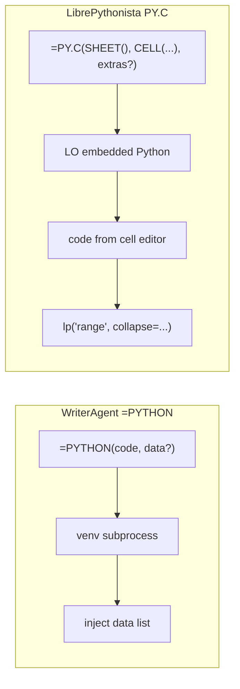

# Enabling NumPy & Python in LibreOffice

> **Note:** Calc registers **`=PY()`** and **`=PYTHON()`** as the same venv-backed add-in; prefer **`=PY(...)`** for new formulas. The rest of this guide still uses `=PYTHON()` in examples for historical continuity.

> **Moved:** Domain-specific trusted helpers (Analysis, Visualization, Symbolic Math, Units, Text Analytics, Forecasting, …) are documented in **[numpy-domains.md](numpy-domains.md)**. Vision/OCR: **[image-recognition.md](image-recognition.md)**. Embeddings: **[embeddings.md](embeddings.md)**.

WriterAgent runs user Python (including **NumPy**, **pandas**, **scipy**, and similar C-extension stacks) **outside** LibreOffice’s embedded interpreter. The extension shells out to a **user-provided virtual environment**, evaluates code with a vendored **AST sandbox** in that child process, and returns JSON-serializable results to the chat agent or Calc formulas.

## Table of contents

1. [The problem: ABI and embedded Python](#1-the-problem-abi-and-embedded-python)
2. [Strategy decision](#2-strategy-decision)
3. [User guide](#3-user-guide)
4. [Architecture](#4-architecture)
5. [Developer reference](#5-developer-reference)
   - [Trusted extension code in the venv](#trusted-extension-code-in-the-venv)
6. [The `=PYTHON()` Calc function](#6-the-python-calc-function) <!-- anchor: the-python-calc-function -->
   - [Session modes and recalc semantics](#session-modes-and-recalc-semantics)
   - [Keyboard shortcuts and recalc](#keyboard-shortcuts-and-recalc)
   - [Empty cells vs NaN](#empty-cells-vs-nan)
   - [Calc formula lexer quirks (inline code)](#calc-formula-lexer-quirks-inline-code)
7. [Deferred roadmap](#7-deferred-roadmap)
   - [Microsoft Python in Excel vs WriterAgent](#microsoft-python-in-excel-vs-writeragent)
   - [Competitive landscape (Google Sheets vs Calc)](#competitive-landscape-google-sheets-vs-calc)
   - [Calc backlog from landscape survey](#calc-backlog-from-landscape-survey)
8. [Implementation status](#8-implementation-status)
9. [Multi-Range Support (Varargs)](#9-multi-range-support-varargs)

**Related:** [Venv subprocess IPC & NumPy serialization](numpy-serialization.md) (warm worker, protocol, wire formats, benchmarks) · [NumPy domain helpers](numpy-domains.md) (Analysis, Viz, Symbolic, Units, Text, Forecasting roadmaps) · [Monaco editor dev plan](python-monaco-editor-dev-plan.md) (IPC, phases 2B–2F, manual tests) · [Python-in-Calc future work](python-in-excel-dev-plan.md) (Phases 3–7 + backlog) · [DuckDB Calc integration (Phases A–C landed)](duckdb-calc-dev-plan.md) · [Jupyter notebook import](jupyter-notebook-import.md) · [Calc spreadsheet → Python import](calc-spreadsheet-to-python-import.md) (convert formulas to `=PY()` while preserving data — proposed) · [Analysis Sub-Agent](analysis-sub-agent.md) (data discovery + trusted numpy/pandas execution) · [Image Recognition](image-recognition.md) · [Embeddings](embeddings.md) · [SageMath integration (deferred)](sagemath-integration-dev-plan.md)

---

## 1. The problem: ABI and embedded Python

`numpy` is not pure Python; it ships compiled C/C++ extensions that must match the **exact** Python ABI they were built for.

- **The problem:** If a user runs `pip install numpy` with system Python 3.12 and the extension loads that build into LibreOffice’s embedded Python (often 3.8–3.11), LibreOffice can **fatally crash** — the extensions are binary-incompatible.
- **The requirement:** NumPy (and similar wheels) must be installed into the **same** `python` executable that runs the code, or execution must stay in a **separate** interpreter that never shares memory with LibreOffice.

All design choices below follow from that constraint.

---

## 2. Strategy decision

| Approach | Status | Summary |
|----------|--------|---------|
| **1 — Pip bootstrap inside LibreOffice** | **Rejected** | Ship `pip` and install packages into LO’s runtime at startup (LibrePythonista-style). Requires heavy path/sandbox handling (Flatpak, macOS, Windows) and couples the extension to the embedded interpreter. |
| **2 — Managed venv created by the extension** | **Deferred** | Extension creates and owns a venv (matching LO Python version, installs numpy/pandas). Conflicts with users who want MKL/OpenBLAS or existing data-science stacks. |
| **3 — User-provided venv + subprocess** | **Chosen** | User points `scripting.python_venv_path` at an existing `.venv`. WriterAgent never imports NumPy in-process. |

### Rejected: in-process `sys.path` injection

Appending the user’s `site-packages` to LibreOffice’s `sys.path` and `import numpy` there only works if the venv was built with the **same** minor Python version and architecture as LibreOffice’s embedded interpreter. In practice users create venvs with system Python 3.12+; LO embeds an older runtime — **immediate ABI crash**. Do not use this pattern.

### Chosen: warm worker + session-aware sandbox

1. **Persistent worker:** [`PythonWorkerManager`](plugin/scripting/venv_worker.py) spawns the venv’s `python` once per executable path and keeps it alive.
2. **Namespace per request (configurable):** [`worker_harness.py`](plugin/scripting/worker_harness.py) → [`venv_sandbox.py`](plugin/scripting/venv_sandbox.py) uses a [`LocalPythonExecutor`](plugin/contrib/smolagents/local_python_executor.py). Default **Isolated** mode gives each `=PYTHON()` cell a fresh namespace (init script still seeds once). **Shared kernel** mode ([`session_manager.py`](plugin/scripting/session_manager.py)) keeps one workbook namespace across cells — see [§6 Session modes](#session-modes-and-recalc-semantics). Chat `run_venv_python_script` always uses isolated execution.
3. **Length-prefixed Pickle5 IPC:** [`PythonWorkerManager`](plugin/scripting/venv_worker.py) ↔ [`worker_harness.py`](plugin/scripting/worker_harness.py) exchange framed request/response dicts; `data` / `result` use [`split_grid`](numpy-serialization.md#strategy-3-split-grid-serialization-detail) when dense. Protocol detail: [Venv subprocess IPC](numpy-serialization.md#worker-protocol). Bidirectional **tool RPC** is **not** wired yet ([§7](#7-deferred-roadmap)).

**Pros:** Sidesteps ABI issues; any Python version in the venv; avoids spawn overhead on every call; optional shared-kernel mode for multi-cell pipelines.  
**Cons:** User must create and maintain a venv; in **Isolated** mode, re-pass data via `data` / `data_range` or cell references unless Shared kernel is enabled.

---

## 3. User guide

### Vision

Users can ask the AI to run Monte Carlo simulations, statistics, or other library-heavy work. The agent writes Python, executes it in the user’s venv, and uses existing Calc/Writer tools (`write_formula_range`, `create_chart`, etc.) to place results. The user stays in LibreOffice; no terminal required.

### Settings → Python

| Setting | Description | Example |
|---------|-------------|---------|
| `scripting.python_venv_path` | Absolute path to an existing venv directory | `~/.writeragent_venv` |
| `scripting.python_session_mode` | **`isolated`** (default) or **`shared`** (Shared kernel for `=PYTHON()` cells) | `isolated` |
| `scripting.python_exec_timeout` | Wall-clock limit (seconds) for Run Python Script, `=PYTHON()`, and `run_venv_python_script`. Trusted long-running helpers (OCR, spaCy, SymPy, embeddings...) use a single internal long budget instead (see `LONG_TRUSTED_WORKER_TIMEOUT_SEC` + list in client.py). | `10` (default; range 1–600) |
| `scripting.python_auto_spill` | **On by default.** Single-cell `=PYTHON()` returning a list, 2D array, or DataFrame **auto-spills** into adjacent cells (0.1s deferred write). Blocked cells → `#SPILL!` in the formula cell. Spill coordinates persist in the document. Disable for matrix-only workflows. | `true` |

Module implementation: `plugin/scripting/` (no top-level `python/` package — avoids clashing with the stdlib name).

- **Empty path:** `run_venv_python_script` and `=PYTHON()` fall back to **`sys.executable`** (LibreOffice’s embedded Python) — stdlib-only unless that interpreter happens to have extra packages; **use a dedicated venv for NumPy**.
- **No automatic venv creation** — the user brings their own environment.
- **Test button:** Validates the path is a directory, resolves `bin/python` or `Scripts\python.exe`, and runs a warm-worker diagnostic via [`run_venv_self_check`](../plugin/scripting/venv_worker.py). Reports **Scientific**, **Data Analysis / EDA**, **UI / Monaco**, **Vision Libraries**, and **Embeddings Libraries** groups (Present/Missing). Vision and Embeddings imports use dedicated ~30s host subprocess probes (`EMBEDDINGS_PROBE_TIMEOUT_SEC`, `VISION_PROBE_TIMEOUT_SEC` in [`config_limits.py`](../plugin/scripting/config_limits.py)) because cold `sentence-transformers` / Docling imports can exceed 5s on modest hardware. Domain package lists: [numpy-domains.md](numpy-domains.md), [Image Recognition](image-recognition.md), [Embeddings](embeddings.md#embeddings-venv-packages).

**Creating the venv (uv recommended in 2026):**

```bash
# Create a dedicated venv (choose a Python close to what you develop with)
uv venv ~/.writeragent_venv --python 3.12

# Activate (optional for uv pip) and install what you need
source ~/.writeragent_venv/bin/activate
uv pip install numpy pandas scipy scikit-learn matplotlib sympy spacy textdescriptives
python -m spacy download xx_sent_ud_sm

# Point Settings → Python at the venv root (~/.writeragent_venv) or the bin/ dir.
```


### Execution paths (shipped)

| Entry | Module | Notes |
|-------|--------|-------|
| Chat tool **`run_venv_python_script`** | [`plugin/calc/python/venv.py`](plugin/calc/python/venv.py) | Specialized domain `python`; Writer/Calc/Draw when delegated |
| Calc **`=PYTHON(code, data?)`** | [`plugin/calc/python/addin.py`](plugin/calc/python/addin.py) / [`plugin/calc/python/function.py`](plugin/calc/python/function.py) | Same runner as the chat tool |
| Shared runner | [`plugin/scripting/venv_worker.py`](plugin/scripting/venv_worker.py) | Only entry for venv subprocess execution |
| In-process **`execute_python_script`** | [`plugin/calc/python/executor.py`](plugin/calc/python/executor.py) | LO embedded Python, stdlib sandbox, `lp()` / `set_range` helpers; **not** used by `=PYTHON()` |

Both venv paths assign JSON-serializable output to **`result`**. NumPy arrays and pandas objects are serialized in the worker. There is **no UNO API inside the child process** today.

### `run_venv_python_script` — Calc vs Writer/Draw

| Context | `data` / `data_range` in schema? | Injected in subprocess? |
|---------|----------------------------------|-------------------------|
| Calc chat, `domain=python` | Yes | Yes, when provided |
| Writer / Draw chat, `domain=python` | No | Never — use document tools for content |
| `=PYTHON(code, range)` | 2nd arg is the range | Yes |

Wall-clock limit comes from **Settings → Python** (`scripting.python_exec_timeout`, default **10s**, max **600s**). It is not exposed on the LLM tool schema. That limit applies to **user code execution** only: the first request after worker spawn (or after a crash) runs an internal warm step (spawn + auto-imports) under a separate ~30s host budget (`WARM_WORKER_TIMEOUT_SEC` in [`config_limits.py`](plugin/scripting/config_limits.py)), not charged against your configured value.

Trusted helpers that involve model loading or known long work (Vision/OCR, text analytics with spaCy, symbolic math with SymPy, embeddings, etc.) use a single internal long budget (`LONG_TRUSTED_WORKER_TIMEOUT_SEC`) instead of the user script timeout. See the list in [`client.py`](../plugin/scripting/client.py) and [Image Recognition](image-recognition.md).

### Two-phase LLM workflow

The LLM does **not** write into the document from inside the venv subprocess:

1. **Compute:** Call `run_venv_python_script` with numpy/pandas code; read serialized `result`.
2. **Insert:** Call existing Calc tools (`write_formula_range`, `set_style`, `create_chart`, etc.).

This keeps user scripts free of UNO and matches today’s shipped behavior. Prompt guidance for the model lives with other tool instructions in the chat/specialized toolset flow (domain `python`).

**Example flow**

```text
1. run_venv_python_script(code="import numpy as np\nresult = np.random.normal(0, 1, 100).tolist()")
2. write_formula_range(...) using the returned list
3. create_chart(...)
```

### What the user experiences

1. Ask for analysis or computation requiring third-party libraries.
2. The model generates Python (visible in Thinking when enabled).
3. Status: *Running Python script…*
4. Results return as JSON; the model updates the document via normal tools.
5. On error, the model sees the message and can retry.

### Monaco editor & Run Python Script

WriterAgent ships a **Monaco-based code editor** (pywebview child in the configured venv) for Calc formulas and ad-hoc scripts. IPC, threading, and remaining phase 2B–2F backlog: [python-monaco-editor-dev-plan.md](python-monaco-editor-dev-plan.md). (Theme sync 2E is shipped.)

| Feature | Status | Entry |
|---------|--------|-------|
| **Edit Python in Cell…** (Calc menubar + cell context menu) | **Shipped** | [`python_editor.py`](plugin/calc/python/editor.py) — dual save (`=PYTHON("…")` or plain text for `=PYTHON($A$1; …)`), editable **Data:** range textbox |
| **Run Python Script…** (Writer/Calc/Draw) | **Shipped** | [`python_runner.py`](plugin/scripting/python_runner.py) + [`editor_host.py`](plugin/scripting/editor_host.py) — **Run** / **Save** / script picker |
| **Document-attached scripts** (`WriterAgentDocumentPythonScripts`) | **Shipped** | [`document_scripts.py`](plugin/scripting/document_scripts.py) — **This Document** vs **My Scripts** in picker |
| **Edit Initialization Script…** (Calc) | **Shipped** | [`init_script_editor.py`](plugin/calc/init_script_editor.py) — workbook startup script in document properties |
| **Theme sync (2E)** — Monaco + toolbar chrome automatically follow LO light/dark | **Shipped** | [`appearance.py`](plugin/framework/appearance.py), editor host + JS/CSS |
| Syntax squiggles (2B), range picker (2C), full Jedi (2D), sheet cell list | **Backlog** | [Monaco dev plan §8](python-monaco-editor-dev-plan.md#8-next-development-plan-detailed) |

**Requirements:** Settings → Python → `scripting.python_venv_path` with `uv pip install pywebview` (on Linux, also `PyQt6 PyQt6-WebEngine qtpy` for a self-contained WebEngine backend). **Edit Python in Cell…** does not fall back to embedded LO Python — fix the venv if the editor fails to open. **Run Python Script…** falls back to the native multiline dialog when pywebview is unavailable.

---

## 4. Architecture

```
┌──────────────────────────────────────────────────────────┐
│                    LibreOffice Process                    │
│                                                          │
│  ┌─────────────┐    ┌──────────────────────────────────┐ │
│  │  LLM / Chat │───▶│  run_venv_python_script / =PYTHON │ │
│  │  (tool loop) │    │  → run_code_in_user_venv          │ │
│  └─────────────┘    └──────────┬───────────────────────┘ │
│                                │                         │
│                     ┌──────────▼───────────────────────┐ │
│                     │  PythonWorkerManager             │ │
│                     │  warm venv process               │ │
│                     │  worker_harness → venv_sandbox   │ │
│                     └──────────┬───────────────────────┘ │
│                                │ Pickle5 stream         │
│                     ┌──────────▼───────────────────────┐ │
│                     │  User venv Python (subprocess)   │ │
│                     │  LocalPythonExecutor + whitelist │ │
│                     └──────────┬───────────────────────┘ │
│                                │ result / stdout         │
│                     ┌──────────▼───────────────────────┐ │
│                     │  LLM → Calc/Writer tools         │ │
│                     └──────────────────────────────────┘ │
└──────────────────────────────────────────────────────────┘
```

LibreOffice’s embedded Python and the user’s venv are **different interpreters** ([§1](#1-the-problem-abi-and-embedded-python)). Venv execution uses the venv’s `ast` and packages; the subprocess boundary is the hard safety line for C extensions.

Subprocess lifecycle, worker protocol, Linux pipe performance, and serialization wire formats: **[Venv subprocess IPC & NumPy serialization](numpy-serialization.md)**.

---

## 5. Developer reference

Host↔venv plumbing (module map, worker protocol, `python_max_data_cells`, benchmarks): **[numpy-serialization.md](numpy-serialization.md)**.

### Safety model

| Layer | Mechanism | Protects against |
|-------|-----------|------------------|
| **Restricted executor** | `LocalPythonExecutor` in subprocess — AST walk, dunder guards, iteration/operation limits | `eval`/`exec`, dunder escapes, infinite loops |
| **Import whitelist** | `VENV_AUTHORIZED_IMPORTS` in [`venv_sandbox.py`](plugin/scripting/venv_sandbox.py) only — not “whatever is pip-installed” | `os`, `subprocess`, `socket`, arbitrary filesystem access |
| **Subprocess isolation** | Separate interpreter, no shared memory with LO | ABI crashes, segfaults in C extensions, UNO corruption |
| **Environment scrubbing** | Strip secret-like env vars from child | Credential exfiltration via generated code |
| **User-provided venv** | Explicit opt-in | User controls installed packages |
| **Timeout** | Standard: user `scripting.python_exec_timeout` for scripts + quick helpers. Long trusted ops (OCR, spaCy text analytics, SymPy, embeddings, ...) use one internal `LONG_TRUSTED...` budget. Warm uses ~30s. | Runaway computation |

WriterAgent removed upstream’s `find_spec` import pre-check at executor init (see comment in vendored `local_python_executor.py`); missing packages fail when code imports them.

> The AST sandbox is not a perfect security boundary; **subprocess isolation** is the real guarantee. LLM-generated code is the threat model, not arbitrary hostile users.

#### Import policy for LLM agents

Prompt text is generated from [`plugin/scripting/import_policy.py`](../plugin/scripting/import_policy.py) (whitelist in [`sandbox.py`](../plugin/scripting/sandbox.py)). It always leads with a **sandbox context prefix** before module lists so models know they are in a powerful **Python sandbox** (many scientific packages assumed in the user venv) with **no networking** and **no host escape**.

| Category | Modules |
|----------|---------|
| **Pre-imported** (do not `import` in script) | `np`, `pd`, `sp`, `math`, `xl` |
| **Allowed stdlib** | `collections`, `copy`, `csv`, `dataclasses`, `datetime`, `decimal`, `enum`, `fractions`, `functools`, `itertools`, `json`, `math`, `operator`, `platform`, `pprint`, `queue`, `random`, `re`, `stat`, `statistics`, `string`, `textwrap`, `time`, `typing`, `unicodedata` |
| **Allowed packages** (+ submodules where whitelisted) | `numpy`, `pandas`, `scipy`, `sklearn`, `matplotlib`, `seaborn`, `sympy`, `statsmodels`, `networkx`, `PIL`, `cv2`, `webview`, `jedi`, `PyQt6`, `qtpy`, `plugin.scripting.payload_codec`, `plugin.scripting.calc_functions` |
| **Always blocked** | `os`, `sys`, `subprocess`, `socket`, `pathlib`, `shutil`, `io`, `multiprocessing`, `pty`, `builtins` |
| **Common not-whitelisted** | `requests`, `urllib`, `http`, `httpx`, `ssl`, `pickle`, `sqlite3`, `logging`, `importlib`, `ctypes`, `threading`, … |

**In-process** [`execute_python_script`](../plugin/calc/python/executor.py) uses a smaller stdlib-only sandbox in LibreOffice’s embedded Python (no NumPy/pandas).

### Trusted extension code in the venv {#trusted-extension-code-in-the-venv}

The **AST sandbox** (`LocalPythonExecutor` + `VENV_AUTHORIZED_IMPORTS`) applies only to **user-submitted Python source** — LLM [`run_venv_python_script`](../plugin/calc/python/venv.py), Calc **`=PYTHON()`**, Monaco “Run script”, and similar. It is **not** a blanket restriction on everything that runs inside the warm venv child process.

**WriterAgent extension code** can use the full venv interpreter (including `open()`, `sqlite3`, `sqlite_vec.load()`, and other modules blocked for LLM scripts) when implemented as **shipped, reviewed modules** under `plugin/scripting/`, invoked from the **LibreOffice host** — not from LLM-generated strings.

| Layer | Interpreter | Sandbox? | Typical use |
|-------|-------------|----------|-------------|
| **LibreOffice host** | Embedded Python in-process | No NumPy; stdlib + UNO | UNO, config, resolve folder path, enqueue **maintain** RPC + heartbeat timeout |
| **User venv worker** | User’s venv subprocess | **Yes** for user `code` strings | `=PYTHON()`, `run_venv_python_script` |
| **Trusted venv modules** | Same subprocess | **No** (normal CPython inside the module) | [`embeddings_index.py`](../plugin/embeddings/venv/embeddings_index.py), [`embeddings_sqlite.py`](../plugin/embeddings/venv/embeddings_sqlite.py), [`embeddings_hybrid_search.py`](../plugin/embeddings/venv/embeddings_hybrid_search.py), [`embeddings_ingest_graph.py`](../plugin/embeddings/venv/embeddings_ingest_graph.py), [`embeddings_search_graph.py`](../plugin/embeddings/venv/embeddings_search_graph.py), [`payload_codec.py`](../plugin/scripting/payload_codec.py), [`calc_functions.py`](../plugin/scripting/calc_functions.py) |

#### How trusted venv code runs

1. **Ship a normal module** under `plugin/scripting/venv/` (implementation) with a public facade at `plugin/scripting/*.py` for script authors, or under `plugin/embeddings/venv/` (e.g. [`payload_codec.py`](../plugin/scripting/payload_codec.py), [`embeddings_index.py`](../plugin/embeddings/venv/embeddings_index.py) for [embeddings](embeddings.md) Phase A encode).
2. **Host calls** [`run_code_in_user_venv`](../plugin/scripting/venv_worker.py) with a **fixed stub** string — not LLM output — for example:

   ```python
   from plugin.embeddings.venv.embeddings_index import knn_search
   result = knn_search(persist_dir, collection_name, query, k, model_name=model)
   ```

3. The harness still routes the request through [`run_sandboxed_code`](../plugin/scripting/venv_sandbox.py), but only the **stub** is AST-walked. The **imported module** executes as ordinary Python bytecode — filesystem access, sqlite-vec, LangGraph, etc. live **inside that module**, not in user scripts.

4. **Optional whitelist entry** — add trusted `plugin.scripting.*` modules to [`VENV_AUTHORIZED_IMPORTS`](../plugin/scripting/sandbox.py) so the stub’s `import` passes static policy. **Do not** add `sqlite_vec`, `langgraph`, or `os` to the LLM import list; keep those imports inside the trusted module only.

5. **IPC for bulk data** — pass paragraph lists, query text, and `k` via worker **`data=`** (Pickle5); trusted code opens the per-folder **`corpus.db`** path by reference from the host.

#### What not to do

- **Do not** tell the LLM to `open()` index paths or import `sqlite3` — blocked by design ([import policy](#import-policy-for-llm-agents)).
- **Do not** widen the LLM whitelist to “fix” embeddings; add a trusted module instead.
- **Do not** run sqlite-vec or NumPy encode in LibreOffice’s embedded interpreter — stay on the venv side ([embeddings](embeddings.md#why-numpy-stays-in-the-venv)).

#### Future: harness `action` dispatch

[`worker_harness.py`](../plugin/scripting/worker_harness.py) already handles non-code requests (e.g. `action: "reset_session"`). A future `action: "embed_search"` could call a trusted function **without** any user code string — same trust model, less AST overhead. Not required for MVP if the fixed stub + module pattern is enough.

### Specialized domain

Tool: `run_venv_python_script` with `specialized_domain = "python"`. Registered for Calc; exposed in Writer/Draw via cross-cutting delegation when the LLM activates the python toolset (`delegate_to_specialized_*_toolset(domain="python")`), same pattern as other specialized domains.

### Tool schema (reference)

See [`plugin/calc/python/venv.py`](plugin/calc/python/venv.py) — parameters `code`, optional `data` / `data_range` (Calc); `long_running` / async execution.

---

## 6. The `=PYTHON()` Calc function

Users and the LLM run Python from Calc via **`=PYTHON()`**. Same runner as **`run_venv_python_script`** ([`venv_worker.py`](plugin/scripting/venv_worker.py)). Configure **Settings → Python** → `scripting.python_venv_path` ([§3](#3-user-guide)).

### Formula parameters

IDL: `any python( [in] string code, [in] any data );` in [`extension/idl/XPythonFunction.idl`](../extension/idl/XPythonFunction.idl). Rebuild [`extension/XPythonFunction.rdb`](../extension/XPythonFunction.rdb) and [`extension/XPromptFunction.rdb`](../extension/XPromptFunction.rdb) after IDL changes (`scripts/rebuild_xprompt_rdb.sh` — one `.rdb` per interface).

| Arg | Name | Required | Role |
|-----|------|----------|------|
| 0 | `code` | Yes | Python source; evaluated result is returned |
| 1 | `data` | No | Optional range → variable **`data`** ([Data handoff](#data-handoff-and-shaping)) |

### Session modes and recalc semantics {#session-modes-and-recalc-semantics}

Settings → Python → **`scripting.python_session_mode`**:

| Mode | Behavior |
|------|----------|
| **Isolated** (default) | Each `=PYTHON()` evaluation gets a **fresh** namespace. The **initialization script** still runs once per workbook and its imports/helpers are **seeded** into every cell — but variables assigned in one cell do **not** leak to the next. |
| **Shared kernel** | One **persistent global namespace** per workbook (`calc:…` session). Any cell can read or overwrite any name set by any other cell. **WriterAgent → Reset Python Session** clears it. |

Chat **`run_venv_python_script`** always uses isolated execution (not workbook session mode).

> [!IMPORTANT]
> **Mental model (Shared kernel):** Calc may recalculate cells in **any order** — not row-major. The only ordering guarantee you get for free is **init script before any cell**. Assume each cell **can run zero, one, or many times** per workbook session. Write **idempotent** code (safe to re-run).

#### Excel vs WriterAgent: persistence and ordering

Microsoft Python in Excel keeps one global namespace per workbook. F9 / auto-recalc does **not** reset it — globals persist until **Reset Runtime**. Excel compensates with **co-volatility**: when any `=PY` cell recalculates, **all** PY cells re-execute in row-major order ([co-volatility overview](https://fastexcel.wordpress.com/2023/11/01/python-in-excel-py-calculation-globals-co-volatility/)).

WriterAgent **Shared kernel** matches persistence (no auto-reset on F9) but **does not** co-volatile all Python cells. Calc uses its native **dependency DAG**: only dirty cells and their dependents recalculate. That sounds weaker than Excel until you use **`data` as a dependency edge** — see below.

| Approach | Ordering mechanism | Partial recalc |
|----------|-------------------|----------------|
| Excel `=PY` + globals | Row-major + all PY cells re-run | Heavy (co-volatility) |
| WriterAgent Shared kernel + **`data` refs** | Calc DAG (precedents first) | Only dirty subgraph recalcs |

#### Why pass upstream cells as `data`

Excel's shared globals depend on **sheet position** and co-volatility. WriterAgent's **`data` argument declares a Calc dependency.** When cell `B1` uses a global set in `A1`, still write:

```calc
=PYTHON("result = x + 1"; A1)
```

Calc tracks that `B1` depends on `A1` and runs **`A1` before `B1`** — no Python string parsing, no co-volatility tax. Chain pipelines (load → clean → aggregate → plot) by passing each stage as `data`, even when cells are not adjacent or not in row-major order.

This is a main reason to keep **`=PYTHON(code, data)`** instead of Excel's `xl()`-inside-string model ([§7 comparison](#microsoft-python-in-excel-vs-writeragent)): the second argument wires **recalc order**, not only values.

#### Rules of the shared namespace
t
| Rule | Meaning |
|------|---------|
| **One namespace per workbook** | The `calc:…` session lives until **Reset Python Session**, worker crash/restart, init-script hash change + re-seed, or (optional, not wired by default) document unload via [`python_workbook_lifecycle.py`](../plugin/calc/python/workbook_lifecycle.py). |
| **Any cell can clobber any name** | True shared mutable globals — cell B1 can overwrite a name from A1. |
| **Order via `data`, not layout** | `result = x + 1` with **no** second arg has **no** ordering guarantee. Pass upstream cells/ranges as **`data`**. Init script always runs before any cell. |
| **Runs any time** | Partial recalc, matrix spill, manual F9 — treat every cell as **restartable**. |
| **Escape hatch** | **Reset Python Session** clears workbook namespace and init cache. |

| When state clears | When state persists |
|-------------------|---------------------|
| **WriterAgent → Reset Python Session** | F9 / automatic / partial recalc |
| Worker subprocess restart or crash | Names from cells that did not recalc this pass |
| Init script hash change (re-seed) | Until user resets (matches Excel: no reset on F9) |
| Optional document unload (not wired by default) | |

#### Authoring guidelines

1. **Wire dependencies with `data`** — pass upstream cells/ranges as the second arg so Calc's DAG runs precedents first; keep one-off setup in the **initialization script** (runs once per workbook — see [§7 Calc UX](#calc-ux-and-output-enhancements)).
2. **Avoid unbounded accumulation** — `mylist.append(x)` every recalc grows forever unless intentional.
3. **One-time expensive work** belongs in the init script, not repeated in every cell.
4. **Side effects** (sheet writes, files, shapes) should be idempotent or clearly intentional on re-run.

#### What “idempotent” means

A cell is **idempotent** when running it again (F9, edit elsewhere, partial recalc) produces the **same intended outcome** — it does not keep adding unwanted changes.

| Pattern | Idempotent? | Why |
|---------|-------------|-----|
| `result = data * 2` | Yes | Same inputs → same `result`. |
| `result = df.groupby("col").sum()` | Yes | Derives from current `data` only. |
| `runs += 1; result = runs` | No | Counter grows on every recalc. |
| `cache.append(x)` with no reset | No | List grows each invocation. |
| Write a file / insert a shape every run | Usually no | Re-run duplicates side effects. |

Deliberate accumulation (running totals, etc.) is fine — treat it as a choice, not an accident. When in doubt, compute `result` from `data` and init helpers; use **Reset Python Session** for a clean slate.

**Not reset automatically:** F9, Ctrl+Shift+F9, or editing one cell does **not** clear the shared kernel.

**Related:** [`WorkerResultSession`](../plugin/calc/python/function.py) is a **separate** thread-local cache for matrix list results within one recalc pass — it does not hold cross-cell Python globals. See [Matrix Formula Optimization](#matrix-formula-optimization-fast-path).

**Implementation:** [`session_manager.py`](../plugin/scripting/session_manager.py), [`venv_sandbox.py`](../plugin/scripting/venv_sandbox.py) (`_SESSION_EXECUTORS`).

#### `result` vs `print()` (egress model) {#result-vs-print-egress-model}

| | Microsoft Python in Excel | WriterAgent `=PYTHON()` |
|---|---------------------------|-------------------------|
| **Cell value** | Last evaluated expression (Jupyter-style) | Explicit **`result = …`** assignment |
| **`print()` / stdout** | Diagnostics pane only; cell gets `None` | Captured in worker response; **not** shown in the cell today ([Phase 6 diagnostics](python-in-excel-dev-plan.md#phase-6-diagnostics-pane)) |
| **Top-level `return`** | Syntax error in Excel | Use `result = …` instead |

### Keyboard shortcuts and recalc {#keyboard-shortcuts-and-recalc}

#### LibreOffice Calc recalc (native)

These are **Calc** shortcuts. They recalculate formulas; they do **not** clear the Python shared kernel unless noted.

| Shortcut | Calc action | Effect on Python session |
|----------|-------------|---------------------------|
| **F9** | Recalculate changed cells | Re-runs dirty `=PYTHON()` cells; **Shared kernel** globals **persist** |
| **Ctrl+Shift+F9** | Hard recalculate (all formulas) | Re-runs all `=PYTHON()` cells; globals **persist**. Use after worker crash/`NameError` to rebuild DAG state ([landscape backlog](#shared-kernel-dependency--invalidation--soft-timeout-recovery)) |
| **Shift+F9** | Recalculate current sheet | Same persistence rules as F9, sheet-scoped |

**Clear Python memory:** **WriterAgent → Reset Python Session** (menu). Excel’s analogue is **Ctrl+Alt+Shift+F9** (Reset Runtime) — see target mapping below.

**Matrix formulas:** Confirm multi-cell blocks with **Ctrl+Shift+Enter** ([Matrix formulas](#2-normal-single-cell-formulas-vs-matrix-array-formulas)).

#### Microsoft Python in Excel shortcuts (reference)

Parity targets for WriterAgent UX. Source: Microsoft Python in Excel product docs (summarized in our former ideas spec).

| Excel shortcut | Excel action | WriterAgent today | Target / notes |
|----------------|--------------|-------------------|----------------|
| **=PY** / **Ctrl+Alt+Shift+P** | Start Python cell / editor | Type `=PYTHON("…")` or **Edit Python in Cell…** (menu / cell context menu) | Optional accelerator for Monaco cell editor ([Monaco Phase 3](python-monaco-editor-dev-plan.md#phase-3--broader-surfaces)) |
| **Ctrl+Enter** | Commit code in editor | Monaco **Save** (Calc cell editor) | Same pattern in Monaco when editing multi-line scripts |
| **Ctrl+Alt+Shift+F9** | **Reset Python runtime** | **WriterAgent → Reset Python Session** (no accelerator yet) | **Adopt this chord** for reset when we wire [`Accelerators.xcu`](../extension/Accelerators.xcu) |
| **Ctrl+Alt+Shift+F2** | Toggle Python editor pane | Monaco window (separate process) | Optional: dock/focus toggle |
| **Ctrl+Alt+Shift+C** | Toggle plot float vs embedded | Plots insert as sheet images only | Floating plot layer → backlog |
| **Ctrl+Alt+Shift+M** | Toggle Value vs Object return | Always value egress today; object cards → [Phase 5](python-in-excel-dev-plan.md#phase-5-python-object-cards) | |
| **Ctrl+Shift+F5** | Open object card preview | Not shipped | Phase 5 |
| **Ctrl+Shift+U** | Expand formula bar | Calc native (multi-line formula bar) | Formula-bar Jedi → backlog |
| **F2** | Edit vs point mode (range pick) | Calc native cell edit | Monaco **range picker** should use same Enter/Point idea ([Monaco 2C](python-monaco-editor-dev-plan.md#phase-2c--calc-range-picker-medium-risk-high-value)) |
| **Ctrl+F2** | Focus formula bar ↔ grid | Calc native | — |

WriterAgent **chat** shortcuts (Writer/Calc): **Ctrl+Q** extend selection, **Ctrl+E** edit selection ([`Accelerators.xcu`](../extension/Accelerators.xcu)) — unrelated to `=PYTHON()`, but often used alongside the sidebar.

#### Excel error codes (reference for diagnostics)

WriterAgent today surfaces errors as **cell text** (and worker `traceback` in logs). [Phase 6](python-in-excel-dev-plan.md#phase-6-diagnostics-pane) targets Excel-like structured codes + diagnostics pane.

| Excel code | Typical cause | WriterAgent today |
|------------|---------------|-------------------|
| **#PYTHON!** | Syntax/runtime error | Error string in cell; Monaco on manual edit |
| **#SPILL!** | Blocked dynamic array spill | Shipped — sets formula cell to `#SPILL!` and highlights blocking cell |
| **#TIMEOUT!** | Exceeded runtime limit | Timeout message; Settings → `scripting.python_exec_timeout` |
| **#BUSY!** / **#CONNECT!** | Cloud kernel (N/A locally) | Worker spawn failure / venv misconfig |
| **#CALC!** | Payload too large / volatile deps | `python_max_data_cells` cap; avoid `RAND()`/`NOW()` in `data` precedents if problematic |

### Return Types, Coercion, and Matrix (Array) Formulas

The return type in the IDL is declared as `any` to allow a dynamic union of return types, maximizing compatibility with both standard (single-cell) and matrix formulas.

#### 1. The LibreOffice Type-Coercion Quirk (The `#VALUE!` Trap)
LibreOffice Calc operates strictly on double-precision floats (`double`/`float`), strings (`string`/`str`), and booleans (`boolean`/`bool`) for cell values.
* **The issue:** Python integers (`int`) returned from a script are marshaled by PyUNO as a sequence of `long`s (e.g. `sequence<sequence<long>>`).
* **The consequence:** Calc's formula engine lacks type coercion for integer matrices, immediately throwing a `#VALUE!` error in the sheet.
* **The resolution:** Every return value from `=PYTHON()` is recursively filtered through a coercion pipeline (`to_calc_compatible`):
  - `int` -> `float` (coerced to UNO `double`)
  - `None` -> `""` (coerced to empty cell)
  - `float('nan')` / `np.nan` -> raw NaN (the Calc add-in bridge renders this as a cascading error, typically `#NUM!` or `#VALUE!`)
  - Other `bool`, `float`, and `str` values are preserved as-is.
  - Lists and tuples are recursively converted to tuples of these Calc-supported types.

**Note on transport:** `=PYTHON()` and `run_venv_python_script` cross the host↔venv boundary via length-prefixed **Pickle5** frames carrying either a `split_grid` envelope (dense numeric/mixed 2D grids) or plain nested lists (small grids). There is no JSON on the production wire for these payloads (JSON appears only in benchmarks and a few legacy test paths).

#### Empty cells vs NaN

Calc **empty cells** and Python/NumPy **NaN** are intentionally **not distinguished on the wire**. Both use NaN slots in the `split_grid` float64 buffer (or `None` in small/mixed list results). The production transport is **length-prefixed Pickle5** carrying `split_grid` (or plain nested lists below threshold). JSON is not used on the runtime wire.

**Ingress (Calc → Python):**
- Empty cell → `None` (mixed or small grids) or `np.nan` (pure numeric split_grid ndarray).
- Use `np.nansum` / `np.nanmean` / masks when blanks should be ignored rather than poison.

**Egress (Python → Calc):**
- Python `None` → `""` (empty cell).
- `float('nan')` / `np.nan` → raw NaN; Calc renders this as a **cascading error** (`#NUM!` or `#VALUE!`).
- `±inf` passes through (may also error in formulas).

**What you see in scripts**

| Grid type in the venv | Empty Calc cell becomes | Notes |
|-----------------------|-------------------------|-------|
| **Mixed** (any text in range) | `None` in `list` / `list[list]` | Same as pre–split-grid list behavior. |
| **Pure numeric** (≥10 cells, split_grid) | `np.nan` in `data` | Fast path; use **`np.nansum`**, **`np.nanmean`**, or **`np.isnan`** when holes must be ignored. |
| **Small range** (&lt;10 cells, nested list) | `None` in lists | Same as mixed; may be promoted to `ndarray` only if the child reloads a clean numeric grid. |

**Return path:** `host_unpack_data` / `host_unpack_split_grid` preserve `float('nan')` (they no longer coerce NaN → `None`). `to_calc_compatible` then maps `None → ""` and leaves `nan` as a raw double (Calc error).

A scalar `result = float('nan')` or a matrix NaN slot now shows as an **error**, not a silent blank.

**Examples**

```python
# Ingress
result = np.nansum(data)          # ignores blanks
result = np.sum(data)             # poisons on blanks/NaN

# Egress
result = None                     # empty cell
result = float("nan")             # #NUM! / #VALUE! (cascades)
result = [[1.0, np.nan, 3.0]]     # 1, error, 3
```

**We do not round-trip "real NaN" as a special visible sentinel.** Return a string (e.g. `"NaN"`) if you want a non-error marker. `±inf` is never coerced to empty.

### Computed NaN surfaces as a visible, cascading error

A scalar `result = np.mean(data)` (or any `nan` result) now becomes a **Calc error cell** that propagates to dependent formulas. There is no longer a silent-blank surprise for computed undefined values.

If you want blanks on ingress to be ignored (like Excel AVERAGE), use the `nan*` helpers or explicit masking on the Python side:

```python
np.nanmean(data)                     # for ndarray from split_grid
np.nanmean(np.array(data, dtype=float))
```

If you prefer a visible non-error marker in the sheet, return a string:

```python
val = np.mean(...)
result = "NaN" if (isinstance(val, float) and math.isnan(val)) else val
```

Ingress blanks can still poison naive `np.sum`/`np.mean` — use `nan*` or a mask. The old silent-blank coercion for computed NaN is gone.

#### 2. Normal (Single-Cell) Formulas vs. Matrix (Array) Formulas
Calc's legacy add-in bridge only accepts **one scalar** (number, text, or boolean) per `=PYTHON()` evaluation. It cannot receive a Python list/tuple as a native array return (that yields `#VALUE!` even with **Ctrl+Shift+Enter**).

* **Scalar return (Enter)** — e.g. `=PYTHON("result = 3 ** 8")` or `=PYTHON("result = str([2, 3, 5])")`.
* **Multi-cell list results** — use a **matrix formula** over the target range and pass a **per-row index** as the optional 2nd argument:

  1. Select the output range (e.g. `A1:A6`).
  2. Enter (one formula for the block):

     ```text
     =PYTHON("result = [sp.prime(x) for x in range(1000, 1006)]"; ROW()-1)
     ```

  3. Confirm with **Ctrl+Shift+Enter** (curly braces `{=…}` in each cell of the block is normal).

#### Matrix Formula Optimization (Fast-Path)

Calc evaluates matrix formulas once per cell; without optimization that means many IPC crossings. WriterAgent caches the **Worker Result Session** on the host so the first cell runs the worker and later cells read by index — use **`ROW()-n`** as the 2nd argument. Details: [numpy-serialization.md — Matrix formula result session](numpy-serialization.md#matrix-formula-result-session-ipc-reduction).

Without the index argument, repeated evaluations in the same recalc pass return successive list elements (best-effort; prefer the `ROW()` form for reliability).

#### Dynamic auto-spill (shipped) {#dynamic-auto-spill}

Microsoft Excel can **auto-spill** multi-cell results (DataFrames, 2D arrays) into adjacent rows and columns and surfaces **`#SPILL!`** when blocking cells are in the way ([Microsoft Python in Excel vs WriterAgent](#microsoft-python-in-excel-vs-writeragent)). WriterAgent supports the same pattern: a single-cell `=PYTHON(...)` that returns a list, 2D array, or DataFrame **spills into adjacent cells** via a deferred background task (~0.1s). If any target cell is occupied by non-spilled user data, the formula cell shows **`#SPILL!`**. Spill coordinates are tracked in the document (`WriterAgentSpillRegistry`) so recalc clears old spill cells correctly. Toggle with **Settings → Python → Python auto spill in Calc** (`scripting.python_auto_spill`, default **on**). For explicit dimensions, use a **matrix formula** (**Ctrl+Shift+Enter**), a selected output range, or a **per-row index** (`ROW()-n`) as the 2nd argument.

* **Grid egress over a data range** — use **two arguments only**: `=PYTHON("np.sum(data)"; B1:B10)` or `=PYTHON("(np.array(data) * 2).tolist()"; D6:G9)` as a matrix formula (**Ctrl+Shift+Enter**). The add-in IDL accepts only `(code, data)`; a third argument such as `ROW()-1` causes **Err:504** (error in parameter list). When the 2nd argument is the full range, `data` in Python is that grid; use `ROW()-n` as the 2nd argument only when it is the per-cell index, not together with a range.

* **Single cell, full list as text** — `=PYTHON("result = str([1, 2, 3])")` + Enter.

### Usage

```text
=PYTHON("3 ** 8")
=PYTHON("str([sp.prime(x) for x in range(1000, 1006)])")   (Returns as single-cell string)
=PYTHON("np.mean(data)"; A1:A10)
=PYTHON("result = [sp.prime(int(x)) for x in data]"; ROW()-1)  (matrix over column; Ctrl+Shift+Enter)
=PYTHON("import pandas as pd; df = pd.DataFrame(data); df[0].mean()"; A1:C10)
```

### Sharing Code via Cell References

Instead of typing Python code directly as a string literal inside the `=PYTHON()` formula, **you can pass a cell reference containing the code** (e.g., `=PYTHON(A1; B1:B10)`).

Because the first parameter of `=PYTHON()` is defined in the IDL (`XPromptFunction.idl`) as `string code`, **the LibreOffice Calc formula engine automatically handles evaluation and type coercion of cell references out-of-the-box.** 

No code changes or new APIs (such as `PythonCell()`) are required.

#### Advantages of passing a cell reference for code:
1. **Code Reusability / Single Source of Truth**: You can write a script once in cell `A1` and reference it in dozens of other cells (e.g., `=PYTHON(A1; B1:B10)`, `=PYTHON(A1; C1:C10)`). Updating the logic in `A1` recalculates all dependent cells automatically.
2. **Clean Syntax (No Quote Doubling)**: Inside Calc formulas, double quotes must be doubled to escape them (e.g., `""result = ...""`). Putting code in a cell lets you write clean, standard Python syntax without escaping pain.
3. **Multi-line Scripts**: The standard Calc cell editor supports multi-line text blocks (using `Alt+Enter` to insert newlines). This allows users to write readable, commented Python scripts of arbitrary length.
4. **Dynamic Formulas**: You can use Calc formulas to construct Python code dynamically based on other spreadsheet variables! For example:
   * Cell `A1`: `= "import numpy as np; result = np." & B1 & "(data)"`
   * Changing `B1` from `"mean"` to `"std"` dynamically changes the script executed by `=PYTHON(A1; C1:C10)`.

#### Gotchas & Design Invariants:
* **Empty Code Cells**: If the referenced code cell evaluates to an empty string, our robust subprocess script runner gracefully detects the empty code block and returns a cell with the error message: `Error: No code provided.`
* **Implicit Intersection**: If a user passes a multi-cell range as the first argument (e.g., `=PYTHON(A1:A2; B1:B10)`), Calc will perform implicit intersection using the active row/column. To ensure predictable behavior, users should always pass single cell references (like `A1`) or explicit absolute coordinates (like `$A$1`).

### Calc formula lexer quirks (inline code)

**Status:** observed in the field (2026); no WriterAgent code change can fix Calc’s parser — only workarounds and documentation until LibreOffice behavior improves or we ship richer UX (cell-reference-first prompts, edit dialog).

When `code` is a **string literal inside the formula**, LibreOffice Calc parses the **entire cell** (including the quoted Python) **before** the `=PYTHON()` add-in runs. Failures here are **not** venv, NumPy, or sandbox errors — Python never executes.

| Symptom | Typical cause | What users see |
|---------|----------------|----------------|
| **#NAME?** | Token inside the string is treated as a **spreadsheet** function name (e.g. `float`) | `=PYTHON("float(np.sum(data))"; D6:G6)` fails; `=PYTHON("np.sum(data)"; D6:G6)` works |
| **Err:508** | Wrong **argument separator** for locale/file format (`;` vs `,`), or parenthesis pairing confused on import | Common when opening **XLSX** generated with European `;` on **en-US** Calc (see [manual serialization suite](numpy-serialization.md#priority-1--profile-inside-libreoffice-gate-for-everything-else)) |
| **Err:510** | Cell text starts with `=` (e.g. section label `=== normal ===`) | Use plain labels like `[normal]`, not leading `=` |
| **#NAME?** | XLSX import lowercases the add-in name to `python`; lookup failed on display-only `PYTHON` | Use **`=PYTHON(...)`** (uppercase). WriterAgent accepts `python` / `PYTHON` after 2026-05 add-in fix; regenerate test XLSX if needed |

#### Why `float(np.sum(data))` in the formula string is a bad idea

Early test fixtures wrapped results in `float(...)` so compare formulas could use `ABS(oracle - python)`. That cast is **redundant**: [`to_calc_compatible`](../plugin/calc/python/function.py) already coerces NumPy scalars and Python `int` to Calc `double` on return. Runtime never required `float()` in the script.

The real problem is **Calc’s formula lexer**, not type coercion:

```text
=PYTHON("float(np.sum(data))"; D6:G6)   → often #NAME?  (Calc looks for a FLOAT function)
=PYTHON("np.sum(data)"; D6:G6)           → works; bridge coerces the NumPy scalar
```

Nested parentheses inside the quoted string (`float(…(…)…)`) can make pairing worse on some import paths. The identifier **`float`** is the usual trigger for **#NAME?**.

**Guidance for authors and LLMs:** prefer `np.sum(data)`, `np.max(data)`, `np.nansum(data)` in inline formulas; do not emit `float(...)` unless code lives **outside** the formula string (see below).

#### Recommended patterns (today)

| Pattern | When to use | Example |
|---------|-------------|---------|
| **Bare NumPy / expression** | Default for short inline code | `=PYTHON("np.sum(data)"; B1:B10)` |
| **Code in a cell** | Any `float(…)`, multi-line scripts, heavy quoting | `A1` = `float(np.sum(data))`; formula `=PYTHON($A$1; B1:B10)` |
| **Coerce without `float` name** | Need a float scalar inline; lexer-sensitive | `np.sum(data) + 0.0`, `np.asarray(data, float).sum()` (still watch nested `()`) |
| **`result = …` assignment** | Multi-statement scripts | `=PYTHON("result = np.sum(data)"; B1:B10)` — assignment form is fine; avoid wrapping the *expression* in `float()` in the same string if `#NAME?` appears |
| **XLSX test sheets** | Manual serialization regression | Use **comma** separators in generated formulas (Excel OOXML); LO converts to locale on import — see [`scripts/generate_serialization_spreadsheet.py`](../scripts/generate_serialization_spreadsheet.py) |

**XLSX input cells must be numeric, not text:** if the sheet stores values as strings (e.g. `"1.0"` from `str()` in a generator), Calc passes them as text, `split_grid` lands them in the `strings` map, and `np.sum(data)` fails with a Unicode dtype `TypeError`. Regenerate [`serialization_tests.xlsx`](../tests/fixtures/serialization_tests.xlsx) after fixing the generator so ints/floats are written as native cell types.

#### Future product directions (to consider)

These are **not** implemented; kept here so design discussions do not rediscover the same traps.

1. **Cell-reference-first UX** — Settings or formula wizard default: “put script in one cell, reference it from `=PYTHON`” (already supported by IDL; needs prompts/UI).
2. **LLM / `=PROMPT()` guardrails** — When generating `=PYTHON("…")`, forbid `float(` in inline strings; suggest `A1` reference or `np.sum` instead.
3. **Pre-flight in add-in (limited)** — If `code` still arrives as a string, we cannot fix `#NAME?` (add-in never called). A **macro or import filter** that rewrites known-bad patterns before recalc is fragile and out of scope for the extension core.
4. **Native ODS fixtures** — Shipped: [`tests/fixtures/numpy_domains_demo.ods`](../tests/fixtures/numpy_domains_demo.ods) from [`scripts/generate_numpy_domains_demo_spreadsheet.py`](../scripts/generate_numpy_domains_demo_spreadsheet.py). Use ODS for manual `=PYTHON()` QA (preserves uppercase add-in name; semicolon args) instead of importing XLSX.
5. **Upstream** — LibreOffice issue: add-in string arguments with nested `()` and names like `float` should parse as opaque string literals. Worth filing if we collect minimal reproducers (XLSX + `=PYTHON("float(1)")`).
6. **Documentation parity** — [`tests/fixtures/serialization_tests.xlsx`](../tests/fixtures/serialization_tests.xlsx) cases intentionally use `np.sum` / `np.max` without `float()`; README generated alongside the sheet documents the quirk.

### How it runs

Uses the same warm worker as the chat tool ([§2](#2-strategy-decision)). **`execute_python_script`** is separate and not used for formulas. **Isolated** mode (default): variables do **not** persist across cells. **Shared kernel**: one workbook namespace until reset — [§6 Session modes](#session-modes-and-recalc-semantics).

### Code Oracle (`=PROMPT()` + `=PYTHON()`)

`=PROMPT("Write a Python formula using numpy for the 95th percentile of B1:B100")` can yield a pasteable `=PYTHON("…")` string — natural-language bridge to data-science formulas without leaving the sheet.

### Comparison with LibrePythonista (`PY.C` and `lp()`)

[LibrePythonista](https://github.com/Amourspirit/python_libre_pythonista_ext) stores code **outside** the formula (`=PY.C(SHEET(), CELL("ADDRESS"), extras?)`) and runs in **LO embedded Python** with pip bootstrap. WriterAgent keeps code **in the formula** and runs in the **user venv**.



| Capability | WriterAgent `data` (arg 1) | LibrePythonista |
|------------|---------------------------|-----------------|
| Pass one range | Yes — flat list or 2D list | `lp("A1:B10")` |
| Multiple ranges in one formula | Yes — `data[0]`, `data[1]`, … (varargs) | Multiple `lp()` calls |
| Named ranges | Only as 2nd arg | `lp("MyRange")` |
| Trim empty rows (`collapse`) | No | `collapse=True` on `lp()` |
| Typed date columns | Raw Calc values | `column_types` + pandas |
| Return type for ranges | `list` / `list[list]` | `pandas.DataFrame` |
| Cell context | Not exposed | `sheetIdx` + `cAddress` |
| Execution | User venv | LO embedded + pip bootstrap |

**What we kept:** two-argument formula + venv NumPy; flat 1D shaping for single rows/columns ([`normalize_python_data_shape`](plugin/calc/calc_addin_data.py)). **What we did not copy:** `PY.C` metadata formula, in-LO pandas bootstrap, mandatory `lp()` for every read.

| | WriterAgent `=PYTHON()` | LibrePythonista |
|---|-------------------------|-----------------|
| Where users edit | Formula bar: code inside `=PYTHON("…")` | LibrePy menu / Edit Code; cell shows short `=PY.C(...)` |
| Where source lives | In the `.ods` formula | Document-side store (`PySourceManager`, etc.) |

**Design stance:** treat each `=PYTHON` cell as a **pure function** (`data` in → `result` out). External storage + IDE editor helps for long scripts ([§7](#7-deferred-roadmap) — editor tiers).

### Data handoff and shaping

**Where does the `data` variable come from?**
If you are editing your Python code in an IDE or reading it statically, referencing `data` (e.g., `data[0]`) might look like a `NameError` (an undefined variable). 

In the `=PYTHON()` environment, **`data` is a special variable injected dynamically into your script's execution namespace at runtime.** 

When you pass a range (or cell reference) as the second argument to `=PYTHON(code; range)`, the LibreOffice Add-In:
1. Resolves the range inside Calc and reads all cell values.
2. Formats these values into standard Python lists (flat or 2D).
3. Injects this list into the sandbox's execution namespace under the variable name **`data`** (if it is a single-cell or single-entry input, the child worker automatically unpacks it to a scalar and coerces integer floats to standard Python `int`s).
4. Runs your Python script. Because of this runtime injection, your script can immediately access `data` as a fully defined, local variable.

| Range you pass in Calc | Structure of `data` in Python | Example Usage in Script |
|------------------------|-------------------------------|-------------------------|
| **Single cell** (e.g., `B1`) | **Scalar**: coerced to `int` if mathematically whole float, else `float`/`str`/`bool` | `data * 2` or `sp.prime(data)` |
| **Row or Column** (e.g., `B1:B10`) | **Flat 1D `list`** (or 1D `ndarray` if numeric) | `sum(data)` or `np.mean(data)` |
| **2D Rectangle** (e.g., `B1:C5`) | **Nested 2D `list` (row-major)** (or 2D `ndarray` if numeric) | `pd.DataFrame(data)` or 2D numpy processing |

Conversion logic: [`plugin/calc/calc_addin_data.py`](plugin/calc/calc_addin_data.py). Empty cells in Calc map to `None` in Python (or `np.nan` in pure numeric `ndarray` ingress — see [Empty cells vs NaN](#empty-cells-vs-nan)). Payload size cap: **`scripting.python_max_data_cells`** ([numpy-serialization.md — config](numpy-serialization.md#subprocess-module-map-and-config)).

**Dates, Datetimes, and Coercion Policy**:
- **Why we don't automatically coerce on ingress**: Calc stores dates internally as float serial numbers (days since `1899-12-30`). Checking whether a cell is a date requires checking the `NumberFormat` property on the main thread via UNO, which is extremely slow and degrades range performance.
- **Ingress shape**: Date/datetime values from Calc ranges arrive as standard floats (serial numbers) or strings. 
- **User Coercion**: User scripts should explicitly parse dates using pandas or standard python libraries:
  - Float serial dates: `pd.to_datetime(df["date_col"], unit="D", origin="1899-12-30")`
  - String dates: `pd.to_datetime(df["date_col"])`

**Host↔venv pipeline** (UNO read → pack → worker → unpack): [numpy-serialization.md — Current pipeline](numpy-serialization.md#current-pipeline-and-costs).

**Gaps vs LibrePythonista (workarounds):** chat tool still single `data_range` (use multiple `=PYTHON` cells or varargs in formulas); no `collapse` (tighter range or strip `None` in Python); no auto-DataFrame (`pd.DataFrame(data)`).

**Future formula parameters (not planned unless needed):** 3rd arg `extras` for recalc deps; `collapse` on conversion; host `lp()` bridge; `timeout_sec` on the formula (today uses the same Settings value as the chat tool).

Wire format and cell semantics: [numpy-serialization.md](numpy-serialization.md) ([split_grid](numpy-serialization.md#strategy-3-split-grid-serialization-detail), [Cell semantics](numpy-serialization.md#cell-semantics-calc-python-and-numpy)).

### Optional: Python edit dialog (deferred UX)

| Tier | User sees | Code location | Effort |
|------|-----------|---------------|--------|
| 0 (today) | Formula bar | Inside `=PYTHON("…")` | Done |
| 1 | Modal XDL edit dialog | Still in formula | Small–medium |
| 2 | Short formula + document store key | Outside formula | Medium |
| 3 | LibrePythonista-like IDE surface | LP-scale infrastructure | Very large |

Tier 1 reuses existing `DialogProvider` / XDL patterns ([`plugin/chatbot/dialogs.py`](plugin/chatbot/dialogs.py)); execution unchanged. Tier 3 is only justified if Calc-native Python becomes a primary product pillar.

---

## 7. Deferred roadmap

### Microsoft Python in Excel vs WriterAgent {#microsoft-python-in-excel-vs-writeragent}

Microsoft **Python in Excel** runs user code in **cloud containers** with `=PY(code, return_type)` and an `xl()` bridge inside Python strings. WriterAgent runs **locally** in the user's venv with **`=PYTHON(code, data?)`** — closer to Neptyne or LibrePythonista's compute model, but with explicit formula arguments instead of parsing `xl("A1")` out of code strings.

| Feature dimension | Microsoft Excel (`=PY`) | WriterAgent Calc (`=PYTHON`) |
|-------------------|-------------------------|------------------------------|
| **Data ingress** | Implicit: `xl("A1:B10")` inside Python code | Explicit: range as formula arg → injected as **`data`** |
| **Output egress** | Jupyter-style last expression | Explicit **`result = …`** assignment |
| **Dependency tracking** | Engine must parse Python strings for `xl()` refs | **Native Calc DAG** on `data` arguments |
| **Multi-range** | Unlimited `xl()` calls in script | Varargs: `data[0]`, `data[1]`, … ([§9](#9-multi-range-support-varargs)) |
| **Shared state** | Global namespace + row-major **co-volatility** | Opt-in **Shared kernel** + **`data` refs** for ordering ([§6](#session-modes-and-recalc-semantics)) |
| **Runtime** | Cloud sandbox (offline requires connectivity) | User venv subprocess (offline, any pip packages) |
| **Editor** | Monaco task pane in Excel | Monaco via pywebview ([§3 Monaco](#monaco-editor--run-python-script)) |

**Design stance — keep explicit `data` + `result`:** Calc's formula engine tracks range dependencies without fragile string/AST pre-parsing. The `result` convention is deterministic for sandboxed execution. For long scripts, use **code in a cell**: `A1` holds Python; `=PYTHON($A$1; B1:B10)` — supported today and editable in Monaco with **Save as plain text**.

**Excel features not copied (backlog or non-goals):**

- Cloud container execution, compute tiers, `#CONNECT!` / `#BUSY!` cloud errors
- `xl()` string dependency extraction (would need Calc core changes or a fragile preprocessor)
- Row-major **co-volatility** (all PY cells re-run together)
- **Python Object cards** (in-memory reference + preview dialog) — [Phase 5](python-in-excel-dev-plan.md)
- Curated Anaconda-only package set — WriterAgent uses the **user's full venv**

**Local-first advantages (competitive):**

- **Offline** — no network required for recalc or editing
- **Any pip packages** — enterprise stacks, MKL/OpenBLAS, custom wheels
- **Native Calc DAG** — partial recalc without co-volatility tax when using `data` refs
- **Auditable formulas** — Python source visible in cells or referenced cells, not opaque cloud black boxes

**Excel parity summary (2026):**

| Bucket | Excel reference | WriterAgent status |
|--------|-----------------|-------------------|
| **Dynamic spill** | Auto-fill adjacent cells; `#SPILL!` when blocked | **Shipped** — [§6 Dynamic auto-spill](#dynamic-auto-spill); `python_function.py` spill registry + deferred write |
| **Output / plots** | Object cards; embedded plot images | **Plots shipped**; table + JSON egress + object cards → backlog |
| **UI / editor** | Monaco task pane; sheet grouping | **Cell editor + Run Python Script Monaco shipped**; grouping, range picker → [Monaco 2C](python-monaco-editor-dev-plan.md#phase-2c--calc-range-picker-medium-risk-high-value); shortcuts → [§6](enabling_numpy_in_libreoffice.md#keyboard-shortcuts-and-recalc) |
| **Data handoff** | `xl()` names, tables, `headers=True` | **Range args + varargs shipped**; names/tables/labels → backlog |
| **Session / init** | Global init script; persistent kernel | **Shared kernel + init scripts shipped** |
| **Perf / debug** | Diagnostics pane; `#PYTHON!` opens editor | **Cell error string**; AST cache shipped; diagnostics pane → [Phase 6](python-in-excel-dev-plan.md) |

Phased implementation todos: [python-in-excel-dev-plan.md](python-in-excel-dev-plan.md) (Phases 3–7 + backlog).

### Competitive landscape (Google Sheets vs Calc)

**Google Sheets does not run Python natively in cells.** Its built-in programmable layer is [**Google Apps Script**](https://developers.google.com/apps-script/guides/sheets) — **JavaScript** bound to the spreadsheet (`SpreadsheetApp`, custom menus, triggers). Cloud AI (`=AI()`, Gemini sidebar) runs on Google endpoints, not a user Python sandbox in the grid.

| Pattern | What it is |
|---------|------------|
| **Apps Script (JS)** | Native in-browser scripting; reads/writes cells as **2D arrays** via `getRange(...).getValues()` / `setValues()`. |
| **External Python** | `gspread`, `pygsheets`, etc. — scripts on a laptop or server call the Sheets API; code and data are **outside** the sheet. |
| **Bridge add-ons** | e.g. xlwings — Apps Script calls a **hosted Python service**; still not a `=PYTHON()` formula in the cell. |

WriterAgent Calc **does** run Python in cells (`=PY()` / `=PYTHON()` in a local venv) — closer to **Excel Python in Excel** or **Neptyne** than to Google Sheets.

**Non-goals:** gspread, Sheets API sync, Apps Script execution inside WriterAgent, or cloud `=AI()` cell parity (non-deterministic text in cells conflicts with reproducible spreadsheets). Local-first LibreOffice remains the product boundary.

**Design stance (vs cloud spreadsheet AI):**

- **Local-first** — compute in the user's venv subprocess, not a managed cloud container ([§2](#2-strategy-decision)).
- **Auditable code over black-box cell AI** — prefer generated Python plus existing tools over LLM text written directly into cells ([§3 two-phase workflow](#two-phase-llm-workflow)).
- **Explicit `data` wiring for recalc order** — shared kernel does not give Excel co-volatility; pass upstream cells as `data` args and write idempotent side effects ([§6 Session modes](#session-modes-and-recalc-semantics)).

#### Apps Script as API design reference (not as runtime)

The Apps Script **spreadsheet object model** is a reasonable **reference for a Python-facing Calc API**, not something to embed or call:

- Familiar to spreadsheet authors: active sheet → range by A1 → `getValues()` / `setValues()` on **2D lists**.
- Maps cleanly to UNO (`getCellRangeByName`, batch `setValues`) and to tools we already expose (`read_cell_range`, `write_formula_range` in [`manipulator.py`](../plugin/calc/manipulator.py)).

**Suggested direction:** After [venv ↔ LO tool RPC](#venv--libreoffice-tool-rpc) ships, add optional thin Python sugar (e.g. `sheet.range("A1:B2").values = matrix`) implemented as RPC to those tools — **inspired by** Apps Script / Neptyne ergonomics, **implemented against** Calc UNO.

**Not a substitute for:** `data` / `result` on `=PYTHON()` (formula-safe, DAG-friendly) or NumPy `split_grid` ingress — sugar is for imperative write-back inside long scripts once RPC exists.

**External inspiration:** [Apps Script — Extend Sheets](https://developers.google.com/apps-script/guides/sheets) · [Quadratic](https://www.quadratichq.com/python) · [Mito](https://www.trymito.io/) · [Neptyne](https://www.ycombinator.com/companies/neptyne)

### Managed venv (Strategy 2)

“Setup Python Environment” in Settings: detect LO Python version, create venv, install numpy/pandas/matplotlib, set `scripting.python_venv_path`. Deferred to respect custom stacks and reduce scope.

### Venv ↔ LibreOffice tool RPC

> **Status: Not implemented.** [`writeragent_api.py`](plugin/scripting/writeragent_api.py) is generated from tool metadata ([`scripts/generate_tool_proxies.py`](scripts/generate_tool_proxies.py)), but the warm worker does **not** handle `tool_call` lines yet. Scripts must assign **`result`**; the LLM calls Calc/Writer tools in phase two ([§3](#3-user-guide)).

**Intended behavior (when built):**

- User code in the venv calls generated proxies (e.g. `footnote.insert(...)`).
- Worker writes `{"type": "tool_call", "id", "tool", "args"}` on stdout.
- `PythonWorkerManager` dispatches via `ToolRegistry.execute()`, writes `tool_result` on stdin, continues until final `code_result`.
- **Domain-scoped:** only tools for the active specialized domain (mirrors `delegate_to_specialized_*_toolset`), not the full registry.
- **Fresh namespace per top-level execute;** RPC happens inside one request.

**Protocol extension (sketch):**

| Direction | `type` | Purpose |
|-----------|--------|---------|
| worker → host | `code_result` | Normal completion (today’s `status`/`result`) |
| worker → host | `tool_call` | Proxy requests LO tool |
| host → worker | `execute` | Run code (today) |
| host → worker | `tool_result` | Answer `tool_call` |

**Follow-on (Neptyne / Apps Script–style write-back):** optional Python sugar after RPC — e.g. `sheet.range("A1:B2").values = matrix` backed by `read_cell_range` / `write_formula_range` proxies. Risks: recalc loops if writes trigger upstream recalc; needs main-thread UNO dispatch and mutex ([`manipulator.py`](../plugin/calc/manipulator.py)). Tests: `tests/uno/` with `@native_test` for thread-safe batch `setValues`.

### Serialization performance

Prioritized future work (LO profiling gate, host pack/unpack, payload cache, Cython): [numpy-serialization.md — Future work](numpy-serialization.md#future-work--serialization-performance).

### Jupyter notebook import (`.ipynb`)

WriterAgent can import Jupyter notebooks into **Writer** via **Tools → Import Jupyter Notebook…** (menu + UNO; vendored nbformat v4). This is **not** part of the venv compute bridge — imported code cells are editable TextFields, not executed in the user venv.

Full usage, document layout, debugging, and notebook-specific roadmap: **[Jupyter notebook import](jupyter-notebook-import.md)**.

### Run Python Script – document-attached scripts {#run-python-script--document-attached-scripts}

**Status:** Shipped (2026-05). Named scripts can be stored in document `UserDefinedProperties` (`WriterAgentDocumentPythonScripts`) so they travel with `.odt`/`.ods`/`.odg`. The Monaco script picker shows **My Scripts** (personal library in `writeragent.json`) and **This Document** separately. Implementation: [`document_scripts.py`](plugin/scripting/document_scripts.py). **Attach** / **Copy to My Scripts** in Monaco; read-only documents fall back to the personal library with a clear message.

---

### Other enhancements {#other-enhancements}

- **OooDev / ScriptForge:** optional venv install for UNO-from-Python; or keep compute-in-venv + document-via-tools (recommended).
- **Matplotlib Phase A (shipped):** `matplotlib` / `plt` figures from `=PYTHON()` or `run_venv_python_script` are captured in the worker, serialized via the `__wa_payload__: "image"` envelope, and inserted as `GraphicObjectShape` on the Calc draw page (chat path returns a temp `image_path` for existing image tools). See [Visualization](numpy-domains.md#visualization).
- **Trusted Viz helpers (Phase B–C, shipped):** `plot_data`, Run Python Script **[Viz]** templates, analysis auto-plot — [Visualization](numpy-domains.md#visualization).
- **Trusted Symbolic Math (SymPy, shipped):** `symbolic_math`, Run Python Script **[Math]** templates, Writer Math OLE insert — [Symbolic Math](numpy-domains.md#symbolic-math). Sage deferred.
- **Worker idle shutdown:** terminate venv process after N minutes idle.
- **Formula `timeout_sec`:** optional per-formula override (Settings remains the default).
- **LO serialization profiler:** debug-menu or UNO test harness for legs A–D ([Priority 1](numpy-serialization.md#priority-1--profile-inside-libreoffice-gate-for-everything-else)).

Phased future work: [python-in-excel-dev-plan.md](python-in-excel-dev-plan.md). Monaco IPC and phase detail: [python-monaco-editor-dev-plan.md](python-monaco-editor-dev-plan.md).

### Calc UX and output enhancements

**Shared kernel (shipped):** Settings → Python → **Python session mode** → **Shared kernel**. Full mental model, ordering via `data`, idempotent authoring: [§6 Session modes and recalc semantics](#session-modes-and-recalc-semantics).

**Initialization scripts (shipped):** **WriterAgent → Edit Initialization Script…** (Calc only) — workbook startup script in document properties; runs once in `calc:…:init` even when session mode is Isolated. [`document_scripts.py`](../plugin/scripting/document_scripts.py).

Example helpers (Excel init-script pattern — no `excel` module; use auto-imported `np`/`pd` or explicit imports):

```python
import pandas as pd

def format_currency(series):
    return series.apply(lambda x: f"${x:,.2f}")

def kpi_summary(df, metrics):
    return df[metrics].agg(["mean", "min", "max"]).round(2)
```

Backlog items inspired by Microsoft Python in Excel ([parity summary above](#microsoft-python-in-excel-vs-writeragent)). **Status: not implemented** unless noted otherwise.

| Enhancement | Design note |
|-------------|-------------|
| **DataFrame → rich table** | On DataFrame egress, optional host path: create or update a Calc table with header row, column formats, and filters — not only raw cell values. Distinct from [Phase 5 object cards](python-in-excel-dev-plan.md) (in-memory reference + preview dialog). |
| **JSON-structured `result` envelope** | Extend the `__wa_payload__` pattern (already used for images) for agent-friendly dicts (e.g. `{ "cells": …, "formats": … }`) so `=PYTHON()` and `run_venv_python_script` can drive multi-cell updates in one evaluation. Complements the two-phase LLM workflow ([§3](#3-user-guide)). |
| **Named range resolution** | When the `data` argument is a defined name (sheet- or workbook-scoped), resolve it to coordinates before [`calc_addin_data_to_python`](../plugin/calc/calc_addin_data.py). Parity with LibrePythonista `lp("MyRange")`; chat named-range tools exist separately ([calc-specialized-toolsets.md](calc-specialized-toolsets.md)). |
| **Structured tables** | Ingest Calc database ranges / table objects with column keys and bounds (Excel ListObject equivalent); optional `headers=True` on range conversion. |
| **Label preservation** | Treat the first row and/or column as pandas `Index` when requested; round-trip labels on egress where Calc supports named columns. |
| **Inline result preview** | Lightweight preview beside or below the formula cell (stdout snippet, shape summary, image thumbnail) without opening Monaco or the full diagnostics pane. |
| **Formula-bar IntelliSense** | Jedi (debounced) in the expanded formula bar / inline cell editor, not only in the Monaco webview child. See [python-monaco-editor-dev-plan.md](python-monaco-editor-dev-plan.md) (Jedi stub shipped in editor only). |
| **Cell-level traceback** | Short traceback snippet in the cell error string; full trace in the diagnostics pane ([python-in-excel-dev-plan.md](python-in-excel-dev-plan.md) Phase 6). Until the pane ships, truncate worker `traceback` to N lines in the cell. |

### Calc backlog from landscape survey

Distilled from a survey of Google Sheets, Excel, Quadratic, Mito, Neptyne, and LibrePythonista. Items below are **not shipped**; shipped Calc/Python capabilities are in [§8](#8-implementation-status). Overlap with [Calc UX and output enhancements](#calc-ux-and-output-enhancements) and [python-in-excel-dev-plan.md](python-in-excel-dev-plan.md) is called out — do not plan twice.

#### Spreadsheet → Python import (bulk formula conversion)

Convert an open Calc sheet so **constants stay the same** and **formula cells become `=PY()`** (venv-backed), targeting ~90% automated coverage on typical business sheets. Full PM/dev plan: [calc-spreadsheet-to-python-import.md](calc-spreadsheet-to-python-import.md). **Touch:** new `plugin/calc/spreadsheet_import/`; reuse [`inspector.py`](../plugin/calc/inspector.py), [`python_formula_edit.py`](../plugin/calc/python/formula_edit.py).

#### Range alignment for multi-range NumPy

Varargs deliver separate arrays per range ([§9](#9-multi-range-support-varargs)). Mismatched shapes (e.g. `A1:A10` and `C1:C15`) still require manual padding or masking before `np.corrcoef`, regression, or element-wise math.

**Consider:** alignment helper projecting mismatched grids into a common shape using masked arrays (`np.ma`).

**Touch:** [`plugin/scripting/`](../plugin/scripting/) or [`plugin/calc/calc_addin_data.py`](../plugin/calc/calc_addin_data.py). **Tests:** `tests/scripting/`.

#### Shared-kernel dependency / invalidation & soft-timeout recovery

With shared globals, Calc's DAG tracks `data` cell references, not Python global mutations. A downstream cell may read stale namespace state if an upstream cell changed a global without passing it through `data`.

Furthermore, if the worker process is terminated (e.g., due to a timeout/infinite loop in user code), the entire shared global namespace is wiped. On partial recalculations, unaffected upstream cells (which are still marked as "clean" by Calc) are skipped, meaning their variables are not re-declared in the new process, leading to subsequent `NameError` failures in downstream cells.

**Solutions & Considerations:**
* **Process Recovery (Soft Timeout):** Instead of immediately restarting/killing the worker on timeout, the host can send a `SIGINT` (KeyboardInterrupt) signal to halt the specific running loop while keeping the subprocess (and its shared memory namespace) alive. If the child remains unresponsive after a brief grace period (e.g., 2 seconds), the host escalates to `SIGKILL` (hard restart).
* **Manual Rebuild (Full Recalculate):** If the memory state is wiped and results in a `NameError` on partial recalcs, the user can easily force Calc to rebuild the entire DAG state by executing a hard recalculate (**Ctrl+Shift+F9**). We reject building a complex internal AST dependency graph to automatically track and invalidate variables, as a manual hard recalc or process recovery is a far simpler and more reliable developer experience.

**Touch:** [`session_manager.py`](../plugin/scripting/session_manager.py) / [`venv_worker.py`](../plugin/scripting/venv_worker.py).

#### Blank vs NaN semantics on ingress

Empty Calc cells become `np.nan` in numeric `split_grid` paths; naive `np.mean(data)` returns NaN. **Planned separately:** [calc-blanks-vs-nans.md](calc-blanks-vs-nans.md).

#### Mito-style action recorder (exploratory)

Record sort/filter/pivot/chart GUI ops as reproducible pandas code in Monaco. Calc modify listeners → compile to script; generated code must pass AST sandbox. Large UX surface — low priority.

#### Dynamic sidebar controls from sheet context (low priority)

LLM-generated sidebar control layouts bound to active sheet ranges (A2UI-style). Overlaps chat tool loop unless product requests it.

#### Shared-kernel memory bounds (low priority)

LRU eviction of large inactive DataFrames in long-lived workbook sessions — distinct from [payload decode cache](numpy-serialization.md#future-work--serialization-performance). Defer until OOM reports.

---

## 8. Implementation status

### Shipped (venv bridge, 2026-05)

| Component | Status |
|-----------|--------|
| Warm worker + Pickle5 IPC | [`venv_worker.py`](../plugin/scripting/venv_worker.py), [`worker_harness.py`](../plugin/scripting/worker_harness.py) — detail in [numpy-serialization.md](numpy-serialization.md) |
| Pickle5 + Split-Grid serialization | [numpy-serialization.md](numpy-serialization.md) |
| AST sandbox per request | [`venv_sandbox.py`](../plugin/scripting/venv_sandbox.py) + vendored [`local_python_executor.py`](../plugin/contrib/smolagents/local_python_executor.py) |
| Parse + static validation hot cache | [`sandbox_cache.py`](../plugin/scripting/sandbox_cache.py) — [`tests/scripting/test_sandbox_cache.py`](../tests/scripting/test_sandbox_cache.py) |
| `run_venv_python_script` / `=PYTHON()` | [`venv_python.py`](../plugin/calc/python/venv.py), [`python_function.py`](../plugin/calc/python/function.py) |
| Shared kernel (`python_session_mode`) | [`session_manager.py`](../plugin/scripting/session_manager.py), [`venv_sandbox.py`](../plugin/scripting/venv_sandbox.py) — [`tests/scripting/test_session_persistence.py`](../tests/scripting/test_session_persistence.py) |
| Calc init scripts | [`document_scripts.py`](../plugin/scripting/document_scripts.py), [`init_script_editor.py`](../plugin/calc/init_script_editor.py) — [`tests/scripting/test_init_scripts.py`](../tests/scripting/test_init_scripts.py) |
| Embeddings encode (Phase A) | [`embedding_client.py`](../plugin/framework/client/embedding_client.py), [`embeddings_index.py`](../plugin/embeddings/venv/embeddings_index.py) — see [embeddings.md § Phase B](embeddings.md#phase-b) |
| Matplotlib + Viz helpers (Phase A–C) | [`venv_sandbox.py`](../plugin/scripting/venv_sandbox.py), [`viz.py`](../plugin/scripting/viz.py), [`viz_egress.py`](../plugin/scripting/viz_egress.py), [`python_runner.py`](../plugin/scripting/python_runner.py) — [Visualization](numpy-domains.md#visualization) |
| Symbolic Math (SymPy) | [`symbolic.py`](../plugin/scripting/symbolic.py), [`symbolic_egress.py`](../plugin/scripting/symbolic_egress.py), [`symbolic_math`](../plugin/calc/symbolic_math.py) — [Symbolic Math](numpy-domains.md#symbolic-math) |
| Run Python Script UI split | [`python_runner_ui.py`](../plugin/scripting/python_runner_ui.py) (native dialog); execution in [`python_runner.py`](../plugin/scripting/python_runner.py) |
| Monaco editor (Calc cell + Run Python Script) | [`python_editor.py`](../plugin/calc/python/editor.py), [`editor_host.py`](../plugin/scripting/editor_host.py) — [§3 Monaco](#monaco-editor--run-python-script) |
| Document-attached scripts | [`document_scripts.py`](../plugin/scripting/document_scripts.py) — [`tests/scripting/test_document_scripts.py`](../tests/scripting/test_document_scripts.py) |
| Multi-range varargs (`=PYTHON(code; A1; B1)`) | [§9](#9-multi-range-support-varargs) |
| Dynamic auto-spill (`#SPILL!`, spill registry) | [`python_function.py`](../plugin/calc/python/function.py) — [§6](#dynamic-auto-spill); [`tests/calc/python/test_function.py`](../tests/calc/python/test_function.py) |

Jupyter `.ipynb` import (separate feature): [jupyter-notebook-import.md](jupyter-notebook-import.md).

### Not shipped / deferred

- **Scientific domain roadmaps (remaining)** — [Forecasting](numpy-domains.md#forecasting), [Text Analytics](numpy-domains.md#text-analytics), [Optimization](numpy-domains.md#optimization), [Geospatial](numpy-domains.md#geospatial), [Audio/Signal](numpy-domains.md#audio-signal). **Shipped:** [Analysis](numpy-domains.md#scientific-domain-roadmap-trusted-helpers), [Vision](image-recognition.md), [Visualization (Phase A–C)](numpy-domains.md#visualization), [Symbolic Math (SymPy)](numpy-domains.md#symbolic-math).
- **SageMath integration** — optional future CAS backend; SymPy ships today — [sagemath-integration-dev-plan.md](sagemath-integration-dev-plan.md).
- **Serialization next steps** — [Future work](numpy-serialization.md#future-work--serialization-performance): LO profile first, Tier 0, opaque blob, float32 (pandas rectangular+columns egress shipped), worker cache; Tier 2b codecs; optional [Cython `vec_pack`](numpy-serialization.md#building-host-native-extensions-cython) (not started).
- Venv ↔ LO **tool RPC** ([§7](#venv--libreoffice-tool-rpc)) — [`writeragent_api.py`](../plugin/scripting/writeragent_api.py) stubs only.
- **Calc landscape backlog** — range alignment, shared-kernel invalidation, Mito recorder, dynamic sidebar UI, shared-kernel memory bounds ([§7 Calc backlog](#calc-backlog-from-landscape-survey)).
- **Blank vs NaN wire semantics** — [calc-blanks-vs-nans.md](calc-blanks-vs-nans.md).
- Managed venv (Strategy 2), worker idle shutdown, per-formula `timeout_sec`, Python edit dialog tiers 1–3.
- **Monaco backlog** — syntax validate (2B), range picker (2C), full Jedi (2D), sheet-level Python cell list — [python-monaco-editor-dev-plan.md](python-monaco-editor-dev-plan.md). Theme sync (2E) is shipped.
- **Jupyter notebook import** — see [jupyter-notebook-import.md](jupyter-notebook-import.md) (Writer import shipped; execution loop deferred).
- **Calc UX backlog** — object cards, diagnostics pane, named ranges/tables — [§7 Calc UX](#calc-ux-and-output-enhancements).

---

## 9. Multi-Range Support (Varargs)

**Status:** Shipped (2026-05) — varargs IDL and multi-range injection (`data = [range1, range2, …]`). Wire envelope: [numpy-serialization.md — Multi-range](numpy-serialization.md#multi-range-wire-format). Chat tool multi `data_range` remains future work.

`=PYTHON()` accepts **one or more** optional data arguments after `code`. Calc packs trailing arguments into a single `sequence<any>` (UNO varargs). Multiple ranges are injected as **`data = [range1, range2, …]`**; a single range keeps backward-compatible flat/2D `data`.

### Technical Approach: UNO Varargs

In the UNO IDL, the **last** parameter is `sequence<any>`, so Calc packs all remaining inputs into one tuple.

**IDL (shipped):**
```idl
// extension/idl/XPythonFunction.idl
interface XPythonFunction : com::sun::star::uno::XInterface
{
    any python( [in] string code, [in] sequence< any > data );
};
```

Rebuild after IDL changes: `scripts/rebuild_xprompt_rdb.sh` → [`extension/XPythonFunction.rdb`](../extension/XPythonFunction.rdb).

### Why Multi-Range NumPy?

While Calc's `=AVERAGE()` or `=SUM()` can handle multiple ranges, the power of `=PYTHON()` with NumPy is the ability to perform **cross-range logic** that is otherwise difficult or "messy" to build with standard formulas.

#### 1. Beyond the "Flat" Average: Weighted Analysis
A common spreadsheet task is to find a weighted average across different data sets. For example, if you have Sales data from three different regions (A, B, and C), but Region B is "twice as important" for your target:

*   **Calc way**: `=(AVERAGE(A1:A10) + AVERAGE(C1:C10)*2 + AVERAGE(E1:E10)) / 4`
*   **NumPy way**: `=PYTHON("result = (data[0].mean() + data[1].mean()*2 + data[2].mean()) / 4", A1:A10, C1:C10, E1:E10)`

The NumPy version is often easier to read and maintain as the logic grows in complexity.

#### 2. Pattern Matching and "Frequency" (FFT)
Simple math like `SUM` and `AVERAGE` tells you the "size" or "center" of your data, but it doesn't tell you the **rhythm**. 
*   **The Concept**: Fast Fourier Transform (FFT) sounds complicated, but it's just a way to find "hidden rhythms" in your numbers (e.g., "does this sales data spike every 7 days?"). 
*   **The Power**: By passing multiple non-contiguous ranges (like "Week 1" and "Week 3"), you can use NumPy to compare rhythms across different time periods without manually copying the data into a single block.

#### 3. High-Confidence Verification
Testing serialization is easier with operations that have a clear, predictable output.
*   **Sum**: Easy to verify manually (e.g., `1 + 2 + 3 = 6`).
*   **Mean (Average)**: Harder to verify by eye when you have 20 floating-point numbers (e.g., `1.2345 + 6.789 ... / 20`). 

By using NumPy to calculate the `mean` across multiple ranges, we ensure our **marshalling** (the process of moving data from Calc to Python) is perfectly accurate down to the last decimal point. If the `np.mean(data)` returned by the worker matches the `=AVERAGE()` calculated by Calc, we know the "plumbing" is working perfectly, even for massive 2D grids of complex numbers.

### Data Representation in Python
...

| Formula | `data` variable in Python | `data_list` variable in Python |
|---------|---------------------------|--------------------------------|
| `=PYTHON("...", A1:A5)` | flat list or 2D grid (unchanged) | `[data]` — always a one-element list |
| `=PYTHON("...", A1:A5, C1:C5)` | `[ range1_data, range2_data ]` | same as `data` |

Use `data_list` when you want generic logic that works for both single- and multi-range formulas, e.g. `[np.sum(d) for d in data_list]`. The `data` variable keeps backward-compatible shapes (flat/2D for one range; list of ranges for varargs).

Example:

```python
result = np.concatenate(data).mean()
# OR
result = np.mean([np.mean(d) for d in data])
```

---

