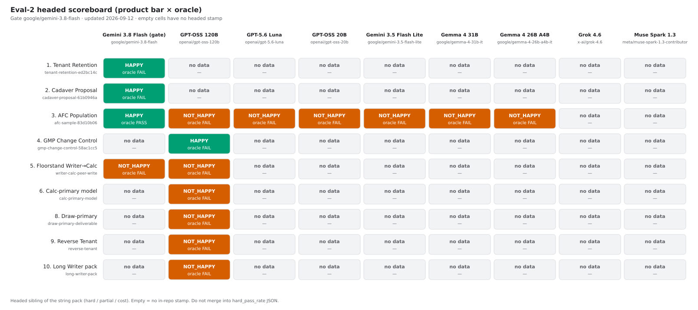
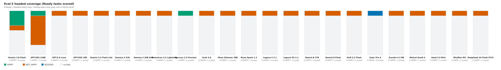
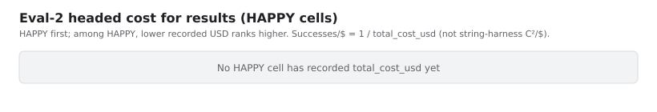

# Eval-2 headed scoreboard

Headed **task × model** matrix for Ready eval-2 experiments. This is
**not** the 17-task string harness.

String-pack ranking lives in [`docs/eval/benchmarks.md`](../benchmarks.md)
and `docs/eval/pareto-*.svg` (`hard_pass_rate`, C²/$, OpenRouter
`--backend string`). Do **not** merge these tables or fold headed stamps
into `scripts/prompt_optimization/benchmark_results.json`.

| | String pack | Eval-2 headed |
|---|-------------|---------------|
| Tasks | 17 short Writer/Calc/Draw worlds | 9 Ready / Headed-ready GDPval-shaped siblings (slot 7 PARKED) |
| Gate | Catalog sweep on OpenRouter | **`google/gemini-3.8-flash`** until HAPPY (gpt-oss is not the product gate) |
| Pass | `hard_pass_rate` (substring + result + process oracles) | **Product bar** HAPPY / NOT_HAPPY, plus CLI **oracle** PASS / FAIL |
| Cost | C²/$ = metric² ÷ avg $/task | **HAPPY first**; among HAPPY, lower recorded USD / higher successes/$ |
| Charts | `pareto-fronts.svg` / `pareto-distance.svg` | [`eval2-heatmap.svg`](eval2-heatmap.svg), [`eval2-coverage.svg`](eval2-coverage.svg), [`eval2-cost.svg`](eval2-cost.svg) |

**HAPPY** means the deliverable did the job (Keith: product over
oracle). A soft oracle FAIL on a HAPPY cell is a false-red or a
secondary cite — not a product miss. **NOT_HAPPY** + oracle FAIL is
usually an honest empty or wrong-facts deliverable. **—** means no
in-repo headed stamp for that pair; do not invent a score.

Catalog columns (GPT-OSS 20B, Grok 4.6, Muse Spark 1.3) are
placeholders. Tasks that work on Gemini 3.8 Flash should eventually be
run across the string catalog — that sweep has **not** happened.

Living autopsy: [`headed-failure-autopsy.md`](headed-failure-autopsy.md).
Harness index: [`README.md`](README.md).

## Snapshot (2026-09-12)

Seeded from the autopsy and sibling notes. Run dirs are typically
untracked on the shared machine — `run_artifacts_committed` is false
for every cell. No OpenRouter eval-2 CI job.

| # | Task | Gemini 3.8 Flash | GPT-OSS 120B | GPT-OSS 20B | Grok 4.6 | Muse Spark 1.3 |
| --- | --- | --- | --- | --- | --- | --- |
| 1 | Tenant Retention | HAPPY / oracle FAIL | — | — | — | — |
| 2 | Cadaver Proposal | HAPPY / oracle FAIL | — | — | — | — |
| 3 | AFC Population | HAPPY / oracle PASS | — | — | — | — |
| 4 | GMP Change Control | — | HAPPY / oracle FAIL | — | — | — |
| 5 | Floorstand Writer→Calc | NOT_HAPPY / oracle FAIL | NOT_HAPPY / oracle FAIL | — | — | — |
| 6 | Calc-primary model | — | NOT_HAPPY / oracle FAIL | — | — | — |
| 8 | Draw-primary | — | NOT_HAPPY / oracle FAIL | — | — | — |
| 9 | Reverse Tenant | — | NOT_HAPPY / oracle FAIL | — | — | — |
| 10 | Long Writer pack | — | NOT_HAPPY / oracle FAIL | — | — | — |







## Cost for results

Product bar still wins: **HAPPY first**. A cheaper NOT_HAPPY run does
not outrank an expensive HAPPY one. Among HAPPY cells that recorded
`total_cost_usd` > 0, rank by **lower cost** (cheaper success).

`intelligence_per_dollar` is **successes per USD**, computed when
HAPPY and cost > 0:

`1 / total_cost_usd`

Omit the field (and the cost-chart bar) when cost is unknown or zero.
Do **not** invent run costs from tokens, list prices, or wall time.
This is **not** the string-harness C²/$
(`correctness² / avg $/task` in [`docs/eval/benchmarks.md`](../benchmarks.md)).
Eval-2 has no continuous correctness — HAPPY is binary.

Optional result fields (`total_tokens`, `input_tokens`,
`output_tokens`, `total_cost_usd`, `wall_time_s`,
`intelligence_per_dollar`) are empty on the 2026-09-12 seed. The
heatmap stays HAPPY / NOT. Fill cost only from a real headed stamp
(AFC catalog sweep and later tasks).

### Cell notes (only scored pairs)

| Task | Model | Stamp | Soft note |
|------|-------|-------|-----------|
| Tenant Retention | Gemini 3.8 Flash | `20260908-0121-gemini-3.8-flash-r200` | Oracle false-red (titles in `text:h`, table cells, length); later softened. |
| Cadaver Proposal | Gemini 3.8 Flash | `20260908-2246-gemini-3.8-flash-r200` | Oracle false-red (aliases, Figure/`draw:frame`, length). |
| AFC Population | Gemini 3.8 Flash | `20260908-0030-retry2` | Oracle PASS after smoother (S=65 R=2). Autopsy abbreviates the stamp with `…`. |
| Floorstand | Gemini 3.8 Flash | `20260909-1748-gemini-3.8-flash-private-patch` | Polarity HIT; still empty + stall. Private patches, not PR’d. |
| GMP Change Control | GPT-OSS 120B | `20260909-0225-gpt-oss-120b` | Cite-only oracle fail. Prior `0103` was NOT HAPPY (dump polarity). |
| Floorstand | GPT-OSS 120B | `20260909-0323-gpt-oss-120b` | Extract/JSON polarity MISS; empty + LO crash. Private `1733` still MISS. |
| Calc-primary | GPT-OSS 120B | `20260909-0400-gpt-oss-120b` | CSV-row dump + wrong ARPU factor + phantom `headcount` sheet. |
| Draw-primary | GPT-OSS 120B | `20260909-0411-gpt-oss-120b` | Garbled layout; missing Clearbend / failure / triage. |
| Reverse Tenant | GPT-OSS 120B | `20260909-0414-gpt-oss-120b` | Talk-not-write; 0 cells + PreContractError. |
| Long Writer pack | GPT-OSS 120B | `20260909-0419-gpt-oss-120b` | Invented $12.5M / wrong dates; 0 comments. |

Gemini has **no** in-repo headed stamp yet for GMP, Calc-primary,
Draw-primary, Reverse Tenant, or Long Writer. gpt-oss-120b has **no**
in-repo stamp for Tenant, Cadaver, or AFC. Overnight slots 6/8/9/10
were gpt-oss only.

## How to refresh

1. After a headed `--launch` / `--score`, add or replace **one** object
   in [`eval2_benchmark_results.json`](eval2_benchmark_results.json)
   (`task_id` × `model`). Leave unknown pairs **out** of `results`.
2. Fields: `product_bar` (`HAPPY` \| `NOT_HAPPY`), `oracle`
   (`PASS` \| `FAIL`), optional `oracle_note` / `stamp` / `source` /
   `patches`. Optional cost axis (omit when unknown): `total_tokens` /
   `input_tokens` / `output_tokens` (ints), `total_cost_usd`,
   `wall_time_s`, `intelligence_per_dollar` (computed as
   `1 / total_cost_usd` when HAPPY and cost > 0). Schema:
   [`eval2_benchmark_results.schema.json`](eval2_benchmark_results.schema.json).
3. `task_id` must match `scripts/eval_2_headed.py --task` (`afc`,
   `tenant-retention`, …). Slot 7 stays omitted.
4. Redraw charts (no API key):

   ```bash
   .venv/bin/python scripts/plot_eval2_leaderboard.py
   .venv/bin/python scripts/plot_eval2_leaderboard.py --print-matrix
   ```

5. Paste the printed matrix into the snapshot table above if the
   cells changed. `--print-matrix` also prints the HAPPY cost table
   (empty until a stamp records USD). Update `updated` in the JSON.
   Do **not** copy rows into the string-pack leaderboard. Do **not**
   invent `total_cost_usd`.

`--check` validates the JSON only. The plot script refuses
`benchmark_results.json` so a wrong `--in` cannot overwrite Pareto
charts.
