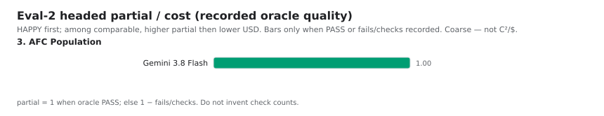

# Eval-2 headed benchmarks

**Different benchmark** from the 17-task string pack
([`docs/eval/benchmarks.md`](../benchmarks.md) / Pareto): same hard /
partial / cost philosophy, but headed multi-doc GDPval-style tasks that
are much harder. One filled task still counts.

Eval-2 is the **headed sibling** of that pack. Runs track product
success and **Intelligence-per-Dollar**. **Value (C²/$)** = oracle
`partial_score` squared ÷ recorded USD on a HAPPY cell (higher is
better), when both were measured.

String-pack snapshot: [`docs/eval/benchmarks.md`](../benchmarks.md)
(`hard_pass_rate`, C²/$, `pareto-*.svg`). How to run the headed helper:
[`README.md`](README.md). Living autopsy:
[`headed-failure-autopsy.md`](headed-failure-autopsy.md).

Keep the stores separate. Do **not** fold headed stamps into
`scripts/prompt_optimization/benchmark_results.json` or overwrite
`docs/eval/pareto-*.svg`.

| Axis | String pack | Eval-2 (sibling) |
|---|---|---|
| Tasks | 17 short Writer/Calc/Draw worlds | 9 Ready / Headed-ready siblings (slot 7 PARKED) |
| Hard | `hard_pass_rate` (substring + result + process oracles) | **Product HAPPY** (oracle PASS when that is the hard gate — AFC after the smoother) |
| Partial | correctness / quality | **Oracle partial** (`1 − failures/checks`; AFC S/R, husks) |
| Cost | C²/$ = metric² ÷ avg $/task | C²/$ = `partial_score`² ÷ USD among HAPPY |
| Gate | Catalog sweep on OpenRouter | **`google/gemini-3.8-flash`** until HAPPY (gpt-oss is not the product gate) |
| Charts | `pareto-fronts.svg` / `pareto-distance.svg` | [`eval2-heatmap.svg`](eval2-heatmap.svg), [`eval2-coverage.svg`](eval2-coverage.svg), [`eval2-cost.svg`](eval2-cost.svg), [`eval2-partial.svg`](eval2-partial.svg) |

Ranked by **hard → partial → cost**. **Hard** = product HAPPY (the
deliverable did the job). **Partial** = oracle quality among recorded
checks. **C²/$** is secondary, among HAPPY cells that recorded both
partial and USD.

**HAPPY** can sit on a soft oracle FAIL (false-red or a secondary
cite). **NOT_HAPPY** + oracle FAIL is usually an empty or wrong-facts
deliverable. **—** means no in-repo headed stamp; do not invent a
score. GPT-5.6 Luna has an AFC stamp only. Remaining catalog columns
(GPT-OSS 20B, Grok 4.6, Muse Spark 1.3) are placeholders. The
catalog-wide headed sweep has **not** happened.

## Snapshot ranking (2026-09-12)

Seeded from the autopsy, sibling notes, and Scrolly AFC catalog
stamps (`20260912-0142-gpt-oss-120b`, `20260912-0150-gpt-5.6-luna`,
box-local). Run dirs are typically untracked —
`run_artifacts_committed` is false for every cell. No OpenRouter
eval-2 CI job. No HAPPY cell has recorded USD yet.

Artifacts: [`eval2_benchmark_results.json`](eval2_benchmark_results.json)
(+ [schema](eval2_benchmark_results.schema.json)).

| # | Task | Gemini 3.8 Flash | GPT-OSS 120B | GPT-5.6 Luna | GPT-OSS 20B | Grok 4.6 | Muse Spark 1.3 |
| --- | --- | --- | --- | --- | --- | --- | --- |
| 1 | Tenant Retention | HAPPY / oracle FAIL | — | — | — | — | — |
| 2 | Cadaver Proposal | HAPPY / oracle FAIL | — | — | — | — | — |
| 3 | AFC Population | HAPPY / oracle PASS | NOT_HAPPY / oracle FAIL | NOT_HAPPY / oracle FAIL | — | — | — |
| 4 | GMP Change Control | — | HAPPY / oracle FAIL | — | — | — | — |
| 5 | Floorstand Writer→Calc | NOT_HAPPY / oracle FAIL | NOT_HAPPY / oracle FAIL | — | — | — | — |
| 6 | Calc-primary model | — | NOT_HAPPY / oracle FAIL | — | — | — | — |
| 8 | Draw-primary | — | NOT_HAPPY / oracle FAIL | — | — | — | — |
| 9 | Reverse Tenant | — | NOT_HAPPY / oracle FAIL | — | — | — | — |
| 10 | Long Writer pack | — | NOT_HAPPY / oracle FAIL | — | — | — | — |




## Key insights

1. **Hard (HAPPY):** Gemini 3.8 Flash is HAPPY on Tenant, Cadaver, and
   AFC. gpt-oss-120b is HAPPY only on GMP-0225. Catalog AFC cells
   (`20260912-0142` 120b, `20260912-0150` Luna) are both NOT HAPPY
   (missing R). Luna’s Sample is a better shape (81 rows vs 120b’s
   1516-row dump) but the same R hole. Floorstand is NOT HAPPY on both
   Gemini and 120b. Overnight slots 6/8/9/10 (gpt-oss only) are all
   NOT HAPPY.
2. **Partial:** AFC Gemini is oracle PASS (`partial_score` = 1). AFC
   120b and Luna each recorded `failure_count=1` (R missing) plus S/husks
   (585 / 0 of 15159; 68 / 0 of 810) but no `oracle_check_count`, so no
   FAIL ratio. Tenant / Cadaver / GMP HAPPY cells are still oracle FAIL
   without a recorded check count. Do not invent one from autopsy prose.
3. **C²/$:** no HAPPY cell has recorded `total_cost_usd`. The cost
   chart stays empty (AFC 120b / Luna USD are on NOT_HAPPY cells). Then
   Value is `partial_score`² ÷ that USD among HAPPY.
4. **Coverage:** 20B, Grok 4.6, and Muse Spark are entirely no data.
   Luna has AFC only. Gemini has no stamp yet for GMP, Calc-primary,
   Draw-primary, Reverse Tenant, or Long Writer. gpt-oss has no stamp
   for Tenant or Cadaver.

### Cell notes (only scored pairs)

| Task | Model | Stamp | Soft note |
|------|-------|-------|-----------|
| Tenant Retention | Gemini 3.8 Flash | `20260908-0121-gemini-3.8-flash-r200` | Oracle false-red (titles in `text:h`, table cells, length); later softened. |
| Cadaver Proposal | Gemini 3.8 Flash | `20260908-2246-gemini-3.8-flash-r200` | Oracle false-red (aliases, Figure/`draw:frame`, length). |
| AFC Population | Gemini 3.8 Flash | `20260908-0030-retry2` | Oracle PASS after smoother (S=65 R=2). Autopsy abbreviates the stamp with `…`. |
| AFC Population | GPT-OSS 120B | `20260912-0142-gpt-oss-120b` | First catalog cell. Sample+SSC nonempty but wrong shape (1516 rows); R missing; S=585; husks 0/15159; Ready then kept iterating. Box-local `docs/eval/eval-2/afc-sample-83d10b06/runs/20260912-0142-gpt-oss-120b/`. |
| AFC Population | GPT-5.6 Luna | `20260912-0150-gpt-5.6-luna` | Second catalog cell. Sample+SSC present but incomplete (81 rows; S=68; husks 0/810); same R hole as 120b. OpenRouter usage ~$0.0419 (model_configs alt ~$0.1252 not stored). Box-local `docs/eval/eval-2/afc-sample-83d10b06/runs/20260912-0150-gpt-5.6-luna/`. |
| Floorstand | Gemini 3.8 Flash | `20260909-1748-gemini-3.8-flash-private-patch` | Polarity HIT; still empty + stall. Private patches, not PR’d. |
| GMP Change Control | GPT-OSS 120B | `20260909-0225-gpt-oss-120b` | Cite-only oracle fail. Prior `0103` was NOT HAPPY (dump polarity). |
| Floorstand | GPT-OSS 120B | `20260909-0323-gpt-oss-120b` | Extract/JSON polarity MISS; empty + LO crash. Private `1733` still MISS. |
| Calc-primary | GPT-OSS 120B | `20260909-0400-gpt-oss-120b` | CSV-row dump + wrong ARPU factor + phantom `headcount` sheet. |
| Draw-primary | GPT-OSS 120B | `20260909-0411-gpt-oss-120b` | Garbled layout; missing Clearbend / failure / triage. |
| Reverse Tenant | GPT-OSS 120B | `20260909-0414-gpt-oss-120b` | Talk-not-write; 0 cells + PreContractError. |
| Long Writer pack | GPT-OSS 120B | `20260909-0419-gpt-oss-120b` | Invented $12.5M / wrong dates; 0 comments. |

## Scoring approach

Hard is the product bar: **HAPPY first**. A cheaper or higher-partial
NOT_HAPPY run does not outrank an expensive HAPPY one. When the headed
bar *is* the oracle (AFC after the smoother), **oracle PASS** is the
hard gate for that task.

Partial is oracle quality in [0, 1], computed only when honest:

- `1` when the oracle passed (`oracle` is PASS, or `oracle_passed` is
  true).
- Otherwise `1 − oracle_failure_count / oracle_check_count` when
  **both** counts were recorded from that stamp's `--score` JSON.
- Omit when FAIL and `oracle_check_count` is unknown. Do **not**
  invent a denominator from the failure strings or a guessed check
  count.

AFC (`eval_2_ods_oracle`) and the Writer/Calc/Draw oracles are
fail-closed (`passed` iff `failures` is empty) but still expose S/R,
husks, and the `failures` list. Those label a row; they are not a
fake 0–1 axis by themselves.

**C²/$** among successes: `partial_score`² ÷ `total_cost_usd` when
the cell is HAPPY and both values were recorded (same shape as the
string-pack Value). Omit when cost is unknown or zero, or when
partial is unknown. Do **not** invent run costs from tokens, list
prices, or wall time.

Optional result fields (`oracle_passed`, `oracle_failure_count`,
`oracle_check_count`, `oracle_failures`, `afc_s_flags`,
`afc_r_required`, `husk_cells`, `scored_cells`, `partial_score`,
`total_tokens`, `input_tokens`, `output_tokens`, `total_cost_usd`,
`wall_time_s`, `intelligence_per_dollar`) stay empty unless a stamp
recorded them. The 2026-09-12 seed still has derived PASS →
`partial_score` = 1 on AFC Gemini. Catalog AFC stamps
(`20260912-0142-gpt-oss-120b`, `20260912-0150-gpt-5.6-luna`) recorded
tokens, wall, USD, `failure_count=1`, S/husks — not
`oracle_check_count` or `partial_score`.

## How to refresh

1. After a headed `--launch` / `--score`, add or replace **one** object
   in [`eval2_benchmark_results.json`](eval2_benchmark_results.json)
   (`task_id` × `model`). Leave unknown pairs **out** of `results`.
2. Fields: `product_bar` (`HAPPY` \| `NOT_HAPPY`), `oracle`
   (`PASS` \| `FAIL`), optional `oracle_note` / `stamp` / `source` /
   `patches`. Optional hard/partial/cost extras (omit when unknown):
   `oracle_passed`, `oracle_failure_count`, `oracle_check_count`,
   `oracle_failures`, `afc_s_flags` / `afc_r_required`, `husk_cells` /
   `scored_cells`, `partial_score` (`1` on PASS; else
   `1 − failures/checks` when both counts were recorded),
   `total_tokens` / `input_tokens` / `output_tokens`,
   `total_cost_usd`, `wall_time_s`, `intelligence_per_dollar`
   (`partial_score`² ÷ USD when HAPPY and both recorded). Schema:
   [`eval2_benchmark_results.schema.json`](eval2_benchmark_results.schema.json).
3. `task_id` must match `scripts/eval_2_headed.py --task` (`afc`,
   `tenant-retention`, …). Slot 7 stays omitted.
4. Redraw charts (no API key):

   ```bash
   .venv/bin/python scripts/plot_eval2_leaderboard.py
   .venv/bin/python scripts/plot_eval2_leaderboard.py --print-matrix
   ```

5. Paste the printed matrix into the snapshot table above if the
   cells changed. `--print-matrix` also prints the HAPPY cost table
   and the hard → partial → cost ranking. Update `updated` in the
   JSON. Do **not** copy rows into the string-pack leaderboard. Do
   **not** invent `total_cost_usd`, `oracle_check_count`, or
   `partial_score`.

`--check` validates the JSON only. The plot script refuses
`benchmark_results.json` so a wrong `--in` cannot overwrite Pareto
charts.
