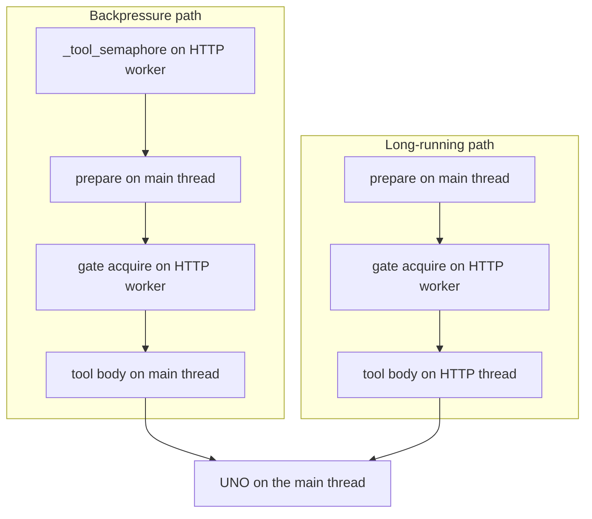
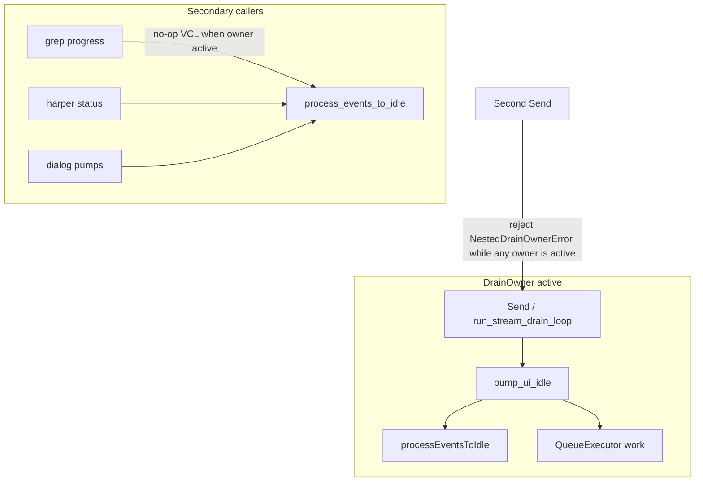
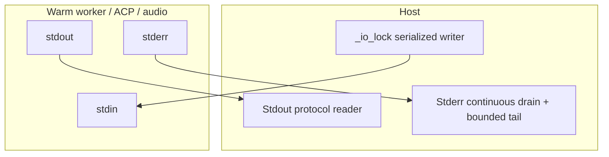

# WriterAgent Threading Architecture

This document outlines the threading and concurrency model used within the WriterAgent project (located in the `plugin/` directory). It details how backgrounds tasks, asynchronous network communication, streaming LLM execution, and external process management are handled without blocking the LibreOffice/UNO main UI thread.

## Overview

The LibreOffice UNO environment is **not thread-safe**. Calling UNO API methods from background threads can lead to unexpected UI behavior, corruption, or outright crashes, particularly with complex documents or frequent UI updates. 

Because WriterAgent connects to external LLM services and relies on streaming responses, it cannot block the main UI thread during these network calls or when waiting for AI generation. Therefore, WriterAgent relies heavily on standard Python threading for asynchronous I/O and process monitoring, coupled with specific mechanisms to marshal results back to the UNO main thread when document manipulation or UI updates are required.

## Threading Components

### 1. Main Thread Dispatch (`plugin/framework/queue_executor.py`)

This is the core concurrency bridge. Because background threads (like the HTTP server or AI streaming loop) cannot safely execute UNO commands, they use `execute_on_main_thread(fn, *args, **kwargs)` to offload UNO interactions back to the main thread.

*   **Mechanism:** It pushes a `_WorkItem` containing the callable and arguments onto a `queue.Queue`. It then signals LibreOffice to wake up and process the queue using `com.sun.star.awt.AsyncCallback`. `post()` before that callback exists keeps a short pending list. A full list waits for a flush and then raises `TimeoutError`; it does not drop the callable. If a flush fails partway through, the not-yet-enqueued posts go back on that list. The grammar in-flight gate wakes one waiter per release (`notify`), because one slot opened.
*   **Synchronization:** The calling background thread blocks on a `threading.Event()` (`_WorkItem.event.wait()`) until the main thread picks up the item, executes it, and sets the result or exception. This provides a synchronous feel to the caller while executing safely on the UI thread.
*   **Safety:** A `threading.Lock` (`_init_lock`) protects the lazy initialization of the AsyncCallback UNO service.

### 2. HTTP Server and MCP Protocol (`plugin/mcp/`)

The plugin runs an embedded HTTP server to provide a local API and support the Model Context Protocol (MCP).

*   **`server.py`:** The `HttpServer` wrapper (inner `_ThreadedHTTPServer`, subclassing the shared `DualStackThreadPoolHTTPServer` from `plugin.framework.http_server`) runs in a dedicated daemon thread (`name="http-server"`) via `run_in_background(..., dedicated=True)`. This allows the server to perpetually listen for incoming requests on IPv4 and IPv6 loopback without occupying the bounded background pool.
*   **Route table:** `HttpRouteRegistry` (`plugin/mcp/routes.py`) guards its dict with a lock. Workers read routes while MCP toggle adds or removes them. `list_routes` copies the keys under that lock, so `GET /` cannot raise `RuntimeError: dictionary changed size during iteration`. Register and unregister hold the lock across the whole batch, so a request sees the previous set or the new set.
*   **`mcp_protocol.py`:** Incoming HTTP requests land on the server's thread. Document resolution and UNO context lookup run on the main thread via `QueueExecutor`; tool bodies that touch the document either run entirely on the main thread (backpressure path) or on the HTTP worker with UNO work marshalled through `execute_on_main_thread` (long-running path).

#### MCP tool execution paths

MCP `tools/call` routes to one of two handlers in [`mcp_protocol.py`](../../plugin/mcp/mcp_protocol.py), depending on the tool's `long_running` flag:

| Path | Method | Tool body | Global limit | Per-document gate |
|------|--------|-----------|--------------|-------------------|
| Backpressure | `_execute_with_backpressure` | Main (via queue) | `_tool_semaphore(1)` → `BusyError` if busy | Mutating tools only; **acquired on the HTTP worker** |
| Long-running | `_execute_long_running` | HTTP worker (UNO marshalled) | None (by design) | Mutating tools only; acquired on the HTTP worker |



**Why two layers?** The global semaphore keeps fast MCP tools from piling up on the main thread and surfaces `BusyError` (HTTP 429) under overload. Long-running tools (image generation, delegate sub-agents) skip the semaphore so a minutes-long job does not block every other MCP client. That left a hole: parallel long-running mutators could target the same document. The per-document gate closes that without blocking read-only work or work on other documents.

**Per-document gate:** [`_document_mutation_gate`](../../plugin/mcp/mcp_protocol.py) serializes mutating MCP runs that share a normalized document key (`X-Document-URL`, `doc.getURL()`, or `RuntimeUID`). Tools opt out via [`ToolBase.requires_document_lock()`](../../plugin/framework/tool.py) (defaults to `detects_mutation()`). Delegate gateways return `False` for read-only domains (`document_research`, `web_research`, `vision`). Both paths acquire the gate on the HTTP worker. The backpressure path used to acquire it inside the main-thread dispatch, so a long-running mutator holding the gate froze the UI for up to the 30s timeout and stalled that mutator's own UNO marshal.

**UNO thread safety:** All UNO access is marshalled to the LibreOffice main thread. The per-document gate is **logical** serialization — it prevents overlapping mutating MCP tool runs on the same file, not raw cross-thread UNO calls. `bypass_thread_guard` is an eval-harness switch on `ToolRegistry.execute`. MCP and the sidebar tool loop pass `False`. A JSON object spread into `execute` cannot set it: `True` counts only when the caller writes that keyword in the call.

**Tests:** [`tests/mcp/test_long_running_concurrency.py`](../../tests/mcp/test_long_running_concurrency.py) covers same/different document, read-only, delegate opt-out, normalized URLs, cross-path (long-running + backpressure), unknown-tool conservative locking, and backpressure waiting for the gate off the main thread. [`tests/mcp/test_mcp_protocol.py`](../../tests/mcp/test_mcp_protocol.py) covers a client `bypass_thread_guard` argument. [`tests/chatbot/test_tool_loop_actions.py`](../../tests/chatbot/test_tool_loop_actions.py) covers a chat tool-call dict. [`tests/framework/test_tool.py`](../../tests/framework/test_tool.py) covers an explicit keyword versus a spread dict.

**Not covered by MCP gates (different models):**
*   **Sidebar chat** ([`tool_loop.py`](../../plugin/chatbot/tool_loop.py)) — one tool per LLM round; async tools run on worker threads but the loop waits for `TOOL_RESULT` before spawning the next.
*   **Gate dict lifetime** — `_doc_gates` entries are not pruned on document close (fine for typical sessions).
*   **Save-as key migration** — after Save As, old and new URLs may map to different gate keys briefly.

**Related docs:** [MCP protocol — Concurrency](../mcp-protocol.md#concurrency-and-parallel-toolscall) (integrator-facing); [ROADMAP](../ROADMAP.md) §14 (specialized tool MCP exposure).

### 3. Agent Backends and ACP stdio (`plugin/acp/`)

External agent binaries (Hermes, Claude, Grok, OpenCode, …) speak the Agent Communication Protocol over stdio JSON-RPC. Stdio I/O lives in one place; the `*_simple.py` / `builtin.py` / `registry.py` modules are backends, not extra reader threads.

*   **`acp_connection.py` (`ACPConnection`):** Spawns the subprocess, then:
    *   **Threads:** `run_in_background(..., name="acp-reader", dedicated=True)` parses JSON-RPC from stdout until `readline` returns EOF; `start_stderr_drain(..., name=f"acp-stderr-{pid}")` drains stderr so the kernel pipe cannot fill. `stop()` leaves that drain in place: the reader `finally` logs a bounded tail after a normal Stop. Clearing the attribute in `stop()` used to drop it before that log. The loop must not also require `Popen.poll() is None`: `poll()` is `waitpid(WNOHANG)` and reports the child exited while the last JSON-RPC line can still be buffered, and skipping that line fails the turn with "ACP process terminated". Each iteration snapshots `_proc` before reading stdout. `stop()` sets `_proc` to None between the loop check and `readline`; a second attribute read in that window raised `AttributeError` and logged a spurious Reader error. A stdout line that parses as JSON but is not an object (a number, boolean, string, or array) is logged and skipped; it must not raise and end the reader while the child is still writing later object lines. A JSON object whose `id` is not a JSON-RPC id (string, number, or null) — an array, object, or JSON boolean — is the same stray stdout: `pending.get` would raise `TypeError` on an unhashable key, or a boolean `true` would hash equal to request id `1` and steal the in-flight response. Those lines are logged and skipped too. After stdout is drained, unanswered waiters are still failed so a dead child cannot sit on the 600s prompt timeout.
    *   **Synchronization:** `threading.Lock` (`_lock`) guards `_pending` (request id → event + response dict). Each `send_request` waits on its own `threading.Event` until the reader stores the matching response. `send_request` captures `_proc` under that lock before writing stdin; `send_notification` and `send_response` snapshot `_proc` once before the write. Re-reading `self._proc` in `if self._proc and self._proc.stdin` raised `AttributeError` when `stop()` cleared it between the two loads, and `send_request` does not catch `AttributeError`.
*   **`acp_backend.py`:** ACP client that uses `ACPConnection` for handshake, prompt sessions, and streaming notifications. `send()` installs the notification callback after the subprocess is up and before `session/new`, so `session/update` and `session/request_permission` during session creation are dispatched instead of dropped. After `start()`, `_ensure_connection` polls the startup grace period (~0.5s, in ~50ms slices) and returns without `initialize` when `_stop_requested` is set or `stop_checker()` is true, so Stop during that window takes the same stopped path as a cancel before the prompt. Each `send()` calls `shutdown()` → `ACPConnection.stop()` when the turn ends (success, error, or cancel), so the CLI and its reader do not survive into the next chat message. `stop()` notifies `session/cancel`, answers pending `session/request_permission` with `outcome: cancelled`, then terminates the subprocess. Permission replies are `outcome.selected` plus an `optionId` from the request, or `outcome.cancelled`. `session/update` is dispatched on `sessionUpdate`: `agent_message_chunk` is assistant text, `agent_thought_chunk` is thinking (not the saved answer), and `tool_call` / `tool_call_update` are tool transcript lines. An agent request whose method is not handled is answered with JSON-RPC -32601, including after Stop, so the agent is not left waiting; notifications have no id and get no reply. `initialize` advertises `fs.readTextFile` and `fs.writeTextFile` and sends `clientInfo.version` from the extension version. `session/new` with a missing or blank `sessionId` fails the turn before `session/prompt`. A child that exits during the startup wait includes the captured stderr tail in the error.

### 4. Chatbot Streaming and Tool Execution (`plugin/chatbot/`)

The core chatbot interaction relies heavily on threads to handle streaming LLM responses and asynchronous tool executions.

*   **`send_handlers.py`:** When a user sends a message, handlers (like `run_agent`, `run_search`, `run_direct_image`) run off the UI thread via `run_in_background` so external APIs do not block LibreOffice.
*   **`tool_loop.py`:** Manages the ReAct (Reasoning and Acting) loop.
    *   **Threads:** `run_in_background(..., dedicated=True)` for `llm-worker-*`, `llm-worker-final`, and async tools (`tool-async-*`). Those streams can last minutes and must not pin a pool slot.
    *   This architecture allows the UI to stay responsive while the system generates text chunk-by-chunk or waits for API responses.

### 5. Utilities, UI Updates, and Monitoring

Modules that actually share threads or process-wide caches have a **Concurrency:** paragraph in the module docstring: what is shared, who owns it, and what we deliberately do not lock. This section is the map. Pure helpers and UNO-on-main modules have no such paragraph on purpose.

*   **`plugin/framework/async_stream.py`:** `run_async_worker_with_drain` / `run_stream_drain_loop` run streaming work on a background worker (`run_in_background`) and drain the queue on the main thread. The worker consumes the stream; the drain applies UI updates. With `AsyncCallback`, each slice handles items already queued and returns to the VCL loop (immediate `addCallback`, or ~100 ms when idle). It must not block in `Queue.get` inside that callback. The blocking `get(0.1)` + `pump_ui_idle` loop remains when no callback can be armed. Idle diagnostics on that blocking path read `QueueExecutor.pending_work_count()` rather than the marshal queue object. Work that used to follow the drain call uses `defer_until_drain_done`. A second `run_stream_drain_loop` while any drain owner is active raises `NestedDrainOwnerError` (same-name nesting would skip `processEventsToIdle`). Peer execute under an existing scope still uses `drain_owner_scope` directly. `run_stream_drain_loop` does not take a UNO context. When the worker queue is a `BatchingStreamQueue`, Stop flushes it the same way the chat tool loop does, so already-produced text is not left until the worker `finally`. Stop also applies CHUNK and THINKING already pulled into the current drain batch, including when Stop is the first item of that batch; other kinds in that tail are not dispatched, except an APPROVAL_REQUIRED event in that tail is set so the worker is not left in wait_for_approval. An ERROR item whose on_error raises is not called again. The drain `get` timeout stays 0.1s. `run_blocking_in_thread` re-raises `queue.Empty` from the worker; only the waiting `get` catches an empty queue, so `pump_idle=False` cannot swallow that exception and block on the next `get`. Done callbacks are invoked once: arity comes from the signature, so a `TypeError` inside the body is not a second call. A flush that raises is logged; the error terminal is still queued and the queue `put` wrapper is removed.
*   **`plugin/main.py`:** Uses `run_in_background` to pre-load icons into the `ImageManager` (`_update_menu_icons`) and dispatch menu updates (`notify_menu_update`) without freezing the startup or dispatch sequence.
*   **`plugin/mcp/tunnel.py`:** Optional cloudflared quick tunnel for public MCP access. Uses `AsyncProcess` to parse the `*.trycloudflare.com` URL from subprocess stdout/stderr, with a `threading.Lock()` around process lifecycle. `binary_available` (provider `--version`, up to 10s) runs **outside** that lock. Settings `config:changed` starts the tunnel on a dedicated background thread so the probe does not freeze the UI. `HttpServer.stop` closes SSE keepalive sockets tracked on that listener (`server.py`); `shutdown()` alone does not join those request threads.
*   **`plugin/framework/logging.py`:** Spawns a background thread (`_watchdog_loop`) to periodically flush status logs or monitor system health without interrupting document flow. Uses `_init_lock` and `_activity_lock` to protect logging state.
*   **`plugin/chatbot/dialogs.py`:** Spawns a probe update thread (`run_in_background(_probe_update)`) to dynamically update dialog UI elements in the background.
*   **`plugin/framework/worker_pool.py`:** `run_in_background` is the only allowed birthplace for background work (Opengrep `raw-uno-thread-ban`). Short jobs share a daemon pool with a fixed worker count (unbounded submit queue); long-lived or joined work passes `dedicated=True` (details in consolidations §3 below). The caller’s `contextvars` are copied into the worker so a send’s Stop scope is visible to marshal items enqueued from that job. `join()` of a pooled future from a `wa-bg-*` thread raises immediately instead of deadlocking the two-worker pool. Self-join checks use `BackgroundHandle.is_current_thread()`; a pooled handle has no thread, so that check is false and the deadlock guard still runs.
*   **`plugin/framework/worker_pool.py` (`AsyncProcess`):** Standardizes how external processes are started and how their `stdout`, `stderr`, and exit callbacks are handled safely without blocking. Stream and wait threads are dedicated. Each `start()` gives its wait thread that child and those readers, so a second `start()` cannot make the first wait report the new child's exit. After `process.wait()`, the wait thread joins those readers for at most 1s so a trailing line that had no newline is delivered before the exit callback when the readers finish in time. A grandchild that inherited the pipe never signals EOF; the join stays bounded and `on_exit_cb` still runs. The terminate reaper still joins with a 1s timeout. Pipes are binary (`text=True` is ignored; the reader decodes UTF-8). Line callbacks split on `\n`, `\r\n`, and a lone `\r` only.
*   **`plugin/framework/config.py`:** One `ConfigStore` writes `writeragent.json`. `update_config(key, fn)` holds `_config_write_lock` (`RLock`) across the read, `fn`, and a patch of only the keys that changed. `set_config` / `set_configs` / `remove_config` and GET-path repairs (JSON repair, out-of-range coerce, `calc_prompt_max_tokens` upgrade) go through that store. A `set_configs` value for `api_keys_by_endpoint` is merged into the map just read under that lock (only the slots in the patch change), so Settings OK does not replace the map with a copy taken outside the lock. `config:changed` is emitted after the lock is released so handlers may `get_config` / `set_config` without nesting under a write.
*   **`plugin/framework/event_bus.py`:** Synchronous pub/sub. `emit` copies the subscriber list, then invokes; a `subscribe` that happens during that emit is not in the current fan-out. The subscriber-list lock is an `RLock`. Weakref cleanup is queued and applied when the outermost critical section exits, so a cyclic subscriber collected while that lock is held (the copy allocates) cannot deadlock by taking the lock again. `unsubscribe` and weakref `_cleanup` **replace** the dict entry, so an in-flight emit keeps the previous list (a just-removed handler may still run once). There is **no** mutex across callbacks: a lock held while handlers run would deadlock UI vs workers and would serialize concurrent same-name emits that the thread-local re-entrancy guard is designed to **allow**. Snapshotting listeners is **not** UNO safety — handlers still run on the emitter’s thread and must marshal document/UI work as in [UNO thread safety](uno-thread-safety.md). Same-thread nested `config:changed` is dropped separately (thread-local dispatch set; see §12 of that doc). `get_event_bus` reuses the bus on `sys` when that object's class has the same `__module__` and `__qualname__` as `EventBus`, so a second import of this file (a new class object) does not replace `sys._writeragent_event_bus` and orphan the first bus's subscriptions. `subscribe(..., weak=True)` uses `WeakMethod` for Python methods. When `WeakMethod` raises `TypeError` (builtin bound methods, or methods of instances that cannot be weak-referenced), the callback is stored strongly. `weakref.ref` of those callables targets a temporary bound-method object, so an inline subscription disappears on the next garbage collection. Plain functions still use `weakref.ref`, then a strong reference if that fails.

---

## Recent Architecture Consolidations

The threading model has recently been refactored to eliminate duplicate concurrency patterns that had evolved independently. 

### 1. Unified Background Process Monitoring (`AsyncProcess`)
Multiple modules previously spawned `subprocess.Popen` manually and wrapped them in custom `threading.Thread` implementations to monitor stdout/stderr loops. This has been consolidated into an `AsyncProcess` class in `plugin/framework/worker_pool.py`. It encapsulates process spawning, thread-based stream monitoring (via asynchronous readers), and exit handling. It provides cleaner process lifecycle monitoring in `plugin/mcp/tunnel.py` and other `AsyncProcess` / `start_stderr_drain` call sites. Long-lived children that keep `stderr=PIPE` must drain stderr continuously or redirect it — see [Subprocess IPC Pipe Safety & Deadlock Prevention](#subprocess-ipc-pipe-safety--deadlock-prevention) below.

### 2. Main Thread Execution (`queue_executor.py`)
`mcp_protocol.py` once duplicated its own main-thread wait helper (historically `main_thread.py`). That path is gone: MCP now uses [`plugin/framework/queue_executor.py`](../../plugin/framework/queue_executor.py) (`QueueExecutor`, `execute_on_main_thread`, `post_to_main_thread`).

### 3. Asynchronous Worker Spawning (`run_in_background`)

Raw `threading.Thread(...).start()` calls lacked standardized exception handling and tagging. All production background work goes through [`plugin/framework/worker_pool.py`](../../plugin/framework/worker_pool.py) `run_in_background`.

#### API

```python
run_in_background(func, *args, name=None, error_callback=None, daemon=True, dedicated=False, **kwargs) -> BackgroundHandle
```

| `dedicated` | Meaning |
|---|---|
| `False` (default) | Queue on the process-wide pool (fixed worker count, unbounded submit queue). `daemon` is ignored (pool threads are always daemon). |
| `True` | Spawn one `threading.Thread`. Use for servers, pipe drains, infinite loops, and **any job another thread will `join()`**. `daemon` applies. |

`daemon=False` implies dedicated (a non-daemon thread is a process-lifetime join contract).

`BackgroundHandle` matches `Thread.join` / `Thread.is_alive`. Worker exceptions stay in the log / `error_callback`; `join` does not re-raise (unlike `Future.result()`).

Each job calls `thread_guard.set_background_task(name)` at start and clears it in `finally`, so Layer A reports the **job** (`run_search`), not a reused `wa-bg-3` thread.

#### Pool

CPython `ThreadPoolExecutor` workers are **non-daemon** from 3.9 on and would block soffice exit. The host uses an unbounded stdlib queue plus a fixed set of daemon threads named `wa-bg-0` … (`_DaemonWorkPool`). Load **queues**; it does not spawn extra native threads. The pool is bounded in **worker count**, not queue length.

- Size: [`BACKGROUND_POOL_MAX_WORKERS`](../../plugin/framework/constants.py) (2), overridable with `WRITERAGENT_BG_POOL_WORKERS`.
- Lazy singleton. No production `shutdown()` (lifetime = soffice). Tests use `reset_background_pool_for_tests()`, which swaps the pool out under `_pool_lock` and joins it after releasing the lock. Joining while the lock was held deadlocked a job that called `run_in_background` (`_get_pool` needs the same lock).
- `shutdown(wait=True)` joins each worker until it has exited. A single 5s `join` used to return while the in-flight job was still running, leaving a `wa-bg-retired-*` thread beside the next pool. Joins are sliced so they stay interruptible; a job that never returns blocks shutdown instead of being abandoned.

#### Dedicated vs pooled

**Dedicated** — long-lived or joined:

| Site | Name |
|---|---|
| `plugin/mcp/server.py` | `http-server` |
| `plugin/acp/acp_connection.py` | `acp-reader` |
| `plugin/scripting/editor_host.py` | `editor-pipe-reader`, `editor-stderr-drain` |
| `plugin/scripting/audio_recorder_service.py` | `audio-rec-stdout-monitor` |
| `start_stderr_drain` / `AsyncProcess` | `stderr-drain`, `asyncproc-*` |
| `plugin/framework/logging.py` | `watchdog` |
| `plugin/embeddings/embeddings_periodic.py` | `embeddings_periodic_indexer` |
| `plugin/framework/async_stream.py` | `stream-completion`, `stream-async`, `async-worker`, `blocking-thread` |
| `plugin/chatbot/tool_loop.py` | `llm-worker-*`, `llm-worker-final` |
| `plugin/chatbot/tool_loop_actions.py` | `tool-async-*`, `tool-sync-*` |
| `plugin/framework/tool.py` `_execute_with_timeout` | `tool-timeout-*` (caller `join(timeout)`) |
| `plugin/writer/locale/harper.py` | `harper-ensure-ready` (download + LSP start) |
| `plugin/embeddings/search_ui.py`, `plugin/scripting/python_runner_ui.py`, `plugin/scripting/editor_host.py` | `warm-venv-worker` |
| `plugin/embeddings/embeddings_indexer.py` | `corpus-index-*` |
| `plugin/chatbot/web_research_cache.py` | `web-research-cache-embeddings`, `web-research-cache-embedding-row` |
| `plugin/chatbot/extension_update_check.py` | `extension_update_check_*` |

**Pooled** (default) — short fire-and-forget: `_update_menu_icons`, `notify_menu_update`, search-dialog query/rebuild, settings probes/fetches, `status-dialog-probe`.

**Not on this pool:** Opengrep-excluded raw threads (`grammar_work_queue.py`, `venv_worker.py` IPC, `harper.py` stdout, CDP `browser_supervisor`). Local `ThreadPoolExecutor` in `web_research_deep.py` and jedi (`editor_main.py`) stay local.

Never `join()` a **pooled** job from another **pooled** job (pool-join deadlock). Anything joined with a timeout from a context that might itself be pooled must be dedicated.

`tool-timeout-*` joins with the tool's timeout and then abandons the worker only when the queue is still empty. A result already queued is returned even while that thread is still unwinding. `SystemExit`, `KeyboardInterrupt`, and `GeneratorExit` are queued before the dedicated thread unwinds and come back as `TOOL_WORKER_EXIT`, so the caller does not block on an empty queue. The timeout length is unchanged. A timeout returns `TOOL_TIMEOUT` and does not cancel the send: the drain has to deliver that dict as `TOOL_DONE`. Cancelling `send_cancellation` from inside the tool made the stop checker discard the error and left the turn waiting for `TOOL_DONE`.

#### Startup marshal

`_get_async_callback` must getattr the **unwrapped** UNO context. Creating `AsyncCallback` from a worker is the marshal bootstrap: if Layer A fires while `_init_lock` is held, the UI thread deadlocks in `set_context()`. Violation popups are skipped until the executor is initialized. `_update_menu_icons` uses `post_to_main_thread` so startup does not block a pool worker on a marshal the UI thread cannot run yet. Details: [uno-thread-safety.md](uno-thread-safety.md).

### 4. Streaming Execution Wrappers
Streaming wrappers such as `_start_tool_calling_async` in tool loop handlers, process reading threads, and asynchronous pipeline streams in `async_stream` have been updated to utilize `run_in_background` to improve event reliability and debug logging.

---

## Main-Thread Event Loop, Drain Ownership & Reentrancy Control

LibreOffice's VCL event loop is single-threaded. Pumping events via `processEventsToIdle()` within an active listener stack can cause re-entry into PyUNO listeners and deadlock. However, chat Send intentionally runs a synchronous drain loop from an action listener that **must** pump VCL so the UI repaints and Stop remains actionable.

To resolve this safely, WriterAgent implements a strict drain ownership model:



### Architectural Invariants

1. **One active stream drain per UI session:** [`drain_owner_scope`](../../plugin/framework/async_drain_guard.py) itself nests a same-name owner (`_drain_depth += 1`) and raises `NestedDrainOwnerError` only when the **owner name differs**. [`run_stream_drain_loop`](../../plugin/framework/async_stream.py) is stricter: it refuses to start when **any** owner is already set, including another `"stream"`. A nested stream drain is the thread already inside `processEventsToIdle`, so its `pump_ui_idle` would see depth > 1 and skip VCL (Stop stops working). Peer execute under an existing scope still uses `drain_owner_scope` directly.
2. **Approved pump entry points only:**
   - [`pump_ui_idle`](../../plugin/framework/queue_executor.py): Drains the `QueueExecutor` work queue **then** pumps VCL (only when called by the active owner or when no owner is active).
   - [`process_events_to_idle`](../../plugin/framework/uno_context.py): Pumps VCL only when permitted (no active owner or called by owner).
   - [`wait_while_pumping`](../../plugin/framework/uno_context.py): Secondary **wait** loops (Harper READY lint). On VCL, calls `process_events_to_idle(force=False)` each tick; off-main (Writer `doProofreading` is a `Dummy-*` worker) **posts** PE2I to the main thread — never pump on the waiter. Repeated ticks coalesce to one outstanding secondary-idle pump (`callable_is_scheduled` on that callable, including the pre-AsyncCallback pending list). Unrelated marshal items do not suppress the post: the queue is process-wide, and a leftover item used to skip PE2I for the whole linguistic wait. A dropped post is not sticky. Do not copy a local PE2I `while` into feature modules. Drain-owner waits stay on `pump_ui_idle` / `run_blocking_in_thread`.
   - Direct calls to `toolkit.processEventsToIdle()` outside these helpers are forbidden and enforced via Opengrep rule `raw-process-events-to-idle`.
3. **Secondary pump suppression:** When a drain owner is active, secondary callers (document research grep progress, Harper status pump, dialog probes, `wait_while_pumping`) become no-ops for VCL pumping to prevent double-pumping and listener re-entry.
4. **`post_to_main_thread` execution behavior:** [`QueueExecutor.post`](../../plugin/framework/queue_executor.py) can execute inline under `WRITERAGENT_TESTING=1` or when `AsyncCallback` is unavailable. Do not assume `post_to_main_thread` strictly defers without an explicit enqueue-only boundary.

---

## Subprocess IPC Pipe Safety & Deadlock Prevention

Long-lived child processes that write to `stderr=PIPE` can fill the OS kernel pipe buffer (~64 KiB default on Linux) while the parent blocks reading `stdout` or waiting for responses, causing a permanent deadlock.



### Architectural Invariants

1. **Continuous stderr drain:** Every long-lived child process spawned with `stderr=PIPE` must have a dedicated continuous drain thread via [`start_stderr_drain`](../../plugin/framework/worker_pool.py) or [`AsyncProcess`](../../plugin/framework/worker_pool.py), or redirect stderr to `DEVNULL` (e.g. [`harper.py`](../../plugin/writer/locale/harper.py)) or a file. The drain uses `read1` (one raw read). `BufferedReader.read(n)` waits for *n* bytes or EOF, so a short burst stayed invisible until the child exited.
2. **Bounded diagnostic tail:** Stderr drains retain a bounded tail so diagnostic output is available on failures without risking unbounded memory growth. After the child pipe is at EOF, callers read it with `StderrTail.finish_text()` (join, then the tail). Live readers use `text()` and must not join a drain whose pipe is still open.
3. **Pipe buffer capacity:** [`optimize_popen_pipes`](../../plugin/scripting/sandbox.py) expands Linux pipe size via `F_SETPIPE_SZ` where available. This reduces pressure but does not eliminate the need for continuous drains.
4. **Bounded stdin writes:** A child that stops reading stdin must not hold the host lock forever.
   - Venv ([`PythonWorkerManager`](../../plugin/scripting/venv_worker.py)): outbound pickle frames are written in a timed thread with an explicit timeout. On write timeout, a failed turn, and the generic retry handler, the worker starts a background reap of the process group (`killpg` on POSIX, `taskkill /T` on Windows) and returns without joining that reap or the writer thread. The next spawn joins the reap first, so the replacement child does not overlap the old tree. A dead child is detached the same way, then that reap is joined once immediately before `Popen`. `get()` on a settings change also returns without waiting. Heartbeats may extend a trusted-action read, but not past `HEARTBEAT_ABSOLUTE_CAP_SEC` from the start of that read.
   - Compute ([`write_pickle_frame_with_timeout`](../../plugin/scripting/ipc.py), used by [`BaseProcessWorker.execute`](../../compute_service/worker_base.py)): the host write shares the request deadline (`select` on POSIX, a joined thread on Windows). A write timeout kills that child. A partial frame is not a late vision response, so this path does not drain. A vision read timeout starts one late-frame read with `run_in_background(..., dedicated=True)`; `release_worker` waits on that drain's state, not on joining the thread. If that thread cannot start, the drain is marked finished and that snapshotted child is killed, so release cannot wait on a thread that does not exist. A release that had already stored its callback (`RELEASE_WAIT`) still runs that callback, so the slot is not left leased. The drain reaps only the snapshotted child. The call returns and the pool releases the slot. Idle-worker and formula-session reapers are the same `run_in_background(..., dedicated=True)` kind of loop; a bare `threading.Thread` is not tagged for the UNO thread guard. A passed request deadline does not spawn a child for a 0.01s handshake.
5. **Subprocess retry & replay semantics:**
   - One-time retry is permitted **only** for the initial request frame on crash/EOF (`BrokenPipeError`, empty stdout, `OSError`).
   - Host **read** timeouts (hung user code or C extensions) terminate without replay so Calc/Writer does not double-wait. A Windows mid-frame stall (`IpcPartialFrameTimeout`, bytes already buffered) is that same no-replay timeout: the child may already have started the script.
   - PPT-Master intermediate turns are non-replayable; write timeouts terminate the worker without replaying the turn because host-side UNO mutations may already have occurred.
6. **One serialized writer per child:** All stdin writes to a subprocess share a serialization lock (`_io_lock`). The UI thread does not block on that lock: if it is held, the caller gets `WORKER_REENTRY`. Other threads wait a bounded time and leave if the holder enters a tool RPC, so a host callback that needs the waiting thread cannot sit in `acquire()` forever.

---

## Deferred Reliability Items

The following reliability features are tracked for future implementation as concrete needs arise:

1. **Transactional UNDO context:** Group multi-step agent document mutations with LibreOffice's `XUndoManager`, building on existing `WriterCompoundUndo` patterns before adding a global transactional guard.
2. **Venv worker supervisor:** Enhanced crash/OOM recovery and stale lock/WAL cleanup in response to worker lifecycle failures.
3. **LLM schema coercion:** Centralized validation and coercion of tool arguments across tool boundaries.

---

## Cross-references

- [streaming-and-threading.md](streaming-and-threading.md) — Main chat streaming drain loop, UI events, and Stop/cancellation handling.
- [uno-thread-safety.md](uno-thread-safety.md) — Multi-layer off-main-thread UNO access enforcement (Layers A, B, C).
- [../mcp-protocol.md](../mcp-protocol.md) — MCP HTTP server, concurrency, and per-document mutation gating.
