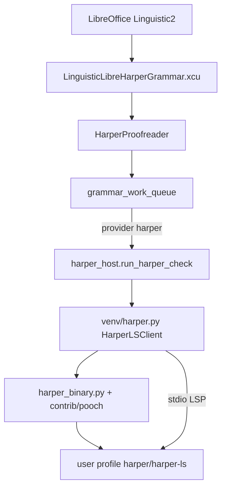
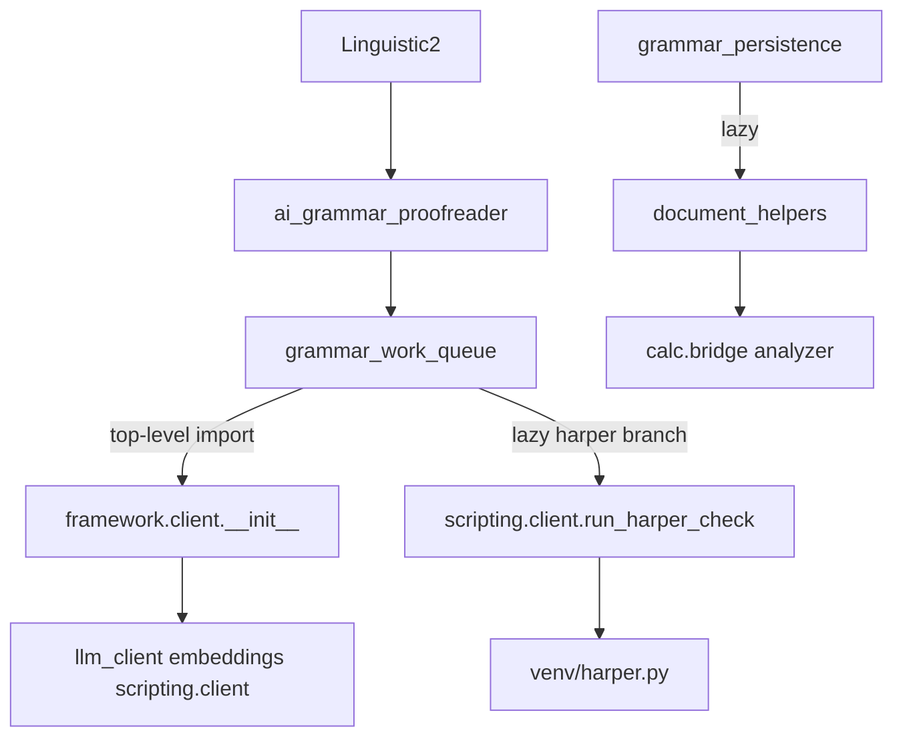

# Development Plan: Offline Harper Grammar Linter Integration

This document outlines the detailed development plan to integrate **Harper**, a privacy-first, offline, and high-performance grammar checker written in Rust, into WriterAgent as a local proofreading option.

---

## 1. Why Harper? (Strategic Value)

1. **Rust Performance (Lightning Fast):** Harper is written in Rust, executing checks in sub-milliseconds with a near-zero memory footprint.
2. **Zero Dependencies (No JVM):** Unlike LanguageTool, which requires a Java Runtime Environment (JRE) to run its local server, Harper compiles to a single native binary.
3. **No AI Overhead:** It utilizes legible, rule-based logic, saving API tokens and running entirely offline.
4. **Rich Language Rules:** Harper provides built-in linters for common grammatical mistakes, spacing issues, spell-checking, and typographical errors.

---

## 2. Configuration & Integration Design

### UI Schema (`plugin/doc/module.yaml`)
We will add `harper` as an option in the grammar checker select dropdown:
```yaml
      - value: "harper"
        label: "Harper (Local Rust)"
```

### Config Coercion (`plugin/framework/config.py`)
Update `get_grammar_provider()` and `is_grammar_enabled()` to support the new `harper` string value:
```python
def is_grammar_enabled():
    val_str = str(get_config("doc.grammar_proofreader_enabled")).strip().lower()
    return val_str in ("llm", "languagetool", "vale", "harper", "true")
```

---

## 3. Dependency Management (Binary Fetching)

Binary resolution, download, and install live in [`plugin/scripting/venv/harper_binary.py`](../plugin/scripting/venv/harper_binary.py). To avoid compiling Rust from source, WriterAgent fetches the official precompiled `harper-ls` binary based on the host architecture:
1. **GitHub Releases API:** Resolve the latest release via `https://api.github.com/repos/Automattic/harper/releases/latest` (checked at most once per week per profile, persisted in `harper/harper-ls.release.json`), then download the matching asset URL and verify GitHub's published `digest` (SHA256).
2. **Platform Resolution:**
   * **Linux x86_64:** `harper-ls-x86_64-unknown-linux-gnu.tar.gz`
   * **macOS Arm64:** `harper-ls-aarch64-apple-darwin.tar.gz`
   * **Windows x86_64:** `harper-ls-x86_64-pc-windows-msvc.zip`
3. **Auto-install / auto-update:** First run downloads into `user_config_dir/harper/` and writes `harper-ls.version`. Release archives download into a temporary directory (then deleted after extract); extracted contents remain under `harper/`. Later runs compare the sidecar to the latest GitHub tag and re-download when Harper ships a new release (falls back to the installed binary if an update download fails). Legacy installs under `bin/` are migrated automatically (temporary; remove migration code after ~2026-09).

---

## 4. Host-Side Harper Helper (`plugin/scripting/venv/harper.py`)

Rather than spawning a new process and writing temporary files on every grammar check, WriterAgent runs `harper-ls --stdio` as a persistent background process **on the host** (LibreOffice’s Python grammar drain thread). No Settings → Python venv is required: the native binary is downloaded into the user profile, and the LSP client talks to it over stdin/stdout. Communication uses the JSON-RPC Language Server Protocol (LSP). The LSP client and `run_harper_check` live in [`harper.py`](../plugin/scripting/venv/harper.py); binary fetch/install is in [`harper_binary.py`](../plugin/scripting/venv/harper_binary.py); the host entry is [`harper_host.py`](../plugin/scripting/harper_host.py) (re-exported from [`client.py`](../plugin/scripting/client.py) — in-process, not the warm venv worker IPC used by LanguageTool/Vale). Status UI refresh during Harper progress is **best-effort** (`post_to_main_thread`); a busy main thread must not abort the check.

### Persistent LSP Client implementation (`HarperLSClient`)
The class `HarperLSClient` manages:
- **Process Lifecycle:** Starts `harper-ls --stdio` and keeps it alive. Auto-restarts on failure (checked before each lint). Uses a background reader thread.
- **Handshakes & Config:** Sends `initialize`/`initialized`. Replies to `workspace/configuration` with real Harper settings (BCP47-derived dialect + optional user dictionary path). Dynamically sends `workspace/didChangeConfiguration` when the sentence locale changes.
- **Text Sync:** Reuses a stable document URI: `didOpen` on first use, then `didChange` (full text) for subsequent sentences. Uses monotonic document versions to reject stale diagnostics.
- **Action Queries:** For each diagnostic, queries `textDocument/codeAction` (quickfix) to obtain spelling/grammar replacement suggestions.
- **Thread Safety:** A per-client lock serializes `lint()` operations.
- **Position Mapping:** Delegates to the vendored UTF-16 `PositionCodec` (see below). Uses deadline-based monotonic timeouts for operations (default 15s per lint, 5s for init).
- **Framing:** Uses the vendored `json_rpc_framing` helpers for correct Content-Length header handling and body reads.

### Position mapping (`lsp_range_to_offset`)

Harper returns diagnostic ranges as LSP `{line, character}` pairs; the grammar queue expects `n_error_start` / `n_error_length` as offsets into the checked sentence string. [`run_harper_check`](../plugin/scripting/venv/harper.py) maps each diagnostic through `lsp_range_to_offset`.

Grammar work is **sentence-scoped**, not line-scoped: each `run_harper_check` call lints one sentence string from [`GrammarWorkItem.text`](../plugin/writer/locale/grammar_work_queue.py). That does **not** mean every sentence is a single visual line — Writer soft line breaks (Shift+Enter) can embed `\n` inside one sentence, and Harper may report `line > 0` for text after the break.

Implementation (current):

The function first prepares a list of lines (fast path: wrap the whole text as a single line if no newlines are present; otherwise `splitlines(keepends=True)`). It then delegates character offset calculation within the target line to the vendored `PositionCodec` (UTF-16 code unit aware), and finally sums preceding line lengths + the codec-adjusted character position (clamped).

This correctly handles:
- Soft line breaks inside a single sentence.
- Emoji and other non-BMP characters (LSP uses UTF-16 code units).
- CRLF and other line endings.

Sentence-at-a-time scheduling removes cross-sentence / cross-paragraph offset work; it does **not** remove the need to map LSP lines **within** the sentence buffer.

---

## 5. Queue Dispatcher Integration (`grammar_work_queue.py`)

Harper runs on **one sentence per `run_harper_check` call**. Upstream, [`ai_grammar_proofreader.py`](../plugin/writer/locale/ai_grammar_proofreader.py) splits each paragraph Writer hands in via [`split_into_sentences()`](../plugin/writer/locale/grammar_proofread_text.py) and enqueues each uncached sentence as its own `GrammarWorkItem` (see [realtime grammar checker plan](realtime-grammar-checker-plan.md) — sentence-sized scheduling). Unlike the LLM provider, Harper does not batch multiple sentences into one request.

Integrate Harper directly into the linter work queue:
```python
        if provider == "harper":
            from plugin.scripting.client import run_harper_check
            from plugin.framework.config import user_config_dir

            cfg_dir = user_config_dir() or ""

            for item, text in chunk:
                try:
                    request_start = time.monotonic()
                    res = run_harper_check(ec.ctx, text, cfg_dir, bcp47=bcp47)
                    elapsed_ms = int((time.monotonic() - request_start) * 1000)

                    errors = res.get("errors", [])
                    results = [errors]

                    _process_grammar_results([(item, text)], results, bcp47, original_bcp47, elapsed_ms, ec)
                    grammar_obs("worker_harper_done", chunk_len=1, results_len=len(errors), elapsed_ms=elapsed_ms, bcp47=bcp47)
                except Exception as ex:
                    log.error("[grammar] Harper check failed: %s", ex)
            return
```

---

## 6. Implementation Status (Completed)

The Harper Rust linter integration is fully implemented and optimized:
1. **Persistent Daemon Pattern:** Upgraded from one-shot `harper-cli` process spawning to a persistent `harper-ls` background daemon on the host grammar drain thread (no Python venv required). This eliminates process startup and disk I/O overhead for each sentence.
2. **Standard LSP Protocol:** Implemented handshake, configuration negotiation, diagnostics handling, and code actions queries natively over stdin/stdout streams.
3. **Integration Testing:** Verified via [`scripts/test_harper.py`](../scripts/test_harper.py). Unit tests cover offset mapping (including UTF-16 surrogate pairs), mocked LSP flows (stale versions, didChange, soft breaks, code actions), timeout behavior, download/upgrade logic, and the vendored framing + pooch helpers (in `tests/contrib/`). See the Test coverage subsection under Known Limitations for details.

Primary implementation: [`plugin/scripting/venv/harper.py`](../plugin/scripting/venv/harper.py) (`HarperLSClient`, `run_harper_check`); binary fetch/install: [`plugin/scripting/venv/harper_binary.py`](../plugin/scripting/venv/harper_binary.py). Host entry: [`plugin/scripting/harper_host.py`](../plugin/scripting/harper_host.py) (best-effort status UI pump; re-exported from `client.py`). Queue wiring: [`plugin/writer/locale/grammar_work_queue.py`](../plugin/writer/locale/grammar_work_queue.py).

Supporting vendored helpers live in [`plugin/contrib/lsp/`](../plugin/contrib/lsp/) (framing + UTF-16 position codec) and [`plugin/contrib/pooch/`](../plugin/contrib/pooch/) (secure hashed downloads + safe archive extraction). Both include provenance READMEs and dedicated tests.

**Standalone OXT:** `make build-harper` / `make deploy-harper` produce `build/LibreHarper.oxt` — see [§9 LibreHarper standalone OXT](#9-libreharper-standalone-oxt-libreharperoxt).

---

## 7. Known Limitations

These are accepted trade-offs for the current Harper-only integration. None block normal grammar proofreading use.

### LSP client scope

`HarperLSClient` is a **purpose-built client for `harper-ls`**, not a reusable general LSP library. It implements only the methods Harper needs: `initialize`, `textDocument/didOpen`, `textDocument/publishDiagnostics`, `textDocument/codeAction`, `textDocument/didClose`, and `workspace/configuration`. Other server-initiated requests receive a generic `result: null` reply.

#### Diagnostic and request waiting

Operations use monotonic deadline budgets (`_LINT_BUDGET_SEC = 15.0` for lints, `_INIT_BUDGET_SEC = 5.0` for initialization/handshake) rather than fixed iteration counts. A background reader thread feeds a `queue.Queue`. On timeout or crash the client fails fast (raising `TimeoutError`), closes the process, and the caller typically triggers a restart on the next `lint()` call.

### Quickfix round trips

Code actions are fetched with **one `textDocument/codeAction` request per diagnostic**. A single sentence with many issues therefore incurs N sequential LSP round trips after diagnostics arrive. In practice this is usually a small N because each Harper call lints one sentence, not a whole paragraph.

LibreOffice builds the native proofreading popup from `aShortComment` and literal `aSuggestions` strings. The comment row explains the issue but is not itself a replacement action. A one-space or deletion suggestion is necessarily rendered as a blank-looking replacement row, so WriterAgent adds an explicit instruction to the comment while retaining `" "` or `""` as the actual replacement. Those WriterAgent-composed hint strings go through gettext (`_()`) so they follow LibreOffice's UI locale; Harper's own diagnostic messages and rule codes remain English. The Writing aids display name keeps the `WriterAgent` brand fixed and only translates the role label (`AI Grammar`). Harper's provider-native LSP offsets and complete suggestion list are preserved; this is required because Harper groups diagnostics by rule rather than returning them in text order.

### Language and configuration

- `languageId` is still hardcoded to `"markdown"` (Harper is currently English-focused; full multi-language `languageId` support is deferred).
- Harper now receives useful configuration: the `workspace/configuration` reply (and `workspace/didChangeConfiguration` notifications) supply a `dialect` (American/British/Australian/Canadian/Indian derived from BCP47) plus an optional `userDictPath` under the user profile for custom words. The shared WriterAgent grammar registry and LibreHarper both preserve these regional tags, so Harper receives the same dialect through either OXT. Broader rule toggles are not yet exposed.
- Harper 2.6 intentionally treats a one-sentence paragraph of five words or fewer as label-like text and skips `SentenceCapitalization`. LibreHarper does not override that upstream heuristic.

### Position encoding

Range mapping uses vendored [`PositionCodec`](../../plugin/contrib/lsp/position_codec.py) (from pygls) so LSP UTF-16 code units convert to Python string indices in `lsp_range_to_offset`. Emoji and other non-BMP characters are covered by unit tests.

Most checked sentences are BMP-only on a single line. Embedded newlines (soft breaks) and surrogate-pair characters are handled by the `lsp_range_to_offset` + vendored `PositionCodec` logic described in [§4 Position mapping](#position-mapping-lsp_range_to_offset).

### Test coverage

Tests cover:

- **`lsp_range_to_offset`:** single-line BMP text, multiline text, soft-break sentences, CRLF terminators, UTF-16 surrogate pairs (emoji), out-of-range line clamping
- **Mocked LSP lint:** stale diagnostic version filtering, single-line capitalization fix, line-1 diagnostic on a soft-break sentence end-to-end through `run_harper_check`
- **Timeout:** hung diagnostic collection raises `TimeoutError`

Core restart logic (re-init on `!is_alive()` and error recovery paths) and dynamic configuration exist and are exercised indirectly. Dedicated unit coverage for full process death + restart scenarios and complex interleaved `workspace/configuration` during `codeAction` remains limited. Malformed LSP framing, unsafe archive members, hash verification, and oversized frames are covered in [`tests/contrib/test_lsp_contrib.py`](../tests/contrib/test_lsp_contrib.py) and [`tests/contrib/test_pooch_contrib.py`](../tests/contrib/test_pooch_contrib.py).

### Queue granularity

Harper is **sentence-scoped end to end**:

1. **Proofreader** — Writer passes paragraph-like `aText`; WriterAgent splits it into sentences and enqueues one work item per uncached sentence (plus partial-sentence drafts while typing).
2. **Worker** — The Harper branch loops `for item, text in chunk` and calls `run_harper_check` once per sentence. It does not use LLM-style multi-sentence batching (`doc.grammar_proofreader_batch_sentences` applies only to the AI provider).
3. **Observability** — `worker_harper_done` logs `chunk_len=1` because each Harper invocation handles a single queue item (one sentence string).

### Sidebar observability

Harper phases (binary resolve/download, LSP init, lint) stream to the **chat sidebar grammar status field** via progress callbacks on the host grammar drain thread, relayed through [`emit_harper_worker_status`](../plugin/writer/locale/grammar_obs.py). Enable the WriterAgent sidebar and watch the status line while typing uncached text with Harper selected as the grammar provider. Install/download failures are logged at ERROR/WARNING to `writeragent_debug.log` (host Harper modules + grammar catch), so they appear under default WARN release builds. No Python venv is required.

This matches LanguageTool and Vale and keeps memory bounded. LSP overhead scales with the number of **sentences** checked (e.g. a long paragraph yields several Harper calls, one per sentence), not with paragraph count alone.

### Ignore All (rule-based)

Harper diagnostics carry stable LSP `code` values (`SpellCheck`, `SentenceCapitalization`, …). WriterAgent maps them to `harper||{code}` rule identifiers and preserves that id through [`normalize_errors_for_text`](../plugin/writer/locale/grammar_proofread_text.py) into the sentence cache and UNO proofreading errors. When the user chooses **Ignore All** in Writer, [`ignoreRule`](../plugin/writer/locale/ai_grammar_proofreader.py) stores the bare rule code in the document-embedded grammar cache `ignored_rules` (errors still use the prefixed `harper||RuleCode` id); [`is_rule_ignored`](../plugin/writer/locale/grammar_ignore_rules.py) filters all matching instances on subsequent proofreading passes, including after save/reload. LanguageTool uses the same pattern with `languagetool||RuleId` — see [LanguageTool integration plan](languagetool-integration-dev-plan.md).

---

## 8. Future Work

### 8.1 Reuse a stable document with `didChange` (Completed)

We implemented the proposed `didChange` pattern. We reuse a stable URI per client instance, send `didOpen` once, and use `didChange` with full text replacement on subsequent lints. Monotonic document versioning ensures we reject stale, in-flight diagnostics, and `didClose` is sent cleanly upon shutdown.

### 8.2 Other improvements (lower priority)

Additional items identified in a post-implementation review of `plugin/scripting/venv/harper.py` (and related queue/client paths):

| Item | Rationale | Status |
|------|-----------|--------|
| **Timed diagnostic wait** | Replace the fixed 50-message loop with a monotonic budget (e.g. 5s per lint) so hung servers fail fast. | Completed |
| **stderr drain** | Background thread reading stderr, or `stderr=subprocess.DEVNULL` if Harper guarantees silence. | Completed (stderr redirected to DEVNULL) |
| **Harper config via LSP** | Map WriterAgent grammar/locale settings into `workspace/configuration` responses so Harper rule sets match user expectations. | Completed (BCP47 → dialect; `userDictPath` under profile) |
| **Dynamic `languageId`** | Derive from document BCP47 or content type instead of hardcoded `markdown`. | Deferred (Harper is English-only; dialect mapping covers locale) |
| **Protocol helpers** | Extract Content-Length framing and JSON-RPC envelope builders (similar to Hermes `agent/lsp/protocol.py`) if Harper client grows or a second LSP consumer appears. | Completed ([`plugin/contrib/lsp/json_rpc_framing.py`](../plugin/contrib/lsp/json_rpc_framing.py)) |
| **Binary fetch/cache** | Replace hand-rolled download/extract with vendored Pooch subset (SHA256, retry, safe Untar/Unzip). | Completed ([`plugin/contrib/pooch/`](../plugin/contrib/pooch/)) |
| **UTF-16 position codec** | Map LSP UTF-16 columns to Python indices for emoji / non-BMP text. | Completed ([`plugin/contrib/lsp/position_codec.py`](../plugin/contrib/lsp/position_codec.py)) |
| **Edge-case tests** | Process death + restart, interleaved `workspace/configuration` during `codeAction`, empty diagnostic list. | Partial (core recovery paths present and indirectly tested; dedicated "kill + reinit" and complex interleaving tests are limited) |
| **Batch code actions** | Investigate whether `harper-ls` supports range-wide or document-wide code actions to cut round trips when one sentence has many diagnostics. | Deferred |
| **Python < 3.10 annotation compatibility** | Add `from __future__ import annotations` (top of `harper.py`). Current use of `dict \| None` (and bare `list` annotations) will raise `SyntaxError` on import under older Python interpreters commonly bundled with LibreOffice. | Completed |
| **Thread safety for shared LSP client** | `_HARPER_CLIENT_CACHE` + `HarperLSClient` share one LSP subprocess per binary path. Parallel `lint()` calls would interleave stdin/stdout framing. | Not needed in production: grammar caps Harper to one drain thread (`grammar_max_in_flight` is LLM-only). Do not call `lint()` concurrently from multiple threads in the same process. |
| **LSP framing / reader robustness** | `_read_loop` does bare `except: pass`, performs no validation that `len(body) == Content-Length`, uses simplistic `split(":", 1)` header parsing, and can fail on partial reads or malformed frames. Add length checks, defensive parsing, and `log.exception(...)` for unexpected failures. | Completed |
| **Secure + reliable binary download** | `urllib.request.urlretrieve` on the GitHub `/latest/download/` asset has no timeout, User-Agent, size limit, or integrity check (SHA256 / signature). A tampered release would be extracted + executed. Add timeouts, limits, User-Agent, and consider pinning a release + verifying a hash before `chmod +x`. Improve temp-file handling. | Completed (GitHub releases API + asset `digest` SHA256) |
| **Worker shutdown / client lifecycle cleanup** | Cached `HarperLSClient` instances are never explicitly closed when the venv worker is terminated (`PythonWorkerManager._terminate_worker` does hard killpg). Add best-effort cleanup (didClose + graceful shutdown) via atexit, harness hook, or explicit close in the client cache. | Deferred |
| **Binary upgrade path + version diagnostics** | Once downloaded, the `harper-ls` in `user_config_dir/harper` is never refreshed. Provide (or document) a way to force re-download, and expose the resolved path + `harper-ls --version` (when available) for about/diagnostics UI and health checks. | Completed (sidecar `harper-ls.version`; weekly GitHub latest check + auto-download when version changes) |
| **Zero-length / empty diagnostic range handling** | Result construction does `length = max(1, end - start)` and guarded slices. Harper reporting zero-width spans can produce misleading `"wrong"` text or underlines. Tighten offset + error dict construction and add tests. | Completed |

### 8.3 Not planned: general-purpose LSP port

WriterAgent does **not** need Hermes's full multi-language LSP stack (`pyright`, `gopls`, workspace delta baselines, etc.) for Harper grammar. A future **separate** feature — semantic lint of user Python scripts or macros — would warrant porting selected pieces from [Hermes `agent/lsp`](file:///home/keithcu/.hermes/hermes-agent/agent/lsp/) under a new module, not extending `HarperLSClient`.

---

## 9. LibreHarper standalone OXT (`libreharper.oxt`)

Ship a **small Linguistic2-only** extension for people who want offline Harper grammar and nothing else (no chat, no `=PY()`, no LLM / LanguageTool / Vale). Packaging follows the same filtered-bundle pattern as LibrePy ([libreoffice-core-python-extension-split.md](libreoffice-core-python-extension-split.md)).

**Build:** `make build-harper` → `build/LibreHarper.oxt`; `make deploy-harper` registers `org.extension.libreharper` without removing WriterAgent.

### 9.1 Why

| Concern | LibreHarper | WriterAgent |
|---------|-------------|-------------|
| Audience | Harper-only installs | Full AI workspace |
| Surface | One `XProofreader` | Chat, tools, MCP, multi-provider grammar, Calc, … |
| Runtime deps | Profile `harper-ls` binary (auto-download) | Same Harper path *plus* LLM/venv stacks when those providers are selected |
| Install size | ~45–55 Python paths after import-boundary fixes | Full OXT |

### 9.2 Product identity

| Item | Value |
|------|--------|
| Extension id | `org.extension.libreharper` |
| Display name | LibreHarper |
| Proofreader implementation | `org.extension.libreharper.comp.pyuno.HarperProofreader` |
| WriterAgent impl (do not reuse) | `org.extension.writeragent.comp.pyuno.AiGrammarProofreader` |
| Service | `com.sun.star.linguistic2.Proofreader` |
| Writing aids label | `LibreHarper` |
| Default config | `doc.grammar_proofreader_enabled` = **`harper`** (install → works) |
| Config file (v1) | Reuse `writeragent.json` via existing [`config.py`](../plugin/framework/config.py); slim `_manifest` exposes only `off` / `harper` |
| Settings UI (v1) | **None** — no Jobs.xcu, menus, or dialogs; LO Writing aids lists the GrammarChecker |
| Locales in XCU | `en-US`, `en-GB`, `en-AU`, `en-CA`, `en-IN` (Harper dialects) |
| `harper-ls` | Still auto-downloaded into the user profile `harper/` directory — **not** bundled in the OXT |

### 9.3 Architecture



Hot path matches WriterAgent today: `doProofreading` → sentence cache → drain thread → `run_harper_check` → persistent `harper-ls --stdio`. LibreHarper omits every other provider branch at the *bundle* level (no LLM / LT / Vale modules).

### 9.4 Why today’s tree is not small yet

Runtime Harper only needs proofreader → queue → Harper host → `harper-ls`, but **import edges** currently drag large stacks into any naïve copy:



Critical edges:

1. [`grammar_work_queue.py`](../plugin/writer/locale/grammar_work_queue.py) top-level `from plugin.framework.client import model_fetcher, llm_client` loads entire [`client/__init__.py`](../plugin/framework/client/__init__.py) (LLM + embeddings + `scripting.client`).
2. Same file top-level import of [`grammar_worker_llm`](../plugin/writer/locale/grammar_worker_llm.py) — LLM-only.
3. Harper branch imports [`run_harper_check`](../plugin/scripting/client.py) from `plugin.scripting.client`, whose module top pulls trusted RPC / vision.
4. [`grammar_persistence.py`](../plugin/writer/locale/grammar_persistence.py) lazy-imports `get`/`set_document_property` from [`document_helpers.py`](../plugin/doc/document_helpers.py), which imports Calc at module load.
5. Full [`plugin/writer/__init__.py`](../plugin/writer/__init__.py) must not ship as-is (Writer tools + linguistic index).

Without the refactors below, a “Harper-only” OXT is not small.

### 9.5 Import-boundary prerequisites (shared with WriterAgent)

These landed in the main tree so the filtered bundle stays small:

1. **Extracted** `run_harper_check` (+ UI pump) to [`plugin/scripting/harper_host.py`](../plugin/scripting/harper_host.py); thin re-export remains in `client.py`.
2. **Lazy-import** LLM client / `grammar_worker_llm` only when `provider == "llm"`; local providers never construct `LlmClient`.
3. **Extracted** udprop get/set to [`plugin/doc/udprops.py`](../plugin/doc/udprops.py); `grammar_persistence` uses it.
4. **Bundle** ships empty/slim `plugin/writer/__init__.py` and `plugin/doc/__init__.py` (assemble-time rewrite).
5. **LibreHarper proofreader** [`harper_proofreader.py`](../plugin/writer/locale/harper_proofreader.py) with impl name `…HarperProofreader` + English-only locales.

### 9.6 Layered file inventory (after refactors)

Whole-file rule (same as the LibrePy split doc): if a module is imported, the entire file ships. Target ~**45–55** paths.

#### Extension packaging (`extension-harper/`)

| Path | Role |
|------|------|
| `description.xml` | Id `org.extension.libreharper`, display name LibreHarper |
| `META-INF/manifest.xml` | Proofreader Python component + Linguistic XCU only |
| `registry/.../LinguisticLibreHarperGrammar.xcu` | GrammarCheckers node for `…HarperProofreader`; en-* locales |
| Optional `extension/assets/` logo | Icon |

**Do not ship:** CalcAddIns, Sidebar, ProtocolHandler, Addons, Jobs, RDBs, dialogs.

#### Framework (~15)

`plugin/framework/`: `uno_bootstrap`, `config`, `constants`, `errors`, `json_utils`, `i18n`, `event_bus`, `service`, `logging`, `worker_pool`, `thread_guard`, `uno_context`, `uno_listeners`, `queue_executor`, `url_utils`, plus package `__init__`s. Root: `plugin/__init__.py` (prefer `pkgutil.extend_path` if dual-install with WriterAgent), `plugin/version.py`.

#### Grammar stack (~11)

Empty `plugin/writer/__init__.py`. Under `plugin/writer/locale/`: proofreader entry (`ai_grammar_proofreader` rewritten or `harper_proofreader`), `grammar_work_queue`, `grammar_proofread_cache`, `grammar_proofread_locale`, `grammar_proofread_text`, `grammar_proofread_json`, `grammar_persistence`, `grammar_ignore_rules`, `grammar_obs`, `grammar_worker_phases`, package `__init__`.

**Omit:** `grammar_worker_llm.py`, `linguistic_index.py`, `stop_words.py`.

#### Harper (~5)

`plugin/scripting/__init__.py`, [`sandbox.py`](../plugin/scripting/sandbox.py) (Flatpak command wrap), [`venv/harper.py`](../plugin/scripting/venv/harper.py), [`venv/harper_binary.py`](../plugin/scripting/venv/harper_binary.py), **new** `harper_host.py`.

**Do not ship** whole [`client.py`](../plugin/scripting/client.py), LanguageTool/Vale modules, or the venv worker tree.

#### Doc helpers (~2)

`plugin/doc/__init__.py`, **new** `udprops.py` (udprop get/set only).

#### Contrib

Full [`plugin/contrib/lsp/`](../plugin/contrib/lsp/) (framing + UTF-16 position codec) and [`plugin/contrib/pooch/`](../plugin/contrib/pooch/) (download / safe extract), including provenance READMEs.

#### Generated

Slim `_manifest.py` from a Harper-only `module.yaml` (or filtered `doc` module: options `off` + `harper` only; default `harper`).

#### Explicit exclusions

Chat / MCP / sidebar / tools / smolagents; embeddings / folder FTS / langdetect; LanguageTool / Vale / LLM grammar path; vision / audio / PPT-Master; `=PY()` / `=PROMPT()` / Calc add-ins; full Writer tools (`tree`, `styles`, charts, …); full `plugin/scripting/client.py` + trusted RPC + venv worker.

### 9.7 Build targets (mirror LibrePy)

Inverse of LibrePy’s filter: LibrePy **excludes** `venv/harper.py` / `harper_binary.py` ([`librepy_bundle_paths.py`](../scripts/librepy_bundle_paths.py)); LibreHarper **ships only** those among scripting modules.

| Artifact | LibreHarper |
|----------|-------------|
| Path list | `scripts/libreharper_bundle_paths.py` |
| Builder | `scripts/build_libreharper_oxt.py` → `build/bundle-libreharper/` → `build/LibreHarper.oxt` |
| Skeleton | `extension-harper/` |
| Makefile | `manifest-harper`, `build-harper`, `deploy-harper` |
| Deploy | `unopkg` for `org.extension.libreharper` only — **do not** remove WriterAgent (unlike LibrePy’s register path) |

Template: [`scripts/build_librepy_oxt.py`](../scripts/build_librepy_oxt.py) + `make build-core`.

### 9.8 Config and Writing aids

- Slim manifest defaults `doc.grammar_proofreader_enabled` to **`harper`**.
- v1 reuses `writeragent.json`. If WriterAgent and LibreHarper are both installed, both read the same key — enabling LLM in WriterAgent vs Harper in LibreHarper can fight; document that for dual installs the user should leave only one GrammarChecker active in Writing aids, or (later) split to `libreharper.json`.
- LibreOffice may still require the user to enable the GrammarChecker under Tools → Options → Language Settings → Writing Aids (same as other Linguistic2 providers). Soft bootstrap like WriterAgent’s `ensure_writeragent_proofreader_configured` is optional and **must not** call `setConfiguredServices` (that path crashed Writing aids historically).

### 9.9 Coexistence with WriterAgent

| Concern | Assessment |
|---------|------------|
| Extension id | Distinct `org.extension.libreharper` — both OXTs can be installed |
| GrammarCheckers | Distinct implementation names → two entries in Writing aids; user picks one |
| Shared `harper/` profile cache | Fine / beneficial |
| `plugin` package | Both ship `plugin.*`. Without `pkgutil.extend_path` in both OXTs’ `plugin/__init__.py`, one extension’s modules can shadow the other. Prefer `extend_path` if dual-install is supported; otherwise treat dual-install as unsupported |
| Config key | Shared `doc.grammar_proofreader_enabled` in v1 — see §9.8 |
| Grammar cache udprop | Can keep `WriterAgentGrammarCache` for compatibility or rename to `LibreHarperGrammarCache` in a later pass |

### 9.10 Implementation order

1. ~~Import-boundary refactors in the main tree (§9.5)~~ — done.
2. ~~`extension-harper/` skeleton + `libreharper_bundle_paths.py` + `build_libreharper_oxt.py`~~ — done.
3. ~~Makefile `build-harper` / `deploy-harper`~~ — done.
4. Optional later: Settings toggle, separate `libreharper.json`, chat-sidebar status (LibreHarper has no sidebar — host progress can log only).

### 9.11 Out of scope for v1

- LLM, LanguageTool, Vale, language detection
- Chat sidebar grammar status line
- Bundling `harper-ls` inside the OXT
- Jobs / menus / settings dialogs
- Stripping WriterAgent to depend on LibreHarper (WriterAgent continues to ship its own Harper path)
