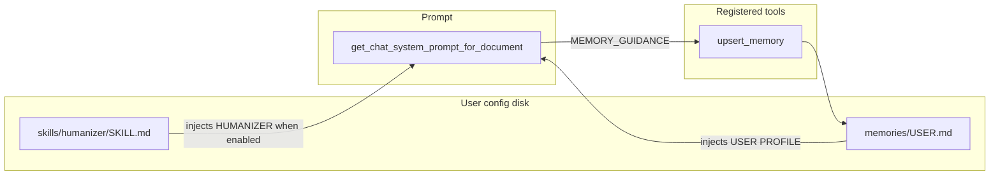
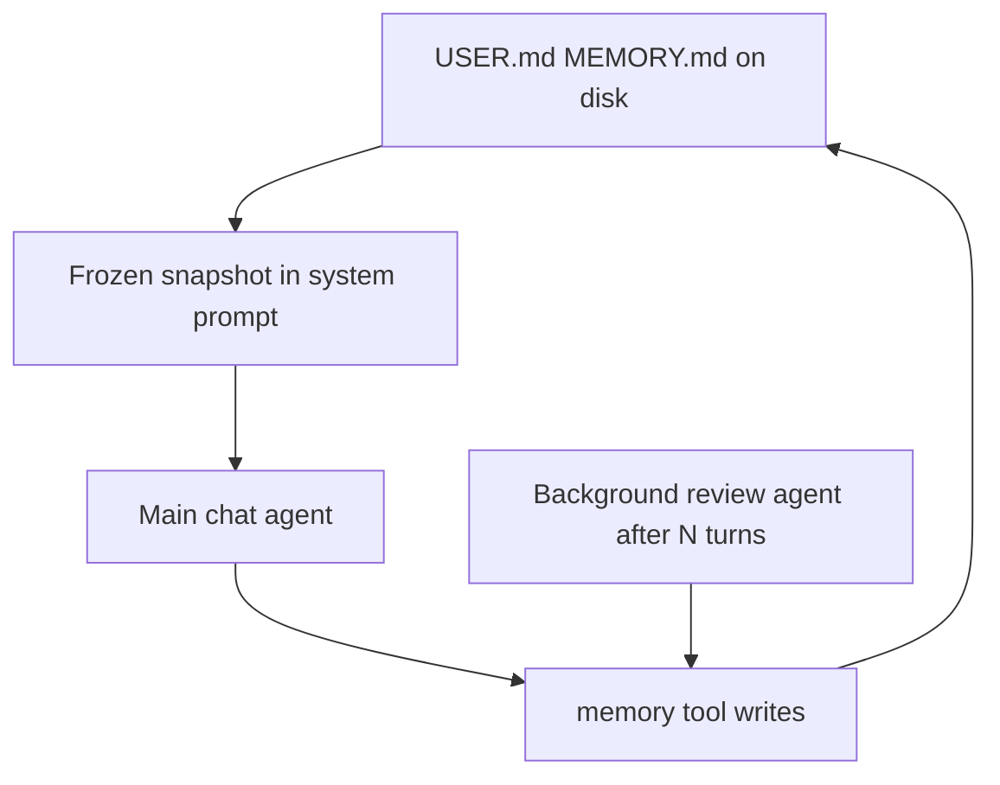
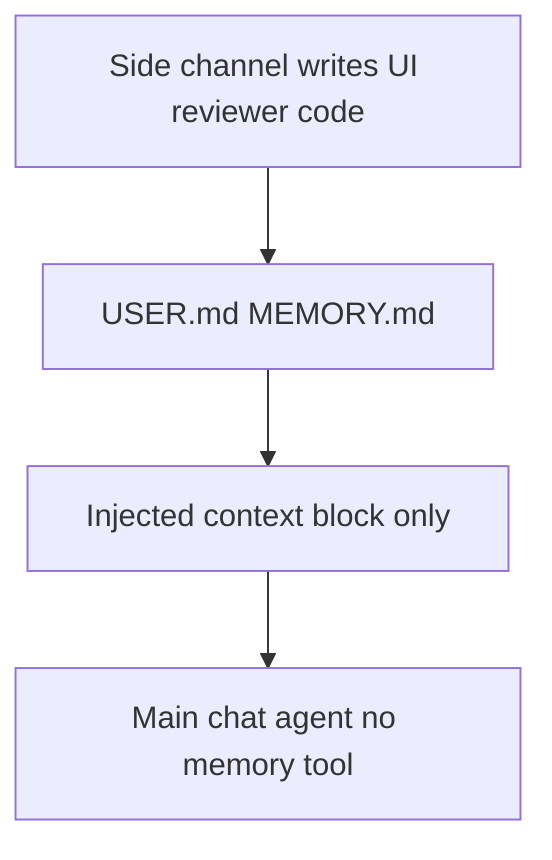

# Hermes agent patterns (memory & skills)

WriterAgent adopts substantial design from [Nous Hermes Agent](https://github.com/NousResearch/hermes-agent): file-backed **memory**, procedural **skills** (`SKILL.md` layout), ACP as an external agent backend, todo/planning stores, tool-call parsers, and JSON repair patterns. This document is the **canonical** reference for upstream patterns, current WriterAgent implementation, and integration priorities.

**Entry points:** [`plugin/chatbot/memory.py`](../plugin/chatbot/memory.py), [`plugin/chatbot/skills.py`](../plugin/chatbot/skills.py), [`plugin/framework/constants.py`](../plugin/framework/constants.py) (`MEMORY_GUIDANCE`, injection in `get_chat_system_prompt_for_document`).

**Status (2026-06):** `upsert_memory` + `USER.md` injection are active. The first skill (`humanizer`) ships with ambient prompt injection only (Settings checkbox). General skills list/view/manage tools remain aspirational.

---

## Concepts

| Concept | Role |
|--------|------|
| **Memory** | Persistent files for long-lived facts: a **user** profile (`USER.md` — preferences, quirks) and a general **memory** note (`MEMORY.md` — project facts, environment). |
| **Skills** | Reusable **procedures** stored as `skills/<name>/SKILL.md` (optional YAML front matter, body instructions). Supports extra files (templates, snippets). |

Together they let the model accumulate stable context (memory) and codify workflows (skills). Save when the user corrects you, when you learn about the environment, after complex multi-tool work, or when a skill is wrong and needs patching.

---

## Hermes reference patterns (upstream)

WriterAgent’s memory/skills modules are **inspired by** Hermes. The useful pattern: **the model sees saved memory in the system prompt every turn**, and uses the **`memory` tool mainly to write** (and occasionally to read **live** disk after mid-session updates). It does **not** rely on the main chat model repeatedly calling `memory` with `read` just to “load” preferences.

### Automatic reading (prompt injection)

Hermes loads `MEMORY.md` and `USER.md` from disk when the session’s system prompt is built. A **frozen snapshot** of that content is **appended to the cached system prompt** (upstream `run_agent.py` `_build_system_prompt`, `tools/memory_tool.py` `format_for_system_prompt`). Official docs: `website/docs/developer-guide/prompt-assembly.md` (“Memory snapshots”, “frozen MEMORY snapshot”, “frozen USER profile snapshot”).

**Implications:**

- Facts like a favorite color scheme **are visible without** the model issuing a `memory read` first, as long as they were saved before the snapshot was taken and fit within configured character budgets.
- **Mid-session** `add` / `replace` / `remove` update **files on disk** immediately, but Hermes **does not rewrite** the cached system prompt on every tool call (that keeps LLM **prefix caching** stable). The **tool result** from `memory` reflects **live** content; the **system prompt** stays on the old snapshot until a **new session** or a **prompt rebuild** (e.g. after context compression / reload from disk).

So in Hermes, **“reading” for normal work is automatic via the prompt**; the tool’s **`read` action** is for **inspecting current file contents** when that differs from the frozen snapshot.

### Background “should we save anything?” pass (second agent)

Hermes spawns a **separate short-lived `AIAgent`** in a **background thread** after the **main** reply finishes, so saving does not compete with the user’s task.

- **Trigger (memory):** turn-based counter; default **every N user turns** (`memory.nudge_interval`, default **10**), when the memory store is active.
- **Trigger (skills):** after a turn completes, based on **tool-iteration** counters vs `skill_nudge_interval`.
- **Mechanism:** `_spawn_background_review` clones the conversation snapshot, appends a fixed **review user message** (`_MEMORY_REVIEW_PROMPT`, `_SKILL_REVIEW_PROMPT`, or combined), runs **`run_conversation`** with **`quiet_mode`**. The review agent may call **`memory`** / **`skill_manage`** to persist; optional compact **`💾 …`** summary if something was written.

This is **not** implemented in WriterAgent today. It is part of why Hermes feels low-friction: the **foreground** model does not have to audit every session for saves.

### Upstream memory hardening (not yet in WriterAgent)

Hermes’ `tools/memory_tool.py` is more defensive than WriterAgent’s flat-file version:

- Explicit **frozen snapshot** (`_system_prompt_snapshot`) vs. live mutable state — snapshot at `load_from_disk()`, injected once; writes hit disk but do **not** mutate the prompt.
- `§`-delimited entries for robust multiline storage.
- Load-time **threat/injection scanner** (“strict” scope). Poisoned entries become `[BLOCKED: ...]` in the *snapshot only*; raw text remains visible via `memory read/remove` for cleanup.
- **External drift detection** on writes (manual edits, concurrent sessions) → `.bak.<ts>` and refused mutation with remediation instructions.
- File locking + atomic replace, per-target char limits, deduplication.

**Recommendation:** Adopt snapshot + scanner + drift guard first; skip a full § parser if flat `USER.md` works for most users.

Hermes also injects a **skills index** into the system prompt when skill tools are enabled.

---

## Design alternatives

### Opaque side-channel memory

Keep **memory completely off the main agent’s tool surface**:

- The chat model never receives a memory tool definition and never sees tool results for stored content.
- **Reading** is **injection only**: e.g. `[USER PROFILE / MEMORY]` assembled from disk. Ambient context, like product rules—not something it “fetched.”
- **Writing** happens behind the scenes: background reviewer, “Remember this” UI, user-edited markdown, or non-LLM rules.

**Why consider it:** fewer tools and failure modes in the main loop, lower cognitive load, clear split between document tools and long-term prefs.

**Tradeoffs:** the main agent cannot voluntarily persist mid-turn without another channel. Stale memory must be fixed by users, settings, or the reviewer. Skills can stay on the tool surface, move to injection-only, or hybrid.

This reuses [`MemoryStore`](../plugin/chatbot/memory.py); omit registering [`MemoryTool`](../plugin/chatbot/memory.py) for sidebar chat and strip **`MEMORY_GUIDANCE`** that tells the model to use the tool.

### Who should update memory?

- **Reviewer-primary** — Background pass decides what to save; main model focuses on document work.
- **Main-agent `upsert_memory` tool** — One extra tool; with injection supplying reads, the tool is mostly **writes**. Immediate save when the user says “remember that.”
- **Hybrid** — Inject every turn; reviewer handles passive extraction; expose `upsert_memory` but soft-prompt it (“only when the user explicitly asked or a correction must not wait”).

### Librarian vs writer (onboarding and handoff)

Split **who you are** from **what we edit** using **different tool sets**, not necessarily a different session:

- **Librarian surface** — Reduced tools (memory/skills/chat only). Same sidebar session and history; onboarding chat seeds `USER.md`.
- **Writer surface** — Full Writer tool list (or nested Writer delegation per [`writer-specialized-toolsets.md`](writer-specialized-toolsets.md)).

**Precedent:** Web research already branches on a checkbox in [`panel.py`](../plugin/chatbot/panel.py) / [`web_research.py`](../plugin/chatbot/web_research.py). Librarian mode is implemented in [`librarian.py`](../plugin/chatbot/librarian.py). See [`librarian-agentic-onboarding.md`](librarian-agentic-onboarding.md) for onboarding details.

---

## WriterAgent implementation (current)

### Memory ([`memory.py`](../plugin/chatbot/memory.py))

**Storage:** `{user_config_dir(ctx)}/memories/`

- **`USER.md`** — target `user` (the only target `upsert_memory` writes today)
- **`MEMORY.md`** — target `memory` (path exists in `MemoryStore`; not yet used by the tool)

**`MemoryStore`:** `read(target)` / `write(target, content)` — flat file per target (not Hermes’s §-delimited / dual-snapshot structure).

**`upsert_memory` tool** (`name = "upsert_memory"`):

- Parameters: `key` (string, supports dot nesting), `content` (string; empty deletes the key)
- Reads existing `USER.md` as JSON object (rebuilds from scratch if invalid/legacy content)
- Nested key update via dot-separated path; writes indented JSON back to `USER.md`
- Registered via `auto_discover` in [`plugin/chatbot/__init__.py`](../plugin/chatbot/__init__.py)

**Injection:** In `get_chat_system_prompt_for_document` ([`constants.py`](../plugin/framework/constants.py) ~704–715), when `USER.md` is non-empty:

```
[USER PROFILE / MEMORY]
{contents}
```

Librarian path also injects user memory ([`librarian.py`](../plugin/chatbot/librarian.py)).

**Prompt guidance:** `MEMORY_GUIDANCE` is woven into the Writer default system prompt template (`DEFAULT_CHAT_SYSTEM_PROMPT_TEMPLATE`) — explains when to save proactively (corrections, environment discoveries).

### Skills ([`skills.py`](../plugin/chatbot/skills.py))

**Storage:** `{user_config_dir(ctx)}/skills/<name>/SKILL.md` — Hermes-compatible layout.

**Shipped: humanizer**

- Ambient `[HUMANIZER GUIDANCE]` injection when `chatbot.humanizer_enabled` (Settings checkbox in [`module.yaml`](../plugin/chatbot/module.yaml))
- User-edited `skills/humanizer/SKILL.md` always wins; built-in default auto-seeded on first access
- `SkillStore` modeled 1:1 on `MemoryStore` — no general skills framework yet

**Future (Hermes-style, not implemented):** `skills_list`, `skill_view`, `skill_manage` with progressive disclosure (list overview → view full skill → create/edit/patch/delete). No `SKILLS_GUIDANCE` constant exists in code today.

### WriterAgent vs Hermes

| Aspect | Hermes (upstream) | WriterAgent |
|--------|-------------------|-------------|
| Memory injection | Frozen snapshot, both files | Live read of `USER.md` each prompt build (no frozen snapshot yet) |
| Memory tool | `memory` add/replace/remove/read | `upsert_memory` JSON key/value into `USER.md` |
| Background reviewer | Yes | No |
| Skills injection | Skills index in prompt | Humanizer only (toggle) |
| General skills tools | Full CRUD | Not yet |
| Memory hardening | Snapshot, scanner, drift guard | Flat files only |

### Integration status

| Piece | State |
|-------|--------|
| `upsert_memory` + memory `auto_discover` | Active |
| `USER.md` prompt injection | Active |
| Humanizer prompt injection | Active |
| Frozen snapshot / threat scan / drift guard | Not implemented |
| Background reviewer | Not implemented |
| General skills list/view/manage | Not implemented |
| Tests | [`tests/chatbot/test_memory.py`](../tests/chatbot/test_memory.py), [`tests/chatbot/test_skills.py`](../tests/chatbot/test_skills.py) |

### Prompt layer notes

- `get_chat_system_prompt_for_document` selects Writer, Calc, or Draw bases. Memory guidance and injection apply on the **Writer** path (and librarian onboarding).
- `TOOL_USAGE_PATTERNS` (separate from memory/skills) documents document-tool conventions in the same Writer prompt bundle.
- Commented todo guidance below `DEFAULT_CHAT_SYSTEM_PROMPT` describes Hermes-style planning with a `todo` tool — not in the live prompt unless enabled.

---

## Flow diagrams

### WriterAgent today



### Hermes-style target (reference)



After writes, **disk** updates immediately; **snap** refreshes on the next session or prompt rebuild.

### Opaque memory (alternative)



---

## Hermes integration landscape

WriterAgent already mirrors several Hermes concepts:

- **ACP backend** — Chat with Document can use `hermes acp` (or other ACP agents) instead of built-in `LlmClient` ([`acp_backend.py`](../plugin/agent_backend/acp_backend.py), [`hermes_simple.py`](../plugin/agent_backend/hermes_simple.py)).
- **Todo / planning** — Adaptation of Hermes `todo_tool.py` ([`todo.py`](../plugin/chatbot/todo.py), [`todo_store.py`](../plugin/contrib/todo_store.py)).
- **Parsers & robustness** — Hermes-format `<tool_call>` parser, `safe_json_loads` repair.
- **Bidirectional bridges** — User skills in `~/.hermes/skills/` (`writeragent-extension-layers`, `libreoffice-mcp`) document architecture and call WriterAgent via MCP.
- **Sandbox** — Vendored AST sandbox + warm venv worker with trusted `plugin/scripting/*` stubs (tailored to LO + numpy/pandas/scipy + vision vs. Hermes’s own execution environments).

---

## Skills catalog and priorities

Hermes-agent ships ~73 built-in `SKILL.md` files (plus `optional-skills/` and user-installed). Many are service-specific glue (Notion, email, etc.) — low priority for WriterAgent defaults.

### Strong candidates for default / seeded inclusion

| Skill | Priority | Notes |
|-------|----------|-------|
| `creative/humanizer` | **Shipped** | AI-slop removal + human voice. See § WriterAgent implementation. |
| `software-development/plan` | High | Plan-only mode, bite-sized tasks, TDD discipline. Pairs with todo infra and sub-agent delegation. Save plans under `writeragent_plans/` or next to the document. |
| `productivity/ocr-and-documents` | Medium | Map decision logic to existing vision stack (Paddle + Docling), not new OCR engines. |
| `research/arxiv` | Low–medium | Zero-dep search; complements web research sub-agent. |
| `research/llm-wiki` | Low–medium | Persistent interlinked markdown KB; fits per-folder embeddings work. |

**Skip for defaults:** full `research-paper-writing` pipeline (niche, heavy deps), service glue, heavy creative/desktop-automation skills without LO mapping.

**Recommendation:** Seed a small curated set in the user profile next to `memories/` — humanizer (done), then plan, document-ingestion, light research helpers.

---

## Other patterns to evaluate

- **ACP provenance** — Consume `_meta.hermes.sessionProvenance` in the ACP client path (compression depth, rotation reason). Align stderr-only logging and probe handling with `acp_adapter/entry.py`.
- **Plan + todo discipline** — “Plan before you act”; structured state that survives compression.
- **Memory hardening** — Snapshot + threat scan + drift detection (high blast radius when memory is injected).
- **Background reviewer** — Prototype via existing `SmolAgentExecutor` / sub-agent infra after main reply.

---

## Integration principles

- **Reuse first** — Prompt injection points, smol sub-agents, trusted venv modules (`plugin/scripting/`).
- **Shared layout** — `SKILL.md` + directory convention for cross-agent portability (Hermes, WriterAgent, Memento — see [`external/memento-skills.md`](external/memento-skills.md)).
- **Vendoring / adaptation** — Small focused pieces (humanizer patterns, plan contract, threat scanner) rather than whole subsystems.
- **Injection vs. tools** — Ambient injection for memory and key skills; tools primarily for mutation.
- **Defaults vs. optional** — Tiny high-signal default set; hub/discovery for the rest.
- **Testing & docs** — Matching `tests/chatbot/test_*.py`; update this doc when behavior changes; `make test` before release.

### Prioritized summary

**Pursue soon (low complexity, high value):**

- humanizer (**done**)
- Plan-mode discipline
- Memory snapshot + threat scan + drift detection
- ACP provenance consumption
- Background reviewer
- Light research synthesis (arxiv, llm-wiki)
- Bidirectional skill/MCP bridging (already working)

**Medium (prototype, evaluate cost):**

- Adapted ocr-and-documents workflow
- Deeper skills index injection in system prompts
- Experiment-logging patterns from paper-writing skill (generic “analysis journal”)

**Probably skip:**

- Full research-paper-writing pipeline
- Most service-specific skills
- Re-implementing Hermes hub/health/watchdog machinery

---

## Open questions

- Which 2–3 skills to seed next after humanizer?
- Prototype memory snapshot + scanner — measure prompt size / UX impact?
- Dedicated “use this skill” tool surface vs. prompt-injected procedures only?
- Skill versioning when users have local `SKILL.md` customizations?
- Patterns from Hermes `environments/` or `code_execution_tool` that improve the venv worker without duplicating trusted-module + import policy?

---

## References

**WriterAgent source:**

- [`plugin/chatbot/memory.py`](../plugin/chatbot/memory.py), [`plugin/chatbot/skills.py`](../plugin/chatbot/skills.py)
- [`plugin/chatbot/todo.py`](../plugin/chatbot/todo.py), [`plugin/contrib/todo_store.py`](../plugin/contrib/todo_store.py)
- [`plugin/contrib/tool_call_parsers/hermes_parser.py`](../plugin/contrib/tool_call_parsers/hermes_parser.py)

**Local Hermes checkout (inspection points):**

- `~/.hermes/hermes-agent/tools/memory_tool.py`
- `~/.hermes/hermes-agent/tools/todo_tool.py`
- `~/.hermes/hermes-agent/acp_adapter/{provenance.py, entry.py, server.py}`
- `~/.hermes/hermes-agent/skills/creative/humanizer/SKILL.md`
- `~/.hermes/hermes-agent/skills/software-development/plan/SKILL.md`
- `~/.hermes/hermes-agent/skills/productivity/ocr-and-documents/SKILL.md`
- `~/.hermes/hermes-agent/optional-skills/DESCRIPTION.md`
- User skills: `~/.hermes/skills/writeragent*`, `writeragent-extension-layers`

**Related docs:**

- [`librarian-agentic-onboarding.md`](librarian-agentic-onboarding.md)
- [`external/memento-skills.md`](external/memento-skills.md)
- [`smol-main-chat-tool-architecture.md`](smol-main-chat-tool-architecture.md)
- [`mcp-protocol.md`](mcp-protocol.md)
- [`enabling_numpy_in_libreoffice.md`](enabling_numpy_in_libreoffice.md)

---

*Hermes patterns are reference material, not a 1:1 port mandate. Update this doc as concrete work lands.*
