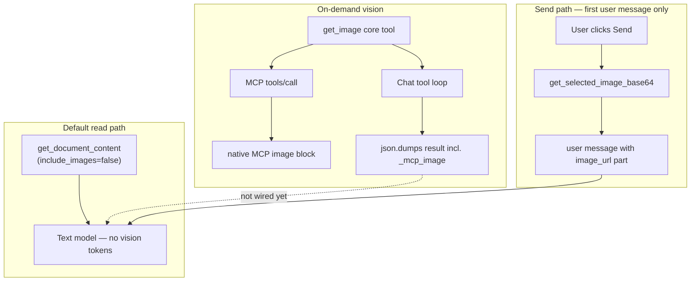

# Multimodal Vision Support (Chat Sidebar + MCP)

Native multimodal vision lets a vision-capable LLM **see** document images — for semantics ("explain this diagram", "what's in this screenshot") — without paying vision tokens on every read. It complements the local OCR path in [image-recognition.md](image-recognition.md) (`domain=vision`, Docling/Paddle venv); OCR is for precise text extraction and insert, not general visual reasoning.

**Key constraints (kept deliberately simple):**
- No new UI elements (no image preview, no drag-and-drop in sidebar).
- No selection change listeners.
- Reuse existing `get_selected_image_base64` / graphic export paths.
- Follow the same patterns as native audio support (`has_native_audio`, persistent cache, catalog + metadata + heuristics).

---

## Architecture overview

**Lazy perception:** Embedded image bytes are stripped from `get_document_content` by default (`include_images=false`). When the model actually needs to *see* one image, it calls the core [`get_image`](../plugin/writer/get_image.py) tool (by graphic name, current selection, or `page=<n>` for a whole-page PNG). That avoids upfront vision-token cost on every document read.

---

## Completed (shipped)

Status as of PR #364 and related multimodal work. Code paths below are live; do not re-implement without checking for in-flight changes.

### Vision capability detection

| Item | Location | Notes |
|------|----------|-------|
| `has_native_vision(model_id, endpoint)` | [`model_fetcher.py`](../plugin/framework/client/model_fetcher.py) | Tiered: `vision_support_map` cache → `DEFAULT_MODELS` `ModelCapability.VISION` → OpenRouter/Together `input_modalities` cache → Ollama `POST /api/show` → **no name heuristics yet** (returns `False` if nothing matches) |
| `set_native_vision_support(model_id, endpoint, supported)` | same | Persists to `vision_support_map` |
| `query_ollama_model_capabilities` | same | Cached Ollama `/api/show` probe |
| Vision models in catalog | [`default_models.py`](../plugin/framework/default_models.py) | e.g. Gemini 3.1 Flash Lite, Mistral Large 3 declare `ModelCapability.VISION` |

**Doc correction:** `has_native_vision` takes `(model_id, endpoint)` — **not** `ctx`. Callers use `get_text_model()` and `get_current_endpoint()` (no component context on the config path).

### Chat send — selected image on first user message

Implemented in [`tool_loop.py`](../plugin/chatbot/tool_loop.py) (`_do_send_chat_with_tools`):

- When `has_native_vision(text_model_id, endpoint)` is true and a graphic is selected, the first user message of the turn is a list: `[{type: text}, {type: image_url, image_url: {url: data:image/png;base64,...}}]`.
- Only on the **first** user message of the send; not re-attached on later tool-loop rounds.
- Uses [`get_selected_image_base64`](../plugin/writer/images/image_tools.py) with panel `ctx` and frame-resolved document model.

### Tool-result image normalization (`data:image/...`)

Implemented in [`response_normalizers.py`](../plugin/framework/client/response_normalizers.py):

- `extract_and_strip_images_from_message` — finds `data:image/...;base64,...` in tool/assistant/system message strings and list parts; replaces with `[Image Ref]`.
- `normalize_multimodal_messages(messages, provider)` — re-attaches extracted images per provider rules (OpenAI-compatible: move to nearest preceding `user` message; Anthropic: can stay in `tool`; Gemini: flexible).
- Called from [`llm_client.py`](../plugin/framework/client/llm_client.py) `make_chat_request` before the shim builds the wire payload.

**Covers:** `get_document_content(include_images=true)` HTML with embedded `data:image` URIs. **Does not yet cover:** `_mcp_image` tool results (see follow-ups).

### Core `get_image` tool (lazy on-demand vision)

| Item | Location | Notes |
|------|----------|-------|
| `GetImage` core tool | [`get_image.py`](../plugin/writer/get_image.py) | `tier="core"`, Writer `TextDocument` only |
| Modes | same | `image=<name>`, `selection=true` (or implicit when no name), `page=<n>` (1-based whole-page PNG) |
| Page render | `_render_page_png` | Native `writer_png_Export` after `jumpToPage`; XRenderable abandoned (BUG-5: `getRendererCount` reports 1 page on multi-page docs). View cursor saved/restored best-effort. Fail-loud — never returns empty PNG. |
| Wire marker | same | Returns `{"status":"ok","source":...,"_mcp_image":{"data":"<b64>","mimeType":"image/png"}}` |
| Schema gating | [`vision_availability.py`](../plugin/vision/vision_availability.py) `filter_get_image_for_text_only_model` | On **openai** schema path only: drops `get_image` when `has_native_vision` is false. Fail-open on lookup errors. MCP path always exposes it (client assumed vision-capable). Hook in [`tool.py`](../plugin/framework/tool.py) `get_schemas`. |

### MCP native image content blocks

| Item | Location | Notes |
|------|----------|-------|
| `call_tool_result_image` | [`wire_types.py`](../plugin/mcp/wire_types.py) | MCP `content: [{type: image, data, mimeType}]` |
| `_mcp_image` branch | [`mcp_protocol.py`](../plugin/mcp/mcp_protocol.py) `StreamResponseEffect` | Detects `_mcp_image.data` in tool result dict; emits image block instead of JSON text |

MCP vision clients receive the picture itself, not base64 pasted as text.

### Related image tooling (same PR / adjacent)

- **`get_image_info`** reports `crop_mm` (mm trimmed per edge) from `GraphicCrop`.
- **`set_image_properties`** accepts per-edge `crop_*_mm`; only passed edges change (`_resolve_crop_edges` helper, unit-tested).
- **Orientation** accepts friendly names (`left`/`center`/`right`, `top`/`center`/`bottom`, `centre`) mapped to live UNO constants via `uno.getConstantByName`; unknown names → clear tool error (`_resolve_orient`, unit-tested).

### Tests (present)

| Area | File |
|------|------|
| `has_native_vision` tiered logic | [`tests/framework/client/test_model_fetcher.py`](../tests/framework/client/test_model_fetcher.py) |
| `normalize_multimodal_messages` per provider | [`tests/framework/test_client_llm.py`](../tests/framework/test_client_llm.py), [`tests/framework/client/test_response_normalizers.py`](../tests/framework/client/test_response_normalizers.py) |
| `filter_get_image_for_text_only_model` | [`tests/vision/test_vision_availability.py`](../tests/vision/test_vision_availability.py) |
| `call_tool_result_image` | [`tests/mcp/test_wire_types.py`](../tests/mcp/test_wire_types.py) |
| `_render_page_png` error/control-flow | [`tests/writer/test_get_image_render.py`](../tests/writer/test_get_image_render.py) |
| `_resolve_crop_edges`, `_resolve_orient` | [`tests/writer/images/test_crop_edges.py`](../tests/writer/images/test_crop_edges.py), [`tests/writer/images/test_images.py`](../tests/writer/images/test_images.py) |

Host capability table row: [image-recognition.md §6](image-recognition.md).

---

## Suggested follow-ups

Do not start these without coordinating — others may already be working on them. Ordered by impact.

### 1. Chat sidebar: wire `get_image` results into multimodal messages (high impact)

**Gap:** On the chat path, tool results are `json.dumps(res)` in [`tool_loop_actions.py`](../plugin/chatbot/tool_loop_actions.py). `normalize_multimodal_messages` only extracts `data:image/...` URIs — it does **not** recognize `_mcp_image`. A vision-capable chat model that calls `get_image` receives a huge JSON string with embedded base64, not a native image part.

**Suggested approach (pick one, keep minimal):**
- Before storing the tool result (or inside `normalize_multimodal_messages`), detect `_mcp_image` in parsed tool JSON:
  - Strip `_mcp_image` from the text payload (keep `status` / `source` as short JSON or text).
  - Attach `image_url` with `data:{mimeType};base64,{data}` on the tool message or move to preceding `user` per existing provider rules.
- Reuse `extract_and_strip_images_from_message` patterns; avoid a second HTTP path.

**Also verify:** [`format_tool_result_for_display`](../plugin/framework/logging.py) truncates/redacts `_mcp_image.data` in sidebar debug output.

### 2. `GetImage.execute` parameter validation (medium)

**Current behavior** ([`get_image.py`](../plugin/writer/get_image.py)):

| Call | Behavior | Risk |
|------|----------|------|
| `{}` | Tries selection (implicit) | OK as default |
| `{selection: false}` with no `image` | Still tries selection (`not name`) | Surprising |
| `{page: 2, image: "foo"}` | Page wins silently | Ambiguous |
| `{selection: true, page: 2}` | Page wins | Conflicting args ignored |

**Suggested fix:** Require exactly one mode (`page`, `image`, or explicit `selection=true`). Error on conflicting params and on `selection=false` with no `image`.

### 3. MCP response: preserve metadata alongside image (low–medium)

When `_mcp_image` is present, [`mcp_protocol.py`](../plugin/mcp/mcp_protocol.py) emits **only** an image block — `status` and `source` are discarded.

**Suggested fix:** Dual content blocks — short text JSON (`source`, `status`) plus image — MCP allows multiple content entries. Extend `call_tool_result_image` or add a variant.

### 4. Calc parity for `get_image` (medium, product decision)

Specialized image tools (`list_images`, `get_image_info`, `set_image_properties`) register on Writer **and** Calc. `get_image` is Writer-only (`TextDocument`), but `get_selected_image_base64` and named-graphic export already work on Calc.

**Options:**
- Extend `GetImage.uno_services` to include `SpreadsheetDocument` for `image=` and `selection=` (page render stays Writer-only), **or**
- Document explicitly that Calc must use `include_images=true` on reads or `extract_text_from_image`.

### 5. Page render fidelity — live UNO test (medium)

Unit tests cover `_render_page_png` error paths only ([`test_get_image_render.py`](../tests/writer/test_get_image_render.py)). Happy path (`storeToURL` + valid PNG magic) is not automated.

**Suggested:** `@native_test` on a 2+ page Writer doc — render page 1 vs page 2; assert PNGs differ. If `writer_png_Export` after `jumpToPage` exports the whole document, document the limitation or pass page-specific filter properties.

### 6. Missing tests (medium)

| Area | Gap |
|------|-----|
| MCP `_mcp_image` branch | Mock `StreamResponseEffect`; assert `tools/call` content `type == "image"` |
| `GetImage.execute` | Mock doc/graphic for three modes + param errors |
| `get_schemas("openai")` integration | Assert `get_image` excluded when `has_native_vision` false |
| `get_image_info` crop reporting | Mock graphic with `GraphicCrop` struct |

### 7. Documentation elsewhere (low–medium)

| Doc | Update |
|-----|--------|
| [writer-specialized-toolsets.md](writer-specialized-toolsets.md) | Note **core** `get_image` alongside specialized Images tools |
| [mcp-protocol.md](mcp-protocol.md) | Document `_mcp_image` → native image content blocks |
| [AGENTS.md](../AGENTS.md) quick-orientation | Optional: `get_image` under Writer / vision |

### 8. Minor code-quality (low)

- **`filter_get_image_for_text_only_model`** lives in [`vision_availability.py`](../plugin/vision/vision_availability.py) (OCR/venv gating) but gates a core Writer tool on chat model capability. Consider `model_fetcher.py` or a small `multimodal_availability.py` — cosmetic only.
- **`has_native_vision` name heuristics:** Original plan listed keyword fallback as tier 4; current implementation returns `False` when cache, catalog, and provider metadata all miss. Add heuristics only if needed (mirror audio pattern, keep predicate small).

---

## Detection architecture (reference)

Priority order for `has_native_vision(model_id, endpoint)`:

1. **Persistent user config cache** — `vision_support_map` (`{ "endpoint@model": true/false }`).
2. **Static catalog** — `DEFAULT_MODELS` entries with `ModelCapability.VISION`.
3. **Dynamic provider metadata:**
   - OpenRouter / Together: `architecture.input_modalities` containing `"image"` from `/v1/models` (process cache `_model_fetch_vision_cache`).
   - Ollama: `POST /api/show` → `capabilities` contains `"vision"`.
4. **Name-based heuristics** — planned as last resort; **not implemented yet**.

---

## Provider-specific notes

### Ollama

- Primary detection: `POST /api/show`, `"vision"` in `capabilities` (cached).
- Wire: OpenAI-compatible `/v1/chat/completions`; `image_url` with `data:image/png;base64,...` in user messages. `OllamaShim` inherits `OpenAIShim`.
- Tool-result images must still obey OpenAI's "images in user role" rule → `normalize_multimodal_messages` move-to-user logic applies.
- Caveat: some vision-tagged Ollama models lack tool-calling; main chat tool loop may be limited.

### xAI Grok

- Catalog + OpenAI-compatible path. Same strict user-role rule for tool-result images.

### Other OpenAI-compatible locals (LM Studio, llama.cpp, vLLM, …)

- Rarely publish `input_modalities`. Rely on `vision_support_map` after first successful interaction; heuristics TBD (follow-up §8).

---

## Tool result image extraction (reference)

Two sources of images in tool results:

| Source | Format | Normalization today |
|--------|--------|---------------------|
| `get_document_content(include_images=true)` | `data:image/...;base64,...` in HTML/text | **Done** — `normalize_multimodal_messages` |
| `get_image` | `_mcp_image: {data, mimeType}` in JSON tool result | **Not done** on chat path; **done** on MCP path |

Required behavior for any new source (including `_mcp_image`):

1. Scan message history before wire request.
2. Extract base64 + mime type.
3. Replace payload in source message with a short marker (token savings).
4. Re-attach as native part on a provider-acceptable role (OpenAI-compatible → `user`; Anthropic → can stay in `tool`; Gemini → flexible).
5. Idempotent — do not re-extract `[Image Ref]` markers.

Normalization belongs in the `LlmClient` layer (`make_chat_request`) so all chat paths benefit. Existing log redaction handles `data:image` payloads.

---

## Verification plan

### Automated (existing + suggested)

**Present:** see [Completed → Tests](#tests-present).

**Suggested additions:**
- MCP protocol test for `_mcp_image` serialization.
- `GetImage.execute` mocked unit tests.
- UNO test for single-page PNG on multi-page doc (or document filter limitation).

### Manual

1. Writer doc + selected image + vision model → Send "Describe this image" (send-path attachment).
2. Vision model + `get_image` via **MCP** → client shows native image block.
3. Vision model + `get_image` via **chat sidebar** → confirm whether model sees image (**expected gap** until follow-up §1).
4. `get_document_content(include_images=true)` in tool loop → model receives image, not only `[Image Ref]` text.
5. Text-only model → `get_image` absent from tool list (openai schema path); selected image ignored on send.
6. Ollama vision model → `/api/show` or `vision_support_map` records capability.

---

## Limitations and notes

- **Large payloads:** Exported graphics are full-resolution PNGs as base64; may hit token or request-size limits. Future: optional downscaling.
- **Not all vision models support tools** on local stacks.
- **Send-path selection:** Raster images in Writer/Calc selection only; Draw/Impress vectors use other paths.
- **Main chat model only** for send-path attachment; sub-agents/delegates have separate rules.
- **`get_image` Writer-only** for now; Calc has specialized list/info/set but not core fetch (see follow-up §4).
- **Complementary OCR:** Use `domain=vision` + `extract_text_from_image` for accurate text + insert; use native multimodal for visual reasoning.

---

## Implementation invariants

- Wire behavior changes belong in `llm_client.py` + shims + `response_normalizers.py`. No second HTTP stack.
- Reuse `get_selected_image_base64` and graphic export machinery from the vision stack.
- Session/DB may store list-style user `content` when an image was attached; UI must tolerate placeholders.
- MCP image wire shape: `_mcp_image` dict in tool result → `call_tool_result_image` in protocol handler only (do not duplicate serializer elsewhere).
- Fail-open when vision capability cannot be determined (`filter_get_image_for_text_only_model`).
