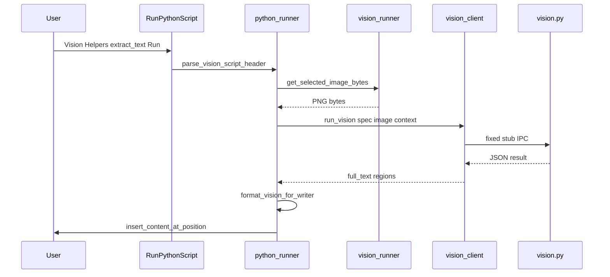
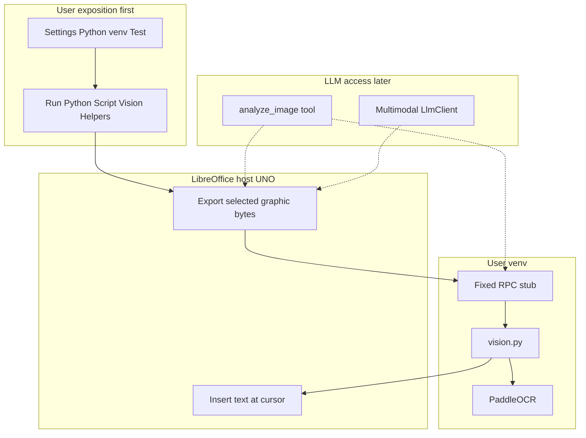

# Image Recognition — Design (Local OCR & Detection)

**Status:** **Foundation shipped** — trusted venv helpers (`vision.py`, `vision_client`, templates, egress) and tests; **Vision Helpers UI and Writer fast path not wired yet**. LLM/chat integration is **explicitly later**.

WriterAgent documents (Writer, Calc, Draw/Impress) embed raster images: scans, screenshots, chart photos, slide exports, logos. **LibreOffice handles graphics I/O** (export, insert, replace, dimensions). **Recognition** (OCR, layout, object detection) runs in the user's venv via the same trusted-module pattern as [`analysis.py`](../plugin/scripting/analysis.py) and [`embeddings_index.py`](../plugin/scripting/embeddings_index.py).

**Priority:** Ship **direct user access** first (Settings + **Run Python Script → Vision Helpers**). Wire the same helpers to the chat agent (`analyze_image`) only after the manual path works.

**Phase 1 scope (locked):** **Writer only**; insert OCR **`full_text` at the text cursor** via [`insert_content_at_position`](../plugin/writer/format.py). Calc/Draw egress → **Phase 1b**.

**Related:** [Scientific Python / venv bridge](enabling_numpy_in_libreoffice.md) · [Analysis helpers UX (template)](calc-analysis-tools.md) · [Analysis sub-agent (dev-plan style)](analysis-sub-agent.md) · [Image generation (remote)](image-generation.md) · [LO-DOM for vector Draw content](lo-dom-semantic-tree.md) · [Embeddings index (text, not vision)](embeddings.md)

---

## Table of contents

1. [Executive summary](#1-executive-summary)
2. [User exposition (primary)](#2-user-exposition-primary)
3. [Current code state (grounded)](#3-current-code-state-grounded)
4. [Phase 1 development plan (agent handoff)](#4-phase-1-development-plan-agent-handoff)
5. [Use cases](#5-use-cases)
6. [Host vs venv split](#6-host-vs-venv-split)
7. [Supported libraries](#7-supported-libraries)
8. [Architecture](#8-architecture)
9. [Trusted helpers (planned API)](#9-trusted-helpers-planned-api)
10. [`extract_text` result JSON (normative)](#10-extract_text-result-json-normative)
11. [Selection and error UX](#11-selection-and-error-ux)
12. [IPC and worker payload](#12-ipc-and-worker-payload)
13. [Install, models, and self-check](#13-install-models-and-self-check)
14. [Caching](#14-caching)
15. [Security and sandbox](#15-security-and-sandbox)
16. [Implementation phases](#16-implementation-phases)
17. [Phase 1 acceptance criteria](#17-phase-1-acceptance-criteria)
18. [LLM access (deferred)](#18-llm-access-deferred)
19. [Out of scope](#19-out-of-scope)
20. [Suggested agent prompt](#20-suggested-agent-prompt)

---

## 1. Executive summary

| Layer | Responsibility |
|-------|----------------|
| **LibreOffice host (UNO)** | Export embedded graphics to bytes; read anchor/dimensions; insert/replace; apply OCR results to the document |
| **User venv** | **Recognition only** — OCR, document layout, tables-in-images, object/region detection |
| **User UI (first)** | **Settings → Python** + **Run Python Script → Vision Helpers** — same spirit as Calc **Analysis Helpers** |
| **Chat / LLM (later)** | `analyze_image` tool and optional multimodal vision — reuses the same trusted helpers |

**Officially supported recognition stack (two libraries):**

1. **[PaddleOCR](https://github.com/PaddlePaddle/PaddleOCR)** — text, layout, tables (PP-OCR, PP-Structure).
2. **[Ultralytics](https://github.com/ultralytics/ultralytics)** — modern YOLO detection (objects, document blocks, custom weights).

Users may `pip install` anything else for ad hoc scripts. WriterAgent **documents, self-checks, and builds trusted helpers** around **PaddleOCR + Ultralytics** only.

**Exposure model (in order):**

1. **Manual:** curated **Vision Helpers** in **Tools → Run Python Script…** (Phase 1: **Writer only**; Phase 1b+: Calc/Draw when egress exists).
2. **Setup:** Settings → Python venv path + extended **Test** for paddle/ultralytics (Phase 2).
3. **Later:** one LLM tool (`analyze_image`) calling the same `run_vision` backend — not a separate CV stack.

There is **no user UI for recognition today** (picker, fast path, insert). Wire host integration per [§4](#4-phase-1-development-plan-agent-handoff).

---

## 2. User exposition (primary)

Recognition must be usable **without the chat sidebar** — offline, predictable, and debuggable — before any agent integration.

### 2.1 What exists today

| UI | Role for vision |
|----|-----------------|
| **WriterAgent → Settings → Python** | Venv path, exec timeout, **Test** button — prerequisite only; Test does **not** yet report PaddleOCR/Ultralytics |
| **WriterAgent → Run Python Script…** | Monaco editor ([`editor_host.py`](../plugin/scripting/editor_host.py)) or legacy XDL dialog; **Analysis Helpers** section (**Calc only**) via [`analysis_templates.py`](../plugin/scripting/analysis_templates.py) |
| **Chat sidebar** | Text chat + remote **image generation** — **not** in-document OCR/recognition |
| **Settings → Image** tab | Image **generation** providers — unrelated to local OCR |

No **Vision Helpers** section, no graphic context menu, no **Recognize Image…** menu item.

### 2.2 Planned primary UX: Vision Helpers

Mirror [**Analysis Helpers**](calc-analysis-tools.md#1b-run-python-script--analysis-helpers-manual-calc-ux) ([`document_scripts.py`](../plugin/scripting/document_scripts.py) `_analysis_script_section`, [`python_runner.py`](../plugin/scripting/python_runner.py) fast path):

| Piece | Plan |
|-------|------|
| **Entry** | **WriterAgent → Run Python Script…** (already on menu for Writer/Calc/Draw/Impress) |
| **Picker section** | **Vision Helpers →** e.g. `[Vision] extract_text`, … |
| **Templates** | [`vision_templates.py`](../plugin/scripting/vision_templates.py) with `# writeragent:vision helper=… params=…` header |
| **Input** | User **selects an embedded graphic**; host exports PNG bytes (Phase 1: selection only) |
| **Run** | Fast path in `execute_and_insert_result` → `run_trusted_vision` → `vision_client.run_vision` |
| **App scope (Phase 1)** | **Writer only** — Vision Helpers section shown when `is_writer(doc)`; Calc/Draw in **Phase 1b** |

**Monaco toolbar:** Phase 1 omits an **Image:** field — always use current graphic selection when exporting. Phase 1b+ may add binding for graphic name / file path.

### 2.3 User workflow (Phase 1)

```text
1. Settings → Python → set venv path
2. In that venv: pip install paddleocr paddlepaddle numpy
   (ultralytics not required until Phase 4 helpers)
3. Open a Writer document
4. Click the embedded image (graphic selected) and place the text cursor where OCR text should go
5. WriterAgent → Run Python Script… → Vision Helpers → [Vision] extract_text → Run
6. Recognized text is inserted at the text cursor (see §2.4)
```

Increase **Python exec timeout** in Settings if the first run downloads Paddle models (cold start).

### 2.4 Applying results (host egress)

| Document | Phase | Behavior |
|----------|-------|----------|
| **Writer** | **1** | Insert **`full_text`** as plain text at **text cursor** via [`insert_content_at_position`](../plugin/writer/format.py)(..., `"selection"`) — see [`format_vision_for_writer`](../plugin/scripting/vision_egress.py) |
| **Writer** | later | Optional **`set_image_properties`** description from OCR summary |
| **Calc** | **1b** | Plain OCR → column or formatted report; **`extract_structure`** → multi-cell table (like [`analysis_egress`](plugin/calc/analysis_egress.py)) |
| **Draw / Impress** | **1b** | [`insert_result_into_draw`](../plugin/scripting/python_runner.py) or text box; shape annotations later |

**Selection vs cursor:** User **clicks the image** so LO's selection is the graphic (for export). The **text cursor** position controls where OCR output is inserted and may differ from the image anchor.

Errors surface in the Monaco status line / msgbox — see [§11](#11-selection-and-error-ux).

### 2.5 Settings → Python (setup UX)

| Control | Vision role |
|---------|-------------|
| `scripting.python_venv_path` | Must point at venv with PaddleOCR (+ Ultralytics when using detection helpers) |
| `scripting.python_exec_timeout` | Vision cold start may need 60s+ on first model download |
| **Test** | Extend [`run_venv_self_check`](../plugin/scripting/venv_worker.py) to report `paddleocr`, `paddle`, `ultralytics` (**Phase 2**) |

Document install commands in Settings help text or Test failure message — not a separate vision settings tab for v1.

### 2.6 Optional follow-on UX (not Phase 1)

| Idea | Priority |
|------|----------|
| Context menu on graphic → **Extract text from image** | Nice; same fast path as `[Vision] extract_text` |
| **WriterAgent → Recognize Image…** dedicated menu | Optional shortcut to Run Python Script with vision template preloaded |
| README user-facing blurb | Defer until Phase 1 ships |

### 2.7 What comes after user exposition

Only after Vision Helpers work end-to-end:

- **`analyze_image` LLM tool** ([§18](#18-llm-access-deferred))
- Chat sidebar sending crops to multimodal models
- Specialized sub-agent delegation for image tasks

The agent must not become the only way to run OCR.

---

## 3. Current code state (grounded)

Mirror [analysis-sub-agent.md § Current Code State](analysis-sub-agent.md). **Read these files before implementing Phase 1.**

### Shipped (patterns to copy)

| Area | Files |
|------|--------|
| Image export (selection) | [`get_selected_image_base64`](../plugin/writer/images/image_tools.py) → base64 PNG via `GraphicProvider` |
| Analysis trusted stack | [`analysis.py`](../plugin/scripting/analysis.py), [`analysis_client.py`](../plugin/framework/client/analysis_client.py), [`analysis_runner.py`](../plugin/calc/analysis_runner.py) |
| **Vision trusted stack (foundation)** | [`vision.py`](../plugin/scripting/vision.py) (`extract_text` only), [`vision_client.py`](../plugin/framework/client/vision_client.py), [`vision_templates.py`](../plugin/scripting/vision_templates.py), [`vision_egress.py`](../plugin/scripting/vision_egress.py); tests in [`test_vision.py`](../tests/scripting/test_vision.py), [`test_vision_templates.py`](../tests/scripting/test_vision_templates.py), [`test_vision_egress.py`](../tests/scripting/test_vision_egress.py) |
| Run Python fast path | [`python_runner.py`](../plugin/scripting/python_runner.py) — `execute_and_insert_result`, `parse_analysis_script_header` branch |
| Script picker sections | [`document_scripts.py`](../plugin/scripting/document_scripts.py) — `SCRIPT_ORIGIN_ANALYSIS`, `_analysis_script_section`, `build_scripts_list_message` |
| Templates | [`analysis_templates.py`](../plugin/scripting/analysis_templates.py) |
| Writer result insert | [`format_result_for_writer`](../plugin/scripting/python_runner.py), [`insert_content_at_position`](../plugin/writer/format.py) |
| Calc analysis egress | [`analysis_egress.py`](../plugin/calc/analysis_egress.py) — `is_analysis_result`, `insert_analysis_result_into_calc` |
| Monaco sections UI | [`scripts_manager.js`](../plugin/contrib/scripting/assets/editor/scripts_manager.js) — renders `sections` from host JSON; disable Attach for built-in origins |
| Tests to mirror | [`test_analysis_templates.py`](../tests/scripting/test_analysis_templates.py), [`test_python_runner_analysis.py`](../tests/scripting/test_python_runner_analysis.py), [`test_document_scripts.py`](../tests/scripting/test_document_scripts.py) (`test_build_scripts_list_includes_analysis_section_for_calc`) |

### Gaps (Phase 1 host wiring still needed)

| Gap | Notes |
|-----|--------|
| No `vision_runner.py` | Host-side export + `run_trusted_vision` — wrap [`get_selected_image_base64`](../plugin/writer/images/image_tools.py) |
| No `SCRIPT_ORIGIN_VISION`, `[Vision]` prefix, vision fast path | Parallel to analysis constants in [`document_scripts.py`](../plugin/scripting/document_scripts.py) |
| No Vision Helpers in picker | Analysis section is **Calc-gated** (`is_calc` in `_analysis_script_section`); vision is **Writer-gated** for Phase 1 |
| Monaco Attach for vision built-ins | Extend `scripts_manager.js`: `origin === "vision"` disables Attach (like `analysis`) |

---

## 4. Phase 1 development plan (agent handoff)

**Goal:** Writer + **`extract_text`** only. **Do not** register chat tools or implement Calc/Draw egress in Phase 1.

### 4.1 Sequence



### 4.2 New modules (create)

| File | Role |
|------|------|
| [`plugin/scripting/vision.py`](../plugin/scripting/vision.py) | `HELPER_NAMES`, `run_vision`, `_extract_text` via PaddleOCR (lazy engine singleton per worker) |
| [`plugin/framework/client/vision_client.py`](../plugin/framework/client/vision_client.py) | Fixed stub like [`analysis_client.py`](../plugin/framework/client/analysis_client.py); session id `writeragent:vision` |
| [`plugin/scripting/vision_templates.py`](../plugin/scripting/vision_templates.py) | `# writeragent:vision helper=… params=…`; Phase 1 template: **`extract_text` only** |
| [`plugin/scripting/vision_runner.py`](../plugin/scripting/vision_runner.py) | `get_selected_image_bytes(ctx, doc)`, `run_trusted_vision(...)` — host-side export + RPC |
| [`plugin/scripting/vision_egress.py`](../plugin/scripting/vision_egress.py) | `is_vision_result`, `format_vision_for_writer(result) -> str` |

**`vision_client.py` stub (match analysis pattern):**

```python
_VISION_STUB = """\
from plugin.scripting.vision import run_vision as _run
result = _run(data["spec"], data.get("image"), data.get("context") or {})
"""
```

### 4.3 Files to modify

| File | Change |
|------|--------|
| [`document_scripts.py`](../plugin/scripting/document_scripts.py) | `SCRIPT_ORIGIN_VISION`, `VISION_SCRIPT_DISPLAY_PREFIX = "[Vision] "`, `_vision_script_section(doc)` gated on **`is_writer(doc)`**; wire `build_xdl_script_picker_state` / `build_scripts_list_message` / `resolve_script_picker_entry` |
| [`python_runner.py`](../plugin/scripting/python_runner.py) | Before generic venv run: if `parse_vision_script_header(code)` → export bytes → `run_trusted_vision` → `format_vision_for_writer` → `insert_content_at_position` (Writer only) |
| [`sandbox_imports.py`](../plugin/scripting/sandbox_imports.py) | Add `plugin.scripting.vision` |
| [`scripts_manager.js`](../plugin/contrib/scripting/assets/editor/scripts_manager.js) | `isBuiltInVision = currentOrigin === "vision"`; disable Attach like analysis |

### 4.4 Host image wire format

Worker `data=` dict passed to the fixed stub:

```python
payload = {
    "spec": {"helper": "extract_text", "params": {}},
    "image": png_bytes,  # raw bytes, NOT base64
    "context": {"source": "selection"},
}
```

Host obtains bytes via new `get_selected_image_bytes(ctx, doc)`:

```python
import base64
b64 = get_selected_image_base64(doc, ctx)
if not b64:
    raise ToolExecutionError(..., code="NO_IMAGE_SELECTED")
png_bytes = base64.b64decode(b64)
```

### 4.5 PaddleOCR in `vision.py`

- **Lazy-init** one `PaddleOCR` instance per warm worker process (module-level singleton; reset on worker respawn).
- Phase 1 **`params`:** optional `lang` (string, default `"en"`).
- Use current PaddleOCR 3.x Python API (`PaddleOCR(...)` + `ocr` / `predict` per installed version — implementer reads installed package docs).
- Map engine output → [§10](#10-extract_text-result-json-normative) (`full_text`, `regions`, `metrics`).
- **`ImportError` / missing paddle:** return `{"status": "error", "code": "PADDLEOCR_UNAVAILABLE", ...}` — do not raise uncaught from venv for missing pip packages.

**CI / tests:** Mock `PaddleOCR` in [`tests/scripting/test_vision.py`](../tests/scripting/test_vision.py); **`make test` must not download models or require paddle installed.**

### 4.6 Tests to add (Phase 1)

| File | Covers |
|------|--------|
| `tests/scripting/test_vision_templates.py` | Template coverage, `parse_vision_script_header` round-trip |
| `tests/scripting/test_vision.py` | `run_vision` / `_extract_text` with mocked Paddle |
| `tests/scripting/test_vision_egress.py` | `is_vision_result`, `format_vision_for_writer` |
| `tests/scripting/test_python_runner_vision.py` | Fast path in `execute_and_insert_result` (mock export + RPC + insert) |
| `tests/scripting/test_document_scripts.py` | `test_build_scripts_list_includes_vision_section_for_writer` (mirror analysis Calc test) |

---

## 5. Use cases

| Use case | User path (primary) | Agent path (later) |
|----------|---------------------|-------------------|
| OCR on scan / screenshot | Vision Helpers → `extract_text` (**Writer, Phase 1**) | `analyze_image` + `source=selection` |
| Tables in raster image → Calc | `extract_structure` (**Phase 3 / egress 1b**) | same helper via tool |
| Alt text from visible text | `extract_text` → description (**later**) | optional |
| Find logos / UI elements | `detect_objects` (Phase 4) | same |
| “What does this diagram *mean*?” | — | LLM vision ([§18](#18-llm-access-deferred)) |
| Draw/Impress **vector** slides | LO-DOM [`get_draw_tree`](lo-dom-semantic-tree.md) | not raster CV |

---

## 6. Host vs venv split

### Host (shipped today)

| Capability | Entry point |
|------------|-------------|
| Export selection to PNG | [`get_selected_image_base64`](../plugin/writer/images/image_tools.py) |
| List in-document graphics | [`list_images`](../plugin/writer/images/images.py) |
| Metadata | [`get_image_info`](../plugin/writer/images/images.py) |
| Insert / replace / delete | [`image_tools.py`](../plugin/writer/images/image_tools.py) |
| Remote **generation** | [`generate_image`](../plugin/writer/images/images.py) |

**Phase 1 host work:** `get_selected_image_bytes` + vision fast path + Writer insert.

**Phase 1b+:** export by graphic name/URL; Calc/Draw egress.

### Venv (planned)

| Module | Role |
|--------|------|
| [`plugin/scripting/vision.py`](../plugin/scripting/vision.py) | Trusted helpers |
| [`plugin/framework/client/vision_client.py`](../plugin/framework/client/vision_client.py) | Fixed RPC stub |
| [`plugin/scripting/vision_templates.py`](../plugin/scripting/vision_templates.py) | Run Python Script templates |
| [`plugin/scripting/vision_runner.py`](../plugin/scripting/vision_runner.py) | Host-side export + `run_trusted_vision` |

---

## 7. Supported libraries

### 7.1 Official pair: PaddleOCR + Ultralytics

| # | Library | Install | Role |
|---|---------|---------|------|
| **1** | **PaddleOCR** | `pip install paddleocr paddlepaddle` | OCR, PP-Structure layout/tables — **required Phase 1** |
| **2** | **Ultralytics** | `pip install ultralytics` | YOLO detection — **Phase 4+** helpers only |

Phase 1 install (minimum):

```bash
pip install paddleocr paddlepaddle numpy
```

Full stack:

```bash
pip install paddleocr paddlepaddle ultralytics numpy
```

Helpers degrade with `PADDLEOCR_UNAVAILABLE` / `YOLO_UNAVAILABLE` and messages pointing to **Settings → Python**.

### 7.2 Why not OpenCV / Tesseract / EasyOCR as defaults?

| Legacy choice | Issue for LO embedded images |
|---------------|-------------------------------|
| **OpenCV** | Classical CV — not where document OCR/layout moved; weak vs Paddle on structured docs |
| **Tesseract** | Fast on clean scans; lower accuracy on invoices/tables/screenshots vs Paddle/Surya; separate OS binary |
| **EasyOCR** | Stale maintenance; heavy PyTorch; outperformed by PaddleOCR/RapidOCR in 2025–2026 comparisons |

OpenCV remains on the LLM sandbox whitelist for ad hoc scripts; **new trusted code should prefer scikit-image** for classical segmentation when needed.

### 7.3 scikit-image — optional third tier

| Question | Answer |
|----------|--------|
| One of the supported pair? | **No** — processing, not recognition |
| Use inside trusted helpers? | **Yes**, optionally — morphology, watershed, `regionprops` |
| Self-check? | Optional; graceful skip if absent (like `ydata-profiling` for analysis) |
| Sandbox whitelist? | Not required for trusted modules |

### 7.4 Alternative: Surya (single library)

**[Surya](https://github.com/VikParuchuri/surya)** (`surya-ocr`) — transformer OCR + layout + reading order. **GPL-3.0** (compatible with WriterAgent GPL v3+). Document as **alternative stack** if we collapse to one OCR engine later — not co-maintained with Paddle in v1.

### 7.5 Other packages (mention only)

| Package | Stance |
|---------|--------|
| **RapidOCR** | Lightweight ONNX Paddle fork — constrained machines |
| **Pillow** | Redundant with LO `GraphicProvider` export |
| **docTR, CLIP, local transformers vision** | Semantic tasks → prefer **LLM vision API** ([§18](#18-llm-access-deferred)) |

---

## 8. Architecture



Trust model matches [embeddings](embeddings.md) and [analysis](analysis-sub-agent.md): host UNO on main thread → fixed stub → `run_vision` → JSON → host applies to document.

---

## 9. Trusted helpers (planned API)

Future module: [`plugin/scripting/vision.py`](../plugin/scripting/vision.py)

```python
HELPER_NAMES = frozenset({
    "extract_text",
    "extract_structure",
    "detect_objects",
    "detect_layout",
    "recognize_pipeline",
    "perceptual_hash",
})
```

| Helper | Stack | Vision Helpers picker |
|--------|-------|----------------------|
| `extract_text` | PaddleOCR | **Phase 1** |
| `extract_structure` | PP-Structure | Phase 3 |
| `detect_objects` | Ultralytics | Phase 4 |
| `detect_layout` | Ultralytics + DocLayout | Phase 4 |
| `recognize_pipeline` | YOLO → PaddleOCR | Phase 4 |
| `perceptual_hash` | numpy | Phase 5 (optional) |

Template header (user-visible script body — host injects image bytes; user does not type `image_bytes`):

```python
# writeragent:vision helper=extract_text params={}
# OCR selected image — click the graphic, place cursor for insert, then Run.
```

Fast path must **not** rely on the template calling `run_vision` with user-editable bytes; host calls `run_trusted_vision` directly (same as analysis fast path calling `run_trusted_analysis`).

---

## 10. `extract_text` result JSON (normative)

Implementers and tests **must** match this contract. [`is_vision_result()`](../plugin/scripting/vision_egress.py) mirrors [`is_analysis_result`](../plugin/calc/analysis_egress.py):

```python
def is_vision_result(value: Any) -> bool:
    if not isinstance(value, dict):
        return False
    if "status" not in value:
        return False
    return bool(value.get("helper")) or value.get("status") == "error"
```

### Success

```json
{
  "status": "ok",
  "helper": "extract_text",
  "full_text": "line1\nline2",
  "regions": [
    {"box": [x, y, w, h], "text": "line1", "confidence": 0.98}
  ],
  "metrics": {"line_count": 2, "mean_confidence": 0.94},
  "warnings": []
}
```

| Field | Required | Notes |
|-------|----------|-------|
| `full_text` | **Yes** on success | Phase 1 Writer egress uses **only** this (plain text) |
| `regions` | Yes (may be `[]`) | `box`: `[x, y, w, h]` pixels, PNG space, origin top-left |
| `regions[].confidence` | Per line | Float 0–1 |
| `metrics.line_count` | Recommended | Lines in `full_text` |
| `metrics.mean_confidence` | Recommended | Mean of region confidences |
| `warnings` | Yes (may be `[]`) | e.g. empty OCR |

### Error

```json
{
  "status": "error",
  "code": "PADDLEOCR_UNAVAILABLE",
  "helper": "extract_text",
  "message": "Install paddleocr and paddlepaddle in your venv (Settings → Python)."
}
```

| `code` | When |
|--------|------|
| `NO_IMAGE_SELECTED` | Host could not export graphic bytes (also used before venv call) |
| `PADDLEOCR_UNAVAILABLE` | Import/install failure in venv |
| `VISION_ERROR` | OCR runtime failure |
| `UNKNOWN_HELPER` | Bad helper name in spec |

---

## 11. Selection and error UX

User-visible strings (gettext-ready). Host may raise [`ToolExecutionError`](../plugin/framework/errors.py) with `details["code"]` before venv call.

| Condition | Behavior |
|-----------|----------|
| No document | Same as Run Python Script today |
| Not Writer (Phase 1) | Vision Helpers **hidden** in picker; fast path returns error if header run anyway |
| Selection is not a graphic / export fails | `NO_IMAGE_SELECTED` — *Select an embedded image, then Run again.* |
| Venv missing Paddle | `PADDLEOCR_UNAVAILABLE` — pip install + Settings → Python path |
| OCR returns empty | `status: ok`, `full_text: ""`, `warnings: ["No text detected."]` |
| Success | Insert `full_text` at text cursor; status — *Extracted N lines (took …)* |
| Timeout | Existing worker timeout message; hint to raise Settings timeout for first model download |

**UX note:** User clicks the **image** (graphic selected for export). **Text cursor** position sets insert location — they may differ.

---

## 12. IPC and worker payload

- Host packs `image` as **`bytes`** in worker `data=` alongside `spec` and `context` — see [§4.4](#44-host-image-wire-format).
- Reuse [`run_code_in_user_venv`](../plugin/scripting/venv_worker.py) Pickle5 path; separate session id `writeragent:vision`.
- No new protocol for MVP.
- Return **JSON-serializable dict only** — not raw `ndarray`.

---

## 13. Install, models, and self-check

```bash
pip install paddleocr paddlepaddle numpy
```

**First run:** Paddle downloads models to user cache; may exceed default `scripting.python_exec_timeout` — document in error/status hints.

**Self-check (Phase 2):** extend [`run_venv_self_check`](../plugin/scripting/venv_worker.py):

| Probe | Report |
|-------|--------|
| `import paddleocr`, `import paddle` | present / missing |
| `import ultralytics` | present / missing (informational until Phase 4) |
| Optional `import skimage` | present / missing |

Tied to **Settings → Python → Test** only.

---

## 14. Caching

Optional per-folder cache beside embeddings ([`embeddings.md`](embeddings.md)) — OCR JSON keyed by content hash. **Not required for Phase 1.**

---

## 15. Security and sandbox

| Code path | Sandbox |
|-----------|---------|
| **Vision Helpers fast path** | Trusted `vision.py` only — same as analysis helpers |
| LLM `run_venv_python_script` | AST whitelist — optional later |
| Subprocess | Always the real isolation boundary |

Add `plugin.scripting.vision` to whitelist for stub import; **do not** add `paddleocr` to LLM sandbox list — Paddle stays inside trusted module only.

---

## 16. Implementation phases

Phases prioritize **user exposition**; LLM integration is last.

| Phase | Deliverable | User-visible? |
|-------|-------------|---------------|
| **0** | Design doc + cross-links | — (**current**) |
| **1** | Writer-only: §4 modules + Vision Helpers `[Vision] extract_text` + fast path + Writer insert + tests (mocked Paddle) | **Yes — first shippable UX** |
| **1b** | Calc/Draw egress; Vision Helpers on Calc/Draw when graphic export works; plain OCR table/column output | **Yes** |
| **2** | Settings **Test** reports paddle/ultralytics; timeout/install messaging | **Yes** |
| **3** | `extract_structure`; export by graphic name | **Yes** |
| **4** | `detect_objects`, `recognize_pipeline`, Ultralytics helpers + templates | **Yes** |
| **5** | Per-folder vision cache; `perceptual_hash`; optional context menu | Partial |
| **6** | **`analyze_image` LLM tool**; chat delegation; optional multimodal hybrid | Agent-only |

**Explicitly not before Phase 6:** chat tool registration, sidebar vision payloads, `delegate_to_specialized_*` for recognition.

---

## 17. Phase 1 acceptance criteria

Checklist for implementers / QA:

- [ ] `make test` passes with mocked Paddle (no real models in CI)
- [ ] Writer document open → script picker shows **Vision Helpers → [Vision] extract_text**
- [ ] Calc document open → **no** Vision Helpers section (Phase 1)
- [ ] Graphic selected + Run → **`full_text` inserted at text cursor**
- [ ] No graphic / export fails → `NO_IMAGE_SELECTED` message
- [ ] Missing paddle in venv → `PADDLEOCR_UNAVAILABLE` with Settings hint
- [ ] Monaco: Attach disabled for vision built-ins (`origin === "vision"`)
- [ ] No `analyze_image` tool or chat registration

---

## 18. LLM access (deferred)

**Priority:** Low until [§17](#17-phase-1-acceptance-criteria) passes. The LLM must call the **same** `run_vision` helpers — no parallel CV stack.

### 18.1 Planned tool: `analyze_image`

| Argument | Role |
|----------|------|
| `helper` | One of `HELPER_NAMES` |
| `params` | Helper-specific (`roi`, `lang`, …) |
| `source` | `selection` \| graphic from `list_images` \| path from `list_nearby_image_files` |

Host: resolve `source` → bytes → `vision_client.run_vision` → apply via **same egress** as manual path ([§2.4](#24-applying-results-host-egress)).

### 18.2 Multimodal LLM vision (optional, after tool)

For semantics (“explain this diagram”), not raw OCR — hybrid with local OCR first. Chat today sends text `[DOCUMENT CONTENT]` only; see [image-generation.md](image-generation.md) for remote **generation**.

---

## 19. Out of scope

- LLM/chat as the **only** path to OCR (manual Vision Helpers come first)
- Phase 1 Calc/Draw egress (deferred to **Phase 1b**)
- Shipping Paddle/YOLO weights in the OXT
- Real-time video
- Making `list_nearby_image_files` readable via `document_research`
- Replacing LO-DOM / Draw semantic tree with screenshots for vector slides
- README user-facing promises before Phase 1 ships

---

## 20. Suggested agent prompt

Copy when handing work to an coding agent:

> Implement **Phase 1 only** per [docs/image-recognition.md §4 Phase 1 development plan](image-recognition.md#4-phase-1-development-plan-agent-handoff) and [§17 acceptance criteria](image-recognition.md#17-phase-1-acceptance-criteria). Mirror the analysis helpers stack (`analysis_templates`, `document_scripts`, `analysis_client`, `analysis_runner`, `python_runner` fast path, `analysis_egress`). **Writer only.** Export selected graphic to PNG bytes, run `extract_text` via trusted `vision.py`, insert **`full_text` at the text cursor**. Mock PaddleOCR in tests. **Do not** register chat tools, `analyze_image`, or Calc/Draw egress.
