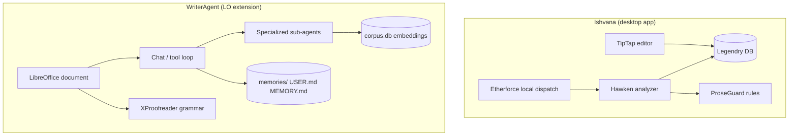

# Ishvana vs WriterAgent — feature analysis and implementation map

**Status:** Point-in-time analysis (2026-06-17)  
**Source:** [ishvana.com](https://ishvana.com/) product pages (homepage, Legendry, ProseGuard, Hawken)  
**Audience:** Developers planning fiction/worldbuilding features in WriterAgent without rebuilding Ishvana wholesale.

---

## 1. Executive summary

[Ishvana](https://ishvana.com/) is a **standalone desktop writing studio** for long-form fiction: a TipTap-based editor with a structured world database (**Legendry**) at the center, deterministic style linting (**ProseGuard**), read-only prose analysis (**Hawken**), and bundled **local** agent dispatch (**Etherforce**). Everything reads from one lore graph so entity detection, character knowledge, voice rules, and consistency checks stay aligned.

**WriterAgent** is a **LibreOffice extension** (Python + UNO): the document *is* LibreOffice Writer/Calc/Draw, chat is a sidebar tool loop, and LLM calls go through configurable HTTP endpoints (OpenRouter, local, etc.). You already ship pieces Ishvana sells as a bundle:

| Ishvana pillar | WriterAgent today | Gap size |
|----------------|-------------------|----------|
| Rich editor + manuscript | LibreOffice Writer (stronger for office workflows) | Low — different UX, not weaker |
| Folder / hybrid search | `document_research` + hybrid `corpus.db` ([embeddings.md](embeddings.md)) | Low–medium |
| Outline / structure | `get_document_tree`, headings, bookmarks ([outline.py](../plugin/writer/outline.py)) | Medium — no seven-level narrative model |
| World database (Legendry) | `USER.md` / `MEMORY.md` ([memory.py](../plugin/chatbot/memory.py)) | **Large** — flat files, not typed lore |
| Deterministic style rules (ProseGuard) | AI grammar proofreader ([realtime-grammar-checker-plan.md](realtime-grammar-checker-plan.md)) | Medium — LLM-based, not rule engine |
| Read-only analysis (Hawken) | Sidebar can edit; no dedicated analysis-only agent | Medium |
| Multi-agent chat (Councils / Writers' Room) | Sub-agent delegation via smol ([smol-main-chat-tool-architecture.md](smol-main-chat-tool-architecture.md)) | Medium — orchestration pattern exists |
| Publishing pipeline | LO export filters | Low–medium |
| Maps / visuals / timelines | Draw tools, image tools | Medium — not lore-linked |

**Strategic takeaway:** Ishvana wins on **fiction-specific data model + deterministic continuity**. WriterAgent wins on **living inside LibreOffice**, **Calc/Draw**, **MCP**, **configurable models**, and **office interoperability**. The highest-leverage port is not a new editor — it is a **Legendry-shaped lore store** that every agent and linter reads, implemented with the least new surface area (SQLite + existing embeddings + memory patterns).

---

## 2. Architectural comparison



| Dimension | Ishvana | WriterAgent |
|-----------|---------|-------------|
| Runtime | Custom Electron/desktop shell | LibreOffice process + UNO |
| Document engine | TipTap v3 | Writer `XText` / ODF |
| Lore storage | Structured DB, 12 entry types | Markdown memory files |
| Search | ChromaDB + substring fallback | FTS5 + sqlite-vec RRF ([embeddings.md](embeddings.md)) |
| Agents | Local handlers, zero per-message cost | User-chosen HTTP endpoints |
| Style checking | Deterministic YAML rules | LLM proofreader + optional chat |
| Privacy | Local-first, one-time purchase | Local docs; LLM calls user-controlled |

---

## 3. Feature-by-feature map

### 3.1 The writing surface (editor)

**Ishvana:** Entity highlighting, `@` lore mentions, `/` slash commands, bubble menu, focus/typewriter mode, regex find/replace, live stats, debounced auto-save, ProseGuard status in chrome.

**WriterAgent today:**

- **Editor:** Full Writer — styles, tracked changes, native find/replace, print layout, comments. See [llm-styles.md](llm-styles.md) for agent HTML ↔ LO styles.
- **Stats:** `get_document_tree` returns `stats` (words, chars, pages, headings) via [outline.py](../plugin/writer/outline.py).
- **Auto-save / crash recovery:** LibreOffice native.
- **Inline assistance:** Sidebar chat, Extend/Edit selection, grammar underlines ([realtime-grammar-checker-plan.md](realtime-grammar-checker-plan.md)).
- **Review UI:** `review_click_popup.py` registers contextual popups on proofreading marks.

**Implementation path (smallest diff):**

| Feature | Approach | Touch points |
|---------|----------|--------------|
| Entity highlighting | Background NER against lore aliases; apply LO character styles or conditional fields | New `plugin/writer/entity_highlight.py`; lore alias index from §3.5 |
| `@` mentions | Sidebar autocomplete or insert linked bookmark + optional margin note | Chat input + `plugin/writer/bookmarks.py` patterns |
| `/` slash commands | Map to sidebar quick actions or UNO dispatch macros (headings, scene break, insert lore snippet) | [panel.py](../plugin/chatbot/panel.py) command palette or Writer menu |
| ProseGuard status bar | Aggregate rule violations per paragraph; show count in sidebar header | Rule engine §3.7 |
| Typewriter / focus | Document LO **View → Typewriter scrolling**; optional sidebar hide | Settings toggle only — no code required for baseline |

**Do not build:** A TipTap replacement. LibreOffice *is* the editor moat for your users.

---

### 3.2 Document management

**Ishvana:** Nested folders, hybrid search, five status states (Draft → Published), Pandoc import/export.

**WriterAgent today:**

- **Same-folder discovery:** `list_nearby_files`, `delegate_read_document` ([multi-document-dev-plan.md](multi-document-dev-plan.md)) — shipped Phase 0.
- **Hybrid search:** `search_nearby_files` when Vector Search enabled ([embeddings.md](embeddings.md)).
- **Cross-app:** Writer main agent can pull Calc/Draw siblings via `document_research`.

**Implementation path:**

| Feature | Phase | Approach |
|---------|-------|----------|
| Project folder hierarchy | 1 | Treat **one directory** as a “novel project”; optional `project.json` manifest listing logical roles (`manuscript/`, `world/`, `notes/`) — extend [nearby.py](../plugin/doc/nearby.py) with manifest-aware listing |
| Document status dots | 1 | Store `status` in ODF user-defined properties or sidecar `.writeragent-meta.json` per file; filter in `list_nearby_files` |
| Semantic “about” search | **Shipped** | Reuse `corpus.db`; index lore entries as additional corpus sources (§3.5) |
| Pandoc round-trip | 2 | Optional external `pandoc` tool via [venv scripting](../plugin/scripting/) — LO already exports DOCX/PDF/HTML natively |

**Reuse:** Embeddings indexer already chunks ODF/OOXML/plain text ([embeddings_fs.py](../plugin/embeddings/embeddings_fs.py)). Add a `source_kind: lore|manuscript` column rather than a second index.

---

### 3.3 Outline and structure

**Ishvana:** Seven levels (Series → Beat), four views (detail/grid/reading/matrix), POV per scene, linked documents, entity references per node.

**WriterAgent today:**

- Heading tree + bookmarks: `get_document_tree`, `get_heading_children`.
- **Writing Plan** sidebar mode: multi-turn planning sub-agent ([send_handlers.py](../plugin/chatbot/send_handlers.py)).
- **Brainstorming** mode: approved HTML design specs into the doc ([brainstorming-mode.md](brainstorming-mode.md)).

**Gap:** Writer headings are **one manuscript**; Ishvana’s outline is a **parallel project graph** spanning many files.

**Implementation path:**

1. **Outline store (SQLite or JSON next to project manifest)**  
   Schema sketch:

   ```text
   outline_node(id, parent_id, kind, title, pov, target_words, linked_doc_url, sort_key)
   outline_entity(node_id, lore_entry_id, role)
   ```

2. **Tools (specialized domain `narrative` or extend `writing_plan`):**  
   `get_outline_tree`, `link_outline_to_document`, `set_scene_pov`, `get_scene_entities`.

3. **Matrix view:** Cross-tab lore entry × scene — same data as Ishvana’s Character Knowledge matrix (§3.5); render in a UNO dialog ([dialogs.py](../plugin/chatbot/dialogs.py)) or export HTML to Writer.

4. **Reading mode:** `get_document_content` concatenation following outline order — no new editor.

**Leverage:** [lo-dom-semantic-tree.md](lo-dom-semantic-tree.md) for stable addressing; bookmark tools for deep links.

---

### 3.4 Edit module (five phases)

**Ishvana:** Baseline → Developmental → Line → Copy → Proofread, with editorial letter and Publishing Readiness Score.

**WriterAgent today:**

- **Copy/grammar:** Native `XProofreader` pipeline (shipped).
- **Chat editorial:** Sidebar can explain and rewrite (non-deterministic).
- **Tracked changes:** Writer native — good for line/copy edit workflows.

**Implementation path:**

| Phase | WriterAgent mapping |
|-------|---------------------|
| Baseline | Snapshot: duplicate doc to `versions/` or ODF version property + hash |
| Developmental | New **read-only** sub-agent `manuscript_review` — structured report only (Hawken pattern §3.8) |
| Line edit | ProseGuard + grammar + optional humanizer skill ([hermes-agent-patterns.md](hermes-agent-patterns.md)) |
| Copy edit | Style guide in lore + grammar; Chicago/AP as prompt packs in `skills/` |
| Proofread | Deterministic spell-variant scan (Python) + grammar pass |

Store `edit_phase` on document user-defined property; gate which tools run in sidebar system prompt.

---

### 3.5 Legendry (worldbuilding database) — **highest priority**

**Ishvana:** Twelve typed entry kinds (Character, Location, Faction, …), relationship graph, voice profiles, visibility (known/unknown/secret), semantic search, lore ingestion from raw notes.

**WriterAgent today:**

- `USER.md` / `MEMORY.md` — unstructured ([memory.py](../plugin/chatbot/memory.py)).
- Librarian onboarding seeds preferences ([librarian-agentic-onboarding.md](librarian-agentic-onboarding.md)).
- Hybrid search over **files**, not lore records.

**Proposed: `legendry.db` (or `lore/` folder of typed JSON + SQLite index)**

Keep complexity low by mirroring embeddings storage layout:

```text
~/Novels/MySeries/
  manuscript/ch03.odt
  writeragent_project/
    legendry.db          # entries, relationships, voice profiles
    corpus.db            # existing embeddings (index lore + manuscripts)
    project.json         # manifest, edit phases, outline root id
```

**Schema (minimal):**

| Table | Purpose |
|-------|---------|
| `entries` | `id`, `type`, `name`, `slug`, `body_md`, `visibility`, `tags_json` |
| `fields` | Typed key-values per entry (`faction`, `location`, …) |
| `relationships` | `src_id`, `dst_id`, `rel_type` (ally, parent, …) |
| `voice_profiles` | `entry_id`, `dialect`, `tics`, `vocabulary_level`, `rules_yaml` |
| `aliases` | `entry_id`, `alias` — for entity detection |

**Tools (tier `core` when project mode on, else specialized `lore`):**

- `list_lore_entries`, `get_lore_entry`, `upsert_lore_entry`, `link_lore_relationship`
- `search_lore` — FTS on name/alias/body + vector search via shared `corpus.db` chunk rows keyed by `entry_id`
- `ingest_lore_notes` — one-shot LLM extraction → staged entries for user approve (like librarian handoff)

**Injection:** Extend `get_chat_system_prompt_for_document` with `[LORE CONTEXT]` snippets (top-k entries matching current selection/scene), same pattern as `[DOCUMENT CONTENT]`.

**Indexing:** On `upsert_lore_entry`, enqueue embedding maintain job — reuse [embeddings_service.py](../plugin/framework/client/embeddings_service.py).

**UI (later):** Settings-adjacent “World” dialog: list/card views; graph view is Phase 2 (export GraphML or simple UNO Draw diagram via [shapes.py](../plugin/writer/shapes.py)).

---

### 3.6 Entity detection and Character Knowledge

**Ishvana:** Inline detection while typing; matrix of what each character knows per scene; catches knowledge violations.

**WriterAgent today:** No fiction entity pipeline.

**Implementation path:**

1. **Detection (deterministic first):** Match `aliases` table with word-boundary scan on paragraph text — fast, reproducible. Optional LLM pass for nicknames (off by default).
2. **Scene ↔ entity map:** When outline node links to `doc_url` + heading bookmark, run detection once per save; store `scene_entities(scene_id, entry_id, confidence)`.
3. **Character knowledge:**  
   `knowledge_facts(id, entry_id, fact_text, learned_at_outline_node_id, visibility)`  
   Matrix query = join characters × scenes × facts.

4. **Violation checker:** Pure function: for each dialogue paragraph, attributed character + facts referenced in text must ⊆ `knowledge_facts` visible at scene time. Surface as ProseGuard **Continuity** rule (§3.7).

5. **Tools:** `get_character_knowledge_matrix`, `assert_character_knows`, `record_knowledge_event`.

**Tests:** Unit tests with fixture lore + sample scenes; no UNO required for matrix logic.

---

### 3.7 ProseGuard (deterministic style rules)

**Ishvana:** YAML rulesets, scopes (project → document → scene → character), categories (structural, stylistic, semantic, continuity, machine tells), stable results.

**WriterAgent today:**

- LLM grammar proofreader — powerful but **non-deterministic** across models/runs.
- No user-defined rule DSL.

**Implementation path:**

1. **Rule engine module:** `plugin/writer/prose_rules/`  
   - Load YAML → compiled predicates (regex, counts, thresholds).  
   - No LLM in the hot path.  
   - Same input → same violations (golden tests).

2. **Scopes:** Resolve effective rules by walking: global project YAML → doc property overrides → outline scene id → speaking character voice profile rules.

3. **Integration surfaces:**  
   - **Native:** Optional second `XProofreader` or batch scan command.  
   - **Agent:** `run_prose_rules` tool returns JSON violations; Hawken reads them (§3.8).  
   - **Chat:** Inject active rules into system prompt when user enables “style coach”.

4. **Starter packs:** Ship `rules/machine_tells.yaml`, `rules/dialogue.yaml` — Ishvana’s differentiator for AI-assisted drafts.

5. **Continuity rules:** Wire to lore aliases + character knowledge (§3.6).

**Avoid:** Replacing grammar proofreader — ProseGuard complements it (style/continuity), not duplicate spelling.

---

### 3.8 Hawken (read-only writing analyst)

**Ishvana:** Scene/chapter/manuscript scans; metrics (FK grade, adverb density); sentiment curve; register classification; PDF editorial report; never edits prose; reproducible.

**WriterAgent today:**

- Main chat **can** apply edits (`apply_document_content`).
- No analysis-only agent with structured sub-reports.

**Implementation path:**

1. **New specialized domain `prose_analysis`** (or `hawken`) — smol sub-agent with **no write tools**, only:
   - `scan_scene`, `scan_chapter`, `scan_manuscript`
   - `get_style_metrics` (deterministic Python in venv: textstat, adverb regex, etc.)
   - `get_proseguard_findings`
   - `get_lore_contradictions`
   - `compose_editorial_report` → Markdown/HTML in chat or new Writer doc

2. **Strictness:** Map to config enum `off|low|medium|high` filtering severities — same knob as Ishvana.

3. **Register / audience:** Prompt parameters only — no need for 14 hard-coded enums on day one; start with `register` + `audience` strings in tool schema.

4. **Manuscript theme detection (later):** Reuse embeddings clustering in venv (`sklearn` already in sandbox policy) — optional Phase 2.

5. **Sidebar mode:** Dropdown entry **Manuscript Review** alongside Brainstorming / Writing Plan — routes Send to analysis handler ([brainstorming-mode.md](brainstorming-mode.md) pattern).

**Invariant:** Sub-agent system prompt: *“Never call apply_document_content or editing tools; output reports only.”*

---

### 3.9 Chat, Hawken, Councils, Etherforce

| Ishvana | WriterAgent mapping |
|---------|---------------------|
| **Chat** with @-mentions | Main sidebar + lore tools; inject mentioned entries into turn context |
| **Hawken** | §3.8 `prose_analysis` domain |
| **Councils** (World / Character / Creative) | Parallel smol runs: `run_council(session, roster=[...])` → merge reports; use [worker_pool.py](../plugin/framework/worker_pool.py) |
| **Writers' Room** (parallel agents) | Three `run_in_background` sub-agents + drain on main thread ([streaming-and-threading.md](streaming-and-threading.md)) |
| **Etherforce** (local dispatch) | User’s local endpoint in Settings; optional offline model via Ollama/LM Studio — already supported by [llm_client.py](../plugin/framework/client/llm_client.py) |

**Council implementation sketch:**

```python
# Pseudocode — orchestrator tool, not parallel HTTP in one agent
reports = []
for role in ("world", "character", "prose"):
    reports.append(delegate_to_specialized_writer_toolset(domain=role, task=brief))
return synthesize_council_report(reports)
```

Use **separate domains** with tight tool allowlists (lore read vs. outline vs. prose rules) instead of one mega-prompt.

---

### 3.10 Creative modules (maps, plot, timeline, language, publish, visuals)

| Module | Ishvana | WriterAgent path |
|--------|---------|------------------|
| **Maps** | Pins, polygons, lore-linked | Draw page per map; `CreateShape` + custom properties linking `lore_entry_id`; [draw/shapes.py](../plugin/draw/shapes.py) |
| **Plot Studio** | Beat sheets, Chekhov tracking | Extend outline store with `plot_thread`, `beat_kind`, `promised_payoff` fields; tools `track_foreshadowing` |
| **Timeline Studio** | Swimlanes, fantasy calendars | Calc sheet or SQLite `events` table + optional Draw swimlane export |
| **Language Studio** | Conlang phonology | Lore `type=language` entries + venv script to generate words from rules |
| **Magic System** | Stats, dice, probability | [venv sandbox](../plugin/scripting/sandbox.py): numpy probability helpers as trusted module |
| **Visual Studio** | Asset boards | `list_nearby_files(file_kind=images)` + link to lore entries; insert via [image_tools.py](../plugin/writer/image_tools.py) |
| **Publish** | Print-ready PDF templates | Writer PDF export + template ODT styles; `publish_compile` tool merges outline-ordered subdocs |
| **Lorekeeper** | Anomaly detection | Scheduled job: diff new scenes against lore facts + knowledge matrix; findings → ProseGuard continuity |
| **World Knowledge** | Real-world fact check | `web_research` + compare against lore `axioms` field ([agent-search.md](agent-search.md)) |
| **Analytics** | Streaks, goals | Append-only `writing_log` in project folder; sidebar widget or Calc dashboard |

**Priority:** Maps and Plot tie directly to outline + lore (Phase 2). Language Studio and Magic System are niche — ship as lore types + scripting hooks, not bespoke UIs.

---

## 4. Phased implementation plan

Aligned with **least code / reuse existing patterns** ([AGENTS.md](../AGENTS.md)).

### Phase 0 — Project shell (1–2 weeks)

- [ ] `project.json` manifest beside `writeragent_embeddings/`
- [ ] Document status + edit phase as ODF user-defined properties
- [ ] Prompt injection: optional `[PROJECT CONTEXT]` from manifest

**Files:** [nearby.py](../plugin/doc/nearby.py), [config.py](../plugin/framework/config.py), [constants.py](../plugin/framework/constants.py)

### Phase 1 — Legendry MVP (2–4 weeks)

- [ ] `legendry.db` schema + CRUD tools
- [ ] Index lore entries into existing `corpus.db`
- [ ] `search_lore` + chat injection for top-k entries
- [ ] `ingest_lore_notes` staged import
- [ ] Tests: `tests/writer/test_legendry.py`

### Phase 2 — Continuity core (2–3 weeks)

- [ ] Alias-based entity detection on save or on demand
- [ ] Outline store + link to headings/bookmarks
- [ ] Character knowledge tables + matrix tool
- [ ] ProseGuard YAML engine (structural + continuity starters)

### Phase 3 — Hawken + edit phases (2–3 weeks)

- [ ] `prose_analysis` sub-agent (read-only)
- [ ] Deterministic metrics in venv
- [ ] Sidebar **Manuscript Review** mode
- [ ] Editorial report → HTML in chat or new doc

### Phase 4 — Polish & parity niceties (ongoing)

- [ ] Council orchestrator tool
- [ ] Draw map linking
- [ ] Plot beat / foreshadowing tools
- [ ] Publishing compile from outline
- [ ] Optional graph view for relationships

---

## 5. What not to port

| Ishvana feature | Reason to skip or defer |
|-----------------|-------------------------|
| TipTap editor / slash palette | LibreOffice is the product surface |
| Bundled zero-config local AI | Users already pick endpoints; document Ollama in settings |
| Single $99 app packaging | WriterAgent is GPL extension + user-supplied models |
| Full Visual Studio / Language Studio UI | High UI cost; lore types + scripts cover 80% |
| Theme modeling UMAP pipeline | Phase 4+; embeddings + clustering sufficient for MVP |
| Reddit-style “machine tells” moralizing | Ship rules as optional YAML, not preachy defaults |

---

## 6. Testing strategy

Per [AGENTS.md](../AGENTS.md): every new module gets pytest coverage.

| Area | Test approach |
|------|---------------|
| Legendry CRUD / search | `tests/writer/test_legendry.py` — temp DB, no UNO |
| ProseGuard rules | Golden files: input text + YAML → fixed violation list |
| Knowledge matrix | Fixture lore + scenes → violation cases |
| Entity detection | Alias list edge cases (Unicode, apostrophes) |
| Hawken metrics | venv textstat against known paragraphs |
| UNO integration | `tests/writer/test_*_uno.py` for highlight/ODF properties |

Run `make test` before marking phases complete.

---

## 7. Documentation updates

When implementing, add focused topic docs (do not bloat this file):

| Topic | New doc |
|-------|---------|
| Legendry schema + tools | `docs/legendry.md` |
| ProseGuard YAML | `docs/prose-rules.md` |
| Fiction project layout | `docs/fiction-project.md` |
| Hawken / analysis agent | `docs/prose-analysis-agent.md` |

Link from [ROADMAP.md](ROADMAP.md) when a phase ships.

---

## 8. Competitive positioning

**Pitch for WriterAgent + fiction stack:**

- Keep manuscripts in **real ODF/DOCX** with LibreOffice publishing, Calc budgets, Draw maps.
- Add Ishvana-class **lore + continuity** without leaving the office suite.
- Use **any model** (cloud or local) instead of a bundled engine.
- **MCP** ([mcp-protocol.md](mcp-protocol.md)) exposes lore and search to external tools — Ishvana is siloed.

**Pitch honesty:** Ishvana ships a cohesive fiction UX today; WriterAgent would be **assembly required** until Phase 2–3 land. The architecture above closes that gap without forking LibreOffice.

---

## 9. Related docs

- [embeddings.md](embeddings.md) — hybrid search (Ishvana Chroma analogue)
- [multi-document-dev-plan.md](multi-document-dev-plan.md) — sibling file workflows
- [hermes-agent-patterns.md](hermes-agent-patterns.md) — memory/skills (Legendry precursor)
- [librarian-agentic-onboarding.md](librarian-agentic-onboarding.md) — conversational lore ingest pattern
- [brainstorming-mode.md](brainstorming-mode.md) — sidebar-only sub-agent modes
- [realtime-grammar-checker-plan.md](realtime-grammar-checker-plan.md) — native grammar surface
- [smol-main-chat-tool-architecture.md](smol-main-chat-tool-architecture.md) — sub-agent delegation
- [onlyofficeai_analysis.md](onlyofficeai_analysis.md) — similar competitive analysis format

---

## 10. Changelog

| Date | Change |
|------|--------|
| 2026-06-17 | Initial analysis from ishvana.com homepage + Legendry, ProseGuard, Hawken feature pages |