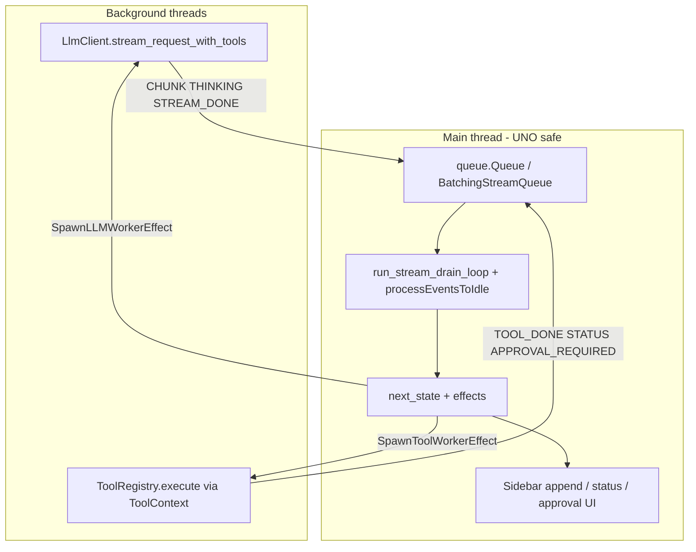

# Langchain & smolagents Integration Plan for WriterAgent

This document outlines a phased development plan to integrate ideas from `langchain-core` / `langchain-community` and adapt code from `smolagents` into WriterAgent. It also records **why full LangChain agent orchestration is not a fit** for the main sidebar chat loop.

> **Status (2026-06):** Most of **Phase 1–2** and **smolagents sub-agent isolation** are **already shipped** without `langchain-core`. See [What is already implemented](#what-is-already-implemented-2026-06) and [What is still worth doing](#what-is-still-worth-doing-next). Full LangChain wiring is **optional**, not a prerequisite for the remaining roadmap.
>
> **Agent orchestration decision (2026-06):** Replacing the main chat tool loop with LangChain `create_tool_calling_agent` / `AgentExecutor` (or LangChain 1.0 `create_agent`) is **not recommended**. Treat LangChain repos as a **reference library** for vendoring small pieces — not as a runtime dependency for sidebar chat. See [Why not LangChain agent orchestration for main chat?](#why-not-langchain-agent-orchestration-for-main-chat).

## Goal Description

Enhance WriterAgent's AI capabilities with robust memory, tools, and agentic features — using **shipped replacements** (`ChatSession`, `tool_loop`, smolagents sub-agents) where they already work, and **vendoring or adapting** LangChain/community code only when a concrete feature needs it.

LangChain is **not** the target architecture for the LibreOffice extension runtime. The extension ships with minimal dependencies (`pyproject.toml` has no `langchain-core`); heavy packages (LangGraph, sentence-transformers, etc.) belong in the **user venv** when needed (embeddings, `=PYTHON()`), not in-process with UNO.

---

## What is already implemented (2026-06)

| Planned item | Shipped replacement | Entry points |
|--------------|---------------------|--------------|
| In-memory + persistent chat history | `ChatSession` + `SQLite3History` / `JSONHistory` fallback | [`plugin/chatbot/panel.py`](../plugin/chatbot/panel.py), [`plugin/chatbot/history_db.py`](../plugin/chatbot/history_db.py) |
| Session keyed by document | `WriterAgentSessionID` on document model (URL hash fallback) | [`plugin/chatbot/panel_factory.py`](../plugin/chatbot/panel_factory.py) |
| Document context per send (separate from history) | `get_document_context_for_chat` + `session.set_system_context` | [`plugin/chatbot/tool_loop.py`](../plugin/chatbot/tool_loop.py), [`plugin/doc/document_helpers.py`](../plugin/doc/document_helpers.py) |
| Custom tool-calling loop (not LangChain `AgentExecutor`) | `ToolCallingMixin` / `tool_loop.py` + `LlmClient` | [`plugin/chatbot/tool_loop.py`](../plugin/chatbot/tool_loop.py), [`plugin/chatbot/tool_loop_state.py`](../plugin/chatbot/tool_loop_state.py) |
| Smolagents sub-agents (web research, librarian, specialized) | `web_research`, delegate gateways, `librarian_onboarding`; final answer only in main history | [`plugin/chatbot/web_research.py`](../plugin/chatbot/web_research.py), [`plugin/chatbot/librarian.py`](../plugin/chatbot/librarian.py), [`plugin/doc/specialized_base.py`](../plugin/doc/specialized_base.py) |
| Long-term user profile memory (partial) | `upsert_memory` → JSON in `USER.md`; librarian injects profile | [`plugin/chatbot/memory.py`](../plugin/chatbot/memory.py) |
| Scientific Python / NumPy (out-of-process) | Warm venv worker (`run_venv_python_script`, `=PYTHON()`) | [enabling_numpy_in_libreoffice.md](enabling_numpy_in_libreoffice.md) |

**Not in `pyproject.toml`:** `langchain-core` — the sidebar does not depend on it today.

**Legacy doc names:** Older plans referred to `chat_panel.py` and `core/api.py`. Main chat lives in [`panel.py`](../plugin/chatbot/panel.py) (`SendButtonListener`) + [`tool_loop.py`](../plugin/chatbot/tool_loop.py) (`ToolCallingMixin`).

---

## Why not LangChain agent orchestration for main chat?

This section records the outcome of a 2026-06 review of replacing the custom tool loop with LangChain's agent APIs (`create_tool_calling_agent` + `AgentExecutor`, or the LangChain 1.0 successor `create_agent` on LangGraph).

**Verdict: do not pursue.** LangChain is useful here only as a **source of ideas and vendorable code** — not as the sidebar's agent runtime.

### What the current loop actually is

The main chat path is **not** a thin `while tool_calls: execute` wrapper. It is a **pure FSM** in [`tool_loop_state.py`](../plugin/chatbot/tool_loop_state.py) (`next_state` → effects) driven by [`tool_loop.py`](../plugin/chatbot/tool_loop.py) on the **LibreOffice main thread**:



Rough size: ~860 lines (`tool_loop.py`) + ~430 lines (`tool_loop_state.py`) + ~900 lines of tests (`tests/chatbot/test_tool_loop.py`). See also [streaming-and-threading.md](streaming-and-threading.md) and [smol-main-chat-tool-architecture.md](smol-main-chat-tool-architecture.md).

### Behaviors LangChain agent executors do not provide out of the box

| Capability | Where it lives | Why it matters |
|------------|----------------|----------------|
| Main-thread UNO drain | `run_stream_drain_loop` + `get_toolkit().processEventsToIdle()` | Tools mutate live LO documents; UI must stay responsive |
| Producer-side stream batching | `BatchingStreamQueue` | Smooth sidebar typing without flooding UNO events |
| Reasoning / thinking tokens | `StreamQueueKind.THINKING`, `reasoning_replay` | Models show `[Thinking]` before the answer |
| Stop / cancellation | `resolve_stop_checker()`, `_send_cancellation` | Stop must reach background LLM + tool workers |
| Async tools | `web_research`, `generate_image` in background threads | Long-running tools without freezing the sidebar |
| Human-in-the-loop web approval | `APPROVAL_REQUIRED` + `begin_inline_web_approval` | Inline Accept/Change/Reject before search |
| Sub-agent streaming into sidebar | `chat_append_callback` → queue `CHUNK` | Delegate/web_research streams steps into chat |
| Dynamic tool list per round | `_refresh_active_tools_for_session()` | In-place specialized mode swaps schemas mid-loop |
| Document context refresh after edits | `UpdateDocumentContextEffect` | `[DOCUMENT CONTENT]` updates after mutations |
| Max-round exhaustion fallback | `SpawnFinalStreamEffect` → no-tools final stream | Forces a natural-language answer when tool budget is spent |
| Audio input + STT fallback | Native audio in user message; `_transcribe_audio` retry | Endpoint audio support varies |
| Rich sidebar finalize | `finalize_sidebar_assistant_response` | HTML formatting pass after stream completes |

The `execute_fn` closure in `tool_loop.py` wires many `ToolContext` callbacks (approval, status, thinking, domain switching, brainstorming, cancellation) before `ToolRegistry.execute` — that is application logic, not generic agent plumbing.

### LangChain API status (2025–2026)

The classic pattern cited in early plans:

```python
from langchain.agents import create_tool_calling_agent, AgentExecutor
```

is **legacy in LangChain 1.0** (Oct 2025). `create_tool_calling_agent` / `AgentExecutor` moved toward **`langchain-classic`**. The recommended upstream path is **`create_agent`** (built on **LangGraph**), with **middleware** for customization. Even a greenfield LangChain integration today would not use `AgentExecutor` directly.

LangChain's own split:

- **LangChain `create_agent`** — fast default loop (model → tools → response), middleware for HITL/summarization
- **LangGraph** — fine-grained control, durable state, complex workflows

WriterAgent's main chat needs **LangGraph-level control** (threading, UNO, dynamic tools) but **without** adopting LangGraph as an in-extension dependency — so we already implemented that control as `tool_loop` + `tool_loop_state`.

### What a LangChain swap would still require

Even with `WriterAgentLangChainModel` (a planned `BaseChatModel` wrapper around `LlmClient`, never shipped), you would need to reimplement most of the table above as **custom middleware** or adapters:

1. **`LlmClient` wire policy** — 50ms pacing, `<|…|>` token stripping, Anthropic/Gemini shims, fallback parsers, `merge_openrouter_chat_extra`
2. **`ToolBase` → LangChain tools** — map `ToolContext` (UNO `doc`, `ctx`, callbacks) to `StructuredTool`
3. **Threading bridge** — LLM/tools on workers, **all UI on main thread** via queue drain (LangChain knows nothing about `processEventsToIdle()`)
4. **Streaming protocol** — `StreamQueueKind` queue, batching, tool-thinking lines, research cache formatting
5. **Packaging** — `langchain` + `langgraph` in the OXT vs. LO's bundled Python; conflicts with minimal-deps policy

Net effect: **~2,200 lines of tested loop code** replaced by **LangChain + a comparable amount of custom middleware** that replicates the same FSM.

### Two agent stacks already exist

WriterAgent deliberately runs **two orchestration idioms** sharing one HTTP client ([smol-main-chat-tool-architecture.md](smol-main-chat-tool-architecture.md)):

| Stack | Role | Runtime |
|-------|------|---------|
| **Main chat** (`tool_loop`) | Sidebar, OpenAI-shaped history, streaming FSM | `LlmClient` + UNO drain |
| **Smolagents** (`ToolCallingAgent`) | Web research, librarian, specialized delegates | `WriterAgentSmolModel` → same `LlmClient` |

Explicit rule from that doc: **do not merge `tool_loop` with `ToolCallingAgent`** — different transcript semantics. Adding LangChain `AgentExecutor` would introduce a **third** idiom.

Multi-step autonomous work (Phase 5's original goal) is already covered: main chat calls `delegate_to_specialized_*_toolset` → smol sub-agent → result folded into main history without ReAct pollution.

### Cost/benefit summary

| Criterion | Custom `tool_loop` | LangChain `AgentExecutor` / `create_agent` |
|-----------|-------------------|---------------------------------------------|
| LO UI responsiveness | Purpose-built | Requires custom bridge |
| Tool registry + UNO | Native `ToolContext` | Adapter + middleware |
| Streaming UX | Queue + batching + thinking | Callback rewrite |
| Extension dependencies | Zero LangChain | `langchain-core` + likely `langgraph` |
| Test coverage | ~900 lines in `test_tool_loop.py` | Would restart from zero |
| Multi-step agents | Delegates → smol sub-agents | Duplicates smol path |
| Maintenance | ~1.3k LOC FSM you own | FSM replicated inside middleware |

### How LangChain *is* appropriate for this project

Use LangChain repos as a **reference implementation library**, consistent with the vendoring strategy below:

- Copy **small, stdlib-friendly** pieces (text splitters, summarization prompts, chat-history schema ideas)
- Run **LangGraph in the user venv only** for embeddings ingest/search ([embeddings.md](embeddings.md)) — not in the LibreOffice process
- Keep **`LlmClient` as the single HTTP wire** for all in-process agents (main chat + smol)
- Borrow **middleware concepts** (HITL, summarization) as design patterns implemented in `tool_loop` / `ChatSession`, not as imports

**Do not** add `langchain-core` to the extension solely to replace `tool_loop.py`.

---

## What is still worth doing (next)

Prioritized by leverage vs. complexity. **Do not** re-implement Phases 1–2 via LangChain unless you explicitly want that dependency.

| Priority | Item | Why it matters | Suggested approach |
|----------|------|----------------|-------------------|
| **1** | **Inject `USER.md` into main chat** (Hermes-style read path) | Model sees prefs without `upsert_memory` / `read` calls; librarian already injects for onboarding only | Append `[USER PROFILE]` block in `get_chat_system_prompt_for_document` or `set_system_context`; keep `upsert_memory` for writes |
| **2** | **Chat history summarization** (old Phase 3) | Very long sidebar sessions can exceed model context even when document excerpt is capped at 8k | Token/char budget on `session.messages`; when over threshold, one summarizer LLM call replaces oldest turns with a single summary message (persist via `history_db`). *Optional:* vendor summarization logic from LangChain as reference — do not adopt `ConversationSummaryBufferMemory` as a dependency |
| **3** | **Local embedder + routing** | MVP: `sentence-transformers` in venv; cloud HTTP tier-two | See [embeddings.md](embeddings.md) — Phase A bench + `embedding_client.py` |
| **4** | **Document embeddings index** (old Phase 4, retrieval) | Outer document_research: semantic find instead of grep; minimal locator cache | See [embeddings.md](embeddings.md) |
| **5** | **Background memory reviewer** | Passive “should we save this?” without burdening main tool loop | Optional second LLM pass after reply (Hermes pattern); uses `MemoryStore` in code, not extra main-chat tools |
| **6** | **Skills tools** | Procedures on disk; guidance exists in constants | Register [`plugin/chatbot/skills.py`](../plugin/chatbot/skills.py) when ready; optional index injection like memory |
| **Low** | **Full `langchain-core` integration** | Runnable chains, ecosystem interop | Only if an external integration explicitly requires it; duplicates working `ChatSession` + `tool_loop` |

**Explicitly deprioritized / rejected:**

- Replacing `tool_loop.py` with LangChain `create_tool_calling_agent` / `AgentExecutor` or LangChain 1.0 `create_agent`
- Shipping `WriterAgentLangChainModel` for main sidebar chat (unless a future *non-sidebar* use case needs LangChain interop)
- Installing `langchain-community` as an extension dependency

---

## Proposed Changes

### Phase 1: Foundation & Short-Term Memory — **DONE (without LangChain)**
**Objective**: Introduce `langchain-core` and implement basic `ConversationBufferMemory` for the current session's chat.

> **Superseded:** `ChatSession` + `history_db.py` fulfill this phase. Skip LangChain `ConversationBufferMemory` unless you adopt `langchain-core` for other reasons.

- **Dependency Management**:
  - Add `langchain-core` (and potentially `langchain` or specific provider packages) to the project requirements.
  - Ensure compatibility with LibreOffice's bundled Python environment.
- **Refactor (legacy `core/api.py` plan)**:
  - A custom LangChain `BaseChatModel` wrapper (`WriterAgentLangChainModel`) around `LlmClient` was planned to avoid heavy provider packages. **Not shipped**; `LlmClient` remains the direct path for main chat and smol.
  - Introduce `ConversationBufferMemory` to automatically manage the message history.
- **Update main chat panel (`panel.py` + `tool_loop.py`)**:
  - Instead of rebuilding the context string manually via `get_document_context_for_chat` with every message, inject the document state as a dynamic system prompt or context variable within a LangChain `Runnable` or `Chain`.

> **Shipped instead:** `ChatSession.set_system_context(base_prompt, doc_text)` replaces the system message each send; no LangChain `Runnable` required.

### Phase 2: Persistent Conversation History — **DONE**
**Objective**: Allow chats to persist across LibreOffice restarts.

> **Shipped:** `writeragent_history.db` (SQLite) with per-`session_id` rows; JSON fallback when `sqlite3` unavailable. Clear via session API / UI wiring as implemented in the panel.

- **Storage Mechanism**:
  - Implement a local storage solution (e.g., a simple JSON file per document URL under `~/.config/libreoffice/4/user/config/writeragent_chat_history/` or an **SQLite database** — Python’s `sqlite3` is stdlib on all major OSes, so no extra dependency).
  - Use LangChain's `BaseChatMessageHistory` interface (e.g., `FileChatMessageHistory` or a custom implementation) to load and save messages.
- **Session Management**:
  - Tie conversation histories to document URLs (`doc.getURL()`).
  - Add a "Clear History" button to the chat sidebar.

### Phase 3: Token Management & Summarization Memory
**Objective**: Prevent the conversation history from exceeding the LLM's context window during long sessions.

- **Summarization**:
  - Implement char/token budget on `ChatSession.messages`; when over threshold, one summarizer LLM call collapses oldest turns (persist via `history_db`).
  - *Reference only:* LangChain `ConversationSummaryBufferMemory` — study for prompt structure; implement against `LlmClient` + `ChatSession`, not as a dependency.
- **Config Updates**:
  - Add settings for `memory_strategy` (Buffer vs. Summary) and `max_memory_tokens`.

### Phase 4: Long-Term Document Memory (RAG) — **NEXT (see embeddings.md)**

**Objective**: Enable cross-document find for **document_research** (outer agent) and optional in-document RAG for huge single files.

> **Canonical plan:** [embeddings.md](embeddings.md) — **one minimal index** (vectors + locators); outer document_research `search_embeddings`; **MVP local embed** via `sentence-transformers` in venv; cloud APIs tier-two; ~60 s incremental maintenance. LangGraph pipelines run **in the user venv only**.

### Phase 5: Agentic Workflows & Multi-Step Reasoning — **DONE (via smolagents, not LangChain)**

**Objective**: Transition from a simple "Chat + Tools" model to autonomous problem solving.

> **Superseded (2026-06):** Do **not** use LangChain `create_tool_calling_agent` / `AgentExecutor` (or `create_agent`) to replace the main chat loop. See [Why not LangChain agent orchestration for main chat?](#why-not-langchain-agent-orchestration-for-main-chat).

**Shipped approach:**

- **Main chat** keeps `ToolCallingMixin` / `tool_loop.py` for sidebar streaming, UNO safety, and OpenAI-shaped history.
- **Multi-step work** uses **smolagents sub-agents** via delegate gateway tools (`delegate_to_specialized_writer_toolset`, etc.) and dedicated tools (`web_research`, librarian onboarding).
- **Human-in-the-loop** for web search is implemented in `tool_loop.py` (`APPROVAL_REQUIRED`, `begin_inline_web_approval`) — not LangChain callbacks.

Example user goal ("Analyze this table, find errors, and format erroneous cells red") flows: main chat → delegate to calc specialized toolset → smol `ToolCallingAgent` with domain tools → structured result back to main history.

Future HITL for destructive document edits, if needed, should extend `ToolContext` / `tool_loop` effects — not adopt LangChain middleware in-process.

## Note: SQLite ships with Python

**`sqlite3` is part of the Python standard library** on all major OSes (Windows, macOS, Linux) in normal CPython builds — no `pip install` required. That opens several storage options without adding dependencies:

- **Phase 2 (persistent chat history)**: SQLite is a natural fit for conversation history (e.g. one table per document URL, or a single DB with a doc key). No extra dependency.
- **Phase 4 (RAG / embeddings)**: Stdlib SQLite does **not** provide vector similarity search. Use SQLite for chunk metadata and FTS5; keep vectors in a float32 sidecar or sqlite-vec in the user venv. See [embeddings.md](embeddings.md).

Keeping this in mind makes it easier to choose stdlib-friendly storage (e.g. SQLite for history and RAG metadata) without pulling in heavier backends.

**Vector extension in stdlib?** As of early 2025 there is **no plan or PEP** to add a vector/similarity-search extension to Python’s standard library. Stdlib `sqlite3` stays as the DB-API interface to stock SQLite; vector search is provided by **loadable extensions** (e.g. `sqlite-vec`, `sqlite-vector`) that are third-party and require `conn.enable_load_extension(True)` and `conn.load_extension(...)`. So for the foreseeable future, “stdlib-only” RAG means our own vector store (binary + JSON, pure-Python or optional NumPy) — we can’t rely on stdlib SQLite gaining vector search.

---

## Research: `langchain-community`

**Value it can add:**
`langchain-community` provides a massive collection of third-party integrations. For WriterAgent, its main value would be ready-made components for Phase 2 (e.g., `SQLChatMessageHistory` to store conversations in SQLite) and Phase 4 (various document loaders, text splitters, and vector store wrappers).

**Dependency weight and NumPy:**
While it offers convenience, `langchain-community` is a very heavy package. A basic `pip install langchain-community` pulls in numerous dependencies including `SQLAlchemy`, `PyYAML`, `requests`, `aiohttp`, `dataclasses-json`, and **`numpy`**.
Because it forces a `numpy` installation (and other heavy libraries) just for the base package, it directly conflicts with our "minimal dependencies" constraint for LibreOffice.

**Conclusion: Vendoring Strategy (reference library, not runtime)**

Treat the [LangChain open-source repository](https://github.com/langchain-ai/langchain) as a **catalog of reference implementations** — same as we already do for smolagents and LangChain text-splitter logic in embeddings docs. When we need specific functionality:

1. Find the relevant upstream file
2. Copy the minimal logic into our tree (vendoring)
3. Adapt for LibreOffice constraints (stdlib `sqlite3`, no SQLAlchemy, UNO threading)

We do **not** plan to depend on `langchain-core` in the extension unless a future feature has no reasonable vendored alternative. LangChain agent orchestration (`AgentExecutor`, `create_agent`) is explicitly **out of scope** for main chat; only **patterns and small utilities** are in scope.

### Vendoring Candidates
Based on a review of the `langchain-community` codebase, here are specific components we can vendor:

- **Database Chat History (`SQLChatMessageHistory`)**: Located in `chat_message_histories/sql.py`. The upstream version is tightly coupled to `SQLAlchemy` to support multiple database engines. We can use its structural design as a reference but rewrite the database interface to use Python's built-in `sqlite3` module, avoiding the `SQLAlchemy` dependency. **Already superseded** by `history_db.py` for sidebar chat.
- **SQLite Vector Store (`SQLiteVec`)**: Located in `vectorstores/sqlitevec.py`. It uses the standard library `sqlite3` and `struct` for storing embeddings as raw bytes. While it relies on the `sqlite-vec` C-extension, we can take its class structure and replace the similarity search backend with our own pure-Python streaming search logic.
- **File/Text Based Components**: Components like `FileChatMessageHistory` (`chat_message_histories/file.py`) and `TextLoader` (`document_loaders/text.py`) have zero external dependencies. They rely solely on standard Python modules like `pathlib` and `json`, and can be copy-pasted almost verbatim if needed.
- **Summarization prompts / memory strategies**: LangChain 1.0 middleware for summarization and HITL are useful **design references** for Phase 3 and future destructive-edit confirmation — implement in `ChatSession` / `tool_loop`, do not import.

#### Future Possibilities (Catalog of Ideas)
While we don't need these immediately for the core LibreOffice integration, the repository contains a massive collection of reference implementations we could vendor if users request specific features:
- **Document Loaders (170+ integrations)**: If we ever want to allow users to load data into LibreOffice from external sources, there are ready-made classes for Cloud Drives (Google Drive, OneDrive, S3), Workspaces (Confluence, Notion, Slack), and file formats (PDFs, ePub, Dataframes).
- **Agent Orchestration (via `smolagents`, not LangChain)**: We vendored and integrated `smolagents` for complex, multi-step **sub-agent** tasks — a lightweight alternative to LangChain/LangGraph **in the extension process**:
  - **ToolCallingAgent & Memory (`smolagents.agents`, `smolagents.memory`)**: Vendored `ToolCallingAgent` and `ActionStep`. Bridged to `LlmClient` via `WriterAgentSmolModel`, allowing autonomous ReAct loops (web search, specialized delegates) without polluting main chat history.
  - **Zero-Dependency Web Tools (`smolagents/default_tools.py`)**: Adapted `DuckDuckGoSearchTool` and `VisitWebpageTool` to use pure `urllib.request` and `html.parser`.
  - **Secure Local Python Execution (`smolagents.local_python_executor`)**: (Future Candidate) AST-based safe eval for calc scripting ideas.
  - **Web Browsing (`smolagents/vision_web_browser.py`)**: Reference for browser automation patterns; would need PyCDP/Marionette for LO constraints.
- **Retrievers (40+ strategies)**: Beyond standard vector search, lexical/hybrid approaches we could adapt for local document search.
- **Third-Party Model Integrations**: Reference plates for expanding `LlmClient` to obscure gateways — we keep a single custom client instead of provider packages.

---

## Architecture Decision: Custom Wrapper vs. Provider Packages

**Main chat and smolagents:** Use `LlmClient` directly. A `WriterAgentLangChainModel` wrapper remains a **hypothetical** option for external LangChain interop only — not for replacing `tool_loop`.

**Rationale:** WriterAgent runs in LibreOffice's constrained Python environment. Keeping the extension dependency-free of `langchain-core` avoids bloat and cross-platform install issues. Custom UI streaming, UNO drain, and wire policy stay in one place ([`llm_client.py`](../plugin/framework/client/llm_client.py)).

**Embeddings / RAG:** See [embeddings.md](embeddings.md) — **sqlite-vec + LangGraph in the user venv only** (ingest + search pipelines); host extension has no langchain dependency. LibreOffice in-process still has no sqlite-vec/FAISS/NumPy encode.

**Agent orchestration:** Main chat = `tool_loop` FSM. Multi-step = smol `ToolCallingAgent`. LangChain `AgentExecutor` / `create_agent` = **not planned**.

Related docs: [smol-main-chat-tool-architecture.md](smol-main-chat-tool-architecture.md), [chat-sidebar-implementation.md](chat-sidebar-implementation.md), [streaming-and-threading.md](streaming-and-threading.md).

---

## Appendix: HNSW and hnsw-lite

Moved to [embeddings.md — Appendix: HNSW and hnsw-lite](embeddings.md#appendix-hnsw-and-hnsw-lite) (optional in-venv ANN for bounded in-RAM subsets).

## Verification Plan
### Automated & Manual Verification
- **Phase 1**: Verify that multi-turn conversations maintain context without manually re-reading the entire chat history in the prompt.
- **Phase 2**: Close a document, reopen it, and verify the chat sidebar restores previous context.
- **Phase 3**: Conduct a very long chat session and verify that older messages are summarized and the LLM does not return context limit errors.
- **Phase 5 (smol path)**: Delegate to specialized toolset / `web_research`; verify sub-agent steps do not corrupt main `ChatSession` transcript shape; verify stop/cancel and web approval still work on main chat.