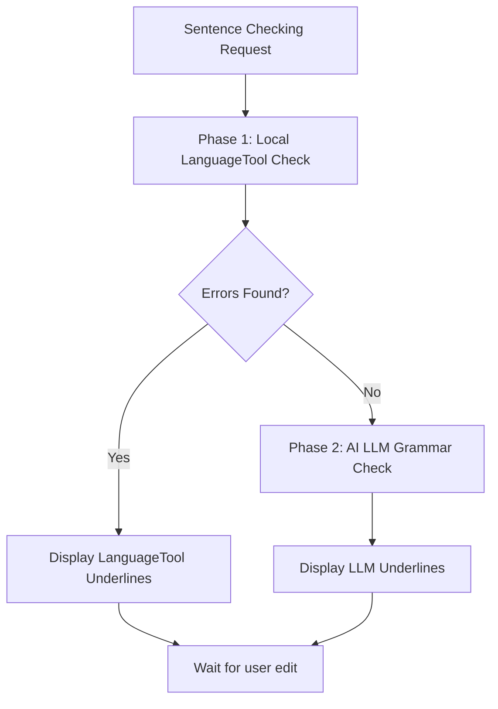

# Development Plan: Offline LanguageTool Integration

This document outlines the detailed development plan to integrate **LanguageTool** as a local, offline grammar checker alternative in WriterAgent, replacing or supplementing the default LLM-based option.

---

## 1. Objectives

1.  **Tri-State Option:** Change the setting `doc.grammar_proofreader_enabled` from a binary checkbox (On/Off) to a choice list: `Off`, `AI (LLM)`, and `LanguageTool (Local)`.
2.  **Backward Compatibility:** Support existing user configurations (`true`/`false`) in `writeragent.json` smoothly, mapping `true` to `llm` and `false` to `off`.
3.  **Venv Subprocess Execution:** Run LanguageTool check processing inside the existing **user virtual environment (`venv`)** using the `language-tool-python` library. This avoids installing Java dependencies or heavy Python packages directly into the LibreOffice embedded environment.
4.  **Robust Error Handling:** Detect missing dependencies (like JRE or `language-tool-python` package) and surface helpful errors to the user instead of silent failures or crashes.

---

## 2. Configuration & Compatibility Design

### Configuration Schema Update
Modify [plugin/doc/module.yaml](file:///home/keithcu/Desktop/Python/writeragent/plugin/doc/module.yaml#L5-L15) to change the widget type:

```yaml
  grammar_proofreader_enabled:
    type: string
    default: "off"
    widget: select
    label: Enable grammar checker (Writer)
    helper: "Off = grammar checks are disabled. LLM = use your configured AI text model/API. LanguageTool = use local LanguageTool server via venv pip package."
    options:
      - value: "off"
        label: "Off"
      - value: "llm"
        label: "AI (LLM)"
      - value: "languagetool"
        label: "LanguageTool (Local)"
```

### Config Helper Implementation
Modify [plugin/framework/config.py](file:///home/keithcu/Desktop/Python/writeragent/plugin/framework/config.py#L393-L395) to handle type coercion transparently:

```python
def is_grammar_enabled() -> bool:
    """True if the grammar checker is enabled on the Doc tab (either LLM or LanguageTool)."""
    val = get_config("doc.grammar_proofreader_enabled")
    if isinstance(val, bool):
        return val  # Handle old boolean config
    val_str = str(val).strip().lower()
    return val_str in ("llm", "languagetool", "true")

def get_grammar_provider() -> str:
    """Return the active grammar provider name ('off', 'llm', or 'languagetool')."""
    val = get_config("doc.grammar_proofreader_enabled")
    if isinstance(val, bool):
        return "llm" if val else "off"
    val_str = str(val).strip().lower()
    if val_str == "true":
        return "llm"
    if val_str in ("llm", "languagetool"):
        return val_str
    return "off"
```

---

## 3. Worker-Side LanguageTool Helper

We will implement a trusted helper script inside the warm venv child process under `plugin/scripting/venv/languagetool.py`. This script will lazily initialize and cache the `LanguageTool` instances per locale to avoid startup overhead on every single check.

### Target Script: `plugin/scripting/venv/languagetool.py`
```python
import logging
from typing import Any, Dict

# Global cache of initialized LanguageTool clients to avoid JVM restart overhead
_LT_CACHE: Dict[str, Any] = {}
log = logging.getLogger("writeragent.grammar")

def run_languagetool_check(text: str, bcp47: str) -> dict:
    """Execute grammar check on text using language_tool_python in the venv."""
    try:
        import language_tool_python
    except ImportError as e:
        return {
            "status": "error",
            "message": "The 'language-tool-python' package is not installed in the venv. "
                       "Please run 'uv pip install language-tool-python' in your configured virtual environment.",
        }

    # Normalize locale code
    bcp47_clean = bcp47.replace("_", "-")
    
    if bcp47_clean not in _LT_CACHE:
        try:
            # Starts local Java server (or queries existing one)
            _LT_CACHE[bcp47_clean] = language_tool_python.LanguageTool(bcp47_clean)
        except Exception as e:
            return {
                "status": "error",
                "message": f"Failed to initialize LanguageTool server for locale {bcp47_clean}. "
                           f"Ensure that Java (JRE) is installed and available in the system PATH. Error: {e}",
            }
            
    tool = _LT_CACHE[bcp47_clean]
    
    try:
        matches = tool.check(text)
        errors = []
        for m in matches:
            # Replicate the standard schema expected by WriterAgent grammar underlines:
            # wrong, correct, n_error_start, n_error_length, short_comment, full_comment, rule_identifier
            errors.append({
                "wrong": m.context[m.offsetInContext:m.offsetInContext + m.errorLength],
                "correct": m.replacements[0] if m.replacements else "",
                "n_error_start": m.offset,
                "n_error_length": m.errorLength,
                "short_comment": m.message,
                "full_comment": m.sentence,
                "rule_identifier": m.ruleId,
                "suggestions": m.replacements[:5],
            })
        return {
            "status": "ok",
            "result": {"errors": errors}
        }
    except Exception as e:
        return {
            "status": "error",
            "message": f"LanguageTool check failed: {e}"
        }
```

---

## 4. Host-Side Dispatch & Client Integration

We will wire the client to call this trusted helper and route grammar check requests inside `plugin/writer/locale/grammar_work_queue.py`.

### A. Python Scripting Client Hook (`plugin/scripting/client.py`)
Add a facade method to route the request:

```python
_LT_STUB = """\
from plugin.scripting.venv.languagetool import run_languagetool_check as _run
result = _run(data["text"], data["bcp47"])
"""

def run_languagetool_check(ctx: Any, text: str, bcp47: str) -> dict[str, Any]:
    """Execute a trusted LanguageTool check helper inside the user venv worker."""
    return _run_trusted_helper(
        ctx,
        session_id="writeragent:languagetool",
        stub=_LT_STUB,
        payload={"text": text, "bcp47": bcp47},
        timeout_sec=15, # LanguageTool is fast
        error_code="LANGUAGETOOL_ERROR",
        error_label="LanguageTool",
    )
```

### B. Worker Queue Update (`plugin/writer/locale/grammar_work_queue.py`)
In `_run_grammar_check`, inspect the active provider and execute either LLM or LanguageTool:

```python
from plugin.framework.config import get_grammar_provider
from plugin.scripting.client import run_languagetool_check

def _run_grammar_check(
    chunk: list[tuple[GrammarWorkItem, str]],
    bcp47: str,
    original_bcp47: str,
    ec: GrammarWorkerContext,
) -> None:
    """Grammar LLM or LanguageTool, then cache results."""
    provider = get_grammar_provider()
    
    if provider == "languagetool":
        # Check sequentially or single items (LanguageTool operates fast on single sentences)
        for item, text in chunk:
            try:
                request_start = time.monotonic()
                res = run_languagetool_check(ec.ctx, text, bcp47)
                elapsed_ms = int((time.monotonic() - request_start) * 1000)
                
                # Format to structure expected by _process_grammar_results
                errors = res.get("errors", [])
                results = [{"errors": errors}]
                
                _process_grammar_results([(item, text)], results, bcp47, original_bcp47, elapsed_ms, ec)
            except Exception as e:
                log.error("[grammar] LanguageTool local check failed: %s", e)
                emit_grammar_status("failed", "LanguageTool check", result=str(e))
        return
        
    # Default path: AI (LLM)
    # ... call_grammar_llm / LLM requests
```

---

## 5. UI Build & Registration

Since dialog `.xdl` files are built from template files by compiling configuration schemas, we need to:
1. Regenerate `SettingsDialog.xdl` by running:
   ```bash
   make manifest
   ```
   This will read `plugin/doc/module.yaml`, translate the select widget to XDL `<dlg:combobox>`, and update the dialog layouts.

---

## 6. Testing & Validation Plan

1.  **Backward Compatibility Test:** Run the plugin with an old `writeragent.json` containing `"doc.grammar_proofreader_enabled": true`. Confirm it maps to `llm` and initiates grammar checks.
2.  **Dependency Absence Safety:** Run checks with the `languagetool` provider when Java or `language-tool-python` is not installed. Confirm it reports a clean, user-facing error to `emit_grammar_status` (no crashes).
3.  **Correctness Tests:** Ensure standard pytest checks in `tests/writer/locale/` are updated and run successfully:
    ```bash
    make test
    ```

---

## 7. Implementation Notes & Future Work

### Completed Implementation Steps
1. **Config Conversion:** Converted `grammar_proofreader_enabled` to a dynamic dropdown option choice (`Off`, `AI (LLM)`, `LanguageTool (Local)`) inside `module.yaml`. Added fallback type-coercion mapping inside `config.py` to maintain backward-compatibility with old configuration files.
2. **Sandbox Whitelist Insertion:** Whitelisted the module `plugin.scripting.venv.languagetool` in `VENV_AUTHORIZED_IMPORTS` inside [plugin/scripting/sandbox.py](file:///home/keithcu/Desktop/Python/writeragent/plugin/scripting/sandbox.py) to allow sandboxed import execution.
3. **Snake_Case Attribute Alignment:** Aligned the Match parser in `languagetool.py` to match the native Python library `language-tool-python` properties (`rule_id`, `offset_in_context`, `error_length`) instead of the raw Java camelCase properties.
4. **Clean Dictionary Formatting:** Configured the worker script to return a direct `{"errors": errors}` mapping and set `"reason"` and `"type"` keys so LibreOffice's `normalize_errors_for_text` function correctly displays error explanations in tooltips.

### Ignore All (rule-based)

LanguageTool matches expose stable upstream `rule_id` values (e.g. `ENGLISH_WORD_REPEAT_RULE`, `MORFOLOGIK_RULE_EN_US`). WriterAgent maps them to `languagetool||{rule_id}` in [`languagetool.py`](../plugin/scripting/venv/languagetool.py), preserves that id through [`normalize_errors_for_text`](../plugin/writer/locale/grammar_proofread_text.py), and stores ignored rules in the document-embedded grammar cache `ignored_rules` via [`ignoreRule`](../plugin/writer/locale/ai_grammar_proofreader.py). [`is_rule_ignored`](../plugin/writer/locale/grammar_ignore_rules.py) filters all matching instances on later proofreading passes, including after save/reload. Bare legacy ids (pre-prefix sentence cache entries) remain ignorable until those sentences are re-checked.

### Future Work & Extensions
1. **Direct Synchronous Mode Option:** 
   * *Rationale:* Since the local LanguageTool engine + local IPC takes only milliseconds (sub-10ms), running it asynchronously can sometimes result in missing a subsequent typing check pass to trigger underlines.
   * *Proposal:* Add a synchronous check mode option for local providers that calls the worker synchronously and returns underlines instantly on the first pass, using `processEventsToIdle()` to prevent UI stutters.
2. **LinguService Redraw Events:**
   * *Rationale:* In the async path, underlines are not displayed until LibreOffice runs its next spelling/grammar check pass.
   * *Proposal:* Integrate a `LinguServiceEvent` listener broadcaster (`XLinguServiceEventBroadcaster`) to fire `PROOFREAD_AGAIN` events when background checking completes, forcing immediate underline updates.
4. **Cascading Hybrid Mode (LanguageTool + LLM):**
   * *Rationale:* Running both LanguageTool and LLM checkers concurrently via separate extensions causes double-underlines, visual clutter, and conflicting suggestions.
   * *Proposal:* Create a sequential pipeline under a single combined dropdown choice.

---

## 8. Phased Dev Plan: Cascading Hybrid Mode (LanguageTool + LLM)

This section provides the implementation blueprint to introduce a unified hybrid provider choice without altering the simple settings interface.

### 1. UX & Configuration Schema
We will add a new combined choice to `grammar_proofreader_enabled` inside `plugin/doc/module.yaml`:
```yaml
      - value: "languagetool_llm"
        label: "LanguageTool + AI (LLM)"
```

### 2. Execution Pipeline Workflow
When `languagetool_llm` is selected, the checking loop executes in two sequential phases:



### 3. Queue Dispatcher Integration (`grammar_work_queue.py`)
The queue dispatcher's `_run_grammar_check` will route checking requests sequentially:
```python
        if provider == "languagetool_llm":
            from plugin.scripting.client import run_languagetool_check
            
            clean_sentences = []
            
            # Phase 1: Local LanguageTool
            for item, text in chunk:
                try:
                    request_start = time.monotonic()
                    res = run_languagetool_check(ec.ctx, text, bcp47)
                    elapsed_ms = int((time.monotonic() - request_start) * 1000)
                    
                    errors = res.get("errors", [])
                    if errors:
                        # Display LT errors immediately, skipping LLM phase
                        _process_grammar_results([(item, text)], [errors], bcp47, original_bcp47, elapsed_ms, ec)
                    else:
                        clean_sentences.append((item, text))
                except Exception as ex:
                    log.error("[grammar] Local LT phase failed: %s", ex)
                    clean_sentences.append((item, text)) # Fallback to LLM
            
            # Phase 2: AI LLM (Only run on sentences that passed LanguageTool)
            if clean_sentences:
                results, elapsed_ms = call_grammar_llm(clean_sentences, bcp47, ec)
                _process_grammar_results(clean_sentences, results, bcp47, original_bcp47, elapsed_ms, ec)
            return
```

### 4. Technical Advantages
*   **Visual Consistency:** Since the LLM check is only invoked if the local engine is clean, sentences will never display overlapping or conflicting red lines from both engines simultaneously.
*   **Cost/Token Efficiency:** Bypasses LLM API calls entirely for sentences containing simple typographical or grammatical mistakes (like misspelling a word), reserving LLM power for final-pass stylistic polish.


