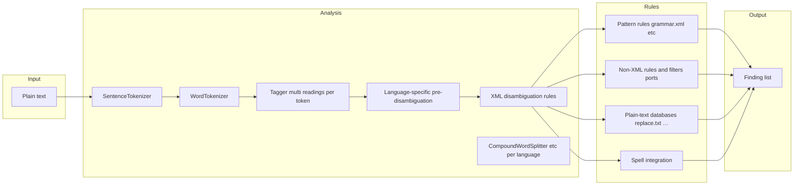

# Python-first checker → LanguageTool-class quality (phased plan)

**Status**: Research note (architecture and roadmap; no WriterAgent wiring described here). For **WriterAgent**, this direction is **low-priority for now**: the shipped linguistic grammar path is **LLM-backed over HTTP** (see [docs/realtime-grammar-checker-plan.md](realtime-grammar-checker-plan.md)), and that design already covers many goals people once associated with “local only” stacks.

**Audience**: Builders who want a **checker implemented and extended in Python** that **converges over time toward the depth and usefulness of LanguageTool’s rule set**, runs **without invoking an LLM at proofread time**, and deliberately **does not depend on embedding or invoking the JVM**. (If you are happy with an LLM at proofread time—even self-hosted—see **WriterAgent / LLM grammar** below.)

**Goals (explicit)**

- **Primary artifact**: Your own pipeline (tokenizer → analysis → rule engine) shipped as **maintainable Python** (narrow native deps only where unavoidable, e.g. fast tokenizers — still controlled from Python).
- **Compatibility anchor**: LanguageTool’s **open resources** (XML rules, dictionaries, text databases — LGPL-style licensing per upstream files) describe *what categories of errors exist* and *how rules are spelled*; LT is treated as **documentation plus portable data**, not as a runtime you install.
- **Parity wording**: Prefer **“LanguageTool-class”** or **“rule-data compatible”** over claiming byte-for-byte identity with a pinned upstream LT release until **your own** corpus and fixtures prove it.

**Deps / vendoring stance (for downstream implementers)**

- Prefer **stdlib + a few thousand lines forked wholesale** under `plugin/vendor/` rather than heavyweight ecosystems.
- Explicitly steer clear of **NumPy / PyTorch / Transformers / spaCy-class** stacks for this roadmap; they pull in large wheels and brittle extension runtimes incompatible with skinny embeds (including older LibreOffice-bundled CPython discussed in AGENTS.md for the WriterAgent extension runtime).
- **Small C-extensions** (`regex`, `pyahocorasick`, `rapidfuzz`) are acceptable if wheels exist for targets and license due diligence is done; otherwise **lift the algorithm** (Aho-Corasick, Levenshtein automaton) into pure Python.

**Non-goals (for this doc)**: Sidebar integration, `XProofreader` hooks, cache queues, config keys, CI narratives — product plumbing omitted. How you invoke tests fixtures is irrelevant; feature phases matter.

### WriterAgent / LLM grammar vs this document (priority)

WriterAgent’s native proofreader sends text to **any OpenAI-compatible HTTP endpoint**. That includes public APIs, **OpenRouter-style aggregators**, **on-prem gateways**, and **air-gapped hosts** running a local server (Ollama, vLLM, LM Studio, internal clusters, etc.). There is no product requirement that “local” mean “small rule engine”: **local or private can still mean a capable or custom model** the user controls.

**Compared to LanguageTool-class rule packs**, modern LLMs—**especially larger or better-fitting chat models**—generally provide **richer, context-sensitive advice** (tone, discourse, subtle agreement, paraphrases, explanations) than deterministic XML rules are designed to deliver. Rule engines optimize for **repeatable, enumerated errors** and stable rule ids; LLMs optimize for **interpretation of the actual text** in front of them. So for WriterAgent, **this phased LT parity track is optional background research**, not a competing near-term product pillar, unless you explicitly need grammar **with no model inference at all** or a **tiny deterministic pre-pass** alongside the LLM.

**Native grammar scope vs document-wide review**

- The **Linguistic / underlines** path is **not whole-document**: it works on a **short proofread slice** (capped in code) and splits into **sentences** with **per-sentence cache**. The model does **not** see the full manuscript—by design that keeps behavior predictable and avoids overwhelming the structured JSON error list. In **typical** typing flows the LLM payload is **effectively one sentence**; when several sentences in the same slice are uncached, the implementation may **concatenate them into a single request** for efficiency. Packing **many sentences all heavy with errors** into one prompt is a known way to **break** offset ordering and JSON shape, so the architecture stays **tight and sentence-oriented** rather than holistic.
- **Holistic copyediting** is a **different surface**: **Chat with Document** can use **`add_comment`** ([`plugin/modules/writer/comments.py`](../plugin/modules/writer/comments.py)) to anchor notes in the text like a human copyeditor, with broader context from normal chat tools (`get_document_content`, etc.). Agent prompts already steer review tasks toward comments where appropriate ([`TOOL_USAGE_PATTERNS`](../plugin/framework/constants.py) in `constants.py`). That complements native grammar; it does not replace underlines.

**How this differs from upstream LanguageTool’s scope model**

- LanguageTool ingests whatever chunk the host passes (paragraph, selection, whole paste—not “one sentence per HTTP call”). **Inside** the engine it **splits into sentences**, tokenizes words, tags, then runs patterns—so the **dominant rule style** is **per-sentence**: `grammar.xml` `<token>` sequences almost always match within a **single sentence’s** analyzed stream ([development overview](https://dev.languagetool.org/development-overview.html)).
- LT still has **some** rules that **span or relate across sentences**—implemented as **dedicated Java rule classes** or carefully written multi-sentence XML (repetition, light discourse, style hooks). Those are the **exception**; the bulk of the catalogue is sentence-local pattern matching.
- WriterAgent’s native path is different for **LLM reasons**: it **caps** how much text goes into one proofread slice, **caches per sentence**, and keeps the model’s **visible context** small so **structured JSON + offsets** stay reliable—**not** because LT’s internals are single-sentence-only. Parity work (this doc) assumes you **reimplement LT’s pipeline** on that full chunk if you want LT-like behavior; parity is unrelated to the shipped LLM grammar cap.

---

## 1. What “near-perfect fidelity” means

Agreement with LanguageTool-as-data should be anchored to reproducible artifacts **you control**:

1. **Pinned upstream resources** — a fixed **git commit** (or release tag) of `languagetool-language-modules/<lang>/` supplying `grammar.xml`, `disambiguation.xml`, dictionaries, tagger payloads, etc. Rules drift weekly; pin data and bump intentionally.
2. **A match contract** — same normalized Unicode string + locale (`en-US` vs `en-GB`): compare rule id (or stable internal id mapped from LT id), spans, suggestion lists, optionally message strings.
3. **Scope boundaries** — target **patterns expressible from shipped XML + morphology + your Python ports** of non-XML behavior. Anything that upstream implements only inside their reference executable (heavy native rule classes, inaccessible filters) lands in Phase 7 as **explicit Python ports** — never as an excuse to add a JVM to *this* project.

“Nearly perfect” = **high agreement on a curated golden corpus** (§8), not universal proof over all Unicode.

---

## 2. LanguageTool upstream: languages, variants, and uneven depth

LanguageTool is **multilingual**, but **coverage is not uniform**. The public matrix at [languagetool.org/languages/](https://languagetool.org/languages/) tracks, per language: **XML grammar rules** (`grammar.xml` cohorts), **language-specific Java rule classes** (extra logic outside XML), built-in **spell check** integration, and **confusion pairs** (mostly n‑gram / similar-word style data). The table is regenerated from each release (**example snapshot: LanguageTool 6.6, dated 2025-03-27** on that page—newer LT versions will shift counts).

**Interpretation for your roadmap**

- **XML rule count ≠ quality**, but it is a rough workload estimate for Phases 5–7 (pattern porting + Java-style filter ports).
- **Java-rule count** flags how much non‑XML bespoke logic upstream still maintains for that locale.
- An empty **spell** cell means LT does **not** wire bundled spellchecking for that language on that row (you may still use OS/LibreOffice spellers separately).
- **Global rules** apply punctuation and similar fixes across languages; the matrix counts mostly **locale-specific** XML rules—the doc page notes punctuation rules sit partially outside those per‑language totals.

### Locales shipped in the public matrix (core engine)

Listed as **named languages** below; upstream maps each to `languagetool-language-modules/<code>/` (`en`, `de`, …).

| Language | XML rules† | Spell | Typical variants / notes (from LT page) |
|----------|-----------:|-------|----------------------------------------|
| Arabic | 450 | ✓ | — |
| Asturian | 71 | ✓ | — |
| Belarusian | 66 | ✓ | — |
| Breton | 675 | ✓ | — |
| Catalan | 8251 | ✓ | Balearic, Valencian |
| Chinese | 1863 | — | Grammar rules without bundled spell column on 6.6 page |
| Crimean Tatar | 93 | ✓ | — |
| Danish | 78 | ✓ | — |
| Dutch | 3500 | ✓ | Belgium |
| English | 6074 | ✓ | Australian, Canadian, GB, New Zealand, South African, US |
| Esperanto | 422 | ✓ | — |
| French | 6984 | ✓ | Belgium, Canada, Switzerland |
| Galician | 308 | ✓ | — |
| German | 5224 | ✓ | Austria, Germany, Swiss |
| Greek | 55 | ✓ | — |
| Irish | 1663 | ✓ | — |
| Italian | 141 | ✓ | — |
| Japanese | 735 | — | — |
| Khmer | 33 | ✓ | — |
| Persian | 283 | — | — |
| Polish | 1747 | ✓ | — |
| Portuguese | 2919 | ✓ | Angola preAO, Brazil, Moçambique preAO, Portugal |
| Romanian | 457 | ✓ | — |
| Russian | 892 | ✓ | — |
| Slovak | 170 | ✓ | — |
| Slovenian | 86 | ✓ | — |
| Spanish | 1644 | ✓ | voseo regional variant |
| Swedish | 32 | ✓ | — |
| Tagalog | 44 | ✓ | — |
| Tamil | 210 | — | — |
| Ukrainian | 1186 | ✓ | — |

† Figures copy the **Rules in LanguageTool 6.6** snapshot on [the languages page](https://languagetool.org/languages/); re-check when you pin a newer LT release.

### Spell-only / add-on caveat

Same page notes **Norwegian** as supported **in browser add‑ons with spell checking only** (grammar not in that channel for that configuration). Browser vs desktop bundles can differ slightly—treat LT’s page + your pinned `jar`/module list as authoritative when you scrape resources.

---

## 3. Reference pipeline (what LT documents — you replicate in Python)

Public docs describe analysis as: sentence split → word/POS tagging → matching ([Development overview](https://dev.languagetool.org/development-overview.html)). The **full chain** LT’s grammar rules assumes:

**Takeaway**: Most `grammar.xml` rules match **tokens with POS/chunk morphology**, not raw character regex alone. Breaking tokenization or disambiguation silently breaks enormous rule subsets.

---

## 4. Major components — all become Python implementations

| Component | Role | Why quality drops if skipped or wrong |
|-----------|------|---------------------------------------|
| **Sentence & word tokenization** | Token boundaries driving every rule | Off-by-one poisons downstream analysis |
| **Tagger (+ lexicon)** | Multiple POS readings per token | Rules using `postag`, inflection — wrong |
| **Disambiguator** | XML rules that pick among readings before pattern rules | Huge impact EN/DE-heavy sets |
| **Inflection / synthesis** (`inflected="yes"`) | Lemma ↔ surface via dictionaries | Broken suggestions / missed triggers |
| **Chunk tags** (`chunk_re`) | NP/VP-ish hints | Common in modern EN rules |
| **Pattern engine** | `PatternToken`, skip/min, exceptions, antipatterns | Semantic edge cases abound |
| **`<filter>` and non-XML rules** | Logic outside XML fragments | Requires **purpose-built Python modules** (“this rule id → callable”) |
| **Compound splitting** etc. | Per-language quirks (e.g. German) | Isolated complexity |
| **Spell interaction** | Spelling rules coupling | Tune when grammar + spell unify |
| **Plain-text databases** | `replace.txt`, `wordiness.txt`, … | High value / lower complexity onboarding |

Rough English scale from one LT checkout: ~**1700** top-level grammar rules with **heavy** `postag=`, **`chunk_re`**, **inflection**, and **many** `<filter>` / non-XML rule bodies you must enumerate and port selectively.

---

## 5. Strategy (Python-centric)

These are checker strategies, not app integration.

### A — Primary: incremental **Python rule engine**

Implement the LT pipeline semantics in Python, loading **pinned LT XML/dictionaries/text DBs**. Long tail = **explicit Python** for filters and builtins (copy behavior from LT’s published rule logic by reading upstream source **as specification**, rewriting in Python under your tests; thin native helpers optional, **JVM intentionally absent**).

### B — **Accelerator: revive or replace `nlprule` Rust core with Python façade**

Historical project ([nlprule](https://github.com/bminixhofer/nlprule)) showed non-JVM high coverage from LT-derived data — maintenance stalled ~2023. Optionally **fork** for tokenizer/rule binary speedups while your **canonical rule semantics** remain spec’d and tested from Python glue. Goal stays **grow native Python footprint** over time rather than outsourcing all semantics to Rust forever.

### C — **Cheap subset**

Import only phrase lists (`replace.txt`, …) + naive patterns. Good product milestone, **not** LanguageTool-class.

Embedding the upstream JVM-based LanguageTool distribution is **explicitly out of scope** — this roadmap is for growing your **own Python engine** against open rule artifacts.

---

## 6. Phased feature roadmap (no LLM)

Treat each phase below as **shippable capability**: tokenizer quality, morphology, then rule breadth. Stop early anytime; later phases reopen when fixtures demand them. Concrete Python aides appear in §9 (“vendor/fork cheat sheet”).

### Phase 0 — Pin data + golden corpus you own

1. Freeze **resource tree revision** under `languagetool-language-modules/<lang>/` (pull XML + binaries you are licensed to reuse).
2. Build **fixture-driven tests**: JSON (or equivalent) blobs of input text → expected list of `{rule_id, offset, length, replacements}`. Fixtures may be handwritten, fuzz-minimized from user reports, or enriched from external sources **outside this roadmap’s runtime stack** — **your repo’s truth is the checked-in corpus**.
3. Use LT’s **[text analyzer web UI](https://community.languagetool.org/analysis/index)** plus published tagset docs to understand token/POS when debugging divergence ([dev overview](https://dev.languagetool.org/development-overview.html)).

**Exit**: your harness compares Python checker outputs to fixtures; failures classified (tokenizer vs tagger vs pattern vs dictionary).

### Phase 1 — Plain-text and simple substitutions

Parse `phrase=replacement[\tmessage]` files ([example `replace.txt` header](https://raw.githubusercontent.com/languagetool-org/languagetool/master/languagetool-language-modules/en/src/main/resources/org/languagetool/rules/en/replace.txt)) for `wordiness`, `redundancies`, `contractions`, `diacritics`, `det_a` / `det_an`, etc.

**Exit**: substitutions and messages behave correctly on hand-built examples spanning phrase lists.

### Phase 2 — Tokenization aligning with LT behavior

Produce sentence/word segmentation **consistent with LT’s observable behavior** (document quirks; use corpus + analyzer notes). Corpus compares **typed spans**.

**Exit**: tokenizer span agreement crosses agreed threshold on golden set.

### Phase 3 — POS + lemmas (multi-reading)

Produce reading sets compatible per language **`tagset.txt`-style labels** LT rules expect — implement via dictionaries + statistical tagger + mapping layer if you bridge from another toolkit.

**Exit**: pre-disambiguation reading-set overlap metric vs corpus references.

### Phase 4 — Disambiguator XML interpreter

Implement `disambiguation.xml` semantics: remove/select readings using same rule IDs and operators LT uses.

**Exit**: post-disambiguation fixture agreement threshold met.

### Phase 5 — Pattern rule engine (`grammar.xml` / `style.xml` subsets → full cohort)

Grow feature coverage: literals, `regexp`, `skip`/`min`/`max`, `chunk_re`, exceptions, inflection attrs, antipatterns, markers, suggestion assembly, rulegroups. XSD / docs under [languagetool-core/resources/.../rules](https://github.com/languagetool-org/languagetool/tree/master/languagetool-core/src/main/resources/org/languagetool/rules) constrain meaning.

**Exit**: phased enablement cohorts (# rules turned on vs regressions shrinking).

### Phase 6 — Morphology dictionaries

Wire `*.dict` / synthesis paths so `inflected="yes"` and dynamic suggestions replicate intended behavior.

**Exit**: morphology-heavy fixtures green.

### Phase 7 — **Python ports** for `<filter>` and non-XML rules

Maintain a registry `{rule_identifier → Python callable}` sourced from enumerated upstream rule classes and filters. Implement or explicitly mark **unsupported_with_reason**. No delegated foreign runtime for these hooks.

**Exit**: documented coverage matrix; dwindling unexplained divergences on corpus.

### Phase 8 — Style, spell coupling, multilingual expansion

Broaden locales; integrate spell backends you choose (Hunspell-class, LO APIs elsewhere, …) acknowledging intentional divergence spots.

**Exit**: breadth and latency acceptable on representative documents vs your enlarged golden set.

---

## 7. “Compiled rules” mental model — Python-first

You ship **datasets + bytecode Python** (+ optional tiny native accel). Typical bundles:

| Form | Contents |
|------|-----------|
| **Resource pack** | Pinned LT XML/text/dicts (LGPL per file) consumed by Python loaders |
| **Python package** | Engine + filter modules + tokenizer/tagger wrappers |
| **Optional native helper** | e.g. fast finite automata, SIMD scanner — opaque to callers |

There is **no** magic single blob replacing the need to express **tokenizer + morphology + semantics** somehow; you choose Python + data as the authoritative combination.

---

## 8. Validation discipline

1. **Golden corpus is law** — every regression adds or tightens fixtures.
2. **Cohort slicing** — toggle rule families to localize breakage.
3. **Tokenizer-first** — mismatch tokens before rewriting pattern matchers.
4. **Upstream cadence** — periodic review of LT rule deltas (diff XML); add targeted fixtures as rules move.

Optional: bilingual human review slices where automated corpus weak.

---

## 9. Python building blocks per phase — vendor/fork cheatsheet

Prior art suited to **`plugin/vendor/`**, **subtree imports**, or **read-only cloning**—then delete everything you do not ship. Licenses differ (MIT/BSD/Apache/MPL/LGPL/…); vet before packaging an OXT. LT correctness may diverge from any library defaults.

**Listing policy**: Sections pair a **compact table** (common entry points) with a **repo sweep**—explicit GitHub/GitLab links **regardless of star count**. Obscure coursework repos belong here too; you prefer **mining algorithms** over adopting a glamorous dependency whole-cloth.

### Cross-cutting utilities

| Need | Typical projects | Notes |
|------|------------------|-------|
| Unicode-heavy regex akin to LT/Java `\p{L}` semantics | **[`regex`](https://pypi.org/project/regex/)** | Single C-extension module; richer than stdlib `re`. If unacceptable, emulate property classes selectively. |
| Safe XML ingestion | **`defusedxml`**, **`xml.etree.ElementTree`** | Prefer `ElementTree` for speed of integration; batched XPath-like walks are often handwritten. **`lxml`** is faster but a larger native stack. **`elementpath`**: lightweight XPath-compatible helpers atop ElementTree (evaluate size). |
| Multi-pattern literal scan across long docs | **`pyahocorasick`** ([repo](https://github.com/WojciechMula/pyahocorasick)) | Compact automaton builder; BSD. Good for Phase 1 phrase lists overlapping in one pass. Alternative: **`marisa-trie`** for frozen static dictionaries. |
| Fuzzy typo suggestion pre-filter | **`rapidfuzz`**, **`jellyfish`**, stdlib **`difflib`** | Useful for tying spell tiers to grammar; omit if dict-only suffices. Avoid pulling scientific stacks. |

**Repo sweep — regex / unicode / XPath / fuzz**

- Unicode tables & normalization: skim CPython **`Lib/re/_parser.py`**, **`unicodedata`** sources; **`ftfy`** ([repo](https://github.com/rspeer/python-ftfy)) if you normalize broken mojibake before rules (optional; watch dependency drag).
- Tiny edit-distance / alignment (metric code to steal): **`python-Levenshtein`**, **`edlib`** Python bindings ([repo](https://github.com/Martinsos/edlib)), **`polyleven`**, Wald’s **`distance`** package on PyPI, academic forks of **`weighted-levenshtein`**.
- More AC / trie scanner implementations: **`cyac`** (Cython AC + trie, [chenkovsky/cyac](https://github.com/chenkovsky/cyac)); Rust bridges **`ahocorasick_rs`** ([G-Research/ahocorasick_rs](https://github.com/G-Research/ahocorasick_rs)), **`python-daachorse`** ([daac-tools/python-daachorse](https://github.com/daac-tools/python-daachorse)); generic tries **`dict-trie`** ([jfjlaros/dict-trie](https://github.com/jfjlaros/dict-trie)), **`trie-match-python`** ([tristanreid/trie-match-python](https://github.com/tristanreid/trie-match-python)), **`pygtrie`** ([google/pygtrie](https://github.com/google/pygtrie)), **`PyTrie`** family on PyPI, **`radixtree`** forks.
- XML traversal niceties besides `elementpath`: **`xmltodict`** (shape flipper), assorted **`beautifulsoup4`** scrapers useless for LT files but occasionally instructive for tree walks.

---

### Phase 1 — Plain-text rules (`*.txt`)

| Idea | Typical projects | Notes |
|------|------------------|-------|
| Trie-based replace / extraction | **`flashtext`** ([repo](https://github.com/vi3k6i5/flashtext)), **`flashtext2`** | Pure-Python-ish core; excels at deterministic phrase lookup (case folding matches LT conventions after you replicate them). **`flashtext-i18n`** fork emphasizes Unicode-heavy corpora if you localize. |
| High-throughput exact scan | **`pyahocorasick`** (above) | When thousands of phrases + long paragraphs; emits offsets for squiggles. |
| Ranking candidates | **`bidict`** (tiny) optional | Maintain reversible phrase→replacement if needed. Usually a pair of dicts suffices. |

**Repo sweep — phrase tables / keyword scan**

- FlashText ecosystem & forks: [termdock/flashtext-i18n](https://github.com/termdock/flashtext-i18n), random “keyword replace” homework repos (search GitHub code for `KeywordProcessor` forks—many are single-file).
- Double-array / minimal DFA experiments: academic snapshots of **Aho–Corasick lecture code** (hundreds of tiny `ac_automaton.py` gists); **Competitive programming** notebook collections with multi-pattern search.
- Build-your-own from CLRS PDFs: students’ **`trie.py` + `failure_link.py`** assignments—often ≤200 LOC, perfect for vendoring after license check.

---

### Phase 2 — Sentence/word tokenization

| Idea | Typical projects | Notes |
|------|------------------|-------|
| Pragmatic rule-based sentence split (22 langs) | **`pysbd`** ([repo](https://github.com/nipunsadvilkar/pySBD)) | MIT; good baseline—not LT-identical until tuned. Useful **first waveform** segmentation. |
| Joint sentence + word stream (EN/ES/DE) | **`syntok`** ([repo](https://github.com/fnl/syntok)) | MIT; preserves spacing meta for Writer offsets; depends on **`regex`**. |
| Legacy sibling | **`segtok`** | Older heuristics; still worth reading. |
| Moses-style preprocessing | **`sacremoses`** | Submodule-friendly if pruned to tokenizer pieces only. |

**Expectation**: None match LT/J tokenizers verbatim; diff against analyzer output ([community analyzer](https://community.languagetool.org/analysis/index)).

**Repo sweep — segmentation/tokenization mines**

- Tiny splitters / teaching code: **`ciseau`** ([JonathanRaiman/ciseau](https://github.com/JonathanRaiman/ciseau)); Punkt-derived homework repos; NLP course **`sent_tokenize` wrappers**.
- **`nltk.tokenize.punkt`** source ([nltk repo](https://github.com/nltk/nltk)—read `tokenize/` only, ignore corpuses).
- **UDPipe** Python bindings (**`ufal.udpipe`**) if you tolerate a tiny C++ addon for multilingual UD tokenization—not LT parity but multilingual bootstrap.
- **Japanese / CJK niche**: **`tinysegmenter`** ([SamuraiT/tinysegmenter](https://github.com/SamuraiT/tinysegmenter)), **`jieba`** (Chinese), **`fugashi`** (**[polm/fugashi](https://github.com/polm/fugashi)**) bridges MeCab—heavy per language.

---

### Phase 3 — POS / lemmas (prior to bespoke LT models)

| Idea | Typical projects | Notes |
|------|------------------|-------|
| HMM-ish tagging EN/NL/DE | **`HanTa`** ([PyPI HanTa](https://pypi.org/project/HanTa/)) | Lightweight; needs LT tag-map layer. |
| Toy HMM+Viterbi | **`pypos`**, assorted PyPI **`hmmlearn`-free** gist ports | Skeleton code > accuracy. |
| NLTK pickled tagger internals | **`nltk.tag`** modules + pickle | Vendor **specific files**, not entire `nltk`. |
| Hunspell-driven stems | **`spylls`** ([zverok/spylls](https://github.com/zverok/spylls)) — **MPL-2.0** | Lexical cues for taggers / chunk heuristics. |
| Morphology Ru example | **`pymorphy3`** ([pymorphy/pymorphy3](https://github.com/pymorphy/pymorphy3)) | Pattern when expanding past EN. |

LT often ships **`*.dict`/`*.tagger.bin`-class artifacts**: long-run plan is custom loader + inference loop, not a random PyPI tagger.

**Repo sweep — tagging / morphology mines**

- **Brill transform learners** implemented in miniature: coursework repos for **Brill tagger**, [`sayarghoshroy/Brill-Tagger-Illustration`](https://github.com/sayarghoshroy/Brill-Tagger-Illustration), [`szmer/brill`](https://github.com/szmer/brill) (C++/Python hybrids—read algorithms), PennLP legacy dumps.
- **Perceptron / structured perceptron POS** clones on GitHub (search “average perceptron POS python” → strip training scripts, ship inference-only).
- **Snowball stemmer** pure Python (**`snowballstemmer`** on PyPI, [snowballstemmer repo](https://github.com/shibukawa/snowball_py)) — cheap stem prior when POS absent.
- **UDPipe / Stanza internals** (**[stanfordnlp/stanza](https://github.com/stanfordnlp/stanza)**) are **heavy** ML—mine only tokenizer/POS bridging ideas unless you accept torch; listed for completeness because people search here first.
- **`pattern` toolbox** (**[clips/pattern](https://github.com/clips/pattern)**) — stalled Py3 releases but **readable** English parser/tagger excerpts to transcribe cautiously.

---

### Phase 4 — Disambiguation DSL

Likely **custom bytecode over XML**.

| Idea | Typical projects | Notes |
|------|------------------|-------|
| Expression / grammar helpers | **`parsimonious`** ([repo](https://github.com/erikrose/parsimonious)), **`funcparserlib`**, **`lark`** | Only when disambig expressions need a DSL beyond hand-rolled eval. |

**Repo sweep**

- Minimal PEG/__PEG__ playgrounds: **`tatsu`**, **`canopy`** (inactive), dozens of Lark grammars embedded in random repos—use as grammar-combinator crib sheets.
- **Rule engine pattern**: drools-like Python tutors (`python-simple-rules`), Rete homework—usually overkill but sometimes clarify conflict resolution strategies.

---

### Phase 5 — Pattern `PatternToken` engine

| Idea | Typical projects | Notes |
|------|------------------|-------|
| Rich regex semantics | **`regex`** | Prefer over `re` where `\p` & recursion matter. |

**Repo sweep**

- **Regex-to-automaton explainer repos** teaching Thompson/NFA constructions (GitHub topics `automata regex python`).
- **RE2 wrappers** (**`google-re2`** Python)—compare behavior vs Java Pattern when debugging LT parity.
- **Hyperscan bindings** (**`hyperscan`**) if you fantasize SIMD multi-regex (Linux-centric; heavier ops).

Pattern engine bulk code is **almost always authored in-house**.

---

### Phase 6 — Morphology / synthesis dictionaries

| Idea | Typical projects | Notes |
|------|------------------|-------|
| Spec reference | **`spylls`** | Read-even-if-not-shipped MPL code. |
| Native Hunspell linkage | **`cyhunspell`**, **`hunspell`** PyPI | Platform libs sometimes painful in LO embeds. |
| Trie scaffolding | **`pygtrie`**, **`marisa-trie`** ([pytries/marisa-trie](https://github.com/pytries/marisa-trie)) | Suffix enumeration helpers. |

**Repo sweep**

- **`hunspell` format readers** scattered on GitHub (search `read_aff_dic`)—many unfinished one-file parsers good for validating edge cases beside spylls.
- **Myspell affix duplication logic** ported to JS/Python in random gist collections—parity checks for doubling rules (`FF`, `SSP`, etc.).
- **HFST / foma Python** bridges—only if Nordic LT modules matter later (usually too heavy).

---

### Phase 7 — `<filter>` and bespoke rules

**No turnkey package**—implement registries keyed by LT rule id.

**Repo sweep**

- Upstream LanguageTool **`*.java` filter sources** in `languagetool-language-modules/` as reading material only (behavioral spec—not executed here).
- **Date/time micro-libs**: `python-dateutil` (ubiquitous), **`mxDateTime`** (legacy), **`arrow`** (thin wrapper)—**mine one function**, do not marry.
- **`wordsegment`**, **`english-words`** datasets—not grammar but occasionally referenced in heuristic filters undergrads rewrote—use sparingly.

---

### Phase 8 — Spell + multilingual routing

| Idea | Typical projects | Notes |
|------|------------------|-------|
| Symmetric-delete spell ranking | **`symspellpy`** ([mammothb/symspellpy](https://github.com/mammothb/symspellpy)) — PyPI **`symspellpy`** | MIT lineage from Wolf Garbe’s Symmetric Delete idea; tune memory vs accuracy. Alternate ports below. |
| Language routing | **Editor locale (`CharLocale`) + BCP‑47 packs** | Often beats shipping `fasttext`; WriterAgent already normalizes locales for grammar. |

**Repo sweep — spell / phonetic / n-gram aides**

- Other SymSpell / edit-distance spell sketches: GitHub topic **`symspell`**, **`symmetric-delete`** → many **<50‑star forks** differing only in API glue—ideal for cloning one file.
- **Norvig spell** 20-line canonical ([Peter Norvig’s article](https://norvig.com/spell-correct.html) + countless GitHub transcription repos).
- **`autocorrect`**, **`textblob` corrections** modules—heavy packages; **`autocorrect` single-file forks** lighter.
- **Phonetic encodings**: **`jellyfish`** (soundex/metaphone), **`phonetics`** PyPI umbrella, undergrad **`double-metaphone.py`** gist forests.
- **BK-tree / metric trees** for lexicon typo search (**`pybktree`**, academic notebook implementations)—swap in if SymSpell tables feel unwieldy.
- **`aspell`** / **`enchant`** Python FFI examples—binder code useful even when LO provides native spell APIs directly.

### When repos are enormous

Still worth **opening once**: **`clips/pattern`**, **`nltk`** monolith, stalled **`pattern3`**, **`gensim`** ancient **`tokenize`** contributions—grep for `sentence`/`token`/`regex`/`perceptron`, copy tens of LOC, discard megabytes of unrelated NLP. Prefer **focused commits** (“this file only”) over cloning history.

---

## 10. Outlook (Python ambition)

Reach **LanguageTool-class** usefulness is a **large, iterative** engineering program: years for many languages if uncompromising. The viable shape is:

- Own **fixtures** proving progress feature-by-phase,
- **Explicit Python ports** consuming open rule data,
- Optional accelerators (**Rust/other**) behind thin Python bindings without changing the roadmap’s center of gravity.

The outcome is **a checker as good over time as you measure** against corpora you grow — matching the **breadth users expect from mature rule packs**, implemented and owned in Python.

**Relative to WriterAgent today**: an LLM grammar endpoint (cloud or **airgapped / self-hosted**) already supports **sophisticated** feedback; parity with LT’s rule inventory is a **different axis** (determinism, enumerated errors, no-runtime-LLM scenarios). Keep this document as **reference**, not as urgency, unless product requirements change.

---

## 11. References (upstream documentation and portable resources)

- [Real-time / AI grammar checker — shipped WriterAgent design](realtime-grammar-checker-plan.md) (LLM over HTTP; local model servers use the same mechanism)
- [LanguageTool development overview](https://dev.languagetool.org/development-overview.html)
- [Supported languages & rule-count matrix](https://languagetool.org/languages/) (regenerated each release—use when pinning locales)
- [English `grammar.xml` (inspect patterns; large file)](https://raw.githubusercontent.com/languagetool-org/languagetool/master/languagetool-language-modules/en/src/main/resources/org/languagetool/rules/en/grammar.xml)
- [English `replace.txt`](https://raw.githubusercontent.com/languagetool-org/languagetool/master/languagetool-language-modules/en/src/main/resources/org/languagetool/rules/en/replace.txt)
- [LT text analyzer (community)](https://community.languagetool.org/analysis/index)
- [nlprule](https://github.com/bminixhofer/nlprule) — prior non-JVM LT-derived engine; possible fork material
- Core rule XSD / resources directory: [`languagetool-core`/…`/rules`](https://github.com/languagetool-org/languagetool/tree/master/languagetool-core/src/main/resources/org/languagetool/rules)
