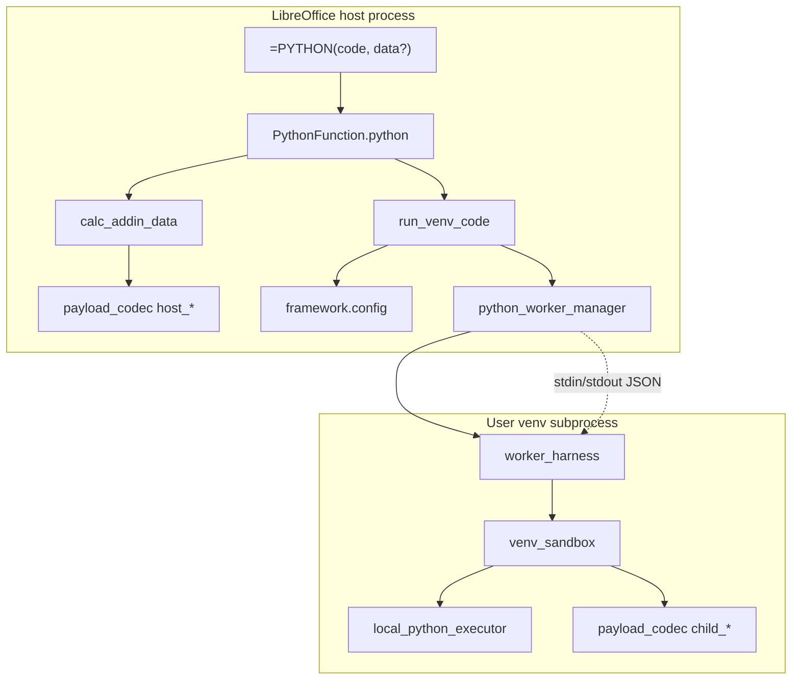
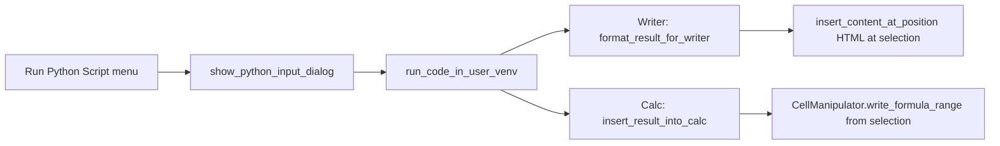
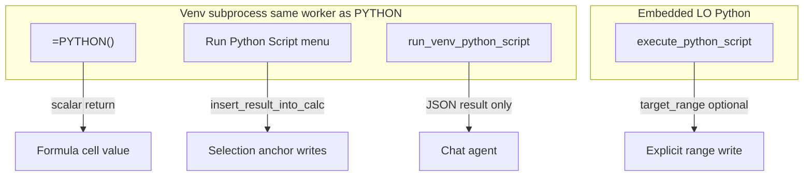
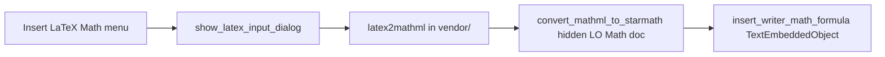

# Splitting `=PYTHON()` for a LibreOffice core extension

This document describes what WriterAgent would need to ship if LibreOffice pulled **`=PYTHON()`** (and its venv compute bridge) out of the main WriterAgent extension into a **small, stable core extension**, while WriterAgent keeps the fast-moving AI features (chat, tools, MCP, grammar, and so on).

It answers two questions:

1. Which **`plugin/framework/`** modules must ship (entire files, even when only one function is used)?
2. What is the **complete file list** for the feature (same whole-file rule)?

For user-facing behavior of `=PYTHON()` (matrix formulas, `data` ranges, timeouts), see [Enabling NumPy & Python in LibreOffice](enabling_numpy_in_libreoffice.md) §6. This doc is about **packaging and dependencies**, not formula tutorials.

---

## Why split?

| Concern | Core extension | WriterAgent extension |
|--------|----------------|----------------------|
| Change rate | Low: Calc add-in bridge, subprocess protocol, sandbox | High: models, tools, UI, MCP |
| Stability | Suitable to ship with LibreOffice core | Third-party / frequent releases |
| Scope | `=PYTHON(code, data?)` + venv settings | Chat, `=PROMPT()`, specialized tools, grammar, etc. |

WriterAgent registers **`=PYTHON()`** and **`=PROMPT()`** as **separate UNO components** ([`python_addin.py`](../plugin/calc/python_addin.py), [`prompt_addin.py`](../plugin/calc/prompt_addin.py)). A core split should ship only the Python add-in and **not** register a second competing `PYTHON` implementation.

---

## Architecture (host vs venv)

LibreOffice’s embedded Python must **not** import NumPy/pandas from arbitrary user installs (ABI mismatch → crash). `=PYTHON()` runs user code in a **separate venv interpreter** over a JSON line protocol.

**Recalc constraint:** `=PYTHON()` runs **synchronously** during Calc recalc. The implementation deliberately avoids UI event pumping on this path (see comments in [`python_function.py`](../plugin/calc/python_function.py)) so the formula engine is not re-entered.

**Config keys** (today, from [`plugin/scripting/module.yaml`](../plugin/scripting/module.yaml)):

| Key | Role |
|-----|------|
| `scripting.python_venv_path` | Directory of user venv; empty → `sys.executable` (LO embedded Python, stdlib-only unless that interpreter has extras) |
| `scripting.python_exec_timeout` | Wall-clock seconds per run (default 10, clamp 1–600) |

Stored in **`writeragent.json`** today ([`plugin/framework/config.py`](../plugin/framework/config.py)). A core extension would choose whether to reuse that file, use a dedicated JSON name, or bind LO Tools → Options.

---

## Two import closures (important)

Python loads **whole modules**. If a file is imported, the entire file ships in the OXT, even if only one function is called.

### 1. Runtime closure — what runs for `=PYTHON()` only

Call chain:

`PythonFunction.python()` → `python_function.execute_python_addin` → `calc_addin_data` / `payload_codec` → `run_code_in_user_venv` → `PythonWorkerManager` → `worker_harness` → `venv_sandbox` → `LocalPythonExecutor`

Error display: `format_error_for_display` → `framework.errors` / `framework.client.errors` / `i18n`.

Config: `get_config_str("scripting.python_venv_path")`, `get_config_int("scripting.python_exec_timeout")`.

This closure **does not** call the LLM, chat panel, or MCP.

### 2. As-shipped module closure — WriterAgent (split complete)

- **`=PYTHON()`**: register [`python_addin.py`](../plugin/calc/python_addin.py) only → loads [`python_function.py`](../plugin/calc/python_function.py) (no `LlmClient`).
- **`=PROMPT()`**: register [`prompt_addin.py`](../plugin/calc/prompt_addin.py) → loads [`prompt_function.py`](../plugin/calc/prompt_function.py) (LLM stack).

A core “Python-only” OXT must **not** register `prompt_addin.py` / `prompt_function.py`. See [Recommended refactors](#recommended-refactors-for-libreoffice-maintainers) below for IDL/manifest flavors.

---

## Framework files required (whole files)

These are all **`plugin/framework/`** (plus build artifact) modules in the **runtime closure** for `=PYTHON()`. Each row is a full file that must appear in the core OXT.

| File | Why it ships |
|------|----------------|
| [`plugin/framework/config.py`](../plugin/framework/config.py) | `get_config_str`, `get_config_int`; reads/writes `writeragent.json`; validates via `WriterAgentConfig` and `MODULES` |
| [`plugin/framework/constants.py`](../plugin/framework/constants.py) | `get_plugin_dir`, `get_locales_dir`; `AUTO_IMPORTS` (used by `venv_sandbox` to prepend `import numpy as np`, etc.) |
| [`plugin/framework/errors.py`](../plugin/framework/errors.py) | `format_error_payload`, `ConfigError`, `safe_call` |
| [`plugin/framework/json_utils.py`](../plugin/framework/json_utils.py) | `safe_json_loads` (pulled in by `client/errors.py`) |
| [`plugin/framework/i18n.py`](../plugin/framework/i18n.py) | `_()` for translated error strings |
| [`plugin/framework/event_bus.py`](../plugin/framework/event_bus.py) | `global_event_bus` — imported by `config.py` |
| [`plugin/framework/service.py`](../plugin/framework/service.py) | `ServiceBase` — imported by `event_bus.py` |
| [`plugin/framework/url_utils.py`](../plugin/framework/url_utils.py) | Imported by `config.py` (endpoint normalization helpers) |
| [`plugin/framework/client/errors.py`](../plugin/framework/client/errors.py) | `format_error_for_display` in `python()` exception handler |
| [`plugin/framework/client/__init__.py`](../plugin/framework/client/__init__.py) | Package |
| [`plugin/framework/__init__.py`](../plugin/framework/__init__.py) | Package |
| [`plugin/_manifest.py`](../plugin/_manifest.py) | **Generated** (`make manifest`). `timeout_limits.py` reads `MODULES` for `scripting.python_exec_timeout` schema defaults |

### Framework modules **not** required for `=PYTHON()` runtime

Do **not** ship these for a formula-only core bundle unless something else pulls them in:

- `plugin/framework/client/llm_client.py` and related shims (`anthropic_shim`, `google_shim`, `auth`, `requests`, …)
- `plugin/framework/async_stream.py` (PROMPT uses `run_blocking_in_thread`)
- `plugin/framework/tool.py`, `default_models.py`, `logging.py`, `uno_context.py`, `worker_pool.py`, `config_service.py`, …

**As-shipped exception:** If the core extension still uses unmodified `prompt_function.py`, you **also** pull in the LLM-related framework subtree via top-level imports (closure #2 above).

---

## Complete file list (non-framework)

Same rule: **entire file** must ship if any symbol from it is imported.

### Calc

| File | Role |
|------|------|
| [`plugin/calc/python_addin.py`](../plugin/calc/python_addin.py) | UNO add-in: `python()` |
| [`plugin/calc/python_function.py`](../plugin/calc/python_function.py) | `execute_python_addin`, matrix session, `to_calc_compatible`, `finalize_python_return` |
| [`plugin/calc/prompt_addin.py`](../plugin/calc/prompt_addin.py) | UNO add-in: `prompt()` (WriterAgent only) |
| [`plugin/calc/prompt_function.py`](../plugin/calc/prompt_function.py) | `execute_prompt_addin` (WriterAgent only) |
| [`plugin/calc/calc_addin_data.py`](../plugin/calc/calc_addin_data.py) | Range → `data`, size limits, `pack_calc_data_for_wire` |
| [`plugin/calc/__init__.py`](../plugin/calc/__init__.py) | Package |

### Scripting / worker

| File | Role |
|------|------|
| [`plugin/scripting/run_venv_code.py`](../plugin/scripting/run_venv_code.py) | Entry: `run_code_in_user_venv` |
| [`plugin/scripting/python_worker_manager.py`](../plugin/scripting/python_worker_manager.py) | Warm subprocess, JSON protocol, timeout kill |
| [`plugin/scripting/worker_harness.py`](../plugin/scripting/worker_harness.py) | Child stdin/stdout loop |
| [`plugin/scripting/venv_sandbox.py`](../plugin/scripting/venv_sandbox.py) | `LocalPythonExecutor`, `VENV_AUTHORIZED_IMPORTS` |
| [`plugin/scripting/payload_codec.py`](../plugin/scripting/payload_codec.py) | `split_grid` wire codec (host + child) |
| [`plugin/scripting/subprocess_env.py`](../plugin/scripting/subprocess_env.py) | `scrub_subprocess_env` |
| [`plugin/scripting/timeout_limits.py`](../plugin/scripting/timeout_limits.py) | Timeout defaults/min/max from manifest schema |
| [`plugin/scripting/venv_probe.py`](../plugin/scripting/venv_probe.py) | `resolve_libreoffice_python`, `resolve_venv_python` (used by `run_venv_code`; `probe_venv_path` only if Settings “Test” UI ships) |
| [`plugin/scripting/module.yaml`](../plugin/scripting/module.yaml) | Config schema for venv path and timeout |
| [`plugin/scripting/__init__.py`](../plugin/scripting/__init__.py) | Package |

### Vendored AST sandbox (smolagents subset)

| File | Role |
|------|------|
| [`plugin/contrib/smolagents/local_python_executor.py`](../plugin/contrib/smolagents/local_python_executor.py) | Restricted executor |
| [`plugin/contrib/smolagents/tools.py`](../plugin/contrib/smolagents/tools.py) | `Tool` type required by `send_tools()` |
| [`plugin/contrib/smolagents/utils.py`](../plugin/contrib/smolagents/utils.py) | `BASE_BUILTIN_MODULES`, helpers |
| [`plugin/contrib/smolagents/agent_types.py`](../plugin/contrib/smolagents/agent_types.py) | Imported by `tools.py` |
| [`plugin/contrib/smolagents/tool_validation.py`](../plugin/contrib/smolagents/tool_validation.py) | Imported by `tools.py` |
| [`plugin/contrib/smolagents/_function_type_hints_utils.py`](../plugin/contrib/smolagents/_function_type_hints_utils.py) | Imported by `tools.py` |
| [`plugin/contrib/smolagents/__init__.py`](../plugin/contrib/smolagents/__init__.py) | Package |
| [`plugin/contrib/__init__.py`](../plugin/contrib/__init__.py) | Package |

### Package root

| File | Role |
|------|------|
| [`plugin/__init__.py`](../plugin/__init__.py) | Package |

---

## Extension packaging (OXT / registry)

| Artifact | Notes |
|----------|--------|
| [`extension/idl/XPromptFunction.idl`](../extension/idl/XPromptFunction.idl) | Today declares `prompt` and `python`. Core build should drop `prompt` or use a new interface name |
| [`extension/XPromptFunction.rdb`](../extension/XPromptFunction.rdb) | Built from IDL — [`scripts/rebuild_xprompt_rdb.sh`](../scripts/rebuild_xprompt_rdb.sh) |
| [`extension/registry/org/openoffice/Office/CalcAddIns.xcu`](../extension/registry/org/openoffice/Office/CalcAddIns.xcu) | Registers add-in; core build keeps `python` node, removes `prompt` |
| [`extension/META-INF/manifest.xml`](../extension/META-INF/manifest.xml) | Core subset: RDB + `plugin/calc/python_addin.py` UNO entry + CalcAddIns (`python` only; no `main.py`, sidebar, grammar) |
| `description.xml` | Extension metadata (new extension identifier if not WriterAgent) |

**Implementation name today:** `org.extension.writeragent.PromptFunction`  
**Service:** `com.sun.star.sheet.AddIn`

Manifest registration reference: [`scripts/manifest_registry.py`](../scripts/manifest_registry.py) (static entries for RDB, `python_addin.py`, `prompt_addin.py`).

---

## Build and configuration

| Step | Detail |
|------|--------|
| Manifest | `make manifest` generates [`plugin/_manifest.py`](../plugin/_manifest.py) from all `module.yaml` files. Core extension should generate a manifest containing **at least** the `scripting` module (for timeout schema defaults) |
| Bundle | Same OXT pipeline as WriterAgent, filtered to the file lists above |
| Config path | Linux: `~/.config/libreoffice/{4,24}/user/writeragent.json` (see AGENTS.md Config) |

---

## Not required for `=PYTHON()`-only core

These are part of WriterAgent but **not** in the runtime closure for the Calc formula:

| Area | Examples |
|------|----------|
| LLM / chat | `plugin/framework/client/llm_client.py`, `plugin/chatbot/*`, `=PROMPT()` in `prompt_function.py` |
| Settings UI for manual runs | [`plugin/scripting/python_runner.py`](../plugin/scripting/python_runner.py) — pulls chatbot dialogs, Calc bridge, Writer format |
| Chat tools | [`plugin/calc/venv_python.py`](../plugin/calc/venv_python.py), [`plugin/calc/python_executor.py`](../plugin/calc/python_executor.py) (in-process stdlib sandbox) |
| AI / MCP / grammar | Entire trees under `plugin/mcp/`, `plugin/writer/locale/`, etc. |

Optional for core UX: **gettext locales** under `locales/` (only if `i18n._()` should translate errors in the core extension).

---

## Recommended refactors for LibreOffice maintainers

**Implementation checklist (phased tasks, acceptance criteria):** [`docs/ROADMAP.md`](ROADMAP.md) — section **Core extension split**.

1. **Split the add-in implementation** — e.g. `plugin/calc/python_addin.py` implementing only `python()` and shared helpers, with **zero** imports from `llm_client` or `async_stream`.
2. **Slim configuration** — small `python_config.py` with two keys instead of full `WriterAgentConfig` + entire `config.py` (large dataclass of AI settings).
3. **Narrow IDL** — interface with only `python(in string code, in any data)`.
4. **Separate extension id** — avoid `org.extension.writeragent.*` if WriterAgent remains a distinct OXT.
5. **WriterAgent integration** — remove duplicate `=PYTHON()` registration from WriterAgent; depend on core extension or share one installable Python tree on `sys.path`.
6. **Optional sandbox slimming** — replace `tools.py` import chain with a minimal `Tool` stub (high effort; only if binary size matters).

---

## Coexistence options

| Option | Summary |
|--------|---------|
| **A — Core only** | LO ships small OXT; WriterAgent does not register `PYTHON` |
| **B — Core + WriterAgent** | WriterAgent declares dependency on core extension; calls shared APIs |
| **C — Duplicate (avoid)** | Two extensions registering `PYTHON` → undefined/conflict |

---

## Tests (existing coverage)

| Test file | Covers |
|-----------|--------|
| [`tests/calc/test_prompt_function_uno.py`](../tests/calc/test_prompt_function_uno.py) | Add-in metadata, `python()` execution (mocked venv) |
| [`tests/calc/test_prompt_function_matrix_uno.py`](../tests/calc/test_prompt_function_matrix_uno.py) | Matrix / index / `finalize_python_return` |
| [`tests/calc/test_calc_addin_data.py`](../tests/calc/test_calc_addin_data.py) | Range → data shaping |
| [`tests/scripting/test_run_venv_code.py`](../tests/scripting/test_run_venv_code.py) | `run_code_in_user_venv` |
| [`tests/scripting/test_payload_codec.py`](../tests/scripting/test_payload_codec.py) | `split_grid` codec |
| [`tests/scripting/test_timeout_limits.py`](../tests/scripting/test_timeout_limits.py) | Timeout schema |
| [`tests/scripting/test_venv_probe.py`](../tests/scripting/test_venv_probe.py) | Venv resolution / self-check |

---

## Licensing

| Component | License |
|-----------|---------|
| WriterAgent (KeithCu / John Balis modifications) | GPL-3.0+ |
| Vendored `plugin/contrib/smolagents/` (Hugging Face) | Apache-2.0 — retain notices in core OXT |
| In-process Calc sandbox lineage | Apache-2.0 note in [`plugin/calc/python_executor.py`](../plugin/calc/python_executor.py) (LibrePythonista-derived; **not** used by `=PYTHON()`, which uses the venv path) |

---

## Summary inventory (checklist)

**Framework (12 paths):**  
`config.py`, `constants.py`, `errors.py`, `json_utils.py`, `i18n.py`, `event_bus.py`, `service.py`, `url_utils.py`, `client/errors.py`, `client/__init__.py`, `framework/__init__.py`, `_manifest.py` (generated)

**Calc + scripting + contrib (22 paths):**  
`calc/python_addin.py`, `calc/python_function.py`, `calc/calc_addin_data.py`, `calc/addin_common.py`,  
`scripting/run_venv_code.py`, `python_worker_manager.py`, `worker_harness.py`, `venv_sandbox.py`, `payload_codec.py`, `subprocess_env.py`, `timeout_limits.py`, `venv_probe.py`, `module.yaml`, `scripting/__init__.py`,  
`contrib/smolagents/local_python_executor.py`, `tools.py`, `utils.py`, `agent_types.py`, `tool_validation.py`, `_function_type_hints_utils.py`, `contrib/smolagents/__init__.py`, `contrib/__init__.py`,  
`plugin/__init__.py`

**Extension (4+ paths):**  
`idl/XPromptFunction.idl`, `XPromptFunction.rdb`, `registry/.../CalcAddIns.xcu`, `META-INF/manifest.xml`, plus `description.xml` for a standalone OXT

**Do not register `prompt_addin.py` / `prompt_function.py` in core** — avoids the LLM framework subtree.

**Optional:** `locales/`, `python_runner.py` + its heavy UI dependencies, `probe_venv_path` UI only.

---

## Related documentation

- [Enabling NumPy & Python in LibreOffice](enabling_numpy_in_libreoffice.md) — ABI strategy, user guide, `=PYTHON()` formula behavior
- [Calc integration](calc-integration.md) — broader Calc chat/tools (WriterAgent scope)

---

## Appendix A — Menu **Run Python Script…** (inserts into the document)

WriterAgent exposes **Run Python Script…** from the menu ([`extension/Addons.xcu`](../extension/Addons.xcu) → `scripting.run_python_dialog`, wired in [`plugin/main.py`](../plugin/main.py)). Entry point: [`run_python_dialog()`](../plugin/scripting/python_runner.py) in [`plugin/scripting/python_runner.py`](../plugin/scripting/python_runner.py).

This path **reuses the same venv worker** as `=PYTHON()` ([`run_code_in_user_venv`](../plugin/scripting/run_venv_code.py)). After a successful run it **writes into the active document** (Writer or Calc). Draw/Impress shows an info message only (insertion not implemented).

### Behavior by app

| App | Insertion | Result shaping |
|-----|-----------|----------------|
| **Writer** | HTML at **selection** via [`insert_content_at_position`](../plugin/writer/format.py) | [`format_result_for_writer`](../plugin/scripting/python_runner.py) — lists → tables, dicts → sections |
| **Calc** | Values starting at **active selection** via [`insert_result_into_calc`](../plugin/scripting/python_runner.py) | Dict title/summary + list tables; 1D/2D lists written with `write_formula_range` |
| **Draw/Impress** | None (message box) | — |

Config keys (in [`WriterAgentConfig`](../plugin/framework/config.py)): `last_python_script_writer`, `last_python_script_calc`, `last_python_script_draw` — dialog recalls last script per app.

### Additional files beyond the `=PYTHON()` core list

Everything in [Summary inventory](#summary-inventory-checklist) still applies for execution. **On top of that**, ship these whole files for menu + insertion:

#### Scripting / UI

| File | Role |
|------|------|
| [`plugin/scripting/python_runner.py`](../plugin/scripting/python_runner.py) | Dialog, run, branch Writer/Calc/Draw |
| [`plugin/chatbot/dialogs.py`](../plugin/chatbot/dialogs.py) | `add_dialog_*`, `msgbox` |
| [`extension/Addons.xcu`](../extension/Addons.xcu) | Menu command (WriterAgent OXT today) |
| [`plugin/main.py`](../plugin/main.py) | `register_action_handler("scripting", "run_python_dialog", …)` — **WriterAgent bootstrap only** unless core wires its own job |

#### Framework (additions)

| File | Role |
|------|------|
| [`plugin/framework/uno_context.py`](../plugin/framework/uno_context.py) | `get_ctx`, `get_desktop` |
| [`plugin/framework/worker_pool.py`](../plugin/framework/worker_pool.py) | Pulled in by `chatbot/dialogs.py` |

(`config.py`, `i18n.py`, etc. are already in the main framework list.)

#### Writer insertion chain

| File | Role |
|------|------|
| [`plugin/writer/format.py`](../plugin/writer/format.py) | `insert_content_at_position` — StarWriter HTML import, math segments |
| [`plugin/writer/ops.py`](../plugin/writer/ops.py) | Selection/cursor helpers used by format |
| [`plugin/writer/math/html_math_segment.py`](../plugin/writer/math/html_math_segment.py) | Mixed math HTML path |
| [`plugin/writer/math/math_mml_convert.py`](../plugin/writer/math/math_mml_convert.py) | LaTeX/MathML → StarMath |
| [`plugin/doc/document_helpers.py`](../plugin/doc/document_helpers.py) | `is_writer` / `is_calc` / `is_draw` — **note:** module top-level imports [`calc.bridge`](../plugin/calc/bridge.py) and [`calc.analyzer`](../plugin/calc/analyzer.py) even when only type checks are needed |

Optional gettext: strings in `python_runner.py` / dialogs → `locales/` if translated.

**Refactor note for a core split:** moving `is_writer`/`is_calc` into a tiny `plugin/doc/doc_type.py` would avoid loading the full Calc analyzer stack for a Writer-only menu.

#### Calc insertion chain (menu path)

| File | Role |
|------|------|
| [`plugin/calc/bridge.py`](../plugin/calc/bridge.py) | Active sheet / document access |
| [`plugin/calc/address_utils.py`](../plugin/calc/address_utils.py) | `index_to_column` for anchor cell |
| [`plugin/calc/manipulator.py`](../plugin/calc/manipulator.py) | `write_formula_range` |
| [`plugin/calc/__init__.py`](../plugin/calc/__init__.py) | `CalcError` |

`inspector.py` is **not** used by the menu insert path (only bridge + manipulator + address_utils).

### Tests (menu / Writer formatting)

| Test | Covers |
|------|--------|
| [`tests/scripting/test_python_runner_config.py`](../tests/scripting/test_python_runner_config.py) | Per-app `last_python_script_*` keys |
| [`tests/scripting/test_python_runner_formatting.py`](../tests/scripting/test_python_runner_formatting.py) | `format_result_for_writer` |

---

## Appendix B — Calc: other Python surfaces (formula vs chat vs in-process)

Calc has **four** related paths. The main doc covers **`=PYTHON()`**. This appendix covers the other three and how they relate to **insertion**.

| Surface | Entry | Uses venv subprocess? | Inserts into sheet? |
|---------|--------|----------------------|---------------------|
| **`=PYTHON()`** | [`python_function.py`](../plugin/calc/python_function.py) | Yes | **Cell formula return** (scalar/matrix session), not `write_formula_range` |
| **Menu Run Python Script…** | [`python_runner.py`](../plugin/scripting/python_runner.py) | Yes | Yes — [Appendix A](#appendix-a--menu-run-python-script-inserts-into-the-document) |
| **Chat `run_venv_python_script`** | [`venv_python.py`](../plugin/calc/venv_python.py) | Yes | **No** — returns JSON; LLM uses Calc write tools separately |
| **Chat `execute_python_script`** | [`python_executor.py`](../plugin/calc/python_executor.py) | **No** (LO embedded Python) | **Optional** — `target_range` → `write_formula_range` |

### B.1 — Chat tool `run_venv_python_script` (venv, no direct insert)

- **File:** [`plugin/calc/venv_python.py`](../plugin/calc/venv_python.py)
- **Base:** [`plugin/calc/base.py`](../plugin/calc/base.py) → [`plugin/framework/tool.py`](../plugin/framework/tool.py)
- **Execution:** same [`run_code_in_user_venv`](../plugin/scripting/run_venv_code.py) as `=PYTHON()`
- **Calc-only extras:** optional `data_range` / `data` via [`CellInspector`](../plugin/calc/inspector.py) + [`calc_addin_data`](../plugin/calc/calc_addin_data.py) (already in core list)
- **Cross-app:** `specialized_cross_cutting` — registered once, delegated from Writer/Calc/Draw when `domain=python`
- **Insertion:** none in tool code; agent places results with `write_formula_range` / Writer HTML tools

**Additional files beyond `=PYTHON()` core:**

| File | Role |
|------|------|
| `plugin/calc/venv_python.py` | Tool implementation |
| `plugin/calc/base.py` | `ToolCalcPythonBase` |
| `plugin/calc/inspector.py` | `read_range` for `data_range` |
| `plugin/framework/tool.py` | `ToolBase`, registry, `ToolContext` |
| `plugin/framework/worker_pool.py` | Async tool execution |

WriterAgent chat stack (`plugin/chatbot/*`, tool loop, LLM) is **not** required for the tool implementation itself but is required for the feature as shipped today.

**Tests:** [`tests/calc/test_venv_python.py`](../tests/calc/test_venv_python.py), [`tests/chatbot/test_tool_loop.py`](../tests/chatbot/test_tool_loop.py) (schema / delegation)

### B.2 — Chat tool `execute_python_script` (in-process, optional sheet write)

- **File:** [`plugin/calc/python_executor.py`](../plugin/calc/python_executor.py)
- **Sandbox:** [`LocalPythonExecutor`](../plugin/contrib/smolagents/local_python_executor.py) in **LibreOffice’s embedded interpreter** — stdlib-focused [`CALC_AUTHORIZED_IMPORTS`](../plugin/calc/python_executor.py), helpers `lp` / `set_range` injected per call
- **Not** used by `=PYTHON()` or the menu venv path
- **Insertion:** if `target_range` is set, result is written with [`CellManipulator.write_formula_range`](../plugin/calc/manipulator.py)
- **Registered services:** Calc + Writer text documents (implementation still uses [`CalcBridge`](../plugin/calc/bridge.py); Writer-as-spreadsheet scenarios depend on bridge behavior)

**Additional files beyond `=PYTHON()` core (replace venv stack with in-process only):**

| File | Role |
|------|------|
| `plugin/calc/python_executor.py` | `PythonExecutor`, `ExecutePythonScript` |
| `plugin/calc/bridge.py`, `manipulator.py`, `inspector.py`, `address_utils.py`, `calc/__init__.py` | Document helpers + writes |
| `plugin/framework/tool.py` | `ToolBaseDummy` |
| `plugin/contrib/smolagents/local_python_executor.py` (+ same smolagents subset as core list: `tools.py`, `utils.py`, `agent_types.py`, `tool_validation.py`, `_function_type_hints_utils.py`) | In-process sandbox |

**Does not ship:** `python_worker_manager.py`, `worker_harness.py`, `run_venv_code.py`, `venv_probe.py`, `subprocess_env.py` (venv subprocess path).

**Tests:** [`tests/calc/test_calc_python_executor.py`](../tests/calc/test_calc_python_executor.py)

### B.3 — What a Calc-only “core Python” bundle might include

| Goal | Minimal add beyond `=PYTHON()` core |
|------|-------------------------------------|
| Menu insert at selection | Appendix A Calc files + `python_runner.py` + dialogs |
| Chat venv + numpy | Appendix B.1 (`venv_python.py`, `tool.py`, `inspector.py`, `base.py`) + full chat/LLM stack |
| Chat stdlib + `lp`/`set_range` | Appendix B.2 only (no venv worker) |
| Formula only | Main doc checklist only |

---

## Appendix C — Writer chat tool (venv, no menu insert)

Writer does **not** have a separate “insert Python result” tool. [`run_venv_python_script`](../plugin/calc/venv_python.py) is registered with `uno_services` including `TextDocument` but on Writer it **ignores** `data_range` / `data` and only returns serialized `result`. The model inserts content via normal Writer tools (e.g. HTML apply / selection edits), not via `python_runner`.

For **menu-driven insert into Writer**, use [Appendix A](#appendix-a--menu-run-python-script-inserts-into-the-document) (`format.py` HTML path).

For **chat-driven Writer + numpy**, ship `=PYTHON()` / venv core **plus** Appendix B.1 **plus** the WriterAgent chat and Writer tool modules (large, out of scope for a minimal core OXT).

---

## Appendix D — Menu **Insert LaTeX Math…** (Writer formula object)

WriterAgent exposes **Insert LaTeX Math…** from the menu ([`extension/Addons.xcu`](../extension/Addons.xcu) → `writer.insert_latex_dialog`, wired in [`plugin/main.py`](../plugin/main.py)). Entry point: [`insert_latex_math_dialog()`](../plugin/writer/math/latex_dialog.py).

This feature is **Writer-only** (rejects non-Writer documents). It does **not** use the venv Python stack from the main doc (`=PYTHON()`, Appendix A/B). Conversion runs **in-process** in LibreOffice’s embedded Python plus a **hidden LibreOffice Math** document load.

### Pipeline

| Step | Implementation |
|------|----------------|
| 1. Dialog | LaTeX text + “display block” checkbox → [`show_latex_input_dialog`](../plugin/writer/math/latex_dialog.py) |
| 2. Persist UI state | `last_latex_input`, `last_latex_display_block` in [`WriterAgentConfig`](../plugin/framework/config.py) via `get_config` / `set_config` |
| 3. LaTeX → MathML | Vendored **`latex2mathml`** ([`requirements-vendor.txt`](../requirements-vendor.txt) → `vendor/` on `sys.path` from [`plugin/main.py`](../plugin/main.py)) |
| 4. MathML → StarMath | [`convert_mathml_to_starmath`](../plugin/writer/math/math_mml_convert.py) — writes temp `.mml`, `loadComponentFromURL` hidden Math, reads `Formula` property, collapses `newline` tokens for Writer embed |
| 5. Insert at cursor | [`insert_writer_math_formula`](../plugin/writer/math/math_mml_convert.py) — `com.sun.star.text.TextEmbeddedObject` with Math CLSID, inline or display-block paragraph breaks |

### Relationship to other math paths

| Surface | Shares `math_mml_convert.py`? | Notes |
|---------|------------------------------|--------|
| **This menu** | Yes | Direct LaTeX dialog → insert at view cursor |
| **HTML / `apply_document_content`** | Yes (+ more files) | [`plugin/writer/format.py`](../plugin/writer/format.py) + [`html_math_segment.py`](../plugin/writer/math/html_math_segment.py) for `$…$` / MathML in HTML — **not** required for menu-only |
| **Draw chat `insert_math`** | Yes (convert only) | [`plugin/draw/math_insert.py`](../plugin/draw/math_insert.py) — page-positioned OLE on Draw/Impress, not Writer menu |

Deeper math design: [`docs/math-tex.md`](math-tex.md).

### Files to ship (whole-file rule)

**Not** part of the `=PYTHON()` core checklist. Minimal bundle for **menu Insert LaTeX Math** only:

#### Writer math (menu path)

| File | Role |
|------|------|
| [`plugin/writer/math/latex_dialog.py`](../plugin/writer/math/latex_dialog.py) | Dialog + `insert_latex_math_dialog` orchestration |
| [`plugin/writer/math/math_mml_convert.py`](../plugin/writer/math/math_mml_convert.py) | `convert_latex_to_starmath`, `convert_mathml_to_starmath`, `insert_writer_math_formula` |
| [`plugin/writer/math/__init__.py`](../plugin/writer/math/__init__.py) | Package (empty) |

#### Framework (overlap with Appendix A)

| File | Role |
|------|------|
| [`plugin/framework/config.py`](../plugin/framework/config.py) | `last_latex_input`, `last_latex_display_block` |
| [`plugin/framework/uno_context.py`](../plugin/framework/uno_context.py) | `get_desktop` |
| [`plugin/framework/i18n.py`](../plugin/framework/i18n.py) | `_()` |
| [`plugin/framework/constants.py`](../plugin/framework/constants.py) | Via `i18n` → `get_locales_dir` |
| [`plugin/framework/errors.py`](../plugin/framework/errors.py) | Via `config` |
| [`plugin/framework/event_bus.py`](../plugin/framework/event_bus.py) | Via `config` |
| [`plugin/framework/service.py`](../plugin/framework/service.py) | Via `event_bus` |
| [`plugin/framework/url_utils.py`](../plugin/framework/url_utils.py) | Via `config` |
| [`plugin/chatbot/dialogs.py`](../plugin/chatbot/dialogs.py) | `add_dialog_*`, `msgbox` |
| [`plugin/framework/worker_pool.py`](../plugin/framework/worker_pool.py) | Via `dialogs.py` |
| [`plugin/doc/document_helpers.py`](../plugin/doc/document_helpers.py) | `is_writer` only — still imports Calc bridge/analyzer at module load ([Appendix A](#appendix-a--menu-run-python-script-inserts-into-the-document) note) |

#### Extension / bootstrap

| File | Role |
|------|------|
| [`extension/Addons.xcu`](../extension/Addons.xcu) | Menu entry |
| [`plugin/main.py`](../plugin/main.py) | `register_action_handler("writer", "insert_latex_dialog", …)` and `vendor/` on `sys.path` — **or** equivalent path bootstrap in a standalone core component |

#### Third-party payload (not under `plugin/`)

| Path | Role |
|------|------|
| **`vendor/latex2mathml/`** (entire tree) | Produced by **`make vendor`** from [`requirements-vendor.txt`](../requirements-vendor.txt); must be on `sys.path` before `convert_latex_to_starmath` runs |
| **`locales/`** (optional) | Translated dialog strings |

#### Explicitly **not** required for menu-only

| Path | Why omitted |
|------|-------------|
| `plugin/scripting/*`, venv worker, smolagents | No Python subprocess |
| `plugin/writer/format.py`, `html_math_segment.py` | HTML import path only |
| `plugin/calc/*` | Writer-only menu |
| `plugin/draw/math_insert.py` | Separate Draw/Impress tool |
| LLM / chat / tool loop | Menu is not agent-driven |

### Config keys

| Key | Default (schema) | Role |
|-----|------------------|------|
| `last_latex_input` | `x = \frac{-b \pm \sqrt{b^2 - 4ac}}{2a}` | Dialog initial LaTeX |
| `last_latex_display_block` | `false` | “Insert as display block” checkbox |

### Tests

| Test | Covers |
|------|--------|
| [`tests/writer/math/test_latex_dialog_uno.py`](../tests/writer/math/test_latex_dialog_uno.py) | Dialog flow, config persistence, non-Writer guard |
| [`tests/writer/math/test_math_mml_convert.py`](../tests/writer/math/test_math_mml_convert.py) | `convert_latex_to_starmath`, newline collapse |
| [`tests/writer/math/test_math_preservation.py`](../tests/writer/math/test_math_preservation.py) | HTML/math integration (broader than menu) |

### Core-extension split notes

1. **Independent of Python compute bridge** — a “LibreOffice Math menu” OXT can ship without Appendix A/B/C (`=PYTHON()` / venv).
2. **Requires LO Math** — conversion depends on loading a Math component from a temp `.mml` file (office install must include Math).
3. **`latex2mathml` is a subset** — not full LaTeX; failures surface in the dialog error box.
4. **Refactor for slim core:** move `is_writer` to a tiny doc-type helper; optional tiny `writer/math_menu.py` UNO entry that only adjusts `sys.path` for `vendor/` without pulling full `main.py`.
5. **If bundling “Writer productivity core”** with `=PYTHON()`: ship main doc checklist **plus** this appendix’s Writer math + `vendor/latex2mathml` + dialog/framework overlap (merge duplicate framework rows once).
