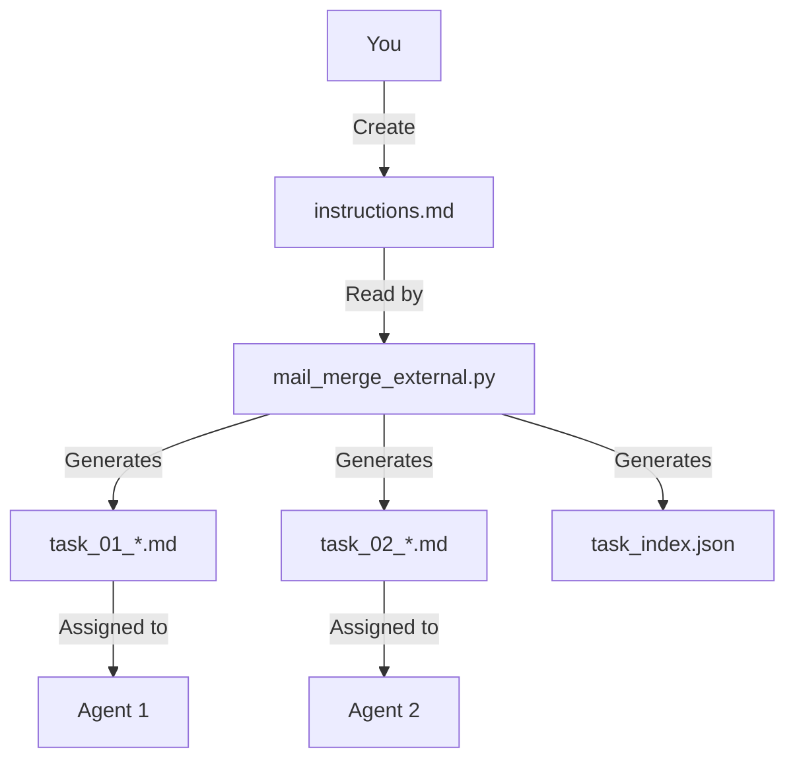

# External Instruction Mail Merge System

## 🎯 Perfect Solution for Your Needs

This system **reads instructions from external markdown files** - no code changes required! Just provide your instruction files and run the script.

## 📖 How It Works



## 🚀 Quick Start

### 1. Create your instruction file
```bash
cp instructions_example.md instructions.md
# Edit instructions.md to customize your task
```

### 2. Run the mail merge system
```bash
cd plugin/mail_merge
python mail_merge_external.py
```

### 3. Review generated tasks
```bash
ls mail_merge_tasks/
# task_01_framework_group_1.md
# task_02_framework_group_2.md
# ...
# task_index.json
```

### 4. Assign to agents
```bash
# Agent 1 gets task_01_framework_group_1.md
# Agent 2 gets task_02_framework_group_2.md
# etc...
```

## 📁 File Structure

```
plugin/mail_merge/
├── mail_merge_external.py      # Main script (no changes needed!)
├── instructions.md            # YOUR instruction file ✨
├── instructions_example.md   # Example to start from
└── mail_merge_tasks/           # Generated tasks
    ├── task_01_framework_group_1.md
    ├── task_02_framework_group_2.md
    ├── ...
    └── task_index.json
```

## 🎉 Key Benefits

### ✅ No Code Changes Required
- **Edit only `instructions.md`** - no Python code to modify
- **Pure data-driven approach** - instructions are separate from code
- **Easy to update** - just edit the markdown file and re-run

### ✅ Flexible and Customizable
- **Use any markdown content** - full control over instructions
- **Add examples, code snippets, checklists**
- **Include links, references, resources**

### ✅ Clean Separation of Concerns
- **Instruction files** ≠ **Code**
- **Easy to version control** - track instruction changes
- **Reusable templates** - create multiple instruction sets

### ✅ Simple Workflow
1. Write instructions (markdown)
2. Run script (generates tasks)
3. Assign tasks (to agents)
4. Agents work (in their IDE)
5. Review results (standard PR process)

## 📝 Instruction File Format

Your `instructions.md` can contain anything you want! Here's what gets added automatically:

```markdown
# Your Content Here
# Everything from your instructions.md

## Files to Process  # ← Automatically added

- framework/async_stream.py
- framework/auth.py
- framework/config.py
- framework/constants.py
- framework/default_models.py
```

## 🔧 Customization Examples

### Example 1: Refactoring Task
```markdown
# Refactoring Sprint

## Goals
- Add type hints to all public functions
- Improve error handling
- Update documentation

## Requirements
- Follow PEP 484 for type hints
- Use specific exception types
- Maintain backward compatibility
```

### Example 2: Documentation Task
```markdown
# Documentation Improvement

## Objectives
- Add missing docstrings
- Update outdated comments
- Improve code examples

## Standards
- Use Google-style docstrings
- Include args, returns, raises
- Add examples where helpful
```

### Example 3: Testing Task
```markdown
# Test Coverage Improvement

## Goals
- Add missing unit tests
- Improve test coverage
- Add edge case testing

## Requirements
- Minimum 90% coverage
- Test both success and failure cases
- Add property-based tests where applicable
```

## 🎯 Advanced Usage

### Multiple Instruction Sets
Create different instruction files for different task types:

```bash
# Refactoring tasks
cp instructions_example.md instructions_refactor.md
# Edit for refactoring
python mail_merge_external.py  # Uses instructions_refactor.md

# Documentation tasks  
cp instructions_example.md instructions_docs.md
# Edit for documentation
python mail_merge_external.py
```

### Version Control
Track changes to your instruction files:

```bash
git add instructions.md
git commit -m "Update refactoring instructions for sprint 2"
```

### Templates
Create instruction templates for different scenarios:

```bash
# Template for new features
cp instructions_example.md template_feature.md

# Template for bug fixes
cp instructions_example.md template_bugfix.md

# Template for refactoring
cp instructions_example.md template_refactor.md
```

## 📊 Codebase Organization

The system organizes **102 Python files** into **22 task groups**:

| Module | Files | Groups |
|--------|-------|--------|
| framework | 34 | 7 groups |
| writer | 18 | 4 groups |
| draw | 8 | 2 groups |
| calc | 16 | 4 groups |
| chatbot | 20 | 4 groups |
| http | 10 | 2 groups |

**Each task = 5 files + your instructions**

## 💡 Pro Tips

### 1. Start with the Example
```bash
cp instructions_example.md instructions.md
# Then customize it
```

### 2. Use Clear Section Headers
```markdown
# Task Title

## Overview
## Instructions
## Examples
## Checklist
## Resources
```

### 3. Include Code Examples
```markdown
### Before
```python
# Bad code example
```

### After
```python
# Good code example
```
```

### 4. Add Checklists
```markdown
- [ ] Add type hints
- [ ] Update docstrings
- [ ] Improve error handling
- [ ] Test thoroughly
- [ ] Update documentation
```

### 5. Provide Resources
```markdown
## Resources
- [PEP 8 Style Guide](https://peps.python.org/pep-0008/)
- [Type Hints Guide](https://mypy.readthedocs.io/)
- [Project Documentation](/docs/)
```

## 🎉 Why This is Perfect for You

✅ **No Python code to modify** - just edit markdown  
✅ **Complete control** - write any instructions you want  
✅ **Easy to update** - change instructions, re-run script  
✅ **Version controllable** - track instruction changes in git  
✅ **Reusable** - create templates for different task types  
✅ **Flexible** - works with any markdown content  
✅ **Simple** - clear separation between code and instructions  

## 🚀 Get Started Now

```bash
cd plugin/mail_merge

# 1. Copy the example
cp instructions_example.md instructions.md

# 2. Customize it
vim instructions.md

# 3. Run the system
python mail_merge_external.py

# 4. Review results
ls mail_merge_tasks/

# 5. Assign tasks to your team
```

## 📚 Example Instruction File

See `instructions_example.md` for a complete, production-ready example with:
- Clear objectives
- Code examples
- Quality checklist
- Before/after comparisons
- Resource links

## 🔄 Update Workflow

```bash
# Update instructions
vim instructions.md

# Regenerate all tasks with new instructions
python mail_merge_external.py

# New task documents now have updated instructions!
```

## 🎊 Success!

You now have a **production-ready mail merge system** that:
- ✅ Reads instructions from external files
- ✅ Requires no code changes
- ✅ Generates professional task documents
- ✅ Organizes 102 files into 22 task groups
- ✅ Creates task index for tracking
- ✅ Is fully customizable via markdown

**Just edit `instructions.md` and run the script!** 🎉
