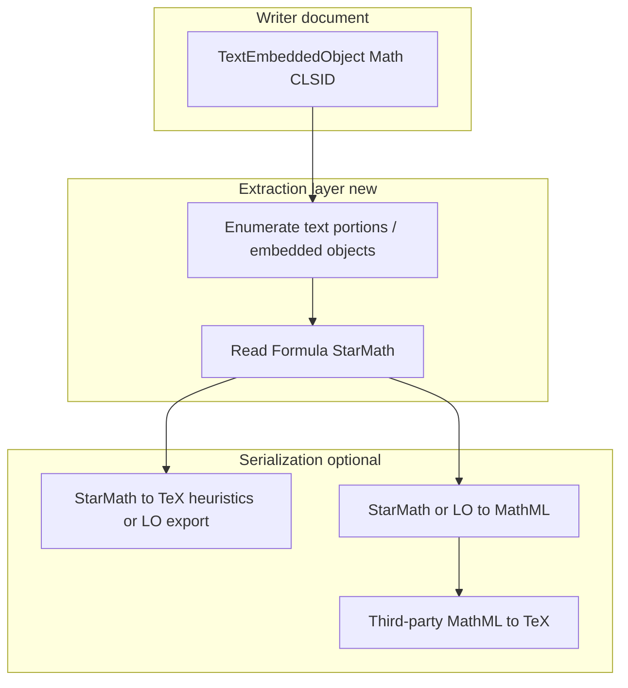

# Math extraction and LLM edit loops — developer plan

**Audience:** Contributors already familiar with WriterAgent’s UNO stack, HTML import, and tool boundaries.

**Status:** Roadmap / design notes. **Not implemented** end-to-end as of this document; import-side math is covered elsewhere.

**Related:** [libreoffice-html-math-dev-plan.md](libreoffice-html-math-dev-plan.md) (HTML → editable LO Math on insert), [libreoffice-html-math-proposal.md](libreoffice-html-math-proposal.md) (background).

---

## 1. Problem

Models interact with Writer through tools (notably `apply_document_content`) using **HTML fragments** that may contain:

- **TeX** in `$…$`, `$$…$$`, `\(...\)`, `\[...\]`, or
- **Presentation MathML** in `<math>…</math>`.

The extension **normalizes** both into **LibreOffice Math** embedded objects (`TextEmbeddedObject` with the Math CLSID) by way of **StarMath** command text (`Formula` on the embedded model). See:

- Segmentation: [`plugin/modules/writer/html_math_segment.py`](../plugin/modules/writer/html_math_segment.py)
- Conversion: [`plugin/modules/writer/math_mml_convert.py`](../plugin/modules/writer/math_mml_convert.py) (`convert_latex_to_starmath`, `convert_mathml_to_starmath`)
- Insertion: [`plugin/modules/writer/math_formula_insert.py`](../plugin/modules/writer/math_formula_insert.py)
- Orchestration: [`plugin/modules/writer/format_support.py`](../plugin/modules/writer/format_support.py) (`_insert_mixed_html_and_math_at_cursor`)

For a **second turn** (“edit this equation”), the model needs a **stable, prompt-friendly** representation of what is in the document. Today:

- **Input** path (TeX / MathML → object) is implemented.
- **Output** path (object → TeX or MathML for the model) is **not** a single supported product feature; document context and HTML export paths generally do not round-trip formulas as structured TeX/MathML the model originally sent.

This gap blocks reliable **math-aware edit**, **refactor**, and **verbatim reuse** of equations in multi-turn agent flows.

---

## 2. Goals and non-goals

### Goals (prioritized)

1. **Extract** inline/display formula objects from Writer text into a form suitable for LLM prompts and tool arguments (prefer **TeX** per product guidance in `WRITER_APPLY_DOCUMENT_HTML_RULES`; **MathML** as secondary interchange).
2. **Deterministic behavior** where possible: same document state → same serialized math (modulo known equivalences).
3. **Safe degradation**: if conversion fails, surface **StarMath** or a short diagnostic string rather than silent wrong math.
4. **Performance**: batch extraction for “all math in range” must not dominate chat latency; use hidden docs / caching only where measured necessary.

### Non-goals (initial phases)

- Bit-identical round-trip **TeX → LO → TeX** for arbitrary LaTeX (impossible in general; same as `latex2mathml` subset story).
- Replacing LibreOffice’s Math engine or fixing upstream MathML import quirks (track separately; see existing `newline` collapse notes in `math_mml_convert.py`).
- **Calc** cell formula strings (spreadsheet `=…`) — out of scope here; this doc is **Writer embedded math** only.

---

## 3. Canonical internal representation

After import, the **authoritative** in-document form is **StarMath** on the embedded object (`inner.Formula`), not the original TeX/MathML string (those are discarded once insertion succeeds).

Implications:

- Any “get it back out” pipeline starts from **UNO traversal** → read `Formula` → optional **StarMath → TeX/MathML** conversion layer.
- **Provenance** (original model TeX) is **lost** unless we add side channels (see §7).

---

## 4. Extraction architecture (target)

**Phase 0 — Inventory**

- Document UNO APIs used to iterate `XText` content and detect `TextEmbeddedObject` with [`math_formula_insert.MATH_CLSID`](../plugin/modules/writer/math_formula_insert.py).
- Confirm whether `getEmbeddedObject().Formula` is always sufficient for read-back on saved/reopened documents (expect yes for our insert path; verify edge cases: undo, ODF round-trip, clipboard).

**Phase 1 — StarMath export (MVP)**

- Implement a pure-Python (or UNO-only) helper: given `ctx` + `XTextDocument`, return ordered list of `{anchor_index_or_range, starmath, display_block_guess}` for formulas in a **paragraph range** or **selection**.
- Wire to **debug** or **internal API** first; no new user-facing tool until schemas and error contracts are stable.

**Phase 2 — Prompt-facing TeX or MathML**

- **Option A — StarMath → TeX:** LibreOffice / ODF may expose export filters (MathML, LaTeX) from formula documents — **spike in headless LO** before committing. If only StarMath is available, maintain a **small** translator for common constructs or accept StarMath-in-prompt with a system note (last resort for models).
- **Option B — MathML intermediate:** Export formula to MathML (if UNO/filter supports it), then optional **MathML → TeX** via a **lightweight** dependency (see **§5** — favor **small wheels**, avoid Saxon in-extension unless justified).
- **Option C — Dual payload in prompts:** `starmath` + `suggested_tex` when converter confident.

Acceptance: golden UNO tests on documents created via existing HTML math import (reuse patterns from [`plugin/tests/uno/test_writer_mathml_import.py`](../plugin/tests/uno/test_writer_mathml_import.py)).

**Phase 3 — Edit loop integration**

- **Extend / Edit selection** and **get_document_content** (or a dedicated `get_math_in_range` tool): include extracted TeX (or MathML) in structured JSON so the model can emit updated `apply_document_content` HTML that **targets** the same formula (by index, bookmark, or content signature — **design choice**; avoid fragile plain-text-only matching across objects).
- Define **mutation** semantics: replace-in-place embedded object vs delete+insert; preserve paragraph structure for display math.

---

## 5. Python libraries and codebases to consider

Everything here is **outside** WriterAgent’s tree unless noted. Use for **MathML → TeX** (after you obtain MathML from LO or elsewhere), **testing**, or **spikes** — not as decisions to bundle without license, size, and LO-runtime Python reviews.

| Name | PyPI / source | Role | Typical deps | Extension fit |
|------|---------------|------|----------------|-----------------|
| **mathml-to-latex** | [PyPI](https://pypi.org/project/mathml-to-latex/), [asnunes/py-mathml-to-latex](https://github.com/asnunes/py-mathml-to-latex) | Presentation MathML string → LaTeX string (`MathMLToLaTeX().convert`). Port of the JS **mathml-to-latex**. | Effectively **none** on modern Python (wheel ~32 KiB). | **First spike** for in-extension or offline eval: small, MIT. |
| **mml2tex** | [PyPI](https://pypi.org/project/mml2tex/) | Wraps **[transpect/mml2tex](https://github.com/transpect/mml2tex)** XSLT via Python. | **`lxml`**, pinned **`saxonche`**. | **Poor default for OXT:** heavy stack; better for **developer machines / CI** proving coverage on hard MathML. |
| **mathml2latex** | [PyPI](https://pypi.org/project/mathml2latex/), [KiaismAgre/mathml2latex](https://github.com/KiaismAgre/mathml2latex) | BS4-based Presentation MathML → LaTeX. | **beautifulsoup4**. | **Reference / narrow cases:** last release **2019**; audit before any dependency. |
| **mathml2tex** (davidchern) | [GitHub davidchern/mathml2tex](https://github.com/davidchern/mathml2tex) | Rule / BS-style MathML → TeX subset. | Usually **bs4**-class stack. | Treat like **mathml2latex**: useful ideas, verify license + tests. |
| **latex2mathml** (upstream) | [roniemartinez/latex2mathml](https://github.com/roniemartinez/latex2mathml) | **Forward only** (TeX → MathML). No inverse API. | Pure Python (already a WriterAgent dependency on **import**). | Use **`tests/` fixtures** as **golden pairs** for round-trip experiments (`TeX → MathML → ? → TeX′`), not as reverse engine. |
| **SymPy** | [sympy](https://pypi.org/project/sympy/) | `latex(expr)` and MathML **printers** from symbolic expressions. | Large package. | **Wrong primary tool:** not a general “parse arbitrary `<math>` document fragment → LaTeX” pipeline; only if you already have a **SymPy** `Expr`. |

**In-repo building blocks (not reverse converters):**

- [`math_mml_convert.py`](../plugin/modules/writer/math_mml_convert.py) — `convert_mathml_to_starmath`, `convert_latex_to_starmath`; reuse for **forward** tests and for understanding **StarMath** shape after LO import.
- [`math_formula_insert.MATH_CLSID`](../plugin/modules/writer/math_formula_insert.py) — identify embedded objects during UNO walks.

**Suggested evaluation order:** (1) UNO-only: read `Formula` (StarMath) and ship that in prompts if models tolerate it; (2) if TeX is required, try **mathml-to-latex** after any LO MathML export spike; (3) use **mml2tex** off-extension to judge quality ceiling; (4) mine **latex2mathml** tests + **mathml2latex** / **mathml2tex** source for edge-case ideas before writing a custom walker.

---

## 6. Risks and constraints

| Risk | Mitigation |
|------|------------|
| Extension Python baseline (e.g. 3.10) | Any new dependency must support that baseline; no stdlib features from 3.11+ without guards. |
| Dependency weight | Prefer stdlib + LO; second choice small pure-Python; avoid bundling Saxon/lxml stacks unless offline evaluation proves need. |
| Ambiguous StarMath → TeX | Document known non-invertible cases; tests with tolerance; never claim full LaTeX equivalence. |
| Security / prompt injection | Serialized math is still user/attacker-controlled text; treat like any document excerpt (length caps, redaction policy consistent with chat context). |

---

## 7. Optional: preserving original model TeX

If product requires **verbatim** original TeX for legal or reproducibility reasons:

- **User-defined properties** on the paragraph or a hidden **bookmark + JSON** payload (fragile across edits).
- **OLE user fields** / custom metadata on the embedded object (if UNO exposes writable bags — needs spike).
- **Sidecar** `writeragent.json` or per-doc auxiliary file (deployment and sync cost).

Default recommendation: **do not** block Phase 1–2 on provenance; add if a concrete product asks.

---

## 8. KaTeX / MathJax annotations (fast path when present)

When future HTML import accepts MathML with `<annotation encoding="application/x-tex">`, **prefer extracting annotation text** when round-tripping that fragment (see dev-plan backlog in [libreoffice-html-math-dev-plan.md](libreoffice-html-math-dev-plan.md)). This avoids inventing TeX from Presentation MathML. **Orthogonal** to UNO StarMath read but should be **one code path** in the eventual “serialize math for prompt” function.

---

## 9. Deliverables checklist (for implementers)

- [ ] UNO enumerator for Math embedded objects + `Formula` read-back + unit/UNO tests.
- [ ] Serialization strategy chosen (A/B/C) with written rationale and dependency list.
- [ ] Prompt/tool contract: JSON shape, max length, error when conversion fails.
- [ ] Integration point documented in `AGENTS.md` and [libreoffice-html-math-dev-plan.md](libreoffice-html-math-dev-plan.md) once shipped.
- [ ] No regression to HTML import path (existing tests green).

---

## 10. References (LibreOffice / UNO)

Consult current DevGuide / API for:

- `com.sun.star.text.TextEmbeddedObject`
- Formula document service and `Formula` property
- Any `XEmbeddedObject` or storage export APIs for Math → MathML

Exact service names vary by LO version; **verify against the versions you ship for**.

---

## Document history

| Date | Change |
|------|--------|
| 2026-04-29 | Initial roadmap from import pipeline and reverse-serialization research. |
| 2026-04-29 | §5: Python third-party and in-repo candidates table; renumber following sections; §5 cross-link from Phase 2. |
