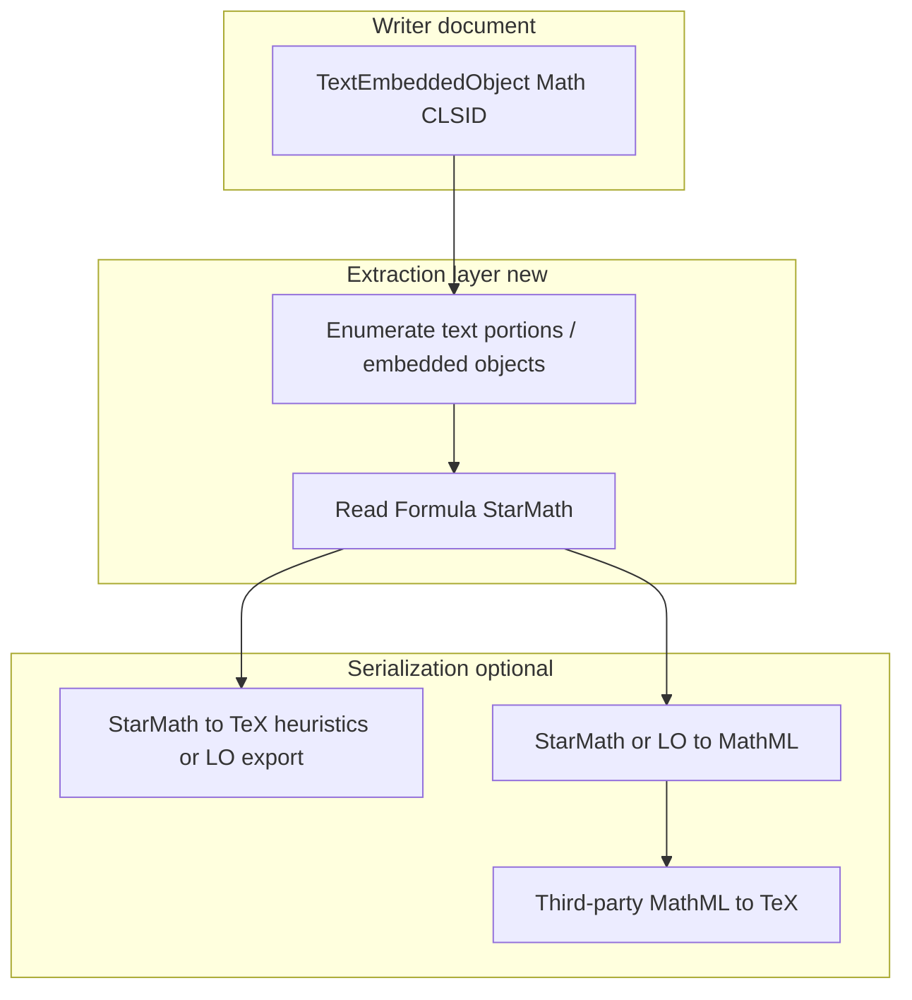
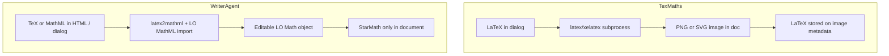

# Math, LaTeX, and TeX in WriterAgent

## Purpose

Canonical design and execution reference for **editable math** in WriterAgent: HTML/LaTeX/TeX import into LibreOffice Writer, shipped implementation status, reverse extraction roadmap, and TexMaths interop ideas. Consolidated from the former proposal, dev plan, and extraction plan (2026-05).

## Current status (read this first)

| Stage | Status | Notes |
|--------|--------|--------|
| **Phase 0** (spike) | **Done** | MathML → temp `.mml` → LO Math `Formula` → Writer `TextEmbeddedObject`; proven in shipped code + UNO tests. |
| **Phase 1** (MathML MVP) | **Done** (core) | Segmentation, mixed HTML import, inline/display, tests, StarMath `newline` collapse for Writer embeds. Gaps called out in [Phase 1](#phase-1-mathml-mvp) below. |
| **Phase 2** (TeX fallback) | **Done** (core) | Delimiters `$…$`, `$$…$$`, `\(...\)`, `\[...\]`; `latex2mathml` → same LO MathML path; mixed scan + precedence in `html_math_segment.py`; `convert_latex_to_starmath` in `math_mml_convert.py`; prompts in `constants.py` / `apply_document_content` schema. Optional: KaTeX `<annotation encoding="application/x-tex">` retry on MathML failure (not implemented). |
| **Phase 3** (robustness) | **Not started** | See [Phase 3](#phase-3-robustness-and-quality). |

**Shipped modules (WriterAgent):** `html_math_segment.py` (MathML + TeX segmentation), `math_mml_convert.py` (MathML + LaTeX→MathML→StarMath), orchestration in `format_support.py` (`html_fragment_contains_mixed_math`, `content_has_markup` TeX patterns); trusted SymPy helpers (`symbolic_math` tool, Run Python Script **[Math]**) insert via `symbolic_egress.py` → `convert_latex_to_starmath` → `insert_writer_math_formula`; vendored **`latex2mathml`** via `requirements-vendor.txt` (see `pyproject.toml` dev group for typecheck); tests under `plugin/tests/` and `plugin/tests/uno/`; agent context in `AGENTS.md`; model hints in `plugin/framework/constants.py` (`WRITER_APPLY_DOCUMENT_HTML_RULES`) and `plugin/writer/content.py` (`ApplyDocumentContent`).

**Next priorities (pick from):** Phase 3 quality; Phase 1 backlog (test matrix, optional `warnings` in tool return); optional `"".join` for `apply_document_content` list `content`; policy for true multi-line / `mtable` vs global `newline` stripping; trim DEBUG logging; upstream LO Writer OLE + `newline` rendering; optional KaTeX annotation fallback; TexMaths-inspired UX/interop ([TexMaths feature review](#texmaths-feature-review-porting-candidates)).

## Problem statement

WriterAgent already has a working HTML import path for normal rich text. That path is good for prose, lists, headings, and tables, but it is not a reliable way to preserve math as editable equation objects.

For math-heavy content, we want this behavior:

- imported HTML with math should produce **real LibreOffice Math objects**
- formulas should remain **editable** in Writer
- non-math HTML should continue using the current import flow
- failures should degrade gracefully and visibly

## Product goal

When WriterAgent receives HTML containing supported math, the user should get a normal Writer document with:

- paragraphs, headings, tables, and formatting preserved as they are today
- inline equations inserted as inline LibreOffice Math objects
- display equations inserted as block-style LibreOffice Math objects
- formulas editable by double-clicking them in Writer

## Non-goals for v1

These are explicitly out of scope for the first implementation:

- arbitrary CSS-drawn visual math with no underlying MathML or TeX source
- full TeX compatibility from day one
- image-first equation rendering
- broad redesign of the current HTML import system
- automatic repair of every malformed or unsupported formula

## Background and rationale

WriterAgent's HTML import uses LibreOffice's HTML filter (`insertDocumentFromURL(..., FilterName="HTML (StarWriter)")`). That works for prose, headings, lists, and tables, but **not** for turning HTML-embedded math into editable LibreOffice Math objects.

> Do not try to make HTML import "understand equations".
> Instead, extract math from the HTML, convert it to StarMath, and insert real LibreOffice formula objects.

### Why LibreOffice Math objects (not HTML filter math)

1. **LibreOffice Math is editable through command strings** — `Formula` on `com.sun.star.formula.FormulaProperties` is StarMath markup; the programmatic target is a Writer formula object, not HTML with math inside it.

2. **MathML imports only through dedicated math paths** — `Tools > Import Formula`, clipboard MathML import, etc. MathML and StarMath are not fully compatible; some imports need revision. This is separate from generic HTML import.

3. **Generic HTML/XHTML is not a dependable math round-trip** — HTML with embedded math is not reliably converted to editable formula objects during normal document conversion.

### Web math input forms

Most web math appears as:

- literal MathML: `<math ...>...</math>`
- KaTeX output: HTML plus embedded MathML (`htmlAndMathml` default)
- MathJax output: MathML serialization when present
- raw TeX delimiters: `$...$`, `$$...$$`, `\(...\)`, `\[...\]`

The task is **detect math islands inside HTML**, then convert through a math-aware pipeline — not teach the HTML filter math.

### Conversion strategy (forward path)

**Preferred target:** StarMath on the Writer object's `Formula` property (editable, native, no browser rendering).

**Preferred MathML path:** Let LibreOffice convert — write temp `.mml`, import via LO Math, read back `Formula`, insert Writer formula object. Caveat: complex MathML may need cleanup.

**Fallback if UNO MathML import is brittle:** Small internal MathML→StarMath subset (identifiers, operators, scripts, fractions, roots, fences, rows, matrices, simple integrals/sums) — **not built**; LO path proved sufficient.

### Why this fits WriterAgent

Math is a **specialized preprocessor** in front of `format_support.py` HTML import — not a rewrite of the whole stack. Math has its own representation, failure modes, and insertion semantics (see also [writer-specialized-toolsets.md](writer-specialized-toolsets.md); equations ship on core `apply_document_content`, not a separate specialized domain).

### External references (research)

- LibreOffice Help, [Import Formula](https://help.libreoffice.org/latest/en-US/text/smath/01/06020000.html)
- LibreOffice Math Guide 25.2, [Exporting and importing](https://books.libreoffice.org/en/MG252/MG25205-ExportingImporting.html)
- LibreOffice Math Features: <https://help.libreoffice.org/latest/en-US/text/smath/main0503.html>
- SDK API, [FormulaProperties](https://api.libreoffice.org/docs/idl/ref/servicecom_1_1sun_1_1star_1_1formula_1_1FormulaProperties.html)
- KaTeX options (`htmlAndMathml`): <https://katex.org/docs/options>
- MathJax MathML: <https://docs.mathjax.org/en/latest/output/mathml.html>
- [MathML import into LibreOffice](https://stackoverflow.com/questions/10300067/how-to-load-and-mathml-formula-into-libreoffice)
- [MathML lost in HTML/XHTML conversion](https://stackoverflow.com/questions/73396787/losing-mathml-when-converting-from-html-to-docx-using-libreoffice)

## User-visible definition of success

The feature is successful when all of the following are true:

1. simple HTML with `<math>` imports as editable LibreOffice formula objects
2. KaTeX-style HTML containing embedded MathML imports as editable formulas
3. normal non-math HTML still imports correctly
4. unsupported math does not silently disappear
5. the implementation is covered by unit tests and UNO tests

**As of 2026-04:** (1)–(4) are **met** for MathML-backed HTML; (5) is **met for core paths** with gaps listed under Phase 1 **Not done yet** (full matrix, structured tool warnings). **As of Phase 2 ship:** common TeX-delimited math in the same HTML import path meets the same visibility and test bar as MathML for core cases (subset of LaTeX via `latex2mathml`; not full TeX compatibility).

## Recommended release strategy

Ship this in three stages (Phase 0–2 are **complete in code** for core paths; Phase 3 remains):

1. **Prototype spike** — **done** (validated as part of Phase 1 delivery).
2. **Phase 1 MVP** — **done** (MathML-aware HTML import; see gaps in the Phase 1 section).
3. **Phase 2 TeX** — **done** (core delimiter path + tests + prompts); Phase 3 robustness / quality **not done**.

This keeps risk low and gives us a natural checkpoint after the hardest technical unknown is resolved.

## Proposed architecture

### High-level flow

The new import pipeline should be:

1. receive HTML input
2. detect whether math is present
3. if no math is present, use the existing HTML import flow unchanged
4. if math is present, parse the content into a sequence of:
   - normal HTML/text segments
   - math segments
5. convert each math segment into a LibreOffice Math command string
6. insert normal HTML segments through the current import helpers
7. insert math segments as real formula objects at the correct position

### Design principle

Do not try to teach the generic HTML filter to understand equations.

Instead, build a thin math-aware layer in front of the existing HTML import system.

### Input detection precedence

When multiple representations exist in one fragment, prefer the most structured source (left-to-right scan: earliest `<math` or TeX opener wins):

1. explicit MathML (`<math>`)
2. KaTeX or MathJax embedded MathML
3. preserved original TeX in attributes/annotations (backlog: auto-mine on MathML failure)
4. raw TeX delimiters in plain text

### Inline vs display math

- **Inline:** formula object at cursor within the paragraph.
- **Display:** paragraph breaks around the object so it stands on its own line.

### Preferred conversion target

The insertion target is a Writer formula object backed by LibreOffice Math, with the final formula stored as a StarMath command string through the UNO `Formula` property.

## Scope by phase

## Phase 0: Technical spike

**Status: Done** (subsumed into shipped Phase 1; no separate throwaway prototype remains).

### Objective

Validate the hardest technical question first:

Can we reliably turn a MathML string into an editable Writer formula object via UNO?

### Deliverable

Originally a standalone prototype; **delivered** as production helpers + tests:

- [x] One MathML string → Writer formula object via UNO
- [x] LibreOffice MathML import reused (hidden Math doc from temp `.mml`)
- [x] `Formula` read back and post-processed for Writer embed (`newline` collapse)
- [x] Inline vs block insertion path (`math_formula_insert` + `display="block"` / `mode="display"`)
- [x] Failure modes: visible `[Math import failed]…` fallback + debug logging

### Tasks

1. [x] UNO insertion pattern for Writer formula objects (`TextEmbeddedObject` + Math CLSID)
2. [x] Reuse LibreOffice MathML import programmatically
3. [x] Read `Formula` from imported Math document
4. [x] Inline vs block constraints (coded + UNO-tested)
5. [x] Document failure modes (this plan + `AGENTS.md` + in-code comments)

### Exit criteria

**Met:** **preferred path** — LibreOffice converts MathML to StarMath well enough to reuse. **Internal MathML→StarMath converter** not required for MVP.

## Phase 1: MathML MVP

**Status: Done (core pipeline).** Remaining gaps are explicit under **Not done yet** so they are not mistaken for future phases.

### Objective

Support the most structured and realistic first wave of HTML math inputs.

### Supported inputs

| Input | Status |
|--------|--------|
| Explicit `<math>…</math>` | **Done** |
| KaTeX / MathJax HTML that **contains** `<math>` (same extractor) | **Done** (no separate DOM fingerprint beyond `<math>`) |
| Math-heavy HTML **without** `<math>` but **with** TeX delimiters (`$…$`, `$$…$$`, `\(...\)`, `\[...\]`) | **Done** (Phase 2; subset of LaTeX) |
| Math-heavy HTML **without** `<math>` or TeX (CSS-only / no machine-readable math) | **Not in scope** (non-goals) |

### Functional scope

| Item | Status |
|------|--------|
| Detect math-bearing HTML (`<math`) | **Done** |
| Segment into ordered HTML + math runs | **Done** |
| Preserve order in document | **Done** |
| Inline formulas | **Done** |
| Display (`display="block"`, `mode="display"`) as own paragraph | **Done** |
| Non-math HTML unchanged when no math markers (`<math` / TeX delimiters) | **Done** |

### Tasks

1. [x] Math detection (`html_fragment_contains_mathml`; Phase 2 adds `html_fragment_contains_tex_math` / `html_fragment_contains_mixed_math`)
2. [x] Segmentation (`segment_html_with_mixed_math`; `segment_html_with_mathml` is an alias)
3. [x] Formula insertion (`math_formula_insert.py`)
4. [x] MathML → StarMath (`math_mml_convert.py`, LO Math doc + `collapse_starmath_newline_tokens_for_writer_embed`)
5. [x] Orchestration (`format_support.py`, all `insertDocumentFromURL` entry paths + cursor-to-end after each segment)
6. [x] Unsupported conversion: `[Math import failed]…` text + debug log (not structured tool JSON)
7. [x] Tests: unit + UNO (not every row of the “minimum test matrix” below—see **Not done yet**)

### Acceptance criteria

| Criterion | Status |
|-----------|--------|
| Inline MathML → inline editable formula | **Done** (UNO + real usage) |
| Display MathML → block formula | **Done** |
| Surrounding prose order | **Done** |
| Headings / paragraphs / tables without math unchanged | **Done** (regression via existing + new tests) |
| Unsupported math not silently dropped | **Done** (visible fallback string) |

### Code map (WriterAgent)

| Area | Module |
|------|--------|
| Segmentation (MathML + TeX order) | [`plugin/writer/html_math_segment.py`](../plugin/writer/html_math_segment.py) |
| MathML → StarMath; LaTeX → MathML (`latex2mathml`) → StarMath; `newline` mitigation | [`plugin/writer/math_mml_convert.py`](../plugin/writer/math_mml_convert.py) |
| OLE insert | [`plugin/writer/math_formula_insert.py`](../plugin/writer/math_formula_insert.py) |
| HTML + math orchestration, `content_has_markup` (`<math`, `$$`, `\(`, `\[`) | [`plugin/writer/format_support.py`](../plugin/writer/format_support.py) |
| Chat / tool text for `apply_document_content` | [`plugin/framework/constants.py`](../plugin/framework/constants.py) (`WRITER_APPLY_DOCUMENT_HTML_RULES`: prompt recommends inline `\\(...\\)` only; parser also accepts display delimiters `$...$`, `$$...$$`, `\\[...\\]`), [`plugin/writer/content.py`](../plugin/writer/content.py) (`ApplyDocumentContent`) |
| Unit tests | `plugin/tests/test_html_math_segment.py`, `plugin/tests/test_math_mml_convert.py` |
| UNO tests | `plugin/tests/uno/test_writer_mathml_import.py` (MathML + TeX cases) |
| Agent orientation | [`AGENTS.md`](../AGENTS.md) |

### Implementation notes (LibreOffice / Writer)

- **StarMath `newline` (word)** — Not ASCII `\n`. LibreOffice MathML import builds a root layout that serializes with the `newline` **operator** (`starmath` `SmNodeToTextVisitor`, root table-of-lines from `mathmlimport.cxx`). Writer’s **embedded** formula paint often showed **`?`** per `newline`; we **collapse** those tokens for Writer embeds in `math_mml_convert.py` (comment points at LO sources). **Tradeoff:** true multi-line / `mtable` via `newline` is not preserved until we add a policy (see **Current status**).
- **List `content` arrays** — `"\n".join` still used in `apply_document_content`; newlines stay **between** HTML fragments only; optional change to `"".join` is backlog, not done.
- **Cursor** — After each `insertDocumentFromURL`, cursor must move to document end or later segments overwrite earlier HTML.
- **DEBUG logging** — Optional verbose logs in `content.py` / `format_support.py` / `math_mml_convert.py`; trim or gate when stable.

### Not done yet (still Phase 1 scope or immediate backlog)

These are **not** Phase 2 TeX work unless noted:

- [ ] Full **minimum test matrix** row coverage (e.g. malformed MathML fixture, KaTeX-shaped HTML file fixture, table-with-math) beyond what `test_writer_mathml_import` already hits.
- [ ] **Structured** tool errors / `warnings` array on `apply_document_content` return JSON (today: plain fallback string + logs).
- [ ] **KaTeX/MathJax DOM** detection without relying on `<math>` (only needed if we must handle math with no MathML).
- [ ] **Reviewer-facing** example document set in-repo (optional `docs/` or fixtures zip).

## Phase 2: TeX-aware fallback

**Status: Done (core).** Stretch / backlog: KaTeX-style `<annotation encoding="application/x-tex">` retry when MathML import fails (not implemented).

### Objective

Handle common sources where the HTML contains TeX source or TeX-style delimiters rather than clean MathML.

### Supported inputs

- `$...$`
- `$$...$$`
- `\(...\)`
- `\[...\]`
- TeX annotations preserved in upstream KaTeX/MathJax output (**not** auto-mined yet; prefer embedded `<math>` when present)

### Tasks

1. [x] TeX source detection (`html_fragment_contains_tex_math`, `html_fragment_contains_mixed_math`)
2. [x] Precedence rules between MathML and TeX when both are present (left-to-right; earliest opener wins)
3. [x] TeX normalization/conversion approach (vendored `latex2mathml` → MathML string → existing LO path)
4. [x] Convert TeX → MathML → StarMath (`convert_latex_to_starmath` in `math_mml_convert.py`)
5. [x] Reuse Phase 1 formula insertion path (`insert_writer_math_formula` unchanged)
6. [x] Tests for mixed HTML + TeX (unit + UNO in `test_writer_mathml_import.py` and `test_html_math_segment.py`)

### Acceptance criteria

| Criterion | Status |
|-----------|--------|
| common TeX snippets render as editable formulas | **Done** (core UNO + unit coverage) |
| structured MathML remains preferred when both forms are available | **Done** (document order: earliest `<math` or TeX opener wins; prompts tell models to emit MathML first when the source already has it) |
| conversion failures are visible and non-destructive | **Done** (same `[Math import failed]…` path as MathML) |

## Phase 3: Robustness and quality

**Status: Not started.**

### Objective

Improve quality and reduce edge-case regressions after MVP ships.

### Focus areas

- spacing and baseline behavior for inline formulas
- better support for matrices and aligned expressions
- improved fallback messaging
- better diagnostics in logs
- broader compatibility across real-world generated HTML

### Acceptance criteria

- formula placement feels natural in ordinary Writer paragraphs
- representative complex formulas degrade gracefully
- debugging failed conversions is possible from logs and test output

## Work breakdown by implementation area

Cross-cutting status: **1** done for MathML + common TeX delimiters; KaTeX/MathJax **without** `<math>` or TeX markers still **not done**. **2** done (LO MathML + `latex2mathml` → MathML). **3** done (insertion). **4** partial (structured tool warnings). **5** partial (see Phase 1 **Not done yet**).

## 1. Parsing and detection

**Status: Partial — MathML + TeX delimiter path done; KaTeX DOM-only / `<annotation>` retry not done.**

### Goal

Detect supported math reliably before content hits the normal HTML filter.

### Expected work

| Item | Status |
|------|--------|
| `<math>` tags | **Done** (`html_math_segment.py`) |
| KaTeX / MathJax DOM signatures (without `<math>`) | **Not done** |
| TeX delimiters (`$`, `$$`, `\(\)`, `\[...\]`) | **Done** (`html_math_segment.py`) |
| Segmentation preserving source order | **Done** |
| DOM vs token vs hybrid | **Done** for MVP: tag-boundary scan on string (not full HTML5 DOM) |

### Review questions

- does the parser avoid corrupting non-math HTML? — **Yes** for segments; HTML still goes through LO filter per chunk.
- does detection prefer structured sources over heuristic guesses? — **Partial**: left-to-right earliest opener; prompts and typical KaTeX output favor emitting `<math>` first when both exist.

## 2. Conversion

**Status: Done** for LO-backed MathML and for **TeX → MathML** via vendored `latex2mathml` then the same LO path; internal standalone MathML→StarMath converter **not built** (not required).

### Goal

Convert detected math into a form LibreOffice Writer can insert as editable formulas.

### Preferred implementation

Use LibreOffice's own MathML import/conversion path where practical. — **Done.**

### Fallback implementation

Internal MathML → StarMath subset converter if UNO path fails. — **Not done** (not required after spike).

TeX → MathML (`latex2mathml`) before LO import. — **Done** (Phase 2).

### Review questions

- what exact subset of MathML is supported in MVP? — **Whatever LO imports**; failures → fallback string.
- where does conversion fail, and how is that reported? — **Visible text + debug log**; not structured API.
- undocumented LO behavior? — **Yes** (accepted); `newline` behavior documented in Phase 1 notes.

## 3. Writer insertion

**Status: Done.**

### Goal

Insert formulas as real document objects without breaking the existing content flow.

### Expected work

| Item | Status |
|------|--------|
| Create / insert formula objects | **Done** |
| Set `Formula` via UNO | **Done** |
| Inline vs display | **Done** |
| Paragraph handling for block display | **Done** (breaks around object) |

## 4. Error handling and fallback

**Status: Partial.**

### Goal

Make unsupported math visible, recoverable, and non-destructive.

### Expected behavior

| Item | Status |
|------|--------|
| Do not silently drop | **Done** |
| Visible fallback | **Done** (`[Math import failed]…`) |
| Structured warning in tool return | **Not done** |
| Log context for debug | **Done** (DEBUG lines; deep redaction TBD) |

## 5. Testing

**Status: Partial** — core unit + UNO present; matrix rows in “minimum test matrix” not all dedicated tests.

### Goal

Meet the repo standard for both logic coverage and UNO-backed document behavior.

### Required test layers

| Layer | Status |
|-------|--------|
| Unit: detection, segmentation, conversion helpers, collapse | **Done** |
| UNO: insert, mixed HTML, `apply_document_content` | **Done** |
| UNO: every matrix row below | **Partial** |

### Minimum test matrix

| Case | Status |
|------|--------|
| simple inline fraction | **Covered** (via real MathML + UNO) |
| simple display equation | **Covered** (UNO) |
| multiple formulas in one fragment | **Covered** (usage + segments) |
| mixed text + formula + text | **Covered** (UNO / integration) |
| KaTeX-style HTML with embedded MathML | **Light** (unit segment test; no large fixture file) |
| TeX-only + mixed MathML + TeX in HTML | **Covered** (unit + UNO core cases) |
| malformed or unsupported MathML | **Light** (segmentation unclosed-math; dedicated malformed conversion test optional) |

## Milestones

## Milestone 1: Spike complete

**Status: Done.**

Deliverables:

- [x] documented result (this plan + code comments)
- [x] chosen conversion strategy (LO Math temp `.mml`)
- [x] blockers identified and mitigated (`newline`, cursor)

Go/no-go decision:

- proceed to MVP only if formula insertion is proven viable — **Done; MVP shipped.**

## Milestone 2: MathML MVP complete

**Status: Done (core);** reviewer examples + full test matrix still optional (Phase 1 **Not done yet**).

Deliverables:

- [x] math-aware HTML import for MathML-backed input
- [x] passing unit tests (core)
- [x] passing UNO tests (core)
- [ ] reviewer-ready examples (optional backlog)

Go/no-go decision:

- ship behind normal feature flow if regression risk is acceptable — **Product decision** (implementation is in tree).

## Milestone 3: TeX fallback complete

**Status: Done (core).**

Deliverables:

- [x] TeX-aware support for common delimiters
- [x] extended tests (unit + UNO; not every matrix row)
- [x] documented support boundaries (`AGENTS.md`, this plan, `WRITER_APPLY_DOCUMENT_HTML_RULES`, tool schema)

## Risks

## Risk 1: LibreOffice MathML import quality is inconsistent

### Impact

Some formulas may import imperfectly even if the pipeline works.

### Mitigation

- start with a narrow supported subset
- keep graceful fallback behavior
- verify representative fixtures early

## Risk 2: UNO insertion is more brittle than expected

### Impact

The preferred architecture may stall on integration details.

### Mitigation

- isolate the spike first
- keep the fallback path open
- avoid coupling the whole HTML system to one uncertain API trick

## Risk 3: Mixed content ordering becomes hard to preserve

### Impact

Text and formulas could appear in the wrong order or with broken paragraph structure.

### Mitigation

- design around ordered segments from day one
- add mixed-content UNO tests before broad rollout

## Risk 4: Edge-case parsing expands scope too quickly

### Impact

The implementation could become an open-ended parser project.

### Mitigation

- clearly define MVP input types
- reject unsupported forms explicitly
- postpone exotic TeX / package coverage beyond `latex2mathml` (Phase 3 / ongoing)

## Open product decisions

| # | Question | Resolution (as of 2026-04) |
|---|-----------|----------------------------|
| 1 | Visible fallback for unsupported formulas: plain text, marker, or both? | **Marker + snippet** — `[Math import failed]` plus truncated source in document; not silent. |
| 2 | Ship MathML-only before TeX? | **Yes** historically; **Phase 2 TeX path is now shipped** (MathML still preferred in prompts). |
| 3 | Auto-repair malformed MathML? | **No** — unclosed `<math>` tails fall back to HTML segment behavior; no repair pass. |
| 4 | Warnings in logs only vs tool JSON? | **Logs + visible insert** — structured `warnings` in `apply_document_content` return **not implemented** (backlog). |

## Task sequence (for agents)

**Completed (Phase 0–1):**

1. [x] Formula insertion from MathML via UNO
2. [x] Conversion path (LO Math `.mml` import)
3. [x] Writer formula helper
4. [x] Math detection + segmentation
5. [x] Wire into `format_support` HTML import paths
6. [x] Unit tests (segmentation, StarMath collapse)
7. [x] UNO tests (conversion, mixed insert, tool path)
8. [x] Non-math HTML regression (existing suite + new cases)
9. [x] StarMath `newline` mitigation for Writer embeds

**Completed (Phase 2 — core):**

10. [x] TeX delimiter detection + mixed segmentation (`html_math_segment.py`)
11. [x] `convert_latex_to_starmath` + `format_support` wiring + `content_has_markup` TeX patterns
12. [x] Unit + UNO tests for TeX and mixed MathML/TeX
13. [x] Model/tool copy (`constants.py`, `content.py`)

**Remaining (pick order):**

- [ ] Phase 1 backlog: full test matrix, optional `warnings` in tool return, reviewer examples
- [ ] Optional: `"".join` for list `content` in `apply_document_content`
- [ ] Phase 2 stretch: KaTeX `<annotation encoding="application/x-tex">` retry on failed MathML import
- [ ] Phase 3: robustness
- [ ] Trim DEBUG logging when stable
- [ ] TexMaths-inspired provenance, edit-selected, legacy interop ([TexMaths feature review](#texmaths-feature-review-porting-candidates))

## Reviewer checklist

- is the supported scope narrow and realistic for MVP? — **Yes** (MathML in HTML; TeX is a bounded subset via `latex2mathml`, not full LaTeX).
- is the hardest technical unknown resolved before broad coding starts? — **Yes** (spike folded into MVP).
- does the plan preserve the existing HTML import path for non-math content? — **Yes**.
- are failure modes visible and non-destructive? — **Yes** (string fallback; structured warnings optional).
- are both unit tests and UNO tests included? — **Core yes**; full matrix partial — see §5 Testing.
- are inline and display behaviors explicitly covered? — **Yes** (code + UNO).

## Implementation handoff summary

Work **after** Phase 2 (core) should assume:

- **Done:** MathML-in-HTML → editable Writer formulas via preprocess + LO conversion + `newline` collapse.
- **Done (core):** TeX delimiters in the same HTML strings → `latex2mathml` → MathML → same LO path + insertion.
- **Primary backlog:** Phase 3 quality; Phase 1 “Not done yet” polish; optional Phase 2 stretch (annotation retry).
- **Architecture rule:** keep preprocessing in front of the StarWriter HTML filter; do not teach the HTML filter math.
- **Testing rule:** extend matrix rows and tool JSON when adding features.
- **Fallback rule:** never silently lose formulas (unchanged).

## Math extraction and edit loops (roadmap)

**Status:** Not implemented end-to-end. **Import** (TeX/MathML → editable LO Math) is shipped; see phases above.

## Extraction problem

Models interact with Writer through tools (notably `apply_document_content`) using **HTML fragments** that may contain:

- **TeX** in `$…$`, `$$…$$`, `\(...\)`, `\[...\]`, or
- **Presentation MathML** in `<math>…</math>`.

The extension **normalizes** both into **LibreOffice Math** embedded objects (`TextEmbeddedObject` with the Math CLSID) by way of **StarMath** command text (`Formula` on the embedded model). See:

- Segmentation: [`plugin/writer/html_math_segment.py`](../plugin/writer/html_math_segment.py)
- Conversion: [`plugin/writer/math_mml_convert.py`](../plugin/writer/math_mml_convert.py) (`convert_latex_to_starmath`, `convert_mathml_to_starmath`)
- Insertion: [`plugin/writer/math_formula_insert.py`](../plugin/writer/math_formula_insert.py)
- Orchestration: [`plugin/writer/format_support.py`](../plugin/writer/format_support.py) (`_insert_mixed_html_and_math_at_cursor`)

For a **second turn** (“edit this equation”), the model needs a **stable, prompt-friendly** representation of what is in the document. Today:

- **Input** path (TeX / MathML → object) is implemented.
- **Output** path (object → TeX or MathML for the model) is **not** a single supported product feature; document context and HTML export paths generally do not round-trip formulas as structured TeX/MathML the model originally sent.

This gap blocks reliable **math-aware edit**, **refactor**, and **verbatim reuse** of equations in multi-turn agent flows.

---

## Extraction goals and non-goals

### Goals (prioritized)

1. **Extract** inline/display formula objects from Writer text into a form suitable for LLM prompts and tool arguments (prefer **TeX** per product guidance in `WRITER_APPLY_DOCUMENT_HTML_RULES`; **MathML** as secondary interchange).
2. **Deterministic behavior** where possible: same document state → same serialized math (modulo known equivalences).
3. **Safe degradation**: if conversion fails, surface **StarMath** or a short diagnostic string rather than silent wrong math.
4. **Performance**: batch extraction for “all math in range” must not dominate chat latency; use hidden docs / caching only where measured necessary.

### Non-goals (initial phases)

- Bit-identical round-trip **TeX → LO → TeX** for arbitrary LaTeX (impossible in general; same as `latex2mathml` subset story).
- Replacing LibreOffice’s Math engine or fixing upstream MathML import quirks (track separately; see existing `newline` collapse notes in `math_mml_convert.py`).
- **Calc** cell formula strings (spreadsheet `=…`) — out of scope here; this doc is **Writer embedded math** only.

---

## Canonical internal representation

After import, the **authoritative** in-document form is **StarMath** on the embedded object (`inner.Formula`), not the original TeX/MathML string (those are discarded once insertion succeeds).

Implications:

- Any “get it back out” pipeline starts from **UNO traversal** → read `Formula` → optional **StarMath → TeX/MathML** conversion layer.
- **Provenance** (original model TeX) is **lost** unless we add side channels (see §7).

---

## Extraction architecture (target)

**Phase 0 — Inventory**

- Document UNO APIs used to iterate `XText` content and detect `TextEmbeddedObject` with [`math_formula_insert.MATH_CLSID`](../plugin/writer/math_formula_insert.py).
- Confirm whether `getEmbeddedObject().Formula` is always sufficient for read-back on saved/reopened documents (expect yes for our insert path; verify edge cases: undo, ODF round-trip, clipboard).

**Phase 1 — StarMath export (MVP)**

- Implement a pure-Python (or UNO-only) helper: given `ctx` + `XTextDocument`, return ordered list of `{anchor_index_or_range, starmath, display_block_guess}` for formulas in a **paragraph range** or **selection**.
- Wire to **debug** or **internal API** first; no new user-facing tool until schemas and error contracts are stable.

**Phase 2 — Prompt-facing TeX or MathML**

- **Option A — StarMath → TeX:** LibreOffice / ODF may expose export filters (MathML, LaTeX) from formula documents — **spike in headless LO** before committing. If only StarMath is available, maintain a **small** translator for common constructs or accept StarMath-in-prompt with a system note (last resort for models).
- **Option B — MathML intermediate:** Export formula to MathML (if UNO/filter supports it), then optional **MathML → TeX** via a **lightweight** dependency (see **§5** — favor **small wheels**, avoid Saxon in-extension unless justified).
- **Option C — Dual payload in prompts:** `starmath` + `suggested_tex` when converter confident.

Acceptance: golden UNO tests on documents created via existing HTML math import (reuse patterns from [`plugin/tests/uno/test_writer_mathml_import.py`](../plugin/tests/uno/test_writer_mathml_import.py)).

**Phase 3 — Edit loop integration**

- **Extend / Edit selection** and **get_document_content** (or a dedicated `get_math_in_range` tool): include extracted TeX (or MathML) in structured JSON so the model can emit updated `apply_document_content` HTML that **targets** the same formula (by index, bookmark, or content signature — **design choice**; avoid fragile plain-text-only matching across objects).
- Define **mutation** semantics: replace-in-place embedded object vs delete+insert; preserve paragraph structure for display math.

---

## Python libraries for reverse conversion and codebases to consider

Everything here is **outside** WriterAgent’s tree unless noted. Use for **MathML → TeX** (after you obtain MathML from LO or elsewhere), **testing**, or **spikes** — not as decisions to bundle without license, size, and LO-runtime Python reviews.

| Name | PyPI / source | Role | Typical deps | Extension fit |
|------|---------------|------|----------------|-----------------|
| **mathml-to-latex** | [PyPI](https://pypi.org/project/mathml-to-latex/), [asnunes/py-mathml-to-latex](https://github.com/asnunes/py-mathml-to-latex) | Presentation MathML string → LaTeX string (`MathMLToLaTeX().convert`). Port of the JS **mathml-to-latex**. | Effectively **none** on modern Python (wheel ~32 KiB). | **First spike** for in-extension or offline eval: small, MIT. |
| **mml2tex** | [PyPI](https://pypi.org/project/mml2tex/) | Wraps **[transpect/mml2tex](https://github.com/transpect/mml2tex)** XSLT via Python. | **`lxml`**, pinned **`saxonche`**. | **Poor default for OXT:** heavy stack; better for **developer machines / CI** proving coverage on hard MathML. |
| **mathml2latex** | [PyPI](https://pypi.org/project/mathml2latex/), [KiaismAgre/mathml2latex](https://github.com/KiaismAgre/mathml2latex) | BS4-based Presentation MathML → LaTeX. | **beautifulsoup4**. | **Reference / narrow cases:** last release **2019**; audit before any dependency. |
| **mathml2tex** (davidchern) | [GitHub davidchern/mathml2tex](https://github.com/davidchern/mathml2tex) | Rule / BS-style MathML → TeX subset. | Usually **bs4**-class stack. | Treat like **mathml2latex**: useful ideas, verify license + tests. |
| **latex2mathml** (upstream) | [roniemartinez/latex2mathml](https://github.com/roniemartinez/latex2mathml) | **Forward only** (TeX → MathML). No inverse API. | Pure Python (already a WriterAgent dependency on **import**). | Use **`tests/` fixtures** as **golden pairs** for round-trip experiments (`TeX → MathML → ? → TeX′`), not as reverse engine. |
| **SymPy** | [sympy](https://pypi.org/project/sympy/) | `latex(expr)` and MathML **printers** from symbolic expressions. | Large package. | **Wrong primary tool:** not a general “parse arbitrary `<math>` document fragment → LaTeX” pipeline; only if you already have a **SymPy** `Expr`. |

**In-repo building blocks (not reverse converters):**

- [`math_mml_convert.py`](../plugin/writer/math_mml_convert.py) — `convert_mathml_to_starmath`, `convert_latex_to_starmath`; reuse for **forward** tests and for understanding **StarMath** shape after LO import.
- [`math_formula_insert.MATH_CLSID`](../plugin/writer/math_formula_insert.py) — identify embedded objects during UNO walks.

**Suggested evaluation order:** (1) UNO-only: read `Formula` (StarMath) and ship that in prompts if models tolerate it; (2) if TeX is required, try **mathml-to-latex** after any LO MathML export spike; (3) use **mml2tex** off-extension to judge quality ceiling; (4) mine **latex2mathml** tests + **mathml2latex** / **mathml2tex** source for edge-case ideas before writing a custom walker.

---

## Extraction risks and constraints

| Risk | Mitigation |
|------|------------|
| Extension Python baseline (e.g. 3.10) | Any new dependency must support that baseline; no stdlib features from 3.11+ without guards. |
| Dependency weight | Prefer stdlib + LO; second choice small pure-Python; avoid bundling Saxon/lxml stacks unless offline evaluation proves need. |
| Ambiguous StarMath → TeX | Document known non-invertible cases; tests with tolerance; never claim full LaTeX equivalence. |
| Security / prompt injection | Serialized math is still user/attacker-controlled text; treat like any document excerpt (length caps, redaction policy consistent with chat context). |

---

## Optional: preserving original model TeX

If product requires **verbatim** original TeX for legal or reproducibility reasons:

- **User-defined properties** on the paragraph or a hidden **bookmark + JSON** payload (fragile across edits).
- **OLE user fields** / custom metadata on the embedded object (if UNO exposes writable bags — needs spike).
- **Sidecar** `writeragent.json` or per-doc auxiliary file (deployment and sync cost).

Default recommendation: **do not** block Phase 1–2 on provenance; add if a concrete product asks.

---

## KaTeX / MathJax annotations (fast path when present)

When future HTML import accepts MathML with `<annotation encoding="application/x-tex">`, **prefer extracting annotation text** when round-tripping that fragment (see dev-plan backlog in [math-tex.md](math-tex.md)). This avoids inventing TeX from Presentation MathML. **Orthogonal** to UNO StarMath read but should be **one code path** in the eventual “serialize math for prompt” function.

---

## Extraction deliverables checklist

- [ ] UNO enumerator for Math embedded objects + `Formula` read-back + unit/UNO tests.
- [ ] Serialization strategy chosen (A/B/C) with written rationale and dependency list.
- [ ] Prompt/tool contract: JSON shape, max length, error when conversion fails.
- [ ] Integration point documented in `AGENTS.md` and this document once shipped.
- [ ] No regression to HTML import path (existing tests green).

---

## Extraction references (LibreOffice / UNO)

Consult current DevGuide / API for:

- `com.sun.star.text.TextEmbeddedObject`
- Formula document service and `Formula` property
- Any `XEmbeddedObject` or storage export APIs for Math → MathML

Exact service names vary by LO version; **verify against the versions you ship for**.

---

## TexMaths feature review (porting candidates)

**Reference tree:** local copy at `/home/keithcu/Desktop/Python/TexMaths` (upstream [SourceForge](https://sourceforge.net/projects/texmaths/), [homepage](http://roland65.free.fr/texmaths/)). **Implementation language:** LibreOffice **StarBasic** (`.xba`) + dialog XML (`.xdl`), not Python — any “port” means **reimplement in WriterAgent’s Python/UNO stack**, not wrapping the extension.

This section records which TexMaths ideas are worth adopting given WriterAgent’s **chosen math model**: **editable LibreOffice Math objects** (StarMath via `latex2mathml` + LO MathML import), not external LaTeX → PNG/SVG images.

### Architecture comparison

| Aspect | TexMaths | WriterAgent (today) |
|--------|----------|---------------------|
| Equation output | PNG or SVG **graphics** (`latex` / `xelatex` → `dvipng` / `dvisvgm`) | **Native** `TextEmbeddedObject` (Math CLSID) |
| Source storage | LaTeX + params in shape `Title`/`Description` or `TexMathsArgs` (`TexMaths/TexMathsTools.xba` `ReadAttributes` / `SetAttributes`) | Original TeX/MathML **discarded** after insert; only StarMath remains |
| Edit loop | Select image → dialog → recompile | `apply_document_content` with TeX/MathML; menu **Insert LaTeX Math** ([`latex_dialog.py`](../plugin/writer/math/latex_dialog.py)) |
| Full LaTeX | Yes (any `\begin{}` environment, preamble, `\usepackage`) | **Subset** via vendored `latex2mathml` ([`math_mml_convert.py`](../plugin/writer/math/math_mml_convert.py)) |
| External deps | TeX distribution + dvipng or dvisvgm | None for math typesetting |
| Impress / Draw | First-class | Writer math import path; limited elsewhere |
| Agent / MCP | None | Tools + chat; math in HTML rules ([`constants.py`](../plugin/framework/constants.py)) |

**Strategic takeaway:** Do **not** port TexMaths’s core pipeline (external TeX → raster/vector images) as the default. It fights the agent edit loop, breaks on snap/flatpak (no external programs), and duplicates work already done better for AI-authored documents via native math. Selectively port **UX**, **metadata**, and **legacy interop** ideas instead.

### Worth porting (prioritized)

#### High — aligns with agent math roadmap

| TexMaths feature | Where in TexMaths | WriterAgent gap | Suggested port |
|------------------|-------------------|-----------------|--------------|
| **Persist LaTeX source on insert** | `SetAttributes` stores `sEqCode` in shape metadata | TeX lost after insert ([Optional: preserving original model TeX](#optional-preserving-original-model-tex)) | On `insert_writer_math_formula`, write optional `UserDefinedAttributes` / doc property: original TeX + `display_block`. Enables edit rounds without StarMath→TeX guesswork. |
| **Edit selected equation** | Select image → Equations macro loads LaTeX | `insert_latex_math_dialog` only inserts; no selection prefill | Menu/tool: if cursor on Math CLSID object, read stored TeX (or StarMath fallback) → [`latex_dialog.py`](../plugin/writer/math/latex_dialog.py) → replace object. |
| **Selection → equation** (“Text to LaTeX”) | Help §11: select plain LaTeX in Writer → one-click convert | Same conversion path, no selection shortcut | Writer menu/MCP: `getSelection()` string → `convert_latex_to_starmath` → insert/replace. Small UX win for power users. |
| **Read legacy TexMaths / OOoLatex** | `ReadAttributes` supports `TexMathsArgs`, `OOoLatexArgs`, `Title=TexMaths` | No interop with existing academic `.odt` | UNO helper + optional tool: detect graphic with TexMaths metadata, return LaTeX to model, offer “convert to native math” (one-shot or batch). Critical for documents that already use TexMaths. |

#### Medium — UX and document features

| TexMaths feature | Notes | Suggested port |
|------------------|-------|----------------|
| **Symbol palette (300+ buttons)** | `TexMathsEquations_Dlg` + `icons/symbols-*` | Extend LaTeX dialog with tabbed symbol inserts (reuse icon→snippet map from TexMaths or a curated subset). Low risk; helps humans and could inform prompt examples. |
| **Equation history** | Newer releases (0.51+): previous equations in editor | Today: single `last_latex_input` in config | LRU list in `writeragent.json` (same pattern as `model_lru`); show in dialog. |
| **Numbered display equations** | `TexMathsNumberedEquations.xba`, caption left/right | No dedicated numbered block tool | Writer tool: insert display math + auto caption/field (`seq` / numbering fields). Overlaps footnote/caption tooling — coordinate with [`plugin/writer/specialized/`](../plugin/writer/specialized/). |
| **Per-document “preamble” for the model** | `TexMathsPreamble` in `UserDefinedProperties` | Agent has no doc-local macro packages | Store optional **document math hints** (e.g. “use `\bm{}` for bold vectors”) in doc properties for inclusion in `[DOCUMENT CONTENT]` — not a full LaTeX preamble engine. |
| **Named equations** | `sEqName` in attributes (Impress animations) | — | Optional name tag on insert; `find_text` / structured outline for “equation E1”. |
| **Recompile all (batch refresh)** | `TexMathsRecompileEquations.xba` | N/A for images | Once TeX provenance exists: batch re-run `convert_latex_to_starmath` for all stored TeX (e.g. after `latex2mathml` upgrade). Writer-only; scope like TexMaths (skip headers/tables or document limits). |

#### Medium — optional fallback path

| TexMaths feature | Notes | Suggested port |
|------------------|-------|----------------|
| **LaTeX → image when native conversion fails** | External `latex` + `dvisvgm` | **Optional** tool: insert SVG/PNG **only** on `convert_latex_to_starmath` failure. Off by default; binary paths like TexMaths SysConfig. Subprocess pattern similar to [enabling_numpy_in_libreoffice.md](enabling_numpy_in_libreoffice.md) if implemented. |
| **Transparent / themed PNG/SVG** | TexMaths transparency + symbol color for dark UI | Only relevant for image fallback; low priority. |

#### Low — defer or skip

| TexMaths feature | Why skip or defer |
|------------------|-------------------|
| **Text mode (Impress inline, TexMaths fonts)** | Different rendering model; Impress not primary; 0.52.x fixes show fragility. |
| **Full SysConfig / path wizard** | Only needed for external TeX toolchain; avoid unless image fallback ships. |
| **LaTeX / XeLaTeX / LuaLaTeX compiler choice** | Image-path only. |
| **MS Word vertical-align compatibility** | Export niche; maintenance burden. |
| **`\input` / `\include` of sibling `.tex` files** | Agent can read files via tools; no macro special case. |
| **NotebookBar toolbar buttons** | WriterAgent uses sidebar/MCP; register actions only if users ask. |
| **StarBasic `makepkg` / `.oxt` packaging** | Irrelevant — WriterAgent OXT already ships Python math stack. |

### Already covered (do not re-port)

| Capability | WriterAgent |
|------------|-------------|
| LaTeX entry UI | [`latex_dialog.py`](../plugin/writer/math/latex_dialog.py) + `writer.insert_latex_dialog` |
| TeX in HTML → editable math | [`html_math_segment.py`](../plugin/writer/html_math_segment.py), [`format_support.py`](../plugin/writer/format_support.py) |
| Display vs inline | `display_block` on insert + delimiter rules in prompts |
| LLM-driven authoring | `apply_document_content` with structured math rules |

### Suggested implementation order

1. **Provenance:** store original TeX on insert (unblocks everything else).
2. **Edit selected + selection→math** (menu + optional MCP tool).
3. **Legacy TexMaths read/convert** (interop for existing documents).
4. **Symbol palette + history** (dialog polish).
5. **Numbered equations + batch reconvert** (Writer tools).
6. **Optional external LaTeX→image fallback** (only if product accepts TeX-install dependency).

See also: [Math extraction and edit loops](#math-extraction-and-edit-loops-roadmap), [image-generation.md](image-generation.md) (if image fallback shares insert-image paths).

### TexMaths modules (reference tree)

| Module (under `TexMaths/TexMaths/`) | Role |
|--------|------|
| `TexMathsEquations.xba` | Main insert/edit; calls compile script |
| `TexMathsEquations_Dlg.xba` | Large equation editor + symbol tabs |
| `TexMathsTools.xba` | Attributes, clipboard graphic import, path helpers |
| `TexMathsSysConfig.xba` | External program paths, compiler, shortcuts |
| `TexMathsRecompileEquations.xba` | Batch parameter refresh |
| `TexMathsNumberedEquations.xba` | Numbered blocks in Writer |
| `TexMathsPreamble.xba` | Per-document LaTeX preamble UI |
| `help/help.en` | User-facing feature list |

## Code map and related files

| Area | Path |
|------|------|
| HTML + math orchestration | [`plugin/writer/format_support.py`](../plugin/writer/format_support.py) |
| MathML + TeX segmentation | [`plugin/writer/html_math_segment.py`](../plugin/writer/html_math_segment.py) |
| MathML / LaTeX conversion | [`plugin/writer/math_mml_convert.py`](../plugin/writer/math_mml_convert.py) |
| Formula OLE insert | [`plugin/writer/math_formula_insert.py`](../plugin/writer/math_formula_insert.py) |
| LaTeX dialog | [`plugin/writer/math/latex_dialog.py`](../plugin/writer/math/latex_dialog.py) |
| Model / tool hints | [`plugin/framework/constants.py`](../plugin/framework/constants.py), [`plugin/writer/content.py`](../plugin/writer/content.py) |
| Vendored `latex2mathml` | `requirements-vendor.txt` (dev mirror in `pyproject.toml` for typecheck) |
| Image fallback (optional) | [image-generation.md](image-generation.md) |
| Agent orientation | [`AGENTS.md`](../AGENTS.md) |
| TexMaths UX/interop ideas | [TexMaths feature review](#texmaths-feature-review-porting-candidates) |

## Document history

| Date | Change |
|------|--------|
| 2026-04-29 | Extraction roadmap drafted (former `math-extraction-editing-dev-plan.md`). |
| 2026-04 | HTML math Phases 0–2 shipped (former proposal + dev plan). |
| 2026-05-20 | Consolidated into `math-tex.md`; source docs removed. |
