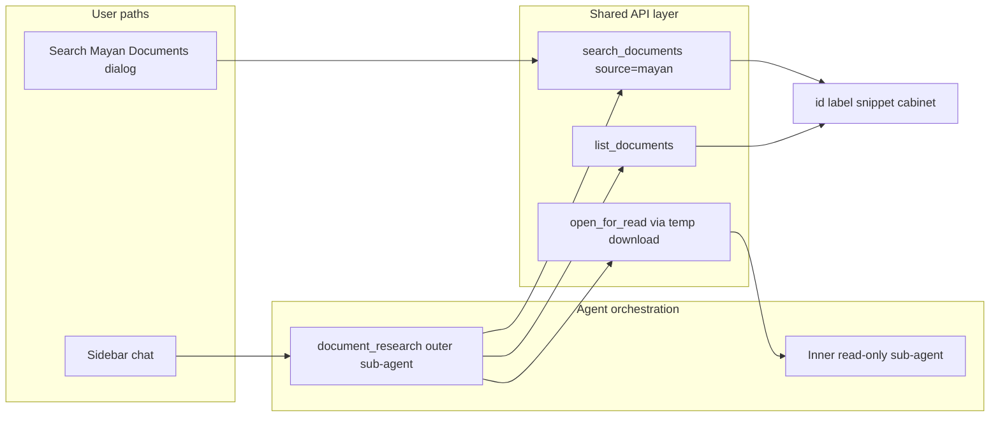
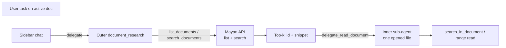

# Mayan EDMS Integration — Development Plan

> **Status (2026-06):** **Planned / not shipped** — no `mayan_*` code in tree yet. This doc describes the intended design.

> **Scope note:** Standalone plan for remote **Electronic Document Management Systems (DMS)**, using **Mayan EDMS** as the first integration target. Kept separate from [multi-document-dev-plan.md](multi-document-dev-plan.md) (local filesystem `document_research`) and [embeddings.md](embeddings.md) (local folder hybrid index). Do not conflate tracks when scheduling or implementing.

> **Living document:** Update as phases ship, decisions are made, or scope changes. Link PRs and related topic docs.

**Related:** [embeddings.md](embeddings.md) · [multi-document-dev-plan.md](multi-document-dev-plan.md) · [mcp-protocol.md](mcp-protocol.md)

---

## Overview

WriterAgent today can research **local sibling files** (same folder as the active document, or LibreOffice Work folder) and, when enabled, search them with a **hybrid folder index** ([embeddings.md](embeddings.md)). Many organizations also keep authoritative documents in a **DMS** — versioned storage with cabinets, metadata, OCR full-text search, and access control.

Mayan integration adds the same product idea for your **org archive**: **find the right document before opening it**, then read it into LibreOffice (read-only) for chat or manual review.

| Track | Storage | Search |
|-------|---------|--------|
| **Local folder** (shipped) | On-disk index beside files (`writeragent_embeddings/corpus.db`) | Hybrid FTS + vectors; [Search Nearby Files…](embeddings.md) menu |
| **Mayan EDMS** (planned) | Live REST API over HTTP | Full-text + metadata/cabinet filters; **Search Mayan Documents…** menu (Phase 1) |

**One shared search stack:** list and search primitives are implemented once in `mayan_client.py` (or equivalent) and reused by:

- **Users** — Settings, Search dialog, optional CLI script
- **Sidebar chat** — natural-language tasks that delegate to `document_research`
- **MCP hosts** — same delegation surface as local research

You do **not** choose “user mode” vs “agent mode” per query. The dialog and the `document_research` sub-agent call the same APIs.



**Goal:** Make external DMS first-class, **read-focused** initially, while reusing two-tier delegation, inner read tools, read-only enforcement, hidden open, status UI, and MCP patterns from local `document_research`.

---

## User guide

### What you can do

- **Search your Mayan archive** from LibreOffice (dialog, Phase 1) — scoped full-text and metadata search without opening every document in the web UI.
- **Ask in chat** — describe what you need in plain language; WriterAgent finds and reads DMS documents, then updates your **active** document.
- **Mix local and DMS** — nearby folder files and Mayan both stay available when Mayan is configured (working copies on disk + official versions in the archive).

Example chat requests (no source parameters required):

- “Summarize the latest contract in the Legal cabinet and insert the key obligations into this report.”
- “Pull the Q3 figures from the budget document tagged `finance:2026` in our DMS and update the table here.”
- “Find all policy docs mentioning remote work and give me a comparison.”

### Turning it on

1. **Settings → Document research** (or **External document sources**): enter **Mayan base URL**, **API token**, and **Verify SSL** (disable only for self-signed dev installs).
2. **Default research scopes** (Phase 1 UI; manual `writeragent.json` in Phase 0): set **preferred cabinets** and optional **project metadata type** so searches start in the right part of a large archive — see [Scoping searches](#scoping-searches).
3. Local sibling search is unchanged. Mayan is **additive** when credentials are valid.

Token auth: obtain a DRF token from your Mayan instance (`POST /api/v4/auth/token/obtain/`). Tokens are stored in `writeragent.json` and redacted in logs.

### Search Mayan Documents menu (planned — Phase 1)

Parallel to **WriterAgent → Search Nearby Files…** ([`search_ui.py`](../plugin/embeddings/search_ui.py), [`SearchDialog.xdl`](../extension/WriterAgentDialogs/SearchDialog.xdl)):

| Local (shipped) | Mayan (planned) |
|-----------------|-----------------|
| Hybrid index in `writeragent_embeddings/` | Live Mayan REST API (no local cache in MVP) |
| **Rebuild** button | **Refresh** / test connection |
| Hit → `file://` path | Hit → `mayan:doc:<id>` + label + snippet + cabinet |

Planned dialog behavior:

- Query field + optional scope (preferred cabinets from Settings).
- Results: label, cabinet path, snippet, modified date.
- Actions: **Open read-only in LibreOffice** (temp download + hidden open — same path as agent read), **Copy snippet**, optional **Send to chat** (prefill sidebar with document reference).
- Connection/status line (like embeddings cache status in Search Nearby Files).

### Scoping searches

Production Mayan instances can hold tens or hundreds of thousands of documents. **Narrow searches** for good UX:

- In **Settings**, list cabinet paths you work in most often (e.g. `/Projects/AcmeCorp`, `/Finance/Budgets/2026`, `/Legal/Contracts`).
- Optionally name the metadata field your org uses for “project” (e.g. `Project`, `Client Project`, `Job Number`). Phase 1 includes a **Discover metadata types** button that queries your instance while you configure.
- Optional **additional default filters** (metadata key-value pairs, e.g. `Department: Engineering`) for orgs with consistent structure.
- In the **Search dialog**, respect those defaults; override per query when needed.
- In **chat**, name cabinets, tags, or metadata in your request; configured defaults apply when you do not.

Archive-wide search remains available when you explicitly ask (e.g. “across the whole archive”). A strict-org option (**Allow unrestricted search**, default on) can require scoped searches only.

See [Mayan EDMS background](#mayan-edms-background-research-summary) for how cabinets, metadata, tags, and indexes map to the API.

### CLI / scripting (planned — Phase 1+)

Same client as the dialog and agent tools, mirroring [search_embeddings_folder.py](../scripts/search_embeddings_folder.py):

```bash
.venv/bin/python scripts/search_mayan_documents.py "remote work policy" --cabinet /Legal/Policies
.venv/bin/python scripts/search_mayan_documents.py "Q4 revenue" --json --limit 10
```

### Limitations (MVP and near-term)

| Limit | Detail |
|-------|--------|
| **Read-only** | No upload or new version to Mayan in MVP |
| **One instance** | Single `mayan_base_url` |
| **Latest file** | No version picker initially |
| **Large files** | Size cap; prefer search snippets before full download |
| **Scope** | Default to configured cabinets; broad search only when requested |
| **No WebDAV mount** | Research uses REST API + download, not a filesystem mount (see [Open questions](#open-questions) #9) |

### Resetting / reconnecting

- Fix URL or token in Settings and use **Test connection** (Phase 1) or retry search.
- No local cache to delete in MVP; Phase 2 may add optional metadata cache.

---

## Agent workflows

Cross-file and cross-DMS research use the same **two-tier** model as local work ([multi-document-dev-plan.md](multi-document-dev-plan.md)). Sub-agents are ephemeral; they are not part of the user's main chat history.

### Two-tier design



**Outer tier** discovers which document(s) matter (local folder and/or Mayan). **Inner tier** reads an opened LibreOffice model with precise tools. Search hits are a **router**, not a substitute for in-document reads.

### Sidebar chat stays simple

The sidebar keeps **core** tools on the active document plus `delegate_to_specialized_{writer|calc|draw}_toolset`. Users describe tasks in natural language; they do not pass `source="mayan"` or cabinet IDs unless they want to.

Discovery tools (`list_documents`, `search_documents`, `list_mayan_cabinets`, …) live in the **`document_research` sub-agent** only — the same pattern as local `list_nearby_files` today. The sub-agent receives configured default scopes and task text, picks local vs Mayan (or both), and returns a compact result with provenance.

### Tool matrix

Extends the local matrix in [embeddings.md](embeddings.md#search-mode-flag):

| Source | When | Discovery | Read |
|--------|------|-----------|------|
| **Local** | Always (unless disabled) | `list_nearby_files`; `grep_nearby_files` or `search_nearby_files` if folder index on | `delegate_read_document` |
| **Mayan** | `mayan_base_url` + token configured | `list_documents`, `search_documents`, `list_mayan_cabinets`, `list_mayan_metadata_types`, … | `delegate_read_document(source="mayan", …)` |

Workflow hints (Mayan configured):

- **Local off / grep only:** `list_nearby_files` → `grep_nearby_files` → `delegate_read_document`
- **Local index on:** `list_nearby_files` → `search_nearby_files` → `delegate_read_document` → inner `search_in_document`
- **Mayan:** `list_documents` / `search_documents` (scoped) → `delegate_read_document(source="mayan")` → inner read tools

### Roles

| Layer | Responsibility | Tool surface |
|-------|----------------|--------------|
| **Sidebar chat** | User intent; edits **active** doc only | Core tools + `delegate_*` (domain includes `document_research`) |
| **Outer sub-agent** | Resolve task; list/search; delegate reads; aggregate | `list_*`, `search_*`, `delegate_read_document`, `specialized_workflow_finished` — no writes on siblings |
| **Inner sub-agent** | One opened file; type-specific read tools | `get_document_content`, `search_in_document`, `read_cell_range`, … — source-agnostic |

Inner agents never know whether the model came from a local path or a Mayan temp download.

### Source selection (local vs Mayan)

**Both sources stay available by default** when Mayan is configured. The outer sub-agent chooses based on the task and instructions:

> Local: files next to the active document or in LibreOffice Work folder. Mayan: managed, searchable, versioned archive. Prefer Mayan for “official”, “the DMS”, “company archive”, named cabinets, metadata, or archive-wide full-text. Prefer local for “the file next to this one”. Use both in one task when needed.

Power users can disable local discovery: `document_research_local_enabled` (default `true`). Mayan is enabled implicitly when URL + token are present.

### MCP

Same as sidebar: `X-Document-URL` is the **active** document only. Mayan document ids or labels go in the delegate **task** string. External hosts may build their own DMS browser; WriterAgent exposes one `document_research` delegation path.

### Search hit shape (Mayan)

`search_documents(source="mayan", …)` returns compact entries, analogous to local `search_nearby_files`:

```json
{"source": "mayan", "id": 42, "label": "Budget Q3 2026", "snippet": "…passage…", "cabinet": "/Finance/Budgets", "modified": "2026-03-15T…"}
```

After a hit, the inner agent should **`search_in_document`** for the snippet or topic — not blind offset reads.

---

## Product rationale

### The problem

Without DMS integration, users download files manually or the assistant cannot reliably see what lives in the archive. **Web research** is noisy and lacks metadata, permissions, and org structure.

### Why DMS vs local folder vs web

| Source | Best for |
|--------|----------|
| **Local folder** | Working copies beside the active file; zero config; optional hybrid index ([embeddings.md](embeddings.md)) |
| **Mayan EDMS** | Official versions, cabinets, tags, OCR on scans, retention, audit |
| **Web** | Public information (`web_research` domain) — not a substitute for authenticated org docs |

### Why scoped search matters

Blind global list/search on a large Mayan library is slow, token-heavy, and noisy. **Users** set default scopes in Settings; **API calls** use cabinet/metadata filters server-side; **sub-agent** instructions enforce narrowing unless the task requests archive-wide search.

---

## Mayan EDMS background (research summary)

Mayan EDMS is a mature, GPL 2.0-licensed, Django-based open-source EDMS (since 2011, current docs reference version 4.11.4). It is positioned as the most advanced, scalable, mature FOSS EDMS, with Docker/Kubernetes deployment focus and a rich plugin + REST API architecture for customization. Official site and docs emphasize its use in government, non-profit, and commercial sectors.

Key relevant capabilities (from repeated searches against official docs.mayan-edms.com, release notes through 2024, and community sources):

- **REST API v4** (`/api/v4/...`): Client-less, self-documenting HTTP API (DRF-based). Swagger UI at `/api/swagger/ui/` and ReDoc on a running instance. Token auth (recommended: `POST /api/v4/auth/token/obtain/`) or Basic; header `Authorization: Token ...`. Many actions return 202 ACCEPTED for background processing (e.g. uploads, some downloads). Pagination standard (count/next/previous/results). Permissions often aligned between UI and API views in later releases.
- **Core objects**: Documents (containers), Document Files (source bytes + pages; multiple per document allowed since 4.0), Document Versions (virtual compositions/mappings of pages for viewing), pages, metadata (arbitrary types), tags, cabinets (hierarchical), indexes, workflows, signatures, etc.
- **Search**: Dynamic search API + advanced scoped search. Full-text via OCR (Tesseract, per-page on versions). Search models e.g. `documents.DocumentSearchResult` (discover pk via `/api/v4/search_models/`). Endpoints like `GET /api/v4/search/{search_model_pk}/` and `/advanced/{...}/`. Supports filters by label, content, metadata (including new source metadata in 4.7), cabinet ID, tag ID, document type ID, etc. Recent releases (4.7) added source metadata content search + dedicated REST endpoints, plus easier ID-based searches.
- **Downloads**: Target *Document Files* (exact original uploaded bytes + original filename/extension retained). Versions export to PDF. In 4.4+ moved to dedicated "document downloads" app with permissions, queuing, and user association. v4.7+ added pluggable download backends (e.g. direct storage, Google Cloud Storage signed URLs) for very large (multi-GB) files to avoid long proxy times. `get_absolute_api_url` helpers added for download links in some releases.
- **OCR / text**: First-class and per-page. OCR content can be read/edited via API. Full-text search and indexing operate on OCR output. Useful for scanned/PDF content.
- **Metadata & organization**: Strong support for document types + metadata types (per-type), cabinets (with mirroring support in some versions), tags, indexes (for dynamic cataloging e.g. by invoice number prefix). Excellent for precise queries like "the budget in the Finance cabinet tagged 2026".
- **Python client situation**: No actively maintained high-level official SDK/client for v4. The old `mayan-api_client` (thin slumber wrapper, ~2016) exists on PyPI but is stale. Direct HTTP is the standard path — WriterAgent uses the shared [`sync_request`](../plugin/framework/client/requests.py) helper (same pattern as AiHorde).
- **Deployment & other**: Official Docker image on Docker Hub (millions of pulls). Web-based setup. Focus in 2024 releases on Django LTS updates (to 4.2), packaging size reductions, native email parsing, storage backends, and search refinements. Primary development on GitLab.

Integration is a natural fit because WriterAgent already knows how to *read* (and extract structure) once it has an LO model; Mayan supplies rich discovery (list + powerful search with metadata/cabinets/OCR), provenance, and the raw bytes (or extracted text) needed to open documents for read tools or the Search dialog.

For implementation, the live Swagger/Redoc on an instance + the examples in the official REST API chapter are the best sources for exact serializers, filters, and response shapes (they evolve with releases). Basic patterns (list documents, get files for a doc, download a file) are stable enough for planning.

### Read path (WriterAgent)

Search/list returns ids and snippets. **Open for read** downloads the latest file to a temp path, then uses existing `open_document_for_read` (Hidden + ReadOnly) so the same Writer/Calc/Draw read tools apply. The Search dialog and CLI use the same download path.

---

## Settings reference

From `writeragent.json` / future Settings UI ([`config.py`](../plugin/framework/config.py), [`dialog_views.py`](../plugin/chatbot/dialog_views.py)):

| Config key | UI label (planned) | Default | Notes |
|------------|-------------------|---------|-------|
| `mayan_base_url` | Mayan base URL | `""` | e.g. `https://docs.example.com` |
| `mayan_api_token` | API token | `""` | Never logged raw |
| `mayan_verify_ssl` | Verify SSL | `true` | `false` for self-signed dev |
| `mayan_default_cabinets` | Preferred cabinets | `[]` | List of path strings |
| `mayan_project_metadata_type` | Project metadata type | `""` | Org-specific metadata field name |
| `document_research_local_enabled` | Enable local folder research | `true` | Off for full-DMS workflows |

Optional later: `mayan_default_document_types`, additional default metadata filters, “allow unrestricted search” toggle for strict orgs.

Mayan fields belong under **Document research** / **External sources** — not `AI_SIMPLE_FIELDS`.

When the outer `document_research` sub-agent starts, configured scopes are injected, e.g.:

```text
[MAYAN DEFAULT SCOPES]
Preferred cabinets (use these first for most tasks):
- /Projects/AcmeCorp
- /Finance/Budgets

Project metadata type: "Project Code"
```

---

## Design principles

**User-visible (priority):**

1. **Read-mostly** — DMS documents open read-only; write-back is a later phase.
2. **Scoped search** — Settings defaults + server-side filters; archive-wide only when requested.
3. **Clear errors** — Actionable messages: not configured, auth failed, not found, too large.
4. **Local + DMS together** — Mayan adds capability without removing nearby-folder research.

**Implementer (priority):**

5. **Reuse machinery** — Inner read agent, `open_document_for_read`, `document_research_chat.py`, `DelegateToSpecializedBase`, `READ_TOOLS_BY_DOC_TYPE` — shared with local track.
6. **Extend `document_research`** — Add `source` on list/delegate tools; avoid a parallel `mayan_documents` domain.
7. **Least code** — Thin `mayan_client.py`; `sync_request` only; pluggable `DocumentSource` only after Mayan is solid (Phase 4).
8. **One search API** — Dialog, CLI, and sub-agent tools call the same list/search/open helpers.
9. **Tests required** — Unit (mock HTTP), UNO (temp download + read), MCP; `make test` before phase done.

---

## Architecture for developers

### Data contracts

#### Unified listing (`DocEntry` / extended `FileEntry`)

| Field | Notes |
|-------|-------|
| `source` | `"local"` \| `"mayan"` |
| `id` | Mayan doc id; local path |
| `url_or_ref` | `file://…` or `mayan:doc:<id>` |
| `label` / `name` | Display name |
| `modified`, `size_bytes` | From API or filesystem |
| `doc_type_guess` | writer / calc / draw / … |
| `is_open` | Local only |
| Optional | `cabinet`, `tags`, `metadata_summary`, `has_ocr` |

#### Delegate read

`delegate_read_document(source="mayan", id_or_name="123" | "budget 2026", task="…")`

Resolver accepts numeric id, uuid, or label substring (newest/best match, like local fuzzy).

#### Temp file lifecycle

1. Resolve id → metadata + file list → download URL + original extension.
2. Stream to `tempfile.mkstemp(suffix=ext, …)` or Work subdir; `delete=False`.
3. `open_document_for_read(ctx, temp_path)` — Hidden + ReadOnly.
4. Run inner agent.
5. `finally`: close + `os.unlink` (best-effort).

Helper: `download_mayan_document_to_temp(...) -> (temp_path, original_name, opened_for_research_flag?)`.

### Sub-agent tools (document_research domain)

Registered `tier="specialized"`, `specialized_domain="document_research"`, `specialized_cross_cutting=True`:

- `list_documents(source="mayan", cabinet=…, metadata=…, q=…, limit=…)`
- `search_documents(source="mayan", query=…, cabinet=…, metadata=…)`
- `list_mayan_cabinets()`, `list_mayan_metadata_types()`, `list_mayan_document_types()` (discovery)
- `delegate_read_document` extended with `source`

Sub-agent prompt block ([`specialized_base.py`](../plugin/doc/specialized_base.py)) enforces scoped Mayan search and injects default scopes. Main chat hints ([`constants.py`](../plugin/framework/constants.py)) mention “local or DMS documents” without Mayan-specific tools.

### Scoping searches (implementation)

A production Mayan instance can contain tens or hundreds of thousands of documents across many cabinets, projects, departments, and years. Blind global list/search is slow, expensive, and noisy. **All** list/search calls — from the Search dialog, CLI, and `document_research` sub-agent — should use server-side filtering via the Mayan API whenever possible. Archive-wide search only when the user or task explicitly requests it.

Mayan scoping mechanisms that map well to "project or equivalent":

- **Cabinets** (hierarchical, closest to folders/projects): `/api/v4/cabinets/` to list the tree; `/api/v4/cabinets/{id}/documents/` to list documents in a cabinet or subtree (e.g. `/Projects/AcmeCorp/2026/Q4`).
- **Metadata types + values**: Advanced search supports queries like `metadata__Project=Acme AND year=2026`. Many deployments have a dedicated "Project" metadata type.
- **Indexes**: Dynamic, metadata-driven views (e.g. Project > Document Type > Date). Later phase.
- **Tags** and **Document Types**.
- **Advanced search model**: `/api/v4/search/{model_pk}/` and advanced variant support scoped queries with operators.

Shared API surface (dialog, CLI, sub-agent tools):

- `list_mayan_cabinets()` — cabinet tree (id, path, document_count); optional parent filter for lazy subtrees.
- `list_documents(source="mayan", cabinet="Projects/AcmeCorp", metadata={"Project": "Acme2026"}, document_type="Budget", q="revenue", limit=50)` — best Mayan endpoint (cabinet-specific when cabinet given, else filtered list or advanced search).
- `search_documents(source="mayan", query="Q4 results", cabinet="/Finance", metadata={"Fiscal Year": "2026"})` — advanced search with scoping.
- Discovery: `list_mayan_document_types()`, `list_mayan_metadata_types()`, `get_mayan_cabinet_tree()`.

The thin `mayan_client.py` prefers `/cabinets/{id}/documents/` + filters over global documents list + client-side filter. High-level params (cabinet path, metadata kv) translate to the correct API calls.

**MVP scope for scoping:** cabinet paths as primary mechanism; basic metadata filtering; discovery tools (cabinets, metadata types); configured defaults injected into sub-agent prompt and honored by dialog/CLI defaults. Later: indexes, saved research views.

### HTTP client (`mayan_client.py`)

- Auth header, base URL + `/api/v4/`
- `list_documents`, `search_documents`, `get_document`, `download_document_file`
- Structured errors compatible with `_tool_error`; token redaction

### Threading and status

- Download in async tool worker; `open` on main thread via `execute_on_main_thread`.
- Extend [`document_research_chat.py`](../plugin/chatbot/document_research_chat.py): e.g. “Searching Mayan…”, “delegate_read_document (mayan:42 — Budget_2026.pdf)”.

### Why not a separate `mayan_documents` domain?

Would duplicate gateway wiring, prompts, status formatters, MCP entries, and tests. Extending `document_research` is minimal and matches user language (“research my documents, wherever they live”).

### Files and entry points (proposed)

| Area | Path |
|------|------|
| Config + UI scopes | [`config.py`](../plugin/framework/config.py), [`manifest_registry.py`](../scripts/manifest_registry.py), [`dialog_views.py`](../plugin/chatbot/dialog_views.py) |
| Client | [`mayan_client.py`](../plugin/doc/mayan_client.py) (new) |
| Tools | Extend [`document_research_tools.py`](../plugin/doc/document_research_tools.py) + [`document_research_specialized.py`](../plugin/doc/document_research_specialized.py); or small `mayan_tools.py` |
| Search UI (Phase 1) | `mayan_search_ui.py` + `MayanSearchDialog.xdl` (names TBD) |
| CLI (Phase 1) | `scripts/search_mayan_documents.py` |
| Open / temp | [`document_research.py`](../plugin/doc/document_research.py) |
| Chat status | [`document_research_chat.py`](../plugin/chatbot/document_research_chat.py) |
| Prompts | [`constants.py`](../plugin/framework/constants.py), [`specialized_base.py`](../plugin/doc/specialized_base.py) |
| Unit tests | `tests/doc/test_mayan_client.py`, extend `test_document_research*.py` |
| UNO tests | `tests/doc/test_mayan_uno.py` |
| MCP test | Extend `tests/mcp/test_mcp_server.py` |

---

## MVP scope (Phase 0)

### Users see

- Manual `writeragent.json` Mayan config (Settings UI in Phase 1).
- Chat delegation: ask in natural language; status lines in sidebar during research.
- MCP: same `document_research` delegation with Mayan ids in task text.

### Sub-agent / shared API

- `list_documents(source="mayan", …)` — server-side filtered list.
- `search_documents(source="mayan", …)` — scoped full-text + metadata; hits with snippets + ids.
- `delegate_read_document(source="mayan", …)` — download, hidden RO open, inner read, cleanup.
- Discovery: `list_mayan_cabinets()`, `list_mayan_metadata_types()`.
- Errors: not configured, auth failed, not found, download too large.

### Out of scope (Phase 0)

- Write/upload to Mayan.
- Multiple Mayan instances.
- Version selection (latest file only).
- Direct OCR fetch without download.
- Metadata cache (Phase 2).
- Search dialog, CLI, @-completion / DMS picker (Phase 1 / 3).
- Headless separate LO for temp open.

### Done when

- Unit tests: mock list/search/download; resolver; temp lifecycle.
- UNO tests: download fixture + hidden open + read tools + cleanup.
- `make test` green.
- Manual: Docker Mayan + .odt/.ods + scanned PDF; cross-doc read into active doc; no focus steal; token redacted in logs.
- MCP test: `document_research` with Mayan reference in task.

---

## Phased implementation

| Phase | User-visible | Agent / dev |
|-------|--------------|-------------|
| **0 — MVP** | Manual json config; chat + MCP delegation | Client, tools, temp open, tests; no Settings UI |
| **1 — Polish** | Settings UI; **Search Mayan Documents** dialog; scope fields; CLI script | Cabinet/tag/metadata pass-through; provenance in results; connection test |
| **2 — Fast path** | Snippet-first answers in dialog (metadata/OCR from API) | Optional session metadata cache |
| **3 — Advanced** | Version picker UI; @ / DMS picker | OCR-only path for huge scans; write-back (careful); multi-instance |
| **4 — Generalize** | Unified “document sources” UX | `DocumentSource` protocol; Nextcloud, SharePoint, … |

### Phase 0 — Core read path

- Config keys + `get_mayan_client()`.
- Client: auth, list, search, metadata, download.
- Tools: generalized `ListDocuments`, extended `DelegateReadDocument`.
- Prompt hints, resolver, errors, tests.
- **No** Settings UI (manual json).

### Phase 1 — Polish and user search

- Settings tab + default scope fields + **Discover metadata types** button.
- **Search Mayan Documents** dialog (mirror Search Nearby Files).
- `scripts/search_mayan_documents.py`.
- Size guard; chat status with cabinet/id; client edge-case tests.

### Phase 2 — Metadata index

- Surface Mayan metadata + OCR snippets without full download when possible.
- Cache key: `(mayan_id, mtime/checksum)`.

### Phase 3 — Advanced

- Version / file selection; direct OCR text path.
- `upload_document_to_mayan` (specialized_control, mutation policy TBD).
- Multi-instance; DMS browser / @ picker.
- MCP examples in [mcp-protocol.md](mcp-protocol.md).

### Phase 4 — Cross-DMS

- `DocumentSource` registry; local FS + Mayan as implementations.
- Single `list_documents(source=…)` surface for future backends.

---

## Test strategy

- **Unit (pytest):** Mock `sync_request`; list/search shapes; fuzzy resolution; download-to-temp; errors; token never in logged payloads.
- **UNO (`@native_test`):** Temp download → open → read tools → cleanup; mixed local + Mayan (mock one source).
- **Integration:** Calc/Writer scenarios with docs only in Mayan.
- **MCP:** Delegation with Mayan id in task; `X-Document-URL` = active doc.
- **Security:** Bad token, 403, huge file, malformed JSON; redaction in `writeragent_debug.log`.
- **Prompt snapshots:** Update if `document_research` hints change.

Always: `make test` before calling a phase done. Naming: `test_<module>.py`, `test_<module>_uno.py`.

---

## Open questions

| # | Question | Notes / Decision |
|---|----------|------------------|
| 1 | Unified `source` param vs new tool names? | **Unified** — `list_documents` + `delegate_read_document` with `source="local"\|"mayan"`. |
| 2 | Cabinets/tags in list results? | Compact arrays or `"Finance > Q3"` string; keep payloads small. |
| 3 | Very large downloads? | Size check first; snippet-only mode; MVP errors with size in `details`. |
| 4 | Token only or Basic too? | Token primary; Basic fallback for some self-hosted setups. |
| 5 | Temp dir and cleanup? | Reuse TEMP_DIR or Work subdir; best-effort unlink; rare leaks on crash (same as local hidden opens). |
| 6 | First-class `search_documents`? | **Yes** — mirrors `grep_nearby_files` / shared with Search dialog. |
| 7 | Source name in prompts | `"mayan"` for MVP; later `dms:mayan` if generalized. |
| 8 | MCP hosts | Ids/names in delegate task; do not overload `X-Document-URL`. |
| 9 | Mayan WebDAV / FUSE mount? | **No** general library mount. REST + download is the research path. Staging/watch folders are ingestion-only. Index FUSE (`mountindex`) is catalog-only, not emphasized. |
| 10 | Local vs Mayan when both configured? | Both on by default; sub-agent decides; `document_research_local_enabled` to disable local. |

---

## Related docs

| Topic | Doc |
|-------|-----|
| Local folder hybrid search + Search Nearby Files (shipped) | [embeddings.md](embeddings.md) |
| Local two-tier document_research (shipped) | [multi-document-dev-plan.md](multi-document-dev-plan.md) |
| Delegation / MCP | [mcp-protocol.md](mcp-protocol.md), [smol-main-chat-tool-architecture.md](smol-main-chat-tool-architecture.md) |
| Web vs DMS research | [agent-search.md](agent-search.md) |
| HTTP search patterns | [search-engine-integration.md](search-engine-integration.md) |
| Threading | [streaming-and-threading.md](streaming-and-threading.md) |
| Specialized tool tiers | writer/calc/draw specialized toolset docs |
| Project invariants | [AGENTS.md](../AGENTS.md) |

---

## Changelog

| Date | Change |
|------|--------|
| 2026-?? | Initial plan: Mayan REST API v4, auth, search, downloads, OCR; reuse local document_research. |
| 2026-06-28 | Dual user + agent focus; shared search API; Search Mayan dialog (Phase 1); full Mayan EDMS background retained. |

---

**Next step:** Implement Phase 0 (reuse-heavy). Tests in lockstep. Update this plan with PR links as work lands.
