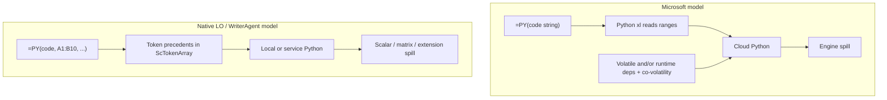

# Why LibreOffice Should Not Copy Microsoft’s `=PY()` Design

**Audience:** Collabora and LibreOffice engineers who want Excel compatibility, plus product people who need the short version.  
**Scope:** What Microsoft’s Python-in-Excel formula model actually requires of a spreadsheet engine, compared to the local `=PY(code, data?)` design already shipping in WriterAgent / LibrePy, and what would have to change in LibreOffice core (`sc/`, `formula/`, OOXML filters) to match Excel.

**Recommendation up front:** Keep **`=PY(code, data?)`** (explicit range arguments + Calc’s dependency DAG) as the native, first-class design. If Excel workbook interchange is ever required, add a **compatibility surface later** (e.g. `=PY_XL(...)` or an import rewriter)—do **not** make Microsoft’s `xl()` + co-volatility model the default Calc API. That model is not “a different syntax”; it is a **second calculation engine** bolted onto Excel’s, with serious performance and correctness costs that LibreOffice would have to reinvent from scratch.

Related: [Enabling NumPy in LibreOffice](enabling_numpy_in_libreoffice.md) (shipped design), [Collabora Online / jail-safe compute](numpy-jailsafe.md) (thin C++ Add-In + remote service), [Python-in-Calc future work](python-in-excel-dev-plan.md).

---

## 1. Short version (for everyone)

| | Microsoft Excel `=PY` | LibreOffice / WriterAgent `=PY` today |
|--|----------------------|----------------------------------------|
| How you pass sheet data into Python | Inside the code string: `xl("A1:B10")` | As a formula argument: `=PY("…"; A1:B10)` → variable `data` |
| How the spreadsheet knows what to recalculate | Formula arg is only a string—so either **`xl()` registers deps at runtime**, PY is **volatile**, and/or **co-volatility** re-runs all PY cells | Calc already knows: the second argument is a normal precedent |
| Shared variables across cells | Globals + **re-run every PY cell** in row-major order when any PY runs | Optional shared kernel; order via `data` refs (normal DAG) |
| Where code runs | Microsoft cloud container (Anaconda) | User’s local venv (or Collabora compute service for Online) |
| Multi-cell results | Native dynamic-array **spill** | Extension spill registry + deferred writes (not engine spill) |

**Why “just make it compatible” is expensive:** You do **not** need Calc to parse Python to *implement* `xl()`—that is a Python-side helper that reads ranges. The cost is everything around it: **when does the PY cell become dirty**, **co-volatility / flip-flop scheduling**, **Online round-trips per `xl()` call**, and **engine spill**. Microsoft’s own performance community documents co-volatility as a **heavy tax** ([Charles Williams](https://fastexcel.wordpress.com/2023/11/01/python-in-excel-py-calculation-globals-co-volatility/)).

**Better product story:** ship a correct, offline, DAG-friendly `=PY` now (done / Online path in progress). Offer Excel import compatibility later as a **secondary** path, once native spill and import mapping exist—or never, if users care more about NumPy offline than byte-identical `xl()` formulas.

---

## 2. What “Microsoft design” means (precisely)

Microsoft’s public product model (Python in Excel):

1. **Formula shape:** `=PY(python_code [, return_type])` where `return_type` selects Excel value vs Python object card.
2. **Data bridge:** In the Python source, call `xl("A1:B10")`, `xl("Table1")`, etc. Ranges are **not** normal formula arguments.
3. **Egress:** Jupyter-style **last expression** value (not a required `result =` assignment).
4. **Runtime:** Code runs in a **hypervisor-isolated cloud container**; workbook data leaves the client via the `xl` bridge; results come back as the `=PY` cell value (or image/object). Offline / local custom Pythons are not the product.
5. **Globals:** One Python namespace per workbook; variables persist across cells until Reset Runtime.
6. **Co-volatility:** When **any** `=PY` cell recalculates, **all** `=PY` cells in the workbook recalculate, in **sheet order, top-to-bottom / left-to-right**—not Excel’s normal dependency tree for those cells. Documented in detail by Charles Williams ([PY calculation & co-volatility](https://fastexcel.wordpress.com/2023/11/01/python-in-excel-py-calculation-globals-co-volatility/), [Excel↔Python flip-flop](https://fastexcel.wordpress.com/2023/11/01/python-in-excel-how-do-excel-and-python-formulas-work-together/)).
7. **Mixed chains:** Excel↔Python↔Excel chains work by **deferring** dirty cells and **alternating** Excel calc passes with full-PY passes—another scheduler, not “just another function.”

Those seven bullets are the compatibility target. Matching Autocomplete text `=PY` without matching (2)+(6)+(7) is **not** Excel-compatible; it only looks familiar.

---

## 3. What LibreOffice / WriterAgent has today

### 3.1 Extension path (desktop)

Shipped in WriterAgent / LibrePy (Python Add-In, not in stock LibreOffice):

- **Signature:** `=PY(code, data…)` / `=PYTHON(...)` — IDL `any python([in] string code, [in] sequence<any> data)`.
- **Ingress:** Calc resolves ranges **before** the Add-In runs; host packs values; warm **user venv** subprocess executes; injects `data` (and `data_list` for varargs).
- **Egress:** Prefer `result = …` when set; if `result` is absent from the sandbox namespace, use the **last expression** value automatically (`executor.state.get("result", code_output.output)` in [`venv_sandbox.py`](../plugin/scripting/venv/venv_sandbox.py))—same Jupyter-style fallback Excel uses.
- **Dependencies:** Normal Calc precedents on the `data` arguments. Shared-kernel mode exists, but **ordering is still declared with `data` refs**—no co-volatility.
- **Spill:** If auto-spill is on, multi-cell returns are written to adjacent cells via a **deferred timer** and a document property registry (`WriterAgentSpillRegistry`). This is **not** Calc dynamic-array spill; dependents of spilled cells do not automatically see engine-owned spill ranges.
- **Sync on formula thread:** Recalc must not pump the UI event loop (re-entrancy → `#VALUE!`). Long work blocks the formula interpretation of that cell.

Entry points: [`plugin/calc/python/addin.py`](../plugin/calc/python/addin.py), [`function.py`](../plugin/calc/python/function.py), [`venv_worker.py`](../plugin/scripting/venv_worker.py). Design rationale: [enabling_numpy_in_libreoffice.md §6–§7](enabling_numpy_in_libreoffice.md).

### 3.2 Stock LibreOffice core (tree at `~/Desktop/libreoffice`)

Relevant facts from the current Calc engine (no PY opcode exists):

| Fact | Evidence / implication |
|------|------------------------|
| **No `=PY` / `xlfn.PY`** | No opcode; OOXML formulabase has `_xlfn.` machinery but nothing for Python-in-Excel. |
| **Add-Ins are first-class enough for a function name** | `ocExternal` → `ScInterpreter::ScExternal()`; UNO Add-Ins + `XVolatileResult` for async. |
| **Matrix without CSE keeps upper-left only** | `formulacell.cxx` (~2253–2258): if result is a matrix and cell is not `ScMatrixMode::Formula`, keep UL corner and drop the rest. |
| **Excel-like `FILTER`/`SORT`/… return matrices** | `ForceArrayReturn` in `parclass.cxx`—but that is **not** automatic spill into neighboring empty cells with `#SPILL!` ownership. |
| **`ocExternal` is not a free pass for group vectorization** | Formula-group / OpenCL paths treat externals carefully; Python will never be SIMD/OpenCL. |
| **Async precedent exists** | `XVolatileResult` + `ScAddInListener::modified()` → `TrackFormulas()` — suitable for `#BUSY!`-style interim results (Collabora `pythoncompute` direction). |

**Implication:** A thin core Add-In that keeps **`=PY(code, data)`** and optional `XVolatileResult` is aligned with Calc. An Excel-shaped `=PY(code)` plus Python `xl()` is easy for *reads*; it is **not** aligned for *partial recalc* unless you add volatility, dynamic listeners, and/or co-volatility scheduling the stock Add-In contract does not give you for free.

### 3.3 Collabora Online path (already the right split)

[numpy-jailsafe.md](numpy-jailsafe.md): kit cannot spawn user venvs; Step C is a **dumb** core Add-In (`getPy` / ranges → JSON → compute service → matrix / `#BUSY!`). That path assumes **explicit data in the request**, not Python-side `xl()` round-trips into the kit for every range touch. Copying Microsoft’s bridge would push **many more** kit↔wsd↔service round-trips or force a giant “send whole used range” policy—both hostile to Online.

---

## 4. Side-by-side: where the designs disagree



| Dimension | Microsoft | Native Calc `=PY` (current) | Who must own a Microsoft port |
|-----------|-----------|-----------------------------|-------------------------------|
| Data ingress | Python `xl()` helper | Formula args → `data` | Runtime (easy) |
| Dependency / dirtying | Volatile and/or runtime registration from `xl()` + co-volatility | Compiler tokens on `data` | **Core + IPC** if you want Excel’s shape without always-volatile |
| Recalc unit | All PY cells (co-volatility) | Dirty subgraph | **Core** scheduler for Excel parity |
| Partial recalc | Painful (mitigated by Partial/Manual PY modes) | Natural | Product win for native design |
| Offline | No (cloud) | Yes (venv) / Online service | Infra |
| Spill | Engine | Extension hack / CSE / future core spill | **Core** for real compat |
| Auditing | Deps invisible in formula bar | Deps visible as args | Governance / security |

---

## 5. Hard problems in detail (why this is not a rename)

This section is the engineering case. Each subsection states **what breaks**, **why Calc’s current design fights it**, and **what a real fix looks like**.

### 5.1 `xl()` is a Python helper—Calc does **not** need to parse Python

#### Clarification (common misunderstanding)

**Correct:** To *fetch* sheet data the Microsoft way, you inject a Python callable:

```python
def xl(ref, headers=False):
    # host / kit RPC: resolve ref → values / DataFrame
    return host.read_range(ref, headers=headers)
```

Calc’s formula compiler never has to understand Python syntax for that. The hard problem is **not** “write a Python parser in `sc/`.”

**Still hard:** With Excel’s formula shape, the only Calc argument is the **code string**:

```excel
=PY("df = xl(""A1:C100"", headers=True)`n`df['x'].mean()")
```

`ScCompiler` builds precedents from **formula tokens**. A string arg does not mention `A1:C100`. So when the user edits `A1`, **nothing in the stock dependency graph dirties this PY cell**, even if last run’s `xl()` read `A1`.

Runtime `xl()` that merely *reads* via UNO/kit → silent **stale results** after normal edits. That is the failure mode—not missing a parser.

#### Ways to make `xl()` correct (none are free)

| Approach | How it works | Cost / catch |
|----------|--------------|--------------|
| **A. Explicit `data` args (native design)** | `=PY("…"; A1:C100)` — range is a real token | **Best for Calc.** No `xl()` needed for deps. |
| **B. Mark `=PY` always-volatile** | Cell recalculates whenever Calc recalculates volatiles | Correct reads without parsing; **perf cliff** (like `NOW()` on every PY). Still does not give Excel’s fine-grained arrows. |
| **C. Dynamic deps from `xl()` calls** | Each `xl(ref)` during exec registers the PY cell as dependent on that range (listeners / broadcast hooks); next edit dirties PY | **No Python parse.** Needs host↔worker (or kit↔service) hooks, listener lifecycle, cleanup on code edit, and a story for **`xl()` behind `if`** (deps change between runs). First calculation must run before deps exist (“chicken and egg” until first success). |
| **D. Optional literal scan** | Regex/AST *assist* to pre-register `xl("A1")` literals before run | Optimization / editor aid—not required if C or B works. Incomplete for `xl(f"A1:A{n}")`. |
| **E. Co-volatility (Excel)** | Any PY dirty → re-run **all** PY; plus Excel↔PY flip-flop for mixed chains | Solves *ordering of globals* and some refresh cases; **does not by itself** create an Excel→PY edge when only `A1` changes—you still need B, C, D, or “dirty all PY on any sheet change” (even worse). See §5.2. |

So: **“just add `xl()`” is true for data ingress; false as a complete Calc design.** Someone still owns dirtying.

#### Why dynamic `xl()` deps (C) are still unpleasant in LibreOffice

1. **Add-In API surface:** Stock UNO Add-Ins get args Calc already resolved. There is no supported “during this external call, add precedent X to my formula cell” used by normal spreadsheet functions. You invent broadcast/listener bookkeeping next to `ScFormulaCell`.
2. **Worker / Online split:** Desktop WriterAgent runs Python **out of process**; Collabora Online runs it in a **compute service**. Every `xl()` is a **synchronous round-trip** (worker→host or service→wsd→kit) unless you prefetch. Excel’s cloud container has a purpose-built bridge; we do not.
3. **Branching / dynamic refs:** `xl("A1")` if flag else `xl("Z1")` — dependency set is data-dependent. Static scan cannot win; dynamic registration must replace the previous set each run.
4. **Re-entrancy:** Formula interpretation on the Solar/main path cannot casually pump events while `xl()` waits on kit I/O (WriterAgent already avoids UI drain on `=PY` to prevent `#VALUE!`).

#### Effort (realistic)

- Naive `xl()` read helper in the venv/service: **days–weeks** (plus security: which ranges are allowed).
- Correct dirtying via **volatility (B):** small code change, **large** user-visible cost.
- Correct dirtying via **dynamic registration (C):** **months** of Calc + IPC design; Online makes it harder.
- Literal scan (D) as a helper: **weeks**; never sufficient alone for real Python.

**Contrast:** `=PY("…"; A1:C100)` makes `A1:C100` a **first-class token**. The “`xl()` function” is unnecessary for dependency correctness. That is why the native design exists.

---

### 5.2 Co-volatility: a second calculation mode

#### What Excel does

From Williams’ measurements:

- PY cells calculate **top-to-bottom, left-to-right**, sheet by sheet—not dependency order among themselves.
- Globals make that order load-bearing: defining `df` in `C4` and using it in `E4` depends on **geometry**, not on a formula link.
- When **any** PY cell is dirty, **all** PY cells recalculate (“co-volatility”), even if only one depended on the edited Excel cell.
- Mixed Excel↔Python chains **flip-flop**: Excel pass → defer cells waiting on PY → PY pass (all PY) → Excel pass → …  

Excel later added Partial/Manual modes for Python specifically because automatic co-volatility is expensive.

#### What Calc does today

Calc’s pride is the **dependency DAG** and partial recalc: edit one input, recompute the dirty subgraph. Shared-kernel `=PY` in WriterAgent **deliberately does not** co-volatile; authors pass upstream cells as `data` so the DAG orders precedents:

```calc
=PY("result = x + 1"; A1)
```

even when `x` is a Python global set in `A1`. That is the compatible-with-Calc way to get Excel’s *intent* (ordered pipeline) without Excel’s *mechanism* (re-run the world).

#### Why implementing co-volatility in LibreOffice is hard

You are not adding a flag on an Add-In. You need:

1. A registry of all PY formula cells per document (listen to inserts/deletes/renames/sheet copies).
2. A recalc trigger: any PY dirty → enqueue **all** PY cells in row-major order, interacting with `TrackFormulas`, formula tree, and threaded formula groups.
3. Interaction with **non-PY** formulas that read PY outputs: the Excel flip-flop / deferral loop. Calc today does not have a “suspend this chain until foreign runtime finishes a batch” protocol except the coarser `XVolatileResult` per cell.
4. Decision vs **formula groups / threading**: `ocExternal` already sits awkwardly beside vectorized group calc. A workbook-global PY barrier makes threaded group calc **worse**, not better.
5. Online: co-volatility × remote compute = **N Python executions per keystroke** across the service. That is the opposite of Collabora’s jail-safe design (bounded requests, `#BUSY!`, finish once).

#### Effort

- Correct desktop co-volatility + Excel-like flip-flop: **multiple engineer-months**, high regression risk in `sc/source/core/data/`.
- Online-safe co-volatility: treat as **anti-feature** unless heavily rate-limited; expect product pushback from anyone running large sheets.

**This is the strongest “Microsoft design is bad for us” argument:** even Microsoft documents the perf pain and added modes to escape it. LibreOffice would be importing a known footgun into an engine whose differentiator is smarter partial recalc.

---

### 5.3 Dynamic array spill (engine-owned)

#### What Excel users expect from PY

A DataFrame or 2D array in a single `=PY` cell **spills** into empty neighbors; blockers yield `#SPILL!`; spilled cells are part of the calculation graph for downstream formulas.

#### What LibreOffice does today

From `formulacell.cxx` (InterpretTail, matrix result handling):

```text
// If the formula wasn't entered as a matrix formula, live on with
// the upper left corner and let reference counting delete the matrix.
```

So a matrix-returning Add-In in a normal cell **does not spill**. CSE / `ScMatrixMode::Formula` covers a fixed block. Excel dynamic arrays (`FILTER`, etc.) are implemented as matrix-returning opcodes with `ForceArrayReturn`, but Calc still lacks Excel’s full **spill range ownership** model (spill as a first-class area that grows/shrinks and participates in deps).

WriterAgent’s auto-spill:

- Returns UL value from the formula function.
- Later (`threading.Timer` ~0.1s) writes other cells and records coordinates in `WriterAgentSpillRegistry`.
- Collision → cell text `#SPILL!`.

That is **best-effort UX**, not engine spill:

- Downstream formulas may not depend on spilled cells the way Excel does.
- Undo, copy/paste, filter, and save/load edge cases are extension-owned.
- Recalc races: formula thread vs timer write.
- Online/kit: deferred host writes from an extension model do not map cleanly; Collabora’s Step C correctly prefers returning `sequence<sequence<…>>` / matrix application in-process.

#### Why real spill is hard

True compatibility means Calc grows something like Excel’s dynamic array system:

- Spill range descriptor per top-left formula.
- Intersection / `#SPILL!` detection.
- Dependents of spilled values.
- Interaction with CSE legacy, merged cells, and filtered rows.
- File format representation (ODF + OOXML).

That work benefits **all** dynamic-array functions, not only PY—but it is **multi-release platform work**, not an Add-In tweak. Scheduling “MS-compatible PY” as if spill were included is how estimates lie.

#### Effort

- Honest engine spill: **large** (think “Calc dynamic arrays project”), multi-person, multi-release.
- Keep extension spill / CSE / explicit output ranges: **already available**; document as non-Excel.

---

### 5.4 Async `#BUSY!` / `#CONNECT!` (medium—and already the right hook)

Excel shows busy/connect errors while the cloud kernel runs. LibreOffice already has the mechanism:

- Add-In returns `XVolatileResult`.
- `ScAddInListener::modified` stores the value and calls `TrackFormulas()`.
- Collabora `pythoncompute` uses interim `"#BUSY!"` string markers without inventing new `FormulaError` enum values.

**This part of Microsoft’s UX is not a reason to copy `xl()`.** Native `=PY(code, data)` can and should use volatile results for Online and long desktop runs. Effort: **weeks to a couple of months** for a polished Add-In, mostly already prototyped on the Collabora path.

---

### 5.5 Last-expression egress vs `result =` (already aligned)

Excel: last expression wins (notebook style). WriterAgent / LibrePy already do the same when `result` is not assigned:

1. If the sandbox namespace has `result`, that value is the cell egress.
2. Otherwise, the **last expression** from the executed code (`code_output.output` from `LocalPythonExecutor`) is used.

So `=PY("np.sum(data)"; A1:A10)` works without `result =`. Explicit `result = …` remains useful for multi-statement scripts where the useful value is not the final expression. `print()` still does not become the cell value (stdout is separate; diagnostics pane is backlog).

**Difficulty for MS parity on this point:** **None**—already shipped. Not a reason to copy Microsoft’s formula shape.

---

### 5.6 Python object cards / Value vs Object

Excel’s `return_type` and object cards keep a live Python object (e.g. DataFrame) with a compact cell label and a preview UI.

**Difficulty:** Mostly **extension / session** work (WriterAgent Phase 5): object handles in the shared kernel, inspect RPC, dialog. Core might only need to allow a non-scalar sentinel string/value. **Do not** couple this to co-volatility.

---

### 5.7 Cloud runtime vs local / service

Microsoft’s security story assumes **data egress to Azure** and a curated Anaconda image. LibreOffice’s desktop story is **local venv**; Online’s story is **admin-curated compute service** beside coolwsd ([numpy-jailsafe.md](numpy-jailsafe.md)).

Copying “the MS design” including cloud:

- Is a **product and compliance** project (tenant isolation, retention, licensing), not an `sc/` patch.
- Conflicts with offline / air-gapped / government deployments where Collabora is strong.
- Still leaves you needing §5.1–§5.3 for formula compatibility.

**Recommendation:** Never treat Azure-like cloud as a Calc requirement. Keep compute pluggable (local worker vs HTTP service). Formula API should not assume round-trips into a remote `xl()` resolver on every Python line.

---

### 5.8 OOXML / `xlfn.PY` import

Stock filters understand many `_xlfn.*` names; **not** Python-in-Excel. Importing workbooks with `=PY(...)` today cannot round-trip semantics.

The shipped converter under [`plugin/calc/excel_py_convert/`](../plugin/calc/excel_py_convert/) implements the practical compatibility path for the formula-static workbooks tested so far. Microsoft does not store the visible formula literally: Python source lives in `xl/pythonScripts.xml` with calls such as `xl(%P2%, headers=True)`, while the worksheet cell stores `_xlfn._xlws.PY(scriptIndex, returnType, A1:B10, ...)`. The converter joins those two parts and changes only the data bridge:

```text
Excel code:      df = xl(%P2%, headers=True)
Excel cell:      _xlws.PY(0, 1, A1:C100)

DAG code:        df = pd.DataFrame(data[1:], columns=data[0])
Calc formula:    =PY("..."; A1:C100)
OOXML write:     =PY("...",A1:C100)   # commas for .xlsx; Calc still uses ;
```

Everything around `xl(...)`—pandas operations, groupby logic, plots, and ordinary Python statements—is preserved. Bare Excel `%Pn%` tokens are rewritten to equal-length `_Pn_` sentinels (outside strings/comments) so a single AST pass can find direct `xl(...)` call sites; there is no regex `xl(` scanner. Strings and comments stay intact. Tables (`Table1[#All]`) are resolved to **sheet-qualified** A1 snapshots (so a table on `Data` is not read from `Pivots`). Spill anchors (`ANCHORARRAY(A6)`) require a live array `ref` / snapshot; missing snapshots fail closed instead of shrinking to the anchor cell.

#### Why the rewritten workbook still follows the DAG

The conversion does not replace hidden `xl()` reads with host RPC. It moves every formula-static range onto the Calc formula as a real argument. Consequently, editing `A1` dirties the converted `=PY(...; A1:C100)` through Calc's normal precedent graph.

Excel samples also split scripts across cells and share Python globals. The converter chains PY cells in **workbook sheet order, then row/column** (not script-bank index alone) and appends the previous stage as an **ordering-only formula argument**. Duplicate ranges are deduplicated with a stable `%Pn%` → `data[i]` map. `returnType=1` (Object) suppresses cell value egress (`result = None`) until object cards exist, while leaving the setup assignments in the script for the shared kernel.

Unresolved deps, dynamic `xl()`, syntax errors after placeholder normalization, and missing anchor snapshots **fail closed** (cell left unchanged; CLI exits nonzero) unless `--best-effort` is set. `--write-xlsx` clears the source array/spill range around each converted anchor, refuses unmapped sheet titles, and strips obsolete `pythonScripts` package parts.

#### Auto-convert on open (no menu)

LibreOffice Calc (with the Python/`=PY` extension) registers a Calc `OnLoadFinished` listener ([`plugin/calc/excel_py_convert/auto_open.py`](../plugin/calc/excel_py_convert/auto_open.py)). When the opened document’s URL is a local `.xlsx` that still contains `xl/pythonScripts.xml` and/or `_xlws.PY` **on disk**, the converter rewrites to DAG `=PY` automatically:

1. Peek the ZIP on disk (stock Calc import may have dropped `pythonScripts` from the in-memory model).
2. Fail-closed: if any cell cannot convert, leave the imported workbook open and log a warning — never block File → Open.
3. Prefer writing a sibling `*_py_dag.xlsx` (openpyxl) and swapping documents so the original Excel file is not overwritten.
4. If openpyxl is missing on the LibreOffice host (typical LibrePy OXT), apply formulas in place via UNO `setFormula` and set document property `ExcelPyDagConverted` so later view events do not re-run.

**Script bank (MAXSTRLEN workaround):** Excel keeps Python in `pythonScripts.xml` and cells only hold a short `_xlws.PY(index, …)` formula. Calc formula string symbols are capped near `MAXSTRLEN` (1024). After convert, **rewritten scripts longer than 1000 characters** are parked on a **visible** sheet **per source worksheet** (`Pivots!H4` → `py_code_Pivots!H4`) and formulas become `=PY(py_code_Pivots.H4; ranges…)`. **Shorter scripts stay inline** as `=PY("…"; ranges)`. Same A1 on two data sheets can hold different long scripts without colliding. If Calc raises `MAXSTRLEN` (e.g. toward 32 KB), the bank path can be retired. Multi-cell Excel workbooks still need **shared-kernel** session mode (admin/config flag — conversion does not flip it).

There is **no** new menu item. Re-opening an already-converted file (no `pythonScripts` / `_xlws.PY`) is a no-op.

That ordering edge does **not** carry Python globals by itself: converted multi-cell scripts still require shared-kernel/session mode so names created by the prior stage remain in the namespace. The two mechanisms have separate jobs:

- formula arguments give Calc correct dirtying and execution order;
- the shared session preserves Python variables between ordered cells.

The converter is intentionally not sound for computed references such as `xl(f"A1:A{n}")` or `xl(name)`. It reports those as unresolved instead of pretending they are DAG-safe. Supported formula-static shapes include fixed ranges, scalar cells, tables, and spill anchors.

CLI:

```bash
python -m plugin.calc.excel_py_convert --to dag input.xlsx --write-xlsx converted.xlsx
python -m plugin.calc.excel_py_convert --to excel converted.xlsx -o excel-shape.json
```

`--to excel` is a **script/dependency export** (reconstructs `xl(%Pn%)`, header mode, and `return_type`; ignores ordering-only deps). It does not write native `pythonScripts.xml` / `_xlws.PY` yet.

---

### 5.9 Formula lexer hazards (corrected diagnosis; LO core deferred)

**Corrected (2026-07):** ASCII double-quoted strings are already opaque to Calc’s formula lexer (`ScCompiler::NextSymbol` `ssGetString`). Live checks: `=PY("float(1)")`, `=LEN("float(1)")`, and nested `()` inside `"…"` do **not** yield `#NAME?`. Earlier docs that claimed the lexer “scans inside” `=PY("float(…)")` were wrong.

What actually fails today:

| Symptom | Cause |
|---------|--------|
| `#NAME?` | **Unquoted** `float(` / unknown name treated as a spreadsheet function (`=PY(float(1))`, `=float(1)`) |
| `Err:513` | Formula **symbol** longer than Calc’s `MAXSTRLEN` (**1024**) — bites multi-KB Excel-style Python in `=PY("…")` |
| `Err:508` | Wrong arg separator (`,` vs `;`), **or** curly/smart quotes `“…”` used as delimiters (not `CharString` seps) |

Microsoft-length Python in the formula string makes **`MAXSTRLEN` and curly quotes** more painful, not “float inside ASCII quotes.”

WriterAgent keeps a **defensive** `sanitize_inline_py_code` when *emitting* Calc formulas ([`formula_edit.py`](../plugin/calc/python/formula_edit.py)); Excel export uses quote-escape only. That sanitizer is not a substitute for core fixes.

**Upstream (deferred):** see [Future LibreOffice formula-string work](enabling_numpy_in_libreoffice.md#future-libreoffice-formula-string-work) for the concrete Calc compiler plan (`MAXSTRLEN` / curly quotes / tests). Do **not** treat this as WriterAgent scope right now.

---

## 6. “Compatibility” options ranked

| Option | What users get | Core work | Verdict |
|--------|----------------|-----------|---------|
| **A. Native only (current)** `=PY(code, data?)` | Correct DAG, offline NumPy, Online-friendly requests | Thin Add-In + volatile + matrix (Collabora path) | **Do this** |
| **B. Cosmetic Excel** Same name, still `data` args; docs say “like Excel” | Familiar name, different formulas | Almost none | Honest marketing only |
| **C. Import rewriter** XLSX `xl` / `%Pn%` → `; ranges` (DAG-style) | Many Excel sheets become native PY | [`plugin/calc/excel_py_convert/`](../plugin/calc/excel_py_convert/) (CLI + **auto on open**); formula-static samples only | **Shipped (auto-convert + CLI)** |
| **D. `=PY_XL(code)` compatibility function** Runtime `xl()` + dynamic dirty registration (and/or volatile) + optional co-volatility | IPC + listeners + optional scheduler | **Defer**; quarantine complexity | Acceptable long-term escape hatch |
| **E. Full Excel semantics as default `=PY`** `xl` + co-volatility + engine spill + object cards + cloud | §§5.1–5.3 as platform projects | **Do not schedule as PY MVP** | |

**Naming suggestion for D:** keep `PY` / `PYTHON` as the native DAG API. If a Microsoft-shaped entry point is added, name it clearly (`PY_XL`, `PY.EXCEL`, …) so support and docs never conflate “works like Calc” with “works like Excel’s cloud PY.”

---

## 7. Effort summary (for planning)

| Work item | Needed for full MS parity? | Fits native `=PY(data)`? | Ballpark |
|-----------|----------------------------|--------------------------|----------|
| UNO/core Add-In `PY` + `data` args | No (native) | Yes | Done (extension) / Step C (Collabora) |
| `XVolatileResult` / `#BUSY!` | Partial (cloud UX) | Yes (Online) | Weeks–2 months |
| Last-expression egress (fallback when no `result`) | Yes | **Done** | Already shipped (`venv_sandbox`) |
| Object cards | Yes (UX) | Optional | Months (extension) |
| Python `xl()` read helper | Yes (MS shape) | No (use `data`) | Days–weeks |
| Dirtying for `xl()` (volatile or dynamic deps) | Yes | No | Weeks (volatile) / months (dynamic + Online) |
| Co-volatility + Excel↔PY flip-flop | Yes | **No — harmful** | Multi-month core; ongoing perf debt |
| Engine dynamic spill | Yes | Nice-to-have for all Calc | Multi-release platform |
| Cloud container runtime | Yes (MS product) | No | Separate product |
| OOXML `xlfn.PY` | Yes (files) | After API choice | Medium |

**Bottom line for Collabora planning:** The Online/jail-safe design already chose the **native** data path. Folding Microsoft’s default model into that path reopens dependency and scheduling problems the kit architecture was designed to avoid. Excel compatibility is a **file and migration** problem (option C/D), not the definition of `=PY`.

---

## 8. Responses to common objections

**“Users will demand Excel compatibility.”**  
They demand **workbooks that recalculate correctly** and **Python that can use NumPy**. Native `=PY` delivers both. Literal Excel formula text is a narrower import concern—handle with rewriter / `PY_XL` when there is measured demand.

**“Calc just needs an `xl()` function—it doesn’t need to parse Python.”**  
Half right. **`xl()` as a Python helper that reads ranges does not require a Calc Python parser.** Without also solving **dirtying** (volatile PY, dynamic listeners from each `xl()` call, or explicit `data` args), editing `A1` leaves the PY cell stale. Reads ≠ recalc graph.

**“Co-volatility is how shared globals must work.”**  
False. Globals need an **ordering rule**. Excel picked geometry + co-volatility. Calc can pick **DAG edges** (`data` arguments) and get partial recalc for free. WriterAgent’s shared kernel already documents this ([session modes](enabling_numpy_in_libreoffice.md#session-modes-and-recalc-semantics)).

**“Microsoft proved it’s possible.”**  
Microsoft proved it’s possible **inside Excel’s cloud + editor + calc scheduler**, with a documented performance escape hatch (Partial/Manual Python calc). LibreOffice would re-implement the expensive half without the cloud editor constraints that make `xl()` literals the common case.

**“Spill is already done in the extension.”**  
Extension spill is a **demo of UX**, not Excel spill. Do not promise OOXML/Excel parity on that basis.

**“Just put PY in scaddins and we’re compatible.”**  
Registering a name is the easy 5%. Precedents, co-volatility, and spill are the other 95%.

---

## 9. Recommended stance for Collabora / LibreOffice

1. **Standardize on** `=PY(code, data…)` **(and `PYTHON` alias)** as the Calc-native API—desktop extension today, core/Online Add-In as in [numpy-jailsafe.md](numpy-jailsafe.md).
2. **Invest core effort** in: volatile busy results, robust matrix return, eventually **real dynamic spill for all of Calc**, and (when scheduled) formula-string limits for long `=PY("…")` — see [Future LibreOffice formula-string work](enabling_numpy_in_libreoffice.md#future-libreoffice-formula-string-work). Do **not** make `xl()` + co-volatility the default dependency model.
3. **Treat Microsoft’s formula shape as a later compatibility lane** (`PY_XL` and/or XLSX import rewrite), scheduled only with explicit demand and after spill/import foundations exist.
4. **Do not** make co-volatility the default in LibreOffice; if ever offered, gate it behind a compatibility mode and expect to document Partial-calc analogues.
5. **Keep compute pluggable** (local venv vs HTTP service). Formula semantics must not require cloud `xl()` round-trips.

---

## 10. References

### LibreOffice / Collabora code (local trees)

- Matrix UL collapse: `sc/source/core/data/formulacell.cxx` (~2253–2258)
- External Add-In interpret: `sc/source/core/tool/interpr4.cxx` (`ScExternal`)
- Volatile Add-In listener: `sc/source/core/tool/addinlis.cxx`
- Param / array return classes: `sc/source/core/tool/parclass.cxx`
- OOXML function maps: `sc/source/filter/oox/formulabase.cxx` (no PY)

### WriterAgent / LibrePy

- [enabling_numpy_in_libreoffice.md](enabling_numpy_in_libreoffice.md) — shipped `=PY`, session modes, MS comparison table
- [numpy-jailsafe.md](numpy-jailsafe.md) — Online compute service + core Add-In
- [python-in-excel-dev-plan.md](python-in-excel-dev-plan.md) — UX backlog (objects, diagnostics); explicitly out-of-scope: cloud / `xl()` as default
- Implementation: `plugin/calc/python/function.py` (spill registry), `plugin/scripting/venv_worker.py`

### Microsoft / independent analysis

- [Introduction to Python in Excel](https://support.microsoft.com/en-us/excel/python/introduction-to-python-in-excel) (cloud, Anaconda, `=PY`)
- [Data security and Python in Excel](https://support.microsoft.com/en-us/office/data-security-and-python-in-excel-33cc88a4-4a87-485e-9ff9-f35958278327) (`xl` as sole data bridge)
- Charles Williams: [PY calculation, globals & co-volatility](https://fastexcel.wordpress.com/2023/11/01/python-in-excel-py-calculation-globals-co-volatility/); [How Excel and Python formulas work together](https://fastexcel.wordpress.com/2023/11/01/python-in-excel-how-do-excel-and-python-formulas-work-together/)

---

## 11. One-paragraph summary for a mail thread

Microsoft’s `=PY` is not “Python in a cell”; it is a **Python-side `xl()` bridge** (easy), plus **dirtying/recalc rules that are not normal formula precedents** (volatile and/or runtime-registered deps), plus **workbook-global co-volatility**, **engine spill**, and a **cloud** runtime. LibreOffice does **not** need to parse Python to offer `xl()` reads—but stock Calc **will not dirty** a string-only `=PY` when `A1` changes unless you add that machinery. WriterAgent’s `=PY(code, data?)` keeps deps as real tokens and matches Collabora Online’s jail-safe compute shape. **Ship native `=PY`; defer `PY_XL` until there is a concrete interchange need.**
