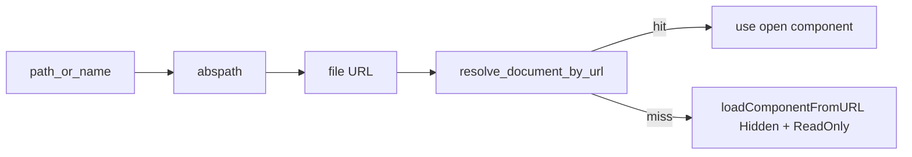
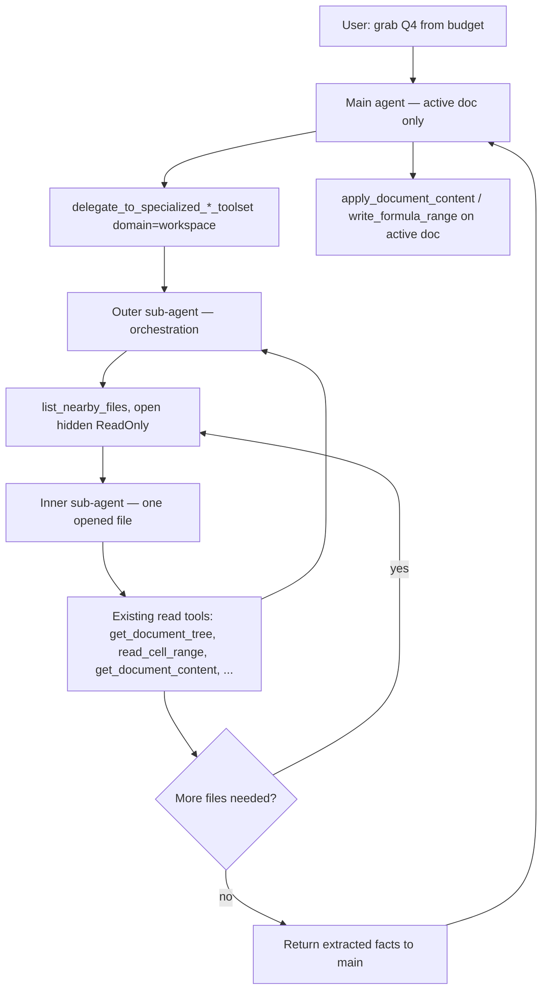
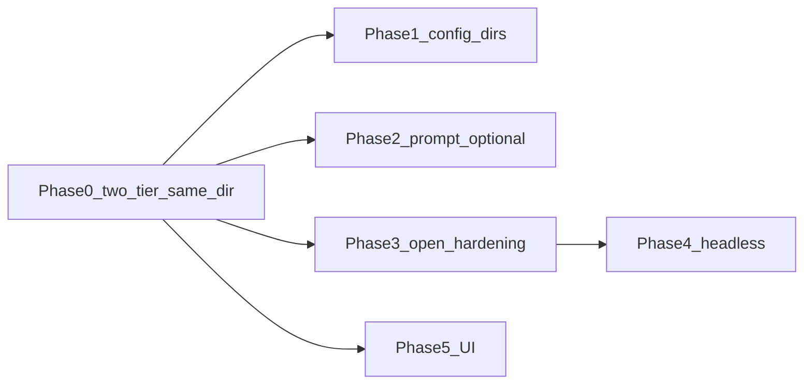

# Multi-Document Support — Development Plan

> **Terminology:** This doc uses **workspace** as a placeholder for “the set of files the agent can see and read.” The final product term is **TBD** (alternatives: project folder, document set, nearby files, etc.). Code and config keys may use `workspace_*` until we settle naming.

> **Living document:** Update this file as phases ship, decisions get made, or scope changes. Link PRs and topic docs from [Related docs](#related-docs) and the [Changelog](#changelog).

---

## Problem

Today WriterAgent is effectively **single-document**: chat resolves one LO model from the sidebar frame, injects `[DOCUMENT CONTENT]` for that doc only, and tools operate on `ToolContext.doc`. Users want cross-document workflows without typing full paths:

- “Grab the Q4 numbers from our budget spreadsheet and add them to this table.” (Writer **or** Calc as the active doc)
- “Pull slide 3 talking points from the deck into this Writer doc.”

Unlike a code repo with thousands of files, a typical office folder has **tens** of documents; **fuzzy names** (“budget 2026”) should resolve without exact filenames. The `@` mention UI is nice-to-have; **backend listing + read** matters more.

---

## MVP (Phase 0) — **shipped**

**Status:** Phase 0 is implemented in-tree (2026-05-17). Automated tests: [`test_nearby.py`](../tests/doc/test_nearby.py), [`test_nearby_specialized.py`](../tests/doc/test_nearby_specialized.py), [`test_nearby_uno.py`](../tests/doc/test_nearby_uno.py). Manual Calc acceptance (#1) still recommended before calling the feature “done” in production.

**Phase 0** provides same-directory discovery and cross-file **read** via **two-tier delegation**. Main adds only `workspace` to the existing delegate enum — no new core tools on main.

**User flow:** one `delegate_to_specialized_*_toolset(domain="workspace", task="…")` call → **outer** sub-agent lists/opens → **inner** sub-agent(s) read with production read tools → compact result to main → main writes **active** doc only.

- Same folder as the active saved document’s **parent directory** (no config dirs, no recursion).
- **Untitled** active doc: list from LibreOffice profile **Work** folder ([`get_work_directory`](../plugin/doc/nearby.py) via `com.sun.star.util.thePathSettings`); if that path is missing, fall back to other **open** LO file URLs only (see [Edge cases](#edge-cases-and-failure-modes)).
- Later phases add config directories, prompt injection, UI, headless, and polish — see [Phased implementation](#phased-implementation).

---

## Design principles

| Principle | Detail |
| --------- | ------ |
| **Same read tools, not main’s schema** | The **inner** sub-agent calls the same production read tools as today (`get_document_content`, `get_document_tree`, `search_in_document`, `get_sheet_summary`, `read_cell_range`, Draw read tools, …) via `ToolRegistry.execute` — not a parallel extractor. Main chat does **not** register those tools; it only has **core** tools plus `delegate_to_specialized_*_toolset`. **Discovery** (`list_nearby_files` on the **outer** agent) and **targeting** (open hidden/read-only, point `ToolContext.doc` at that model) live in the workspace domain. |
| **Read-only on other files** | Mutation tools apply to the **active** document only. Sibling files are opened **read-only**; write APIs are **not** exposed on those models in Phase 0 (see [Read-only enforcement](#read-only-enforcement) and [Open questions](#open-questions) #4). |
| **Writer + Calc + Draw** | Calc is first-class (budget → table). Draw/Impress: `list_pages` + shape/text tools where applicable. |
| **Active doc unchanged** | Cross-doc reads must not steal focus or mutate the user’s window; hidden open in the **same** LO process for Phase 0. |
| **Fresh contexts when tool sets change** | **Main chat** keeps one OpenAI-style history; don’t swap its wire tool schema mid-thread. **Sub-agents** are ephemeral task runs: focused tool context, compact result, smol runtime torn down afterward. |
| **Two-tier delegation** | Outer picks the file; **inner** gets read tools for **that** `doc_type`. See [Two-tier sub-agent model](#two-tier-sub-agent-model). |
| **Headless later** | Target: headless / separate process for large files by default; **defer** until in-process hidden path is solid (Phase 4). |

---

## Data contracts

### `FileEntry`

Listing tools return a consistent shape (TypedDict or dataclass in `plugin/doc/nearby.py`):

| Field | Type | Notes |
| ----- | ---- | ----- |
| `path` | `str` | Absolute local path |
| `name` | `str` | Basename |
| `url` | `str` | `file:///…` for LO + MCP parity |
| `modified` | `float` | mtime; used for newest-first sort |
| `size_bytes` | `int` | Optional; used in Phase 3+ large-file heuristic |
| `doc_type_guess` | `"writer"` \| `"calc"` \| `"draw"` \| `"unknown"` | From extension |
| `is_open` | `bool` | Desktop already has this URL |

**Exclude** the active document’s path from `list_nearby_files` results (do not offer “read self as sibling”).

### Extension allowlist

Single constant `NEARBY_FILE_EXTENSIONS` in [`plugin/doc/nearby.py`](../plugin/doc/nearby.py), referenced by tests:

**Include:** `.odt`, `.ott`, `.ods`, `.ots`, `.odp`, `.otp`, `.odg`, `.fodt`, `.fods`, `.fodp`

**Exclude by convention:** LibreOffice lock/temp files (`~$*`), `*.tmp`, `*.bak`, and non-LO extensions.

### `open_document_for_read(path | url) -> (model, doc_type)`

- [`resolve_document_by_url`](../plugin/doc/document_helpers.py) scans **already open** components only — it does **not** open closed files.
- New load props: **`Hidden=True`** and **`ReadOnly=True`** (today [`plugin/writer/format.py`](../plugin/writer/format.py) uses `Hidden` only for temp docs).
- If a sibling is already open **editable** in another window, reuse that component via URL match; inner agent still gets a **read-only allowlist** (schema enforcement, not LO mode alone).

### Fuzzy name matching (Phase 0)

MVP: basename **substring** filter on `list_nearby_files(filter=…)` plus **newest-first** bias when multiple matches (e.g. `Budget_2026.ods` vs `Budget_2025.ods`). No Levenshtein required for Phase 0.

---

## Architecture

**Phase 0 path:** main agent → **outer** workspace sub-agent → **inner** read-only sub-agent(s) → back to main for writes on the active doc only.

**Document resolution today:** sidebar uses `frame.getController().getModel()` ([`SendButtonListener._get_document_model`](../plugin/chatbot/panel.py)); MCP uses `X-Document-URL` + [`resolve_document_by_url`](../plugin/doc/document_helpers.py). Nearby reads add: filesystem path → file URL → match open component or `loadComponentFromURL`.

See [Threading / nested delegation](#threading--nested-delegation) for UNO thread rules.

---

## Tool API contract (in-process parity, read-only elsewhere)

**Main chat today:** sidebar exposes **core**-tier tools for the active doc plus one **`delegate_to_specialized_{writer|calc|draw}_toolset`** gateway per app. That delegate’s `domain` parameter is an enum of specialized domains (shapes, python, web_research, …) — not the specialized tools themselves. [`ToolRegistry.get_schemas`](../plugin/framework/tool.py) excludes `specialized` / `specialized_control` from the main wire list; specialized work runs in a sub-agent when `USE_SUB_AGENT` is on ([`DelegateToSpecializedBase`](../plugin/doc/specialized_base.py)).

**Multi-document extension:**

| Scope | APIs |
| ----- | ---- |
| **Active document** | Unchanged for **main** — same **core** read/write tools on `ToolContext.doc`, plus delegate gateway with **`workspace`** in the domain enum. |
| **Other files (workspace)** | **Same read tools** as in-process chat, invoked on a temporarily opened model (`Hidden` + `ReadOnly`). **Outer** exposes `list_nearby_files` and `delegate_read_document`. **No write tools** on sibling models unless we add a deliberate later feature. |

Implementation uses two nested smol runs (outer, then inner per file). Both call `ToolRegistry.execute` — no duplicate tool bodies.

Headless / out-of-process readers (Phase 4), when added, expose the **same logical read API** to the **inner** sub-agent; only the transport to LO changes.

**Phase 0 prompt:** Short description on the **delegate** gateway only — e.g. “Read other files in the same folder as this document via workspace delegation.”

---

## Two-tier sub-agent model

Cross-file reads use **two** ephemeral sub-agent runs (outer, then one or more inners). Sub-agents are **not** part of the user’s main chat history. The main agent keeps **the same wire tool list it has today** — **no new tools on main** beyond adding `workspace` to the delegate domain enum. Rationale: [Why two tiers](#why-two-tiers).

### Roles

| Layer | Responsibility | Tool surface |
| ----- | -------------- | ------------ |
| **Main agent** | User intent; edits **active** doc only. | **Core** tools on active `ToolContext.doc` + `delegate_to_specialized_{writer\|calc\|draw}_toolset` (domain enum includes **`workspace`**). No specialized-tier tools on main’s wire schema. |
| **Outer sub-agent** | Natural-language **task** from main. Lists nearby files, resolves names, calls **inner** per file, aggregates. | `list_nearby_files`, `delegate_read_document(path, task)`, `specialized_workflow_finished` / final answer. **No** `apply_*` / `write_*`. |
| **Inner sub-agent** | One run per opened file; `doc_type` known. | **Read tools for that type only** — Writer inner never sees `read_cell_range`; Calc inner never sees `get_document_tree`. Same production schemas; **no writes.** |

### Reference scenario

**User (on active report or sheet):** “Get Q4 numbers and put them in a table.”

| Step | Who | What happens |
| ---- | --- | ------------ |
| 1 | **Main** | Parses intent: read Q4 from a budget file; write table on **active** doc. Does **not** open siblings. |
| 2 | **Main** | `delegate_*(domain="workspace", task="Find Q4 numbers in the budget spreadsheet and return structured data")`. |
| 3 | **Outer** | `list_nearby_files(filter="budget")` → match candidates; newest-first bias. |
| 4 | **Outer** | `delegate_read_document(path, task)` — hidden read-only open → **inner** (e.g. “extract Q4 revenue”). |
| 5 | **Inner** | On Calc model: `get_sheet_summary` → `read_cell_range`. On Writer budget: `search_in_document` / `get_document_content`. Returns to **outer**; inner discarded. |
| 6 | **Outer** | Repeat step 4 if needed; aggregate; **final_answer** to main. |
| 7 | **Main** | `write_formula_range`, `apply_document_content`, etc. on **active** doc only. |

**Important:** Main issues **one** workspace delegation, then edits the active document with the returned payload.

### Shorter control-flow checklist

1. User: “Get Q4 numbers and put in a table.”
2. **Main** → delegate workspace with read task.
3. **Outer** → list → `delegate_read_document` → **inner** per file → aggregate → return to main.
4. **Main** → `write_*` / `apply_*` on **active** doc only.

### Why two tiers

**1. Within-session tool stability on main** — Sub-agents avoid mid-thread schema churn on main; results fold back as a single tool result.

**2. Right tools only after we know the file** — Inner allowlist depends on opened `doc_type` (`.ods` → Calc tools; `.odt` → Writer tools).

**3. Outer vs inner split** — Outer: discovery, open, multi-file loop, aggregate. Inner: one file, one modality.

**4. Multi-file orchestration** — Outer calls `delegate_read_document` separately per file before one return to main.

**5. Main stays lean** — Users who never use workspace pay **zero** extra tool-schema cost on main.

**6. Anti-pattern: read tools on main** — Pollutes the schema for everyone.

**Implementation note:** Same **gateway** pattern as `delegate_*(domain="shapes")`, but workspace adds a **nested** inner smol run via `delegate_read_document` (not a single-level domain like `python`’s tools). Infrastructure: [`DelegateToSpecializedBase`](../plugin/doc/specialized_base.py), [`build_toolcalling_agent`](../plugin/chatbot/smol_agent.py) — see [writer-specialized-toolsets.md](writer-specialized-toolsets.md) and [smol-main-chat-tool-architecture.md](smol-main-chat-tool-architecture.md).

### Handoff mechanism (implemented)

- [`DelegateReadDocument`](../plugin/doc/nearby_specialized.py): dedicated tool — **not** recursive `DelegateToSpecializedBase.execute`. Resolves name via [`resolve_path_or_name`](../plugin/doc/nearby.py), opens via [`open_document_for_read`](../plugin/doc/nearby.py) on the main thread (`execute_on_main_thread`).
- [`run_inner_read_agent`](../plugin/doc/nearby_specialized.py): builds `ToolContext(doc=opened_model, read_only_target=True, …)`; runs smol with `READ_TOOLS_BY_DOC_TYPE[doc_type]` + `specialized_workflow_finished`.
- Outer workspace sub-agent is still launched by [`DelegateToSpecializedBase`](../plugin/doc/specialized_base.py) with `active_domain="workspace"` (tools from [`nearby_tools.py`](../plugin/doc/nearby_tools.py) + `DelegateReadDocument`).
- Inner ends with `specialized_workflow_finished` / `final_answer`; outer accumulates and returns one payload to main.

---

## Registration (doc module)

Workspace is **cross-app**: active Writer may read a Calc `.ods` budget. Register on [`plugin/doc/`](../plugin/doc/) with **`specialized_cross_cutting = True`** (same pattern as [`RunVenvPythonScript`](../plugin/calc/venv_python.py)) so **Writer, Calc, and Draw** delegate gateways all expose `domain="workspace"`.

| Component | `tier` | `specialized_domain` | Notes |
| --------- | ------ | -------------------- | ----- |
| `list_nearby_files` | `specialized` | `workspace` | Outer agent only |
| `delegate_read_document` | `specialized` | `workspace` | Spawns inner smol; outer only |
| Inner read tools | — | — | **Not** a separate domain on main registry; allowlist inside `delegate_read_document` |

Gateway enum discovery: marker subclasses with `specialized_domain = "workspace"` on each app base — `ToolWriterWorkspaceBase`, `ToolCalcWorkspaceBase`, `ToolDrawWorkspaceBase` in [`writer/specialized_base.py`](../plugin/writer/specialized_base.py), [`calc/base.py`](../plugin/calc/base.py), [`draw/base.py`](../plugin/draw/base.py). Tools register once in [`plugin/doc/__init__.py`](../plugin/doc/__init__.py) via `auto_discover(nearby_tools, nearby_specialized)`.

---

## Read-only enforcement

Schema omission alone is insufficient; Phase 0 enforces at execution time:

1. **`ToolContext.read_only_target`** — set on the inner agent’s context in [`run_inner_read_agent`](../plugin/doc/nearby_specialized.py).
2. **Inner allowlist** — `READ_TOOLS_BY_DOC_TYPE` in [`nearby_specialized.py`](../plugin/doc/nearby_specialized.py); inner uses `registry.get_tools(..., names=allowlist)` — not `active_domain="workspace"` on the opened model.
3. **Defense in depth** — [`ToolRegistry.execute`](../plugin/framework/tool.py) returns `READ_ONLY_TARGET` when `ctx.read_only_target` and `tool.detects_mutation()`.

---

## Threading / nested delegation

| Layer | Thread | UNO |
| ----- | ------ | --- |
| Main tool loop | Main | Sync tools via `execute_safe` |
| Outer smol | Worker ([`DelegateToSpecializedBase.is_async`](../plugin/doc/specialized_base.py)) | List/open via `execute_on_main_thread` or async open tool |
| Inner smol | Same worker as outer | Read tools via `SmolToolAdapter(..., main_thread_sync=True)` → [`execute_on_main_thread`](../plugin/chatbot/smol_agent.py) |

**Phase 0 tests (implemented):**

- [`test_nearby_specialized.py`](../tests/doc/test_nearby_specialized.py): mock inner agent (no live LLM); `workspace` on all three delegates; `USE_SUB_AGENT=False` error; `READ_ONLY_TARGET` guard; outer workspace tool surface; `delegate_read_document` is not a delegate gateway recurse.
- [`test_nearby_uno.py`](../tests/doc/test_nearby_uno.py): hidden+read-only open; list excludes active file; inner path reads sibling via `read_cell_range` on opened model.
- `stop_checker` is copied from parent to inner `ToolContext` in `run_inner_read_agent`.

See [streaming-and-threading.md](streaming-and-threading.md).

---

## Reusing existing read tools (not new extractors)

The **inner** sub-agent calls production read tools via `ToolRegistry.execute`:

1. **Outer** resolves path / name from catalog.
2. **Outer** obtains UNO `model` via `open_document_for_read` (see [Data contracts](#data-contracts)).
3. **Inner** receives `ToolContext(doc=model, doc_type=…, read_only_target=True, ctx=…)`.
4. **Inner** invokes read tools only:

| Source doc type | Typical inner allowlist |
| --------------- | ----------------------- |
| **Writer** | `get_document_content` ([`content.py`](../plugin/writer/content.py)), `get_document_tree` ([`outline.py`](../plugin/writer/outline.py)), `search_in_document` |
| **Calc** | `get_sheet_summary` ([`sheets.py`](../plugin/calc/sheets.py)), `read_cell_range` ([`cells.py`](../plugin/calc/cells.py)) |
| **Draw / Impress** | `list_pages` ([`shapes.py`](../plugin/draw/shapes.py)), `get_draw_tree` ([`tree.py`](../plugin/draw/tree.py)) — see `READ_TOOLS_BY_DOC_TYPE` in [`nearby_specialized.py`](../plugin/doc/nearby_specialized.py) |

**Calc example:** User has `Q4_Report.odt` open → main delegates workspace → outer opens `Budget_2026.ods` → inner `get_sheet_summary` + `read_cell_range` → main `apply_document_content` on active doc.

**Large Writer docs:** Inner should prefer `get_document_tree` / `search_in_document` before full `get_document_content` (existing truncation limits apply).

---

## Edge cases and failure modes

| Case | Behavior |
| ---- | -------- |
| **Untitled / unsaved active doc** | **Implemented:** [`resolve_listing_directory`](../plugin/doc/nearby.py) uses LO profile **Work** path (`thePathSettings` → `Work`); if no directory, list other **open** LO documents only; if none, tool error with a clear message. |
| **Active file in directory listing** | Exclude self from `list_nearby_files`. |
| **Permission denied / I/O error** | Tool error with `details.path`. |
| **File modified on disk after open** | Phase 0: no cache; re-open on next delegate if needed. Phase 6 may add mtime-keyed metadata. |
| **Same path already open** | Reuse via `resolve_document_by_url`. |
| **Non-file URL** (`google-docs:`, etc.) | `get_document_path` → `None`; treat like untitled. |
| **Huge directory** | Cap list (e.g. 100 entries); set `truncated: true` in tool result. |
| **Sensitive neighbors** | Phase 1+ optional exclude globs (`.*`, `*.pem`, …) in config. |

---

## Scope boundaries

| Surface | Note |
| ------- | ---- |
| **Sidebar chat** | Primary target for workspace delegation. |
| **Menu “Chat with Document”** | No tool-calling today ([AGENTS.md](../AGENTS.md)) — workspace **not** supported until menu gains tools. |
| **`USE_SUB_AGENT = False`** | [`DelegateToSpecializedBase`](../plugin/doc/specialized_base.py) returns `WORKSPACE_REQUIRES_SUB_AGENT` for `domain="workspace"` (no in-place domain switch). |
| **Librarian mode** | No workspace reads until document mode (`switch_mode` / `switch_to_document_mode`). |
| **Extend / Edit selection** | Single-doc selection path; out of scope unless explicitly wired. |
| **Hermes ACP** | Defer; same registry tools if host exposes delegate gateway later. |

---

## Open questions

Record decisions here as we learn.

| # | Question | Notes |
| - | -------- | ----- |
| 1 | **Catalog in main system prompt?** | Option A: inject `[NEARBY FILES]` every turn. Option B: outer calls `list_*` when needed (**default for Phase 0**). Option C: hybrid when ≤N files or user mentions another doc. Revisit in Phase 2. |
| 2 | **Main vs sub-agent for multi-file tasks** | **Decision: two-tier delegation in Phase 0** — main only `delegate_*(domain="workspace", …)`; outer orchestrates; inner reads per file. Same **gateway** as `domain="shapes"`; unique **nested** inner smol via `delegate_read_document`. |
| 3 | **Untitled / unsaved active doc** | **Decision (Phase 0):** saved parent dir → else **Work** path → else open-docs-only list. Unit-tested (`test_get_work_directory`, `test_resolve_listing_directory_work_fallback`). |
| 4 | **Write-back to nearby files** | **Out of scope:** siblings read-only; writes on active doc only. |
| 5 | **Final naming** | `workspace_*` vs `nearby_*` vs `project_*` — align UI, config, prompts when chosen. |
| 6 | **Inner allowlist** | **Decision (Phase 0):** static `READ_TOOLS_BY_DOC_TYPE` in [`nearby_specialized.py`](../plugin/doc/nearby_specialized.py). |
| 7 | **Max files per list** | Cap (e.g. 100) — document in `list_nearby_files` result. |

---

## Phased implementation

Phases are incremental; each shippable with `make test`. Phase dependency:

### Phase 0 — Same-directory MVP (two-tier delegation) — **shipped**

**Goal:** End-to-end cross-file read from the active document’s parent directory (or Work / open-docs fallbacks).

**Main (unchanged wire shape):**

- `delegate_to_specialized_{writer|calc|draw}_toolset(domain="workspace", task="…")` only.
- No `list_nearby_files`, no read tools, no new core tools on main.
- Delegate gateway descriptions mention `domain=workspace` (Writer/Calc/Draw).
- **`USE_SUB_AGENT` must be on** for workspace (`WORKSPACE_REQUIRES_SUB_AGENT` otherwise).

**Outer sub-agent (`specialized_domain="workspace"`):**

- [`ListNearbyFiles`](../plugin/doc/nearby_tools.py) → [`list_nearby_files`](../plugin/doc/nearby.py): `NEARBY_FILE_EXTENSIONS`, newest first, exclude active path, optional `filter`, `truncated` when capped (default 100).
- [`DelegateReadDocument`](../plugin/doc/nearby_specialized.py): `path_or_name` + `task`; hidden+read-only open (or reuse open); spawns inner; returns `{ path, doc_type, result }`.
- `specialized_workflow_finished` / final answer to main (same as other specialized domains).

**Inner sub-agent (per opened file):**

- `READ_TOOLS_BY_DOC_TYPE` allowlist; [`run_inner_read_agent`](../plugin/doc/nearby_specialized.py).
- `ToolContext.doc` = opened model; `read_only_target=True` — see [read-only enforcement](#read-only-enforcement).
- One inner run per `delegate_read_document` call; discarded after return.

**Library ([`plugin/doc/nearby.py`](../plugin/doc/nearby.py)):**

- `FileEntry`, `NEARBY_FILE_EXTENSIONS`, `get_document_directory`, `get_work_directory`, `resolve_listing_directory`, `list_nearby_files`, `resolve_path_or_name`, `open_document_for_read`, `guess_doc_type_from_path`.

**Module wiring:** [`plugin/doc/__init__.py`](../plugin/doc/__init__.py) `auto_discover` for `nearby_tools` and `nearby_specialized`. No new keys in [`module.yaml`](../plugin/doc/module.yaml).

**Out of scope Phase 0:** config directories, `[NEARBY FILES]` prompt injection, `@` UI, headless, metadata cache, write-back to siblings.

**Done when:**

- [ ] Calc acceptance scenario #1 (Q4 budget) passes manually (recommended before release notes).
- [x] `make test` / pytest green: [`test_nearby.py`](../tests/doc/test_nearby.py), [`test_nearby_specialized.py`](../tests/doc/test_nearby_specialized.py).
- [x] UNO: hidden open, list excludes self, sibling read via `read_cell_range` — [`test_nearby_uno.py`](../tests/doc/test_nearby_uno.py).
- [ ] Active window focus unchanged after cross-file read (manual check).

---

### Phase 1 — Config-expanded directories — **deferred (low priority)**

> **Status (2026-05-17):** Deferred. Phase 0 (same-folder / two-tier workspace) is sufficient for now. Revisit when users need folders outside the active document’s parent (e.g. shared project drive). A draft implementation plan exists in `.cursor/plans/` but is not scheduled.

**Goal:** User-configured extra roots beyond same-folder listing.

- Config key: `workspace_extra_directories` (JSON array of absolute paths) — name TBD per open question #5.
- `list_nearby_files` merges: active doc’s parent dir + configured dirs, deduped, newest-first.
- Settings UI: text field in [`dialog_views.py`](../plugin/chatbot/dialog_views.py) / manifest registry (see [`config.py`](../plugin/framework/config.py)).
- **Tests:** merge, dedupe, invalid path handling.

**Done when:**

- [ ] Config round-trip and listing merge covered by unit tests.
- [ ] Optional exclude globs for sensitive filenames (see edge cases).

---

### Phase 2 — Prompt integration (optional / gated)

**Goal:** Model may see filenames without calling `list_*` first.

- Compact `[NEARBY FILES]` in [`panel.py`](../plugin/chatbot/panel.py) or via [`get_document_context_for_chat`](../plugin/doc/document_helpers.py) — cap separately from 8k doc context (e.g. 50 files / 2000 chars); consider `chat_context_length` config.
- Guidance in [`constants.py`](../plugin/framework/constants.py) templates, gated by config flag default **off**.
- Re-evaluate open question #1 after measuring token use.

**Done when:**

- [ ] Prompt snapshot tests; flag off by default.

---

### Phase 3 — Hidden open hardening

**Goal:** Reliable in-process opens without disturbing the user.

- Weakref cache of hidden models per path; close after read or idle timeout.
- Size heuristic: small files in-process; threshold for “large” (log/warn only until Phase 4).
- UNO tests: Writer, Calc, Draw/Impress samples.
- Verify **`ToolContext.doc`** scoping between active and opened models (not `DocumentCache` — inactive in codebase).

**Done when:**

- [ ] UNO tests for cache lifecycle and multi-doc isolation.

---

### Phase 4 — Headless / separate process (deferred)

**Goal:** Large files do not block the UI LO instance.

- Persistent or one-shot `soffice --headless` with separate user profile (`--env:UserInstallation=...`).
- Worker script or UNO bridge; [`AsyncProcess`](../plugin/framework/process_manager.py) for lifecycle.
- Default to headless for non-small docs once stable; fallback to in-process hidden open on failure.
- Inner sub-agent API unchanged; transport only.

**Done when:**

- [ ] Large-file scenario does not block main LO UI thread.

---

### Phase 5 — UI: `@` mentions and pickers (deferred)

**Goal:** Discoverability; not required for core behavior.

- [`QueryKeyListener`](../plugin/chatbot/panel.py): `@` triggers filtered list; button + `FilePicker` acceptable MVP.
- Insert token or pass selected path into send pipeline.
- See [chat-sidebar-implementation.md](chat-sidebar-implementation.md).

**Done when:**

- [ ] Manual UI checklist completed.

---

### Phase 6 — Polish

**Goal:** Performance, MCP clarity, optional integrations.

- Metadata cache (title, headings, sheet names) keyed by path + mtime — SQLite optional.
- **MCP** (see below).
- Recent LO documents list — if worth the coupling.
- Drag-and-drop onto chat.

**Done when:**

- [ ] MCP cross-doc path documented and tested.

#### MCP (Phase 6)

- **Active document:** unchanged — `X-Document-URL` on [`mcp_protocol.py`](../plugin/mcp/mcp_protocol.py).
- **Nearby reads:** path or `url` in tool args / delegate task; **do not** retarget `X-Document-URL` to sibling files.
- **Tool surface:** same as sidebar — workspace via `delegate_to_specialized_*_toolset(domain="workspace", …)`, not dozens of new MCP tool names ([mcp-protocol.md](mcp-protocol.md) specialized-tier policy).
- **Test:** [`test_mcp_server.py`](../plugin/tests/mcp/test_mcp_server.py) — workspace delegate with header pointing at active Writer doc.

---

## Calc-specific scenarios (acceptance checks)

Use these to validate design and tests (Phase 0 targets #1–#5):

1. **Active Calc, read sibling Calc:** main delegates → outer lists/opens budget → inner `read_cell_range` → outer returns figures → main `write_formula_range` on active sheet.
2. **Active Calc, read sibling Writer:** inner `get_document_content` on brief → main `insert_cell_html` / `write_formula_range`.
3. **Active Writer, read sibling Calc:** inner `get_sheet_summary` + `read_cell_range` → main `apply_document_content`.
4. **Multiple budgets:** outer `list_nearby_files(filter="budget")`, disambiguate, optionally run inner twice before returning to main.
5. **Formula semantics:** main respects Calc `;` separator rules ([`CALC_FORMULA_SYNTAX`](../plugin/framework/constants.py)) when writing active sheet only.

---

## Writer / Draw scenarios (acceptance checks)

1. **Outline-first:** `get_document_tree` on nearby `.odt` before full read for long docs.
2. **Search:** `search_in_document` on nearby file for “Q4” instead of full HTML dump.
3. **Draw/Impress:** Nearby `.odp` → `list_pages` + text extraction; insert into active Writer/Calc via main write tools.

---

## Files and entry points

### Phase 0 (shipped)

| Area | Path |
| ---- | ---- |
| Catalog + hidden open | [`plugin/doc/nearby.py`](../plugin/doc/nearby.py) |
| Outer tools | [`plugin/doc/nearby_tools.py`](../plugin/doc/nearby_tools.py) — `list_nearby_files` |
| Inner + `delegate_read_document` | [`plugin/doc/nearby_specialized.py`](../plugin/doc/nearby_specialized.py) |
| Module `auto_discover` | [`plugin/doc/__init__.py`](../plugin/doc/__init__.py) |
| Domain enum markers | [`plugin/writer/specialized_base.py`](../plugin/writer/specialized_base.py) (`ToolWriterWorkspaceBase`), [`plugin/calc/base.py`](../plugin/calc/base.py), [`plugin/draw/base.py`](../plugin/draw/base.py) |
| Delegate gateway + workspace guard | [`plugin/doc/specialized_base.py`](../plugin/doc/specialized_base.py) |
| `read_only_target` + registry guard | [`plugin/framework/tool.py`](../plugin/framework/tool.py) |
| Unit tests | [`plugin/tests/doc/test_nearby.py`](../tests/doc/test_nearby.py), [`test_nearby_specialized.py`](../tests/doc/test_nearby_specialized.py) |
| UNO tests | [`plugin/tests/doc/test_nearby_uno.py`](../tests/doc/test_nearby_uno.py) |

### Later phases

| Area | Path |
| ---- | ---- |
| Config keys (Phase 1+) | [`plugin/framework/config.py`](../plugin/framework/config.py), [`manifest_registry.py`](../scripts/manifest_registry.py) |
| Document path / URL | [`plugin/doc/document_helpers.py`](../plugin/doc/document_helpers.py) |
| Chat context / prompts (Phase 2) | [`plugin/chatbot/panel.py`](../plugin/chatbot/panel.py), [`plugin/framework/constants.py`](../plugin/framework/constants.py) |
| Tool loop | [`plugin/chatbot/tool_loop.py`](../plugin/chatbot/tool_loop.py) |
| MCP (Phase 6) | [`plugin/mcp/mcp_protocol.py`](../plugin/mcp/mcp_protocol.py) |

---

## Test strategy

| Phase | Unit | UNO / integration |
| ----- | ---- | ----------------- |
| **0** | [`test_nearby.py`](../tests/doc/test_nearby.py): scandir, extensions, sort, exclude self, filter, truncate, Work-path fallback | [`test_nearby_uno.py`](../tests/doc/test_nearby_uno.py): hidden+read-only open; list; sibling `read_cell_range` |
| **0** | [`test_nearby_specialized.py`](../tests/doc/test_nearby_specialized.py): `workspace` on all delegates; mock inner; read-only guard; no gateway recurse | — |
| **1** | Config merge, dedupe | — |
| **2** | Prompt snapshot / max length | — |
| **3** | — | Cache, close-on-idle, Writer/Calc/Draw samples; `ToolContext.doc` isolation |
| **4** | — | Optional subprocess mocks |
| **5** | — | Manual UI checklist |
| **6** | Metadata cache | MCP workspace delegate test |

Per [AGENTS.md](../AGENTS.md): matching `test_*.py` names; run `make test` before calling a phase done.

---

## Related docs

- [chat-sidebar-implementation.md](chat-sidebar-implementation.md) — frame-bound doc, send pipeline
- [smol-main-chat-tool-architecture.md](smol-main-chat-tool-architecture.md) — sub-agents, tool loop
- [writer-specialized-toolsets.md](writer-specialized-toolsets.md) — nested delegation, gateway pattern
- [streaming-and-threading.md](streaming-and-threading.md) — main-thread UNO, queue drain
- [calc-specialized-toolsets.md](calc-specialized-toolsets.md) — Calc tool surface
- [mcp-protocol.md](mcp-protocol.md) — `X-Document-URL`, MCP tool policy
- [agent-search.md](agent-search.md) — external fetch (contrast with nearby files)

---

## Changelog

| Date | Phase / change | PR / notes |
| ---- | -------------- | ---------- |
| 2026-05-17 | **Phase 0 shipped:** `nearby.py`, `nearby_tools.py`, `nearby_specialized.py`; `workspace` on Writer/Calc/Draw delegates; two-tier smol (outer list/delegate_read, inner `READ_TOOLS_BY_DOC_TYPE`); `ToolContext.read_only_target` + `READ_ONLY_TARGET`; untitled → Work path then open-docs fallback; tests in `tests/doc/test_nearby*.py` | — |
| *(prior)* | Plan refresh: Phase 0 = full two-tier delegation; phases renumbered 0–6; data contracts, threading, edge cases | — |

---
